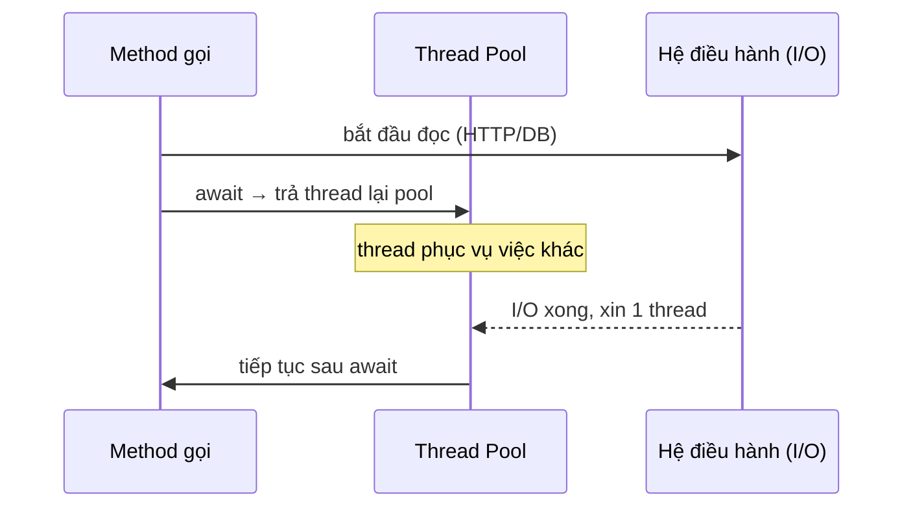

# async/await & Task: lập trình bất đồng bộ đúng cách

!!! info "Bạn đang ở đây · P1 → node `p1-async`"
    **cần trước:** bộ nhớ & kiểu dữ liệu (value vs reference), đã chạy được `dotnet run`.
    **mở khoá sau bài này:** ef core (truy vấn bất đồng bộ), asp.net core (handler async), gọi api ai bằng http.
    ⏱️ Fast path ~30 phút · Deep dive cuối bài (tuỳ chọn, không bắt buộc).

> **Mục tiêu (đo được):** Sau bài này bạn **áp dụng** đúng `async`/`await` cho tác vụ I/O, **giải thích** được vì sao `await` giải phóng thread thay vì tạo thread mới, và **loại bỏ** ba lỗi kinh điển: `async void`, `.Result`/`.Wait()`, và tuần tự hoá nhầm khi chờ nhiều tác vụ.

---

## 0. Kiểm tra trước (30 giây) — bạn đoán mất bao lâu?

Hai đoạn dưới đều "chờ" 3 việc, mỗi việc `Task.Delay(1000)` (1 giây). Đoạn A chờ lần lượt, đoạn B chờ song song bằng `WhenAll`. **Tự đoán** tổng thời gian mỗi đoạn *trước khi* đọc tiếp.

```text title="Kết quả"
A:  await Delay1s; await Delay1s; await Delay1s;
B:  await Task.WhenAll(Delay1s, Delay1s, Delay1s);
```

??? question "Đáp án (bấm để mở sau khi đã đoán)"
    - A ≈ **3 giây**: mỗi `await` chỉ khởi động task *kế tiếp* sau khi task trước hoàn tất → tuần tự.
    - B ≈ **1 giây**: cả ba `Task.Delay` được khởi động *cùng lúc* rồi mới `await WhenAll` → chúng chạy chồng thời gian.
    - Điểm mấu chốt: bất đồng bộ (async) ≠ song song (parallel). Muốn chồng thời gian phải **khởi động task rồi mới await**.

---

## 1. Ý niệm cốt lõi

`Task` là **lời hứa (promise) về một kết quả sẽ có trong tương lai**. `Task` không trả giá trị; `Task<T>` hứa trả một `T`. Từ khoá `await` nói với runtime: *"tạm dừng phương thức này ở đây, trả thread về pool, và khi task xong thì tiếp tục từ đúng chỗ này."*

Điều quan trọng nhất: với I/O (đọc file, gọi HTTP, truy vấn DB), **không có thread nào đứng chờ**. Trong lúc chờ mạng/đĩa, thread được trả lại thread pool để phục vụ request khác. Đây là lý do async giúp server chịu tải cao — chứ không phải vì nó chạy nhanh hơn một tác vụ đơn lẻ.

| Khái niệm | Ý nghĩa | Khi nào dùng |
|---|---|---|
| `Task` | Hứa "sẽ xong", không có kết quả | tác vụ async không trả giá trị |
| `Task<T>` | Hứa "sẽ xong và trả về `T`" | tác vụ async trả giá trị |
| `async` | Đánh dấu method có thể chứa `await` | mọi method chờ I/O |
| `await` | Tạm dừng, trả thread, tiếp tục khi xong | điểm chờ trong method async |
| `Task.WhenAll` | Chờ *tất cả* task xong | fan-out nhiều I/O độc lập |
| `Task.WhenAny` | Chờ task *đầu tiên* xong | timeout, đua (race), lấy nhanh nhất |
| `CancellationToken` | Tín hiệu "hãy dừng sớm" | huỷ khi timeout/user rời trang |



!!! danger "Đính chính hiểu lầm phổ biến"
    "async/await tạo thread mới cho mỗi tác vụ" — **SAI**. Với I/O, không thread nào bị chiếm trong lúc chờ; hoàn tất được báo bằng cơ chế callback của OS. `async` không đồng nghĩa với đa luồng. Nếu bạn cần chạy CPU nặng trên thread khác, đó là việc của `Task.Run`, không phải bản thân `await`.

---

## 2. Ví dụ mẫu: tuần tự so với WhenAll

```csharp title="async_demo.cs"
// test:run
using System.Diagnostics;

async Task<int> LayDuLieu(int id, int msTre)
{
    await Task.Delay(msTre);   // giả lập I/O (gọi mạng/DB), KHÔNG chiếm thread
    return id * 10;
}

// (A) Tuần tự: mỗi await chờ xong rồi mới sang cái kế
var swA = Stopwatch.StartNew();
int a1 = await LayDuLieu(1, 300);
int a2 = await LayDuLieu(2, 300);
int a3 = await LayDuLieu(3, 300);
swA.Stop();
Console.WriteLine($"Tuần tự: tổng={a1 + a2 + a3}, ~{swA.ElapsedMilliseconds / 100 * 100}ms");

// (B) Song song thời gian: khởi động cả ba TRƯỚC, rồi WhenAll
var swB = Stopwatch.StartNew();
Task<int> t1 = LayDuLieu(1, 300);
Task<int> t2 = LayDuLieu(2, 300);
Task<int> t3 = LayDuLieu(3, 300);
int[] ket_qua = await Task.WhenAll(t1, t2, t3);
swB.Stop();
Console.WriteLine($"WhenAll: tổng={ket_qua.Sum()}, ~{swB.ElapsedMilliseconds / 100 * 100}ms");
```

Output kỳ vọng (thời gian làm tròn xuống hàng trăm ms, có thể lệch chút tuỳ máy):

```text title="Kết quả"
Tuần tự: tổng=60, ~900ms
WhenAll: tổng=60, ~300ms
```

Cùng một khối lượng việc: tuần tự tốn ~900ms (300×3), còn `WhenAll` chỉ ~300ms vì ba `Task.Delay` chồng thời gian nhau.

---

## 3. Bài tập có giàn giáo

Viết hàm `TaiTatCa` nhận danh sách id, gọi `LayTrang(id)` (mỗi lần `await Task.Delay(200)` rồi trả `$"trang-{id}"`) cho *tất cả* id **song song thời gian**, và trả về mảng kết quả theo đúng thứ tự đầu vào.

```csharp title="bai_tap.cs"
// test:skip giàn giáo cho học viên tự điền
async Task<string> LayTrang(int id) { /* await Delay 200, trả "trang-{id}" */ }

async Task<string[]> TaiTatCa(int[] ids)
{
    // GỢI Ý: dùng Select để tạo IEnumerable<Task<string>>, rồi Task.WhenAll
    // TODO: điền vào đây
}
```

??? success "Lời giải + giải thích"
    ```csharp title="loi_giai.cs"
    // test:run
    async Task<string> LayTrang(int id)
    {
        await Task.Delay(200);
        return $"trang-{id}";
    }

    async Task<string[]> TaiTatCa(int[] ids)
    {
        // Select trả về IEnumerable<Task<string>>: MỖI phần tử là 1 task ĐÃ khởi động
        IEnumerable<Task<string>> cacTask = ids.Select(id => LayTrang(id));
        // WhenAll giữ nguyên thứ tự tương ứng với thứ tự task truyền vào
        return await Task.WhenAll(cacTask);
    }

    string[] kq = await TaiTatCa(new[] { 1, 2, 3 });
    Console.WriteLine(string.Join(", ", kq));
    // In ra: trang-1, trang-2, trang-3   (mất ~200ms, không phải 600ms)
    ```

    **Vì sao đúng:** `Select` khởi động cả ba task ngay khi duyệt (do `LayTrang` chạy tới `await` đầu tiên rồi trả `Task`). `WhenAll` chờ tất cả và **bảo toàn thứ tự** theo mảng task đầu vào, nên kết quả khớp thứ tự id. Nếu bạn `await` bên trong vòng `foreach` thay vì gom task, nó sẽ trở thành tuần tự (~600ms).

---

## 4. Cạm bẫy phải tránh

!!! danger "Ba lỗi làm hỏng ứng dụng thật"
    - **`async void`**: exception ném ra *không thể bắt* bằng `try/catch` ở nơi gọi → crash tiến trình. Chỉ dùng cho event handler UI. Mọi trường hợp khác: trả `Task` hoặc `Task<T>`.
    - **`.Result` / `.Wait()`**: chặn (block) thread hiện tại để chờ task. Trong web/UI có SynchronizationContext, việc này gây **deadlock**; trong mọi ngữ cảnh nó gây **thread-pool starvation** (thread bị giam để chờ, pool cạn thread). Luôn `await`, đừng block.
    - **Nuốt `CancellationToken`**: nhận token nhưng không truyền xuống lớp dưới → tác vụ không bao giờ huỷ được khi request bị huỷ.

Quy tắc thực dụng: **"async cả đường" (async all the way)** — một khi có `await`, hãy để `Task` lan lên tận đỉnh; đừng cắt ngang bằng `.Result`.

**CancellationToken (khái niệm):** một `CancellationToken` là *tín hiệu hợp tác* để yêu cầu dừng sớm. Bạn nhận nó làm tham số cuối và truyền vào các lời gọi async (`await Task.Delay(1000, ct)`, `httpClient.GetAsync(url, ct)`). Khi token bị huỷ, các API đó ném `OperationCanceledException`. "Hợp tác" nghĩa là code phải *chủ động* kiểm tra/truyền token — runtime không tự ép dừng.

```csharp title="whenany_timeout.cs"
// test:run
async Task<string> GoiApiCham() { await Task.Delay(2000); return "xong"; }

Task<string> viec = GoiApiCham();
Task hetGio = Task.Delay(500);

Task xongTruoc = await Task.WhenAny(viec, hetGio);
Console.WriteLine(xongTruoc == viec ? "Có kết quả" : "Timeout: quá 500ms");
// In ra: Timeout: quá 500ms
```

`WhenAny` trả về *task đầu tiên hoàn tất*, là mẫu kinh điển để làm timeout mà không block thread.

---

## Tự kiểm tra

1. Vì sao `await` một tác vụ I/O **không** làm phát sinh thread mới?

    ??? note "Đáp án"
        Trong lúc chờ I/O, thread được trả về thread pool; hoàn tất được OS báo qua callback. Không thread nào đứng chờ, nên không cần thread mới.

2. Đoạn `await A(); await B();` với A và B mỗi cái mất 1s thì tổng ~bao lâu, và sửa thế nào để còn ~1s?

    ??? note "Đáp án"
        ~2 giây (tuần tự). Sửa: khởi động cả hai trước `var ta = A(); var tb = B();` rồi `await Task.WhenAll(ta, tb);` → ~1 giây.

3. Vì sao nên tránh `task.Result` trong web app?

    ??? note "Đáp án"
        Nó block thread để chờ, gây deadlock (khi có SynchronizationContext) hoặc thread-pool starvation. Dùng `await`.

4. Khi nào dùng `WhenAny` thay vì `WhenAll`?

    ??? note "Đáp án"
        Khi chỉ cần *task đầu tiên xong*: timeout, đua giữa nhiều nguồn, lấy phản hồi nhanh nhất. `WhenAll` chờ *tất cả*.

5. `async void` sai ở chỗ nào, ngoại lệ duy nhất được phép là gì?

    ??? note "Đáp án"
        Exception từ `async void` không bắt được ở nơi gọi → crash. Chỉ chấp nhận cho event handler UI; mọi chỗ khác trả `Task`/`Task<T>`.

---

??? abstract "DEEP DIVE (nâng cao, không thuộc fast path)"
    **State machine:** trình biên dịch biến mỗi method `async` thành một *state machine*. Mỗi `await` là một điểm dừng (state); phần code sau `await` trở thành continuation được lập lịch khi task xong. Đây là lý do biến cục bộ vẫn "sống" qua `await` — chúng được nâng thành field của struct state machine.

    **ConfigureAwait(false):** trong thư viện (library) không cần quay lại context ban đầu, `await xxx.ConfigureAwait(false)` cho phép tiếp tục trên bất kỳ thread pool nào, giảm nguy cơ deadlock và tăng throughput. Trong ASP.NET Core hiện đại không có SynchronizationContext nên ít quan trọng hơn, nhưng vẫn là thói quen tốt cho code thư viện dùng chung.

    **ValueTask<T>:** khi một method async *thường* trả kết quả đồng bộ (ví dụ có cache hit), `ValueTask<T>` tránh cấp phát một object `Task` trên heap mỗi lần gọi — hữu ích cho hot path hiệu năng cao. Đánh đổi: không được `await` một `ValueTask` hai lần.

    **`Task.Run` vs `await`:** `await` dành cho I/O (không tốn thread khi chờ). `Task.Run` đẩy công việc **CPU nặng** sang một thread pool khác để không chặn thread hiện tại. Đừng bọc I/O bằng `Task.Run` — vô ích và tốn thêm một thread.

Tiếp theo -> ef core: truy vấn dữ liệu bất đồng bộ
