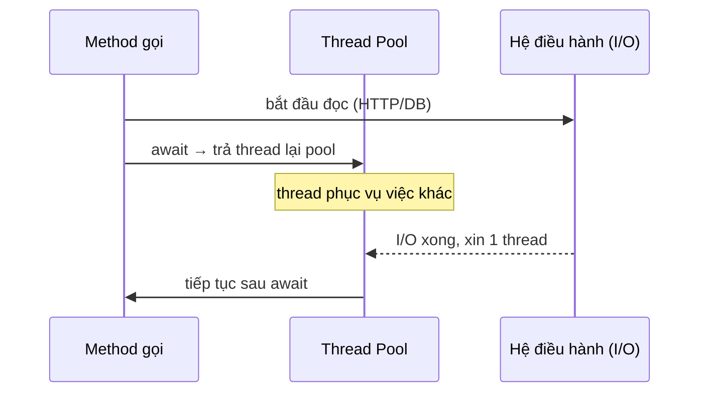

# async/await & Task: lập trình bất đồng bộ đúng cách

!!! info "Bạn đang ở đây · P1 → node `p1-async`"
    **cần trước:** bộ nhớ & kiểu dữ liệu (value vs reference), đã chạy được `dotnet run`.
    **mở khoá sau bài này:** ef core (truy vấn bất đồng bộ), asp.net core (handler async), gọi api ai bằng http.
    ⏱️ Fast path ~30 phút · Deep dive cuối bài (tuỳ chọn, không bắt buộc).

> **Mục tiêu (đo được):** Sau bài này bạn **áp dụng** đúng `async`/`await` cho tác vụ I/O, **giải thích** được vì sao `await` giải phóng thread thay vì tạo thread mới, và **loại bỏ** ba lỗi kinh điển: `async void`, `.Result`/`.Wait()`, và tuần tự hoá nhầm khi chờ nhiều tác vụ.

---

## 0. Kiểm tra trước (30 giây) — bạn đoán mất bao lâu?

Hai đoạn dưới đều "chờ" 3 việc, mỗi việc `Task.Delay(1000)` (1 giây). Đoạn A chờ lần lượt, đoạn B chờ song song bằng `WhenAll`. **Tự đoán** tổng thời gian mỗi đoạn *trước khi* đọc tiếp.

```text title="Kết quả"
A:  await Delay1s; await Delay1s; await Delay1s;
B:  await Task.WhenAll(Delay1s, Delay1s, Delay1s);
```

??? question "Đáp án (bấm để mở sau khi đã đoán)"
    - A ≈ **3 giây**: mỗi `await` chỉ khởi động task *kế tiếp* sau khi task trước hoàn tất → tuần tự.
    - B ≈ **1 giây**: cả ba `Task.Delay` được khởi động *cùng lúc* rồi mới `await WhenAll` → chúng chạy chồng thời gian.
    - Điểm mấu chốt: bất đồng bộ (async) ≠ song song (parallel). Muốn chồng thời gian phải **khởi động task rồi mới await**.

---

## 1. `Task`: lời hứa về một việc sẽ xong

**Định nghĩa:** `Task` là một đối tượng đại diện cho *một công việc đang chạy (hoặc sẽ chạy) và sẽ hoàn tất trong tương lai*, không mang theo giá trị kết quả.

> Ghi chú: ví dụ dưới đây mượn tạm cú pháp `async`/`await` để minh hoạ `Task` — hai từ khoá này được dạy đầy đủ ở mục 3 và mục 4, tạm chấp nhận dùng trước.

```csharp title="task_toi_thieu.cs"
// test:run
async Task ChaoSauMotGiay()
{
    await Task.Delay(1000);
    Console.WriteLine("Xong việc!");
}

await ChaoSauMotGiay();
```

Nếu bạn quên `await` và chỉ gọi `ChaoSauMotGiay();` suông, chương trình **không báo lỗi biên dịch** nhưng có thể kết thúc trước khi dòng "Xong việc!" kịp in ra — vì method tiếp tục chạy nền trong khi phần code sau nó đã chạy tiếp (đây là lỗi hành vi "fire-and-forget", không phải lỗi biên dịch).

---

## 2. `Task<T>`: lời hứa kèm theo một giá trị

**Định nghĩa:** `Task<T>` là một `Task` nhưng khi hoàn tất sẽ mang theo một giá trị kiểu `T`, lấy được bằng `await`.

> Ghi chú: ví dụ dưới đây vẫn mượn tạm `async`/`await` (dạy đầy đủ ở mục 3-4) để minh hoạ `Task<T>` — tạm chấp nhận dùng trước.

```csharp title="task_generic_toi_thieu.cs"
// test:run
async Task<int> LayTuoi()
{
    await Task.Delay(500);
    return 25;
}

int tuoi = await LayTuoi();
Console.WriteLine($"Tuổi: {tuoi}");
```

**Dùng sai — quên `await`:** nếu viết `Task<int> tuoi = LayTuoi();` rồi đem `tuoi` đi cộng trừ như một `int`, trình biên dịch báo lỗi vì `Task<int>` không phải `int`:

```csharp title="quen_await.cs"
// test:skip minh hoạ lỗi biên dịch CS0019
async Task<int> LayTuoi()
{
    await Task.Delay(500);
    return 25;
}

Task<int> tuoi = LayTuoi();
int namSau = tuoi + 5; // CS0019: Operator '+' cannot be applied to operands of type 'Task<int>' and 'int'
```

Bạn nhận được *đối tượng `Task<int>`* (cái "hứa"), không phải giá trị `25` (cái "kết quả") — phải `await` để mở lời hứa ra lấy giá trị bên trong.

---

## 3. `async`: đánh dấu method được phép chứa `await`

**Định nghĩa:** `async` là từ khoá đặt trước method để cho phép method đó dùng `await` bên trong, và bảo trình biên dịch tự tạo ra một state machine chạy bất đồng bộ.

```csharp title="async_toi_thieu.cs"
// test:run
async Task ChayViDu()
{
    await Task.Delay(300);
    Console.WriteLine("Đã đợi 300ms rồi in ra dòng này");
}

await ChayViDu();
```

Một method không có `async` thì không được phép chứa `await` — xem mục 4 để thấy lỗi biên dịch cụ thể.

**Dùng sai — `async void` khi nơi gọi cần `await` kết quả:** nếu method `async` trả `void` thay vì `Task`, nơi gọi **không thể `await`** nó — trình biên dịch báo lỗi vì `void` không có gì để chờ:

```csharp title="async_void_khong_await_duoc.cs"
// test:skip minh hoạ lỗi biên dịch CS4008 (không thể await kiểu void)
async void ChayViDuSai() // SAI: nên trả Task, không phải void
{
    await Task.Delay(300);
    Console.WriteLine("Đã đợi 300ms rồi in ra dòng này");
}

await ChayViDuSai(); // CS4008: Cannot await 'void'
```

Chỉ trả `Task`/`Task<T>` thì nơi gọi mới `await` được để biết khi nào việc xong (và bắt được exception nếu có — xem thêm hậu quả nghiêm trọng hơn của `async void` ở mục Cạm bẫy).

---

## 4. `await`: điểm tạm dừng chờ Task hoàn tất

**Định nghĩa:** `await` là từ khoá đặt trước một `Task`/`Task<T>` để tạm dừng method tại đó, trả thread về pool, và tiếp tục chạy phần còn lại khi task xong.

```csharp title="await_toi_thieu.cs"
// test:run
async Task InLoiChao()
{
    await Task.Delay(200);
    Console.WriteLine("Chào bạn, sau 200ms");
}

await InLoiChao();
```

**Dùng sai — `await` trong method không `async`:** trình biên dịch báo lỗi **CS4033**.

```csharp title="await_khong_async.cs"
// test:skip minh hoạ lỗi biên dịch CS4033
void ChayViDu()
{
    await Task.Delay(200); // CS4033: The 'await' operator can only be used within an async method. Consider marking this method with the 'async' modifier and changing its return type to 'Task'.
    Console.WriteLine("Sẽ không bao giờ tới đây vì lỗi biên dịch");
}
```

Muốn dùng `await`, method chứa nó bắt buộc phải có `async` (và trả `Task`, `Task<T>`, hoặc — chỉ cho event handler UI — `void`, xem mục Cạm bẫy).

---

## 5. `CancellationToken`: tín hiệu hợp tác để dừng sớm

**Định nghĩa:** `CancellationToken` là một đối tượng đại diện cho tín hiệu "hãy dừng sớm", được truyền vào các API async để chúng biết khi nào nên huỷ giữa chừng.

```csharp title="cancellationtoken_toi_thieu.cs"
// test:run
using var cts = new CancellationTokenSource();
cts.CancelAfter(300); // sau 300ms, phát tín hiệu huỷ

try
{
    await Task.Delay(2000, cts.Token); // truyền token vào đây
    Console.WriteLine("Chạy xong bình thường");
}
catch (OperationCanceledException)
{
    Console.WriteLine("Đã bị huỷ trước khi kịp xong");
}
```

**Dùng sai — quên truyền `ct` khiến `Cancel()` vô tác dụng:** nếu bạn tạo `CancellationTokenSource`, gọi `Cancel()`, nhưng *không* đưa `token` vào lời gọi async bên trong, task vẫn chạy tới cùng như chưa có gì xảy ra:

```csharp title="quen_truyen_token.cs"
// test:run
using var cts = new CancellationTokenSource();
cts.CancelAfter(100);

// SAI: Task.Delay không nhận token, nên Cancel() không có tác dụng gì lên nó
await Task.Delay(500); // KHÔNG truyền cts.Token
Console.WriteLine("Vẫn chạy đủ 500ms dù đã Cancel ở 100ms — token bị 'nuốt'");
```

"Hợp tác" nghĩa là chính code async phải *chủ động* nhận và truyền `token` xuống — runtime không tự động ép dừng bất kỳ đoạn code nào chỉ vì token đã bị huỷ.

---

## 6. Ý niệm cốt lõi: vì sao `await` không tốn thread mới

Với I/O (đọc file, gọi HTTP, truy vấn DB), **không có thread nào đứng chờ**. Trong lúc chờ mạng/đĩa, thread được trả lại thread pool để phục vụ request khác; khi I/O xong, hệ điều hành báo bằng callback và một thread (có thể khác thread ban đầu) được mượn lại để chạy tiếp phần sau `await`. Đây là lý do async giúp server chịu tải cao — chứ không phải vì nó chạy nhanh hơn một tác vụ đơn lẻ.



!!! danger "Đính chính hiểu lầm phổ biến"
    "async/await tạo thread mới cho mỗi tác vụ" — **SAI**. Với I/O, không thread nào bị chiếm trong lúc chờ; hoàn tất được báo bằng cơ chế callback của OS. `async` không đồng nghĩa với đa luồng. Nếu bạn cần chạy CPU nặng trên thread khác, đó là việc của `Task.Run`, không phải bản thân `await`.

---

## 7. `Task.WhenAll`: chờ nhiều Task cùng lúc

**Định nghĩa:** `Task.WhenAll` nhận nhiều `Task`/`Task<T>` *đã được khởi động* và trả về một `Task` duy nhất, hoàn tất khi **tất cả** chúng hoàn tất.

```csharp title="whenall_toi_thieu.cs"
// test:run
Task d1 = Task.Delay(300);
Task d2 = Task.Delay(300);

await Task.WhenAll(d1, d2); // chờ cả hai, chồng thời gian ~300ms chứ không phải ~600ms
Console.WriteLine("Cả hai đã xong");
```

**Dùng sai — `await` tuần tự trong `foreach` làm mất tính song song:** đo bằng `Stopwatch` để thấy rõ chênh lệch.

```csharp title="foreach_sai_vs_whenall_dung.cs"
// test:run
using System.Diagnostics;

async Task<int> LayDuLieu(int id, int msTre)
{
    await Task.Delay(msTre);   // giả lập I/O (gọi mạng/DB), KHÔNG chiếm thread
    return id * 10;
}

int[] ids = { 1, 2, 3 };

// SAI: await bên trong foreach → mỗi vòng lặp CHỜ XONG rồi mới sang id kế tiếp (tuần tự)
var swSai = Stopwatch.StartNew();
var ketQuaSai = new List<int>();
foreach (int id in ids)
{
    int kq = await LayDuLieu(id, 300); // khởi động rồi await ngay, không chồng thời gian được
    ketQuaSai.Add(kq);
}
swSai.Stop();
Console.WriteLine($"foreach + await tuần tự: tổng={ketQuaSai.Sum()}, ~{swSai.ElapsedMilliseconds / 100 * 100}ms");

// ĐÚNG: khởi động cả ba TRƯỚC (chưa await), rồi mới WhenAll
var swDung = Stopwatch.StartNew();
Task<int>[] cacTask = ids.Select(id => LayDuLieu(id, 300)).ToArray();
int[] ketQuaDung = await Task.WhenAll(cacTask);
swDung.Stop();
Console.WriteLine($"WhenAll song song: tổng={ketQuaDung.Sum()}, ~{swDung.ElapsedMilliseconds / 100 * 100}ms");
```

```text title="Kết quả"
foreach + await tuần tự: tổng=60, ~900ms
WhenAll song song: tổng=60, ~300ms
```

Lỗi ở đây không phải lỗi biên dịch — code `foreach` chạy đúng, chỉ **chậm gấp 3** một cách âm thầm vì mỗi `await id` chờ xong hẳn mới tạo task cho `id` kế tiếp.

### 7.1. Ví dụ thực chiến: tuần tự so với WhenAll (A/B đầy đủ)

```csharp title="async_demo.cs"
// test:run
using System.Diagnostics;

async Task<int> LayDuLieu(int id, int msTre)
{
    await Task.Delay(msTre);   // giả lập I/O (gọi mạng/DB), KHÔNG chiếm thread
    return id * 10;
}

// (A) Tuần tự: mỗi await chờ xong rồi mới sang cái kế
var swA = Stopwatch.StartNew();
int a1 = await LayDuLieu(1, 300);
int a2 = await LayDuLieu(2, 300);
int a3 = await LayDuLieu(3, 300);
swA.Stop();
Console.WriteLine($"Tuần tự: tổng={a1 + a2 + a3}, ~{swA.ElapsedMilliseconds / 100 * 100}ms");

// (B) Song song thời gian: khởi động cả ba TRƯỚC, rồi WhenAll
var swB = Stopwatch.StartNew();
Task<int> t1 = LayDuLieu(1, 300);
Task<int> t2 = LayDuLieu(2, 300);
Task<int> t3 = LayDuLieu(3, 300);
int[] ket_qua = await Task.WhenAll(t1, t2, t3);
swB.Stop();
Console.WriteLine($"WhenAll: tổng={ket_qua.Sum()}, ~{swB.ElapsedMilliseconds / 100 * 100}ms");
```

Output kỳ vọng (thời gian làm tròn xuống hàng trăm ms, có thể lệch chút tuỳ máy):

```text title="Kết quả"
Tuần tự: tổng=60, ~900ms
WhenAll: tổng=60, ~300ms
```

Cùng một khối lượng việc: tuần tự tốn ~900ms (300×3), còn `WhenAll` chỉ ~300ms vì ba `Task.Delay` chồng thời gian nhau.

---

## 8. Bài tập có giàn giáo

Viết hàm `TaiTatCa` nhận danh sách id, gọi `LayTrang(id)` (mỗi lần `await Task.Delay(200)` rồi trả `$"trang-{id}"`) cho *tất cả* id **song song thời gian**, và trả về mảng kết quả theo đúng thứ tự đầu vào.

```csharp title="bai_tap.cs"
// test:skip giàn giáo cho học viên tự điền
async Task<string> LayTrang(int id) { /* await Delay 200, trả "trang-{id}" */ }

async Task<string[]> TaiTatCa(int[] ids)
{
    // GỢI Ý: dùng Select để tạo IEnumerable<Task<string>>, rồi Task.WhenAll
    // TODO: điền vào đây
}
```

??? success "Lời giải + giải thích"
    **`ids.Select(id => LayTrang(id))` là LINQ `Select`, trả về một `IEnumerable<Task<string>>`**: mỗi phần tử của dãy là *một `Task<string>` đã được khởi động* (không phải một chuỗi kết quả), vì `LayTrang` chạy ngay tới `await` đầu tiên rồi trả `Task` về cho `Select`.

    ```csharp title="loi_giai.cs"
    // test:run
    async Task<string> LayTrang(int id)
    {
        await Task.Delay(200);
        return $"trang-{id}";
    }

    async Task<string[]> TaiTatCa(int[] ids)
    {
        // Select trả về IEnumerable<Task<string>>: MỖI phần tử là 1 task ĐÃ khởi động
        IEnumerable<Task<string>> cacTask = ids.Select(id => LayTrang(id));
        // WhenAll giữ nguyên thứ tự tương ứng với thứ tự task truyền vào
        return await Task.WhenAll(cacTask);
    }

    string[] kq = await TaiTatCa(new[] { 1, 2, 3 });
    Console.WriteLine(string.Join(", ", kq));
    // In ra: trang-1, trang-2, trang-3   (mất ~200ms, không phải 600ms)
    ```

    **Vì sao đúng:** `Select` khởi động cả ba task ngay khi duyệt (do `LayTrang` chạy tới `await` đầu tiên rồi trả `Task`). `WhenAll` chờ tất cả và **bảo toàn thứ tự** theo mảng task đầu vào, nên kết quả khớp thứ tự id. Nếu bạn `await` bên trong vòng `foreach` thay vì gom task (xem mục 7), nó sẽ trở thành tuần tự (~600ms).

---

## 9. `Task.WhenAny` — chờ task đầu tiên xong (mẫu timeout)

**Định nghĩa:** `Task.WhenAny` nhận nhiều `Task` và trả về một `Task` hoàn tất ngay khi **task đầu tiên** trong số đó hoàn tất, không chờ các task còn lại.

```csharp title="whenany_timeout.cs"
// test:run
async Task<string> GoiApiCham() { await Task.Delay(2000); return "xong"; }

Task<string> viec = GoiApiCham();
Task hetGio = Task.Delay(500);

Task xongTruoc = await Task.WhenAny(viec, hetGio);
Console.WriteLine(xongTruoc == viec ? "Có kết quả" : "Timeout: quá 500ms");
// In ra: Timeout: quá 500ms
```

`WhenAny` trả về *task đầu tiên hoàn tất*, là mẫu kinh điển để làm timeout mà không block thread.

**Dùng sai — quên xử lý các task còn lại sau khi `WhenAny` trả về:** `WhenAny` **không huỷ** các task chưa xong; chúng vẫn tiếp tục chạy nền. Nếu một trong số đó ném exception sau khi bạn đã "bỏ qua" nó, exception đó trở thành *unobserved task exception* — không ai `await` để bắt, và trong một số phiên bản .NET có thể làm sập tiến trình khi finalizer chạy:

```csharp title="whenany_quen_xu_ly_task_con_lai.cs"
// test:run
async Task<string> GoiApiCoTheLoi()
{
    await Task.Delay(1000);
    throw new InvalidOperationException("API lỗi sau 1 giây");
}

Task<string> viec = GoiApiCoTheLoi();
Task hetGio = Task.Delay(300);

Task xongTruoc = await Task.WhenAny(viec, hetGio);
Console.WriteLine("Timeout: quá 300ms, bỏ qua 'viec' luôn");
// SAI: "viec" vẫn chạy nền, sau 1s sẽ throw — không ai await nó để bắt exception
// → unobserved task exception, khó debug vì không thấy log ngay tại đây

await Task.Delay(1500); // chờ đủ lâu để thấy "viec" đã lỗi âm thầm phía sau
```

Cách sửa đúng: nếu không cần kết quả của task thua cuộc, vẫn nên `await` hoặc `ContinueWith` nó (kèm xử lý lỗi) để "quan sát" exception thay vì bỏ mặc, hoặc dùng `CancellationToken` để huỷ hẳn task đó khi đã hết giờ (xem mục 5).

---

## 10. Cạm bẫy phải tránh

!!! danger "Ba lỗi làm hỏng ứng dụng thật"
    - **`async void`**: exception ném ra *không thể bắt* bằng `try/catch` ở nơi gọi → crash tiến trình. Chỉ dùng cho event handler UI. Mọi trường hợp khác: trả `Task` hoặc `Task<T>`.
    - **`.Result` / `.Wait()`**: chặn (block) thread hiện tại để chờ task. Trong web/UI có SynchronizationContext, việc này gây **deadlock**; trong mọi ngữ cảnh nó gây **thread-pool starvation** (thread bị giam để chờ, pool cạn thread). Luôn `await`, đừng block.
    - **Nuốt `CancellationToken`**: nhận token nhưng không truyền xuống lớp dưới → tác vụ không bao giờ huỷ được khi request bị huỷ (xem ví dụ mục 5).

**Minh hoạ `async void` nuốt exception:** `try/catch` bọc quanh lời gọi **không bắt được gì cả**, vì `async void` không trả `Task` để nơi gọi theo dõi — exception bay thẳng lên `SynchronizationContext`/thread pool và làm crash tiến trình thay vì nhảy vào `catch`:

```csharp title="async_void_nuot_exception.cs"
// test:skip minh hoạ hành vi crash tiến trình, không phù hợp chạy trong môi trường test tự động
async void LamViecSai()
{
    await Task.Delay(100);
    throw new InvalidOperationException("Lỗi bên trong async void");
}

try
{
    LamViecSai();
    await Task.Delay(500); // đợi đủ lâu để thấy exception "trồi lên" ngoài try/catch
    Console.WriteLine("Dòng này chạy được, nhưng exception ở trên KHÔNG bị bắt");
}
catch (Exception ex)
{
    // KHÔNG BAO GIỜ chạy tới đây: exception từ async void không đi qua catch này
    Console.WriteLine($"Bắt được: {ex.Message}");
}
```

**Minh hoạ `.Result` gây deadlock:** trong ngữ cảnh có `SynchronizationContext` (ví dụ ASP.NET (Framework) cũ, ứng dụng UI), gọi `.Result` từ thread đó trên một `Task` mà bên trong cũng cần quay lại đúng context ấy sẽ tự khoá nhau — thread chờ `.Result` xong, nhưng continuation sau `await` lại cần chính thread đó rảnh mới chạy được:

```csharp title="result_deadlock_minh_hoa.cs"
// test:skip minh hoạ deadlock chỉ xảy ra khi có SynchronizationContext (ASP.NET cũ/UI); môi trường console/test:run hiện đại không có context nên không treo, không minh hoạ được đúng hiện tượng
// Giả định: đang chạy trong ngữ cảnh CÓ SynchronizationContext (vd. ASP.NET Framework, WinForms/WPF)
async Task<string> LayDuLieuAsync()
{
    await Task.Delay(100); // sau khi await xong, cần quay lại SynchronizationContext ban đầu để chạy tiếp
    return "dữ liệu";
}

// Gọi .Result trên chính thread sở hữu SynchronizationContext:
string ketQua = LayDuLieuAsync().Result; // TREO VĨNH VIỄN (deadlock)
// Lý do: .Result CHẶN thread hiện tại để chờ Task xong.
// Nhưng phần code SAU "await Task.Delay(100)" cần được lập lịch CHẠY LẠI
// trên chính thread đó (context ban đầu) — mà thread đó đang bị .Result giam giữ.
// Hai bên chờ nhau vô thời hạn → deadlock.
Console.WriteLine(ketQua); // không bao giờ tới được đây
```

Quy tắc thực dụng: **"async cả đường" (async all the way)** — một khi có `await`, hãy để `Task` lan lên tận đỉnh; đừng cắt ngang bằng `.Result`.

---

## Tự kiểm tra

1. Vì sao `await` một tác vụ I/O **không** làm phát sinh thread mới?

    ??? note "Đáp án"
        Trong lúc chờ I/O, thread được trả về thread pool; hoàn tất được OS báo qua callback. Không thread nào đứng chờ, nên không cần thread mới.

2. Đoạn `await A(); await B();` với A và B mỗi cái mất 1s thì tổng ~bao lâu, và sửa thế nào để còn ~1s?

    ??? note "Đáp án"
        ~2 giây (tuần tự). Sửa: khởi động cả hai trước `var ta = A(); var tb = B();` rồi `await Task.WhenAll(ta, tb);` → ~1 giây.

3. Vì sao nên tránh `task.Result` trong web app?

    ??? note "Đáp án"
        `.Result` chặn (block) thread hiện tại để chờ Task xong. Nếu ngữ cảnh có `SynchronizationContext` (vd. ASP.NET Framework cũ, UI), phần code sau `await` bên trong Task cần quay lại đúng thread đó để chạy tiếp — nhưng thread đó đang bị `.Result` giam giữ → hai bên chờ nhau vô thời hạn (deadlock). Ở ngữ cảnh khác thì gây thread-pool starvation. Luôn dùng `await`.

4. Khi nào dùng `WhenAny` thay vì `WhenAll`?

    ??? note "Đáp án"
        Khi chỉ cần *task đầu tiên xong*: timeout, đua giữa nhiều nguồn, lấy phản hồi nhanh nhất. `WhenAll` chờ *tất cả*.

5. `async void` sai ở chỗ nào, ngoại lệ duy nhất được phép là gì?

    ??? note "Đáp án"
        `async void` không trả `Task`, nên nơi gọi không có gì để `await` hay theo dõi — kể cả bọc `try/catch` quanh lời gọi cũng **không bắt được** exception ném ra bên trong, vì nó bay thẳng ra ngoài luồng thực thi bình thường và làm crash tiến trình. Chỉ chấp nhận cho event handler UI (framework tự xử lý exception dạng đó); mọi chỗ khác trả `Task`/`Task<T>`.

---

??? abstract "DEEP DIVE (nâng cao, không thuộc fast path)"
    **State machine:** trình biên dịch biến mỗi method `async` thành một *state machine*. Mỗi `await` là một điểm dừng (state); phần code sau `await` trở thành continuation được lập lịch khi task xong. Đây là lý do biến cục bộ vẫn "sống" qua `await` — chúng được nâng thành field của struct state machine.

    **ConfigureAwait(false):** trong thư viện (library) không cần quay lại context ban đầu, `await xxx.ConfigureAwait(false)` cho phép tiếp tục trên bất kỳ thread pool nào, giảm nguy cơ deadlock và tăng throughput. Trong ASP.NET Core hiện đại không có SynchronizationContext nên ít quan trọng hơn, nhưng vẫn là thói quen tốt cho code thư viện dùng chung.

    **ValueTask<T>:** khi một method async *thường* trả kết quả đồng bộ (ví dụ có cache hit), `ValueTask<T>` tránh cấp phát một object `Task` trên heap mỗi lần gọi — hữu ích cho hot path hiệu năng cao. Đánh đổi: không được `await` một `ValueTask` hai lần.

    **`Task.Run` vs `await`:** `await` dành cho I/O (không tốn thread khi chờ). `Task.Run` đẩy công việc **CPU nặng** sang một thread pool khác để không chặn thread hiện tại. Đừng bọc I/O bằng `Task.Run` — vô ích và tốn thêm một thread.

Tiếp theo -> ef core: truy vấn dữ liệu bất đồng bộ
