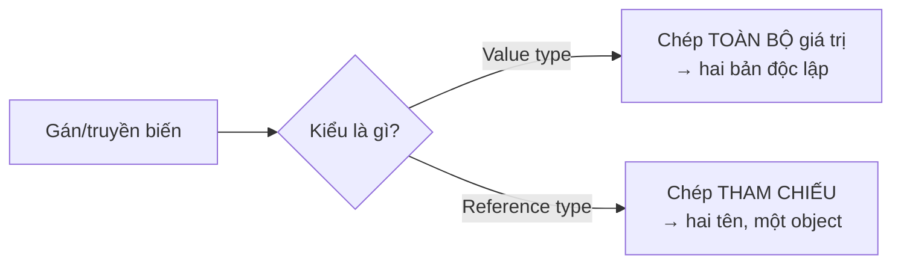

# Bộ nhớ & Kiểu dữ liệu: Value vs Reference

!!! info "Bạn đang ở đây · P1 → node `p1-memory`"
    **Cần trước:** [P0 · Thiết lập](../00-thiet-lap/index.md) (đã chạy được `dotnet run`).
    **Mở khoá sau bài này:** `async/await`, EF Core.
    ⏱️ Fast path ~25 phút · Deep dive +35 phút (tuỳ chọn, không bắt buộc).

> **Mục tiêu (đo được):** Sau bài này bạn **phân biệt** đúng *value semantics* và *reference semantics*, **dự đoán** được kết quả khi gán/truyền tham số, và **bác bỏ** được câu trả lời phỏng vấn sai kinh điển *"value type luôn nằm trên stack"*.

---

## 0. Kiểm tra trước (30 giây) — bạn đoán output là gì?

Đọc đoạn dưới và **tự đoán** in ra gì *trước khi* chạy. Ghi lại dự đoán — đây là "desirable difficulty", làm sai lúc này giúp nhớ lâu hơn.

```csharp title="doan.cs"
// test:run
int a = 10;
int b = a;      // (1)
b = 99;

int[] xs = { 10 };
int[] ys = xs;  // (2)
ys[0] = 99;

Console.WriteLine($"a = {a}");       // ?
Console.WriteLine($"xs[0] = {xs[0]}"); // ?
```

??? note "Đáp án — bấm để mở SAU khi đã đoán"
    ```
    a = 10
    xs[0] = 99
    ```
    Dòng (1) sao chép **giá trị** → `a` không đổi. Dòng (2) sao chép **tham chiếu** → `xs` và `ys` cùng trỏ một mảng, nên sửa qua `ys` thấy ở `xs`. Vì sao? Đọc tiếp.

---

## 1. Ý niệm cốt lõi: *semantics*, không phải *vị trí bộ nhớ*

C# chia kiểu dữ liệu làm hai nhóm theo **cách sao chép** (copy semantics):

| | **Value type** (`struct`, `int`, `bool`, `enum`, `record struct`) | **Reference type** (`class`, `record`, `string`, mảng, `interface`) |
|---|---|---|
| Gán/truyền tham số sao chép… | **toàn bộ giá trị** (một bản độc lập) | **tham chiếu** (cùng trỏ một object) |
| Sửa bản sao ảnh hưởng bản gốc? | ❌ Không | ✅ Có (vì cùng một object) |
| So sánh mặc định | `.Equals()` so theo **giá trị**; nhưng toán tử `==` **không tự có** cho `struct` thường¹ | `==` so **danh tính tham chiếu**² |
| `null` được không? | không (trừ `Nullable<T>`/`int?`, vốn cũng **là** value type) | được |

<small>¹ `==` chỉ có sẵn cho `record struct`, `enum`, kiểu số dựng sẵn, hoặc khi bạn tự overload. Viết `p1 == p2` trên `struct` thường (như `PointStruct` ở mục 2) sẽ **lỗi biên dịch** — dùng `.Equals()`.
² Trừ `string` và `record` (class) đã có sẵn so sánh theo giá trị.</small>



!!! danger "⛔ Huyền thoại cần gỡ bỏ: *'value type luôn nằm trên stack'*"
    Đây là câu trả lời phỏng vấn **sai** và là lỗi lặp lại nhiều nhất ở các tài liệu kém.
    Sự phân biệt thật là **value semantics vs reference semantics** — *chỗ nằm* của dữ liệu chỉ là **chi tiết cài đặt (implementation detail)** của runtime:

    - Biến `int` **local** → thường ở **stack**. ✅
    - Nhưng `int` là **field của một class** → nằm **inline bên trong object trên heap**.
    - Value type bị **capture** trong closure, biến local của **async state machine**, hay bị **boxing** → nằm trên **heap**.

    Nói cách khác: "chép giá trị hay chép tham chiếu" là **luôn đúng**; "stack hay heap" thì **tùy ngữ cảnh**. Trả lời phỏng vấn hãy nói về *semantics*, và chỉ nhắc stack/heap kèm chữ *"là chi tiết cài đặt"*. [^msdocs]

---

## 2. Ví dụ mẫu (worked example) — chạy để tự chứng minh

```csharp title="chung_minh.cs"
// test:run
var p1 = new PointStruct { X = 1 };   // value type
var p2 = p1;                          // CHÉP GIÁ TRỊ
p2.X = 99;

var c1 = new PointClass { X = 1 };    // reference type
var c2 = c1;                          // CHÉP THAM CHIẾU
c2.X = 99;

Console.WriteLine($"struct: p1.X = {p1.X}, p2.X = {p2.X}");  // 1, 99  → độc lập
Console.WriteLine($"class : c1.X = {c1.X}, c2.X = {c2.X}");  // 99, 99 → cùng object

struct PointStruct { public int X; }
class  PointClass  { public int X; }
```

**Kết quả:**
```
struct: p1.X = 1, p2.X = 99
class : c1.X = 99, c2.X = 99
```

Đây là **bằng chứng chạy được** cho bảng ở mục 1: sửa `p2` không đụng `p1` (hai bản giá trị), nhưng sửa `c2` đổi luôn `c1` (một object, hai cái tên).

---

## 3. Bài tập có giàn giáo (điền vào chỗ trống)

Sửa hàm `Reset` để nó **thực sự** đặt lại điểm về gốc toạ độ. Vì sao bản đầu **không** hoạt động?

```csharp title="bai_tap_giano.cs"
// test:run
var p = new PointStruct { X = 5, Y = 5 };
ResetBroken(p);
Console.WriteLine($"Sau ResetBroken: ({p.X},{p.Y})");   // vẫn (5,5) — vì sao?

// TODO: sửa hàm dưới để reset thật sự (gợi ý: từ khoá `ref`)
static void ResetBroken(PointStruct pt) { pt.X = 0; pt.Y = 0; }

struct PointStruct { public int X; public int Y; }
```

??? success "Lời giải + giải thích"
    `PointStruct` là value type → khi truyền vào hàm, tham số `pt` là **một bản sao**; sửa bản sao không ảnh hưởng `p` bên ngoài. Dùng `ref` để truyền *tham chiếu tới biến*:

    ```csharp title="loi_giai.cs"
    // test:run
    var p = new PointStruct { X = 5, Y = 5 };
    Reset(ref p);
    Console.WriteLine($"Sau Reset: ({p.X},{p.Y})");   // (0,0) ✅

    static void Reset(ref PointStruct pt) { pt.X = 0; pt.Y = 0; }

    struct PointStruct { public int X; public int Y; }
    ```
    Bài học: value type + muốn hàm sửa được bản gốc ⇒ `ref`/`out`. (Với reference type thì không cần, vì đã chép tham chiếu — nhưng cẩn thận: gán `pt = new(...)` bên trong hàm vẫn không đổi biến ngoài nếu không có `ref`.)

---

## 4. Boxing — cái bẫy hiệu năng thầm lặng

Khi một value type bị "ép" thành `object` (hoặc một interface), runtime **cấp phát một hộp trên heap** để chứa nó — gọi là **boxing**. Chiều ngược lại là **unboxing**.

```csharp title="boxing.cs"
// test:run
long before = GC.GetAllocatedBytesForCurrentThread();

int n = 42;
object boxed = n;        // BOXING → cấp phát trên heap
int back = (int)boxed;   // UNBOXING

long after = GC.GetAllocatedBytesForCurrentThread();
Console.WriteLine($"back = {back}");
Console.WriteLine($"Đã cấp phát ~{after - before} bytes cho việc boxing");
```

Boxing lặp trong vòng lặp nóng là nguyên nhân GC pressure phổ biến. Tránh bằng generic (`List<int>` thay vì `ArrayList`), `Span<T>`, hoặc so khớp mẫu không-boxing.

---

## 5. Tự kiểm tra (retrieval practice)

Trả lời *không nhìn lại bài*, rồi mở đáp án. Việc gợi lại từ trí nhớ (không phải đọc lại) mới tạo trí nhớ bền.

1. Khác biệt **thật** giữa value và reference type là gì (một câu)?
2. `struct` chứa trong một `class` thì nằm ở stack hay heap?
3. Đoạn này in ra gì, vì sao?
   ```csharp title="quiz3.cs"
   // test:run
   var a = new List<int> { 1 };
   var b = a;
   b.Add(2);
   Console.WriteLine(a.Count);
   ```

??? note "Đáp án"
    1. Là **cách sao chép**: value type chép *toàn bộ giá trị* (bản độc lập), reference type chép *tham chiếu* (cùng object). *Không* phải "stack vs heap".
    2. **Heap** — nó nằm inline bên trong object của class trên heap. (Chính là điểm bác bỏ huyền thoại ở mục 1.)
    3. In **`2`**. `List<T>` là reference type; `b = a` chép tham chiếu nên `a` và `b` là cùng một list, `b.Add(2)` làm `a.Count == 2`.

!!! tip "Ôn lại theo lịch (spaced repetition)"
    Đánh dấu 3 câu trên vào bộ ôn. Gặp lại sau **1 ngày**, rồi **3 ngày**, rồi **1 tuần** (hộp Leitner). Bài "Review cuối P1" sẽ trộn lại các câu này cùng câu từ node khác (interleaving).

---

## 6. Thử thách độc lập (giàn giáo đã gỡ)

Không có starter code. Dùng Claude Code/IDE như *pair*, nhưng bạn thiết kế + viết test:

> Viết `record struct Money(decimal Amount, string Currency)` và một hàm `Add` cộng hai `Money`. Viết **test xUnit** chứng minh: (a) cộng hai Money cùng loại tiền cho kết quả đúng; (b) `Money` có value semantics (hai biến bằng nhau về *giá trị* thì `==` trả `true`). Vì sao `record struct` khiến (b) đúng "miễn phí"?

---

??? abstract "🔬 DEEP DIVE (tuỳ chọn) — Runtime bố trí bộ nhớ & Garbage Collector"
    *Phần này KHÔNG nằm trên fast path. Bỏ qua vẫn làm được việc; đọc khi muốn lên senior.*

    **Value type nằm đâu — chính xác:**

    - Local của method, không bị capture/không async → **stack**.
    - Field của reference type → **inline trong object trên heap**.
    - Phần tử của mảng value type → **liên tục trên heap** (cache-friendly).
    - Bị boxing / capture bởi lambda / là local của `async`/`iterator` state machine → **heap**.

    **Garbage Collector của .NET (mô tả ĐÚNG):** là bộ thu gom **tracing, thế hệ (generational)** — *vừa* biết **nén (compact)** *vừa* biết **quét (sweep)**, chọn theo heuristic chi phí/lợi ích. Điểm cần nhớ để bác myth: nó **generational + có khả năng nén**, chứ không phải "chỉ mark-and-sweep đơn giản". (Đừng đi quá đà thành "không bao giờ sweep" — nó vẫn sweep.)

    - **Gen 0/1 (ephemeral):** thường **nén (compact)** để chống phân mảnh, cấp phát nhanh.
    - **Gen 2 (Small Object Heap):** có thể **sweep** thay vì nén khi heuristic thấy nén không đáng chi phí.
    - **LOH** (Large Object Heap, ≥ 85.000 bytes): mặc định **sweep** (không nén) vì chi phí copy lớn; có thể yêu cầu nén thủ công.
    - Object "chết trẻ" (gen 0) được thu rất rẻ — đó là lý do tránh cấp phát rác trong vòng lặp nóng (xem mục Boxing).

    **Công cụ hiện đại nên biết:** `readonly struct` + tham số `in` (tránh copy thừa), `ref struct`/`Span<T>` (làm việc trên vùng nhớ không cấp phát heap), và `record struct` cho value type có value-equality sẵn.

    Kiểm chứng nhanh trên .NET {{ dotnet.current }} / C# {{ csharp.version }}: chạy `dotnet run` các đoạn ở mục 2 và 4 rồi so với output nêu trên.

---

[^msdocs]: Microsoft Learn — *Value types and reference types* (C# language reference). Kiểm chứng lại `verified_on` ở front-matter.

<!-- Điều hướng canonical: mọi trang cần khái niệm này PHẢI link về đây, không giải thích lại. -->
**Tiếp theo →** P1 · async/await *(chương draft — mở trong v0.2)*
