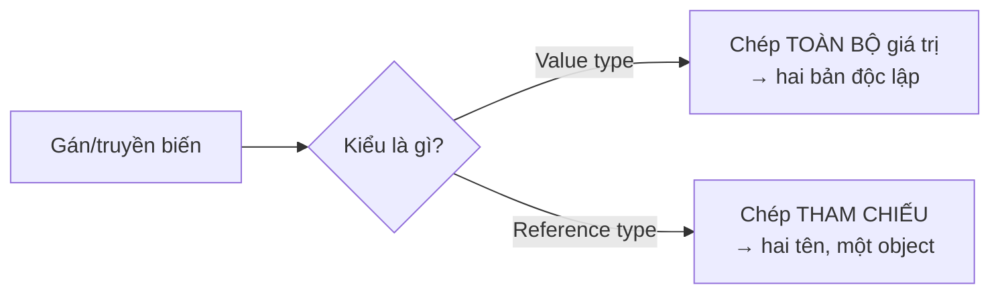

# Bộ nhớ & Kiểu dữ liệu: Value vs Reference

!!! info "Bạn đang ở đây · P1 → node `p1-memory`"
    **Cần trước:** C# Nền tảng (kiểu dữ liệu cơ bản, biến, method, điều kiện, vòng lặp).
    **Mở khoá sau bài này:** `async/await`, EF Core.
    ⏱️ Fast path ~45 phút (gồm 10 khái niệm nền tảng dạy từ số 0) · Deep dive +35 phút (tuỳ chọn, không bắt buộc).

> **Mục tiêu (đo được):** Sau bài này bạn **định nghĩa** được từng khái niệm nền tảng (`struct`, `class`, `record`/`record struct`, `interface`, `enum`, `Nullable<T>`, `out`, `ref`, `List<T>`) bằng cú pháp tối thiểu chạy được, **phân biệt** đúng *value semantics* và *reference semantics*, **dự đoán** được kết quả khi gán/truyền tham số, và **bác bỏ** được câu trả lời phỏng vấn sai kinh điển *"value type luôn nằm trên stack"*.

!!! info "Giả định: bạn CHƯA biết các từ khoá này"
    Bài học đi từ số 0: mỗi khái niệm mới có **đúng 4 bước** theo thứ tự — (1) định nghĩa một câu, (2) ví dụ tối thiểu chạy được chỉ minh hoạ riêng khái niệm đó, (3) lỗi khi dùng sai (nếu có), (4) chỉ sau đó mới tới bảng so sánh/ví dụ nâng cao. Không khái niệm nào xuất hiện lần đầu bên trong bảng tổng hợp.

---

## 0. Kiểm tra trước (30 giây) — bạn đoán output là gì?

Đọc đoạn dưới và **tự đoán** in ra gì *trước khi* chạy. Chưa biết `struct`/`class` cũng không sao — cứ đoán theo trực giác, mục 1 sẽ dạy lại từng khái niệm từ đầu. Ghi lại dự đoán — đây là "desirable difficulty", làm sai lúc này giúp nhớ lâu hơn.

```csharp title="doan.cs"
// test:run
int a = 10;
int b = a;      // (1)
b = 99;

int[] xs = { 10 };
int[] ys = xs;  // (2)
ys[0] = 99;

Console.WriteLine($"a = {a}");       // ?
Console.WriteLine($"xs[0] = {xs[0]}"); // ?
```

??? note "Đáp án — bấm để mở SAU khi đã đoán"
    ```
    a = 10
    xs[0] = 99
    ```
    Dòng (1) sao chép **giá trị** → `a` không đổi. Dòng (2) sao chép **tham chiếu** → `xs` và `ys` cùng trỏ một mảng, nên sửa qua `ys` thấy ở `xs`. Vì sao? Mục 1 xây từng viên gạch (`struct`, `class`, …) rồi mục 2 mới tổng kết quy luật này.

---

## 1. Từng khái niệm nền tảng — định nghĩa, cú pháp tối thiểu, lỗi khi sai

### 1.1 `struct` — kiểu giá trị do bạn định nghĩa

**Định nghĩa:** `struct` là một kiểu dữ liệu do bạn tự định nghĩa, mà khi gán/truyền đi thì C# **sao chép toàn bộ giá trị** của nó (không chia sẻ object).

```csharp title="struct_toi_thieu.cs"
// test:run
var m = new Meter { Value = 5 };
Console.WriteLine(m.Value);   // 5

struct Meter { public int Value; }
```

Chỉ một field (`Value`), chỉ tạo một biến — không so sánh gì cả, vì mục đích duy nhất ở đây là thấy cú pháp khai báo `struct` và cách tạo instance bằng object-initializer `{ Value = 5 }`.

### 1.2 `class` — kiểu tham chiếu do bạn định nghĩa

**Định nghĩa:** `class` cũng là một kiểu do bạn tự định nghĩa, nhưng khi gán/truyền đi thì C# **sao chép tham chiếu** — biến chỉ là "cái tên trỏ tới" một object nằm ở nơi khác trong bộ nhớ.

```csharp title="class_toi_thieu.cs"
// test:run
var box = new Box { Value = 5 };
Console.WriteLine(box.Value);   // 5

class Box { public int Value; }
```

Cú pháp gần như giống hệt `struct` ở trên (đổi từ khoá `struct` → `class`) — đây là điểm cố ý: để bạn thấy phần **khai báo** giống nhau, còn phần **khác nhau thật sự** (sao chép giá trị vs sao chép tham chiếu) sẽ được chứng minh bằng code chạy được ở mục 3, không phải chỉ nói suông.

### 1.3 `record` và `record struct` — kiểu có sẵn so sánh theo giá trị

**Định nghĩa:** `record` (mặc định là reference type) và `record struct` (value type) là cú pháp rút gọn để khai báo một kiểu **immutable-by-default có sẵn so sánh bằng `==` theo giá trị từng field**, thay vì phải tự viết `Equals`/`GetHashCode`.

```csharp title="record_toi_thieu.cs"
// test:run
var p1 = new Point(1, 2);
var p2 = new Point(1, 2);
Console.WriteLine(p1 == p2);             // True — so theo GIÁ TRỊ, dù là hai object khác nhau

var m1 = new Money(10m);
var m2 = new Money(10m);
Console.WriteLine(m1 == m2);             // True — record struct cũng có == theo giá trị

record Point(int X, int Y);              // reference type, value-equality có sẵn
record struct Money(decimal Amount);     // value type, value-equality có sẵn
```

So với `class`/`struct` thường (mục 1.1, 1.2) vốn không tự có `==` theo giá trị, `record`/`record struct` có **miễn phí**. Đây là lý do bài tập ở mục cuối yêu cầu dùng `record struct` cho kiểu `Money`.

### 1.3b `.Equals()` — so sánh theo giá trị trên `struct` thường

**Định nghĩa:** `.Equals()` là phương thức có sẵn trên **mọi** kiểu trong C# (kể cả `struct` thường chưa có `==`); trên `struct`, `.Equals()` mặc định so sánh **từng field theo giá trị** (khác với toán tử `==`, vốn **không tự có** cho `struct` thường — xem mục 2).

```csharp title="equals_toi_thieu.cs"
// test:run
var m1 = new Meter { Value = 5 };
var m2 = new Meter { Value = 5 };
Console.WriteLine(m1.Equals(m2));   // True — so theo giá trị từng field

struct Meter { public int Value; }
```

Nếu đổi `m2.Value` thành `6` rồi gọi lại `m1.Equals(m2)`, kết quả là `False`. Đây là cách so sánh giá trị **luôn dùng được** trên `struct` thường, ngay cả khi `==` chưa được overload (mục 2 sẽ dùng lại `.Equals()` này trong bảng tổng kết).

### 1.4 `interface` — hợp đồng hành vi, không có cài đặt

**Định nghĩa:** `interface` là một "bản hợp đồng" liệt kê các thành viên (thường là phương thức) mà một `class`/`struct` cam kết **phải cài đặt (implement)**, nhưng bản thân `interface` không chứa logic.

```csharp title="interface_toi_thieu.cs"
// test:run
IGreeter g = new EnglishGreeter();
Console.WriteLine(g.Greet());   // "Hello"

interface IGreeter { string Greet(); }
class EnglishGreeter : IGreeter { public string Greet() => "Hello"; }
```

`EnglishGreeter : IGreeter` nghĩa là "cam kết cài đặt hợp đồng `IGreeter`". Nếu `EnglishGreeter` **thiếu** phương thức `Greet()`, trình biên dịch báo lỗi **CS0535** ("does not implement interface member").

### 1.5 `enum` — tập hằng số có tên

**Định nghĩa:** `enum` là một kiểu giá trị liệt kê một tập **hằng số có tên**, dùng khi một biến chỉ được nhận một trong vài lựa chọn cố định (thay vì `int`/`string` tuỳ tiện).

```csharp title="enum_toi_thieu.cs"
// test:run
Level lv = Level.Medium;
Console.WriteLine(lv);   // Medium

enum Level { Low, Medium, High }
```

### 1.6 `Nullable<T>` / `int?` — value type được phép là `null`

**Định nghĩa:** `Nullable<T>` (viết tắt `T?` với `T` là value type, ví dụ `int?`) là một value type **bọc thêm cờ "có giá trị hay không"**, cho phép một biến vốn không thể `null` (như `int`) được mang giá trị `null`.

```csharp title="nullable_toi_thieu.cs"
// test:run
int? x = null;
Console.WriteLine(x.HasValue);         // False
x = 5;
Console.WriteLine(x.HasValue);         // True
Console.WriteLine(x.Value);            // 5
```

Nếu bỏ dấu `?` và viết `int x = null;` thì trình biên dịch báo lỗi **CS0037** ("Cannot convert null to 'int' because it is a non-nullable value type") — vì `int` thường **không** được phép là `null`, chỉ `int?` mới được.

### 1.7 `out` — tham số ra

**Định nghĩa:** tham số đánh dấu `out` cho phép một phương thức **trả thêm một giá trị** qua tham số đó, và phương thức **bắt buộc phải gán** giá trị cho nó trước khi kết thúc.

```csharp title="out_toi_thieu.cs"
// test:run
Square(4, out int result);
Console.WriteLine(result);   // 16

static void Square(int n, out int result) => result = n * n;
```

Nếu bỏ `out` ở lời gọi (`Square(4, result)` thay vì `Square(4, out int result)`) thì trình biên dịch báo lỗi **CS1620** ("Argument must be passed with the 'out' keyword"). Nếu bên trong `Square` quên gán `result` trước khi hàm kết thúc, lỗi là **CS0177** ("The out parameter must be assigned before control leaves the current method").

### 1.8 `List<T>` — danh sách kích thước động

**Định nghĩa:** `List<T>` là một kiểu tham chiếu trong thư viện chuẩn, giống mảng nhưng **tự phình to** khi bạn thêm phần tử bằng `Add(...)` (mảng `int[]` thì kích thước cố định ngay khi tạo).

```csharp title="list_toi_thieu.cs"
// test:run
var nums = new List<int> { 1, 2 };
nums.Add(3);
Console.WriteLine(nums.Count);   // 3
Console.WriteLine(nums[2]);      // 3
```

### 1.9 Mảng (`int[]`) — dãy phần tử cùng kiểu, kích thước cố định, là reference type

**Định nghĩa:** mảng (ví dụ `int[]`) là một dãy phần tử **cùng kiểu**, **kích thước cố định** ngay khi tạo, và bản thân mảng luôn là **reference type** (kể cả khi phần tử bên trong là value type như `int`).

```csharp title="mang_toi_thieu.cs"
// test:run
int[] xs = { 10, 20 };
Console.WriteLine(xs[0]);   // 10
Console.WriteLine(xs.Length); // 2
```

Vì mảng là reference type, gán `ys = xs` chỉ chép **tham chiếu** — `xs` và `ys` cùng trỏ một mảng (đã thấy ở ví dụ mục 0, dòng (2)); mục 2 sẽ tổng kết quy luật này chung với `class`.

### 1.10 `ref` — tham số truyền theo tham chiếu

**Định nghĩa:** tham số đánh dấu `ref` cho phép một phương thức **đọc và ghi trực tiếp lên biến của người gọi** (không phải bản sao); khác với `out` (mục 1.7) ở chỗ `ref` **bắt buộc biến đã có giá trị trước khi gọi** và phương thức **không bắt buộc phải gán lại** nó, trong khi `out` không cần giá trị trước đó nhưng **bắt buộc phải gán** trước khi hàm kết thúc.

```csharp title="ref_toi_thieu.cs"
// test:run
int n = 10;
AddOne(ref n);
Console.WriteLine(n);   // 11

static void AddOne(ref int x) => x = x + 1;
```

Nếu bỏ `ref` ở lời gọi (`AddOne(n)` thay vì `AddOne(ref n)`) thì trình biên dịch báo lỗi **CS1620** ("Argument 1 must be passed with the 'ref' keyword") — cùng **mã lỗi CS1620** như khi quên `out` (mục 1.7), chỉ khác chữ trong thông điệp (`'ref' keyword` thay vì `'out' keyword`); trình biên dịch phân biệt rõ hai từ khoá này nên không thể dùng lẫn cho nhau ở lời gọi.

---

## 2. Tổng kết: *semantics*, không phải *vị trí bộ nhớ*

Bây giờ đã có đủ 10 khái niệm nền tảng ở mục 1, ta gom chúng vào một quy luật duy nhất. C# chia kiểu dữ liệu làm hai nhóm theo **cách sao chép** (copy semantics):

`string` là reference type nhưng là **ngoại lệ đặc biệt**: toán tử `==` trên `string` được định nghĩa sẵn để so theo **giá trị nội dung** (hai chuỗi cùng ký tự → `==` trả `true`), chứ không so danh tính tham chiếu như các reference type khác — chi tiết đầy đủ sẽ học ở chương String sau này.

| | **Value type** (`struct`, `int`, `bool`, `enum`, `record struct`) | **Reference type** (`class`, `record`, `string`, mảng, `interface`, `List<T>`) |
|---|---|---|
| Gán/truyền tham số sao chép… | **toàn bộ giá trị** (một bản độc lập) | **tham chiếu** (cùng trỏ một object) |
| Sửa bản sao ảnh hưởng bản gốc? | ❌ Không | ✅ Có (vì cùng một object) |
| So sánh mặc định | `.Equals()` so theo **giá trị**; nhưng toán tử `==` **không tự có** cho `struct` thường¹ | `==` so **danh tính tham chiếu**, trừ `string`/`record` đã có value-equality² |
| `null` được không? | không (trừ `Nullable<T>`/`int?`, vốn cũng **là** value type — mục 1.6) | được |

<small>¹ `==` chỉ có sẵn cho `record struct`, `enum`, kiểu số dựng sẵn, hoặc khi bạn tự overload. Viết `p1 == p2` trên `struct` thường (như `PointStruct` ở mục 3 tiếp theo) sẽ **lỗi biên dịch** — dùng `.Equals()`.
² `record` (class) có value-equality theo từng field — xem mục 1.3. `string` có value-equality như giải thích ở trên.</small>



!!! danger "⛔ Huyền thoại cần gỡ bỏ: *'value type luôn nằm trên stack'*"
    Đây là câu trả lời phỏng vấn **sai** và là lỗi lặp lại nhiều nhất ở các tài liệu kém.
    Sự phân biệt thật là **value semantics vs reference semantics** — *chỗ nằm* của dữ liệu chỉ là **chi tiết cài đặt (implementation detail)** của runtime:

    - Biến `int` **local** → thường ở **stack**. ✅
    - Nhưng `int` là **field của một class** → nằm **inline bên trong object trên heap**.
    - Value type bị **capture** trong closure, biến local của **async state machine**, hay bị **ép ngầm thành `object`/interface** (định nghĩa đầy đủ là "boxing" ở mục 5 ngay sau) → nằm trên **heap**.

    Nói cách khác: "chép giá trị hay chép tham chiếu" là **luôn đúng**; "stack hay heap" thì **tùy ngữ cảnh**. Trả lời phỏng vấn hãy nói về *semantics*, và chỉ nhắc stack/heap kèm chữ *"là chi tiết cài đặt"*. [^msdocs]

---

## 3. Ví dụ mẫu (worked example) — chạy để tự chứng minh

```csharp title="chung_minh.cs"
// test:run
var p1 = new PointStruct { X = 1 };   // value type
var p2 = p1;                          // CHÉP GIÁ TRỊ
p2.X = 99;

var c1 = new PointClass { X = 1 };    // reference type
var c2 = c1;                          // CHÉP THAM CHIẾU
c2.X = 99;

Console.WriteLine($"struct: p1.X = {p1.X}, p2.X = {p2.X}");  // 1, 99  → độc lập
Console.WriteLine($"class : c1.X = {c1.X}, c2.X = {c2.X}");  // 99, 99 → cùng object

struct PointStruct { public int X; }
class  PointClass  { public int X; }
```

**Kết quả:**
```
struct: p1.X = 1, p2.X = 99
class : c1.X = 99, c2.X = 99
```

Đây là **bằng chứng chạy được** cho bảng ở mục 2: sửa `p2` không đụng `p1` (hai bản giá trị), nhưng sửa `c2` đổi luôn `c1` (một object, hai cái tên).

---

## 4. Bài tập có giàn giáo (điền vào chỗ trống)

Sửa hàm `Reset` để nó **thực sự** đặt lại điểm về gốc toạ độ. Vì sao bản đầu **không** hoạt động?

```csharp title="bai_tap_giano.cs"
// test:run
var p = new PointStruct { X = 5, Y = 5 };
ResetBroken(p);
Console.WriteLine($"Sau ResetBroken: ({p.X},{p.Y})");   // vẫn (5,5) — vì sao?

// TODO: sửa hàm dưới để reset thật sự (gợi ý: từ khoá `ref`)
static void ResetBroken(PointStruct pt) { pt.X = 0; pt.Y = 0; }

struct PointStruct { public int X; public int Y; }
```

??? success "Lời giải + giải thích"
    `PointStruct` là value type → khi truyền vào hàm, tham số `pt` là **một bản sao**; sửa bản sao không ảnh hưởng `p` bên ngoài. Dùng `ref` để truyền *tham chiếu tới biến*:

    ```csharp title="loi_giai.cs"
    // test:run
    var p = new PointStruct { X = 5, Y = 5 };
    Reset(ref p);
    Console.WriteLine($"Sau Reset: ({p.X},{p.Y})");   // (0,0) ✅

    static void Reset(ref PointStruct pt) { pt.X = 0; pt.Y = 0; }

    struct PointStruct { public int X; public int Y; }
    ```
    Bài học: value type + muốn hàm sửa được bản gốc ⇒ `ref`/`out`. (Với reference type thì không cần, vì đã chép tham chiếu — nhưng cẩn thận: gán `pt = new(...)` bên trong hàm vẫn không đổi biến ngoài nếu không có `ref`.)

---

## 5. Boxing — cái bẫy hiệu năng thầm lặng

Khi một value type bị "ép" thành `object` (hoặc một interface), runtime **cấp phát một hộp trên heap** để chứa nó — gọi là **boxing**. Chiều ngược lại là **unboxing**.

```csharp title="boxing.cs"
// test:run
long before = GC.GetAllocatedBytesForCurrentThread();

int n = 42;
object boxed = n;        // BOXING → cấp phát trên heap
int back = (int)boxed;   // UNBOXING

long after = GC.GetAllocatedBytesForCurrentThread();
Console.WriteLine($"back = {back}");
Console.WriteLine($"Đã cấp phát ~{after - before} bytes cho việc boxing");
```

Boxing lặp trong vòng lặp nóng là nguyên nhân GC pressure phổ biến. Tránh bằng generic (`List<int>` thay vì `ArrayList`), `Span<T>`, hoặc so khớp mẫu không-boxing.

---

## 6. Tự kiểm tra (retrieval practice)

Trả lời *không nhìn lại bài*, rồi mở đáp án. Việc gợi lại từ trí nhớ (không phải đọc lại) mới tạo trí nhớ bền.

1. Khác biệt **thật** giữa value và reference type là gì (một câu)?
2. `struct` chứa trong một `class` thì nằm ở stack hay heap?
3. Đoạn này in ra gì, vì sao?
   ```csharp title="quiz3.cs"
   // test:run
   var a = new List<int> { 1 };
   var b = a;
   b.Add(2);
   Console.WriteLine(a.Count);
   ```

??? note "Đáp án"
    1. Là **cách sao chép**: value type chép *toàn bộ giá trị* (bản độc lập), reference type chép *tham chiếu* (cùng object). *Không* phải "stack vs heap".
    2. **Heap** — nó nằm inline bên trong object của class trên heap. (Chính là điểm bác bỏ huyền thoại ở mục 2.)
    3. In **`2`**. `List<T>` là reference type; `b = a` chép tham chiếu nên `a` và `b` là cùng một list, `b.Add(2)` làm `a.Count == 2`.

!!! tip "Ôn lại theo lịch (spaced repetition)"
    Đánh dấu 3 câu trên vào bộ ôn. Gặp lại sau **1 ngày**, rồi **3 ngày**, rồi **1 tuần** (hộp Leitner). Bài "Review cuối P1" sẽ trộn lại các câu này cùng câu từ node khác (interleaving).

---

## 7. Thử thách độc lập (giàn giáo đã gỡ)

Không có starter code. Dùng Claude Code/IDE như *pair*, nhưng bạn thiết kế + viết test:

> Viết `record struct Money(decimal Amount, string Currency)` và một hàm `Add` cộng hai `Money`. Viết **test xUnit** chứng minh: (a) cộng hai Money cùng loại tiền cho kết quả đúng; (b) `Money` có value semantics (hai biến bằng nhau về *giá trị* thì `==` trả `true`). Vì sao `record struct` khiến (b) đúng "miễn phí"?

---

??? abstract "🔬 DEEP DIVE (tuỳ chọn) — Runtime bố trí bộ nhớ & Garbage Collector"
    *Phần này KHÔNG nằm trên fast path. Bỏ qua vẫn làm được việc; đọc khi muốn lên senior.*

    **Value type nằm đâu — chính xác:**

    - Local của method, không bị capture/không async → **stack**.
    - Field của reference type → **inline trong object trên heap**.
    - Phần tử của mảng value type → **liên tục trên heap** (cache-friendly).
    - Bị boxing / capture bởi lambda / là local của `async`/`iterator` state machine → **heap**.

    **Garbage Collector của .NET (mô tả ĐÚNG):** là bộ thu gom **tracing, thế hệ (generational)** — *vừa* biết **nén (compact)** *vừa* biết **quét (sweep)**, chọn theo heuristic chi phí/lợi ích. Điểm cần nhớ để bác myth: nó **generational + có khả năng nén**, chứ không phải "chỉ mark-and-sweep đơn giản". (Đừng đi quá đà thành "không bao giờ sweep" — nó vẫn sweep.)

    - **Gen 0/1 (ephemeral):** thường **nén (compact)** để chống phân mảnh, cấp phát nhanh.
    - **Gen 2 (Small Object Heap):** có thể **sweep** thay vì nén khi heuristic thấy nén không đáng chi phí.
    - **LOH** (Large Object Heap, ≥ 85.000 bytes): mặc định **sweep** (không nén) vì chi phí copy lớn; có thể yêu cầu nén thủ công.
    - Object "chết trẻ" (gen 0) được thu rất rẻ — đó là lý do tránh cấp phát rác trong vòng lặp nóng (xem mục Boxing).

    **Công cụ hiện đại nên biết:** `readonly struct` + tham số `in` (tránh copy thừa), `ref struct`/`Span<T>` (làm việc trên vùng nhớ không cấp phát heap), và `record struct` cho value type có value-equality sẵn.

    Kiểm chứng nhanh trên .NET {{ dotnet.current }} / C# {{ csharp.version }}: chạy `dotnet run` các đoạn ở mục 3 và 5 rồi so với output nêu trên.

---

[^msdocs]: Microsoft Learn — *Value types and reference types* (C# language reference). Kiểm chứng lại `verified_on` ở front-matter.

<!-- Điều hướng canonical: mọi trang cần khái niệm này PHẢI link về đây, không giải thích lại. -->
**Tiếp theo →** P1 · async/await *(chương draft — mở trong v0.2)*
