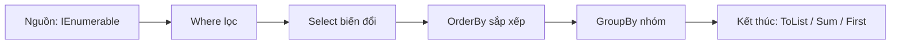

# LINQ cơ bản

!!! info "Bạn đang ở đây · P1 → node `p1-linq`"
    **cần trước:** [Collections](collections.md) (đã biết `List<T>`, `Dictionary<K,V>`, `HashSet<T>` và độ phức tạp tra cứu của chúng — chương này KHÔNG dạy lại).
    **mở khoá sau bài này:** async/await, ef core, minimal api.
    ⏱️ Fast path ~30 phút · Deep dive +20 phút (tuỳ chọn, không bắt buộc).

> **Mục tiêu (đo được):** Sau bài này bạn **viết** được pipeline LINQ với `Where/Select/OrderBy/GroupBy/Aggregate`, và **giải thích** được *deferred execution* cùng khác biệt `IEnumerable` vs `IQueryable`.

---

## 0. Kiểm tra trước (30 giây) — bạn đoán output là gì?

Đọc đoạn dưới và **tự đoán** trước khi chạy. Ghi lại dự đoán — làm sai lúc này giúp nhớ lâu hơn (desirable difficulty).

```csharp title="doan.cs"
// test:skip minh hoạ deferred execution, xem đáp án
var nums = new List<int> { 1, 2, 3 };
var query = nums.Where(n => n > 1);   // (1) query được "định nghĩa"
nums.Add(4);                          // (2) thêm phần tử SAU khi định nghĩa
Console.WriteLine(string.Join(",", query)); // ?
```

??? note "Đáp án — bấm để mở SAU khi đã đoán"
    In ra `2,3,4`. LINQ **không** chạy ngay ở dòng (1); nó chỉ *mô tả* phép lọc. Việc lọc thực sự xảy ra khi ta **duyệt** `query` (trong `string.Join`), lúc đó list đã có `4`. Đây chính là *deferred execution*.

---

## 1. Ý niệm cốt lõi

**LINQ** (Language Integrated Query) là bộ toán tử chạy trên bất kỳ `IEnumerable<T>` nào — kể cả `List<T>`, `Dictionary<K,V>`, `HashSet<T>`, mảng, hay chính `IQueryable<T>` của EF Core. (Nếu chưa vững `List`/`Dictionary`/`HashSet`, xem lại [chương Collections](collections.md) trước.) Pipeline LINQ điển hình:



Các toán tử chia hai nhóm:

- **Deferred (lười):** `Where`, `Select`, `OrderBy`, `GroupBy` — chỉ *mô tả*, chưa chạy.
- **Immediate (chạy ngay):** `ToList`, `Count`, `Sum`, `First`, `Any`, `Aggregate` — buộc duyệt và trả kết quả.

!!! danger "Đính chính hiểu lầm phổ biến"
    "LINQ chạy ngay khi tôi viết `.Where(...)`" — **SAI**. Với toán tử deferred, biểu thức chỉ chạy khi bị duyệt (foreach, `ToList`, `Sum`...). Duyệt hai lần = chạy lại hai lần. Nếu nguồn tốn kém, hãy `ToList()` một lần rồi tái dùng.

**Method syntax vs Query syntax** — hai cách viết cùng ý nghĩa:

```csharp title="hai-cu-phap.cs"
// test:skip so sánh cú pháp, không chạy độc lập
// Method syntax (fluent) — phổ biến nhất
var a = people.Where(p => p.Age > 18).Select(p => p.Name);

// Query syntax (giống SQL)
var b = from p in people where p.Age > 18 select p.Name;
```

**`IEnumerable` vs `IQueryable`** (khái niệm):

- `IEnumerable<T>`: LINQ-to-Objects. Bộ lọc chạy **trong bộ nhớ**, trên máy client. Lambda được **biên dịch thành delegate**.
- `IQueryable<T>`: LINQ-to-Provider (vd EF Core). Lambda được lưu dưới dạng **expression tree** và **dịch sang SQL**, lọc **tại database**. Chọn `IQueryable` khi dữ liệu ở DB để không kéo cả bảng về máy.

---

## 2. Ví dụ mẫu

Chương trình tính toán trên danh sách đơn hàng bằng LINQ.

```csharp title="linq-demo.cs"
// test:run
var orders = new List<Order>
{
    new("Alice", "Book", 120),
    new("Bob",   "Pen",   15),
    new("Alice", "Pen",   30),
    new("Cara",  "Book",  90),
};

// Tổng chi tiêu theo từng khách, sắp giảm dần
var byCustomer = orders
    .GroupBy(o => o.Customer)
    .Select(g => new { Customer = g.Key, Total = g.Sum(o => o.Amount) })
    .OrderByDescending(x => x.Total);

foreach (var row in byCustomer)
    Console.WriteLine($"{row.Customer}: {row.Total}");

// Các toán tử kết thúc
Console.WriteLine($"Có đơn > 100? {orders.Any(o => o.Amount > 100)}");
Console.WriteLine($"Số đơn Book: {orders.Count(o => o.Product == "Book")}");
Console.WriteLine($"Đơn đầu tiên của Bob: {orders.First(o => o.Customer == "Bob").Product}");

// Aggregate: nối tên sản phẩm duy nhất
var products = new HashSet<string>(orders.Select(o => o.Product));
var joined = products.Aggregate((acc, p) => $"{acc}+{p}");
Console.WriteLine($"Sản phẩm: {joined}");

record Order(string Customer, string Product, int Amount);
```

Output kỳ vọng:

```
Alice: 150
Cara: 90
Bob: 15
Có đơn > 100? True
Số đơn Book: 2
Đơn đầu tiên của Bob: Pen
Sản phẩm: Book+Pen
```

---

## 3. Bài tập có giàn giáo

Cho danh sách số nguyên, hãy in ra **các số chẵn duy nhất, sắp tăng dần** và **tổng của chúng**. Điền vào chỗ `TODO`.

```csharp title="bai-tap.cs"
// test:skip bài tập có chỗ trống, xem lời giải để chạy
int[] data = { 4, 7, 2, 4, 10, 7, 2 };

var evens = data
    // TODO 1: lọc số chẵn
    // TODO 2: loại trùng
    // TODO 3: sắp tăng dần
    ;

Console.WriteLine(string.Join(",", evens));
Console.WriteLine($"Tổng = {/* TODO 4 */}");
```

??? success "Lời giải + giải thích"
    ```csharp title="C#"
    // test:run
    int[] data = { 4, 7, 2, 4, 10, 7, 2 };

    var evens = data
        .Where(n => n % 2 == 0)  // lọc chẵn
        .Distinct()              // loại trùng
        .OrderBy(n => n);        // sắp tăng

    Console.WriteLine(string.Join(",", evens)); // 2,4,10
    Console.WriteLine($"Tổng = {evens.Sum()}"); // Tổng = 16
    ```
    **Vì sao:** `Where` giữ phần tử thoả điều kiện, `Distinct` dùng hash để bỏ trùng (giống `HashSet`), `OrderBy` sắp xếp. Lưu ý `evens` bị duyệt **hai lần** (`Join` và `Sum`) nên pipeline chạy lại hai lần — với dữ liệu lớn nên `.ToList()` trước.

---

## 4. Cạm bẫy & hiệu năng

!!! warning "Những lỗi hay gặp"
    - **`First` vs `FirstOrDefault`:** `First` **ném exception** nếu không có phần tử; `FirstOrDefault` trả `default` (null/0). Dùng `FirstOrDefault` khi có thể rỗng.
    - **`Count()` vs `Count`:** `list.Count` là thuộc tính O(1). `enumerable.Count()` (LINQ) có thể duyệt toàn bộ O(n). Đừng gọi `.Count() > 0`, hãy dùng `.Any()`.
    - **Duyệt nhiều lần:** mỗi `foreach`/toán tử kết thúc trên query deferred sẽ chạy lại. Vật chất hoá bằng `ToList()` nếu nguồn tốn kém (I/O, DB).
    - **`Contains` trên `List<T>`** là O(n). Cần kiểm tra thành viên thường xuyên → chuyển sang `HashSet<T>`.

---

## Tự kiểm tra

1. Cần tra cứu giá trị theo khoá cực nhanh, khoá duy nhất — chọn collection nào?
2. `orders.Where(...)` đã chạy phép lọc ngay tại dòng đó chưa? Vì sao?
3. Khác biệt cốt lõi giữa `First` và `FirstOrDefault`?
4. Muốn lọc dữ liệu ngay tại database (dịch sang SQL) thì dùng `IEnumerable` hay `IQueryable`?
5. Vì sao nên dùng `.Any()` thay cho `.Count() > 0`?

??? note "Đáp án"
    1. `Dictionary<K,V>` — tra theo khoá O(1) trung bình.
    2. **Chưa.** `Where` là toán tử deferred, chỉ mô tả; phép lọc chạy khi query bị duyệt (foreach / `ToList` / `Sum`...).
    3. `First` ném `InvalidOperationException` khi không có phần tử; `FirstOrDefault` trả về `default(T)` (null hoặc 0).
    4. `IQueryable<T>` — lambda thành expression tree và được provider (EF Core) dịch sang SQL, lọc tại DB.
    5. `.Any()` dừng ngay khi gặp phần tử đầu tiên (O(1) tốt nhất), còn `.Count()` có thể duyệt toàn bộ nguồn.

---

??? abstract "DEEP DIVE — nâng cao (không nằm trên fast path)"
    **Expression tree là gì?** Khi bạn viết `q.Where(p => p.Age > 18)` trên `IQueryable<T>`, lambda **không** biên dịch thành delegate mà thành cây biểu thức `Expression<Func<T,bool>>`. Provider duyệt cây này để sinh SQL. Đó là lý do bạn không thể gọi phương thức C# tuỳ ý trong lambda EF Core — nó phải dịch được sang SQL.

    **`Aggregate` với seed:** dạng đầy đủ nhận giá trị khởi tạo:
    ```csharp title="C#"
    // test:run
    int[] xs = { 1, 2, 3, 4 };
    int product = xs.Aggregate(1, (acc, x) => acc * x); // seed = 1
    Console.WriteLine(product); // 24
    ```

    **`ToLookup` vs `GroupBy`:** `GroupBy` là deferred; `ToLookup` chạy ngay và trả cấu trúc `ILookup<K,V>` tra khoá O(1) — hữu ích khi cần nhóm rồi tra nhiều lần.

    **Struct enumerator:** `List<T>.GetEnumerator()` trả về struct để tránh cấp phát heap trong `foreach` — một lý do `foreach` trực tiếp trên `List<T>` nhanh hơn qua `IEnumerable<T>` (bị boxing).

Tiếp theo -> xử lý ngoại lệ & kết quả
