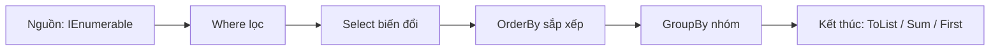

# LINQ cơ bản

!!! info "Bạn đang ở đây · P1 → node `p1-linq`"
    **cần trước:** [Collections](collections.md) (đã biết `List<T>`, `Dictionary<K,V>`, `HashSet<T>` và độ phức tạp tra cứu của chúng — chương này KHÔNG dạy lại).
    **mở khoá sau bài này:** async/await, ef core, minimal api.
    ⏱️ Fast path ~30 phút · Deep dive +20 phút (tuỳ chọn, không bắt buộc).

> **Mục tiêu (đo được):** Sau bài này bạn **viết** được pipeline LINQ với `Where/Select/OrderBy/GroupBy/Aggregate`, và **giải thích** được *deferred execution* cùng khác biệt `IEnumerable` vs `IQueryable`.

---

## 1. LINQ là gì?

**LINQ** (Language Integrated Query) là bộ toán tử chạy trên bất kỳ `IEnumerable<T>` nào — kể cả `List<T>`, `Dictionary<K,V>`, `HashSet<T>`, mảng, hay chính `IQueryable<T>` của EF Core. (Nếu chưa vững `List`/`Dictionary`/`HashSet`, xem lại [chương Collections](collections.md) trước.) Nói ngắn gọn: LINQ cho bạn viết "lọc/biến đổi/sắp xếp/nhóm dữ liệu" bằng cú pháp thống nhất, thay vì tự viết vòng lặp `for`/`foreach` thủ công.



Các toán tử LINQ chia hai nhóm — ghi nhớ điều này trước khi học từng toán tử cụ thể:

- **Deferred (lười):** `Where`, `Select`, `OrderBy`, `GroupBy` — chỉ *mô tả* phép tính, chưa chạy ngay.
- **Immediate (chạy ngay):** `ToList`, `Count`, `Sum`, `First`, `Any`, `Aggregate` — buộc duyệt nguồn và trả kết quả ngay lập tức.

!!! danger "Đính chính hiểu lầm phổ biến"
    "LINQ chạy ngay khi tôi viết `.Where(...)`" — **SAI**. Với toán tử deferred, biểu thức chỉ chạy khi bị duyệt (foreach, `ToList`, `Sum`...). Duyệt hai lần = chạy lại hai lần. Nếu nguồn tốn kém, hãy `ToList()` một lần rồi tái dùng.

---

## 2. `Where` — lọc phần tử

**Định nghĩa:** `Where` giữ lại những phần tử thoả một điều kiện (predicate), bỏ phần còn lại.

```csharp title="Where tối thiểu"
// test:run
int[] nums = { 1, 2, 3, 4, 5 };
var evens = nums.Where(n => n % 2 == 0);
Console.WriteLine(string.Join(",", evens)); // 2,4
```

Nếu dùng sai — ví dụ predicate không trả về `bool` — trình biên dịch báo lỗi ngay:

```csharp title="Where — lỗi khi predicate không trả bool"
// test:skip Cố ý minh hoạ lỗi biên dịch CS0029
int[] nums = { 1, 2, 3 };
var bad = nums.Where(n => n); // LỖI CS0029: Cannot implicitly convert type 'int' to 'bool'
```

### 2.1. Deferred execution — `Where` chưa chạy ngay

Đọc đoạn dưới và **tự đoán output** trước khi mở đáp án (làm sai lúc này giúp nhớ lâu hơn — desirable difficulty).

```csharp title="doan.cs"
// test:run
var nums = new List<int> { 1, 2, 3 };
var query = nums.Where(n => n > 1);   // (1) query được "định nghĩa"
nums.Add(4);                          // (2) thêm phần tử SAU khi định nghĩa
Console.WriteLine(string.Join(",", query)); // ?
```

??? note "Đáp án — bấm để mở SAU khi đã đoán"
    In ra `2,3,4`. `Where` **không** chạy ngay ở dòng (1); nó chỉ *mô tả* phép lọc. Việc lọc thực sự xảy ra khi ta **duyệt** `query` (trong `string.Join`), lúc đó list đã có `4`. Đây chính là *deferred execution* đã nói ở mục 1.

---

## 3. `Select` — biến đổi phần tử

**Định nghĩa:** `Select` biến mỗi phần tử nguồn thành một giá trị mới theo một hàm biến đổi (projection), giữ nguyên số lượng phần tử.

```csharp title="Select tối thiểu"
// test:run
int[] nums = { 1, 2, 3 };
var squares = nums.Select(n => n * n);
Console.WriteLine(string.Join(",", squares)); // 1,4,9
```

Nếu projection truy cập property trên một phần tử `null` trong danh sách — lỗi này **không** bị bắt lúc biên dịch, chỉ nổ ra lúc chạy khi phần tử đó thực sự bị duyệt:

```csharp title="Select — NullReferenceException khi phần tử null"
// test:run
var names = new List<string?> { "Alice", null, "Cara" };
var lengths = names.Select(n => n!.Length); // n có thể null nhưng ta khẳng định (ép) là không

try
{
    Console.WriteLine(string.Join(",", lengths));
}
catch (NullReferenceException ex)
{
    Console.WriteLine($"Lỗi: {ex.Message}");
}
```

`Select` không tự kiểm tra `null` giúp bạn — nếu nguồn có thể chứa `null`, hãy `Where(n => n is not null)` trước, hoặc kiểm tra `n?.Length` bên trong lambda.

---

## 4. `OrderBy` và `OrderByDescending` — sắp xếp

**Định nghĩa:** `OrderBy` sắp xếp phần tử **tăng dần** theo một khoá; `OrderByDescending` sắp **giảm dần**.

```csharp title="OrderBy tối thiểu"
// test:run
int[] nums = { 3, 1, 2 };
var asc = nums.OrderBy(n => n);
Console.WriteLine(string.Join(",", asc)); // 1,2,3
```

```csharp title="OrderByDescending tối thiểu"
// test:run
int[] nums = { 3, 1, 2 };
var desc = nums.OrderByDescending(n => n);
Console.WriteLine(string.Join(",", desc)); // 3,2,1
```

`OrderBy` biên dịch được với **bất kỳ** kiểu khoá nào (không ép `TKey` phải implement `IComparable` lúc biên dịch) vì nó dùng `Comparer<TKey>.Default` — nhưng nếu khoá đó **không** implement `IComparable`/`IComparable<T>`, `Comparer<TKey>.Default` không biết so sánh thế nào và ném lỗi **lúc chạy**:

```csharp title="OrderBy — InvalidOperationException khi khoá không implement IComparable"
// test:run
var points = new List<Point> { new(3), new(1), new(2) };

try
{
    var sorted = points.OrderBy(p => p).ToList(); // khoá = chính Point, không so sánh được
}
catch (InvalidOperationException ex)
{
    Console.WriteLine($"Lỗi: {ex.Message}"); // "At least one object must implement IComparable."
}

class Point // KHÔNG implement IComparable
{
    public int X;
    public Point(int x) => X = x;
}
```

Muốn sắp theo `Point`, hãy chọn một khoá **có thể so sánh** (ví dụ `p.X`, kiểu `int` đã implement `IComparable`) thay vì đưa cả object vào `OrderBy`.

---

## 5. `GroupBy` — nhóm phần tử theo khoá

**Định nghĩa:** `GroupBy` chia nguồn thành nhiều nhóm, mỗi nhóm là các phần tử có cùng giá trị khoá; mỗi nhóm có `Key` (giá trị khoá) và chứa các phần tử thuộc nhóm đó.

```csharp title="GroupBy tối thiểu"
// test:run
string[] words = { "táo", "chuối", "cam", "cà rốt" };
var groups = words.GroupBy(w => w.Length);

foreach (var g in groups)
    Console.WriteLine($"độ dài {g.Key}: {string.Join(",", g)}");
```

```text title="Kết quả"
độ dài 3: táo,cam
độ dài 5: chuối
độ dài 6: cà rốt
```

`g.Key` là giá trị khoá dùng để nhóm (ở đây là độ dài chuỗi); duyệt `g` (foreach hoặc `string.Join`) cho ra các phần tử **thuộc nhóm đó**.

Lỗi hay gặp: tưởng nhầm `g` (kiểu `IGrouping<TKey,TSource>`) **là** danh sách phần tử nên cố gọi trực tiếp phần tử đầu tiên bằng cách coi `g` như một chuỗi/phần tử đơn — ví dụ dùng `g` ở chỗ cần `string` sẽ không lỗi biên dịch (vì `IGrouping` cũng là `IEnumerable<string>`) nhưng in ra **toàn bộ nhóm nối chuỗi lại**, không phải một chuỗi đơn như tưởng:

```csharp title="GroupBy — nhầm g là một phần tử thay vì cả nhóm"
// test:run
string[] words = { "táo", "chuối", "cam", "cà rốt" };
var groups = words.GroupBy(w => w.Length);

foreach (var g in groups)
{
    // SAI: tưởng g là MỘT từ, nhưng g là CẢ NHÓM (IGrouping<int,string>)
    string wrong = string.Concat(g); // nối tất cả phần tử trong nhóm lại, không phải 1 từ
    Console.WriteLine($"độ dài {g.Key} -> \"{wrong}\"");
}
// độ dài 3 -> "táocam"   (mong đợi từng từ riêng, nhưng bị dính lại)
// độ dài 5 -> "chuối"
// độ dài 6 -> "cà rốt"
```

Muốn lấy đúng **một phần tử** trong nhóm (ví dụ phần tử đầu), phải gọi tường minh `g.First()`; muốn lấy khoá, dùng `g.Key` — không có phép "tự suy" nào biến `g` thành phần tử đơn.

---

## 6. `Aggregate` (không seed) — gộp dần thành một giá trị

**Định nghĩa:** `Aggregate` duyệt qua từng phần tử, mỗi bước gộp giá trị tích luỹ (`acc`) với phần tử hiện tại (`x`) bằng một hàm bạn cung cấp, và trả về kết quả tích luỹ cuối cùng. Ở dạng không có seed, phần tử **đầu tiên** của nguồn được dùng làm giá trị tích luỹ khởi đầu.

```csharp title="Aggregate không seed"
// test:run
int[] xs = { 1, 2, 3, 4 };
int sum = xs.Aggregate((acc, x) => acc + x);
// acc bắt đầu = 1 (phần tử đầu); rồi 1+2=3, 3+3=6, 6+4=10
Console.WriteLine(sum); // 10
```

Nếu nguồn **rỗng**, không có phần tử nào để làm giá trị khởi đầu, nên `Aggregate` (không seed) ném lỗi lúc chạy:

```csharp title="Aggregate trên collection rỗng"
// test:run
int[] empty = { };
try
{
    empty.Aggregate((acc, x) => acc + x);
}
catch (InvalidOperationException ex)
{
    Console.WriteLine($"Lỗi: {ex.Message}");
}
```

(Muốn tránh lỗi này khi nguồn có thể rỗng, dùng dạng **có seed** — xem mục Deep dive.)

---

## 7. Anonymous type — `new { ... }`

**Định nghĩa:** Anonymous type là một kiểu dữ liệu không tên, được trình biên dịch tự sinh ra chỉ để gom vài giá trị lại thành một đối tượng tạm, khai báo bằng `new { Prop = value, ... }`.

```csharp title="Anonymous type tối thiểu"
// test:run
var point = new { X = 3, Y = 4 };
Console.WriteLine($"({point.X}, {point.Y})"); // (3, 4)
```

Anonymous type thường dùng làm kết quả của `Select`/`GroupBy` khi bạn chỉ cần vài trường tạm thời, không muốn định nghĩa hẳn một `class`/`record` riêng.

Property của anonymous type là **chỉ đọc** (immutable) — cố gán lại giá trị mới cho nó sau khi khởi tạo là lỗi biên dịch:

```csharp title="Anonymous type — gán lại property bị lỗi biên dịch CS0200"
// test:skip Cố ý minh hoạ lỗi biên dịch CS0200
var point = new { X = 3, Y = 4 };
point.X = 10; // LỖI CS0200: Property or indexer 'X' cannot be assigned to -- it is read only
```

Muốn "thay đổi" giá trị, phải tạo **object mới** (ví dụ dùng `with`-like pattern thủ công: `var moved = new { X = point.X + 10, Y = point.Y };`) chứ không sửa được tại chỗ.

---

## 8. Ví dụ mẫu — kết hợp các toán tử đã học

Chương trình tính toán trên danh sách đơn hàng, dùng `GroupBy` + `Select` (tạo anonymous type) + `OrderByDescending`.

```csharp title="linq-demo.cs"
// test:run
var orders = new List<Order>
{
    new("Alice", "Book", 120),
    new("Bob",   "Pen",   15),
    new("Alice", "Pen",   30),
    new("Cara",  "Book",  90),
};

// Tổng chi tiêu theo từng khách, sắp giảm dần
var byCustomer = orders
    .GroupBy(o => o.Customer)
    .Select(g => new { Customer = g.Key, Total = g.Sum(o => o.Amount) })
    .OrderByDescending(x => x.Total);

foreach (var row in byCustomer)
    Console.WriteLine($"{row.Customer}: {row.Total}");

record Order(string Customer, string Product, int Amount);
```

```text title="Kết quả"
Alice: 150
Cara: 90
Bob: 15
```

`GroupBy` gom đơn hàng theo `Customer`; `Select` biến mỗi nhóm thành một anonymous type `{ Customer, Total }` (dùng `g.Key` và `g.Sum(...)`); `OrderByDescending` sắp theo `Total` giảm dần.

---

## 9. Method syntax vs Query syntax

Bạn đã dùng **method syntax** (`orders.Where(...).Select(...)`) xuyên suốt các mục trên — đây là cách viết phổ biến nhất trong C#. C# còn có **query syntax**, giống cú pháp SQL, biên dịch thành đúng các lời gọi method syntax bên dưới.

```csharp title="Query syntax tối thiểu"
// test:run
int[] nums = { 1, 2, 3, 4, 5 };
var result = from n in nums
             where n % 2 == 0
             select n * 10;
Console.WriteLine(string.Join(",", result)); // 20,40
```

Query syntax cũng hỗ trợ sắp xếp bằng từ khoá `orderby` (tương đương `OrderBy`/`OrderByDescending` ở method syntax):

```csharp title="Query syntax với orderby"
// test:run
int[] nums = { 5, 3, 1, 4, 2 };
var sorted = from n in nums
             where n > 1
             orderby n descending
             select n;
Console.WriteLine(string.Join(",", sorted)); // 5,4,3,2
```

### 9.1. So sánh hai cú pháp

| | Method syntax | Query syntax |
|---|---|---|
| Cú pháp | `nums.Where(n => n % 2 == 0).Select(n => n * 10)` | `from n in nums where n % 2 == 0 select n * 10` |
| Mức phổ biến | Rất phổ biến, dùng được với **mọi** toán tử LINQ | Chỉ hỗ trợ một tập con (`Where`, `Select`, `GroupBy`, `orderby`...); riêng `join` sẽ học ở P2 (joins-aggregation) |
| Khi nào dùng | Mặc định — đặc biệt khi cần `Aggregate`, `Any`, `First`... | Khi truy vấn có nhiều điều kiện lọc/sắp xếp lồng nhau, đọc giống SQL dễ hơn |

Bên dưới, trình biên dịch dịch query syntax thành đúng chuỗi gọi method syntax — hai cách chỉ là hai lối viết cho cùng một phép tính.

---

## 10. `IEnumerable<T>` vs `IQueryable<T>`

### 10.1. `IEnumerable<T>` — LINQ-to-Objects, chạy trong bộ nhớ

**Định nghĩa:** Với `IEnumerable<T>`, lambda trong `Where`/`Select`... được **biên dịch thành delegate** và chạy **trong bộ nhớ, trên máy hiện tại** — dùng cho `List<T>`, mảng, hay bất kỳ collection nào đã có sẵn trong RAM.

```csharp title="IEnumerable<T> — lọc trong bộ nhớ"
// test:run
System.Collections.Generic.IEnumerable<int> source = new List<int> { 1, 2, 3, 4 };
var big = source.Where(n => n > 2); // delegate chạy ngay trên list trong RAM
Console.WriteLine(string.Join(",", big)); // 3,4
```

### 10.2. `IQueryable<T>` — LINQ-to-Provider, dịch sang truy vấn khác (vd SQL)

**Định nghĩa:** Với `IQueryable<T>` (ví dụ `DbSet<T>` của EF Core), lambda được lưu dưới dạng **expression tree** (cây cú pháp, chưa biên dịch thành delegate) rồi được provider **dịch sang ngôn ngữ đích** (thường là SQL) và chạy **tại nguồn dữ liệu** (database), không kéo hết dữ liệu về máy trước.

```csharp title="IQueryable<T> — minh hoạ khái niệm (không có DB thật)"
// test:skip minh hoạ khái niệm expression tree, cần EF Core/DbSet thật để chạy
System.Linq.IQueryable<Order> query = dbContext.Orders; // DbSet<Order> : IQueryable<Order>
var expensive = query.Where(o => o.Amount > 100); // lambda -> Expression<Func<Order,bool>>
// Provider (EF Core) dịch 'expensive' thành SQL: SELECT ... WHERE Amount > 100
```

Vì lambda là expression tree (dữ liệu mô tả phép tính), provider phải **hiểu và dịch** được từng phần của nó. Gọi một phương thức C# tuỳ ý (không map được sang SQL) bên trong lambda `IQueryable` sẽ lỗi lúc chạy:

```csharp title="Gọi hàm C# tuỳ ý trong lambda IQueryable — lỗi khái niệm"
// test:skip minh hoạ InvalidOperationException khi provider EF Core không dịch được hàm tuỳ ý
var bad = query.Where(o => MyCustomLogic(o.Product)); // MyCustomLogic không dịch được sang SQL
// Chạy lúc thực thi query -> InvalidOperationException:
// "LINQ expression ... could not be translated"
```

### 10.3. Bảng so sánh

| | `IEnumerable<T>` | `IQueryable<T>` |
|---|---|---|
| Lambda biên dịch thành | Delegate | Expression tree |
| Nơi chạy | Trong bộ nhớ (client) | Tại nguồn dữ liệu (vd database, qua SQL) |
| Dùng khi | Dữ liệu đã có sẵn trong RAM (`List<T>`, mảng...) | Dữ liệu ở nguồn ngoài (EF Core, DB) — tránh kéo cả bảng về |
| Gọi hàm C# tuỳ ý trong lambda | Luôn được (delegate thật) | Có thể lỗi `InvalidOperationException` nếu provider không dịch được |

Chọn `IQueryable` khi dữ liệu ở DB để lọc **tại database**, không kéo cả bảng về máy rồi mới lọc.

---

## 11. `Distinct` — loại phần tử trùng

**Định nghĩa:** `Distinct` trả về các phần tử của nguồn, bỏ những bản sao trùng lặp (so sánh bằng `Equals`/`GetHashCode`, tương tự cơ chế của `HashSet<T>`).

```csharp title="Distinct tối thiểu"
// test:run
int[] nums = { 1, 2, 2, 3, 1 };
var unique = nums.Distinct();
Console.WriteLine(string.Join(",", unique)); // 1,2,3
```

`Distinct` mặc định so sánh bằng `Equals`/`GetHashCode` của phần tử. Với `int`, `string`... các phép so sánh này đã có sẵn theo **giá trị**. Nhưng với một `class` tự định nghĩa **không override** `Equals`/`GetHashCode`, C# dùng so sánh mặc định theo **reference** (tham chiếu) — hai object "trông giống hệt nhau" nhưng khác vùng nhớ vẫn bị coi là khác nhau, nên `Distinct` **không loại được trùng** như kỳ vọng:

```csharp title="Distinct — không loại trùng vì thiếu Equals/GetHashCode"
// test:run
var points = new List<Point>
{
    new(1, 1),
    new(1, 1), // giá trị giống hệt point trên, nhưng là object KHÁC trong bộ nhớ
    new(2, 2),
};

var unique = points.Distinct().ToList();
Console.WriteLine(unique.Count); // 3 — KHÔNG phải 2 như kỳ vọng!
// Lý do: Distinct so sánh theo reference (mặc định), hai new Point(1,1) là hai object khác nhau

class Point // KHÔNG override Equals/GetHashCode
{
    public int X, Y;
    public Point(int x, int y) => (X, Y) = (x, y);
}
```

Muốn `Distinct` loại trùng theo **giá trị**, phải override `Equals`/`GetHashCode` trong `class` (hoặc dùng `record`, vốn tự sinh so sánh theo giá trị).

---

## 12. `Any`, `Count(predicate)`, `First(predicate)` — toán tử kết thúc hay dùng

### 12.1. `Any` — có tồn tại phần tử thoả điều kiện không?

```csharp title="Any tối thiểu"
// test:run
int[] nums = { 1, 2, 3 };
Console.WriteLine(nums.Any(n => n > 2)); // True
Console.WriteLine(nums.Any(n => n > 10)); // False
```

`Any` dừng ngay khi tìm thấy phần tử đầu tiên thoả điều kiện — không cần duyệt hết nguồn.

### 12.2. `Count(predicate)` — đếm số phần tử thoả điều kiện

```csharp title="Count(predicate) tối thiểu"
// test:run
int[] nums = { 1, 2, 3, 4, 5 };
int evenCount = nums.Count(n => n % 2 == 0);
Console.WriteLine(evenCount); // 2
```

Khác với `Any`, `Count(predicate)` phải duyệt **toàn bộ** nguồn để đếm hết, không dừng sớm.

### 12.3. `First(predicate)` — lấy phần tử đầu tiên thoả điều kiện

```csharp title="First(predicate) tối thiểu"
// test:run
int[] nums = { 1, 2, 3, 4 };
int firstEven = nums.First(n => n % 2 == 0);
Console.WriteLine(firstEven); // 2
```

!!! danger "`First` vs `FirstOrDefault` — cảnh báo ngay khi vừa học `First`"
    `First` **ném `InvalidOperationException`** nếu không có phần tử nào thoả điều kiện (hoặc nguồn rỗng). `FirstOrDefault` trả về `default(T)` (`null` với reference type, `0` với `int`...) thay vì ném lỗi. Dùng `FirstOrDefault` khi kết quả **có thể** rỗng; chỉ dùng `First` khi bạn chắc chắn luôn có ít nhất một phần tử khớp — nếu sai, thà lỗi to ngay còn hơn để `null` âm thầm trôi xuống dưới.

    ```csharp title="First ném lỗi khi không tìm thấy"
    // test:run
    int[] nums = { 1, 3, 5 };
    try
    {
        nums.First(n => n % 2 == 0); // không có số chẵn nào
    }
    catch (InvalidOperationException)
    {
        Console.WriteLine("Không tìm thấy phần tử thoả điều kiện");
    }
    Console.WriteLine(nums.FirstOrDefault(n => n % 2 == 0)); // 0 — không ném lỗi
    ```

### 12.4. Ví dụ tổng hợp — `Any`, `Count`, `First` cùng lúc

```csharp title="linq-toan-tu-ket-thuc.cs"
// test:run
var orders = new List<Order>
{
    new("Alice", "Book", 120),
    new("Bob",   "Pen",   15),
    new("Alice", "Pen",   30),
    new("Cara",  "Book",  90),
};

Console.WriteLine($"Có đơn > 100? {orders.Any(o => o.Amount > 100)}");
Console.WriteLine($"Số đơn Book: {orders.Count(o => o.Product == "Book")}");
Console.WriteLine($"Đơn đầu tiên của Bob: {orders.First(o => o.Customer == "Bob").Product}");

record Order(string Customer, string Product, int Amount);
```

```text title="Kết quả"
Có đơn > 100? True
Số đơn Book: 2
Đơn đầu tiên của Bob: Pen
```

---

## 13. Bài tập có giàn giáo

Cho danh sách số nguyên, hãy in ra **các số chẵn duy nhất, sắp tăng dần** và **tổng của chúng**. Điền vào chỗ `TODO`.

```csharp title="bai-tap.cs"
// test:skip bài tập có chỗ trống, xem lời giải để chạy
int[] data = { 4, 7, 2, 4, 10, 7, 2 };

var evens = data
    // TODO 1: lọc số chẵn
    // TODO 2: loại trùng
    // TODO 3: sắp tăng dần
    ;

Console.WriteLine(string.Join(",", evens));
Console.WriteLine($"Tổng = {/* TODO 4 */}");
```

??? success "Lời giải + giải thích"
    ```csharp title="C#"
    // test:run
    int[] data = { 4, 7, 2, 4, 10, 7, 2 };

    var evens = data
        .Where(n => n % 2 == 0)  // lọc chẵn
        .Distinct()              // loại trùng
        .OrderBy(n => n);        // sắp tăng

    Console.WriteLine(string.Join(",", evens)); // 2,4,10
    Console.WriteLine($"Tổng = {evens.Sum()}"); // Tổng = 16
    ```
    **Vì sao:** `Where` giữ phần tử thoả điều kiện, `Distinct` dùng hash để bỏ trùng (giống `HashSet`), `OrderBy` sắp xếp. Lưu ý `evens` bị duyệt **hai lần** (`Join` và `Sum`) nên pipeline chạy lại hai lần — với dữ liệu lớn nên `.ToList()` trước.

---

## 14. Cạm bẫy & hiệu năng

!!! warning "Những lỗi hay gặp"
    - **`First` vs `FirstOrDefault`:** đã nêu ở mục 12.3 — `First` ném exception nếu không có phần tử, `FirstOrDefault` trả `default`.
    - **`Count()` vs `Count`:** `list.Count` (thuộc tính của `List<T>`) là O(1). `enumerable.Count()` (phương thức LINQ, có hoặc không predicate) có thể duyệt toàn bộ O(n). Đừng gọi `.Count() > 0`, hãy dùng `.Any()`.
    - **Duyệt nhiều lần:** mỗi `foreach`/toán tử kết thúc trên query deferred sẽ chạy lại. Vật chất hoá bằng `ToList()` nếu nguồn tốn kém (I/O, DB).
    - **`Contains` trên `List<T>`** là O(n). Cần kiểm tra thành viên thường xuyên → chuyển sang `HashSet<T>`.

---

## Tự kiểm tra

1. Cần tra cứu giá trị theo khoá cực nhanh, khoá duy nhất — chọn collection nào?
2. `orders.Where(...)` đã chạy phép lọc ngay tại dòng đó chưa? Vì sao?
3. Khác biệt cốt lõi giữa `First` và `FirstOrDefault`?
4. Muốn lọc dữ liệu ngay tại database (dịch sang SQL) thì dùng `IEnumerable` hay `IQueryable`?
5. Vì sao nên dùng `.Any()` thay cho `.Count() > 0`?

??? note "Đáp án"
    1. `Dictionary<K,V>` — tra theo khoá O(1) trung bình.
    2. **Chưa.** `Where` là toán tử deferred, chỉ mô tả; phép lọc chạy khi query bị duyệt (foreach / `ToList` / `Sum`...).
    3. `First` ném `InvalidOperationException` khi không có phần tử; `FirstOrDefault` trả về `default(T)` (null hoặc 0).
    4. `IQueryable<T>` — lambda thành expression tree và được provider (EF Core) dịch sang SQL, lọc tại DB.
    5. `.Any()` dừng ngay khi gặp phần tử đầu tiên (O(1) tốt nhất), còn `.Count()` có thể duyệt toàn bộ nguồn.

---

??? abstract "DEEP DIVE — nâng cao (không nằm trên fast path)"
    **Expression tree là gì?** Khi bạn viết `q.Where(p => p.Age > 18)` trên `IQueryable<T>`, lambda **không** biên dịch thành delegate mà thành cây biểu thức `Expression<Func<T,bool>>`. Provider duyệt cây này để sinh SQL. Đó là lý do bạn không thể gọi phương thức C# tuỳ ý trong lambda EF Core (mục 10.2) — nó phải dịch được sang SQL.

    **`Aggregate` với seed:** dạng đầy đủ nhận thêm một giá trị khởi tạo (seed) thay vì lấy phần tử đầu làm điểm bắt đầu — hữu ích khi nguồn có thể rỗng hoặc khi kiểu kết quả khác kiểu phần tử nguồn:
    ```csharp title="C#"
    // test:run
    int[] xs = { 1, 2, 3, 4 };
    int product = xs.Aggregate(1, (acc, x) => acc * x); // seed = 1
    Console.WriteLine(product); // 24

    int[] empty = { };
    int emptyProduct = empty.Aggregate(1, (acc, x) => acc * x); // seed cứu nguy khi rỗng
    Console.WriteLine(emptyProduct); // 1 — không ném lỗi, vì đã có seed
    ```

    **`ToLookup` vs `GroupBy`:** `GroupBy` là deferred; `ToLookup` chạy ngay và trả cấu trúc `ILookup<K,V>` tra khoá O(1) — hữu ích khi cần nhóm rồi tra nhiều lần.
    ```csharp title="ToLookup tối thiểu"
    // test:run
    string[] words = { "táo", "chuối", "cam" };
    ILookup<int, string> byLength = words.ToLookup(w => w.Length);
    Console.WriteLine(string.Join(",", byLength[3])); // táo,cam — tra ngay, không cần duyệt lại
    ```

    **Struct enumerator:** `List<T>.GetEnumerator()` trả về struct để tránh cấp phát heap trong `foreach` — một lý do `foreach` trực tiếp trên `List<T>` nhanh hơn qua `IEnumerable<T>` (bị boxing).

Tiếp theo -> xử lý ngoại lệ & kết quả
