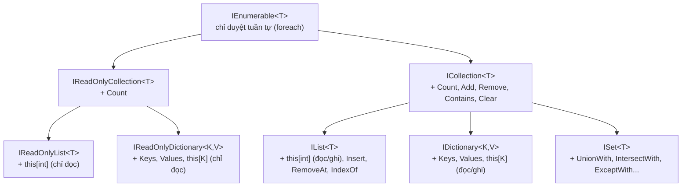
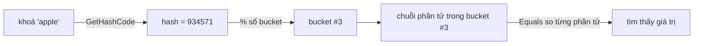

# Collections (Cấu trúc dữ liệu)

!!! info "Bạn đang ở đây · P1 → node `p1-collections`"
    **Cần trước:** generics (`List<T>`, ràng buộc `where`, kiểu tham số hoá), OOP (interface, `override`, `Equals`/`GetHashCode`), bộ nhớ & kiểu dữ liệu (stack vs heap, value type vs reference type).
    **Mở khoá:** LINQ (chạy trên mọi `IEnumerable<T>`), thiết kế API tầng dịch vụ (nhận tham số kiểu interface), tối ưu hiệu năng bằng `Span<T>` và chọn đúng cấu trúc dữ liệu.
    ⏱️ Fast path ~70 phút · Deep dive +80 phút.

> **Mục tiêu (đo được):** Sau chương này bạn (1) **chọn đúng** collection cho một thao tác cho trước và **giải thích bằng Big-O** vì sao; (2) **tự viết** một key tuỳ chỉnh cho `Dictionary` với `Equals`/`GetHashCode` đúng và **chứng minh** vì sao viết sai làm mất phần tử; (3) **liệt kê đầy đủ** cây interface collection và biết nên nhận tham số kiểu nào; (4) **nhận diện và sửa** lỗi sửa collection trong lúc `foreach`; (5) dùng được `Span<T>` để slice mảng không cấp phát và collection expression `[..]` để gộp dữ liệu.

---

## 0. Đoán nhanh trước khi học (60 giây)

Đọc và **tự đoán output** trước khi mở đáp án.

```csharp title="Đoán output"
// test:run
var d = new Dictionary<Point, string>();
d[new Point(1, 2)] = "A";
Console.WriteLine(d.ContainsKey(new Point(1, 2)));   // true hay false?

class Point
{
    public int X { get; }
    public int Y { get; }
    public Point(int x, int y) { X = x; Y = y; }
}
```

??? note "Đáp án — mở SAU khi đã đoán"
    In ra **`False`**. `Point` là `class` (reference type) và **không** override `Equals`/`GetHashCode`, nên `Dictionary` dùng **so sánh tham chiếu mặc định**: hai đối tượng `new Point(1,2)` khác nhau là hai địa chỉ heap khác nhau → hash khác nhau → không tìm thấy. Đây là **lỗi kinh điển** làm "mất" phần tử trong Dictionary. Mục 4 sẽ mổ xẻ và cho bạn 3 cách sửa. (Nếu `Point` là `record` hoặc `record struct` thì kết quả là `True`, vì record tự sinh `Equals`/`GetHashCode` theo giá trị.)

---

## 1. Bức tranh tổng thể: cây interface collection

Trước khi học từng lớp cụ thể, bạn phải nắm **hệ phân cấp interface**. Đây là thứ quyết định bạn viết API tốt hay xấu: **nhận tham số kiểu interface hẹp nhất mà bạn thật sự cần**, trả về kiểu vừa đủ.



### 1.1 Từng interface: cái gì + có gì + khi nào nhận

| Interface | Thêm được gì so với cha | Dùng làm tham số khi… |
|---|---|---|
| `IEnumerable<T>` | Chỉ có `GetEnumerator()` → duyệt một chiều, một lần | Bạn **chỉ cần đọc tuần tự** (foreach, LINQ). Kiểu tham số **rộng nhất** — nhận được mọi collection, cả kết quả LINQ lười (lazy). |
| `IReadOnlyCollection<T>` | `+ Count` | Bạn cần biết **số lượng** nhưng cam kết không sửa. |
| `IReadOnlyList<T>` | `+ this[int]` (chỉ đọc) | Bạn cần **truy cập theo chỉ số** nhưng không sửa. |
| `IReadOnlyDictionary<K,V>` | `+ Keys, Values, this[K]` (chỉ đọc), `TryGetValue`, `ContainsKey` | Bạn cần **tra cứu theo khoá** nhưng cam kết không sửa (ví dụ trả cấu hình ra ngoài). |
| `ICollection<T>` | `+ Count, Add, Remove, Contains, Clear, CopyTo, IsReadOnly` | Bạn cần **thêm/bớt** phần tử nhưng không quan tâm thứ tự/chỉ số. |
| `IList<T>` | `+ this[int]` (đọc/ghi)`, Insert, RemoveAt, IndexOf` | Bạn cần **truy cập/chèn theo chỉ số**. |
| `IDictionary<K,V>` | `+ Keys, Values, this[K]` (đọc/ghi), `Add(k,v)`, `Remove(k)` | Bạn cần **tra cứu + sửa theo khoá** — kiểu tham số chuẩn cho tầng dịch vụ nhận "một bảng ánh xạ" mà không khoá cứng vào `Dictionary<K,V>` cụ thể. |
| `ISet<T>` | `+ UnionWith, IntersectWith, ExceptWith, IsSubsetOf...` | Bạn cần **phép toán tập hợp** (hợp/giao/hiệu) chứ không chỉ thêm/bớt như `ICollection<T>`. |

!!! note "IDictionary/IReadOnlyDictionary/ISet nằm ở đâu trong cây"
    `IDictionary<K,V>` và `ISet<T>` đều kế thừa `ICollection<T>` tương ứng (`ICollection<KeyValuePair<K,V>>` và `ICollection<T>`); `IReadOnlyDictionary<K,V>` kế thừa `IReadOnlyCollection<KeyValuePair<K,V>>`. `Dictionary<K,V>` cài cả `IDictionary<K,V>` lẫn `IReadOnlyDictionary<K,V>`; `HashSet<T>` và `SortedSet<T>` cài `ISet<T>`.

!!! danger "Hiểu lầm phổ biến"
    "Cứ nhận `List<T>` cho tiện" là **thói quen xấu**. Nếu hàm chỉ duyệt để tính tổng, hãy nhận `IEnumerable<T>`. Nhận `List<T>` khoá cứng caller phải đưa đúng `List<T>` (không đưa được mảng, không đưa được kết quả LINQ) và ngầm cho phép hàm sửa danh sách của caller. **Nguyên tắc:** nhận kiểu **rộng nhất đủ dùng**, trả kiểu **cụ thể vừa đủ** để caller dùng thuận tiện.

```csharp title="Nhận interface hẹp — linh hoạt & an toàn"
// test:run
static int Tong(IEnumerable<int> xs)   // nhận rộng: mảng, List, HashSet, LINQ... đều được
{
    int s = 0;
    foreach (var x in xs) s += x;
    return s;
}

int[] mang = { 1, 2, 3 };
var ds = new List<int> { 4, 5 };
var tap = new HashSet<int> { 6 };

Console.WriteLine(Tong(mang));                 // 6
Console.WriteLine(Tong(ds));                   // 9
Console.WriteLine(Tong(tap));                  // 6
Console.WriteLine(Tong(new[] { 10, 20 }));     // 30 — mảng ẩn danh cũng được
```

**Ghi nhớ:** mọi collection generic trong .NET đều **cài `IEnumerable<T>`**, nên đây là mẫu số chung cho LINQ và `foreach`.

---

## 2. Mảng (Array) — nền tảng cố định kích thước

Mảng là cấu trúc **cấp thấp nhất**: một khối bộ nhớ **liên tục**, kích thước **cố định khi tạo**. Mọi collection khác (như `List<T>`) đều xây **trên** mảng.

### 2.1 Mảng 1 chiều

```csharp title="Mảng 1 chiều"
// test:run
int[] a = new int[3];        // 3 phần tử, mặc định = 0
a[0] = 10; a[1] = 20; a[2] = 30;

int[] b = { 1, 2, 3 };       // khởi tạo tắt
int[] c = new int[] { 4, 5 };

Console.WriteLine(a.Length);          // 3 (dùng Length, KHÔNG phải Count)
Console.WriteLine(a[2]);              // 30
Console.WriteLine(b[b.Length - 1]);  // 3
Console.WriteLine(c[^1]);            // 5 — chỉ số từ cuối (index-from-end)
```

- Kích thước cố định: `a[3] = 99;` sẽ ném `IndexOutOfRangeException` lúc chạy.
- Truy cập theo chỉ số là **O(1)** — cộng địa chỉ, không quét.
- Mảng là **reference type** (nằm trên heap) nhưng phần tử có thể là value type nằm gọn trong khối đó.

!!! danger "Length vs Count"
    Mảng dùng **`Length`**; `List<T>`/`Dictionary<>` dùng **`Count`**; `IEnumerable<T>` không có cả hai (phải `.Count()` của LINQ, tốn O(n)). Lẫn lộn là lỗi biên dịch thường gặp của người mới.

### 2.2 Mảng đa chiều `[,]` (rectangular)

Ma trận chữ nhật thật sự — mọi hàng cùng số cột, lưu **liền một khối**.

```csharp title="Mảng 2 chiều [,]"
// test:run
int[,] m = new int[2, 3];        // 2 hàng x 3 cột
m[0, 0] = 1; m[1, 2] = 6;

int[,] n = { { 1, 2, 3 }, { 4, 5, 6 } };   // khởi tạo tắt

Console.WriteLine(n.Length);              // 6 — TỔNG số phần tử
Console.WriteLine(n.GetLength(0));        // 2 — số hàng
Console.WriteLine(n.GetLength(1));        // 3 — số cột
Console.WriteLine(n.Rank);                // 2 — số chiều
Console.WriteLine(n[1, 2]);               // 6
```

### 2.3 Mảng răng cưa `[][]` (jagged) — mảng của mảng

Mỗi "hàng" là **một mảng riêng**, có thể **khác độ dài**. Không liền khối; mỗi hàng là một tham chiếu riêng trên heap.

```csharp title="Mảng răng cưa [][]"
// test:run
int[][] jag = new int[3][];       // 3 hàng, chưa cấp phát nội dung
jag[0] = new int[] { 1 };
jag[1] = new int[] { 2, 3, 4 };
jag[2] = new int[] { 5, 6 };

Console.WriteLine(jag.Length);          // 3 — số hàng
Console.WriteLine(jag[1].Length);       // 3 — độ dài hàng 1
Console.WriteLine(jag[1][2]);           // 4

foreach (var hang in jag)
    Console.WriteLine(string.Join(",", hang));
// 1
// 2,3,4
// 5,6
```

| | `[,]` (rectangular) | `[][]` (jagged) |
|---|---|---|
| Bố cục bộ nhớ | Một khối liền | Nhiều mảng rời (mảng chứa tham chiếu) |
| Độ dài mỗi hàng | Bằng nhau | Có thể khác nhau |
| Truy cập | `m[i, j]` | `m[i][j]` |
| Đếm phần tử | `Length` = tổng | `Length` = số hàng |
| Hiệu năng | Ít con trỏ, cache tốt cho ma trận đầy đủ | Linh hoạt hơn, thêm một lần dereference |

**Khi nào dùng gì:** ma trận đầy đủ, đều hàng → `[,]`. Dữ liệu răng cưa (mỗi dòng số cột khác nhau, ví dụ danh sách bạn bè của từng người) → `[][]`.

---

## 3. `List<T>` — mảng động dùng nhiều nhất

`List<T>` là collection bạn dùng 80% thời gian: như mảng nhưng **tự lớn lên**. Bên trong nó **bọc một mảng** (`T[] _items`) và tự thay mảng lớn hơn khi đầy.

### 3.1 Count vs Capacity — hai con số khác nhau

- **`Count`**: số phần tử **đang** chứa.
- **`Capacity`**: số ô mảng nền **đã cấp phát** (có thể lớn hơn Count).

```csharp title="Count vs Capacity: quan sát tăng gấp đôi"
// test:run
var list = new List<int>();
Console.WriteLine($"Count={list.Count} Cap={list.Capacity}");   // 0, 0

int capTruoc = list.Capacity;
for (int i = 0; i < 10; i++)
{
    list.Add(i);
    if (list.Capacity != capTruoc)
    {
        Console.WriteLine($"Thêm phần tử thứ {i + 1}: Capacity nhảy {capTruoc} -> {list.Capacity}");
        capTruoc = list.Capacity;
    }
}
Console.WriteLine($"Count={list.Count} Cap={list.Capacity}");
```

```text title="Kết quả (điển hình trên .NET)"
Count=0 Cap=0
Thêm phần tử thứ 1: Capacity nhảy 0 -> 4
Thêm phần tử thứ 5: Capacity nhảy 4 -> 8
Thêm phần tử thứ 9: Capacity nhảy 8 -> 16
Count=10 Cap=16
```

**Cơ chế:** khi mảng nền đầy, `List<T>` cấp mảng mới **gấp đôi** rồi copy toàn bộ sang. Vì việc "phình" chỉ thỉnh thoảng xảy ra và mỗi lần gấp đôi, chi phí trung bình mỗi `Add` là **O(1) khấu hao (amortized)** — dù thỉnh thoảng một lần Add tốn O(n) để copy.

!!! danger "Tối ưu bị bỏ quên"
    Nếu bạn biết trước sẽ có ~10.000 phần tử, hãy `new List<int>(10_000)` (đặt capacity ban đầu). Không đặt thì list phải phình + copy nhiều lần (log₂(10000) ≈ 14 lần cấp phát và copy), tạo rác GC. Đây là tối ưu "free" mà rất nhiều code bỏ lỡ.

### 3.2 Độ phức tạp các thao tác

| Thao tác | Big-O | Vì sao |
|---|---|---|
| Truy cập theo chỉ số `list[i]` | O(1) | Cộng địa chỉ trên mảng nền |
| `Add` (thêm cuối) | O(1) khấu hao | Thỉnh thoảng phải phình + copy |
| `Insert(0, x)` (chèn đầu) | O(n) | Phải dịch mọi phần tử sang phải |
| `RemoveAt(0)` / `Remove(x)` | O(n) | Dịch phần tử để lấp chỗ trống + có thể phải quét tìm |
| `Contains(x)` | O(n) | Quét tuyến tính (dùng `Equals`) |
| `IndexOf(x)` | O(n) | Quét tuyến tính |

```csharp title="Chèn/xoá giữa là O(n)"
// test:run
var xs = new List<string> { "a", "b", "d" };
xs.Insert(2, "c");                 // chèn "c" vào vị trí 2 -> dịch "d" sang phải
Console.WriteLine(string.Join(",", xs));   // a,b,c,d

xs.RemoveAt(0);                    // xoá "a" -> dịch b,c,d sang trái
Console.WriteLine(string.Join(",", xs));   // b,c,d

bool coC = xs.Contains("c");       // quét O(n)
Console.WriteLine(coC);            // True
```

**Khi nào dùng `List<T>`:** cần thứ tự chèn, truy cập theo chỉ số, thêm chủ yếu ở cuối. **Khi nào tránh:** cần tìm theo khoá nhanh (→ `Dictionary`), cần chèn/xoá đầu liên tục (→ `Queue`/`LinkedList`).

---

## 4. `Dictionary<TKey, TValue>` — tra cứu theo khoá O(1)

`Dictionary` là **bảng băm (hash table)**: ánh xạ **khoá → giá trị** với tra cứu trung bình **O(1)**. Đây là collection quan trọng thứ hai sau `List`.

### 4.1 Cơ chế băm & xử lý va chạm



Quy trình khi bạn `dict[key]`:

1. Gọi **`key.GetHashCode()`** → một số nguyên (hash).
2. Rút gọn hash về **chỉ số bucket** (chia lấy dư theo số bucket).
3. Trong bucket đó có thể có nhiều phần tử (**va chạm** — collision): dùng **`key.Equals(...)`** so từng phần tử để tìm đúng.

Vì bước 1–2 là O(1) và mỗi bucket thường rất ít phần tử, tra cứu trung bình là **O(1)**. Trường hợp xấu nhất (mọi khoá cùng bucket) là O(n).

### 4.2 TẦM QUAN TRỌNG của `GetHashCode` + `Equals`

Đây là kiến thức **sống còn**. Nếu key tuỳ chỉnh viết sai hai hàm này, **phần tử sẽ "biến mất"** dù bạn vừa thêm vào.

**Hợp đồng bắt buộc:**

- Nếu `a.Equals(b) == true` thì **bắt buộc** `a.GetHashCode() == b.GetHashCode()`.
- `GetHashCode` phải **ổn định** khi đối tượng còn làm key (đừng băm theo field có thể đổi — mutable).

```csharp title="Key SAI: quên GetHashCode/Equals -> mất phần tử"
// test:skip minh hoạ có chủ đích key sai; kèm bản chạy ngay bên dưới
var d = new Dictionary<PointSai, string>();
d[new PointSai(1, 2)] = "A";
bool tim = d.ContainsKey(new PointSai(1, 2));   // FALSE! so tham chiếu -> khác đối tượng

class PointSai
{
    public int X, Y;
    public PointSai(int x, int y) { X = x; Y = y; }
    // KHÔNG override Equals/GetHashCode -> dùng mặc định (so tham chiếu)
}
```

Ba cách sửa đúng:

```csharp title="Sửa đúng: 3 cách cho key theo giá trị"
// test:run
// Cách 1: override Equals + GetHashCode thủ công
var d1 = new Dictionary<PointA, string>();
d1[new PointA(1, 2)] = "A";
Console.WriteLine(d1.ContainsKey(new PointA(1, 2)));   // True

// Cách 2: dùng record struct -> tự sinh Equals/GetHashCode theo giá trị
var d2 = new Dictionary<PointB, string>();
d2[new PointB(1, 2)] = "B";
Console.WriteLine(d2.ContainsKey(new PointB(1, 2)));   // True

// Cách 3: dùng ValueTuple làm key -> đã có sẵn Equals/GetHashCode theo giá trị
var d3 = new Dictionary<(int X, int Y), string>();
d3[(1, 2)] = "C";
Console.WriteLine(d3.ContainsKey((1, 2)));             // True

class PointA
{
    public int X { get; }
    public int Y { get; }
    public PointA(int x, int y) { X = x; Y = y; }
    public override bool Equals(object? o) => o is PointA p && p.X == X && p.Y == Y;
    public override int GetHashCode() => HashCode.Combine(X, Y);  // dùng HashCode.Combine!
}

record struct PointB(int X, int Y);
```

!!! danger "Đừng tự cộng/XOR hash bằng tay"
    Nhiều người viết `return X ^ Y;` cho `GetHashCode` — dễ sinh nhiều va chạm (ví dụ `(1,2)` và `(2,1)` cùng hash). Hãy dùng **`HashCode.Combine(...)`** của BCL: nó trộn bit tốt, xử lý được nhiều field, và mỗi lần chạy chương trình còn thêm seed ngẫu nhiên để chống tấn công băm.

### 4.3 Đọc/ghi an toàn: indexer vs Add vs TryGetValue

```csharp title="Các cách thao tác Dictionary"
// test:run
var tuoi = new Dictionary<string, int>();

// Ghi: indexer -> thêm MỚI hoặc GHI ĐÈ nếu đã có (không ném)
tuoi["An"] = 20;
tuoi["An"] = 21;                 // ghi đè, không lỗi
Console.WriteLine(tuoi["An"]);   // 21

// Add: thêm mới; nếu khoá đã tồn tại -> NÉM ArgumentException
try { tuoi.Add("An", 99); }
catch (ArgumentException) { Console.WriteLine("Add trùng khoá -> ném!"); }

// Đọc bằng indexer khoá không tồn tại -> NÉM KeyNotFoundException
try { _ = tuoi["Binh"]; }
catch (KeyNotFoundException) { Console.WriteLine("Đọc khoá thiếu -> ném!"); }

// TryGetValue: cách ĐỌC an toàn, không ném, không tra 2 lần
if (tuoi.TryGetValue("An", out int t))
    Console.WriteLine($"An = {t}");             // An = 21
if (!tuoi.TryGetValue("Binh", out int _))
    Console.WriteLine("Không có Binh");

// GetValueOrDefault: trả giá trị hoặc default
Console.WriteLine(tuoi.GetValueOrDefault("Binh", -1));   // -1
```

| Cách | Khoá đã có | Khoá chưa có | Khi nào dùng |
|---|---|---|---|
| `dict[k] = v` | Ghi đè | Thêm mới | Muốn "upsert" |
| `dict.Add(k, v)` | **Ném** `ArgumentException` | Thêm mới | Muốn phát hiện trùng khoá |
| `dict[k]` (đọc) | Trả giá trị | **Ném** `KeyNotFoundException` | Chắc chắn khoá tồn tại |
| `TryGetValue(k, out v)` | `true` + v | `false` + `default` | **Đọc an toàn, 1 lần tra** — mặc định nên dùng |
| `GetValueOrDefault(k)` | Trả giá trị | Trả `default`/giá trị chỉ định | Cần fallback gọn |

!!! danger "Anti-pattern tra hai lần"
    `if (d.ContainsKey(k)) x = d[k];` băm **hai lần**. Thay bằng `if (d.TryGetValue(k, out var x)) …` — băm một lần, nhanh gấp đôi và an toàn hơn.

### 4.4 Capacity của Dictionary: constructor, `EnsureCapacity`, `TrimExcess`

Giống `List<T>` ở mục 3.1, `Dictionary<K,V>` (và `HashSet<T>`) cũng có **capacity nội bộ** (mảng `buckets` + `entries`). Nếu biết trước quy mô, tránh để dictionary tự phình + rehash nhiều lần.

```csharp title="Dictionary capacity: constructor, EnsureCapacity, TrimExcess"
// test:run
var d = new Dictionary<int, string>(capacity: 100);   // cấp sẵn ~100 chỗ, tránh phình dần
for (int i = 0; i < 5; i++) d[i] = $"gt{i}";

int cap1 = d.EnsureCapacity(1000);   // đảm bảo capacity >= 1000, phình một lần nếu cần
Console.WriteLine(cap1 >= 1000);     // True

d.TrimExcess();     // thu nhỏ mảng nền về sát Count -> giải phóng bộ nhớ thừa
Console.WriteLine(d.Count);          // 5 — dữ liệu không đổi, chỉ bộ nhớ nền thay đổi
```

- `new Dictionary<K,V>(capacity)`: cấp sẵn số bucket đủ cho `capacity` phần tử — tương tự `new List<T>(n)`.
- `EnsureCapacity(n)`: đảm bảo capacity **ít nhất** `n`, trả về capacity thực tế sau khi đảm bảo.
- `TrimExcess()`: thu nhỏ mảng nền về sát `Count` hiện tại — dùng sau khi xoá nhiều phần tử và biết dictionary sẽ không phình lại sớm.

### 4.5 So sánh tuỳ chỉnh: `IEqualityComparer<T>`

Mặc định, `Dictionary<K,V>`/`HashSet<T>` dùng `EqualityComparer<T>.Default` (gọi `Equals`/`GetHashCode` của khoá). Bạn có thể **thay comparer** ngay tại constructor để đổi cách băm/so sánh — không cần sửa kiểu khoá.

```csharp title="IEqualityComparer<T> tuỳ chỉnh cho Dictionary và HashSet"
// test:run
var diemDanh = new Dictionary<string, int>(StringComparer.OrdinalIgnoreCase);
diemDanh["Nguyen Van A"] = 1;
Console.WriteLine(diemDanh.ContainsKey("nguyen van a"));   // True — không phân biệt hoa/thường
Console.WriteLine(diemDanh.ContainsKey("NGUYEN VAN A"));   // True

var tenDaGap = new HashSet<string>(StringComparer.OrdinalIgnoreCase) { "Alice", "Bob" };
Console.WriteLine(tenDaGap.Add("ALICE"));   // False — coi là đã có (so không phân biệt hoa/thường)
Console.WriteLine(tenDaGap.Count);          // 2

// Đối chiếu: HashSet mặc định PHÂN BIỆT hoa/thường
var macDinh = new HashSet<string> { "Alice" };
Console.WriteLine(macDinh.Add("ALICE"));    // True — mặc định coi là khác nhau
```

`StringComparer.OrdinalIgnoreCase` là một `IEqualityComparer<string>` dựng sẵn của BCL. Bạn cũng có thể tự viết lớp cài `IEqualityComparer<T>` (triển khai `Equals`/`GetHashCode` riêng) khi cần quy tắc so khớp phức tạp hơn (ví dụ so theo một phần của đối tượng) mà không đụng vào kiểu khoá gốc.

---

## 5. `HashSet<T>` — tập hợp không trùng lặp

`HashSet<T>` giống `Dictionary` nhưng **chỉ có khoá, không có giá trị**: nó bảo đảm **mỗi phần tử duy nhất**, `Contains` là **O(1)** trung bình, và hỗ trợ **phép toán tập hợp**.

```csharp title="HashSet: uniqueness + phép tập hợp"
// test:run
var s = new HashSet<int> { 1, 2, 2, 3 };   // trùng bị loại tự động
Console.WriteLine(s.Count);                 // 3
Console.WriteLine(s.Add(3));                // False — đã có
Console.WriteLine(s.Add(4));                // True  — mới
Console.WriteLine(s.Contains(2));           // True  — O(1)

var a = new HashSet<int> { 1, 2, 3, 4 };
var b = new HashSet<int> { 3, 4, 5, 6 };

var hop = new HashSet<int>(a); hop.UnionWith(b);           // hợp: 1,2,3,4,5,6
var giao = new HashSet<int>(a); giao.IntersectWith(b);     // giao: 3,4
var hieu = new HashSet<int>(a); hieu.ExceptWith(b);        // hiệu a\b: 1,2
var doiXung = new HashSet<int>(a); doiXung.SymmetricExceptWith(b);  // 1,2,5,6

Console.WriteLine(string.Join(",", hop.Order()));       // 1,2,3,4,5,6
Console.WriteLine(string.Join(",", giao.Order()));      // 3,4
Console.WriteLine(string.Join(",", hieu.Order()));      // 1,2
Console.WriteLine(string.Join(",", doiXung.Order()));   // 1,2,5,6

Console.WriteLine(new HashSet<int> { 1, 2 }.IsSubsetOf(a));   // True
```

| Phương thức | Ý nghĩa |
|---|---|
| `UnionWith` | Hợp (thêm mọi phần tử của tập kia) |
| `IntersectWith` | Giao (giữ phần tử có ở cả hai) |
| `ExceptWith` | Hiệu (bỏ phần tử có ở tập kia) |
| `SymmetricExceptWith` | Hiệu đối xứng (phần tử chỉ thuộc một trong hai) |
| `IsSubsetOf` / `IsSupersetOf` | Kiểm tra tập con / tập cha |
| `Overlaps` | Có phần tử chung không |

!!! note "`ExceptBy` và họ `...By` (LINQ)"
    LINQ bổ sung `ExceptBy`, `UnionBy`, `IntersectBy`, `DistinctBy` — cho phép so sánh **theo một khoá trích ra** thay vì cả phần tử. Ví dụ `nguoiDung.DistinctBy(u => u.Email)` loại trùng theo email. Đây là phương thức mở rộng của `IEnumerable<T>`, khác với `ExceptWith` (đột biến tại chỗ) của `HashSet<T>`.

**Khi nào dùng `HashSet<T>`:** khử trùng lặp, kiểm tra "đã thấy chưa" trong vòng lặp, phép toán tập hợp. Lưu ý: **không đảm bảo thứ tự** duyệt.

---

## 6. `Queue<T>`, `Stack<T>`, `LinkedList<T>`

### 6.1 `Queue<T>` — hàng đợi FIFO (vào trước ra trước)

```csharp title="Queue FIFO"
// test:run
var q = new Queue<string>();
q.Enqueue("A"); q.Enqueue("B"); q.Enqueue("C");   // thêm vào cuối
Console.WriteLine(q.Peek());       // A — xem đầu, không lấy ra
Console.WriteLine(q.Dequeue());    // A — lấy ra khỏi đầu
Console.WriteLine(q.Dequeue());    // B
Console.WriteLine(q.Count);        // 1 (còn C)

// Đọc an toàn khi có thể rỗng:
if (q.TryDequeue(out var x)) Console.WriteLine(x);   // C
Console.WriteLine(q.TryDequeue(out _));              // False — đã rỗng
```

`Enqueue`/`Dequeue`/`Peek` đều **O(1)**. Dùng cho: xử lý theo thứ tự đến (task queue, BFS duyệt đồ thị).

### 6.2 `Stack<T>` — ngăn xếp LIFO (vào sau ra trước)

```csharp title="Stack LIFO"
// test:run
var st = new Stack<int>();
st.Push(1); st.Push(2); st.Push(3);   // đẩy lên đỉnh
Console.WriteLine(st.Peek());          // 3 — xem đỉnh
Console.WriteLine(st.Pop());           // 3 — lấy khỏi đỉnh
Console.WriteLine(st.Pop());           // 2
Console.WriteLine(st.Count);           // 1

if (st.TryPop(out var top)) Console.WriteLine(top);   // 1
```

`Push`/`Pop`/`Peek` đều **O(1)**. Dùng cho: undo/redo, DFS, đánh giá biểu thức, lần vết đệ quy.

### 6.3 `LinkedList<T>` — danh sách liên kết đôi

Mỗi phần tử là một **node** trỏ tới node trước/sau. Chèn/xoá tại một node đã biết là **O(1)** (chỉ đổi con trỏ), nhưng **truy cập theo chỉ số là O(n)** (phải đi từng node) và tốn thêm bộ nhớ cho con trỏ.

```csharp title="LinkedList: chèn giữa O(1) khi có node"
// test:run
var ll = new LinkedList<string>();
var nodeB = ll.AddLast("B");     // trả về node
ll.AddFirst("A");                // A, B
ll.AddAfter(nodeB, "D");         // A, B, D
ll.AddBefore(nodeB, "X");        // A, X, B, D  (chèn O(1) vì đã có nodeB)

Console.WriteLine(string.Join(",", ll));   // A,X,B,D
Console.WriteLine(ll.First!.Value);        // A
Console.WriteLine(ll.Last!.Value);         // D
```

!!! danger "Đừng lạm dụng LinkedList<T>"
    Trên thực tế `LinkedList<T>` **hiếm khi thắng** `List<T>`. Con trỏ phá vỡ tính liền khối bộ nhớ → cache CPU miss nhiều → duyệt chậm hơn `List<T>` dù cùng O(n). Chỉ dùng khi bạn **thường xuyên chèn/xoá ở giữa và đã giữ sẵn tham chiếu node** (như trong LRU cache). Với đa số trường hợp, `List<T>` nhanh hơn nhờ locality.

### 6.4 `PriorityQueue<TElement, TPriority>` — hàng đợi theo độ ưu tiên (.NET 6+)

Khác `Queue<T>` (FIFO thuần tuý), `PriorityQueue<TElement, TPriority>` luôn **`Dequeue` phần tử có `TPriority` nhỏ nhất trước** (min-heap), bất kể thứ tự `Enqueue`. Bên trong là một **binary min-heap** dựng trên mảng — không phải cây con trỏ.

```csharp title="PriorityQueue: xử lý task theo độ ưu tiên"
// test:run
var pq = new PriorityQueue<string, int>();
pq.Enqueue("Sửa lỗi nghiêm trọng", 1);     // số nhỏ hơn = ưu tiên cao hơn
pq.Enqueue("Viết tài liệu", 5);
pq.Enqueue("Bảo trì định kỳ", 3);
pq.Enqueue("Vá bảo mật khẩn cấp", 0);

Console.WriteLine(pq.Peek());    // "Vá bảo mật khẩn cấp" — xem phần tử ưu tiên nhất, không lấy ra
Console.WriteLine(pq.Count);     // 4 — Peek không rút phần tử

while (pq.Count > 0)
    Console.WriteLine(pq.Dequeue());
// Vá bảo mật khẩn cấp
// Sửa lỗi nghiêm trọng
// Bảo trì định kỳ
// Viết tài liệu
```

| Thao tác | Big-O | Vì sao |
|---|---|---|
| `Enqueue` | O(log n) | Thêm vào cuối heap rồi "nổi" (sift-up) đến đúng vị trí |
| `Dequeue` | O(log n) | Lấy gốc, đưa phần tử cuối lên gốc rồi "chìm" (sift-down) |
| `Peek` | O(1) | Phần tử ưu tiên nhất luôn nằm ở gốc heap (chỉ số 0 của mảng) |

**Khi nào dùng:** lịch task theo độ ưu tiên, thuật toán Dijkstra/A* (lấy đỉnh có khoảng cách nhỏ nhất tiếp theo), xử lý sự kiện theo thời gian gần nhất. `PriorityQueue` **không** đảm bảo thứ tự ổn định (stable) giữa các phần tử cùng ưu tiên — nếu cần, ghép thêm một tiêu chí phụ (ví dụ thời điểm chèn) vào `TPriority`.

### 6.5 Concurrent collections — khi nhiều luồng cùng truy cập

!!! note "Thread-safety không phải mặc định"
    `List<T>`, `Dictionary<K,V>`, `Queue<T>`, `Stack<T>`... **không thread-safe**: nhiều luồng cùng ghi đồng thời có thể phá hỏng cấu trúc nội bộ hoặc ném exception khó tái hiện. Namespace `System.Collections.Concurrent` cung cấp các phiên bản an toàn cho đa luồng:

    - `ConcurrentDictionary<K,V>` — thay `Dictionary` khi có **nhiều luồng ghi**; nội bộ tự khoá theo từng phần (không cần bạn tự `lock` toàn bộ bảng). Lưu ý: `AddOrUpdate`/`GetOrAdd` đảm bảo **kết quả cuối cùng nhất quán**, nhưng delegate factory (`addValueFactory`/`updateValueFactory`) **có thể bị gọi nhiều lần** dưới tranh chấp cao — không nên coi thao tác "đọc-tính-ghi" bên trong là một giao dịch nguyên tử tuyệt đối; tránh đặt side-effect (log, gọi API...) trong các delegate đó.
    - `ConcurrentQueue<T>` / `ConcurrentStack<T>` — hàng đợi/ngăn xếp lock-free (hoặc gần như vậy) cho `Enqueue`/`Dequeue`, `Push`/`Pop` an toàn đa luồng.
    - `BlockingCollection<T>` — bọc một collection concurrent, thêm khả năng **chặn** (block) luồng tiêu thụ khi rỗng và luồng sản xuất khi đầy (bounded) — nền tảng cho mẫu producer-consumer.

    **Khi nào cần:** chỉ khi thật sự có **nhiều luồng cùng ghi** vào cùng một collection. Nếu chỉ một luồng ghi rồi "công bố" (publish) cho nhiều luồng chỉ đọc, hoặc dùng `lock` đơn giản quanh một collection thường là đủ và có thể nhanh hơn.

```csharp title="ConcurrentDictionary: GetOrAdd/AddOrUpdate nguyên tử"
// test:run
using System.Collections.Concurrent;

var dem = new ConcurrentDictionary<string, int>();
dem.AddOrUpdate("hits", 1, (_, cu) => cu + 1);   // chưa có -> thêm 1
dem.AddOrUpdate("hits", 1, (_, cu) => cu + 1);   // đã có -> cộng dồn thành 2
Console.WriteLine(dem["hits"]);                  // 2

int missCount = dem.GetOrAdd("misses", 0);       // chưa có -> thêm 0, trả về giá trị vừa thêm
Console.WriteLine(missCount);                    // 0
```

---

## 7. Các collection sắp xếp (Sorted)

Ba lớp "Sorted" giữ phần tử **theo thứ tự khoá** thay vì thứ tự chèn. Chúng khác nhau về bố cục và độ phức tạp.

| Lớp | Bên trong | Truy cập theo khoá | Thêm/xoá | Duyệt theo thứ tự | Bộ nhớ |
|---|---|---|---|---|---|
| `SortedDictionary<K,V>` | Cây đỏ-đen (balanced BST) | O(log n) | O(log n) | Có | Cao hơn (node cây) |
| `SortedList<K,V>` | Hai mảng song song (khoá + giá trị) | O(log n) tìm, O(1) theo index | O(n) chèn (dịch mảng) | Có | Thấp nhất, liền khối |
| `SortedSet<T>` | Cây đỏ-đen | O(log n) `Contains` | O(log n) | Có | Cao hơn |

```csharp title="SortedDictionary vs SortedList"
// test:run
var sd = new SortedDictionary<int, string>();
sd[3] = "ba"; sd[1] = "mot"; sd[2] = "hai";
// Duyệt LUÔN theo thứ tự khoá tăng dần, bất kể thứ tự chèn:
foreach (var kv in sd) Console.Write($"{kv.Key}={kv.Value} ");
Console.WriteLine();                     // 1=mot 2=hai 3=ba

var ss = new SortedSet<int> { 5, 1, 3, 3, 2 };   // sắp xếp + khử trùng
Console.WriteLine(string.Join(",", ss));         // 1,2,3,5
Console.WriteLine(ss.Min + " " + ss.Max);        // 1 5
Console.WriteLine(string.Join(",", ss.GetViewBetween(2, 4)));   // 2,3 — truy vấn khoảng

var sl = new SortedList<int, string>();
sl[3] = "c"; sl[1] = "a"; sl[2] = "b";
Console.WriteLine(sl.Keys[0]);           // 1 — truy cập theo INDEX (SortedList có)
Console.WriteLine(sl.Values[2]);         // c
```

**Chọn giữa `SortedDictionary` và `SortedList`:**

- Nhiều **chèn/xoá** ngẫu nhiên → `SortedDictionary` (chèn O(log n) thắng O(n)).
- Ít thay đổi, nhiều **đọc theo thứ tự / theo index / ít tốn bộ nhớ** → `SortedList` (liền khối, cache tốt).

`SortedSet<T>` = phiên bản "chỉ khoá" của `SortedDictionary`, thêm truy vấn khoảng (`GetViewBetween`), `Min`/`Max` O(log n).

### 7.1 Thứ tự tuỳ chỉnh: `IComparer<T>` và `IComparable<T>`

Ba lớp "Sorted" cần biết cách **so sánh hai khoá** để giữ thứ tự. Có hai cách cung cấp thứ tự:

- **`IComparable<T>`**: kiểu **tự triển khai** `CompareTo` — định nghĩa **một** thứ tự "tự nhiên" mặc định cho chính nó.
- **`IComparer<T>`**: một đối tượng **so sánh riêng biệt**, truyền vào constructor — cho phép **nhiều cách sắp xếp khác nhau** cho cùng một kiểu, kể cả kiểu bạn không sở hữu mã nguồn (ví dụ `string`).

```csharp title="IComparer<T>: SortedSet sắp theo độ dài rồi bảng chữ cái"
// test:run
var theoDoDai = new SortedSet<string>(
    Comparer<string>.Create((a, b) => a.Length != b.Length ? a.Length - b.Length : string.CompareOrdinal(a, b)));

theoDoDai.Add("chuoi");
theoDoDai.Add("bo");
theoDoDai.Add("ga");
theoDoDai.Add("ca");

Console.WriteLine(string.Join(",", theoDoDai));   // bo,ca,ga,chuoi
```

```csharp title="IComparable<T>: kiểu tự định nghĩa thứ tự mặc định"
// test:run
var bang = new SortedDictionary<MucDo, string>
{
    [new MucDo(2)] = "Trung bình",
    [new MucDo(1)] = "Thấp",
    [new MucDo(3)] = "Cao",
};

foreach (var kv in bang) Console.WriteLine($"{kv.Key.Cap}: {kv.Value}");
// 1: Thấp
// 2: Trung bình
// 3: Cao

readonly struct MucDo : IComparable<MucDo>
{
    public int Cap { get; }
    public MucDo(int cap) => Cap = cap;
    public int CompareTo(MucDo other) => Cap.CompareTo(other.Cap);
}
```

**Chọn cái nào:** kiểu do bạn viết và chỉ cần **một** thứ tự mặc định → cài `IComparable<T>` ngay trên kiểu. Cần **nhiều cách sắp xếp** khác nhau, hoặc không sở hữu mã nguồn kiểu đó → truyền `IComparer<T>` (dùng `Comparer<T>.Create(...)` cho nhanh, hoặc viết class riêng).

---

## 8. Immutable & read-only — bất biến và chỉ đọc

Có hai khái niệm **khác nhau** dễ nhầm:

- **Read-only view (khung nhìn chỉ đọc):** một "cửa sổ" không cho *bạn* sửa, nhưng **dữ liệu gốc vẫn có thể đổi** qua tham chiếu khác.
- **Immutable (bất biến thật):** sau khi tạo, **không ai** sửa được; mọi thao tác "sửa" trả về **bản sao mới**.

### 8.1 Read-only view

```csharp title="IReadOnlyList vs ReadOnlyCollection"
// test:run
using System.Collections.ObjectModel;

var goc = new List<int> { 1, 2, 3 };

// 1) Ép sang IReadOnlyList<T>: chỉ là kiểu tĩnh chỉ đọc
IReadOnlyList<int> view = goc;
Console.WriteLine(view[0]);           // 1
// view[0] = 9;  // KHÔNG biên dịch — indexer chỉ đọc

// 2) ReadOnlyCollection<T>: wrapper thời gian chạy
var ro = new ReadOnlyCollection<int>(goc);
Console.WriteLine(ro.Count);          // 3

// NHƯNG: sửa 'goc' thì view/ro cũng đổi theo (chỉ là cửa sổ, không phải bản sao)!
goc.Add(4);
Console.WriteLine(view.Count);        // 4  ← thay đổi "rò rỉ" qua!
Console.WriteLine(ro.Count);          // 4
```

!!! danger "Read-only KHÔNG phải immutable"
    Trả `IReadOnlyList<T>` từ một `List<T>` nội bộ chỉ chặn caller sửa **qua tham chiếu đó**; nếu bạn còn giữ `List<T>` gốc và sửa nó, view của caller thay đổi bất ngờ. Muốn thật sự bất biến, dùng `ImmutableArray`/`ImmutableList` hoặc trả về một bản sao.

### 8.2 Immutable thật (khái niệm)

`System.Collections.Immutable` cung cấp `ImmutableArray<T>`, `ImmutableList<T>`, `ImmutableDictionary<,>`… Mọi thao tác "sửa" **trả về instance mới**, gốc không đổi. An toàn tuyệt đối cho đa luồng (không cần khoá). Từ **.NET 8 trở đi**, namespace này đã nằm sẵn trong shared framework — dùng `using` thẳng, **không cần thêm package NuGet nào**.

```csharp title="ImmutableArray: sửa trả về bản mới"
// test:run
using System.Collections.Immutable;

var a = ImmutableArray.Create(1, 2, 3);
var b = a.Add(4);                    // a KHÔNG đổi; b là bản mới có 4
Console.WriteLine(a.Length);         // 3  — gốc bất biến
Console.WriteLine(b.Length);         // 4
```

- `ImmutableArray<T>`: bọc mảng, đọc/index **rất nhanh**, nhưng mỗi lần "sửa" copy **toàn bộ** → tốt khi hầu như chỉ đọc.
- `ImmutableList<T>`: cây cân bằng bên trong, "sửa" chỉ tạo lại nhánh nhỏ (structural sharing) → tốt khi sửa nhiều.

**Khi nào dùng:** state chia sẻ giữa nhiều luồng, snapshot cấu hình, dữ liệu không được phép thay đổi sau khi khởi tạo.

---

## 9. `Span<T>` / `ReadOnlySpan<T>` — làm việc trên vùng nhớ, không cấp phát

`Span<T>` là một **"cửa sổ" (view) lên vùng nhớ liên tục** — có thể là một mảng, một phần mảng, hay bộ nhớ stack — mà **không sao chép**. Nó là `ref struct` (chỉ sống trên stack), nên rất nhanh và không tạo rác cho GC.

```csharp title="Span: slice mảng KHÔNG copy"
// test:run
int[] mang = { 10, 20, 30, 40, 50 };

Span<int> lat = mang.AsSpan();          // cửa sổ lên toàn mảng
Span<int> giua = lat.Slice(1, 3);       // {20,30,40} — KHÔNG cấp phát mảng mới

giua[0] = 999;                          // ghi qua span -> SỬA THẲNG mảng gốc
Console.WriteLine(mang[1]);             // 999  ← vì span chỉ là cửa sổ

// ReadOnlySpan: cửa sổ chỉ đọc, dùng cho chuỗi/parse hiệu năng cao
ReadOnlySpan<char> s = "2026-07-01".AsSpan();
ReadOnlySpan<char> nam = s.Slice(0, 4); // "2026" — không tạo string mới
Console.WriteLine(int.Parse(nam));      // 2026
```

**Vì sao quan trọng:** cắt chuỗi/mảng để xử lý mà **không cấp phát**. Ví dụ parse một dòng CSV: dùng `Substring` tạo hàng loạt string rác; dùng `ReadOnlySpan<char>` slice thì zero-allocation.

!!! danger "Giới hạn của Span<T>"
    Vì là `ref struct`, `Span<T>` **không** dùng được làm field của class, không đưa vào `async`/`await`, không đóng gói (box), không dùng trong iterator `yield`. Cần lưu lâu dài hoặc qua ranh giới async thì dùng **`Memory<T>`/`ReadOnlyMemory<T>`** (họ hàng "được phép sống trên heap").

---

## 10. Bảng chọn collection theo thao tác + Big-O

Đây là **bảng tra cứu vàng** — thuộc bảng này là bạn chọn đúng cấu trúc trong 90% tình huống.

| Collection | Truy cập theo index | Tìm theo khoá | Thêm cuối | Chèn giữa | Kiểm tra tồn tại | Thứ tự |
|---|---|---|---|---|---|---|
| `T[]` (mảng) | O(1) | — | — (cố định) | — | O(n) | Thứ tự chèn |
| `List<T>` | O(1) | — | O(1)* | O(n) | O(n) | Thứ tự chèn |
| `Dictionary<K,V>` | — | O(1)* | O(1)* | — | O(1)* | Không đảm bảo |
| `HashSet<T>` | — | O(1)* | O(1)* | — | O(1)* | Không đảm bảo |
| `Queue<T>` | — | — | O(1) enqueue | — | O(n) | FIFO |
| `Stack<T>` | — | — | O(1) push | — | O(n) | LIFO |
| `LinkedList<T>` | O(n) | — | O(1) | O(1) (có node) | O(n) | Thứ tự chèn |
| `SortedDictionary<K,V>` | — | O(log n) | O(log n) | O(log n) | O(log n) | Theo khoá |
| `SortedList<K,V>` | O(1) theo index | O(log n) | O(n) | O(n) | O(log n) | Theo khoá |
| `SortedSet<T>` | — | — | O(log n) | O(log n) | O(log n) | Theo khoá |

*(`*` = trung bình / khấu hao)*

**Quy tắc chọn nhanh:**

- Tìm theo khoá là chính → `Dictionary`.
- Chỉ cần "có/không trùng" → `HashSet`.
- Danh sách có thứ tự, truy cập index → `List`.
- Cần luôn sắp xếp theo khoá → `SortedDictionary`/`SortedSet`.
- Xử lý theo thứ tự đến/rời → `Queue`/`Stack`.

---

## 11. Sửa collection trong lúc `foreach` → `InvalidOperationException`

Đây là **cạm bẫy runtime kinh điển**. Khi bạn `foreach`, enumerator ghi lại một số "phiên bản" của collection; **thêm/xoá phần tử làm đổi phiên bản** → lần lặp tiếp theo ném `InvalidOperationException: Collection was modified`.

```csharp title="Sửa khi foreach -> ném exception"
// test:run
var xs = new List<int> { 1, 2, 3, 4, 5 };
try
{
    foreach (var x in xs)
    {
        if (x % 2 == 0) xs.Remove(x);   // SỬA trong lúc duyệt -> nổ
    }
}
catch (InvalidOperationException ex)
{
    Console.WriteLine($"Nổ: {ex.Message}");   // Collection was modified...
}
```

Bốn cách xử lý đúng:

```csharp title="Cách xử lý an toàn"
// test:run
// Cách 1: duyệt ngược bằng vòng for theo index (an toàn khi RemoveAt)
var a = new List<int> { 1, 2, 3, 4, 5 };
for (int i = a.Count - 1; i >= 0; i--)
    if (a[i] % 2 == 0) a.RemoveAt(i);
Console.WriteLine(string.Join(",", a));       // 1,3,5

// Cách 2: RemoveAll với điều kiện (gọn nhất, một dòng)
var b = new List<int> { 1, 2, 3, 4, 5 };
b.RemoveAll(x => x % 2 == 0);
Console.WriteLine(string.Join(",", b));       // 1,3,5

// Cách 3: duyệt bản SAO, sửa bản gốc
var c = new List<int> { 1, 2, 3, 4, 5 };
foreach (var x in c.ToList())                 // ToList() tạo bản sao để duyệt
    if (x % 2 == 0) c.Remove(x);
Console.WriteLine(string.Join(",", c));       // 1,3,5

// Cách 4: gom cần xoá rồi xoá sau vòng lặp
var d = new List<int> { 1, 2, 3, 4, 5 };
var canXoa = d.Where(x => x % 2 == 0).ToList();
foreach (var x in canXoa) d.Remove(x);
Console.WriteLine(string.Join(",", d));       // 1,3,5
```

!!! danger "Dictionary cũng dính"
    Sửa `Dictionary` trong `foreach` cũng ném y hệt. Để xoá theo điều kiện: `foreach (var k in dict.Keys.ToList()) if (...) dict.Remove(k);` — duyệt bản sao của `Keys`.

---

## 12. Collection expression `[..]` và spread (C# 12)

Từ C# 12, cú pháp **collection expression** `[...]` tạo mảng/`List`/`Span`… bằng một cú pháp thống nhất, và toán tử **spread `..`** trải phần tử của một collection vào trong.

```csharp title="Collection expression + spread (C# 12)"
// test:run
// Tạo mảng/List bằng cú pháp []
int[] a = [1, 2, 3];
List<int> b = [4, 5, 6];
Span<int> sp = [7, 8, 9];               // dựng thẳng Span
Console.WriteLine(string.Join(",", a)); // 1,2,3

// Spread .. : trải phần tử của collection khác vào
int[] gop = [..a, ..b, 100];            // 1,2,3,4,5,6,100
Console.WriteLine(string.Join(",", gop));

// Trải kết hợp giá trị đơn lẻ
int[] c = [0, ..a, 99];                 // 0,1,2,3,99
Console.WriteLine(string.Join(",", c));

// Trả về từ phương thức nhận IEnumerable
static int[] Nhan2(IEnumerable<int> xs) => [..xs.Select(x => x * 2)];
Console.WriteLine(string.Join(",", Nhan2(a)));   // 2,4,6
```

- Kiểu đích quyết định collection thật tạo ra (`int[]`, `List<int>`, `Span<int>`…). Trình biên dịch chọn cách dựng tối ưu.
- `..expr` (spread) chỉ dùng **bên trong** collection expression, khác với `[start..end]` (range) khi lập chỉ mục.

!!! note "Đừng nhầm `..` spread với `..` range"
    `x[1..3]` là **range** (lát cắt từ chỉ số 1 đến trước 3). `[..x]` là **spread** (trải mọi phần tử của x). Cùng ký hiệu, khác ngữ cảnh.

---

## Cạm bẫy & thực chiến

1. **Key mutable trong Dictionary/HashSet.** Nếu bạn dùng object làm khoá rồi **sửa field mà `GetHashCode` phụ thuộc**, phần tử sẽ "lạc" vào bucket cũ và không tìm lại được. Quy tắc: **khoá phải bất biến** trong suốt thời gian làm khoá. Dùng `record`/`record struct` hoặc value tuple.

2. **`Contains` trên `List<T>` trong vòng lặp = O(n²).** Nếu bạn `foreach (var x in a) if (b.Contains(x)) …` với cả hai là `List`, đó là O(n·m). Chuyển `b` sang `HashSet` trước → `Contains` O(1), tổng còn O(n).

3. **Quên đặt capacity ban đầu.** Với dữ liệu lớn đã biết kích thước, `new List<T>(n)` / `new Dictionary<K,V>(n)` tránh hàng loạt lần phình + copy. Đo được sự khác biệt trong hot path.

4. **`.Count()` (LINQ) trên `IEnumerable` là O(n).** `IEnumerable<T>.Count()` duyệt toàn bộ (trừ khi nguồn cài `ICollection`). Nếu chỉ cần biết "có phần tử nào không", dùng `.Any()` (dừng ở phần tử đầu), đừng `.Count() > 0`.

5. **Sửa collection khi `foreach`.** Ném `InvalidOperationException`. Dùng `RemoveAll`, duyệt ngược bằng index, hoặc duyệt `.ToList()` (xem mục 11).

6. **Trả `List<T>` nội bộ ra ngoài.** Caller có thể `Clear()`/`Add()` phá vỡ bất biến của lớp bạn. Trả `IReadOnlyList<T>` hoặc bản sao. Nhớ: read-only view vẫn "rò rỉ" nếu bạn còn sửa gốc.

7. **Dùng `LinkedList<T>` vì "chèn giữa O(1)".** Trên thực tế duyệt chậm do cache miss; `List<T>` thường thắng. Chỉ dùng khi giữ sẵn node và chèn/xoá cực nhiều.

8. **So sánh float làm khoá.** Dùng `double`/`float` làm key Dictionary dễ hỏng vì sai số dấu phẩy động (`0.1 + 0.2 != 0.3`). Dùng `decimal`, hoặc khoá nguyên đã làm tròn.

---

## Bài tập

### Bài 1 (giàn giáo) — Đếm tần suất từ

Cho một câu, đếm mỗi từ xuất hiện bao nhiêu lần, in theo thứ tự bảng chữ cái.

```csharp title="bai1_giandao.cs"
// test:skip giàn giáo cho học viên tự điền
string cau = "mèo chó mèo cá chó mèo";
// TODO: dùng Dictionary<string,int> đếm tần suất
// TODO: in theo thứ tự khoá tăng dần
// Kỳ vọng: cá=1  chó=2  mèo=3
```

??? success "Lời giải"
    ```csharp title="bai1_loigiai.cs"
    // test:run
    string cau = "mèo chó mèo cá chó mèo";
    var dem = new Dictionary<string, int>();
    foreach (var tu in cau.Split(' '))
        dem[tu] = dem.GetValueOrDefault(tu) + 1;   // upsert an toàn

    foreach (var kv in new SortedDictionary<string, int>(dem))
        Console.WriteLine($"{kv.Key}={kv.Value}");
    // cá=1
    // chó=2
    // mèo=3
    ```
    **Điểm cốt lõi:** `GetValueOrDefault` tránh `KeyNotFoundException` cho lần gặp đầu; bọc vào `SortedDictionary` để in theo thứ tự khoá.

### Bài 2 (thiết kế) — Key tuỳ chỉnh đúng chuẩn

Tạo kiểu `ToaDo(int Hang, int Cot)` làm khoá `Dictionary`. Thêm 3 ô, rồi kiểm tra `ContainsKey` với **đối tượng mới** cùng giá trị phải trả `True`. Yêu cầu: **không** dùng `record` (tự viết `Equals`/`GetHashCode`).

```csharp title="bai2_giandao.cs"
// test:skip giàn giáo cho học viên tự điền
// TODO: viết class ToaDo với Equals + GetHashCode đúng hợp đồng
// TODO: dùng làm key Dictionary<ToaDo,string>, chứng minh ContainsKey trả True
```

??? success "Lời giải"
    ```csharp title="bai2_loigiai.cs"
    // test:run
    var luoi = new Dictionary<ToaDo, string>();
    luoi[new ToaDo(0, 0)] = "vua";
    luoi[new ToaDo(1, 2)] = "tuong";
    luoi[new ToaDo(7, 7)] = "tot";

    Console.WriteLine(luoi.ContainsKey(new ToaDo(1, 2)));   // True — đối tượng mới, cùng giá trị
    Console.WriteLine(luoi[new ToaDo(7, 7)]);               // tot
    Console.WriteLine(luoi.ContainsKey(new ToaDo(9, 9)));   // False

    sealed class ToaDo
    {
        public int Hang { get; }
        public int Cot { get; }
        public ToaDo(int hang, int cot) { Hang = hang; Cot = cot; }

        public override bool Equals(object? o) =>
            o is ToaDo t && t.Hang == Hang && t.Cot == Cot;

        public override int GetHashCode() => HashCode.Combine(Hang, Cot);
    }
    ```
    **Điểm cốt lõi:** `Equals` so **giá trị**, `GetHashCode` dùng `HashCode.Combine` để thoả hợp đồng (Equals ⇒ cùng hash). `Hang`/`Cot` là read-only ⇒ khoá bất biến.

### Bài 3 (thử thách) — LRU cache đơn giản

Viết cache dung lượng N: khi đầy và thêm khoá mới, **loại phần tử ít dùng gần đây nhất** (least-recently-used). Dùng kết hợp `Dictionary` + `LinkedList` để `Get`/`Put` đều O(1).

```csharp title="bai3_giandao.cs"
// test:skip giàn giáo cho học viên tự điền
// Gợi ý: LinkedList giữ thứ tự "mới dùng nhất ở đầu";
//        Dictionary<key, node> để tìm node O(1).
// Get(k): nếu có -> chuyển node lên đầu, trả value; nếu không -> -1.
// Put(k,v): thêm/ cập nhật, đưa lên đầu; nếu vượt N -> bỏ node cuối.
```

??? success "Lời giải"
    ```csharp title="bai3_loigiai.cs"
    // test:run
    var cache = new LruCache(2);
    cache.Put(1, 100);
    cache.Put(2, 200);
    Console.WriteLine(cache.Get(1));   // 100  (1 vừa dùng -> mới nhất)
    cache.Put(3, 300);                 // đầy N=2 -> loại 2 (ít dùng nhất)
    Console.WriteLine(cache.Get(2));   // -1   (đã bị loại)
    Console.WriteLine(cache.Get(3));   // 300

    sealed class LruCache
    {
        private readonly int _cap;
        private readonly LinkedList<(int Key, int Val)> _order = new();
        private readonly Dictionary<int, LinkedListNode<(int Key, int Val)>> _map = new();

        public LruCache(int cap) => _cap = cap;

        public int Get(int key)
        {
            if (!_map.TryGetValue(key, out var node)) return -1;
            _order.Remove(node);          // O(1) vì đã có node
            _order.AddFirst(node);        // đưa lên đầu = mới nhất
            return node.Value.Val;
        }

        public void Put(int key, int val)
        {
            if (_map.TryGetValue(key, out var node))
            {
                _order.Remove(node);
            }
            else if (_map.Count >= _cap)
            {
                var lru = _order.Last!;   // cuối = ít dùng nhất
                _order.RemoveLast();
                _map.Remove(lru.Value.Key);
            }
            var moi = new LinkedListNode<(int, int)>((key, val));
            _order.AddFirst(moi);
            _map[key] = moi;
        }
    }
    ```
    **Điểm cốt lõi:** đây là ví dụ **hiếm hoi** `LinkedList<T>` thật sự cần thiết — `Dictionary` cho tra node O(1), `LinkedList` cho di chuyển/loại node O(1). Không cấu trúc nào một mình làm được cả hai.

---

## Tự kiểm tra

Trả lời rồi mở đáp án.

1. Vì sao `Add` của `List<T>` là O(1) *khấu hao* chứ không phải O(1) tuyệt đối?

    ??? success "Đáp án"
        Vì thỉnh thoảng mảng nền đầy, phải cấp mảng gấp đôi và **copy toàn bộ (O(n))**. Nhưng vì mỗi lần gấp đôi kéo dài rất nhiều lần Add rẻ, chi phí **trung bình** mỗi Add vẫn là O(1) — gọi là khấu hao (amortized).

2. Một `class` làm key `Dictionary` mà chỉ override `Equals`, quên `GetHashCode`, hậu quả gì?

    ??? success "Đáp án"
        Vi phạm hợp đồng: hai key "bằng nhau" có thể **hash khác nhau** → rơi vào bucket khác → không tìm thấy. Phần tử "biến mất". Bắt buộc override **cả hai** và bảo đảm Equals ⇒ cùng hash (dùng `HashCode.Combine`).

3. Khác nhau giữa `dict.Add(k,v)` và `dict[k]=v` khi khoá đã tồn tại?

    ??? success "Đáp án"
        `Add` **ném** `ArgumentException`; indexer **ghi đè** không lỗi. Dùng `Add` khi muốn phát hiện trùng khoá, dùng indexer khi muốn upsert.

4. Vì sao `foreach` rồi `list.Remove(x)` bên trong lại ném exception, và hai cách sửa?

    ??? success "Đáp án"
        Enumerator phát hiện collection đổi "phiên bản" giữa chừng → ném `InvalidOperationException`. Sửa: (a) `list.RemoveAll(predicate)`; (b) duyệt ngược `for (i=Count-1; i>=0; i--)` + `RemoveAt`; (c) duyệt `list.ToList()` rồi sửa gốc.

5. Nên nhận tham số kiểu gì cho hàm chỉ duyệt để tính tổng, và vì sao?

    ??? success "Đáp án"
        `IEnumerable<T>` — rộng nhất, nhận được mảng, `List`, `HashSet`, kết quả LINQ; đồng thời báo rõ hàm **không sửa** collection của caller. Nhận `List<T>` là khoá cứng và cho phép sửa ngầm.

6. `Span<T>` khác `Memory<T>` ở đâu; khi nào phải dùng `Memory<T>`?

    ??? success "Đáp án"
        `Span<T>` là `ref struct`, chỉ sống trên stack — **không** làm field, không qua `async`/`await`, không box. Cần giữ lát cắt vùng nhớ lâu dài hoặc truyền qua ranh giới `async` thì dùng `Memory<T>`/`ReadOnlyMemory<T>` (được phép nằm trên heap).

7. So sánh `SortedDictionary` và `SortedList` về chèn và bộ nhớ.

    ??? success "Đáp án"
        `SortedDictionary` là cây đỏ-đen: chèn/xoá **O(log n)** nhưng tốn bộ nhớ cho node. `SortedList` là hai mảng song song: chèn **O(n)** (dịch mảng) nhưng liền khối, ít bộ nhớ, truy cập theo index O(1). Nhiều thay đổi → SortedDictionary; ít thay đổi/nhiều đọc theo thứ tự → SortedList.

8. `[..a, ..b]` nghĩa là gì, và khác `a[1..3]` chỗ nào?

    ??? success "Đáp án"
        `[..a, ..b]` là collection expression với toán tử **spread** — trải mọi phần tử của `a` rồi `b` vào một collection mới. `a[1..3]` là **range** — lát cắt của `a` từ chỉ số 1 đến trước 3. Cùng ký hiệu `..` nhưng khác ngữ cảnh (spread bên trong `[]` vs range khi lập chỉ mục).

9. `PriorityQueue<TElement, TPriority>` rút phần tử ra theo tiêu chí nào, và `Enqueue`/`Dequeue`/`Peek` có độ phức tạp gì?

    ??? success "Đáp án"
        Luôn `Dequeue` phần tử có **`TPriority` nhỏ nhất** trước (min-heap), bất kể thứ tự `Enqueue`. `Enqueue`/`Dequeue` là **O(log n)** (sift-up/sift-down trên heap dựng bằng mảng), `Peek` là **O(1)** vì phần tử ưu tiên nhất luôn ở gốc heap.

10. Muốn `Dictionary<string,int>` coi `"AN"` và `"an"` là cùng một khoá thì làm thế nào, và cơ chế nào cho phép việc đó?

    ??? success "Đáp án"
        Truyền một `IEqualityComparer<string>` tuỳ chỉnh vào constructor, ví dụ `new Dictionary<string,int>(StringComparer.OrdinalIgnoreCase)`. Dictionary sẽ dùng `Equals`/`GetHashCode` của **comparer này** thay vì của kiểu khoá mặc định khi băm và so sánh — không cần sửa gì ở kiểu `string`.

11. Khi nào nên đổi từ `Dictionary<K,V>` + `lock` thủ công sang `ConcurrentDictionary<K,V>`?

    ??? success "Đáp án"
        Khi thật sự có **nhiều luồng cùng ghi** đồng thời vào cùng một bảng với tần suất cao. `ConcurrentDictionary` cho kết quả cuối cùng nhất quán qua `AddOrUpdate`/`GetOrAdd` mà không cần khoá toàn bộ bảng cho mỗi thao tác, giảm tranh chấp so với `lock` thô — nhưng nhớ delegate factory có thể chạy nhiều lần dưới tranh chấp cao (xem lưu ý ở mục Concurrent collections). Nếu chỉ một luồng ghi rồi nhiều luồng chỉ đọc, `Dictionary` thường + đồng bộ đơn giản (hoặc immutable) vẫn đủ và nhanh hơn.

12. `IComparer<T>` khác `IComparable<T>` ở điểm nào, và khi nào bắt buộc phải dùng `IComparer<T>`?

    ??? success "Đáp án"
        `IComparable<T>` triển khai **ngay trên kiểu** để định nghĩa một thứ tự "tự nhiên" duy nhất. `IComparer<T>` là một đối tượng so sánh **tách biệt**, truyền vào constructor của `SortedSet`/`SortedDictionary`/`Sort`, cho phép nhiều cách sắp xếp khác nhau. Bắt buộc dùng `IComparer<T>` khi kiểu khoá không do bạn viết (ví dụ `string`) nên không thể thêm `IComparable<T>` vào đó.

---

??? abstract "DEEP DIVE — Cơ chế tầng dưới (IL / runtime / hiệu năng)"
    **`List<T>` là gì ở tầng CLR.** `List<T>` chứa ba field: `T[] _items`, `int _size` (chính là `Count`), và `int _version`. `_version` tăng mỗi lần Add/Remove/Clear. Enumerator chụp `_version` lúc bắt đầu `foreach`; mỗi `MoveNext` so lại — lệch là ném `InvalidOperationException`. Đó chính là lý do "sửa khi foreach nổ".

    **`foreach` biên dịch thành gì.** Trên `List<T>`, `foreach` KHÔNG cấp phát enumerator trên heap: `List<T>.GetEnumerator()` trả về **struct** `List<T>.Enumerator`, và trình biên dịch gọi trực tiếp `MoveNext`/`Current` (duck typing, không qua interface) → zero-allocation, có thể inline. Nhưng nếu bạn `foreach` qua biến kiểu `IEnumerable<T>`, nó box enumerator struct thành heap object và gọi qua interface (chậm hơn, có cấp phát). Bài học: duyệt qua kiểu cụ thể trong hot path.

    **Bảng băm bên trong Dictionary.** .NET dùng hai mảng: `int[] _buckets` và `Entry[] _entries`, mỗi `Entry` có `hashCode`, `next` (chỉ số entry kế trong cùng bucket — separate chaining bằng chỉ số, không phải con trỏ), `key`, `value`. Va chạm nối thành chuỗi qua `next`. Khi load factor vượt ngưỡng, dictionary **rehash**: cấp bucket mới (số nguyên tố kế tiếp) và phân bố lại. `GetHashCode` được **cache** trong `Entry.hashCode` nên rehash không gọi lại `GetHashCode`.

    **Randomized hashing của string.** Từ lâu .NET dùng seed ngẫu nhiên mỗi lần chạy cho `string.GetHashCode()` để chống tấn công "hash flooding" (kẻ tấn công cố tình gửi khoá cùng bucket làm O(n²)). Hệ quả: **không được lưu `GetHashCode()` của string ra file/DB** rồi kỳ vọng ổn định giữa các lần chạy.

    **Vì sao `List<T>` thắng `LinkedList<T>` trong thực tế.** CPU đọc bộ nhớ theo **cache line** (~64 byte). `List<T>` liền khối nên duyệt tuần tự "prefetch" cực hiệu quả — đọc một lần được nhiều phần tử. `LinkedList<T>` rải node khắp heap: mỗi bước là một lần cache miss (~hàng trăm chu kỳ). Vì thế O(n) của List nhanh hơn O(n) của LinkedList nhiều lần trên dữ liệu thật.

    **`Span<T>` và JIT.** `Span<T>` là `ref struct` chứa một **managed pointer (`ref`)** + độ dài. JIT xử lý nó gần như con trỏ thô: `span[i]` biên dịch thành cộng địa chỉ + kiểm biên. Với vòng lặp `for` trên span có độ dài cố định, JIT còn **loại bỏ kiểm biên (bounds-check elimination)** vì chứng minh được chỉ số luôn hợp lệ — nhanh ngang C. Đó là lý do các API parse hiệu năng cao (`Utf8Parser`, `int.Parse(ReadOnlySpan<char>)`) đều nhận span.

    **Collection expression `[...]` biên dịch ra gì.** Với kiểu đích `int[]`, `[1,2,3]` sinh IL tạo mảng và gán trực tiếp (như `new int[]{...}`). Với `List<int>`, nó gọi constructor có capacity rồi Add — trình biên dịch biết trước số phần tử tĩnh nên đặt capacity tối ưu, tránh phình. Với spread `..`, nếu nguồn cài `ICollection<T>` (biết `Count`), nó dùng `CopyTo` một phát; nếu không thì foreach từng phần tử. Nghĩa là `[..a]` với `a` là mảng/List rất rẻ.

    **`CollectionsMarshal` — escape hatch cho tối ưu cực hạn.** Lớp tĩnh `System.Runtime.InteropServices.CollectionsMarshal` cho phép chạm thẳng vào bộ nhớ nội bộ của `List<T>`/`Dictionary<K,V>` mà API công khai không lộ ra. `CollectionsMarshal.AsSpan(list)` trả về `Span<T>` bọc trực tiếp mảng nền của `List<T>` — **không copy** — hữu ích khi một API nhận `Span<T>` nhưng dữ liệu đang nằm trong `List<T>`. `CollectionsMarshal.GetValueRefOrNullRef(dict, key)` trả về một **tham chiếu (`ref`)** thẳng tới ô value bên trong `Dictionary<K,V>`, cho phép đọc-sửa tại chỗ (đặc biệt với `struct` value lớn) mà không phải tra cứu hai lần (đọc rồi ghi lại). Đây là API nâng cao, dễ dùng sai (ví dụ giữ `Span` rồi `Add` làm phình mảng nền, khiến span cũ trỏ vào vùng nhớ đã bỏ) — chỉ nên dùng sau khi đã đo hiệu năng và xác nhận là điểm nghẽn thật sự.

---

Tiếp theo -> linq và xử lý dữ liệu khai báo
