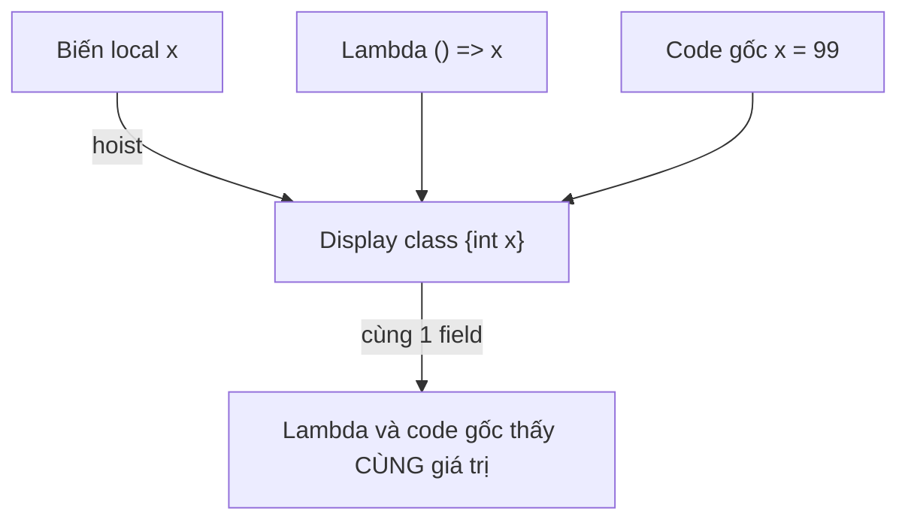
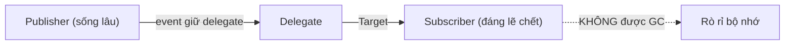

# Delegates, Events & Lambda

!!! info "Bạn đang ở đây · P1 → node `p1-delegates-events`"
    **Cần trước:** hiểu lớp/đối tượng/phương thức, `static` vs instance, generic cơ bản, và cách gọi phương thức (chương oop + generics).
    **Mở khoá:** LINQ (toàn bộ `Where`/`Select` là delegate), async callback, event-driven UI, DI với factory delegate, và Expression tree mà EF Core dùng để dịch truy vấn sang SQL.
    ⏱️ Fast path ~60 phút · Deep dive +70 phút.

> **Mục tiêu (đo được):** Sau chương này bạn (1) **khai báo và gọi** được delegate tùy chỉnh, `Func`/`Action`/`Predicate`; (2) **viết đúng** lambda expression/statement, biết khi nào biến bị *capture* và dự đoán chính xác giá trị closure trong vòng lặp; (3) **thiết kế** một cặp publisher/subscriber bằng `event` an toàn null và đa luồng; (4) **nhận diện và sửa** rò rỉ bộ nhớ do quên unsubscribe; (5) **phân biệt** `Func<>` với `Expression<Func<>>` và giải thích vì sao EF Core cần cái sau.

---

## 0. Đoán nhanh trước khi học (30 giây)

Đọc và **tự đoán output** trước khi mở đáp án.

```csharp title="Đoán output"
// test:run
var actions = new List<Action>();
for (int i = 0; i < 3; i++)
{
    actions.Add(() => Console.Write(i));   // capture biến i
}
foreach (var a in actions) a();            // in ra cái gì?
Console.WriteLine();
```

??? note "Đáp án — mở SAU khi đã đoán"
    Với `for` (biến `i` **dùng chung** cho cả vòng lặp) kết quả là **`333`** — cả 3 lambda cùng *capture một biến `i` duy nhất*, và khi chúng chạy thì `i` đã bằng 3. Đây là cạm bẫy closure kinh điển. Nếu đổi sang `foreach` (mỗi vòng có **biến mới**) thì kết quả là **`012`**. Mục 5.3 sẽ mổ xẻ tận IL vì sao `for` và `foreach` khác nhau, và cách sửa.

---

## 1. Delegate là gì? Con trỏ hàm type-safe

### 1.1 Trực giác: "biến chứa được một hàm"

Bình thường biến chứa **dữ liệu**: `int x = 5;`. Delegate cho phép biến chứa **một phương thức** — bạn có thể gán hàm vào biến, truyền hàm làm tham số, trả hàm về từ hàm khác. Trong C/C++ có "con trỏ hàm" nhưng con trỏ hàm không kiểm tra kiểu: gọi sai chữ ký là crash. **Delegate là con trỏ hàm được kiểm tra kiểu ở compile time** — nếu chữ ký (kiểu tham số + kiểu trả về) không khớp, code không biên dịch.

Vì sao cần? Vì nó cho phép **truyền hành vi như dữ liệu**. Thay vì hard-code "làm gì", ta để nơi gọi quyết định. Đó là nền của LINQ, callback, event, và toàn bộ lập trình hàm trong C#.

```csharp title="Delegate tùy chỉnh cơ bản"
// test:run
// 1) Khai báo KIỂU delegate: một hàm nhận (int,int) trả int
MathOp op;                 // biến delegate, hiện đang null

// 2) Gán một phương thức vào biến
op = Add;                  // gán tên hàm, KHÔNG có ()
Console.WriteLine(op(3, 4));       // 7  — gọi qua delegate

op = Multiply;             // trỏ sang hàm khác cùng chữ ký
Console.WriteLine(op(3, 4));       // 12

// 3) Invoke() tường minh — tương đương op(3,4)
Console.WriteLine(op.Invoke(3, 4)); // 12

static int Add(int a, int b) => a + b;
static int Multiply(int a, int b) => a * b;

delegate int MathOp(int a, int b);   // khai báo kiểu delegate
```

```text title="Kết quả"
7
12
12
```

**Điểm mấu chốt:** `MathOp` là một **kiểu** (giống `class`). `op` là **biến** của kiểu đó. Gán `op = Add` — ta gán *chính hàm* chứ không gọi nó (không có dấu `()`). Compiler kiểm tra `Add` có đúng chữ ký `(int,int) -> int` không. Phép gán tên phương thức thẳng vào biến delegate như vậy gọi là **method group conversion**: compiler tự bọc tên `Add` (một "nhóm phương thức" — có thể có nhiều overload) thành một instance delegate tương thích chữ ký, không cần bạn viết `new MathOp(Add)` tường minh (dù vẫn hợp lệ).

**Lỗi nếu gán sai chữ ký:** đây chính là "type-safe" ở tên gọi — nếu hàm gán vào không khớp *cả* số lượng tham số lẫn kiểu tham số/kiểu trả về so với khai báo delegate, compiler từ chối biên dịch chứ không chờ tới lúc chạy mới crash như con trỏ hàm C/C++:

```csharp title="Gán sai chữ ký vào delegate: lỗi biên dịch (cố ý)"
// test:skip minh hoạ lỗi biên dịch cố ý — CS0123
MathOp op = AddThree;   // LỖI CS0123: AddThree nhận 3 tham số, MathOp chỉ khai báo 2

static int AddThree(int a, int b, int c) => a + b + c;

delegate int MathOp(int a, int b);
```

**Vì sao lỗi ngay lúc biên dịch?** `AddThree` có chữ ký `(int,int,int) -> int`, không khớp `(int,int) -> int` mà `MathOp` yêu cầu — dù cả hai đều "nhận số nguyên, trả số nguyên". Compiler so khớp *chính xác* số lượng và kiểu tham số (bỏ qua tên tham số), không tự động bớt/thêm tham số hay ép kiểu ngầm giữa các kiểu không tương thích. Đây là điểm khác biệt cốt lõi so với con trỏ hàm C/C++: sai chữ ký bị chặn **trước khi chạy**, không phải một crash bí ẩn lúc runtime.

### 1.2 Delegate là một class thật sự

Khi bạn viết `delegate int MathOp(int,int);`, compiler sinh ra một **class kín** kế thừa `System.MulticastDelegate` (bản thân nó kế thừa `System.Delegate`). Class này có:

- `Method` — `MethodInfo` của hàm đang trỏ tới.
- `Target` — đối tượng chứa hàm (null nếu hàm `static`).
- `Invoke`, `BeginInvoke`, `EndInvoke`.

```csharp title="Delegate mang theo cả Target lẫn Method"
// test:run
var counter = new Counter();
Func<int> next = counter.Next;     // delegate trỏ tới instance method
Console.WriteLine(next());          // 1
Console.WriteLine(next());          // 2
Console.WriteLine(next.Target == counter);   // True  — nhớ đối tượng
Console.WriteLine(next.Method.Name);          // Next  — nhớ hàm

class Counter
{
    private int _n;
    public int Next() => ++_n;
}
```

!!! danger "Hiểu lầm: 'delegate chỉ là con trỏ tới hàm'"
    Không đủ. Với **instance method**, delegate giữ *cả* tham chiếu tới đối tượng (`Target`). Đây chính là nguyên nhân rò rỉ bộ nhớ ở mục 8: publisher giữ delegate → delegate giữ subscriber → subscriber không được thu gom.

---

## 2. Func, Action, Predicate — delegate dựng sẵn

Bạn hiếm khi phải tự khai báo `delegate` vì BCL đã có sẵn hai họ generic phủ gần như mọi trường hợp, cộng thêm vài delegate chuyên dụng cho một số API cũ.

**`Comparison<T>` là gì?** Một delegate nhận **hai** giá trị cùng kiểu `T` và trả về `int`: âm nếu vế trái nhỏ hơn, dương nếu lớn hơn, `0` nếu bằng — đúng quy ước so sánh thứ tự mà `List<T>.Sort` cần.

```csharp title="Comparison<T> tối thiểu: sắp xếp giảm dần"
// test:run
var numbers = new List<int> { 3, 1, 4, 1, 5 };
Comparison<int> descending = (a, b) => b.CompareTo(a);
numbers.Sort(descending);
Console.WriteLine(string.Join(",", numbers));   // 5,4,3,1,1
```

```text title="Kết quả"
5,4,3,1,1
```

**`Converter<TInput,TOutput>` là gì?** Một delegate nhận **một** giá trị kiểu `TInput` và trả về kiểu `TOutput` khác — dùng để "biến đổi" từng phần tử, ví dụ trong `List<T>.ConvertAll`.

```csharp title="Converter<TInput,TOutput> tối thiểu: chuyển List<int> sang List<string>"
// test:run
var numbers = new List<int> { 1, 2, 3 };
Converter<int, string> toText = n => $"#{n}";
List<string> labels = numbers.ConvertAll(toText);
Console.WriteLine(string.Join(",", labels));   // #1,#2,#3
```

```text title="Kết quả"
#1,#2,#3
```

Dưới đây là ba ví dụ **tối thiểu, độc lập** — mỗi ví dụ chỉ minh hoạ đúng MỘT khái niệm — trước khi xem bảng so sánh và ví dụ tổng hợp cả ba.

**a) `Action` tối thiểu.** Không nhận tham số, không trả về gì — chỉ gây tác dụng phụ:

```csharp title="Action tối thiểu: không tham số, không trả về"
// test:run
Action greet = () => Console.WriteLine("Xin chào");
greet();
```

```text title="Kết quả"
Xin chào
```

**b) `Func<TResult>` tối thiểu.** Không nhận tham số nhưng **trả về** một giá trị:

```csharp title="Func<TResult> tối thiểu: không tham số, có trả về"
// test:run
Func<int> lucky = () => 7;
Console.WriteLine(lucky());   // 7
```

```text title="Kết quả"
7
```

**c) `Predicate<T>` tối thiểu.** Nhận một tham số kiểu `T`, luôn trả về `bool` — dùng để kiểm tra điều kiện đúng/sai:

```csharp title="Predicate<T> tối thiểu: kiểm tra điều kiện"
// test:run
Predicate<int> isEven = x => x % 2 == 0;
Console.WriteLine(isEven(10));   // True
```

```text title="Kết quả"
True
```

| Họ | Trả về | Số tham số | Ví dụ |
|---|---|---|---|
| `Action` | `void` | 0 | `Action` = `void ()` |
| `Action<T1..T16>` | `void` | 1..16 | `Action<string>` = `void (string)` |
| `Func<TResult>` | `TResult` | 0 | `Func<int>` = `int ()` |
| `Func<T1..T16,TResult>` | `TResult` | 1..16 | `Func<int,int,int>` = `int (int,int)` |
| `Predicate<T>` | `bool` | 1 | `Predicate<int>` = `bool (int)` |
| `Comparison<T>` | `int` | 2 | `Comparison<int>` = `int (T x, T y)` — so sánh thứ tự, dùng cho `List<T>.Sort(Comparison<T>)` |
| `Converter<TInput,TOutput>` | `TOutput` | 1 | `Converter<string,int>` = `int (string)` — dùng cho `List<T>.ConvertAll` |

**Quy tắc nhớ:** `Func` **luôn có** kiểu trả về (tham số kiểu **cuối cùng** là kết quả). `Action` **không** trả về gì. `Predicate<T>` **không** phải bí danh (alias) của `Func<T,bool>` — đó là một **kiểu delegate riêng, khác** dù cùng chữ ký `bool (T)`; hai kiểu này không gán chéo trực tiếp cho nhau (xem cảnh báo bên dưới). `Predicate<T>` dùng cho vị từ (điều kiện đúng/sai), chủ yếu trong các API cũ của BCL.

```csharp title="Func / Action / Predicate mọi arity"
// test:run
Action greet = () => Console.WriteLine("Xin chào");     // 0 tham số, void
Action<string> greetName = n => Console.WriteLine($"Chào {n}");

Func<int> lucky = () => 7;                                // 0 tham số, trả int
Func<int, int> square = x => x * x;                        // 1 tham số
Func<int, int, int> add = (a, b) => a + b;                 // 2 tham số

Predicate<int> isEven = x => x % 2 == 0;                   // bool (int)

greet();
greetName("Nam");
Console.WriteLine(lucky());       // 7
Console.WriteLine(square(5));      // 25
Console.WriteLine(add(3, 4));      // 7
Console.WriteLine(isEven(10));     // True
```

```text title="Kết quả"
Xin chào
Chào Nam
7
25
7
True
```

### 2.1 Khi nào dùng cái nào

- Trả về giá trị → **`Func<...,TResult>`**.
- Chỉ gây tác dụng phụ (in, ghi log, cập nhật state) → **`Action<...>`**.
- Kiểm tra điều kiện, đặc biệt cho API cũ (`List<T>.Find`, `Array.FindAll`) → **`Predicate<T>`**. Với LINQ thì dùng `Func<T,bool>` (LINQ không nhận `Predicate<T>`).
- Cần đặt **tên có ngữ nghĩa** cho một khái niệm domain (ví dụ `delegate decimal PricingRule(Order o)`) → khai báo delegate tùy chỉnh để code đọc rõ nghĩa hơn `Func<Order,decimal>`.

!!! danger "Predicate<T> và Func<T,bool> KHÔNG hoán đổi tự do"
    Chúng cùng chữ ký nhưng là **hai kiểu khác nhau**, không gán chéo trực tiếp được:
    ```csharp title="Predicate và Func không gán chéo (lỗi biên dịch cố ý)"
    // test:skip minh hoạ lỗi biên dịch cố ý
    Predicate<int> p = x => x > 0;
    Func<int, bool> f = p;   // LỖI: không chuyển đổi ngầm Predicate<int> -> Func<int,bool>
    ```
    Muốn chuyển: bọc lại `Func<int,bool> f = x => p(x);`. Vì lý do này, code hiện đại ưu tiên `Func<T,bool>`.

### 2.2 Covariance và contravariance của delegate

Khi **gán một method** vào biến delegate, chữ ký không cần khớp *tuyệt đối* — CLR cho phép hai kiểu nới lỏng:

- **Return-type covariance:** method có thể trả về một kiểu **con** (cụ thể hơn) so với kiểu trả về khai báo trên delegate.
- **Parameter contravariance:** method có thể nhận tham số kiểu **cha** (tổng quát hơn) so với kiểu tham số khai báo trên delegate.

Ghi nhớ theo hướng dữ liệu chảy: đầu **ra** được phép *thu hẹp xuống* (con), đầu **vào** được phép *nới rộng lên* (cha) — luôn an toàn kiểu vì con luôn dùng được ở nơi cần cha.

Ngoài method group, chính các kiểu **`Func<out TResult>`** và **`Action<in T>`** cũng được khai báo với modifier `out`/`in` nên **bản thân đối tượng delegate** cũng hiệp biến/phản biến — gán thẳng `Func<string>` cho biến `Func<object>` là hợp lệ, không cần ép kiểu.

Dưới đây là bốn ví dụ **tối thiểu, độc lập** — mỗi ví dụ chỉ minh hoạ đúng MỘT khái niệm con, trước khi trộn cả bốn lại trong một ví dụ tổng hợp.

**a) Return-type covariance (method group).** Method trả kiểu con (`string`) gán được vào delegate khai báo trả kiểu cha (`object`):

```csharp title="Return-type covariance của method group"
// test:run
Func<object> makeObj = MakeString;   // MakeString trả string, delegate khai báo trả object
Console.WriteLine(makeObj());

static string MakeString() => "chuỗi";
```

```text title="Kết quả"
chuỗi
```

**b) Parameter contravariance (method group).** Method nhận kiểu cha (`object`) gán được vào delegate khai báo nhận kiểu con (`string`):

```csharp title="Parameter contravariance của method group"
// test:run
Action<string> printStr = PrintObject;   // PrintObject nhận object, delegate khai báo nhận string
printStr("hi");

static void PrintObject(object o) => Console.WriteLine(o);
```

```text title="Kết quả"
hi
```

**c) `Func<out TResult>` hiệp biến ở cấp generic.** Không chỉ method group — cả một **đối tượng delegate** `Func<string>` cũng gán thẳng được cho biến `Func<object>`:

```csharp title="Func<out TResult> hiệp biến"
// test:run
Func<string> fString = () => "chuỗi";
Func<object> fObject = fString;      // OK: Func<out TResult> hiệp biến theo TResult
Console.WriteLine(fObject());
```

```text title="Kết quả"
chuỗi
```

**d) `Action<in T>` phản biến ở cấp generic.** Một đối tượng delegate `Action<object>` gán được cho biến `Action<string>`:

```csharp title="Action<in T> phản biến"
// test:run
Action<object> aObject = o => Console.WriteLine($"nhận: {o}");
Action<string> aString = aObject;    // OK: Action<in T> phản biến theo T
aString("world");
```

```text title="Kết quả"
nhận: world
```

**Lỗi biên dịch khi làm ngược lại:** hiệp biến chỉ đi một chiều (con → cha). Gán một `Func<object>` cho biến `Func<string>` là sai kiểu vì hàm trả `object` bất kỳ không chắc là `string`:

```csharp title="Gán ngược chiều covariance: lỗi biên dịch (cố ý)"
// test:skip minh hoạ lỗi biên dịch cố ý — CS0266
Func<object> fObject = () => new object();
Func<string> fString = fObject;   // LỖI CS0266: không chuyển đổi ngầm Func<object> -> Func<string>
```

Sau khi đã thấy từng khái niệm con riêng lẻ, ví dụ dưới đây gộp cả bốn lại để thấy chúng nhất quán với nhau:

```csharp title="Covariance/contravariance của delegate (method group và generic, tổng hợp)"
// test:run
// 1) Method-group: trả kiểu con OK cho delegate khai báo trả kiểu cha
Func<object> makeObj = MakeString;
Console.WriteLine(makeObj());

// 2) Method-group: nhận kiểu cha OK cho delegate khai báo nhận kiểu con
Action<string> printStr = PrintObject;
printStr("hi");

// 3) Generic variance: gán CẢ delegate instance, không chỉ method group
Func<string> fString = () => "chuỗi";
Func<object> fObject = fString;      // OK: Func<out TResult> hiệp biến theo TResult
Console.WriteLine(fObject());

Action<object> aObject = o => Console.WriteLine($"nhận: {o}");
Action<string> aString = aObject;    // OK: Action<in T> phản biến theo T
aString("world");

static string MakeString() => "chuỗi";
static void PrintObject(object o) => Console.WriteLine(o);
```

```text title="Kết quả"
chuỗi
hi
chuỗi
nhận: world
```

---

## 3. Từ anonymous method tới lambda (lịch sử cú pháp)

**Anonymous method là gì?** Đó là một hàm được định nghĩa **ngay tại chỗ dùng, không có tên**, khai báo bằng từ khoá `delegate` kèm thân `{ }`, ra đời ở C# 2.0 để gán trực tiếp vào biến delegate mà không cần viết một phương thức riêng có tên.

Cùng một ý "hàm không tên", C# đã có 3 thế hệ cú pháp. Bảng dưới đây liệt kê cả ba để thấy tiến hoá cú pháp — cột "Lambda" chỉ là **xem trước** cú pháp `x => x * x`, Mục 4 mới mổ xẻ đầy đủ ý nghĩa và mọi biến thể của nó:

| Thế hệ | Ra ở | Cú pháp |
|---|---|---|
| Named method | C# 1.0 | gán tên phương thức đã có |
| Anonymous method | C# 2.0 | `delegate (int x) { return x*x; }` |
| Lambda (xem trước, chi tiết ở Mục 4) | C# 3.0 | `x => x * x` |

```csharp title="Ba thế hệ, cùng một kết quả"
// test:run
// C# 1.0: phương thức có tên
Func<int, int> f1 = Square;

// C# 2.0: anonymous method — từ khoá delegate + thân {}
Func<int, int> f2 = delegate (int x) { return x * x; };

// C# 3.0: lambda — gọn nhất
Func<int, int> f3 = x => x * x;

Console.WriteLine($"{f1(4)} {f2(4)} {f3(4)}");   // 16 16 16

static int Square(int x) => x * x;
```

```text title="Kết quả"
16 16 16
```

Anonymous method ngày nay hầu như chỉ còn một chỗ hữu ích: **bỏ qua tham số** bằng cách không viết danh sách tham số — `delegate { ... }` khớp *mọi* chữ ký cùng kiểu trả về. Ngoài ra hãy luôn dùng lambda.

---

## 4. Lambda: mổ xẻ đầy đủ

### 4.1 Expression lambda vs statement lambda

**Expression lambda** có thân là **MỘT biểu thức duy nhất** — giá trị của biểu thức đó tự động là kết quả trả về, không viết `return`:

```csharp title="Expression lambda: thân là một biểu thức"
// test:run
Func<int, int> exprBody = x => x * x;
Console.WriteLine(exprBody(3));    // 9
```

```text title="Kết quả"
9
```

**Statement lambda** có thân là **KHỐI `{ }`** — có thể chứa nhiều câu lệnh, và nếu lambda cần trả về giá trị thì bắt buộc viết `return` tường minh, giống hệt thân một phương thức thường:

```csharp title="Statement lambda: thân là khối {}, cần return tường minh"
// test:run
Func<int, int> stmtBody = x =>
{
    int r = x * x;
    Console.WriteLine($"tính {x}^2");
    return r;
};

Console.WriteLine(stmtBody(3));    // in "tính 3^2" rồi 9
```

```text title="Kết quả"
tính 3^2
9
```

**Lỗi nếu statement lambda quên `return`:** khối `{ }` không tự suy ra giá trị trả về như expression lambda — thiếu `return` trên một nhánh có khả năng thực thi là lỗi biên dịch, không phải cảnh báo:

```csharp title="Statement lambda quên return: lỗi biên dịch (cố ý)"
// test:skip minh hoạ lỗi biên dịch cố ý — CS1643
Func<int, int> broken = x =>
{
    int r = x * x;
    Console.WriteLine($"tính {x}^2");
    // LỖI CS1643: Not all code paths return a value in lambda expression of type 'Func<int,int>'
};
```

### 4.2 Mọi biến thể danh sách tham số

```csharp title="Các dạng khai báo tham số lambda"
// test:run
Func<int>          zero   = () => 0;            // 0 tham số: cần ()
Func<int, int>     one    = x => x + 1;         // 1 tham số: bỏ được ()
Func<int, int, int> two   = (a, b) => a + b;    // >=2: bắt buộc ()
Func<int, int>     typed  = (int x) => x + 1;   // ghi kiểu tường minh
Func<int, int>     disc   = _ => 42;            // _ = tham số bị bỏ (discard)
Func<int, int, int> disc2 = (_, _) => 99;       // nhiều discard (C# 9+)

Console.WriteLine($"{zero()} {one(5)} {two(2,3)} {typed(5)} {disc(1)} {disc2(1,2)}");
```

```text title="Kết quả"
0 6 5 6 42 99
```

**Default parameter trong lambda là gì?** Từ C# 12, tham số của lambda có thể có **giá trị mặc định** giống hệt tham số phương thức thường (`(int x, int y = 10) => ...`) — nếu người gọi không truyền `y`, lambda tự dùng `10`.

```csharp title="Default parameter trong lambda (C# 12+)"
// test:run
var withDefault = (int x, int y = 10) => x + y;
Console.WriteLine(withDefault(5));       // 15 — dùng y mặc định
Console.WriteLine(withDefault(5, 1));    // 6  — truyền y tường minh
```

```text title="Kết quả"
15
6
```

**`params` trong lambda là gì?** Cũng từ C# 12, tham số cuối của lambda có thể đánh dấu `params` để nhận **số lượng tuỳ ý đối số** gộp thành mảng, giống `params` trên phương thức thường:

```csharp title="params trong lambda (C# 12+)"
// test:run
var sum = (params int[] xs) => xs.Sum();
Console.WriteLine(sum());          // 0   — không truyền gì
Console.WriteLine(sum(1, 2, 3));   // 6   — gộp thành mảng {1,2,3}
Console.WriteLine(sum(new[] { 10, 20 }));   // 30 — truyền thẳng mảng cũng được
```

```text title="Kết quả"
0
6
30
```

**Lỗi nếu đặt sai thứ tự tham số có default:** giống quy tắc của phương thức thường, tham số có giá trị mặc định phải nằm **sau** mọi tham số bắt buộc — đặt trước sẽ không biên dịch:

```csharp title="Default parameter đặt sai thứ tự: lỗi biên dịch (cố ý)"
// test:skip minh hoạ lỗi biên dịch cố ý — CS1737
var bad = (int x = 10, int y) => x + y;   // LỖI CS1737: tham số có mặc định phải đứng sau tham số bắt buộc
```

### 4.3 Kiểu trả về suy luận & natural type (C# 10+)

Từ C# 10, một lambda có thể có **natural type** — compiler tự suy ra kiểu `Func`/`Action` phù hợp từ kiểu tham số và kiểu biểu thức trả về, cho phép gán thẳng vào `var` mà không cần khai báo `Func<...>` tường minh:

```csharp title="Natural type: var suy ra Func<string,int>"
// test:run
var parse = (string s) => int.Parse(s);   // suy ra Func<string,int>
Console.WriteLine(parse("42") + 1);        // 43
```

```text title="Kết quả"
43
```

Bạn cũng có thể **ghi rõ kiểu trả về** ngay trước danh sách tham số — hữu ích khi muốn ép compiler chọn một kiểu khác với kiểu nó tự suy luận (ví dụ `long` thay vì `int`):

```csharp title="Explicit return type: ép kiểu trả về tường minh"
// test:run
var makeLong = long (int x) => x;   // ghi rõ "long" để ép, nếu không sẽ suy ra int
Console.WriteLine(makeLong(5).GetType().Name);   // Int64
```

```text title="Kết quả"
Int64
```

**Lỗi khi `var` không thể suy ra kiểu (ambiguous):** natural type chỉ hoạt động khi compiler xác định được **duy nhất một** kiểu delegate phù hợp. Nếu thân lambda không đủ thông tin (ví dụ tham số không có kiểu tường minh), compiler không biết chọn `Func<int,int>`, `Func<double,double>`... nên nào và từ chối biên dịch:

```csharp title="var lambda ambiguous: lỗi biên dịch (cố ý)"
// test:skip minh hoạ lỗi biên dịch cố ý — CS8917
var ambiguous = x => x + 1;   // LỖI CS8917: The delegate type could not be inferred
```

### 4.4 Static lambda (C# 9+)

**Capture là gì (tóm tắt)?** *Capture* là khi lambda dùng một biến khai báo ở phạm vi bao ngoài nó (biến local, tham số, `this`) — lambda "giữ lại" tham chiếu tới biến đó thay vì chỉ dùng tham số của chính nó *(xem đầy đủ ở Mục 5 ngay sau)*.

Đánh dấu `static` để **cấm** lambda vô tình capture biến ngoài — nếu lỡ tay dùng biến bao ngoài, code không biên dịch. Lợi ích: rõ ràng "hàm thuần", tránh cấp phát closure ẩn.

```csharp title="static lambda ngăn capture ngoài ý muốn"
// test:run
int factor = 3;
Func<int, int> pure = static x => x * 2;    // OK — không đụng factor
Console.WriteLine(pure(10));                 // 20
Console.WriteLine(factor);                   // 3
```

```text title="Kết quả"
20
3
```

**Lỗi nếu static lambda cố capture biến ngoài:** `static` cấm hoàn toàn việc đụng tới biến local/tham số/`this` của phạm vi bao quanh — dùng `factor` bên trong là lỗi biên dịch ngay lập tức:

```csharp title="static lambda capture biến ngoài: lỗi biên dịch (cố ý)"
// test:skip minh hoạ lỗi biên dịch cố ý — CS8820
int factor = 3;
Func<int, int> bad = static x => x * factor;   // LỖI CS8820: A static anonymous function cannot contain a reference to 'factor'
```

---

## 5. Closure — capture biến ngoài

### 5.1 Closure là gì và vì sao nguy hiểm

Khi lambda **dùng một biến khai báo bên ngoài nó**, biến đó bị *capture*. Compiler không chép **giá trị** — nó chép **tham chiếu tới ô nhớ chứa biến**. Điều này nghĩa là:

1. Lambda **kéo dài vòng đời** biến bị capture (biến sống chừng nào lambda còn sống).
2. Nếu biến bị sửa sau đó, lambda "nhìn thấy" giá trị mới.

```csharp title="Capture theo tham chiếu, KHÔNG theo giá trị"
// test:run
int x = 10;
Func<int> read = () => x;    // capture biến x (không phải giá trị 10)
Console.WriteLine(read());    // 10
x = 99;                       // sửa biến ngoài
Console.WriteLine(read());    // 99  — lambda thấy giá trị mới!
```

```text title="Kết quả"
10
99
```

### 5.2 Cơ chế: compiler sinh "display class"

Để một biến local sống lâu hơn stack frame, compiler **nâng** (hoist) nó vào một class ẩn (display class), rồi cả code chứa lambda lẫn lambda cùng dùng field của class đó. Vì thế mới chia sẻ được ô nhớ.



### 5.3 Bẫy biến vòng lặp: for vs foreach

Đây là lỗi hay gặp nhất. Với **`for`**, biến điều khiển `i` là **một biến duy nhất** dùng lại qua các vòng — mọi lambda capture *chung* biến đó, nên sau vòng lặp tất cả thấy giá trị cuối.

```csharp title="Bẫy for: tất cả in ra giá trị cuối"
// test:run
var fs = new List<Func<int>>();
for (int i = 0; i < 3; i++)
    fs.Add(() => i);                 // capture CHUNG biến i
Console.WriteLine(string.Join(",", fs.Select(f => f())));   // 3,3,3
```

```text title="Kết quả"
3,3,3
```

Với **`foreach`**, kể từ C# 5.0 biến lặp là **biến mới mỗi vòng**, nên mỗi lambda capture một biến riêng:

```csharp title="foreach: mỗi vòng một biến mới"
// test:run
var fs = new List<Func<int>>();
foreach (var i in Enumerable.Range(0, 3))
    fs.Add(() => i);                 // mỗi vòng capture biến RIÊNG
Console.WriteLine(string.Join(",", fs.Select(f => f())));   // 0,1,2
```

```text title="Kết quả"
0,1,2
```

**Cách sửa `for`:** tạo biến copy trong thân vòng lặp — mỗi vòng có biến mới:

```csharp title="Sửa bẫy for bằng biến copy nội vòng"
// test:run
var fs = new List<Func<int>>();
for (int i = 0; i < 3; i++)
{
    int copy = i;                    // biến MỚI mỗi vòng
    fs.Add(() => copy);
}
Console.WriteLine(string.Join(",", fs.Select(f => f())));   // 0,1,2
```

```text title="Kết quả"
0,1,2
```

!!! danger "Đừng nhầm: foreach TỪNG có bẫy y hệt for"
    Trước C# 5.0, `foreach` cũng dùng chung một biến lặp và dính bẫy y như `for`. Microsoft đổi ngữ nghĩa ở C# 5.0 (breaking change có chủ ý) khiến `foreach` an toàn. Nhưng **`for` thì KHÔNG đổi** và vẫn dính bẫy tới tận {{ csharp.version }}. Đừng cho rằng "hai cái giống nhau".

### 5.4 Capture `this`

Khi lambda trong một instance method dùng field/method của lớp, nó **capture `this`** — tức capture cả đối tượng. Đây là nguồn rò rỉ tinh vi: lambda tưởng chỉ dùng một field nhưng thực ra giữ nguyên cả object.

```csharp title="Lambda dùng field => capture this (cả đối tượng)"
// test:run
var svc = new Service("orders");
Func<string> tag = svc.MakeTagger();
Console.WriteLine(tag());               // [orders] hello
Console.WriteLine(tag.Target is Service); // True — delegate giữ cả Service

class Service
{
    private readonly string _name;
    public Service(string name) => _name = name;
    // Lambda dưới đây dùng _name => capture this
    public Func<string> MakeTagger() => () => $"[{_name}] hello";
}
```

```text title="Kết quả"
[orders] hello
True
```

---

## 6. Multicast delegate

### 6.1 Ghép nhiều hàm bằng += và -=

`Delegate` là **multicast**: một biến delegate có thể trỏ tới **danh sách hàm**. Dùng `+=` để thêm, `-=` để bớt. Khi gọi, tất cả chạy **theo thứ tự đăng ký**.

```csharp title="Multicast: += ghép, gọi theo thứ tự"
// test:run
Action? pipeline = () => Console.Write("A");
pipeline += () => Console.Write("B");
pipeline += () => Console.Write("C");
pipeline();                    // ABC — đúng thứ tự thêm vào
Console.WriteLine();

pipeline -= /* gỡ B? xem lưu ý bên dưới */ null;
Console.WriteLine(pipeline!.GetInvocationList().Length);   // 3 — '!' vì ta BIẾT pipeline không null ở đây
```

```text title="Kết quả"
ABC
3
```

**Vì sao `-= null` không làm gì?** `-=` gỡ bỏ khỏi danh sách invocation một mục **khớp hệt** với toán hạng phải; `null` không khớp bất kỳ mục nào trong danh sách (`A`, `B`, `C` đều không phải `null`), nên phép trừ **không tìm thấy gì để gỡ** và trả về nguyên vẹn delegate cũ — đó là lý do sau dòng này `pipeline` vẫn còn đủ 3 handler (`GetInvocationList().Length` vẫn là `3`), không ném exception và cũng không xoá nhầm gì.

!!! danger "`-=` chỉ gỡ khi delegate KHỚP HỆT (Target + Method)"
    Hai lambda "trông giống nhau" là **hai đối tượng khác nhau**, nên `-=` một lambda mới toanh sẽ **không gỡ được gì**. Muốn gỡ đúng, phải giữ lại **chính tham chiếu** đã `+=`:
    ```csharp title="-= lambda inline không gỡ được"
    // test:skip minh hoạ nguyên tắc, không chạy độc lập
    Action a = () => {};
    handler += a;
    handler -= () => {};   // KHÔNG gỡ được (lambda khác)
    handler -= a;          // gỡ đúng vì cùng tham chiếu
    ```

### 6.2 Giá trị trả về của multicast: chỉ lấy cái cuối

Nếu delegate có kiểu trả về (`Func`), gọi multicast **chạy hết mọi hàm nhưng chỉ trả về kết quả của hàm CUỐI CÙNG**. Các kết quả trước bị vứt. Muốn lấy đủ, phải duyệt `GetInvocationList()`.

```csharp title="Multicast Func: mất kết quả trung gian"
// test:run
Func<int> chain = () => 1;
chain += () => 2;
chain += () => 3;
Console.WriteLine(chain());        // 3 — chỉ cái cuối

// Lấy đủ mọi kết quả:
foreach (Func<int> f in chain.GetInvocationList())
    Console.Write(f() + " ");       // 1 2 3
Console.WriteLine();
```

```text title="Kết quả"
3
1 2 3
```

### 6.3 Exception giữa chừng làm đứt chuỗi

Nếu một hàm trong chuỗi ném exception, **các hàm sau nó KHÔNG chạy** — chuỗi dừng ngay. Đây là lý do event handler nên tự bắt lỗi của mình.

```csharp title="Exception trong multicast cắt đứt các handler sau"
// test:run
Action chain = () => Console.Write("1");
chain += () => throw new InvalidOperationException("nổ ở giữa");
chain += () => Console.Write("3");     // sẽ KHÔNG chạy

try { chain(); }
catch (InvalidOperationException ex) { Console.Write($" [bắt: {ex.Message}]"); }
Console.WriteLine();
```

```text title="Kết quả"
1 [bắt: nổ ở giữa]
```

Muốn "chạy tất cả dù có lỗi", tự duyệt `GetInvocationList()` và bọc `try/catch` từng cái.

```csharp title="Chạy hết multicast dù một handler lỗi (GetInvocationList + try/catch)"
// test:run
Action chain = () => Console.Write("1");
chain += () => throw new InvalidOperationException("lỗi B");
chain += () => Console.Write("3");
chain += () => throw new InvalidOperationException("lỗi D");
chain += () => Console.Write("5");

var errors = new List<Exception>();
foreach (Action handler in chain.GetInvocationList())
{
    try { handler(); }
    catch (Exception ex) { errors.Add(ex); }
}
Console.WriteLine();
Console.WriteLine($"Đã chạy hết {chain.GetInvocationList().Length} handler, lỗi: {errors.Count}");
foreach (var e in errors) Console.WriteLine($" - {e.Message}");
```

```text title="Kết quả"
135
Đã chạy hết 5 handler, lỗi: 2
 - lỗi B
 - lỗi D
```

---

## 7. Event — mẫu publisher/subscriber

### 7.1 Vì sao event khác field delegate

Bạn có thể dùng một *field* delegate `public` để làm callback, nhưng như vậy **bất kỳ ai bên ngoài** cũng có thể: (a) gán đè `= null` xóa sạch mọi subscriber của người khác; (b) tự ý *gọi* (raise) event dù không phải chủ. Từ khoá `event` sinh ra một "cổng" giới hạn: **bên ngoài chỉ được `+=` và `-=`**, còn **gán `=` và raise chỉ thực hiện được BÊN TRONG lớp** khai báo.

| Khả năng | `public Action Field` | `public event Action Ev` |
|---|---|---|
| `+=` từ ngoài | ✅ | ✅ |
| `-=` từ ngoài | ✅ | ✅ |
| Gán `=` từ ngoài | ✅ (nguy hiểm) | ❌ compile error |
| Raise (gọi) từ ngoài | ✅ (nguy hiểm) | ❌ compile error |
| Raise từ trong lớp | ✅ | ✅ |

```csharp title="Event: publisher phát, subscriber lắng nghe"
// test:run
var button = new Button();
button.Clicked += () => Console.WriteLine("Handler 1 chạy");
button.Clicked += () => Console.WriteLine("Handler 2 chạy");
button.Press();     // publisher raise event -> cả 2 handler chạy

class Button
{
    public event Action? Clicked;          // event, không phải field
    public void Press() => Clicked?.Invoke();   // raise an toàn null
}
```

```text title="Kết quả"
Handler 1 chạy
Handler 2 chạy
```

### 7.2 Raise an toàn null với `?.Invoke()`

Nếu **chưa ai** đăng ký, backing field của event là `null` — gọi `Clicked()` sẽ ném `NullReferenceException`. Luôn dùng `Clicked?.Invoke(...)`: toán tử `?.` chỉ gọi khi khác null. Ngoài ra `?.` còn **chụp ảnh** tham chiếu một lần, tránh race với việc unsubscribe từ luồng khác (xem Cạm bẫy & thực chiến, điểm #2).

### 7.3 Mẫu chuẩn .NET: EventHandler và EventHandler&lt;TEventArgs&gt;

Quy ước .NET không dùng `Action` mà dùng hai delegate chuẩn để mọi handler có chữ ký thống nhất `(object? sender, TEventArgs e)`:

- `EventHandler` — cho event **không có dữ liệu** kèm theo. Tương đương `void (object? sender, EventArgs e)`.
- `EventHandler<TEventArgs>` — cho event **có dữ liệu** (`TEventArgs` chứa payload). `TEventArgs` không còn bắt buộc kế thừa `EventArgs` từ .NET 4.5.

Quy ước tên: phương thức raise đặt tên `OnXxx`, `protected virtual` để lớp con override được.

**`init` là gì?** `init` là một **setter chỉ chạy được trong lúc khởi tạo đối tượng** (property-initializer hoặc constructor) — khai báo bằng `{ get; init; }` (C# 9+) thay vì `{ get; set; }`. Sau khi đối tượng đã khởi tạo xong, gán lại property `init` sẽ **không biên dịch được**, giúp property gần như bất biến (immutable) mà vẫn dùng được cú pháp object-initializer gọn gàng.

Ví dụ tối thiểu dưới đây minh hoạ riêng `init`, không liên quan gì tới event:

```csharp title="init-only property tối thiểu"
// test:run
var p = new Point { X = 1, Y = 2 };   // OK: gán lúc khởi tạo qua object-initializer
Console.WriteLine($"{p.X},{p.Y}");     // 1,2

class Point
{
    public int X { get; init; }
    public int Y { get; init; }
}
```

```text title="Kết quả"
1,2
```

Và một ví dụ tối thiểu riêng cho `EventHandler<TEventArgs>` với `EventArgs` gần như rỗng (chỉ một field), trước khi ghép cả `init` lẫn `EventHandler<TEventArgs>` vào ví dụ nghiệp vụ Account/Overdrawn đầy đủ bên dưới:

```csharp title="EventHandler<TEventArgs> tối thiểu"
// test:run
var ping = new Pinger();
ping.Pinged += (sender, e) => Console.WriteLine($"Nhận ping #{e.Count}");
ping.Fire();    // Nhận ping #1
ping.Fire();    // Nhận ping #2

class PingEventArgs : EventArgs
{
    public int Count { get; init; }
}

class Pinger
{
    private int _count;
    public event EventHandler<PingEventArgs>? Pinged;

    public void Fire()
    {
        _count++;
        Pinged?.Invoke(this, new PingEventArgs { Count = _count });
    }
}
```

```text title="Kết quả"
Nhận ping #1
Nhận ping #2
```

Ví dụ dưới đây là bản "thực chiến" — ghép `EventHandler<TEventArgs>` với `init` trong một tình huống nghiệp vụ có logic thật (kiểm tra vượt số dư):

```csharp title="Mẫu chuẩn EventHandler<T> với EventArgs tùy chỉnh"
// test:run
var acc = new Account(100m);
acc.Overdrawn += (sender, e) =>
    Console.WriteLine($"CẢNH BÁO: thiếu {e.Shortfall:0.##} khi rút {e.Attempted:0.##}");

acc.Withdraw(30m);      // ok, không phát event
acc.Withdraw(200m);     // vượt số dư -> phát Overdrawn

class OverdrawEventArgs : EventArgs
{
    public decimal Attempted { get; init; }
    public decimal Shortfall { get; init; }
}

class Account
{
    private decimal _balance;
    public Account(decimal opening) => _balance = opening;

    public event EventHandler<OverdrawEventArgs>? Overdrawn;

    public void Withdraw(decimal amount)
    {
        if (amount > _balance)
        {
            OnOverdrawn(new OverdrawEventArgs
            {
                Attempted = amount,
                Shortfall = amount - _balance
            });
            return;
        }
        _balance -= amount;
    }

    protected virtual void OnOverdrawn(OverdrawEventArgs e)
        => Overdrawn?.Invoke(this, e);   // this = sender
}
```

```text title="Kết quả"
CẢNH BÁO: thiếu 130 khi rút 200
```

**Lỗi nếu cố gán lại property `init` sau khi khởi tạo:** chỉ được set trong object-initializer hoặc constructor; set lại sau đó là lỗi biên dịch.

```csharp title="Gán lại property init sau khi khởi tạo: lỗi biên dịch (cố ý)"
// test:skip minh hoạ lỗi biên dịch cố ý — CS8852
var e = new OverdrawEventArgsDemo { Attempted = 200m };
e.Attempted = 300m;   // LỖI CS8852: init-only property chỉ gán được lúc khởi tạo đối tượng

class OverdrawEventArgsDemo
{
    public decimal Attempted { get; init; }
}
```

### 7.4 Custom event accessor (add/remove)

Mặc định compiler tự sinh một backing field + logic `add`/`remove` (thread-safe) cho mỗi `event`. Đôi khi bạn cần **tự viết** logic đó — ví dụ lưu handler vào một cấu trúc riêng, hoặc ủy quyền cho một event bên trong. Cú pháp giống property nhưng dùng từ khoá `add`/`remove`, và **không có backing field tự động** (bạn tự quản lý).

```csharp title="Event accessor tự viết add/remove"
// test:run
var radio = new Radio();
Action<string> h = msg => Console.WriteLine($"Nghe: {msg}");
radio.Received += h;        // gọi add
radio.Broadcast("hello");   // Nghe: hello
radio.Received -= h;        // gọi remove
radio.Broadcast("world");   // không ai nghe

class Radio
{
    private Action<string>? _handlers;   // tự quản backing field

    public event Action<string> Received
    {
        add
        {
            Console.WriteLine("[add] một subscriber");
            _handlers += value;           // value = handler được truyền vào
        }
        remove
        {
            Console.WriteLine("[remove] một subscriber");
            _handlers -= value;
        }
    }

    public void Broadcast(string msg) => _handlers?.Invoke(msg);
}
```

```text title="Kết quả"
[add] một subscriber
Nghe: hello
[remove] một subscriber
```

### 7.5 Cạm bẫy `async void` trong event handler

!!! danger "`async void` event handler: exception mất tích, không await được"
    Chữ ký event handler chuẩn luôn trả `void` (`EventHandler`, `EventHandler<T>`, hoặc `Action` tự khai báo), nên khi handler cần `await`, người viết thường thêm `async` trước `void`. Đây là **pitfall thực chiến rất phổ biến**:

    - **Exception không bắt được ở nơi gọi.** Với `async Task`, exception được đóng gói vào `Task` để caller `await` rồi `try/catch`. Với `async void`, exception bị ném thẳng ra `SynchronizationContext` (hoặc thread pool) hiện tại **ngay khi nó xảy ra**, không có `Task` nào chứa nó — nơi raise event (`Clicked?.Invoke()`) **không** bắt được, dù có bọc `try/catch` quanh nó. Hậu quả thường là crash tiến trình hoặc lỗi biến mất âm thầm tùy môi trường.
    - **Không await được.** `async void` không trả về gì để chờ, nên publisher không biết khi nào handler xong — không dùng được cho tác vụ cần đồng bộ hoá.

    Cách giảm thiểu: **chỉ** dùng `async void` cho event handler (nơi chữ ký bắt buộc `void`), và **luôn tự bọc `try/catch` toàn bộ thân handler** để tự xử lý/log lỗi — không trông chờ nơi gọi bắt hộ.

```csharp title="async void trong event handler: luôn tự bắt lỗi"
// test:run
EventHandler? progress = null;
progress += async (_, _) =>
{
    try
    {
        await Task.Delay(1);
        throw new InvalidOperationException("lỗi trong handler");
    }
    catch (Exception ex)
    {
        // BẮT BUỘC tự bắt ở đây: nơi gọi KHÔNG THỂ try/catch quanh async void
        Console.WriteLine($"[handler tự bắt] {ex.Message}");
    }
};

progress?.Invoke(null, EventArgs.Empty);   // raise — handler async void chạy "fire-and-forget"
await Task.Delay(50);                       // chỉ để demo có đủ thời gian handler chạy xong, KHÔNG dùng cách này ở code thật
Console.WriteLine("Chương trình vẫn sống, không crash");
```

```text title="Kết quả"
[handler tự bắt] lỗi trong handler
Chương trình vẫn sống, không crash
```

---

## 8. Rò rỉ bộ nhớ do quên unsubscribe

### 8.1 Cơ chế rò rỉ

Khi subscriber đăng ký `publisher.Event += subscriber.Handler`, **publisher giữ delegate**, delegate giữ `Target` = subscriber. Do đó **publisher tham chiếu ngược tới subscriber**. Nếu publisher sống lâu (ví dụ một service singleton) mà subscriber chỉ nên sống ngắn (một view/form), thì subscriber **không bao giờ được GC** dù bạn đã "vứt" nó — vì publisher vẫn nắm.



```csharp title="Chứng minh rò rỉ bằng WeakReference"
// test:run
var pub = new Publisher();
var weak = Subscribe(pub);         // đăng ký trong hàm con rồi trả WeakReference

GC.Collect();
GC.WaitForPendingFinalizers();
GC.Collect();

// Vì pub vẫn giữ handler của subscriber, subscriber KHÔNG bị thu gom:
Console.WriteLine($"Còn sống sau GC? {weak.IsAlive}");   // True — rò rỉ!

static WeakReference Subscribe(Publisher pub)
{
    var sub = new Subscriber();
    pub.Tick += sub.OnTick;         // pub giữ tham chiếu tới sub
    return new WeakReference(sub);   // ta buông sub, nhưng pub vẫn nắm
}

class Publisher { public event Action? Tick; public void Raise() => Tick?.Invoke(); }
class Subscriber { public void OnTick() { } }
```

```text title="Kết quả"
Còn sống sau GC? True
```

### 8.2 Cách phòng

1. **Luôn unsubscribe** khi subscriber hết vòng đời: `pub.Tick -= sub.OnTick;` (đối xứng với `+=`). Trong UI thường đặt trong `Dispose`/`Unloaded`.
2. Dùng **`IDisposable`** gói việc subscribe/unsubscribe để không quên.
3. **Weak event pattern** khi không kiểm soát được vòng đời (publisher chỉ giữ tham chiếu yếu).
4. Ưu tiên **local function/named method** để có tham chiếu ổn định mà `-=` gỡ được (lambda inline khó gỡ vì mỗi lần tạo là đối tượng mới).

```csharp title="Sửa: unsubscribe -> subscriber được thu gom"
// test:run
var pub = new Publisher();
var weak = SubscribeThenLeave(pub);

GC.Collect();
GC.WaitForPendingFinalizers();
GC.Collect();

Console.WriteLine($"Còn sống sau GC? {weak.IsAlive}");   // False — đã dọn sạch

static WeakReference SubscribeThenLeave(Publisher pub)
{
    var sub = new Subscriber();
    pub.Tick += sub.OnTick;
    pub.Tick -= sub.OnTick;         // GỠ trước khi rời -> cắt tham chiếu
    return new WeakReference(sub);
}

class Publisher { public event Action? Tick; public void Raise() => Tick?.Invoke(); }
class Subscriber { public void OnTick() { } }
```

```text title="Kết quả"
Còn sống sau GC? False
```

---

## 9. Expression&lt;Func&lt;&gt;&gt; — cây biểu thức (giới thiệu)

### 9.1 Func vs Expression: code đã dịch vs code mô tả chính mình

**`Expression<Func<>>` là gì?** Đó là một **kiểu dữ liệu** (`System.Linq.Expressions.Expression<TDelegate>`) chứa một **cây đối tượng** mô tả cấu trúc của lambda — chứ không phải lambda đã biên dịch thành IL. Cú pháp gán y hệt lambda thường, nhưng khai báo biến ở kiểu `Expression<Func<...>>` thay vì `Func<...>` khiến compiler dựng cây thay vì biên dịch:

```csharp title="Expression<Func<>> tối thiểu: khai báo và Compile()"
// test:run
using System.Linq.Expressions;

Expression<Func<int, int>> square = x => x * x;   // KHÔNG biên dịch thành IL, mà dựng cây đối tượng
Func<int, int> compiled = square.Compile();        // muốn CHẠY thì phải Compile() trước
Console.WriteLine(compiled(5));                     // 25
```

```text title="Kết quả"
25
```

So sánh trực tiếp với `Func<>` để thấy khác biệt cốt lõi:

- `Func<int,bool> f = x => x > 3;` — compiler biên dịch lambda thành **IL chạy được**. Bạn chỉ gọi được `f(5)`, không "đọc" được bên trong nó làm gì.
- `Expression<Func<int,bool>> e = x => x > 3;` — compiler **không** biên dịch thành IL mà dựng một **cây đối tượng** mô tả cấu trúc: "so sánh lớn hơn, vế trái tham số x, vế phải hằng 3". Bạn **đọc/phân tích/dịch** cây này sang ngôn ngữ khác (ví dụ SQL) lúc runtime.

```csharp title="Đọc cấu trúc một Expression tree"
// test:run
using System.Linq.Expressions;

Expression<Func<int, bool>> e = x => x > 3;

Console.WriteLine(e.Body.NodeType);           // GreaterThan
var bin = (BinaryExpression)e.Body;
Console.WriteLine(bin.Left);                   // x
Console.WriteLine(bin.Right);                  // 3

// Cần chạy thì phải Compile() thành delegate:
Func<int, bool> compiled = e.Compile();
Console.WriteLine(compiled(5));                // True
```

```text title="Kết quả"
GreaterThan
x
3
True
```

### 9.2 Vì sao EF Core cần Expression

Khi bạn viết `db.Users.Where(u => u.Age > 18)`, tham số của `Where` ở đây có kiểu `Expression<Func<User,bool>>`, **không** phải `Func<User,bool>`. EF Core **không thực thi** lambda đó trong bộ nhớ — nó **đọc cây biểu thức**, hiểu ra ý định "lọc theo Age > 18", rồi **dịch thành `WHERE Age > 18` trong SQL** và để cơ sở dữ liệu làm việc. Nếu là `Func` thường, EF sẽ buộc phải tải **toàn bộ** bảng về rồi lọc trong bộ nhớ — thảm họa hiệu năng.

!!! danger "IEnumerable.Where vs IQueryable.Where khác nhau về bản chất"
    - `IEnumerable<T>.Where(Func<T,bool>)` — chạy **client-side**, trong bộ nhớ.
    - `IQueryable<T>.Where(Expression<Func<T,bool>>)` — được EF **dịch sang SQL** chạy **server-side**.
    Vô tình gọi `.AsEnumerable()` hoặc `.ToList()` **trước** `Where` sẽ kéo cả bảng về rồi mới lọc. Đây là lỗi hiệu năng phổ biến nhất khi dùng EF.

!!! info "Giới hạn của Expression tree"
    Expression tree **không** biểu diễn được statement lambda có khối `{}` (chỉ expression lambda một biểu thức, ở API LINQ thông dụng). Đó là lý do bạn không viết được `Where(u => { ...nhiều dòng... })` cho EF.

**Lỗi nếu gán statement lambda cho `Expression<Func<>>`:** đúng như giới hạn nêu trên, compiler từ chối biên dịch ngay khi bạn cố gán một lambda có thân khối `{}` cho một biến kiểu `Expression<Func<...>>`:

```csharp title="Statement lambda gán cho Expression<Func<>>: lỗi biên dịch (cố ý)"
// test:skip minh hoạ lỗi biên dịch cố ý — CS0834
using System.Linq.Expressions;

Expression<Func<int, int>> bad = x =>
{
    return x * x;   // LỖI CS0834: A lambda expression with a statement body cannot be converted to an expression tree
};
```

---

## Cạm bẫy & thực chiến

1. **Event trả `void` nên khó lấy kết quả từ handler.** Chữ ký chuẩn `EventHandler` trả `void`; publisher không nhận được "câu trả lời" từ subscriber. Muốn subscriber trả dữ liệu về, dùng **property có thể ghi trên `EventArgs`** (mẫu `HandledEventArgs`, `CancelEventArgs`): handler set `e.Cancel = true` và publisher đọc lại sau khi raise.

2. **Đa luồng khi raise event.** Giữa lúc bạn kiểm tra `if (Ev != null)` và lúc gọi `Ev()`, một luồng khác có thể unsubscribe khiến `Ev` thành null → `NullReferenceException`. Luôn dùng `Ev?.Invoke(...)`: nó chụp ảnh tham chiếu một lần, an toàn với race đó. Đừng viết `if (Ev != null) Ev();`.

3. **Quên unsubscribe = rò rỉ bộ nhớ.** Đặc biệt nguy khi publisher là singleton/service dài hạn còn subscriber là view ngắn hạn (mục 8). Quy tắc: mỗi `+=` phải có một `-=` đối xứng ở nơi kết thúc vòng đời.

4. **`-=` lambda inline không gỡ được.** `ev += () => {...}` rồi `ev -= () => {...}` là hai đối tượng khác nhau, `-=` vô hiệu và handler ở lại mãi. Dùng named method hoặc lưu biến delegate để gỡ đúng.

5. **Bẫy capture biến vòng lặp `for`.** Vẫn tồn tại tới {{ csharp.version }}. Khi tạo delegate/Task trong `for`, luôn copy biến vào biến nội vòng, hoặc dùng `foreach`.

6. **Multicast `Func` mất kết quả trung gian và đứt chuỗi khi có exception.** Nếu cần thu mọi kết quả hoặc chạy hết dù lỗi, tự duyệt `GetInvocationList()`.

7. **Nhầm `Func` với `Expression` trong LINQ-to-Entities.** Viết hàm C# phức tạp trong `Where` của `IQueryable` có thể ném lỗi runtime "không dịch được sang SQL" hoặc âm thầm chạy client-side. Kiểm tra kiểu tham số là `Expression<...>`.

8. **`Predicate<T>` không dùng được với LINQ.** LINQ nhận `Func<T,bool>`. Chỉ dùng `Predicate<T>` cho API cũ (`List<T>.Find/FindAll/RemoveAll`).

---

## Bài tập

### Bài 1 (giàn giáo) — máy tính plug-in bằng Func

Viết một `Dictionary<char, Func<double,double,double>>` ánh xạ `'+' '-' '*' '/'` tới phép tính tương ứng, rồi viết hàm `Calc(double a, char op, double b)` dùng dictionary đó. Xử lý chia cho 0 bằng cách trả `double.NaN`.

??? success "Lời giải bài 1"
    ```csharp title="Giải bài 1"
    // test:run
    var ops = new Dictionary<char, Func<double, double, double>>
    {
        ['+'] = (a, b) => a + b,
        ['-'] = (a, b) => a - b,
        ['*'] = (a, b) => a * b,
        ['/'] = (a, b) => b == 0 ? double.NaN : a / b,
    };

    double Calc(double a, char op, double b)
        => ops.TryGetValue(op, out var f)
            ? f(a, b)
            : throw new ArgumentException($"Toán tử lạ: {op}");

    Console.WriteLine(Calc(6, '+', 4));   // 10
    Console.WriteLine(Calc(6, '*', 4));   // 24
    Console.WriteLine(Calc(6, '/', 0));   // NaN
    ```
    ```text title="Kết quả"
    10
    24
    NaN
    ```
    Bảng dùng delegate làm giá trị — thêm phép mới chỉ là thêm một dòng, không cần `switch`.

### Bài 2 (thiết kế) — event nhiệt độ với ngưỡng cảnh báo

Thiết kế lớp `Thermostat` phát event `ThresholdReached` (dùng `EventHandler<TemperatureEventArgs>`) khi nhiệt độ set qua property `Current` vượt quá `Limit`. `TemperatureEventArgs` chứa `Value` và `Limit`. Viết một subscriber in cảnh báo. Đảm bảo raise an toàn null và theo mẫu `OnThresholdReached` `protected virtual`.

??? success "Lời giải bài 2"
    ```csharp title="Giải bài 2"
    // test:run
    var t = new Thermostat(limit: 30);
    t.ThresholdReached += (s, e) =>
        Console.WriteLine($"NÓNG: {e.Value}°C vượt ngưỡng {e.Limit}°C");

    t.Current = 25;    // im lặng
    t.Current = 35;    // phát cảnh báo
    t.Current = 40;    // phát tiếp

    class TemperatureEventArgs : EventArgs
    {
        public double Value { get; init; }
        public double Limit { get; init; }
    }

    class Thermostat
    {
        private readonly double _limit;
        private double _current;
        public Thermostat(double limit) => _limit = limit;

        public event EventHandler<TemperatureEventArgs>? ThresholdReached;

        public double Current
        {
            get => _current;
            set
            {
                _current = value;
                if (value > _limit)
                    OnThresholdReached(new TemperatureEventArgs { Value = value, Limit = _limit });
            }
        }

        protected virtual void OnThresholdReached(TemperatureEventArgs e)
            => ThresholdReached?.Invoke(this, e);
    }
    ```
    ```text title="Kết quả"
    NÓNG: 35°C vượt ngưỡng 30°C
    NÓNG: 40°C vượt ngưỡng 30°C
    ```

### Bài 3 (thử thách) — chứng minh và sửa rò rỉ, cộng closure trong Task

Viết hàm tạo `n` `Func<int>` trong vòng `for` sao cho gọi lần lượt trả về `0,1,...,n-1` (tránh bẫy capture). Sau đó chứng minh: một subscriber đăng ký event của publisher dài hạn **không** được GC khi quên unsubscribe, và **được** GC khi unsubscribe. In `IsAlive` trước và sau khi sửa.

??? success "Lời giải bài 3"
    ```csharp title="Giải bài 3"
    // test:run
    // Phần A: tránh bẫy capture trong for
    var funcs = new List<Func<int>>();
    for (int i = 0; i < 4; i++)
    {
        int copy = i;                 // biến mới mỗi vòng
        funcs.Add(() => copy);
    }
    Console.WriteLine(string.Join(",", funcs.Select(f => f())));   // 0,1,2,3

    // Phần B: rò rỉ vs không rò rỉ
    var pub = new Publisher();
    var leak = MakeSub(pub, unsubscribe: false);
    var clean = MakeSub(pub, unsubscribe: true);

    GC.Collect(); GC.WaitForPendingFinalizers(); GC.Collect();

    Console.WriteLine($"Quên gỡ  -> IsAlive = {leak.IsAlive}");    // True
    Console.WriteLine($"Có gỡ    -> IsAlive = {clean.IsAlive}");   // False

    static WeakReference MakeSub(Publisher pub, bool unsubscribe)
    {
        var s = new Sub();
        pub.Tick += s.OnTick;
        if (unsubscribe) pub.Tick -= s.OnTick;
        return new WeakReference(s);
    }

    class Publisher { public event Action? Tick; public void Raise() => Tick?.Invoke(); }
    class Sub { public void OnTick() { } }
    ```
    ```text title="Kết quả"
    0,1,2,3
    Quên gỡ  -> IsAlive = True
    Có gỡ    -> IsAlive = False
    ```
    Bài này gộp hai cạm bẫy nặng nhất: closure vòng lặp và rò rỉ event. Dùng named method `s.OnTick` (không phải lambda inline) để `-=` gỡ được đúng tham chiếu.

---

## Tự kiểm tra

Trả lời rồi mới mở đáp án.

1. **Đâu là khác biệt giữa `Func<int,string>` và `Action<int,string>`?**

??? note "Đáp án 1"
    `Func<int,string>` nhận **một** tham số `int` và **trả về** `string` (tham số kiểu cuối cùng luôn là kết quả). `Action<int,string>` nhận **hai** tham số `int` và `string`, **không trả về** gì (`void`).

2. **Vòng `for (int i=0;i<3;i++) list.Add(() => i);` rồi gọi hết cho ra gì? Vì sao? Cách sửa?**

??? note "Đáp án 2"
    Ra `3,3,3`. Vì biến `i` là **một biến duy nhất** dùng chung cả vòng lặp, mọi lambda capture cùng ô nhớ đó và khi chạy `i` đã bằng 3. Sửa: copy vào biến nội vòng (`int copy=i; ... () => copy`) hoặc dùng `foreach`.

3. **Khi gọi một multicast `Func<int>` gồm ba hàm trả 1, 2, 3 — giá trị nhận được là gì?**

??? note "Đáp án 3"
    Là `3` — multicast chạy hết cả ba hàm nhưng chỉ **trả về kết quả của hàm cuối cùng**. Muốn lấy đủ phải duyệt `GetInvocationList()`.

4. **Vì sao `event` an toàn hơn một field `public delegate`?**

??? note "Đáp án 4"
    Vì `event` giới hạn bên ngoài **chỉ được `+=`/`-=`**; việc **gán `=`** (xóa sạch handler người khác) và **raise** (gọi) chỉ làm được **bên trong lớp** khai báo. Field delegate public cho phép ai cũng gán đè và tự gọi.

5. **Vì sao quên unsubscribe gây rò rỉ bộ nhớ, và trong tình huống nào nặng nhất?**

??? note "Đáp án 5"
    Vì publisher giữ delegate, delegate giữ `Target` = subscriber → publisher tham chiếu ngược tới subscriber, khiến subscriber không được GC. Nặng nhất khi **publisher sống lâu** (singleton/service) còn **subscriber ngắn hạn** (view/form): subscriber tưởng đã "chết" nhưng vẫn tồn tại mãi. Phòng bằng `-=` đối xứng, `IDisposable`, hoặc weak event.

6. **Khác biệt cốt lõi giữa `Func<T,bool>` và `Expression<Func<T,bool>>`, và vì sao EF Core cần cái thứ hai?**

??? note "Đáp án 6"
    `Func<T,bool>` đã được biên dịch thành **IL chạy được**, chỉ gọi được chứ không đọc được nội dung. `Expression<Func<T,bool>>` là **cây đối tượng mô tả cấu trúc lambda**, có thể đọc/phân tích/dịch lúc runtime. EF Core cần nó để **dịch lambda sang SQL** chạy server-side; nếu dùng `Func`, EF phải tải cả bảng về bộ nhớ rồi mới lọc — hỏng hiệu năng.

7. **Nếu một handler trong chuỗi multicast ném exception, các handler sau có chạy không?**

??? note "Đáp án 7"
    Không. Exception làm **đứt chuỗi ngay lập tức**, các handler đăng ký sau nó không chạy. Muốn chạy hết bất chấp lỗi, tự duyệt `GetInvocationList()` và bọc `try/catch` từng phần tử.

8. **`static x => x * 2` khác `x => x * 2` chỗ nào?**

??? note "Đáp án 8"
    `static` lambda **bị cấm capture** biến ngoài (dùng biến bao ngoài sẽ lỗi biên dịch). Lợi ích: khẳng định "hàm thuần", tránh cấp phát display class ẩn khi vô tình capture — tốt cho hiệu năng và độ rõ ràng.

9. **Vì sao `Action<object> aObject = o => {...}; Action<string> aString = aObject;` biên dịch được, còn chiều ngược lại (`Action<string>` gán cho `Action<object>`) thì không? Đây gọi là gì?**

??? note "Đáp án 9"
    Đây là **contravariance** (phản biến) theo tham số: `Action<in T>` cho phép một delegate nhận tham số kiểu **cha** (`object`) đứng thay cho biến khai báo nhận kiểu **con** (`string`), vì bất kỳ `string` nào truyền vào cũng là một `object` hợp lệ. Chiều ngược lại sai vì một hàm chỉ biết xử lý `string` không thể nhận một `object` bất kỳ (có thể không phải `string`) một cách an toàn.

10. **`Func<string> fString = () => "x"; Func<object> fObject = fString;` — vì sao gán được mà không cần ép kiểu? Nếu đổi `Func` thành `Action<string>`/`Action<object>` ở vị trí tham số thì chiều hiệp biến có còn đúng không?**

??? note "Đáp án 10"
    Vì `Func<out TResult>` được đánh dấu `out` (hiệp biến — covariant): kiểu trả về cụ thể hơn (`string`, kiểu con) luôn dùng thay được cho kiểu trả về tổng quát hơn (`object`, kiểu cha). Đổi sang vị trí **tham số** (`Action<in T>`) thì chiều đảo ngược — đó là **contravariance**, không phải covariance: tham số phải nới rộng lên kiểu cha, không thu hẹp xuống kiểu con.

11. **Vì sao dùng `async void` cho event handler lại nguy hiểm hơn `async Task`? Nếu handler bên trong ném exception, ai "bắt" được nó?**

??? note "Đáp án 11"
    Với `async Task`, exception được đóng gói vào đối tượng `Task` để caller `await` rồi `try/catch`. Với `async void`, không có `Task` nào chứa exception — nó bị ném thẳng ra `SynchronizationContext`/thread pool hiện tại ngay khi xảy ra, và nơi raise event (`Ev?.Invoke()`) **không thể** bắt được dù có bọc `try/catch` quanh đó. Chỉ chính **bản thân handler** mới có thể tự bắt lỗi của mình, bằng cách bọc `try/catch` toàn bộ thân handler.

---

??? abstract "DEEP DIVE — cơ chế tầng dưới (IL, runtime, hiệu năng)"
    **Delegate dưới IL.** Khai báo `delegate int MathOp(int,int)` sinh một class kế thừa `MulticastDelegate`, có các method `Invoke`/`BeginInvoke`/`EndInvoke` được runtime cài đặt (intrinsic). `Invoke` thực chất là một lời gọi gián tiếp qua con trỏ hàm lưu trong đối tượng delegate, cộng việc truyền `Target` làm `this` nếu là instance method.

    **Display class của closure.** Khi lambda capture biến local, compiler sinh một class ẩn (tên kiểu `<>c__DisplayClass0_0`) chứa các biến bị capture làm field, và biến lambda inline biến thành một method của class đó (hoặc một field delegate cache). Chi phí: **một lần cấp phát heap** cho display class mỗi khi vào scope tạo closure. Vì thế trong vòng nóng (hot loop), closure lặp lại có thể tạo áp lực GC — đây là lý do `static` lambda và tránh capture được khuyến nghị cho code hiệu năng cao.

    **Cache lambda không capture.** Lambda **không** capture gì (ví dụ `x => x * 2`) được compiler **cache** trong một field `static` ẩn (`<>c.<>9__...`) và tái dùng — không cấp phát mới mỗi lần gặp. Do đó lambda thuần gần như miễn phí về cấp phát. Điều này lý giải vì sao khuyên viết lambda "không capture" khi có thể.

    **for vs foreach dưới IL.** Với `for`, biến `i` được khai báo **một lần ngoài vòng lặp** → một field duy nhất trong một display class dùng chung, nên mọi closure chia sẻ. Với `foreach` (C# 5.0+), spec quy định biến lặp nằm **trong** thân vòng → compiler tạo **display class mới mỗi vòng**, mỗi closure có field riêng. Đây là khác biệt ngữ nghĩa ở tầng IL, không phải ảo thuật runtime.

    **event backing field và thread-safety.** Một `field-like event` mặc định sinh một backing field delegate cùng cặp accessor `add`/`remove` được compiler cài **thread-safe** bằng vòng lặp `Interlocked.CompareExchange` (từ .NET 4 trở đi) — nên nhiều luồng cùng `+=`/`-=` không hỏng danh sách. Tuy nhiên **việc raise** thì không tự thread-safe; `?.Invoke` chỉ đảm bảo không NRE nhờ chụp ảnh tham chiếu, không đảm bảo handler thấy state nhất quán.

    **Delegate bất biến (immutable).** `MulticastDelegate` là **bất biến**: `+=`/`-=` không sửa tại chỗ mà tạo **một đối tượng delegate mới** chứa mảng invocation list mới rồi gán lại. Đây là lý do `Interlocked` hoạt động và cũng là lý do `?.Invoke` an toàn: bạn thao tác trên một ảnh chụp cố định.

    **Expression tree runtime.** `Expression<T>` được compiler dựng bằng loạt lời gọi `Expression.GreaterThan`, `Expression.Parameter`, `Expression.Constant`... tạo cây đối tượng trên heap. `Compile()` sinh IL động (qua `System.Reflection.Emit`/lightweight code gen) rồi JIT — tốn kém, nên nếu cần chạy nhiều lần hãy `Compile()` một lần rồi tái dùng delegate kết quả.

---

Tiếp theo -> collections & linq
