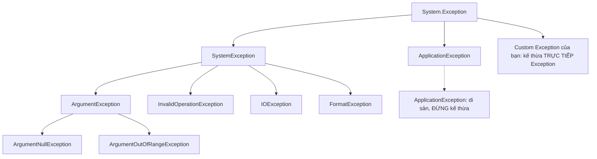

# Xử lý ngoại lệ (Exceptions)

!!! info "Bạn đang ở đây"
    cần trước: nền tảng c#, kiểu dữ liệu, phương thức và luồng điều khiển.
    mở khoá: viết code chịu lỗi, quản lý tài nguyên an toàn, và chuẩn bị cho làm việc với i/o, database và web api.

> Mục tiêu (đo được): Sau chương này bạn có thể **áp dụng** try/catch/finally để bắt đúng loại ngoại lệ cụ thể, dùng `throw` giữ nguyên stack trace, tạo custom exception, và quản lý tài nguyên bằng `using` — kiểm chứng qua bài tập chạy được.

## 0. Đoán nhanh trước khi học

Đoán trước khi mở đáp án (desirable difficulty giúp nhớ lâu hơn):

1. `throw ex;` và `throw;` trong khối catch khác nhau thế nào?
2. Bắt `catch (Exception e)` cho mọi thứ có phải "an toàn" không?
3. Khối `finally` có chạy khi đã có `return` trong `try` không?

???+ note "Đáp án gợi ý"
    1. `throw;` giữ nguyên stack trace gốc; `throw ex;` **reset** stack trace về dòng hiện tại (mất dấu vết lỗi thật).
    2. Không — bắt quá rộng dễ **nuốt** lỗi nghiêm trọng bạn không xử lý được, che giấu bug.
    3. Có — `finally` luôn chạy dù có `return`, `throw`, hay thoát bình thường.

## 1. Ý niệm cốt lõi

Ngoại lệ (exception) là cơ chế báo hiệu **tình huống bất thường** khiến code không thể tiếp tục theo cách bình thường. Thay vì trả mã lỗi rồi hy vọng người gọi kiểm tra, .NET **ném** một đối tượng exception; nó chạy ngược lên ngăn xếp lời gọi (stack) cho tới khi gặp `catch` phù hợp.

Cấu trúc cơ bản:

- `try`: vùng code có thể sinh lỗi.
- `catch`: bắt và xử lý một loại exception.
- `finally`: dọn dẹp — **luôn** chạy.

Mọi exception trong .NET đều kế thừa từ `System.Exception`. Hiểu cây phân cấp giúp bạn bắt đúng loại:

| Loại | Khi nào xuất hiện | Bắt cụ thể? |
|------|-------------------|-------------|
| `ArgumentNullException` | Tham số bắt buộc là null | Nên |
| `ArgumentException` | Tham số sai định dạng/giá trị | Nên |
| `InvalidOperationException` | Trạng thái object không hợp lệ cho thao tác | Nên |
| `FormatException` | Chuỗi không parse được | Nên |
| `IOException` | Lỗi đọc/ghi file, mạng | Nên |
| `Exception` | Lớp gốc — quá chung | Hạn chế |



!!! danger "Đính chính hiểu lầm phổ biến"
    **Đừng dùng exception cho control-flow bình thường.** Ném/bắt exception tốn kém (thu thập stack trace) và làm code khó đọc. Nếu "giá trị không tìm thấy" là chuyện thường ngày, hãy dùng `TryParse`, `bool` trả về, hoặc kiểu nullable — đừng ném exception rồi bắt lại như if/else.

    **Đừng catch rồi nuốt im lặng** (`catch { }` rỗng). Lỗi biến mất, bug ẩn kín, và ai đó sẽ mất hàng giờ để tìm nguyên nhân.

## 2. Ví dụ mẫu

Bắt loại cụ thể, dùng nhiều `catch`, và `finally` để dọn dẹp:

```csharp title="C#"
// test:run
int[] data = { 10, 0, -5 };

foreach (var divisor in data)
{
    try
    {
        int result = 100 / divisor;
        Console.WriteLine($"100 / {divisor} = {result}");
    }
    catch (DivideByZeroException)
    {
        Console.WriteLine($"Bỏ qua: không chia được cho {divisor}");
    }
    finally
    {
        Console.WriteLine($"-> Đã xử lý xong divisor = {divisor}");
    }
}
```

```text title="Kết quả"
100 / 10 = 10
-> Đã xử lý xong divisor = 10
Bỏ qua: không chia được cho 0
-> Đã xử lý xong divisor = 0
100 / -5 = -20
-> Đã xử lý xong divisor = -5
```

Ta chỉ bắt `DivideByZeroException` — các lỗi khác (nếu có) vẫn nổi lên chứ không bị nuốt. `finally` chạy cho **mọi** vòng lặp.

**Giữ stack trace khi ném lại** — quy tắc vàng là dùng `throw;` (không phải `throw ex;`):

```csharp title="C#"
// test:run
try
{
    Level1();
}
catch (Exception e)
{
    // Stack trace vẫn chỉ tới nơi lỗi thật sự phát sinh
    Console.WriteLine($"Bắt được: {e.Message}");
    Console.WriteLine(e.StackTrace is not null ? "Có stack trace" : "Mất stack trace");
}

static void Level1()
{
    try
    {
        Level2();
    }
    catch (InvalidOperationException)
    {
        Console.WriteLine("Ghi log rồi ném lại...");
        throw; // giữ nguyên dấu vết từ Level2
    }
}

static void Level2() => throw new InvalidOperationException("Trạng thái không hợp lệ");
```

```text title="Kết quả"
Ghi log rồi ném lại...
Bắt được: Trạng thái không hợp lệ
Có stack trace
```

**Guard hiện đại** — validate tham số gọn gàng bằng helper tĩnh của .NET {{ dotnet.current }}:

```csharp title="C#"
// test:run
static string Greet(string? name, string message)
{
    ArgumentNullException.ThrowIfNull(name);
    ArgumentException.ThrowIfNullOrEmpty(message);
    return $"{name}: {message}";
}

Console.WriteLine(Greet("An", "Xin chào"));

try
{
    Greet(null, "Hi");
}
catch (ArgumentNullException e)
{
    Console.WriteLine($"Chặn null ở tham số: {e.ParamName}");
}
```

```text title="Kết quả"
An: Xin chào
Chặn null ở tham số: name
```

`ArgumentNullException.ThrowIfNull` tự lấy tên tham số qua `CallerArgumentExpression`, nên bạn không phải gõ chuỗi `"name"` thủ công.

**Quản lý tài nguyên với `using` / `IDisposable`** — `using` đảm bảo `Dispose()` được gọi kể cả khi có exception:

```csharp title="C#"
// test:run
using System;

using (var res = new FakeResource("db-connection"))
{
    res.Use();
} // Dispose() tự động gọi ở đây

Console.WriteLine("Đã ra khỏi khối using");

sealed class FakeResource : IDisposable
{
    private readonly string _name;
    public FakeResource(string name) { _name = name; Console.WriteLine($"Mở {_name}"); }
    public void Use() => Console.WriteLine($"Dùng {_name}");
    public void Dispose() => Console.WriteLine($"Đóng {_name}");
}
```

```text title="Kết quả"
Mở db-connection
Dùng db-connection
Đóng db-connection
Đã ra khỏi khối using
```

**Custom exception** — kế thừa `Exception`, cung cấp các constructor chuẩn:

```csharp title="C#"
// test:run
try
{
    Withdraw(balance: 100m, amount: 250m);
}
catch (InsufficientFundsException e)
{
    Console.WriteLine($"Lỗi nghiệp vụ: {e.Message} (thiếu {e.Shortfall:C})");
}

static void Withdraw(decimal balance, decimal amount)
{
    if (amount > balance)
        throw new InsufficientFundsException(amount - balance);
}

sealed class InsufficientFundsException : Exception
{
    public decimal Shortfall { get; }
    public InsufficientFundsException(decimal shortfall)
        : base($"Số dư không đủ, còn thiếu {shortfall}")
        => Shortfall = shortfall;
}
```

## 3. Bài tập có giàn giáo

Viết hàm `ParseAge(string input)` trả về tuổi hợp lệ (0..150). Yêu cầu:

- Dùng `int.TryParse` (KHÔNG dùng exception cho control-flow parse).
- Nếu ngoài khoảng, ném `ArgumentOutOfRangeException`.
- Nếu chuỗi không phải số, ném `FormatException` với thông điệp rõ ràng.

Giàn giáo:

```csharp title="C#"
// test:skip giàn giáo cần bạn hoàn thiện
static int ParseAge(string input)
{
    // 1. TryParse ra số
    // 2. Nếu thất bại -> throw FormatException
    // 3. Nếu ngoài 0..150 -> throw ArgumentOutOfRangeException
    // 4. Trả về số hợp lệ
    throw new NotImplementedException();
}
```

??? success "Lời giải + giải thích"
    ```csharp title="C#"
    // test:run
    Console.WriteLine(ParseAge("30"));
    try { ParseAge("abc"); } catch (FormatException e) { Console.WriteLine(e.Message); }
    try { ParseAge("999"); } catch (ArgumentOutOfRangeException e) { Console.WriteLine(e.ParamName); }

    static int ParseAge(string input)
    {
        if (!int.TryParse(input, out int age))
            throw new FormatException($"'{input}' không phải số hợp lệ");
        if (age is < 0 or > 150)
            throw new ArgumentOutOfRangeException(nameof(input), age, "Tuổi phải trong 0..150");
        return age;
    }
    ```

    ```text title="Kết quả"
    30
    'abc' không phải số hợp lệ
    input
    ```

    **Vì sao:** Dùng `TryParse` cho tình huống "chuỗi có thể sai" là chuyện thường — không tốn chi phí ném exception. Exception chỉ dùng cho các điều kiện thực sự bất thường (ngoài khoảng, không parse được). `nameof(input)` giúp `ParamName` luôn đúng khi đổi tên biến.

## 4. Cạm bẫy & hiệu năng

- **Bắt càng cụ thể càng tốt.** Đặt `catch` cụ thể trước, `catch (Exception)` (nếu cần) sau cùng.
- **Đừng bắt lỗi bạn không xử lý được.** `OutOfMemoryException`, `StackOverflowException` thường không nên bắt.
- **Chi phí:** ném exception thu thập stack trace — chậm hơn nhiều so với trả về `bool`. Đừng dùng trong vòng lặp nóng.
- **`using` declaration** (không cần dấu ngoặc): `using var conn = ...;` — dọn dẹp khi ra khỏi scope, gọn hơn.
- **Bọc lỗi gốc** khi ném lại loại mới: `throw new MyException("...", inner)` để giữ `InnerException`.

## Tự kiểm tra

1. Sự khác biệt giữa `throw;` và `throw ex;` là gì?
2. `finally` có chạy khi `try` chứa `return` không?
3. Nên dùng `TryParse` hay try/catch để đọc số người dùng nhập? Vì sao?
4. Hai guard hiện đại nào thay thế cho việc tự viết `if (x == null) throw ...`?
5. Vì sao `catch (Exception)` cho mọi thứ là thói quen xấu?

??? question "Đáp án"
    1. `throw;` giữ nguyên stack trace gốc; `throw ex;` reset stack trace, làm mất nơi lỗi thật phát sinh.
    2. Có, `finally` luôn chạy trước khi `return` thực sự trả giá trị.
    3. `TryParse` — vì nhập sai là tình huống thường ngày, không nên dùng exception cho control-flow (tốn chi phí và khó đọc).
    4. `ArgumentNullException.ThrowIfNull(x)` và `ArgumentException.ThrowIfNullOrEmpty(s)`.
    5. Nó nuốt cả lỗi nghiêm trọng bạn không xử lý được, che giấu bug và làm khó chẩn đoán nguyên nhân.

??? abstract "DEEP DIVE: Exception filters, AggregateException và async"
    **Exception filter (`when`):** bắt có điều kiện mà không phá stack trace:

    ```csharp title="C#"
    // test:run
    try
    {
        throw new InvalidOperationException("transient");
    }
    catch (InvalidOperationException e) when (e.Message.Contains("transient"))
    {
        Console.WriteLine("Bắt lỗi tạm thời để retry");
    }
    ```

    ```text title="Kết quả"
    Bắt lỗi tạm thời để retry
    ```

    Bộ lọc `when` được đánh giá **trước** khi stack unwind, nên debugger thấy trạng thái gốc — tốt hơn bắt rồi `throw;` lại.

    **AggregateException:** khi nhiều task song song lỗi (`Task.WhenAll`), .NET gộp các exception vào một `AggregateException` với `InnerExceptions`. Dùng `ex.Flatten()` để duyệt phẳng.

    **Async:** với `async`/`await`, exception được lưu trong `Task` và ném lại tại điểm `await`. Tránh `async void` (trừ event handler) vì exception không bắt được — hãy dùng `async Task`.

Tiếp theo -> generics và collections
