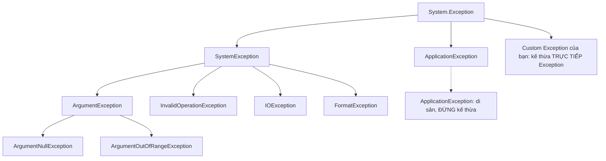

# Xử lý ngoại lệ (Exceptions)

!!! info "Bạn đang ở đây"
    cần trước: nền tảng c#, kiểu dữ liệu, phương thức và luồng điều khiển.
    mở khoá: viết code chịu lỗi, quản lý tài nguyên an toàn, và chuẩn bị cho làm việc với i/o, database và web api.

> Mục tiêu (đo được): Sau chương này bạn có thể **áp dụng** try/catch/finally để bắt đúng loại ngoại lệ cụ thể, dùng `throw` giữ nguyên stack trace, tạo custom exception, và quản lý tài nguyên bằng `using` — kiểm chứng qua bài tập chạy được.

## 0. Đoán nhanh trước khi học

Đoán trước khi mở đáp án (desirable difficulty giúp nhớ lâu hơn):

1. `throw ex;` và `throw;` trong khối catch khác nhau thế nào?
2. Bắt `catch (Exception e)` cho mọi thứ có phải "an toàn" không?
3. Khối `finally` có chạy khi đã có `return` trong `try` không?

???+ note "Đáp án gợi ý"
    1. `throw;` giữ nguyên stack trace gốc; `throw ex;` **reset** stack trace về dòng hiện tại (mất dấu vết lỗi thật).
    2. Không — bắt quá rộng dễ **nuốt** lỗi nghiêm trọng bạn không xử lý được, che giấu bug.
    3. Có — `finally` luôn chạy dù có `return`, `throw`, hay thoát bình thường.

## 1. Ý niệm cốt lõi

Ngoại lệ (exception) là cơ chế báo hiệu **tình huống bất thường** khiến code không thể tiếp tục theo cách bình thường. Thay vì trả mã lỗi rồi hy vọng người gọi kiểm tra, .NET **ném** một đối tượng exception; nó chạy ngược lên ngăn xếp lời gọi (stack) cho tới khi gặp `catch` phù hợp.

Cấu trúc cơ bản:

- `try`: vùng code có thể sinh lỗi.
- `catch`: bắt và xử lý một loại exception.
- `finally`: dọn dẹp — **luôn** chạy.

Mọi exception trong .NET đều kế thừa từ `System.Exception`.

Trước khi xem bảng tổng hợp, đây là định nghĩa một câu cho từng loại exception cụ thể hay gặp nhất, kèm ví dụ tối thiểu riêng.

**`ArgumentNullException`**: ném ra khi một tham số bắt buộc nhận giá trị `null`.

```csharp title="C#"
// test:run
try
{
    PrintName(null);
}
catch (ArgumentNullException e)
{
    Console.WriteLine($"Bắt ArgumentNullException: tham số '{e.ParamName}' là null");
}

static void PrintName(string? name)
{
    if (name is null)
        throw new ArgumentNullException(nameof(name));
    Console.WriteLine(name);
}
```

```text title="Kết quả"
Bắt ArgumentNullException: tham số 'name' là null
```

**`ArgumentException`**: ném ra khi tham số không null nhưng sai định dạng hoặc sai giá trị.

```csharp title="C#"
// test:run
try
{
    SetAge(-5);
}
catch (ArgumentException e)
{
    Console.WriteLine($"Bắt ArgumentException: {e.Message}");
}

static void SetAge(int age)
{
    if (age < 0)
        throw new ArgumentException("Tuổi không thể âm", nameof(age));
    Console.WriteLine($"Tuổi = {age}");
}
```

```text title="Kết quả"
Bắt ArgumentException: Tuổi không thể âm (Parameter 'age')
```

**`ArgumentOutOfRangeException`**: ném ra khi giá trị tham số nằm ngoài khoảng cho phép (ví dụ chỉ số âm, tuổi ngoài 0..150).

```csharp title="C#"
// test:run
try
{
    SetScore(200);
}
catch (ArgumentOutOfRangeException e)
{
    Console.WriteLine($"Bắt ArgumentOutOfRangeException: tham số '{e.ParamName}', giá trị thực tế = {e.ActualValue}");
}

static void SetScore(int score)
{
    if (score is < 0 or > 100)
        throw new ArgumentOutOfRangeException(nameof(score), score, "Điểm phải trong khoảng 0..100");
    Console.WriteLine($"Điểm = {score}");
}
```

```text title="Kết quả"
Bắt ArgumentOutOfRangeException: tham số 'score', giá trị thực tế = 200
```

**Lỗi nếu dùng sai** — bắt nhầm bằng `catch (ArgumentException e)` (lớp cha) rồi cố đọc `e.ActualValue` sẽ không biên dịch được, vì `ActualValue` chỉ tồn tại trên `ArgumentOutOfRangeException`, không có trên `ArgumentException`:

```csharp title="C#"
// test:skip minh hoạ lỗi biên dịch CS1061: 'ArgumentException' không có định nghĩa cho 'ActualValue'
try
{
    SetScore(200);
}
catch (ArgumentException e)
{
    // CS1061: 'ArgumentException' does not contain a definition for 'ActualValue'
    Console.WriteLine($"Giá trị thực tế = {e.ActualValue}");
}
```

Ngoài ra, nếu tạo `ArgumentOutOfRangeException` mà không truyền `actualValue` (constructor `(paramName, message)` thay vì `(paramName, actualValue, message)`), thông điệp lỗi sẽ thiếu hẳn phần "Giá trị thực tế" — người đọc log không biết giá trị sai cụ thể là gì, gây khó chẩn đoán hơn hẳn so với ví dụ `SetScore` ở trên.

**`InvalidOperationException`**: ném ra khi trạng thái hiện tại của object không cho phép thực hiện thao tác được gọi.

```csharp title="C#"
// test:run
var list = new List<int>();
var enumerator = list.GetEnumerator();
list.Add(1); // thay đổi collection trong khi đang enumerate

try
{
    enumerator.MoveNext();
}
catch (InvalidOperationException e)
{
    Console.WriteLine($"Bắt InvalidOperationException: {e.Message}");
}
```

```text title="Kết quả"
Bắt InvalidOperationException: Collection was modified; enumeration operation may not execute.
```

**`FormatException`**: ném ra khi một chuỗi không thể phân tích (parse) thành kiểu mong muốn.

```csharp title="C#"
// test:run
try
{
    int n = int.Parse("abc");
    Console.WriteLine(n);
}
catch (FormatException e)
{
    Console.WriteLine($"Bắt FormatException: {e.Message}");
}
```

```text title="Kết quả"
Bắt FormatException: The input string 'abc' was not in a correct format.
```

**`IOException`**: ném ra khi thao tác đọc/ghi file hoặc luồng mạng thất bại (ví dụ file đang bị khoá, đĩa đầy).

```csharp title="C#"
// test:skip minh hoạ IOException cần thao tác file thật trên hệ thống, không tự chứa trong sandbox
var stream1 = File.Open("data.lock", FileMode.OpenOrCreate);
try
{
    // Mở lần 2 khi file đang bị khoá độc quyền -> ném IOException
    var stream2 = File.Open("data.lock", FileMode.Open, FileAccess.Read, FileShare.None);
}
catch (IOException e)
{
    Console.WriteLine($"Bắt IOException: {e.Message}");
}
```

Sau khi đã thấy từng loại riêng lẻ, bảng dưới đây tổng hợp lại và sơ đồ cho thấy cây phân cấp kế thừa giữa chúng:

| Loại | Khi nào xuất hiện | Bắt cụ thể? |
|------|-------------------|-------------|
| `ArgumentNullException` | Tham số bắt buộc là null | Nên |
| `ArgumentException` | Tham số sai định dạng/giá trị | Nên |
| `InvalidOperationException` | Trạng thái object không hợp lệ cho thao tác | Nên |
| `FormatException` | Chuỗi không parse được | Nên |
| `IOException` | Lỗi đọc/ghi file, mạng | Nên |
| `Exception` | Lớp gốc — quá chung | Hạn chế |



!!! danger "Đính chính hiểu lầm phổ biến"
    **Đừng dùng exception cho control-flow bình thường.** Ném/bắt exception tốn kém (thu thập stack trace) và làm code khó đọc. Nếu "giá trị không tìm thấy" là chuyện thường ngày, hãy dùng `TryParse`, `bool` trả về, hoặc kiểu nullable — đừng ném exception rồi bắt lại như if/else.

    **Đừng catch rồi nuốt im lặng** (`catch { }` rỗng). Lỗi biến mất, bug ẩn kín, và ai đó sẽ mất hàng giờ để tìm nguyên nhân.

## 2. Ví dụ mẫu

**`try`/`catch`**: `try` bọc vùng code có thể lỗi, `catch` bắt và xử lý loại exception chỉ định — nếu không xảy ra lỗi đúng loại đó, khối `catch` không chạy.

```csharp title="C#"
// test:run
try
{
    throw new InvalidOperationException("Trạng thái không hợp lệ");
}
catch (InvalidOperationException e)
{
    Console.WriteLine($"Đã bắt: {e.Message}");
}
```

```text title="Kết quả"
Đã bắt: Trạng thái không hợp lệ
```

Nếu khối `catch` khai báo **sai loại** (không phải loại thực sự được ném, và cũng không phải lớp cha của nó), exception sẽ **không** bị bắt — nó tiếp tục bay lên và làm crash chương trình:

```csharp title="C#"
// test:run
try
{
    try
    {
        throw new InvalidOperationException("Trạng thái không hợp lệ");
    }
    catch (FormatException e)
    {
        // Sai loại: FormatException không khớp InvalidOperationException
        Console.WriteLine($"Sẽ không bao giờ in ra dòng này: {e.Message}");
    }
}
catch (InvalidOperationException e)
{
    // Exception "lọt" qua catch sai loại ở trên, bị bắt lại ở đây
    Console.WriteLine($"Bắt sai loại phía trong -> lỗi bay tiếp lên: {e.Message}");
}
```

```text title="Kết quả"
Bắt sai loại phía trong -> lỗi bay tiếp lên: Trạng thái không hợp lệ
```

**`finally`**: khối chạy **luôn luôn** sau `try`/`catch`, bất kể có exception hay không, dùng để dọn dẹp tài nguyên.

```csharp title="C#"
// test:run
try
{
    Console.WriteLine("Đang thử...");
}
finally
{
    Console.WriteLine("Dọn dẹp — luôn chạy");
}
```

```text title="Kết quả"
Đang thử...
Dọn dẹp — luôn chạy
```

Nếu **bỏ `finally`** khi vòng lặp bên trong ném lỗi giữa chừng, bước dọn dẹp cho lần lặp đó sẽ bị bỏ qua hoàn toàn — không có gì đảm bảo nó chạy:

```csharp title="C#"
// test:run
int[] data = { 10, 0 };

foreach (var divisor in data)
{
    try
    {
        int result = 100 / divisor;
        Console.WriteLine($"100 / {divisor} = {result}");
    }
    catch (DivideByZeroException)
    {
        Console.WriteLine($"Bỏ qua: không chia được cho {divisor}");
    }
    // Không có finally -> dòng "dọn dẹp" dưới đây bị thiếu ở mọi trường hợp,
    // nhưng nguy hiểm hơn: nếu dọn dẹp nằm SAU catch mà code ném tiếp exception
    // khác trong catch, dọn dẹp sẽ không bao giờ chạy.
}

Console.WriteLine("Nếu cần dọn dẹp bảo đảm luôn chạy, phải dùng finally, không đặt code dọn dẹp sau khối try/catch.");
```

```text title="Kết quả"
100 / 10 = 10
Bỏ qua: không chia được cho 0
Nếu cần dọn dẹp bảo đảm luôn chạy, phải dùng finally, không đặt code dọn dẹp sau khối try/catch.
```

**`DivideByZeroException`**: ném ra khi chia một số nguyên cho 0.

```csharp title="C#"
// test:run
try
{
    int divisor = 0;
    int result = 100 / divisor;
    Console.WriteLine(result);
}
catch (DivideByZeroException e)
{
    Console.WriteLine($"Bắt DivideByZeroException: {e.Message}");
}
```

```text title="Kết quả"
Bắt DivideByZeroException: Attempted to divide by zero.
```

Giờ kết hợp cả ba — bắt loại cụ thể, dùng nhiều `catch`, và `finally` để dọn dẹp:

```csharp title="C#"
// test:run
int[] data = { 10, 0, -5 };

foreach (var divisor in data)
{
    try
    {
        int result = 100 / divisor;
        Console.WriteLine($"100 / {divisor} = {result}");
    }
    catch (DivideByZeroException)
    {
        Console.WriteLine($"Bỏ qua: không chia được cho {divisor}");
    }
    finally
    {
        Console.WriteLine($"-> Đã xử lý xong divisor = {divisor}");
    }
}
```

```text title="Kết quả"
100 / 10 = 10
-> Đã xử lý xong divisor = 10
Bỏ qua: không chia được cho 0
-> Đã xử lý xong divisor = 0
100 / -5 = -20
-> Đã xử lý xong divisor = -5
```

Ta chỉ bắt `DivideByZeroException` — các lỗi khác (nếu có) vẫn nổi lên chứ không bị nuốt. `finally` chạy cho **mọi** vòng lặp.

**Giữ stack trace khi ném lại** — quy tắc vàng là dùng `throw;` (không phải `throw ex;`):

```csharp title="C#"
// test:run
try
{
    Level1();
}
catch (Exception e)
{
    // Stack trace vẫn chỉ tới nơi lỗi thật sự phát sinh
    Console.WriteLine($"Bắt được: {e.Message}");
    Console.WriteLine(e.StackTrace is not null ? "Có stack trace" : "Mất stack trace");
}

static void Level1()
{
    try
    {
        Level2();
    }
    catch (InvalidOperationException)
    {
        Console.WriteLine("Ghi log rồi ném lại...");
        throw; // giữ nguyên dấu vết từ Level2
    }
}

static void Level2() => throw new InvalidOperationException("Trạng thái không hợp lệ");
```

```text title="Kết quả"
Ghi log rồi ném lại...
Bắt được: Trạng thái không hợp lệ
Có stack trace
```

**Bằng chứng `throw ex;` làm mất dấu vết** — so sánh trực tiếp số dòng trong stack trace giữa hai cách ném lại:

```csharp title="C#"
// test:run
try
{
    RethrowWithThrow();
}
catch (Exception e)
{
    Console.WriteLine("=== throw; (giữ nguyên) ===");
    Console.WriteLine(e.StackTrace);
}

try
{
    RethrowWithThrowEx();
}
catch (Exception e)
{
    Console.WriteLine("=== throw ex; (bị reset) ===");
    Console.WriteLine(e.StackTrace);
}

static void RethrowWithThrow()
{
    try
    {
        FailDeep();
    }
    catch (InvalidOperationException)
    {
        throw; // giữ nguyên: stack trace vẫn trỏ tới FailDeep()
    }
}

static void RethrowWithThrowEx()
{
    try
    {
        FailDeep();
    }
    catch (InvalidOperationException ex)
    {
        throw ex; // reset: stack trace bây giờ trỏ tới DÒNG NÀY, mất dấu vết FailDeep()
    }
}

static void FailDeep() => throw new InvalidOperationException("Lỗi phát sinh sâu bên trong");
```

```text title="Kết quả (rút gọn — số dòng thực tế phụ thuộc file biên dịch)"
=== throw; (giữ nguyên) ===
   at Program.FailDeep()
   at Program.RethrowWithThrow()
   ...
=== throw ex; (bị reset) ===
   at Program.RethrowWithThrowEx()
   ...
```

Với `throw;`, dòng đầu tiên trong stack trace vẫn là `FailDeep()` — nơi lỗi thật sự xảy ra. Với `throw ex;`, dòng đầu tiên đã đổi thành `RethrowWithThrowEx()` — dòng `throw ex;` — nên khi debug production, bạn sẽ **không còn thấy** `FailDeep()` bị mất khỏi stack trace nữa, dễ chẩn đoán sai nguyên nhân gốc.

**`ArgumentNullException.ThrowIfNull`**: helper tĩnh của .NET {{ dotnet.current }} ném `ArgumentNullException` một dòng nếu tham số là null, thay vì bạn tự viết `if (x is null) throw ...`.

```csharp title="C#"
// test:run
static string Greet(string? name)
{
    ArgumentNullException.ThrowIfNull(name);
    return $"Xin chào, {name}";
}

Console.WriteLine(Greet("An"));

try
{
    Greet(null);
}
catch (ArgumentNullException e)
{
    Console.WriteLine($"Chặn null ở tham số: {e.ParamName}");
}
```

```text title="Kết quả"
Xin chào, An
Chặn null ở tham số: name
```

`ArgumentNullException.ThrowIfNull` tự lấy tên tham số qua `CallerArgumentExpression`, nên bạn không phải gõ chuỗi `"name"` thủ công.

**`ArgumentException.ThrowIfNullOrEmpty`**: helper tĩnh tương tự, nhưng ném `ArgumentException` nếu chuỗi là null **hoặc** rỗng (`""`).

```csharp title="C#"
// test:run
static string BuildMessage(string message)
{
    ArgumentException.ThrowIfNullOrEmpty(message);
    return $"Nội dung: {message}";
}

Console.WriteLine(BuildMessage("Xin chào"));

try
{
    BuildMessage("");
}
catch (ArgumentException e)
{
    Console.WriteLine($"Chặn chuỗi rỗng ở tham số: {e.ParamName}");
}
```

```text title="Kết quả"
Nội dung: Xin chào
Chặn chuỗi rỗng ở tham số: message
```

Kết hợp cả hai guard trong cùng một hàm khi tham số vừa cần khác null vừa cần khác rỗng:

```csharp title="C#"
// test:run
static string Greet(string? name, string message)
{
    ArgumentNullException.ThrowIfNull(name);
    ArgumentException.ThrowIfNullOrEmpty(message);
    return $"{name}: {message}";
}

Console.WriteLine(Greet("An", "Xin chào"));

try
{
    Greet(null, "Hi");
}
catch (ArgumentNullException e)
{
    Console.WriteLine($"Chặn null ở tham số: {e.ParamName}");
}
```

```text title="Kết quả"
An: Xin chào
Chặn null ở tham số: name
```

**Quản lý tài nguyên với `using` / `IDisposable`** — `using` đảm bảo `Dispose()` được gọi kể cả khi có exception:

```csharp title="C#"
// test:run
using System;

using (var res = new FakeResource("db-connection"))
{
    res.Use();
} // Dispose() tự động gọi ở đây

Console.WriteLine("Đã ra khỏi khối using");

sealed class FakeResource : IDisposable
{
    private readonly string _name;
    public FakeResource(string name) { _name = name; Console.WriteLine($"Mở {_name}"); }
    public void Use() => Console.WriteLine($"Dùng {_name}");
    public void Dispose() => Console.WriteLine($"Đóng {_name}");
}
```

```text title="Kết quả"
Mở db-connection
Dùng db-connection
Đóng db-connection
Đã ra khỏi khối using
```

**Đối chứng — không dùng `using`:** nếu chỉ gọi trực tiếp mà không có `using` (hay `try`/`finally`), một exception ném ra giữa chừng sẽ khiến `Dispose()` **không bao giờ được gọi**:

```csharp title="C#"
// test:run
try
{
    var res = new RiskyResource("db-connection");
    res.UseAndFail(); // ném exception TRƯỚC khi có cơ hội gọi Dispose()
    res.Dispose(); // KHÔNG BAO GIỜ chạy tới đây
}
catch (InvalidOperationException e)
{
    Console.WriteLine($"Bắt lỗi: {e.Message}");
}

Console.WriteLine("Kết thúc chương trình — để ý không có dòng 'Đóng' nào được in ra ở trên");

sealed class RiskyResource : IDisposable
{
    private readonly string _name;
    public RiskyResource(string name) { _name = name; Console.WriteLine($"Mở {_name}"); }
    public void UseAndFail() => throw new InvalidOperationException($"Lỗi khi dùng {_name}");
    public void Dispose() => Console.WriteLine($"Đóng {_name}");
}
```

```text title="Kết quả"
Mở db-connection
Bắt lỗi: Lỗi khi dùng db-connection
Kết thúc chương trình — để ý không có dòng 'Đóng' nào được in ra ở trên
```

So với ví dụ dùng `using` ở trên (luôn có dòng `Đóng db-connection`), ở đây **không hề có** dòng `Đóng db-connection` nào — tài nguyên bị rò rỉ vì `Dispose()` không được gọi khi exception cắt ngang luồng thực thi.

**Custom exception** — kế thừa `Exception`, cung cấp các constructor chuẩn:

```csharp title="C#"
// test:run
try
{
    Withdraw(balance: 100m, amount: 250m);
}
catch (InsufficientFundsException e)
{
    Console.WriteLine($"Lỗi nghiệp vụ: {e.Message} (thiếu {e.Shortfall:C})");
}

static void Withdraw(decimal balance, decimal amount)
{
    if (amount > balance)
        throw new InsufficientFundsException(amount - balance);
}

sealed class InsufficientFundsException : Exception
{
    public decimal Shortfall { get; }
    public InsufficientFundsException(decimal shortfall)
        : base($"Số dư không đủ, còn thiếu {shortfall}")
        => Shortfall = shortfall;
}
```

**Hậu quả khi làm sai — quên gọi `base(message)`:** nếu constructor không truyền message lên lớp cha, `Message` sẽ rơi về thông điệp mặc định chung chung của .NET thay vì mô tả lỗi nghiệp vụ của bạn:

```csharp title="C#"
// test:run
try
{
    throw new BrokenException(42);
}
catch (BrokenException e)
{
    Console.WriteLine($"Message thực tế: '{e.Message}'");
    Console.WriteLine($"Code vẫn giữ được: {e.Code}");
}

sealed class BrokenException : Exception
{
    public int Code { get; }
    // QUÊN gọi base(message) -> Message không phản ánh lỗi thật
    public BrokenException(int code) => Code = code;
}
```

```text title="Kết quả"
Message thực tế: 'Exception of type 'BrokenException' was thrown.'
Code vẫn giữ được: 42
```

So với ví dụ `InsufficientFundsException` ở trên (có `: base($"Số dư không đủ...")`) — `Message` ở đó mô tả đúng lỗi nghiệp vụ, còn ở `BrokenException` thì `Message` vô nghĩa với người đọc log, dù property `Code` vẫn hoạt động bình thường.

Ngoài ra, như sơ đồ phân cấp ở mục 1 đã cảnh báo: **đừng kế thừa `ApplicationException`** — nó là lớp di sản, không có ý nghĩa đặc biệt trong .NET hiện đại và không được BCL dùng nhất quán; hãy luôn kế thừa trực tiếp `Exception`.

## 3. Bài tập có giàn giáo

Viết hàm `ParseAge(string input)` trả về tuổi hợp lệ (0..150). Yêu cầu:

- Dùng `int.TryParse` (KHÔNG dùng exception cho control-flow parse).
- Nếu ngoài khoảng, ném `ArgumentOutOfRangeException`.
- Nếu chuỗi không phải số, ném `FormatException` với thông điệp rõ ràng.

Giàn giáo:

```csharp title="C#"
// test:skip giàn giáo cần bạn hoàn thiện
static int ParseAge(string input)
{
    // 1. TryParse ra số
    // 2. Nếu thất bại -> throw FormatException
    // 3. Nếu ngoài 0..150 -> throw ArgumentOutOfRangeException
    // 4. Trả về số hợp lệ
    throw new NotImplementedException();
}
```

??? success "Lời giải + giải thích"
    ```csharp title="C#"
    // test:run
    Console.WriteLine(ParseAge("30"));
    try { ParseAge("abc"); } catch (FormatException e) { Console.WriteLine(e.Message); }
    try { ParseAge("999"); } catch (ArgumentOutOfRangeException e) { Console.WriteLine(e.ParamName); }

    static int ParseAge(string input)
    {
        if (!int.TryParse(input, out int age))
            throw new FormatException($"'{input}' không phải số hợp lệ");
        if (age is < 0 or > 150)
            throw new ArgumentOutOfRangeException(nameof(input), age, "Tuổi phải trong 0..150");
        return age;
    }
    ```

    ```text title="Kết quả"
    30
    'abc' không phải số hợp lệ
    input
    ```

    **Vì sao:** Dùng `TryParse` cho tình huống "chuỗi có thể sai" là chuyện thường — không tốn chi phí ném exception. Exception chỉ dùng cho các điều kiện thực sự bất thường (ngoài khoảng, không parse được). `nameof(input)` giúp `ParamName` luôn đúng khi đổi tên biến.

## 4. Cạm bẫy & hiệu năng

- **Bắt càng cụ thể càng tốt.** Đặt `catch` cụ thể trước, `catch (Exception)` (nếu cần) sau cùng.
- **Đừng bắt lỗi bạn không xử lý được.** `OutOfMemoryException`, `StackOverflowException` thường không nên bắt.
- **Chi phí:** ném exception thu thập stack trace — chậm hơn nhiều so với trả về `bool`. Đừng dùng trong vòng lặp nóng.
- **Bọc lỗi gốc** khi ném lại loại mới: `throw new MyException("...", inner)` để giữ `InnerException`.

**`using` declaration**: cú pháp `using var x = ...;` không cần dấu ngoặc `{ }` — `Dispose()` tự động chạy khi biến ra khỏi **scope hiện tại** (thường là cuối phương thức hoặc khối chứa nó), thay vì cuối một khối `using (...) { }` tường minh.

```csharp title="C#"
// test:run
DoWork();

static void DoWork()
{
    using var res = new FakeResource("cache");
    res.Use();
    Console.WriteLine("Vẫn còn trong scope của DoWork...");
} // Dispose() tự động gọi ở đây, cuối scope của DoWork

sealed class FakeResource : IDisposable
{
    private readonly string _name;
    public FakeResource(string name) { _name = name; Console.WriteLine($"Mở {_name}"); }
    public void Use() => Console.WriteLine($"Dùng {_name}");
    public void Dispose() => Console.WriteLine($"Đóng {_name}");
}
```

```text title="Kết quả"
Mở cache
Dùng cache
Vẫn còn trong scope của DoWork...
Đóng cache
```

**Dùng sai — đặt `using var` nhầm chỗ khiến scope quá rộng:** vì không có dấu ngoặc để giới hạn phạm vi, nếu bạn khai báo `using var` ở đầu một phương thức dài, tài nguyên sẽ bị giữ mở cho tới hết phương thức đó thay vì đóng ngay sau đoạn code thực sự cần nó:

```csharp title="C#"
// test:run
DoWorkBad();

static void DoWorkBad()
{
    using var res = new FakeResource2("cache");
    res.Use();

    Console.WriteLine("Đang làm việc khác không liên quan tới 'cache'...");
    Console.WriteLine("...vẫn chưa Dispose, dù đã dùng xong 'res' từ lâu...");
} // Dispose() chỉ chạy ở ĐÂY -> "cache" bị giữ mở lâu hơn cần thiết

sealed class FakeResource2 : IDisposable
{
    private readonly string _name;
    public FakeResource2(string name) { _name = name; Console.WriteLine($"Mở {_name}"); }
    public void Use() => Console.WriteLine($"Dùng {_name}");
    public void Dispose() => Console.WriteLine($"Đóng {_name}");
}
```

```text title="Kết quả"
Mở cache
Dùng cache
Đang làm việc khác không liên quan tới 'cache'...
...vẫn chưa Dispose, dù đã dùng xong 'res' từ lâu...
Đóng cache
```

So sánh với `using (...) { }` tường minh: nếu muốn đóng tài nguyên sớm hơn cuối phương thức, hãy dùng khối `using (...) { }` có dấu ngoặc để giới hạn scope hẹp lại, thay vì `using var`.

## Tự kiểm tra

1. Sự khác biệt giữa `throw;` và `throw ex;` là gì?
2. `finally` có chạy khi `try` chứa `return` không?
3. Nên dùng `TryParse` hay try/catch để đọc số người dùng nhập? Vì sao?
4. Hai guard hiện đại nào thay thế cho việc tự viết `if (x == null) throw ...`?
5. Vì sao `catch (Exception)` cho mọi thứ là thói quen xấu?

??? question "Đáp án"
    1. `throw;` giữ nguyên stack trace gốc; `throw ex;` reset stack trace, làm mất nơi lỗi thật phát sinh.
    2. Có, `finally` luôn chạy trước khi `return` thực sự trả giá trị.
    3. `TryParse` — vì nhập sai là tình huống thường ngày, không nên dùng exception cho control-flow (tốn chi phí và khó đọc).
    4. `ArgumentNullException.ThrowIfNull(x)` và `ArgumentException.ThrowIfNullOrEmpty(s)`.
    5. Nó nuốt cả lỗi nghiêm trọng bạn không xử lý được, che giấu bug và làm khó chẩn đoán nguyên nhân.

??? abstract "DEEP DIVE: Exception filters, AggregateException và async"
    **Exception filter (`when`):** bắt có điều kiện mà không phá stack trace:

    ```csharp title="C#"
    // test:run
    try
    {
        throw new InvalidOperationException("transient");
    }
    catch (InvalidOperationException e) when (e.Message.Contains("transient"))
    {
        Console.WriteLine("Bắt lỗi tạm thời để retry");
    }
    ```

    ```text title="Kết quả"
    Bắt lỗi tạm thời để retry
    ```

    Bộ lọc `when` được đánh giá **trước** khi stack unwind, nên debugger thấy trạng thái gốc — tốt hơn bắt rồi `throw;` lại.

    **`AggregateException`:** khi nhiều tác vụ song song lỗi cùng lúc (ví dụ chạy nhiều `Task` rồi gọi `.Wait()`), .NET gộp tất cả exception con vào một `AggregateException` duy nhất thay vì chỉ ném exception đầu tiên.

    ```csharp title="C#"
    // test:run
    var t1 = Task.Run(() => throw new InvalidOperationException("lỗi 1"));
    var t2 = Task.Run(() => throw new FormatException("lỗi 2"));

    try
    {
        Task.WaitAll(t1, t2);
    }
    catch (AggregateException ex)
    {
        Console.WriteLine($"Số lỗi con: {ex.InnerExceptions.Count}");
        foreach (var inner in ex.InnerExceptions)
            Console.WriteLine($"- {inner.GetType().Name}: {inner.Message}");
    }
    ```

    ```text title="Kết quả (thứ tự lỗi con có thể thay đổi giữa các lần chạy)"
    Số lỗi con: 2
    - InvalidOperationException: lỗi 1
    - FormatException: lỗi 2
    ```

    Nếu chỉ viết `catch (InvalidOperationException)` ở đây, nó sẽ **không bắt được gì cả** — loại thực sự ném ra ở cấp ngoài luôn là `AggregateException`, dù bên trong có `InnerExceptions` thuộc loại khác nhau. Khi các `AggregateException` bị lồng nhau (task cha chứa task con), gọi `ex.Flatten()` để gộp tất cả về một danh sách `InnerExceptions` phẳng, dễ duyệt hơn là tự đệ quy qua từng cấp lồng.

    **`async void` vs `async Task`:** với phương thức `async Task`, exception ném bên trong được lưu vào đối tượng `Task` và chỉ ném lại khi ai đó `await` nó — nên bạn bắt được bình thường bằng `try`/`catch`. Với `async void`, không có `Task` nào để lưu exception, nên nó ném thẳng lên context gọi (thường làm crash ứng dụng) và **không thể bắt bằng `try`/`catch` bao quanh lời gọi**.

    ```csharp title="C#"
    // test:run
    try
    {
        await FailAsyncTask();
    }
    catch (InvalidOperationException e)
    {
        Console.WriteLine($"Bắt được từ async Task: {e.Message}");
    }

    static async Task FailAsyncTask()
    {
        await Task.Delay(1);
        throw new InvalidOperationException("Lỗi trong async Task");
    }
    ```

    ```text title="Kết quả"
    Bắt được từ async Task: Lỗi trong async Task
    ```

    Ngược lại, bọc `try`/`catch` quanh lời gọi một `async void` **không** bắt được exception ném ra bên trong nó — vì `async void` không trả `Task` để `await`, exception thoát ra ngay khi hàm đang chạy (không đồng bộ với điểm gọi), khiến `catch` xung quanh lời gọi vô dụng. Vì lý do này, chỉ dùng `async void` cho event handler (nơi buộc phải có chữ ký `void`); mọi trường hợp khác hãy dùng `async Task`.

Tiếp theo -> generics và collections
