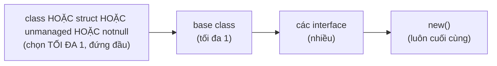
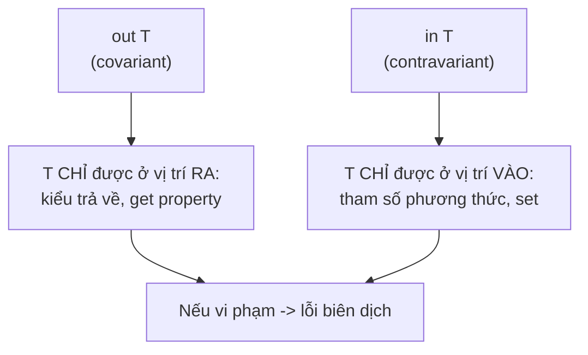

# Generics (Kiểu tổng quát)

!!! info "Bạn đang ở đây · P1 → node `p1-generics`"
    **Cần trước:** lập trình hướng đối tượng (lớp, interface, kế thừa, đa hình), phân biệt được value type và reference type, hiểu boxing là gì.
    **Mở khoá:** Collections & LINQ (toàn bộ `List<T>`, `Dictionary<TKey,TValue>`, `IEnumerable<T>` đều là generic), thiết kế repository/service ở P3, và mọi API hiện đại của .NET.
    ⏱️ Fast path ~60 phút · Deep dive +70 phút.

> **Mục tiêu (đo được):** Sau chương này bạn (1) **tự viết** được lớp và phương thức generic có ràng buộc đúng; (2) **liệt kê và áp dụng đúng** cả 8+ loại ràng buộc `where`; (3) **giải thích và dự đoán** khi nào covariance/contravariance hợp lệ và khi nào trình biên dịch từ chối; (4) **chỉ ra** vì sao `List<int>` không boxing còn `ArrayList` thì có, và đo được hệ quả; (5) **tránh** 5 cạm bẫy generic phổ biến (so sánh bằng `==`, static field dùng chung nhầm, overload theo ràng buộc...).

---

## 0. Đoán nhanh trước khi học (30 giây)

Đọc và **tự đoán output** trước khi mở đáp án.

```csharp title="Đoán output"
// test:run
Console.WriteLine(Counter<int>.Total);
Console.WriteLine(Counter<string>.Total);
Counter<int>.Add();
Counter<int>.Add();
Counter<string>.Add();
Console.WriteLine($"int={Counter<int>.Total}, string={Counter<string>.Total}");

static class Counter<T>
{
    public static int Total;
    public static void Add() => Total++;
}
```

??? note "Đáp án — mở SAU khi đã đoán"
    In ra:
    ```text title="Kết quả"
    0
    0
    int=2, string=1
    ```
    **Mỗi kiểu đóng (closed type) của một generic type có bộ static field RIÊNG.** `Counter<int>` và `Counter<string>` là hai type hoàn toàn khác nhau dưới góc nhìn của CLR, nên `Total` của chúng độc lập. Đây là một trong những điểm hay bị hiểu lầm nhất — mục 9 sẽ mổ xẻ. Nếu bạn đoán `int=2, string=2` (tưởng dùng chung), bạn vừa học được điều quan trọng nhất chương này.

---

## 1. Vì sao cần Generics? Thế giới TRƯỚC generics (đừng bỏ qua)

Trước C# 2.0 (.NET 1.x), không có generics. Muốn một "danh sách chứa gì cũng được", bạn dùng `ArrayList` — nó lưu mọi thứ dưới dạng `object`. Nghe tiện, nhưng kéo theo **ba tai hoạ**.

### 1.1. Tai hoạ 1 — mất type-safety, lỗi dồn sang runtime

```csharp title="ArrayList — bom hẹn giờ"
// test:run
var list = new System.Collections.ArrayList();
list.Add(1);
list.Add(2);
list.Add("ba");          // TRÌNH BIÊN DỊCH KHÔNG PHÀN NÀN — vì mọi thứ là object

int sum = 0;
try
{
    foreach (object item in list)
        sum += (int)item;   // nổ ở phần tử "ba": InvalidCastException
}
catch (InvalidCastException)
{
    Console.WriteLine("Nổ lúc RUNTIME khi ép \"ba\" -> int");
}
Console.WriteLine($"Cộng được tới đâu: {sum}");
```

```text title="Kết quả"
Nổ lúc RUNTIME khi ép "ba" -> int
Cộng được tới đâu: 3
```

Trình biên dịch vui vẻ chấp nhận `list.Add("ba")` vì chữ ký là `Add(object)` — chuỗi *là* object. Lỗi chỉ lộ ra **lúc chạy**, có thể là 3 tháng sau, trên máy khách hàng. Đó là điều generics xoá bỏ: đẩy lỗi từ **runtime** về **compile-time**.

### 1.2. Tai hoạ 2 — boxing/unboxing với value type

`ArrayList.Add(object)` yêu cầu một `object`. Khi bạn bỏ vào một `int` (value type), CLR phải **boxing**: cấp phát một object trên heap, copy giá trị vào đó. Khi lấy ra phải **unboxing** + ép kiểu. Mỗi phần tử value type = một lần cấp phát heap.

```csharp title="Đo boxing của ArrayList vs List<int>"
// test:run
const int N = 1_000_000;

long before = GC.GetAllocatedBytesForCurrentThread();
var arr = new System.Collections.ArrayList();
for (int i = 0; i < N; i++) arr.Add(i);      // boxing MỖI phần tử
long boxedBytes = GC.GetAllocatedBytesForCurrentThread() - before;

before = GC.GetAllocatedBytesForCurrentThread();
var gen = new System.Collections.Generic.List<int>(N);
for (int i = 0; i < N; i++) gen.Add(i);      // KHÔNG boxing
long genBytes = GC.GetAllocatedBytesForCurrentThread() - before;

Console.WriteLine($"ArrayList  cấp phát ~ {boxedBytes / 1_000_000.0:F1} MB");
Console.WriteLine($"List<int>  cấp phát ~ {genBytes  / 1_000_000.0:F1} MB");
Console.WriteLine($"Chênh ~ {(double)boxedBytes / genBytes:F0} lần");
```

```text title="Kết quả (xấp xỉ, tuỳ máy)"
ArrayList  cấp phát ~ 24.0 MB
List<int>  cấp phát ~ 4.0 MB
Chênh ~ 6 lần
```

`ArrayList` cấp phát ~24 byte/phần tử (object header + int được box + con trỏ), còn `List<int>` lưu int liền mạch trong mảng nội bộ. Trên đường nóng (hot path), khác biệt này quyết định hiệu năng.

### 1.3. Tai hoạ 3 — ép kiểu thủ công khắp nơi, code xấu

Không generics, muốn "type-safe" bạn phải tự viết một lớp riêng cho từng kiểu: `IntList`, `StringList`, `CustomerList`... — trùng lặp code kinh khủng. Generics cho phép viết **một lần**, dùng cho **mọi kiểu**, mà vẫn giữ đúng kiểu.

!!! danger "Hiểu lầm: 'generics chỉ là đường cú pháp cho object'"
    **Sai hoàn toàn.** `List<int>` KHÔNG box int. CLR sinh mã máy riêng cho `List<int>` với `int` nằm trực tiếp trong mảng. Generics không phải `object` trá hình — nó là cơ chế của runtime (reified generics), khác hẳn "type erasure" của Java (nơi generics *thật sự* biến mất lúc chạy). Mục 8 và Deep Dive chứng minh.

---

## 2. Generic class — tự viết `Box<T>`, `Pair<TKey,TValue>`, `Stack<T>`

`T` là **tham số kiểu** (type parameter): một chỗ trống để người gọi điền kiểu thật vào. Quy ước đặt tên: một tham số dùng `T`; nhiều tham số dùng `T` + tên mô tả như `TKey`, `TValue`, `TResult`, `TItem`.

### 2.1. `Box<T>` — hộp chứa đúng một giá trị bất kỳ

```csharp title="Box<T>"
// test:run
var boxInt = new Box<int>(42);
var boxStr = new Box<string>("xin chào");
Console.WriteLine(boxInt.Value);            // 42
Console.WriteLine(boxStr.Value.ToUpper());  // XIN CHÀO (biết chắc là string!)

var mapped = boxInt.Map(x => x * 2);        // Box<int> -> Box<int>
Console.WriteLine(mapped.Value);            // 84

class Box<T>
{
    public T Value { get; }
    public Box(T value) => Value = value;
    // phương thức generic bên trong class, dùng thêm tham số kiểu TOut
    public Box<TOut> Map<TOut>(Func<T, TOut> f) => new Box<TOut>(f(Value));
}
```

Điểm mấu chốt: sau `new Box<string>(...)`, `boxStr.Value` có kiểu **`string`** — bạn gọi `.ToUpper()` được, trình biên dịch kiểm tra ngay. Không ép kiểu, không boxing.

### 2.2. `Pair<TKey,TValue>` — hai tham số kiểu

```csharp title="Pair<TKey,TValue>"
// test:run
var p = new Pair<string, int>("tuổi", 30);
Console.WriteLine($"{p.Key} = {p.Value}");   // tuổi = 30
var swapped = p.Swap();                       // Pair<int,string>
Console.WriteLine($"{swapped.Key} = {swapped.Value}");  // 30 = tuổi

class Pair<TKey, TValue>
{
    public TKey Key { get; }
    public TValue Value { get; }
    public Pair(TKey key, TValue value) { Key = key; Value = value; }
    public Pair<TValue, TKey> Swap() => new Pair<TValue, TKey>(Value, Key);
}
```

### 2.3. `Stack<T>` — ngăn xếp LIFO tự viết đầy đủ

```csharp title="Stack<T> đầy đủ"
// test:run
var s = new MyStack<string>();
s.Push("a"); s.Push("b"); s.Push("c");
Console.WriteLine($"Đỉnh: {s.Peek()}, Số phần tử: {s.Count}");  // Đỉnh: c, Số phần tử: 3
Console.WriteLine(s.Pop());   // c
Console.WriteLine(s.Pop());   // b
try { s.Pop(); s.Pop(); }     // lần thứ 2 rỗng -> ném
catch (InvalidOperationException ex) { Console.WriteLine(ex.Message); }

class MyStack<T>
{
    private T[] _items = new T[4];
    public int Count { get; private set; }

    public void Push(T item)
    {
        if (Count == _items.Length) Array.Resize(ref _items, _items.Length * 2);
        _items[Count++] = item;
    }

    public T Pop()
    {
        if (Count == 0) throw new InvalidOperationException("Stack rỗng");
        T item = _items[--Count];
        _items[Count] = default!;   // xoá tham chiếu để GC thu hồi được
        return item;
    }

    public T Peek()
    {
        if (Count == 0) throw new InvalidOperationException("Stack rỗng");
        return _items[Count - 1];
    }
}
```

```text title="Kết quả"
Đỉnh: c, Số phần tử: 3
c
b
Stack rỗng
```

!!! tip "Vì sao `_items[Count] = default!;` trong `Pop`?"
    Nếu `T` là reference type, phần tử vừa "lấy ra" vẫn còn nằm trong mảng `_items` — mảng giữ tham chiếu, GC không thu hồi được (memory leak logic). Gán `default` (tức `null` với reference type) để buông tham chiếu. Với value type gán này vô hại. `List<T>` và `Stack<T>` của BCL cũng làm y hệt.

**Độ phức tạp:** `Push`/`Pop`/`Peek` là **O(1) amortized** — hầu hết lần gọi chỉ đọc/ghi một ô mảng, không phụ thuộc `Count`. Riêng lần `Push` làm mảng đầy sẽ kích hoạt `Array.Resize` (cấp phát mảng mới gấp đôi + copy toàn bộ phần tử cũ) tốn **O(n)**, nhưng vì kích thước nhân đôi mỗi lần, chi phí này được "trải đều" (amortized) ra các lần `Push` trước đó, nên **trung bình mỗi `Push` vẫn O(1)**.

---

## 3. Generic method + suy luận kiểu (type inference)

Một phương thức có thể generic ngay cả khi lớp chứa nó **không** generic.

```csharp title="Generic method + type inference"
// test:run
// Suy luận kiểu: KHÔNG cần viết Swap<int>
int a = 1, b = 2;
Swap(ref a, ref b);
Console.WriteLine($"{a} {b}");   // 2 1

// First tự suy T = string từ đối số
Console.WriteLine(First(new[] { "x", "y", "z" }));  // x

// Đôi khi PHẢI chỉ định tường minh vì không suy được từ đối số
var empty = MakeList<double>();          // không có đối số để suy -> phải ghi <double>
Console.WriteLine(empty.GetType().Name); // List`1

static void Swap<T>(ref T x, ref T y) { (x, y) = (y, x); }
static T First<T>(T[] arr) => arr[0];
static System.Collections.Generic.List<T> MakeList<T>() => new();
```

### 3.1. Khi nào phải chỉ định `<T>` tường minh?

| Tình huống | Suy luận được? | Ví dụ |
|---|---|---|
| `T` xuất hiện trong **tham số** | Có | `First(arr)` suy `T` từ `arr` |
| `T` chỉ ở **kiểu trả về** | Không | `MakeList<double>()` phải ghi |
| `T` chỉ dùng bên trong thân | Không | `default(T)` — phải ghi |
| Đối số là `null` literal thuần | Không | `Foo<string>(null)` phải ghi |
| Nhiều `T` mà suy ra mâu thuẫn | Không (báo lỗi) | `Swap(ref intVar, ref strVar)` |

!!! danger "Hiểu lầm: 'suy luận kiểu nhìn cả kiểu trả về'"
    C# **không** suy luận tham số kiểu từ ngữ cảnh nơi kết quả được gán (khác với Kotlin/Rust). `var x = MakeList();` **không** biên dịch — trình biên dịch chỉ nhìn đối số truyền vào, không nhìn `var x` ở vế trái. Phải ghi `MakeList<double>()`.

---

## 4. Ràng buộc `where` — LIỆT KÊ ĐẦY ĐỦ TỪNG LOẠI

Mặc định, bên trong một generic bạn gần như **không làm gì được với `T`** (chỉ gán, so sánh `null` nếu là class, gọi các method của `object`). Ràng buộc `where` "mở khoá" khả năng: cam kết `T` phải thoả điều kiện, đổi lại trình biên dịch cho bạn dùng thêm tính năng.

Dưới đây là **các ràng buộc phổ biến nhất**, mỗi loại một ví dụ chạy được; các ràng buộc chuyên biệt hơn (Enum, Delegate, `allows ref struct`, `class?`, `default`) có ví dụ ở mục "Ràng buộc chuyên biệt" ngay sau bảng tổng kết (4.10).

### 4.1. `where T : class` — T phải là reference type

```csharp title="where T : class"
// test:run
Console.WriteLine(OrDefault<string>(null) ?? "(null)");   // (null) — null hợp lệ
Console.WriteLine(OrDefault("có giá trị"));                // có giá trị

// T : class cho phép so sánh với null và trả null
static T? OrDefault<T>(T? value) where T : class
    => value is null ? null : value;
```

`T : class` cho phép gán `null` cho `T` và dùng `T?` như nullable reference. Không được truyền `int` (value type) vào `OrDefault<int>`.

### 4.2. `where T : struct` — T phải là value type (non-nullable)

```csharp title="where T : struct"
// test:run
int? maybe = Parse<int>("123");
Console.WriteLine(maybe);                 // 123
Console.WriteLine(Parse<int>("xyz").HasValue);  // False

// T : struct cho phép trả T? nghĩa là Nullable<T>
static T? Parse<T>(string s) where T : struct, IParsable<T>
    => T.TryParse(s, null, out var v) ? v : null;
```

`T : struct` ngầm bao gồm cả "non-nullable". `Nullable<T>` (chính là `int?`) đòi hỏi `where T : struct` trong định nghĩa của nó.

### 4.3. `where T : new()` — T phải có constructor công khai không tham số

```csharp title="where T : new()"
// test:run
var c = Create<Config>();
Console.WriteLine(c.Retries);            // 3 — giá trị mặc định của Config

static T Create<T>() where T : new() => new T();

class Config { public int Retries { get; set; } = 3; }
```

`new T()` chỉ hợp lệ khi có ràng buộc `new()`. Nếu kết hợp, `new()` phải đứng **cuối cùng** trong danh sách ràng buộc.

### 4.4. `where T : notnull` — T không được là kiểu nullable

```csharp title="where T : notnull"
// test:run
var d = new System.Collections.Generic.Dictionary<string, int>();
Console.WriteLine(KeyCount(d));          // 0

// notnull: T là int, string, hay bất cứ gì MIỄN là non-nullable
static int KeyCount<TKey, TValue>(System.Collections.Generic.Dictionary<TKey, TValue> map)
    where TKey : notnull
    => map.Count;
```

`notnull` nhận cả value type lẫn non-nullable reference type, nhưng **cấm** `string?`, `int?`... Đây chính là ràng buộc của `TKey` trong `Dictionary<TKey,TValue>` — khoá không được null.

### 4.5. `where T : unmanaged` — T là kiểu "thuần bộ nhớ", không chứa tham chiếu

```csharp title="where T : unmanaged"
// test:run
using System.Runtime.CompilerServices;

Console.WriteLine(SizeOf<int>());        // 4
Console.WriteLine(SizeOf<double>());     // 8
Console.WriteLine(SizeOf<Point>());      // 8 (2 int)

// Unsafe.SizeOf<T>() là API BCL, KHÔNG cần từ khoá 'unsafe' / <AllowUnsafeBlocks>
static int SizeOf<T>() where T : unmanaged => Unsafe.SizeOf<T>();

struct Point { public int X; public int Y; }
```

`unmanaged` = value type mà **mọi field (đệ quy) đều là kiểu blittable** (số nguyên, số thực, bool, char, enum, con trỏ, hoặc struct chỉ chứa những thứ đó). Cho phép `stackalloc T[]`, ép con trỏ `T*`, và lấy kích thước qua `Unsafe.SizeOf<T>()` (dùng được ngay, không cần bật cờ gì) hoặc từ khoá `sizeof(T)` (chỉ khi ở trong khối `unsafe` **và** bật `<AllowUnsafeBlocks>` trong `.csproj`). Rất hay dùng trong interop và code hiệu năng cao.

### 4.6. `where T : <base class>` — T phải kế thừa một lớp cụ thể

```csharp title="where T : base class"
// test:run
var sq = Describe(new Square(5));
Console.WriteLine(sq);                    // Shape có diện tích 25

// T : Shape -> được dùng mọi member của Shape trên t
static string Describe<T>(T t) where T : Shape
    => $"Shape có diện tích {t.Area()}";

abstract class Shape { public abstract double Area(); }
class Square : Shape
{
    private readonly double _s;
    public Square(double s) => _s = s;
    public override double Area() => _s * _s;
}
```

Vì `T : Shape`, bạn gọi được `t.Area()` mà không cần ép kiểu.

### 4.7. `where T : <interface>` — T phải triển khai một interface

```csharp title="where T : interface"
// test:run
Console.WriteLine(Max(new[] { 3, 9, 1, 7 }));      // 9
Console.WriteLine(Max(new[] { "b", "z", "a" }));   // z

// T : IComparable<T> -> gọi được CompareTo
static T Max<T>(T[] items) where T : IComparable<T>
{
    T best = items[0];
    foreach (T x in items)
        if (x.CompareTo(best) > 0) best = x;
    return best;
}
```

### 4.8. Kết hợp nhiều ràng buộc + thứ tự bắt buộc

Bạn có thể chồng nhiều ràng buộc, phân tách bằng dấu phẩy, nhưng **thứ tự cố định**:



```csharp title="Kết hợp nhiều ràng buộc"
// test:run
var repo = Build<InMemoryStore>();
repo.Save("x");
Console.WriteLine(repo.Count);            // 1

// class + interface + new(): thứ tự đúng
static T Build<T>() where T : class, IStore, new() => new T();

interface IStore { void Save(string s); int Count { get; } }
class InMemoryStore : IStore
{
    private readonly System.Collections.Generic.List<string> _data = new();
    public void Save(string s) => _data.Add(s);
    public int Count => _data.Count;
}
```

### 4.9. Ràng buộc lồng nhau `where T : U` — một tham số kiểu ràng buộc theo tham số kia

```csharp title="where T : U"
// test:run
// AddRange chỉ nhận phần tử là con của T
var animals = new System.Collections.Generic.List<Animal>();
AddInto<Animal, Dog>(animals, new Dog());   // Dog : Animal -> OK
Console.WriteLine(animals.Count);            // 1

static void AddInto<T, U>(System.Collections.Generic.List<T> list, U item)
    where U : T                              // U phải là T hoặc con của T
    => list.Add(item);

class Animal { }
class Dog : Animal { }
```

### 4.10. Bảng tổng kết mọi ràng buộc

| Ràng buộc | Ý nghĩa | Mở khoá điều gì | Ví dụ kiểu hợp lệ |
|---|---|---|---|
| `T : class` | reference type | gán `null`, dùng `T?` | `string`, `object`, lớp bất kỳ |
| `T : class?` | reference type, kể cả nullable | như trên, nới lỏng nullable | `string?` |
| `T : struct` | value type non-nullable | dùng `T?` = `Nullable<T>` | `int`, `DateTime`, enum |
| `T : new()` | có ctor rỗng public | `new T()` | mọi lớp có ctor rỗng, struct |
| `T : notnull` | không nullable (class hay struct) | dùng làm khoá Dictionary | `int`, `string` (không `int?`) |
| `T : unmanaged` | value type thuần bộ nhớ | `sizeof(T)`, `stackalloc`, `T*` | `int`, `double`, struct blittable |
| `T : SomeClass` | kế thừa lớp cụ thể | gọi member của `SomeClass` | lớp đó + lớp con |
| `T : IFoo` | triển khai interface | gọi member của `IFoo` | mọi kiểu triển khai `IFoo` |
| `T : U` | `T` là `U` hoặc con của `U` | đối xử `T` như `U` | tuỳ quan hệ |
| `T : Enum` | là kiểu enum | dùng API enum | mọi `enum` |
| `T : Delegate` | là kiểu delegate | | `Action`, `Func<...>` |
| `T : allows ref struct` | (C# 13) cho phép truyền ref struct | dùng `Span<T>`... làm `T` | `Span<int>` |

### 4.11. Ràng buộc chuyên biệt

Các ràng buộc dưới đây ít gặp hơn nhưng vẫn có chỗ dùng thực tế — mỗi loại một ví dụ ngắn.

**`where T : Enum`** — `T` phải là một kiểu `enum` bất kỳ, mở khoá các API tĩnh của `Enum`:

```csharp title="where T : Enum"
// test:run
Console.WriteLine(NamesOf<DayOff>());   // Mon, Wed, Fri

var day = DayOff.Wed;
Console.WriteLine(day.HasFlag(DayOff.Wed));   // True

static string NamesOf<T>() where T : Enum
    => string.Join(", ", Enum.GetNames(typeof(T)));

[Flags]
enum DayOff { Mon = 1, Wed = 2, Fri = 4 }
```

**`where T : Delegate`** — `T` phải là một kiểu delegate (kể cả `Action`, `Func<...>`, hoặc delegate tự khai báo), mở khoá các API của `Delegate` như `GetInvocationList`:

```csharp title="where T : Delegate"
// test:run
Action a1 = () => Console.WriteLine("a1");
Action a2 = () => Console.WriteLine("a2");
Action combined = (Action)Delegate.Combine(a1, a2);

Console.WriteLine(CountHandlers(combined));   // 2

static int CountHandlers<T>(T d) where T : Delegate
    => d.GetInvocationList().Length;
```

**`where T : allows ref struct`** (C# 13) — cho phép `T` được đóng bằng một *ref struct* như `Span<T>`/`ReadOnlySpan<T>`, thứ mà trước C# 13 không bao giờ được dùng làm tham số kiểu (vì ref struct chỉ được sống trên stack, generic thông thường không đảm bảo điều đó). Ràng buộc này nói với trình biên dịch "tôi biết `T` có thể là ref struct, đừng cấm". Không có ví dụ tự chứa ngắn gọn ở đây vì cần thiết kế API xử lý `Span<T>` tổng quát — xem tài liệu Microsoft khi cần dùng thật.

**`T : class?`** (ngữ cảnh nullable reference types — NRT) — giống `T : class` nhưng "nới lỏng" để `T` có thể được suy ra là reference type **nullable** (`string?`) thay vì luôn bị coi là non-nullable. Dùng khi bạn viết API generic muốn chấp nhận cả `string` lẫn `string?` mà không bị trình biên dịch cảnh báo (warning) về nullability.

**`where T : default`** (C# 9) — dùng khi một lớp **implement tường minh (explicit interface implementation) hai interface** mà cả hai đều khai báo một generic method cùng tên/cùng số tham số, nhưng một interface có ràng buộc (ví dụ `where T : class`) còn interface kia **không có ràng buộc nào**. Bình thường hai method trùng chữ ký chỉ khác `where` là lỗi `CS0111` (đã nêu ở trên), nhưng khi chúng đến từ hai interface khác nhau, trình biên dịch cho phép — với điều kiện overload "không ràng buộc" phải viết rõ `where T : default` để khẳng định đó là chủ ý, không phải quên viết `where`:

```csharp title="where T : default (C# 9) — minh hoạ khái niệm"
// test:skip Chỉ minh hoạ cú pháp đặc thù (explicit interface implementation), không tự chứa
interface IHasConstraint { void M<T>(T value) where T : class; }
interface INoConstraint { void M<T>(T value); }

class Combined : IHasConstraint, INoConstraint
{
    void IHasConstraint.M<T>(T value) { }
    // "where T : default" báo rõ: overload này CỐ Ý không ràng buộc, không phải thiếu where
    void INoConstraint.M<T>(T value) where T : default { }
}
```

!!! danger "Hiểu lầm: 'có thể overload chỉ khác nhau ở ràng buộc where'"
    Ràng buộc **không** thuộc chữ ký phương thức. Hai method `Foo<T>() where T:class` và `Foo<T>() where T:struct` là **trùng chữ ký** → lỗi biên dịch `CS0111`. Muốn phân nhánh theo value/reference, dùng `typeof(T).IsValueType` bên trong một method duy nhất (xem mục 6.3).

---

## 5. `default(T)` — giá trị mặc định phụ thuộc kiểu

`default(T)` (hoặc `default` khi suy được kiểu) trả "giá trị 0 của kiểu": `null` cho reference type, giá trị 0/`false`/struct rỗng cho value type.

```csharp title="default(T)"
// test:run
Console.WriteLine(Default<int>());              // 0
Console.WriteLine(Default<bool>());             // False
Console.WriteLine(Default<string>() is null);   // True
Console.WriteLine(Default<DateTime>());         // 1/1/0001 12:00:00 AM

static T Default<T>() => default!;
```

| Kiểu của T | `default(T)` |
|---|---|
| số (`int`, `double`, `decimal`) | `0` |
| `bool` | `false` |
| `char` | `'\0'` |
| enum | thành viên có giá trị 0 |
| struct | struct với mọi field là default |
| reference type (class, interface, delegate, array, `string`) | `null` |
| `T?` (nullable value) | `null` (không có giá trị) |

!!! danger "Cạm bẫy: đừng dùng `== null` để kiểm tra 'T rỗng'"
    Với `T` là struct, `default(T)` **không phải** null (là struct 0). So sánh `t == default(T)` cũng không luôn biên dịch được (nếu `T` không định nghĩa `==`). Cách đúng để kiểm tra "t có bằng default không": `EqualityComparer<T>.Default.Equals(t, default!)`. Xem mục 10.4.

---

## 6. Generic interface — `IComparer<T>`, `IEquatable<T>`, tự viết `IRepository<T>`

### 6.1. `IComparable<T>` và `IComparer<T>`

- `IComparable<T>`: đối tượng **tự biết** so sánh với đồng loại (`x.CompareTo(y)`).
- `IComparer<T>`: một đối tượng **bên thứ ba** biết so sánh hai `T` (`comparer.Compare(x, y)`) — dùng khi bạn muốn nhiều cách sắp xếp mà không sửa lớp gốc.

```csharp title="IComparable<T> + IComparer<T>"
// test:run
var people = new System.Collections.Generic.List<Person>
{
    new("An", 30), new("Bình", 25), new("Cường", 40)
};

people.Sort();                                   // dùng IComparable (theo tuổi)
Console.WriteLine(string.Join(", ", people.Select(p => p.Name)));  // Bình, An, Cường

people.Sort(new ByNameComparer());               // dùng IComparer (theo tên)
Console.WriteLine(string.Join(", ", people.Select(p => p.Name)));  // An, Bình, Cường

record Person(string Name, int Age) : IComparable<Person>
{
    public int CompareTo(Person? other) => Age.CompareTo(other?.Age ?? 0);
}
class ByNameComparer : System.Collections.Generic.IComparer<Person>
{
    public int Compare(Person? x, Person? y)
        => string.CompareOrdinal(x?.Name, y?.Name);
}
```

### 6.2. `IEquatable<T>` — so sánh bằng, không boxing

`object.Equals(object)` nhận `object` → boxing với value type. `IEquatable<T>.Equals(T)` nhận đúng `T` → không boxing, nhanh hơn. `Dictionary`/`HashSet` ưu tiên dùng nó.

```csharp title="IEquatable<T>"
// test:run
var a = new Money(100, "VND");
var b = new Money(100, "VND");
Console.WriteLine(a.Equals(b));          // True — không boxing, gọi Equals(Money)

readonly struct Money : IEquatable<Money>
{
    public readonly long Amount;
    public readonly string Currency;
    public Money(long amount, string currency) { Amount = amount; Currency = currency; }
    public bool Equals(Money other) => Amount == other.Amount && Currency == other.Currency;
    public override bool Equals(object? obj) => obj is Money m && Equals(m);
    public override int GetHashCode() => HashCode.Combine(Amount, Currency);
}
```

### 6.3. Tự viết `IRepository<T>` — mẫu generic interface thực chiến

```csharp title="IRepository<T>"
// test:run
IRepository<User> repo = new InMemoryRepository<User>();
repo.Add(new User(1, "An"));
repo.Add(new User(2, "Bình"));
Console.WriteLine(repo.GetById(2)?.Name);   // Bình
Console.WriteLine(repo.All().Count());       // 2

interface IEntity { int Id { get; } }

interface IRepository<T> where T : IEntity
{
    void Add(T entity);
    T? GetById(int id);
    System.Collections.Generic.IEnumerable<T> All();
}

class InMemoryRepository<T> : IRepository<T> where T : class, IEntity
{
    private readonly System.Collections.Generic.Dictionary<int, T> _store = new();
    public void Add(T entity) => _store[entity.Id] = entity;
    public T? GetById(int id) => _store.TryGetValue(id, out var e) ? e : null;
    public System.Collections.Generic.IEnumerable<T> All() => _store.Values;
}

record User(int Id, string Name) : IEntity;
```

Ràng buộc `T : IEntity` cho phép interface dùng `entity.Id`. Lớp cài đặt thêm `class` để trả `null` được từ `GetById`.

### 6.4. Generic delegates — `Func<>`/`Action<>` chính là generic delegate

Xuyên suốt chương này bạn đã dùng `Func<T, TOut>` và `Action<T>` (ví dụ `Box<T>.Map`, `Bag<T>.Convert`) mà chưa gọi tên khái niệm: **đó chính là generic delegate** — một kiểu delegate được khai báo với tham số kiểu, giống hệt generic class/interface nhưng cho "kiểu hàm". `Func<T, TOut>` tương đương một `delegate TOut FuncLike<T, TOut>(T arg);` do BCL định nghĩa sẵn cho bạn (`Func<>` có nhiều bản từ 0 đến 16 tham số, `Action<>` tương tự nhưng không trả về giá trị).

```csharp title="Generic delegates — Func<>/Action<> và tự khai báo"
// test:run
Func<int, int, int> add = (x, y) => x + y;
Console.WriteLine(Apply(add, 3, 4));          // 7

Transformer<string, int> len = s => s.Length;
Console.WriteLine(len("xin chào"));           // 8

static TOut Apply<T, TOut>(Func<T, T, TOut> f, T a, T b) => f(a, b);

// Tự khai báo một generic delegate — về bản chất giống hệt Func<T, TOut>
delegate TOut Transformer<T, TOut>(T input);
```

`Func<>`/`Action<>` không phải "phép màu ngôn ngữ" — chúng là generic delegate được viết sẵn trong `System`, cùng cơ chế đóng kiểu (closed type) như `List<T>` hay `Box<T>`.

---

## 7. Covariance (`out`) và Contravariance (`in`) — biến thiên kiểu

Vấn đề gốc: `Dog` là con của `Animal`, nhưng `List<Dog>` **KHÔNG** là con của `List<Animal>`. Mặc định generic là **bất biến** (invariant). Covariance/contravariance nới lỏng điều này cho **generic interface và delegate** (không cho class).

### 7.1. Covariance — `out T` — chỉ ở vị trí "đi ra" (trả về)

`IEnumerable<out T>` là covariant: `IEnumerable<Dog>` **được coi là** `IEnumerable<Animal>`, vì bạn chỉ *lấy* `T` ra, không *bỏ* `T` vào.

```csharp title="Covariance với out T"
// test:run
System.Collections.Generic.IEnumerable<Dog> dogs =
    new System.Collections.Generic.List<Dog> { new(), new() };

// Hợp lệ NHỜ covariance: IEnumerable<Dog> -> IEnumerable<Animal>
System.Collections.Generic.IEnumerable<Animal> animals = dogs;
Console.WriteLine(animals.Count());      // 2

class Animal { }
class Dog : Animal { }
```

Các interface covariant hay gặp: `IEnumerable<out T>`, `IReadOnlyList<out T>`, `IReadOnlyCollection<out T>`, `IEnumerator<out T>`, `Func<out TResult>` (kiểu trả về).

### 7.2. Contravariance — `in T` — chỉ ở vị trí "đi vào" (tham số)

`Action<in T>` là contravariant: một `Action<Animal>` (xử lý *mọi* Animal) **dùng được** ở nơi cần `Action<Dog>` (chỉ cần xử lý Dog). Chiều ngược lại với covariance.

```csharp title="Contravariance với in T"
// test:run
Action<Animal> feedAny = a => Console.WriteLine("Cho ăn: " + a.GetType().Name);

// Hợp lệ NHỜ contravariance: Action<Animal> -> Action<Dog>
Action<Dog> feedDog = feedAny;
feedDog(new Dog());                      // Cho ăn: Dog

// IComparer<in T> cũng contravariant
System.Collections.Generic.IComparer<Dog> dogCmp = MakeAnimalComparer();
Console.WriteLine(dogCmp.Compare(new Dog(), new Dog()));   // 0 — comparer coi mọi Animal bằng nhau

static System.Collections.Generic.IComparer<Animal> MakeAnimalComparer()
    => System.Collections.Generic.Comparer<Animal>.Create((x, y) => 0);

class Animal { }
class Dog : Animal { }
```

Hay gặp: `Action<in T>`, `IComparer<in T>`, `IEqualityComparer<in T>`, `Func<in TArg, out TResult>` (tham số `in`, trả về `out`).

### 7.3. Quy tắc vàng — vì sao `out` chỉ được ở đầu ra, `in` chỉ ở đầu vào



Trực giác: nếu `IEnumerable<Dog>` được coi là `IEnumerable<Animal>` mà interface có method `Add(T)`, thì bạn có thể `Add(new Cat())` vào một danh sách Dog → phá vỡ type-safety. Vì vậy `out T` bị **cấm** xuất hiện ở tham số đầu vào.

```csharp title="Vi phạm biến thiên — lỗi biên dịch"
// test:skip Cố ý minh hoạ lỗi biên dịch CS1961
interface IBad<out T>
{
    void Store(T item);   // LỖI: T (out) không được ở vị trí tham số vào
}
```

### 7.4. Vì sao array covariance KHÔNG an toàn (bài học lịch sử)

Từ .NET 1.0, **mảng** có covariance: `Dog[]` được coi là `Animal[]`. Nhưng mảng cho phép cả *ghi*, nên điều này **không an toàn** và lỗi chỉ lộ lúc chạy:

```csharp title="Array covariance -> ArrayTypeMismatchException"
// test:run
Dog[] dogs = new Dog[2];
Animal[] animals = dogs;    // ĐƯỢC PHÉP: array covariance (di sản .NET 1.0)

try
{
    animals[0] = new Cat();  // biên dịch OK, nhưng NỔ lúc chạy
}
catch (ArrayTypeMismatchException)
{
    Console.WriteLine("Nổ: mảng thật là Dog[], không nhận Cat");
}

class Animal { }
class Dog : Animal { }
class Cat : Animal { }
```

```text title="Kết quả"
Nổ: mảng thật là Dog[], không nhận Cat
```

Đây chính là bài học khiến generics thiết kế biến thiên **có kiểm soát** (`in`/`out`), chỉ cho phép ở nơi an toàn — không lặp lại sai lầm của mảng.

!!! danger "Hiểu lầm: 'List<T> có covariance như IEnumerable<T>'"
    **Không.** `List<Dog>` KHÔNG gán được cho `List<Animal>` (list có `Add`, không an toàn). Chỉ **interface/delegate** đánh dấu `out`/`in` mới biến thiên. Muốn covariance, ép về `IEnumerable<Animal>` hoặc `IReadOnlyList<Animal>`.

---

## 8. Open generic vs closed generic type

- **Open generic type**: còn tham số kiểu chưa điền — `List<>`, `Dictionary<,>`. Không tạo được instance.
- **Closed generic type**: đã điền hết — `List<int>`, `Dictionary<string,int>`. Tạo instance được.

```csharp title="typeof(List<>) vs typeof(List<int>)"
// test:run
Type open = typeof(System.Collections.Generic.List<>);        // open
Type closed = typeof(System.Collections.Generic.List<int>);   // closed

Console.WriteLine(open.IsGenericTypeDefinition);   // True
Console.WriteLine(closed.IsGenericTypeDefinition); // False
Console.WriteLine(open.Name);                      // List`1  (dấu backtick + số tham số)
Console.WriteLine(closed.GetGenericArguments()[0]);// System.Int32

// Đóng một open type lúc chạy bằng reflection
Type madeInt = open.MakeGenericType(typeof(int));
Console.WriteLine(madeInt == closed);              // True
```

`List`1`` — con số sau backtick là **số tham số kiểu** (arity). `Dictionary<,>` là `Dictionary`2``. Kỹ thuật `MakeGenericType` dùng nhiều trong DI container và serialization.

---

## 9. Static field trong generic type là RIÊNG cho mỗi kiểu đóng

Đây là câu đố ở mục 0. CLR coi mỗi **closed type** là một type độc lập, nên **static field và static constructor được nhân bản riêng** cho từng đối số kiểu.

```csharp title="Static field độc lập theo closed type"
// test:run
Console.WriteLine(Cache<int>.Id);       // 1  (khởi tạo lần đầu cho Cache<int>)
Console.WriteLine(Cache<string>.Id);    // 2  (khởi tạo riêng cho Cache<string>)
Console.WriteLine(Cache<int>.Id);       // 1  (không chạy lại)

static class Cache<T>
{
    public static readonly int Id;
    static Cache() => Id = GlobalCounter.Next();   // static ctor chạy 1 lần MỖI closed type
}

static class GlobalCounter
{
    private static int _n;
    public static int Next() => ++_n;   // dùng chung cho MỌI T -> đếm tăng dần toàn cục
}
```

*(Đơn giản hoá:)* điểm cần nhớ — `Cache<int>._counter` và `Cache<string>._counter` là hai ô nhớ khác nhau. Điều này **hữu ích** (cache theo kiểu, ví dụ `EqualityComparer<T>.Default` cache một comparer cho mỗi T) nhưng cũng là **cạm bẫy** nếu bạn tưởng static là "toàn cục cho mọi T".

!!! tip "Ứng dụng thực tế"
    Mẫu "type dictionary" tận dụng điều này: `TypeCache<T>` lưu metadata reflection đã tính sẵn cho mỗi `T`, tra cứu O(1) mà không cần `Dictionary<Type, ...>` + khoá. `System.Text.Json` và nhiều serializer dùng kỹ thuật này.

---

## 10. Hiệu năng & những cạm bẫy tinh vi

### 10.1. Không boxing + JIT sinh mã theo kiểu

- Với **value type** (`int`, struct...), JIT sinh **mã máy riêng** cho từng closed type: `List<int>`, `List<double>` mỗi cái một bản mã, `int` nằm trực tiếp trong mảng — không boxing.
- Với **reference type**, mọi closed type **chia sẻ chung một bản mã** (vì con trỏ đều cùng kích thước): `List<string>`, `List<User>` dùng chung mã, chỉ khác type-token. Đây gọi là *code sharing* — cân bằng giữa tốc độ và kích thước.

### 10.2. So sánh `T` — dùng `EqualityComparer<T>.Default`, KHÔNG dùng `==`

Trong generic, `x == y` với `x, y` kiểu `T` **thường không biên dịch** (trình biên dịch không biết `T` có toán tử `==`). Kể cả khi biên dịch được (T ràng buộc `class`), nó so sánh **tham chiếu**, không phải nội dung.

```csharp title="So sánh đúng trong generic"
// test:run
Console.WriteLine(AreEqual(3, 3));               // True
Console.WriteLine(AreEqual("a", "a"));           // True  (== ref sẽ SAI ở đây)
Console.WriteLine(AreEqual(new int[]{1}, new int[]{1}));  // False (array so ref)

static bool AreEqual<T>(T x, T y)
    => System.Collections.Generic.EqualityComparer<T>.Default.Equals(x, y);
```

`EqualityComparer<T>.Default` tự chọn cài đặt tốt nhất: gọi `IEquatable<T>.Equals` nếu có (không boxing), ngược lại `object.Equals`. Tương tự dùng `Comparer<T>.Default` cho so sánh thứ tự.

### 10.3. Không overload chỉ khác ràng buộc (đã nêu ở 4.10)

### 10.4. Kiểm tra "default" đúng cách

```csharp title="Kiểm tra t == default an toàn"
// test:run
Console.WriteLine(IsDefault(0));         // True  (int mặc định)
Console.WriteLine(IsDefault(5));         // False
Console.WriteLine(IsDefault<string>(null)); // True (null là default của string)

static bool IsDefault<T>(T value)
    => System.Collections.Generic.EqualityComparer<T>.Default.Equals(value, default!);
```

### 10.5. Cẩn thận static field + generic khi nghĩ về "khởi tạo một lần"

Static constructor của generic type chạy **một lần cho MỖI closed type**, không phải một lần tuyệt đối. Nếu bạn đặt logic "chỉ chạy một lần toàn cục" trong static ctor của generic → nó chạy nhiều lần (mỗi T một lần). Đặt logic đó ở một non-generic type.

---

## Cạm bẫy & thực chiến (>= 5 điểm)

1. **`List<T>` không covariant.** `List<Dog>` không gán được cho `List<Animal>`. Muốn truyền "danh sách chỉ đọc" đa hình, dùng `IEnumerable<Animal>` hoặc `IReadOnlyList<Animal>`.
2. **So sánh `T` bằng `==` là bẫy.** Với reference type nó so tham chiếu (sai nội dung); với nhiều `T` còn không biên dịch. Luôn dùng `EqualityComparer<T>.Default.Equals(...)`.
3. **Static field trong generic KHÔNG dùng chung giữa các `T`.** `Counter<int>.Total` ≠ `Counter<string>.Total`. Đừng đặt state "toàn cục" ở đây.
4. **Không overload theo ràng buộc `where`.** Ràng buộc không thuộc chữ ký → `CS0111`. Dùng `typeof(T).IsValueType` hoặc pattern matching bên trong một method.
5. **`default(T)` với struct KHÔNG phải null.** `default(int)` là `0`. Đừng kiểm tra "rỗng" bằng `== null` cho `T` chưa ràng buộc `class`.
6. **Array covariance là bom hẹn giờ.** `Animal[] a = new Dog[2]; a[0] = new Cat();` biên dịch OK nhưng ném `ArrayTypeMismatchException` lúc chạy. Ưu tiên `List<T>`/generic interface có `in`/`out`.
7. **`unmanaged` cần `<AllowUnsafeBlocks>` khi dùng `sizeof`/con trỏ.** Quên bật cờ này sẽ lỗi biên dịch dù ràng buộc đúng.
8. **`new T()` chậm hơn bạn tưởng nếu không có `new()`.** Không ràng buộc `new()` thì `Activator.CreateInstance` (reflection, chậm). Có `where T : new()` thì JIT tối ưu tốt hơn.

---

## Bài tập (>= 3 bài, có lời giải)

### Bài 1 (giàn giáo) — `Result<T>`

Viết một struct/lớp `Result<T>` biểu diễn "thành công có giá trị `T`" hoặc "thất bại có thông báo lỗi". Cung cấp `Result<T>.Ok(value)`, `Result<T>.Fail(msg)`, thuộc tính `IsSuccess`, `Value`, `Error`, và method `Match(onOk, onFail)` trả về `TOut`.

??? success "Lời giải bài 1"
    ```csharp title="Result<T>"
    // test:run
    var ok = Result<int>.Ok(42);
    var bad = Result<int>.Fail("không tìm thấy");
    Console.WriteLine(ok.Match(v => $"OK {v}", e => $"LỖI {e}"));   // OK 42
    Console.WriteLine(bad.Match(v => $"OK {v}", e => $"LỖI {e}"));  // LỖI không tìm thấy

    readonly struct Result<T>
    {
        public bool IsSuccess { get; }
        public T? Value { get; }
        public string? Error { get; }
        private Result(bool ok, T? value, string? error)
        { IsSuccess = ok; Value = value; Error = error; }

        public static Result<T> Ok(T value) => new(true, value, null);
        public static Result<T> Fail(string msg) => new(false, default, msg);

        public TOut Match<TOut>(Func<T, TOut> onOk, Func<string, TOut> onFail)
            => IsSuccess ? onOk(Value!) : onFail(Error!);
    }
    ```

### Bài 2 (thiết kế) — `IReadOnlyRepository<T>` covariant

Thiết kế một cặp interface: `IReadOnlyRepository<out T>` (chỉ đọc, covariant) với `T? GetById(int)` và `IEnumerable<T> All()`; và `IRepository<T>` kế thừa nó, thêm `Add(T)`. Chứng minh covariance hoạt động: gán `IReadOnlyRepository<Dog>` vào biến `IReadOnlyRepository<Animal>`.

??? success "Lời giải bài 2"
    ```csharp title="Covariant read-only repository"
    // test:run
    IRepository<Dog> dogRepo = new Repo<Dog>();
    dogRepo.Add(new Dog("Rex"));

    // covariance: IReadOnlyRepository<Dog> -> IReadOnlyRepository<Animal>
    IReadOnlyRepository<Animal> anyRead = dogRepo;
    Console.WriteLine(anyRead.All().Count());        // 1
    Console.WriteLine(anyRead.GetById(0)?.Name);     // Rex

    interface IReadOnlyRepository<out T>
    {
        T? GetById(int id);
        System.Collections.Generic.IEnumerable<T> All();
    }
    interface IRepository<T> : IReadOnlyRepository<T>
    {
        void Add(T item);      // T ở vị trí VÀO -> interface này KHÔNG covariant (đúng ý)
    }

    class Repo<T> : IRepository<T> where T : class
    {
        private readonly System.Collections.Generic.List<T> _items = new();
        public void Add(T item) => _items.Add(item);
        public T? GetById(int id) => id >= 0 && id < _items.Count ? _items[id] : null;
        public System.Collections.Generic.IEnumerable<T> All() => _items;
    }

    class Animal { public string Name { get; init; } = ""; }
    class Dog : Animal { public Dog(string name) => Name = name; }
    ```
    Chú ý: chỉ interface **chỉ-đọc** đánh dấu `out` được. `IRepository<T>` có `Add(T)` nên không thể covariant — đó chính là lý do ta tách đôi.

### Bài 3 (thử thách) — `TypedBag` với static cache theo kiểu

Viết `Bag<T>` sao cho mỗi closed type đếm được **số instance đã tạo** của riêng nó (dùng static field theo kiểu), và có method generic `Convert<TOut>(Func<T,TOut>)` trả `Bag<TOut>`. Chứng minh `Bag<int>` và `Bag<string>` đếm độc lập.

??? success "Lời giải bài 3"
    ```csharp title="Bag<T> với static counter theo kiểu"
    // test:run
    var b1 = new Bag<int>(1);
    var b2 = new Bag<int>(2);
    var s1 = new Bag<string>("x");
    Console.WriteLine($"int={Bag<int>.Created}, string={Bag<string>.Created}"); // int=2, string=1

    var converted = b1.Convert(x => $"số {x}");   // Bag<int> -> Bag<string>
    Console.WriteLine(converted.Item);            // số 1
    Console.WriteLine($"string giờ={Bag<string>.Created}"); // string=2 (thêm 1 do Convert tạo)

    class Bag<T>
    {
        public static int Created { get; private set; }   // riêng cho mỗi closed type
        public T Item { get; }
        public Bag(T item) { Item = item; Created++; }
        public Bag<TOut> Convert<TOut>(Func<T, TOut> f) => new Bag<TOut>(f(Item));
    }
    ```
    Bài học: static field theo closed type cho ta "bộ đếm/cache theo kiểu" miễn phí, và generic method `Convert<TOut>` thêm tham số kiểu mới ngay trong một lớp đã generic.

---

## Tự kiểm tra (>= 6 câu)

**Câu 1.** Vì sao `ArrayList` gây boxing với `int` còn `List<int>` thì không?

??? note "Đáp án"
    `ArrayList.Add` nhận `object`, nên `int` (value type) phải được box (cấp phát heap, copy) để trở thành `object`. `List<int>` được JIT sinh mã riêng với `int` nằm trực tiếp trong mảng nội bộ `int[]` — không cần chuyển sang `object`, không boxing.

**Câu 2.** Liệt kê thứ tự bắt buộc khi kết hợp nhiều ràng buộc `where`.

??? note "Đáp án"
    Thứ tự: (1) ràng buộc chính chọn tối đa một trong `class`/`struct`/`unmanaged`/`notnull` — đứng đầu; (2) base class (tối đa một); (3) các interface; (4) `new()` — luôn cuối cùng. Ví dụ: `where T : class, IFoo, new()`.

**Câu 3.** `IEnumerable<out T>` covariant nghĩa là gì, và vì sao `IList<T>` không thể covariant?

??? note "Đáp án"
    Covariant nghĩa `IEnumerable<Dog>` được coi là `IEnumerable<Animal>` — vì `T` chỉ ở vị trí trả về (bạn chỉ lấy ra). `IList<T>` có `Add(T)` (T ở vị trí tham số vào); nếu covariant thì có thể `Add(new Cat())` vào danh sách Dog → phá type-safety, nên `T` không được đánh dấu `out`.

**Câu 4.** Tại sao không thể viết hai overload `Foo<T>() where T:class` và `Foo<T>() where T:struct`?

??? note "Đáp án"
    Ràng buộc `where` không thuộc chữ ký phương thức. Hai method có chữ ký giống hệt (`Foo<T>()`) → trình biên dịch báo trùng định nghĩa `CS0111`. Muốn phân nhánh value/reference, kiểm tra `typeof(T).IsValueType` bên trong một method.

**Câu 5.** `default(int)`, `default(string)`, `default(bool?)` lần lượt là gì?

??? note "Đáp án"
    `default(int)` = `0`; `default(string)` = `null`; `default(bool?)` = `null` (nullable value không có giá trị). Với reference type là `null`, với value type là giá trị 0/struct rỗng.

**Câu 6.** `Counter<int>.Total` và `Counter<string>.Total` có dùng chung ô nhớ không? Vì sao?

??? note "Đáp án"
    Không. CLR coi `Counter<int>` và `Counter<string>` là hai closed type độc lập, mỗi cái có bộ static field riêng. Tăng `Counter<int>.Total` không ảnh hưởng `Counter<string>.Total`.

**Câu 7.** Cách đúng để so sánh bằng nhau giữa hai giá trị kiểu `T` trong generic là gì, và vì sao không dùng `==`?

??? note "Đáp án"
    Dùng `EqualityComparer<T>.Default.Equals(x, y)`. Không dùng `==` vì: với `T` chưa ràng buộc, `==` thường không biên dịch; với reference type, `==` so sánh tham chiếu chứ không so nội dung. `EqualityComparer<T>.Default` tự gọi `IEquatable<T>` nếu có (không boxing).

**Câu 8.** `typeof(List<>)` khác `typeof(List<int>)` như thế nào, và `List`1`` nghĩa là gì?

??? note "Đáp án"
    `typeof(List<>)` là open generic type definition (`IsGenericTypeDefinition == true`), chưa điền tham số kiểu, không tạo instance được. `typeof(List<int>)` là closed type (đã điền `int`), tạo instance được. `List`1`` = tên `List` + arity (số tham số kiểu) là 1; `Dictionary<,>` là `Dictionary`2``.

---

??? abstract "DEEP DIVE — Generics dưới tầng IL/runtime"
    **Reified generics, không phải type erasure.** Khác Java (xoá kiểu lúc chạy, `List<Integer>` và `List<String>` chung một `List`), CLR giữ nguyên thông tin generic trong metadata (IL) và runtime. `List<int>.GetType()` trả về type đóng thực sự, reflection thấy `int`.

    **JIT — sharing mã theo cách khác nhau cho value vs reference type.** Khi bạn dùng `List<int>` lần đầu, JIT sinh một bản mã máy riêng nơi `int` được đặt inline trong mảng (không boxing, kích thước phần tử = 4 byte). `List<double>` sinh bản khác (8 byte/phần tử). Nhưng `List<string>`, `List<User>`, `List<object>` — tất cả reference type — **chia sẻ một bản mã duy nhất**, vì mọi tham chiếu đều là con trỏ cùng kích thước; runtime truyền thêm một "type handle" ẩn để biết type thật khi cần (ví dụ `new T()` hay `typeof(T)`). Đây là lý do generic value type "phình mã" (code bloat) nhiều hơn generic reference type.

    **IL của ràng buộc.** Ràng buộc `where` được ghi vào metadata (`GenericParamConstraint`) và trình biên dịch dùng để kiểm tra tại chỗ dùng; runtime cũng kiểm tra khi đóng type qua reflection (`MakeGenericType` ném `ArgumentException` nếu vi phạm ràng buộc). Với `new()`, trình biên dịch sinh lời gọi `Activator.CreateInstance<T>()`; JIT của .NET hiện đại tối ưu trường hợp này để tránh reflection thật khi biết type cụ thể.

    **`EqualityComparer<T>.Default` được cache theo kiểu.** Nó là một static field trong một generic type, nên tận dụng đúng cơ chế "static riêng theo closed type" ở mục 9: mỗi `T` cache một comparer, khởi tạo một lần. Runtime chọn cài đặt "devirtualized" (gọi trực tiếp `IEquatable<T>.Equals` không qua bảng ảo) khi có thể — đó là vì sao nó nhanh và không boxing với value type.

    **Boxing ẩn cần cảnh giác.** Gọi `t.ToString()` khi `T` là struct không boxing (gọi trực tiếp qua ràng buộc), nhưng gán `T` (struct) vào biến `object`, hay dùng nó ở nơi cần `object` (ví dụ `string.Format("{0}", t)`), sẽ boxing. Ràng buộc interface + gọi method interface trên struct: từ .NET hiện đại thường được devirtualize để tránh boxing khi `T` là struct đã biết.

    **`Span<T>` và `allows ref struct` (C# 13).** Trước đây `T` không thể là ref struct (`Span<T>`). Ràng buộc `where T : allows ref struct` (thêm ở C# 13) cho phép, mở đường cho API hiệu năng cao dùng generic với vùng nhớ stack.

    **Generic math — `static abstract` interface member (.NET 7+).** Trước .NET 7, không thể viết một hàm generic `Sum<T>(T a, T b) => a + b` vì trình biên dịch không biết `T` có toán tử `+` hay không — toán tử là `static`, mà ràng buộc `where` cũ chỉ áp cho instance member. C# 11 (.NET 7) thêm khả năng khai báo `static abstract`/`static virtual` **member tĩnh trên interface**, cho phép interface như `INumber<T>`, `IAdditionOperators<T,T,T>` (trong `System.Numerics`) khai báo toán tử `+ - * /` như một hợp đồng generic. Đây là nền tảng của "generic math" trong BCL hiện đại: viết một thuật toán số học **một lần**, chạy đúng cho `int`, `double`, `decimal`, hay kiểu số tuỳ biến của bạn — miễn nó implement `INumber<T>`.

    ```csharp title="Generic math với INumber<T>"
    // test:run
    using System.Numerics;

    Console.WriteLine(Sum(3, 4));         // 7
    Console.WriteLine(Sum(1.5, 2.5));     // 4

    static T Sum<T>(T a, T b) where T : INumber<T> => a + b;
    ```

Phiên bản .NET hiện hành khi viết chương này là {{ dotnet.current }} và C# {{ csharp.version }}. Về lịch sử: generics ra mắt ở **C# 2.0 / .NET 2.0** (2005); trước đó (.NET 1.x) chỉ có `ArrayList`/`Hashtable` dựa trên `object`. Ràng buộc `unmanaged` thêm ở **C# 7.3**, `notnull` ở **C# 8**, `allows ref struct` ở **C# 13**.

Tiếp theo -> collections & linq
