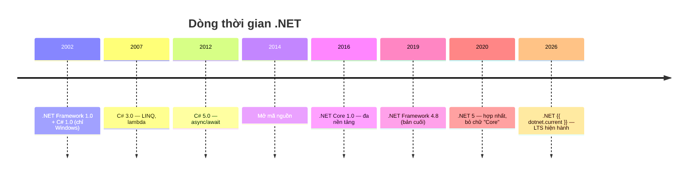
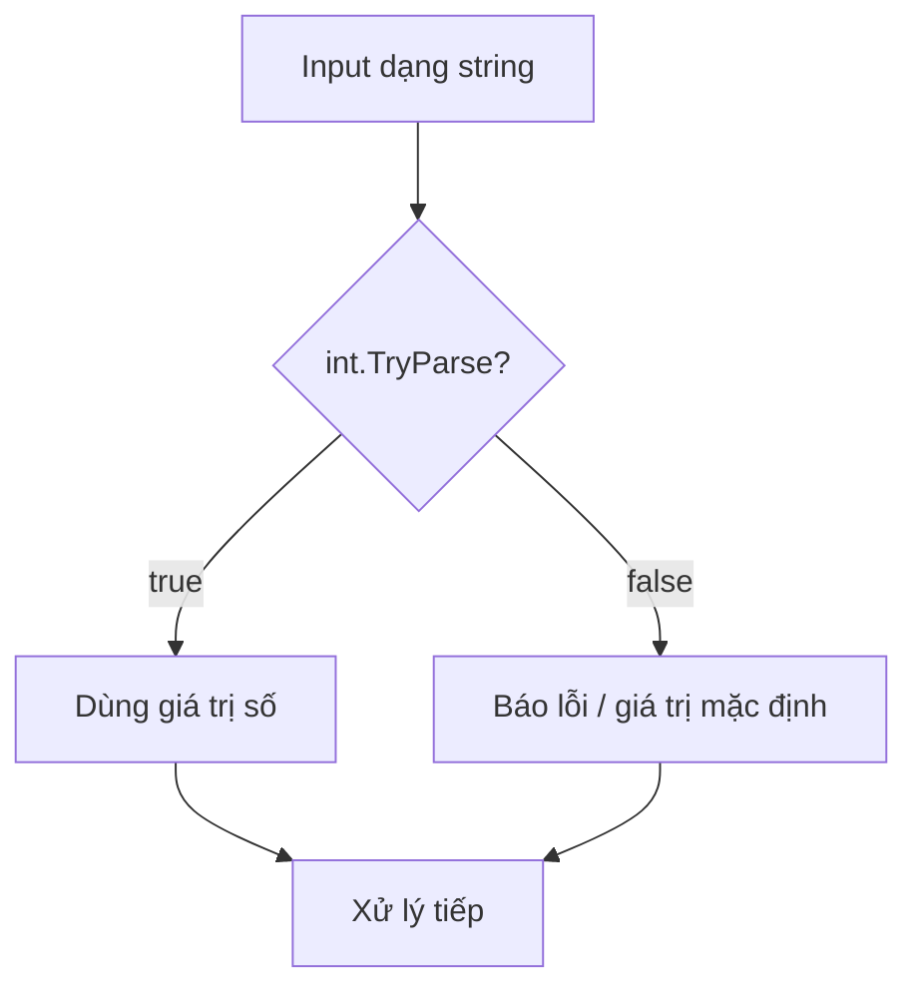

# C# Nền tảng: Kiểu dữ liệu, Biến, Điều kiện & Vòng lặp

!!! info "Bạn đang ở đây · P1 → node `p1-csharp-basics`"
    **cần trước:** thiết lập môi trường (đã chạy được `dotnet run`).
    **mở khoá sau bài này:** bộ nhớ & kiểu dữ liệu, method nâng cao, collections.
    ⏱️ Fast path ~30 phút · Deep dive +20 phút (tuỳ chọn, không bắt buộc).

> **Mục tiêu (đo được):** Sau bài này bạn **áp dụng** đúng kiểu dữ liệu cho từng tình huống (đặc biệt `decimal` cho tiền tệ), **viết** được điều kiện/vòng lặp/method có tham số, và **xử lý** input người dùng an toàn bằng `TryParse` thay vì `Parse`.

---

## Bối cảnh: .NET và C# đến từ đâu?

Trước khi học cú pháp, biết **vì sao** nền tảng này tồn tại giúp các quyết định thiết kế (vì sao có cả .NET Framework lẫn .NET, vì sao version nhảy từ 4 lên 5...) trở nên có lý do, không phải học vẹt.

**2000-2002 — Khởi đầu:** Microsoft công bố .NET tại hội nghị PDC năm 2000, rồi phát hành **.NET Framework 1.0** cùng **C# 1.0** vào năm 2002. Kiến trúc sư trưởng của C# là **Anders Hejlsberg** — trước đó ông đã tạo ra Turbo Pascal và là kiến trúc sư trưởng của Delphi tại Borland (sau này ông cũng dẫn dắt TypeScript). .NET Framework ban đầu **chỉ chạy trên Windows** và **không mã nguồn mở**.

**2005-2012 — C# trưởng thành dần:** C# 2.0 (2005) thêm generic; C# 3.0 (2007) thêm LINQ và lambda — thay đổi lớn nhất giai đoạn này; C# 4.0 (2010) thêm `dynamic`; C# 5.0 (2012) thêm `async`/`await`.

**2014-2016 — Bước ngoặt: mở mã nguồn và đa nền tảng.** Dưới thời CEO mới Satya Nadella, Microsoft đổi chiến lược sang mã nguồn mở. Năm 2014, .NET được mở mã nguồn. Năm 2016, Microsoft phát hành **.NET Core 1.0** — viết lại gần như từ đầu, chạy được trên Windows, Linux, macOS. Lý do: cạnh tranh với Java (vốn đa nền tảng từ đầu) và nhu cầu chạy .NET trên server Linux/cloud ngày càng lớn.

**2016-2020 — Hai nhánh song song:** .NET Framework (Windows-only) và .NET Core (đa nền tảng) tồn tại **song song** nhiều năm. .NET Framework dừng lại ở bản **4.8** (2019) — đây là bản cuối cùng, giờ chỉ bảo trì, không thêm tính năng mới.

**2020 — Hợp nhất:** Microsoft phát hành **.NET 5**, hợp nhất .NET Core, .NET Framework, Xamarin, Mono thành **một .NET duy nhất**, bỏ chữ "Core" khỏi tên. Version **nhảy từ 3.1 (.NET Core) thẳng lên 5** — cố tình bỏ qua số 4 để không gây nhầm với .NET Framework 4.x. C# 9 (records) ra mắt cùng đợt này.

**Từ 2020 đến nay — nhịp phát hành hằng năm (tháng 11):** phiên bản **chẵn** là LTS (hỗ trợ dài hạn, 3 năm): .NET 6 (2021), .NET 8 (2023), .NET {{ dotnet.current }} (bản LTS hiện hành). Phiên bản **lẻ** là STS (hỗ trợ ngắn hơn, ~18 tháng): .NET 7 (2022), .NET 9 (2024). C# đi cùng nhịp: C# 10 (2021), C# 11 (2022, raw string, generic math), C# 12 (2023, primary constructor, collection expression), C# 13 (2024), **C# {{ csharp.version }}** (hiện hành).



!!! tip "Vì sao nên biết chuyện này"
    Khi gặp code cũ hoặc tài liệu nói ".NET Framework", giờ bạn biết đó là nhánh Windows-only cũ (dừng ở 4.8), khác với ".NET" hiện tại (đa nền tảng, phát hành hằng năm). Đây cũng là lý do các tài liệu lỗi thời hay nhầm ".NET Core" với ".NET" — từ .NET 5 trở đi, chúng là **một**.

---

## 0. Kiểm tra trước (30 giây) — bạn đoán output là gì?

Đọc đoạn dưới và **tự đoán** in ra gì *trước khi* chạy. Sai lúc này giúp nhớ lâu hơn (desirable difficulty). Đoạn này chỉ dùng phép gán và `Console.WriteLine` — chưa cần biết gì thêm.

```csharp title="doan.cs"
// test:run
double a = 0.1 + 0.2;
Console.WriteLine(a == 0.3);        // (1) ?

decimal b = 0.1m + 0.2m;
Console.WriteLine(b == 0.3m);       // (2) ?

int ok = 41 + 1;
Console.WriteLine(ok);              // (3) ?
```

??? note "Đáp án — bấm để mở SAU khi đã đoán"
    ```
    False
    True
    42
    ```
    Vì `double` là số dấu phẩy động nhị phân nên `0.1 + 0.2` **không** đúng bằng `0.3`. `decimal` biểu diễn thập phân chính xác nên phép so sánh trả về `True`. Đây chính là lý do dùng `decimal` cho tiền tệ.

---

## 1. Từng khái niệm một — định nghĩa, ví dụ tối thiểu, lỗi nếu sai

Phần này dạy **từng khái niệm riêng biệt**, đúng thứ tự phụ thuộc: kiểu dữ liệu → biến → điều kiện → vòng lặp → mảng → xử lý input → method → switch → định dạng chuỗi → toán tử ba ngôi. Mỗi mục có đúng 3 bước: định nghĩa 1 câu, ví dụ tối thiểu, lỗi nếu dùng sai.

### 1.1 `int` — số nguyên

**Định nghĩa:** `int` là kiểu số nguyên (không phần thập phân) chiếm 32-bit, phạm vi khoảng ±2.1 tỷ.

```csharp title="int-co-ban.cs"
// test:run
int soLuong = 42;
Console.WriteLine(soLuong);
```

**Lỗi nếu sai:** gán một giá trị có phần thập phân cho `int` mà không ép kiểu sẽ không biên dịch được (`CS0266: Cannot implicitly convert type 'double' to 'int'`).

```csharp title="int-loi.cs"
// test:skip minh hoạ lỗi biên dịch CS0266 — cố ý không sửa
int soLuong = 3.9;   // CS0266: không thể ngầm chuyển double -> int
Console.WriteLine(soLuong);
```

### 1.2 `double` — số thực dấu phẩy động

**Định nghĩa:** `double` là kiểu số thực dấu phẩy động nhị phân, dùng cho tính toán khoa học/đo lường, nhưng **không** chính xác tuyệt đối cho số thập phân.

```csharp title="double-co-ban.cs"
// test:run
double chieuCao = 1.72;
Console.WriteLine(chieuCao);
```

**Lỗi nếu sai (hành vi sai, không phải lỗi biên dịch):** cộng dồn nhiều số `double` rồi so sánh bằng `==` cho kết quả sai do sai số nhị phân — như đã thấy ở mục 0 (`0.1 + 0.2 == 0.3` cho `False`).

### 1.3 `decimal` — số thập phân chính xác (tiền tệ)

**Định nghĩa:** `decimal` là kiểu số thập phân cơ số 10, chính xác cho tính toán tiền tệ, và **bắt buộc** có hậu tố `m` khi viết literal.

```csharp title="decimal-co-ban.cs"
// test:run
decimal gia = 9.99m;
Console.WriteLine(gia);
```

**Lỗi nếu sai:** quên hậu tố `m` khi gán literal thập phân cho biến `decimal` sẽ không biên dịch được, vì literal không hậu tố mặc định là `double` (`CS0664: Literal of type double cannot be implicitly converted to type 'decimal'`).

```csharp title="decimal-loi.cs"
// test:skip minh hoạ lỗi biên dịch CS0664 — cố ý không sửa
decimal gia = 9.99;   // CS0664: literal double không tự chuyển được sang decimal
Console.WriteLine(gia);
```

### 1.4 `bool` — đúng/sai

**Định nghĩa:** `bool` là kiểu chỉ nhận một trong hai giá trị `true` hoặc `false`.

```csharp title="bool-co-ban.cs"
// test:run
bool daThanhToan = true;
Console.WriteLine(daThanhToan);
```

**Lỗi nếu sai:** khác với C/C++, C# **không** cho phép coi số nguyên như điều kiện đúng/sai — gán `1` cho `bool` không biên dịch được (`CS0029: Cannot implicitly convert type 'int' to 'bool'`).

```csharp title="bool-loi.cs"
// test:skip minh hoạ lỗi biên dịch CS0029 — cố ý không sửa
bool daThanhToan = 1;   // CS0029: int không tự chuyển được sang bool
Console.WriteLine(daThanhToan);
```

### 1.5 `string` — văn bản

**Định nghĩa:** `string` là kiểu lưu chuỗi văn bản, và giá trị của nó **bất biến** (immutable) — mọi "thay đổi" thực chất tạo ra chuỗi mới.

```csharp title="string-co-ban.cs"
// test:run
string ten = "Mai";
Console.WriteLine(ten);
```

**Lỗi nếu sai:** quên dấu ngoặc kép quanh văn bản khiến trình biên dịch hiểu nhầm đó là tên biến/định danh chưa khai báo (`CS0103: The name 'Mai' does not exist in the current context`).

```csharp title="string-loi.cs"
// test:skip minh hoạ lỗi biên dịch CS0103 — cố ý không sửa
string ten = Mai;   // CS0103: 'Mai' không tồn tại — thiếu dấu ngoặc kép
Console.WriteLine(ten);
```

### 1.6 `var` — suy luận kiểu

**Định nghĩa:** `var` bảo trình biên dịch **tự suy ra** kiểu tĩnh từ giá trị khởi tạo ngay tại chỗ khai báo — biến vẫn có kiểu cố định như thể bạn viết tường minh.

```csharp title="var-co-ban.cs"
// test:run
var x = 5;
Console.WriteLine(x.GetType());   // System.Int32 — x vẫn LÀ int
```

**Lỗi nếu sai (2 trường hợp):**

1. Vì `x` đã được suy ra là `int`, gán ngược một `string` vào `x` sau đó sẽ không biên dịch được (`CS0029: Cannot implicitly convert type 'string' to 'int'`):

```csharp title="var-loi-gan-nham-kieu.cs"
// test:skip minh hoạ lỗi biên dịch CS0029 — cố ý không sửa
var x = 5;
x = "năm";   // CS0029: x đã LÀ int, không gán string được
Console.WriteLine(x);
```

2. Khai báo `var` mà không gán giá trị ngay thì trình biên dịch không có gì để suy luận, gây lỗi `CS0818: Implicitly-typed variables must be initialized`:

```csharp title="var-loi-khong-gan.cs"
// test:skip minh hoạ lỗi biên dịch CS0818 — cố ý không sửa
var y;   // CS0818: phải gán giá trị ngay khi dùng var
y = 5;
Console.WriteLine(y);
```

### 1.7 `const` — hằng số biên dịch

**Định nghĩa:** `const` khai báo một hằng số có giá trị được cố định **ngay lúc biên dịch**, và chỉ nhận literal hoặc biểu thức tính được lúc biên dịch.

```csharp title="const-co-ban.cs"
// test:run
const int soNgayTrongTuan = 7;
Console.WriteLine(soNgayTrongTuan);
```

**Lỗi nếu sai:** gán cho `const` một giá trị chỉ biết được lúc chạy chương trình (như kết quả `DateTime.Now`) sẽ không biên dịch được — `CS0133: The expression being assigned to 'x' must be constant`.

```csharp title="const-loi.cs"
// test:skip minh hoạ lỗi biên dịch CS0133 — cố ý không sửa
const int gioHienTai = DateTime.Now.Hour;   // CS0133: không phải hằng lúc biên dịch
Console.WriteLine(gioHienTai);
```

### 1.8 `readonly` — chỉ gán một lần lúc chạy

**Định nghĩa:** `readonly` là field chỉ được gán giá trị **một lần**, và chỉ được phép gán trong khai báo hoặc trong constructor của chính class đó.

```csharp title="readonly-co-ban.cs"
// test:run
Config cfg = new Config();
Console.WriteLine(cfg.Version);

class Config
{
    public readonly int Version;
    public Config()
    {
        Version = 1;   // hợp lệ: gán trong constructor
    }
}
```

**Lỗi nếu sai:** gán lại giá trị cho field `readonly` ở bất kỳ method nào khác ngoài constructor sẽ không biên dịch được — `CS0191: A readonly field cannot be assigned to (except in a constructor or init-only setter)`.

```csharp title="readonly-loi.cs"
// test:skip minh hoạ lỗi biên dịch CS0191 — cố ý không sửa
Config cfg = new Config();
cfg.Bump();

class Config
{
    public readonly int Version = 1;
    public void Bump()
    {
        Version = Version + 1;   // CS0191: chỉ được gán trong constructor
    }
}
```

### 1.9 `if` — điều kiện đơn

**Định nghĩa:** `if` chạy một khối lệnh **chỉ khi** biểu thức điều kiện trong ngoặc là `true`.

```csharp title="if-co-ban.cs"
// test:run
int tuoi = 20;
if (tuoi >= 18)
{
    Console.WriteLine("Đủ tuổi");
}
```

**Lỗi nếu sai:** viết `=` (gán) thay vì `==` (so sánh) trong điều kiện. Với `bool`, C# sẽ báo lỗi biên dịch ngay (`CS0029: Cannot implicitly convert type 'int' to 'bool'`) vì `tuoi = 18` trả về `int`, không phải `bool` — đây là điểm C# an toàn hơn C/C++ (ở đó lỗi này âm thầm chạy sai chứ không báo lỗi).

```csharp title="if-loi-gan-thay-so-sanh.cs"
// test:skip minh hoạ lỗi biên dịch CS0029 — cố ý không sửa
int tuoi = 20;
if (tuoi = 18)   // CS0029: '=' gán int, if cần bool — phải dùng '=='
{
    Console.WriteLine("Đủ tuổi");
}
```

### 1.10 `if / else` — hai nhánh

**Định nghĩa:** `if/else` chạy nhánh `if` khi điều kiện đúng, ngược lại chạy nhánh `else`.

```csharp title="if-else-co-ban.cs"
// test:run
int tuoi = 15;
if (tuoi >= 18)
{
    Console.WriteLine("Đủ tuổi");
}
else
{
    Console.WriteLine("Chưa đủ tuổi");
}
```

**Lỗi nếu sai:** đặt `else` mà không có `if` liền trước (ví dụ dư một cặp ngoặc `{}` chen giữa) khiến trình biên dịch không tìm được `if` để ghép — đã xác nhận bằng biên dịch thật trên .NET 10, mã lỗi đúng là `CS8641: 'else' cannot start a statement`.

```csharp title="if-else-loi.cs"
// test:skip minh hoạ lỗi biên dịch CS8641 — cố ý không sửa
int tuoi = 20;
if (tuoi >= 18)
{
    Console.WriteLine("Đủ tuổi");
}
{
    // cặp ngoặc dư chen giữa làm else phía dưới mất if để ghép
}
else
{
    Console.WriteLine("Chưa đủ tuổi");   // CS8641: 'else' cannot start a statement
}
```

### 1.11 `if / else if / else` — nhiều nhánh

**Định nghĩa:** chuỗi `if/else if/else` kiểm tra tuần tự nhiều điều kiện, chạy khối đầu tiên đúng, và `else` cuối là "mặc định" khi không nhánh nào đúng.

```csharp title="if-else-if-co-ban.cs"
// test:run
int diem = 75;
if (diem >= 90)
{
    Console.WriteLine("Giỏi");
}
else if (diem >= 70)
{
    Console.WriteLine("Khá");
}
else
{
    Console.WriteLine("Cần cố gắng");
}
```

**Lỗi nếu sai (hành vi sai, không phải lỗi biên dịch):** đảo thứ tự điều kiện từ hẹp ra rộng (ví dụ kiểm tra `diem >= 70` trước `diem >= 90`) khiến học sinh 95 điểm bị xếp nhầm vào "Khá" vì nhánh `>= 70` chặn mất, code vẫn chạy nhưng **kết quả sai** — không có lỗi biên dịch nào báo cho bạn biết.

---

## 2. Vòng lặp

### 2.1 `for` — lặp có đếm

**Định nghĩa:** `for` lặp lại một khối lệnh với một biến đếm được khởi tạo, kiểm tra điều kiện, và cập nhật sau mỗi vòng — tất cả khai báo ngay trên dòng `for`.

```csharp title="for-co-ban.cs"
// test:run
for (int i = 1; i <= 3; i++)
{
    Console.WriteLine(i);
}
```

**Lỗi nếu sai (hành vi sai):** viết sai điều kiện dừng, ví dụ `i < 3` khi bạn muốn in tới `3`, khiến vòng lặp thiếu mất một lần chạy (off-by-one) — code vẫn biên dịch và chạy, chỉ là output thiếu `3`.

### 2.2 `while` — lặp theo điều kiện

**Định nghĩa:** `while` lặp lại một khối lệnh **chừng nào** điều kiện còn `true`, kiểm tra điều kiện trước mỗi lần chạy.

```csharp title="while-co-ban.cs"
// test:run
int dem = 0;
while (dem < 3)
{
    Console.WriteLine(dem);
    dem++;
}
```

**Lỗi nếu sai (hành vi sai):** quên cập nhật biến điều khiển (`dem++`) bên trong thân vòng lặp khiến điều kiện `dem < 3` không bao giờ sai — chương trình rơi vào **vòng lặp vô hạn**, không có lỗi biên dịch nào cảnh báo.

### 2.3 `foreach` — duyệt tập hợp

**Định nghĩa:** `foreach` duyệt qua **từng phần tử** của một tập hợp (mảng, `List<T>`, v.v.) mà không cần tự quản lý chỉ số.

```csharp title="foreach-co-ban.cs"
// test:run
int[] soLieu = { 10, 20, 30 };
foreach (int n in soLieu)
{
    Console.WriteLine(n);
}
```

**Lỗi nếu sai:** biến lặp trong `foreach` (`n` ở trên) là chỉ-đọc — cố gán lại giá trị cho nó ngay trong thân vòng lặp sẽ không biên dịch được (`CS1656: Cannot assign to 'n' because it is a 'foreach iteration variable'`).

```csharp title="foreach-loi.cs"
// test:skip minh hoạ lỗi biên dịch CS1656 — cố ý không sửa
int[] soLieu = { 10, 20, 30 };
foreach (int n in soLieu)
{
    n = n + 1;   // CS1656: không gán lại được biến lặp foreach
    Console.WriteLine(n);
}
```

---

## 3. Mảng (array)

**Định nghĩa:** mảng là một tập hợp có **kích thước cố định** các phần tử cùng kiểu, truy cập qua chỉ số bắt đầu từ `0`.

```csharp title="mang-co-ban.cs"
// test:run
int[] diem = { 90, 80, 70 };
Console.WriteLine(diem[0]);   // 90 — phần tử đầu tiên, chỉ số 0
```

**Lỗi nếu sai (lỗi lúc chạy, không phải lúc biên dịch):** truy cập chỉ số vượt ngoài phạm vi mảng ném `IndexOutOfRangeException` khi chương trình đang chạy.

```csharp title="mang-loi.cs"
// test:run
int[] diem = { 90, 80, 70 };
try
{
    Console.WriteLine(diem[5]);   // mảng chỉ có chỉ số 0..2
}
catch (IndexOutOfRangeException)
{
    Console.WriteLine("Lỗi: chỉ số vượt phạm vi mảng");
}
```

---

## 4. Tham số `out`

**Định nghĩa:** tham số `out` cho phép một method **trả thêm** một giá trị ra ngoài qua tham số, thay vì (hoặc thêm vào) giá trị `return` thông thường — người gọi bắt buộc phải khai báo từ khoá `out` ở cả nơi định nghĩa lẫn nơi gọi.

```csharp title="out-co-ban.cs"
// test:run
ChiaHai(10, 3, out int thuong, out int du);
Console.WriteLine($"{thuong} dư {du}");

static void ChiaHai(int a, int b, out int thuong, out int du)
{
    thuong = a / b;
    du = a % b;
}
```

**Lỗi nếu sai:** gọi một method có tham số `out` mà quên viết từ khoá `out` ở lời gọi sẽ không biên dịch được — `CS1620: Argument must be passed with the 'out' keyword`. Nếu các biến truyền vào còn chưa được gán giá trị trước đó, trình biên dịch còn báo thêm `CS0165: Use of unassigned local variable` cho từng biến, vì thiếu `out` khiến lời gọi bị hiểu là truyền giá trị bình thường — mà truyền giá trị bình thường thì biến phải được gán dứt khoát trước khi dùng.

```csharp title="out-loi.cs"
// test:skip minh hoạ lỗi biên dịch CS1620 và CS0165 — cố ý không sửa
int thuong, du;               // chưa gán giá trị
ChiaHai(10, 3, thuong, du);
// CS1620: thiếu từ khoá 'out' ở lời gọi (cho cả thuong và du)
// CS0165: Use of unassigned local variable 'thuong' (và tương tự cho 'du')
//         vì thiếu 'out' nên trình biên dịch coi đây là truyền giá trị bình thường,
//         đòi hỏi biến phải được gán trước khi dùng

static void ChiaHai(int a, int b, out int thuong, out int du)
{
    thuong = a / b;
    du = a % b;
}
```

---

## 5. `int.TryParse` và `decimal.TryParse`

**Định nghĩa:** `TryParse` cố gắng chuyển một `string` sang kiểu số, trả về `bool` cho biết có thành công không, và đưa kết quả ra qua tham số `out` — **không** ném exception khi chuỗi không hợp lệ.

```csharp title="tryparse-co-ban.cs"
// test:run
bool thanhCong = int.TryParse("42", out int soNguyen);
Console.WriteLine(thanhCong);   // True
Console.WriteLine(soNguyen);    // 42

bool thatBai = decimal.TryParse("xxx", out decimal soTien);
Console.WriteLine(thatBai);     // False
Console.WriteLine(soTien);      // 0 — giá trị mặc định khi thất bại
```

**Lỗi nếu sai:** cũng như mọi tham số `out`, quên từ khoá `out` ở lời gọi `TryParse` sẽ không biên dịch được — trình biên dịch báo `CS1620: Argument must be passed with the 'out' keyword` (và có thể kèm thêm `CS1503` do trình biên dịch thử khớp với overload khác trước khi báo lỗi chính).

```csharp title="tryparse-loi.cs"
// test:skip minh hoạ lỗi biên dịch CS1620 (có thể kèm CS1503) — cố ý không sửa
int ketQua;
bool ok = int.TryParse("42", ketQua);   // CS1620: thiếu 'out' trước ketQua
Console.WriteLine(ok);
```

---

## 6. `int.Parse` đối chiếu

**Định nghĩa:** `Parse` cũng chuyển `string` sang số, nhưng **ném exception** thay vì trả `bool` khi chuỗi không hợp lệ.

```csharp title="parse-co-ban.cs"
// test:run
int ok = int.Parse("42");
Console.WriteLine(ok);   // 42
```

**Lỗi nếu sai (lỗi lúc chạy):** gọi `int.Parse` với một chuỗi không phải số ném `FormatException`, làm sập chương trình nếu không có `try/catch`.

```csharp title="parse-loi.cs"
// test:run
try
{
    int x = int.Parse("abc");
    Console.WriteLine(x);
}
catch (FormatException)
{
    Console.WriteLine("Lỗi: chuỗi không đúng định dạng số");
}
```

!!! danger "Hiểu lầm phổ biến — đính chính"
    "Dùng `double` cho tiền cho gọn." **SAI.** `double` gây sai số làm tròn khi cộng dồn giá tiền. Luôn dùng `decimal` cho tiền tệ. Ngoài ra `Parse` ném exception khi gặp chuỗi rác — với dữ liệu từ người dùng, **luôn** ưu tiên `TryParse`.

---

## 7. Method: tham số, kiểu trả về, `static`, `return`

**Định nghĩa:** một method là một khối code có tên, nhận vào tham số (đầu vào), và dùng `return` để trả ra một giá trị đúng kiểu đã khai báo; `static` nghĩa là method thuộc về chính class/chương trình, không cần tạo object mới để gọi.

```csharp title="method-co-ban.cs"
// test:run
int tong = Cong(3, 4);
Console.WriteLine(tong);   // 7

static int Cong(int a, int b)
{
    return a + b;
}
```

**Lỗi nếu sai:** khai báo kiểu trả về là `int` nhưng thiếu câu lệnh `return` cho một nhánh nào đó (hoặc thiếu hoàn toàn) sẽ không biên dịch được — `CS0161: not all code paths return a value`.

```csharp title="method-loi.cs"
// test:skip minh hoạ lỗi biên dịch CS0161 — cố ý không sửa
int tong = Cong(3, 4);
Console.WriteLine(tong);

static int Cong(int a, int b)
{
    int ketQua = a + b;
    // thiếu return -> CS0161: not all code paths return a value
}
```

---

## 8. `switch` expression cơ bản

**Định nghĩa:** `switch` expression so khớp một giá trị với nhiều trường hợp và **trả về** kết quả tương ứng, gọn hơn chuỗi `if/else if` dài khi so khớp giá trị cụ thể.

```csharp title="switch-co-ban.cs"
// test:run
int thu = 2;
string tenThu = thu switch
{
    1 => "Chủ nhật",
    2 => "Thứ hai",
    3 => "Thứ ba",
    _ => "Không rõ"
};
Console.WriteLine(tenThu);   // Thứ hai
```

**Lỗi nếu sai (lỗi lúc chạy, không phải lúc biên dịch):** thiếu nhánh mặc định `_` khi các trường hợp liệt kê không bao phủ hết giá trị có thể có vẫn **biên dịch thành công** — trình biên dịch chỉ phát cảnh báo `CS8509: The switch expression does not handle all possible values (it is not exhaustive)` (warning, không chặn build). Lỗi thật xảy ra **lúc chạy chương trình**: nếu giá trị đầu vào rơi vào trường hợp không được liệt kê, C# ném `SwitchExpressionException`.

```csharp title="switch-loi.cs"
// test:run
int thu = 9;
try
{
    string tenThu = thu switch
    {
        1 => "Chủ nhật",
        2 => "Thứ hai"
        // thiếu '_' -> chỉ cảnh báo CS8509 lúc biên dịch, không chặn build
    };
    Console.WriteLine(tenThu);
}
catch (System.Runtime.CompilerServices.SwitchExpressionException)
{
    Console.WriteLine("Lỗi lúc chạy: không nhánh nào khớp giá trị 9 (SwitchExpressionException)");
}
```

---

## 9. String interpolation và format specifier

**Định nghĩa:** string interpolation (`$"..."`) chèn thẳng giá trị biến vào trong chuỗi bằng cặp ngoặc nhọn `{ }`, và format specifier (như `:C`, `:N0`) sau dấu `:` điều khiển cách hiển thị giá trị đó.

```csharp title="interpolation-co-ban.cs"
// test:run
string ten = "Mai";
decimal gia = 1500000m;
Console.WriteLine($"Khách {ten} trả {gia:C}");     // vd: Khách Mai trả ₫1,500,000.00 (theo culture)
Console.WriteLine($"Làm tròn: {gia:N0}");          // 1,500,000
```

**Lỗi nếu sai:** viết thiếu dấu `$` trước chuỗi nhưng vẫn dùng cặp `{ }` bên trong khiến C# hiểu `{ten}` là văn bản thường (không nội suy) — chương trình vẫn biên dịch và chạy, chỉ là output in ra đúng ký tự `{ten}` thay vì giá trị của biến `ten` (hành vi sai, không phải lỗi biên dịch).

```csharp title="interpolation-loi.cs"
// test:run
string ten = "Mai";
Console.WriteLine("Xin chào {ten}");   // thiếu '$' -> in nguyên văn "Xin chào {ten}"
```

---

## 10. Toán tử ba ngôi `?:`

**Định nghĩa:** toán tử ba ngôi `dieuKien ? giaTriNeuDung : giaTriNeuSai` là một biểu thức rút gọn cho `if/else` khi cả hai nhánh chỉ trả về một giá trị.

```csharp title="ba-ngoi-co-ban.cs"
// test:run
int tuoi = 20;
string nhan = tuoi >= 18 ? "Người lớn" : "Trẻ em";
Console.WriteLine(nhan);   // Người lớn
```

**Lỗi nếu sai:** hai nhánh của `?:` phải cho ra kiểu tương thích nhau — trả về `string` ở nhánh này và `int` ở nhánh kia (không có chuyển đổi ngầm) sẽ không biên dịch được — `CS0173: Type of conditional expression cannot be determined because there is no implicit conversion between 'string' and 'int'`.

```csharp title="ba-ngoi-loi.cs"
// test:skip minh hoạ lỗi biên dịch CS0173 — cố ý không sửa
int tuoi = 20;
var nhan = tuoi >= 18 ? "Người lớn" : 0;   // CS0173: string và int không tương thích
Console.WriteLine(nhan);
```

---

## 11. Tổng kết — bảng so sánh & sơ đồ

Tới đây bạn đã học đủ 14 khái niệm riêng lẻ ở trên. Phần này **không dạy khái niệm mới** — chỉ tổng hợp lại để ôn tập trước khi bước sang ví dụ hoá đơn (trộn nhiều khái niệm).

| Kiểu | Dùng cho | Ví dụ literal | Ghi chú |
|------|----------|---------------|---------|
| `int` | số nguyên | `42` | phạm vi ±2.1 tỷ |
| `double` | số thực khoa học/đo lường | `3.14` | nhanh, **không** chính xác thập phân |
| `decimal` | **tiền tệ**, tài chính | `9.99m` | chính xác, hậu tố `m` bắt buộc |
| `bool` | đúng/sai | `true` | không cast từ số như C |
| `string` | văn bản | `"xin chào"` | bất biến (immutable) |

Nhắc lại: `const` cố định lúc **biên dịch** (chỉ nhận literal); `readonly` được gán một lần lúc **chạy** (trong constructor). Với input người dùng, dùng `int.TryParse`/`decimal.TryParse` (trả `bool`, không ném exception) thay vì `int.Parse`/`decimal.Parse` (ném exception khi lỗi).



---

## 12. Ví dụ mẫu — hoá đơn (trộn nhiều khái niệm đã học)

Chương trình tính hoá đơn: dùng `decimal` cho tiền, `TryParse` cho input, `switch expression` cho phân loại, và `foreach` để cộng dồn — hầu hết khái niệm ở đây đã được dạy riêng lẻ ở các mục trên.

Riêng một điểm mới: ví dụ dưới đây dùng **relational pattern** trong `switch expression` — so khớp theo *khoảng quan hệ* (`< 50m =>`) thay vì giá trị chính xác như mục 8. Đây là một mở rộng tự nhiên của cú pháp `switch` expression cơ bản đã học: thay vì viết `1 => ...`, bạn viết `< 50m => ...` để khớp "mọi giá trị nhỏ hơn 50m". Ví dụ tối thiểu: `int diem = 65; string xepLoai = diem switch { < 50 => "Rớt", _ => "Đậu" };` trả về `"Đậu"`.

```csharp title="hoa-don.cs"
// test:run
string[] rawPrices = { "19.99", "5.50", "xxx", "100" };

decimal total = 0m;
int invalid = 0;

foreach (string raw in rawPrices)
{
    if (decimal.TryParse(raw, out decimal price))
        total += price;
    else
        invalid++;
}

decimal tax = total * 0.1m;
decimal grand = total + tax;

string tier = grand switch
{
    < 50m  => "Nhỏ",
    < 150m => "Vừa",
    _      => "Lớn"
};

Console.WriteLine($"Tổng hợp lệ:  {total:C}");
Console.WriteLine($"Thuế (10%):   {tax:C}");
Console.WriteLine($"Thành tiền:   {grand:C}");
Console.WriteLine($"Số dòng lỗi:  {invalid}");
Console.WriteLine($"Phân loại:    {tier}");
```

Output kỳ vọng (định dạng tiền theo culture invariant có thể khác dấu tách):

```
Tổng hợp lệ:  $125.49
Thuế (10%):   $12.55
Thành tiền:   $138.04
Số dòng lỗi:  1
Phân loại:    Vừa
```

---

## 13. Bài tập có giàn giáo

Viết method `decimal AverageValid(string[] inputs)` trả về **trung bình** các số hợp lệ trong mảng, dùng `TryParse`. Nếu không có số hợp lệ nào, trả về `0m`. Điền vào chỗ `// TODO`.

```csharp title="bai-tap.cs"
// test:run
string[] data = { "10", "abc", "30", "50" };
Console.WriteLine(AverageValid(data));   // mong đợi: 30

static decimal AverageValid(string[] inputs)
{
    decimal sum = 0m;
    int count = 0;
    // TODO: duyệt inputs, TryParse, cộng dồn sum và tăng count
    // TODO: trả về sum / count nếu count > 0, ngược lại 0m
    return 0m;
}
```

??? success "Lời giải + vì sao"
    ```csharp title="C#"
    // test:run
    string[] data = { "10", "abc", "30", "50" };
    Console.WriteLine(AverageValid(data));   // 30

    static decimal AverageValid(string[] inputs)
    {
        decimal sum = 0m;
        int count = 0;
        foreach (string s in inputs)
        {
            if (decimal.TryParse(s, out decimal v))
            {
                sum += v;
                count++;
            }
        }
        return count > 0 ? sum / count : 0m;
    }
    ```
    **Vì sao:** `TryParse` lọc bỏ `"abc"` mà không làm chương trình sập. Ta chia `sum / count` (không phải `inputs.Length`) để chỉ tính trên số hợp lệ. Toán tử ba ngôi `?:` gói gọn "nếu có số hợp lệ thì chia, ngược lại trả `0m`" — tránh `DivideByZeroException` khi `count == 0`.

---

## 14. Cạm bẫy thường gặp

- **`==` trên `double`:** gần như luôn sai vì sai số dấu phẩy động (đã thấy ở mục 0: `0.1 + 0.2 == 0.3` cho `False`) — với `double` không nên so sánh bằng `==`, hãy dùng `decimal` khi cần so sánh chính xác.
- **Quên hậu tố `m`:** `decimal d = 9.99;` không biên dịch — literal `9.99` mặc định là `double`. Viết `9.99m`.
- **Dùng `=` thay vì `==` trong `if`:** với điều kiện kiểu `bool`, C# báo lỗi biên dịch ngay (không như C/C++ chạy sai âm thầm) — nhưng vẫn nên cẩn thận vì thói quen gõ nhanh dễ mắc lại.
- **Quên cập nhật biến điều khiển trong `while`:** gây vòng lặp vô hạn, không có lỗi biên dịch nào cảnh báo trước.

---

## Tự kiểm tra

1. Kiểu nào nên dùng để lưu số tiền, và vì sao?
2. Khác biệt cốt lõi giữa `const` và `readonly` là gì?
3. Vì sao `int.TryParse` an toàn hơn `int.Parse` khi xử lý input người dùng?
4. Vì sao `0.1 + 0.2 == 0.3` cho `False` với `double` nhưng cho `True` với `decimal`?
5. `var total = 0m;` — `total` có kiểu tĩnh là gì?

??? question "Đáp án"
    1. **`decimal`** — biểu diễn thập phân chính xác, tránh sai số làm tròn khi cộng dồn tiền tệ.
    2. `const` cố định lúc **biên dịch** (chỉ literal); `readonly` gán một lần lúc **chạy**, thường trong constructor.
    3. `TryParse` trả về `bool` và không ném exception khi chuỗi không hợp lệ, nên không làm sập chương trình; `Parse` ném `FormatException`.
    4. `double` là số dấu phẩy động nhị phân nên không biểu diễn chính xác `0.1`/`0.2`, gây sai số khi so sánh; `decimal` là số thập phân cơ số 10 nên chính xác tuyệt đối cho các literal thập phân.
    5. `decimal` — `var` vẫn là kiểu tĩnh, được suy ra từ literal `0m`.

---

??? abstract "DEEP DIVE — kiểu số, checked/unchecked và switch expression nâng cao"
    **Vì sao `double` sai:** `double` theo chuẩn IEEE 754 nhị phân, không biểu diễn chính xác được `0.1` (giống như hệ thập phân không biểu diễn hết `1/3`). `decimal` dùng cơ số 10 với 28-29 chữ số ý nghĩa nên chính xác cho tiền, nhưng chậm hơn và phạm vi hẹp hơn.

    **Tràn số (overflow) — mặc định ÂM THẦM sai, không báo lỗi:** phép toán số nguyên trong C# mặc định dùng ngữ cảnh `unchecked`, nghĩa là khi vượt quá `int.MaxValue` nó **không** ném lỗi mà "quấn vòng" (wrap-around) về số âm — chương trình vẫn chạy tiếp với giá trị sai, không có bất kỳ cảnh báo nào:

    ```csharp title="C#"
    // test:run
    int max = int.MaxValue;
    int wrongSilently = max + 1;   // KHÔNG có checked -> tràn ÂM THẦM
    Console.WriteLine(wrongSilently);   // -2147483648 — sai nhưng KHÔNG lỗi
    ```

    Output:

    ```
    -2147483648
    ```

    Muốn phát hiện tràn số thay vì để nó âm thầm sai, bọc phép toán trong `checked { ... }` để ném `OverflowException`:

    ```csharp title="C#"
    // test:run
    int max = int.MaxValue;
    try
    {
        int wrong = checked(max + 1);
        Console.WriteLine(wrong);
    }
    catch (OverflowException)
    {
        Console.WriteLine("Tràn số đã bị bắt");
    }
    ```

    Output:

    ```
    Tràn số đã bị bắt
    ```

    So sánh: đoạn KHÔNG `checked` ở trên trả về `-2147483648` mà không hề dừng lại hay cảnh báo — đây là lý do tràn số là một trong những lỗi khó phát hiện nhất nếu chỉ đọc code mà không kiểm thử biên (boundary testing).

    **switch expression với when và tuple:** ngoài so khớp giá trị đơn giản (đã học ở mục 8) và relational pattern (đã giới thiệu ngắn gọn ở mục 12), `switch expression` còn so khớp theo pattern phức tạp hơn — kết hợp nhiều biến trong một tuple:

    ```csharp title="C#"
    // test:skip trích đoạn minh hoạ pattern, không chạy độc lập
    string Classify(int qty, bool vip) => (qty, vip) switch
    {
        ( > 100, _) => "Sỉ",
        (_, true)   => "VIP",
        _           => "Thường"
    };
    ```

    Với C# {{ csharp.version }} trên .NET {{ dotnet.current }}, pattern matching (property/list/relational patterns) giúp thay thế nhiều chuỗi `if-else` dài bằng biểu thức ngắn, dễ đọc và an toàn kiểu hơn.

**Tiếp theo →** [P1 · Bộ nhớ & Kiểu dữ liệu](bo-nho-va-kieu-du-lieu.md)
