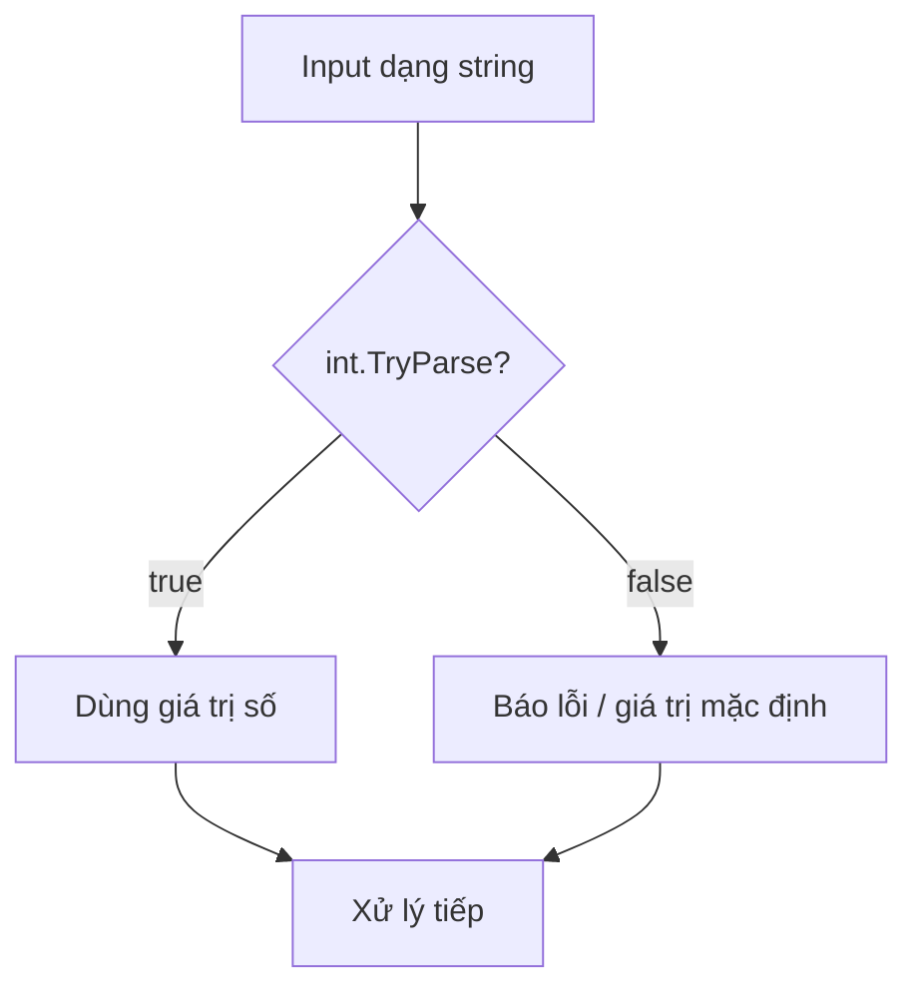

# C# Nền tảng: Kiểu dữ liệu, Biến, Điều kiện & Vòng lặp

!!! info "Bạn đang ở đây · P1 → node `p1-csharp-basics`"
    **cần trước:** thiết lập môi trường (đã chạy được `dotnet run`).
    **mở khoá sau bài này:** bộ nhớ & kiểu dữ liệu, method nâng cao, collections.
    ⏱️ Fast path ~30 phút · Deep dive +20 phút (tuỳ chọn, không bắt buộc).

> **Mục tiêu (đo được):** Sau bài này bạn **áp dụng** đúng kiểu dữ liệu cho từng tình huống (đặc biệt `decimal` cho tiền tệ), **viết** được điều kiện/vòng lặp/method có tham số, và **xử lý** input người dùng an toàn bằng `TryParse` thay vì `Parse`.

---

## 0. Kiểm tra trước (30 giây) — bạn đoán output là gì?

Đọc đoạn dưới và **tự đoán** in ra gì *trước khi* chạy. Sai lúc này giúp nhớ lâu hơn (desirable difficulty).

```csharp title="doan.cs"
// test:run
double a = 0.1 + 0.2;
Console.WriteLine(a == 0.3);        // (1) ?

decimal b = 0.1m + 0.2m;
Console.WriteLine(b == 0.3m);       // (2) ?

int ok = int.Parse("42");
Console.WriteLine(ok + 1);          // (3) ?
```

??? note "Đáp án — bấm để mở SAU khi đã đoán"
    ```
    False
    True
    43
    ```
    Vì `double` là số dấu phẩy động nhị phân nên `0.1 + 0.2` **không** đúng bằng `0.3`. `decimal` biểu diễn thập phân chính xác nên phép so sánh trả về `True`. Đây chính là lý do dùng `decimal` cho tiền tệ.

---

## 1. Ý niệm cốt lõi

C# là ngôn ngữ **tĩnh kiểu (statically typed)**: mỗi biến có một kiểu xác định lúc biên dịch. Bạn có thể viết kiểu tường minh (`int x = 5;`) hoặc để trình biên dịch suy ra bằng `var` — nhưng `var` **không** làm mất kiểu tĩnh, nó vẫn là `int`.

| Kiểu | Dùng cho | Ví dụ literal | Ghi chú |
|------|----------|---------------|---------|
| `int` | số nguyên | `42` | phạm vi ±2.1 tỷ |
| `double` | số thực khoa học/đo lường | `3.14` | nhanh, **không** chính xác thập phân |
| `decimal` | **tiền tệ**, tài chính | `9.99m` | chính xác, hậu tố `m` bắt buộc |
| `bool` | đúng/sai | `true` | không cast từ số như C |
| `string` | văn bản | `"xin chào"` | bất biến (immutable) |

`const` được cố định lúc **biên dịch** (chỉ nhận literal); `readonly` được gán một lần lúc **chạy** (trong constructor). Với input người dùng, dùng `int.TryParse` (trả `bool`, không ném exception) thay vì `int.Parse` (ném exception khi lỗi).



!!! danger "Hiểu lầm phổ biến — đính chính"
    "Dùng `double` cho tiền cho gọn." **SAI.** `double` gây sai số làm tròn khi cộng dồn giá tiền. Luôn dùng `decimal` cho tiền tệ. Ngoài ra `Parse` ném exception khi gặp chuỗi rác — với dữ liệu từ người dùng, **luôn** ưu tiên `TryParse`.

---

## 2. Ví dụ mẫu

Chương trình tính hoá đơn: dùng `decimal` cho tiền, `TryParse` cho input, `switch expression` cho phân loại, và `foreach` để cộng dồn.

```csharp title="hoa-don.cs"
// test:run
string[] rawPrices = { "19.99", "5.50", "xxx", "100" };

decimal total = 0m;
int invalid = 0;

foreach (string raw in rawPrices)
{
    if (decimal.TryParse(raw, out decimal price))
        total += price;
    else
        invalid++;
}

decimal tax = total * 0.1m;
decimal grand = total + tax;

string tier = grand switch
{
    < 50m  => "Nhỏ",
    < 150m => "Vừa",
    _      => "Lớn"
};

Console.WriteLine($"Tổng hợp lệ:  {total:C}");
Console.WriteLine($"Thuế (10%):   {tax:C}");
Console.WriteLine($"Thành tiền:   {grand:C}");
Console.WriteLine($"Số dòng lỗi:  {invalid}");
Console.WriteLine($"Phân loại:    {tier}");
```

Output kỳ vọng (định dạng tiền theo culture invariant có thể khác dấu tách):

```
Tổng hợp lệ:  $125.49
Thuế (10%):   $12.549
Thành tiền:   $138.039
Số dòng lỗi:  1
Phân loại:    Vừa
```

---

## 3. Bài tập có giàn giáo

Viết method `decimal AverageValid(string[] inputs)` trả về **trung bình** các số hợp lệ trong mảng, dùng `TryParse`. Nếu không có số hợp lệ nào, trả về `0m`. Điền vào chỗ `// TODO`.

```csharp title="bai-tap.cs"
// test:run
string[] data = { "10", "abc", "30", "50" };
Console.WriteLine(AverageValid(data));   // mong đợi: 30

static decimal AverageValid(string[] inputs)
{
    decimal sum = 0m;
    int count = 0;
    // TODO: duyệt inputs, TryParse, cộng dồn sum và tăng count
    // TODO: trả về sum / count nếu count > 0, ngược lại 0m
    return 0m;
}
```

??? success "Lời giải + vì sao"
    ```csharp title="C#"
    // test:run
    string[] data = { "10", "abc", "30", "50" };
    Console.WriteLine(AverageValid(data));   // 30

    static decimal AverageValid(string[] inputs)
    {
        decimal sum = 0m;
        int count = 0;
        foreach (string s in inputs)
        {
            if (decimal.TryParse(s, out decimal v))
            {
                sum += v;
                count++;
            }
        }
        return count > 0 ? sum / count : 0m;
    }
    ```
    **Vì sao:** `TryParse` lọc bỏ `"abc"` mà không làm chương trình sập. Ta chia `sum / count` (không phải `inputs.Length`) để chỉ tính trên số hợp lệ. Kiểm tra `count > 0` tránh chia cho 0 — bảo vệ khỏi `DivideByZeroException`.

---

## 4. Cạm bẫy thường gặp

- **Ép kiểu thu hẹp mất dữ liệu:** `(int)3.9` cho `3` (cắt phần thập phân). Muốn làm tròn dùng `Math.Round`.
- **`==` trên `double`:** gần như luôn sai vì sai số dấu phẩy động; hãy so `Math.Abs(a - b) < 1e-9`.
- **Quên hậu tố `m`:** `decimal d = 9.99;` không biên dịch — literal `9.99` mặc định là `double`. Viết `9.99m`.

---

## Tự kiểm tra

1. Kiểu nào nên dùng để lưu số tiền, và vì sao?
2. Khác biệt cốt lõi giữa `const` và `readonly` là gì?
3. Vì sao `int.TryParse` an toàn hơn `int.Parse` khi xử lý input người dùng?
4. `(int)3.9` cho kết quả gì? Muốn `4` thì dùng cái gì?
5. `var total = 0m;` — `total` có kiểu tĩnh là gì?

??? question "Đáp án"
    1. **`decimal`** — biểu diễn thập phân chính xác, tránh sai số làm tròn khi cộng dồn tiền tệ.
    2. `const` cố định lúc **biên dịch** (chỉ literal); `readonly` gán một lần lúc **chạy**, thường trong constructor.
    3. `TryParse` trả về `bool` và không ném exception khi chuỗi không hợp lệ, nên không làm sập chương trình; `Parse` ném `FormatException`.
    4. `3` (cắt phần thập phân). Muốn `4` dùng `Math.Round(3.9)` hoặc `(int)Math.Round(3.9)`.
    5. `decimal` — `var` vẫn là kiểu tĩnh, được suy ra từ literal `0m`.

---

??? abstract "DEEP DIVE — kiểu số, checked/unchecked và switch expression nâng cao"
    **Vì sao `double` sai:** `double` theo chuẩn IEEE 754 nhị phân, không biểu diễn chính xác được `0.1` (giống như hệ thập phân không biểu diễn hết `1/3`). `decimal` dùng cơ số 10 với 28-29 chữ số ý nghĩa nên chính xác cho tiền, nhưng chậm hơn và phạm vi hẹp hơn.

    **Tràn số (overflow):** mặc định phép toán số nguyên tràn âm thầm (wrap-around). Bọc trong `checked { ... }` để ném `OverflowException`:

    ```csharp title="C#"
    // test:run
    int max = int.MaxValue;
    try
    {
        int wrong = checked(max + 1);
        Console.WriteLine(wrong);
    }
    catch (OverflowException)
    {
        Console.WriteLine("Tràn số đã bị bắt");
    }
    ```

    Output:

    ```
    Tràn số đã bị bắt
    ```

    **switch expression với when và tuple:** ngoài kiểu, `switch expression` có thể so khớp theo pattern phức tạp:

    ```csharp title="C#"
    // test:skip trích đoạn minh hoạ pattern, không chạy độc lập
    string Classify(int qty, bool vip) => (qty, vip) switch
    {
        ( > 100, _) => "Sỉ",
        (_, true)   => "VIP",
        _           => "Thường"
    };
    ```

    Với C# {{ csharp.version }} trên .NET {{ dotnet.current }}, pattern matching (property/list/relational patterns) giúp thay thế nhiều chuỗi `if-else` dài bằng biểu thức ngắn, dễ đọc và an toàn kiểu hơn.

Tiếp theo -> bộ nhớ & kiểu dữ liệu
