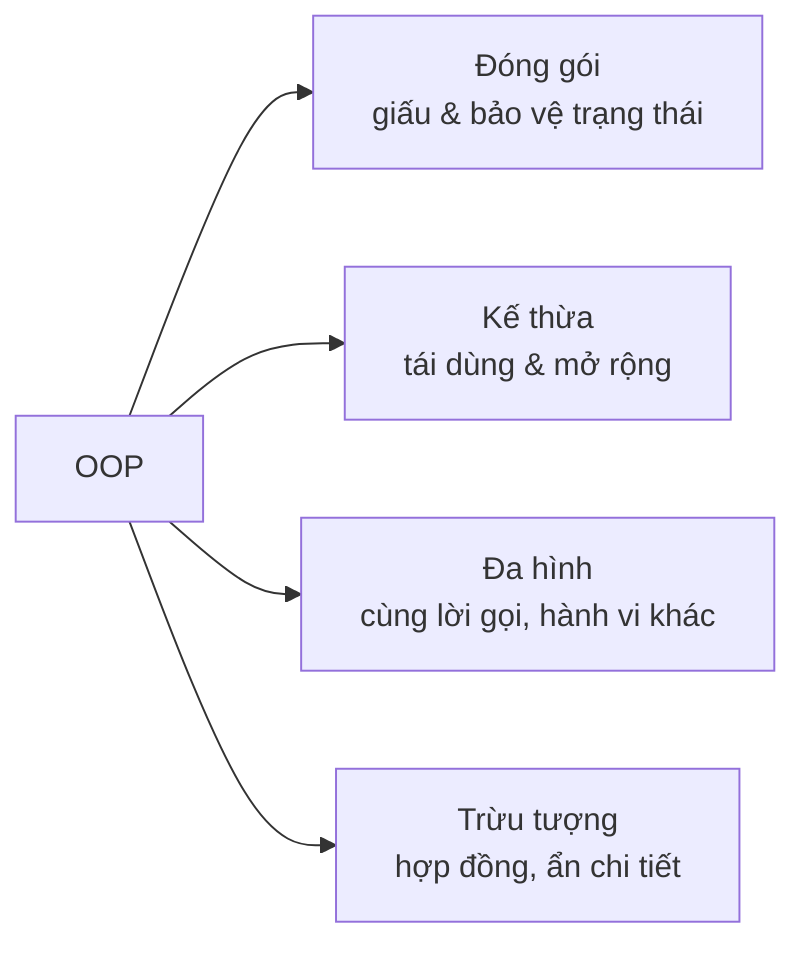

# Lập trình hướng đối tượng (OOP)

!!! info "Bạn đang ở đây · P1 → node `p1-oop`"
    **Cần trước:** cú pháp C# nền tảng (biến, kiểu, hàm, điều kiện, vòng lặp, exceptions cơ bản).
    **Mở khoá:** Generics, Collections & LINQ, và toàn bộ thiết kế tầng dịch vụ ở P3 (DI dựa hoàn toàn trên tư duy OOP + interface).
    ⏱️ Fast path ~75 phút · Deep dive +65 phút.

    **Giả định:** bạn CHƯA biết `class`, `interface`, `virtual` là gì. Mọi từ khoá mới trong bài đều được giải thích từ số 0 — định nghĩa bằng lời, cú pháp tối thiểu chạy được, rồi mới nâng cao.

> **Mục tiêu (đo được):** Sau chương này bạn (1) **tự viết** được class/interface từ cú pháp trống, không cần tra thêm nguồn ngoài; (2) **tự thiết kế** một hệ phân cấp áp dụng đóng gói; (3) **dự đoán chính xác** phương thức nào chạy trong code có `virtual`/`override`/`new`; (4) **giải thích** interface là gì và tự viết được cả cài đặt bội, explicit implementation, default method; (5) **chọn đúng** giữa `abstract class`, `interface` và composition; (6) **viết lại** code vi phạm SOLID thành code tuân thủ, cho cả 5 nguyên tắc.

---

## 0. Đoán nhanh trước khi học (30 giây)

Đọc và **tự đoán output** trước khi mở đáp án — đoán sai lúc này giúp bạn nhớ lâu hơn nhiều. Chưa hiểu `class`/`virtual`/`override` cũng không sao — cứ đoán theo trực giác, mục 2-5 sẽ giải thích lại từ đầu.

```csharp title="Đoán output"
// test:run
Base x = new Child();   // biến kiểu Base, đối tượng thật là Child
Console.WriteLine(x.Speak());

class Base { public virtual string Speak() => "Base"; }
class Child : Base { public override string Speak() => "Child"; }
```

??? note "Đáp án — mở SAU khi đã đoán"
    In ra **`Child`**. Dù biến khai báo kiểu `Base`, đối tượng thật là `Child`, và vì `Speak()` là `virtual`+`override`, C# chọn phiên bản theo **kiểu thực tế lúc chạy** — đó là **đa hình runtime**. Nếu `Child` dùng `new` thay vì `override` thì kết quả sẽ là `Base`. Mục 5 sẽ dạy lại `virtual`/`override` từ cú pháp tối thiểu và chứng minh sự khác biệt này bằng code chạy được.

---

## 1. Vì sao cần OOP?

Hãy nhìn một chương trình quản lý tài khoản viết kiểu **thủ tục** (procedural) — dữ liệu và hàm rời rạc, không có gì "gói" chúng lại với nhau:

```csharp title="Cách thủ tục — dễ hỏng"
// test:run
// Trạng thái trần trụi, ai cũng sửa được, không có ai canh giữ tính hợp lệ
decimal balance = 100m;
balance = balance - 1000m;          // rút quá số dư mà KHÔNG ai chặn
Console.WriteLine(balance);          // -900  → dữ liệu đã sai, phát hiện quá muộn
```

Vấn đề: `balance` là biến trần, **bất kỳ dòng code nào cũng gán bậy được**. Không có "người gác cổng" đảm bảo *số dư không bao giờ âm*. Khi chương trình lớn lên (hàng trăm chỗ đụng vào `balance`), một chỗ sai là cả hệ thống sai, và rất khó tìm.

**OOP giải quyết bằng cách gom "dữ liệu + hành vi hợp lệ trên dữ liệu đó" vào một đơn vị (gọi là object) tự bảo vệ mình.** Cùng bài toán, viết theo OOP:

```csharp title="Cách OOP — tự bảo vệ tính hợp lệ"
// test:run
var acc = new BankAccount(100m);
try
{
    acc.Withdraw(1000m);             // sẽ bị TỪ CHỐI ngay tại nguồn
}
catch (InvalidOperationException ex)
{
    Console.WriteLine($"Bị chặn: {ex.Message}");   // "Bị chặn: Số dư không đủ"
}
Console.WriteLine($"Số dư vẫn an toàn: {acc.Balance}");   // 100 — không hề bị làm sai

class BankAccount
{
    private decimal _balance;                    // không ai bên ngoài chạm tới trực tiếp
    public decimal Balance => _balance;
    public BankAccount(decimal initial) => _balance = initial;

    public void Withdraw(decimal amount)
    {
        if (amount > _balance)
            throw new InvalidOperationException("Số dư không đủ");   // gác cổng
        _balance -= amount;
    }
}
```

Chạy đoạn trên: lệnh rút bị **chặn ngay tại nơi phát sinh** (object tự từ chối), số dư giữ nguyên 100 — sai không lan ra. Đó là giá trị cốt lõi của OOP: **bất biến (invariant) của dữ liệu được một object canh giữ**, không phụ thuộc kỷ luật của người gọi.

OOP xoay quanh **bốn trụ**. Ta sẽ học sâu từng trụ, mỗi khái niệm mới đều bắt đầu từ cú pháp tối thiểu trước khi vào ví dụ đầy đủ:



---

## 2. Class & Object — nền tảng

- **Class** là *bản thiết kế* (khuôn): định nghĩa một object *có gì* (gọi là **field**/**property** — biến gắn liền với object) và *làm được gì* (gọi là **method** — hàm gắn liền với object).
- **Object** là *thực thể cụ thể* tạo từ class bằng từ khoá `new`. Từ một class tạo được **vô số object độc lập**, mỗi cái giữ **trạng thái riêng**.
- **Constructor** là một method đặc biệt (trùng tên với class, không có kiểu trả về) chạy đúng một lần khi `new` — nơi khởi tạo trạng thái ban đầu. Nếu bạn không tự viết constructor, C# tự sinh một constructor rỗng không tham số (như ví dụ `Counter` dưới đây).

```csharp title="Mỗi object có trạng thái riêng"
// test:run
var a = new Counter();
var b = new Counter();
a.Increment(); a.Increment();     // chỉ a tăng
b.Increment();                    // chỉ b tăng
Console.WriteLine($"a = {a.Value}, b = {b.Value}");   // a = 2, b = 1

class Counter                                 // 'class' + tên = khai báo một class mới
{
    private int _value;                       // FIELD: biến gắn liền với mỗi object
    public int Value => _value;               // PROPERTY chỉ-đọc (xem mục 3.3)
    public void Increment() => _value++;      // METHOD: hành vi gắn liền với object
}
```

**Kết quả:** `a = 2, b = 1`. Hai object `a` và `b` hoàn toàn độc lập — sửa cái này không ảnh hưởng cái kia, vì mỗi object có **bản sao riêng** của field `_value`. `Counter` không tự viết constructor nên C# ngầm sinh một constructor rỗng (`public Counter() {}`) — đó là lý do `new Counter()` không cần tham số.

---

## 3. Trụ 1 — Đóng gói (Encapsulation)

**Ý tưởng:** giấu trạng thái nội bộ, chỉ cho bên ngoài tương tác qua "cửa" được kiểm soát. Nhờ đó object **luôn ở trạng thái hợp lệ**.

### 3.1 Ví dụ tối thiểu: `private` vs `public`

```csharp title="private vs public — ví dụ tối thiểu"
// test:run
var box = new Box();
box.Label = "Sách";                 // public: đọc/ghi được từ bên ngoài
Console.WriteLine(box.Label);
Console.WriteLine(box.Describe());  // gọi METHOD public; method này đọc field PRIVATE bên trong

class Box
{
    public string Label = "";           // PUBLIC field: mọi nơi đọc/ghi được
    private int _secretCode = 42;       // PRIVATE field: CHỈ code bên trong Box thấy được

    public string Describe() => $"{Label} (mã nội bộ: {_secretCode})";
}
```

**Kết quả:** `Sách` rồi `Sách (mã nội bộ: 42)`.

`private` nghĩa là **chỉ code bên trong chính class đó** mới nhìn thấy và dùng được thành viên này — đây là gác cổng ở **mức ngôn ngữ** (trình biên dịch chặn), không phải một quy ước lỏng lẻo. Nếu bạn viết `box._secretCode` ở ngoài class `Box` (kể cả ngay trong `Main`), trình biên dịch báo lỗi `CS0122` ngay lập tức, không cho chạy. `public` thì ngược lại — không giới hạn gì.

### 3.2 Access modifier đầy đủ

Ngoài `private`/`public`, C# có thêm 4 mức nữa để kiểm soát tinh hơn. Access modifier quyết định **từ đâu** một type hoặc thành viên (field/property/method) được nhìn thấy và dùng. Tổng cộng **6 access modifier** cho thành viên, cộng type modifier `file`:

| Modifier | Truy cập được từ | Ghi chú |
|---|---|---|
| `private` | **chỉ trong chính type chứa nó** | Mặc định cho thành viên của class/struct |
| `public` | **mọi nơi**, mọi assembly | Không giới hạn |
| `protected` | type chứa nó **+ mọi lớp con** (kể cả assembly khác) | Cho kế thừa — xem mục 4 |
| `internal` | **mọi nơi trong cùng assembly** (project biên dịch ra 1 dll) | Mặc định cho type cấp cao nhất |
| `protected internal` | cùng assembly **HOẶC** lớp con (dù ở assembly khác) — phép **HỢP** (rộng hơn) | |
| `private protected` | lớp con **VÀ** phải cùng assembly — phép **GIAO** (hẹp hơn) | Có từ C# 7.2 |

Ngoài ra `file` (C# 11) là **type modifier**: type khai báo `file class X` chỉ thấy được **trong đúng file .cs đó** — dùng cho source generator, tránh đụng tên.

**Ma trận truy cập** (✓ = thấy được) — đọc kỹ hai dòng `protected internal` và `private protected`, đây là chỗ hầu hết mọi người nhầm:

| Modifier | Trong cùng type | Lớp con · cùng assembly | Lớp con · khác assembly | Không-phải-con · cùng assembly | Mọi nơi khác |
|---|:---:|:---:|:---:|:---:|:---:|
| `private` | ✓ | ✗ | ✗ | ✗ | ✗ |
| `private protected` | ✓ | ✓ | ✗ | ✗ | ✗ |
| `protected` | ✓ | ✓ | ✓ | ✗ | ✗ |
| `internal` | ✓ | ✓ | ✗ | ✓ | ✗ |
| `protected internal` | ✓ | ✓ | ✓ | ✓ | ✗ |
| `public` | ✓ | ✓ | ✓ | ✓ | ✓ |

Mẹo nhớ: `protected internal` = "protected **hoặc** internal" (cộng hai vùng lại → rộng). `private protected` = "protected **và** internal" (giao hai vùng → hẹp: vừa phải là con, vừa phải cùng assembly).

**Giá trị mặc định** (khi bạn KHÔNG viết modifier) — phải nhớ vì rất hay dính:

| Ngữ cảnh | Mặc định |
|---|---|
| Type cấp cao nhất (class/struct/... trong namespace) | `internal` (KHÔNG phải public!) |
| Thành viên của `class` / `struct` | `private` |
| Type lồng trong class (nested type) | `private` |
| Thành viên của `interface` | `public` |
| Thành viên của `enum` | `public` |

Đây là ví dụ chạy được minh hoạ `protected` (lớp con thấy, người ngoài không), kế tiếp ví dụ `Box`/`Secret` ở mục 3.1:

```csharp title="Access modifier — protected chỉ lớp con thấy"
// test:run
var acc = new Account();
acc.Deposit(100m);                 // public: gọi được
Console.WriteLine(acc.Balance);    // public get: đọc được -> 100
var vip = new VipAccount();
Console.WriteLine(vip.Report());   // lớp con đọc _balance (protected) OK -> "Số dư: 0"

class Account
{
    protected decimal _balance;                 // lớp con thấy, ngoài không
    private int _txCount;                        // CHỈ Account thấy
    public decimal Balance => _balance;          // cửa công khai chỉ-đọc
    public void Deposit(decimal amount) { _balance += amount; _txCount++; }
}
class VipAccount : Account     // ':' = kế thừa, sẽ dạy đầy đủ ở mục 4
{
    public string Report() => $"Số dư: {_balance}";   // OK: _balance là protected
    // Không thể đọc _txCount ở đây: nó private của Account -> sẽ là lỗi CS0122
}
```

**Kết quả:** `100` rồi `Số dư: 0`. Lớp con `VipAccount` đọc được `_balance` (protected) nhưng KHÔNG đọc được `_txCount` (private của cha).

Còn đây là các trường hợp **không biên dịch được** — biết để tránh (đánh dấu bỏ chạy vì cố tình sai):

```csharp title="Những lỗi truy cập điển hình"
// test:skip minh hoạ LỖI BIÊN DỊCH cố ý (không build)
var a = new Account();
a._balance = 999m;   // ❌ CS0122: '_balance' is inaccessible (protected, gọi từ ngoài)
a.Deposit(-5m);      // biên dịch OK nhưng logic nên tự chặn (xem phần validate)

// ❌ CS0051: lộ type kém-truy-cập qua thành viên public:
internal class Secret { }
public class Service
{
    public Secret Get() => new();   // 'Service.Get()' public nhưng trả về Secret (internal)
}
```

!!! danger "Bẫy: 'nhất quán truy cập' (accessibility consistency)"
    Một thành viên **không được lộ ra rộng hơn** những type xuất hiện trong chữ ký của nó. `public` method trả về/nhận một type `internal` → lỗi **CS0051**. Tương tự, một property `public` không thể có kiểu là class `private`. Quy tắc: type dùng trong API công khai cũng phải công khai tương xứng.

**Nguyên tắc thực chiến:**

- **Mặc định chọn mức HẸP nhất**, chỉ nới khi thật cần. Field → `private`; lộ ra qua property.
- `internal` cho thứ chỉ dùng nội bộ project (không muốn thành API công khai của thư viện).
- `protected` khi thiết kế cho kế thừa; `private protected` khi muốn "chỉ lớp con của TÔI trong assembly này".
- Test cần thấy `internal`? Dùng thuộc tính assembly `[assembly: InternalsVisibleTo("MyProject.Tests")]` thay vì đổi thành `public`.

Nguyên tắc vàng bao trùm: **để mức truy cập THẤP nhất có thể** — mỗi mức public là một lời hứa bạn phải giữ mãi về sau.

### 3.3 Property — từ field trần tới cửa có kiểm soát

Field `public` (như `Label` ở mục 3.1) cho phép gán **bất kỳ giá trị nào**, kể cả giá trị vô nghĩa — không có ai canh giữ. **Property** giải quyết việc này. Cú pháp tối thiểu nhất — **auto-property**:

```csharp title="Auto-property — cú pháp tối thiểu"
// test:run
var dog = new Dog();
dog.Name = "Rex";            // gọi 'set' ẩn bên trong property
Console.WriteLine(dog.Name); // gọi 'get' ẩn bên trong property

class Dog
{
    public string Name { get; set; } = "";   // auto-property
}
```

`{ get; set; }` trông giống field nhưng **thực chất là một cặp method ẩn**: `get` chạy khi đọc (`dog.Name`), `set` chạy khi gán (`dog.Name = "Rex"`). Với auto-property, bạn không tự viết field — C# tự sinh một field ẩn phía sau để lưu giá trị, và tự sinh `get`/`set` đơn giản nhất (đọc/ghi thẳng field ẩn đó, không kiểm tra gì).

Sức mạnh thật sự xuất hiện khi bạn **tinh chỉnh** `get`/`set` để kiểm soát việc đọc/ghi:

```csharp title="Các dạng property nâng cao"
// test:run
var p = new Person("An", 2000);
Console.WriteLine($"{p.Name}, {p.Age} tuổi, {(p.IsAdult ? "đủ" : "chưa đủ")} 18");
p.Rename("Bình");
try { p.Rename(""); } catch (ArgumentException e) { Console.WriteLine(e.Message); }
Console.WriteLine(p.Name);

class Person
{
    public string Name { get; private set; }   // đọc công khai, chỉ sửa nội bộ
    public int BirthYear { get; init; }         // chỉ gán lúc khởi tạo (init)
    public int Age => 2026 - BirthYear;         // property TÍNH TOÁN, không lưu trữ
    public bool IsAdult => Age >= 18;

    public Person(string name, int birthYear)
    {
        if (string.IsNullOrWhiteSpace(name)) throw new ArgumentException("Tên bắt buộc");
        Name = name;
        BirthYear = birthYear;
    }

    public void Rename(string newName)          // muốn đổi tên phải qua method có validate
    {
        if (string.IsNullOrWhiteSpace(newName)) throw new ArgumentException("Tên không được rỗng");
        Name = newName;
    }
}
```

Điểm cần thấm — bốn biến thể property khác `{ get; set; }` trần:

- `get; private set;` → bên ngoài **đọc** được nhưng chỉ nội bộ (trong chính class) **ghi** được.
- `get; init;` → chỉ gán lúc `new` (hoặc `with` với record), sau đó **bất biến**, không set được nữa dù từ bên trong.
- `Age`/`IsAdult` (dạng `=>` không có `get;`/`set;`) là property **tính toán** — không có field ẩn lưu trữ, mỗi lần đọc tính lại từ `BirthYear`, luôn nhất quán.
- Không có `set` công khai cho `Name` ⇒ mọi thay đổi phải đi qua `Rename()` — nơi ta **validate**. Đây là "gác cổng" đúng nghĩa: property kiểm soát *ai* ghi được, method `Rename` kiểm soát *ghi gì thì hợp lệ*.

!!! tip "Vì sao không để `public string Name;` (field trần) cho nhanh?"
    Vì field public là "cửa mở toang" (như `Label` ở mục 3.1): ai đó gán `p.Name = ""` là object rơi vào trạng thái vô nghĩa mà không ai biết, không ai chặn được. Property + validate biến class thành nơi *duy nhất* chịu trách nhiệm về tính hợp lệ của chính nó.

---

## 4. Trụ 2 — Kế thừa (Inheritance)

**Ý tưởng:** lớp con (derived) **tái dùng** và **mở rộng** lớp cha (base), thay vì chép lại code. Quan hệ đúng để dùng kế thừa là **"là một loại" (is-a)**: `Manager` *là một* `Employee`.

### 4.1 Cú pháp tối thiểu

```csharp title="Kế thừa — cú pháp tối thiểu"
// test:run
var dog = new Dog();
dog.Eat();                   // Dog KHÔNG tự định nghĩa Eat() — nó THỪA HƯỞNG từ Animal
Console.WriteLine(dog.Name); // thừa hưởng luôn cả property Name

class Animal
{
    public string Name { get; set; } = "Vật nuôi";
    public void Eat() => Console.WriteLine($"{Name} đang ăn");
}

class Dog : Animal     // 'class Dog : Animal' = Dog KẾ THỪA Animal
{
    // để trống — Dog vẫn có đủ Name và Eat() từ Animal, không cần viết lại
}
```

**Kết quả:** `Vật nuôi đang ăn` rồi `Vật nuôi`.

Dấu `:` ở đây có ý nghĩa **kế thừa** (khác dấu `:` sau constructor mà bạn sẽ thấy ngay dưới đây — đó là gọi constructor cha). Chỉ với `class Dog : Animal`, `Dog` đã có toàn bộ property/method `public`/`protected` của `Animal` — không cần viết lại một dòng nào. Đây là ý nghĩa cốt lõi của "tái dùng".

### 4.2 Constructor cha & mở rộng hành vi

Thực tế lớp con thường cần **constructor riêng** (nhận thêm dữ liệu) và **ghi đè hành vi cha** thay vì chỉ dùng nguyên xi. Đây là ví dụ đầy đủ:

```csharp title="Kế thừa + gọi constructor cha + protected"
// test:run
var m = new Manager("An", 20_000_000m, teamSize: 5);
Console.WriteLine(m.Describe());

class Employee
{
    public string Name { get; }
    protected decimal Salary { get; }          // lớp con thấy, bên ngoài không
    public Employee(string name, decimal salary) { Name = name; Salary = salary; }
    public virtual string Describe() => $"{Name} — lương {Salary:N0}";
}

class Manager : Employee
{
    private readonly int _teamSize;
    // ': base(...)' gọi constructor cha TRƯỚC, truyền dữ liệu lên
    public Manager(string name, decimal salary, int teamSize) : base(name, salary)
        => _teamSize = teamSize;

    // mở rộng hành vi cha bằng cách GỌI LẠI base rồi thêm phần của mình
    public override string Describe() => base.Describe() + $", quản lý {_teamSize} người";
}
```

**Kết quả:** `An — lương 20,000,000, quản lý 5 người`.

Điểm cần thấm:

- `: base(name, salary)` — constructor con **bắt buộc** khởi tạo phần của cha trước khi làm việc riêng của mình.
- `protected` — `Salary` chia sẻ cho lớp con nhưng vẫn ẩn với thế giới bên ngoài (như đã học ở mục 3.2).
- `base.Describe()` — con **tái dùng** logic cha rồi bổ sung, không chép lại. Từ khoá `virtual`/`override` sẽ được dạy đầy đủ ở mục 5 (Đa hình) — ở đây bạn chỉ cần biết `override` cho phép con "viết lại" một method cha đã đánh dấu `virtual`.
- Mọi class ngầm kế thừa `object` (gốc của mọi kiểu trong .NET), nên object nào cũng có sẵn `ToString()`, `Equals()`, `GetHashCode()` dù không tự viết.

!!! danger "Kế thừa bị lạm dụng nhiều nhất"
    Đừng kế thừa chỉ để "dùng ké code". Chỉ kế thừa khi thực sự là quan hệ **is-a** và lớp con có thể **thay thế** lớp cha ở mọi nơi (xem nguyên tắc LSP ở mục 8). Nếu chỉ cần "dùng chức năng của cái khác", hãy dùng **composition** (mục 7) — linh hoạt hơn nhiều.

---

## 5. Trụ 3 — Đa hình (Polymorphism)

**Ý tưởng:** cùng một lời gọi (`shape.Area()`), nhưng **hành vi khác nhau tuỳ kiểu thực tế** của object. Đây là thứ khiến code mở rộng được mà không phải sửa chỗ cũ.

### 5.1 `abstract` — cú pháp tối thiểu

Trước ví dụ đầy đủ, một từ khoá mới: `abstract`. Một **`abstract class`** là lớp **không được tạo object trực tiếp** — nó chỉ tồn tại để làm lớp cha. Một **`abstract method`** là method **chưa có phần thân**, giống một "hợp đồng" bắt lớp con phải tự viết (`override`).

```csharp title="abstract — cú pháp tối thiểu, minh hoạ 2 lỗi biên dịch cố ý"
// test:skip minh hoạ 2 lỗi biên dịch cố ý — đọc chú thích, không build
abstract class Shape
{
    public abstract double Area();   // KHÔNG có { } — chỉ khai báo, con PHẢI tự viết
}

// var s = new Shape();  // ❌ CS0144: Cannot create an instance of the abstract type 'Shape'

class BrokenSquare : Shape
{
    // KHÔNG viết Area() ở đây
    // ❌ CS0534: 'BrokenSquare' does not implement inherited abstract member 'Shape.Area()'
}
```

Hai quy tắc rút ra: (1) `new Shape()` — tạo trực tiếp object của abstract class — luôn là lỗi biên dịch; (2) lớp con kế thừa abstract class **bắt buộc** phải `override` mọi abstract method của cha, nếu không cũng là lỗi biên dịch.

### 5.2 Đa hình qua `abstract` + `override`

```csharp title="Đa hình qua abstract + override"
// test:run
Shape[] shapes = [new Circle(2), new Rectangle(3, 4), new Circle(1)];
double tong = 0;
foreach (var s in shapes)          // cùng vòng lặp, cùng lời gọi s.Area()
{
    Console.WriteLine($"{s.Name}: {s.Area():F2}");
    tong += s.Area();
}
Console.WriteLine($"Tổng diện tích: {tong:F2}");

abstract class Shape
{
    public abstract string Name { get; }        // hợp đồng: lớp con PHẢI cài
    public abstract double Area();
}
class Circle(double r) : Shape                   // primary constructor (C# hiện đại)
{
    public override string Name => "Tròn";
    public override double Area() => Math.PI * r * r;
}
class Rectangle(double w, double h) : Shape
{
    public override string Name => "Chữ nhật";
    public override double Area() => w * h;
}
```

**Kết quả:** `Tròn: 12.57` · `Chữ nhật: 12.00` · `Tròn: 3.14` · `Tổng diện tích: 27.71`.

Sức mạnh: muốn thêm `Triangle`, bạn **viết một class mới**, vòng lặp trên **không phải sửa một dòng**. Đó là "mở để mở rộng, đóng để sửa đổi" — nguyên tắc **Open/Closed**, xem mục 8.

### 5.3 `override` vs `new` — điểm SAI kinh điển, phải chứng minh

Nhiều người tưởng `new` và `override` "chạy như nhau" khi cả hai đều "viết lại" một method cha. **Không.** Chạy đoạn dưới để thấy tận mắt:

```csharp title="Bằng chứng: override giữ đa hình, new phá đa hình"
// test:run
Base a = new OverrideChild();   // đối tượng thật là OverrideChild
Base b = new NewChild();        // đối tượng thật là NewChild
Console.WriteLine($"override, gọi qua biến CHA: {a.Who()}");   // -> Child (đúng đa hình)
Console.WriteLine($"new,      gọi qua biến CHA: {b.Who()}");   // -> Base  (MẤT đa hình!)
Console.WriteLine($"new,      gọi qua biến CON: {new NewChild().Who()}");  // -> Child

class Base { public virtual string Who() => "Base"; }
class OverrideChild : Base { public override string Who() => "Child"; }
class NewChild : Base { public new string Who() => "Child"; }   // 'new' = che, không override
```

**Kết quả:**
```text title="Output"
override, gọi qua biến CHA: Child
new,      gọi qua biến CHA: Base
new,      gọi qua biến CON: Child
```

Giải thích: với `new`, C# chọn phương thức theo **kiểu KHAI BÁO của biến** lúc biên dịch (`Base b` → gọi `Base.Who`). Với `override`, C# chọn theo **kiểu THỰC TẾ của object** lúc chạy (luôn là `Child`). Trong code thực tế bạn hầu như luôn giữ object qua biến kiểu cha (ví dụ `Shape[]`, `List<Employee>`), nên `new` sẽ âm thầm gọi nhầm phiên bản cha → **bug rất khó tìm**.

**Quy tắc:** muốn đa hình thì luôn cặp `virtual` (ở cha) + `override` (ở con). Trình biên dịch chỉ **cảnh báo** khi bạn lỡ che bằng `new`, **không chặn** — nên phải tự cảnh giác.

---

## 6. Trụ 4 — Trừu tượng: `interface`

### 6.1 Interface là gì?

`interface` là một **hợp đồng thuần tuý**: nó liệt kê những method/property mà một class **cam kết sẽ có**, nhưng **không tự viết cách làm** (không có phần thân `{ }`, không có field lưu trữ dữ liệu). Nó trả lời câu hỏi *"class này có thể làm gì"*, không quan tâm *"làm bằng cách nào"* — phần "làm bằng cách nào" là việc của class thực thi nó.

### 6.2 Khai báo & cài đặt tối thiểu

```csharp title="interface — cú pháp tối thiểu"
// test:run
IGreeter g = new VietnameseGreeter();   // biến khai báo KIỂU INTERFACE
Console.WriteLine(g.Greet());

interface IGreeter                // 'interface' + tên (quy ước bắt đầu bằng chữ 'I')
{
    string Greet();                // chỉ khai báo chữ ký, KHÔNG có { } — không viết phần thân
}

class VietnameseGreeter : IGreeter     // ':' để THỰC THI (implement) interface
{
    public string Greet() => "Xin chào";   // PHẢI đúng chữ ký, PHẢI khai báo public
}
```

**Kết quả:** `Xin chào`.

Đọc kỹ từng phần:

- `interface IGreeter { string Greet(); }` — khai báo một hợp đồng có đúng một yêu cầu: "phải có method `Greet()` trả về `string`". Dấu `;` thay cho `{ }` — interface **không** viết logic.
- `class VietnameseGreeter : IGreeter` — dùng **đúng cú pháp dấu hai chấm** như kế thừa ở mục 4, nhưng ý nghĩa khác: đây là **thực thi** (implement) một hợp đồng, không phải **kế thừa** (inherit) code có sẵn.
- `public string Greet() => "Xin chào";` — lớp phải viết member này, phải khai báo `public`, và chữ ký (tên, tham số, kiểu trả về) phải khớp **chính xác** với interface.
- `IGreeter g = new VietnameseGreeter();` — biến có thể khai báo bằng **kiểu interface** thay vì kiểu class cụ thể. Đây chính là lý do interface tồn tại — xem mục 6.4.

### 6.3 Nếu implement thiếu thì sao?

```csharp title="Implement thiếu — LỖI BIÊN DỊCH"
// test:skip minh hoạ lỗi biên dịch cố ý CS0535 — đọc chú thích, không build
interface IGreeter
{
    string Greet();
}
class BrokenGreeter : IGreeter
{
    // KHÔNG viết Greet() ở đây
}
// ❌ CS0535: 'BrokenGreeter' does not implement interface member 'IGreeter.Greet()'
```

Trình biên dịch **bắt buộc** bạn giữ đúng lời hứa: khai báo `class X : IGreeter` mà thiếu bất kỳ member nào của `IGreeter` sẽ không biên dịch được. Đây chính là giá trị của "hợp đồng" — sai là biết ngay lúc build, không đợi tới lúc chạy mới vỡ.

### 6.4 Sức mạnh thật sự: lập trình theo interface

```csharp title="Hàm chỉ cần biết 'khả năng', không cần biết class cụ thể"
// test:run
IGreeter[] greeters = [new VietnameseGreeter(), new EnglishGreeter()];
foreach (var g in greeters)
    Console.WriteLine(g.Greet());   // KHÔNG quan tâm g là lớp gì, chỉ cần nó CÓ Greet()

interface IGreeter { string Greet(); }
class VietnameseGreeter : IGreeter { public string Greet() => "Xin chào"; }
class EnglishGreeter    : IGreeter { public string Greet() => "Hello"; }
```

**Kết quả:** `Xin chào` rồi `Hello`.

Mảng `IGreeter[]` chứa được **nhiều class khác nhau**, miễn là chúng cùng thực thi `IGreeter`. Vòng lặp gọi `g.Greet()` không cần biết (và không quan tâm) object thật là `VietnameseGreeter` hay `EnglishGreeter` — đây **là đa hình**, giống hệt tinh thần mục 5, nhưng đạt được qua **interface** thay vì qua kế thừa class + `abstract`.

### 6.5 Một class thực thi NHIỀU interface

Không như kế thừa class (chỉ **một** lớp cha), một class thực thi được **bao nhiêu interface cũng được** — chỉ cần liệt kê cách nhau bởi dấu phẩy:

```csharp title="Một lớp thực thi NHIỀU interface (khả năng)"
// test:run
var report = new Report("Doanh thu Q1");
Save(report);
Print(report);

// Hàm chỉ phụ thuộc vào KHẢ NĂNG nó cần, không cần biết lớp cụ thể:
static void Save(ISaveable s)   => Console.WriteLine($"Đã lưu -> {s.FileName()}");
static void Print(IPrintable p) => Console.WriteLine($"In:\n{p.PrintForm()}");

interface ISaveable  { string FileName(); }
interface IPrintable { string PrintForm(); }

class Report(string title) : ISaveable, IPrintable   // vừa lưu được, vừa in được
{
    public string FileName()  => $"{title}.pdf";
    public string PrintForm() => $"=== {title} ===";
}
```

**Kết quả:** `Đã lưu -> Doanh thu Q1.pdf` rồi `In:` + `=== Doanh thu Q1 ===`.

`Save` nhận `ISaveable`, `Print` nhận `IPrintable`. Chúng **không quan tâm** đối tượng là `Report` hay gì khác — chỉ cần nó *có khả năng* tương ứng. Đây là chìa khoá của code lỏng-ghép (loosely coupled), và là nền tảng của **Dependency Injection** ở P3.

### 6.6 Explicit interface implementation (khi 2 interface trùng tên member)

```csharp title="Explicit implementation — giải quyết trùng tên"
// test:run
ICounterA a = new Multi();
ICounterB b = new Multi();
Console.WriteLine(a.Reset());   // "Reset kiểu A"
Console.WriteLine(b.Reset());   // "Reset kiểu B" — CÙNG tên Reset() nhưng khác cài đặt

interface ICounterA { string Reset(); }
interface ICounterB { string Reset(); }   // trùng chữ ký Reset() với ICounterA

class Multi : ICounterA, ICounterB
{
    // Cú pháp 'TênInterface.TênMethod' — chỉ gọi được qua BIẾN KIỂU INTERFACE đó
    string ICounterA.Reset() => "Reset kiểu A";
    string ICounterB.Reset() => "Reset kiểu B";
}
```

Khi hai interface **cùng khai báo** một method trùng tên/chữ ký, bạn cài đặt **riêng** cho từng interface bằng cú pháp `TênInterface.TênMethod`. Cách cài này **chỉ gọi được** qua biến khai báo đúng kiểu interface đó (`a.Reset()` khi `a` là `ICounterA`) — gọi qua biến kiểu `Multi` trực tiếp sẽ **không thấy** các method này (chúng bị "ẩn", chỉ lộ ra qua đúng interface tương ứng).

### 6.7 Default interface method (C# 8+)

```csharp title="Default method — interface có sẵn cài đặt"
// test:run
ILogger logger = new ConsoleLogger();
logger.LogInfo("Bắt đầu");   // dùng NGUYÊN cài đặt mặc định trong interface

interface ILogger
{
    void Log(string level, string message);

    // Default method: CÓ SẴN phần thân trong interface (C# 8+)
    void LogInfo(string message) => Log("INFO", message);
}
class ConsoleLogger : ILogger
{
    public void Log(string level, string message) => Console.WriteLine($"[{level}] {message}");
    // KHÔNG cần viết LogInfo — tự dùng bản mặc định từ interface
}
```

**Kết quả:** `[INFO] Bắt đầu`.

Từ **C# 8**, interface được phép viết sẵn phần thân cho một method (`=> Log(...)`). Lớp thực thi có thể dùng nguyên bản mặc định, hoặc tự override nếu cần khác đi. Công dụng chính: **thêm method mới vào một interface đã có nhiều lớp thực thi** mà không bắt tất cả các lớp cũ phải sửa code — mọi lớp cũ tự động có sẵn bản mặc định.

### 6.8 So sánh: `interface` vs `abstract class`

Giờ cả hai đã được dạy đầy đủ, đây là lúc so sánh để **chọn đúng công cụ**:

| Tiêu chí | `interface` | `abstract class` |
|---|---|---|
| Ý nghĩa | "có khả năng…" (can-do) | "là một loại…" (is-a) |
| Trạng thái (field) | Không | Có |
| Cài đặt sẵn | Chỉ default member (mục 6.7, hạn chế) | Có (chia sẻ code cho lớp con, mục 5) |
| Một lớp dùng được | **nhiều** interface (mục 6.5) | **một** lớp cha |
| Dùng khi | nhiều lớp không liên quan cùng có 1 khả năng | các lớp cùng "họ" chia sẻ trạng thái + code |

**Chọn cái nào?**

- Cần chia sẻ **trạng thái + code chung** giữa các lớp cùng họ → `abstract class` (ví dụ `Shape` ở mục 5 giữ logic chung).
- Chỉ cần khai báo **một khả năng** mà nhiều lớp khác họ đều có → `interface` (ví dụ `ISaveable` ở mục 6.5).
- Phân vân? → **ưu tiên `interface`**: nó linh hoạt hơn (một lớp thực thi được nhiều), dễ test hơn, và không "khoá" bạn vào một cây kế thừa.

---

## 7. Composition over Inheritance

Kế thừa sâu nhiều tầng dễ vỡ (đổi lớp cha là hỏng hàng loạt lớp con — gọi là "fragile base class"). Thường **composition** ("chứa" một object khác làm field, thay vì kế thừa nó) linh hoạt hơn: quan hệ **has-a** ("có một") thay vì **is-a** ("là một").

```csharp title="Composition: Car HAS-A Engine (thay được lúc chạy)"
// test:run
Drive(new Car(new PetrolEngine()));    // xe xăng
Drive(new Car(new ElectricEngine()));  // đổi động cơ mà KHÔNG sửa class Car

static void Drive(Car c) => Console.WriteLine(c.Start());

interface IEngine { string Start(); }
class PetrolEngine   : IEngine { public string Start() => "Nổ máy xăng"; }
class ElectricEngine : IEngine { public string Start() => "Khởi động điện êm ru"; }

class Car(IEngine engine)              // Car CHỨA một IEngine (field), KHÔNG kế thừa nó
{
    public string Start() => "Xe: " + engine.Start();
}
```

**Kết quả:** `Xe: Nổ máy xăng` rồi `Xe: Khởi động điện êm ru`.

`Car` không phải `PetrolEngine`/`ElectricEngine` (không phải quan hệ is-a), nó chỉ **giữ một tham chiếu** tới `IEngine` (quan hệ has-a) và gọi qua đó. Đổi hành vi bằng cách **truyền object khác vào constructor**, không đụng tới class `Car`. Quy tắc thực chiến: *"Ưu tiên composition; chỉ kế thừa khi thật sự là-một-loại và cần đa hình."*

---

## 8. SOLID — 5 nguyên tắc thiết kế

SOLID là 5 nguyên tắc giúp code OOP dễ mở rộng, dễ test, dễ bảo trì. Mỗi nguyên tắc dưới đây có một ví dụ **vi phạm** và một ví dụ **sửa đúng**.

### S — Single Responsibility (một lý do để thay đổi)

**Định nghĩa:** một class chỉ nên có **một lý do để thay đổi**.

```csharp title="VI PHẠM SRP — Invoice ôm 2 việc"
// test:skip minh hoạ vi phạm, không cần chạy
class Invoice
{
    public decimal Total { get; set; }
    public string Print() => $"Hoá đơn: {Total:N0}đ";       // việc 1: định dạng hiển thị
    public void SendEmail(string to) { /* gọi SMTP... */ }   // việc 2: gửi email — LÝ DO KHÁC để đổi
}
```

`Invoice` vừa lo hiển thị vừa lo gửi mail. Đổi cách gửi mail (SMTP → SendGrid) buộc phải sửa **chính class hoá đơn**, dù logic tính tiền không hề đổi — hai lý do thay đổi bị trộn vào một class.

```csharp title="SỬA SRP — tách trách nhiệm"
// test:run
var inv = new Invoice(150_000m);
Console.WriteLine(inv.Print());
new EmailSender().Send("a@b.com", inv.Print());

class Invoice(decimal total)
{
    public string Print() => $"Hoá đơn: {total:N0}đ";   // CHỈ lo hiển thị
}
class EmailSender
{
    public void Send(string to, string body) => Console.WriteLine($"Đã gửi tới {to}: {body}");
}
```

**Kết quả:** `Hoá đơn: 150,000đ` rồi `Đã gửi tới a@b.com: Hoá đơn: 150,000đ`.

### O — Open/Closed (mở để mở rộng, đóng với sửa đổi)

**Định nghĩa:** thêm hành vi mới bằng cách **viết code mới**, không sửa code cũ đang chạy tốt.

```csharp title="VI PHẠM OCP — if/else theo loại, phải sửa mỗi khi thêm loại mới"
// test:run
Console.WriteLine(AreaOf("circle", 2));
Console.WriteLine(AreaOf("square", 3));
// Thêm hình tam giác? Phải MỞ LẠI hàm này và thêm nhánh — vi phạm "đóng với sửa đổi"
static double AreaOf(string kind, double x) => kind switch
{
    "circle" => Math.PI * x * x,
    "square" => x * x,
    _ => throw new ArgumentException("Không hỗ trợ")
};
```

Mỗi khi có hình mới, phải **mở lại** hàm `AreaOf` để thêm nhánh — càng nhiều loại, hàm càng phình, càng dễ quên một nhánh khi sửa.

**Sửa đúng:** mục 5.2 đã giải quyết chính xác vấn đề này bằng `abstract class Shape`. `Shape[] shapes = [...]; foreach (var s in shapes) s.Area();` — thêm `Triangle` chỉ cần viết **class mới**, vòng lặp tính tổng không đổi một dòng. Đó chính là Open/Closed: mở để thêm `Triangle`, đóng với việc sửa vòng lặp.

### L — Liskov Substitution (con phải thay thế được cha)

**Định nghĩa:** lớp con phải **thay thế được** lớp cha ở mọi nơi mà không phá vỡ kỳ vọng của người dùng lớp cha.

```csharp title="VI PHẠM LSP — Square phá kỳ vọng của Rectangle"
// test:run
Rectangle r = new Square();   // Square LÀ MỘT Rectangle (kế thừa) — LSP đòi hỏi thay được vô tư
r.Width = 5;
r.Height = 10;
// Kỳ vọng thông thường của Rectangle: đặt Width KHÔNG làm đổi Height
Console.WriteLine($"{r.Width}x{r.Height}");   // Square ép Height=Width -> in "10x10", KHÔNG phải "5x10"!

class Rectangle
{
    public virtual int Width { get; set; }
    public virtual int Height { get; set; }
}
class Square : Rectangle
{
    private int _side;
    public override int Width  { get => _side; set => _side = value; }
    public override int Height { get => _side; set => _side = value; }   // ép luôn bằng Width!
}
```

**Kết quả:** `10x10` — không phải `5x10` như một `Rectangle` bình thường sẽ cho. Code vẫn **biên dịch và chạy** (không ném exception), nhưng **âm thầm sai ngữ nghĩa**: bất kỳ hàm nào viết cho `Rectangle` với giả định "Width và Height độc lập" sẽ bị `Square` phá ngầm khi được truyền vào. Đây là lý do LSP quan trọng — vi phạm của nó không gây lỗi biên dịch, mà gây **bug logic khó tìm** lúc chạy.

**Sửa đúng:** đừng bắt `Square` kế thừa `Rectangle` (chúng không thật sự thay thế nhau được). Tách cả hai thực thi chung một interface trung lập, ví dụ `IShape { double Area(); }` (như mục 6), thay vì ép quan hệ is-a giả tạo.

### I — Interface Segregation (interface nhỏ, chuyên biệt)

**Định nghĩa:** đừng ép một lớp thực thi những method nó không cần — tách interface lớn thành nhiều interface nhỏ.

```csharp title="VI PHẠM ISP — interface quá to"
// test:skip minh hoạ vi phạm, không cần chạy
interface IMachine
{
    void Print();
    void Fax();
    void Scan();
}
class OldPrinter : IMachine     // máy in cũ chỉ in được, KHÔNG fax/scan được
{
    public void Print() => Console.WriteLine("in...");
    public void Fax() => throw new NotSupportedException();   // ép cài method vô nghĩa
    public void Scan() => throw new NotSupportedException();
}
```

`OldPrinter` bị ép cài `Fax()`/`Scan()` dù không hỗ trợ — phải ném exception ngay trong phần thân, một dấu hiệu rõ ràng của thiết kế sai (đây cũng là một dạng vi phạm LSP: gọi qua `IMachine` tưởng an toàn nhưng có thể ném exception bất ngờ).

```csharp title="SỬA ISP — tách interface nhỏ"
// test:run
Use(new OldPrinter());

static void Use(IPrinter p) => p.Print();   // chỉ đòi hỏi ĐÚNG khả năng cần dùng

interface IPrinter { void Print(); }
interface IFax { void Fax(); }
interface IScan { void Scan(); }

class OldPrinter : IPrinter   // chỉ cam kết đúng khả năng THẬT có
{
    public void Print() => Console.WriteLine("in...");
}
```

**Kết quả:** `in...`. `OldPrinter` giờ chỉ hứa đúng những gì nó làm được — không còn method nào phải ném exception "chưa hỗ trợ".

### D — Dependency Inversion (phụ thuộc trừu tượng)

**Định nghĩa:** phụ thuộc vào **trừu tượng** (interface), không vào **cài đặt cụ thể**.

```csharp title="DIP: dịch vụ phụ thuộc INTERFACE, không phụ thuộc lớp cụ thể"
// test:run
// Đổi cách thông báo mà KHÔNG sửa OrderService — chỉ truyền cài đặt khác vào.
new OrderService(new EmailNotifier()).Place("Sách");
new OrderService(new SmsNotifier()).Place("Cà phê");

interface INotifier { void Send(string msg); }
class EmailNotifier : INotifier { public void Send(string m) => Console.WriteLine($"[email] {m}"); }
class SmsNotifier   : INotifier { public void Send(string m) => Console.WriteLine($"[sms] {m}"); }

class OrderService(INotifier notifier)   // phụ thuộc INotifier (trừu tượng), không phụ thuộc Email cụ thể
{
    public void Place(string item)
    {
        Console.WriteLine($"Đặt hàng: {item}");
        notifier.Send($"Đơn '{item}' đã tạo");
    }
}
```

**Kết quả:** đặt hàng "Sách" báo qua email, "Cà phê" báo qua sms — cùng một `OrderService`. Vì `OrderService` phụ thuộc `INotifier` (trừu tượng) chứ không phụ thuộc `EmailNotifier` cụ thể, ta thay/giả lập (mock) thoải mái khi test. Đây chính là điều DI container ở ASP.NET Core tự động hoá — xem P3.

---

## 9. Cạm bẫy thực chiến

- **Quên `virtual` ở cha** rồi tưởng `override` chạy — trình biên dịch báo lỗi, đọc kỹ thông báo.
- **Lỡ che bằng `new`** (chỉ cảnh báo, không chặn) → mất đa hình, gọi nhầm phiên bản cha (mục 5.3).
- **Field `public`** phá đóng gói — luôn `private` + property (mục 3).
- **Kế thừa sâu 4-5 tầng** khó bảo trì — ưu tiên composition (mục 7).
- **Lớp "thượng đế"** ôm mọi việc (vi phạm SRP) — khó test, khó sửa; tách trách nhiệm.
- **Vi phạm LSP thầm lặng:** lớp con ném `NotSupportedException` cho method cha, hoặc âm thầm đổi ngữ nghĩa như `Square`/`Rectangle` (mục 8) → nơi dùng lớp cha sẽ vỡ bất ngờ.
- **Quên implement đủ interface** → lỗi `CS0535` (mục 6.3); dễ nhầm với lỗi `CS0534` của `abstract class` (mục 5.1) — cả hai đều là "thiếu cài đặt bắt buộc" nhưng khác cơ chế.
- **So sánh 2 object bằng `==`** mà quên rằng với class, `==` mặc định so **danh tính tham chiếu** (cùng object hay không), không so nội dung — muốn so nội dung thì dùng `record` hoặc override `Equals`.

---

## 10. Bài tập (làm để thành thạo)

### Bài 1 (giàn giáo) — điền chỗ trống
Thiết kế `interface IShape { double Area(); double Perimeter(); }`. Cài `Square` và `Circle`. Duyệt `IShape[]` in diện tích + chu vi.

```csharp title="Starter (tự hoàn thiện)"
// test:skip giàn giáo chưa hoàn chỉnh — người học tự điền
interface IShape { double Area(); double Perimeter(); }

class Square(double side) : IShape
{
    // TODO: Area = side*side; Perimeter = 4*side
}
// TODO: class Circle(double r) : IShape  (Area = pi*r*r; Perimeter = 2*pi*r)
```

??? success "Lời giải + giải thích"
    ```csharp title="Lời giải"
    // test:run
    IShape[] shapes = [new Square(3), new Circle(2)];
    foreach (var s in shapes)
        Console.WriteLine($"S={s.Area():F2}, P={s.Perimeter():F2}");

    interface IShape { double Area(); double Perimeter(); }
    class Square(double side) : IShape
    {
        public double Area() => side * side;
        public double Perimeter() => 4 * side;
    }
    class Circle(double r) : IShape
    {
        public double Area() => Math.PI * r * r;
        public double Perimeter() => 2 * Math.PI * r;
    }
    ```
    Cả hai lớp cam kết cùng hợp đồng `IShape`, nên vòng lặp xử lý chúng đồng nhất — thêm hình mới không phải sửa vòng lặp (OCP).

### Bài 2 (thiết kế) — không có starter
Thiết kế domain **thư viện**: `Book` (Title, có trạng thái *đang mượn/sẵn có*), `Member`. Viết `Library` với `Borrow(member, book)` và `Return(book)`. Yêu cầu: **không cho mượn sách đang được mượn** (dùng đóng gói canh giữ bất biến), và mọi thay đổi trạng thái phải qua method có validate. Tự viết vài dòng ở top-level để chứng minh mượn 2 lần cùng cuốn sẽ bị chặn.

??? success "Gợi ý lời giải"
    ```csharp title="Một cách làm"
    // test:run
    var lib = new Library();
    var b = lib.Add("Clean Code");
    lib.Borrow("An", b);
    try { lib.Borrow("Bình", b); } catch (InvalidOperationException e) { Console.WriteLine(e.Message); }
    lib.Return(b);
    lib.Borrow("Bình", b);              // giờ mượn được
    Console.WriteLine($"'{b.Title}' đang mượn bởi: {b.BorrowedBy}");

    class Book(string title)
    {
        public string Title { get; } = title;
        public string? BorrowedBy { get; private set; }     // null = sẵn có
        public bool IsAvailable => BorrowedBy is null;
        public void MarkBorrowed(string who) => BorrowedBy = who;   // chỉ Library gọi (cùng file)
        public void MarkReturned() => BorrowedBy = null;
    }
    class Library
    {
        private readonly List<Book> _books = [];
        public Book Add(string title) { var b = new Book(title); _books.Add(b); return b; }
        public void Borrow(string member, Book book)
        {
            if (!book.IsAvailable) throw new InvalidOperationException($"'{book.Title}' đang được mượn");
            book.MarkBorrowed(member);
        }
        public void Return(Book book) => book.MarkReturned();
    }
    ```
    Bất biến "một cuốn chỉ mượn được khi sẵn có" được `Library.Borrow` canh giữ; trạng thái `BorrowedBy` chỉ đổi qua method, không phơi `set` ra ngoài.

### Bài 3 (thử thách) — dùng AI như pair
Cho code sau **vi phạm SRP + DIP**: một class `ReportService` vừa tạo báo cáo, vừa tự mở file ghi đĩa, vừa gửi email. Hãy **tách** thành `ReportBuilder`, `IReportStore`, `INotifier` và ghép lại qua constructor injection. Viết test nhỏ chứng minh có thể thay `IReportStore` bằng bản giả (in ra console) mà không sửa `ReportService`. Tự chấm theo: (1) mỗi lớp một trách nhiệm; (2) `ReportService` chỉ phụ thuộc interface; (3) thay cài đặt không cần sửa `ReportService`.

---

## Tự kiểm tra (trả lời không nhìn bài)

1. Class và object khác nhau thế nào?
2. Vì sao `public` field phá đóng gói, và property sửa được điều đó ra sao?
3. `Base x = new Child()` — với `override` thì `x.Speak()` gọi bản nào? Với `new` thì bản nào? Vì sao?
4. Interface có được chứa field lưu trữ dữ liệu không? Nếu class implement interface mà thiếu một method thì chuyện gì xảy ra?
5. Default interface method (C# 8+) dùng để giải quyết vấn đề gì?
6. Khi nào chọn `interface`, khi nào `abstract class`?
7. "Composition over inheritance" nghĩa là gì, cho một ví dụ?
8. DIP nói gì và vì sao giúp code dễ test?

??? note "Đáp án"
    1. Class là bản thiết kế (định nghĩa một lần); object là thực thể cụ thể tạo bằng `new`, mỗi object có trạng thái riêng độc lập.
    2. Field `public` cho phép mọi nơi gán bậy, phá bất biến. Property + validate biến class thành nơi *duy nhất* kiểm soát tính hợp lệ (ví dụ chặn số dư âm).
    3. `override` → gọi **`Child`** (chọn theo kiểu thực tế lúc chạy = đa hình). `new` → gọi **`Base`** khi truy cập qua biến kiểu `Base` (chọn theo kiểu khai báo lúc biên dịch), nên mất đa hình.
    4. Không — interface chỉ khai báo chữ ký method/property, không có field lưu trữ. Nếu class thiếu implement một method, trình biên dịch báo lỗi `CS0535` ngay lúc build, không đợi tới lúc chạy.
    5. Cho phép thêm method mới vào một interface đã có nhiều lớp thực thi mà không bắt buộc mọi lớp cũ phải sửa code — lớp cũ tự động dùng bản mặc định.
    6. `abstract class` khi các lớp cùng họ chia sẻ **trạng thái + code**; `interface` khi khai báo **một khả năng** mà nhiều lớp khác họ đều có, hoặc khi cần một lớp mang nhiều khả năng. Phân vân → ưu tiên `interface`.
    7. Ưu tiên "chứa" object khác (has-a) hơn là "kế thừa" (is-a) để linh hoạt. Ví dụ `Car` chứa `IEngine` thay bằng được, thay vì `Car : PetrolEngine`.
    8. Dependency Inversion: phụ thuộc **trừu tượng** (interface) thay vì cài đặt cụ thể. Khi test, ta truyền bản giả/mock của interface vào, không cần hạ tầng thật (email, DB).

!!! tip "Ôn cách quãng"
    Đưa 8 câu trên vào bộ Leitner (1 ngày → 3 ngày → 1 tuần). Bài Review cuối P1 sẽ trộn lại chúng cùng câu từ Generics và LINQ (interleaving).

---

??? abstract "🔬 DEEP DIVE (tuỳ chọn) — dispatch, đồng nhất & so sánh object"
    *Không nằm trên fast path. Đọc khi muốn hiểu tầng dưới.*

    **Đa hình chạy thế nào (vtable):** mỗi class có `virtual` method sở hữu một bảng con trỏ hàm (**vtable / method table**). Object giữ tham chiếu tới vtable của **kiểu thực tế** của nó. Khi gọi `x.Speak()`, runtime tra vtable của object (không phải của kiểu biến) để tìm địa chỉ hàm → vì thế `override` chọn theo kiểu thực tế. `new` thì gọi tĩnh theo kiểu biến, không qua vtable. JIT còn có thể **devirtualize** (bỏ qua vtable) khi chứng minh được kiểu thực tế, nên chi phí đa hình trong thực tế thường không đáng kể.

    **Gọi qua interface (interface dispatch):** khác `virtual` dispatch (tra theo vtable của class), gọi method qua biến kiểu interface tra theo một **bảng map interface riêng** (interface method table) gắn với mỗi class — vì một class có thể thực thi nhiều interface không liên quan trong cây kế thừa. Đây là lý do interface dispatch về mặt lý thuyết có thêm một bước gián tiếp so với virtual dispatch thường, dù JIT hiện đại tối ưu tốt cả hai trường hợp phổ biến.

    **Class là reference type:** biến kiểu class chứa **tham chiếu** tới object trên heap. `a == b` với hai object class mặc định so **danh tính tham chiếu** (có cùng là một object không), *không* so nội dung. Muốn so theo nội dung: dùng `record` (tự sinh value-equality) hoặc override `Equals` + `GetHashCode` (phải override cùng nhau — hai object bằng nhau thì hash phải bằng nhau, nếu không sẽ hỏng `Dictionary`/`HashSet`).

    **`object` là gốc:** mọi kiểu kế thừa `System.Object`, nên có sẵn `ToString()`, `Equals()`, `GetHashCode()`, `GetType()`. Override `ToString()` giúp debug/log dễ đọc hơn nhiều.

    Kiểm chứng trên .NET {{ dotnet.current }} / C# {{ csharp.version }}: chạy lại các đoạn mục 5 và 6 rồi so output.

---
**Tiếp theo →** [P1 · Generics](generics.md)
