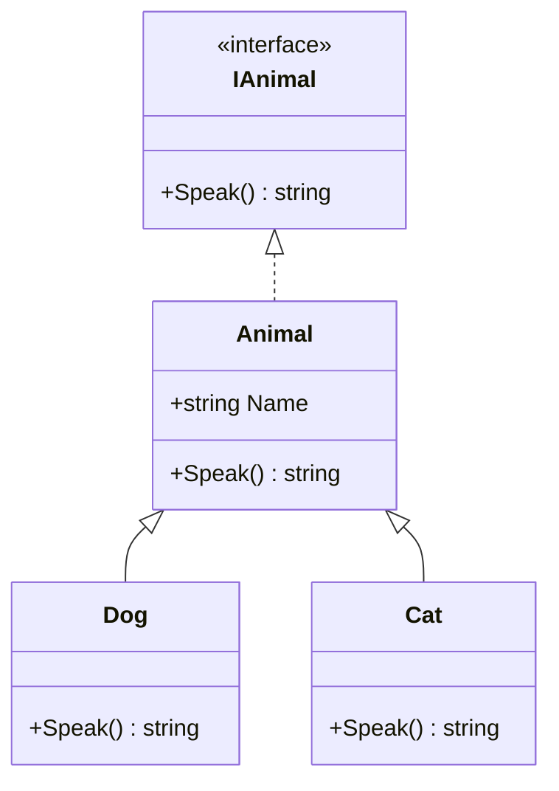

# Lập trình hướng đối tượng (OOP)

!!! info "Bạn đang ở đây"
    cần trước: bạn đã nắm cú pháp c# nền tảng (biến, kiểu, hàm, điều kiện, vòng lặp) từ chương nền tảng.
    mở khoá: sau chương này bạn hiểu bốn trụ oop, phân biệt được abstract class với interface, và giải thích được đa hình runtime chạy như thế nào trên .NET {{ dotnet.current }}.

> Mục tiêu (đo được): sau chương này bạn có thể **phân tích** một đoạn code có kế thừa + `virtual/override` và dự đoán chính xác phương thức nào được gọi lúc chạy, đồng thời tự thiết kế được một hệ phân cấp lớp áp dụng đóng gói và đa hình.

## 0. Đoán nhanh trước khi học

Cho đoạn code: một biến khai báo kiểu `Animal` nhưng gán một `Dog` (kế thừa `Animal`). Cả hai đều có phương thức `Speak()` được đánh dấu `virtual` ở `Animal` và `override` ở `Dog`. Khi gọi `animal.Speak()`, phiên bản nào chạy?

Thử đoán trước khi mở đáp án.

??? note "Đáp án"
    Phiên bản của `Dog` chạy. Vì `Speak()` là `virtual/override`, .NET quyết định phương thức dựa trên **kiểu thực tế của đối tượng lúc chạy** (`Dog`), không phải kiểu khai báo của biến (`Animal`). Đây chính là đa hình runtime. Nếu đổi sang `new` (method hiding) thì kết quả sẽ khác — xem mục 1.

## 1. Ý niệm cốt lõi

**Class** là bản thiết kế (khuôn); **object** là thực thể cụ thể tạo ra từ khuôn đó bằng `new`. Một class định nghĩa một lần, có thể tạo vô số object độc lập, mỗi object giữ trạng thái riêng.

OOP xoay quanh **bốn trụ**:

| Trụ | Ý nghĩa | Công cụ trong c# |
|-----|---------|------------------|
| Đóng gói (Encapsulation) | Giấu trạng thái nội bộ, chỉ lộ ra qua cửa được kiểm soát | `private` field + `property` có validate |
| Kế thừa (Inheritance) | Lớp con tái dùng và mở rộng lớp cha | `class Dog : Animal` |
| Đa hình (Polymorphism) | Cùng lời gọi, hành vi khác nhau theo kiểu thực tế | `virtual` / `override` |
| Trừu tượng (Abstraction) | Định nghĩa hợp đồng, ẩn chi tiết cài đặt | `abstract` / `interface` |

Sơ đồ một hệ phân cấp lớp điển hình:



**`virtual/override` vs `new` (method hiding):** đây là điểm dễ sai nhất.

| Tiêu chí | `override` | `new` (hiding) |
|----------|-----------|----------------|
| Quyết định phương thức theo | Kiểu **thực tế lúc chạy** | Kiểu **khai báo lúc biên dịch** |
| Đa hình | Có | Không |
| Yêu cầu ở lớp cha | Phương thức phải `virtual`/`abstract` | Không cần |

**`abstract class` vs `interface`:**

| Tiêu chí | abstract class | interface |
|----------|----------------|-----------|
| Trạng thái (field) | Có thể chứa | Không (chỉ hằng/property) |
| Cài đặt sẵn | Có thể có | Chỉ default member |
| Kế thừa bội | Một lớp cha | Nhiều interface |
| Dùng khi | Chia sẻ code + "là một loại" | Định nghĩa khả năng/hợp đồng |

!!! danger "Đính chính hiểu lầm phổ biến"
    "Cứ dùng `new` thay `override` cũng chạy được như nhau" — SAI. Với `new`, nếu bạn giữ đối tượng qua biến kiểu cha thì phương thức của **cha** chạy, không phải con. Điều này phá vỡ đa hình và là nguồn bug rất khó tìm. Quy tắc: muốn đa hình thì luôn dùng cặp `virtual` + `override`.

**Giới thiệu ngắn SOLID:** năm nguyên tắc thiết kế. Hai cái quan trọng để bắt đầu:

- **SRP (Single Responsibility):** mỗi lớp chỉ nên có một lý do để thay đổi. Lớp `Invoice` không nên vừa tính tiền vừa gửi email.
- **DIP (Dependency Inversion):** phụ thuộc vào trừu tượng (interface), không phụ thuộc vào cài đặt cụ thể. Nhờ đó dễ thay thế, dễ test.

## 2. Ví dụ mẫu

Đa hình runtime với `abstract class` + `override`:

```csharp title="C#"
// test:run
Animal[] zoo = [new Dog("Rex"), new Cat("Miu"), new Dog("Bô")];

foreach (Animal a in zoo)
{
    // Cùng lời gọi a.Speak(), nhưng hành vi khác nhau theo kiểu thực tế
    Console.WriteLine($"{a.Name}: {a.Speak()}");
}

abstract class Animal
{
    public string Name { get; }
    protected Animal(string name) => Name = name;
    public abstract string Speak();
}

class Dog : Animal
{
    public Dog(string name) : base(name) { }
    public override string Speak() => "Gâu gâu";
}

class Cat : Animal
{
    public Cat(string name) : base(name) { }
    public override string Speak() => "Meo meo";
}
```

Output kỳ vọng:

```text title="Kết quả"
Rex: Gâu gâu
Miu: Meo meo
Bô: Gâu gâu
```

Đóng gói với `private` field + property có validate:

```csharp title="C#"
// test:run
var acc = new BankAccount(100m);
acc.Deposit(50m);
Console.WriteLine($"Số dư: {acc.Balance}");

try
{
    acc.Deposit(-10m); // Bị chặn bởi validate
}
catch (ArgumentException ex)
{
    Console.WriteLine($"Lỗi: {ex.Message}");
}

class BankAccount
{
    private decimal _balance; // Trạng thái nội bộ, không lộ ra ngoài

    public decimal Balance => _balance; // Chỉ đọc từ bên ngoài

    public BankAccount(decimal initial) => _balance = initial;

    public void Deposit(decimal amount)
    {
        if (amount <= 0)
            throw new ArgumentException("Số tiền phải dương");
        _balance += amount;
    }
}
```

Output kỳ vọng:

```text title="Kết quả"
Số dư: 150
Lỗi: Số tiền phải dương
```

## 3. Bài tập có giàn giáo

Thiết kế interface `IShape` với phương thức `double Area()`. Cài đặt hai lớp `Circle` và `Rectangle`. Sau đó duyệt một mảng `IShape[]` và in tổng diện tích (đa hình qua interface).

Giàn giáo:

```csharp title="C#"
// test:skip giàn giáo chưa hoàn chỉnh, người học tự điền
interface IShape
{
    double Area();
}

class Circle : IShape
{
    private readonly double _r;
    public Circle(double r) => _r = r;
    // TODO: cài đặt Area() = pi * r * r
}

// TODO: viết class Rectangle : IShape với width, height
```

??? note "Lời giải"
    ```csharp title="C#"
    // test:run
    IShape[] shapes = [new Circle(2), new Rectangle(3, 4)];
    double total = 0;
    foreach (IShape s in shapes)
        total += s.Area(); // Đa hình qua interface

    Console.WriteLine($"Tổng diện tích: {total:F2}");

    interface IShape
    {
        double Area();
    }

    class Circle : IShape
    {
        private readonly double _r;
        public Circle(double r) => _r = r;
        public double Area() => Math.PI * _r * _r;
    }

    class Rectangle : IShape
    {
        private readonly double _w, _h;
        public Rectangle(double w, double h) => (_w, _h) = (w, h);
        public double Area() => _w * _h;
    }
    ```

    Output: `Tổng diện tích: 24.57`

    **Vì sao:** `s.Area()` không quan tâm `s` là `Circle` hay `Rectangle`; .NET tra bảng phương thức của kiểu thực tế lúc chạy để gọi đúng cài đặt. Đây là DIP trong thực tế: vòng lặp phụ thuộc vào trừu tượng `IShape`, không phụ thuộc lớp cụ thể, nên thêm hình mới không cần sửa vòng lặp.

## 4. Cạm bẫy thường gặp

!!! warning "Những lỗi hay mắc"
    - Quên `virtual` ở lớp cha rồi tưởng `override` sẽ hoạt động — trình biên dịch sẽ báo lỗi, đọc kỹ thông báo.
    - Dùng `new` che phương thức cha một cách vô tình (trình biên dịch chỉ cảnh báo, không chặn) rồi mất đa hình.
    - Để field `public` phá vỡ đóng gói — luôn ưu tiên `private` field + property.
    - Lạm dụng kế thừa sâu nhiều tầng; thường composition (chứa đối tượng khác) linh hoạt hơn kế thừa.
    - Nhồi nhiều trách nhiệm vào một lớp, vi phạm SRP, khiến lớp khó test và khó sửa.

## Tự kiểm tra

1. Class và object khác nhau thế nào?

    ??? note "Đáp án"
        Class là bản thiết kế/khuôn định nghĩa cấu trúc và hành vi; object là thực thể cụ thể tạo từ class bằng `new`, mỗi object có trạng thái riêng.

2. Khi nào phương thức được chọn theo kiểu thực tế lúc chạy: `override` hay `new`?

    ??? note "Đáp án"
        `override` (cùng `virtual` ở lớp cha) — đó là đa hình runtime. `new` chọn theo kiểu khai báo lúc biên dịch.

3. Nêu một điểm khác biệt then chốt giữa abstract class và interface.

    ??? note "Đáp án"
        abstract class có thể chứa trạng thái (field) và cài đặt sẵn, và một lớp chỉ kế thừa được một lớp cha; interface không chứa field và một lớp cài đặt được nhiều interface.

4. Đóng gói được thực hiện bằng công cụ nào trong c#?

    ??? note "Đáp án"
        `private` field kết hợp `property` (có thể kèm validate trong setter/phương thức), giấu trạng thái nội bộ và kiểm soát cách truy cập.

5. Nguyên tắc DIP nói gì và vì sao hữu ích khi test?

    ??? note "Đáp án"
        Phụ thuộc vào trừu tượng (interface) thay vì cài đặt cụ thể. Nhờ đó ta có thể thay bằng bản giả (mock/fake) khi test, không cần chạy cài đặt thật.

??? abstract "DEEP DIVE: vtable và cơ chế dispatch"
    Đa hình runtime không phải phép màu. Khi một lớp có phương thức `virtual`, CLR sinh cho mỗi kiểu một **method table** (vtable) chứa con trỏ tới cài đặt thực tế. Mỗi object mang một con trỏ `MethodTable` ở đầu vùng nhớ của nó.

    Khi bạn gọi `a.Speak()` với `a` kiểu tĩnh `Animal`:

    - Với phương thức **non-virtual**: JIT gọi trực tiếp địa chỉ đã biết lúc biên dịch (nhanh hơn, nhưng không đa hình).
    - Với phương thức **virtual/abstract**: JIT sinh mã tra con trỏ `MethodTable` của object lúc chạy, tìm slot tương ứng rồi nhảy tới cài đặt của kiểu thực tế. Đây là lý do `override` chọn đúng `Dog.Speak()`.

    Với **interface**, cơ chế thêm một tầng: interface dispatch dùng một map riêng (interface map) để phân giải slot, hiện đại hoá bằng kỹ thuật cache (Virtual Stub Dispatch) để giảm chi phí. Chi phí một lệnh gọi virtual thường chỉ vài chu kỳ CPU thêm so với gọi trực tiếp — đủ rẻ cho hầu hết ứng dụng, nhưng đáng cân nhắc trong vòng lặp nóng.

    Từ .NET {{ dotnet.current }}, các tối ưu như devirtualization (JIT chứng minh được kiểu thực tế và bỏ qua vtable) và guarded devirtualization giúp nhiều lời gọi virtual thực chất chạy nhanh như non-virtual. Đây là kiến thức hữu ích khi bạn phân tích hiệu năng ở cấp thấp, không cần cho code thường ngày.

Tiếp theo -> giao diện và trừu tượng nâng cao
