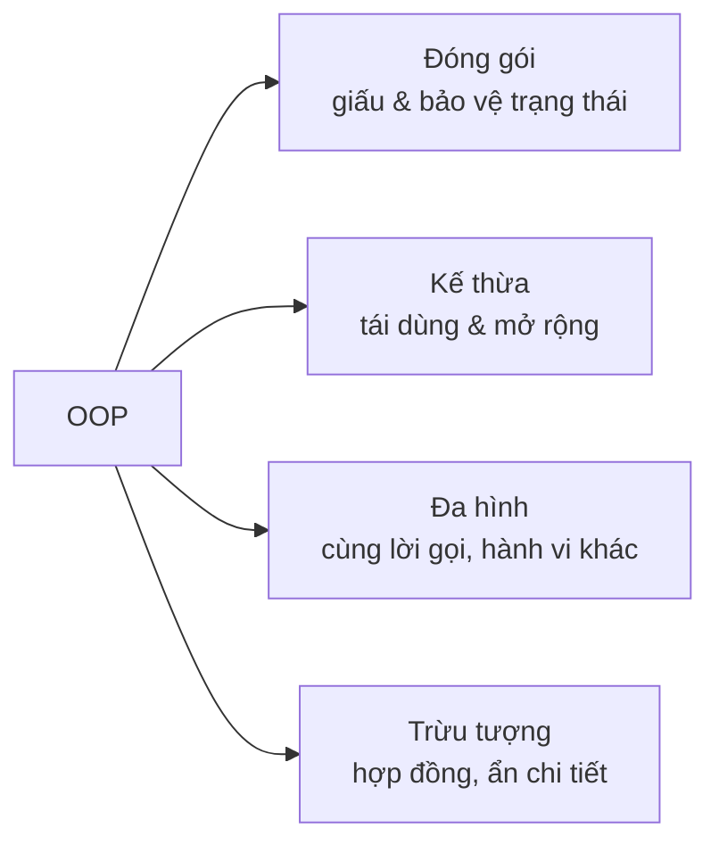

# Lập trình hướng đối tượng (OOP)

!!! info "Bạn đang ở đây · P1 → node `p1-oop`"
    **Cần trước:** cú pháp C# nền tảng (biến, kiểu, hàm, điều kiện, vòng lặp, exceptions cơ bản).
    **Mở khoá:** Generics, Collections & LINQ, và toàn bộ thiết kế tầng dịch vụ ở P3 (DI dựa hoàn toàn trên tư duy OOP + interface).
    ⏱️ Fast path ~55 phút · Deep dive +65 phút.

> **Mục tiêu (đo được):** Sau chương này bạn (1) **tự thiết kế** được một hệ phân cấp lớp áp dụng đóng gói; (2) **dự đoán chính xác** phương thức nào chạy trong code có `virtual`/`override`/`new`; (3) **chọn đúng** giữa `abstract class`, `interface` và composition cho một bài toán; (4) **nhận diện và sửa** vi phạm SOLID trong code cho sẵn.

---

## 0. Đoán nhanh trước khi học (30 giây)

Đọc và **tự đoán output** trước khi mở đáp án — đoán sai lúc này giúp bạn nhớ lâu hơn nhiều.

```csharp title="Đoán output"
// test:run
Base x = new Child();   // biến kiểu Base, đối tượng thật là Child
Console.WriteLine(x.Speak());

class Base { public virtual string Speak() => "Base"; }
class Child : Base { public override string Speak() => "Child"; }
```

??? note "Đáp án — mở SAU khi đã đoán"
    In ra **`Child`**. Dù biến khai báo kiểu `Base`, đối tượng thật là `Child`, và vì `Speak()` là `virtual`+`override`, C# chọn phiên bản theo **kiểu thực tế lúc chạy** — đó là **đa hình runtime**. Nếu `Child` dùng `new` thay vì `override` thì kết quả sẽ là `Base`. Mục 4 sẽ chứng minh sự khác biệt này bằng code chạy được.

---

## 1. Vì sao cần OOP? (đừng bỏ qua phần này)

Hãy nhìn một chương trình quản lý tài khoản viết kiểu **thủ tục** (procedural) — dữ liệu và hàm rời rạc:

```csharp title="Cách thủ tục — dễ hỏng"
// test:run
// Trạng thái trần trụi, ai cũng sửa được, không có ai canh giữ tính hợp lệ
decimal balance = 100m;
balance = balance - 1000m;          // rút quá số dư mà KHÔNG ai chặn
Console.WriteLine(balance);          // -900  → dữ liệu đã sai, phát hiện quá muộn
```

Vấn đề: `balance` là biến trần, **bất kỳ dòng code nào cũng gán bậy được**. Không có "người gác cổng" đảm bảo *số dư không bao giờ âm*. Khi chương trình lớn lên (hàng trăm chỗ đụng vào `balance`), một chỗ sai là cả hệ thống sai, và rất khó tìm.

**OOP giải quyết bằng cách gom "dữ liệu + hành vi hợp lệ trên dữ liệu đó" vào một đơn vị (object) tự bảo vệ mình.** Cùng bài toán, viết theo OOP:

```csharp title="Cách OOP — tự bảo vệ tính hợp lệ"
// test:run
var acc = new BankAccount(100m);
try
{
    acc.Withdraw(1000m);             // sẽ bị TỪ CHỐI ngay tại nguồn
}
catch (InvalidOperationException ex)
{
    Console.WriteLine($"Bị chặn: {ex.Message}");   // "Bị chặn: Số dư không đủ"
}
Console.WriteLine($"Số dư vẫn an toàn: {acc.Balance}");   // 100 — không hề bị làm sai

class BankAccount
{
    private decimal _balance;                    // không ai bên ngoài chạm tới trực tiếp
    public decimal Balance => _balance;
    public BankAccount(decimal initial) => _balance = initial;

    public void Withdraw(decimal amount)
    {
        if (amount > _balance)
            throw new InvalidOperationException("Số dư không đủ");   // gác cổng
        _balance -= amount;
    }
}
```

Chạy đoạn trên: lệnh rút bị **chặn ngay tại nơi phát sinh** (object tự từ chối), số dư giữ nguyên 100 — sai không lan ra. Đó là giá trị cốt lõi của OOP: **bất biến (invariant) của dữ liệu được một object canh giữ**, không phụ thuộc kỷ luật của người gọi.

OOP xoay quanh **bốn trụ**. Ta sẽ học sâu từng trụ, mỗi trụ có ví dụ chạy được:



---

## 2. Class & Object — nền tảng

- **Class** là *bản thiết kế* (khuôn): định nghĩa một object *có gì* (field/property) và *làm được gì* (method).
- **Object** là *thực thể cụ thể* tạo từ class bằng `new`. Từ một class tạo được **vô số object độc lập**, mỗi cái giữ **trạng thái riêng**.

```csharp title="Mỗi object có trạng thái riêng"
// test:run
var a = new Counter();
var b = new Counter();
a.Increment(); a.Increment();     // chỉ a tăng
b.Increment();                    // chỉ b tăng
Console.WriteLine($"a = {a.Value}, b = {b.Value}");   // a = 2, b = 1

class Counter
{
    private int _value;                       // trạng thái riêng của MỖI object
    public int Value => _value;               // property chỉ-đọc
    public void Increment() => _value++;
}
```

**Kết quả:** `a = 2, b = 1`. Hai object `a` và `b` hoàn toàn độc lập — sửa cái này không ảnh hưởng cái kia. **Constructor** (`new Counter()`) là nơi khởi tạo trạng thái ban đầu.

---

## 3. Trụ 1 — Đóng gói (Encapsulation)

**Ý tưởng:** giấu trạng thái nội bộ, chỉ cho bên ngoài tương tác qua "cửa" được kiểm soát. Nhờ đó object **luôn ở trạng thái hợp lệ**.

### Access modifier — kiểm soát ai thấy được gì (đầy đủ)

Access modifier quyết định **từ đâu** một type hoặc thành viên (field/property/method) được nhìn thấy và dùng. C# có **6 access modifier** cho thành viên, cộng type modifier `file`. Đây là bảng đầy đủ, chính xác:

| Modifier | Truy cập được từ | Ghi chú |
|---|---|---|
| `private` | **chỉ trong chính type chứa nó** | Mặc định cho thành viên của class/struct |
| `public` | **mọi nơi**, mọi assembly | Không giới hạn |
| `protected` | type chứa nó **+ mọi lớp con** (kể cả assembly khác) | Cho kế thừa |
| `internal` | **mọi nơi trong cùng assembly** (project biên dịch ra 1 dll) | Mặc định cho type cấp cao nhất |
| `protected internal` | cùng assembly **HOẶC** lớp con (dù ở assembly khác) — phép **HỢP** (rộng hơn) | |
| `private protected` | lớp con **VÀ** phải cùng assembly — phép **GIAO** (hẹp hơn) | Có từ C# 7.2 |

Ngoài ra `file` (C# 11) là **type modifier**: type khai báo `file class X` chỉ thấy được **trong đúng file .cs đó** — dùng cho source generator, tránh đụng tên.

**Ma trận truy cập** (✓ = thấy được) — đọc kỹ hai dòng `protected internal` và `private protected`, đây là chỗ hầu hết mọi người nhầm:

| Modifier | Trong cùng type | Lớp con · cùng assembly | Lớp con · khác assembly | Không-phải-con · cùng assembly | Mọi nơi khác |
|---|:---:|:---:|:---:|:---:|:---:|
| `private` | ✓ | ✗ | ✗ | ✗ | ✗ |
| `private protected` | ✓ | ✓ | ✗ | ✗ | ✗ |
| `protected` | ✓ | ✓ | ✓ | ✗ | ✗ |
| `internal` | ✓ | ✓ | ✗ | ✓ | ✗ |
| `protected internal` | ✓ | ✓ | ✓ | ✓ | ✗ |
| `public` | ✓ | ✓ | ✓ | ✓ | ✓ |

Mẹo nhớ: `protected internal` = "protected **hoặc** internal" (cộng hai vùng lại → rộng). `private protected` = "protected **và** internal" (giao hai vùng → hẹp: vừa phải là con, vừa phải cùng assembly).

**Giá trị mặc định** (khi bạn KHÔNG viết modifier) — phải nhớ vì rất hay dính:

| Ngữ cảnh | Mặc định |
|---|---|
| Type cấp cao nhất (class/struct/... trong namespace) | `internal` (KHÔNG phải public!) |
| Thành viên của `class` / `struct` | `private` |
| Type lồng trong class (nested type) | `private` |
| Thành viên của `interface` | `public` |
| Thành viên của `enum` | `public` |

Đây là ví dụ chạy được cho các trường hợp thấy được trong cùng file:

```csharp title="Access modifier — cái gì thấy được"
// test:run
var acc = new Account();
acc.Deposit(100m);                 // public: gọi được
Console.WriteLine(acc.Balance);    // public get: đọc được -> 100
var vip = new VipAccount();
Console.WriteLine(vip.Report());   // lớp con đọc _balance (protected) OK -> "Số dư: 0"

class Account
{
    protected decimal _balance;                 // lớp con thấy, ngoài không
    private int _txCount;                        // CHỈ Account thấy
    public decimal Balance => _balance;          // cửa công khai chỉ-đọc
    public void Deposit(decimal amount) { _balance += amount; _txCount++; }
}
class VipAccount : Account
{
    public string Report() => $"Số dư: {_balance}";   // OK: _balance là protected
    // Không thể đọc _txCount ở đây: nó private của Account -> sẽ là lỗi CS0122
}
```

**Kết quả:** `100` rồi `Số dư: 0`. Lớp con `VipAccount` đọc được `_balance` (protected) nhưng KHÔNG đọc được `_txCount` (private của cha).

Còn đây là các trường hợp **không biên dịch được** — biết để tránh (đánh dấu bỏ chạy vì cố tình sai):

```csharp title="Những lỗi truy cập điển hình"
// test:skip minh hoạ LỖI BIÊN DỊCH cố ý (không build)
var a = new Account();
a._balance = 999m;   // ❌ CS0122: '_balance' is inaccessible (protected, gọi từ ngoài)
a.Deposit(-5m);      // biên dịch OK nhưng logic nên tự chặn (xem phần validate)

// ❌ CS0051: lộ type kém-truy-cập qua thành viên public:
internal class Secret { }
public class Service
{
    public Secret Get() => new();   // 'Service.Get()' public nhưng trả về Secret (internal)
}
```

!!! danger "Bẫy: 'nhất quán truy cập' (accessibility consistency)"
    Một thành viên **không được lộ ra rộng hơn** những type xuất hiện trong chữ ký của nó. `public` method trả về/nhận một type `internal` → lỗi **CS0051**. Tương tự, một property `public` không thể có kiểu là class `private`. Quy tắc: type dùng trong API công khai cũng phải công khai tương xứng.

**Nguyên tắc thực chiến:**

- **Mặc định chọn mức HẸP nhất**, chỉ nới khi thật cần. Field → `private`; lộ ra qua property.
- `internal` cho thứ chỉ dùng nội bộ project (không muốn thành API công khai của thư viện).
- `protected` khi thiết kế cho kế thừa; `private protected` khi muốn "chỉ lớp con của TÔI trong assembly này".
- Test cần thấy `internal`? Dùng thuộc tính assembly `[assembly: InternalsVisibleTo("MyProject.Tests")]` thay vì đổi thành `public`.
- Property tinh chỉnh cả hai chiều: `{ get; private set; }` (đọc công khai, ghi nội bộ), `{ get; init; }` (chỉ gán lúc khởi tạo). Xem phần dưới.

Nguyên tắc vàng bao trùm: **để mức truy cập THẤP nhất có thể** — mỗi mức public là một lời hứa bạn phải giữ mãi về sau.

### Property — cánh cửa có kiểm soát

```csharp title="Các dạng property"
// test:run
var p = new Person("An", 2000);
Console.WriteLine($"{p.Name}, {p.Age} tuổi, {(p.IsAdult ? "đủ" : "chưa đủ")} 18");
p.Rename("Bình");
try { p.Rename(""); } catch (ArgumentException e) { Console.WriteLine(e.Message); }
Console.WriteLine(p.Name);

class Person
{
    public string Name { get; private set; }   // đọc công khai, chỉ sửa nội bộ
    public int BirthYear { get; init; }         // chỉ gán lúc khởi tạo (init)
    public int Age => 2026 - BirthYear;         // property TÍNH TOÁN, không lưu trữ
    public bool IsAdult => Age >= 18;

    public Person(string name, int birthYear)
    {
        if (string.IsNullOrWhiteSpace(name)) throw new ArgumentException("Tên bắt buộc");
        Name = name;
        BirthYear = birthYear;
    }

    public void Rename(string newName)          // muốn đổi tên phải qua method có validate
    {
        if (string.IsNullOrWhiteSpace(newName)) throw new ArgumentException("Tên không được rỗng");
        Name = newName;
    }
}
```

Điểm cần thấm:

- `get; private set;` → bên ngoài **đọc** được nhưng chỉ nội bộ **ghi** được.
- `get; init;` → chỉ gán lúc `new`, sau đó **bất biến**.
- `Age`/`IsAdult` là property **tính toán** — không lưu trữ, luôn nhất quán với `BirthYear`.
- Không có `set` công khai cho `Name` ⇒ mọi thay đổi phải đi qua `Rename()` — nơi ta **validate**. Đây là "gác cổng".

!!! tip "Vì sao không để `public string Name;` cho nhanh?"
    Vì field public là "cửa mở toang": ai đó gán `p.Name = ""` là object rơi vào trạng thái vô nghĩa mà không ai biết. Property + validate biến class thành nơi *duy nhất* chịu trách nhiệm về tính hợp lệ của chính nó.

---

## 4. Trụ 2 — Kế thừa (Inheritance)

**Ý tưởng:** lớp con (derived) **tái dùng** và **mở rộng** lớp cha (base). Quan hệ đúng để dùng kế thừa là **"là một loại" (is-a)**: `Manager` *là một* `Employee`.

```csharp title="Kế thừa + gọi constructor cha + protected"
// test:run
var m = new Manager("An", 20_000_000m, teamSize: 5);
Console.WriteLine(m.Describe());

class Employee
{
    public string Name { get; }
    protected decimal Salary { get; }          // lớp con thấy, bên ngoài không
    public Employee(string name, decimal salary) { Name = name; Salary = salary; }
    public virtual string Describe() => $"{Name} — lương {Salary:N0}";
}

class Manager : Employee
{
    private readonly int _teamSize;
    // ': base(...)' gọi constructor cha TRƯỚC, truyền dữ liệu lên
    public Manager(string name, decimal salary, int teamSize) : base(name, salary)
        => _teamSize = teamSize;

    // mở rộng hành vi cha bằng cách GỌI LẠI base rồi thêm phần của mình
    public override string Describe() => base.Describe() + $", quản lý {_teamSize} người";
}
```

**Kết quả:** `An — lương 20,000,000, quản lý 5 người`.

Điểm cần thấm:

- `: base(name, salary)` — constructor con **bắt buộc** khởi tạo phần của cha trước.
- `protected` — `Salary` chia sẻ cho lớp con nhưng vẫn ẩn với thế giới bên ngoài.
- `base.Describe()` — con **tái dùng** logic cha rồi bổ sung, không chép lại.
- Mọi class ngầm kế thừa `object` (gốc của mọi kiểu), nên object nào cũng có `ToString()`, `Equals()`, `GetHashCode()`.

!!! danger "Kế thừa bị lạm dụng nhiều nhất"
    Đừng kế thừa chỉ để "dùng ké code". Chỉ kế thừa khi thực sự là quan hệ **is-a** và lớp con có thể **thay thế** lớp cha ở mọi nơi (xem LSP ở mục 7). Nếu chỉ cần "dùng chức năng của cái khác", hãy **composition** (mục 6) — linh hoạt hơn nhiều.

---

## 5. Trụ 3 — Đa hình (Polymorphism)

**Ý tưởng:** cùng một lời gọi (`shape.Area()`), nhưng **hành vi khác nhau tuỳ kiểu thực tế** của object. Đây là thứ khiến code mở rộng được mà không phải sửa chỗ cũ.

```csharp title="Đa hình qua abstract + override"
// test:run
Shape[] shapes = [new Circle(2), new Rectangle(3, 4), new Circle(1)];
double tong = 0;
foreach (var s in shapes)          // cùng vòng lặp, cùng lời gọi s.Area()
{
    Console.WriteLine($"{s.Name}: {s.Area():F2}");
    tong += s.Area();
}
Console.WriteLine($"Tổng diện tích: {tong:F2}");

abstract class Shape
{
    public abstract string Name { get; }        // hợp đồng: lớp con PHẢI cài
    public abstract double Area();
}
class Circle(double r) : Shape                   // primary constructor (C# hiện đại)
{
    public override string Name => "Tròn";
    public override double Area() => Math.PI * r * r;
}
class Rectangle(double w, double h) : Shape
{
    public override string Name => "Chữ nhật";
    public override double Area() => w * h;
}
```

**Kết quả:** `Tròn: 12.57` · `Chữ nhật: 12.00` · `Tròn: 3.14` · `Tổng diện tích: 27.71`.

Sức mạnh: muốn thêm `Triangle`, bạn **viết một class mới**, vòng lặp trên **không phải sửa một dòng**. Đó là "mở để mở rộng, đóng để sửa đổi" (OCP).

### `override` vs `new` — điểm SAI kinh điển, phải chứng minh

Nhiều người tưởng `new` và `override` "chạy như nhau". **Không.** Chạy đoạn dưới để thấy tận mắt:

```csharp title="Bằng chứng: override giữ đa hình, new phá đa hình"
// test:run
Base a = new OverrideChild();   // đối tượng thật là OverrideChild
Base b = new NewChild();        // đối tượng thật là NewChild
Console.WriteLine($"override, gọi qua biến CHA: {a.Who()}");   // -> Child (đúng đa hình)
Console.WriteLine($"new,      gọi qua biến CHA: {b.Who()}");   // -> Base  (MẤT đa hình!)
Console.WriteLine($"new,      gọi qua biến CON: {new NewChild().Who()}");  // -> Child

class Base { public virtual string Who() => "Base"; }
class OverrideChild : Base { public override string Who() => "Child"; }
class NewChild : Base { public new string Who() => "Child"; }   // 'new' = che, không override
```

**Kết quả:**
```text title="Output"
override, gọi qua biến CHA: Child
new,      gọi qua biến CHA: Base
new,      gọi qua biến CON: Child
```

Giải thích: với `new`, C# chọn phương thức theo **kiểu KHAI BÁO của biến** lúc biên dịch (`Base b` → gọi `Base.Who`). Với `override`, C# chọn theo **kiểu THỰC TẾ của object** lúc chạy (luôn là `Child`). Trong code thực tế bạn hầu như luôn giữ object qua biến kiểu cha (ví dụ `Shape[]`, `List<Employee>`), nên `new` sẽ âm thầm gọi nhầm phiên bản cha → **bug rất khó tìm**.

**Quy tắc:** muốn đa hình thì luôn cặp `virtual` (ở cha) + `override` (ở con). Trình biên dịch chỉ **cảnh báo** khi bạn lỡ che bằng `new`, **không chặn** — nên phải tự cảnh giác.

---

## 6. Trụ 4 — Trừu tượng: `interface` vs `abstract class`

**Trừu tượng** = định nghĩa *hợp đồng* (làm được gì) mà ẩn *chi tiết* (làm thế nào). C# có hai công cụ, và chọn đúng là kỹ năng quan trọng.

| Tiêu chí | `interface` | `abstract class` |
|---|---|---|
| Ý nghĩa | "có khả năng…" (can-do) | "là một loại…" (is-a) |
| Trạng thái (field) | Không | Có |
| Cài đặt sẵn | Chỉ default member (hạn chế) | Có (chia sẻ code cho lớp con) |
| Một lớp dùng được | **nhiều** interface | **một** lớp cha |
| Dùng khi | nhiều lớp không liên quan cùng có 1 khả năng | các lớp cùng "họ" chia sẻ trạng thái + code |

```csharp title="Một lớp thực thi NHIỀU interface (khả năng)"
// test:run
var report = new Report("Doanh thu Q1");
Save(report);
Print(report);

// Hàm chỉ phụ thuộc vào KHẢ NĂNG nó cần, không cần biết lớp cụ thể:
static void Save(ISaveable s)   => Console.WriteLine($"Đã lưu -> {s.FileName()}");
static void Print(IPrintable p) => Console.WriteLine($"In:\n{p.PrintForm()}");

interface ISaveable  { string FileName(); }
interface IPrintable { string PrintForm(); }

class Report(string title) : ISaveable, IPrintable   // vừa lưu được, vừa in được
{
    public string FileName()  => $"{title}.pdf";
    public string PrintForm() => $"=== {title} ===";
}
```

**Kết quả:** `Đã lưu -> Doanh thu Q1.pdf` rồi `In:` + `=== Doanh thu Q1 ===`.

Điểm cần thấm: `Save` nhận `ISaveable`, `Print` nhận `IPrintable`. Chúng **không quan tâm** đối tượng là `Report` hay gì khác — chỉ cần nó *có khả năng* tương ứng. Đây là chìa khoá của code lỏng-ghép (loosely coupled), và là nền tảng của **Dependency Injection** ở P3.

**Chọn cái nào?**

- Cần chia sẻ **trạng thái + code chung** giữa các lớp cùng họ → `abstract class` (ví dụ `Shape` giữ logic chung).
- Chỉ cần khai báo **một khả năng** mà nhiều lớp khác họ đều có → `interface` (ví dụ `ISaveable`).
- Phân vân? → **ưu tiên `interface`**: nó linh hoạt hơn (một lớp thực thi được nhiều), dễ test hơn, và không "khoá" bạn vào một cây kế thừa.

---

## 7. Composition over Inheritance

Kế thừa sâu nhiều tầng dễ vỡ (đổi lớp cha là hỏng hàng loạt lớp con — "fragile base class"). Thường **composition** ("chứa" một object khác) linh hoạt hơn: quan hệ **has-a** thay vì **is-a**.

```csharp title="Composition: Car HAS-A Engine (thay được lúc chạy)"
// test:run
Drive(new Car(new PetrolEngine()));    // xe xăng
Drive(new Car(new ElectricEngine()));  // đổi động cơ mà KHÔNG sửa class Car

static void Drive(Car c) => Console.WriteLine(c.Start());

interface IEngine { string Start(); }
class PetrolEngine   : IEngine { public string Start() => "Nổ máy xăng"; }
class ElectricEngine : IEngine { public string Start() => "Khởi động điện êm ru"; }

class Car(IEngine engine)              // Car CHỨA một IEngine, không KẾ THỪA nó
{
    public string Start() => "Xe: " + engine.Start();
}
```

**Kết quả:** `Xe: Nổ máy xăng` rồi `Xe: Khởi động điện êm ru`. Đổi hành vi bằng cách **truyền object khác vào**, không đụng tới `Car`. Quy tắc thực chiến: *"Ưu tiên composition; chỉ kế thừa khi thật sự là-một-loại và cần đa hình."*

---

## 8. SOLID — 5 nguyên tắc thiết kế (kèm ví dụ)

SOLID là 5 nguyên tắc giúp code OOP dễ mở rộng, dễ test, dễ bảo trì.

- **S — Single Responsibility:** mỗi lớp một lý-do-để-thay-đổi. `Invoice` *tính tiền* thì đừng bắt nó *gửi email* — tách `EmailSender` riêng.
- **O — Open/Closed:** mở để **mở rộng** (thêm `Shape` mới), đóng với **sửa đổi** (không đụng vòng lặp tính tổng ở mục 5).
- **L — Liskov Substitution:** lớp con phải **thay thế được** lớp cha mà không phá hành vi. Kinh điển: `Square` kế thừa `Rectangle` rồi ép `width == height` sẽ phá kỳ vọng "đặt width không đổi height" → vi phạm LSP.
- **I — Interface Segregation:** interface nhỏ, chuyên biệt. Đừng bắt lớp chỉ cần in phải cài cả `Save`, `Fax`, `Scan` — tách `IPrintable`, `ISaveable` (như mục 6).
- **D — Dependency Inversion:** phụ thuộc vào **trừu tượng**, không vào cài đặt cụ thể.

```csharp title="DIP: dịch vụ phụ thuộc INTERFACE, không phụ thuộc lớp cụ thể"
// test:run
// Đổi cách thông báo mà KHÔNG sửa OrderService — chỉ truyền cài đặt khác vào.
new OrderService(new EmailNotifier()).Place("Sách");
new OrderService(new SmsNotifier()).Place("Cà phê");

interface INotifier { void Send(string msg); }
class EmailNotifier : INotifier { public void Send(string m) => Console.WriteLine($"[email] {m}"); }
class SmsNotifier   : INotifier { public void Send(string m) => Console.WriteLine($"[sms] {m}"); }

class OrderService(INotifier notifier)   // phụ thuộc INotifier (trừu tượng), không phụ thuộc Email cụ thể
{
    public void Place(string item)
    {
        Console.WriteLine($"Đặt hàng: {item}");
        notifier.Send($"Đơn '{item}' đã tạo");
    }
}
```

**Kết quả:** đặt hàng "Sách" báo qua email, "Cà phê" báo qua sms — cùng một `OrderService`. Vì `OrderService` phụ thuộc `INotifier` (trừu tượng), ta thay/giả lập (mock) thoải mái khi test. Đây chính là điều DI container ở ASP.NET Core tự động hoá.

---

## 9. Cạm bẫy thực chiến

- **Quên `virtual` ở cha** rồi tưởng `override` chạy — trình biên dịch báo lỗi, đọc kỹ thông báo.
- **Lỡ che bằng `new`** (chỉ cảnh báo, không chặn) → mất đa hình, gọi nhầm phiên bản cha (mục 5).
- **Field `public`** phá đóng gói — luôn `private` + property.
- **Kế thừa sâu 4-5 tầng** khó bảo trì — ưu tiên composition.
- **Lớp "thượng đế"** ôm mọi việc (vi phạm SRP) — khó test, khó sửa; tách trách nhiệm.
- **Vi phạm LSP thầm lặng:** lớp con ném `NotSupportedException` cho method cha → nơi dùng lớp cha sẽ vỡ bất ngờ.
- **So sánh 2 object bằng `==`** mà quên rằng với class, `==` mặc định so **danh tính tham chiếu** (cùng object hay không), không so nội dung — muốn so nội dung thì dùng `record` hoặc override `Equals`.

---

## 10. Bài tập (làm để thành thạo)

### Bài 1 (giàn giáo) — điền chỗ trống
Thiết kế `interface IShape { double Area(); double Perimeter(); }`. Cài `Square` và `Circle`. Duyệt `IShape[]` in diện tích + chu vi.

```csharp title="Starter (tự hoàn thiện)"
// test:skip giàn giáo chưa hoàn chỉnh — người học tự điền
interface IShape { double Area(); double Perimeter(); }

class Square(double side) : IShape
{
    // TODO: Area = side*side; Perimeter = 4*side
}
// TODO: class Circle(double r) : IShape  (Area = pi*r*r; Perimeter = 2*pi*r)
```

??? success "Lời giải + giải thích"
    ```csharp title="Lời giải"
    // test:run
    IShape[] shapes = [new Square(3), new Circle(2)];
    foreach (var s in shapes)
        Console.WriteLine($"S={s.Area():F2}, P={s.Perimeter():F2}");

    interface IShape { double Area(); double Perimeter(); }
    class Square(double side) : IShape
    {
        public double Area() => side * side;
        public double Perimeter() => 4 * side;
    }
    class Circle(double r) : IShape
    {
        public double Area() => Math.PI * r * r;
        public double Perimeter() => 2 * Math.PI * r;
    }
    ```
    Cả hai lớp cam kết cùng hợp đồng `IShape`, nên vòng lặp xử lý chúng đồng nhất — thêm hình mới không phải sửa vòng lặp (OCP).

### Bài 2 (thiết kế) — không có starter
Thiết kế domain **thư viện**: `Book` (Title, có trạng thái *đang mượn/sẵn có*), `Member`. Viết `Library` với `Borrow(member, book)` và `Return(book)`. Yêu cầu: **không cho mượn sách đang được mượn** (dùng đóng gói canh giữ bất biến), và mọi thay đổi trạng thái phải qua method có validate. Tự viết vài dòng ở top-level để chứng minh mượn 2 lần cùng cuốn sẽ bị chặn.

??? success "Gợi ý lời giải"
    ```csharp title="Một cách làm"
    // test:run
    var lib = new Library();
    var b = lib.Add("Clean Code");
    lib.Borrow("An", b);
    try { lib.Borrow("Bình", b); } catch (InvalidOperationException e) { Console.WriteLine(e.Message); }
    lib.Return(b);
    lib.Borrow("Bình", b);              // giờ mượn được
    Console.WriteLine($"'{b.Title}' đang mượn bởi: {b.BorrowedBy}");

    class Book(string title)
    {
        public string Title { get; } = title;
        public string? BorrowedBy { get; private set; }     // null = sẵn có
        public bool IsAvailable => BorrowedBy is null;
        public void MarkBorrowed(string who) => BorrowedBy = who;   // chỉ Library gọi (cùng file)
        public void MarkReturned() => BorrowedBy = null;
    }
    class Library
    {
        private readonly List<Book> _books = [];
        public Book Add(string title) { var b = new Book(title); _books.Add(b); return b; }
        public void Borrow(string member, Book book)
        {
            if (!book.IsAvailable) throw new InvalidOperationException($"'{book.Title}' đang được mượn");
            book.MarkBorrowed(member);
        }
        public void Return(Book book) => book.MarkReturned();
    }
    ```
    Bất biến "một cuốn chỉ mượn được khi sẵn có" được `Library.Borrow` canh giữ; trạng thái `BorrowedBy` chỉ đổi qua method, không phơi `set` ra ngoài.

### Bài 3 (thử thách) — dùng AI như pair
Cho code sau **vi phạm SRP + DIP**: một class `ReportService` vừa tạo báo cáo, vừa tự mở file ghi đĩa, vừa gửi email. Hãy **tách** thành `ReportBuilder`, `IReportStore`, `INotifier` và ghép lại qua constructor injection. Viết test nhỏ chứng minh có thể thay `IReportStore` bằng bản giả (in ra console) mà không sửa `ReportService`. Tự chấm theo: (1) mỗi lớp một trách nhiệm; (2) `ReportService` chỉ phụ thuộc interface; (3) thay cài đặt không cần sửa `ReportService`.

---

## Tự kiểm tra (trả lời không nhìn bài)

1. Class và object khác nhau thế nào?
2. Vì sao `public` field phá đóng gói, và property sửa được điều đó ra sao?
3. `Base x = new Child()` — với `override` thì `x.Speak()` gọi bản nào? Với `new` thì bản nào? Vì sao?
4. Khi nào chọn `interface`, khi nào `abstract class`?
5. "Composition over inheritance" nghĩa là gì, cho một ví dụ?
6. DIP nói gì và vì sao giúp code dễ test?

??? note "Đáp án"
    1. Class là bản thiết kế (định nghĩa một lần); object là thực thể cụ thể tạo bằng `new`, mỗi object có trạng thái riêng độc lập.
    2. Field `public` cho phép mọi nơi gán bậy, phá bất biến. Property + validate biến class thành nơi *duy nhất* kiểm soát tính hợp lệ (ví dụ chặn số dư âm).
    3. `override` → gọi **`Child`** (chọn theo kiểu thực tế lúc chạy = đa hình). `new` → gọi **`Base`** khi truy cập qua biến kiểu `Base` (chọn theo kiểu khai báo lúc biên dịch), nên mất đa hình.
    4. `abstract class` khi các lớp cùng họ chia sẻ **trạng thái + code**; `interface` khi khai báo **một khả năng** mà nhiều lớp khác họ đều có, hoặc khi cần một lớp mang nhiều khả năng. Phân vân → ưu tiên `interface`.
    5. Ưu tiên "chứa" object khác (has-a) hơn là "kế thừa" (is-a) để linh hoạt. Ví dụ `Car` chứa `IEngine` thay bằng được, thay vì `Car : PetrolEngine`.
    6. Dependency Inversion: phụ thuộc **trừu tượng** (interface) thay vì cài đặt cụ thể. Khi test, ta truyền bản giả/mock của interface vào, không cần hạ tầng thật (email, DB).

!!! tip "Ôn cách quãng"
    Đưa 6 câu trên vào bộ Leitner (1 ngày → 3 ngày → 1 tuần). Bài Review cuối P1 sẽ trộn lại chúng cùng câu từ Generics và LINQ (interleaving).

---

??? abstract "🔬 DEEP DIVE (tuỳ chọn) — dispatch, đồng nhất & so sánh object"
    *Không nằm trên fast path. Đọc khi muốn hiểu tầng dưới.*

    **Đa hình chạy thế nào (vtable):** mỗi class có `virtual` method sở hữu một bảng con trỏ hàm (**vtable / method table**). Object giữ tham chiếu tới vtable của **kiểu thực tế** của nó. Khi gọi `x.Speak()`, runtime tra vtable của object (không phải của kiểu biến) để tìm địa chỉ hàm → vì thế `override` chọn theo kiểu thực tế. `new` thì gọi tĩnh theo kiểu biến, không qua vtable. JIT còn có thể **devirtualize** (bỏ qua vtable) khi chứng minh được kiểu thực tế, nên chi phí đa hình trong thực tế thường không đáng kể.

    **Class là reference type:** biến kiểu class chứa **tham chiếu** tới object trên heap. `a == b` với hai object class mặc định so **danh tính tham chiếu** (có cùng là một object không), *không* so nội dung. Muốn so theo nội dung: dùng `record` (tự sinh value-equality) hoặc override `Equals` + `GetHashCode` (phải override cùng nhau — hai object bằng nhau thì hash phải bằng nhau, nếu không sẽ hỏng `Dictionary`/`HashSet`).

    **`object` là gốc:** mọi kiểu kế thừa `System.Object`, nên có sẵn `ToString()`, `Equals()`, `GetHashCode()`, `GetType()`. Override `ToString()` giúp debug/log dễ đọc hơn nhiều.

    Kiểm chứng trên .NET {{ dotnet.current }} / C# {{ csharp.version }}: chạy lại các đoạn mục 5 và so output.

---
**Tiếp theo →** P1 · Generics *(chương kế trong lộ trình)*
