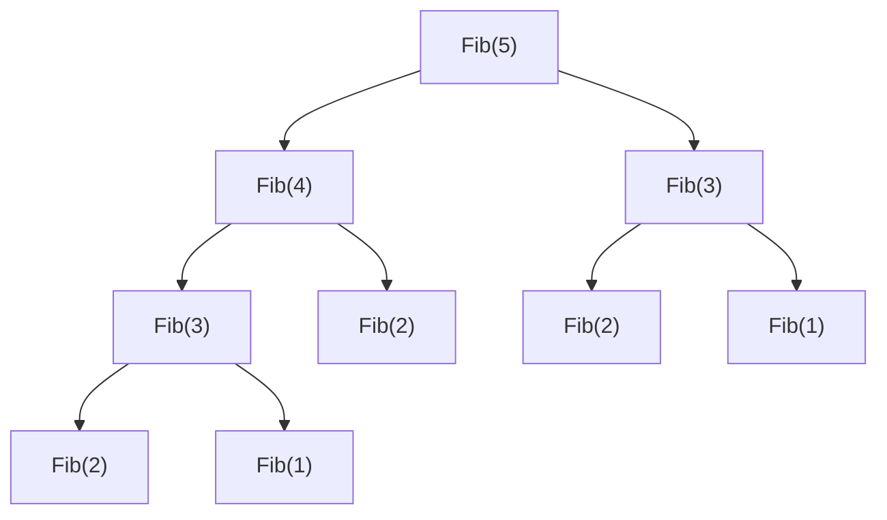

# Dynamic Programming cơ bản

!!! info "bạn đang ở đây · p10 → node `p10-dp`"
    **Cần trước:** đệ quy (một hàm tự gọi lại chính nó, có điều kiện dừng — base case).
    **Mở khoá:** tối ưu thuật toán chuỗi/mảng (LCS, knapsack), tư duy chia bài toán lớn thành bài toán con để giải các bài thuật toán phổ biến trong phỏng vấn.
    ⏱️ Fast path ~65 phút.

> **Mục tiêu (đo được):** Sau chương này bạn (1) **chỉ ra** chính xác vì sao đệ quy thuần cho Fibonacci bị tính lặp lại và **đo được** số lần gọi hàm tăng theo cấp số nhân; (2) **kiểm tra** một bài toán có đủ 2 điều kiện (optimal substructure + overlapping subproblems) trước khi áp dụng DP hay không; (3) **tự viết** memoization (top-down) và tabulation (bottom-up) cho Fibonacci, **đo và so sánh** số lần gọi hàm thực tế; (4) **giải** bài Coin Change bằng tabulation và giải thích bảng quy hoạch được xây dựng như thế nào; (5) **áp dụng** quy trình 4 bước (định nghĩa trạng thái → công thức truy hồi → base case → chọn cách cài đặt) cho các bài trạng thái 1 chiều (LIS, House Robber) và 2 chiều (0/1 Knapsack, Minimum Path Sum).

---

## 0. Đoán nhanh trước khi học (60 giây)

Đọc và **tự đoán** trước khi mở đáp án: đoạn code dưới đếm xem hàm `Fib` bị **gọi bao nhiêu lần** để tính `Fib(30)` theo đệ quy thuần (chưa tối ưu).

```csharp title="Đoán số lần gọi hàm"
// test:run
int soLanGoi = 0;

int Fib(int n)
{
    soLanGoi++;
    if (n <= 1) return n;              // base case
    return Fib(n - 1) + Fib(n - 2);    // gọi lại chính nó — CHƯA lưu kết quả
}

Console.WriteLine(Fib(30));
Console.WriteLine($"Số lần gọi Fib(...): {soLanGoi}");
// Đoán: vài chục lần? vài trăm? hay nhiều hơn?
```

??? note "Đáp án — mở SAU khi đã đoán"
    Kết quả `Fib(30) = 832040`, nhưng **số lần gọi hàm là 2.692.537 lần** — hơn 2.6 triệu lần gọi chỉ để tính một số Fibonacci thứ 30! Nguyên nhân: `Fib(30)` gọi `Fib(29)` và `Fib(28)`; `Fib(29)` lại gọi `Fib(28)` và `Fib(27)` — **`Fib(28)` bị tính lại từ đầu ở cả hai nhánh**, và hiện tượng này lặp lại ở mọi tầng. Số lời gọi tăng theo cấp số nhân O(2^n). Đây chính là vấn đề gốc mà Dynamic Programming (DP) giải quyết: **không tính lại cái đã tính**.

---

## 1. Vấn đề gốc: đệ quy thuần tính lặp lại bài con

Hàm `Fib` ở mục 0 là đệ quy **thuần** — mỗi lần cần `Fib(k)`, nó tính lại từ đầu, dù `Fib(k)` có thể đã được tính ở một nhánh gọi khác trước đó.



Nhìn cây gọi trên: `Fib(3)` xuất hiện **2 lần**, `Fib(2)` xuất hiện **3 lần** — và với `Fib(30)`, số lần lặp lại này bùng nổ. Cụ thể, số lần gọi hàm để tính `Fib(n)` theo đệ quy thuần là O(2^n) — tăng theo cấp số nhân theo `n`. Bảng dưới cho thấy tốc độ bùng nổ:

| n | Số lần gọi Fib(...) (đệ quy thuần) |
|---|---|
| 10 | 177 |
| 20 | 21.891 |
| 30 | 2.692.537 |
| 40 | ~331 triệu |

**Điểm cốt lõi:** bài toán không phải ở công thức `Fib(n) = Fib(n-1) + Fib(n-2)` — công thức đó đúng. Vấn đề là **cách tính** lại bỏ qua việc các bài con (`Fib(28)`, `Fib(27)`...) đã được tính rồi ở nhánh khác. DP là kỹ thuật **nhớ lại** kết quả bài con đã tính, thay vì tính lại.

---

## 2. Hai điều kiện bắt buộc để áp dụng DP

DP **không** áp dụng được cho mọi bài toán đệ quy. Phải kiểm tra **đủ cả hai** điều kiện dưới đây — thiếu một, DP không giúp gì.

### 2.1 Optimal substructure (cấu trúc con tối ưu)

**Định nghĩa bằng lời:** một bài toán có optimal substructure nếu **lời giải tối ưu của bài lớn** có thể xây dựng trực tiếp **từ lời giải tối ưu của các bài con nhỏ hơn** của chính nó.

Ví dụ: `Fib(n) = Fib(n-1) + Fib(n-2)` — lời giải của `Fib(n)` xây thẳng từ lời giải hai bài con nhỏ hơn. Đây là optimal substructure.

### 2.2 Overlapping subproblems (bài con chồng lặp)

**Định nghĩa bằng lời:** một bài toán có overlapping subproblems nếu trong quá trình đệ quy, **cùng một bài con nhỏ được gọi lại nhiều lần** ở các nhánh khác nhau (như `Fib(2)` bị gọi 3 lần trong ví dụ mục 1).

### 2.3 Cảnh báo: thiếu một trong hai, DP không giúp gì

!!! danger "Ví dụ KHÔNG có overlapping subproblems — DP vô dụng"
    Xét bài toán **tìm giá trị lớn nhất trong mảng** bằng đệ quy chia đôi:

    ```csharp title="Đệ quy chia đôi tìm max — KHÔNG có bài con chồng lặp"
    // test:run
    int soLanGoi = 0;

    int Max(int[] a, int lo, int hi)
    {
        soLanGoi++;
        if (lo == hi) return a[lo];              // base case
        int mid = (lo + hi) / 2;
        int trai = Max(a, lo, mid);               // nửa trái — KHÔNG trùng với nửa phải
        int phai = Max(a, mid + 1, hi);           // nửa phải — KHÔNG trùng với nửa trái
        return Math.Max(trai, phai);
    }

    var mang = new[] { 3, 7, 1, 9, 4, 2, 8, 5 };
    Console.WriteLine(Max(mang, 0, mang.Length - 1));   // 9
    Console.WriteLine($"Số lần gọi: {soLanGoi}");        // 15 — đúng bằng ~2n, KHÔNG bùng nổ
    ```

    Bài toán này **có** optimal substructure (max của mảng = max của hai nửa), nhưng **không có** overlapping subproblems: nửa trái `[lo, mid]` và nửa phải `[mid+1, hi]` **không bao giờ trùng nhau** — mỗi đoạn con chỉ được tính đúng **một lần duy nhất**. Số lần gọi là O(n), không bùng nổ theo cấp số nhân. Nếu bạn thêm cache (memoization) vào đây, cache sẽ **luôn miss** (không bài con nào lặp lại để tận dụng) — chỉ tốn thêm bộ nhớ mà không tăng tốc. **Đây là lý do phải kiểm tra overlapping subproblems trước khi áp dụng DP — thiếu điều kiện này, DP là công cụ sai.**

---

## 3. Memoization — nhớ lại kết quả, top-down

**Định nghĩa bằng lời:** memoization là kỹ thuật **lưu kết quả của mỗi bài con vào một bảng tra cứu (Dictionary hoặc array)** ngay sau khi tính xong lần đầu; những lần gọi sau với **cùng đầu vào** thì **trả về ngay từ bảng** thay vì tính lại. Vì vẫn dùng đệ quy (hàm tự gọi hàm) và đi **từ bài lớn xuống bài nhỏ**, kỹ thuật này gọi là **top-down**.

```csharp title="Fibonacci với memoization (top-down)"
// test:run
int soLanGoiMemo = 0;
var cache = new Dictionary<int, long>();

long FibMemo(int n)
{
    soLanGoiMemo++;
    if (n <= 1) return n;                          // base case
    if (cache.TryGetValue(n, out long daTinh))
        return daTinh;                              // ĐÃ tính rồi -> trả ngay, KHÔNG đệ quy tiếp

    long ketQua = FibMemo(n - 1) + FibMemo(n - 2);
    cache[n] = ketQua;                               // LƯU lại trước khi return
    return ketQua;
}

Console.WriteLine(FibMemo(30));
Console.WriteLine($"Số lần gọi (có memo): {soLanGoiMemo}");
```

```text title="Kết quả"
832040
Số lần gọi (có memo): 59
```

**So sánh trực tiếp số lần gọi cho `Fib(30)`:**

| Cách tính | Số lần gọi hàm |
|---|---|
| Đệ quy thuần (mục 0) | 2.692.537 |
| Memoization (top-down) | 59 |

Giảm từ **2.6 triệu** xuống **59 lần gọi** — vì mỗi giá trị `Fib(k)` (với `k` từ 0 đến 30) chỉ được **tính thật một lần**, mọi lần gọi lại sau đó đều là tra bảng O(1).

---

## 4. Độ phức tạp: vì sao memoization nhanh hơn hẳn

Không chỉ nói miệng — hãy tính cụ thể. Với memoization, mỗi giá trị `FibMemo(k)` với `k` chạy từ `0` đến `n` chỉ được **tính thật đúng một lần** (lần đầu gặp); các lần gọi sau là tra `cache` O(1). Số giá trị khác nhau cần tính là `n + 1`, mỗi lần tính tốn O(1) công việc riêng (một phép cộng + một lần tra/ghi Dictionary) ngoài các lệnh gọi đệ quy. Do đó:

- **Đệ quy thuần:** O(2^n) — số lần gọi hàm tăng theo cấp số nhân vì mỗi bài con bị tính lại nhiều lần.
- **Memoization:** O(n) thời gian, O(n) bộ nhớ cho cache — vì chỉ có `n + 1` bài con khác nhau, mỗi bài con tính đúng một lần.

---

## 5. Tabulation — xây bảng, bottom-up

**Định nghĩa bằng lời:** tabulation là kỹ thuật **xây một bảng kết quả từ bài con nhỏ nhất đến bài lớn nhất bằng vòng lặp** (không đệ quy) — vì đi **từ bài nhỏ lên bài lớn**, kỹ thuật này gọi là **bottom-up**.

```csharp title="Fibonacci với tabulation (bottom-up)"
// test:run
long FibTab(int n)
{
    if (n <= 1) return n;

    var bang = new long[n + 1];   // bảng kết quả, bang[k] = Fib(k)
    bang[0] = 0;
    bang[1] = 1;
    for (int k = 2; k <= n; k++)
        bang[k] = bang[k - 1] + bang[k - 2];   // xây từ bài nhỏ (k-1, k-2) lên bài lớn hơn (k)

    return bang[n];
}

Console.WriteLine(FibTab(30));   // 832040 — giống kết quả memoization, KHÔNG đệ quy, KHÔNG stack overflow
```

Không có "số lần gọi hàm" để đo ở đây vì **không có đệ quy** — chỉ một vòng lặp `for` chạy đúng `n - 1` lần, mỗi lần làm O(1) việc (một phép cộng, một lần ghi mảng). Độ phức tạp: O(n) thời gian, O(n) bộ nhớ cho bảng `bang`.

---

## 6. Memoization vs Tabulation — chỉ so sánh SAU khi đã hiểu riêng từng cái

Hai kỹ thuật đều giải cùng bài toán DP, cùng độ phức tạp O(n) cho Fibonacci, nhưng khác cơ chế:

| | Memoization (top-down) | Tabulation (bottom-up) |
|---|---|---|
| Cơ chế | Đệ quy + cache (Dictionary/array) | Vòng lặp + bảng (array) |
| Hướng tính | Từ bài lớn xuống bài nhỏ (đệ quy tự chia nhỏ) | Từ bài nhỏ lên bài lớn (lặp tuần tự) |
| Tính bài con thừa? | Chỉ tính bài con **thật sự cần** đến | Tính **mọi** bài con từ 0 đến n, dù có cần hết hay không |
| Rủi ro | Đệ quy sâu có thể `StackOverflowException` với n rất lớn | Không đệ quy → không rủi ro stack overflow |
| Code | Thường gọn hơn nếu bài toán tự nhiên là đệ quy | Thường cần nghĩ đúng **thứ tự lặp** để bài nhỏ tính trước bài lớn |

!!! danger "Hiểu lầm phổ biến"
    "Tabulation luôn tốt hơn memoization" là **không chính xác**. Nếu bài toán chỉ cần một vài bài con cụ thể (không cần toàn bộ bảng từ 0 đến n), memoization có thể **tính ít hơn** vì chỉ đi đúng những nhánh cần. Tabulation phù hợp khi bạn biết chắc **cần toàn bộ bảng** hoặc muốn tránh rủi ro đệ quy sâu.

---

## 7. Ví dụ kinh điển thứ 2: Coin Change (ít đồng xu nhất)

**Định nghĩa bài toán:** cho một tập mệnh giá đồng xu và một tổng đích `X`, tìm **số lượng đồng xu ít nhất** để có đúng tổng `X` (mỗi mệnh giá dùng lại bao nhiêu lần cũng được). Nếu không thể ghép đủ `X`, trả về `-1`.

Bài này thoả cả 2 điều kiện DP: optimal substructure (số xu ít nhất cho tổng `X` = 1 + số xu ít nhất cho tổng `X - coin`, chọn `coin` tốt nhất) và overlapping subproblems (tổng con `X - coin` bị lặp lại qua nhiều đường chọn xu khác nhau).

```csharp title="Coin Change bằng tabulation (bottom-up)"
// test:run
int CoinChange(int[] coins, int tongDich)
{
    // bang[i] = số xu ít nhất để có tổng đúng i; int.MaxValue = "chưa tìm được cách"
    var bang = new int[tongDich + 1];
    Array.Fill(bang, int.MaxValue);
    bang[0] = 0;   // tổng 0 cần 0 đồng xu — base case

    for (int i = 1; i <= tongDich; i++)
    {
        foreach (int xu in coins)
        {
            if (xu > i) continue;                       // xu lớn hơn tổng đang xét -> bỏ qua
            if (bang[i - xu] == int.MaxValue) continue;  // tổng con (i - xu) chưa ghép được -> bỏ qua
            bang[i] = Math.Min(bang[i], bang[i - xu] + 1);
        }
    }

    return bang[tongDich] == int.MaxValue ? -1 : bang[tongDich];
}

Console.WriteLine(CoinChange(new[] { 1, 3, 4 }, 6));    // 2  (3 + 3)
Console.WriteLine(CoinChange(new[] { 2, 5 }, 3));       // -1 (không ghép được tổng 3 từ {2,5})
Console.WriteLine(CoinChange(new[] { 1, 5, 10, 25 }, 30)); // 2  (25 + 5)
```

**Cách bảng được xây:** `bang[i]` chỉ được tính **sau khi** mọi `bang[i - xu]` với `xu` nhỏ hơn `i` đã có giá trị đúng — đây chính là tabulation: xây từ `bang[0]` (bài nhỏ nhất, đã biết chắc = 0) tăng dần lên `bang[tongDich]` (bài lớn cần lời giải). Với mỗi `i`, thử **mọi** mệnh giá `xu` và giữ lại đáp án tốt nhất — đúng theo optimal substructure: lời giải tối ưu cho `i` xây từ lời giải tối ưu của một bài con nhỏ hơn `i - xu`.

**Độ phức tạp:** vòng ngoài chạy `tongDich` lần, vòng trong chạy `coins.Length` lần → O(tongDich × số_mệnh_giá) thời gian, O(tongDich) bộ nhớ cho bảng.

---

## 8. Quy trình 4 bước để nhận diện và giải một bài DP

Sau khi đã thấy Fibonacci và Coin Change riêng lẻ, đây là **quy trình chung** để tiếp cận bất kỳ bài toán DP mới:

1. **Định nghĩa trạng thái (state).** Xác định "bài con nhỏ nhất có ý nghĩa" là gì — thường là một hoặc vài chỉ số. Ví dụ Fibonacci: trạng thái là `n` (đang cần `Fib(n)`). Coin Change: trạng thái là `i` (tổng đang cần ghép).
2. **Viết công thức truy hồi (recurrence).** Diễn tả lời giải của trạng thái hiện tại bằng lời giải của (một hoặc nhiều) trạng thái nhỏ hơn. Ví dụ: `Fib(n) = Fib(n-1) + Fib(n-2)`; `CoinChange(i) = 1 + min(CoinChange(i - xu))` với mọi `xu` hợp lệ.
3. **Xác định base case.** Trạng thái nhỏ nhất phải có giá trị **biết chắc, không cần đệ quy** — nếu thiếu base case, đệ quy/vòng lặp không có điểm dừng.
4. **Chọn memoization hay tabulation** rồi cài đặt theo mục 3/5, dựa vào tiêu chí ở bảng so sánh mục 6.

```csharp title="Áp dụng quy trình 4 bước cho bài Climbing Stairs"
// test:run
// Bước 1: trạng thái = n (số bậc còn lại cần leo)
// Bước 2: recurrence = SoCachLeo(n) = SoCachLeo(n-1) + SoCachLeo(n-2)
//          (bước cuối là leo 1 bậc TỪ trạng thái n-1, hoặc leo 2 bậc TỪ trạng thái n-2)
// Bước 3: base case = SoCachLeo(0) = 1 (đã ở đích), SoCachLeo(1) = 1 (chỉ một cách: leo 1 bậc)
// Bước 4: chọn tabulation (biết chắc cần toàn bộ bảng từ 0 đến n)

int SoCachLeo(int n)
{
    if (n == 0 || n == 1) return 1;
    var bang = new int[n + 1];
    bang[0] = 1;
    bang[1] = 1;
    for (int k = 2; k <= n; k++)
        bang[k] = bang[k - 1] + bang[k - 2];
    return bang[n];
}

Console.WriteLine(SoCachLeo(4));    // 5 -> 1+1+1+1, 1+1+2, 1+2+1, 2+1+1, 2+2
Console.WriteLine(SoCachLeo(5));    // 8
```

**Vì sao recurrence đúng:** để đến bậc `n`, bước **cuối cùng** chỉ có 2 khả năng — hoặc leo 1 bậc (từ bậc `n-1`), hoặc leo 2 bậc (từ bậc `n-2`). Vì hai khả năng này **loại trừ nhau và bao trùm mọi trường hợp** (bước cuối luôn là 1 hoặc 2), tổng số cách đến `n` chính là tổng số cách đến hai trạng thái liền trước. Đây là cách suy luận chuẩn để rút ra công thức truy hồi cho hầu hết bài DP: hỏi "**lựa chọn cuối cùng có thể là gì**", rồi tổng/chọn tốt nhất qua các lựa chọn đó.

---

## 9. Ví dụ tổng hợp: Longest Increasing Subsequence (LIS) — trạng thái phức tạp hơn

Để thấy quy trình 4 bước hoạt động trên một bài có **nhiều trạng thái con phụ thuộc lẫn nhau** (không đơn giản như "chỉ phụ thuộc 1-2 bài liền trước"), xét bài **dãy con tăng dài nhất (Longest Increasing Subsequence)**.

**Định nghĩa bài toán:** cho một mảng số, tìm độ dài của dãy con dài nhất sao cho các phần tử **tăng dần** (không cần liên tiếp trong mảng gốc, chỉ cần giữ đúng thứ tự).

Áp dụng quy trình 4 bước:

1. **Trạng thái:** `dp[i]` = độ dài LIS **kết thúc đúng tại chỉ số `i`** (không phải LIS của toàn mảng con `0..i`).
2. **Recurrence:** `dp[i] = 1 + max(dp[j])` với mọi `j < i` sao cho `a[j] < a[i]` (nếu không có `j` nào thoả, `dp[i] = 1` — chỉ riêng phần tử `a[i]`).
3. **Base case:** `dp[i] = 1` với mọi `i` (dãy con chỉ gồm một phần tử `a[i]` luôn hợp lệ, độ dài 1).
4. **Chọn tabulation** vì cần toàn bộ `dp[0..n-1]` để lấy max cuối cùng.

```csharp title="Longest Increasing Subsequence bằng tabulation O(n^2)"
// test:run
int LIS(int[] a)
{
    int n = a.Length;
    var dp = new int[n];
    Array.Fill(dp, 1);              // base case: mỗi phần tử tự nó là LIS độ dài 1

    for (int i = 1; i < n; i++)
    {
        for (int j = 0; j < i; j++)
        {
            if (a[j] < a[i])                        // a[j] có thể đứng NGAY TRƯỚC a[i] trong dãy con
                dp[i] = Math.Max(dp[i], dp[j] + 1);  // nối thêm a[i] vào LIS kết thúc tại j
        }
    }

    int ketQua = 1;
    foreach (int v in dp) ketQua = Math.Max(ketQua, v);
    return ketQua;
}

Console.WriteLine(LIS(new[] { 10, 9, 2, 5, 3, 7, 101, 18 }));   // 4 -> 2,3,7,101 (hoặc 2,5,7,101)
Console.WriteLine(LIS(new[] { 0, 1, 0, 3, 2, 3 }));             // 4 -> 0,1,2,3
Console.WriteLine(LIS(new[] { 7, 7, 7, 7 }));                   // 1 -> không có cặp tăng thực sự
```

**Vì sao đây vẫn là DP hợp lệ — kiểm lại 2 điều kiện:**

- **Optimal substructure:** LIS kết thúc tại `i` được xây từ LIS tối ưu kết thúc tại một `j < i` nào đó (cộng thêm 1). Nếu bạn có LIS **không tối ưu** kết thúc tại `j`, kết quả nối thêm `a[i]` vào cũng không tối ưu — đúng định nghĩa optimal substructure.
- **Overlapping subproblems:** `dp[j]` (LIS kết thúc tại `j`) được **dùng lại** bởi mọi `i > j` mà `a[j] < a[i]` — với mảng lớn, một `dp[j]` có thể được tham chiếu bởi rất nhiều `i` phía sau. Đây chính là bài con chồng lặp.

**Độ phức tạp:** hai vòng lặp lồng nhau, mỗi vòng chạy tới `n` → O(n²) thời gian, O(n) bộ nhớ cho bảng `dp`. (Có thuật toán O(n log n) dùng binary search + patience sorting, nhưng đó là tối ưu nằm ngoài phạm vi DP cơ bản của chương này.)

!!! danger "Nhầm lẫn thường gặp: dp[i] là LIS 'kết thúc tại i', KHÔNG PHẢI LIS của mảng con 0..i"
    Nếu định nghĩa sai `dp[i]` = "LIS dài nhất trong đoạn `a[0..i]`" (không bắt buộc kết thúc tại `i`), công thức truy hồi `dp[i] = 1 + max(dp[j])` **sẽ sai** vì `dp[j]` khi đó có thể ứng với một dãy con không kết thúc tại `j`, nên không thể nối thêm `a[i]` vào một cách hợp lệ. Định nghĩa trạng thái **chính xác** (kèm đúng điều kiện biên) quyết định công thức truy hồi có đúng hay không — đây là lý do bước 1 (định nghĩa trạng thái) trong quy trình 4 bước quan trọng hơn bước viết code.

---

## 10. Ví dụ tổng hợp: 0/1 Knapsack — trạng thái 2 chiều

Mọi ví dụ trước đều có trạng thái **1 chiều** (`dp[i]` chỉ phụ thuộc một chỉ số). Bài **0/1 Knapsack (túi đồ 0/1)** minh hoạ trạng thái **2 chiều** — bước tiếp theo tự nhiên khi một chiều không đủ diễn tả bài toán.

**Định nghĩa bài toán:** cho `n` vật, vật thứ `i` có trọng lượng `w[i]` và giá trị `v[i]`, và một túi có sức chứa tối đa `cap`. Chọn một tập con các vật (**mỗi vật chỉ được chọn 0 hoặc 1 lần** — đây là lý do gọi "0/1") sao cho tổng trọng lượng không vượt `cap` và tổng giá trị **lớn nhất**.

Áp dụng quy trình 4 bước:

1. **Trạng thái:** `dp[i, c]` = giá trị lớn nhất đạt được khi chỉ xét **`i` vật đầu tiên** và sức chứa còn lại là `c`. Hai chiều vì kết quả phụ thuộc **cả** số vật đã xét **và** sức chứa còn lại — thiếu chiều nào cũng không đủ mô tả trạng thái.
2. **Recurrence:** tại vật thứ `i`, có 2 lựa chọn — **không chọn** vật `i` (`dp[i,c] = dp[i-1,c]`) hoặc **chọn** vật `i` nếu `w[i] <= c` (`dp[i,c] = v[i] + dp[i-1, c-w[i]]`). Lấy giá trị lớn hơn giữa hai lựa chọn.
3. **Base case:** `dp[0, c] = 0` với mọi `c` (chưa xét vật nào thì giá trị luôn là 0).
4. **Tabulation** — cần toàn bộ bảng vì mỗi `dp[i,c]` phụ thuộc dòng `i-1` ngay trước.

```csharp title="0/1 Knapsack bằng tabulation 2 chiều O(n × cap)"
// test:run
int Knapsack(int[] trongLuong, int[] giaTri, int sucChua)
{
    int n = trongLuong.Length;
    var dp = new int[n + 1, sucChua + 1];   // dp[i, c]: i vật đầu, sức chứa còn lại c

    for (int i = 1; i <= n; i++)
    {
        int w = trongLuong[i - 1];
        int v = giaTri[i - 1];
        for (int c = 0; c <= sucChua; c++)
        {
            dp[i, c] = dp[i - 1, c];                          // lựa chọn: KHÔNG chọn vật i
            if (w <= c)
                dp[i, c] = Math.Max(dp[i, c], v + dp[i - 1, c - w]);  // lựa chọn: CHỌN vật i
        }
    }

    return dp[n, sucChua];
}

Console.WriteLine(Knapsack(new[] { 1, 3, 4, 5 }, new[] { 1, 4, 5, 7 }, 7));   // 9  -> chọn vật trọng lượng 3+4=7, giá trị 4+5=9
Console.WriteLine(Knapsack(new[] { 2, 3, 4, 5 }, new[] { 3, 4, 5, 6 }, 5));   // 7  -> chọn vật trọng lượng 2+3=5, giá trị 3+4=7
```

**Vì sao mỗi `dp[i,c]` chỉ cần dòng `i-1` ngay trước, không cần dòng `i-2` hay xa hơn:** công thức truy hồi ở bước 2 chỉ tham chiếu `dp[i-1, ...]` — không có `dp[i-2, ...]` nào xuất hiện. Đây là điểm khác biệt so với Fibonacci (cần `k-1` VÀ `k-2`).

**Độ phức tạp:** hai vòng lặp lồng nhau, `i` chạy `n` lần, `c` chạy `sucChua` lần → O(n × sucChua) thời gian, O(n × sucChua) bộ nhớ cho bảng 2 chiều.

!!! danger "Vì sao gọi là '0/1' — khác Coin Change ở đâu"
    Coin Change (mục 7) cho phép **dùng lại** một mệnh giá nhiều lần (một đồng 1.000đ có thể dùng 5 lần). 0/1 Knapsack thì **mỗi vật chỉ chọn tối đa 1 lần** — đây là lý do công thức Knapsack dùng `dp[i-1, c-w]` (chuyển sang dòng **`i-1`**, đánh dấu "đã dùng vật `i` rồi, không được dùng lại"), còn Coin Change (biến thể cho phép dùng lại) không cần chiều "đã xét đến mệnh giá nào" mà chỉ cần chiều tổng `i`. Nhầm giữa hai biến thể là lỗi cực phổ biến khi mới học DP — luôn đọc kỹ đề bài xem một "vật"/"mệnh giá" được dùng **bao nhiêu lần**.

---

## 11. Ví dụ tổng hợp: Minimum Path Sum trên lưới — trạng thái 2 chiều thứ hai

Một dạng trạng thái 2 chiều khác, thường gặp hơn 0/1 Knapsack trong thực tế: **lưới (grid)**. Bài **Minimum Path Sum** minh hoạ dạng này.

**Định nghĩa bài toán:** cho một lưới `m × n` ô, mỗi ô có một số không âm. Bắt đầu từ ô trên-trái, mỗi bước chỉ được di chuyển **sang phải** hoặc **xuống dưới**, đi đến ô dưới-phải. Tìm đường đi có **tổng nhỏ nhất**.

Áp dụng quy trình 4 bước:

1. **Trạng thái:** `dp[r, c]` = tổng nhỏ nhất để đi từ ô `(0,0)` đến đúng ô `(r, c)`.
2. **Recurrence:** để đến `(r, c)`, bước cuối chỉ có thể đến **từ trên** `(r-1, c)` hoặc **từ trái** `(r, c-1)` — chọn đường nào có tổng nhỏ hơn, cộng thêm giá trị ô `(r, c)`: `dp[r, c] = grid[r,c] + min(dp[r-1, c], dp[r, c-1])`.
3. **Base case:** `dp[0, 0] = grid[0, 0]`; dòng đầu (`r = 0`) và cột đầu (`c = 0`) chỉ có **một hướng đến duy nhất** (toàn đi phải, hoặc toàn đi xuống) nên tính riêng bằng cộng dồn.
4. **Tabulation** — cần toàn bộ lưới, xây từ góc trên-trái ra góc dưới-phải.

```csharp title="Minimum Path Sum bằng tabulation 2 chiều O(rows × cols)"
// test:run
int MinPathSum(int[][] grid)
{
    int rows = grid.Length;
    int cols = grid[0].Length;
    var dp = new int[rows, cols];

    dp[0, 0] = grid[0][0];                                    // base case: ô xuất phát
    for (int c = 1; c < cols; c++)
        dp[0, c] = dp[0, c - 1] + grid[0][c];                 // dòng đầu: chỉ đi phải được
    for (int r = 1; r < rows; r++)
        dp[r, 0] = dp[r - 1, 0] + grid[r][0];                 // cột đầu: chỉ đi xuống được

    for (int r = 1; r < rows; r++)
    {
        for (int c = 1; c < cols; c++)
            dp[r, c] = grid[r][c] + Math.Min(dp[r - 1, c], dp[r, c - 1]);
    }

    return dp[rows - 1, cols - 1];
}

int[][] luoi1 = new[] { new[] { 1, 3, 1 }, new[] { 1, 5, 1 }, new[] { 4, 2, 1 } };
Console.WriteLine(MinPathSum(luoi1));   // 7  -> đường 1,3,1,1,1 (phải,phải,xuống,xuống)

int[][] luoi2 = new[] { new[] { 1, 2, 3 }, new[] { 4, 5, 6 } };
Console.WriteLine(MinPathSum(luoi2));   // 12 -> đường 1,2,3,6
```

**Vì sao base case cần xử lý riêng dòng đầu/cột đầu:** công thức `min(dp[r-1,c], dp[r,c-1])` giả định **cả hai** ô lân cận tồn tại. Ở dòng đầu (`r = 0`), ô phía trên không tồn tại; ở cột đầu (`c = 0`), ô bên trái không tồn tại — nên hai trường hợp biên này phải tính riêng bằng cộng dồn một chiều, trước khi áp dụng công thức chung cho phần còn lại của lưới.

**So sánh nhanh với 0/1 Knapsack (mục 10):** cùng là trạng thái 2 chiều, nhưng Knapsack có **2 lựa chọn tại mỗi bước** (chọn/không chọn vật), còn Minimum Path Sum cũng có **2 lựa chọn tại mỗi bước** (đến từ trên/từ trái) — cấu trúc "2 lựa chọn, lấy tốt hơn" là mẫu số chung của rất nhiều bài DP khác nhau, chỉ khác nhau ở cách định nghĩa trạng thái và điều kiện base case.

## 12. Tổng kết độ phức tạp mọi bài đã học trong chương

Bảng dưới tổng hợp lại toàn bộ Big-O đã suy ra ở từng mục, để thấy rõ **quy luật chung**: số chiều của trạng thái quyết định số chiều của bảng `dp`, và kích thước bảng gần như luôn quyết định độ phức tạp thời gian/bộ nhớ.

| Bài toán | Số chiều trạng thái | Thời gian | Bộ nhớ | Mục |
|---|---|---|---|---|
| Fibonacci (đệ quy thuần) | — (không cache) | O(2^n) | O(n) cho stack đệ quy | 0–1 |
| Fibonacci (memoization) | 1 chiều (`n`) | O(n) | O(n) cho cache | 3–4 |
| Fibonacci (tabulation) | 1 chiều (`n`) | O(n) | O(n) cho bảng | 5 |
| Coin Change — ít xu nhất | 1 chiều (tổng `i`) | O(tongDich × số mệnh giá) | O(tongDich) | 7 |
| Climbing Stairs | 1 chiều (`n`) | O(n) | O(n) (có thể rút về O(1)) | 8 |
| Longest Increasing Subsequence | 1 chiều (chỉ số `i`), nhưng tra 2 lớp | O(n²) | O(n) | 9 |
| House Robber | 1 chiều (chỉ số nhà `i`) | O(n) | O(n) (có thể rút về O(1)) | Bài tập 3 |
| 0/1 Knapsack | 2 chiều (`i`, sức chứa `c`) | O(n × cap) | O(n × cap) (có thể rút về O(cap)) | 10 |
| Minimum Path Sum | 2 chiều (`r`, `c`) | O(rows × cols) | O(rows × cols) | 11 |

**Quy luật rút ra:** trạng thái 1 chiều → bảng 1 chiều → thường O(n) hoặc O(n²) nếu công thức truy hồi phải quét lại các bài con trước (như LIS). Trạng thái 2 chiều → bảng 2 chiều → độ phức tạp là **tích** của hai chiều. Đây là lý do bước 1 của quy trình 4 bước (định nghĩa trạng thái) không chỉ quyết định tính đúng — nó còn quyết định luôn cả độ phức tạp cuối cùng của lời giải.

Ghi nhớ bảng này khi gặp bài DP mới: trước khi viết một dòng code, hãy tự hỏi "trạng thái của tôi cần mấy chiều, và mỗi chiều có kích thước bao lớn" — câu trả lời cho biết ngay độ phức tạp gần đúng của lời giải trước cả khi cài đặt xong.

---

## Cạm bẫy & thực chiến

- **Áp DP mà không kiểm tra overlapping subproblems.** Nếu bài con không lặp lại (như ví dụ Max mảng ở mục 2.3), thêm cache chỉ tốn bộ nhớ, không tăng tốc — hãy đo số lần gọi thực tế trước khi quyết định thêm memoization.
- **Memoization nhưng quên lưu kết quả trước khi return.** Nếu bạn viết `return FibMemo(n-1) + FibMemo(n-2);` mà **quên** dòng `cache[n] = ketQua;`, cache mãi mãi trống — mọi lần gọi vẫn tính lại từ đầu, mất hết lợi ích của memoization.
- **Tabulation sai thứ tự lặp.** Nếu bảng `bang[i]` phụ thuộc vào `bang[i-1]` mà bạn lặp `i` theo thứ tự **giảm dần**, `bang[i-1]` chưa được tính khi cần đến nó → kết quả sai hoặc giá trị mặc định rỗng. Luôn xác định rõ bài con nào phải có giá trị **trước** khi tính bài lớn hơn.
- **Coin Change: quên kiểm tra "chưa ghép được".** Nếu bỏ dòng `if (bang[i - xu] == int.MaxValue) continue;`, phép `bang[i - xu] + 1` sẽ cộng vào `int.MaxValue`, có thể **tràn số (overflow)** thành số âm và cho đáp án sai — không ném exception, chỉ lặng lẽ trả kết quả vô lý.
- **Memoization với đệ quy quá sâu.** Với `n` rất lớn (ví dụ vài trăm nghìn), đệ quy top-down có thể ném `StackOverflowException` dù cache hoạt động đúng — trường hợp này chuyển sang tabulation (không đệ quy) là lựa chọn an toàn hơn.
- **Định nghĩa trạng thái mơ hồ dẫn đến công thức truy hồi sai.** Như đã thấy ở mục 9 (LIS), nếu `dp[i]` không được định nghĩa **chính xác** (ví dụ lẫn giữa "kết thúc tại `i`" và "trong đoạn `0..i`"), công thức truy hồi viết ra có thể **trông hợp lý nhưng cho kết quả sai** ở một số input cụ thể — luôn viết rõ định nghĩa trạng thái thành một câu tiếng Việt trước khi viết code.
- **Dùng kiểu số quá nhỏ cho kết quả DP tăng nhanh.** `Fib(n)` với `n` khoảng 90 đã vượt quá giới hạn của `long`; nếu dùng `int` cho bảng Fibonacci, kết quả tràn số (overflow) sai lặng lẽ từ `n` khoảng 47 trở lên (không có exception nếu không dùng `checked`). Luôn ước lượng độ lớn kết quả trước khi chọn `int`/`long`/`BigInteger`.
- **Nhầm memoization "không đệ quy" — vẫn tốn bộ nhớ stack.** Một số người tưởng memoization "không tính lại" nghĩa là không có chi phí đệ quy nào, nhưng lời gọi đầu tiên cho mỗi giá trị mới vẫn đi qua **toàn bộ chuỗi gọi đệ quy** (dù không tính lại), nên độ sâu stack tối đa vẫn là O(n) — không giảm rủi ro stack overflow so với đệ quy thuần với cùng `n`, chỉ giảm **số lần tính**, không giảm **độ sâu** lời gọi.
- **Nhầm 0/1 Knapsack với biến thể "unbounded" (dùng lại vật không giới hạn).** Nếu vô tình copy công thức Coin Change (cho phép dùng lại) sang bài 0/1 Knapsack (mỗi vật chỉ 1 lần), bạn sẽ **vô tình cho phép chọn một vật nhiều lần**, ra kết quả cao hơn thực tế. Luôn kiểm tra đề bài: "mỗi vật/mệnh giá dùng được bao nhiêu lần" quyết định công thức truy hồi và chiều của bảng `dp` phải dùng dòng `i-1` (0/1) hay dòng `i` hiện tại (unbounded, cho phép dùng lại ngay trong cùng dòng).
- **Quên xử lý riêng dòng đầu/cột đầu trong DP trên lưới.** Với Minimum Path Sum (mục 11), nếu áp dụng thẳng công thức `dp[r,c] = grid[r,c] + min(dp[r-1,c], dp[r,c-1])` cho cả dòng `r=0` hoặc cột `c=0` mà không xử lý riêng, chương trình sẽ đọc ra ngoài biên mảng (`IndexOutOfRangeException`) vì `dp[-1, c]` hoặc `dp[r, -1]` không tồn tại.

---

## Bài tập

### Bài 1 (giàn giáo) — Memoization cho bài toán leo cầu thang

Cho `n` bậc thang, mỗi bước được leo 1 hoặc 2 bậc. Tính số cách khác nhau để leo hết `n` bậc, dùng memoization.

```csharp title="bai1_giandao.cs"
// test:skip giàn giáo cho học viên tự điền
var cache = new Dictionary<int, long>();

long SoCach(int n)
{
    // Base case: n == 0 -> 1 cách (đứng yên, đã ở đích)
    //            n == 1 -> 1 cách (leo 1 bậc)
    // TODO: kiểm tra cache trước, nếu có thì trả ngay
    // TODO: công thức: SoCach(n) = SoCach(n-1) + SoCach(n-2)
    // TODO: lưu kết quả vào cache trước khi return
    return 0;
}

Console.WriteLine(SoCach(5));   // Kỳ vọng: 8
```

??? success "Lời giải"
    ```csharp title="bai1_loigiai.cs"
    // test:run
    var cache = new Dictionary<int, long>();

    long SoCach(int n)
    {
        if (n == 0 || n == 1) return 1;             // base case
        if (cache.TryGetValue(n, out long daTinh))
            return daTinh;

        long ketQua = SoCach(n - 1) + SoCach(n - 2);
        cache[n] = ketQua;
        return ketQua;
    }

    Console.WriteLine(SoCach(5));    // 8
    Console.WriteLine(SoCach(10));   // 89
    ```
    **Điểm cốt lõi:** bài toán này có **cùng công thức** với Fibonacci (`f(n) = f(n-1) + f(n-2)`) — chứng minh rằng nhiều bài toán khác nhau về đề bài vẫn quy về cùng một dạng DP nếu có cùng cấu trúc bài con.

### Bài 2 (thử thách) — Coin Change: đếm SỐ CÁCH thay vì ít xu nhất

Cho mệnh giá xu và tổng đích `X`, tính **số cách khác nhau** để ghép đúng tổng `X` (không quan tâm ít xu nhất — chỉ đếm số tổ hợp hợp lệ). Ví dụ `coins = [1, 2, 5]`, `X = 5` có các cách: `5`, `1+2+2`, `1+1+1+2`, `1+1+1+1+1` → 4 cách.

```csharp title="bai2_giandao.cs"
// test:skip giàn giáo cho học viên tự điền
int SoCachGhep(int[] coins, int tongDich)
{
    var bang = new int[tongDich + 1];
    bang[0] = 1;   // tổng 0 -> đúng 1 cách (không dùng xu nào)
    // TODO: với MỖI mệnh giá xu, cập nhật bang[i] += bang[i - xu] cho i từ xu đến tongDich
    // Gợi ý thứ tự vòng lặp: xu ở NGOÀI, i ở TRONG (tránh đếm trùng thứ tự khác nhau của cùng tổ hợp)
    return bang[tongDich];
}
```

??? success "Lời giải"
    ```csharp title="bai2_loigiai.cs"
    // test:run
    int SoCachGhep(int[] coins, int tongDich)
    {
        var bang = new int[tongDich + 1];
        bang[0] = 1;                       // base case: tổng 0 có đúng 1 cách (rỗng)

        foreach (int xu in coins)          // xu ở NGOÀI: mỗi mệnh giá xét một lần cho toàn bảng
        {
            for (int i = xu; i <= tongDich; i++)
                bang[i] += bang[i - xu];   // cộng dồn số cách ghép được nhờ thêm một đồng "xu"
        }

        return bang[tongDich];
    }

    Console.WriteLine(SoCachGhep(new[] { 1, 2, 5 }, 5));    // 4
    Console.WriteLine(SoCachGhep(new[] { 2 }, 3));          // 0 — không thể ghép tổng lẻ từ toàn số chẵn
    ```
    **Điểm cốt lõi:** thứ tự hai vòng lặp **quan trọng**. Đặt `xu` ở ngoài đảm bảo mỗi mệnh giá được "xét dùng hay không" đúng một lần cho toàn bảng, tránh đếm trùng các hoán vị khác thứ tự của cùng một tổ hợp xu (ví dụ không đếm `1+2` và `2+1` là hai cách khác nhau).

### Bài 3 (thử thách) — Áp dụng quy trình 4 bước cho House Robber

Một tên trộm đi qua một dãy nhà, mỗi nhà `i` có số tiền `a[i]`. Trộm **không thể** trộm hai nhà **liền kề** (nếu trộm nhà `i` thì không được trộm nhà `i-1` hoặc `i+1`). Tính số tiền tối đa trộm được. Hãy tự áp dụng quy trình 4 bước (mục 8) trước khi mở lời giải.

```csharp title="bai3_giandao.cs"
// test:skip giàn giáo cho học viên tự điền
int MaxTrom(int[] a)
{
    int n = a.Length;
    // TODO Bước 1: định nghĩa dp[i] = số tiền tối đa trộm được khi CHỈ xét các nhà từ 0 đến i
    // TODO Bước 2: recurrence — tại nhà i, có 2 lựa chọn:
    //        (a) KHÔNG trộm nhà i -> kết quả = dp[i-1]
    //        (b) trộm nhà i -> kết quả = a[i] + dp[i-2] (vì nhà i-1 bị cấm)
    //      dp[i] = Math.Max(lựa chọn a, lựa chọn b)
    // TODO Bước 3: base case dp[0] = a[0]; dp[1] = Math.Max(a[0], a[1])
    // TODO Bước 4: tabulation, dùng vòng lặp từ i = 2 đến n - 1
    return 0;
}

Console.WriteLine(MaxTrom(new[] { 2, 7, 9, 3, 1 }));   // Kỳ vọng: 12 (2 + 9 + 1)
```

??? success "Lời giải"
    ```csharp title="bai3_loigiai.cs"
    // test:run
    int MaxTrom(int[] a)
    {
        int n = a.Length;
        if (n == 0) return 0;
        if (n == 1) return a[0];

        var dp = new int[n];
        dp[0] = a[0];                          // base case: chỉ có nhà 0 -> trộm luôn
        dp[1] = Math.Max(a[0], a[1]);          // base case: chọn nhà có giá trị lớn hơn

        for (int i = 2; i < n; i++)
        {
            int khongTrom = dp[i - 1];             // lựa chọn (a): bỏ qua nhà i
            int coTrom = a[i] + dp[i - 2];          // lựa chọn (b): trộm nhà i, cộng dp[i-2]
            dp[i] = Math.Max(khongTrom, coTrom);
        }

        return dp[n - 1];
    }

    Console.WriteLine(MaxTrom(new[] { 2, 7, 9, 3, 1 }));   // 12  (2 + 9 + 1)
    Console.WriteLine(MaxTrom(new[] { 2, 1, 1, 2 }));      // 4   (2 + 2)
    Console.WriteLine(MaxTrom(new[] { 5 }));               // 5   (chỉ một nhà)
    ```
    **Điểm cốt lõi:** công thức truy hồi đến từ việc hỏi đúng câu hỏi ở mục 8 — "**lựa chọn cuối cùng có thể là gì**" tại nhà `i`: trộm hoặc không trộm. Optimal substructure: lời giải tốt nhất cho `n` nhà xây từ lời giải tốt nhất của bài con `n-1` hoặc `n-2` nhà. Overlapping subproblems: `dp[i-2]` được dùng lại khi tính cả `dp[i-1]` (gián tiếp) và `dp[i]` (trực tiếp).

---

## Tự kiểm tra

Trả lời rồi mở đáp án.

1. Vì sao đệ quy thuần cho `Fib(n)` có độ phức tạp O(2^n)?

    ??? note "Đáp án"
        Vì mỗi lần gọi `Fib(n)` sinh ra hai lời gọi con `Fib(n-1)` và `Fib(n-2)`, và các bài con này **lại tiếp tục sinh thêm lời gọi con lặp lại** những giá trị đã được tính ở nhánh khác (ví dụ `Fib(28)` bị tính lại nhiều lần qua các đường khác nhau). Cây gọi đệ quy phình ra theo cấp số nhân theo độ sâu `n`.

2. Hai điều kiện bắt buộc để áp dụng DP là gì?

    ??? note "Đáp án"
        (1) **Optimal substructure** — lời giải bài lớn xây được từ lời giải tối ưu của bài con nhỏ hơn. (2) **Overlapping subproblems** — cùng một bài con bị gọi lại nhiều lần ở các nhánh khác nhau. Thiếu một trong hai, DP không mang lại lợi ích (xem ví dụ tìm max mảng ở mục 2.3, có (1) nhưng không có (2)).

3. Memoization và tabulation khác nhau ở điểm cốt lõi nào?

    ??? note "Đáp án"
        Memoization là **đệ quy + cache**, đi từ bài lớn xuống bài nhỏ (top-down), chỉ tính bài con thật sự cần. Tabulation là **vòng lặp + bảng**, đi từ bài nhỏ lên bài lớn (bottom-up), thường tính mọi bài con từ nhỏ nhất đến đích dù có cần hết hay không.

4. Với `Fib(30)`, số lần gọi hàm giảm từ bao nhiêu xuống bao nhiêu khi thêm memoization?

    ??? note "Đáp án"
        Từ **2.692.537 lần** (đệ quy thuần, O(2^n)) xuống **59 lần** (memoization, O(n)) — vì mỗi giá trị `Fib(k)` với `k` từ 0 đến 30 chỉ được tính thật đúng một lần, các lần gọi lại sau đó là tra cache O(1).

5. Trong Coin Change (ít xu nhất), nếu bỏ qua kiểm tra `bang[i - xu] == int.MaxValue`, điều gì xảy ra?

    ??? note "Đáp án"
        Phép `bang[i - xu] + 1` sẽ cộng thêm vào `int.MaxValue`, có thể gây **tràn số (overflow)** thành giá trị âm hoặc sai, khiến `Math.Min` chọn một kết quả sai mà không có exception nào báo lỗi — bug âm thầm, khó phát hiện.

6. Bài toán "tìm max trong mảng bằng chia đôi" (mục 2.3) có nên áp dụng memoization không? Vì sao?

    ??? note "Đáp án"
        Không nên. Bài toán có optimal substructure nhưng **không có** overlapping subproblems — mỗi đoạn con `[lo, hi]` chỉ xuất hiện đúng một lần trong toàn bộ cây đệ quy (hai nửa không giao nhau). Thêm cache sẽ luôn miss, chỉ tốn thêm bộ nhớ mà không tăng tốc.

7. Trong bài Coin Change đếm số cách (bài tập 2), vì sao phải đặt vòng lặp mệnh giá `xu` ở ngoài, `i` ở trong?

    ??? note "Đáp án"
        Để mỗi mệnh giá được xét "dùng thêm hay không" đúng một lần cho toàn bảng trước khi chuyển sang mệnh giá kế tiếp, tránh đếm các hoán vị khác thứ tự của cùng một tổ hợp xu (ví dụ `1+2` và `2+1`) như hai cách riêng biệt.

8. Bước đầu tiên trong quy trình 4 bước (mục 8) để giải một bài DP mới là gì, và vì sao nó quan trọng hơn cả việc viết code?

    ??? note "Đáp án"
        Bước đầu tiên là **định nghĩa trạng thái** (state) — xác định chính xác bài con nhỏ nhất có ý nghĩa là gì (ví dụ `dp[i]` là "LIS kết thúc đúng tại `i`", không phải "LIS trong đoạn `0..i`"). Nó quan trọng hơn viết code vì nếu định nghĩa trạng thái sai hoặc mơ hồ, công thức truy hồi viết ra có thể trông hợp lý nhưng cho kết quả sai ở một số input — như đã thấy trong cảnh báo ở mục 9.

9. Với bài Longest Increasing Subsequence (mục 9), `dp[i]` được định nghĩa là gì, và công thức truy hồi dựa trên câu hỏi nào?

    ??? note "Đáp án"
        `dp[i]` = độ dài LIS **kết thúc đúng tại chỉ số `i`**. Công thức truy hồi dựa trên câu hỏi "phần tử đứng ngay trước `a[i]` trong dãy con có thể là phần tử nào" — thử mọi `j < i` với `a[j] < a[i]`, lấy `dp[i] = 1 + max(dp[j])`; nếu không có `j` nào thoả, `dp[i] = 1`.

10. Vì sao dùng `int` cho bảng Fibonacci với `n` lớn (ví dụ 50) là một lỗi tiềm ẩn?

    ??? note "Đáp án"
        `Fib(47)` đã vượt `int.MaxValue` (~2.15 tỷ), gây **tràn số (overflow)** thầm lặng nếu không dùng `checked` — kết quả sai mà không có exception nào báo. Với Fibonacci, nên dùng `long` (an toàn tới khoảng `Fib(92)`) hoặc `BigInteger` nếu `n` lớn hơn nữa.

11. House Robber (bài tập 3): công thức `dp[i] = Math.Max(dp[i-1], a[i] + dp[i-2])` thể hiện optimal substructure như thế nào?

    ??? note "Đáp án"
        Lời giải tối ưu cho `i` nhà đầu tiên được xây trực tiếp từ lời giải tối ưu của **hai** bài con nhỏ hơn: `dp[i-1]` (lời giải tối ưu cho `i-1` nhà, nếu không trộm nhà `i`) và `dp[i-2]` (lời giải tối ưu cho `i-2` nhà, cộng thêm `a[i]` nếu trộm nhà `i`). Chọn `Math.Max` của hai lựa chọn này chính là xây lời giải bài lớn từ lời giải tối ưu của bài con.

12. Vì sao trạng thái của 0/1 Knapsack (mục 10) cần **2 chiều** (`dp[i, c]`) thay vì 1 chiều như Fibonacci hay Coin Change?

    ??? note "Đáp án"
        Vì kết quả tối ưu phụ thuộc **đồng thời** hai yếu tố độc lập: (1) đã xét đến vật thứ mấy (`i`), và (2) sức chứa còn lại của túi (`c`). Chỉ giữ một trong hai chiều sẽ không đủ thông tin để biết "vật `i` có còn được chọn hay không với sức chứa hiện tại" — hai chiều là bắt buộc để mô tả đầy đủ một trạng thái duy nhất.

13. Sự khác biệt cốt lõi giữa 0/1 Knapsack và Coin Change nằm ở đâu, và nó ảnh hưởng thế nào đến công thức truy hồi?

    ??? note "Đáp án"
        Coin Change cho phép dùng lại **không giới hạn** một mệnh giá; 0/1 Knapsack chỉ cho phép chọn **mỗi vật đúng 0 hoặc 1 lần**. Vì vậy công thức Knapsack phải chuyển sang dòng **`i-1`** khi chọn vật `i` (đánh dấu "đã dùng vật này, không dùng lại được nữa"), còn Coin Change không cần chiều "đã xét mệnh giá nào" vì mệnh giá được phép tái sử dụng ngay trong cùng một lượt tính.

14. Vì sao Minimum Path Sum (mục 11) phải xử lý riêng dòng đầu và cột đầu trước khi áp dụng công thức chung `min(dp[r-1,c], dp[r,c-1])`?

    ??? note "Đáp án"
        Vì công thức chung giả định cả hai ô lân cận (`(r-1,c)` phía trên và `(r,c-1)` bên trái) đều tồn tại. Ở dòng đầu (`r=0`) không có ô phía trên; ở cột đầu (`c=0`) không có ô bên trái — áp dụng thẳng công thức chung sẽ đọc ra ngoài biên mảng. Hai trường hợp biên này chỉ có một hướng đến duy nhất nên phải tính riêng bằng cộng dồn.

---

??? abstract "DEEP DIVE — Cơ chế tầng dưới (bộ nhớ, hiệu năng, biến thể)"
    **Tại sao memoization dùng Dictionary còn tabulation dùng array.** Với memoization, tập giá trị `n` cần cache có thể **thưa** (sparse) — ví dụ chỉ vài giá trị `n` cụ thể được gọi trong toàn bộ quá trình, không phải liên tục từ 0 đến max. `Dictionary<int, long>` phù hợp vì chỉ cấp phát cho những khoá thực sự xuất hiện. Với tabulation, bạn **biết trước** cần toàn bộ bảng từ 0 đến `n` liên tục, nên `array` (hoặc `Span<T>`) nhanh hơn Dictionary nhiều lần: không cần hash, không cần tra bucket, chỉ cộng địa chỉ (`O(1)` tuyệt đối, không phải "O(1) trung bình" như Dictionary).

    **Tối ưu không gian: rolling array cho Fibonacci.** Tabulation ở mục 5 giữ **toàn bộ** bảng `bang[0..n]`, nhưng `FibTab(n)` chỉ cần hai giá trị gần nhất (`bang[k-1]`, `bang[k-2]`) ở mỗi bước — có thể thu bộ nhớ từ O(n) xuống O(1) bằng hai biến `long truoc1, truoc2` thay cho cả mảng. Kỹ thuật này gọi là "rolling array" (cuộn mảng), áp dụng được cho mọi bài DP mà công thức chỉ phụ thuộc **một số hằng cố định** bài con liền trước (không phụ thuộc toàn bộ lịch sử).

    **Coin Change 2 chiều: từ 1D rút gọn xuống 1D "thông minh".** Bản đầy đủ của Coin Change dùng bảng 2 chiều `bang[i, j]` (i = xét đến mệnh giá thứ i, j = tổng đang xét) để tránh nhầm lẫn giữa "ít xu nhất" và "đếm số cách". Bản 1 chiều ở mục 7 và bài tập 2 là **phiên bản rút gọn** — hợp lệ vì mỗi mệnh giá chỉ cần biết trạng thái sau khi xét xong các mệnh giá trước, không cần giữ toàn bộ lịch sử 2 chiều. Đây là kỹ thuật "nén chiều" (dimension reduction) phổ biến khi bảng DP gốc có 2 chiều nhưng công thức truy hồi chỉ phụ thuộc dòng ngay trước.

    **DP trên đồ thị con (DAG) — góc nhìn tổng quát hơn.** Về bản chất, mọi bài toán DP có thể mô hình hoá thành tìm đường trên một **đồ thị có hướng không chu trình (DAG)**, trong đó mỗi "bài con" là một đỉnh, và mỗi lựa chọn (ví dụ chọn dùng mệnh giá `xu` nào) là một cạnh nối bài con lớn tới bài con nhỏ hơn. Memoization tương đương DFS trên DAG này có cache tại mỗi đỉnh; tabulation tương đương xử lý các đỉnh theo **thứ tự topological** (bài nhỏ luôn xử lý trước bài phụ thuộc vào nó). Góc nhìn này giải thích vì sao "chọn đúng thứ tự lặp" trong tabulation quan trọng — đó chính là đảm bảo thứ tự topological của DAG bài con.

    **Tối ưu không gian cho 0/1 Knapsack: từ O(n × cap) xuống O(cap).** Nhìn công thức `dp[i, c] = Math.Max(dp[i-1, c], v + dp[i-1, c-w])` ở mục 10, mỗi dòng `i` chỉ đọc dòng **`i-1`** ngay trước, không đọc dòng nào xa hơn — giống lý do rolling array áp dụng được cho Fibonacci. Có thể thu bảng 2 chiều xuống **1 chiều** `dp[c]` (kích thước `cap + 1`) nếu duyệt `c` theo thứ tự **giảm dần** (từ `cap` về `0`) ở mỗi vòng `i`: duyệt giảm dần đảm bảo khi tính `dp[c]`, giá trị `dp[c - w]` đọc được vẫn là giá trị "**của dòng trước**" (`i-1`), chưa bị dòng `i` hiện tại ghi đè. Nếu duyệt `c` tăng dần thay vào đó, `dp[c-w]` có thể đã bị cập nhật thành giá trị của dòng `i` (vô tình cho phép dùng lại vật `i`), biến bài toán 0/1 thành unbounded knapsack một cách âm thầm — đây là lỗi cực điển hình khi tối ưu không gian DP mà không hiểu rõ vì sao thứ tự duyệt quan trọng.

    **Vì sao C# cho phép định nghĩa hàm đệ quy lồng trong `Main` (local function).** Các ví dụ `test:run` trong chương này khai báo hàm như `int Fib(int n) { ... }` ngay trong top-level statements — đây là **local function** (C# 7+), được biên dịch thành một phương thức riêng (thường `private static`) gắn vào lớp ẩn danh chứa top-level statements, không phải một delegate hay closure runtime trừ khi nó bắt biến ngoài (như `soLanGoi` trong ví dụ mục 0 — biến đó bị "capture" thành field ẩn của một struct/class được compiler sinh ra để hàm local vẫn đọc/ghi được biến ngoài). Vì vậy local function đệ quy tự gọi lại chính nó qua tên của nó, hoạt động giống hàm thường về ngữ nghĩa nhưng gọn hơn khi chỉ cần dùng nội bộ trong một hàm khác.

    **`Dictionary<int, long>` dùng làm cache: chi phí ẩn so với array.** Với memoization Fibonacci, mỗi lần tra `cache.TryGetValue(n, ...)` phải: (1) gọi `n.GetHashCode()`, (2) rút gọn về chỉ số bucket, (3) so sánh `Equals` trong bucket. Với `array` (như tabulation), truy cập `bang[n]` chỉ là **một phép cộng địa chỉ** — không hash, không bucket. Đó là lý do nếu biết trước tập giá trị `n` cần cache là **liên tục và có giới hạn trên rõ ràng** (như Fibonacci từ 0 đến `n`), dùng `array` làm "memo table" (`long?[] cache = new long?[n+1]`) thường nhanh hơn `Dictionary` — vẫn giữ được lối viết đệ quy top-down của memoization, chỉ đổi cấu trúc lưu trữ.

    **Mảng 2 chiều `[,]` trong Knapsack/Minimum Path Sum: vì sao không dùng `[][]` (jagged).** Cả hai ví dụ ở mục 10 và 11 dùng `int[,]` (rectangular array — xem lại chương Collections mục 2.2) chứ không dùng `int[][]` (jagged). Vì mọi "dòng" của bảng DP luôn có **cùng độ dài cố định** (`sucChua + 1` hoặc `cols`) và được cấp phát **một lần duy nhất** trước khi điền giá trị, `int[,]` là lựa chọn đúng: một khối bộ nhớ liền, không có bước gián tiếp qua con trỏ dòng như `[][]`, và diễn đạt đúng ý nghĩa "bảng chữ nhật cố định kích thước" mà không cần vòng lặp cấp phát từng dòng riêng.

---

**Tiếp theo →** [P10 · Interview Patterns: Two Pointers & Sliding Window](interview-patterns.md)
