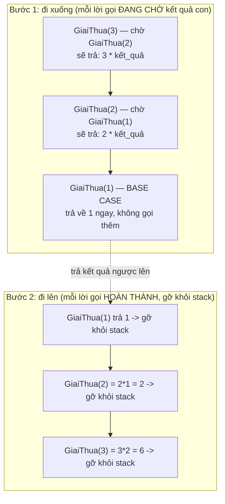

# Recursion & Binary Search

!!! info "bạn đang ở đây · p10 → node `p10-recursion`"
    **Cần trước:** vòng lặp `for`/`while`, mảng, và các thuật toán sắp xếp cơ bản (node `p10-sort`) — Binary Search chỉ chạy đúng trên dữ liệu **đã sắp xếp**, vì vậy phải hiểu sắp xếp trước.
    **Mở khoá:** chia-để-trị (divide and conquer) cho Merge Sort/Quick Sort, cây (tree) và duyệt cây bằng đệ quy, backtracking, quy hoạch động (dynamic programming).
    ⏱️ Fast path ~60 phút · Deep dive +60 phút.

> **Mục tiêu (đo được):** Sau chương này bạn (1) **định nghĩa** được đệ quy, base case, recursive case, và **giải thích bằng lời** cơ chế call stack khi một hàm đệ quy chạy; (2) **dự đoán và tái tạo lại** lỗi `StackOverflowException` khi thiếu base case, chỉ ra chính xác dòng code gây lỗi; (3) **tự viết** Binary Search cả hai phiên bản (đệ quy và lặp) và **tính đúng** độ phức tạp O(log n); (4) **phân biệt** khi nào Binary Search cho kết quả sai âm thầm (dữ liệu chưa sắp xếp) và khi nào nó không áp dụng được; (5) **so sánh** Binary Search với Linear Search bằng Big-O, và **chọn đúng** giữa đệ quy với vòng lặp cho một bài toán cụ thể.

---

## 0. Đoán nhanh trước khi học (60 giây)

Đọc đoạn code sau và **tự đoán** điều gì xảy ra trước khi mở đáp án.

```csharp title="Đoán kết quả"
// test:skip minh hoạ lỗi cố ý (StackOverflowException không bắt được bằng try/catch, không chạy an toàn ở test:run)
static int DemNguoc(int n)
{
    Console.WriteLine(n);
    return DemNguoc(n - 1);   // gọi lại chính nó, KHÔNG có điều kiện dừng
}

DemNguoc(3);
```

??? note "Đáp án — mở SAU khi đã đoán"
    Chương trình in ra `3, 2, 1, 0, -1, -2, ...` **liên tục không dừng**, rồi sau một khoảng rất ngắn (vài chục nghìn đến vài trăm nghìn lần gọi, tuỳ hệ thống) ném **`StackOverflowException`** và **crash toàn bộ process** — kể cả khi bạn bọc `try/catch` bên ngoài, exception này **không bắt được** trong .NET vì call stack đã cạn sạch bộ nhớ trước khi runtime có thể xử lý gọn gàng. Nguyên nhân: hàm `DemNguoc` **tự gọi lại chính nó** (đệ quy) nhưng **không có điều kiện nào để dừng** (không có base case). Mục 1–3 sẽ giải thích chính xác cơ chế đứng sau lỗi này.

---

## 1. Đệ quy (Recursion) là gì

**Định nghĩa:** đệ quy là kỹ thuật viết một hàm **tự gọi lại chính nó** để giải quyết một bài toán nhỏ hơn, và **phải có** một điều kiện dừng (base case) để hàm không gọi lại vô hạn.

### 1.1 Ví dụ tối thiểu: tính giai thừa

Giai thừa của `n` (`n!`) định nghĩa bằng lời: `n! = n × (n-1) × (n-2) × ... × 1`, và `0! = 1`. Đây là định nghĩa **tự nhiên mang tính đệ quy**: `n! = n × (n-1)!`.

```csharp title="Giai thừa bằng đệ quy"
// test:run
static long GiaiThua(int n)
{
    if (n <= 1) return 1;          // base case: dừng tại đây, không gọi lại nữa
    return n * GiaiThua(n - 1);    // recursive case: gọi lại chính mình với bài toán NHỎ HƠN
}

Console.WriteLine(GiaiThua(0));    // 1
Console.WriteLine(GiaiThua(1));    // 1
Console.WriteLine(GiaiThua(5));    // 120  (5*4*3*2*1)
```

Chạy `GiaiThua(5)` theo từng bước: `5 * GiaiThua(4)` → `5 * (4 * GiaiThua(3))` → ... → cuối cùng `GiaiThua(1)` trả về `1` ngay không gọi thêm, rồi các lời gọi "quay lại" nhân dần: `1 → 2*1=2 → 3*2=6 → 4*6=24 → 5*24=120`.

### 1.2 Độ phức tạp của `GiaiThua`

`GiaiThua(n)` gọi đệ quy đúng `n` lần trước khi chạm base case, mỗi lần chỉ làm một phép nhân — độ phức tạp thời gian là **O(n)**, độ phức tạp không gian (bộ nhớ call stack) cũng là **O(n)** vì có `n` lời gọi đang "treo" chờ kết quả cùng lúc (xem mục 3).

### 1.3 Điều gì xảy ra nếu QUÊN base case

Nếu bỏ dòng `if (n <= 1) return 1;`, hàm sẽ gọi `GiaiThua(n-1)` mãi mãi: `n`, `n-1`, `n-2`, ... không bao giờ dừng — đây chính xác là lỗi ở mục 0. Mỗi lời gọi hàm chiếm một **khung ngăn xếp (stack frame)** trong bộ nhớ; call stack có kích thước **hữu hạn** (mặc định khoảng 1 MB mỗi luồng trong .NET), nên sau đủ nhiều lời gọi chưa-hoàn-thành, bộ nhớ dành cho stack cạn sạch và runtime ném **`StackOverflowException`** — một lỗi **không thể bắt bằng try/catch** và làm crash toàn bộ tiến trình, vì bản thân cơ chế xử lý exception cũng cần dùng stack.

!!! danger "Quên base case = lỗi nghiêm trọng nhất của đệ quy"
    Không giống hầu hết exception khác, `StackOverflowException` **không catch được** trong .NET (từ .NET Framework 2.0 trở đi, theo thiết kế). Nó luôn crash process. Vì vậy **base case không phải là chi tiết tuỳ chọn** — thiếu nó là lỗi logic nghiêm trọng, không phải lỗi "để sau sửa".

### 1.4 Quan sát thứ tự các lời gọi bằng in ra màn hình

Để "nhìn thấy" đệ quy hoạt động (không chỉ tưởng tượng), thêm dòng in **trước** và **sau** lời gọi đệ quy — dòng in trước cho thấy thứ tự **đi xuống**, dòng in sau cho thấy thứ tự **quay lên** (mục 3 sẽ giải thích chính xác vì sao thứ tự này lại như vậy).

```csharp title="In ra để quan sát thứ tự đi xuống/quay lên"
// test:run
static long GiaiThuaCoIn(int n, int doSau = 0)
{
    string thutRoLe = new string(' ', doSau * 2);
    Console.WriteLine($"{thutRoLe}-> Gọi GiaiThuaCoIn({n})");   // in TRƯỚC khi gọi đệ quy con

    long ketQua;
    if (n <= 1)
    {
        ketQua = 1;                                             // base case: không gọi thêm
    }
    else
    {
        ketQua = n * GiaiThuaCoIn(n - 1, doSau + 1);             // recursive case
    }

    Console.WriteLine($"{thutRoLe}<- Trả về {ketQua} từ GiaiThuaCoIn({n})");   // in SAU khi có kết quả
    return ketQua;
}

GiaiThuaCoIn(3);
```

```text title="Kết quả: đi xuống hết rồi mới quay lên"
-> Gọi GiaiThuaCoIn(3)
  -> Gọi GiaiThuaCoIn(2)
    -> Gọi GiaiThuaCoIn(1)
    <- Trả về 1 từ GiaiThuaCoIn(1)
  <- Trả về 2 từ GiaiThuaCoIn(2)
<- Trả về 6 từ GiaiThuaCoIn(3)
```

Quan sát: chương trình **đi xuống hoàn toàn** (gọi `GiaiThuaCoIn(3)` → `(2)` → `(1)`) trước khi bắt đầu **quay lên** (trả `1` → tính `2*1=2` → tính `3*2=6`). Đây chính xác là hành vi của call stack (mục 3): mỗi lời gọi phải **chờ** lời gọi con hoàn toàn xong mới tính tiếp được kết quả của mình.

### 1.5 Khi đệ quy tính lại cùng một việc nhiều lần — Fibonacci ngây thơ

Không phải đệ quy nào cũng "rẻ" như `GiaiThua`. Dãy Fibonacci định nghĩa bằng lời: `F(0)=0`, `F(1)=1`, và `F(n) = F(n-1) + F(n-2)` với `n >= 2`. Định nghĩa này đệ quy tự nhiên — nhưng cài đặt "ngây thơ" (naive) theo đúng định nghĩa sẽ **tính lại** rất nhiều giá trị trùng nhau.

```csharp title="Fibonacci đệ quy ngây thơ: ĐÚNG nhưng CHẬM"
// test:run
static long FibNgayTho(int n)
{
    if (n <= 1) return n;                              // base case: F(0)=0, F(1)=1
    return FibNgayTho(n - 1) + FibNgayTho(n - 2);       // recursive case: gọi đệ quy HAI lần
}

Console.WriteLine(FibNgayTho(0));    // 0
Console.WriteLine(FibNgayTho(1));    // 1
Console.WriteLine(FibNgayTho(10));   // 55
```

Đếm số lần gọi hàm để thấy mức độ lãng phí:

```csharp title="Đếm số lần gọi thực tế của Fibonacci ngây thơ"
// test:run
int soLanGoi = 0;

long FibDemLanGoi(int n)
{
    soLanGoi++;
    if (n <= 1) return n;
    return FibDemLanGoi(n - 1) + FibDemLanGoi(n - 2);
}

Console.WriteLine(FibDemLanGoi(10));   // 55
Console.WriteLine($"Số lần gọi hàm: {soLanGoi}");   // 177 lần gọi CHỈ để tính F(10)
```

**Vì sao lãng phí:** `FibNgayTho(n)` gọi `FibNgayTho(n-1)` **và** `FibNgayTho(n-2)` — mỗi lời gọi lại tự tách thành hai lời gọi con, tạo ra một "cây gọi hàm" phình ra theo cấp lũy thừa. Ví dụ `FibNgayTho(5)` gọi `FibNgayTho(3)` hai lần độc lập (một lần từ nhánh `FibNgayTho(4)`, một lần trực tiếp), mỗi lần đó lại tính lại toàn bộ từ đầu — không có gì được "nhớ" giữa các nhánh.

| n | Số lần gọi hàm (đúng, đếm được bằng đoạn code trên) | Big-O |
|---|---|---|
| 10 | 177 | — |
| 20 | 21.891 | — |
| 30 | 2.692.537 | — |

Độ phức tạp thời gian của `FibNgayTho(n)` là **O(2ⁿ)** (chính xác hơn là O(φⁿ) với φ ≈ 1,618, nhưng vẫn tăng theo cấp lũy thừa) — vì mỗi lời gọi (trừ base case) sinh ra **hai** lời gọi con, số lời gọi tăng gấp đôi (gần đúng) mỗi khi `n` tăng 1.

!!! note "Đây chính là lý do quy hoạch động (dynamic programming) tồn tại"
    Bài toán Fibonacci có **overlapping subproblems** (bài toán con lặp lại — `F(3)` bị tính lại nhiều lần) và **optimal substructure** (kết quả của `F(n)` xây trực tiếp từ kết quả của `F(n-1)`, `F(n-2)`, không cần thử lại các lựa chọn khác) — đủ cả hai điều kiện, nên **có thể** dùng kỹ thuật ghi nhớ (memoization: lưu lại kết quả đã tính, tránh tính lại) để đưa về O(n). Chương quy hoạch động (sau chương này) sẽ đi sâu vào kỹ thuật này — ở đây chỉ cần nhận ra: **không phải đệ quy nào viết đúng cũng nhanh**, và bài toán con lặp lại là dấu hiệu cần tối ưu.

---

## 2. Base case vs Recursive case

**Định nghĩa base case:** là điều kiện (hoặc các điều kiện) mà khi gặp, hàm **trả về giá trị trực tiếp**, không gọi lại chính nó — đây là "đáy" chặn đệ quy dừng lại.

**Định nghĩa recursive case:** là phần hàm **gọi lại chính nó** với một bài toán **nhỏ hơn** (gần base case hơn), rồi dùng kết quả đó để tính ra kết quả của bài toán hiện tại.

Tách rõ hai phần này trong chính hàm `GiaiThua` ở trên:

```csharp title="Tách bạch base case và recursive case"
// test:run
static long GiaiThua(int n)
{
    // ---- BASE CASE ----
    if (n <= 1) return 1;

    // ---- RECURSIVE CASE ----
    return n * GiaiThua(n - 1);   // n-1 luôn NHỎ HƠN n -> tiến gần base case hơn mỗi lần gọi
}

Console.WriteLine(GiaiThua(6));   // 720
```

Hai điều kiện **bắt buộc** để đệ quy đúng:

1. **Phải có base case** (một hoặc nhiều điều kiện dừng) — nếu không, đệ quy vô hạn (mục 1.3).
2. **Mỗi recursive case phải tiến gần base case hơn** — ở đây `n - 1` luôn nhỏ hơn `n`, nên cuối cùng chắc chắn chạm `n <= 1`. Nếu viết nhầm `GiaiThua(n)` (gọi lại với cùng `n`, không giảm), đây cũng là đệ quy vô hạn dù có base case.

```csharp title="Sai: recursive case không tiến gần base case"
// test:skip minh hoạ lỗi cố ý -> StackOverflowException, không chạy an toàn ở test:run
static long GiaiThuaSai(int n)
{
    if (n <= 1) return 1;         // có base case, nhưng...
    return n * GiaiThuaSai(n);    // gọi lại với CÙNG n -> n không bao giờ giảm -> vô hạn
}
```

!!! note "Big-O của bản thân đệ quy phụ thuộc bài toán"
    Đệ quy không có một Big-O cố định — nó **kế thừa** độ phức tạp từ cách bài toán được chia nhỏ. `GiaiThua` chia bài toán kích thước `n` thành 1 bài toán kích thước `n-1` mỗi lần → O(n). Ở mục 4, Binary Search chia bài toán kích thước `n` thành 1 bài toán kích thước `n/2` mỗi lần → O(log n). Cách chia quyết định tốc độ tăng.

---

## 3. Call stack hoạt động thế nào với đệ quy

**Định nghĩa call stack:** là vùng nhớ mà runtime dùng để lưu, theo kiểu ngăn xếp (LIFO — vào sau ra trước), thông tin của **mỗi lời gọi hàm chưa hoàn thành** (tham số, biến cục bộ, vị trí cần quay lại) — gọi là một **stack frame**.

Khi `GiaiThua(3)` chạy, mỗi lời gọi đệ quy **chưa hoàn thành** (vì còn đang chờ `GiaiThua(n-1)` trả về để nhân) phải được "giữ lại" trên stack. Sơ đồ dưới thể hiện các frame chồng lên nhau khi gọi `GiaiThua(3)` (tên tiếng Anh quen thuộc là `Factorial(3)` — cùng một hàm), rồi lần lượt được gỡ xuống khi mỗi lời gọi hoàn thành:



Đọc sơ đồ theo hai chiều: **đi xuống** (mỗi lời gọi mới được "đẩy" — push — lên đỉnh stack, phía dưới vẫn đang chờ), rồi **đi lên** (khi chạm base case, kết quả được trả về cho frame ngay dưới nó, frame đó hoàn thành và bị "gỡ" — pop — khỏi stack, cứ thế lan ngược lên đỉnh ban đầu).

**Vì sao đệ quy sâu quá gây `StackOverflowException`:** mỗi frame chiếm một lượng bộ nhớ cố định (vài chục đến vài trăm byte tuỳ hàm). Call stack của một luồng có kích thước **giới hạn cứng** (không tự phình như heap). Nếu số lời gọi *chưa hoàn thành* xếp chồng lên nhau vượt quá giới hạn đó — như `DemNguoc` ở mục 0 không bao giờ hoàn thành để được gỡ xuống — bộ nhớ stack cạn sạch và runtime ném lỗi không thể bắt được.

!!! danger "So sánh với vòng lặp: vì sao loop không bị overflow"
    Một vòng lặp `for`/`while` chỉ dùng **một** stack frame duy nhất cho toàn bộ vòng lặp (biến đếm được cập nhật tại chỗ, không có lời gọi hàm mới nào được xếp thêm lên stack mỗi vòng). Đây là lý do `for (int i = 0; i < 10_000_000; i++)` chạy bình thường, còn đệ quy 10 triệu tầng gần như chắc chắn overflow trước khi chạm base case.

### 3.1 Đo trực tiếp số frame đang có trên stack

Có thể **quan sát trực tiếp** số stack frame đang tồn tại tại một thời điểm bằng `System.Diagnostics.StackTrace` — mỗi lần đệ quy sâu thêm 1 tầng, số frame đo được cũng tăng thêm 1, khớp đúng với sơ đồ ở mục 3:

```csharp title="Đo số stack frame tại từng tầng đệ quy (an toàn, không gây overflow)"
// test:run
using System.Diagnostics;

static void DoDoSau(int conLai)
{
    int soFrameHienTai = new StackTrace().FrameCount;
    Console.WriteLine($"conLai={conLai}: đang có {soFrameHienTai} frame trên stack (kể cả frame gọi StackTrace)");

    if (conLai <= 0) return;               // base case: dừng đo
    DoDoSau(conLai - 1);                    // mỗi lần gọi thêm => stack sâu thêm đúng 1
}

DoDoSau(3);
```

```text title="Kết quả điển hình: mỗi tầng đệ quy = +1 frame"
conLai=3: đang có 3 frame trên stack (kể cả frame gọi StackTrace)
conLai=2: đang có 4 frame trên stack (kể cả frame gọi StackTrace)
conLai=1: đang có 5 frame trên stack (kể cả frame gọi StackTrace)
conLai=0: đang có 6 frame trên stack (kể cả frame gọi StackTrace)
```

Số frame tuyệt đối phụ thuộc runtime (còn tính cả các frame của `Main`/harness gọi vào), nhưng **độ tăng** thì luôn chính xác: mỗi lời gọi đệ quy `DoDoSau(conLai - 1)` **chưa hoàn thành** cộng thêm đúng **một** frame — không hơn, không kém. Đây là con số cụ thể chứng minh cho phát biểu "bộ nhớ call stack của đệ quy là O(độ sâu đệ quy)" ở mục 3, không chỉ là suy luận trên giấy.

!!! note "Vì sao số frame in ra không khớp tuyệt đối giữa các máy"
    `StackTrace().FrameCount` đếm **toàn bộ** frame hiện có trên stack của luồng hiện tại, bao gồm cả những frame **không do bạn viết** (runtime khởi động luồng, harness chạy chương trình...). Vì vậy con số tuyệt đối (`3`, `4`, `5`...) có thể khác nhau giữa máy/phiên bản .NET khác nhau — điều **không đổi** và đáng quan tâm là **độ tăng đúng bằng 1 mỗi tầng đệ quy**, đúng như dự đoán từ định nghĩa call stack.

---

## 4. Binary Search — tìm kiếm nhị phân

**Định nghĩa:** Binary Search là thuật toán tìm một phần tử trong một mảng **đã được sắp xếp**, bằng cách liên tục **so sánh với phần tử giữa** và **chỉ tiếp tục tìm trong một nửa** (nửa có thể chứa giá trị cần tìm), loại bỏ nửa còn lại.

!!! danger "CẢNH BÁO BẮT BUỘC ĐỌC: chỉ dùng được trên dữ liệu ĐÃ SẮP XẾP"
    Binary Search **giả định** mảng đã sắp xếp tăng dần (hoặc giảm dần, nếu đảo chiều so sánh). Nếu chạy trên mảng **chưa sắp xếp**, thuật toán **không ném lỗi nào cả** — nó vẫn chạy xong và trả về một kết quả, nhưng kết quả đó **có thể sai hoàn toàn** (báo "không tìm thấy" dù phần tử có tồn tại, hoặc tìm sai chỉ số). Đây là loại lỗi **nguy hiểm nhất**: chương trình không crash, không có exception, chỉ đơn giản là **sai âm thầm**. Luôn `Array.Sort()`/`.OrderBy()` trước, hoặc chắc chắn nguồn dữ liệu đã sắp xếp, trước khi gọi Binary Search.

### 4.1 Ví dụ tối thiểu — phiên bản đệ quy

```csharp title="Binary Search — đệ quy"
// test:run
static int TimNhiPhanDeQuy(int[] a, int gtri, int trai, int phai)
{
    if (trai > phai) return -1;           // BASE CASE 1: hết phạm vi tìm -> không có

    int giua = trai + (phai - trai) / 2;  // tính điểm giữa (tránh tràn số so với (trai+phai)/2)

    if (a[giua] == gtri) return giua;     // BASE CASE 2: tìm thấy ngay tại giữa

    if (a[giua] < gtri)
        return TimNhiPhanDeQuy(a, gtri, giua + 1, phai);  // RECURSIVE CASE: tìm nửa phải
    else
        return TimNhiPhanDeQuy(a, gtri, trai, giua - 1);  // RECURSIVE CASE: tìm nửa trái
}

int[] daySapXep = { 1, 3, 5, 7, 9, 11, 13, 15 };

Console.WriteLine(TimNhiPhanDeQuy(daySapXep, 7, 0, daySapXep.Length - 1));    // 3 -> a[3]=7
Console.WriteLine(TimNhiPhanDeQuy(daySapXep, 1, 0, daySapXep.Length - 1));    // 0 -> a[0]=1
Console.WriteLine(TimNhiPhanDeQuy(daySapXep, 8, 0, daySapXep.Length - 1));    // -1 -> không có
```

### 4.2 Cùng logic, viết bằng vòng lặp (iterative)

Cùng thuật toán, không dùng đệ quy — thay call stack bằng cách **tự cập nhật** `trai`/`phai` trong một `while`:

```csharp title="Binary Search — lặp (iterative)"
// test:run
static int TimNhiPhanLap(int[] a, int gtri)
{
    int trai = 0, phai = a.Length - 1;

    while (trai <= phai)                      // còn phạm vi để tìm
    {
        int giua = trai + (phai - trai) / 2;

        if (a[giua] == gtri) return giua;     // tìm thấy
        if (a[giua] < gtri) trai = giua + 1;  // thu hẹp: tìm nửa phải
        else phai = giua - 1;                 // thu hẹp: tìm nửa trái
    }

    return -1;                                // không có
}

int[] daySapXep = { 1, 3, 5, 7, 9, 11, 13, 15 };

Console.WriteLine(TimNhiPhanLap(daySapXep, 7));    // 3
Console.WriteLine(TimNhiPhanLap(daySapXep, 1));    // 0
Console.WriteLine(TimNhiPhanLap(daySapXep, 8));    // -1
```

Cả hai phiên bản cho **kết quả giống nhau tuyệt đối** trên cùng đầu vào — khác biệt duy nhất là phiên bản đệ quy dùng call stack để "nhớ" `trai`/`phai` qua từng lời gọi, còn phiên bản lặp dùng hai biến cập nhật tại chỗ.

### 4.3 Kết quả sai âm thầm khi dữ liệu chưa sắp xếp

```csharp title="Minh chứng: Binary Search SAI trên dữ liệu chưa sắp xếp"
// test:run
static int TimNhiPhanLap(int[] a, int gtri)
{
    int trai = 0, phai = a.Length - 1;
    while (trai <= phai)
    {
        int giua = trai + (phai - trai) / 2;
        if (a[giua] == gtri) return giua;
        if (a[giua] < gtri) trai = giua + 1;
        else phai = giua - 1;
    }
    return -1;
}

int[] chuaSapXep = { 5, 11, 3, 15, 1, 9, 7, 13 };   // 7 THỰC SỰ có mặt, ở chỉ số 6

int ketQua = TimNhiPhanLap(chuaSapXep, 7);
Console.WriteLine(ketQua);   // -1 -> SAI! "7" có trong mảng nhưng Binary Search báo không tìm thấy

// Kiểm chứng bằng quét tuyến tính: 7 CÓ tồn tại
Console.WriteLine(Array.IndexOf(chuaSapXep, 7));   // 6 -> có mặt, nhưng Binary Search đã "bỏ sót"
```

Không có exception, không có cảnh báo — chương trình chạy "thành công" và trả về `-1` sai. Đây chính là lý do cảnh báo ở đầu mục 4 là **bắt buộc đọc**: luôn xác nhận dữ liệu đã sắp xếp trước khi tin tưởng Binary Search.

### 4.4 Độ phức tạp Big-O của Binary Search

Mỗi lần so sánh, Binary Search **loại bỏ một nửa** không gian tìm kiếm còn lại. Bắt đầu từ `n` phần tử, sau 1 lần còn `n/2`, sau 2 lần còn `n/4`, sau `k` lần còn `n / 2^k`. Thuật toán dừng khi không gian tìm kiếm còn 1 phần tử (hoặc 0), tức khi `n / 2^k ≈ 1`, giải ra `k ≈ log₂(n)`. Vậy số lần so sánh tối đa là **O(log n)** — tăng **theo logarit** của kích thước đầu vào, không phải tuyến tính.

Ví dụ cụ thể: với `n = 1.000.000` phần tử, Linear Search có thể cần tới 1.000.000 lần so sánh (trường hợp xấu nhất), còn Binary Search chỉ cần tối đa `log₂(1.000.000) ≈ 20` lần so sánh.

| Đại lượng | Big-O | Ghi chú |
|---|---|---|
| Thời gian (worst case) | O(log n) | Mỗi bước loại bỏ một nửa không gian tìm kiếm |
| Bộ nhớ — phiên bản lặp | O(1) | Chỉ dùng 2 biến `trai`/`phai`, không tăng theo `n` |
| Bộ nhớ — phiên bản đệ quy | O(log n) | Mỗi lời gọi đệ quy thêm 1 stack frame; có tối đa log n lời gọi chồng lên nhau |

!!! note "Yêu cầu tiên quyết bị bỏ qua thường xuyên"
    Nếu dữ liệu **chưa sắp xếp** và bạn chỉ tìm **một lần**, chi phí `Array.Sort()` (O(n log n) — xem node `p10-sort`) rồi mới Binary Search (O(log n)) **đắt hơn** Linear Search một lần (O(n)) ngay lập tức. Sắp xếp trước chỉ đáng nếu bạn sẽ tìm kiếm **nhiều lần** trên cùng một mảng, để chi phí sắp xếp một lần được "khấu hao" qua nhiều lần tìm.

---

## 5. Binary Search vs Linear Search

Đã hiểu riêng từng thuật toán ở mục 4 (Binary Search) — giờ định nghĩa Linear Search rồi mới so sánh.

**Định nghĩa Linear Search:** thuật toán tìm một phần tử bằng cách **quét từng phần tử một, theo thứ tự**, từ đầu đến cuối (hoặc đến khi tìm thấy), không yêu cầu dữ liệu đã sắp xếp.

```csharp title="Linear Search: quét tuần tự, hoạt động trên MỌI thứ tự"
// test:run
static int TimTuanTu(int[] a, int gtri)
{
    for (int i = 0; i < a.Length; i++)
        if (a[i] == gtri) return i;    // quét từng phần tử, dừng ngay khi thấy
    return -1;
}

int[] chuaSapXep = { 5, 11, 3, 15, 1, 9, 7, 13 };
Console.WriteLine(TimTuanTu(chuaSapXep, 7));    // 6 -> ĐÚNG, không cần mảng đã sắp xếp
Console.WriteLine(TimTuanTu(chuaSapXep, 100));  // -1 -> không có
```

Linear Search **luôn cho kết quả đúng** dù dữ liệu sắp xếp hay không — trả giá bằng tốc độ chậm hơn trên mảng lớn đã sắp xếp.

### 5.1 Bảng so sánh (chỉ sau khi đã hiểu riêng từng thuật toán)

| | Linear Search | Binary Search |
|---|---|---|
| Yêu cầu dữ liệu | Không yêu cầu — hoạt động trên mọi thứ tự | **Bắt buộc đã sắp xếp** — sai âm thầm nếu không |
| Big-O thời gian (worst case) | O(n) | O(log n) |
| Cách hoạt động | Quét từng phần tử, tuần tự | Chia đôi không gian tìm kiếm mỗi bước |
| n = 1.000.000, worst case | tối đa 1.000.000 lần so sánh | tối đa ~20 lần so sánh |
| Khi nào chọn | Dữ liệu nhỏ, chưa sắp xếp, hoặc chỉ tìm 1 lần | Dữ liệu lớn, đã sắp xếp sẵn, hoặc tìm nhiều lần |

!!! danger "Đừng sắp xếp chỉ để Binary Search một lần"
    Như đã tính ở mục 4.4: sắp xếp (O(n log n)) rồi Binary Search một lần (O(log n)) **tốn hơn** Linear Search một lần (O(n)) trên cùng dữ liệu chưa sắp xếp. Binary Search chỉ thắng khi dữ liệu **đã sẵn sắp xếp** (ví dụ index của CSDL) hoặc bạn tìm kiếm **lặp lại nhiều lần**.

---

## 6. Khi nào đệ quy dễ đọc hơn loop, khi nào loop hiệu quả hơn

**Đệ quy thắng** khi bài toán tự nhiên mang tính **chia-để-trị (divide and conquer)** — chia thành các bài toán con **giống về cấu trúc** nhưng nhỏ hơn, rồi ghép kết quả. Ví dụ điển hình: Merge Sort (node `p10-sort`) chia mảng làm hai nửa, sắp xếp từng nửa (đệ quy), rồi trộn — viết bằng đệ quy ngắn và phản ánh đúng ý tưởng thuật toán; viết bằng loop thuần cho cùng logic phức tạp hơn nhiều (phải tự quản lý một cấu trúc dữ liệu ngăn xếp để giả lập call stack).

```csharp title="Chia-để-trị tự nhiên: đếm số phần tử của mảng lồng nhau (jagged) bằng đệ quy"
// test:run
static int DemTongPhanTu(int[][] mang)
{
    int tong = 0;
    foreach (var hang in mang) tong += hang.Length;
    return tong;
}

// Trường hợp tổng quát hơn: cây thư mục lồng nhau tuỳ độ sâu -> đệ quy tự nhiên hơn loop
static int DemFile(ThuMuc tm)
{
    int dem = tm.SoFile;                       // BASE: cộng số file ngay tại thư mục này
    foreach (var con in tm.ThuMucCon)
        dem += DemFile(con);                   // RECURSIVE: cộng đệ quy từ mỗi thư mục con
    return dem;
}

Console.WriteLine(DemTongPhanTu(new[] { new[] { 1, 2 }, new[] { 3 } }));   // 3

var goc = new ThuMuc { SoFile = 2, ThuMucCon = new List<ThuMuc>
{
    new ThuMuc { SoFile = 3, ThuMucCon = new List<ThuMuc>() },
    new ThuMuc { SoFile = 1, ThuMucCon = new List<ThuMuc>
    {
        new ThuMuc { SoFile = 4, ThuMucCon = new List<ThuMuc>() }
    } }
} };
Console.WriteLine(DemFile(goc));   // 2 + 3 + 1 + 4 = 10

class ThuMuc
{
    public int SoFile { get; set; }
    public List<ThuMuc> ThuMucCon { get; set; } = new();
}
```

Viết `DemFile` bằng loop thuần đòi hỏi tự dựng một `Stack<ThuMuc>` để giả lập việc "nhớ vị trí đang ở đâu trong cây" — đúng chức năng nhưng dài và khó đọc hơn. Đây là bản loop tương đương, để thấy rõ sự khác biệt về độ phức tạp **đọc code** (không phải Big-O — cả hai đều O(số node) về thời gian):

```csharp title="Cùng DemFile, viết lại bằng loop + Stack<T> tự quản lý"
// test:run
static int DemFileLap(ThuMuc goc)
{
    int tong = 0;
    var ngan = new Stack<ThuMuc>();   // TỰ tạo ngăn xếp để giả lập call stack
    ngan.Push(goc);

    while (ngan.Count > 0)
    {
        var hienTai = ngan.Pop();
        tong += hienTai.SoFile;
        foreach (var con in hienTai.ThuMucCon)
            ngan.Push(con);           // tự "nhớ" các thư mục con chưa xử lý, thay cho stack frame
    }

    return tong;
}

var goc2 = new ThuMuc { SoFile = 2, ThuMucCon = new List<ThuMuc>
{
    new ThuMuc { SoFile = 3, ThuMucCon = new List<ThuMuc>() },
    new ThuMuc { SoFile = 1, ThuMucCon = new List<ThuMuc>
    {
        new ThuMuc { SoFile = 4, ThuMucCon = new List<ThuMuc>() }
    } }
} };
Console.WriteLine(DemFileLap(goc2));   // 10 — giống kết quả bản đệ quy

class ThuMuc
{
    public int SoFile { get; set; }
    public List<ThuMuc> ThuMucCon { get; set; } = new();
}
```

Hai bản cho **kết quả giống nhau tuyệt đối**, cùng độ phức tạp thời gian O(số node) — khác biệt là bản loop phải **tự** quản lý một `Stack<ThuMuc>` tường minh để nhớ "còn thư mục con nào chưa xử lý", còn bản đệ quy được **runtime tự làm việc đó thay** thông qua call stack (mục 3). Đây chính là minh chứng cụ thể cho phát biểu "loop thuần cho cùng logic phức tạp hơn" ở trên.

**Loop thắng** khi bài toán **tuyến tính, không có cấu trúc con lồng nhau**, và hiệu năng/bộ nhớ quan trọng — vì mỗi lời gọi đệ quy tốn thêm một stack frame (chi phí bộ nhớ và một lượng nhỏ thời gian cho việc gọi hàm), còn loop chỉ dùng biến đếm tại chỗ. Binary Search (mục 4) là ví dụ: cả hai phiên bản cùng O(log n) thời gian, nhưng bản đệ quy tốn thêm O(log n) bộ nhớ stack còn bản lặp chỉ O(1). Với `n` cực lớn hoặc code chạy trong vòng lặp nóng (hot path), phiên bản lặp thường được ưu tiên trong production.

| Tiêu chí | Chọn đệ quy | Chọn loop |
|---|---|---|
| Cấu trúc bài toán | Tự nhiên chia nhỏ thành bài toán con giống cấu trúc (cây, chia-để-trị) | Tuyến tính, không lồng nhau |
| Độ sâu tối đa dự kiến | Nhỏ, có giới hạn rõ (vài trăm–vài nghìn) | Có thể rất lớn (hàng triệu) |
| Ưu tiên | Đọc hiểu, phản ánh đúng định nghĩa bài toán | Hiệu năng, tránh overhead stack frame |
| Rủi ro | `StackOverflowException` nếu độ sâu vượt giới hạn stack | Phải tự quản lý trạng thái (biến đếm, ngăn xếp thủ công) nếu bài toán vốn đệ quy |

---

## Cạm bẫy & thực chiến

1. **Quên base case hoặc base case không bao giờ đạt tới.** Cả hai đều dẫn tới đệ quy vô hạn và `StackOverflowException` — lỗi **không catch được**. Luôn viết base case **trước tiên**, rồi mới viết recursive case, và tự hỏi: "đối số truyền vào lần gọi tiếp theo có chắc chắn tiến gần hơn tới base case không?"

2. **Chạy Binary Search trên dữ liệu chưa sắp xếp.** Không có exception, không có cảnh báo — chỉ có kết quả **sai âm thầm** (mục 4.3). Đây là lỗi nguy hiểm hơn crash, vì code "chạy được" và dễ lọt qua review nếu test không phủ đúng trường hợp.

3. **Tính điểm giữa bằng `(trai + phai) / 2` với mảng cực lớn.** Với `int`, nếu `trai + phai` vượt `int.MaxValue` (khoảng 2,1 tỷ), phép cộng **tràn số (overflow)** trước khi chia, cho ra chỉ số sai hoặc âm. Dùng `trai + (phai - trai) / 2` như trong mục 4.1–4.2 để tránh tràn số — hiệu `phai - trai` luôn nhỏ hơn `phai` nên an toàn hơn.

4. **Sắp xếp dữ liệu chỉ để Binary Search đúng một lần.** Chi phí sắp xếp O(n log n) đắt hơn Linear Search một lần O(n) — chỉ đáng khi tìm kiếm nhiều lần trên cùng dữ liệu (mục 4.4, mục 5.1).

5. **Dùng đệ quy cho bài toán có độ sâu không kiểm soát được (ví dụ đệ quy theo số dòng của file người dùng tải lên).** Nếu độ sâu đệ quy phụ thuộc dữ liệu đầu vào không kiểm soát, kẻ tấn công (hoặc dữ liệu lớn bất ngờ) có thể ép chương trình `StackOverflowException` và crash toàn bộ service — một dạng từ-chối-dịch-vụ (denial of service). Với dữ liệu không tin cậy về kích thước, cân nhắc chuyển sang loop hoặc giới hạn độ sâu tối đa rõ ràng.

6. **Nhầm base case "tìm thấy" với base case "hết phạm vi".** Binary Search có **hai** base case (mục 4.1): tìm thấy tại giữa, và hết phạm vi (`trai > phai`). Quên base case thứ hai (hết phạm vi khi không tìm thấy) cũng dẫn tới đệ quy vô hạn dù thuật toán "đúng ý tưởng".

7. **Viết đệ quy kiểu Fibonacci ngây thơ (mỗi lời gọi tách thành nhiều lời gọi con trùng lặp) mà không nhận ra bài toán con lặp lại.** Kết quả vẫn **đúng**, nhưng thời gian chạy tăng theo cấp lũy thừa O(2ⁿ) — với `n` chỉ khoảng 40–45 đã đủ chạy hàng chục giây đến vài phút. Dấu hiệu nhận biết: hàm đệ quy gọi lại chính nó **nhiều hơn một lần** trong recursive case, và các lời gọi đó có thể trùng đối số ở các nhánh khác nhau (mục 1.5). Cách sửa: ghi nhớ (memoization) hoặc chuyển hẳn sang tính từ dưới lên bằng vòng lặp (bottom-up).

8. **So sánh bằng `==` hai chỉ số `giua` tính từ hai công thức khác nhau mà tưởng luôn giống nhau.** `(trai + phai) / 2` và `trai + (phai - trai) / 2` cho **cùng kết quả** khi không tràn số, nhưng có thể lệch nhau khi `trai + phai` tràn `int` (mục cạm bẫy 3) — đừng giả định hai công thức luôn tương đương tuyệt đối trên mọi khoảng giá trị.

---

## Bài tập

### Bài 1 (giàn giáo) — Tổng các số từ 1 đến n bằng đệ quy

Viết hàm đệ quy `TongDenN(n)` tính `1 + 2 + ... + n` (không dùng vòng lặp, không dùng công thức Gauss).

```csharp title="bai1_giandao.cs"
// test:skip giàn giáo cho học viên tự điền
static int TongDenN(int n)
{
    // TODO: base case — khi nào dừng?
    // TODO: recursive case — TongDenN(n) = n + TongDenN(?)
}

Console.WriteLine(TongDenN(5));   // Kỳ vọng: 15
Console.WriteLine(TongDenN(1));   // Kỳ vọng: 1
```

??? success "Lời giải"
    ```csharp title="bai1_loigiai.cs"
    // test:run
    static int TongDenN(int n)
    {
        if (n <= 0) return 0;              // base case: không còn số nào để cộng
        return n + TongDenN(n - 1);         // recursive case: n + tổng của (n-1) số còn lại
    }

    Console.WriteLine(TongDenN(5));   // 15  (5+4+3+2+1)
    Console.WriteLine(TongDenN(1));   // 1
    Console.WriteLine(TongDenN(0));   // 0
    ```

### Bài 2 (thực chiến) — Binary Search trả về vị trí chèn khi không tìm thấy

Nhiều tình huống thực tế (ví dụ chèn phần tử mới vào đúng vị trí trong mảng đã sắp xếp) cần biết **vị trí nên chèn vào** khi không tìm thấy giá trị, thay vì chỉ trả `-1`. Viết `TimHoacViTriChen(a, gtri)` trả về chỉ số của `gtri` nếu có, hoặc chỉ số **nơi nó sẽ nằm** nếu được chèn vào để mảng vẫn sắp xếp (mô phỏng ý tưởng của `Array.BinarySearch`, vốn trả số âm mã hoá vị trí chèn khi không tìm thấy).

```csharp title="bai2_giandao.cs"
// test:skip giàn giáo cho học viên tự điền
static int TimHoacViTriChen(int[] a, int gtri)
{
    int trai = 0, phai = a.Length - 1;
    // TODO: vòng lặp Binary Search chuẩn
    // TODO: khi vòng lặp kết thúc mà chưa return (không tìm thấy),
    //       "trai" chính là vị trí nên chèn -> return trai
}

int[] a = { 1, 3, 5, 7, 9 };
Console.WriteLine(TimHoacViTriChen(a, 5));   // Kỳ vọng: 2 (tìm thấy tại chỉ số 2)
Console.WriteLine(TimHoacViTriChen(a, 6));   // Kỳ vọng: 3 (chèn giữa 5 và 7, tức trước chỉ số 3)
Console.WriteLine(TimHoacViTriChen(a, 0));   // Kỳ vọng: 0 (chèn trước tất cả)
Console.WriteLine(TimHoacViTriChen(a, 10));  // Kỳ vọng: 5 (chèn sau tất cả)
```

??? success "Lời giải"
    ```csharp title="bai2_loigiai.cs"
    // test:run
    static int TimHoacViTriChen(int[] a, int gtri)
    {
        int trai = 0, phai = a.Length - 1;

        while (trai <= phai)
        {
            int giua = trai + (phai - trai) / 2;
            if (a[giua] == gtri) return giua;
            if (a[giua] < gtri) trai = giua + 1;
            else phai = giua - 1;
        }

        return trai;   // khi thoát loop, "trai" đã vượt qua "phai" -> đúng là vị trí nên chèn
    }

    int[] a = { 1, 3, 5, 7, 9 };
    Console.WriteLine(TimHoacViTriChen(a, 5));    // 2
    Console.WriteLine(TimHoacViTriChen(a, 6));    // 3
    Console.WriteLine(TimHoacViTriChen(a, 0));    // 0
    Console.WriteLine(TimHoacViTriChen(a, 10));   // 5
    ```
    **Vì sao `trai` là đúng vị trí chèn:** vòng lặp thu hẹp `[trai, phai]` cho đến khi rỗng (`trai > phai`). Tại thời điểm đó, mọi phần tử ở chỉ số `< trai` đều nhỏ hơn `gtri`, và mọi phần tử ở chỉ số `>= trai` (nếu còn) đều lớn hơn `gtri` — đúng vị trí để chèn mà vẫn giữ mảng sắp xếp.

### Bài 3 (thực chiến) — Sửa Fibonacci ngây thơ bằng ghi nhớ (memoization)

Ở mục 1.5, `FibNgayTho` đúng nhưng tốn O(2ⁿ) vì tính lại `F(k)` nhiều lần. Viết `FibNho(n, cache)` — cùng logic đệ quy, nhưng **tra `cache` trước khi tính**, và **lưu vào `cache` sau khi tính** — để mỗi giá trị `F(k)` chỉ tính đúng **một lần**.

```csharp title="bai3_giandao.cs"
// test:skip giàn giáo cho học viên tự điền
static long FibNho(int n, Dictionary<int, long> cache)
{
    if (n <= 1) return n;                    // base case, giống FibNgayTho
    // TODO: nếu cache đã có F(n) -> trả ngay, KHÔNG gọi đệ quy nữa
    // TODO: nếu chưa có -> tính bằng đệ quy (FibNho(n-1,...) + FibNho(n-2,...)),
    //       LƯU kết quả vào cache trước khi return
}

var cache = new Dictionary<int, long>();
Console.WriteLine(FibNho(10, cache));   // Kỳ vọng: 55
Console.WriteLine(FibNho(30, cache));   // Kỳ vọng: 832040 — chạy NHANH, không như FibNgayTho(30)
```

??? success "Lời giải"
    ```csharp title="bai3_loigiai.cs"
    // test:run
    static long FibNho(int n, Dictionary<int, long> cache)
    {
        if (n <= 1) return n;                         // base case
        if (cache.TryGetValue(n, out long daCo)) return daCo;   // đã tính rồi -> trả ngay, KHÔNG đệ quy lại

        long ketQua = FibNho(n - 1, cache) + FibNho(n - 2, cache);   // chỉ tính khi chưa có
        cache[n] = ketQua;                             // lưu lại cho lần sau
        return ketQua;
    }

    var cache = new Dictionary<int, long>();
    Console.WriteLine(FibNho(10, cache));   // 55
    Console.WriteLine(FibNho(30, cache));   // 832040
    ```
    **Vì sao nhanh hơn:** mỗi giá trị `F(k)` (với `k` từ `0` đến `n`) chỉ được **tính thật** đúng một lần — lần thứ hai trở đi tra `cache` là O(1) thay vì đệ quy lại toàn bộ nhánh con. Tổng công việc trở thành O(n) thay vì O(2ⁿ) — đây chính là **memoization**, kỹ thuật nền tảng của quy hoạch động (dynamic programming), áp dụng được vì bài toán có cả hai điều kiện: **optimal substructure** (`F(n)` xây trực tiếp từ `F(n-1)`, `F(n-2)`) và **overlapping subproblems** (`F(k)` bị cần lại nhiều lần từ các nhánh khác nhau).

---

## Tự kiểm tra

Trả lời rồi mở đáp án.

1. Vì sao mọi hàm đệ quy đúng đều bắt buộc phải có base case?

    ??? note "Đáp án"
        Vì không có base case, hàm sẽ tự gọi lại chính nó **vô hạn lần** — mỗi lần gọi thêm một stack frame vào call stack cho đến khi bộ nhớ stack (giới hạn cứng, không tự phình) cạn sạch, ném `StackOverflowException` — một lỗi không thể bắt bằng try/catch, làm crash toàn bộ process.

2. `StackOverflowException` có bắt được bằng `try/catch` không? Vì sao?

    ??? note "Đáp án"
        **Không.** Từ .NET Framework 2.0 trở đi, theo thiết kế, `StackOverflowException` luôn làm crash tiến trình ngay lập tức, vì tại thời điểm lỗi xảy ra, call stack đã cạn sạch — không còn đủ bộ nhớ cho runtime thực hiện các bước xử lý exception thông thường (unwind stack, tìm catch block...).

3. Binary Search chạy trên một mảng chưa sắp xếp thì có ném exception không? Kết quả trả về đáng tin không?

    ??? note "Đáp án"
        **Không ném exception nào cả.** Thuật toán vẫn chạy xong bình thường và trả về một giá trị (chỉ số hoặc `-1`), nhưng kết quả đó **có thể sai hoàn toàn** — có thể báo "không tìm thấy" dù phần tử tồn tại, hoặc trả sai chỉ số. Đây là lỗi sai âm thầm, nguy hiểm hơn một exception vì không có gì báo động.

4. Tính gần đúng số lần so sánh tối đa mà Binary Search cần để tìm trong mảng 1 triệu phần tử. So sánh với Linear Search worst-case.

    ??? note "Đáp án"
        Binary Search: `log₂(1.000.000) ≈ 20` lần so sánh tối đa. Linear Search worst-case: tối đa **1.000.000** lần so sánh (phần tử ở cuối hoặc không tồn tại). Chênh lệch là O(log n) so với O(n) — khác biệt theo **tốc độ tăng**, không phải một hằng số cố định.

5. Vì sao phiên bản đệ quy của Binary Search tốn O(log n) bộ nhớ còn phiên bản lặp chỉ tốn O(1)?

    ??? note "Đáp án"
        Phiên bản đệ quy tạo một **stack frame mới** cho mỗi lời gọi đệ quy, và các frame này **chồng lên nhau** trên call stack cho đến khi lời gọi trong cùng hoàn thành — vì có tối đa `log n` lời gọi lồng nhau (mỗi lần chia đôi không gian tìm kiếm), bộ nhớ stack cần là O(log n). Phiên bản lặp chỉ dùng hai biến `trai`/`phai` được **cập nhật tại chỗ** trong một `while`, không tạo thêm frame nào — bộ nhớ không đổi theo `n`, tức O(1).

6. Cho một hàm đệ quy `f(n)` gọi `f(n-1)` hai lần (không phải một lần) ở mỗi bước, base case tại `n = 0`. Bộ nhớ call stack tối đa tại một thời điểm là bao nhiêu theo n? (Gợi ý: chỉ tính các lời gọi đang "treo" cùng lúc trên một nhánh, không phải tổng số lời gọi.)

    ??? note "Đáp án"
        Vẫn là **O(n)**, không phải O(2ⁿ). Dù tổng số lời gọi hàm trong toàn bộ quá trình chạy là O(2ⁿ) (rất tốn thời gian), tại **một thời điểm bất kỳ**, call stack chỉ giữ các lời gọi trên **một nhánh** đường đi từ gốc xuống lá hiện tại — độ sâu tối đa của nhánh đó là `n` (mỗi lời gọi giảm `n` đi 1 cho tới khi chạm base case tại 0). Đây là điểm phân biệt quan trọng giữa **tổng số lời gọi** (ảnh hưởng thời gian chạy) và **độ sâu stack tối đa** (ảnh hưởng bộ nhớ và rủi ro overflow).

7. Khi nào nên chuyển một hàm đệ quy sang viết lại bằng vòng lặp?

    ??? note "Đáp án"
        Khi độ sâu đệ quy có thể lớn tới mức gây `StackOverflowException` (đặc biệt nếu độ sâu phụ thuộc dữ liệu đầu vào không kiểm soát được), hoặc khi hàm chạy trong đường dẫn nóng (hot path) và chi phí tạo/gỡ stack frame liên tục ảnh hưởng đáng kể tới hiệu năng. Nếu bài toán vốn tuyến tính (không thật sự chia-để-trị), loop thường vừa an toàn hơn vừa nhanh hơn.

8. `Array.Sort()` rồi `Array.BinarySearch()` một lần trên mảng 1000 phần tử chưa sắp xếp có nhanh hơn quét tuyến tính một lần không? Vì sao?

    ??? note "Đáp án"
        **Không nhanh hơn**, thường chậm hơn. `Array.Sort()` tốn O(n log n), cộng thêm Binary Search O(log n) — tổng vẫn bị chi phối bởi O(n log n) của bước sắp xếp — trong khi Linear Search một lần chỉ tốn O(n), vốn nhỏ hơn O(n log n). Sắp xếp trước chỉ đáng khi bạn tìm kiếm **nhiều lần** trên cùng mảng, để chi phí sắp xếp một lần được khấu hao qua nhiều lượt tìm O(log n).

9. `FibNgayTho(n)` (mục 1.5) đúng logic nhưng chạy rất chậm với `n` lớn. Đúng hay sai, và vì sao?

    ??? note "Đáp án"
        **Đúng.** `FibNgayTho` không có lỗi logic — mọi kết quả nó trả về đều chính xác. Vấn đề là **hiệu năng**: mỗi lời gọi (trừ base case) tách thành hai lời gọi con, và các nhánh khác nhau **tính lại cùng giá trị `F(k)` nhiều lần** (overlapping subproblems) mà không "nhớ" gì giữa các lần — tổng số lời gọi tăng theo cấp lũy thừa O(2ⁿ). Sửa bằng ghi nhớ (memoization, Bài tập 3) để mỗi `F(k)` chỉ tính một lần, đưa về O(n).

---

??? abstract "DEEP DIVE — tail call, tối ưu đệ quy, và giới hạn thực sự của call stack"
    **Tail call optimization (TCO):** một số ngôn ngữ/runtime (ví dụ F# trên .NET, hoặc Scheme) có thể tối ưu **lời gọi đệ quy ở vị trí cuối cùng** (tail call — không còn việc gì phải làm sau khi lời gọi đệ quy trả về) bằng cách **tái sử dụng** stack frame hiện tại thay vì tạo frame mới, biến đệ quy đuôi thành tương đương một loop về mặt bộ nhớ. **C#/CLR không đảm bảo TCO** cho code thường (JIT có thể áp dụng `tail.` IL instruction trong một số trường hợp hẹp, không đáng tin cậy để dựa vào). Vì vậy trong C#, `GiaiThua` viết dạng đệ quy đuôi (`return n * GiaiThua(n-1)` — thực ra **không phải** tail call thuần vì còn phép nhân sau khi gọi) vẫn tốn O(n) bộ nhớ stack như phân tích ở mục 1.2, không được tự động chuyển thành O(1) như một số ngôn ngữ functional khác.

    **Kích thước stack thực tế:** mặc định mỗi thread trong .NET có 1 MB stack (có thể chỉnh qua `Thread` constructor với tham số `maxStackSize`, hoặc `<ThreadStackSize>` trong project — nhưng hiếm khi cần và dễ che giấu bug thật). Với hàm đệ quy đơn giản như `GiaiThua`, mỗi frame tốn khoảng vài chục byte, nên có thể đệ quy an toàn tới hàng chục nghìn tầng trước khi overflow — nhưng con số này **không nên dựa vào** làm thiết kế, vì nó thay đổi theo runtime, kiến trúc CPU, và số biến cục bộ trong hàm.

    **Binary Search tổng quát hoá:** ý tưởng "chia đôi không gian tìm kiếm dựa trên một điều kiện đơn điệu (monotonic)" vượt xa việc tìm trong mảng số — nó là nền tảng của "binary search trên đáp án" (binary search on answer), một kỹ thuật phổ biến trong thi đấu thuật toán: khi bài toán hỏi "giá trị nhỏ nhất/lớn nhất thoả mãn điều kiện X" và điều kiện X là đơn điệu theo giá trị cần tìm (nếu giá trị `v` thoả X thì mọi giá trị lớn hơn `v` cũng thoả, hoặc ngược lại), ta có thể Binary Search trên **không gian đáp án** thay vì trên một mảng có sẵn — độ phức tạp vẫn O(log(phạm vi đáp án) × chi phí kiểm tra X).

    **BCL đã có sẵn:** `Array.BinarySearch()`, `List<T>.BinarySearch()`, và `ReadOnlySpan<T>.BinarySearch()` đều cài Binary Search sẵn (yêu cầu dữ liệu đã sắp xếp — vẫn cần cảnh báo ở mục 4), trả về chỉ số nếu tìm thấy, hoặc **số âm** mã hoá vị trí chèn (bù một, `~viTriChen`) nếu không — chính là ý tưởng ở Bài tập 2, nhưng mã hoá gọn hơn để phân biệt "tìm thấy" (số không âm) với "không tìm thấy" (số âm) chỉ bằng dấu, không cần trả thêm một `bool` riêng.

    **Memoization thủ công vs cache tự động:** cách ghi nhớ ở Bài tập 3 (tự truyền `Dictionary` qua tham số) là cách **thủ công**, tường minh, dễ hiểu để học cơ chế. Trong code thực chiến, bạn có thể thấy các biến thể gọn hơn: dùng **đóng (closure)** để giữ cache mà không phải truyền qua tham số mỗi lần gọi, hoặc dùng attribute/thư viện cache (ví dụ `Microsoft.Extensions.Caching.Memory` cho cache có thời hạn, phù hợp khi kết quả có thể "cũ" theo thời gian) khi bài toán không đơn giản như Fibonacci thuần toán học. Cốt lõi vẫn giống nhau: **tra trước khi tính, lưu sau khi tính**.

    **Đo hiệu năng thật, đừng chỉ đoán:** Big-O cho biết **tốc độ tăng**, không cho biết số giây cụ thể. Muốn biết chính xác đệ quy hay loop nhanh hơn bao nhiêu **trên máy thật, với `n` thật**, cách đáng tin nhất là đo bằng benchmark (ví dụ thư viện `BenchmarkDotNet`) chứ không suy diễn từ Big-O — vì Big-O bỏ qua hằng số, và với `n` nhỏ, chi phí cố định (constant overhead) của một cách viết "phức tạp hơn về Big-O" đôi khi vẫn thắng cách viết "đơn giản hơn về Big-O" trên thực tế.

Tiếp theo -> chia để trị và quy hoạch động
