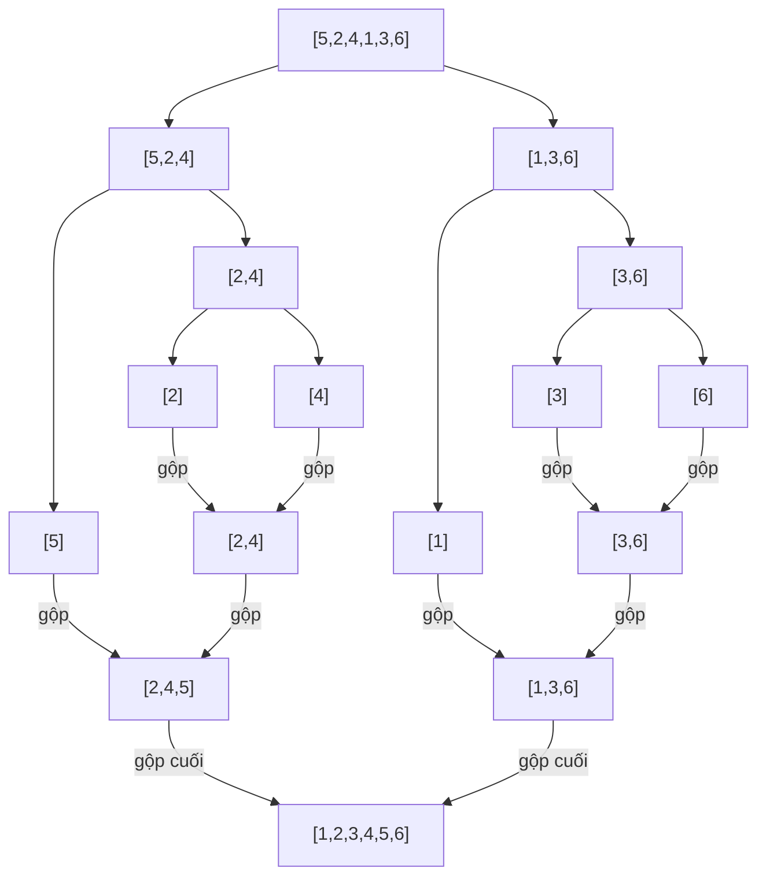

# Sorting Algorithms (So sánh các thuật toán sắp xếp)

!!! info "Bạn đang ở đây · P10 → node `p10-sort`"
    **Cần trước:** cấu trúc dữ liệu nâng cao (node, con trỏ, đệ quy, Big-O của thao tác cơ bản), mảng và chỉ số.
    **Mở khoá sau:** phân tích độ phức tạp thuật toán nâng cao, chọn thuật toán đúng khi phỏng vấn hoặc tối ưu hệ thống thực.
    ⏱️ Fast path ~75 phút.

> **Mục tiêu (đo được):** Sau chương này bạn (1) **định nghĩa và tự viết** được 5 thuật toán sắp xếp (Bubble, Selection, Insertion, Merge, Quick) từ đầu, không dùng `.Sort()` có sẵn; (2) **tính toán** đúng Big-O (thời gian và bộ nhớ phụ) cho từng thuật toán ở cả worst-case và average-case; (3) **giải thích** khái niệm "stable sort" và chỉ ra thuật toán nào giữ ổn định, thuật toán nào không; (4) **so sánh** 5 thuật toán trong một bảng duy nhất và chọn đúng thuật toán cho một tình huống dữ liệu cho trước; (5) **nhận diện** cạm bẫy worst-case của Quick Sort khi chọn pivot sai.

---

## 0. Đoán nhanh trước khi học (30 giây)

Đọc đoạn mô tả sau và **tự đoán** trước khi mở đáp án.

```text title="Câu hỏi dự đoán"
Bạn có mảng đã "gần như sắp xếp xong" — chỉ có 2 phần tử bị lệch vị trí trong 1 triệu
phần tử. Giữa Insertion Sort và Merge Sort, thuật toán nào chạy NHANH HƠN trên
mảng này trong thực tế?
```

??? note "Đáp án — mở SAU khi đã đoán"
    **Insertion Sort nhanh hơn** trên dữ liệu gần như đã sắp xếp, dù Big-O worst-case của nó (O(n²)) tệ hơn Merge Sort (O(n log n)). Lý do: Insertion Sort chỉ cần dịch chuyển các phần tử bị lệch — với dữ liệu gần như đã sắp, số lần so sánh gần **O(n)**, không phải O(n²). Merge Sort luôn chia-để-trị toàn bộ mảng bất kể dữ liệu đã sắp hay chưa, nên vẫn tốn đúng O(n log n). Đây là ví dụ kinh điển: **Big-O mô tả worst-case/average-case, không phải "luôn luôn nhanh hơn trong mọi tình huống thực tế"**. Mục 6 sẽ tổng kết đầy đủ.

---

## 1. Vấn đề gốc: vì sao phải tự cài đặt khi đã có `.Sort()`?

Trong code sản xuất thật, bạn **hầu như luôn dùng `Array.Sort()` hoặc `List<T>.Sort()`** có sẵn của BCL — chúng đã được tối ưu kỹ (thường là biến thể lai giữa Quick Sort, Insertion Sort và Heap Sort), nhanh hơn bất kỳ bản tự viết nào của bạn. Chương này **không** dạy bạn thay thế `.Sort()`. Mục tiêu là **mở nắp máy**, hiểu cơ chế bên trong — kiến thức này quyết định bạn có trả lời được câu hỏi phỏng vấn "tại sao Merge Sort cần thêm bộ nhớ mà Quick Sort không cần" hay không, và giúp bạn đoán được hiệu năng khi dữ liệu đầu vào có đặc điểm bất thường (gần như đã sắp, nhiều phần tử trùng, v.v.).

Quy ước dùng xuyên suốt chương: mọi thuật toán sắp xếp **tăng dần** (ascending) trên `int[]`, và ta đếm **số phép so sánh/đổi chỗ** làm đơn vị đo, không đo bằng đồng hồ (vì thời gian tuyệt đối phụ thuộc máy).

---

## 2. Bubble Sort — đổi chỗ hai phần tử liền kề

**Định nghĩa:** Bubble Sort là thuật toán sắp xếp bằng cách **so sánh từng cặp phần tử liền kề**; nếu cặp đó **sai thứ tự** (trái > phải khi sắp tăng dần) thì **đổi chỗ** chúng, và **lặp lại toàn bộ quá trình nhiều lần** trên mảng cho đến khi không còn cặp nào sai thứ tự.

Tên gọi "bubble" (bong bóng) vì sau mỗi lượt duyệt, phần tử lớn nhất còn lại sẽ "nổi" dần về cuối mảng, giống bong bóng khí nổi lên mặt nước.

```csharp title="Bubble Sort: tự viết từ đầu"
// test:run
int[] a = { 5, 2, 4, 1, 3 };
BubbleSort(a);
Console.WriteLine(string.Join(",", a));   // 1,2,3,4,5

static void BubbleSort(int[] arr)
{
    int n = arr.Length;
    for (int luot = 0; luot < n - 1; luot++)
    {
        bool coDoiCho = false;
        for (int i = 0; i < n - 1 - luot; i++)   // phần cuối đã "nổi" đúng chỗ -> không cần xét lại
        {
            if (arr[i] > arr[i + 1])
            {
                (arr[i], arr[i + 1]) = (arr[i + 1], arr[i]);   // đổi chỗ 2 phần tử liền kề
                coDoiCho = true;
            }
        }
        if (!coDoiCho) break;   // không đổi chỗ nào trong lượt này -> đã sắp xong, dừng sớm
    }
}
```

**Độ phức tạp:**

- **Thời gian worst-case (mảng ngược hoàn toàn):** O(n²) — vòng ngoài chạy n-1 lượt, mỗi lượt vòng trong so sánh gần n phần tử → tổng số phép so sánh xấp xỉ n²/2.
- **Thời gian best-case (mảng đã sắp sẵn):** O(n) — nhờ cờ `coDoiCho`, nếu lượt đầu không đổi chỗ nào thì dừng ngay sau 1 lượt duyệt n phần tử.
- **Bộ nhớ phụ:** O(1) — chỉ cần vài biến tạm để đổi chỗ, không cấp thêm mảng.

Bubble Sort là thuật toán **dễ hiểu nhất** để nhập môn, nhưng cũng **chậm nhất** trong 5 thuật toán của chương này ở worst-case — trong thực tế gần như không ai dùng ngoài mục đích giáo dục.

### 2.1 Vết chạy từng bước (trace) trên mảng cụ thể

Để chắc chắn bạn hiểu **cơ chế**, không chỉ đọc code, hãy theo dõi từng lượt duyệt của Bubble Sort trên mảng `{5, 2, 4, 1, 3}`:

| Lượt | Trạng thái mảng trước lượt | So sánh & đổi chỗ trong lượt | Trạng thái sau lượt |
|---|---|---|---|
| 1 | 5,2,4,1,3 | (5,2)→đổi; (5,4)→đổi; (5,1)→đổi; (5,3)→đổi | 2,4,1,3,**5** |
| 2 | 2,4,1,3,5 | (2,4)→giữ; (4,1)→đổi; (4,3)→đổi; (5 đã đúng chỗ, bỏ qua) | 2,1,3,**4,5** |
| 3 | 2,1,3,4,5 | (2,1)→đổi; (2,3)→giữ; (phần đuôi đã đúng, bỏ qua) | 1,2,**3,4,5** |
| 4 | 1,2,3,4,5 | (1,2)→giữ; không có đổi chỗ nào → `coDoiCho = false` | dừng sớm |

Quan sát quan trọng: sau lượt 1, phần tử lớn nhất (5) đã "nổi" đúng về cuối; sau lượt 2, phần tử lớn thứ hai (4) đúng chỗ. Đây là lý do vòng trong ở lượt sau có thể **rút ngắn phạm vi** (`n - 1 - luot`) — phần cuối đã chắc chắn đúng, không cần so sánh lại.

```csharp title="Bubble Sort: in ra từng lượt để quan sát trực quan"
// test:run
int[] a = { 5, 2, 4, 1, 3 };
BubbleSortInTung(a);

static void BubbleSortInTung(int[] arr)
{
    int n = arr.Length;
    for (int luot = 0; luot < n - 1; luot++)
    {
        bool coDoiCho = false;
        for (int i = 0; i < n - 1 - luot; i++)
        {
            if (arr[i] > arr[i + 1])
            {
                (arr[i], arr[i + 1]) = (arr[i + 1], arr[i]);
                coDoiCho = true;
            }
        }
        Console.WriteLine($"Sau lượt {luot + 1}: {string.Join(",", arr)}");
        if (!coDoiCho) { Console.WriteLine("Không đổi chỗ nào -> dừng sớm"); break; }
    }
}
```

```text title="Output kỳ vọng"
Sau lượt 1: 2,4,1,3,5
Sau lượt 2: 2,1,3,4,5
Sau lượt 3: 1,2,3,4,5
Sau lượt 4: 1,2,3,4,5
Không đổi chỗ nào -> dừng sớm
```

### 2.2 Tính chính xác số phép so sánh worst-case

Với mảng `n` phần tử, không có tối ưu dừng sớm, số phép so sánh ở **mỗi lượt** giảm dần: lượt 1 có `n-1` phép so sánh, lượt 2 có `n-2`, ..., lượt cuối có `1` phép. Tổng:

```text title="Tính tổng số phép so sánh worst-case"
(n-1) + (n-2) + ... + 1 = n(n-1)/2
```

Với n = 5: 4+3+2+1 = 10 phép so sánh — khớp với `n(n-1)/2 = 5×4/2 = 10`. Đây chính là gốc của O(n²): khi bỏ hằng số và thành phần bậc thấp, `n(n-1)/2 = (n² - n)/2` có bậc cao nhất là n² → viết gọn là **O(n²)**.

---

## 3. Selection Sort — chọn phần tử nhỏ nhất, đặt đúng vị trí

**Định nghĩa:** Selection Sort là thuật toán sắp xếp bằng cách, tại mỗi bước, **tìm phần tử nhỏ nhất trong phần chưa sắp** của mảng, rồi **đổi chỗ** nó với phần tử đầu tiên của phần chưa sắp đó — lặp lại cho đến khi phần chưa sắp chỉ còn 1 phần tử.

```csharp title="Selection Sort: tự viết từ đầu"
// test:run
int[] a = { 5, 2, 4, 1, 3 };
SelectionSort(a);
Console.WriteLine(string.Join(",", a));   // 1,2,3,4,5

static void SelectionSort(int[] arr)
{
    int n = arr.Length;
    for (int i = 0; i < n - 1; i++)
    {
        int viTriNhoNhat = i;
        for (int j = i + 1; j < n; j++)          // quét toàn bộ phần CHƯA sắp để tìm min
        {
            if (arr[j] < arr[viTriNhoNhat])
                viTriNhoNhat = j;
        }
        if (viTriNhoNhat != i)
            (arr[i], arr[viTriNhoNhat]) = (arr[viTriNhoNhat], arr[i]);   // đặt min vào đúng vị trí i
    }
}
```

**Độ phức tạp:**

- **Thời gian (mọi trường hợp — best, average, worst đều giống nhau):** O(n²). Vòng ngoài chạy n-1 lần, mỗi lần vòng trong **luôn phải quét hết** phần chưa sắp để tìm min (không có cách dừng sớm như Bubble Sort), tổng số phép so sánh cố định ≈ n²/2 **bất kể dữ liệu đầu vào đã sắp sẵn hay chưa**.
- **Bộ nhớ phụ:** O(1).

Điểm khác biệt so với Bubble Sort: Selection Sort **luôn đúng n²/2 phép so sánh** dù dữ liệu đã sắp sẵn (không có đường tắt), nhưng **số lần đổi chỗ tối đa chỉ O(n)** (mỗi vòng ngoài đổi chỗ đúng 1 lần) — trong khi Bubble Sort có thể đổi chỗ tới O(n²) lần. Vì vậy Selection Sort đôi khi được chọn khi **phép đổi chỗ (write) đắt hơn phép so sánh (read)** rất nhiều, ví dụ ghi vào flash memory.

### 3.1 Vết chạy từng bước trên mảng cụ thể

Theo dõi Selection Sort trên `{5, 2, 4, 1, 3}`:

| Bước i | Phần chưa sắp xét | Tìm min | Đổi chỗ | Mảng sau bước |
|---|---|---|---|---|
| i=0 | [5,2,4,1,3] | min=1 tại chỉ số 3 | đổi arr[0]↔arr[3] | **1**,2,4,5,3 |
| i=1 | [2,4,5,3] (từ chỉ số 1) | min=2 tại chỉ số 1 | không đổi (đã đúng) | 1,**2**,4,5,3 |
| i=2 | [4,5,3] (từ chỉ số 2) | min=3 tại chỉ số 4 | đổi arr[2]↔arr[4] | 1,2,**3**,5,4 |
| i=3 | [5,4] (từ chỉ số 3) | min=4 tại chỉ số 4 | đổi arr[3]↔arr[4] | 1,2,3,**4**,5 |

Sau bước i=3 (n-2 = 3, với n=5), mảng đã sắp xong — không cần bước cuối vì chỉ còn 1 phần tử.

```csharp title="Selection Sort: in ra từng bước để quan sát trực quan"
// test:run
int[] a = { 5, 2, 4, 1, 3 };
SelectionSortInTung(a);

static void SelectionSortInTung(int[] arr)
{
    int n = arr.Length;
    for (int i = 0; i < n - 1; i++)
    {
        int viTriNhoNhat = i;
        for (int j = i + 1; j < n; j++)
            if (arr[j] < arr[viTriNhoNhat]) viTriNhoNhat = j;

        if (viTriNhoNhat != i)
            (arr[i], arr[viTriNhoNhat]) = (arr[viTriNhoNhat], arr[i]);

        Console.WriteLine($"Sau bước i={i}: {string.Join(",", arr)}");
    }
}
```

```text title="Output kỳ vọng"
Sau bước i=0: 1,2,4,5,3
Sau bước i=1: 1,2,4,5,3
Sau bước i=2: 1,2,3,5,4
Sau bước i=3: 1,2,3,4,5
```

### 3.2 Vì sao Selection Sort không có "đường tắt" như Bubble Sort

Bubble Sort có thể dừng sớm nhờ cờ `coDoiCho` vì nó phát hiện được "không còn gì để đổi chỗ" ngay trong lượt duyệt. Selection Sort thì **không** có tín hiệu tương tự: dù mảng đã sắp sẵn, vòng `for (int j = i + 1; j < n; j++)` vẫn phải **quét hết** phần còn lại để chắc chắn tìm đúng phần tử nhỏ nhất — không có cách nào biết "phần còn lại đã sắp sẵn" mà không quét qua nó. Đây là lý do best-case = worst-case = O(n²) cho Selection Sort, khác với Bubble Sort và Insertion Sort có best-case O(n).

---

## 4. Insertion Sort — chèn từng phần tử vào đúng vị trí

**Định nghĩa:** Insertion Sort là thuật toán sắp xếp bằng cách xây dần một **phần đã sắp** ở đầu mảng: tại mỗi bước, lấy phần tử tiếp theo trong phần chưa sắp và **chèn nó vào đúng vị trí** trong phần đã sắp (dịch các phần tử lớn hơn sang phải để nhường chỗ).

Cách hình dung: giống cách bạn xếp bài trên tay — cầm từng lá bài mới rút, tìm đúng chỗ chèn vào các lá đã cầm sẵn theo thứ tự.

```csharp title="Insertion Sort: tự viết từ đầu"
// test:run
int[] a = { 5, 2, 4, 1, 3 };
InsertionSort(a);
Console.WriteLine(string.Join(",", a));   // 1,2,3,4,5

static void InsertionSort(int[] arr)
{
    for (int i = 1; i < arr.Length; i++)     // phần tử ở chỉ số 0 coi như "đã sắp" (1 phần tử)
    {
        int key = arr[i];        // phần tử cần chèn
        int j = i - 1;
        while (j >= 0 && arr[j] > key)   // dịch phải các phần tử lớn hơn key
        {
            arr[j + 1] = arr[j];
            j--;
        }
        arr[j + 1] = key;         // chèn key vào đúng chỗ trống
    }
}
```

**Độ phức tạp:**

- **Thời gian worst-case (mảng ngược hoàn toàn):** O(n²) — mỗi phần tử mới phải dịch qua toàn bộ phần đã sắp trước đó.
- **Thời gian best-case (mảng đã sắp sẵn):** O(n) — vòng `while` không chạy lần nào (mỗi `key` đã đúng chỗ ngay), vòng `for` chỉ chạy n-1 lần kiểm tra.
- **Bộ nhớ phụ:** O(1).

Đây là lý do câu đố ở mục 0 có đáp án Insertion Sort thắng trên dữ liệu gần-đã-sắp: chi phí thực tế của Insertion Sort **tỉ lệ với số cặp phần tử bị lệch thứ tự** (gọi là số "nghịch thế" — inversions), không phải luôn luôn n². Với 2 phần tử lệch trong 1 triệu phần tử, Insertion Sort gần như chạy O(n).

!!! danger "Đừng nhầm best-case với average-case"
    Insertion Sort **worst-case vẫn là O(n²)**, không "tự động nhanh" — nó chỉ nhanh khi dữ liệu đầu vào **có đặc điểm tốt** (gần đã sắp). Với dữ liệu ngẫu nhiên hoàn toàn, average-case của Insertion Sort cũng là O(n²), không khác Bubble/Selection Sort về bậc tăng trưởng.

### 4.1 Vết chạy từng bước trên mảng cụ thể

Theo dõi Insertion Sort trên `{5, 2, 4, 1, 3}` — phần tử `arr[0] = 5` coi như "đã sắp" (mảng con 1 phần tử luôn sắp xong), ta chèn dần từ `i = 1`:

| Bước i | key = arr[i] | Phần đã sắp trước khi chèn | Vị trí chèn | Mảng sau bước |
|---|---|---|---|---|
| i=1 | 2 | [5] | dịch 5 sang phải, chèn 2 ở đầu | 2,**5**,4,1,3 |
| i=2 | 4 | [2,5] | dịch 5 sang phải, chèn 4 giữa 2 và 5 | 2,4,**5**,1,3 |
| i=3 | 1 | [2,4,5] | dịch 2,4,5 sang phải, chèn 1 ở đầu | 1,2,4,**5**,3 |
| i=4 | 3 | [1,2,4,5] | dịch 4,5 sang phải, chèn 3 giữa 2 và 4 | 1,2,3,4,**5** |

```csharp title="Insertion Sort: in ra từng bước để quan sát trực quan"
// test:run
int[] a = { 5, 2, 4, 1, 3 };
InsertionSortInTung(a);

static void InsertionSortInTung(int[] arr)
{
    for (int i = 1; i < arr.Length; i++)
    {
        int key = arr[i];
        int j = i - 1;
        while (j >= 0 && arr[j] > key)
        {
            arr[j + 1] = arr[j];
            j--;
        }
        arr[j + 1] = key;
        Console.WriteLine($"Sau bước i={i} (chèn {key}): {string.Join(",", arr)}");
    }
}
```

```text title="Output kỳ vọng"
Sau bước i=1 (chèn 2): 2,5,4,1,3
Sau bước i=2 (chèn 4): 2,4,5,1,3
Sau bước i=3 (chèn 1): 1,2,4,5,3
Sau bước i=4 (chèn 3): 1,2,3,4,5
```

### 4.2 Đếm thực nghiệm: dữ liệu gần-đã-sắp vs dữ liệu ngẫu nhiên

Để chứng minh khẳng định ở mục 0 (Insertion Sort nhanh trên dữ liệu gần-đã-sắp) không chỉ là "nói miệng", đoạn code dưới đếm số phép so sánh thực tế trên 2 loại mảng có cùng kích thước:

```csharp title="Đếm số phép so sánh: gần-đã-sắp vs ngược hoàn toàn"
// test:run
int[] ganDaSap = { 1, 2, 3, 4, 6, 5, 7, 8, 9, 10 };   // chỉ 5,6 lệch chỗ
int[] nguocHoanToan = { 10, 9, 8, 7, 6, 5, 4, 3, 2, 1 };

Console.WriteLine($"Gần-đã-sắp: {DemPhepSoSanh(ganDaSap)} phép so sánh");
Console.WriteLine($"Ngược hoàn toàn: {DemPhepSoSanh(nguocHoanToan)} phép so sánh");

static int DemPhepSoSanh(int[] arr)
{
    arr = (int[])arr.Clone();
    int dem = 0;
    for (int i = 1; i < arr.Length; i++)
    {
        int key = arr[i];
        int j = i - 1;
        while (j >= 0 && arr[j] > key)
        {
            dem++;                 // đếm mỗi lần so sánh arr[j] > key
            arr[j + 1] = arr[j];
            j--;
        }
        if (j >= 0) dem++;         // phép so sánh cuối cùng (thất bại, dừng while)
        arr[j + 1] = key;
    }
    return dem;
}
```

```text title="Output kỳ vọng"
Gần-đã-sắp: 10 phép so sánh
Ngược hoàn toàn: 45 phép so sánh
```

Với cùng n = 10: mảng gần-đã-sắp chỉ tốn 10 phép so sánh — mỗi bước `i` từ 1 đến 9 chỉ tốn đúng **1 phép so sánh thất bại** (dừng `while` ngay, vì `arr[j] <= key`), trừ 2 bước xử lý cặp `5,6` bị lệch chỗ. Tổng vẫn tỉ lệ **O(n)** (một hằng số nhỏ nhân với n), không phải O(n²). Mảng ngược hoàn toàn tốn 45 = n(n-1)/2 phép so sánh — đúng công thức O(n²) worst-case, vì mỗi phần tử mới phải dịch qua **toàn bộ** phần đã sắp trước đó. Đây là bằng chứng thực nghiệm cho khẳng định ở mục 0: cùng kích thước n = 10, số phép so sánh chênh nhau 4.5 lần chỉ vì đặc điểm dữ liệu đầu vào khác nhau.

---

## 5. Merge Sort — chia đôi đệ quy, sắp từng nửa, rồi gộp

**Định nghĩa:** Merge Sort là thuật toán sắp xếp theo chiến lược **chia để trị (divide and conquer)**: **chia** mảng làm đôi, **đệ quy** sắp xếp từng nửa, rồi **gộp (merge)** hai nửa đã sắp thành một mảng sắp xếp hoàn chỉnh.

Trước khi vào code, cần một định nghĩa dùng ngay ở bước gộp: một thuật toán sắp xếp là **stable (ổn định)** nếu nó **giữ nguyên thứ tự tương đối** của các phần tử có giá trị **bằng nhau** so với thứ tự ban đầu trong mảng gốc. Ví dụ: sắp xếp danh sách nhân viên theo `Tuoi`, nếu 2 nhân viên cùng tuổi 30 mà người A đứng trước người B trong mảng gốc, thuật toán stable đảm bảo A vẫn đứng trước B sau khi sắp xong.

Bước "gộp" là trái tim của thuật toán: khi có 2 mảng con **đã sắp xếp sẵn**, gộp chúng thành 1 mảng sắp xếp chỉ cần duyệt tuyến tính một lần, so sánh phần tử đầu của mỗi mảng con.

```csharp title="Merge Sort: tự viết từ đầu (đệ quy + gộp)"
// test:run
int[] a = { 5, 2, 4, 1, 3, 6 };
int[] ketQua = MergeSort(a);
Console.WriteLine(string.Join(",", ketQua));   // 1,2,3,4,5,6

static int[] MergeSort(int[] arr)
{
    if (arr.Length <= 1) return arr;     // mảng 0 hoặc 1 phần tử -> đã "sắp xong"

    int giua = arr.Length / 2;
    int[] traiChuaSap = arr[..giua];       // nửa trái (Range operator)
    int[] phaiChuaSap = arr[giua..];       // nửa phải

    int[] trai = MergeSort(traiChuaSap);   // đệ quy sắp nửa trái
    int[] phai = MergeSort(phaiChuaSap);   // đệ quy sắp nửa phải

    return Gop(trai, phai);                // gộp 2 nửa ĐÃ SẮP thành 1 mảng sắp xếp
}

static int[] Gop(int[] trai, int[] phai)
{
    int[] ketQua = new int[trai.Length + phai.Length];   // CẦN cấp mảng mới -> không in-place
    int i = 0, j = 0, k = 0;
    while (i < trai.Length && j < phai.Length)
    {
        // "<=" (không phải "<") giữ đúng thứ tự tương đối của phần tử bằng nhau -> ổn định (stable)
        if (trai[i] <= phai[j]) ketQua[k++] = trai[i++];
        else ketQua[k++] = phai[j++];
    }
    while (i < trai.Length) ketQua[k++] = trai[i++];   // chép phần còn lại của nửa trái (nếu có)
    while (j < phai.Length) ketQua[k++] = phai[j++];   // chép phần còn lại của nửa phải (nếu có)
    return ketQua;
}
```

**Độ phức tạp:**

- **Thời gian (worst-case VÀ average-case đều giống nhau):** O(n log n). Cây đệ quy chia mảng có **log₂(n) tầng** (mỗi tầng chia đôi kích thước); mỗi tầng, tổng công việc gộp trên toàn bộ các mảng con là O(n) (duyệt tuyến tính). Tổng cộng: O(n) × O(log n) = **O(n log n)**, không phụ thuộc dữ liệu đầu vào đã sắp hay chưa — đây là điểm khác biệt lớn nhất với Quick Sort ở mục 6.
- **Bộ nhớ phụ:** O(n) — hàm `Gop` phải cấp một mảng mới có kích thước bằng tổng 2 mảng con ở **mỗi lần gộp**; Merge Sort **không in-place** (không thể sắp xếp "ngay trên" mảng gốc mà không cấp thêm bộ nhớ đáng kể).

**Merge Sort là stable** (định nghĩa ở trên) vì bước gộp dùng so sánh `<=`: khi hai phần tử bằng nhau, phần tử từ nửa trái (đến trước trong mảng gốc) luôn được chọn trước.

### 5.1 Cây đệ quy: hình dung việc chia rồi gộp



Cây có **3 tầng chia** (từ 6 phần tử → 3 → 1), khớp với log₂(6) ≈ 2.58, làm tròn lên 3. Mỗi tầng, tổng số phần tử được xử lý trong bước gộp trên toàn tầng là đúng n = 6 (dù chia thành nhiều mảng con nhỏ, tổng kích thước các mảng con ở một tầng luôn bằng n). Đó là lý do tổng công việc = (số tầng) × O(n) = O(log n) × O(n) = **O(n log n)**.

### 5.2 Đếm lời gọi đệ quy và phép so sánh trong Gop

```csharp title="Merge Sort có đếm số phép so sánh trong Gop"
// test:run
int[] a = { 5, 2, 4, 1, 3, 6, 7, 8 };
int demSoSanh = 0;
int[] ketQua = MergeSortDem(a, ref demSoSanh);
Console.WriteLine(string.Join(",", ketQua));   // 1,2,3,4,5,6,7,8
Console.WriteLine($"Tổng phép so sánh trong Gop: {demSoSanh}");

static int[] MergeSortDem(int[] arr, ref int dem)
{
    if (arr.Length <= 1) return arr;
    int giua = arr.Length / 2;
    int[] trai = MergeSortDem(arr[..giua], ref dem);
    int[] phai = MergeSortDem(arr[giua..], ref dem);
    return GopDem(trai, phai, ref dem);
}

static int[] GopDem(int[] trai, int[] phai, ref int dem)
{
    int[] ketQua = new int[trai.Length + phai.Length];
    int i = 0, j = 0, k = 0;
    while (i < trai.Length && j < phai.Length)
    {
        dem++;   // mỗi vòng lặp là 1 phép so sánh trai[i] vs phai[j]
        if (trai[i] <= phai[j]) ketQua[k++] = trai[i++];
        else ketQua[k++] = phai[j++];
    }
    while (i < trai.Length) ketQua[k++] = trai[i++];
    while (j < phai.Length) ketQua[k++] = phai[j++];
    return ketQua;
}
```

```text title="Output kỳ vọng"
1,2,3,4,5,6,7,8
Tổng phép so sánh trong Gop: 14
```

Với n = 8 phần tử, log₂(8) = 3 tầng gộp; tổng phép so sánh thực tế (14) nằm trong khoảng dự đoán theo lý thuyết n log n ≈ 8 × 3 = 24 (giới hạn trên — thực tế thường ít hơn vì một trong hai mảng con có thể "hết" trước, phần còn lại được chép thẳng không cần so sánh).

---

## 6. Quick Sort — chọn pivot, chia nhỏ hơn/lớn hơn, đệ quy

**Định nghĩa:** Quick Sort là thuật toán sắp xếp theo chiến lược chia để trị: **chọn một phần tử làm mốc (pivot)**, **phân hoạch (partition)** mảng thành 2 phần — phần **nhỏ hơn pivot** và phần **lớn hơn pivot** — rồi **đệ quy** sắp xếp từng phần; không cần bước "gộp" riêng vì sau khi 2 phần đệ quy xong, toàn mảng đã đúng thứ tự.

```csharp title="Quick Sort: tự viết từ đầu (chọn pivot = phần tử cuối)"
// test:run
int[] a = { 5, 2, 4, 1, 3, 6 };
QuickSort(a, 0, a.Length - 1);
Console.WriteLine(string.Join(",", a));   // 1,2,3,4,5,6

static void QuickSort(int[] arr, int trai, int phai)
{
    if (trai >= phai) return;    // 0 hoặc 1 phần tử -> đã sắp xong

    int viTriPivot = Partition(arr, trai, phai);
    QuickSort(arr, trai, viTriPivot - 1);   // đệ quy phần nhỏ hơn pivot
    QuickSort(arr, viTriPivot + 1, phai);   // đệ quy phần lớn hơn pivot
}

static int Partition(int[] arr, int trai, int phai)
{
    int pivot = arr[phai];        // chọn phần tử CUỐI làm pivot (cách đơn giản nhất)
    int i = trai - 1;             // biên của vùng "đã biết nhỏ hơn pivot"

    for (int j = trai; j < phai; j++)
    {
        if (arr[j] < pivot)
        {
            i++;
            (arr[i], arr[j]) = (arr[j], arr[i]);
        }
    }
    (arr[i + 1], arr[phai]) = (arr[phai], arr[i + 1]);   // đưa pivot về đúng vị trí giữa 2 vùng
    return i + 1;                                          // trả vị trí cuối cùng của pivot
}
```

**Độ phức tạp:**

- **Average-case:** O(n log n) — nếu pivot chia mảng thành 2 phần **tương đối cân bằng** ở mỗi bước, cây đệ quy có log n tầng, mỗi tầng tổng công việc partition là O(n) → O(n log n), giống Merge Sort về bậc tăng.
- **Worst-case:** O(n²) — xảy ra khi **pivot luôn là giá trị nhỏ nhất hoặc lớn nhất** của phần đang xét (ví dụ mảng đã sắp sẵn hoặc sắp ngược, và ta luôn chọn phần tử cuối làm pivot như code trên). Khi đó mỗi lần partition chỉ tách ra được 1 phần tử (pivot) và phần còn lại n-1 phần tử — cây đệ quy có **n tầng** (không phải log n), mỗi tầng tốn O(n) cho partition → tổng O(n²).
- **Bộ nhớ phụ:** O(log n) trung bình (độ sâu ngăn xếp đệ quy khi cân bằng), nhưng O(n) worst-case (ngăn xếp đệ quy sâu n tầng khi mất cân bằng). Quick Sort là **in-place** (không cần mảng phụ như Merge Sort) — đây là lý do nó thường được chọn khi bộ nhớ hạn chế.

!!! danger "Cạm bẫy: pivot cố định trên dữ liệu đã sắp"
    Code trên chọn **pivot = phần tử cuối cùng**. Nếu bạn chạy trên một mảng **đã sắp sẵn** hoặc **sắp ngược**, pivot này **luôn** là giá trị lớn nhất/nhỏ nhất của đoạn đang xét → rơi đúng vào worst-case O(n²) mô tả ở trên, dù trực giác "dữ liệu đã sắp thì sắp lại phải nhanh" nghe hợp lý. Cách giảm rủi ro thực tế: chọn pivot **ngẫu nhiên** hoặc theo kỹ thuật **median-of-three** (lấy trung vị của phần tử đầu, giữa, cuối) — cả hai cách này không xoá bỏ worst-case O(n²) về lý thuyết, nhưng làm nó **cực hiếm gặp** trong thực tế.

Quick Sort (bản partition ở trên, kiểu Lomuto) **không stable**: khi đổi chỗ các phần tử trong lúc partition, thứ tự tương đối giữa các phần tử bằng nhau có thể bị xáo trộn (ví dụ hai phần tử cùng giá trị nhưng đến từ vị trí khác nhau trong mảng gốc có thể đổi thứ tự tương đối sau khi partition).

### 6.1 Vết chạy từng bước Partition trên mảng cụ thể

Theo dõi Quick Sort trên `{5, 2, 4, 1, 3, 6}` (pivot luôn là phần tử cuối của đoạn đang xét):

| Lời gọi Partition(trái, phải) | Pivot | Kết quả sau partition | Vị trí pivot cuối |
|---|---|---|---|
| Partition(0, 5) | 6 (arr[5]) | 5,2,4,1,3,**6** | 5 |
| Partition(0, 4) | 3 (arr[4]) | 2,1,**3**,5,4 (ghép với 6 ở cuối) | 2 |
| Partition(0, 1) | 1 (arr[1]) | **1**,2 (đầu đoạn) | 0 |
| Partition(3, 4) | 4 (arr[4]) | **4**,5 (đoạn cuối) | 3 |

Sau 4 lời gọi `Partition`, mảng đầy đủ trở thành `1,2,3,4,5,6`. Mỗi dòng cho thấy: pivot luôn được đưa về **đúng vị trí cuối cùng** của nó ngay trong lần partition đó — phần bên trái vị trí pivot toàn bộ nhỏ hơn pivot, phần bên phải toàn bộ lớn hơn pivot. Đây là lý do sau khi 2 lời gọi đệ quy con hoàn tất, **không cần bước gộp** như Merge Sort.

```csharp title="Quick Sort: in ra sau mỗi lần Partition"
// test:run
int[] a = { 5, 2, 4, 1, 3, 6 };
QuickSortInTung(a, 0, a.Length - 1);
Console.WriteLine("Kết quả cuối: " + string.Join(",", a));

static void QuickSortInTung(int[] arr, int trai, int phai)
{
    if (trai >= phai) return;
    int viTriPivot = PartitionInTung(arr, trai, phai);
    QuickSortInTung(arr, trai, viTriPivot - 1);
    QuickSortInTung(arr, viTriPivot + 1, phai);
}

static int PartitionInTung(int[] arr, int trai, int phai)
{
    int pivot = arr[phai];
    int i = trai - 1;
    for (int j = trai; j < phai; j++)
    {
        if (arr[j] < pivot) { i++; (arr[i], arr[j]) = (arr[j], arr[i]); }
    }
    (arr[i + 1], arr[phai]) = (arr[phai], arr[i + 1]);
    Console.WriteLine($"Partition({trai},{phai}) pivot={pivot} -> {string.Join(",", arr)}, viTriPivot={i + 1}");
    return i + 1;
}
```

```text title="Output kỳ vọng"
Partition(0,5) pivot=6 -> 5,2,4,1,3,6, viTriPivot=5
Partition(0,4) pivot=3 -> 2,1,3,5,4,6, viTriPivot=2
Partition(0,1) pivot=1 -> 1,2,3,5,4,6, viTriPivot=0
Partition(3,4) pivot=4 -> 1,2,3,4,5,6, viTriPivot=3
Kết quả cuối: 1,2,3,4,5,6
```

### 6.2 Đo thực nghiệm worst-case bằng cách đếm phép so sánh

```csharp title="Đếm phép so sánh Quick Sort trên mảng ĐÃ SẮP SẴN (worst-case)"
// test:run
int[] daSapSan = { 1, 2, 3, 4, 5 };
int demSoSanh = 0;
QuickSortDem(daSapSan, 0, daSapSan.Length - 1, ref demSoSanh);
Console.WriteLine(string.Join(",", daSapSan));   // 1,2,3,4,5 -- vẫn đúng kết quả
Console.WriteLine($"Số phép so sánh: {demSoSanh}");   // 10 == n(n-1)/2 -- ĐÚNG worst-case O(n^2)

static void QuickSortDem(int[] arr, int trai, int phai, ref int dem)
{
    if (trai >= phai) return;
    int p = PartitionDem(arr, trai, phai, ref dem);
    QuickSortDem(arr, trai, p - 1, ref dem);
    QuickSortDem(arr, p + 1, phai, ref dem);
}

static int PartitionDem(int[] arr, int trai, int phai, ref int dem)
{
    int pivot = arr[phai];
    int i = trai - 1;
    for (int j = trai; j < phai; j++)
    {
        dem++;   // mỗi vòng lặp là 1 phép so sánh arr[j] < pivot
        if (arr[j] < pivot) { i++; (arr[i], arr[j]) = (arr[j], arr[i]); }
    }
    (arr[i + 1], arr[phai]) = (arr[phai], arr[i + 1]);
    return i + 1;
}
```

```text title="Output kỳ vọng"
1,2,3,4,5
Số phép so sánh: 10
```

Với n = 5, `n(n-1)/2 = 5×4/2 = 10` — khớp chính xác với số phép so sánh đo được. Trên mảng **đã sắp sẵn**, pivot (luôn là phần tử cuối của đoạn) luôn là giá trị **lớn nhất** của đoạn đang xét → mỗi lần partition chỉ tách được 1 phần tử (chính pivot) sang phần "lớn hơn" (rỗng), còn lại toàn bộ phần tử khác vẫn nằm ở phần "nhỏ hơn" → cây đệ quy có đúng **n tầng** (không phải log n tầng), và mỗi tầng partition tốn O(k) so sánh (k giảm dần từ n-1 xuống 0) → tổng vẫn là **O(n²)**, giống công thức worst-case của Bubble/Selection/Insertion Sort.

---

## 7. Bảng so sánh (chỉ sau khi đã hiểu từng thuật toán riêng)

Nhắc lại ngắn cột "Stable?" trong bảng dưới: đúng định nghĩa "stable" đã nêu ở mục 5 (giữ nguyên thứ tự tương đối của các phần tử bằng nhau so với mảng gốc).

| Thuật toán | Thời gian worst-case | Thời gian average-case | Thời gian best-case | Bộ nhớ phụ | Stable? |
|---|---|---|---|---|---|
| Bubble Sort | O(n²) | O(n²) | O(n) (đã sắp sẵn) | O(1) | Có |
| Selection Sort | O(n²) | O(n²) | O(n²) (không có đường tắt) | O(1) | Không* |
| Insertion Sort | O(n²) | O(n²) | O(n) (đã sắp sẵn) | O(1) | Có |
| Merge Sort | O(n log n) | O(n log n) | O(n log n) | O(n) | Có |
| Quick Sort | O(n²) (pivot luôn min/max) | O(n log n) | O(n log n) (đã cân bằng) | O(log n) tb, O(n) xấu nhất | Không |

*Selection Sort **về bản chất thuật toán** không stable (đổi chỗ trực tiếp có thể đưa phần tử bằng nhau vượt qua nhau — ví dụ khi đổi chỗ phần tử ở vị trí i với phần tử nhỏ nhất tìm được ở xa, một phần tử bằng giá trị pivot nằm giữa 2 vị trí đó có thể bị "nhảy qua"), nên bảng liệt kê "Không". Bản cài đặt chuẩn (đổi chỗ trực tiếp, không chèn) luôn là **không stable** — không có biến thể phổ biến nào đổi được kết luận này.

**Cách chọn nhanh:**

- Dữ liệu **nhỏ** (dưới ~20 phần tử) hoặc **gần như đã sắp**: Insertion Sort — đơn giản, chi phí thực tế thấp.
- Cần **đảm bảo O(n log n) tuyệt đối** (worst-case), có dư bộ nhớ, cần **stable**: Merge Sort — ví dụ sắp xếp bản ghi cần giữ thứ tự phụ, hoặc external sort (dữ liệu không vừa RAM).
- Cần **nhanh trung bình, ít bộ nhớ phụ**, không quan tâm stable: Quick Sort (với pivot ngẫu nhiên/median-of-three để tránh worst-case) — đây là lựa chọn phổ biến nhất cho sắp xếp trong bộ nhớ (in-memory) tổng quát, và là nền cho `Array.Sort()` của .NET với mảng đủ lớn.
- Bubble Sort / Selection Sort: **hầu như chỉ dùng để dạy/học**, hiếm khi xuất hiện trong code sản xuất.

---

## Cạm bẫy & thực chiến

- **Nhầm best-case với "luôn nhanh":** Insertion Sort O(n) chỉ đúng khi dữ liệu gần-đã-sắp; đưa dữ liệu ngẫu nhiên vào vẫn là O(n²). Đừng chọn thuật toán chỉ dựa trên best-case.
- **Quick Sort với pivot cố định trên dữ liệu đã sắp:** như mục 6 đã chỉ ra, chọn pivot = phần tử đầu/cuối trên mảng đã sắp hoặc sắp ngược luôn rơi vào O(n²). Luôn ưu tiên pivot ngẫu nhiên hoặc median-of-three trong code thực tế (hoặc dùng `.Sort()` có sẵn — BCL đã xử lý vấn đề này).
- **Quên rằng Merge Sort tốn O(n) bộ nhớ phụ:** với dữ liệu rất lớn (hàng chục triệu phần tử) mà bộ nhớ hạn chế, Merge Sort có thể gây áp lực GC nặng hơn Quick Sort in-place, dù Big-O thời gian tốt hơn về mặt lý thuyết worst-case.
- **Đánh giá "stable" sai:** stable **không liên quan đến việc sắp đúng giá trị hay không** — cả thuật toán stable và không-stable đều cho ra mảng sắp đúng thứ tự giá trị. Stable chỉ liên quan đến thứ tự tương đối của các phần tử **bằng nhau**. Chỉ quan trọng khi bạn sắp xếp theo **một phần** của bản ghi (ví dụ sắp theo `Tuoi` nhưng vẫn muốn giữ thứ tự theo `Ten` đã có từ trước).
- **So sánh Big-O bằng "cảm giác" thay vì tính toán:** O(n log n) và O(n²) chỉ khác biệt rõ khi n lớn. Với n = 10, n² = 100 và n log n ≈ 33 — khác biệt không nhiều; với n = 1.000.000, n² = 10¹² nhưng n log n ≈ 2×10⁷ — khác biệt là 5 chục nghìn lần. Đừng tối ưu sớm (premature optimization) thuật toán sắp xếp cho mảng vài chục phần tử.

## Bài tập

**Bài 1 — Đếm số lần đổi chỗ:** Sửa `BubbleSort` ở mục 2 để trả về (thay vì `void`) tổng số lần đổi chỗ đã thực hiện. Chạy thử trên mảng `{ 5, 4, 3, 2, 1 }` (ngược hoàn toàn, 5 phần tử) — số lần đổi chỗ mong đợi phải khớp với công thức n×(n-1)/2 = 10.

??? success "Lời giải bài 1"
    ```csharp title="Bubble Sort có đếm số lần đổi chỗ"
    // test:run
    int[] a = { 5, 4, 3, 2, 1 };
    int soLan = BubbleSortDemDoiCho(a);
    Console.WriteLine(string.Join(",", a));   // 1,2,3,4,5
    Console.WriteLine(soLan);                 // 10  ==  5*4/2

    static int BubbleSortDemDoiCho(int[] arr)
    {
        int n = arr.Length;
        int dem = 0;
        for (int luot = 0; luot < n - 1; luot++)
        {
            for (int i = 0; i < n - 1 - luot; i++)
            {
                if (arr[i] > arr[i + 1])
                {
                    (arr[i], arr[i + 1]) = (arr[i + 1], arr[i]);
                    dem++;
                }
            }
        }
        return dem;
    }
    ```
    Với mảng ngược hoàn toàn, **mọi cặp** trong n phần tử đều sai thứ tự, nên tổng số lần đổi chỗ đúng bằng số cặp = n×(n-1)/2 = 5×4/2 = 10 — khớp với công thức O(n²) ở mục 2.

**Bài 2 — Kiểm tra tính stable bằng thực nghiệm:** Viết một kiểu `(int Khoa, char Nhan)` (dùng tuple hoặc record), tạo mảng `{ (3,'a'), (1,'b'), (3,'c'), (2,'d'), (3,'e') }`, sắp theo `Khoa` bằng Merge Sort ở mục 5 (sửa lại để so sánh theo `Khoa`). Kiểm tra xem 3 phần tử có `Khoa == 3` (`'a'`, `'c'`, `'e'`) có giữ đúng thứ tự tương đối `a, c, e` sau khi sắp không.

??? success "Lời giải bài 2"
    ```csharp title="Kiểm tra Merge Sort giữ stable trên khoá trùng"
    // test:run
    var du = new[] { (Khoa: 3, Nhan: 'a'), (Khoa: 1, Nhan: 'b'), (Khoa: 3, Nhan: 'c'),
                      (Khoa: 2, Nhan: 'd'), (Khoa: 3, Nhan: 'e') };

    var ketQua = MergeSortTheoKhoa(du);
    foreach (var x in ketQua) Console.Write($"{x.Khoa}{x.Nhan} ");
    Console.WriteLine();
    // 1b 2d 3a 3c 3e   -- 3 phần tử Khoa=3 giữ đúng thứ tự gốc a, c, e -> stable

    static (int Khoa, char Nhan)[] MergeSortTheoKhoa((int Khoa, char Nhan)[] arr)
    {
        if (arr.Length <= 1) return arr;
        int giua = arr.Length / 2;
        var trai = MergeSortTheoKhoa(arr[..giua]);
        var phai = MergeSortTheoKhoa(arr[giua..]);
        return GopTheoKhoa(trai, phai);
    }

    static (int Khoa, char Nhan)[] GopTheoKhoa((int Khoa, char Nhan)[] trai, (int Khoa, char Nhan)[] phai)
    {
        var ketQua = new (int Khoa, char Nhan)[trai.Length + phai.Length];
        int i = 0, j = 0, k = 0;
        while (i < trai.Length && j < phai.Length)
        {
            if (trai[i].Khoa <= phai[j].Khoa) ketQua[k++] = trai[i++];   // "<=" giữ stable
            else ketQua[k++] = phai[j++];
        }
        while (i < trai.Length) ketQua[k++] = trai[i++];
        while (j < phai.Length) ketQua[k++] = phai[j++];
        return ketQua;
    }
    ```
    Kết quả `3a 3c 3e` giữ đúng thứ tự gốc vì bước gộp dùng `<=` (không phải `<`): khi `trai[i].Khoa == phai[j].Khoa`, phần tử bên trái (xuất hiện trước trong mảng gốc, do cách chia đôi giữ nguyên thứ tự tương đối trong từng nửa) luôn được chọn trước.

## Tự kiểm tra

??? note "sorting-algorithms-q1 — Big-O worst-case của Bubble Sort, Selection Sort, Insertion Sort là gì? Vì sao đều giống nhau?"
    Cả ba đều **O(n²)** ở worst-case. Cả ba đều dùng 2 vòng lặp lồng nhau: vòng ngoài chạy khoảng n lần, vòng trong (trong trường hợp xấu nhất) cũng chạy khoảng n lần cho mỗi lần vòng ngoài — tổng số phép so sánh/thao tác tỉ lệ n×n = n².

??? note "sorting-algorithms-q2 — Vì sao Merge Sort luôn là O(n log n) ở CẢ worst-case, không như Quick Sort?"
    Vì Merge Sort **luôn chia mảng làm đôi bằng nhau tuyệt đối** (giữa = length/2), không phụ thuộc giá trị phần tử — cây đệ quy luôn có đúng log₂(n) tầng bất kể dữ liệu đầu vào là gì. Quick Sort thì chia theo **giá trị so với pivot**, nên nếu pivot chọn tệ (luôn là min/max), một bên phân hoạch có thể rỗng và cây đệ quy "lệch" thành n tầng thay vì log n tầng.

??? note "sorting-algorithms-q3 — Tại sao Merge Sort cần O(n) bộ nhớ phụ mà Quick Sort (bản chuẩn) không cần?"
    Bước gộp (`Gop`) của Merge Sort phải tạo một **mảng mới** để chứa kết quả gộp của 2 mảng con — không thể gộp "ngay trên" 2 mảng con mà không có chỗ chứa trung gian. Quick Sort thì phân hoạch bằng cách **đổi chỗ phần tử ngay trong mảng gốc** (in-place), không cần mảng phụ nào ngoài vài biến chỉ số.

??? note "sorting-algorithms-q4 — Cho mảng đã sắp xếp giảm dần {9,7,5,3,1}, dùng code QuickSort ở mục 6 (pivot = phần tử cuối). Đây có phải worst-case không? Vì sao?"
    **Có.** Pivot luôn là phần tử cuối, và trên mảng sắp giảm dần, phần tử cuối luôn là **giá trị nhỏ nhất** của đoạn đang xét. Partition sẽ tách ra đúng 1 phần tử (pivot) mỗi lần, còn lại n-1 phần tử cho đệ quy tiếp — cây đệ quy có n tầng thay vì log n tầng, dẫn tới O(n²).

??? note "sorting-algorithms-q5 — Định nghĩa 'stable sort' bằng một câu. Selection Sort (bản đổi chỗ trực tiếp) có stable không?"
    Stable là **giữ nguyên thứ tự tương đối của các phần tử có giá trị bằng nhau** so với mảng gốc sau khi sắp. Selection Sort bản đổi chỗ trực tiếp **không stable** — việc đổi chỗ phần tử nhỏ nhất tìm được với phần tử ở vị trí hiện tại có thể làm một phần tử bằng giá trị đó "nhảy qua" vị trí của phần tử khác cùng giá trị.

??? note "sorting-algorithms-q6 — Với n = 1.000, so sánh thứ tự độ lớn giữa O(n²) và O(n log n). Con số nào lớn hơn và gấp khoảng bao nhiêu lần?"
    O(n²) = 1.000² = 1.000.000. O(n log n) ≈ 1.000 × log₂(1000) ≈ 1.000 × 10 = 10.000. O(n²) lớn hơn khoảng **100 lần** so với O(n log n) tại n = 1.000 — khoảng cách càng tăng khi n càng lớn (đây chính là ý nghĩa "tốc độ tăng" của Big-O khi n tiến ra vô cùng).

??? note "sorting-algorithms-q7 — Tại sao trong code sản xuất thật, bạn nên dùng .Sort() của BCL thay vì tự viết Quick Sort/Merge Sort tay?"
    `.Sort()` của BCL đã được tối ưu kỹ ở mức thấp (thường là thuật toán lai kết hợp Quick Sort/Insertion Sort/Heap Sort tuỳ kích thước dữ liệu), xử lý sẵn các trường hợp biên (mảng rỗng, 1 phần tử, phần tử trùng nhiều), và tránh được cạm bẫy worst-case bằng cách chọn pivot thông minh hơn — bản tự viết trong chương này chỉ nhằm mục đích **hiểu cơ chế**, không nhằm thay thế hàng thư viện đã kiểm chứng.

!!! tip "Ôn cách quãng (spaced repetition)"
    Quay lại 7 câu tự kiểm tra này sau 1-2 ngày, không nhìn đáp án trước. Nếu vẫn nhớ chắc Big-O worst-case của cả 5 thuật toán mà không cần tra bảng ở mục 7, coi như đã nắm chương này.

??? abstract "DEEP DIVE (tuỳ chọn) — Tim Sort, Heap Sort và giới hạn lý thuyết của sắp xếp"
    - **Tim Sort:** thuật toán lai giữa Merge Sort và Insertion Sort, dùng làm `.Sort()` mặc định cho mảng đối tượng (không phải kiểu nguyên thuỷ) trong nhiều nền tảng (Python, Java). Ý tưởng: tận dụng các đoạn con đã-sắp-sẵn ("run") có tự nhiên trong dữ liệu thực tế, chỉ Merge Sort giữa các "run" đó thay vì chia đệ quy mù quáng — nhanh hơn Merge Sort thuần trên dữ liệu có cấu trúc, vẫn giữ O(n log n) worst-case và **stable**.
    - **Heap Sort:** dùng cấu trúc binary heap (xem `PriorityQueue` ở chương collections) để luôn lấy phần tử lớn nhất/nhỏ nhất ra trước — O(n log n) worst-case **và** O(1) bộ nhớ phụ (in-place), nhưng **không stable** và có hằng số thực tế (constant factor) kém hơn Quick Sort vì truy cập heap "nhảy" trong mảng (kém cache locality hơn Quick Sort/Merge Sort truy cập tuần tự).
    - **Giới hạn lý thuyết O(n log n):** đã được chứng minh bằng lý thuyết cây quyết định (decision tree) rằng **mọi thuật toán sắp xếp dựa trên so sánh** (comparison-based sort — so sánh từng cặp phần tử bằng `<`/`>`) không thể nhanh hơn O(n log n) ở worst-case, vì cần tối thiểu log₂(n!) ≈ n log n phép so sánh để phân biệt hết n! cách sắp xếp có thể có của n phần tử. Các thuật toán "nhanh hơn" như Counting Sort/Radix Sort (O(n) hoặc O(nk)) chỉ đạt được bằng cách **không so sánh trực tiếp** — chúng khai thác thông tin thêm về miền giá trị (ví dụ số nguyên nằm trong khoảng nhỏ), nên không áp dụng được cho dữ liệu tổng quát bất kỳ.

**Tiếp theo →** [P10 · Recursion & Binary Search](recursion-binary-search.md)
