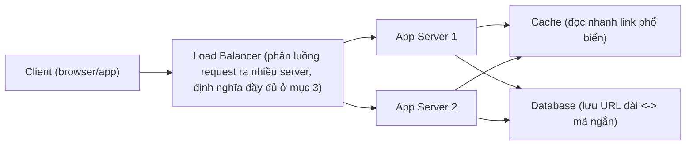
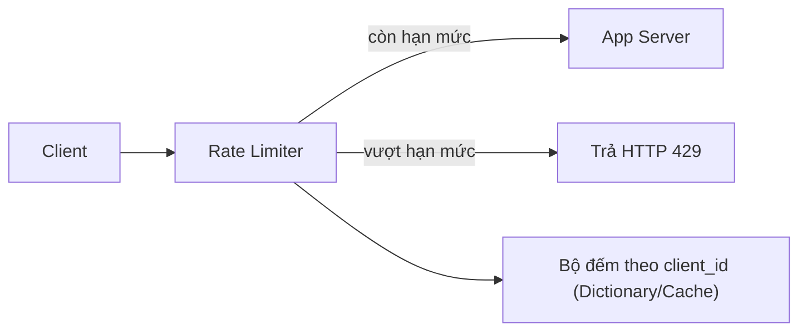

# System Design cơ bản & Behavioral Interview

!!! info "Bạn đang ở đây · P10 → node `p10-systemdesign`"
    **Cần trước:** Interview Patterns (Two Pointers & Sliding Window — chương ngay trước, node `p10-patterns`). Kiến trúc/design pattern (Singleton, Factory, Repository ở P6) là kiến thức nền hữu ích khi trả lời câu hỏi thiết kế hệ thống, nhưng không phải điều kiện bắt buộc của chương này.
    **Mở khoá:** trả lời câu hỏi "thiết kế hệ thống X" trong phỏng vấn .NET senior, và trả lời câu hỏi hành vi (behavioral) một cách có cấu trúc thay vì kể chuyện lan man.
    ⏱️ Fast path ~75 phút.

> **Mục tiêu (đo được):** Sau chương này bạn (1) **định nghĩa** được System Design interview khác gì so với coding interview thông thường; (2) **áp dụng** quy trình 4 bước để trả lời một đề bài thiết kế hệ thống, bắt đầu từ làm rõ yêu cầu; (3) **tính được** ước lượng quy mô cơ bản (request/giây, dung lượng lưu trữ) cho một hệ thống ví dụ; (4) **giải thích** đúng vai trò của Load Balancer, Database Sharding, và CDN trong một kiến trúc; (5) **viết** một câu trả lời behavioral theo đúng cấu trúc STAR; (6) **đánh giá** một dòng CV/portfolio theo tiêu chí nhà tuyển dụng .NET thực sự tìm kiếm.

---

## 0. Đoán nhanh trước khi học (60 giây)

Đọc câu hỏi phỏng vấn dưới và **tự đoán** trước khi mở đáp án: câu trả lời nào "tốt hơn" trong một buổi System Design interview?

```text title="Hai câu trả lời cho đề bài: Thiết kế một dịch vụ rút gọn URL (URL shortener)"
Câu trả lời A:
  "Em sẽ dùng ASP.NET Core Web API, SQL Server để lưu URL,
   và code hàm băm để tạo mã ngắn. Xong."

Câu trả lời B:
  "Trước khi thiết kế, em muốn hỏi vài câu: hệ thống cần phục vụ
   khoảng bao nhiêu request/giây? Tỷ lệ đọc/viết (đọc link cũ vs
   tạo link mới) khoảng bao nhiêu? Có cần link hết hạn không?
   Sau khi biết số liệu, em sẽ ước lượng quy mô rồi mới chọn
   kiến trúc và công nghệ cụ thể."
```

??? note "Đáp án — mở SAU khi đã đoán"
    **Câu trả lời B tốt hơn rõ rệt** — không phải vì B "dùng công nghệ cao siêu" (thực ra B chưa nhắc công nghệ nào cả), mà vì B thể hiện đúng **cách suy nghĩ** mà System Design interview muốn đánh giá: **làm rõ yêu cầu trước khi thiết kế**, không nhảy thẳng vào giải pháp. Câu trả lời A nhảy thẳng vào một giải pháp cụ thể (SQL Server, hàm băm) mà chưa biết hệ thống cần phục vụ quy mô nào — nếu hệ thống cần 100.000 request/giây, kiến trúc "một server, một database" trong câu A sẽ sập. Mục 1 sẽ định nghĩa rõ vì sao "cách suy nghĩ" quan trọng hơn "đáp án cụ thể" trong dạng phỏng vấn này.

---

## 1. System Design interview là gì

**Định nghĩa bằng lời:** System Design interview là một dạng phỏng vấn kỹ thuật trong đó ứng viên được giao một đề bài thiết kế **kiến trúc tổng thể** của một hệ thống quy mô lớn (ví dụ "thiết kế Twitter", "thiết kế dịch vụ rút gọn URL", "thiết kế hệ thống chat") — **không có một đáp án đúng duy nhất**, và người phỏng vấn đánh giá **cách ứng viên suy nghĩ, đặt câu hỏi, đánh đổi (trade-off) giữa các lựa chọn**, chứ không đánh giá một đoạn code cụ thể chạy đúng/sai như coding interview.

**Khác biệt cốt lõi so với coding interview** (loại phỏng vấn đã quen ở các chương trước — ví dụ "viết hàm tìm số lớn nhất", "cài BFS"):

| | Coding interview | System Design interview |
|---|---|---|
| Đầu ra mong đợi | Một đoạn code chạy đúng, có thể test bằng input/output cụ thể | Một sơ đồ kiến trúc + lời giải thích, không có "test case" đúng/sai rõ ràng |
| Có đáp án duy nhất? | Thường có (hàm đúng hoặc sai) | Không — nhiều kiến trúc khác nhau đều "hợp lý" nếu đánh đổi được giải thích rõ |
| Tiêu chí đánh giá | Độ chính xác + độ phức tạp (Big-O) của thuật toán | Cách đặt câu hỏi làm rõ yêu cầu, cách ước lượng quy mô, cách đánh đổi (trade-off), khả năng giao tiếp |
| Ví dụ đề bài | "Viết hàm kiểm tra một mảng đã sắp xếp chưa" | "Thiết kế một dịch vụ rút gọn URL phục vụ 100 triệu người dùng" |

**Điểm cốt lõi:** vì không có đáp án đúng duy nhất, thứ bị đánh giá thấp nhất trong buổi phỏng vấn này là ứng viên **im lặng nghĩ rồi đưa ra một kiến trúc hoàn chỉnh** mà không giải thích lý do. Ngược lại, ứng viên **nói ra quá trình suy nghĩ** (dù kiến trúc cuối cùng chưa hoàn hảo) thường được đánh giá cao hơn.

---

## 2. Quy trình trả lời 4 bước

Để không "đứng hình" khi nhận đề bài mở như "thiết kế hệ thống X", hãy đi theo quy trình 4 bước cố định dưới đây — áp dụng cho **mọi** đề System Design, không riêng ví dụ URL shortener trong chương này.

### 2.1 Bước 1 — Làm rõ yêu cầu và giới hạn quy mô

**Định nghĩa bằng lời:** đây là bước **hỏi lại** người phỏng vấn để thu hẹp một đề bài mơ hồ ("thiết kế Twitter") thành một tập yêu cầu cụ thể, đo được, trước khi vẽ bất kỳ kiến trúc nào.

Các câu hỏi cần hỏi cho ví dụ **URL shortener** (dịch vụ nhận một URL dài, trả về một URL ngắn — khi người dùng truy cập URL ngắn, hệ thống chuyển hướng (redirect) về URL dài gốc):

- "Hệ thống cần phục vụ khoảng **bao nhiêu người dùng**, và **bao nhiêu request/giây**?"
- "Tỷ lệ **đọc/viết** (số lần người dùng bấm vào link ngắn để redirect, so với số lần tạo link ngắn mới) khoảng bao nhiêu? (Thường đọc nhiều hơn viết rất nhiều lần.)"
- "Link ngắn có cần **hết hạn** sau một thời gian không?"
- "Có cần theo dõi **số liệu thống kê** (bao nhiêu lượt click) không?"

!!! danger "Sai lầm phổ biến nhất: bỏ qua bước 1, nhảy thẳng vào vẽ kiến trúc"
    Nếu bỏ qua bước làm rõ yêu cầu, ứng viên có thể thiết kế một kiến trúc rất phức tạp (nhiều server, nhiều cache) cho một hệ thống thực ra chỉ cần phục vụ 100 người dùng nội bộ — hoặc ngược lại, thiết kế một kiến trúc "một server, một database" cho hệ thống cần phục vụ hàng triệu người dùng. Cả hai đều là dấu hiệu ứng viên **không đặt câu hỏi trước khi thiết kế** — đây là lỗi bị trừ điểm nặng nhất trong loại phỏng vấn này.

### 2.2 Bước 2 — Ước lượng quy mô (back-of-envelope)

**Định nghĩa bằng lời:** back-of-envelope estimation ("tính nhanh trên mặt sau tờ giấy") là kỹ thuật **tính nhanh, gần đúng** (không cần chính xác tuyệt đối) các số liệu quy mô — như số request/giây, dung lượng lưu trữ cần — để biết hệ thống đang thiết kế thuộc "cỡ nào" (chục request/giây hay chục nghìn request/giây thay đổi hoàn toàn lựa chọn kiến trúc).

Ví dụ tính cho URL shortener, với giả định thu được từ bước 1: **100 triệu link mới được tạo mỗi tháng**, tỷ lệ đọc/viết là **100:1** (100 lượt click cho mỗi 1 lần tạo link).

```text title="Ước lượng quy mô URL shortener — tính tay, không cần công cụ"
Số link mới / tháng     = 100.000.000
Số giây trong 1 tháng   ~ 30 * 24 * 3600 = 2.592.000 giây

Request VIẾT (tạo link mới) mỗi giây:
  100.000.000 / 2.592.000 ~ 39 request/giây (viết)

Request ĐỌC (redirect) mỗi giây, với tỷ lệ đọc/viết = 100:1:
  39 * 100 = 3.900 request/giây (đọc)

Dung lượng lưu trữ, giả định mỗi bản ghi (URL dài + mã ngắn + metadata) ~ 500 byte,
lưu trong 5 năm:
  100.000.000 link/tháng * 12 tháng * 5 năm = 6.000.000.000 bản ghi
  6.000.000.000 * 500 byte ~ 3.000.000.000.000 byte = 3 TB
```

**Điểm cốt lõi:** với 3.900 request đọc/giây, một server .NET đơn lẻ với cache tốt **hoàn toàn có thể xử lý được** — con số này chưa đến mức bắt buộc phải có kiến trúc phân tán phức tạp. Đây chính là giá trị của ước lượng quy mô: nó cho biết **mức độ phức tạp kiến trúc thực sự cần**, tránh việc thiết kế quá tay (over-engineering) hoặc quá đơn giản (under-engineering).

### 2.3 Bước 3 — Thiết kế kiến trúc tổng quan

**Định nghĩa bằng lời:** đây là bước vẽ **sơ đồ luồng dữ liệu ở mức cao** — các thành phần chính (client, server, database...) và cách chúng nối với nhau — chưa đi vào chi tiết từng thành phần.



Luồng hoạt động cơ bản:

1. **Tạo link ngắn (viết):** client gửi URL dài → qua Load Balancer → một App Server sinh mã ngắn (ví dụ băm hoặc bộ đếm) → lưu cặp (mã ngắn, URL dài) vào Database → trả mã ngắn về client.
2. **Redirect (đọc):** client truy cập URL ngắn → qua Load Balancer → App Server tra **Cache** trước (vì đọc nhiều gấp 100 lần viết, theo ước lượng ở bước 2) → nếu cache miss, tra Database → trả về HTTP redirect tới URL dài gốc.

### 2.4 Bước 4 — Đi sâu vào 1-2 phần quan trọng nhất

**Định nghĩa bằng lời:** sau khi có kiến trúc tổng quan, bước cuối là **chọn ra 1-2 thành phần** mà người phỏng vấn (hoặc chính ứng viên) thấy quan trọng/rủi ro nhất, rồi thiết kế chi tiết hơn — ví dụ "làm sao sinh mã ngắn không bị trùng khi có nhiều App Server chạy song song", hoặc "làm sao Database không trở thành điểm nghẽn khi dữ liệu lên tới 3 TB". Ba mục tiếp theo (3, 4, 5) giới thiệu các khái niệm dùng ở bước đi sâu này.

!!! danger "Hiểu lầm phổ biến: bước 4 nghĩa là 'vẽ thêm cho đẹp'"
    Bước 4 **không** phải liệt kê thêm càng nhiều công nghệ càng tốt. Mục tiêu là chọn đúng 1-2 điểm **rủi ro thật** của hệ thống (ví dụ: mã ngắn bị trùng, database quá tải) và giải quyết nó có lý luận — một ứng viên nói "em sẽ dùng thêm message queue, Redis, Kafka, Kubernetes" mà không giải thích **vấn đề cụ thể nào** mỗi công nghệ giải quyết sẽ bị đánh giá là liệt kê từ vựng, không phải thiết kế.

---

## 2.5 Ví dụ bước 4 đầy đủ: đi sâu vào "sinh mã ngắn không trùng"

Để thấy bước 4 (mục 2.4) hoạt động cụ thể, hãy đi sâu vào chính vấn đề đã nêu: **làm sao sinh mã ngắn (short code) duy nhất khi có nhiều App Server chạy song song** (theo sơ đồ mục 2.3, có `S1` và `S2` cùng nhận request tạo link).

Có ba cách tiếp cận, mỗi cách có đánh đổi khác nhau — đây chính là loại "trade-off" mà System Design interview muốn nghe ứng viên tự nêu ra và so sánh:

| Cách sinh mã ngắn | Cơ chế | Ưu điểm | Nhược điểm |
|---|---|---|---|
| Bộ đếm tăng dần (auto-increment) trong 1 database | Mỗi link mới lấy số tiếp theo, chuyển số đó sang hệ cơ số 62 (chữ+số) để ra mã ngắn | Đơn giản, không trùng tuyệt đối | Database trở thành điểm nghẽn duy nhất khi nhiều server cùng ghi — vi phạm chính lý do dùng nhiều App Server |
| Hàm băm (hash) URL dài, lấy 7 ký tự đầu | Băm nội dung URL dài bằng MD5/SHA, không cần hỏi database trước | Không cần điểm nghẽn trung tâm, các App Server tính độc lập | Hai URL khác nhau **có thể** băm ra cùng 7 ký tự (đụng độ/collision) — phải kiểm tra lại với database trước khi lưu, quay lại vấn đề cần hỏi database |
| Dải mã được cấp phát trước (pre-allocated range) | Mỗi App Server được cấp một **dải số riêng** (ví dụ `S1` dùng số 1-1.000.000, `S2` dùng số 1.000.001-2.000.000) từ một dịch vụ cấp số trung tâm, rồi tự sinh mã trong dải đó không cần hỏi lại | Không đụng độ, không cần hỏi database cho **mỗi** request — chỉ hỏi khi hết dải | Cần thêm một dịch vụ cấp số trung tâm (dù gọi ít hơn hẳn so với gọi mỗi request) |

**Điểm cốt lõi của bước 4:** không có lựa chọn nào "đúng tuyệt đối" — cách 1 đơn giản nhưng dễ nghẽn ở quy mô lớn, cách 3 giải quyết được nghẽn nhưng phức tạp hơn để vận hành. Với quy mô đã ước lượng ở mục 2.2 (39 request viết/giây), **cách 1 vẫn hoàn toàn ổn** — 39 request/giây ghi vào một database không phải điểm nghẽn thực sự. Cách 3 chỉ đáng cân nhắc nếu con số ước lượng lớn hơn nhiều (ví dụ hàng chục nghìn request viết/giây). Đây là ví dụ trực tiếp cho thấy **bước 2 (ước lượng) quyết định bước 4 (đi sâu) nên chọn phương án nào** — hai bước không tách biệt mà liên kết chặt với nhau.

---

## 3. Load Balancer — phân phối request

**Định nghĩa bằng lời:** Load Balancer (bộ cân bằng tải) là một thành phần đứng **trước** nhiều server, nhận toàn bộ request từ client và **phân phối** chúng ra nhiều server phía sau theo một quy tắc (ví dụ round-robin — chia đều tuần tự, hoặc theo tải hiện tại của từng server) — mục đích là không để một server nào bị quá tải khi các server khác còn rảnh.

Khái niệm này đã được nhắc ở chương cloud & production (P9) khi nói về scale-out (mở rộng theo chiều ngang — thêm nhiều server thay vì nâng cấp một server duy nhất); ở đây Load Balancer là **thành phần đầu tiên** xuất hiện trong hầu hết sơ đồ System Design vì nó là điều kiện tiên quyết để chạy nhiều App Server song song như ở sơ đồ mục 2.3.

**Độ phức tạp/tác động:** với `N` server phía sau, Load Balancer chia tải giúp mỗi server chỉ cần xử lý khoảng `tổng request / N` — đây là lý do hệ thống có thể tăng khả năng phục vụ (throughput) gần như tuyến tính theo số server thêm vào, miễn là database và cache phía sau không trở thành điểm nghẽn.

**Hai quy tắc phân phối phổ biến nhất** (chỉ cần biết ở mức khái niệm cho System Design cơ bản, không cần tự cài đặt Load Balancer thật):

- **Round-robin:** chia request tuần tự, lần lượt cho server 1, server 2, ..., server `N`, rồi quay lại server 1 — đơn giản, hoạt động tốt nếu mọi request có "độ nặng" xử lý tương đương nhau.
- **Least connections (ít kết nối nhất):** Load Balancer theo dõi server nào đang xử lý **ít request đồng thời nhất**, rồi gửi request mới tới đó — phù hợp hơn round-robin khi các request có độ nặng xử lý khác nhau nhiều (ví dụ một số request xử lý nhanh, một số chậm), vì round-robin có thể vô tình dồn nhiều request nặng vào cùng một server chỉ vì đến "đúng lượt".

!!! danger "Hiểu lầm: Load Balancer luôn chia đúng 1/N cho mỗi server tại MỌI thời điểm"
    Round-robin chia đều **về số lượng request theo thời gian dài**, nhưng tại một thời điểm cụ thể, một server có thể đang xử lý nhiều request nặng hơn server khác (dù nhận được số request bằng nhau) — đây là lý do các hệ thống chịu tải cao thường dùng least connections hoặc các thuật toán phức tạp hơn xét thêm chỉ số CPU/độ trễ thực tế của từng server, không chỉ đơn giản đếm số request.

---

## 4. Database Sharding — chia nhỏ dữ liệu

**Định nghĩa bằng lời:** Database sharding (phân mảnh cơ sở dữ liệu) là kỹ thuật **chia dữ liệu thành nhiều phần (shard)**, mỗi phần lưu trên một database vật lý riêng, dựa theo một **khoá phân mảnh (shard key)** — mục đích là khi một database duy nhất không còn đủ khả năng lưu trữ hoặc xử lý toàn bộ dữ liệu, ta chia dữ liệu ra nhiều database nhỏ hơn để mỗi database chỉ cần gánh một phần.

Ví dụ tối thiểu: sharding theo `user_id % N` — với `N = 4` database (`shard 0`, `shard 1`, `shard 2`, `shard 3`), một bản ghi của `user_id = 17` sẽ nằm ở `shard (17 % 4) = shard 1`; bản ghi của `user_id = 20` nằm ở `shard (20 % 4) = shard 0`.

```csharp title="Minh hoạ shard key: user_id % N chọn database nào"
// test:run
int ChonShard(int userId, int soShard)
{
    // Khoá phân mảnh (shard key) ở đây là user_id.
    // Phép chia lấy dư quyết định user_id này thuộc shard nào.
    return userId % soShard;
}

int soShard = 4;
foreach (int userId in new[] { 17, 20, 21, 100, 101 })
{
    Console.WriteLine($"user_id={userId} -> shard {ChonShard(userId, soShard)}");
}
```

```text title="Kết quả"
user_id=17 -> shard 1
user_id=20 -> shard 0
user_id=21 -> shard 1
user_id=100 -> shard 0
user_id=101 -> shard 1
```

**Vì sao cần chọn đúng shard key:** mọi truy vấn liên quan đến một `user_id` cụ thể (ví dụ "lấy toàn bộ link đã tạo của user 17") chỉ cần hỏi **đúng một shard** (`shard 1`), không cần hỏi cả 4 shard rồi gộp kết quả — vì `user_id % 4` luôn cho ra cùng một shard cho cùng một `user_id`. Nếu chọn sai shard key (ví dụ shard theo thời gian tạo link mà truy vấn thường lọc theo `user_id`), một truy vấn đơn giản có thể phải hỏi **toàn bộ** các shard rồi gộp lại — mất đi lợi ích chính của sharding.

!!! danger "Sharding không phải giải pháp đầu tiên nên nghĩ tới"
    Sharding tăng đáng kể độ phức tạp vận hành (nhiều database cần đồng bộ, backup, và join dữ liệu giữa các shard rất khó). Theo ước lượng mục 2.2, hệ thống URL shortener 3 TB dữ liệu và 3.900 request đọc/giây **thường chưa cần sharding** — một database duy nhất với cấu hình tốt và cache phía trước (mục 2.3) đủ xử lý. Sharding chỉ nên đưa ra khi đã ước lượng cụ thể (bước 2) cho thấy một database không còn đủ khả năng.

---

## 5. Cache-aside — chiến lược đọc/ghi cache phổ biến nhất

Sơ đồ mục 2.3 đã vẽ một `Cache` đứng giữa App Server và Database, nhưng chưa định nghĩa **cách** Cache và Database phối hợp khi đọc/ghi dữ liệu. Đây là câu hỏi thường bị hỏi thêm ngay sau khi vẽ sơ đồ có Cache.

**Định nghĩa bằng lời:** cache-aside (còn gọi lazy loading) là chiến lược trong đó **App Server** (không phải Cache) chịu trách nhiệm quản lý việc đọc/ghi Cache — khi đọc, App Server tra Cache trước; nếu **cache miss** (không có trong Cache), App Server tự đi hỏi Database rồi **tự ghi** kết quả vào Cache trước khi trả về; khi ghi dữ liệu mới, App Server ghi thẳng vào Database và **không** cần ghi đồng thời vào Cache (Cache sẽ tự được điền lại ở lần đọc tiếp theo).

```csharp title="Cache-aside tối giản cho tra mã ngắn -> URL dài"
// test:run
var cache = new Dictionary<string, string>();          // giả lập Cache (thực tế là Redis/Memcached)
var database = new Dictionary<string, string>          // giả lập Database
{
    ["abc123"] = "https://example.com/rat-dai-1",
    ["xyz789"] = "https://example.com/rat-dai-2",
};
int soLanHoiDatabase = 0;

string LayUrlDai(string maNgan)
{
    if (cache.TryGetValue(maNgan, out string? tuCache))
        return tuCache;                                  // cache HIT -> trả ngay, KHÔNG hỏi Database

    soLanHoiDatabase++;                                   // cache MISS -> phải hỏi Database
    string tuDatabase = database[maNgan];
    cache[maNgan] = tuDatabase;                           // TỰ ghi lại vào Cache cho lần sau
    return tuDatabase;
}

Console.WriteLine(LayUrlDai("abc123"));   // cache miss lần 1 -> hỏi Database
Console.WriteLine(LayUrlDai("abc123"));   // cache hit -> KHÔNG hỏi Database
Console.WriteLine(LayUrlDai("abc123"));   // cache hit -> KHÔNG hỏi Database
Console.WriteLine($"Số lần hỏi Database: {soLanHoiDatabase}");   // 1 — chỉ lần đầu (cache miss)
```

**Độ phức tạp/tác động:** với cache-aside, chỉ **lần đầu tiên** một `maNgan` cụ thể được tra mới cần hỏi Database (O(1) tra `Dictionary`/database index); mọi lần tra lại sau đó là cache hit O(1) mà không chạm Database — giảm tải Database tỉ lệ với **tần suất truy cập lại** một mã ngắn cụ thể. Với ước lượng mục 2.2 (đọc gấp 100 lần viết), nếu các link phổ biến được click lại nhiều lần, cache-aside có thể giảm số lượt hỏi Database xuống rất nhiều so với 3.900 request đọc/giây ban đầu.

!!! danger "Cache-aside có rủi ro dữ liệu cũ (stale) nếu dữ liệu gốc thay đổi"
    Nếu dữ liệu trong Database bị **sửa** sau khi đã được cache (ví dụ URL dài bị cập nhật), Cache vẫn giữ giá trị **cũ** cho tới khi bị xoá hoặc hết hạn (TTL — time-to-live) — người dùng có thể nhận được dữ liệu cũ trong khoảng thời gian đó. Đây là đánh đổi cố ý của cache-aside: **tốc độ đọc nhanh hơn**, đổi lại **có thể trả dữ liệu cũ trong một khoảng thời gian ngắn** — với URL shortener, URL gốc hiếm khi bị sửa sau khi tạo, nên đánh đổi này chấp nhận được; với dữ liệu thay đổi thường xuyên (ví dụ giá sản phẩm), cần đặt TTL ngắn hơn hoặc dùng chiến lược khác (write-through — ghi đồng thời vào Cache và Database, nằm ngoài phạm vi cơ bản của chương này).

---

## 6. CDN — phục vụ nội dung gần người dùng

**Định nghĩa bằng lời:** CDN (Content Delivery Network) là một mạng lưới các server đặt **gần người dùng về mặt địa lý** (ví dụ một server tại Việt Nam, một server tại Mỹ, một server tại châu Âu), dùng để lưu sẵn và phục vụ **file tĩnh** (ảnh, CSS, JavaScript, video) — người dùng tải file từ server CDN gần nhất, thay vì phải đi xa tới server gốc (origin server) ở một quốc gia khác, giúp giảm thời gian tải.

Trong hệ thống URL shortener, CDN ít liên quan trực tiếp (vì bản thân redirect là một hành động động, không phải file tĩnh), nhưng nếu hệ thống có thêm trang thống kê (dashboard) với ảnh/biểu đồ tĩnh, CDN sẽ là thành phần đứng **trước** App Server trong sơ đồ mục 2.3, phục vụ riêng phần nội dung tĩnh đó.

!!! danger "Nhầm lẫn thường gặp: CDN và Cache là một thứ"
    CDN và Cache (đã xuất hiện ở sơ đồ mục 2.3, đứng giữa App Server và Database) đều nhằm "phục vụ nhanh hơn", nhưng phục vụ **hai lớp khác nhau**. Cache ở mục 2.3 nằm **gần server, xa người dùng** — tăng tốc việc App Server đọc dữ liệu động (ví dụ tra mã ngắn) mà không phải hỏi Database mỗi lần. CDN nằm **gần người dùng, xa server** — tăng tốc việc tải file tĩnh không đổi theo từng request. Một hệ thống lớn thường dùng **cả hai**, cho hai mục đích khác nhau, không thể thay thế nhau.

---

## 7. Ví dụ tổng hợp: Rate Limiter — áp dụng đủ 4 bước cho một đề bài mới

Để luyện quy trình 4 bước (mục 2) trên một đề bài khác — không lặp lại URL shortener — hãy áp dụng đủ 4 bước cho đề: **"Thiết kế một Rate Limiter (giới hạn tốc độ) cho một API công khai."**

**Định nghĩa bài toán:** Rate Limiter là một thành phần đứng trước server, có nhiệm vụ **chặn hoặc cho qua** một request dựa trên việc client đó đã gửi **bao nhiêu request trong một khoảng thời gian** — mục đích là ngăn một client gửi quá nhiều request làm quá tải hệ thống (vô tình do lỗi code phía client, hoặc cố ý tấn công).

**Bước 1 — Làm rõ yêu cầu:** "Giới hạn theo gì — theo IP, theo API key, hay theo user đã đăng nhập?" "Giới hạn bao nhiêu request trong bao lâu (ví dụ 100 request/phút)?" "Khi vượt giới hạn, trả lỗi gì cho client (HTTP 429)?"

**Bước 2 — Ước lượng quy mô:** giả định API có 10.000 client đang hoạt động, mỗi client gọi tối đa 100 request/phút → tối đa `10.000 * 100 / 60 ~ 16.667 request/giây` cần được Rate Limiter kiểm tra — đây là con số quyết định Rate Limiter **không thể** là một vòng lặp quét toàn bộ lịch sử request cho mỗi lần kiểm tra (quá chậm ở quy mô này), mà cần một cấu trúc dữ liệu tra cứu O(1) cho mỗi client.

**Bước 3 — Kiến trúc tổng quan:**



**Bước 4 — Đi sâu: thuật toán "sliding window counter" (cửa sổ trượt đếm request)**

**Định nghĩa bằng lời:** sliding window counter là kỹ thuật đếm số request của một client trong một **khoảng thời gian trượt** (ví dụ "60 giây gần nhất tính từ hiện tại", không phải một khung giờ cố định như "phút thứ 14:00-14:01") — mỗi client giữ một danh sách **thời điểm** các request gần đây, khi có request mới thì bỏ các thời điểm đã quá cũ (ngoài cửa sổ) rồi đếm số còn lại.

```csharp title="Rate Limiter tối giản bằng sliding window counter"
// test:run
var rl = new RateLimiter(gioiHan: 3, cuaSo: TimeSpan.FromSeconds(10));
var goc = new DateTime(2026, 1, 1, 0, 0, 0);

Console.WriteLine(rl.ChoPhep("client-A", goc));                              // True  (1/3)
Console.WriteLine(rl.ChoPhep("client-A", goc.AddSeconds(2)));                 // True  (2/3)
Console.WriteLine(rl.ChoPhep("client-A", goc.AddSeconds(4)));                 // True  (3/3)
Console.WriteLine(rl.ChoPhep("client-A", goc.AddSeconds(5)));                 // False (vượt hạn mức 3 trong 10s)
Console.WriteLine(rl.ChoPhep("client-A", goc.AddSeconds(11)));                // True  (request đầu tiên đã trôi khỏi cửa sổ 10s)

class RateLimiter
{
    private readonly Dictionary<string, Queue<DateTime>> _lichSu = new();
    private readonly int _gioiHan;
    private readonly TimeSpan _cuaSo;

    public RateLimiter(int gioiHan, TimeSpan cuaSo)
    {
        _gioiHan = gioiHan;
        _cuaSo = cuaSo;
    }

    public bool ChoPhep(string clientId, DateTime baygio)
    {
        if (!_lichSu.TryGetValue(clientId, out var hangDoi))
        {
            hangDoi = new Queue<DateTime>();
            _lichSu[clientId] = hangDoi;
        }

        // Bỏ các request đã CŨ HƠN cửa sổ thời gian cho phép.
        while (hangDoi.Count > 0 && baygio - hangDoi.Peek() > _cuaSo)
            hangDoi.Dequeue();

        if (hangDoi.Count >= _gioiHan)
            return false;   // vượt hạn mức -> chặn (HTTP 429)

        hangDoi.Enqueue(baygio);
        return true;        // còn hạn mức -> cho qua
    }
}
```

**Độ phức tạp:** mỗi lần gọi `ChoPhep`, việc bỏ request cũ chạy tối đa `_gioiHan` lần (vì hàng đợi không bao giờ vượt quá `_gioiHan` phần tử được giữ lại), và `Dictionary` tra `clientId` là O(1) trung bình → tổng chi phí mỗi lần gọi là O(1) tính theo `_gioiHan` (một hằng số cố định, không phụ thuộc số client hay số request đã qua) — đủ nhanh cho quy mô 16.667 request/giây ước lượng ở bước 2.

!!! danger "Sliding window counter tốn bộ nhớ O(số client đang hoạt động), không phải O(1) tổng thể"
    Cách cài trên tốn bộ nhớ tỉ lệ với **số client khác nhau** đang được theo dõi (mỗi client một `Queue` riêng trong `Dictionary`) — với 10.000 client như ước lượng bước 2, đây vẫn nhỏ, nhưng nếu client là IP công khai (có thể lên tới hàng triệu IP khác nhau tấn công), bộ nhớ có thể phình to. Đây là lý do hệ thống thực tế thường dùng thêm cơ chế "hết hạn" (expire) để dọn các client không hoạt động nữa khỏi bộ nhớ.

---

## 8. Ví dụ tổng hợp thứ hai: Hệ thống thông báo (Notification) — đánh đổi push vs pull

Để thấy quy trình 4 bước áp dụng được cho một đề bài **có bản chất khác hẳn** URL shortener và Rate Limiter (không phải "tra cứu nhanh", mà là "gửi tin đến nhiều người"), áp dụng nhanh cho đề: **"Thiết kế một hệ thống gửi thông báo (notification) khi có bài viết mới cho những người theo dõi (follower)."**

**Bước 1 — Làm rõ yêu cầu:** "Thông báo cần hiển thị **ngay lập tức** hay có thể chậm vài giây/phút cũng được?" "Một người có thể có bao nhiêu follower — vài trăm, hay vài triệu (như một tài khoản nổi tiếng)?" "Thông báo hiển thị ở đâu — trong app, hay cả push notification ra ngoài màn hình khoá?"

**Bước 2 — Ước lượng quy mô:** giả định trung bình mỗi người có 200 follower, nhưng có một số ít tài khoản (gọi là "celebrity") có tới 10 triệu follower. Với một bài viết mới từ tài khoản celebrity, hệ thống cần tạo ra **10 triệu thông báo** — đây là con số quyết định kiến trúc, không thể xử lý đồng bộ (client phải chờ 10 triệu thông báo được tạo xong) như một request bình thường.

**Bước 3 — Kiến trúc tổng quan, dùng hàng đợi (queue) để xử lý bất đồng bộ:**


**Bước 4 — Đi sâu: đánh đổi push model vs pull model**

**Định nghĩa bằng lời:**

- **Push model (mô hình đẩy):** ngay khi có bài viết mới, hệ thống **chủ động tạo sẵn** một bản ghi thông báo cho **từng follower** (ghi vào "hộp thư" riêng của mỗi follower) — khi follower mở app, thông báo đã có sẵn, chỉ cần đọc.
- **Pull model (mô hình kéo):** hệ thống **không** tạo sẵn thông báo cho từng follower — chỉ ghi "tài khoản X vừa đăng bài mới" một lần; khi một follower mở app, app mới **chủ động hỏi** "những người tôi theo dõi có ai vừa đăng bài không" và tổng hợp tại thời điểm đó.

| | Push model | Pull model |
|---|---|---|
| Chi phí khi CÓ bài viết mới | Cao — phải tạo N bản ghi cho N follower ngay lúc đăng (với celebrity 10 triệu follower, tạo 10 triệu bản ghi) | Thấp — chỉ ghi 1 bản ghi duy nhất, bất kể có bao nhiêu follower |
| Chi phí khi follower MỞ APP | Thấp — chỉ đọc thông báo đã có sẵn, O(1) tra hộp thư riêng | Cao — phải tổng hợp bài viết mới từ TẤT CẢ người đang theo dõi, mỗi lần mở app |
| Phù hợp khi | Follower thường xuyên mở app, muốn thấy thông báo NGAY | Tài khoản có follower cực lớn (celebrity), tránh tạo hàng triệu bản ghi cho một bài viết |

**Điểm cốt lõi — vì sao hệ thống thực tế thường dùng cả hai (mô hình lai/hybrid):** với tài khoản follower ít (dưới một ngưỡng, ví dụ 10.000), dùng **push** vì chi phí tạo bản ghi thấp và follower nhận thông báo ngay. Với tài khoản celebrity (follower vượt ngưỡng), chuyển sang **pull** để tránh tạo hàng triệu bản ghi cùng lúc — follower của celebrity chấp nhận thông báo xuất hiện có thể chậm hơn một chút. Đây là ví dụ điển hình của System Design: không có mô hình "đúng tuyệt đối", mà là chọn đúng mô hình **theo từng trường hợp cụ thể**, dựa trên số liệu ước lượng ở bước 2.

!!! danger "Hàng đợi (Message Queue) không phải là Database và không phải Cache"
    Message Queue (đã xuất hiện ở sơ đồ bước 3) là thành phần **thứ tư** khác với Load Balancer, Cache, Database — dùng để **tách rời** công việc "nhận yêu cầu" (App Server trả lời ngay cho tài khoản đăng bài) khỏi công việc "xử lý yêu cầu" (Worker xử lý tạo thông báo dần dần ở phía sau, không làm tài khoản đăng bài phải chờ). Nhầm Message Queue với Database (nghĩ rằng nó chỉ để "lưu dữ liệu") bỏ lỡ vai trò cốt lõi: Queue đảm bảo thứ tự xử lý và cho phép xử lý **bất đồng bộ**, Database không có đặc tính "hàng đợi việc cần làm" này.

---

## 9. Behavioral interview và phương pháp STAR

**Định nghĩa bằng lời:** Behavioral interview (phỏng vấn hành vi) là dạng phỏng vấn hỏi về **kinh nghiệm thực tế trong quá khứ** của ứng viên (ví dụ "kể về một lần bạn gặp mâu thuẫn với đồng nghiệp", "kể về một lần bạn trễ deadline") — mục đích là dự đoán **cách ứng viên sẽ hành xử trong tương lai** dựa trên cách họ đã hành xử trong quá khứ, khác hẳn với System Design (đánh giá cách suy nghĩ kỹ thuật) hay coding interview (đánh giá kỹ năng code).

**STAR** là một khung 4 phần giúp trả lời câu hỏi behavioral có cấu trúc, tránh kể chuyện lan man không có trọng tâm:

- **Situation (Bối cảnh):** mô tả ngắn **hoàn cảnh cụ thể** — dự án nào, thời điểm nào, có bao nhiêu người liên quan.
- **Task (Nhiệm vụ):** mô tả **mục tiêu/trách nhiệm cụ thể của bạn** trong hoàn cảnh đó — không phải mục tiêu của cả nhóm nói chung.
- **Action (Hành động):** mô tả **chính xác những gì bạn đã làm** — đây là phần dài nhất và quan trọng nhất, phải là hành động của **bạn**, không phải "chúng tôi đã...".
- **Result (Kết quả):** mô tả **kết quả đo được** — số liệu cụ thể nếu có (ví dụ "giảm thời gian build từ 20 phút xuống 5 phút"), và bài học rút ra.

```text title="Ví dụ câu trả lời mẫu theo đúng 4 phần STAR"
Câu hỏi: "Kể về một lần bạn phải xử lý một deadline gấp."

S (Situation): "Ở dự án trước, 3 ngày trước khi release, team phát hiện
   một lỗi nghiêm trọng trong module thanh toán khiến đơn hàng bị tính
   tiền sai trong một số trường hợp hiếm."

T (Task): "Tôi được giao trách nhiệm tìm nguyên nhân gốc và sửa lỗi
   trước hạn release, vì tôi là người viết module đó."

A (Action): "Tôi viết lại test case để tái hiện đúng điều kiện gây lỗi,
   phát hiện nguyên nhân là một điều kiện làm tròn số sai ở bước tính
   thuế. Tôi sửa lỗi, viết thêm 5 unit test bao phủ đúng trường hợp
   biên đó, và báo cho team lead để review gấp trong ngày."

R (Result): "Lỗi được sửa và release đúng hạn, không phát sinh thêm
   lỗi tương tự sau 6 tháng theo dõi. Từ đó tôi đề xuất thêm bước
   review test coverage cho mọi module liên quan đến tính tiền."
```

**Điểm cốt lõi:** phần **Action** phải là hành động của chính ứng viên (chủ ngữ "tôi"), không phải kể lại thành tích chung của cả team (chủ ngữ "chúng tôi") — người phỏng vấn muốn đánh giá **vai trò và tư duy cá nhân** của ứng viên, không phải kết quả tập thể.

### 9.1 So sánh câu trả lời YẾU và MẠNH cho cùng một câu hỏi

Để thấy rõ khác biệt, so sánh hai câu trả lời cho cùng câu hỏi "Kể về một lần bạn làm việc trong một team gặp mâu thuẫn":

```text title="Câu trả lời YẾU — thiếu cấu trúc, thiếu vai trò cá nhân"
"Ở dự án cũ, team em có một số bất đồng về cách làm, mọi người
hay cãi nhau trong lúc họp. Cuối cùng chúng em cũng giải quyết
được và dự án hoàn thành đúng hạn."
```

```text title="Câu trả lời MẠNH — đủ 4 phần STAR, có vai trò cá nhân rõ ràng"
S: "Ở dự án cũ (nhóm 4 người), hai đồng nghiệp bất đồng gay gắt
   về việc chọn thư viện logging, khiến buổi họp kỹ thuật bị
   kéo dài 3 buổi mà chưa quyết được, ảnh hưởng tiến độ."

T: "Tôi không phải người quyết định cuối cùng, nhưng là người
   chịu trách nhiệm tích hợp logging vào toàn bộ hệ thống,
   nên cần buổi họp kết thúc có quyết định rõ ràng."

A: "Tôi đề xuất một buổi họp riêng 30 phút, yêu cầu mỗi bên
   viết ra đúng 3 tiêu chí quan trọng nhất (không phải tranh
   luận tự do), rồi tôi tổng hợp và đề xuất một phương án đáp
   ứng đa số tiêu chí của cả hai bên để team lead ra quyết định
   cuối cùng."

R: "Team quyết định được ngay trong buổi họp đó, tiến độ được
   khôi phục. Bài học tôi rút ra: khi mâu thuẫn kéo dài, đổi
   cách thảo luận (từ tranh luận tự do sang liệt kê tiêu chí cụ
   thể) hiệu quả hơn cố gắng thuyết phục bằng lý lẽ chung."
```

**Vì sao câu trả lời MẠNH tốt hơn:** không phải vì kết quả "tốt hơn" (cả hai đều kết thúc ổn), mà vì câu trả lời MẠNH cho người phỏng vấn thấy được **chính xác vai trò và hành động của ứng viên** trong tình huống mâu thuẫn (đề xuất cách họp mới, tổng hợp tiêu chí) — còn câu trả lời YẾU chỉ nói "chúng em giải quyết được" mà không lộ ra ứng viên đã làm gì cụ thể, khiến người phỏng vấn không đánh giá được năng lực thật.

---

## 10. CV/portfolio — điều nhà tuyển dụng .NET thực sự tìm

**Định nghĩa bằng lời:** với vị trí .NET, nhà tuyển dụng không tìm một CV **liệt kê tên công nghệ** (ví dụ "ASP.NET Core, EF Core, Docker, Kubernetes, Azure..." xếp thành danh sách suông) — họ tìm **dự án thực tế có thể demo được**, trong đó ứng viên có thể **giải thích rõ đã dùng công nghệ nào để giải quyết vấn đề gì**, kèm số liệu hoặc kết quả cụ thể nếu có.

!!! danger "Sai lầm phổ biến nhất trên CV: liệt kê công nghệ suông"
    Dòng CV `"Thành thạo: ASP.NET Core, EF Core, SQL Server, Docker, Redis, RabbitMQ, Kubernetes"` **không chứng minh được điều gì** — bất kỳ ai cũng có thể gõ đúng những từ này. Ngược lại, dòng CV `"Xây dựng API đặt hàng bằng ASP.NET Core, dùng Redis cache giảm thời gian phản hồi trung bình từ 800ms xuống 120ms cho endpoint tra cứu sản phẩm"` **chứng minh được** ứng viên đã thực sự dùng công nghệ đó để giải quyết một vấn đề đo được — và ứng viên phải sẵn sàng **demo hoặc giải thích chi tiết** khi được hỏi thêm trong buổi phỏng vấn.

### 10.1 Bảng đối chiếu: dòng CV yếu và dòng CV mạnh

| Dòng CV YẾU (liệt kê suông) | Dòng CV MẠNH (dự án cụ thể, đo được) |
|---|---|
| "Thành thạo ASP.NET Core, EF Core, Docker" | "Xây dựng API quản lý đơn hàng bằng ASP.NET Core + EF Core, container hoá bằng Docker, giảm thời gian deploy từ 30 phút xuống 5 phút" |
| "Có kinh nghiệm về design patterns" | "Áp dụng Repository pattern để tách logic truy vấn khỏi controller, giúp viết unit test không cần database thật, đạt 80% test coverage cho tầng service" |
| "Biết về resilience/fault tolerance" | "Tự cài Circuit Breaker cho lời gọi API thanh toán bên thứ ba, giảm 90% số lần request bị treo quá 10 giây khi API đó lỗi tạm thời" |
| "Hiểu về system design" | "Thiết kế lại luồng xử lý ảnh upload bằng cách thêm hàng đợi (queue) xử lý bất đồng bộ, giảm thời gian phản hồi trang upload từ 4 giây xuống 200ms" |

**Điểm cốt lõi của bảng trên:** mọi dòng CV mạnh đều có cấu trúc chung: **[hành động cụ thể] + [công nghệ dùng] + [kết quả đo được]** — cấu trúc này gần giống STAR rút gọn (Action + Result), áp dụng được cho từng dòng bullet point trên CV, không chỉ cho câu trả lời behavioral bằng lời nói.

**Liên hệ trực tiếp với Capstone cuối chương trình:** dự án Capstone (bài tập lớn tổng hợp cuối cùng của chương trình học .NET này) chính là **portfolio piece cụ thể** để đưa vào CV theo đúng tiêu chí trên — không chỉ ghi "hoàn thành Capstone", mà nên ghi rõ: Capstone giải quyết vấn đề gì, dùng những khái niệm nào từ chương trình (ví dụ design patterns ở P6, resilience patterns ở P8, cấu trúc dữ liệu ở P10), và có số liệu/kết quả nào đo được (thời gian phản hồi, số lượng test, độ phủ code). Một dòng CV như `"Capstone: xây dựng hệ thống quản lý thư viện bằng ASP.NET Core + EF Core, áp dụng Repository pattern và Circuit Breaker cho tích hợp API bên thứ ba, đạt 85% test coverage"` là ví dụ đúng tiêu chí "dự án thực tế có thể demo được" nêu trên — sẵn sàng để nhà tuyển dụng hỏi sâu và ứng viên có thể trả lời chi tiết ngay.

---

## Cạm bẫy khi phỏng vấn

- **Nhảy thẳng vào kiến trúc mà không hỏi yêu cầu (bước 1).** Đây là lỗi bị trừ điểm nặng nhất trong System Design interview — người phỏng vấn cố ý để đề bài mơ hồ để xem ứng viên có chủ động hỏi lại không.
- **Bỏ qua ước lượng quy mô (bước 2), thiết kế kiến trúc phức tạp không cần thiết.** Thêm sharding, thêm nhiều lớp cache cho một hệ thống mà con số ước lượng thực tế cho thấy một server đơn lẻ đã đủ xử lý — đây là over-engineering, bị đánh giá thấp không kém gì thiết kế quá đơn giản.
- **Liệt kê tên công nghệ ở bước 4 mà không giải thích vấn đề cụ thể mỗi công nghệ giải quyết.** "Em sẽ dùng Kafka, Redis, Kubernetes" không có giá trị nếu không nói rõ Kafka giải quyết vấn đề gì trong hệ thống đang thiết kế.
- **Chọn sai shard key khi nói về Database Sharding.** Nếu shard key không khớp với cách dữ liệu thường được truy vấn (ví dụ shard theo thời gian nhưng truy vấn luôn lọc theo `user_id`), một truy vấn đơn giản phải quét toàn bộ các shard — mất hết lợi ích của sharding, đây là câu hỏi bẫy thường gặp khi người phỏng vấn hỏi thêm "vậy nếu truy vấn theo tiêu chí khác thì sao?".
- **Trả lời behavioral chỉ có Situation và Result, thiếu Action chi tiết.** Nhiều ứng viên kể bối cảnh rồi nhảy thẳng tới kết quả tốt, bỏ qua phần quan trọng nhất — chính xác **hành động cụ thể** của bản thân — khiến người phỏng vấn không đánh giá được năng lực thật.
- **Dùng chủ ngữ "chúng tôi" xuyên suốt câu trả lời STAR.** Người phỏng vấn hỏi về **bạn**, không phải cả team — nếu không tách được vai trò cá nhân, câu trả lời behavioral mất giá trị đánh giá.
- **CV liệt kê công nghệ nhưng không thể trả lời câu hỏi sâu khi được hỏi lại.** Nếu CV ghi "thành thạo Kubernetes" nhưng không thể giải thích được một khái niệm cơ bản (ví dụ Pod là gì) khi hỏi thêm, đây là dấu hiệu CV không trung thực về mức độ thành thạo — mất uy tín ngay trong buổi phỏng vấn.
- **Nhầm Cache và CDN là một thứ.** Như đã nêu ở mục 5, Cache tăng tốc App Server đọc dữ liệu động, CDN tăng tốc người dùng tải file tĩnh — nói lẫn hai khái niệm này khi được hỏi sâu là dấu hiệu chưa hiểu rõ vai trò từng thành phần trong kiến trúc, dù đã vẽ đúng chúng trên sơ đồ.
- **Rate Limiter: quên xử lý việc bộ nhớ phình to theo số client.** Nếu cài sliding window counter (mục 7) mà không có cơ chế dọn dữ liệu của client không còn hoạt động, bộ nhớ tăng không giới hạn theo thời gian — một lỗi vận hành thực tế thường bị hỏi thêm ("vậy sau một năm chạy, bộ nhớ Rate Limiter thế nào?").

---

## Bài tập

### Bài 1 (giàn giáo) — Ước lượng quy mô cho hệ thống rút gọn URL nội bộ công ty

Một công ty muốn xây một dịch vụ rút gọn URL **chỉ dùng nội bộ** cho 2.000 nhân viên. Giả định mỗi nhân viên tạo trung bình 3 link ngắn/tháng, và tỷ lệ đọc/viết là 20:1. Hãy tự tính số request viết/giây và đọc/giây, theo đúng cách tính ở mục 2.2.

```text title="bai1_giandao.txt"
Số link mới / tháng = 2.000 nhân viên * 3 link/tháng = ???
Số giây trong 1 tháng ~ 2.592.000 giây

Request VIẾT mỗi giây = ??? / 2.592.000 = ???
Request ĐỌC mỗi giây (tỷ lệ đọc/viết = 20:1) = ??? * 20 = ???
```

??? success "Lời giải"
    ```text title="bai1_loigiai.txt"
    Số link mới / tháng = 2.000 * 3 = 6.000 link/tháng

    Request VIẾT mỗi giây = 6.000 / 2.592.000 ~ 0,0023 request/giây
      (nhỏ hơn 1 request mỗi vài trăm giây)

    Request ĐỌC mỗi giây = 0,0023 * 20 ~ 0,046 request/giây
    ```
    **Điểm cốt lõi:** với con số request/giây nhỏ hơn 1 (thực tế gần như không đáng kể), hệ thống này **không cần** Load Balancer, không cần cache, không cần nhiều App Server — một server .NET đơn lẻ với một database đơn giản đã dư khả năng phục vụ. Đây là minh chứng trực tiếp cho việc bước 2 (ước lượng quy mô) quyết định **mức độ phức tạp kiến trúc cần dùng** — không phải mọi hệ thống đều cần kiến trúc phân tán phức tạp như ví dụ 100 triệu người dùng ở mục 2.2.

### Bài 2 (thử thách) — Viết câu trả lời STAR cho câu hỏi behavioral

Chọn một tình huống thực tế bạn đã trải qua (dự án học tập, công việc, hoặc Capstone), viết câu trả lời cho câu hỏi: "Kể về một lần bạn phải học một công nghệ mới trong thời gian ngắn để hoàn thành công việc." Viết đủ 4 phần S-T-A-R, mỗi phần 1-2 câu.

```text title="bai2_giandao.txt"
S (Situation): ???
T (Task): ???
A (Action): ???
R (Result): ???
```

??? success "Lời giải (ví dụ minh hoạ — không phải đáp án duy nhất)"
    ```text title="bai2_loigiai.txt"
    S (Situation): "Giữa Capstone, tôi phát hiện phần tích hợp API bên
       thứ ba hay bị timeout ngẫu nhiên, nhưng tôi chưa từng dùng
       resilience pattern nào trước đó."

    T (Task): "Tôi cần tìm cách xử lý lỗi timeout mà không làm sập
       toàn bộ luồng xử lý đơn hàng, trong vòng 2 ngày trước hạn nộp."

    A (Action): "Tôi đọc lại chương resilience patterns (P8), tự cài
       một Circuit Breaker đơn giản để tạm ngắt gọi API khi lỗi liên
       tục, kèm retry có backoff. Tôi viết test giả lập API lỗi để
       kiểm tra Circuit Breaker hoạt động đúng trước khi tích hợp
       vào luồng chính."

    R (Result): "Luồng xử lý đơn hàng không còn bị treo khi API bên
       thứ ba lỗi tạm thời, và tôi đưa nội dung này vào phần giải
       thích Capstone khi nộp bài."
    ```
    **Điểm cốt lõi:** câu trả lời mẫu này thoả đúng 4 phần STAR — đặc biệt phần Action dùng chủ ngữ "tôi" xuyên suốt và mô tả **hành động cụ thể** (đọc chương nào, cài gì, test thế nào), không chỉ nói chung "tôi đã cố gắng học nhanh".

### Bài 3 (thử thách) — Sửa Rate Limiter để giới hạn theo TỪNG API key riêng

`RateLimiter` ở mục 7 giới hạn theo `clientId` chung. Hãy tự kiểm tra: nếu gọi `ChoPhep("client-A", ...)` và `ChoPhep("client-B", ...)`, hai client này có bị tính chung một hạn mức hay tách riêng? Viết đoạn code kiểm chứng, rồi giải thích bằng lời tại sao.

```csharp title="bai3_giandao.cs"
// test:skip giàn giáo cho học viên tự điền
// TODO: dùng lại class RateLimiter ở mục 7, tạo rl với gioiHan = 2, cuaSo = 5 giây
// TODO: gọi ChoPhep("client-A", ...) 2 lần liên tiếp tại cùng thời điểm -> cả 2 phải True
// TODO: ngay sau đó gọi ChoPhep("client-B", ...) tại CÙNG thời điểm -> phải là gì? Tự đoán trước khi chạy.
```

??? success "Lời giải"
    ```csharp title="bai3_loigiai.cs"
    // test:run
    var rl = new RateLimiter(gioiHan: 2, cuaSo: TimeSpan.FromSeconds(5));
    var t = new DateTime(2026, 1, 1);

    Console.WriteLine(rl.ChoPhep("client-A", t));    // True (1/2 của client-A)
    Console.WriteLine(rl.ChoPhep("client-A", t));    // True (2/2 của client-A)
    Console.WriteLine(rl.ChoPhep("client-A", t));    // False (client-A đã hết hạn mức)
    Console.WriteLine(rl.ChoPhep("client-B", t));    // True (1/2 của client-B — TÁCH RIÊNG với client-A)

    class RateLimiter
    {
        private readonly Dictionary<string, Queue<DateTime>> _lichSu = new();
        private readonly int _gioiHan;
        private readonly TimeSpan _cuaSo;

        public RateLimiter(int gioiHan, TimeSpan cuaSo)
        {
            _gioiHan = gioiHan;
            _cuaSo = cuaSo;
        }

        public bool ChoPhep(string clientId, DateTime baygio)
        {
            if (!_lichSu.TryGetValue(clientId, out var hangDoi))
            {
                hangDoi = new Queue<DateTime>();
                _lichSu[clientId] = hangDoi;
            }

            while (hangDoi.Count > 0 && baygio - hangDoi.Peek() > _cuaSo)
                hangDoi.Dequeue();

            if (hangDoi.Count >= _gioiHan)
                return false;

            hangDoi.Enqueue(baygio);
            return true;
        }
    }
    ```
    **Điểm cốt lõi:** `client-A` và `client-B` được tính **tách riêng hoàn toàn** vì `_lichSu` là một `Dictionary` khoá theo `clientId` — mỗi `clientId` có `Queue` riêng của mình. Đây chính là lý do Rate Limiter dùng `clientId` (không phải một biến đếm chung toàn cục) làm khoá tra cứu: nếu dùng chung một bộ đếm cho mọi client, một client gửi nhiều request sẽ vô tình làm các client khác bị chặn — sai hoàn toàn mục đích của Rate Limiter (chỉ chặn đúng client vượt hạn mức, không ảnh hưởng client khác).

### Bài 4 (thử thách) — Quyết định push hay pull cho hai loại tài khoản

Cho hai tài khoản trong hệ thống Notification ở mục 8: tài khoản `A` có 300 follower, tài khoản `B` có 5.000.000 follower. Hãy tự trả lời: mỗi tài khoản nên dùng push model hay pull model, và giải thích bằng lời dựa trên chi phí tạo bản ghi thông báo đã nêu ở mục 8.

```text title="bai4_giandao.txt"
Tài khoản A (300 follower): push hay pull? Vì sao? -> ???
Tài khoản B (5.000.000 follower): push hay pull? Vì sao? -> ???
```

??? success "Lời giải"
    ```text title="bai4_loigiai.txt"
    Tài khoản A (300 follower): PUSH.
      Chi phí tạo 300 bản ghi thông báo là rất nhỏ, và follower của A
      nhận được thông báo ngay khi mở app (đọc từ hộp thư có sẵn) —
      không có lý do gì để trì hoãn qua pull model với con số nhỏ này.

    Tài khoản B (5.000.000 follower): PULL.
      Nếu dùng push, mỗi bài viết mới của B phải tạo 5 triệu bản ghi
      NGAY LẬP TỨC — chi phí xử lý rất lớn, có thể làm nghẽn hệ thống
      nếu B đăng bài liên tục. Pull model chỉ ghi một bản ghi duy
      nhất, đổi lại follower của B chấp nhận thông báo có thể xuất
      hiện chậm hơn một chút khi họ tự mở app kiểm tra.
    ```
    **Điểm cốt lõi:** quyết định không dựa vào "cảm tính tài khoản lớn hay nhỏ", mà dựa trên **con số cụ thể** (số follower) so với một ngưỡng chi phí chấp nhận được — đúng tinh thần bước 2 (ước lượng quy mô) của quy trình 4 bước áp dụng lại cho một quyết định thiết kế cụ thể bên trong hệ thống, không chỉ áp dụng một lần ở đầu bài.

---

## Tự kiểm tra

Trả lời rồi mở đáp án.

1. Vì sao System Design interview "không có đáp án đúng duy nhất" lại là điểm khác biệt cốt lõi so với coding interview?

    ??? note "Đáp án"
        Vì tiêu chí đánh giá của System Design interview là **cách ứng viên suy nghĩ, đặt câu hỏi, và đánh đổi (trade-off)** giữa các lựa chọn kiến trúc khác nhau — không phải một đoạn code chạy đúng/sai rõ ràng như coding interview. Nhiều kiến trúc khác nhau đều "hợp lý" nếu ứng viên giải thích được lý do đánh đổi.

2. Bước 1 trong quy trình 4 bước là gì, và vì sao bỏ qua bước này bị đánh giá thấp?

    ??? note "Đáp án"
        Bước 1 là **làm rõ yêu cầu và giới hạn quy mô** (hỏi lại người phỏng vấn về số người dùng, tỷ lệ đọc/viết, các ràng buộc...). Bỏ qua bước này khiến ứng viên thiết kế kiến trúc dựa trên giả định tự đặt ra, có thể sai lệch hoàn toàn so với quy mô thực tế đề bài yêu cầu — đây là lỗi bị trừ điểm nặng nhất.

3. Trong ví dụ URL shortener mục 2.2, vì sao request đọc (redirect) lại được ước lượng nhiều hơn request viết (tạo link) gấp 100 lần?

    ??? note "Đáp án"
        Vì giả định về hành vi sử dụng thực tế: một link ngắn được tạo ra **một lần**, nhưng có thể được **click nhiều lần** bởi nhiều người khác nhau qua thời gian dài — đây là tỷ lệ đọc/viết được hỏi ở bước 1 (làm rõ yêu cầu), rồi dùng ở bước 2 (ước lượng quy mô).

4. Load Balancer giải quyết vấn đề gì trong một kiến trúc nhiều server?

    ??? note "Đáp án"
        Load Balancer phân phối request đến từ client ra nhiều server phía sau theo một quy tắc (ví dụ round-robin), tránh để một server bị quá tải khi các server khác còn rảnh — giúp hệ thống tăng khả năng phục vụ gần tuyến tính theo số server thêm vào.

5. Database sharding theo `user_id % N` có nghĩa là gì, và vì sao chọn đúng shard key quan trọng?

    ??? note "Đáp án"
        Nghĩa là chia dữ liệu ra `N` database riêng biệt, mỗi bản ghi được đưa vào database có số thứ tự bằng `user_id` chia lấy dư `N`. Chọn đúng shard key quan trọng vì nếu shard key khớp với cách dữ liệu thường được truy vấn (ví dụ luôn lọc theo `user_id`), một truy vấn chỉ cần hỏi đúng một shard; chọn sai shard key khiến truy vấn phải quét toàn bộ các shard, mất lợi ích của sharding.

6. CDN khác gì so với Database sharding về mục đích sử dụng?

    ??? note "Đáp án"
        CDN phục vụ **file tĩnh** (ảnh, CSS, JavaScript, video) từ server đặt gần người dùng về địa lý, giảm thời gian tải. Database sharding chia **dữ liệu động** (bản ghi cần đọc/viết liên tục) ra nhiều database để mỗi database chỉ gánh một phần — hai kỹ thuật giải quyết hai loại vấn đề khác nhau (tốc độ phục vụ nội dung tĩnh vs khả năng chứa/xử lý dữ liệu động).

7. Trong chiến lược cache-aside (mục 5), khi nào App Server phải hỏi Database, và khi nào chỉ cần đọc từ Cache?

    ??? note "Đáp án"
        App Server chỉ hỏi Database khi **cache miss** — lần đầu tiên một dữ liệu cụ thể (ví dụ một mã ngắn) được tra, hoặc sau khi Cache đã xoá/hết hạn dữ liệu đó. Mọi lần tra lại sau đó, nếu dữ liệu vẫn còn trong Cache (**cache hit**), App Server đọc trực tiếp từ Cache mà không chạm Database.

8. Rủi ro chính của cache-aside là gì, và vì sao rủi ro này chấp nhận được với URL shortener nhưng có thể không chấp nhận được với dữ liệu giá sản phẩm?

    ??? note "Đáp án"
        Rủi ro chính là **dữ liệu cũ (stale)** — nếu Database bị sửa sau khi dữ liệu đã được cache, Cache vẫn giữ giá trị cũ cho tới khi hết hạn (TTL). Với URL shortener, URL gốc hiếm khi bị sửa sau khi tạo nên rủi ro này gần như không đáng kể. Với giá sản phẩm (thay đổi thường xuyên), trả về giá cũ có thể gây hậu quả thực tế (bán sai giá) — cần TTL ngắn hơn hoặc chiến lược cache khác.

9. Trong Rate Limiter bằng sliding window counter (mục 7), vì sao mỗi client cần một `Queue` riêng trong `Dictionary`, không dùng chung một bộ đếm?

    ??? note "Đáp án"
        Vì Rate Limiter cần giới hạn **từng client riêng biệt** — nếu dùng chung một bộ đếm cho mọi client, một client gửi nhiều request sẽ vô tình làm hết hạn mức chung, khiến các client khác (không vi phạm gì) cũng bị chặn. Dùng `Dictionary` khoá theo `clientId`, mỗi client có `Queue` lịch sử riêng, đảm bảo hạn mức được tính đúng và tách biệt cho từng client.

10. Trong ví dụ Notification (mục 8), vì sao tài khoản "celebrity" (follower rất lớn) nên dùng pull model thay vì push model?

    ??? note "Đáp án"
        Vì push model phải tạo một bản ghi thông báo riêng cho **từng follower** ngay khi có bài viết mới — với celebrity có 10 triệu follower, đây là 10 triệu bản ghi cần tạo cùng lúc, chi phí rất cao. Pull model chỉ ghi một bản ghi duy nhất ("tài khoản X vừa đăng bài"), và để mỗi follower **tự tổng hợp** khi mở app — chi phí không phụ thuộc số follower, đánh đổi là follower nhận thông báo có thể chậm hơn một chút.

11. Round-robin và least connections (mục 3) khác nhau ở điểm nào, và khi nào least connections phù hợp hơn?

    ??? note "Đáp án"
        Round-robin chia request tuần tự, lần lượt cho từng server theo thứ tự cố định, không quan tâm server đó đang xử lý bao nhiêu việc. Least connections gửi request mới tới server đang có **ít kết nối/đang xử lý ít request nhất**. Least connections phù hợp hơn khi các request có độ nặng xử lý khác nhau nhiều — round-robin trong trường hợp đó có thể vô tình dồn nhiều request nặng vào một server chỉ vì "đến đúng lượt".

12. STAR là viết tắt của những gì, và phần nào thường bị bỏ sót nhất khi trả lời behavioral?

    ??? note "Đáp án"
        STAR = Situation (bối cảnh), Task (nhiệm vụ), Action (hành động), Result (kết quả). Phần **Action** thường bị bỏ sót hoặc nói quá sơ sài nhất — nhiều ứng viên kể bối cảnh rồi nhảy thẳng tới kết quả, bỏ qua mô tả chính xác hành động cụ thể của bản thân, dù đây là phần quan trọng nhất để người phỏng vấn đánh giá năng lực thật.

13. Vì sao phần Action trong STAR nên dùng chủ ngữ "tôi" thay vì "chúng tôi"?

    ??? note "Đáp án"
        Vì người phỏng vấn muốn đánh giá **vai trò và tư duy cá nhân** của ứng viên, không phải thành tích chung của cả team. Dùng "chúng tôi" xuyên suốt khiến người phỏng vấn không tách được ứng viên đã đóng góp cụ thể gì, làm giảm giá trị đánh giá của câu trả lời.

14. Vì sao dòng CV liệt kê tên công nghệ suông (không kèm dự án/kết quả cụ thể) bị đánh giá thấp?

    ??? note "Đáp án"
        Vì liệt kê tên công nghệ không chứng minh được ứng viên đã thực sự dùng công nghệ đó để giải quyết vấn đề gì — bất kỳ ai cũng có thể gõ đúng tên công nghệ. Nhà tuyển dụng .NET tìm dự án thực tế có thể demo được, có số liệu hoặc kết quả cụ thể, và ứng viên phải sẵn sàng giải thích chi tiết khi được hỏi thêm.

---

??? abstract "DEEP DIVE — Vì sao quy trình 4 bước và STAR đều là 'khung tư duy', không phải 'công thức máy móc'"
    **System Design: khung 4 bước là công cụ tổ chức suy nghĩ, không phải checklist chấm điểm.** Người phỏng vấn không đếm xem ứng viên có "nói đủ 4 bước theo đúng thứ tự" hay không — họ quan sát xem ứng viên có **tự nhiên** đi qua quá trình làm rõ vấn đề trước khi đưa giải pháp, tương tự cách một kỹ sư thật sự sẽ làm khi nhận một yêu cầu thiết kế mơ hồ trong công việc thực tế. Khung 4 bước chỉ là **giàn giáo** giúp người mới luyện tập quá trình này cho tới khi nó trở thành phản xạ tự nhiên — mục tiêu cuối cùng không phải "nhớ đúng thứ tự 4 bước" mà là **thói quen hỏi trước khi thiết kế**.

    **Vì sao ước lượng quy mô (back-of-envelope) chỉ cần đúng bậc độ lớn, không cần chính xác tuyệt đối.** Trong ví dụ mục 2.2, con số 3.900 request/giây có thể sai lệch 20-30% so với thực tế (giả định tỷ lệ đọc/viết, giả định kích thước bản ghi đều là ước lượng) — nhưng sai lệch này **không quan trọng** vì mục đích của ước lượng là biết hệ thống thuộc "cỡ nào" (chục request/giây, hay chục nghìn, hay chục triệu) để chọn đúng **tầm** kiến trúc, không phải để lập kế hoạch capacity chính xác tới từng server. Nếu ước lượng ra 3.900 hay 5.000 request/giây, quyết định kiến trúc (có cần nhiều server không, có cần cache không) thường **không đổi** — đây là lý do kỹ thuật này được gọi "back-of-envelope" (tính nhanh trên mặt sau tờ giấy, không cần công cụ hay độ chính xác cao).

    **STAR và mối liên hệ với "growth mindset" trong đánh giá behavioral.** Nhiều người phỏng vấn hiện đại không chỉ tìm câu trả lời có "Result" tích cực (thành công hoàn toàn), mà còn đánh giá cao câu trả lời có **Result là một thất bại nhưng có bài học rút ra rõ ràng** — vì điều này cho thấy khả năng nhìn lại (reflect) và cải thiện, một tín hiệu hành vi có giá trị dự đoán tương lai không kém gì một câu chuyện thành công. Đây là lý do phần "Result" trong STAR nên luôn có thêm câu **"bài học rút ra là..."**, dù kết quả tốt hay chưa tốt.

    **Vì sao CV theo tiêu chí "dự án thực tế, có thể demo" khó giả mạo hơn CV liệt kê công nghệ.** Một dòng CV liệt kê "thành thạo Kubernetes" chỉ cần gõ chữ, không cần hiểu gì cả. Nhưng một dòng CV như "triển khai Capstone lên Kubernetes, tự cấu hình health check để tự động khởi động lại pod lỗi" buộc ứng viên phải **thực sự làm** để viết ra được — và khi bị hỏi sâu ("health check của bạn kiểm tra điều gì cụ thể?"), ứng viên chỉ liệt kê tên suông sẽ lộ rõ ngay. Đây là lý do các chương trình phỏng vấn .NET nghiêm túc luôn hỏi sâu vào **một** dòng CV cụ thể thay vì hỏi lan man qua toàn bộ danh sách công nghệ.

    **Rate Limiter còn nhiều biến thể khác ngoài sliding window counter.** Mục 7 chỉ cài "sliding window counter" — biến thể đơn giản, dễ giải thích trong phỏng vấn. Thực tế còn có **fixed window** (đếm theo khung giờ cố định, ví dụ mỗi phút tính từ giây thứ 0 — đơn giản hơn nhưng có "hiệu ứng biên": client có thể gửi gấp đôi hạn mức tại đúng ranh giới giữa hai khung giờ liên tiếp) và **token bucket** (mỗi client có một "xô" chứa token, token được thêm dần theo thời gian với tốc độ cố định, mỗi request tiêu tốn một token — cho phép "burst" ngắn hạn vượt hạn mức trung bình nếu xô còn đầy token, linh hoạt hơn sliding window). Với một chương cơ bản, biết **một** biến thể (sliding window) và giải thích được đánh đổi của nó là đủ; biết thêm rằng còn các biến thể khác tồn tại giúp không bị bất ngờ nếu người phỏng vấn hỏi "còn cách nào khác không?".

    **Vì sao "cách suy nghĩ" trong System Design và "Action cụ thể" trong STAR thực chất cùng kiểm tra một năng lực.** Nhìn kỹ, cả hai dạng phỏng vấn đều đang kiểm tra khả năng **giải quyết vấn đề mơ hồ một cách có phương pháp**: System Design kiểm tra qua một đề bài kỹ thuật giả định ("thiết kế X"), Behavioral kiểm tra qua một tình huống thực tế đã xảy ra ("kể về lần bạn gặp Y"). Trong cả hai trường hợp, câu trả lời tốt luôn có chung đặc điểm: **nêu rõ vấn đề trước khi nêu giải pháp**, và **giải thích được lý do đằng sau lựa chọn**, thay vì chỉ đưa ra kết luận cuối cùng mà bỏ qua quá trình suy nghĩ dẫn tới đó.

    **Ngưỡng chuyển giữa push và pull trong hệ thống Notification không phải một số cố định.** Ở mục 8, "ngưỡng follower" để chuyển từ push sang pull (ví dụ 10.000 follower) không phải một hằng số lý thuyết — nó phụ thuộc **chi phí thực tế** của việc tạo một bản ghi thông báo (nếu tạo bản ghi rất rẻ, ngưỡng có thể đặt cao hơn nhiều) và **mức độ chấp nhận độ trễ** của follower (nếu follower của celebrity chấp nhận chờ lâu hơn, có thể đẩy nhiều tài khoản hơn sang pull). Đây là lý do câu trả lời System Design tốt luôn nói "em sẽ đặt ngưỡng dựa trên đo đạc thực tế, ví dụ benchmark chi phí tạo N bản ghi", thay vì đưa ra một con số ngưỡng cố định không giải thích được nguồn gốc.

    **Vì sao nhiều công ty phỏng vấn .NET senior kết hợp cả 3 dạng phỏng vấn (coding, system design, behavioral) trong một vòng tuyển dụng.** Ba dạng phỏng vấn đánh giá ba năng lực khác nhau nhưng đều cần cho một kỹ sư senior: coding interview đánh giá khả năng **biến ý tưởng thành code chạy đúng** ở quy mô nhỏ; System Design đánh giá khả năng **tư duy kiến trúc** ở quy mô lớn, nơi không có đáp án duy nhất; Behavioral đánh giá khả năng **làm việc hiệu quả với người khác** trong môi trường thực tế có mâu thuẫn, deadline, và ưu tiên cạnh tranh. Một ứng viên giỏi coding nhưng không thể giải thích được đánh đổi kiến trúc, hoặc giỏi kỹ thuật nhưng không thể mô tả rõ vai trò của mình trong một tình huống thực tế, đều thiếu một phần năng lực cần cho vai trò senior — đây là lý do các vòng phỏng vấn hiếm khi chỉ dùng một dạng duy nhất.

---

**Tiếp theo →** [Capstone cuối cùng — TaskFlow đầy đủ (P1–P10)](../capstone-final/final.md)
