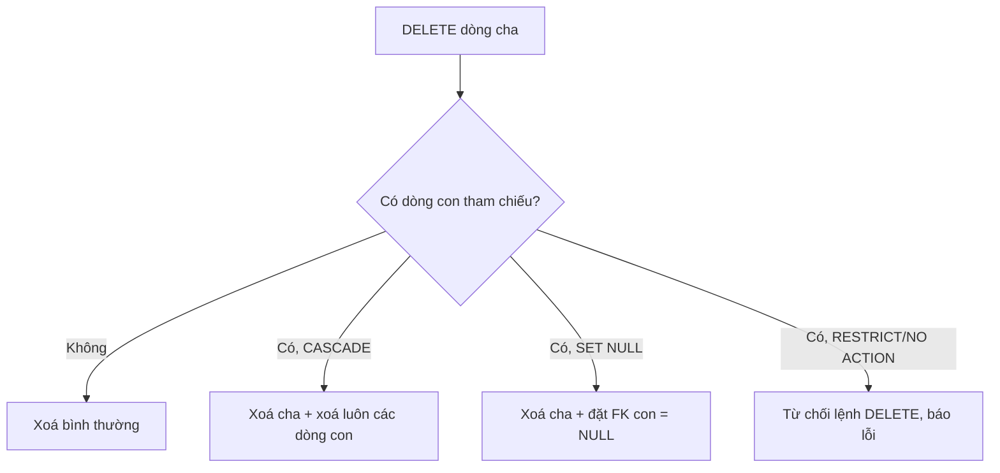

# Ràng buộc dữ liệu (Constraints)

!!! info "Bạn đang ở đây"
    cần trước: sql nền tảng — biết `CREATE TABLE`, kiểu dữ liệu, `INSERT/UPDATE/DELETE`, và cách `NULL` hoạt động trong `WHERE`.
    mở khoá sau bài này: thiết kế schema quan hệ (chuẩn hoá, khoá ngoại nhiều bảng), migration ef core, và transaction/index — vì constraint chính là "luật chơi" mà mọi migration và transaction phải tôn trọng.
    ⏱️ fast path ~45 phút · deep dive thêm ~30 phút (tuỳ chọn).

> **Mục tiêu (đo được):** Sau bài này bạn **định nghĩa** được PRIMARY KEY, FOREIGN KEY, UNIQUE, CHECK, NOT NULL, DEFAULT bằng lời của riêng mình; **viết** đúng cú pháp PostgreSQL cho từng loại; **giải thích** được lỗi cụ thể khi vi phạm từng ràng buộc; **chọn** đúng hành vi `ON DELETE` (`CASCADE`/`SET NULL`/`RESTRICT`) cho một tình huống nghiệp vụ cho trước; và **sửa đổi** constraint trên bảng đã có dữ liệu bằng `ALTER TABLE` mà không làm mất dữ liệu hợp lệ.

---

## 0. Kiểm tra trước (30 giây) — bạn đoán kết quả nào?

Cho bảng sau, đã có sẵn 1 dòng:

```sql title="SQL"
CREATE TABLE emails (
    id    integer GENERATED ALWAYS AS IDENTITY PRIMARY KEY,
    email text UNIQUE
);

INSERT INTO emails (email) VALUES ('an@example.com');
```

Ba lệnh `INSERT` sau, lệnh nào **thành công**, lệnh nào **lỗi**? Đoán trước khi mở đáp án.

```sql title="SQL"
INSERT INTO emails (email) VALUES ('an@example.com'); -- (A)
INSERT INTO emails (email) VALUES (NULL);              -- (B)
INSERT INTO emails (email) VALUES (NULL);              -- (C) — chạy sau (B)
```

??? note "Đáp án — bấm để mở SAU khi đã đoán"
    - **(A) LỖI**: `duplicate key value violates unique constraint "emails_email_key"`. `'an@example.com'` đã tồn tại.
    - **(B) THÀNH CÔNG**: chèn được dòng có `email = NULL`.
    - **(C) THÀNH CÔNG** — và đây là điều gây bất ngờ nhất bài học hôm nay: `UNIQUE` **cho phép nhiều dòng `NULL`**, vì PostgreSQL coi mỗi `NULL` là "không xác định", nên hai `NULL` không được coi là "trùng nhau". Nếu bạn cần "email nếu có thì phải duy nhất, nhưng không cho phép nhiều dòng thiếu email cùng lúc", `UNIQUE` một mình **chưa đủ** — phải kết hợp thêm `NOT NULL` hoặc unique index có điều kiện. Xem mục 3.

---

## 1. PRIMARY KEY — khoá chính

### 1.1 Định nghĩa

**PRIMARY KEY** là ràng buộc đánh dấu một (hoặc một nhóm) cột là **định danh duy nhất** của mỗi dòng trong bảng: giá trị không được trùng và không được `NULL`.

### 1.2 Ví dụ cú pháp tối thiểu

```sql title="SQL"
CREATE TABLE customers (
    id   integer GENERATED ALWAYS AS IDENTITY PRIMARY KEY,
    name text NOT NULL
);

INSERT INTO customers (name) VALUES ('An'), ('Bình');

SELECT * FROM customers;
```

Output kỳ vọng:

```text title="Kết quả"
 id | name
----+------
  1 | An
  2 | Bình
(2 rows)
```

### 1.3 Điều gì xảy ra khi dùng sai

Hai lỗi kinh điển: chèn trùng khoá chính, và cố chèn `NULL` vào cột khoá chính.

```sql title="SQL"
INSERT INTO customers (id, name) VALUES (1, 'Cường');
```

```text title="Kết quả lỗi"
ERROR:  duplicate key value violates unique constraint "customers_pkey"
DETAIL:  Key (id)=(1) already exists.
```

```sql title="SQL"
CREATE TABLE t (id integer PRIMARY KEY);
INSERT INTO t (id) VALUES (NULL);
```

```text title="Kết quả lỗi"
ERROR:  null value in column "id" of relation "t" violates not-null constraint
```

Điều này cho thấy `PRIMARY KEY` thực chất là **`UNIQUE` + `NOT NULL`** gộp lại — PostgreSQL tự động thêm cả hai ràng buộc khi bạn khai báo `PRIMARY KEY`.

!!! danger "Đính chính hiểu lầm phổ biến: PRIMARY KEY dùng B-tree, KHÔNG PHẢI Hash"
    Khi bạn khai báo `PRIMARY KEY`, PostgreSQL tự tạo một **unique index** để ép ràng buộc. Loại index mặc định — và cũng là loại được dùng cho khoá chính — là **B-tree**, không phải Hash index. B-tree hỗ trợ cả so sánh bằng (`=`) lẫn so sánh khoảng (`<`, `>`, `BETWEEN`, `ORDER BY`), nên nó phù hợp cho khoá chính vốn hay được dùng để tra cứu theo khoảng hoặc sắp xếp (ví dụ khoá chính dạng tăng dần theo thời gian). Hash index trong PostgreSQL chỉ hỗ trợ so sánh bằng, hiếm khi dùng làm khoá chính.

### 1.4 Khoá chính nhiều cột (composite primary key)

Đôi khi một dòng chỉ duy nhất khi xét **nhiều cột cùng lúc**. Ví dụ bảng nối nhiều-nhiều `enrollments` (một sinh viên ghi danh một lớp, không ghi danh lặp lớp đó):

```sql title="SQL"
CREATE TABLE enrollments (
    student_id integer NOT NULL,
    course_id  integer NOT NULL,
    enrolled_on date NOT NULL DEFAULT current_date,
    PRIMARY KEY (student_id, course_id)
);

INSERT INTO enrollments (student_id, course_id) VALUES (1, 100);
INSERT INTO enrollments (student_id, course_id) VALUES (1, 100); -- lặp lại
```

```text title="Kết quả lỗi"
ERROR:  duplicate key value violates unique constraint "enrollments_pkey"
DETAIL:  Key (student_id, course_id)=(1, 100) already exists.
```

Lưu ý: `(1, 100)` và `(1, 200)` **không** trùng nhau — tính duy nhất xét trên **cả cặp**, không phải từng cột riêng lẻ.

---

## 2. FOREIGN KEY — khoá ngoại

### 2.1 Định nghĩa

**FOREIGN KEY** (khoá ngoại) là ràng buộc bắt một cột (hoặc nhóm cột) trong bảng "con" chỉ được chứa giá trị đã tồn tại ở khoá chính (hoặc cột `UNIQUE`) của bảng "cha" — hoặc `NULL` nếu cột đó cho phép — nhằm đảm bảo **tính toàn vẹn tham chiếu** (không có "đơn hàng mồ côi" trỏ tới khách hàng không tồn tại).

### 2.2 Ví dụ cú pháp tối thiểu

```sql title="SQL"
CREATE TABLE customers (
    id   integer GENERATED ALWAYS AS IDENTITY PRIMARY KEY,
    name text NOT NULL
);

CREATE TABLE orders (
    id          integer GENERATED ALWAYS AS IDENTITY PRIMARY KEY,
    customer_id integer NOT NULL REFERENCES customers(id),
    amount      numeric(10,2) NOT NULL
);

INSERT INTO customers (name) VALUES ('An');          -- id = 1
INSERT INTO orders (customer_id, amount) VALUES (1, 500000);

SELECT * FROM orders;
```

Output kỳ vọng:

```text title="Kết quả"
 id | customer_id | amount
----+-------------+--------
  1 |           1 | 500000.00
(1 row)
```

### 2.3 Điều gì xảy ra khi dùng sai

Chèn `customer_id` không tồn tại trong bảng cha:

```sql title="SQL"
INSERT INTO orders (customer_id, amount) VALUES (999, 100000);
```

```text title="Kết quả lỗi"
ERROR:  insert or update on table "orders" violates foreign key constraint "orders_customer_id_fkey"
DETAIL:  Key (customer_id)=(999) is not present in table "customers".
```

Xoá dòng cha đang bị bảng con tham chiếu (khi chưa khai báo hành vi `ON DELETE`, mặc định là `NO ACTION`, hoạt động tương tự `RESTRICT` — chặn xoá):

```sql title="SQL"
DELETE FROM customers WHERE id = 1;
```

```text title="Kết quả lỗi"
ERROR:  update or delete on table "customers" violates foreign key constraint "orders_customer_id_fkey" on table "orders"
DETAIL:  Key (id)=(1) is still referenced from table "orders".
```

### 2.4 ON DELETE CASCADE — xoá lan truyền

**Định nghĩa:** `ON DELETE CASCADE` là hành vi khai báo trên khoá ngoại: khi dòng ở bảng cha bị xoá, PostgreSQL **tự động xoá luôn** các dòng con tham chiếu tới nó.

```sql title="SQL"
CREATE TABLE authors (
    id   integer GENERATED ALWAYS AS IDENTITY PRIMARY KEY,
    name text NOT NULL
);

CREATE TABLE posts (
    id        integer GENERATED ALWAYS AS IDENTITY PRIMARY KEY,
    author_id integer REFERENCES authors(id) ON DELETE CASCADE,
    title     text NOT NULL
);

INSERT INTO authors (name) VALUES ('An');                 -- id = 1
INSERT INTO posts (author_id, title) VALUES (1, 'Bài 1'), (1, 'Bài 2');

DELETE FROM authors WHERE id = 1;

SELECT * FROM posts;
```

Output kỳ vọng:

```text title="Kết quả"
 id | author_id | title
----+-----------+-------
(0 rows)
```

Cả hai bài viết của tác giả bị xoá theo — dùng khi bảng con **không có ý nghĩa nếu thiếu bảng cha** (bài viết không thể tồn tại mà không có tác giả sở hữu nó trong mô hình dữ liệu này).

### 2.5 ON DELETE SET NULL — gỡ liên kết, giữ dòng con

**Định nghĩa:** `ON DELETE SET NULL` là hành vi: khi dòng cha bị xoá, PostgreSQL **giữ lại** dòng con nhưng đặt cột khoá ngoại của nó thành `NULL`.

```sql title="SQL"
CREATE TABLE employees (
    id   integer GENERATED ALWAYS AS IDENTITY PRIMARY KEY,
    name text NOT NULL
);

CREATE TABLE tasks (
    id          integer GENERATED ALWAYS AS IDENTITY PRIMARY KEY,
    assignee_id integer REFERENCES employees(id) ON DELETE SET NULL,
    title       text NOT NULL
);

INSERT INTO employees (name) VALUES ('Bình');              -- id = 1
INSERT INTO tasks (assignee_id, title) VALUES (1, 'Viết báo cáo');

DELETE FROM employees WHERE id = 1;

SELECT * FROM tasks;
```

Output kỳ vọng:

```text title="Kết quả"
 id | assignee_id |    title
----+-------------+---------------
  1 |        NULL | Viết báo cáo
(1 row)
```

Công việc vẫn còn (không mất dữ liệu lịch sử) nhưng không còn ai phụ trách — dùng khi bảng con **vẫn có ý nghĩa độc lập** dù mất liên kết cha (công việc vẫn tồn tại dù nhân viên nghỉ việc).

!!! warning "Điều kiện bắt buộc của SET NULL"
    `ON DELETE SET NULL` chỉ hợp lệ khi cột khoá ngoại **cho phép `NULL`** (không có `NOT NULL`). Nếu cột được khai `NOT NULL`, thao tác xoá cha sẽ lỗi vi phạm not-null constraint ngay khi PostgreSQL cố gán `NULL`.

### 2.6 ON DELETE RESTRICT — chặn xoá tuyệt đối

**Định nghĩa:** `ON DELETE RESTRICT` là hành vi: PostgreSQL **từ chối** lệnh `DELETE` trên bảng cha nếu còn bất kỳ dòng con nào tham chiếu tới nó — buộc người dùng phải xử lý (xoá/gỡ) bảng con trước.

```sql title="SQL"
CREATE TABLE categories (
    id   integer GENERATED ALWAYS AS IDENTITY PRIMARY KEY,
    name text NOT NULL
);

CREATE TABLE products (
    id          integer GENERATED ALWAYS AS IDENTITY PRIMARY KEY,
    category_id integer REFERENCES categories(id) ON DELETE RESTRICT,
    name        text NOT NULL
);

INSERT INTO categories (name) VALUES ('Đồ điện tử');       -- id = 1
INSERT INTO products (category_id, name) VALUES (1, 'Bàn phím');

DELETE FROM categories WHERE id = 1;
```

```text title="Kết quả lỗi"
ERROR:  update or delete on table "categories" violates foreign key constraint "products_category_id_fkey" on table "products"
DETAIL:  Key (id)=(1) is still referenced from table "products".
```

Dùng khi mất bảng cha là **lỗi nghiệp vụ nghiêm trọng** cần con người xác nhận (ví dụ không cho xoá một danh mục sản phẩm còn hàng, tránh xoá nhầm dây chuyền).

!!! note "RESTRICT vs NO ACTION"
    `RESTRICT` và `NO ACTION` (giá trị mặc định nếu không khai báo `ON DELETE`) đều chặn xoá khi còn tham chiếu. Khác biệt kỹ thuật duy nhất: `NO ACTION` cho phép hoãn kiểm tra tới cuối transaction nếu constraint được khai `DEFERRABLE`, còn `RESTRICT` luôn kiểm tra ngay lập tức. Với đa số ứng dụng thông thường, coi hai giá trị này là "chặn xoá" là đủ.

### 2.7 Bảng tổng hợp ba hành vi ON DELETE

Bây giờ cả ba khái niệm đã được dạy riêng lẻ với ví dụ độc lập, ta mới tổng hợp so sánh:

| Hành vi | Khi xoá dòng cha | Dùng khi nào |
| --- | --- | --- |
| `CASCADE` | Xoá luôn dòng con | Con không có ý nghĩa nếu thiếu cha (bài viết ↔ tác giả) |
| `SET NULL` | Giữ dòng con, đặt FK = `NULL` | Con vẫn có ý nghĩa độc lập (công việc ↔ người phụ trách) |
| `RESTRICT` / `NO ACTION` (mặc định) | Từ chối xoá cha | Mất cha là lỗi nghiệp vụ cần xác nhận thủ công (danh mục ↔ sản phẩm còn hàng) |



---

## 3. UNIQUE — duy nhất

### 3.1 Định nghĩa

**UNIQUE** là ràng buộc bắt các giá trị trong một cột (hoặc tổ hợp cột) không được trùng nhau giữa các dòng — khác `PRIMARY KEY` ở chỗ một bảng có thể có **nhiều** ràng buộc `UNIQUE` nhưng chỉ có **một** `PRIMARY KEY`.

### 3.2 Ví dụ cú pháp tối thiểu

```sql title="SQL"
CREATE TABLE accounts (
    id       integer GENERATED ALWAYS AS IDENTITY PRIMARY KEY,
    username text UNIQUE NOT NULL
);

INSERT INTO accounts (username) VALUES ('an123');

SELECT * FROM accounts;
```

Output kỳ vọng:

```text title="Kết quả"
 id | username
----+----------
  1 | an123
(1 row)
```

### 3.3 Điều gì xảy ra khi dùng sai

```sql title="SQL"
INSERT INTO accounts (username) VALUES ('an123');
```

```text title="Kết quả lỗi"
ERROR:  duplicate key value violates unique constraint "accounts_username_key"
DETAIL:  Key (username)=(an123) already exists.
```

### 3.4 Bẫy: UNIQUE cho phép nhiều NULL

Đây chính là bẫy đã nêu ở mục 0. Vì PostgreSQL coi `NULL` là "giá trị không xác định" nên **hai `NULL` không bao giờ được coi là bằng nhau** khi kiểm tra `UNIQUE` — ràng buộc `UNIQUE` chỉ so sánh các giá trị đã biết.

```sql title="SQL"
CREATE TABLE profiles (
    id    integer GENERATED ALWAYS AS IDENTITY PRIMARY KEY,
    phone text UNIQUE
);

INSERT INTO profiles (phone) VALUES (NULL);
INSERT INTO profiles (phone) VALUES (NULL);   -- KHÔNG lỗi!

SELECT count(*) FROM profiles;
```

Output kỳ vọng:

```text title="Kết quả"
 count
-------
     2
(2 rows)
```

Nếu nghiệp vụ thật sự cần "nếu có `phone` thì phải duy nhất, và mỗi khách phải có tối đa 1 dòng thiếu `phone` cho một nhóm điều kiện khác" — cách xử lý phổ biến là kết hợp `NOT NULL` (nếu bắt buộc luôn phải có giá trị) hoặc dùng **partial unique index** (nâng cao, xem DEEP DIVE cuối bài) để chỉ áp `UNIQUE` cho các dòng thoả điều kiện `WHERE phone IS NOT NULL`.

### 3.5 UNIQUE nhiều cột

```sql title="SQL"
CREATE TABLE room_bookings (
    id      integer GENERATED ALWAYS AS IDENTITY PRIMARY KEY,
    room_no integer NOT NULL,
    on_date date NOT NULL,
    UNIQUE (room_no, on_date)
);

INSERT INTO room_bookings (room_no, on_date) VALUES (101, '2026-07-10');
INSERT INTO room_bookings (room_no, on_date) VALUES (101, '2026-07-10'); -- trùng phòng + ngày
```

```text title="Kết quả lỗi"
ERROR:  duplicate key value violates unique constraint "room_bookings_room_no_on_date_key"
DETAIL:  Key (room_no, on_date)=(101, 2026-07-10) already exists.
```

`(101, '2026-07-11')` vẫn chèn được bình thường — tính duy nhất xét trên **cặp** `(room_no, on_date)`.

---

## 4. NOT NULL — bắt buộc có giá trị

### 4.1 Định nghĩa

**NOT NULL** là ràng buộc bắt một cột **luôn phải có giá trị xác định** — không được để trống (`NULL`) ở bất kỳ dòng nào.

### 4.2 Ví dụ cú pháp tối thiểu

```sql title="SQL"
CREATE TABLE contacts (
    id   integer GENERATED ALWAYS AS IDENTITY PRIMARY KEY,
    name text NOT NULL
);

INSERT INTO contacts (name) VALUES ('Cường');

SELECT * FROM contacts;
```

Output kỳ vọng:

```text title="Kết quả"
 id | name
----+--------
  1 | Cường
(1 row)
```

### 4.3 Điều gì xảy ra khi dùng sai

```sql title="SQL"
INSERT INTO contacts (name) VALUES (NULL);
```

```text title="Kết quả lỗi"
ERROR:  null value in column "name" of relation "contacts" violates not-null constraint
DETAIL:  Failing row contains (2, null).
```

Kể cả không nêu `name` trong câu `INSERT` (không có `DEFAULT`) cũng lỗi tương tự, vì PostgreSQL tự điền `NULL` cho cột thiếu:

```sql title="SQL"
INSERT INTO contacts (id) VALUES (DEFAULT);
```

```text title="Kết quả lỗi"
ERROR:  null value in column "name" of relation "contacts" violates not-null constraint
```

---

## 5. DEFAULT — giá trị mặc định

### 5.1 Định nghĩa

**DEFAULT** là khai báo giá trị PostgreSQL sẽ tự động điền vào cột khi câu `INSERT` **không cung cấp giá trị** cho cột đó (khác với `NULL` được điền tự động khi không có `DEFAULT`).

### 5.2 Ví dụ cú pháp tối thiểu

```sql title="SQL"
CREATE TABLE articles (
    id         integer GENERATED ALWAYS AS IDENTITY PRIMARY KEY,
    title      text NOT NULL,
    is_draft   boolean NOT NULL DEFAULT true,
    created_at timestamptz NOT NULL DEFAULT now()
);

INSERT INTO articles (title) VALUES ('Bài viết đầu tiên');

SELECT title, is_draft FROM articles;
```

Output kỳ vọng (cột `created_at` bị lược để dễ so sánh, vì giá trị phụ thuộc thời điểm chạy):

```text title="Kết quả"
       title         | is_draft
----------------------+----------
 Bài viết đầu tiên    | t
(1 row)
```

### 5.3 Điều gì xảy ra khi dùng sai (hiểu lầm phổ biến)

`DEFAULT` **không** phải ràng buộc chặn giá trị sai — nó chỉ điền hộ khi thiếu. Nếu bạn **chủ động** truyền `NULL` cho cột có `DEFAULT` nhưng không có `NOT NULL`, PostgreSQL vẫn ghi `NULL` chứ không dùng giá trị mặc định:

```sql title="SQL"
CREATE TABLE t2 (
    id   integer GENERATED ALWAYS AS IDENTITY PRIMARY KEY,
    note text DEFAULT 'chưa có ghi chú'
);

INSERT INTO t2 (note) VALUES (NULL);   -- truyền NULL rõ ràng

SELECT * FROM t2;
```

Output kỳ vọng — `note` là `NULL`, **không phải** `'chưa có ghi chú'`:

```text title="Kết quả"
 id | note
----+------
  1 |
(1 row)
```

Nếu muốn vừa có giá trị mặc định vừa cấm `NULL` tuyệt đối, phải khai **cả hai**: `DEFAULT 'chưa có ghi chú' NOT NULL`.

---

## 6. CHECK — ràng buộc điều kiện tuỳ ý

### 6.1 Định nghĩa

**CHECK** là ràng buộc yêu cầu mỗi dòng phải thoả một **biểu thức boolean** do bạn tự định nghĩa — dùng khi các ràng buộc có sẵn (khoá chính, khoá ngoại, unique, not null) không đủ diễn tả một luật nghiệp vụ.

### 6.2 Ví dụ cú pháp tối thiểu

```sql title="SQL"
CREATE TABLE products (
    id    integer GENERATED ALWAYS AS IDENTITY PRIMARY KEY,
    name  text NOT NULL,
    price numeric(10,2) NOT NULL CHECK (price > 0)
);

INSERT INTO products (name, price) VALUES ('Bàn phím', 450000);

SELECT * FROM products;
```

Output kỳ vọng:

```text title="Kết quả"
 id |   name   |  price
----+----------+----------
  1 | Bàn phím | 450000.00
(1 row)
```

### 6.3 Điều gì xảy ra khi dùng sai

```sql title="SQL"
INSERT INTO products (name, price) VALUES ('Chuột lỗi', -50000);
```

```text title="Kết quả lỗi"
ERROR:  new row for relation "products" violates check constraint "products_price_check"
DETAIL:  Failing row contains (2, Chuột lỗi, -50000.00).
```

### 6.4 CHECK đặt tên và CHECK nhiều cột

Nên đặt tên constraint tường minh để thông báo lỗi dễ đọc và dễ `ALTER TABLE ... DROP CONSTRAINT` sau này:

```sql title="SQL"
CREATE TABLE bookings (
    id         integer GENERATED ALWAYS AS IDENTITY PRIMARY KEY,
    start_date date NOT NULL,
    end_date   date NOT NULL,
    CONSTRAINT bookings_date_order_check CHECK (end_date > start_date)
);

INSERT INTO bookings (start_date, end_date) VALUES ('2026-07-10', '2026-07-05');
```

```text title="Kết quả lỗi"
ERROR:  new row for relation "bookings" violates check constraint "bookings_date_order_check"
DETAIL:  Failing row contains (1, 2026-07-10, 2026-07-05).
```

`CHECK` có thể tham chiếu **nhiều cột trong cùng một dòng** (như ví dụ trên so sánh `start_date` và `end_date`), nhưng **không thể** tham chiếu dữ liệu ở dòng khác hay bảng khác — việc đó thuộc phạm vi `FOREIGN KEY` hoặc trigger.

---

## 7. Thêm và gỡ constraint bằng ALTER TABLE

### 7.1 Định nghĩa

`ALTER TABLE ... ADD CONSTRAINT` / `DROP CONSTRAINT` là cú pháp thêm hoặc gỡ một ràng buộc trên bảng **đã tồn tại** (có thể đã có dữ liệu), không cần tạo lại bảng từ đầu.

### 7.2 Ví dụ cú pháp tối thiểu — thêm CHECK vào bảng đã có

```sql title="SQL"
CREATE TABLE inventory (
    id    integer GENERATED ALWAYS AS IDENTITY PRIMARY KEY,
    stock integer NOT NULL
);

INSERT INTO inventory (stock) VALUES (10), (0);

ALTER TABLE inventory
    ADD CONSTRAINT inventory_stock_nonneg CHECK (stock >= 0);

SELECT * FROM inventory;
```

Output kỳ vọng — lệnh `ALTER TABLE` thành công vì dữ liệu hiện có (`10` và `0`) đều thoả `stock >= 0`:

```text title="Kết quả"
 id | stock
----+-------
  1 |    10
  2 |     0
(2 rows)
```

### 7.3 Điều gì xảy ra khi dùng sai — thêm constraint mà dữ liệu cũ vi phạm

```sql title="SQL"
CREATE TABLE inventory2 (
    id    integer GENERATED ALWAYS AS IDENTITY PRIMARY KEY,
    stock integer NOT NULL
);

INSERT INTO inventory2 (stock) VALUES (-5);   -- dữ liệu cũ đã sai

ALTER TABLE inventory2
    ADD CONSTRAINT inventory2_stock_nonneg CHECK (stock >= 0);
```

```text title="Kết quả lỗi"
ERROR:  check constraint "inventory2_stock_nonneg" of relation "inventory2" is violated by some row
```

PostgreSQL **quét toàn bộ dữ liệu hiện có** khi thêm constraint mới; nếu có dù chỉ một dòng vi phạm, lệnh `ALTER TABLE` bị từ chối hoàn toàn (transaction ngầm rollback) — bạn phải sửa/xoá dòng vi phạm trước rồi mới thêm lại constraint.

### 7.4 Gỡ constraint

```sql title="SQL"
ALTER TABLE inventory DROP CONSTRAINT inventory_stock_nonneg;
```

Không có output kết quả dòng — chỉ có thông báo `ALTER TABLE` thành công. Muốn biết tên constraint để gỡ, dùng `\d inventory` trong `psql` hoặc truy vấn `information_schema.table_constraints`.

### 7.5 Thêm/gỡ NOT NULL, FOREIGN KEY, UNIQUE trên bảng đã có

```sql title="SQL"
-- Thêm NOT NULL cho cột đã tồn tại (cú pháp riêng, không dùng ADD CONSTRAINT)
ALTER TABLE contacts ALTER COLUMN name SET NOT NULL;

-- Gỡ NOT NULL
ALTER TABLE contacts ALTER COLUMN name DROP NOT NULL;

-- Thêm FOREIGN KEY cho bảng đã có
ALTER TABLE orders
    ADD CONSTRAINT orders_customer_id_fkey
    FOREIGN KEY (customer_id) REFERENCES customers(id) ON DELETE CASCADE;

-- Thêm UNIQUE cho bảng đã có
ALTER TABLE accounts
    ADD CONSTRAINT accounts_username_key UNIQUE (username);
```

!!! danger "Đính chính hiểu lầm phổ biến"
    `NOT NULL` không dùng cú pháp `ADD CONSTRAINT` như `CHECK`/`UNIQUE`/`FOREIGN KEY` — nó dùng riêng `ALTER COLUMN ... SET NOT NULL` / `DROP NOT NULL`, vì về mặt kỹ thuật `NOT NULL` là một thuộc tính của cột trong catalog PostgreSQL, không phải một named constraint độc lập như các loại còn lại (dù `information_schema` vẫn hiển thị nó dưới dạng "constraint" khi bạn truy vấn).

---

## Cạm bẫy & thực chiến

- **`UNIQUE` cho phép nhiều `NULL`**: đã minh hoạ ở mục 3.4. Đây là lỗi thiết kế phổ biến nhất khi ai đó nghĩ `UNIQUE` tự động ngăn "trống nhiều lần". Nếu nghiệp vụ cần chặn cả `NULL` trùng, kết hợp `NOT NULL` hoặc dùng partial unique index (xem DEEP DIVE).
- **Quên `ON DELETE`, mặc định là `RESTRICT`-như (`NO ACTION`)**: nhiều người nghĩ không khai `ON DELETE` nghĩa là "tự do xoá", nhưng thực tế PostgreSQL sẽ **chặn xoá** cha nếu còn con tham chiếu. Luôn khai rõ hành vi mong muốn thay vì dựa vào mặc định ngầm.
- **`ON DELETE SET NULL` trên cột `NOT NULL`**: khai báo mâu thuẫn — cột vừa `NOT NULL` vừa `SET NULL` khi cha bị xoá sẽ gây lỗi ngay tại thời điểm `DELETE` cha, chứ không báo lỗi ngay lúc `CREATE TABLE`. Luôn kiểm tra tính nhất quán giữa `NOT NULL` và hành vi `ON DELETE`.
- **Thêm `CHECK`/`NOT NULL`/`UNIQUE` vào bảng đã có dữ liệu bẩn**: `ALTER TABLE ADD CONSTRAINT` quét toàn bảng và **từ chối toàn bộ** nếu có một dòng vi phạm — không có chuyện "áp dụng cho dòng mới, bỏ qua dòng cũ". Phải dọn dữ liệu trước.
- **`CHECK` không thấy được dữ liệu bảng khác**: nếu cần ràng buộc kiểu "tổng số lượng đặt phòng không vượt sức chứa toàn hệ thống", `CHECK` đơn lẻ trên một dòng không làm được — cần trigger hoặc ràng buộc ở tầng ứng dụng/transaction.
- **Composite key và composite unique dễ nhầm thứ tự cột**: `PRIMARY KEY (a, b)` và `PRIMARY KEY (b, a)` tạo cùng một ràng buộc logic nhưng thứ tự cột ảnh hưởng tới cách index B-tree được dùng cho truy vấn lọc theo tiền tố (`WHERE a = ...` nhanh hơn `WHERE b = ...` nếu `a` đứng trước).
- **Đặt tên constraint mặc định khó nhớ**: nếu không đặt tên (`CONSTRAINT ten_rang_buoc`), PostgreSQL tự sinh tên như `products_price_check`, `orders_customer_id_fkey` — vẫn đọc được nhưng nên đặt tên tường minh trong schema quan trọng để dễ tra cứu và gỡ sau này.

---

## Bài tập

### Bài 1 — Giàn giáo: khoá ngoại với ON DELETE phù hợp

Thiết kế hai bảng `departments` và `employees`. Một nhân viên **luôn phải** thuộc một phòng ban tại thời điểm tạo, nhưng khi phòng ban bị giải thể, nhân viên **vẫn được giữ lại** trong hệ thống (không xoá nhân viên), chỉ mất liên kết phòng ban.

Điền vào chỗ trống:

```sql title="SQL"
CREATE TABLE departments (
    id   integer GENERATED ALWAYS AS IDENTITY PRIMARY KEY,
    name text NOT NULL
);

CREATE TABLE employees (
    id            integer GENERATED ALWAYS AS IDENTITY PRIMARY KEY,
    name          text NOT NULL,
    department_id integer ____ REFERENCES departments(id) ____
);
```

??? success "Lời giải — bấm để mở"
    ```sql title="SQL"
    CREATE TABLE departments (
        id   integer GENERATED ALWAYS AS IDENTITY PRIMARY KEY,
        name text NOT NULL
    );

    CREATE TABLE employees (
        id            integer GENERATED ALWAYS AS IDENTITY PRIMARY KEY,
        name          text NOT NULL,
        department_id integer REFERENCES departments(id) ON DELETE SET NULL
    );
    ```
    **Vì sao:** cột `department_id` **không** đặt `NOT NULL` — bắt buộc, vì `ON DELETE SET NULL` chỉ hợp lệ khi cột cho phép `NULL` (mục 2.5). "Luôn phải thuộc phòng ban tại thời điểm tạo" là ràng buộc ở **tầng ứng dụng lúc INSERT** (ví dụ luôn yêu cầu form nhập `department_id`), không nhất thiết phải là `NOT NULL` ở schema — vì nếu là `NOT NULL`, `SET NULL` sẽ không dùng được sau này khi phòng ban giải thể.

### Bài 2 — Thiết kế: hệ thống đặt bàn nhà hàng

Thiết kế bảng `table_reservations` với các luật nghiệp vụ sau:
1. Mỗi lượt đặt phải có `table_no` (số bàn), `reserved_at` (thời điểm) và `guest_count` (số khách).
2. Không được đặt trùng cùng một bàn tại cùng một thời điểm chính xác.
3. Số khách phải lớn hơn 0.
4. Nếu không nhập, số khách mặc định là 2.

??? success "Lời giải — bấm để mở"
    ```sql title="SQL"
    CREATE TABLE table_reservations (
        id           integer GENERATED ALWAYS AS IDENTITY PRIMARY KEY,
        table_no     integer NOT NULL,
        reserved_at  timestamptz NOT NULL,
        guest_count  integer NOT NULL DEFAULT 2 CHECK (guest_count > 0),
        UNIQUE (table_no, reserved_at)
    );
    ```
    **Vì sao từng phần:**

    - `table_no`, `reserved_at` là `NOT NULL` vì luật 1 nói "phải có".
    - `UNIQUE (table_no, reserved_at)` xử lý luật 2 — tổ hợp cột, không phải riêng từng cột (một bàn có thể có nhiều lượt đặt ở giờ khác nhau; nhiều bàn có thể được đặt cùng giờ).
    - `CHECK (guest_count > 0)` xử lý luật 3.
    - `DEFAULT 2` xử lý luật 4; kết hợp `NOT NULL` để đảm bảo cột luôn có giá trị xác định kể cả khi không truyền.
    - Không dùng `PRIMARY KEY (table_no, reserved_at)` thay cho `id` + `UNIQUE` vì `id` làm khoá đại diện (surrogate key) giúp các bảng khác (ví dụ `reservation_notes`) tham chiếu gọn bằng khoá ngoại một cột, thay vì phải tham chiếu khoá ngoại composite hai cột.

---

## Tự kiểm tra

1. Vì sao `PRIMARY KEY` có thể coi là `UNIQUE + NOT NULL` gộp lại? Cho ví dụ lỗi minh hoạ từng phần.

    ??? note "Đáp án"
        Vì khai báo `PRIMARY KEY` tự động tạo một unique index (B-tree) trên cột đó **và** bắt buộc cột không được `NULL`. Vi phạm phần `UNIQUE` cho lỗi `duplicate key value violates unique constraint`; vi phạm phần `NOT NULL` cho lỗi `null value in column ... violates not-null constraint`.

2. Loại index nào được PostgreSQL dùng để ép ràng buộc `PRIMARY KEY`? Vì sao loại đó phù hợp hơn loại còn lại cho khoá chính?

    ??? note "Đáp án"
        **B-tree**, không phải Hash. B-tree hỗ trợ cả so sánh bằng lẫn so sánh khoảng/sắp xếp (`<`, `>`, `BETWEEN`, `ORDER BY`), phù hợp với cách khoá chính thường được dùng để tra cứu và sắp xếp. Hash index chỉ hỗ trợ so sánh bằng.

3. Bảng `books(id PK, author_id FK REFERENCES authors(id) ON DELETE CASCADE)`. Xoá một tác giả đang có 3 cuốn sách thì điều gì xảy ra?

    ??? note "Đáp án"
        Cả 3 dòng trong `books` tham chiếu tới tác giả đó cũng bị xoá theo, vì `ON DELETE CASCADE` lan truyền việc xoá từ bảng cha sang bảng con.

4. Cho bảng `emails(id PK, email text UNIQUE)` đã có 2 dòng với `email = NULL`. Việc chèn dòng thứ 3 cũng có `email = NULL` có bị chặn bởi `UNIQUE` không? Vì sao?

    ??? note "Đáp án"
        **Không bị chặn.** `UNIQUE` không coi hai giá trị `NULL` là "trùng nhau" (vì `NULL` nghĩa là không xác định), nên có thể chèn bao nhiêu dòng `NULL` tuỳ ý. Đây là bẫy `UNIQUE`/`NULL` kinh điển.

5. Cột `price numeric(10,2) DEFAULT 0` (không có `NOT NULL`). Câu `INSERT INTO t (price) VALUES (NULL)` sẽ lưu giá trị gì cho `price`? Vì sao không phải `0`?

    ??? note "Đáp án"
        Lưu `NULL`. `DEFAULT` chỉ áp dụng khi câu `INSERT` **không cung cấp giá trị** cho cột; ở đây giá trị `NULL` được **truyền tường minh**, nên PostgreSQL ghi đúng những gì được truyền, không thay bằng giá trị mặc định.

6. Muốn thêm `CHECK (age >= 18)` vào bảng `users` đã có 10000 dòng, trong đó có 5 dòng `age = 15`. Lệnh `ALTER TABLE users ADD CONSTRAINT ... CHECK (age >= 18);` sẽ thành công hay lỗi?

    ??? note "Đáp án"
        **Lỗi**: `check constraint ... is violated by some row`. PostgreSQL quét toàn bộ dữ liệu hiện có trước khi chấp nhận constraint mới; phải sửa/xoá 5 dòng vi phạm trước, rồi mới `ADD CONSTRAINT` lại được.

7. Khác biệt cú pháp giữa việc thêm `NOT NULL` và thêm `CHECK`/`UNIQUE`/`FOREIGN KEY` vào một bảng đã tồn tại là gì?

    ??? note "Đáp án"
        `NOT NULL` dùng `ALTER TABLE ... ALTER COLUMN <cot> SET NOT NULL` (và gỡ bằng `DROP NOT NULL`), vì nó là thuộc tính của cột chứ không phải named constraint độc lập. Các loại còn lại (`CHECK`, `UNIQUE`, `FOREIGN KEY`, `PRIMARY KEY`) dùng chung cú pháp `ALTER TABLE ... ADD CONSTRAINT <ten> <loai> (...)`.

---

??? abstract "DEEP DIVE — nâng cao (không nằm trên fast path)"
    **Partial unique index — giải bẫy UNIQUE + NULL triệt để.** Nếu nghiệp vụ cần "email nếu có phải duy nhất, nhưng cho phép nhiều dòng thiếu email", có thể tạo unique index có điều kiện thay vì ràng buộc `UNIQUE` thường:

    ```sql title="SQL"
    CREATE UNIQUE INDEX profiles_phone_unique_when_present
        ON profiles (phone)
        WHERE phone IS NOT NULL;
    ```

    Index này chỉ ép tính duy nhất trên các dòng thoả `phone IS NOT NULL`; các dòng `NULL` hoàn toàn không bị index này xét tới, nên không có mâu thuẫn.

    **DEFERRABLE constraint.** Mặc định, PostgreSQL kiểm tra `FOREIGN KEY`/`UNIQUE` ngay sau mỗi câu lệnh. Với constraint khai `DEFERRABLE INITIALLY DEFERRED`, việc kiểm tra dời tới lúc `COMMIT` — hữu ích khi cần chèn hai bảng tham chiếu vòng tròn lẫn nhau trong cùng một transaction (ví dụ `employees.manager_id` tự tham chiếu `employees.id`, và bạn cần chèn một nhóm nhân viên quản lý chéo nhau).

    ```sql title="SQL"
    ALTER TABLE orders
        ADD CONSTRAINT orders_customer_id_fkey
        FOREIGN KEY (customer_id) REFERENCES customers(id)
        DEFERRABLE INITIALLY DEFERRED;
    ```

    **EXCLUDE constraint.** PostgreSQL còn hỗ trợ `EXCLUDE` — tổng quát hoá `UNIQUE` cho các phép so sánh khác `=`, ví dụ chặn hai khoảng thời gian đặt phòng **chồng lấn** (không chỉ trùng khớp tuyệt đối) bằng toán tử `&&` trên kiểu `tstzrange`, cần extension `btree_gist`. Đây là công cụ đúng cho bài toán "không cho hai lượt đặt cùng phòng giao nhau về thời gian" — mạnh hơn nhiều so với `UNIQUE (room_no, reserved_at)` chỉ chặn trùng khớp chính xác.

    **Constraint và migration EF Core.** Khi dùng Entity Framework Core, các ràng buộc này thường được khai qua Fluent API (`HasKey`, `HasIndex().IsUnique()`, `HasCheckConstraint`, `HasForeignKey().OnDelete(DeleteBehavior.Cascade)`) trong `OnModelCreating`, rồi EF sinh migration chứa đúng các câu `ALTER TABLE`/`CREATE TABLE` như trong chương này. Hiểu constraint ở tầng SQL trước giúp đọc migration EF Core sinh ra dễ dàng hơn nhiều, thay vì học thuộc lòng cú pháp Fluent API mà không biết nó dịch ra gì.

**Tiếp theo →** [P2 · Thiết kế CSDL & Chuẩn hoá](thiet-ke-schema.md)
