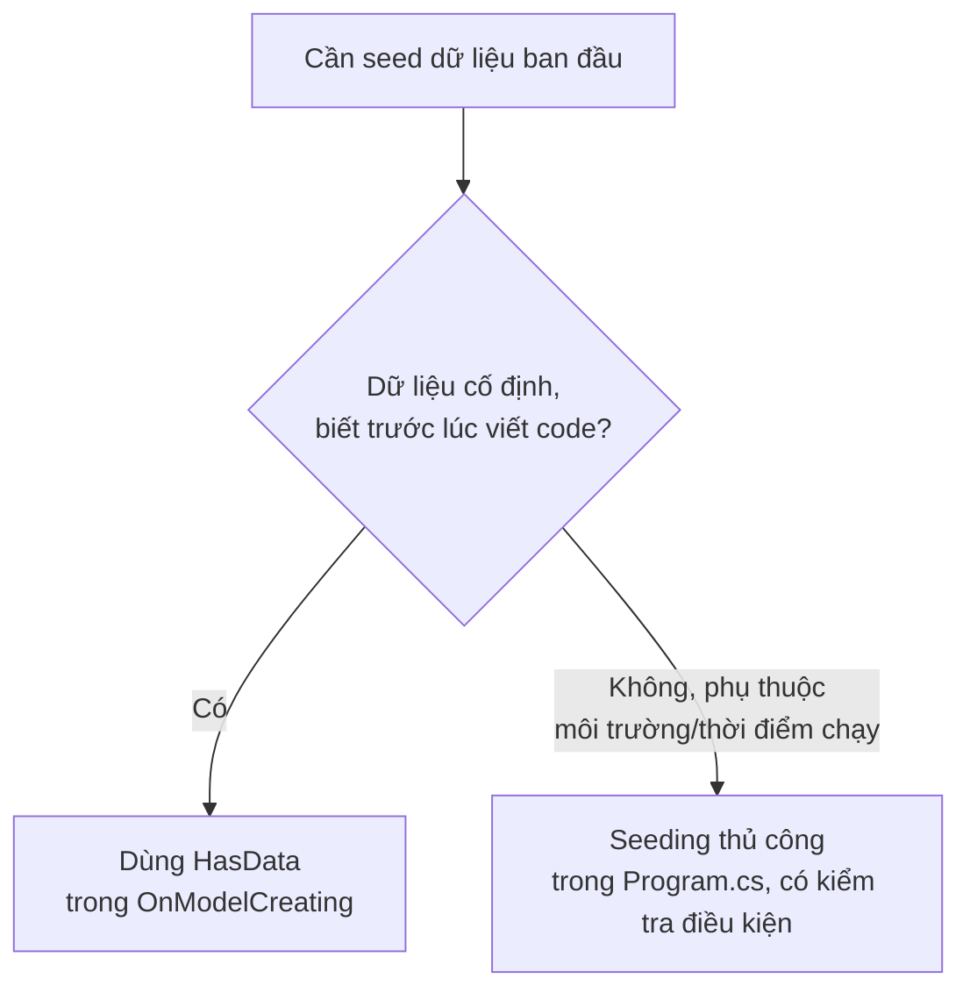

# EF Core: Migration & Seeding

!!! info "Bạn đang ở đây"
    cần trước: ef core map & quan hệ — biết định nghĩa entity, cấu hình khoá ngoại bằng Fluent API trong `OnModelCreating`, và đã có một `DbContext` với các `DbSet<T>` ánh xạ quan hệ một-nhiều/nhiều-nhiều.
    mở khoá: dùng `dotnet ef migrations add`/`database update` để đưa thay đổi model C# xuống schema PostgreSQL thật mà không viết SQL tay, đọc hiểu file migration EF Core sinh ra (Up/Down), nạp dữ liệu ban đầu (seed) bằng `HasData` hoặc code thủ công, và rollback về migration trước — trước khi sang repository pattern và unit of work.

> Mục tiêu (đo được): sau chương này bạn có thể **áp dụng** quy trình `dotnet ef migrations add` → đọc file migration sinh ra → `dotnet ef database update` để đưa thay đổi model xuống database PostgreSQL, **giải thích** vai trò của method `Up`/`Down` trong một file migration, **chọn** đúng giữa `HasData` (seed tĩnh, theo dõi qua migration) và seeding thủ công (seed động, chạy lúc khởi động ứng dụng), và **thực hiện** rollback về một migration trước đó bằng `dotnet ef database update <tên-migration>`.

## 0. Câu hỏi/đoán nhanh

Đọc các phát biểu sau rồi đoán đúng/sai trước khi xem đáp án:

1. `dotnet ef migrations add` là lệnh chạy trực tiếp SQL xuống database, thay đổi schema ngay lập tức.
2. Một file migration EF Core sinh ra chỉ chứa method `Up` — không có cách nào tự động hoàn tác thay đổi đó.
3. Chạy `dotnet ef migrations add TenMoi` hai lần liên tiếp mà không sửa gì trong model sẽ sinh ra hai file migration giống hệt nhau, cả hai đều cần thiết.
4. `HasData` trong `OnModelCreating` là cách EF Core dùng để seed dữ liệu *tĩnh, cố định* — được EF Core theo dõi qua chính lịch sử migration, chứ không phải chạy lại mỗi lần ứng dụng khởi động.
5. `dotnet ef database update <tên-migration-trước>` sẽ xoá luôn file migration phía sau khỏi ổ đĩa.

???+ note "Đáp án"
    1. **Sai.** `dotnet ef migrations add` chỉ **sinh ra file code C#** (mô tả thay đổi schema) trên máy bạn — nó **không** chạm vào database nào cả. Phải chạy thêm `dotnet ef database update` thì thay đổi mới thật sự được áp dụng.
    2. **Sai.** EF Core mặc định sinh **cả** `Up` (áp dụng thay đổi) lẫn `Down` (hoàn tác thay đổi) trong cùng một file migration — mục 3 sẽ đọc chi tiết cả hai.
    3. **Sai.** Nếu model không đổi gì so với lần `add` trước, EF Core sinh ra một migration **rỗng** (không có thao tác nào trong `Up`/`Down`) — về mặt kỹ thuật vẫn tạo được file, nhưng vô nghĩa và nên xoá đi.
    4. **Đúng.** Đây chính xác là điểm phân biệt `HasData` với seeding thủ công — mục 4 sẽ đào sâu.
    5. **Sai.** Lệnh này chỉ thay đổi **schema database** để khớp với migration đích — nó không đụng tới file migration nào trên ổ đĩa của bạn. File migration phía sau vẫn còn nguyên trong project, chỉ là chưa được áp dụng vào database.

## 1. Migration là gì

**Định nghĩa:** migration là một **ảnh chụp (snapshot) các thay đổi về schema database theo thời gian**, được EF Core tự sinh ra dưới dạng file code C#, để bạn có thể áp dụng (hoặc hoàn tác) những thay đổi đó xuống database một cách có kiểm soát và có lịch sử — **không phải** việc tự tay viết và chạy câu lệnh SQL `CREATE TABLE`/`ALTER TABLE` thủ công mỗi khi model C# thay đổi.

Hình dung migration giống như một "commit Git", nhưng cho schema database: mỗi migration ghi lại *chính xác* những gì đã đổi (thêm bảng nào, thêm cột nào, đổi kiểu dữ liệu nào...) kể từ migration trước đó, theo đúng **thứ tự thời gian**. EF Core dựa vào một bảng đặc biệt trong database (`__EFMigrationsHistory`) để biết database hiện tại đang ở "phiên bản" migration nào, từ đó biết cần áp dụng thêm migration nào để bắt kịp model C# mới nhất.

Ví dụ tối thiểu — không có migration nào, chỉ để thấy vấn đề migration giải quyết: giả sử bạn có entity sau và **chưa hề** chạy migration nào:

```csharp title="C#"
// test:skip cần EF Core, minh hoạ VẤN ĐỀ migration giải quyết — chưa phải giải pháp
public class Product
{
    public int Id { get; set; }
    public string Name { get; set; } = "";
}
```

Nếu không có cơ chế migration, để bảng `Products` tồn tại trong PostgreSQL, bạn phải tự tay viết:

```sql title="SQL"
CREATE TABLE "Products" (
    "Id" integer GENERATED ALWAYS AS IDENTITY PRIMARY KEY,
    "Name" text NOT NULL
);
```

Và mỗi lần thêm một thuộc tính mới vào `Product`, bạn lại phải tự nhớ viết đúng câu `ALTER TABLE` tương ứng, tự đồng bộ giữa nhiều máy/nhiều môi trường (dev, staging, production) — dễ quên, dễ sai, không có lịch sử rõ ràng ai đổi gì lúc nào. Migration giải quyết đúng vấn đề này: EF Core **tự so sánh** model C# hiện tại với model ở migration gần nhất, rồi **tự sinh** đoạn code tương đương với các câu `CREATE TABLE`/`ALTER TABLE` đó — mục 2 sẽ thực hiện lệnh cụ thể.

**Dùng sai:** sửa schema database trực tiếp bằng tay (chạy `ALTER TABLE` thủ công trong `psql` hoặc công cụ GUI) mà không tạo migration tương ứng — không có lỗi CS hay exception nào ngay lập tức, nhưng gây ra tình trạng **database "trôi" khỏi lịch sử migration** (database drift): `__EFMigrationsHistory` không phản ánh đúng schema thật, khiến lần `dotnet ef database update` tiếp theo có thể áp thêm một migration xung đột với thay đổi tay đó.

```text title="Kết quả"
Npgsql.PostgresException: 42701: column "Email" of relation "Customers" already exists
```

Lỗi này xảy ra khi ai đó đã tự thêm cột `Email` bằng tay trong `psql`, sau đó một migration khác (không biết về thay đổi tay đó) cũng cố `ALTER TABLE ADD COLUMN "Email"` — PostgreSQL từ chối vì cột đã tồn tại. Nguyên tắc vàng: **mọi** thay đổi schema phải đi qua migration, không sửa tay trực tiếp trên database (kể cả trong môi trường phát triển), để lịch sử migration luôn là nguồn sự thật duy nhất.

## 2. Lệnh dotnet ef migrations add

**Định nghĩa:** `dotnet ef migrations add <TênMigration>` là lệnh command-line (CLI) yêu cầu EF Core so sánh model C# hiện tại (các entity, `DbSet<T>`, cấu hình Fluent API trong `OnModelCreating`) với "model snapshot" của lần migration gần nhất, rồi **sinh ra một file code C# mới** mô tả đúng phần chênh lệch đó — lệnh này **chỉ tạo file trên ổ đĩa**, chưa chạm gì tới database thật.

Quy trình chuẩn khi thêm/sửa một entity:

```bash title="Bash"
# test:skip lệnh CLI, cần .NET SDK + EF Core tools cài sẵn (dotnet tool install --global dotnet-ef)
dotnet ef migrations add CreateProductsTable
```

Kết quả: EF Core tạo ra một thư mục `Migrations/` (nếu chưa có) trong project, và bên trong đó ba file:

```text title="Kết quả"
Migrations/
├── 20260703091500_CreateProductsTable.cs
├── 20260703091500_CreateProductsTable.Designer.cs
└── ShopContextModelSnapshot.cs
```

- `20260703091500_CreateProductsTable.cs` — file chính, chứa method `Up`/`Down` mô tả thay đổi (đọc chi tiết ở mục 3). Tiền tố số là **timestamp** (năm-tháng-ngày-giờ-phút-giây) để đảm bảo thứ tự áp dụng migration đúng theo thời gian tạo.
- `*.Designer.cs` — file phụ trợ, chứa metadata để EF Core tooling dùng nội bộ, hiếm khi cần đọc hay sửa tay.
- `ShopContextModelSnapshot.cs` — "ảnh chụp" toàn bộ model **tại thời điểm mới nhất** (không phải chỉ phần chênh lệch) — đây là file EF Core dùng để so sánh khi bạn chạy `migrations add` lần kế tiếp.

**Dùng sai:** chạy `dotnet ef migrations add` khi model C# **không có gì thay đổi** so với snapshot gần nhất.

```text title="Kết quả"
Build started...
Build succeeded.
An operation was scaffolded that may result in the loss of data. Please review
the migration for accuracy.
```

Thực ra trong trường hợp *hoàn toàn không đổi gì*, EF Core vẫn tạo file migration nhưng bên trong method `Up`/`Down` **rỗng, không có câu lệnh nào** — về mặt kỹ thuật lệnh vẫn "thành công", không phải lỗi CS hay exception, nhưng file migration đó vô nghĩa (không mô tả thay đổi thật nào) và nên bị xoá đi trước khi commit, tránh làm rối lịch sử migration của team. Cảnh báo "loss of data" ở trên xuất hiện trong một tình huống khác — khi EF Core phát hiện thay đổi có khả năng **mất dữ liệu** (ví dụ đổi kiểu cột từ `text` sang `integer`) — luôn đọc kỹ nội dung file migration trước khi áp dụng, không chỉ tin vào tên lệnh đã chạy thành công.

## 3. Lệnh dotnet ef database update

**Định nghĩa:** `dotnet ef database update` là lệnh CLI đọc tất cả các file migration **chưa được áp dụng** (so với bảng lịch sử `__EFMigrationsHistory` trong database đích), rồi **thật sự chạy** các câu lệnh SQL tương ứng (sinh từ method `Up`) xuống database đó, theo đúng thứ tự thời gian — đây là bước duy nhất thật sự **chạm vào database**, khác với `migrations add` ở mục 2 chỉ sinh file.

```bash title="Bash"
# test:skip lệnh CLI, cần .NET SDK + EF Core tools + database PostgreSQL đang chạy
dotnet ef database update
```

Kết quả (ví dụ, lần đầu áp dụng migration `CreateProductsTable`):

```text title="Kết quả"
Build started...
Build succeeded.
Applying migration '20260703091500_CreateProductsTable'.
Done.
```

Sau lệnh này, PostgreSQL thật sự có bảng `Products` (do EF Core chạy `CREATE TABLE` bên trong), và bảng `__EFMigrationsHistory` được cập nhật thêm một dòng ghi nhận migration `20260703091500_CreateProductsTable` đã được áp dụng — đây chính là cơ chế để EF Core biết database đang ở "phiên bản" nào.

**Dùng sai:** chạy `dotnet ef database update` khi connection string trỏ sai database (ví dụ trỏ nhầm sang database production thay vì database phát triển cục bộ) — không có lỗi CS nào, migration vẫn chạy **thành công về mặt kỹ thuật**, nhưng áp dụng nhầm schema lên sai môi trường.

```text title="Kết quả"
Npgsql.PostgresException: 3D000: database "shop_dev" does not exist
```

Đây là lỗi runtime cụ thể khi connection string trỏ tới một database không tồn tại trên server đó — mã lỗi PostgreSQL `3D000` ("invalid catalog name"). Lỗi này **giúp** phát hiện sai sót; nguy hiểm hơn là trường hợp connection string trỏ **đúng cú pháp nhưng sai môi trường** (một database production có thật, chỉ là không phải database bạn định sửa) — khi đó lệnh chạy trót lọt, không có bất kỳ cảnh báo nào, và schema production bị thay đổi ngoài ý muốn. Luôn kiểm tra biến môi trường/connection string đang active trước khi chạy `database update`, đặc biệt trong CI/CD.

## 4. Đọc file migration sinh ra: Up và Down

**Định nghĩa:** trong file migration EF Core sinh ra, method `Up(MigrationBuilder migrationBuilder)` chứa các thao tác để **áp dụng** thay đổi (chạy khi `database update` tiến lên migration này), còn method `Down(MigrationBuilder migrationBuilder)` chứa các thao tác **ngược lại, để hoàn tác** đúng những gì `Up` đã làm (chạy khi rollback lùi qua migration này) — EF Core tự sinh cả hai, bạn hiếm khi cần viết tay.

Ví dụ tối thiểu — nội dung điển hình của file migration `CreateProductsTable` (rút gọn, giữ đúng cấu trúc thật):

```csharp title="C#"
// test:skip cần EF Core + Npgsql, đây là code EF Core TỰ SINH, không tự viết tay
using Microsoft.EntityFrameworkCore.Migrations;

public partial class CreateProductsTable : Migration
{
    protected override void Up(MigrationBuilder migrationBuilder)
    {
        migrationBuilder.CreateTable(
            name: "Products",
            columns: table => new
            {
                Id = table.Column<int>(nullable: false)
                    .Annotation("Npgsql:ValueGenerationStrategy", "IdentityAlwaysColumn"),
                Name = table.Column<string>(nullable: false)
            },
            constraints: table =>
            {
                table.PrimaryKey("PK_Products", x => x.Id);
            });
    }

    protected override void Down(MigrationBuilder migrationBuilder)
    {
        migrationBuilder.DropTable(name: "Products");
    }
}
```

Đọc file này: `Up` gọi `migrationBuilder.CreateTable(...)` — một phương thức trừu tượng hoá của EF Core, khi chạy trên PostgreSQL sẽ dịch thành đúng câu `CREATE TABLE "Products" (...)` với cột `Id` (khoá chính, tự sinh giá trị — tương đương `GENERATED ALWAYS AS IDENTITY`) và `Name`. `Down` làm ngược lại — chỉ đơn giản `DropTable`, vì thao tác ngược của "tạo bảng" chính là "xoá bảng" đó.

**Dùng sai:** sửa tay một migration **đã được áp dụng** (đã chạy `database update` thành công trên một môi trường nào đó, kể cả máy dev của đồng nghiệp) thay vì tạo migration mới — không có lỗi CS ngay lập tức, nhưng gây **không nhất quán giữa các môi trường**: máy nào đã chạy migration đó trước khi bạn sửa vẫn giữ schema theo bản cũ, còn máy chạy sau khi sửa lại ra schema khác, dù `__EFMigrationsHistory` ghi nhận "cùng một migration đã áp dụng" ở cả hai.

```text title="Kết quả"
Npgsql.PostgresException: 42703: column "Sku" of relation "Products" does not exist
```

Tình huống điển hình: bạn sửa tay migration cũ để thêm cột `Sku` vào `Up`, nhưng đồng nghiệp đã chạy `database update` **trước khi bạn sửa** — database của họ không có cột `Sku` (vì migration lúc họ chạy chưa có dòng đó), trong khi `__EFMigrationsHistory` của họ vẫn ghi migration này "đã áp dụng" nên `database update` sau đó không chạy lại nó. Kết quả: đồng nghiệp bị lỗi cột không tồn tại khi code C# (đã build lại theo model mới có `Sku`) cố truy vấn cột đó. Nguyên tắc: **không sửa migration đã áp dụng** ở bất kỳ môi trường nào (kể cả máy dev cá nhân đã chạy `update`) — luôn tạo migration mới cho thay đổi tiếp theo.

## 5. Seed dữ liệu ban đầu

### 5.1 HasData — seed tĩnh theo dõi qua migration

**Định nghĩa:** `HasData` là một phương thức Fluent API gọi trong `OnModelCreating`, khai báo một tập dữ liệu **cố định, biết trước tại thời điểm viết code**, để EF Core tự sinh các câu `INSERT` (hoặc `UPDATE`/`DELETE` khi dữ liệu đó thay đổi) tương ứng **bên trong chính file migration** — nghĩa là seed này được theo dõi và versioned cùng lịch sử migration, không chạy lại mỗi lần ứng dụng khởi động.

Ví dụ tối thiểu — seed hai danh mục sản phẩm cố định:

```csharp title="C#"
// test:skip cần EF Core, không tự-compile bằng BCL
using Microsoft.EntityFrameworkCore;

public class Category
{
    public int Id { get; set; }
    public string Name { get; set; } = "";
}

public class ShopContext : DbContext
{
    public DbSet<Category> Categories => Set<Category>();

    protected override void OnModelCreating(ModelBuilder modelBuilder)
    {
        modelBuilder.Entity<Category>().HasData(
            new Category { Id = 1, Name = "Đồ điện tử" },
            new Category { Id = 2, Name = "Sách" }
        );
    }
}
```

Sau khi chạy `dotnet ef migrations add SeedCategories`, file migration sinh ra sẽ chứa trong `Up`:

```csharp title="C#"
// test:skip cần EF Core; đây là phần EF Core TỰ SINH bên trong Up() của migration
migrationBuilder.InsertData(
    table: "Categories",
    columns: new[] { "Id", "Name" },
    values: new object[,]
    {
        { 1, "Đồ điện tử" },
        { 2, "Sách" }
    });
```

Vì `Id` được truyền tường minh (`1`, `2`) thay vì để database tự sinh, `HasData` yêu cầu bạn phải luôn khai báo đủ giá trị khoá chính — EF Core cần một giá trị cố định để so sánh và biết dòng nào cần `INSERT` mới, `UPDATE`, hay `DELETE` ở các lần `migrations add` sau này khi bạn sửa danh sách `HasData`.

**Dùng sai:** gọi `HasData` với một entity **không khai báo giá trị khoá chính** — lỗi ngay lúc build model, trước khi kịp chạy `migrations add`.

```csharp title="C#"
// test:skip cần EF Core; minh hoạ lỗi thiếu khoá chính trong HasData
modelBuilder.Entity<Category>().HasData(
    new Category { Name = "Đồ điện tử" }   // thiếu Id
);
// System.InvalidOperationException: The seed entity for entity type 'Category'
// cannot be added because a key value was not provided. To identify seed data
// that requires generated key values, use fluent API to configure...
```

`HasData` cần biết **chính xác** khoá chính của mỗi dòng seed ngay tại thời điểm khai báo, vì nó phải sinh migration cố định (không phụ thuộc vào việc database tự cấp `SERIAL`/`IDENTITY` lúc chạy) — không cung cấp `Id` khiến EF Core không có cách nào theo dõi và so sánh dòng đó qua các lần migration, nên ném `InvalidOperationException` ngay khi build model.

### 5.1.1 Sửa dữ liệu HasData sinh ra UpdateData, không phải chèn lại

Một điểm quan trọng thường bị hiểu lầm: khi bạn **sửa** một dòng `HasData` đã tồn tại (ví dụ đổi tên `"Đồ điện tử"` thành `"Điện tử & Phụ kiện"`) rồi `migrations add` lại, EF Core **không** coi đây là xoá-rồi-thêm-lại — nó so sánh với `ModelSnapshot` theo khoá chính (`Id = 1`) và nhận ra đây là một **thay đổi trên dòng đã có**, nên sinh `UpdateData` thay vì `InsertData`.

```csharp title="C#"
// test:skip cần EF Core; sửa Name của Category Id=1 đã seed trước đó
modelBuilder.Entity<Category>().HasData(
    new Category { Id = 1, Name = "Điện tử & Phụ kiện" },   // đổi tên so với lần seed trước
    new Category { Id = 2, Name = "Sách" }
);
```

File migration mới sinh ra (sau `dotnet ef migrations add RenameElectronicsCategory`) chứa:

```csharp title="C#"
// test:skip cần EF Core; phần EF Core TỰ SINH bên trong Up() của migration
migrationBuilder.UpdateData(
    table: "Categories",
    keyColumn: "Id",
    keyValue: 1,
    column: "Name",
    value: "Điện tử & Phụ kiện");
```

Tương tự, **xoá hẳn** một dòng khỏi danh sách `HasData` (không còn khai báo `Id = 2` nữa) sẽ khiến EF Core sinh `DeleteData` cho đúng dòng đó trong migration kế tiếp — cơ chế so sánh này là lý do khoá chính trong `HasData` bắt buộc phải **ổn định, không đổi** giữa các lần sửa; đổi `Id` của một dòng đang tồn tại (thay vì đổi `Name`) khiến EF Core hiểu nhầm thành "xoá dòng cũ, thêm dòng mới" chứ không phải "sửa dòng cũ".

### 5.2 Seeding thủ công — seed động lúc khởi động ứng dụng

**Định nghĩa:** seeding thủ công là cách nạp dữ liệu ban đầu bằng code C# thông thường (không qua `HasData`/migration), thường đặt trong `Program.cs` hoặc một service khởi động, chạy **mỗi lần ứng dụng khởi động** và tự kiểm tra điều kiện (ví dụ "nếu bảng rỗng thì mới thêm") trước khi ghi — phù hợp khi dữ liệu seed **phụ thuộc môi trường lúc chạy** (ví dụ đọc từ biến môi trường, gọi API ngoài, hoặc là dữ liệu demo lớn không tiện viết cứng trong `HasData`).

Ví dụ tối thiểu — seed một tài khoản admin mặc định nếu bảng `Users` đang rỗng:

```csharp title="C#"
// test:skip cần EF Core + ASP.NET Core hosting, không tự-compile bằng BCL
using Microsoft.EntityFrameworkCore;

var builder = WebApplication.CreateBuilder(args);
builder.Services.AddDbContext<ShopContext>(options =>
    options.UseNpgsql(builder.Configuration.GetConnectionString("ShopDb")));

var app = builder.Build();

using (var scope = app.Services.CreateScope())
{
    var db = scope.ServiceProvider.GetRequiredService<ShopContext>();
    if (!await db.Users.AnyAsync())
    {
        db.Users.Add(new User { Name = "admin", Email = "admin@shop.local" });
        await db.SaveChangesAsync();
    }
}

app.Run();
```

Kiểm tra `!await db.Users.AnyAsync()` (bảng rỗng) trước khi `Add` là bắt buộc — nếu bỏ qua, mỗi lần ứng dụng khởi động lại sẽ chèn thêm một dòng admin trùng lặp, vì đoạn code này chạy lại từ đầu mỗi lần `Program.cs` được thực thi (khác hẳn `HasData`, vốn chỉ chạy đúng một lần khi migration đó được áp dụng).

**Dùng sai:** viết seeding thủ công nhưng **quên kiểm tra điều kiện** trước khi `Add`, và chạy trên bảng có ràng buộc `UNIQUE`.

```text title="Kết quả"
Npgsql.PostgresException: 23505: duplicate key value violates unique constraint
"Users_Email_key"
DETAIL:  Key (Email)=(admin@shop.local) already exists.
```

Nếu `Email` có ràng buộc `UNIQUE` (nên có, vì admin mặc định phải là duy nhất), lần khởi động ứng dụng **thứ hai** trở đi sẽ cố `INSERT` một dòng trùng `Email`, PostgreSQL từ chối với mã lỗi `23505` ("unique_violation"). Đây là lý do seeding thủ công luôn cần một điều kiện bảo vệ (`AnyAsync`, hoặc kiểm tra tồn tại theo khoá nghiệp vụ) — khác với `HasData`, nơi EF Core tự lo việc "chỉ chèn nếu chưa có" thông qua chính lịch sử migration.

### 5.3 Chọn HasData hay seeding thủ công

Hai khái niệm ở 5.1 và 5.2 đã được dạy riêng lẻ; bây giờ mới so sánh để chọn đúng công cụ:

| Tiêu chí | `HasData` | Seeding thủ công |
| --- | --- | --- |
| Khi nào chạy | Một lần, khi migration chứa nó được áp dụng | Mỗi lần ứng dụng khởi động (tự kiểm tra điều kiện) |
| Dữ liệu biết trước lúc viết code? | Bắt buộc — phải khai cả khoá chính | Không bắt buộc — có thể tính toán lúc chạy |
| Theo dõi qua lịch sử migration? | Có — nằm trong file migration, versioned cùng Git | Không — chỉ là code thường, không gắn với migration nào |
| Phù hợp cho | Dữ liệu tham chiếu cố định (danh mục, vai trò, cấu hình hệ thống) | Dữ liệu phụ thuộc môi trường (tài khoản admin theo secret, dữ liệu demo lớn) |
| Rủi ro dùng sai | Quên khoá chính → lỗi lúc build model | Quên kiểm tra điều kiện tồn tại → lỗi `23505` khi khởi động lại |



## 6. Rollback migration

**Định nghĩa:** rollback là thao tác đưa database **lùi lại** một migration trước đó bằng lệnh `dotnet ef database update <tên-migration-trước>` — EF Core chạy method `Down` của tất cả các migration nằm **sau** migration đích (theo thứ tự ngược lại thời gian áp dụng) để hoàn tác đúng những gì `Up` của chúng đã làm.

Ví dụ tối thiểu — giả sử đã áp dụng ba migration theo thứ tự `InitialCreate` → `CreateProductsTable` → `AddSkuColumn`, muốn lùi về ngay sau `InitialCreate` (tức hoàn tác cả `AddSkuColumn` lẫn `CreateProductsTable`):

```bash title="Bash"
# test:skip lệnh CLI, cần .NET SDK + EF Core tools + database đang có 3 migration đã áp dụng
dotnet ef database update InitialCreate
```

Kết quả:

```text title="Kết quả"
Build started...
Build succeeded.
Reverting migration '20260703093000_AddSkuColumn'.
Reverting migration '20260703092000_CreateProductsTable'.
Done.
```

EF Core hoàn tác đúng theo thứ tự **ngược** với lúc áp dụng: `Down` của `AddSkuColumn` chạy trước (xoá cột `Sku`), rồi mới tới `Down` của `CreateProductsTable` (xoá bảng `Products`) — database sau lệnh này có schema y hệt như ngay sau khi `InitialCreate` được áp dụng, và `__EFMigrationsHistory` cũng được cập nhật lại để phản ánh đúng trạng thái đó (hai dòng lịch sử của `CreateProductsTable`/`AddSkuColumn` bị xoá khỏi bảng lịch sử).

Muốn hoàn tác **toàn bộ** migration, kể cả migration đầu tiên, dùng tên đặc biệt:

```bash title="Bash"
# test:skip lệnh CLI; đưa database về trạng thái CHƯA có migration nào
dotnet ef database update 0
```

**Dùng sai:** rollback về một migration mà `Down` của các migration phía sau **thao tác không thể đảo ngược an toàn** — ví dụ một migration đã `DropColumn` một cột chứa dữ liệu thật (không phải chỉ đổi schema rỗng).

```text title="Kết quả"
-- Down() của migration DropOldStatusColumn chỉ có thể tạo LẠI cột "Status",
-- nhưng KHÔNG có dữ liệu cũ để điền vào -- Down không tự "nhớ" dữ liệu đã mất.
ALTER TABLE "Orders" ADD COLUMN "Status" text;
-- Cột "Status" được tạo lại, nhưng toàn bộ giá trị cũ đã mất vĩnh viễn từ lúc
-- Up() của DropOldStatusColumn chạy DROP COLUMN.
```

Đây không phải lỗi CS hay exception — lệnh rollback chạy "thành công" theo đúng nghĩa kỹ thuật (`Down` được EF Core sinh tự động để đảo ngược cấu trúc: có cột thì thêm lại cột, có bảng thì tạo lại bảng), nhưng **dữ liệu thật sự nằm trong cột/bảng đó tại thời điểm `DROP` đã mất vĩnh viễn**, vì `Down` chỉ đảo ngược *cấu trúc* schema chứ không có khả năng khôi phục *dữ liệu* đã bị xoá bởi `Up`. Nguyên tắc an toàn: luôn sao lưu (backup) database trước khi rollback một migration đã chạy trên môi trường có dữ liệu thật, đặc biệt nếu migration đó chứa `DropColumn`/`DropTable`.

## 7. Gỡ migration chưa áp dụng: dotnet ef migrations remove

**Định nghĩa:** `dotnet ef migrations remove` là lệnh CLI xoá **migration mới nhất chưa được áp dụng** khỏi project (xoá file `.cs`/`.Designer.cs` tương ứng và cập nhật lại `ModelSnapshot`) — dùng khi bạn phát hiện migration vừa `add` bị sai hoặc thiếu, muốn sửa model rồi tạo lại migration khác, thay vì để lại một migration lỗi trong lịch sử.

Ví dụ tối thiểu — vừa `add` một migration nhưng nhận ra quên thêm một thuộc tính vào entity trước khi `add`:

```bash title="Bash"
# test:skip lệnh CLI; migration AddSkuColumn chưa từng chạy database update
dotnet ef migrations add AddSkuColumn
# ... nhận ra quên thêm thuộc tính "Barcode" vào entity Product ...
dotnet ef migrations remove
```

Kết quả:

```text title="Kết quả"
Build started...
Build succeeded.
Removing migration '20260703094500_AddSkuColumn'.
Reverted model snapshot.
Done.
```

Sau lệnh này, file `20260703094500_AddSkuColumn.cs` và `.Designer.cs` bị **xoá khỏi ổ đĩa**, và `ShopContextModelSnapshot.cs` được khôi phục lại đúng như trước khi migration đó tồn tại — bạn có thể sửa entity (thêm `Barcode`) rồi `migrations add` lại từ đầu với đầy đủ thay đổi mong muốn trong cùng một migration.

**Dùng sai:** chạy `dotnet ef migrations remove` sau khi migration đó **đã** được áp dụng xuống một database nào đó (kể cả chỉ database dev cá nhân) bằng `database update`.

```text title="Kết quả"
The migration '20260703094500_AddSkuColumn' has already been applied to the
database. Revert it before attempting to remove it.
```

EF Core chủ động chặn thao tác này để tránh tình trạng **file migration bị xoá khỏi project nhưng database vẫn còn "nhớ"** nó qua `__EFMigrationsHistory` (gây lệch lịch sử không thể truy vết). Muốn xoá một migration đã áp dụng, phải theo đúng thứ tự: rollback bằng `database update <tên-migration-trước>` (mục 6) để `Down` chạy và gỡ khỏi lịch sử database trước, **rồi mới** `migrations remove` để xoá file.

## 8. Nhiều migration đang chờ & xung đột khi làm việc nhóm

**Định nghĩa:** "migration đang chờ" (pending migration) là migration đã tồn tại dưới dạng file trong project nhưng **chưa** được áp dụng vào một database cụ thể — tình huống phổ biến khi nhiều lập trình viên cùng thêm migration trên các nhánh Git khác nhau rồi merge lại, khiến máy của bạn có thể có nhiều migration "lạ" (do đồng nghiệp tạo) cần áp dụng cùng lúc.

Ví dụ tối thiểu — sau khi `git pull` một nhánh đã merge, kiểm tra migration nào đang chờ trước khi chạy `database update`:

```bash title="Bash"
# test:skip lệnh CLI, liệt kê migration và trạng thái áp dụng
dotnet ef migrations list
```

Kết quả (dấu `(Pending)` đánh dấu migration chưa áp dụng trên database local của bạn):

```text title="Kết quả"
20260701080000_InitialCreate
20260702091500_CreateProductsTable
20260703094500_AddSkuColumn (Pending)
20260703103000_AddCategoryTable (Pending)
```

Ở đây hai migration cuối là do đồng nghiệp tạo trên nhánh khác, vừa được merge vào — bạn chưa từng `database update` nên chúng còn "đang chờ". Chạy `dotnet ef database update` (không tham số) sẽ áp dụng tuần tự cả hai theo đúng thứ tự thời gian tạo.

**Dùng sai:** hai người cùng tạo migration trên hai nhánh Git riêng biệt, **cả hai đều dựa trên cùng một `ModelSnapshot` gốc** (trước khi merge), rồi merge cả hai nhánh vào `main` mà không kiểm tra lại.

```text title="Kết quả"
Unable to create an object of type 'ShopContext'. The model backing the
'ShopContext' context has pending changes that need to be applied.
```

Tình huống: migration của người A thêm cột `Sku`, migration của người B (tạo song song, không biết về migration của A) thêm cột `Barcode` — nhưng vì cả hai đều tính từ cùng một `ModelSnapshot` gốc, sau khi merge, file `ModelSnapshot.cs` trong Git có thể chỉ phản ánh **một trong hai** thay đổi (tuỳ ai merge sau ghi đè lên ai), khiến EF Core phát hiện model C# thật (có cả `Sku` lẫn `Barcode`) không khớp với snapshot đã lưu. Cách xử lý an toàn: sau khi merge hai nhánh có migration song song, chạy lại `dotnet ef migrations add <TênMoTaThayĐổiConLai>` để EF Core tự sinh thêm migration bù đắp phần chênh lệch còn thiếu giữa model thật và snapshot, đảm bảo snapshot cuối cùng phản ánh đúng **cả hai** thay đổi.

## 9. Đổi tên cột/bảng: RenameColumn vs Drop+Add

**Định nghĩa:** `RenameColumn`/`RenameTable` là các thao tác `migrationBuilder` giữ nguyên **dữ liệu hiện có**, chỉ đổi tên định danh (cột hoặc bảng) trong catalog PostgreSQL — khác hẳn về bản chất với việc EF Core (khi không nhận diện được ý định "đổi tên") sinh ra một cặp `DropColumn` + `AddColumn`, vốn **xoá sạch dữ liệu cột cũ** rồi tạo cột mới trống.

Ví dụ tối thiểu — đổi tên thuộc tính `Name` thành `FullName` trên entity `Customer`, và báo cho EF Core biết đây là đổi tên bằng cách sửa cùng lúc rồi chạy `migrations add` một lần (EF Core dựa vào so khớp kiểu dữ liệu + gợi ý để đoán đây là rename, nhưng luôn kiểm tra lại nội dung migration sinh ra trước khi tin):

```csharp title="C#"
// test:skip cần EF Core; entity Customer TRƯỚC khi đổi tên thuộc tính
public class Customer
{
    public int Id { get; set; }
    public string Name { get; set; } = "";
}
```

Sau khi sửa thành `public string FullName { get; set; } = "";` rồi chạy `dotnet ef migrations add RenameNameToFullName`, migration sinh ra **nên** chứa:

```csharp title="C#"
// test:skip cần EF Core; phần EF Core TỰ SINH khi nhận diện đúng là đổi tên
migrationBuilder.RenameColumn(
    name: "Name",
    table: "Customers",
    newName: "FullName");
```

`RenameColumn` chỉ chạy tương đương `ALTER TABLE "Customers" RENAME COLUMN "Name" TO "FullName"` trong PostgreSQL — toàn bộ dữ liệu đã có trong cột đó **được giữ nguyên**, chỉ đổi tên cột chứa nó.

**Dùng sai:** không kiểm tra nội dung migration trước khi `database update`, tin rằng EF Core luôn tự đoán đúng ý định "đổi tên". Trên thực tế, nếu bạn xoá thuộc tính `Name` và thêm thuộc tính `FullName` trong **hai bước riêng biệt** (hai lần `migrations add` khác nhau, ví dụ vì hai lập trình viên khác nhau thực hiện) thay vì sửa cùng lúc rồi `add` một lần, EF Core sẽ hiểu đây là "xoá một cột, thêm một cột khác" — không có cách nào để nó biết hai thao tác rời rạc đó thực chất là một phép đổi tên.

```csharp title="C#"
// test:skip cần EF Core; phần EF Core TỰ SINH khi KHÔNG nhận diện được là đổi tên
migrationBuilder.DropColumn(
    name: "Name",
    table: "Customers");

migrationBuilder.AddColumn<string>(
    name: "FullName",
    table: "Customers",
    nullable: false,
    defaultValue: "");
```

Khi chạy `database update` với migration này, PostgreSQL thật sự **xoá vĩnh viễn** toàn bộ dữ liệu trong cột `Name` (do `DropColumn`), rồi tạo cột `FullName` **trống** (mọi dòng đều nhận `defaultValue: ""`) — không có exception nào cảnh báo, migration chạy "thành công" theo đúng nghĩa kỹ thuật, nhưng toàn bộ tên khách hàng đã nhập trước đó bị mất sạch. Nguyên tắc an toàn: mỗi khi migration có `DropColumn` đi kèm `AddColumn` cho một cột "trông giống" cùng mục đích, luôn dừng lại đọc kỹ nội dung migration trước khi `database update` trên môi trường có dữ liệu thật — nếu phát hiện đây thực chất là đổi tên, sửa tay migration đó (thay `DropColumn`+`AddColumn` bằng `RenameColumn`) **trước khi** áp dụng lần đầu (an toàn vì migration chưa từng chạy — không vi phạm nguyên tắc "không sửa migration đã áp dụng" ở mục 4).

## Cạm bẫy & thực chiến

- **Tưởng `migrations add` đã đổi database**: `migrations add` chỉ sinh file C# trên ổ đĩa; phải chạy thêm `database update` mới thật sự chạm database. Rất nhiều người mới báo "sao em add migration rồi mà bảng vẫn chưa có" — vì thiếu bước sau.
- **Sửa tay migration đã áp dụng ở bất kỳ môi trường nào**: gây lệch schema giữa các máy dùng chung migration đó (xem mục 3), lỗi thường lộ ra dưới dạng cột/bảng "does not exist" ở máy khác dù `__EFMigrationsHistory` báo "đã áp dụng".
- **Chạy `migrations add` khi model không đổi gì**: sinh migration rỗng, vô nghĩa — nên `git status`/xem diff trước khi add để chắc chắn đang có thay đổi thật.
- **`HasData` thiếu khoá chính**: lỗi ngay lúc build model (`InvalidOperationException`) vì EF Core cần khoá chính cố định để theo dõi seed qua các lần migration — không giống Insert thông thường có thể để database tự sinh `Id`.
- **Seeding thủ công quên kiểm tra tồn tại**: chạy lại nhiều lần (mỗi lần khởi động ứng dụng) sẽ cố chèn trùng, gây lỗi `23505` (unique_violation) nếu có ràng buộc `UNIQUE`, hoặc chèn trùng âm thầm nếu không có ràng buộc nào chặn.
- **Rollback qua một migration có `DropColumn`/`DropTable` chứa dữ liệu thật**: `Down` chỉ khôi phục lại **cấu trúc** cột/bảng, không khôi phục **dữ liệu** đã mất — luôn backup trước khi rollback trên môi trường có dữ liệu thật.
- **Chạy `database update` với connection string trỏ nhầm môi trường**: không có cảnh báo đặc biệt nào khác với chạy đúng môi trường (nếu database đích tồn tại và có quyền) — luôn xác nhận biến môi trường/connection string đang active trước khi update, đặc biệt trong pipeline CI/CD chạm production.
- **Nhiều thành viên cùng tạo migration trên các nhánh Git song song**: hai migration khác tên nhưng cùng dựa trên cùng một `ModelSnapshot` gốc dễ gây xung đột merge trong file `*ModelSnapshot.cs` — cần phối hợp thứ tự merge và có thể phải `migrations add` lại sau khi merge để snapshot nhất quán (mục 8).
- **Gọi `migrations remove` sau khi migration đã áp dụng**: EF Core từ chối ngay với thông báo rõ ràng — phải rollback (`database update <tên-trước>`) trước, rồi mới `remove` được (mục 7). Cố "chữa cháy" bằng cách xoá tay file migration mà bỏ qua bước rollback sẽ để lại `__EFMigrationsHistory` ghi nhận một migration không còn tồn tại trong project.
- **Đổi `Id` của một dòng `HasData` đang tồn tại thay vì chỉ đổi cột khác**: EF Core hiểu nhầm thành "xoá dòng cũ (Id cũ), thêm dòng mới (Id mới)" thay vì "sửa dòng cũ" — sinh `DeleteData` + `InsertData` thay vì `UpdateData` mong muốn, có thể phá vỡ khoá ngoại nếu bảng khác đang tham chiếu tới `Id` cũ đó.
- **Đổi tên thuộc tính qua hai lần `migrations add` riêng biệt**: EF Core sinh `DropColumn` + `AddColumn` thay vì `RenameColumn` — chạy migration này trên môi trường có dữ liệu thật xoá sạch dữ liệu cột cũ mà không có cảnh báo nào (mục 9). Luôn đọc nội dung migration trước khi `database update`.

## Bài tập

**Bài 1 (giàn giáo).** Bạn vừa thêm thuộc tính `Sku` (kiểu `string`) vào entity `Product` đã tồn tại (bảng `Products` đã có migration trước đó và đang chạy trên database dev). Điền vào chỗ trống đúng thứ tự lệnh CLI cần chạy để đưa thay đổi này xuống database dev:

```bash title="Bash"
# test:skip bài tập điền chỗ trống, lệnh CLI
# Bước 1: sinh file migration mô tả việc thêm cột Sku
dotnet ef ____ ____ AddSkuToProduct

# Bước 2: thật sự áp dụng thay đổi đó xuống database
dotnet ef ____ ____
```

???+ success "Lời giải + giải thích"
    ```bash title="Bash"
    # test:skip lệnh CLI
    # Bước 1: sinh file migration mô tả việc thêm cột Sku
    dotnet ef migrations add AddSkuToProduct

    # Bước 2: thật sự áp dụng thay đổi đó xuống database
    dotnet ef database update
    ```
    Vì sao: `migrations add` **không** chạm database — nó chỉ so sánh model C# (đã có `Sku`) với `ModelSnapshot` hiện tại rồi sinh file migration mới chứa `AddColumn` cho `Sku` trong `Up`. Chỉ khi chạy `database update` (không tham số, nghĩa là "cập nhật tới migration mới nhất"), EF Core mới thật sự chạy `ALTER TABLE "Products" ADD COLUMN "Sku" ...` xuống database dev.

**Bài 2 (thiết kế).** Hệ thống có bảng `Roles` cần ba vai trò cố định (`Admin`, `Editor`, `Viewer`) — không bao giờ thay đổi bởi người dùng cuối, chỉ đổi khi lập trình viên sửa code. Đồng thời, hệ thống cần một tài khoản "tài khoản hệ thống" (system account) mà `Email` được đọc từ biến môi trường `SYSTEM_ACCOUNT_EMAIL` lúc khởi động (khác nhau giữa môi trường dev/staging/production). Với mỗi loại dữ liệu, chọn `HasData` hay seeding thủ công, và giải thích vì sao.

???+ success "Lời giải + giải thích"
    **Ba vai trò cố định (`Roles`)** → dùng `HasData`:

    ```csharp title="C#"
    // test:skip cần EF Core
    public class Role
    {
        public int Id { get; set; }
        public string Name { get; set; } = "";
    }

    // Trong OnModelCreating:
    modelBuilder.Entity<Role>().HasData(
        new Role { Id = 1, Name = "Admin" },
        new Role { Id = 2, Name = "Editor" },
        new Role { Id = 3, Name = "Viewer" }
    );
    ```

    Vì sao: dữ liệu này **cố định, biết trước lúc viết code**, không phụ thuộc môi trường chạy, và nên được versioned cùng Git thông qua migration — đúng tiêu chí chọn `HasData` ở bảng so sánh mục 5.3. Nếu sau này cần thêm vai trò `SuperAdmin`, chỉ cần sửa danh sách `HasData` rồi `migrations add` lại, EF Core tự sinh `InsertData` cho dòng mới.

    **Tài khoản hệ thống (đọc `Email` từ biến môi trường)** → seeding thủ công:

    ```csharp title="C#"
    // test:skip cần EF Core + ASP.NET Core hosting
    using (var scope = app.Services.CreateScope())
    {
        var db = scope.ServiceProvider.GetRequiredService<ShopContext>();
        var systemEmail = builder.Configuration["SYSTEM_ACCOUNT_EMAIL"]
            ?? throw new InvalidOperationException("Thiếu SYSTEM_ACCOUNT_EMAIL");

        if (!await db.Users.AnyAsync(u => u.Email == systemEmail))
        {
            db.Users.Add(new User { Name = "system", Email = systemEmail });
            await db.SaveChangesAsync();
        }
    }
    ```

    Vì sao: giá trị `Email` **không biết trước lúc viết code** — nó phụ thuộc biến môi trường, khác nhau giữa dev/staging/production — nên không thể viết cứng trong `HasData` (vốn yêu cầu dữ liệu tĩnh cố định). Điều kiện `!await db.Users.AnyAsync(u => u.Email == systemEmail)` bắt buộc phải có để tránh chèn trùng mỗi lần ứng dụng khởi động lại, đúng như cạm bẫy đã nêu ở mục 5.2.

**Bài 3 (thiết kế).** Bạn chạy `dotnet ef migrations add AddDiscountColumn`, nhưng ngay sau đó nhận ra quên đặt `CHECK (discount >= 0)` ở tầng entity/Fluent API, và migration này **chưa** được chạy `database update` ở bất kỳ đâu (kể cả máy bạn). Mô tả đúng thứ tự thao tác để sửa mà không để lại migration lỗi trong lịch sử, và giải thích vì sao thứ tự đó bắt buộc.

???+ success "Lời giải + giải thích"
    Thứ tự đúng:

    1. `dotnet ef migrations remove` — gỡ migration `AddDiscountColumn` vừa tạo (an toàn vì **chưa** áp dụng ở đâu cả).
    2. Sửa entity/Fluent API để thêm cấu hình `CHECK (discount >= 0)` còn thiếu.
    3. `dotnet ef migrations add AddDiscountColumn` — tạo lại migration, lần này chứa đầy đủ cả cột `Discount` lẫn ràng buộc `CHECK`.
    4. `dotnet ef database update` — áp dụng migration đã đầy đủ xuống database.

    Vì sao: `migrations remove` chỉ được phép khi migration đó **chưa** được `database update` ở bất kỳ database nào (mục 7) — đúng điều kiện đề bài. Nếu bỏ qua bước 1 và cứ sửa thêm entity rồi `migrations add` một cái tên khác, bạn sẽ có **hai** migration tách rời (`AddDiscountColumn` thiếu `CHECK`, và một migration khác chỉ thêm `CHECK`) — vẫn hoạt động đúng về kỹ thuật nhưng làm lịch sử migration rối và khó đọc hơn không cần thiết, trong khi gỡ rồi tạo lại cho một migration chưa từng chạy không có rủi ro gì.

## Tự kiểm tra

1. `dotnet ef migrations add` có làm thay đổi gì trên database thật không? Nếu không, nó làm gì?
2. Method `Down` trong file migration dùng để làm gì, và khi nào nó được chạy?
3. Điều gì xảy ra nếu bạn chạy `dotnet ef migrations add` khi model C# không có thay đổi nào so với migration gần nhất?
4. `HasData` khác seeding thủ công ở điểm nào về *thời điểm chạy* và *yêu cầu dữ liệu biết trước*?
5. Vì sao `HasData` bắt buộc phải khai báo giá trị khoá chính, trong khi `Add()` thông thường trên `DbSet<T>` thì không cần?
6. Sau khi rollback qua một migration có chứa `DropColumn` trên một cột từng có dữ liệu thật, dữ liệu cũ của cột đó có được khôi phục lại không? Vì sao?
7. Lệnh nào đưa database về trạng thái hoàn toàn chưa có migration nào được áp dụng?
8. Vì sao sửa tay một file migration đã được áp dụng ở máy đồng nghiệp là nguy hiểm, ngay cả khi bạn chỉ thêm một dòng nhỏ vào `Up`?
9. Sửa `Name` của một dòng `HasData` đã tồn tại (giữ nguyên `Id`) rồi `migrations add` lại sẽ sinh thao tác gì trong migration mới — `InsertData`, `UpdateData`, hay `DeleteData`?
10. `dotnet ef migrations remove` có xoá được một migration đã chạy `dotnet ef database update` thành công trên database dev của chính bạn không? Nếu không, phải làm gì trước?
11. `dotnet ef migrations list` cho biết điều gì, và cụm `(Pending)` bên cạnh tên migration nghĩa là gì?
12. Nếu bạn đổi tên thuộc tính `Name` thành `FullName` qua hai lần `migrations add` riêng biệt (xoá `Name` ở lần một, thêm `FullName` ở lần hai) thay vì sửa cùng lúc, migration sinh ra sẽ dùng `RenameColumn` hay cặp `DropColumn`/`AddColumn`? Hậu quả với dữ liệu hiện có là gì?

???+ note "Đáp án"
    1. Không. `migrations add` chỉ so sánh model C# với `ModelSnapshot` gần nhất rồi sinh ra **file code C#** mới trên ổ đĩa (chứa `Up`/`Down`); phải chạy `dotnet ef database update` thì thay đổi mới thật sự được áp xuống database.
    2. `Down` chứa các thao tác **hoàn tác** đúng những gì `Up` của migration đó đã làm; nó được chạy khi bạn rollback (`dotnet ef database update <tên-migration-trước>`) lùi qua migration này.
    3. EF Core vẫn tạo được file migration, nhưng `Up`/`Down` bên trong **rỗng** (không có thao tác nào) — về kỹ thuật không lỗi, nhưng file đó vô nghĩa và nên bị xoá trước khi commit.
    4. `HasData` chạy **một lần duy nhất**, khi migration chứa nó được áp dụng (`database update`), và yêu cầu dữ liệu phải **biết trước, cố định** lúc viết code (kể cả khoá chính). Seeding thủ công chạy **mỗi lần ứng dụng khởi động**, tự kiểm tra điều kiện, và có thể dùng dữ liệu **tính toán lúc chạy** (ví dụ đọc biến môi trường).
    5. Vì `HasData` phải sinh ra một migration cố định để EF Core so sánh và theo dõi seed đó qua các lần thay đổi sau này (biết dòng nào cần `INSERT`/`UPDATE`/`DELETE`); nó không dựa vào database tự cấp `SERIAL`/`IDENTITY` lúc chạy như `Add()` thông thường, nên cần khoá chính tường minh ngay từ lúc khai báo.
    6. Không. `Down` chỉ khôi phục lại **cấu trúc** (thêm lại cột/bảng), không khôi phục **dữ liệu** đã bị `DROP` — dữ liệu thật trong cột/bảng đó đã mất vĩnh viễn từ lúc `Up` chạy `DROP COLUMN`/`DROP TABLE`.
    7. `dotnet ef database update 0` — đưa database về trạng thái trước migration đầu tiên, nghĩa là chưa có migration nào được áp dụng.
    8. Vì các môi trường/máy khác đã chạy `database update` **trước khi** bạn sửa sẽ có schema theo bản migration cũ, trong khi `__EFMigrationsHistory` của họ vẫn ghi "migration này đã áp dụng" nên `database update` sau đó sẽ không chạy lại nó — dẫn tới schema thật của họ khác với schema mà code C# (đã build theo bản migration mới bị sửa) mong đợi, thường lộ ra dưới dạng lỗi cột/bảng không tồn tại.
    9. `UpdateData`. EF Core so sánh theo khoá chính (`Id` không đổi) với `ModelSnapshot`, nhận ra đây là sửa một dòng đã có chứ không phải thêm dòng mới, nên sinh `UpdateData` nhắm đúng cột `Name` thay đổi.
    10. Không. EF Core từ chối với thông báo yêu cầu "revert it before attempting to remove it". Phải rollback bằng `dotnet ef database update <tên-migration-trước>` để chạy `Down` và gỡ migration đó khỏi `__EFMigrationsHistory` trước, rồi mới `migrations remove` được.
    11. `migrations list` liệt kê **toàn bộ** migration có trong project theo thứ tự thời gian, và cho biết migration nào đã áp dụng vào database hiện tại. `(Pending)` đánh dấu migration đã tồn tại dưới dạng file nhưng **chưa** được áp dụng vào database đó — thường xảy ra sau khi `git pull`/merge migration do người khác tạo.
    12. Cặp `DropColumn`/`AddColumn`, vì hai thao tác `migrations add` riêng biệt khiến EF Core không có cách nào biết đó là cùng một phép đổi tên. Hậu quả: `DropColumn` xoá vĩnh viễn toàn bộ dữ liệu đang có trong cột `Name`, rồi `AddColumn` tạo cột `FullName` hoàn toàn trống (hoặc mang giá trị mặc định) — không có exception cảnh báo, chỉ mất dữ liệu âm thầm khi `database update` chạy.

??? abstract "DEEP DIVE: idempotent script, multi-project migration, và ranh giới với repository pattern"
    - **Idempotent SQL script cho CI/CD**: thay vì chạy `dotnet ef database update` trực tiếp trên production (đòi hỏi máy CI có quyền truy cập database và cài EF Core tools), có thể dùng `dotnet ef migrations script --idempotent` để sinh ra **một file `.sql` duy nhất** chứa toàn bộ migration, tự kiểm tra migration nào đã áp dụng (qua `__EFMigrationsHistory`) trước khi chạy từng phần — an toàn để đưa vào pipeline CI/CD chạy bằng công cụ SQL thuần, không cần EF Core tools trên máy production.
    - **Nhiều `DbContext` trong cùng project**: nếu một ứng dụng có nhiều `DbContext` (ví dụ tách biệt dữ liệu nghiệp vụ và dữ liệu identity/authentication), mỗi `DbContext` có **lịch sử migration riêng** — cần chỉ định rõ bằng cờ `--context <TênDbContext>` khi chạy `migrations add`/`database update`, nếu không EF Core sẽ báo lỗi hoặc chọn nhầm context mặc định.
    - **Migration bundle**: `dotnet ef migrations bundle` đóng gói toàn bộ migration thành một file thực thi độc lập (không cần .NET SDK hay EF Core tools trên máy đích để chạy) — hữu ích khi triển khai lên môi trường không có sẵn công cụ phát triển.
    - **Ranh giới với repository pattern**: chương này cố tình chỉ dừng ở quy trình migration/seed thuần EF Core, chưa đề cập tới việc bọc `DbContext` sau một lớp repository hay unit of work để tách biệt logic truy cập dữ liệu khỏi logic nghiệp vụ — đó là chủ đề của chương kế tiếp, sau khi đã vững quy trình đưa schema từ model C# xuống database thật ở đây.
    - **AI hỗ trợ đọc migration**: khi nhờ AI (bất kỳ dòng Claude 4.x nào — Opus/Sonnet/Haiku) giải thích một file migration lạ (ví dụ kế thừa từ dự án cũ), luôn đối chiếu `Up`/`Down` được AI diễn giải với chính nội dung SQL thật sự sinh ra (`dotnet ef migrations script`) trước khi tin tưởng áp dụng lên môi trường có dữ liệu thật.

Tiếp theo -> ef core: repository pattern & unit of work
