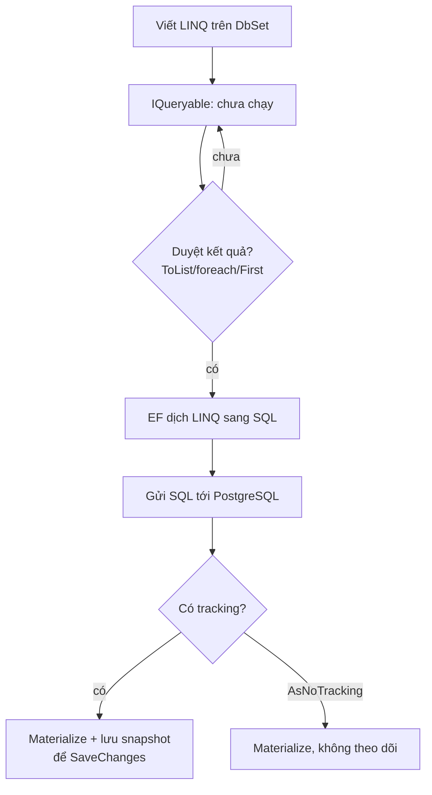

# EF Core: Map, Migration, Truy vấn

!!! info "Bạn đang ở đây"
    cần trước: sql nền tảng và join/group by/subquery; biết đọc câu lệnh select/where/join.
    mở khoá: dùng entity framework core để ánh xạ lớp c# sang bảng, sinh migration, và viết truy vấn linq dịch ra sql an toàn trước khi vào tầng repository và web api.

> Mục tiêu (đo được): sau chương này bạn có thể **áp dụng** EF Core để định nghĩa một `DbContext` với quan hệ 1-n, tạo và chạy migration, viết truy vấn LINQ đúng, chọn tracking hay `AsNoTracking`, và tránh N+1 bằng `Include` — mà không để `IQueryable` rò ra ngoài repository.

## 0. Câu hỏi/đoán nhanh

Đọc đoạn giả mã sau rồi đoán trước khi xem đáp án:

1. `var q = db.Orders.Where(o => o.Amount > 100);` — dòng này đã chạm database chưa?
2. Vòng lặp `foreach (var o in db.Orders) { var c = o.Customer.Name; }` với 100 đơn hàng sẽ bắn bao nhiêu câu SQL nếu không có `Include`?
3. Nếu chỉ đọc dữ liệu để hiển thị (không sửa), nên bật hay tắt change tracking?

???+ note "Đáp án"
    1. **Chưa.** LINQ trên `IQueryable` là *deferred* (trì hoãn). SQL chỉ chạy khi bạn duyệt (`foreach`, `ToList`, `First`, `Count`...).
    2. **1 + 100 = 101 câu** — đây chính là N+1: 1 câu lấy đơn hàng, rồi mỗi đơn thêm 1 câu lấy `Customer` (lazy/explicit loading). `Include` gộp lại còn 1-2 câu.
    3. **Tắt** — dùng `AsNoTracking()` để EF không giữ snapshot theo dõi thay đổi, nhanh và nhẹ RAM hơn.

## 1. Ý niệm cốt lõi

EF Core là ORM: nó ánh xạ **lớp C# (entity)** sang **bảng**, **thuộc tính** sang **cột**, và **navigation property** sang **quan hệ khoá ngoại**. Bạn viết LINQ, EF *dịch* (translate) sang SQL rồi đọc kết quả về thành đối tượng.

Hai trụ cột cần nhớ:

- `DbContext`: đại diện một phiên làm việc với database; chứa các `DbSet<T>` (mỗi `DbSet` ~ một bảng) và theo dõi thay đổi qua *change tracker*.
- **Migration**: bản ghi có phiên bản của schema. `dotnet ef migrations add <Ten>` sinh code mô tả thay đổi; `dotnet ef database update` áp vào database thật.

| Khái niệm EF Core | Ánh xạ tới database | Ghi chú |
|-------------------|---------------------|---------|
| `DbContext` | một kết nối/phiên | vòng đời ngắn, `scoped` trong web |
| `DbSet<Order>` | bảng `Orders` | điểm vào truy vấn |
| entity `Order` | dòng trong bảng | class thường (POCO) |
| thuộc tính `Amount` | cột `Amount` | kiểu C# ↔ kiểu SQL |
| navigation `Order.Customer` | khoá ngoại `CustomerId` | quan hệ n-1 |
| `LINQ Where/Select` | `WHERE`/`SELECT` | dịch phía server |

Vòng đời một truy vấn EF Core:



!!! danger "Hiểu lầm phổ biến"
    "EF cứ gọi `.Where(...)` là chạy SQL ngay." **Sai.** `IQueryable` là trì hoãn — chưa chạm database cho tới khi materialize. Nhưng nếu bạn vô tình gọi `.ToList()` *quá sớm* (rồi mới `.Where` trên `IEnumerable`), toàn bộ bảng bị kéo về RAM và lọc ở client — chậm và tốn bộ nhớ. Luôn giữ chuỗi ở dạng `IQueryable` cho tới bước cuối trong repository.

## 2. Ví dụ mẫu

Đoạn dưới cần package `Microsoft.EntityFrameworkCore` và provider PostgreSQL nên đánh dấu `test:skip`. Đây là một `DbContext` với quan hệ 1-n (một `Customer` có nhiều `Order`):

```csharp title="C#"
// test:skip cần EF Core + provider Npgsql, không tự-compile bằng BCL
using Microsoft.EntityFrameworkCore;

public class Customer
{
    public int Id { get; set; }
    public string Name { get; set; } = "";
    public List<Order> Orders { get; set; } = new();   // navigation 1-n
}

public class Order
{
    public int Id { get; set; }
    public decimal Amount { get; set; }
    public int CustomerId { get; set; }                // khoá ngoại
    public Customer Customer { get; set; } = null!;     // navigation n-1
}

public class ShopContext : DbContext
{
    public DbSet<Customer> Customers => Set<Customer>();
    public DbSet<Order> Orders => Set<Order>();

    protected override void OnConfiguring(DbContextOptionsBuilder options) =>
        options.UseNpgsql("Host=localhost;Database=shop;Username=app;Password=secret");

    protected override void OnModelCreating(ModelBuilder b)
    {
        b.Entity<Order>()
            .HasOne(o => o.Customer)
            .WithMany(c => c.Orders)
            .HasForeignKey(o => o.CustomerId);
    }
}
```

Tạo và áp migration từ terminal (chạy được, không cần đánh dấu):

```bash title="Terminal"
dotnet ef migrations add InitialCreate
dotnet ef database update
```

Output kỳ vọng (rút gọn):

```text title="Kết quả"
Build started...
Build succeeded.
Done. To undo this action, use 'ef migrations remove'
...
Applying migration '20260701120000_InitialCreate'.
Done.
```

Truy vấn LINQ dịch sang SQL (đọc, chỉ hiển thị nên tắt tracking):

```csharp title="C#"
// test:skip cần EF Core, minh hoạ truy vấn dịch sang SQL
var report = await db.Customers
    .AsNoTracking()
    .Where(c => c.Orders.Any(o => o.Amount > 100))
    .Select(c => new { c.Name, Total = c.Orders.Sum(o => o.Amount) })
    .ToListAsync();
```

SQL EF Core sinh ra (xấp xỉ, dialect PostgreSQL):

```sql title="SQL"
SELECT c."Name", (
    SELECT COALESCE(SUM(o0."Amount"), 0.0)
    FROM "Orders" AS o0
    WHERE c."Id" = o0."CustomerId") AS "Total"
FROM "Customers" AS c
WHERE EXISTS (
    SELECT 1 FROM "Orders" AS o
    WHERE c."Id" = o."CustomerId" AND o."Amount" > 100.0);
```

## 3. Bài tập có giàn giáo

Viết một phương thức repository trả về danh sách khách kèm các đơn hàng của họ **trong 1 câu SQL** (không N+1), chỉ đọc nên không tracking, và **không** trả `IQueryable` ra ngoài. Điền vào các chỗ `/* ? */`:

```csharp title="C#"
// test:skip cần EF Core, bài tập điền chỗ trống
public async Task<List<Customer>> GetCustomersWithOrdersAsync()
{
    return await _db.Customers
        ./* ? tắt tracking */()
        ./* ? nạp kèm Orders */(c => c.Orders)
        ./* ? thực thi trả về List */();
}
```

???+ success "Lời giải + giải thích"
    ```csharp title="C#"
    // test:skip cần EF Core
    public async Task<List<Customer>> GetCustomersWithOrdersAsync()
    {
        return await _db.Customers
            .AsNoTracking()          // chỉ đọc, không cần snapshot
            .Include(c => c.Orders)  // JOIN sẵn, tránh N+1
            .ToListAsync();          // materialize -> chạy SQL, trả List
    }
    ```
    Vì sao: `Include` báo EF nạp `Orders` cùng lúc bằng một truy vấn có JOIN (hoặc split query), nên không có 100 câu con. `AsNoTracking` bỏ chi phí theo dõi thay đổi vì ta không sửa. `ToListAsync` là nơi duy nhất materialize — trả về `List<Customer>` (kiểu cụ thể), nên `IQueryable` **không** rò ra ngoài repository; tầng gọi không thể vô tình nối thêm `.Where` chạy SQL bất ngờ.

## 4. Cạm bẫy & hiệu năng

!!! warning "Những lỗi hay gặp"
    - **N+1**: truy cập navigation trong vòng lặp mà quên `Include`. Bật log SQL để phát hiện số câu tăng theo số dòng.
    - **Rò `IQueryable`**: repository trả `IQueryable<T>`. Bên ngoài nối tiếp LINQ khiến SQL chạy ngoài tầm kiểm soát và có thể mở nhiều `DbContext`. Luôn "đóng" bằng `ToListAsync`/`FirstOrDefaultAsync` trước khi trả.
    - **Client evaluation ngầm**: gọi `.ToList()` quá sớm rồi lọc trên `IEnumerable` — kéo cả bảng về RAM.
    - **Include quá tay**: `Include` nhiều navigation lớn tạo tích Descartes; cân nhắc `AsSplitQuery()` hoặc projection `Select` chỉ lấy cột cần.
    - **Quên `await`**: dùng `ToList()` đồng bộ trên đường async chặn thread.

## Tự kiểm tra

1. `IQueryable` được thực thi lúc nào?
2. Hai lệnh CLI nào tạo migration rồi áp vào database?
3. Khi nào nên dùng `AsNoTracking()`?
4. N+1 xảy ra thế nào và cách khắc phục cơ bản?
5. Vì sao không nên trả `IQueryable` ra khỏi repository?

???+ note "Đáp án"
    1. Khi materialize: `ToList`/`ToListAsync`, `foreach`, `First`, `Count`, `Any`... — không phải lúc gọi `.Where`.
    2. `dotnet ef migrations add <Ten>` rồi `dotnet ef database update`.
    3. Khi truy vấn **chỉ đọc** (hiển thị/báo cáo), không định sửa và `SaveChanges`; giúp nhanh và ít tốn bộ nhớ hơn.
    4. Truy cập navigation trong vòng lặp mà không nạp sẵn → 1 câu chính + N câu con. Khắc phục bằng `Include` (hoặc projection `Select`).
    5. Vì bên ngoài có thể nối thêm LINQ, khiến SQL chạy ngoài kiểm soát, phụ thuộc vòng đời `DbContext` đã đóng, và phá vỡ ranh giới tầng. Đóng bằng phương thức materialize và trả kiểu cụ thể (`List<T>`).

??? abstract "DEEP DIVE: split query, compiled query & change tracker"
    - **Single vs split query**: `Include` mặc định dùng một JOIN. Nếu có nhiều collection navigation, JOIN gây nhân bản dòng (tích Descartes). `AsSplitQuery()` tách thành nhiều câu SELECT, giảm dữ liệu trùng nhưng mất tính atomic trong một transaction ngầm.
    - **Compiled query**: `EF.CompileAsyncQuery(...)` cache kế hoạch dịch LINQ→SQL cho các truy vấn nóng, bỏ chi phí dịch lặp lại.
    - **Change tracker chi tiết**: với tracking, mỗi entity có `EntityState` (`Added`/`Modified`/`Deleted`/`Unchanged`). `SaveChanges` duyệt tracker, sinh `INSERT/UPDATE/DELETE`. `AsNoTracking` bỏ hẳn snapshot; nếu vẫn muốn giữ định danh nhưng không snapshot, có `AsNoTrackingWithIdentityResolution`.
    - **Projection thay Include**: `Select` sang DTO chỉ lấy cột cần thường nhanh hơn `Include` cả entity, đồng thời tự nhiên tránh trả entity đầy đủ ra ngoài.
    - **Model chung**: khi cần AI sinh code EF, mô tả yêu cầu cho dòng Claude 4.x (Opus/Sonnet/Haiku) và luôn review SQL sinh ra qua log trước khi tin.

Tiếp theo -> repository pattern và tầng truy cập dữ liệu
