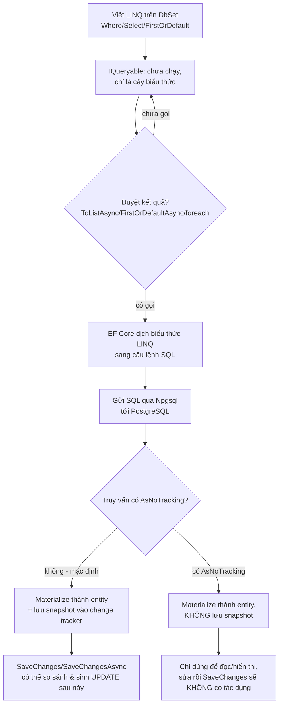

# EF Core: DbContext, Entity & Truy vấn

!!! info "Bạn đang ở đây"
    cần trước: sql nền tảng, join/group by/having, index & transaction — biết đọc câu lệnh select/where/join và hiểu vì sao transaction cần cho ghi dữ liệu an toàn.
    mở khoá: dùng entity framework core (một ORM cho .net) để định nghĩa lớp c# ánh xạ tới bảng, cấu hình kết nối tới postgresql, viết truy vấn linq cơ bản dịch ra sql, chọn tracking hay không, và lưu thay đổi bằng savechanges — trước khi sang migration và repository pattern.

> Mục tiêu (đo được): sau chương này bạn có thể **áp dụng** EF Core để tạo một lớp kế thừa `DbContext` với `DbSet<T>`, định nghĩa entity POCO ánh xạ tới bảng, cấu hình connection string qua `AddDbContext`, viết truy vấn LINQ dùng `Where`/`Select`/`FirstOrDefault` và giải thích SQL nó dịch ra, chọn đúng lúc dùng `AsNoTracking`, và gọi `SaveChanges()` để ghi thay đổi xuống database.

## 0. Câu hỏi/đoán nhanh

Đọc các phát biểu sau rồi đoán đúng/sai trước khi xem đáp án:

1. `DbContext` là chính bản thân kết nối TCP tới PostgreSQL, mở một lần và dùng mãi mãi cho cả ứng dụng.
2. `DbSet<Order> Orders` là một danh sách (`List<Order>`) đã được nạp sẵn toàn bộ dữ liệu bảng `Orders` vào bộ nhớ ngay khi `DbContext` được tạo.
3. `var q = db.Orders.Where(o => o.Amount > 100);` — dòng này đã gửi câu lệnh SQL tới PostgreSQL chưa?
4. Nếu bạn chỉ đọc dữ liệu để hiển thị lên màn hình (không sửa gì), việc EF Core âm thầm theo dõi (track) từng entity đọc được là thừa và tốn tài nguyên.
5. Sửa một thuộc tính trên entity (`order.Amount = 500`) sẽ tự động ghi xuống database ngay lập tức.

???+ note "Đáp án"
    1. **Sai.** `DbContext` không phải là kết nối — nó là một *phiên làm việc* quản lý kết nối, cấu hình, và change tracker. Bản thân kết nối TCP thật tới PostgreSQL do EF Core mở/đóng bên dưới khi cần (qua Npgsql), và `DbContext` được thiết kế để sống **ngắn hạn** (một request web, hoặc một đơn vị công việc), không phải mở suốt đời ứng dụng.
    2. **Sai.** `DbSet<Order>` không tự nạp gì cả cho tới khi bạn viết một truy vấn LINQ và thực thi nó (materialize). Nó chỉ là "điểm vào" để bắt đầu xây truy vấn.
    3. **Chưa.** Đây là `IQueryable` — trì hoãn (deferred). SQL chỉ chạy khi bạn duyệt kết quả (`ToList`, `foreach`, `FirstOrDefault`...).
    4. **Đúng.** Đây chính xác là lúc nên dùng `AsNoTracking()` — mục 6 của chương.
    5. **Sai.** Chỉ thay đổi trong bộ nhớ (nếu entity đang được tracking). Phải gọi `SaveChanges()` (hoặc `SaveChangesAsync()`) thì EF Core mới sinh câu lệnh `UPDATE` và gửi xuống database.

## 1. DbContext là gì

**Định nghĩa:** `DbContext` là một lớp C# do bạn viết (kế thừa từ `Microsoft.EntityFrameworkCore.DbContext`), đại diện cho **một phiên làm việc** với database — nó biết cách kết nối tới database nào, biết những bảng nào được ánh xạ (qua các `DbSet<T>`), và theo dõi thay đổi trên các đối tượng đã đọc ra để có thể ghi lại sau này.

Ví dụ tối thiểu — một `DbContext` trống, chưa có `DbSet` nào, chỉ để thấy hình dạng cơ bản nhất:

```csharp title="C#"
// test:skip cần package Microsoft.EntityFrameworkCore, không tự-compile bằng BCL
using Microsoft.EntityFrameworkCore;

public class ShopContext : DbContext
{
    protected override void OnConfiguring(DbContextOptionsBuilder options) =>
        options.UseNpgsql("Host=localhost;Database=shop;Username=app;Password=secret");
}
```

Ở đây `ShopContext` là lớp `DbContext` hợp lệ nhỏ nhất: nó biết kết nối tới đâu (`OnConfiguring`), nhưng chưa ánh xạ bảng nào cả — mục 2 sẽ thêm `DbSet<T>` để nó thật sự hữu ích.

**Dùng sai:** quên gọi `base` constructor khi `DbContext` nhận `DbContextOptions` từ bên ngoài (thường gặp khi dùng dependency injection trong ASP.NET Core) khiến `options` không được truyền vào lớp cha.

```csharp title="C#"
// test:skip cần EF Core; minh hoạ lỗi CS khi thiếu ': base(options)'
using Microsoft.EntityFrameworkCore;

public class ShopContext : DbContext
{
    public ShopContext(DbContextOptions<ShopContext> options)   // thiếu ": base(options)"
    {
    }
}
// CS7036: There is no argument given that corresponds to the required parameter
// 'options' of 'DbContext.DbContext(DbContextOptions)'
```

`DbContext` (lớp cha) có constructor yêu cầu tham số `DbContextOptions`; nếu constructor của lớp con không chuyển tiếp `options` xuống bằng `: base(options)`, trình biên dịch báo lỗi **CS7036** vì không tìm thấy constructor phù hợp của lớp cha để gọi.

## 2. DbSet\<T\>

**Định nghĩa:** `DbSet<T>` là một thuộc tính trên `DbContext`, đại diện cho **một bảng cụ thể** trong database (ứng với entity `T`) — nó vừa là điểm bắt đầu để viết truy vấn LINQ, vừa là nơi bạn gọi các thao tác thêm/xoá (`Add`, `Remove`) trước khi `SaveChanges()`.

Ví dụ tối thiểu — thêm một `DbSet<Order>` vào `ShopContext`, với entity `Order` đơn giản nhất có thể (chỉ để minh hoạ `DbSet`, chưa có quan hệ khoá ngoại):

```csharp title="C#"
// test:skip cần EF Core, không tự-compile bằng BCL
using Microsoft.EntityFrameworkCore;

public class Order
{
    public int Id { get; set; }
    public decimal Amount { get; set; }
}

public class ShopContext : DbContext
{
    public DbSet<Order> Orders => Set<Order>();   // "Orders" ánh xạ bảng "Orders"

    protected override void OnConfiguring(DbContextOptionsBuilder options) =>
        options.UseNpgsql("Host=localhost;Database=shop;Username=app;Password=secret");
}
```

`Set<Order>()` là cách EF Core hiện đại tạo `DbSet<Order>` (thay vì `new DbSet<Order>()` — bạn không tự khởi tạo `DbSet`, EF Core làm việc đó bên trong). Tên thuộc tính `Orders` (số nhiều, theo quy ước) sẽ là tên bảng mặc định `"Orders"` nếu không cấu hình gì khác.

**Dùng sai:** khai báo `DbSet<T>` với kiểu `T` không có constructor không tham số công khai và không cấu hình gì thêm — EF Core vẫn build được nhưng sẽ ném lỗi **lúc chạy** khi cố tạo (materialize) entity đó nếu nó không đáp ứng được yêu cầu ánh xạ cơ bản (ví dụ: entity là `class` `abstract` chưa cấu hình kế thừa).

```csharp title="C#"
// test:skip cần EF Core; minh hoạ lỗi runtime khi entity không hợp lệ
using Microsoft.EntityFrameworkCore;

public abstract class Order   // abstract: không thể khởi tạo trực tiếp
{
    public int Id { get; set; }
}

public class ShopContext : DbContext
{
    public DbSet<Order> Orders => Set<Order>();
}
// InvalidOperationException: The entity type 'Order' is abstract and cannot be
// instantiated. In order to use inheritance, create at least one concrete type
// that derives from it.
```

EF Core cần tạo được thực thể cụ thể của `Order` khi đọc dữ liệu về; một lớp `abstract` không đáp ứng điều kiện này trừ khi bạn cấu hình một chiến lược kế thừa (TPH/TPT) với ít nhất một lớp con cụ thể — nằm ngoài phạm vi chương này.

## 3. Entity class (POCO) ánh xạ tới bảng

**Định nghĩa:** entity là một lớp C# thông thường (POCO — Plain Old CLR Object, nghĩa là không bắt buộc kế thừa từ lớp đặc biệt nào của EF Core), trong đó mỗi **thuộc tính** (property) ánh xạ tới một **cột** trong bảng, và bản thân lớp ánh xạ tới **một bảng**.

Ví dụ tối thiểu — entity `Customer` với các kiểu dữ liệu C# phổ biến ánh xạ sang cột PostgreSQL tương ứng:

```csharp title="C#"
// test:skip cần EF Core, không tự-compile bằng BCL
public class Customer
{
    public int Id { get; set; }                 // ánh xạ cột "Id" kiểu integer
    public string Name { get; set; } = "";       // ánh xạ cột "Name" kiểu text
    public DateTime CreatedAt { get; set; }       // ánh xạ cột "CreatedAt" kiểu timestamp
    public bool IsActive { get; set; }            // ánh xạ cột "IsActive" kiểu boolean
}
```

EF Core dùng **convention** (quy ước) để suy ra ánh xạ mà không cần cấu hình gì thêm: tên lớp `Customer` → tên bảng `"Customers"` (số nhiều), tên thuộc tính → tên cột giữ nguyên, thuộc tính tên `Id` (hoặc `<TenLop>Id`) → tự động là khoá chính (primary key).

**Dùng sai:** đặt tên thuộc tính khoá chính khác quy ước (không phải `Id` và không phải `CustomerId`) mà không cấu hình gì thêm — EF Core sẽ ném lỗi lúc build model vì không suy luận được khoá chính.

```csharp title="C#"
// test:skip cần EF Core; minh hoạ lỗi khi thiếu khoá chính theo quy ước
public class Customer
{
    public int MaSoKhachHang { get; set; }   // không khớp quy ước "Id"/"CustomerId"
    public string Name { get; set; } = "";
}
// System.InvalidOperationException: The entity type 'Customer' requires a
// primary key to be defined.
```

Vì không có thuộc tính nào khớp quy ước đặt tên khoá chính, EF Core không tự suy ra được khoá chính cho `Customer`; phải cấu hình tường minh bằng thuộc tính `[Key]` hoặc Fluent API `modelBuilder.Entity<Customer>().HasKey(c => c.MaSoKhachHang)` (nằm ngoài phạm vi tối thiểu của chương này, nhắc lại ở chương migration).

### 3.1 Thuộc tính bắt buộc (NOT NULL) vs có thể null

**Định nghĩa:** với nullable reference types bật sẵn (mặc định cho dự án .NET hiện đại), một thuộc tính kiểu tham chiếu (`string`, một entity khác...) khai báo **không** có dấu `?` (ví dụ `string Name`) được EF Core hiểu là **bắt buộc** — ánh xạ tới cột `NOT NULL`; khai báo **có** dấu `?` (ví dụ `string? GhiChu`) được hiểu là **tuỳ chọn** — ánh xạ tới cột cho phép `NULL`.

Ví dụ tối thiểu — thêm một thuộc tính tuỳ chọn `GhiChu` (ghi chú) bên cạnh `Name` bắt buộc:

```csharp title="C#"
// test:skip cần EF Core, minh hoạ NOT NULL vs nullable qua kiểu tham chiếu
public class Customer
{
    public int Id { get; set; }
    public string Name { get; set; } = "";      // không có "?" -> cột NOT NULL
    public string? GhiChu { get; set; }          // có "?" -> cột cho phép NULL
}
```

EF Core dịch điều này thành ràng buộc cột khi sinh migration (chương sau): `Name` sẽ có `NOT NULL`, còn `GhiChu` thì không — khớp đúng ý nghĩa "bắt buộc phải có" so với "có thể bỏ trống" trong nghiệp vụ.

**Dùng sai:** khai báo thuộc tính bắt buộc (không `?`) nhưng không gán giá trị khởi tạo, trong khi dự án bật nullable reference types — đây là cảnh báo biên dịch (không phải lỗi chặn build mặc định), cảnh báo entity có thể chứa `null` dù kiểu khai báo nói "không bao giờ null".

```csharp title="C#"
// test:skip cần EF Core; minh hoạ cảnh báo CS8618
public class Customer
{
    public int Id { get; set; }
    public string Name { get; set; }   // thiếu "= \"\"" hoặc constructor gán giá trị
}
// warning CS8618: Non-nullable property 'Name' must contain a non-null value
// when exiting constructor. Consider declaring the property as nullable.
```

Trình biên dịch cảnh báo **CS8618** vì `Name` được khai báo là kiểu tham chiếu không-null (`string`, không có `?`), nhưng không có giá trị mặc định nào được gán và cũng không có constructor nào đảm bảo gán nó — về lý thuyết, một `new Customer()` sẽ có `Name` là `null` dù kiểu nói "không bao giờ null". Đây chỉ là cảnh báo (build vẫn thành công), nhưng nên sửa bằng cách gán giá trị mặc định (`= ""`) như ví dụ đầu mục này, vì EF Core sẽ tự điền lại giá trị thật khi đọc từ database — giá trị `""` chỉ là placeholder tạm trước khi vật chất hoá.

## 4. Cấu hình kết nối: connection string & AddDbContext

**Định nghĩa:** connection string là một chuỗi văn bản chứa các thông tin cần để kết nối tới một database cụ thể (host, tên database, tài khoản, mật khẩu...); `AddDbContext<T>` là một phương thức mở rộng dùng trong phần khởi tạo ứng dụng ASP.NET Core để đăng ký `DbContext` của bạn vào dependency injection container, kèm theo cấu hình connection string đó.

Ví dụ tối thiểu — đăng ký `ShopContext` trong `Program.cs` của một ứng dụng ASP.NET Core, đọc connection string từ cấu hình thay vì viết cứng trong code:

```csharp title="C#"
// test:skip cần EF Core + Npgsql + ASP.NET Core hosting, không tự-compile bằng BCL
using Microsoft.EntityFrameworkCore;

var builder = WebApplication.CreateBuilder(args);

builder.Services.AddDbContext<ShopContext>(options =>
    options.UseNpgsql(builder.Configuration.GetConnectionString("ShopDb")));

var app = builder.Build();
```

Tương ứng trong `appsettings.json`:

```json title="appsettings.json"
{
  "ConnectionStrings": {
    "ShopDb": "Host=localhost;Database=shop;Username=app;Password=secret"
  }
}
```

`AddDbContext<ShopContext>` đăng ký `ShopContext` với vòng đời **scoped** mặc định (một instance mới cho mỗi HTTP request) — đúng với nguyên tắc `DbContext` nên sống ngắn hạn đã nói ở mục 1. Từ đây, bất kỳ lớp nào (ví dụ controller hoặc repository) có thể nhận `ShopContext` qua constructor injection mà không cần tự tạo (`new ShopContext(...)`).

**Dùng sai:** viết sai tên tham số trong connection string (ví dụ `Usernam` thay vì `Username`) — không phải lỗi biên dịch, mà là lỗi **runtime** khi EF Core thật sự cố mở kết nối.

```text title="Kết quả"
Npgsql.NpgsqlException: Exception while connecting
 ---> System.ArgumentException: Keyword not supported: 'usernam'
```

Vì connection string chỉ là văn bản thô, trình biên dịch C# không thể kiểm tra tính hợp lệ của nó — lỗi chỉ lộ ra khi Npgsql (driver PostgreSQL cho .NET) thật sự phân tích chuỗi lúc mở kết nối, ném ra `ArgumentException` bọc trong `NpgsqlException`.

## Tổng hợp 4 khái niệm nền tảng

Bốn khái niệm ở mục 1-4 (`DbContext`, `DbSet<T>`, entity POCO, connection string/`AddDbContext`) đã được giới thiệu riêng lẻ, đủ 4 bước, ở trên. Bảng dưới đây chỉ **tổng hợp lại** — không giới thiệu khái niệm mới nào:

| Khái niệm | Vai trò | Ví dụ trong `ShopContext` |
|-----------|---------|----------------------------|
| `DbContext` | phiên làm việc: cấu hình kết nối + tập hợp `DbSet` + change tracker | lớp `ShopContext : DbContext` |
| `DbSet<T>` | điểm vào truy vấn/ghi cho một bảng | `DbSet<Customer> Customers`, `DbSet<Order> Orders` |
| entity (POCO) | lớp C# ánh xạ 1-1 tới bảng, thuộc tính ánh xạ tới cột | `class Customer { public int Id; ... }` |
| connection string + `AddDbContext` | thông tin kết nối + đăng ký `DbContext` vào DI | `AddDbContext<ShopContext>(o => o.UseNpgsql(...))` |

Vòng đời một truy vấn EF Core, từ lúc viết LINQ tới lúc dữ liệu về tới tay ứng dụng:



!!! danger "Hiểu lầm phổ biến"
    "Khai báo `DbSet<Order> Orders` là EF Core đã tải bảng `Orders` vào bộ nhớ." **Sai.** `DbSet<T>` chỉ là một *điểm vào* để xây truy vấn — giống một cái tên bạn dùng để bắt đầu câu `SELECT ... FROM "Orders"`, không phải bản thân dữ liệu. Dữ liệu chỉ thật sự rời PostgreSQL và vào bộ nhớ ứng dụng khi bạn materialize (`ToListAsync`, `FirstOrDefaultAsync`, `foreach`...) — đúng như luồng `IQueryable` đã học ở mục 5.

## 5. Truy vấn LINQ cơ bản dịch sang SQL

### 5.1 Where

**Định nghĩa:** `Where` là một phương thức LINQ nhận vào một điều kiện (biểu thức trả về `bool` cho mỗi phần tử), trả về một `IQueryable<T>` mới chỉ chứa những phần tử thoả điều kiện đó — khi thực thi trên `DbSet<T>`, EF Core dịch nó thành mệnh đề SQL `WHERE`.

Ví dụ tối thiểu — lấy các đơn hàng có `Amount` lớn hơn 100:

```csharp title="C#"
// test:skip cần EF Core, minh hoạ Where
var donHangLon = await db.Orders
    .Where(o => o.Amount > 100)
    .ToListAsync();
```

SQL EF Core sinh ra (xấp xỉ, dialect PostgreSQL):

```sql title="SQL"
SELECT o."Id", o."Amount"
FROM "Orders" AS o
WHERE o."Amount" > 100.0;
```

**Dùng sai:** gọi `.ToList()` (materialize) *trước* rồi mới `.Where` trên kết quả — về mặt cú pháp hoàn toàn hợp lệ (không lỗi CS, không exception), nhưng **sai về hiệu năng**: toàn bộ bảng bị kéo về bộ nhớ ứng dụng trước, rồi lọc bằng LINQ-to-Objects trên `IEnumerable`, thay vì để PostgreSQL lọc bằng `WHERE`.

```csharp title="C#"
// test:skip cần EF Core; minh hoạ lỗi hiệu năng (không phải lỗi biên dịch)
var tatCa = db.Orders.ToList();                 // kéo TOÀN BỘ bảng về RAM trước
var donHangLon = tatCa.Where(o => o.Amount > 100).ToList();  // lọc ở client, quá muộn
```

Không có thông báo lỗi nào cả — chương trình chạy đúng kết quả, nhưng nếu bảng `Orders` có một triệu dòng, câu lệnh đầu tiên đã tải cả triệu dòng vào bộ nhớ trước khi lọc, thay vì để PostgreSQL chỉ trả về các dòng thoả điều kiện. Luôn giữ `Where` trên `IQueryable` (trước khi gọi `ToList`/`ToListAsync`).

### 5.2 Select

**Định nghĩa:** `Select` là một phương thức LINQ nhận vào một hàm biến đổi (projection), trả về một `IQueryable<TKetQua>` mới trong đó mỗi phần tử đã được biến đổi theo hàm đó — khi thực thi trên `DbSet<T>`, EF Core dịch nó thành danh sách cột trong mệnh đề SQL `SELECT`.

Ví dụ tối thiểu — chỉ lấy tên khách hàng, không lấy toàn bộ entity `Customer`:

```csharp title="C#"
// test:skip cần EF Core, minh hoạ Select
var tenKhachHang = await db.Customers
    .Select(c => c.Name)
    .ToListAsync();
```

SQL EF Core sinh ra:

```sql title="SQL"
SELECT c."Name"
FROM "Customers" AS c;
```

Lưu ý: `Select` giúp chỉ lấy đúng cột cần — nếu bảng `Customers` có 20 cột nhưng bạn chỉ cần `Name`, `Select` khiến PostgreSQL chỉ trả về đúng một cột đó thay vì cả 20 cột như khi lấy nguyên `Customer`.

**Dùng sai:** dùng `Select` để chiếu sang một kiểu có logic C# mà PostgreSQL không có hàm tương đương và EF Core không biết dịch — gây lỗi runtime khi thực thi (không phải lỗi biên dịch, vì biểu thức LINQ hợp lệ về mặt cú pháp C#).

```csharp title="C#"
// test:skip cần EF Core; minh hoạ lỗi runtime "could not be translated"
var ketQua = await db.Customers
    .Select(c => TinhDiemUyTin(c))   // gọi phương thức C# tuỳ ý, EF không biết dịch
    .ToListAsync();

static int TinhDiemUyTin(Customer c) => c.Name.Length * 7;
// System.InvalidOperationException: The LINQ expression '...' could not be
// translated. Either rewrite the query in a form that can be translated, or
// switch to client evaluation explicitly by inserting a call to 'AsEnumerable',
// 'AsAsyncEnumerable', 'ToList', or 'ToListAsync'.
```

EF Core chỉ dịch được các biểu thức LINQ mà nó biết cách chuyển sang SQL (toán tử, một số hàm chuỗi/toán học được provider hỗ trợ); gọi một phương thức C# tuỳ ý bên trong `Select` khiến EF Core không tìm được cách dịch, nên ném `InvalidOperationException` ngay khi thực thi thay vì âm thầm chạy sai.

### 5.3 FirstOrDefault

**Định nghĩa:** `FirstOrDefault` (và `FirstOrDefaultAsync`) là một phương thức LINQ trả về **phần tử đầu tiên** thoả điều kiện (nếu có điều kiện truyền vào) hoặc phần tử đầu tiên của dãy, hoặc trả về `null` (với kiểu tham chiếu) nếu không có phần tử nào thoả — khác với `First`/`FirstAsync` sẽ ném exception khi không tìm thấy.

Ví dụ tối thiểu — tìm một khách hàng theo `Id`, có thể không tồn tại:

```csharp title="C#"
// test:skip cần EF Core, minh hoạ FirstOrDefault
var khachHang = await db.Customers
    .FirstOrDefaultAsync(c => c.Id == 42);

if (khachHang is null)
{
    Console.WriteLine("Không tìm thấy khách hàng 42");
}
```

SQL EF Core sinh ra (PostgreSQL dùng `LIMIT` để chỉ lấy một dòng):

```sql title="SQL"
SELECT c."Id", c."Name", c."CreatedAt", c."IsActive"
FROM "Customers" AS c
WHERE c."Id" = 42
LIMIT 1;
```

**Dùng sai:** dùng `First`/`FirstAsync` thay vì `FirstOrDefault`/`FirstOrDefaultAsync` khi không chắc chắn có dòng khớp — nếu không tìm thấy, EF Core ném exception thay vì trả `null`.

```csharp title="C#"
// test:skip cần EF Core; minh hoạ exception khi dùng First trên tập rỗng
var khachHang = await db.Customers
    .FirstAsync(c => c.Id == 9999);   // giả sử id 9999 không tồn tại
// System.InvalidOperationException: Sequence contains no elements
```

`First`/`FirstAsync` giả định *chắc chắn* có ít nhất một phần tử khớp; khi không có, chúng ném `InvalidOperationException` với thông điệp "Sequence contains no elements" ngay tại thời điểm thực thi, khác với `FirstOrDefault` chỉ lặng lẽ trả về `null`.

### 5.4 Kết hợp Where, Select và FirstOrDefault trong một truy vấn

`Where`, `Select`, `FirstOrDefault` đã được giới thiệu riêng lẻ ở trên; giờ ghép cả ba lại (thứ tự bình thường: lọc trước, chiếu cột sau, rồi lấy một dòng) để thấy chúng dịch cùng lúc thành **một** câu SQL duy nhất, không phải ba câu riêng:

```csharp title="C#"
// test:skip cần EF Core, ví dụ kết hợp Where + Select + FirstOrDefault
var tenKhachHangDauTien = await db.Customers
    .Where(c => c.IsActive)
    .Select(c => c.Name)
    .FirstOrDefaultAsync();
```

```sql title="SQL"
SELECT c."Name"
FROM "Customers" AS c
WHERE c."IsActive" = true
LIMIT 1;
```

Điểm quan trọng: dù bạn viết ba lời gọi phương thức LINQ nối tiếp nhau (`.Where().Select().FirstOrDefaultAsync()`), EF Core **không** chạy ba câu SQL riêng biệt — toàn bộ chuỗi chỉ là xây dựng một cây biểu thức trong bộ nhớ (`IQueryable`), và chỉ khi gặp `FirstOrDefaultAsync()` (bước materialize) thì EF Core mới dịch *toàn bộ* cây đó thành đúng một câu `SELECT ... WHERE ... LIMIT 1`.

## 6. Tracking mặc định vs AsNoTracking

**Định nghĩa:** tracking (theo dõi thay đổi) là hành vi **mặc định** của EF Core khi đọc entity ra từ một truy vấn — nó giữ lại một "ảnh chụp" (snapshot) ban đầu của mỗi entity trong bộ nhớ của `DbContext`, để sau này khi bạn sửa thuộc tính rồi gọi `SaveChanges()`, EF Core có thể so sánh và biết chính xác cột nào đã đổi. `AsNoTracking()` là một phương thức LINQ tắt hành vi này cho truy vấn đó, khiến EF Core đọc dữ liệu về nhưng **không** giữ snapshot.

Ví dụ tối thiểu — so sánh hai truy vấn giống hệt nhau, một có tracking (mặc định), một tắt tracking:

```csharp title="C#"
// test:skip cần EF Core, minh hoạ tracking mặc định
var khachHangCoTracking = await db.Customers
    .FirstOrDefaultAsync(c => c.Id == 1);
// EF Core giữ snapshot của entity này -> có thể sửa rồi SaveChanges()

var khachHangKhongTracking = await db.Customers
    .AsNoTracking()
    .FirstOrDefaultAsync(c => c.Id == 1);
// Không giữ snapshot -> nhẹ hơn, nhưng nếu sửa thuộc tính rồi gọi SaveChanges(),
// EF Core sẽ KHÔNG biết gì để ghi (entity này không nằm trong change tracker)
```

Dùng tracking (mặc định) khi bạn *định sửa rồi lưu*; dùng `AsNoTracking()` khi truy vấn *chỉ để đọc/hiển thị* — vì giữ snapshot tốn thêm bộ nhớ và một chút CPU để so sánh mà không mang lại lợi ích gì nếu bạn không bao giờ gọi `SaveChanges()` trên entity đó.

**Dùng sai:** đọc entity bằng `AsNoTracking()` rồi sửa thuộc tính và gọi `SaveChanges()`, kỳ vọng nó tự ghi xuống database — không có exception nào cả, nhưng **thay đổi bị bỏ qua hoàn toàn** (silent no-op) vì entity không nằm trong change tracker của `DbContext`.

```csharp title="C#"
// test:skip cần EF Core; minh hoạ lỗi logic âm thầm (không có exception)
var khachHang = await db.Customers
    .AsNoTracking()
    .FirstOrDefaultAsync(c => c.Id == 1);

khachHang!.Name = "Tên mới";
await db.SaveChangesAsync();
// Không lỗi, không exception -- nhưng "Tên mới" KHÔNG được ghi xuống database,
// vì entity đọc bằng AsNoTracking() không có trong change tracker của db.
```

Vì `SaveChangesAsync()` chỉ nhìn vào change tracker (danh sách entity đang được `DbContext` theo dõi) để quyết định sinh `UPDATE` cho entity nào; entity đọc qua `AsNoTracking()` chưa bao giờ được thêm vào danh sách đó, nên `SaveChangesAsync()` không thấy gì để ghi — đây là lỗi logic nguy hiểm vì nó **không báo lỗi**, chỉ âm thầm không lưu.

## 7. SaveChanges()

**Định nghĩa:** `SaveChanges()` (và `SaveChangesAsync()`) là phương thức trên `DbContext` duyệt qua toàn bộ entity đang được change tracker theo dõi, xác định entity nào là mới thêm/đã sửa/đã xoá, rồi sinh và gửi các câu lệnh `INSERT`/`UPDATE`/`DELETE` tương ứng xuống database trong **một transaction** (nếu có nhiều câu lệnh, EF Core tự bọc chúng trong một transaction ngầm để đảm bảo tất cả cùng thành công hoặc cùng thất bại).

Ví dụ tối thiểu — thêm một khách hàng mới rồi lưu:

```csharp title="C#"
// test:skip cần EF Core, minh hoạ SaveChanges cho INSERT
var khachHangMoi = new Customer { Name = "Trần Thị B", CreatedAt = DateTime.UtcNow };

db.Customers.Add(khachHangMoi);        // chỉ đưa vào change tracker, CHƯA chạm database
await db.SaveChangesAsync();           // giờ mới sinh và gửi câu lệnh INSERT

Console.WriteLine(khachHangMoi.Id);    // EF Core đã điền Id do database sinh ra (SERIAL)
```

SQL EF Core sinh ra (xấp xỉ):

```sql title="SQL"
INSERT INTO "Customers" ("Name", "CreatedAt", "IsActive")
VALUES ('Trần Thị B', '2026-07-03 00:00:00', false)
RETURNING "Id";
```

Một ví dụ khác — sửa một entity đang được tracking (không gọi `Add`, vì nó không phải dòng mới):

```csharp title="C#"
// test:skip cần EF Core, minh hoạ SaveChanges cho UPDATE
var khachHang = await db.Customers.FirstAsync(c => c.Id == 1);   // có tracking (mặc định)
khachHang.Name = "Tên đã cập nhật";
await db.SaveChangesAsync();   // EF Core tự nhận ra Name đã đổi, sinh UPDATE chỉ cột đó
```

**Dùng sai:** gọi `db.Customers.Add(...)` nhiều lần rồi quên gọi `SaveChangesAsync()` — không lỗi cú pháp, chương trình chạy hết và kết thúc bình thường, nhưng **không có dòng nào được ghi xuống database**.

```csharp title="C#"
// test:skip cần EF Core; minh hoạ lỗi logic khi quên SaveChanges
db.Customers.Add(new Customer { Name = "Khách A" });
db.Customers.Add(new Customer { Name = "Khách B" });
// thiếu: await db.SaveChangesAsync();
// Chương trình chạy xong, KHÔNG có exception, nhưng database vẫn TRỐNG —
// hai Customer chỉ tồn tại trong bộ nhớ (change tracker), chưa từng được gửi đi.
```

`Add` chỉ thay đổi trạng thái của entity trong change tracker thành `Added` — nó **không** tự động gửi SQL. Chỉ `SaveChanges()`/`SaveChangesAsync()` mới thật sự duyệt change tracker và gửi câu lệnh; quên gọi nó là lỗi rất phổ biến với người mới, đặc biệt nguy hiểm vì không có bất kỳ cảnh báo nào tại thời điểm biên dịch hay chạy.

## Cạm bẫy & thực chiến

- **Quên `SaveChanges()`/`SaveChangesAsync()`**: `Add`/thay đổi thuộc tính chỉ cập nhật change tracker trong bộ nhớ; không có gì được ghi xuống database cho tới khi gọi `SaveChanges`. Không có exception nào cảnh báo — chỉ phát hiện được khi kiểm tra lại dữ liệu.
- **Sửa entity đọc bằng `AsNoTracking()` rồi mong `SaveChanges()` ghi được**: entity đó không nằm trong change tracker nên thay đổi bị bỏ qua hoàn toàn, âm thầm, không lỗi (xem mục 6).
- **`Where` sau `ToList()` thay vì trước**: kéo cả bảng về RAM rồi mới lọc bằng LINQ-to-Objects, thay vì để PostgreSQL lọc bằng `WHERE` — không lỗi, chỉ chậm và tốn bộ nhớ với bảng lớn.
- **Dùng `First`/`FirstAsync` khi không chắc có dòng khớp**: ném `InvalidOperationException` ("Sequence contains no elements") thay vì trả `null` như `FirstOrDefault`/`FirstOrDefaultAsync` — chọn sai loại dễ khiến ứng dụng sập ở trường hợp hợp lệ (không tìm thấy).
- **Gọi phương thức C# tuỳ ý bên trong `Select`/`Where`**: EF Core chỉ dịch được các biểu thức nó nhận diện; gọi hàm C# tự viết bên trong truy vấn LINQ khiến EF Core ném `InvalidOperationException` "could not be translated" lúc chạy, dù code biên dịch bình thường.
- **`DbContext` sống quá lâu (singleton, biến static)**: `DbContext` được thiết kế cho vòng đời ngắn (scoped theo request); giữ một instance dùng chung xuyên suốt ứng dụng khiến change tracker phình to dần (giữ mọi entity từng đọc qua) và không an toàn khi nhiều luồng dùng chung cùng lúc.
- **Viết sai connection string**: không phải lỗi biên dịch vì đó chỉ là chuỗi văn bản — lỗi chỉ lộ ra lúc runtime khi Npgsql cố phân tích/kết nối, thường là `NpgsqlException` bọc `ArgumentException` hoặc lỗi xác thực.
- **Nhầm entity đã sửa với entity mới cần `Add`**: gọi `db.Customers.Add(customerDaTonTai)` cho một entity thật ra đã có sẵn trong database (ví dụ đọc về, sửa vài trường, rồi lỡ gọi `Add` thay vì để nguyên trạng thái tracking) khiến EF Core cố `INSERT` một dòng trùng khoá chính, gây lỗi vi phạm ràng buộc duy nhất (`23505`, xem chương ràng buộc dữ liệu) thay vì `UPDATE` như ý định.
- **Dùng nhiều `DbContext` xen kẽ trên cùng một entity**: đọc entity từ `context1`, rồi gọi `context2.SaveChanges()` với entity đó (không thuộc change tracker của `context2`) khiến EF Core coi nó là "chưa từng biết tới" và ném `InvalidOperationException` liên quan tới việc entity đã được một `DbContext` khác theo dõi, hoặc âm thầm không cập nhật đúng ý.

## Bài tập

**Bài 1 (giàn giáo).** Viết một phương thức chỉ đọc dữ liệu (không sửa) để hiển thị danh sách tên các khách hàng đang hoạt động (`IsActive == true`), sắp xếp không quan trọng. Điền vào chỗ trống, chọn đúng có/không tracking:

```csharp title="C#"
// test:skip cần EF Core, bài tập điền chỗ trống
public async Task<List<string>> GetActiveCustomerNamesAsync()
{
    return await _db.Customers
        ./* ? tắt tracking vì chỉ đọc để hiển thị */()
        ./* ? lọc IsActive == true */(c => c.IsActive)
        ./* ? chỉ lấy tên, không lấy cả entity */(c => c.Name)
        ./* ? thực thi trả về List */();
}
```

???+ success "Lời giải + giải thích"
    ```csharp title="C#"
    // test:skip cần EF Core
    public async Task<List<string>> GetActiveCustomerNamesAsync()
    {
        return await _db.Customers
            .AsNoTracking()             // chỉ đọc để hiển thị, không cần snapshot
            .Where(c => c.IsActive)     // dịch sang WHERE "IsActive" = true
            .Select(c => c.Name)        // dịch sang SELECT "Name" (không lấy cả entity)
            .ToListAsync();             // materialize -> chạy SQL, trả List<string>
    }
    ```
    Vì sao: đây là truy vấn chỉ đọc nên `AsNoTracking()` là lựa chọn đúng — không có ý định sửa rồi `SaveChanges()`. `Where` được đặt *trước* `Select` và *trước* `ToListAsync` để PostgreSQL lọc và chỉ trả đúng cột `Name`, thay vì kéo cả entity `Customer` về rồi mới xử lý ở client.

**Bài 2 (thiết kế).** Viết một phương thức nhận vào `id` và `soTienMoi`, tìm đơn hàng (`Order`) theo `id`, cập nhật `Amount` thành `soTienMoi`, và lưu xuống database. Nếu không tìm thấy đơn hàng, trả về `false` mà không ném exception; nếu thành công, trả về `true`.

???+ success "Lời giải + giải thích"
    ```csharp title="C#"
    // test:skip cần EF Core
    public async Task<bool> UpdateOrderAmountAsync(int id, decimal soTienMoi)
    {
        var order = await _db.Orders.FirstOrDefaultAsync(o => o.Id == id);
        if (order is null)
        {
            return false;
        }

        order.Amount = soTienMoi;
        await _db.SaveChangesAsync();
        return true;
    }
    ```
    Vì sao: dùng `FirstOrDefaultAsync` (không phải `FirstAsync`) vì trường hợp "không tìm thấy" là **hợp lệ**, cần xử lý bằng kiểm tra `null` chứ không phải bắt exception. Truy vấn này **không** dùng `AsNoTracking()` vì mục đích là sửa rồi lưu — cần tracking mặc định để `SaveChangesAsync()` nhận ra `Amount` đã đổi và sinh đúng câu `UPDATE` chỉ cho entity đó.

**Bài 3 (thiết kế).** Viết một phương thức thêm mới một `Customer` với `Name` truyền vào, `CreatedAt` là thời điểm hiện tại (UTC), `IsActive` là `true`, lưu xuống database, và trả về `Id` mà database đã tự sinh cho khách hàng đó.

???+ success "Lời giải + giải thích"
    ```csharp title="C#"
    // test:skip cần EF Core
    public async Task<int> CreateCustomerAsync(string name)
    {
        var customer = new Customer
        {
            Name = name,
            CreatedAt = DateTime.UtcNow,
            IsActive = true
        };

        _db.Customers.Add(customer);
        await _db.SaveChangesAsync();

        return customer.Id;
    }
    ```
    Vì sao: `Add` chỉ đưa `customer` vào change tracker với trạng thái `Added`, chưa chạm database. Chỉ sau khi `SaveChangesAsync()` chạy xong, PostgreSQL mới thật sự sinh giá trị cho cột `Id` (kiểu tự tăng) và trả về qua `RETURNING "Id"`; EF Core tự động gán giá trị đó ngược lại vào `customer.Id` trong bộ nhớ — đó là lý do đọc `customer.Id` chỉ **sau** dòng `await _db.SaveChangesAsync()` mới có giá trị đúng, đọc trước đó sẽ là `0` (giá trị mặc định của `int`).

## Tự kiểm tra

1. `DbContext` có phải là bản thân kết nối TCP tới database không? Nó thật sự đại diện cho điều gì?
2. `DbSet<Order> Orders` dùng để làm gì, và khi nào dữ liệu thật sự được đọc từ database?
3. Điều gì xảy ra nếu một entity không có thuộc tính nào khớp quy ước đặt tên khoá chính?
4. Vì sao viết sai connection string không bị bắt lỗi lúc biên dịch mà chỉ lộ ra lúc chạy?
5. `AsNoTracking()` khác gì so với hành vi mặc định, và nên dùng khi nào?
6. Điều gì xảy ra (có báo lỗi không) nếu bạn sửa thuộc tính của một entity đọc bằng `AsNoTracking()` rồi gọi `SaveChangesAsync()`?
7. `FirstOrDefaultAsync` khác `FirstAsync` ở điểm nào khi không tìm thấy phần tử khớp?
8. `Add()` trên `DbSet<T>` có ngay lập tức ghi dữ liệu xuống database không? Vì sao?
9. Đoạn LINQ `db.Orders.ToList().Where(o => o.Amount > 100)` có sai cú pháp không? Vì sao vẫn nên tránh viết như vậy?
10. Sau khi gọi `db.Customers.Add(customer)` rồi `await db.SaveChangesAsync()`, tại sao `customer.Id` mới có giá trị đúng (khác 0), không phải ngay sau dòng `Add`?
11. Vì sao `AddDbContext<T>` thường đăng ký `DbContext` với vòng đời scoped thay vì singleton?

???+ note "Đáp án"
    1. Không. `DbContext` là một *phiên làm việc* — nó quản lý cấu hình kết nối, tập hợp các `DbSet<T>`, và change tracker; kết nối TCP thật do Npgsql mở/đóng bên dưới khi cần, không phải là chính `DbContext`.
    2. `DbSet<Order>` là điểm bắt đầu để viết truy vấn LINQ (và gọi `Add`/`Remove`) trên bảng `Orders`. Dữ liệu chỉ thật sự được đọc khi bạn *thực thi* (materialize) truy vấn, ví dụ gọi `ToListAsync()`, `FirstOrDefaultAsync()`, hay `foreach` — không phải ngay khi khai báo `DbSet` hay viết `Where`.
    3. EF Core ném `InvalidOperationException`: "The entity type '...' requires a primary key to be defined" khi build model, vì nó không tự suy luận được đâu là khoá chính.
    4. Vì connection string chỉ là một chuỗi văn bản thô; trình biên dịch C# không phân tích nội dung chuỗi đó, nên chỉ khi Npgsql thật sự cố phân tích/kết nối lúc runtime thì lỗi (như `NpgsqlException`/`ArgumentException`) mới xuất hiện.
    5. `AsNoTracking()` tắt việc giữ snapshot theo dõi thay đổi cho truy vấn đó; mặc định EF Core luôn giữ snapshot. Nên dùng `AsNoTracking()` khi truy vấn chỉ để đọc/hiển thị, không có ý định sửa rồi gọi `SaveChanges()` trên các entity đó.
    6. Không có lỗi/exception nào cả, nhưng thay đổi **bị bỏ qua hoàn toàn** một cách âm thầm — vì entity đó không nằm trong change tracker của `DbContext`, `SaveChangesAsync()` không biết để sinh `UPDATE`.
    7. `FirstOrDefaultAsync` trả về `null` nếu không tìm thấy phần tử khớp; `FirstAsync` ném `InvalidOperationException` ("Sequence contains no elements") trong cùng tình huống.
    8. Không. `Add()` chỉ chuyển trạng thái của entity trong change tracker thành `Added` (hoàn toàn trong bộ nhớ); phải gọi `SaveChanges()`/`SaveChangesAsync()` thì EF Core mới sinh và gửi câu lệnh `INSERT` xuống database.
    9. Không sai cú pháp — chương trình biên dịch và chạy được. Nhưng `ToList()` gọi trước khiến EF Core kéo **toàn bộ** bảng `Orders` về bộ nhớ ứng dụng trước, rồi `Where` sau đó chạy bằng LINQ-to-Objects trên `IEnumerable`/`List` (lọc ở client), không phải trên PostgreSQL — với bảng lớn, điều này tốn bộ nhớ và chậm hơn nhiều so với để `WHERE` chạy trong SQL.
    10. Vì giá trị `Id` (thường là cột tự tăng — `SERIAL`/`IDENTITY`) do chính PostgreSQL sinh ra tại thời điểm thực thi câu lệnh `INSERT ... RETURNING "Id"`, chứ không phải do ứng dụng C# tự đặt trước. Trước khi `SaveChangesAsync()` chạy, `customer.Id` vẫn giữ giá trị mặc định của kiểu `int` là `0`; chỉ sau khi `INSERT` thật sự chạy và PostgreSQL trả kết quả về, EF Core mới gán ngược giá trị đó vào lại đối tượng `customer` trong bộ nhớ.
    11. Vì `DbContext` được thiết kế để sống ngắn hạn và giữ trạng thái (change tracker) đặc thù cho một đơn vị công việc; đăng ký thành `singleton` (dùng chung một instance suốt vòng đời ứng dụng) sẽ khiến change tracker phình to không giới hạn theo thời gian và không an toàn khi nhiều request/luồng cùng dùng chung một `DbContext` cùng lúc (EF Core không được thiết kế để thread-safe cho một instance dùng đồng thời). Vòng đời `scoped` (mặc định của `AddDbContext`) tạo một instance mới, sạch, cho mỗi HTTP request, tránh cả hai vấn đề trên.

??? abstract "DEEP DIVE: connection pooling, DbContextPooling, và ranh giới với migration"
    - **Connection pooling**: dù `DbContext` nên sống ngắn hạn, việc mở/đóng kết nối TCP thật tới PostgreSQL cho mỗi request sẽ rất tốn kém nếu làm từ đầu mỗi lần. Npgsql tự quản lý một **connection pool** bên dưới (tham số `Pooling=true` mặc định trong connection string) — khi `DbContext` "đóng" kết nối, kết nối vật lý thường được trả về pool để tái sử dụng, không thật sự đóng TCP.
    - **DbContextPooling**: `AddDbContextPool<T>` (thay cho `AddDbContext<T>`) tái sử dụng cả instance `DbContext` (không chỉ kết nối) giữa các request bằng cách reset trạng thái nội bộ, giảm chi phí cấp phát — cần cẩn trọng vì bất kỳ trạng thái tuỳ chỉnh nào bạn thêm vào `DbContext` (biến instance ngoài các `DbSet`) phải được reset đúng cách, nếu không dữ liệu có thể "rò" giữa các request.
    - **Ranh giới với migration**: chương này cố tình không đề cập tới `dotnet ef migrations add`/`dotnet ef database update` hay `OnModelCreating` với Fluent API để cấu hình quan hệ khoá ngoại — đó là chủ đề của chương kế tiếp, sau khi đã vững nền tảng `DbContext`/`DbSet`/entity/truy vấn ở đây.
    - **Quan hệ với transaction**: `SaveChanges()` tự bọc nhiều câu lệnh trong một transaction ngầm định (implicit transaction) để đảm bảo tính nguyên tử; khi cần gộp nhiều lần gọi `SaveChanges()` (hoặc SQL thô xen kẽ) vào cùng một transaction rõ ràng, dùng `_db.Database.BeginTransactionAsync()` — đây là điểm nối trực tiếp với khái niệm transaction đã học ở chương index & transaction.
    - **Mô hình AI hỗ trợ sinh code EF Core**: khi nhờ AI sinh truy vấn LINQ phức tạp, luôn bật log SQL (`options.LogTo(Console.WriteLine)`) để tự kiểm chứng câu lệnh dịch ra đúng ý định nghiệp vụ trước khi tin dùng trong production, bất kể dùng dòng Claude 4.x (Opus/Sonnet/Haiku) hay công cụ nào khác.
    - **Change tracker chi tiết hơn**: với tracking bật, mỗi entity trong `DbContext` có một `EntityState` gắn kèm — `Added` (mới, sẽ `INSERT`), `Modified` (đã đổi ít nhất một thuộc tính, sẽ `UPDATE`), `Deleted` (đã gọi `Remove`, sẽ `DELETE`), `Unchanged` (đọc về, chưa đổi gì, `SaveChanges` bỏ qua), hoặc `Detached` (không được theo dõi — đúng trạng thái của entity đọc qua `AsNoTracking()`). `SaveChanges()` chỉ hành động với ba trạng thái đầu.
    - **`AsNoTrackingWithIdentityResolution`**: một biến thể trung gian giữa tracking mặc định và `AsNoTracking()` — không giữ snapshot để so sánh khi `SaveChanges` (nên vẫn không dùng để sửa-rồi-lưu), nhưng đảm bảo nếu cùng một dòng database xuất hiện nhiều lần trong kết quả (do JOIN), nó chỉ tạo **một** đối tượng C# duy nhất cho dòng đó thay vì nhiều bản sao — hữu ích khi truy vấn phức tạp có join nhiều bảng nhưng vẫn chỉ để đọc.
    - **Vì sao entity thường không nên là `record`**: EF Core cần thay đổi được từng thuộc tính của entity đang tracking (qua property setter) để cập nhật change tracker; `record` với thuộc tính chỉ-đọc (`init`) hoặc so sánh bằng giá trị (value equality) có thể gây nhầm lẫn với cách EF Core theo dõi định danh (identity) bằng khoá chính, nên entity trong ví dụ chương này cố tình dùng `class` với `{ get; set; }` thông thường (POCO cổ điển) thay vì `record`.

**Tiếp theo →** [P2 · EF Core: Quan hệ & N+1](ef-core-quan-he.md)
