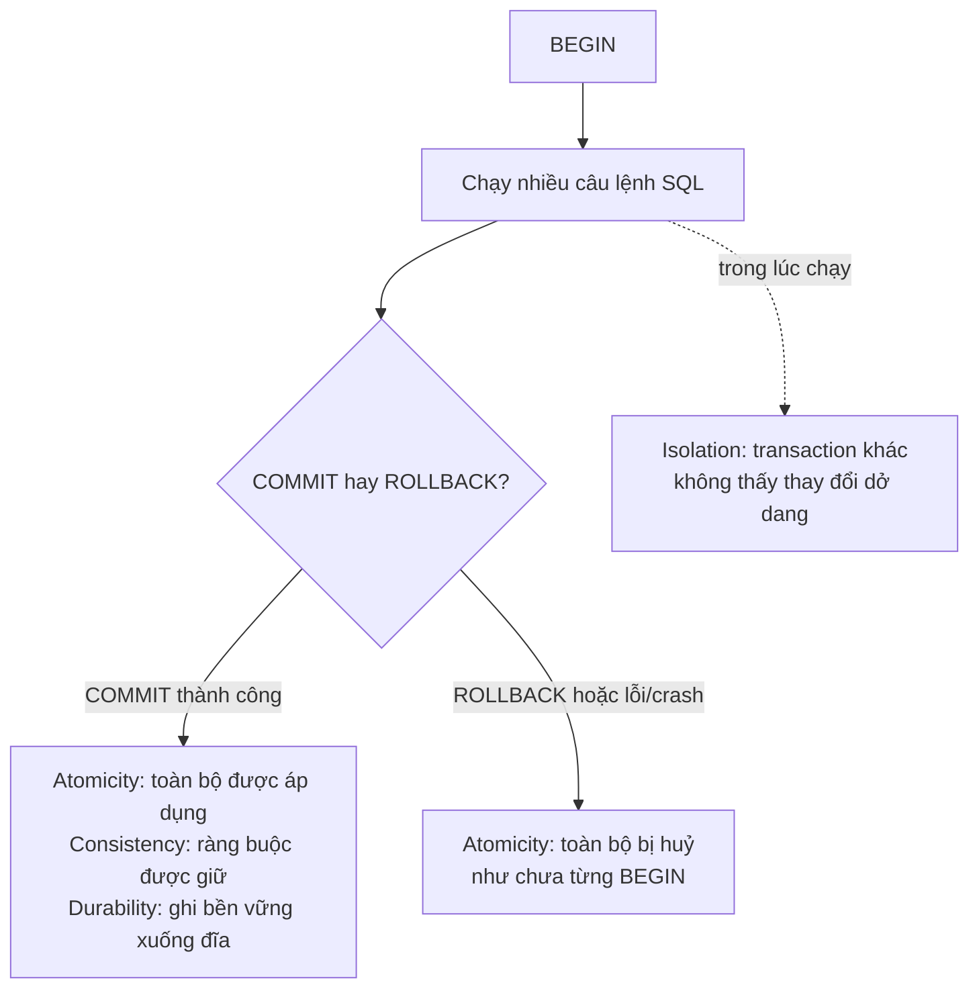
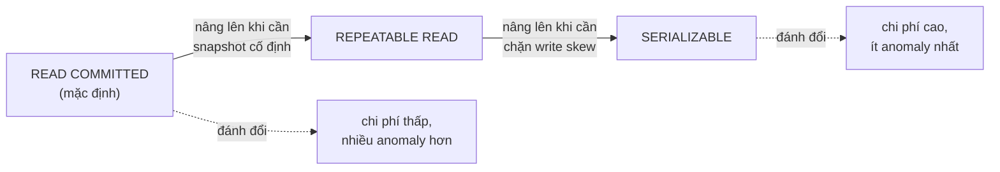

# Index, Transaction & ACID

!!! info "Bạn đang ở đây"
    cần trước: thiết kế schema quan hệ — biết chuẩn hoá, khoá chính/khoá ngoại nhiều bảng, và cách viết `CREATE TABLE` hoàn chỉnh cho một domain nhiều bảng.
    mở khoá sau bài này: EF Core (migration sinh ra index/transaction dưới lớp Fluent API) và các bài về hiệu năng/concurrency ở tầng ứng dụng — vì mọi thao tác EF Core `SaveChanges()` thực chất chạy bên trong một transaction, và tốc độ truy vấn EF sinh ra phụ thuộc trực tiếp vào index bạn đã hiểu ở đây.
    ⏱️ fast path ~55 phút · deep dive thêm ~30 phút (tuỳ chọn).

> **Mục tiêu (đo được):** Sau bài này bạn **định nghĩa** được index B-tree, transaction, và từng chữ cái trong ACID bằng lời của riêng mình; **đọc** được kết quả `EXPLAIN ANALYZE` để phân biệt Seq Scan và Index Scan; **giải thích** được đánh đổi giữa tốc độ đọc và tốc độ ghi khi thêm index; **viết** đúng cú pháp `BEGIN`/`COMMIT`/`ROLLBACK`; và **chọn** đúng mức isolation (Read Committed/Repeatable Read/Serializable) cho một tình huống nghiệp vụ cho trước, giải thích được anomaly mà mức đó ngăn hoặc không ngăn được.

---

## 0. Kiểm tra trước (30 giây) — bạn đoán kết quả nào?

Cho bảng `orders` với 1 triệu dòng, **không có index** nào ngoài khoá chính `id`:

```sql title="SQL"
CREATE TABLE orders (
    id          integer GENERATED ALWAYS AS IDENTITY PRIMARY KEY,
    customer_id integer NOT NULL,
    amount      numeric(10,2) NOT NULL
);
-- (giả sử đã có 1,000,000 dòng)

SELECT * FROM orders WHERE customer_id = 42;
```

Ba câu hỏi, đoán trước khi mở đáp án:

1. PostgreSQL sẽ đọc bao nhiêu dòng trong bảng để trả lời câu truy vấn này — chỉ những dòng khớp, hay toàn bộ 1 triệu dòng?
2. Nếu ta `CREATE INDEX ON orders (customer_id);`, việc `INSERT` một dòng mới vào `orders` có trở nên **chậm hơn** không?
3. Hai giao dịch ngân hàng chuyển tiền cùng lúc từ tài khoản A sang B — nếu chương trình bị crash **giữa chừng** sau khi trừ tiền A nhưng trước khi cộng tiền B, số dư có bị sai lệch vĩnh viễn không?

??? note "Đáp án — bấm để mở SAU khi đã đoán"
    1. **Toàn bộ 1 triệu dòng** phải được đọc (gọi là Sequential Scan / Seq Scan), vì không có cấu trúc nào giúp PostgreSQL "nhảy thẳng" tới các dòng có `customer_id = 42` — nó phải kiểm tra từng dòng một. Đây chính là lý do index tồn tại.
    2. **Có** — mỗi `INSERT` giờ phải cập nhật thêm cấu trúc index ngoài bảng dữ liệu chính. Đây là đánh đổi cốt lõi của index: đọc nhanh hơn, ghi chậm hơn.
    3. **Không**, nếu chương trình dùng đúng transaction (`BEGIN ... COMMIT`) — vì thuộc tính **Atomicity** (nguyên tử) đảm bảo nếu crash giữa chừng, PostgreSQL tự động **rollback toàn bộ** thao tác dở dang, coi như chưa từng trừ tiền A. Đây chính là lý do transaction tồn tại.

---

## 1. Index B-tree — cấu trúc giúp tra cứu nhanh

### 1.1 Định nghĩa

**Index** là một cấu trúc dữ liệu phụ, được PostgreSQL duy trì song song với bảng gốc, giúp tìm nhanh các dòng thoả một điều kiện (thường là `WHERE` hoặc `ORDER BY`) mà **không cần đọc qua toàn bộ bảng**. Loại index mặc định — và phổ biến nhất — là **B-tree**: một cây cân bằng lưu giá trị cột đã **sắp xếp sẵn**, mỗi nút lá trỏ tới vị trí dòng thật trong bảng, giống cách mục lục cuối sách giúp bạn nhảy thẳng tới trang cần tìm thay vì đọc từng trang một.

### 1.2 Ví dụ cú pháp tối thiểu

```sql title="SQL"
CREATE TABLE students (
    id    integer GENERATED ALWAYS AS IDENTITY PRIMARY KEY,
    email text NOT NULL
);

INSERT INTO students (email) VALUES ('an@example.com'), ('binh@example.com');

CREATE INDEX students_email_idx ON students (email);

SELECT * FROM students WHERE email = 'binh@example.com';
```

Output kỳ vọng:

```text title="Kết quả"
 id |      email
----+-------------------
  2 | binh@example.com
(1 row)
```

Lệnh `CREATE INDEX students_email_idx ON students (email);` tạo một B-tree index trên cột `email`. Từ giờ, mọi truy vấn lọc theo `email` **có thể** dùng index này thay vì quét toàn bảng — chữ "có thể" quan trọng, vì PostgreSQL tự quyết định có dùng index hay không dựa trên ước lượng chi phí (xem mục 2).

### 1.3 Điều gì xảy ra khi dùng sai (hiểu lầm phổ biến)

Hiểu lầm kinh điển: "cứ tạo index là truy vấn nhanh ngay". Thực tế index **không tự động được dùng** cho mọi điều kiện — nó chỉ hữu ích khi điều kiện đúng dạng mà loại index đó hỗ trợ. Ví dụ B-tree trên `email` **không** giúp gì cho truy vấn tìm chuỗi con:

```sql title="SQL"
SELECT * FROM students WHERE email LIKE '%example.com';
```

Câu lệnh này **không lỗi cú pháp**, nhưng PostgreSQL thường **bỏ qua index B-tree** và quét toàn bảng, vì mẫu `LIKE` bắt đầu bằng `%` (ký tự đại diện ở đầu) khiến B-tree — vốn sắp theo thứ tự từ đầu chuỗi — không thể dùng để loại trừ nhanh phần nào của cây. Đây không phải "lỗi" theo nghĩa báo `ERROR`, mà là **cạm bẫy hiệu năng**: bạn tưởng có index nên nhanh, nhưng thực tế truy vấn vẫn chậm như không có index. Mục 2 sẽ cho cách kiểm chứng điều này bằng `EXPLAIN ANALYZE` thay vì đoán mò.

### 1.4 Vì sao PRIMARY KEY tự động nhanh khi tra cứu theo id

Bạn đã biết từ bài trước: khai báo `PRIMARY KEY` tự động tạo một **unique B-tree index** để ép ràng buộc duy nhất. Tác dụng phụ có lợi: mọi truy vấn `WHERE id = ...` tự động nhanh, không cần bạn tạo thêm index thủ công nào.

```sql title="SQL"
CREATE TABLE products (
    id   integer GENERATED ALWAYS AS IDENTITY PRIMARY KEY,
    name text NOT NULL
);

INSERT INTO products (name) VALUES ('Bàn phím'), ('Chuột'), ('Màn hình');

SELECT * FROM products WHERE id = 2;
```

Output kỳ vọng:

```text title="Kết quả"
 id | name
----+--------
  2 | Chuột
(1 row)
```

`WHERE id = 2` được phục vụ bởi index `products_pkey` (B-tree) tự sinh khi tạo bảng — không cần `CREATE INDEX` thêm.

---

## 2. EXPLAIN ANALYZE — đọc kế hoạch thực thi

### 2.1 Định nghĩa

**`EXPLAIN ANALYZE`** là câu lệnh yêu cầu PostgreSQL **thực sự chạy** truy vấn và in ra **kế hoạch thực thi thật** (execution plan) — bao gồm PostgreSQL chọn quét bảng bằng cách nào (toàn bảng hay qua index), thời gian thực tế từng bước, và số dòng thực tế xử lý — thay vì chỉ đoán như `EXPLAIN` (không có `ANALYZE`) chỉ ước lượng mà không chạy thật.

### 2.2 Ví dụ cú pháp tối thiểu — Seq Scan (không có index)

```sql title="SQL"
CREATE TABLE logs (
    id      integer GENERATED ALWAYS AS IDENTITY PRIMARY KEY,
    level   text NOT NULL
);

INSERT INTO logs (level)
SELECT (ARRAY['info','warn','error'])[1 + (random() * 2)::int]
FROM generate_series(1, 100000);

EXPLAIN ANALYZE SELECT * FROM logs WHERE level = 'error';
```

Output kỳ vọng (rút gọn, số liệu thực tế có thể khác đôi chút tuỳ máy):

```text title="Kết quả"
 Seq Scan on logs  (cost=0.00..1791.00 rows=33333 width=8) (actual time=0.020..12.500 rows=33210 loops=1)
   Filter: (level = 'error'::text)
   Rows Removed by Filter: 66790
 Planning Time: 0.150 ms
 Execution Time: 14.200 ms
```

Cách đọc: dòng đầu `Seq Scan on logs` nghĩa là PostgreSQL quét **tuần tự toàn bảng**, kiểm tra `Filter` trên từng dòng, và loại bỏ (`Rows Removed by Filter`) gần 67 nghìn dòng không khớp. `actual time=0.020..12.500` là thời gian thực tế (mili-giây) từ lúc bắt đầu bước này tới lúc hoàn tất.

### 2.3 So sánh sau khi thêm index — Index Scan

```sql title="SQL"
CREATE INDEX logs_level_idx ON logs (level);

EXPLAIN ANALYZE SELECT * FROM logs WHERE level = 'error';
```

Output kỳ vọng (chỉ đúng khi PostgreSQL ước lượng dùng index rẻ hơn — xem cảnh báo bên dưới):

```text title="Kết quả"
 Bitmap Heap Scan on logs  (cost=345.50..1200.30 rows=33333 width=8) (actual time=1.200..8.100 rows=33210 loops=1)
   Recheck Cond: (level = 'error'::text)
   ->  Bitmap Index Scan on logs_level_idx  (cost=0.00..337.17 rows=33333 width=0) (actual time=0.900..0.900 rows=33210 loops=1)
         Index Cond: (level = 'error'::text)
 Planning Time: 0.180 ms
 Execution Time: 9.800 ms
```

!!! warning "Vì sao có thể bạn KHÔNG thấy Index Scan"
    Với cột `level` chỉ có 3 giá trị khác nhau ('info'/'warn'/'error') phân bố gần đều trên 100.000 dòng, mỗi giá trị chiếm khoảng 1/3 bảng — PostgreSQL thường **ước lượng quét tuần tự rẻ hơn** dùng index trong trường hợp này (vì "đọc gần hết bảng qua index" tốn nhiều lần nhảy trang hơn "đọc thẳng toàn bảng theo thứ tự vật lý"). Index phát huy tác dụng rõ nhất khi điều kiện lọc ra một **tỷ lệ nhỏ** dòng (ví dụ `WHERE id = 42` chỉ khớp 1/100.000 dòng). Đây không phải lỗi — là PostgreSQL tối ưu hoá chi phí đúng đắn. Muốn thấy chắc chắn Index Scan, hãy lọc theo cột có nhiều giá trị phân biệt (ví dụ `id` hoặc `email`).

### 2.4 Điều gì xảy ra khi đọc sai kế hoạch (hiểu lầm phổ biến)

Một hiểu lầm phổ biến: coi số trong `cost=0.00..1791.00` là **mili-giây**. Đây là **đơn vị chi phí ước lượng nội bộ** (arbitrary cost units dựa trên số trang đĩa I/O ước tính), **không phải thời gian thực**. Thời gian thực tế nằm ở `actual time=...` (chỉ xuất hiện khi dùng `ANALYZE`) và dòng `Execution Time` cuối cùng — tính bằng mili-giây thật.

```sql title="SQL"
EXPLAIN SELECT * FROM logs WHERE level = 'error';
```

```text title="Kết quả"
 Seq Scan on logs  (cost=0.00..1791.00 rows=33333 width=8)
   Filter: (level = 'error'::text)
```

Chú ý: dùng `EXPLAIN` (không `ANALYZE`) **không chạy truy vấn thật**, chỉ hiện cột `cost` ước lượng — không có `actual time` hay `Execution Time`. Vì không thực thi thật, `EXPLAIN` đơn thuần **an toàn tuyệt đối** để chạy trên câu `UPDATE`/`DELETE` mà không sợ thay đổi dữ liệu; còn `EXPLAIN ANALYZE` trên `UPDATE`/`DELETE` **sẽ thực sự thay đổi dữ liệu** vì nó chạy thật câu lệnh.

---

## 3. Đánh đổi của index — đọc nhanh, ghi chậm hơn

### 3.1 Định nghĩa

**Đánh đổi index** (index trade-off) là nguyên lý: mỗi index giúp `SELECT` nhanh hơn, nhưng đồng thời làm mọi câu `INSERT`/`UPDATE`/`DELETE` ảnh hưởng tới cột đó **chậm hơn**, vì PostgreSQL phải ghi và cân bằng lại cấu trúc B-tree của **từng index** liên quan, không chỉ ghi vào bảng chính.

### 3.2 Ví dụ minh hoạ (khái niệm, không cần đo benchmark chính xác)

```sql title="SQL"
-- Bảng KHÔNG có index phụ nào ngoài PRIMARY KEY: mỗi INSERT chỉ ghi 1 cấu trúc (bảng + pkey index)
CREATE TABLE events_no_index (
    id      integer GENERATED ALWAYS AS IDENTITY PRIMARY KEY,
    tag     text NOT NULL,
    payload text NOT NULL
);

-- Bảng CÓ thêm 2 index phụ: mỗi INSERT phải ghi vào bảng + pkey index + 2 index phụ = 4 cấu trúc
CREATE TABLE events_with_index (
    id      integer GENERATED ALWAYS AS IDENTITY PRIMARY KEY,
    tag     text NOT NULL,
    payload text NOT NULL
);
CREATE INDEX events_tag_idx ON events_with_index (tag);
CREATE INDEX events_payload_idx ON events_with_index (payload);

INSERT INTO events_no_index (tag, payload) VALUES ('click', 'a');
INSERT INTO events_with_index (tag, payload) VALUES ('click', 'a');
```

Cả hai lệnh `INSERT` đều thành công và trông giống hệt nhau ở tầng cú pháp — nhưng `INSERT` vào `events_with_index` tốn nhiều công việc bên trong hơn: PostgreSQL phải chèn thêm bản ghi vào **hai B-tree index phụ** (`events_tag_idx`, `events_payload_idx`) ngoài việc ghi dòng vào bảng và cập nhật `events_with_index_pkey`. Với một bảng ít index, độ chênh lệch này khó nhận ra; với bảng có 5-10 index và hàng triệu lượt ghi mỗi ngày, chênh lệch trở nên rất rõ rệt trên `EXPLAIN ANALYZE` của câu `INSERT`/`UPDATE`.

### 3.3 Hệ quả khi lạm dụng — tạo index tràn lan

Không có "lỗi" cú pháp khi tạo quá nhiều index — PostgreSQL không chặn bạn. Hệ quả là **hiệu năng ghi suy giảm âm thầm**, khó phát hiện bằng mắt thường cho tới khi đo:

```sql title="SQL"
CREATE TABLE audit_log (
    id         integer GENERATED ALWAYS AS IDENTITY PRIMARY KEY,
    user_id    integer NOT NULL,
    action     text NOT NULL,
    created_at timestamptz NOT NULL DEFAULT now()
);

CREATE INDEX audit_user_idx ON audit_log (user_id);
CREATE INDEX audit_action_idx ON audit_log (action);
CREATE INDEX audit_created_idx ON audit_log (created_at);
CREATE INDEX audit_user_action_idx ON audit_log (user_id, action);
-- ... càng nhiều index phụ, mỗi INSERT càng phải cập nhật càng nhiều cây B-tree
```

Nguyên tắc thực chiến: chỉ tạo index cho các cột **thực sự** xuất hiện thường xuyên trong `WHERE`, `JOIN ON`, hoặc `ORDER BY` của các truy vấn quan trọng — không tạo "phòng khi cần" cho mọi cột. Dùng `EXPLAIN ANALYZE` để xác nhận index đang thực sự được dùng (`Index Scan`/`Bitmap Heap Scan` xuất hiện trong kế hoạch), thay vì tạo rồi để đó.

---

## 4. Transaction — nhóm nhiều thao tác thành một đơn vị

### 4.1 Định nghĩa

**Transaction** (giao dịch) là một nhóm một hoặc nhiều câu lệnh SQL được PostgreSQL xử lý như **một đơn vị không thể chia nhỏ**: hoặc **tất cả** thành công và được lưu vĩnh viễn (`COMMIT`), hoặc nếu có lỗi/huỷ giữa chừng thì **tất cả** bị huỷ bỏ hoàn toàn như chưa từng chạy (`ROLLBACK`) — không có trạng thái "làm được một nửa".

### 4.2 Ví dụ cú pháp tối thiểu — BEGIN/COMMIT

```sql title="SQL"
CREATE TABLE accounts_tx (
    id      integer GENERATED ALWAYS AS IDENTITY PRIMARY KEY,
    owner   text NOT NULL,
    balance numeric(12,2) NOT NULL
);

INSERT INTO accounts_tx (owner, balance) VALUES ('An', 1000000), ('Bình', 500000);

BEGIN;

UPDATE accounts_tx SET balance = balance - 200000 WHERE owner = 'An';
UPDATE accounts_tx SET balance = balance + 200000 WHERE owner = 'Bình';

COMMIT;

SELECT owner, balance FROM accounts_tx;
```

Output kỳ vọng:

```text title="Kết quả"
 owner  | balance
--------+----------
 An     | 800000.00
 Bình   | 700000.00
(2 rows)
```

`BEGIN` mở một transaction; hai câu `UPDATE` bên trong chỉ **tạm thời** thay đổi dữ liệu (các phiên kết nối khác chưa thấy được, xem mục 6); `COMMIT` chốt vĩnh viễn cả hai thay đổi cùng lúc.

### 4.3 Điều gì xảy ra khi dùng ROLLBACK

```sql title="SQL"
BEGIN;

UPDATE accounts_tx SET balance = balance - 5000000 WHERE owner = 'An';

ROLLBACK;

SELECT owner, balance FROM accounts_tx WHERE owner = 'An';
```

Output kỳ vọng — số dư **không đổi**, dù câu `UPDATE` đã chạy trong transaction:

```text title="Kết quả"
 owner | balance
-------+----------
 An    | 800000.00
(1 row)
```

`ROLLBACK` huỷ bỏ toàn bộ thay đổi kể từ `BEGIN` gần nhất — số dư của An quay lại đúng giá trị trước khi `UPDATE` chạy, dù về mặt cú pháp câu `UPDATE` đã "chạy thành công" (không báo lỗi) trước khi bị huỷ.

### 4.4 Điều gì xảy ra khi dùng sai — COMMIT/ROLLBACK không đúng chỗ

Gọi `COMMIT` hoặc `ROLLBACK` khi **không có transaction nào đang mở** không gây lỗi nghiêm trọng, nhưng PostgreSQL sẽ cảnh báo:

```sql title="SQL"
ROLLBACK;
```

```text title="Kết quả lỗi"
WARNING:  there is no transaction in progress
ROLLBACK
```

Nguy hiểm hơn: nếu một câu lệnh **bên trong** transaction bị lỗi (ví dụ vi phạm constraint) nhưng bạn không `ROLLBACK` mà cố chạy tiếp:

```sql title="SQL"
BEGIN;

UPDATE accounts_tx SET balance = balance - 100 WHERE owner = 'An';
INSERT INTO accounts_tx (owner, balance) VALUES (NULL, 100);  -- lỗi: owner NOT NULL

SELECT * FROM accounts_tx;   -- chạy tiếp trong transaction đã lỗi
```

```text title="Kết quả lỗi"
ERROR:  null value in column "owner" of relation "accounts_tx" violates not-null constraint
ERROR:  current transaction is aborted, commands ignored until end of transaction block
```

Sau khi một câu lệnh trong transaction lỗi, PostgreSQL đưa cả transaction vào trạng thái **"aborted"** — mọi câu lệnh tiếp theo (kể cả `SELECT` vô hại) đều bị từ chối cho tới khi bạn gọi `ROLLBACK` để thoát khỏi transaction đó (hoặc `ROLLBACK TO SAVEPOINT` nếu có savepoint — xem DEEP DIVE).

---

## 5. ACID — bốn tính chất của transaction đáng tin cậy

### 5.1 Atomicity (Nguyên tử)

**Định nghĩa:** Atomicity nghĩa là mọi thao tác trong một transaction được coi là **một khối duy nhất** — hoặc tất cả xảy ra, hoặc không có gì xảy ra cả, không có trạng thái lưng chừng.

```sql title="SQL"
BEGIN;
UPDATE accounts_tx SET balance = balance - 200000 WHERE owner = 'An';
-- giả sử ứng dụng CRASH ngay tại đây, trước khi kịp gọi câu UPDATE thứ hai và COMMIT
```

Nếu kết nối bị ngắt đột ngột (crash, mất mạng) trước khi `COMMIT` được gọi, PostgreSQL tự động coi transaction đó là chưa hoàn tất và **rollback toàn bộ** khi phát hiện kết nối đóng — số dư của An trở lại như trước `BEGIN`, không bị trừ tiền "hụt" mà chưa cộng cho ai. Đây là Atomicity: không có "trừ được một nửa".

### 5.2 Consistency (Nhất quán)

**Định nghĩa:** Consistency nghĩa là một transaction chỉ được phép đưa cơ sở dữ liệu từ một trạng thái **hợp lệ** (thoả mọi constraint) sang một trạng thái hợp lệ khác — không bao giờ để lại dữ liệu vi phạm ràng buộc đã khai báo (`CHECK`, `FOREIGN KEY`, `NOT NULL`, `UNIQUE`).

```sql title="SQL"
CREATE TABLE accounts_check (
    id      integer GENERATED ALWAYS AS IDENTITY PRIMARY KEY,
    owner   text NOT NULL,
    balance numeric(12,2) NOT NULL CHECK (balance >= 0)
);

INSERT INTO accounts_check (owner, balance) VALUES ('Cường', 100000);

BEGIN;
UPDATE accounts_check SET balance = balance - 500000 WHERE owner = 'Cường'; -- sẽ âm
COMMIT;
```

```text title="Kết quả lỗi"
ERROR:  new row for relation "accounts_check" violates check constraint "accounts_check_balance_check"
```

PostgreSQL từ chối câu `UPDATE` (và ngầm rollback nó) ngay khi phát hiện vi phạm `CHECK (balance >= 0)` — đảm bảo transaction không bao giờ "commit thành công" một trạng thái vi phạm luật nghiệp vụ đã khai báo. Đây là điểm khác biệt với Atomicity: Atomicity nói về "tất cả hoặc không gì cả" bất kể nội dung; Consistency nói riêng về việc **giữ đúng các luật ràng buộc** ở mọi thời điểm commit.

### 5.3 Isolation (Cô lập)

**Định nghĩa:** Isolation nghĩa là các transaction chạy đồng thời **không nhìn thấy** các thay đổi tạm thời, chưa commit của nhau — kết quả cuối cùng phải giống như thể các transaction chạy **lần lượt**, dù thực tế chúng có thể chạy song song. Mức độ "nhìn thấy nhau nhiều hay ít" là **isolation level** (mục 6).

```sql title="SQL"
-- Phiên A:
BEGIN;
UPDATE accounts_tx SET balance = balance - 100000 WHERE owner = 'An';
-- CHƯA COMMIT

-- Phiên B (mở kết nối khác, chạy đồng thời):
SELECT balance FROM accounts_tx WHERE owner = 'An';
```

Output kỳ vọng ở Phiên B — vẫn thấy số dư **cũ**, chưa trừ, vì Phiên A chưa `COMMIT`:

```text title="Kết quả"
 balance
----------
 800000.00
(1 row)
```

Chỉ sau khi Phiên A gọi `COMMIT`, Phiên B mới thấy được số dư mới khi `SELECT` lại. Đây là Isolation: thay đổi "đang dang dở" của một transaction bị **cô lập**, không rò rỉ sang transaction khác cho tới khi commit.

### 5.4 Durability (Bền vững)

**Định nghĩa:** Durability nghĩa là một khi transaction đã `COMMIT` thành công, dữ liệu đó được đảm bảo **tồn tại vĩnh viễn** kể cả khi hệ thống mất điện hoặc crash ngay sau đó — PostgreSQL đã ghi xuống đĩa (write-ahead log) trước khi báo `COMMIT` thành công cho ứng dụng.

```sql title="SQL"
BEGIN;
UPDATE accounts_tx SET balance = balance + 1000000 WHERE owner = 'Bình';
COMMIT;
-- giả sử NGAY SAU dòng này server bị mất điện đột ngột
```

Nếu server khởi động lại sau sự cố mất điện xảy ra **sau khi** `COMMIT` đã trả về thành công, số dư mới của Bình **vẫn còn nguyên** khi truy vấn lại — vì PostgreSQL không báo "COMMIT thành công" cho tới khi đã ghi bản ghi thay đổi vào write-ahead log trên đĩa một cách an toàn. Ngược lại, nếu mất điện xảy ra **trước khi** `COMMIT` hoàn tất (ví dụ giữa hai câu `UPDATE`), transaction đó chưa từng được coi là commit, và Atomicity đảm bảo nó bị huỷ hoàn toàn khi khởi động lại.

### 5.5 Vì sao gộp chung thành một từ viết tắt

Bây giờ cả bốn tính chất đã được dạy riêng với ví dụ độc lập, ta mới tổng hợp:

| Chữ cái | Tên đầy đủ | Trả lời câu hỏi | Cơ chế PostgreSQL dùng |
| --- | --- | --- | --- |
| **A** | Atomicity | "Nếu crash giữa chừng thì sao?" | Rollback tự động phần dở dang |
| **C** | Consistency | "Dữ liệu có luôn thoả ràng buộc không?" | Kiểm tra `CHECK`/`FOREIGN KEY`/... trước khi cho phép commit |
| **I** | Isolation | "Transaction khác có thấy thay đổi dở dang không?" | Isolation level (mục 6) kiểm soát mức nhìn thấy |
| **D** | Durability | "Sau khi COMMIT, dữ liệu có mất khi crash không?" | Write-ahead log ghi đĩa trước khi báo thành công |



Bốn tính chất này là **hợp đồng** mà PostgreSQL (và các RDBMS khác tuân ACID nói chung) cam kết với ứng dụng của bạn — nhờ đó bạn viết `BEGIN ... COMMIT` mà không cần tự tay lo việc "nếu crash giữa chừng thì dọn dẹp thế nào".

---

## 6. Isolation level — kiểm soát mức "nhìn thấy nhau"

### 6.1 Định nghĩa Read Committed (mặc định)

**Read Committed** là isolation level: mỗi câu lệnh (không phải cả transaction) trong một transaction chỉ nhìn thấy dữ liệu đã được **commit** tính đến **thời điểm câu lệnh đó bắt đầu chạy** — không thấy thay đổi chưa commit của transaction khác, nhưng nếu transaction khác commit ở giữa transaction hiện tại, câu lệnh sau có thể thấy dữ liệu mới hơn câu lệnh trước. Đây là mức **mặc định** của PostgreSQL khi không khai báo gì khác.

```sql title="SQL"
CREATE TABLE stock (
    id       integer GENERATED ALWAYS AS IDENTITY PRIMARY KEY,
    quantity integer NOT NULL
);
INSERT INTO stock (quantity) VALUES (10);

-- Phiên A:
BEGIN;
SELECT quantity FROM stock WHERE id = 1;   -- lần 1: đọc 10

-- (giữa lúc này, Phiên B chạy: UPDATE stock SET quantity = 5 WHERE id = 1; COMMIT;)

SELECT quantity FROM stock WHERE id = 1;   -- lần 2: đọc lại
COMMIT;
```

Ở mức Read Committed (mặc định), lần đọc thứ 2 trong Phiên A trả về `5` — khác với lần đọc thứ nhất (`10`) — vì Phiên B đã commit ở giữa, và Read Committed cho phép mỗi câu lệnh mới thấy dữ liệu commit mới nhất tại thời điểm nó chạy.

### 6.2 Anomaly Non-repeatable read — hệ quả của Read Committed

**Định nghĩa:** **Non-repeatable read** là hiện tượng đọc cùng một dòng hai lần trong cùng một transaction nhưng nhận **hai giá trị khác nhau**, vì một transaction khác đã commit thay đổi ở giữa hai lần đọc đó — chính là ví dụ mục 6.1 vừa minh hoạ.

```sql title="SQL"
-- Kết quả lần đọc thứ nhất và lần đọc thứ hai trong VÍ DỤ 6.1 khác nhau (10 rồi 5)
-- dù cùng nằm trong MỘT transaction, cùng một câu SELECT, không có UPDATE nào
-- được chính Phiên A thực hiện giữa hai lần đọc.
```

Đây **không phải lỗi** của PostgreSQL — là hành vi được đặc tả rõ ràng của Read Committed. Vấn đề chỉ phát sinh khi logic ứng dụng **giả định sai** rằng dữ liệu không đổi giữa hai lần đọc trong cùng transaction (ví dụ: tính toán dựa trên tồn kho đọc ở đầu transaction, nhưng áp dụng kết quả tính toán đó ở cuối transaction khi tồn kho thực tế đã khác).

### 6.3 Repeatable Read — khoá lại ảnh chụp dữ liệu

**Định nghĩa:** **Repeatable Read** là isolation level cao hơn: toàn bộ transaction nhìn dữ liệu như một **ảnh chụp cố định** (snapshot) tại thời điểm transaction bắt đầu — mọi câu lệnh `SELECT` trong cùng transaction luôn trả về cùng kết quả cho cùng điều kiện, bất kể transaction khác commit gì ở giữa.

```sql title="SQL"
-- Phiên A:
BEGIN ISOLATION LEVEL REPEATABLE READ;
SELECT quantity FROM stock WHERE id = 1;   -- lần 1: đọc 5 (giả sử đã là 5 từ trước)

-- (giữa lúc này, Phiên B chạy: UPDATE stock SET quantity = 2 WHERE id = 1; COMMIT;)

SELECT quantity FROM stock WHERE id = 1;   -- lần 2: VẪN đọc 5
COMMIT;
```

Ở mức `REPEATABLE READ`, lần đọc thứ 2 vẫn trả về `5`, dù Phiên B đã commit `2` ở giữa — transaction A "đóng băng" ảnh chụp dữ liệu từ thời điểm `BEGIN`, giải quyết triệt để anomaly non-repeatable read ở mục 6.2.

### 6.4 Điều gì xảy ra khi dùng sai — serialization failure ở Repeatable Read

Repeatable Read không "che giấu" xung đột ghi — nó **phát hiện và từ chối** khi hai transaction cùng cố ghi đè dữ liệu mà một bên đã đọc từ ảnh chụp cũ:

```sql title="SQL"
-- Phiên A:
BEGIN ISOLATION LEVEL REPEATABLE READ;
SELECT quantity FROM stock WHERE id = 1;  -- đọc 5

-- Phiên B (chạy và COMMIT trước Phiên A):
-- UPDATE stock SET quantity = quantity - 1 WHERE id = 1; COMMIT;  -- thành công, quantity = 4

-- Quay lại Phiên A, cố ghi dựa trên ảnh chụp cũ:
UPDATE stock SET quantity = quantity - 1 WHERE id = 1;
COMMIT;
```

```text title="Kết quả lỗi"
ERROR:  could not serialize access due to concurrent update
```

PostgreSQL từ chối `COMMIT` của Phiên A vì phát hiện Phiên B đã ghi đè cùng dòng dữ liệu sau khi ảnh chụp của Phiên A được chụp — ứng dụng phải bắt lỗi này và **thử lại toàn bộ transaction** từ đầu.

### 6.5 Serializable — mức cô lập cao nhất

**Định nghĩa:** **Serializable** là isolation level cao nhất: PostgreSQL đảm bảo kết quả của các transaction chạy đồng thời **giống hệt** như thể chúng được chạy **tuần tự, từng cái một** theo một thứ tự nào đó — ngăn được cả các anomaly tinh vi mà Repeatable Read vẫn có thể để lọt, ví dụ **write skew** (hai transaction đọc dữ liệu chồng lấn, mỗi bên ghi vào một phần khác nhau dựa trên điều kiện đọc được, và nếu chạy tuần tự thì ít nhất một bên sẽ không được phép ghi — nhưng Repeatable Read không phát hiện ra vì mỗi bên chỉ ghi đè dòng của riêng mình, không "ghi đè cùng dòng" như mục 6.4).

```sql title="SQL"
CREATE TABLE on_call_doctors (
    id   integer GENERATED ALWAYS AS IDENTITY PRIMARY KEY,
    name text NOT NULL,
    on_call boolean NOT NULL DEFAULT true
);
INSERT INTO on_call_doctors (name) VALUES ('BS. An'), ('BS. Bình');
-- Luật nghiệp vụ: phải luôn có ít nhất 1 bác sĩ trực (on_call = true)

-- Phiên A và Phiên B CÙNG chạy gần như đồng thời, đều đọc thấy "còn 2 người trực":
BEGIN ISOLATION LEVEL SERIALIZABLE;
SELECT count(*) FROM on_call_doctors WHERE on_call = true;  -- thấy 2, nghĩ "an toàn để nghỉ"
UPDATE on_call_doctors SET on_call = false WHERE name = 'BS. An';
COMMIT;
```

Nếu cả hai bác sĩ cùng xin nghỉ trực trong hai transaction chạy gần như đồng thời (mỗi transaction chỉ `UPDATE` dòng của chính mình, không đụng dòng của người kia), `SERIALIZABLE` sẽ khiến **một trong hai** transaction bị từ chối commit với lỗi `could not serialize access due to read/write dependencies among transactions`, vì PostgreSQL phát hiện: nếu chạy tuần tự, transaction chạy sau sẽ đọc thấy "chỉ còn 1 người trực" và (theo logic ứng dụng đúng đắn) phải từ chối request — nên nó buộc một bên retry để tránh kết quả "0 bác sĩ trực" xảy ra trên thực tế. Đây là anomaly **write skew**: Repeatable Read (mục 6.3) không bắt được lỗi này vì hai `UPDATE` không đụng cùng một dòng vật lý.

### 6.6 Bảng tổng hợp ba mức isolation

Bây giờ cả ba mức đã được dạy riêng với ví dụ độc lập, ta mới tổng hợp so sánh:

| Mức | Non-repeatable read | Write skew | Chi phí | Mặc định trong PostgreSQL? |
| --- | --- | --- | --- | --- |
| `READ COMMITTED` | Có thể xảy ra | Có thể xảy ra | Thấp nhất | **Có (mặc định)** |
| `REPEATABLE READ` | Ngăn được | Vẫn có thể xảy ra | Trung bình, có thể cần retry khi `could not serialize access` | Không |
| `SERIALIZABLE` | Ngăn được | Ngăn được | Cao nhất, retry thường xuyên hơn dưới tải lớn | Không |



Nguyên tắc chọn thực chiến: bắt đầu với `READ COMMITTED` (mặc định, đủ cho phần lớn ứng dụng CRUD thông thường); chỉ nâng lên `REPEATABLE READ`/`SERIALIZABLE` khi có luật nghiệp vụ nhạy cảm với đọc-ghi đồng thời (ví dụ hệ thống đặt chỗ, số dư tài khoản, luật ràng buộc toàn cục như "luôn có ít nhất N người trực") — và khi nâng lên, ứng dụng **bắt buộc** phải có logic retry khi gặp lỗi `could not serialize access`.

---

## Cạm bẫy & thực chiến

- **Tạo index cho mọi cột "phòng khi cần"**: mỗi index thêm là một chi phí ghi thường trực (mục 3), không miễn phí. Chỉ tạo index cho cột thực sự xuất hiện trong `WHERE`/`JOIN`/`ORDER BY` của truy vấn quan trọng, xác nhận bằng `EXPLAIN ANALYZE`.
- **Đọc nhầm `cost` trong `EXPLAIN` là mili-giây**: `cost=0.00..1791.00` là đơn vị ước lượng nội bộ, không phải thời gian thật. Thời gian thật nằm ở `actual time=...` (chỉ có khi dùng `ANALYZE`) và `Execution Time`.
- **Quên rằng transaction bị lỗi vẫn "kẹt" cho tới khi ROLLBACK**: sau một câu lệnh lỗi bên trong `BEGIN...COMMIT`, PostgreSQL từ chối MỌI câu lệnh tiếp theo (kể cả `SELECT`) với `current transaction is aborted` — phải `ROLLBACK` (hoặc dùng savepoint, xem DEEP DIVE) trước khi tiếp tục.
- **Coi Repeatable Read là "miễn nhiễm mọi anomaly"**: mục 6.5 minh hoạ rõ write skew vẫn xảy ra ở Repeatable Read — chỉ `SERIALIZABLE` mới ngăn được, với chi phí retry cao hơn.
- **Không xử lý lỗi `could not serialize access` ở tầng ứng dụng**: khi dùng `REPEATABLE READ`/`SERIALIZABLE`, đây là lỗi **được kỳ vọng xảy ra** dưới tải đồng thời cao — ứng dụng phải bắt lỗi này (thường theo `SQLSTATE 40001`) và tự động retry toàn bộ transaction, không phải bug cần "sửa" ở tầng SQL.
- **Transaction càng dài càng giữ khoá lâu**: một transaction mở `BEGIN` rồi chờ input người dùng trước khi `COMMIT` sẽ giữ tài nguyên (khoá hàng, kết nối) lâu bất thường, làm nghẽn các transaction khác đang chờ cùng dòng dữ liệu. Luôn giữ transaction **ngắn nhất có thể**.

---

## Bài tập

### Bài 1 — Giàn giáo: chọn index đúng chỗ

Cho bảng sau, biết ứng dụng thường xuyên chạy câu truy vấn `SELECT * FROM messages WHERE conversation_id = ? ORDER BY sent_at;`:

```sql title="SQL"
CREATE TABLE messages (
    id              integer GENERATED ALWAYS AS IDENTITY PRIMARY KEY,
    conversation_id integer NOT NULL,
    sent_at         timestamptz NOT NULL,
    body            text NOT NULL
);
```

Điền vào chỗ trống câu lệnh tạo index phù hợp nhất để tăng tốc truy vấn trên (gợi ý: index nhiều cột, thứ tự cột theo cách truy vấn lọc rồi sắp xếp):

```sql title="SQL"
CREATE INDEX messages____idx ON messages (____, ____);
```

??? success "Lời giải — bấm để mở"
    ```sql title="SQL"
    CREATE INDEX messages_conversation_sent_idx ON messages (conversation_id, sent_at);
    ```
    **Vì sao:** truy vấn vừa lọc theo `conversation_id` (điều kiện bằng) vừa sắp theo `sent_at` (thứ tự). Đặt `conversation_id` trước giúp B-tree nhảy thẳng tới đúng nhóm hội thoại; vì trong mỗi nhóm đó, các giá trị `sent_at` đã được lưu **theo thứ tự sẵn** trong index, PostgreSQL có thể trả kết quả đã sắp xếp mà không cần bước sắp xếp `Sort` riêng — dùng `EXPLAIN ANALYZE` để xác nhận kế hoạch không còn nút `Sort` thừa.

### Bài 2 — Thiết kế: transaction chuyển kho hàng an toàn

Thiết kế một transaction chuyển 5 đơn vị hàng từ kho A sang kho B, với luật nghiệp vụ: tồn kho không bao giờ được âm, và nếu kho A không đủ hàng thì **toàn bộ** thao tác phải bị huỷ (không trừ kho A mà không cộng kho B, và không được để kho A âm dù chỉ tạm thời).

```sql title="SQL"
CREATE TABLE warehouse_stock (
    warehouse text PRIMARY KEY,
    quantity  integer NOT NULL CHECK (quantity >= 0)
);
INSERT INTO warehouse_stock VALUES ('A', 3), ('B', 10);
```

Viết transaction thử chuyển 5 đơn vị từ A sang B (biết trước A chỉ có 3, không đủ 5), và giải thích PostgreSQL sẽ phản ứng ra sao.

??? success "Lời giải — bấm để mở"
    ```sql title="SQL"
    BEGIN;

    UPDATE warehouse_stock SET quantity = quantity - 5 WHERE warehouse = 'A';
    UPDATE warehouse_stock SET quantity = quantity + 5 WHERE warehouse = 'B';

    COMMIT;
    ```

    **Điều xảy ra:** câu `UPDATE` đầu tiên cố đặt `quantity = 3 - 5 = -2` cho kho A, vi phạm ngay `CHECK (quantity >= 0)`:

    ```text title="Kết quả lỗi"
    ERROR:  new row for relation "warehouse_stock" violates check constraint "warehouse_stock_quantity_check"
    ```

    Transaction rơi vào trạng thái aborted; câu `UPDATE` thứ hai (cộng cho B) **không bao giờ chạy được** vì PostgreSQL từ chối mọi lệnh tiếp theo cho tới khi `ROLLBACK`. Gọi `ROLLBACK` (hoặc để ứng dụng tự đóng transaction khi bắt được lỗi) đảm bảo kho B **không bị cộng "hụt"** — đây chính là Atomicity + Consistency phối hợp: Consistency (`CHECK`) chặn trạng thái sai ngay lập tức, Atomicity đảm bảo phần còn lại của transaction không để lại hậu quả một nửa.

---

## Tự kiểm tra

1. Vì sao B-tree index giúp `WHERE email = '...'` nhanh hơn nhưng thường không giúp `WHERE email LIKE '%example.com'`?

    ??? note "Đáp án"
        B-tree lưu giá trị đã sắp xếp theo thứ tự từ đầu chuỗi, nên tra cứu theo tiền tố hoặc so sánh bằng rất nhanh. Mẫu `LIKE '%...'` bắt đầu bằng ký tự đại diện ở đầu khiến B-tree không thể loại trừ nhanh phần nào của cây — PostgreSQL thường phải quét toàn bảng thay vì dùng index.

2. Trong output `EXPLAIN ANALYZE`, con số nào phản ánh thời gian thực tế (mili-giây), và con số nào chỉ là ước lượng chi phí nội bộ?

    ??? note "Đáp án"
        `actual time=...` và `Execution Time` là thời gian thực tế tính bằng mili-giây (chỉ xuất hiện khi dùng `ANALYZE`). `cost=0.00..1791.00` là đơn vị chi phí ước lượng nội bộ của PostgreSQL, không phải thời gian.

3. Vì sao thêm nhiều index vào một bảng lại làm `INSERT` chậm hơn?

    ??? note "Đáp án"
        Vì mỗi `INSERT` không chỉ ghi một dòng vào bảng chính mà còn phải cập nhật (chèn và cân bằng lại) **từng cấu trúc B-tree** của mọi index liên quan tới bảng đó — càng nhiều index, càng nhiều cấu trúc phải cập nhật đồng thời.

4. Sau khi một câu lệnh bên trong `BEGIN...COMMIT` bị lỗi (ví dụ vi phạm `CHECK`), việc gọi tiếp một câu `SELECT` vô hại trong cùng transaction có chạy được không? Vì sao?

    ??? note "Đáp án"
        Không chạy được — PostgreSQL trả lỗi `current transaction is aborted, commands ignored until end of transaction block`. Sau khi một lệnh lỗi, toàn bộ transaction bị đánh dấu aborted; phải `ROLLBACK` trước khi thực hiện bất kỳ câu lệnh nào khác.

5. Trong bốn chữ cái ACID, chữ nào đảm bảo dữ liệu đã `COMMIT` không bị mất dù server mất điện ngay sau đó?

    ??? note "Đáp án"
        **Durability** — PostgreSQL ghi thay đổi vào write-ahead log trên đĩa trước khi báo `COMMIT` thành công cho ứng dụng, nên dữ liệu đã commit tồn tại vĩnh viễn dù có sự cố ngay sau đó.

6. Mức isolation mặc định của PostgreSQL là gì? Ở mức đó, đọc cùng một dòng hai lần trong cùng transaction có đảm bảo ra cùng kết quả không?

    ??? note "Đáp án"
        **Read Committed** là mặc định. **Không đảm bảo** — nếu một transaction khác commit thay đổi ở giữa hai lần đọc, lần đọc sau có thể thấy giá trị mới hơn. Đây gọi là anomaly non-repeatable read, chỉ được ngăn ở mức `REPEATABLE READ` trở lên.

7. Write skew là gì, và tại sao `REPEATABLE READ` không ngăn được nó nhưng `SERIALIZABLE` thì ngăn được?

    ??? note "Đáp án"
        Write skew là khi hai transaction đồng thời đọc dữ liệu chồng lấn (ví dụ tổng số bác sĩ đang trực) rồi mỗi bên ghi vào một dòng khác nhau dựa trên điều kiện đọc được, dẫn tới kết quả tổng thể sai (ví dụ cả hai bác sĩ cùng nghỉ, còn 0 người trực) dù mỗi `UPDATE` riêng lẻ hợp lệ. `REPEATABLE READ` chỉ phát hiện xung đột khi hai transaction ghi đè **cùng một dòng vật lý**, nên không bắt được write skew (mỗi bên ghi dòng riêng). `SERIALIZABLE` phân tích cả phụ thuộc đọc-ghi chéo giữa các transaction, nên phát hiện và từ chối một bên bằng lỗi `could not serialize access due to read/write dependencies among transactions`.

8. Nếu ứng dụng dùng isolation level `SERIALIZABLE` và thỉnh thoảng nhận lỗi `could not serialize access`, đây có phải là bug cần sửa ở tầng SQL không? Ứng dụng nên xử lý thế nào?

    ??? note "Đáp án"
        Không phải bug SQL — đây là hành vi **được kỳ vọng** của `SERIALIZABLE` dưới tải đồng thời, đảm bảo tính đúng đắn thay vì để lọt anomaly. Ứng dụng phải bắt lỗi này (mã `SQLSTATE 40001`) ở tầng gọi và **tự động thử lại toàn bộ transaction** từ đầu, không phải coi là lỗi hệ thống nghiêm trọng.

---

??? abstract "DEEP DIVE — nâng cao (không nằm trên fast path)"
    **SAVEPOINT — rollback từng phần trong một transaction.** Thay vì huỷ toàn bộ transaction khi một bước lỗi, có thể đánh dấu điểm khôi phục:

    ```sql title="SQL"
    BEGIN;
    INSERT INTO accounts_tx (owner, balance) VALUES ('Dung', 200000);
    SAVEPOINT before_risky_step;
    UPDATE accounts_tx SET balance = balance - 999999999 WHERE owner = 'Dung'; -- sẽ lỗi nếu có CHECK >= 0
    ROLLBACK TO SAVEPOINT before_risky_step;
    COMMIT;  -- dòng INSERT ('Dung', 200000) vẫn được giữ lại
    ```

    `ROLLBACK TO SAVEPOINT` chỉ huỷ các thay đổi **sau** savepoint đó, không huỷ toàn bộ transaction — hữu ích khi cần thử một bước rủi ro mà không muốn mất công các bước đã làm trước đó.

    **Loại index khác ngoài B-tree.** PostgreSQL còn có GIN (phù hợp cho tìm kiếm full-text, mảng, JSONB), GiST (dữ liệu hình học, khoảng chồng lấn — nền tảng của `EXCLUDE` constraint đã nhắc ở bài trước), BRIN (bảng cực lớn, dữ liệu có tương quan vật lý với thứ tự lưu trữ, ví dụ log theo thời gian) và Hash (chỉ so sánh bằng, hiếm dùng vì B-tree đã bao hàm được trường hợp này). Lựa chọn loại index phụ thuộc vào **kiểu truy vấn**, không phải mặc định luôn dùng B-tree.

    **`SELECT ... FOR UPDATE` — khoá dòng tường minh.** Khi cần đảm bảo không ai khác sửa một dòng trong lúc transaction hiện tại đang "suy nghĩ" phải làm gì với nó (ví dụ đọc tồn kho rồi quyết định trừ bao nhiêu), có thể khoá tường minh:

    ```sql title="SQL"
    BEGIN;
    SELECT quantity FROM warehouse_stock WHERE warehouse = 'A' FOR UPDATE;
    -- transaction khác cố UPDATE/SELECT ... FOR UPDATE cùng dòng này sẽ phải CHỜ tới khi transaction này COMMIT/ROLLBACK
    UPDATE warehouse_stock SET quantity = quantity - 5 WHERE warehouse = 'A';
    COMMIT;
    ```

    Đây là cách xử lý concurrency **chủ động** (pessimistic locking) khác với cách `SERIALIZABLE` xử lý **bị động** (phát hiện xung đột rồi bắt retry) — mỗi cách phù hợp với mô hình tải khác nhau: khoá tường minh tốt khi xung đột thường xuyên (tranh chấp cao), `SERIALIZABLE` + retry tốt khi xung đột hiếm (tranh chấp thấp).

    **EF Core và transaction.** Mỗi lần gọi `SaveChanges()`/`SaveChangesAsync()`, EF Core tự động bọc toàn bộ các câu `INSERT`/`UPDATE`/`DELETE` phát sinh trong một transaction ngầm — nếu một thao tác thất bại giữa chừng, EF Core rollback toàn bộ, đúng tinh thần Atomicity đã học ở đây. Muốn gộp **nhiều lần gọi `SaveChanges()`** vào cùng một transaction lớn hơn, dùng `context.Database.BeginTransactionAsync()` tường minh — hiểu `BEGIN`/`COMMIT`/`ROLLBACK` ở tầng SQL trước giúp đọc đúng những gì EF Core đang làm hộ bạn phía dưới, thay vì coi `SaveChanges()` là một "hộp đen".

Tiếp theo -> ef core (truy vấn và ánh xạ)
