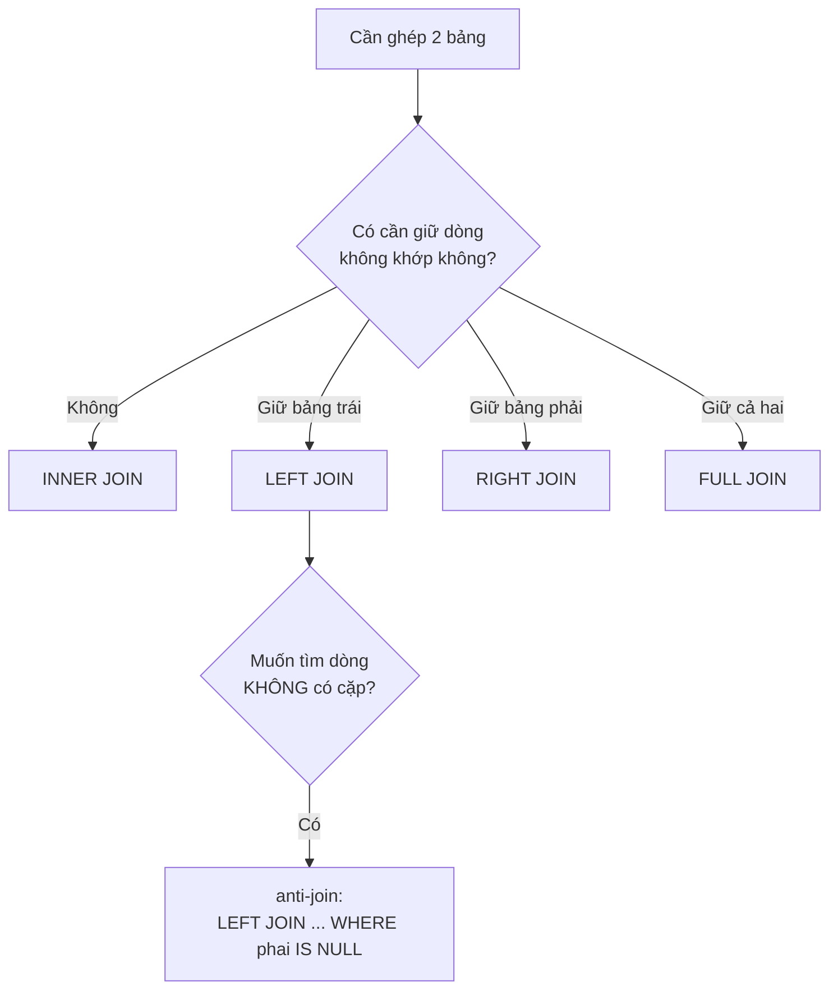

# JOIN, GROUP BY & Subquery

!!! info "Bạn đang ở đây"
    cần trước: sql cơ bản (SELECT, WHERE, kiểu dữ liệu, khoá chính/khoá ngoại).
    mở khoá: viết truy vấn nhiều bảng, tổng hợp báo cáo, và lồng truy vấn cho các bài toán dữ liệu thực tế trước khi bước sang ef core.

> Mục tiêu (đo được): sau chương này bạn có thể **phân tích** một yêu cầu báo cáo và tự viết truy vấn PostgreSQL đúng dùng JOIN phù hợp, GROUP BY + HAVING, và subquery (kể cả correlated) mà không nhầm ngữ nghĩa NULL.

## 0. Câu hỏi/đoán nhanh

Cho hai bảng: `customers(id, name)` và `orders(id, customer_id, amount)`. Có 5 khách nhưng chỉ 3 khách từng đặt hàng.

1. `SELECT COUNT(*) FROM customers c INNER JOIN orders o ON o.customer_id = c.id;` trả về số dòng liên quan tới mấy khách?
2. Muốn liệt kê **tất cả** khách kèm tổng tiền (khách chưa mua thì tổng = 0) — dùng JOIN nào?
3. `COUNT(*)` và `COUNT(o.amount)` khác nhau chỗ nào khi có NULL?

???+ note "Đáp án"
    1. Chỉ 3 khách có đơn — INNER JOIN loại khách không có đơn. Số dòng = số đơn hàng.
    2. LEFT JOIN (customers bên trái) rồi `COALESCE(SUM(o.amount), 0)`.
    3. `COUNT(*)` đếm mọi dòng; `COUNT(o.amount)` chỉ đếm dòng có `amount` KHÔNG NULL.

## 1. Ý niệm cốt lõi

**JOIN** ghép dòng từ nhiều bảng theo điều kiện. **GROUP BY** gom các dòng cùng khoá thành một nhóm để áp hàm tổng hợp. **Subquery** là truy vấn lồng bên trong truy vấn khác.

Điểm mấu chốt của JOIN là hành vi với dòng **không khớp**: các biến thể OUTER JOIN giữ lại dòng không khớp và điền `NULL` cho các cột phía bên kia.

| Loại JOIN | Giữ dòng không khớp bên trái | Giữ dòng không khớp bên phải | Dùng khi |
|-----------|:---:|:---:|----------|
| INNER JOIN | không | không | chỉ cần dòng khớp cả hai bên |
| LEFT JOIN | có | không | giữ toàn bộ bảng trái (VD tất cả khách) |
| RIGHT JOIN | không | có | giữ toàn bộ bảng phải (ít dùng, đổi thứ tự thành LEFT) |
| FULL JOIN | có | có | hợp nhất hai tập, giữ cả hai phía |

Sơ đồ luồng chọn JOIN:



**HÀM TỔNG HỢP** phổ biến: `COUNT`, `SUM`, `AVG`, `MIN`, `MAX`. Chúng gộp nhiều dòng thành một giá trị theo mỗi nhóm.

- `COUNT(*)`: đếm số dòng trong nhóm (kể cả dòng có NULL).
- `COUNT(cot)`: đếm số dòng mà `cot` KHÔNG NULL.
- `SUM`/`AVG` cũng **bỏ qua NULL** khi tính.

**HAVING vs WHERE**: `WHERE` lọc **từng dòng** TRƯỚC khi gom nhóm; `HAVING` lọc **nhóm** SAU khi gom (được dùng hàm tổng hợp). Thứ tự logic: `FROM → WHERE → GROUP BY → HAVING → SELECT → ORDER BY`.

**Subquery**:

- Trong `WHERE`: lọc theo kết quả truy vấn khác (`IN`, `=`, `EXISTS`).
- Trong `FROM`: coi kết quả như một bảng tạm (derived table).
- Trong `SELECT`: trả một giá trị vô hướng cho mỗi dòng (scalar subquery).
- **Correlated subquery**: subquery tham chiếu cột của truy vấn ngoài, chạy lại cho từng dòng ngoài.

**Anti-join**: tìm dòng ở bảng A mà KHÔNG có cặp ở bảng B — dùng `LEFT JOIN ... WHERE B.key IS NULL` hoặc `NOT EXISTS`.

!!! danger "Đừng nhầm WHERE với HAVING"
    Viết `WHERE SUM(amount) > 100` là **SAI** — hàm tổng hợp chưa tồn tại ở bước `WHERE` (nhóm chưa được tạo). Điều kiện trên kết quả tổng hợp phải đặt trong `HAVING`. Ngược lại, lọc theo giá trị từng dòng (VD `WHERE status = 'paid'`) nên đặt ở `WHERE` để giảm số dòng trước khi gom — nhanh hơn và đúng ngữ nghĩa.

## 2. Ví dụ mẫu

Dữ liệu và các truy vấn (PostgreSQL {{ postgres.current }}):

```sql title="SQL"
CREATE TABLE customers (id INT PRIMARY KEY, name TEXT);
CREATE TABLE orders (id INT PRIMARY KEY, customer_id INT, amount NUMERIC);

INSERT INTO customers VALUES (1,'An'),(2,'Bình'),(3,'Chi'),(4,'Dũng'),(5,'Em');
INSERT INTO orders VALUES
  (10,1,100),(11,1,50),(12,2,200),(13,3,NULL);

-- (a) LEFT JOIN + tổng hợp: mọi khách kèm tổng tiền và số đơn
SELECT c.name,
       COUNT(o.id)               AS so_don,
       COALESCE(SUM(o.amount),0) AS tong_tien
FROM customers c
LEFT JOIN orders o ON o.customer_id = c.id
GROUP BY c.id, c.name
ORDER BY c.id;

-- (b) HAVING: chỉ khách có tổng tiền > 100
SELECT c.name, SUM(o.amount) AS tong
FROM customers c
JOIN orders o ON o.customer_id = c.id
GROUP BY c.name
HAVING SUM(o.amount) > 100;

-- (c) anti-join: khách chưa từng đặt hàng
SELECT c.name
FROM customers c
LEFT JOIN orders o ON o.customer_id = c.id
WHERE o.id IS NULL;
```

Output kỳ vọng:

```text title="Kết quả"
-- (a)
 name | so_don | tong_tien
------+--------+-----------
 An   |   2    |   150
 Bình |   1    |   200
 Chi  |   1    |     0      -- amount NULL: COUNT(o.id)=1 nhưng SUM bỏ qua NULL
 Dũng |   0    |     0      -- LEFT JOIN giữ khách không có đơn
 Em   |   0    |     0

-- (b)  HAVING SUM(amount) > 100  → An (150) và Bình (200) đều thoả; Chi bị loại (SUM NULL)
 name | tong
------+------
 An   | 150
 Bình | 200

-- (c)
 name
------
 Dũng
 Em
```

## 3. Bài tập có giàn giáo

Yêu cầu: liệt kê tên các khách hàng có **AVG(amount) trên trung bình chung của tất cả đơn** (bỏ qua đơn có amount NULL). Điền vào chỗ trống:

```sql title="SQL"
SELECT c.name, AVG(o.amount) AS tb_khach
FROM customers c
JOIN orders o ON o.customer_id = c.id
WHERE o.amount IS NOT NULL          -- giàn giáo: lọc NULL trước khi gom
GROUP BY c.name
HAVING AVG(o.amount) > (            -- <-- điền subquery ở đây
    /* trung bình chung mọi đơn */
);
```

???+ success "Lời giải"
    ```sql title="SQL"
    SELECT c.name, AVG(o.amount) AS tb_khach
    FROM customers c
    JOIN orders o ON o.customer_id = c.id
    WHERE o.amount IS NOT NULL
    GROUP BY c.name
    HAVING AVG(o.amount) > (SELECT AVG(amount) FROM orders WHERE amount IS NOT NULL);
    ```
    Vì sao: subquery vô hướng trong `HAVING` tính trung bình chung (AVG tự bỏ NULL, nhưng để rõ ý ta lọc thêm). `HAVING` cần thiết vì điều kiện so sánh dựa trên `AVG` — một hàm tổng hợp — nên không thể đặt ở `WHERE`.

## 4. Cạm bẫy & hiệu năng

- **Nhân dòng khi JOIN 1-nhiều**: nếu JOIN rồi mới `SUM`, một dòng bên "1" bị nhân theo số dòng bên "nhiều", làm phồng tổng. Cân nhắc tổng hợp trong subquery/CTE trước khi JOIN.
- **Correlated subquery chậm**: nó chạy lại cho từng dòng ngoài. Với dữ liệu lớn, `EXISTS`/`NOT EXISTS` thường được tối ưu tốt, còn `IN (subquery)` cần cẩn thận với NULL.
- **`NOT IN` + NULL**: nếu subquery trả về bất kỳ NULL nào, `NOT IN` trả về rỗng bất ngờ. Dùng `NOT EXISTS` cho anti-join an toàn hơn.
- **Đánh index cột JOIN/FILTER**: khoá ngoại `orders.customer_id` nên có index để JOIN nhanh.

## Tự kiểm tra

1. INNER JOIN và LEFT JOIN khác nhau ở điểm nào về dòng không khớp?
2. Vì sao không được viết `WHERE COUNT(*) > 5`?
3. `COUNT(*)` khác `COUNT(col)` thế nào khi `col` có NULL?
4. Viết mệnh đề tìm khách chưa có đơn bằng NOT EXISTS.
5. Correlated subquery khác subquery thường ở đâu?

??? question "Đáp án"
    1. INNER JOIN loại bỏ dòng không khớp cả hai bên; LEFT JOIN giữ toàn bộ dòng bảng trái và điền NULL cho cột bảng phải khi không khớp.
    2. Vì `COUNT` là hàm tổng hợp chỉ tồn tại sau khi GROUP BY; `WHERE` chạy trước gom nhóm. Phải dùng `HAVING COUNT(*) > 5`.
    3. `COUNT(*)` đếm mọi dòng; `COUNT(col)` chỉ đếm dòng mà `col` không NULL.
    4. `SELECT c.name FROM customers c WHERE NOT EXISTS (SELECT 1 FROM orders o WHERE o.customer_id = c.id);`
    5. Correlated subquery tham chiếu cột của truy vấn ngoài và được đánh giá lại cho từng dòng ngoài; subquery thường độc lập, chạy một lần.

??? abstract "DEEP DIVE: CTE, window function & thứ tự thực thi"
    - **CTE (`WITH`)**: đặt tên cho truy vấn con giúp đọc dễ và tránh lặp; PostgreSQL {{ postgres.current }} có thể materialize hoặc inline CTE tuỳ tối ưu.
    - **Window function** (`SUM(...) OVER (PARTITION BY ...)`) cho phép tổng hợp mà KHÔNG gộp dòng — giữ nguyên chi tiết từng dòng kèm giá trị tổng hợp. Đây là cách tránh nhân dòng khi cần cả chi tiết lẫn tổng.
    - **LATERAL JOIN**: cho phép subquery trong FROM tham chiếu cột của bảng bên trái — như correlated subquery nhưng trả nhiều dòng, hữu ích cho "top-N mỗi nhóm".
    - **Semi-join vs anti-join**: `EXISTS` là semi-join (giữ dòng ngoài nếu có ít nhất một cặp); `NOT EXISTS` là anti-join. Planner của PostgreSQL nhận diện và tối ưu cả hai thành hash/merge join.
    - Khi làm việc qua EF Core (chương sau), LINQ `GroupBy` + `Where` sau nó dịch thành `HAVING`, còn `Where` trước `GroupBy` dịch thành `WHERE` — hiểu SQL gốc giúp bạn đọc log truy vấn sinh ra.

Tiếp theo -> ef core & migrations
