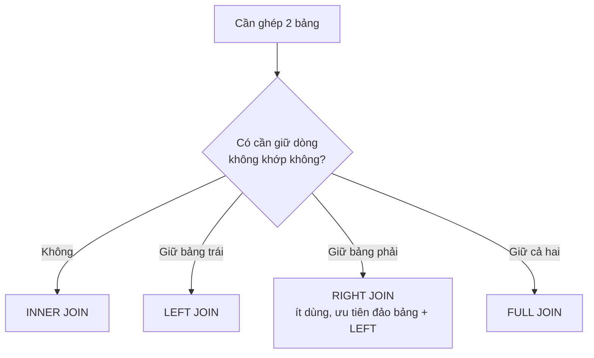

# JOIN, GROUP BY & HAVING

!!! info "Bạn đang ở đây"
    cần trước: sql nền tảng (SELECT, WHERE, ORDER BY, kiểu dữ liệu, NULL ba-trị).
    mở khoá: viết truy vấn nhiều bảng đúng ngữ nghĩa, tổng hợp báo cáo bằng GROUP BY/HAVING, và nhận diện anti-join trước khi bước sang ef core.

> Mục tiêu (đo được): sau chương này bạn có thể **phân tích** một yêu cầu báo cáo nhiều bảng và tự viết đúng truy vấn PostgreSQL dùng loại JOIN phù hợp (INNER/LEFT/RIGHT/FULL), GROUP BY kèm hàm tổng hợp, HAVING đúng chỗ (phân biệt với WHERE), COUNT(*) khác COUNT(cột) khi nào, và viết được anti-join bằng cả hai kỹ thuật (LEFT JOIN...IS NULL, NOT EXISTS).

## 0. Câu hỏi/đoán nhanh

Cho hai bảng: `khach_hang(id, ten)` có 5 khách, và `don_hang(id, khach_hang_id, so_tien)` có 4 đơn — chỉ 3 khách từng đặt hàng (một khách đặt 2 đơn).

Đoán trước khi mở đáp án:

1. `SELECT COUNT(*) FROM khach_hang k INNER JOIN don_hang d ON d.khach_hang_id = k.id;` trả về bao nhiêu dòng?
2. Muốn liệt kê **tất cả 5 khách** kèm tổng tiền (khách chưa mua thì tổng hiện `0` chứ không phải bị bỏ) — dùng loại JOIN nào?
3. Một đơn hàng có `so_tien` là `NULL` (đơn huỷ, chưa ghi số tiền). `COUNT(*)` và `COUNT(so_tien)` trên nhóm chứa đơn đó khác nhau ở đâu?

??? note "Đáp án"
    1. **4 dòng** — bằng số đơn hàng, không phải số khách. INNER JOIN nhân dòng theo số cặp khớp; khách đặt 2 đơn tạo ra 2 dòng.
    2. **LEFT JOIN** với `khach_hang` bên trái, rồi bọc tổng bằng `COALESCE(SUM(d.so_tien), 0)` vì khách không có đơn sẽ có `SUM` là NULL.
    3. `COUNT(*)` đếm **mọi dòng** trong nhóm kể cả dòng có `so_tien IS NULL` → đếm cả đơn đó. `COUNT(so_tien)` chỉ đếm dòng mà `so_tien` KHÔNG NULL → bỏ qua đơn đó, kết quả nhỏ hơn 1.

---

## 1. INNER JOIN

**Định nghĩa:** INNER JOIN ghép hai bảng lại thành một bảng kết quả, nhưng **chỉ giữ những cặp dòng khớp điều kiện nối** ở cả hai bảng — dòng nào không tìm được cặp bên kia thì bị loại hoàn toàn.

### 1.1 Ví dụ tối thiểu

```sql title="SQL"
CREATE TABLE khach_hang (
    id  integer GENERATED ALWAYS AS IDENTITY PRIMARY KEY,
    ten text NOT NULL
);

CREATE TABLE don_hang (
    id             integer GENERATED ALWAYS AS IDENTITY PRIMARY KEY,
    khach_hang_id  integer NOT NULL REFERENCES khach_hang(id),
    so_tien        numeric(10,2)
);

INSERT INTO khach_hang (ten) VALUES ('An'), ('Bình'), ('Chi');
-- Chi (id=3) KHÔNG có đơn hàng nào
INSERT INTO don_hang (khach_hang_id, so_tien) VALUES
    (1, 100.00),   -- An
    (2, 200.00);   -- Bình

SELECT k.ten, d.so_tien
FROM khach_hang k
INNER JOIN don_hang d ON d.khach_hang_id = k.id;
```

```text title="Kết quả"
 ten  | so_tien
------+---------
 An   |  100.00
 Bình |  200.00
```

Chi hoàn toàn **biến mất** khỏi kết quả — không có dòng nào trong `don_hang` khớp `khach_hang_id = 3`, nên INNER JOIN loại luôn dòng của Chi ở bảng `khach_hang`.

### 1.2 Khi dùng sai

Lỗi phổ biến nhất không phải lỗi cú pháp mà là **lỗi ngữ nghĩa im lặng**: quên rằng INNER JOIN loại bỏ dòng không khớp, rồi thắc mắc "sao báo cáo thiếu khách hàng?". PostgreSQL sẽ không báo lỗi gì — truy vấn chạy trơn tru, chỉ là thiếu dữ liệu.

Một lỗi cú pháp thật sự thường gặp là quên mệnh đề `ON`:

```sql title="SQL"
-- SAI: JOIN thiếu điều kiện nối
SELECT k.ten, d.so_tien
FROM khach_hang k
INNER JOIN don_hang d;
```

```text title="Lỗi PostgreSQL"
ERROR:  syntax error at or near ";"
LINE 3: INNER JOIN don_hang d;
                             ^
```

PostgreSQL bắt buộc `INNER JOIN` (và `LEFT`/`RIGHT`/`FULL JOIN`) phải có `ON <điều kiện>` (hoặc `USING (...)`) ngay sau tên bảng — nếu không sẽ báo lỗi cú pháp ngay lập tức, khác với `CROSS JOIN` (tích Descartes, không cần điều kiện, không nằm trong phạm vi chương này).

---

## 2. LEFT JOIN (LEFT OUTER JOIN)

**Định nghĩa:** LEFT JOIN ghép hai bảng nhưng **giữ lại toàn bộ dòng của bảng bên trái** (bảng viết trước `LEFT JOIN`) dù có khớp hay không; nếu một dòng trái không tìm được cặp bên phải, các cột của bảng phải trên dòng đó được điền `NULL`.

### 2.1 Ví dụ tối thiểu

Dùng lại đúng dữ liệu ở mục 1 (An, Bình có đơn; Chi không có đơn):

```sql title="SQL"
SELECT k.ten, d.so_tien
FROM khach_hang k
LEFT JOIN don_hang d ON d.khach_hang_id = k.id
ORDER BY k.id;
```

```text title="Kết quả"
 ten  | so_tien
------+---------
 An   |  100.00
 Bình |  200.00
 Chi  |    NULL
```

Chi vẫn xuất hiện — đúng như tên gọi "giữ toàn bộ bảng trái" — và cột `so_tien` của Chi là `NULL` vì không có đơn nào khớp.

### 2.2 Khi dùng sai

Lỗi thường gặp nhất: đặt điều kiện lọc cột bảng phải trong `WHERE` thay vì trong `ON`, vô tình biến LEFT JOIN thành INNER JOIN:

```sql title="SQL"
-- SAI: lọc so_tien trong WHERE sau khi đã LEFT JOIN
SELECT k.ten, d.so_tien
FROM khach_hang k
LEFT JOIN don_hang d ON d.khach_hang_id = k.id
WHERE d.so_tien > 50;
```

```text title="Kết quả (SAI Ý ĐỊNH — không phải lỗi cú pháp)"
 ten  | so_tien
------+---------
 An   |  100.00
 Bình |  200.00
```

Chi bị loại mất dù không có lỗi cú pháp nào — vì dòng của Chi có `d.so_tien IS NULL`, mà `NULL > 50` cho `UNKNOWN` chứ không `TRUE`, nên `WHERE` loại luôn dòng đó. Đây là lý do "LEFT JOIN của tôi không giữ hết dòng trái" — thực chất do `WHERE` áp lên bảng phải đã âm thầm biến nó thành INNER JOIN. Muốn lọc điều kiện bảng phải mà vẫn giữ dòng trái không khớp, đặt điều kiện đó trong `ON`:

```sql title="SQL"
SELECT k.ten, d.so_tien
FROM khach_hang k
LEFT JOIN don_hang d ON d.khach_hang_id = k.id AND d.so_tien > 50;
```

```text title="Kết quả ĐÚNG Ý ĐỊNH"
 ten  | so_tien
------+---------
 An   |  100.00
 Bình |  200.00
 Chi  |    NULL
```

---

## 3. RIGHT JOIN (RIGHT OUTER JOIN)

**Định nghĩa:** RIGHT JOIN ghép hai bảng nhưng **giữ lại toàn bộ dòng của bảng bên phải** (bảng viết sau `RIGHT JOIN`) dù có khớp hay không; dòng phải không khớp sẽ có cột bảng trái là `NULL`. Về bản chất, `A RIGHT JOIN B` cho kết quả giống hệt `B LEFT JOIN A` — chỉ đổi vai trò bảng nào được liệt kê trước.

### 3.1 Ví dụ tối thiểu

Thêm một đơn hàng "mồ côi" để minh hoạ rõ — giả sử có đơn nhập sai `khach_hang_id` không tồn tại (bỏ ràng buộc khoá ngoại tạm để minh hoạ):

```sql title="SQL"
CREATE TABLE don_hang_tam (
    id             integer,
    khach_hang_id  integer,   -- KHÔNG đặt FK để cho phép giá trị mồ côi minh hoạ
    so_tien        numeric(10,2)
);

INSERT INTO don_hang_tam VALUES
    (1, 1, 100.00),   -- khớp An
    (2, 99, 500.00);  -- khach_hang_id = 99 KHÔNG tồn tại trong khach_hang

SELECT k.ten, d.so_tien, d.khach_hang_id
FROM khach_hang k
RIGHT JOIN don_hang_tam d ON d.khach_hang_id = k.id
ORDER BY d.id;
```

```text title="Kết quả"
 ten | so_tien | khach_hang_id
-----+---------+---------------
 An  |  100.00 |             1
NULL |  500.00 |            99
```

Dòng đơn hàng thứ hai vẫn xuất hiện dù `khach_hang_id = 99` không khớp khách nào — vì `don_hang_tam` là bảng bên phải và RIGHT JOIN giữ toàn bộ nó; cột `ten` (thuộc bảng trái) là `NULL`.

### 3.2 Khi dùng sai

RIGHT JOIN không gây lỗi cú pháp khi dùng "sai" — vấn đề là **dễ đọc nhầm hướng**. Đảo ngược thứ tự bảng nhưng quên đổi `RIGHT` thành `LEFT` sẽ cho kết quả khác hẳn ý định:

```sql title="SQL"
-- Ý định: giữ toàn bộ khach_hang (giống ví dụ LEFT JOIN ở mục 2)
-- nhưng viết nhầm RIGHT JOIN với thứ tự bảng bị đảo:
SELECT k.ten, d.so_tien
FROM don_hang d
RIGHT JOIN khach_hang k ON d.khach_hang_id = k.id
ORDER BY k.id;
```

Câu này thật ra **đúng** về mặt kết quả (tương đương LEFT JOIN ở mục 2, vì `khach_hang` giờ là bảng phải), nhưng đội ngũ đa số quen đọc `A LEFT JOIN B` hơn `B RIGHT JOIN A` — đây là lý do thực chiến RIGHT JOIN **ít được dùng**: hầu như mọi RIGHT JOIN đều viết lại được thành LEFT JOIN bằng cách đảo thứ tự hai bảng, và LEFT JOIN dễ đọc hơn theo thói quen "bảng chính viết trước". Vì vậy trong SQL thực tế tại doanh nghiệp, RIGHT JOIN hiếm khi xuất hiện trong code review.

---

## 4. FULL JOIN (FULL OUTER JOIN)

**Định nghĩa:** FULL JOIN giữ lại **toàn bộ dòng của cả hai bảng** — dòng trái không khớp thì cột phải là `NULL`, dòng phải không khớp thì cột trái là `NULL`, và dòng khớp thì đầy đủ cả hai bên.

### 4.1 Ví dụ tối thiểu

Dùng `khach_hang` (An, Bình, Chi) và `don_hang_tam` (khớp An, và đơn mồ côi `khach_hang_id=99`):

```sql title="SQL"
SELECT k.ten, d.so_tien, d.khach_hang_id AS don_thuoc_ve
FROM khach_hang k
FULL JOIN don_hang_tam d ON d.khach_hang_id = k.id
ORDER BY k.id NULLS LAST;
```

```text title="Kết quả"
 ten  | so_tien | don_thuoc_ve
------+---------+--------------
 An   |  100.00 |            1
 Bình |    NULL |         NULL
 Chi  |    NULL |         NULL
 NULL |  500.00 |           99
```

Bình và Chi xuất hiện dù không có đơn (giống LEFT JOIN); đơn `khach_hang_id=99` cũng xuất hiện dù không khớp khách nào (giống RIGHT JOIN) — FULL JOIN gộp cả hai hành vi.

### 4.2 Khi dùng sai

Lỗi thường gặp: dùng FULL JOIN rồi lọc bằng `WHERE` trên cột có thể `NULL` ở cả hai phía mà quên `k.id` cũng có thể `NULL` (dòng chỉ có ở bảng phải):

```sql title="SQL"
-- SAI: giả định k.id luôn có giá trị để sắp xếp, quên trường hợp dòng chỉ từ bảng phải
SELECT k.ten, d.so_tien
FROM khach_hang k
FULL JOIN don_hang_tam d ON d.khach_hang_id = k.id
ORDER BY k.id;
```

Câu này KHÔNG lỗi cú pháp, nhưng theo mặc định PostgreSQL xếp `NULL` **cuối** khi `ASC` — dòng đơn mồ côi (`k.id IS NULL`) sẽ trôi xuống cuối bảng kết quả một cách "âm thầm đúng chuẩn" nhưng dễ khiến người đọc báo cáo tưởng bị thiếu dòng nếu chỉ xem trang đầu. Luôn cân nhắc `ORDER BY k.id NULLS FIRST` hoặc sắp theo cột khác chắc chắn không NULL khi dùng FULL JOIN.

---

## 5. So sánh 4 loại JOIN

Bây giờ đã học độc lập từng loại với ví dụ và lỗi riêng, ta mới gộp lại so sánh:

| Loại JOIN | Giữ dòng trái không khớp | Giữ dòng phải không khớp | Dùng khi |
|-----------|:---:|:---:|----------|
| INNER JOIN | không | không | chỉ cần dòng khớp cả hai bên (báo cáo "khách đã mua hàng") |
| LEFT JOIN | có | không | giữ toàn bộ bảng trái (VD tất cả khách, kể cả chưa mua) |
| RIGHT JOIN | không | có | giữ toàn bộ bảng phải (hiếm dùng — thường viết lại thành LEFT JOIN đảo bảng) |
| FULL JOIN | có | có | hợp nhất hai tập, không muốn mất dòng nào ở cả hai phía (đối soát dữ liệu) |



!!! danger "Đính chính hiểu lầm phổ biến"
    Nhiều người nghĩ "OUTER JOIN" là một loại JOIN riêng — thực ra `LEFT OUTER JOIN`, `RIGHT OUTER JOIN`, `FULL OUTER JOIN` chỉ là tên đầy đủ; từ khoá `OUTER` có thể bỏ qua (`LEFT JOIN` = `LEFT OUTER JOIN`). PostgreSQL chấp nhận cả hai cách viết.

---

## 6. GROUP BY

**Định nghĩa:** GROUP BY gom các dòng có **cùng giá trị** ở (các) cột chỉ định thành một nhóm duy nhất, để mỗi nhóm có thể được tính toán tổng hợp thành một dòng kết quả.

### 6.1 Ví dụ tối thiểu

```sql title="SQL"
SELECT khach_hang_id, COUNT(*) AS so_don
FROM don_hang
GROUP BY khach_hang_id;
```

Với dữ liệu `don_hang` gốc ở mục 1 (An id=1 có 1 đơn, Bình id=2 có 1 đơn):

```text title="Kết quả"
 khach_hang_id | so_don
---------------+--------
             1 |      1
             2 |      1
```

Mỗi khách hàng khác nhau (`khach_hang_id` khác nhau) tạo thành một nhóm riêng; `COUNT(*)` đếm số dòng gốc rơi vào mỗi nhóm.

### 6.2 Khi dùng sai

Lỗi PostgreSQL cụ thể và cực kỳ thường gặp: chọn một cột **không nằm trong GROUP BY và cũng không nằm trong hàm tổng hợp**.

```sql title="SQL"
-- SAI: chọn d.so_tien (từng dòng) trong khi GROUP BY theo khach_hang_id
SELECT khach_hang_id, so_tien
FROM don_hang
GROUP BY khach_hang_id;
```

```text title="Lỗi PostgreSQL"
ERROR:  column "don_hang.so_tien" must appear in the GROUP BY clause or be used in an aggregate function
LINE 1: SELECT khach_hang_id, so_tien
                              ^
```

Lý do: sau khi GROUP BY, mỗi nhóm có thể chứa **nhiều dòng** với `so_tien` khác nhau — PostgreSQL không tự đoán bạn muốn giá trị nào (đầu tiên? lớn nhất? tổng?), nên bắt buộc phải nói rõ bằng hàm tổng hợp (`SUM(so_tien)`, `MAX(so_tien)`...) hoặc thêm `so_tien` vào chính `GROUP BY`.

---

## 7. Hàm tổng hợp: COUNT, SUM, AVG, MIN, MAX

**Định nghĩa:** hàm tổng hợp (aggregate function) nhận **nhiều dòng đầu vào** (toàn bộ bảng, hoặc từng nhóm nếu có GROUP BY) và trả về **một giá trị duy nhất** cho mỗi nhóm.

### 7.1 Ví dụ tối thiểu

Thêm cho An (id=1) một đơn thứ hai để có nhóm 2 dòng minh hoạ rõ 5 hàm tổng hợp:

```sql title="SQL"
INSERT INTO don_hang (khach_hang_id, so_tien) VALUES (1, 50.00);
-- An giờ có 2 đơn: 100.00 và 50.00

SELECT
    khach_hang_id,
    COUNT(*)            AS so_don,
    SUM(so_tien)         AS tong_tien,
    AVG(so_tien)         AS trung_binh,
    MIN(so_tien)         AS nho_nhat,
    MAX(so_tien)         AS lon_nhat
FROM don_hang
GROUP BY khach_hang_id;
```

```text title="Kết quả (chỉ dòng của An)"
 khach_hang_id | so_don | tong_tien | trung_binh | nho_nhat | lon_nhat
---------------+--------+-----------+------------+----------+----------
             1 |      2 |    150.00 |      75.00 |    50.00 |   100.00
```

Năm hàm cùng chạy trên cùng một nhóm (2 dòng của An), mỗi hàm rút gọn 2 giá trị thành 1 số theo cách khác nhau.

### 7.2 Khi dùng sai

Gọi hàm tổng hợp ngoài ngữ cảnh hợp lệ — ví dụ dùng trực tiếp trong `WHERE`:

```sql title="SQL"
-- SAI: dùng SUM ngay trong WHERE
SELECT khach_hang_id
FROM don_hang
WHERE SUM(so_tien) > 100
GROUP BY khach_hang_id;
```

```text title="Lỗi PostgreSQL"
ERROR:  aggregate functions are not allowed in WHERE
LINE 3: WHERE SUM(so_tien) > 100
              ^
```

`WHERE` chạy **trước khi nhóm được tạo** (xem lại thứ tự thực thi ở chương SQL nền tảng), nên tại thời điểm đó chưa hề có "tổng của một nhóm" để so sánh — hàm tổng hợp chỉ có ý nghĩa sau bước `GROUP BY`. Cách sửa đúng nằm ở mục 9 (HAVING).

Một biến thể `NULL` dễ gây nhầm: `SUM`/`AVG`/`MIN`/`MAX` đều **bỏ qua dòng NULL**, nhưng nếu **toàn bộ nhóm** chỉ có giá trị NULL thì kết quả là NULL chứ không phải 0:

```sql title="SQL"
INSERT INTO don_hang (khach_hang_id, so_tien) VALUES (3, NULL);
-- Chi (id=3) giờ có 1 đơn nhưng so_tien là NULL

SELECT khach_hang_id, COUNT(*) AS so_don, SUM(so_tien) AS tong
FROM don_hang
WHERE khach_hang_id = 3
GROUP BY khach_hang_id;
```

```text title="Kết quả"
 khach_hang_id | so_don | tong
---------------+--------+------
             3 |      1 | NULL
```

`COUNT(*) = 1` (có 1 dòng), nhưng `SUM(so_tien) = NULL` vì không có giá trị nào không-NULL để cộng. Muốn hiện `0` thay vì `NULL`, bọc `COALESCE(SUM(so_tien), 0)`.

---

## 8. COUNT(*) so với COUNT(cột)

**Định nghĩa:** `COUNT(*)` đếm **số dòng** trong nhóm (không quan tâm cột nào NULL hay không); `COUNT(tên_cột)` chỉ đếm những dòng mà giá trị của **đúng cột đó** khác NULL.

### 8.1 Ví dụ tối thiểu

Dùng lại nhóm của Chi ở mục 7.2 (1 đơn, `so_tien IS NULL`) cộng thêm 1 đơn có giá trị:

```sql title="SQL"
INSERT INTO don_hang (khach_hang_id, so_tien) VALUES (3, 30.00);
-- Chi giờ có 2 đơn: 1 đơn so_tien NULL, 1 đơn so_tien = 30.00

SELECT
    COUNT(*)        AS dem_tat_ca_dong,
    COUNT(so_tien)  AS dem_dong_co_gia_tri
FROM don_hang
WHERE khach_hang_id = 3;
```

```text title="Kết quả"
 dem_tat_ca_dong | dem_dong_co_gia_tri
------------------+---------------------
                2 |                   1
```

`COUNT(*)` = 2 vì có 2 dòng trong bảng. `COUNT(so_tien)` = 1 vì chỉ có 1 trong 2 dòng có `so_tien` khác NULL.

### 8.2 Khi dùng sai

Lỗi ngữ nghĩa (không phải lỗi cú pháp) thường gặp: dùng `COUNT(cột_có_thể_NULL)` khi ý định thực sự là "đếm số dòng", khiến số liệu báo cáo bị hụt mà không ai để ý vì câu lệnh chạy hoàn toàn hợp lệ:

```sql title="SQL"
-- Ý định: đếm tổng số đơn hàng của Chi -> nên dùng COUNT(*)
-- Viết nhầm COUNT(so_tien) -> hụt mất đơn có so_tien NULL
SELECT khach_hang_id, COUNT(so_tien) AS so_don_SAI
FROM don_hang
WHERE khach_hang_id = 3
GROUP BY khach_hang_id;
```

```text title="Kết quả (SAI Ý ĐỊNH)"
 khach_hang_id | so_don_sai
---------------+------------
             3 |          1
```

Báo cáo nói Chi chỉ có 1 đơn, trong khi thực tế có 2 đơn (1 đơn chưa ghi `so_tien`). Quy tắc thực dùng: muốn đếm **số dòng/số bản ghi**, luôn dùng `COUNT(*)`; chỉ dùng `COUNT(cột)` khi cố ý muốn biết "có bao nhiêu dòng có giá trị ở cột này" (VD đếm số đơn **đã** có `so_tien` ghi nhận).

Một biến thể khác: `COUNT(DISTINCT cột)` đếm số **giá trị khác nhau** khác NULL:

```sql title="SQL"
SELECT COUNT(DISTINCT khach_hang_id) AS so_khach_da_mua
FROM don_hang;
```

Câu này trả về số khách hàng **duy nhất** đã từng đặt hàng (không đếm trùng khi một khách có nhiều đơn) — khác hẳn `COUNT(khach_hang_id)` (đếm mọi dòng có `khach_hang_id` không NULL, kể cả trùng).

---

## 9. HAVING

**Định nghĩa:** HAVING lọc **các nhóm** sau khi GROUP BY đã gom xong — chỉ giữ lại nhóm nào thoả điều kiện, và điều kiện đó thường dựa trên kết quả của hàm tổng hợp.

### 9.1 Ví dụ tối thiểu

```sql title="SQL"
SELECT khach_hang_id, SUM(so_tien) AS tong_tien
FROM don_hang
GROUP BY khach_hang_id
HAVING SUM(so_tien) > 100;
```

Với An tổng 150.00, Bình tổng 200.00, Chi tổng 30.00 (bỏ qua NULL):

```text title="Kết quả"
 khach_hang_id | tong_tien
---------------+-----------
             1 |    150.00
             2 |    200.00
```

Chi bị loại khỏi kết quả vì tổng của Chi (30.00) không thoả `> 100` — nhưng khác với `WHERE`, phép loại này xảy ra **sau khi** đã tính tổng theo nhóm.

### 9.2 Khi dùng sai

Dùng HAVING để lọc điều kiện **từng dòng** (không liên quan hàm tổng hợp) — hợp lệ về cú pháp nhưng sai về hiệu năng và đôi khi sai cả kết quả nếu nhầm cột:

```sql title="SQL"
-- CHẠY ĐƯỢC nhưng SAI CHỖ: lọc so_tien từng dòng bằng HAVING
SELECT khach_hang_id, SUM(so_tien) AS tong_tien
FROM don_hang
HAVING so_tien > 50   -- so_tien không nằm trong GROUP BY / không phải hàm tổng hợp
GROUP BY khach_hang_id;
```

```text title="Lỗi PostgreSQL"
ERROR:  column "don_hang.so_tien" must appear in the GROUP BY clause or be used in an aggregate function
LINE 3: HAVING so_tien > 50
               ^
```

`HAVING` vẫn phải tuân theo quy tắc "cột phải nằm trong GROUP BY hoặc trong hàm tổng hợp" giống hệt `SELECT` (mục 6.2), vì cả hai đều chạy **sau** bước GROUP BY — tại thời điểm đó `so_tien` của từng dòng riêng lẻ không còn ý nghĩa, chỉ có giá trị theo từng nhóm.

---

## 10. HAVING so với WHERE

Đã học riêng từng khái niệm, giờ so sánh trực tiếp bằng cùng một yêu cầu nghiệp vụ: "chỉ lấy đơn hàng `so_tien > 50`, sau đó tính tổng theo khách, chỉ giữ khách có tổng > 100".

```sql title="SQL"
SELECT khach_hang_id, SUM(so_tien) AS tong_tien
FROM don_hang
WHERE so_tien > 50              -- (1) lọc TỪNG DÒNG trước khi gom nhóm
GROUP BY khach_hang_id
HAVING SUM(so_tien) > 100;      -- (2) lọc TỪNG NHÓM sau khi đã gom
```

| Tiêu chí | WHERE | HAVING |
|---|---|---|
| Lọc gì | từng dòng gốc | từng nhóm đã gom |
| Chạy khi nào | trước GROUP BY | sau GROUP BY |
| Được dùng hàm tổng hợp? | không (lỗi `aggregate functions are not allowed in WHERE`) | có |
| Hiệu năng | rẻ hơn — giảm số dòng sớm | tốn hơn — chạy sau khi đã tính tổng hợp toàn bộ |
| Không có GROUP BY thì sao | vẫn hoạt động bình thường | vẫn hợp lệ, coi cả bảng là một nhóm duy nhất |

!!! danger "Đừng nhầm WHERE với HAVING"
    Quy tắc nhớ nhanh: nếu điều kiện nhắc tới **tên hàm tổng hợp** (`COUNT`, `SUM`, `AVG`, `MIN`, `MAX`) thì bắt buộc `HAVING`. Nếu điều kiện chỉ so sánh giá trị thô của một cột (không qua hàm tổng hợp), luôn ưu tiên `WHERE` vì nó lọc sớm, giảm số dòng phải xử lý ở các bước sau — đặt nhầm vào `HAVING` vẫn ra đúng kết quả (nếu không có lỗi cú pháp) nhưng chậm hơn vì PostgreSQL phải gom nhóm toàn bộ trước rồi mới lọc bớt.

---

## 11. Anti-join: tìm dòng không có cặp

**Định nghĩa:** anti-join là một truy vấn tìm các dòng ở bảng A **không có bất kỳ dòng khớp nào** ở bảng B — ví dụ "khách hàng nào chưa từng đặt đơn nào".

### 11.1 Cách 1 — LEFT JOIN ... WHERE ... IS NULL

```sql title="SQL"
SELECT k.ten
FROM khach_hang k
LEFT JOIN don_hang d ON d.khach_hang_id = k.id
WHERE d.id IS NULL;
```

```text title="Kết quả"
 ten
------
```

(Với dữ liệu hiện tại An, Bình, Chi đều đã có đơn nên kết quả rỗng — hãy thêm một khách mới chưa từng mua để thấy rõ:)

```sql title="SQL"
INSERT INTO khach_hang (ten) VALUES ('Dũng');  -- chưa có đơn nào

SELECT k.ten
FROM khach_hang k
LEFT JOIN don_hang d ON d.khach_hang_id = k.id
WHERE d.id IS NULL;
```

```text title="Kết quả"
 ten
------
 Dũng
```

Cơ chế: LEFT JOIN giữ mọi khách kể cả không có đơn, điền `NULL` cho cột bảng phải (`d.id`) khi không khớp; lọc `WHERE d.id IS NULL` chỉ giữ lại đúng những dòng "không khớp" đó — tức đúng nghĩa anti-join.

### 11.2 Cách 2 — NOT EXISTS

```sql title="SQL"
SELECT k.ten
FROM khach_hang k
WHERE NOT EXISTS (
    SELECT 1 FROM don_hang d WHERE d.khach_hang_id = k.id
);
```

```text title="Kết quả"
 ten
------
 Dũng
```

Cùng kết quả nhưng cơ chế khác: `NOT EXISTS` kiểm tra "có tồn tại ít nhất một đơn hàng nào của khách này không?" cho từng khách; nếu KHÔNG tồn tại thì giữ dòng khách đó lại. Đây không phải một JOIN theo cú pháp, nhưng là kỹ thuật anti-join phổ biến và thường được PostgreSQL tối ưu hiệu quả tương đương LEFT JOIN...IS NULL.

### 11.3 Khi dùng sai

Cạm bẫy kinh điển: dùng `NOT IN` thay vì `NOT EXISTS` khi subquery có thể trả về `NULL`.

```sql title="SQL"
-- Giả sử có 1 đơn hàng bị lỗi dữ liệu: khach_hang_id là NULL
INSERT INTO don_hang (khach_hang_id, so_tien) VALUES (NULL, 999.00);

-- SAI: NOT IN với subquery chứa NULL
SELECT k.ten
FROM khach_hang k
WHERE k.id NOT IN (SELECT khach_hang_id FROM don_hang);
```

```text title="Kết quả (SAI Ý ĐỊNH — không phải lỗi cú pháp)"
 ten
------
```

Kết quả **rỗng hoàn toàn**, kể cả Dũng (người chưa từng có đơn) cũng biến mất! Lý do: `NOT IN (list)` được PostgreSQL hiểu là `k.id <> v1 AND k.id <> v2 AND ... AND k.id <> NULL`. Vì danh sách chứa một `NULL` (từ đơn hàng lỗi), so sánh `k.id <> NULL` luôn cho `UNKNOWN`, khiến toàn bộ phép `AND` không bao giờ là `TRUE` — `NOT IN` "sập" hoàn toàn khi subquery có dù chỉ một `NULL`. Đây là lý do **luôn ưu tiên `NOT EXISTS` cho anti-join** thay vì `NOT IN` khi cột subquery có thể NULL — `NOT EXISTS` ở mục 11.2 không bị ảnh hưởng bởi NULL vì nó chỉ kiểm tra "có tồn tại hay không", không so sánh trực tiếp giá trị.

---

## 12. Ví dụ tổng hợp (trộn nhiều khái niệm)

Bây giờ mọi khái niệm riêng lẻ đã có định nghĩa — ví dụ ở mục 2 (LEFT JOIN), 6 (GROUP BY), 7 (hàm tổng hợp), 9 (HAVING) — ta mới ghép chúng vào một báo cáo thực tế: "liệt kê mọi khách hàng kèm tổng tiền đã mua (khách chưa mua hiện 0), chỉ giữ khách có từ 1 đơn có giá trị (bỏ qua đơn NULL) trở lên, sắp theo tổng tiền giảm dần".

```sql title="SQL"
SELECT
    k.ten,
    COUNT(d.id) FILTER (WHERE d.so_tien IS NOT NULL) AS so_don_hop_le,
    COALESCE(SUM(d.so_tien), 0)                       AS tong_tien
FROM khach_hang k
LEFT JOIN don_hang d ON d.khach_hang_id = k.id
GROUP BY k.id, k.ten
HAVING COUNT(d.id) FILTER (WHERE d.so_tien IS NOT NULL) >= 1
ORDER BY tong_tien DESC;
```

```text title="Kết quả"
 ten  | so_don_hop_le | tong_tien
------+---------------+-----------
 Bình |             1 |    200.00
 An   |             2 |    150.00
 Chi  |             1 |     30.00
```

Dũng bị loại vì `so_don_hop_le = 0` không thoả `>= 1`. Chú ý `GROUP BY k.id, k.ten`: dù chỉ hiển thị `k.ten`, PostgreSQL yêu cầu liệt kê đủ cột không-tổng-hợp trong `SELECT` vào `GROUP BY` (ở đây thêm `k.id` để mỗi khách trùng tên vẫn tách nhóm đúng theo khoá chính, dù không hiển thị `id`).

---

## 13. Bài tập có giàn giáo

**Đề bài:** liệt kê tên các khách hàng có `AVG(so_tien)` (bỏ đơn NULL) **cao hơn** trung bình chung của toàn bộ đơn hàng có giá trị. Điền vào chỗ trống:

```sql title="SQL"
SELECT k.ten, AVG(d.so_tien) AS tb_khach
FROM khach_hang k
JOIN don_hang d ON d.khach_hang_id = k.id
WHERE d.so_tien IS NOT NULL          -- giàn giáo: lọc NULL trước khi gom nhóm
GROUP BY k.id, k.ten
HAVING AVG(d.so_tien) > (             -- <-- điền subquery vô hướng ở đây
    /* trung bình chung mọi đơn có giá trị */
);
```

??? success "Lời giải"
    ```sql title="SQL"
    SELECT k.ten, AVG(d.so_tien) AS tb_khach
    FROM khach_hang k
    JOIN don_hang d ON d.khach_hang_id = k.id
    WHERE d.so_tien IS NOT NULL
    GROUP BY k.id, k.ten
    HAVING AVG(d.so_tien) > (SELECT AVG(so_tien) FROM don_hang WHERE so_tien IS NOT NULL);
    ```
    Vì sao: điều kiện so sánh dựa trên `AVG(d.so_tien)` — một hàm tổng hợp — nên bắt buộc đặt trong `HAVING`, không thể đặt trong `WHERE` (xem mục 9.2). `JOIN` (không `LEFT`) là đủ ở đây vì đề chỉ quan tâm khách **đã có** đơn hợp lệ.

**Đề bài (thiết kế, gỡ giàn giáo):** viết truy vấn tìm tên khách hàng **chưa từng có đơn nào với `so_tien > 100`** — chú ý: khác với "chưa từng có đơn nào" (mục 11), khách này có thể có đơn nhưng toàn bộ đều `<= 100` hoặc NULL.

??? success "Lời giải"
    ```sql title="SQL"
    SELECT k.ten
    FROM khach_hang k
    WHERE NOT EXISTS (
        SELECT 1 FROM don_hang d
        WHERE d.khach_hang_id = k.id AND d.so_tien > 100
    );
    ```
    Vì sao: dùng `NOT EXISTS` với điều kiện `so_tien > 100` ngay bên trong subquery (không phải `NOT IN`, tránh bẫy NULL ở mục 11.3). Khách có đơn nhưng toàn bộ `so_tien <= 100` (hoặc NULL) vẫn thoả `NOT EXISTS` vì không tồn tại đơn nào `> 100` — khác hẳn yêu cầu "chưa từng có đơn" ở mục 11 vốn không có điều kiện `so_tien` trong subquery.

---

## Cạm bẫy & thực chiến

- **Nhân dòng khi JOIN 1-nhiều rồi mới SUM**: JOIN `khach_hang` (1) với `don_hang` (nhiều) làm một khách xuất hiện nhiều lần — nếu vô tình `SUM` một cột khác thuộc bảng "1" (không phải bảng "nhiều") sau JOIN đó, giá trị sẽ bị cộng dồn sai theo số dòng nhân bản. Luôn tổng hợp trong CTE/subquery riêng theo khoá trước khi JOIN với bảng khác nếu cần tránh nhân dòng chồng chéo.
- **`NOT IN` + NULL "sập" toàn bộ kết quả**: như mục 11.3, chỉ cần một `NULL` trong danh sách của `NOT IN (subquery)` là kết quả rỗng hoàn toàn, kể cả với dòng lẽ ra phải khớp. Luôn dùng `NOT EXISTS` cho anti-join khi không chắc cột subquery có NULL hay không.
- **`WHERE` sau LEFT JOIN vô tình biến thành INNER JOIN**: đặt điều kiện lọc cột bảng phải trong `WHERE` (thay vì `ON`) sau một LEFT JOIN sẽ loại mất các dòng trái không khớp (vì `NULL <so-sánh> x` luôn `UNKNOWN`) — xem lại mục 2.2.
- **RIGHT JOIN và FULL JOIN với `ORDER BY` cột có thể NULL ở cả hai phía**: nhớ PostgreSQL mặc định xếp `NULL` cuối với `ASC`; dòng chỉ tồn tại ở một bên (cột phía kia NULL) có thể trôi xuống cuối trang kết quả gây hiểu nhầm là "thiếu dữ liệu" — cân nhắc `NULLS FIRST` hoặc sắp theo cột chắc chắn không NULL.
- **Đánh index cột JOIN**: khoá ngoại như `don_hang.khach_hang_id` nên có index (PostgreSQL không tự tạo index cho cột FK, chỉ tự tạo cho PK/UNIQUE) — thiếu index khiến JOIN trên bảng lớn phải quét tuần tự (`Seq Scan`) thay vì dùng `Index Scan`/`Hash Join` hiệu quả.
- **`COUNT(cột)` khi ý định là "đếm số dòng"**: dùng nhầm `COUNT(cột_có_thể_NULL)` thay vì `COUNT(*)` làm số liệu báo cáo hụt một cách âm thầm (mục 8.2) — không có lỗi cú pháp nào cảnh báo bạn.

---

## Bài tập

**Bài 1 (giàn giáo).** Cho bảng `khach_hang` và `don_hang` như trên. Viết truy vấn liệt kê từng khách hàng kèm số đơn hàng **có `so_tien` hợp lệ** (không NULL), sắp xếp theo số đơn giảm dần. Điền chỗ trống:

```sql title="SQL"
SELECT k.ten, COUNT(____) AS so_don
FROM khach_hang k
____ JOIN don_hang d ON d.khach_hang_id = k.id AND ____
GROUP BY ____
ORDER BY so_don ____;
```

??? success "Lời giải"
    ```sql title="SQL"
    SELECT k.ten, COUNT(d.id) AS so_don
    FROM khach_hang k
    LEFT JOIN don_hang d ON d.khach_hang_id = k.id AND d.so_tien IS NOT NULL
    GROUP BY k.id, k.ten
    ORDER BY so_don DESC;
    ```
    Vì sao: `LEFT JOIN` để giữ cả khách chưa từng mua (Dũng, hiện `so_don = 0`); điều kiện `d.so_tien IS NOT NULL` đặt trong `ON` (không phải `WHERE`) để không vô tình loại khách không khớp — nếu đặt trong `WHERE` sẽ tái diễn lỗi mục 2.2. `COUNT(d.id)` đếm dòng đơn khớp (không NULL vì `d.id` là khoá chính, luôn có giá trị khi khớp; khi không khớp do LEFT JOIN thì `d.id` là NULL và không được đếm).

**Bài 2 (thiết kế, đã gỡ giàn giáo).** Yêu cầu nghiệp vụ: công ty muốn tìm "khách hàng VIP" — định nghĩa là khách có **tổng tiền các đơn hợp lệ (so_tien không NULL) vượt quá 120**, VÀ có **ít nhất 2 đơn hợp lệ**. Viết một truy vấn PostgreSQL trả về `ten`, `tong_tien`, `so_don` cho các khách VIP, sắp theo `tong_tien` giảm dần. Tiêu chí chấp nhận: dùng đúng JOIN, GROUP BY, HAVING (không dùng WHERE để lọc điều kiện tổng hợp).

??? success "Lời giải"
    ```sql title="SQL"
    SELECT k.ten,
           SUM(d.so_tien) AS tong_tien,
           COUNT(d.id)    AS so_don
    FROM khach_hang k
    JOIN don_hang d ON d.khach_hang_id = k.id
    WHERE d.so_tien IS NOT NULL
    GROUP BY k.id, k.ten
    HAVING SUM(d.so_tien) > 120 AND COUNT(d.id) >= 2
    ORDER BY tong_tien DESC;
    ```
    Vì sao: dùng `JOIN` thường (không `LEFT`) vì VIP chắc chắn phải có đơn hợp lệ. `WHERE d.so_tien IS NOT NULL` lọc dòng trước khi gom (rẻ, đúng ngữ nghĩa vì đây là điều kiện từng dòng). Hai điều kiện VIP (`SUM > 120` và `COUNT >= 2`) đều dựa trên hàm tổng hợp nên bắt buộc gộp cả hai vào `HAVING` bằng `AND`, không thể tách một điều kiện ra `WHERE`.

---

## Tự kiểm tra

1. INNER JOIN và LEFT JOIN khác nhau ở điểm nào khi có dòng không khớp?
2. Vì sao `RIGHT JOIN` hiếm khi xuất hiện trong code thực tế dù PostgreSQL hỗ trợ đầy đủ?
3. Vì sao không được viết `WHERE COUNT(*) > 5`? Sửa lại cho đúng.
4. `COUNT(*)` khác `COUNT(so_tien)` thế nào khi `so_tien` có dòng NULL trong nhóm?
5. Viết mệnh đề tìm khách chưa từng có đơn hàng bằng `NOT EXISTS`.
6. Vì sao `NOT IN (SELECT khach_hang_id FROM don_hang)` có thể trả về rỗng một cách sai lệch, còn `NOT EXISTS` thì không?
7. Đặt `d.so_tien > 50` trong `ON` của một LEFT JOIN khác gì so với đặt trong `WHERE` sau LEFT JOIN đó?

??? note "Đáp án"
    1. INNER JOIN loại bỏ hoàn toàn dòng không khớp ở cả hai bảng; LEFT JOIN giữ toàn bộ dòng bảng trái và điền NULL cho cột bảng phải khi không khớp.
    2. Vì `A RIGHT JOIN B` luôn viết lại được thành `B LEFT JOIN A` cho cùng kết quả, mà LEFT JOIN quen thuộc và dễ đọc hơn theo thói quen "bảng chính viết trước" — nên đội ngũ thường chuẩn hoá về LEFT JOIN trong code review.
    3. Vì `COUNT` là hàm tổng hợp, chỉ có ý nghĩa sau khi nhóm đã được gom; `WHERE` chạy trước bước gom nhóm nên chưa có "COUNT của nhóm" nào tồn tại — PostgreSQL báo lỗi `aggregate functions are not allowed in WHERE`. Sửa: `GROUP BY ... HAVING COUNT(*) > 5`.
    4. `COUNT(*)` đếm mọi dòng trong nhóm kể cả dòng có `so_tien IS NULL`; `COUNT(so_tien)` chỉ đếm dòng mà `so_tien` khác NULL — nên `COUNT(so_tien) <= COUNT(*)` luôn đúng khi có ít nhất một dòng NULL.
    5. `SELECT k.ten FROM khach_hang k WHERE NOT EXISTS (SELECT 1 FROM don_hang d WHERE d.khach_hang_id = k.id);`
    6. Vì `NOT IN (list)` tương đương chuỗi `<>` nối bằng `AND` với từng phần tử trong list; nếu list chứa một `NULL`, so sánh `<> NULL` cho `UNKNOWN`, khiến cả biểu thức `AND` không bao giờ `TRUE` — toàn bộ kết quả rỗng. `NOT EXISTS` không so sánh giá trị trực tiếp mà chỉ kiểm tra "có tồn tại dòng khớp hay không", nên không bị ảnh hưởng bởi NULL trong bảng con.
    7. Đặt trong `ON`: điều kiện áp dụng khi tìm cặp khớp, dòng trái không khớp **vẫn được giữ** (đúng bản chất LEFT JOIN, cột phải thành NULL). Đặt trong `WHERE` sau LEFT JOIN: vì `NULL > 50` là `UNKNOWN`, dòng trái không khớp (có cột phải NULL) bị loại — LEFT JOIN bị "biến" thành INNER JOIN trên thực tế.

---

??? abstract "DEEP DIVE: CTE, window function, LATERAL & semi-join"
    **CTE (`WITH`)**: đặt tên cho một truy vấn con để dùng lại, giúp đọc dễ hơn và tránh lặp logic. PostgreSQL {{ postgres.current }} có thể inline hoặc materialize CTE tuỳ bộ tối ưu quyết định (khác với các bản PostgreSQL cũ hơn từng luôn materialize).

    ```sql title="SQL"
    WITH tong_theo_khach AS (
        SELECT khach_hang_id, SUM(so_tien) AS tong_tien
        FROM don_hang
        WHERE so_tien IS NOT NULL
        GROUP BY khach_hang_id
    )
    SELECT k.ten, t.tong_tien
    FROM khach_hang k
    JOIN tong_theo_khach t ON t.khach_hang_id = k.id
    WHERE t.tong_tien > 100;
    ```

    Cách này tránh bẫy "nhân dòng khi JOIN 1-nhiều rồi mới SUM" (mục Cạm bẫy) — tổng được tính **trước**, trong CTE, nên khi JOIN với `khach_hang` không còn nguy cơ nhân dòng ảnh hưởng tới `SUM`.

    **Window function** (`SUM(...) OVER (PARTITION BY ...)`) tổng hợp mà KHÔNG gộp dòng — giữ nguyên số dòng gốc nhưng thêm cột tổng hợp theo nhóm vào mỗi dòng. Đây là cách "vừa có chi tiết vừa có tổng" mà `GROUP BY` (vốn luôn gộp dòng) không làm được trực tiếp.

    ```sql title="SQL"
    SELECT d.id, d.khach_hang_id, d.so_tien,
           SUM(d.so_tien) OVER (PARTITION BY d.khach_hang_id) AS tong_theo_khach
    FROM don_hang d;
    ```

    Mỗi dòng đơn hàng gốc vẫn xuất hiện riêng, nhưng có thêm cột `tong_theo_khach` lặp lại tổng của khách đó trên mọi dòng của khách — khác hẳn `GROUP BY` vốn chỉ trả một dòng mỗi khách.

    **LATERAL JOIN**: cho phép subquery trong `FROM` tham chiếu cột của bảng đứng trước nó — giống correlated subquery nhưng có thể trả nhiều dòng, hữu ích cho bài toán "top-N mỗi nhóm" (VD đơn hàng lớn nhất của mỗi khách).

    **Semi-join vs anti-join**: `EXISTS` là semi-join (giữ dòng ngoài nếu có ít nhất một dòng khớp ở bảng con, nhưng không nhân dòng như JOIN thường); `NOT EXISTS` là anti-join (mục 11.2). PostgreSQL planner nhận diện cả hai mẫu này và có thể tối ưu thành `Hash Semi Join`/`Hash Anti Join` hiệu quả, xem được qua `EXPLAIN`.

    **Liên hệ EF Core (chương sau)**: khi dùng LINQ, `GroupBy(...)` theo sau bởi `Where(...)` trên kết quả nhóm sẽ dịch thành `HAVING`; còn `Where(...)` đặt **trước** `GroupBy(...)` dịch thành `WHERE`. Hiểu đúng ngữ nghĩa SQL gốc trong chương này giúp đọc được log truy vấn EF Core sinh ra và biết ngay khi nào EF Core dịch sai ý định.

Tiếp theo -> ef core & migrations
