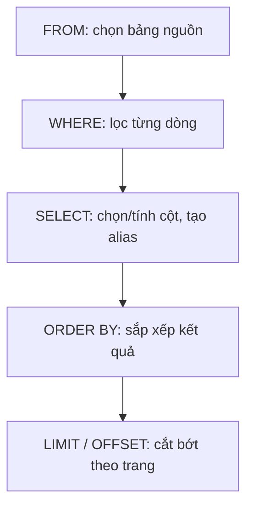

# SQL nền tảng (PostgreSQL)

!!! info "Bạn đang ở đây"
    cần trước: nền tảng p1 (đã chạy được chương trình c# đầu tiên, hiểu biến/kiểu dữ liệu cơ bản).
    mở khoá sau bài này: join & group by, ef core, thiết kế schema, transaction và index.
    ⏱️ fast path ~45 phút · deep dive thêm ~40 phút (tuỳ chọn).

> **Mục tiêu (đo được):** Sau bài này bạn **giải thích** được SQL là gì và vì sao nó "khai báo", **viết** đúng từng mệnh đề `SELECT/FROM/WHERE/ORDER BY/LIMIT/OFFSET` riêng lẻ, **chọn** đúng kiểu dữ liệu PostgreSQL cho từng loại giá trị, **viết** đúng `INSERT/UPDATE/DELETE`, **giải thích** thứ tự thực thi logic của một câu truy vấn, và **áp dụng** đúng `IS NULL`/`IS NOT NULL` thay vì so sánh `NULL` bằng `=`.

---

## 0. Kiểm tra trước (30 giây) — bạn đoán kết quả nào?

Giả sử có một bảng tên `users` với 3 dòng dữ liệu:

| id | name | age |
| --- | --- | --- |
| 1 | An | 30 |
| 2 | Bình | (trống — chưa nhập tuổi) |
| 3 | Cường | 25 |

Bạn chạy câu lệnh sau. Nó trả về **bao nhiêu dòng**? Đoán trước khi mở đáp án.

```sql title="SQL"
SELECT name FROM users WHERE age <> 30;
```

??? note "Đáp án — bấm để mở SAU khi đã đoán"
    Trả về **1 dòng**: `Cường`.

    Nhiều người đoán 2 dòng (Bình và Cường), vì trực giác nghĩ "Bình không có tuổi 30 nên chắc chắn khác 30". Nhưng trong SQL, ô "trống" của Bình không phải là số 0 hay chuỗi rỗng — nó là **`NULL`** (nghĩa là "không biết giá trị"). Và `NULL <> 30` không cho ra `TRUE`, nó cho ra **`UNKNOWN`**. Mệnh đề `WHERE` chỉ giữ lại dòng khi điều kiện là `TRUE` — `UNKNOWN` bị loại giống hệt `FALSE`. Vì vậy dòng của Bình biến mất khỏi kết quả dù bạn chưa hề nói age = 30 hay khác 30. Đây là bẫy `NULL` kinh điển trong SQL — bài này sẽ giải thích tường tận ở mục 8.

---

## 1. SQL là gì, và vì sao gọi là "khai báo"

**Định nghĩa:** SQL (Structured Query Language) là một ngôn ngữ dùng để **hỏi và thay đổi dữ liệu** đang được lưu có tổ chức trong các bảng bên trong một hệ quản trị cơ sở dữ liệu (ví dụ PostgreSQL). Bạn không viết SQL để "chạy một chương trình" như C# — bạn viết SQL để **mô tả dữ liệu bạn muốn thấy hoặc muốn thay đổi**, còn máy chủ cơ sở dữ liệu tự quyết định cách lấy dữ liệu đó nhanh nhất.

Đây chính là ý nghĩa của từ "khai báo" (declarative): bạn nói *"tôi muốn tên và giá của các sản phẩm có giá trên 100000"*, chứ không nói *"hãy chạy vòng lặp qua từng dòng, kiểm tra điều kiện, rồi thêm vào danh sách kết quả"* như khi lập trình C#/Java theo kiểu mệnh lệnh (imperative). Bộ phận bên trong PostgreSQL gọi là **query planner** (bộ lập kế hoạch truy vấn) sẽ tự tính xem nên quét toàn bảng hay dùng index, nên làm gì trước — bạn không cần và không nên tự viết vòng lặp.

Ví dụ tối thiểu, độc lập — một câu SQL đơn giản nhất có thể chạy:

```sql title="SQL"
SELECT 1 + 1;
```

Chạy trong `psql` (công cụ dòng lệnh của PostgreSQL) sẽ ra:

```text title="Kết quả"
 ?column?
----------
        2
(1 row)
```

Không có bảng nào ở đây cả — đây chỉ để minh hoạ: SQL là một ngôn ngữ có cú pháp riêng, câu lệnh luôn kết thúc bằng dấu chấm phẩy `;`, và từ khoá (`SELECT`) không phân biệt hoa/thường nhưng theo quy ước ta viết HOA để dễ đọc.

Nếu gõ sai cú pháp — ví dụ quên dấu chấm phẩy trong một số công cụ, hoặc gõ sai từ khoá — PostgreSQL sẽ báo lỗi cụ thể, không âm thầm chạy sai:

```sql title="SQL"
SELCT 1 + 1;
```

```text title="Lỗi PostgreSQL"
ERROR:  syntax error at or near "SELCT"
LINE 1: SELCT 1 + 1;
        ^
```

Đây là điều tốt: PostgreSQL **không đoán ý bạn** khi cú pháp sai — nó dừng lại và báo lỗi rõ ràng, khác hẳn một số ngôn ngữ script sẽ "chạy tiếp bằng mọi giá".

Từ mục 2 trở đi, ta sẽ học từng mệnh đề của câu `SELECT` — mỗi mệnh đề là một khái niệm riêng, học tuần tự.

---

## 2. Bảng (table) và dòng/cột — đơn vị tổ chức dữ liệu

**Định nghĩa:** Một **bảng** (table) là một tập hợp dữ liệu có cấu trúc lưới: mỗi **cột** (column) có một tên cố định và một kiểu dữ liệu cố định (ví dụ cột `age` luôn chứa số nguyên); mỗi **dòng** (row/record) là một bản ghi cụ thể, chứa một giá trị cho mỗi cột. Bạn có thể hình dung một bảng giống hệt một sheet Excel có tiêu đề cột cố định.

Ví dụ tối thiểu — tạo một bảng chỉ có 3 cột, chưa có dữ liệu, chưa dùng thêm khái niệm nào khác (đây chính là bảng `users` dùng xuyên suốt các ví dụ ở mục 0 và mục 3):

```sql title="SQL"
CREATE TABLE users (
    id   integer,
    name text,
    age  integer
);

INSERT INTO users VALUES (1, 'An', 30), (2, 'Bình', NULL), (3, 'Cường', 25);
```

Ở đây `CREATE TABLE` là lệnh tạo bảng, `users` là tên bảng, và bên trong ngoặc là danh sách cột: mỗi dòng gồm `tên_cột kiểu_dữ_liệu`, cách nhau bằng dấu phẩy. `integer` và `text` là hai kiểu dữ liệu — ta sẽ học chi tiết các kiểu ở mục 4. Câu `INSERT` (sẽ học kỹ ở mục 9) chỉ dùng tạm ở đây để có dữ liệu minh hoạ — chú ý dòng của Bình để trống tuổi bằng `NULL`, đúng như bảng ở mục 0.

Nếu bạn cố tạo lại một bảng đã tồn tại (chạy lại đúng câu lệnh trên lần thứ hai), PostgreSQL báo lỗi cụ thể thay vì âm thầm ghi đè:

```text title="Lỗi PostgreSQL"
ERROR:  relation "users" already exists
```

("relation" là tên kỹ thuật PostgreSQL dùng cho bảng/view — nhìn thấy từ này trong lỗi, hiểu là "bảng").

Nếu bạn gõ sai tên kiểu dữ liệu (ví dụ đánh máy nhầm `interger`), PostgreSQL cũng báo lỗi cụ thể ngay khi tạo bảng, không đợi tới lúc chèn dữ liệu:

```text title="Lỗi PostgreSQL"
ERROR:  type "interger" does not exist
```

---

## 3. `SELECT` và `FROM` — lấy dữ liệu từ một bảng

### 3.1. `FROM` — chọn bảng nguồn

**Định nghĩa:** `FROM` là mệnh đề nói cho PostgreSQL biết **lấy dữ liệu từ bảng nào**. Không có `FROM`, PostgreSQL không biết dữ liệu nằm ở đâu để đọc.

Ví dụ tối thiểu (giả sử bảng `users` ở mục 2 đã có sẵn dữ liệu):

```sql title="SQL"
SELECT * FROM users;
```

`*` (dấu sao) nghĩa là "lấy tất cả các cột". Kết quả trả về mọi cột, mọi dòng của bảng `users`.

Nếu bạn ghi sai tên bảng (bảng không tồn tại), PostgreSQL báo lỗi cụ thể:

```sql title="SQL"
SELECT * FROM userss;
```

```text title="Lỗi PostgreSQL"
ERROR:  relation "userss" does not exist
LINE 1: SELECT * FROM userss;
                      ^
```

### 3.2. `SELECT` — chọn cột nào để hiển thị

**Định nghĩa:** `SELECT` là mệnh đề nói cho PostgreSQL biết **cột nào** (hoặc biểu thức tính toán nào) sẽ xuất hiện trong kết quả trả về. Khác với `*`, bạn có thể liệt kê đích danh từng cột.

Ví dụ tối thiểu — chỉ lấy cột `name`, bỏ qua `id`:

```sql title="SQL"
SELECT name FROM users;
```

Kết quả chỉ có một cột `name`, dù bảng `users` có thể có nhiều cột hơn.

Nếu bạn liệt kê một cột không tồn tại trong bảng, PostgreSQL báo lỗi cụ thể ngay:

```sql title="SQL"
SELECT full_name FROM users;
```

```text title="Lỗi PostgreSQL"
ERROR:  column "full_name" does not exist
LINE 1: SELECT full_name FROM users;
               ^
HINT:  Perhaps you meant to reference the column "users.name".
```

Chú ý: PostgreSQL thậm chí gợi ý (`HINT`) tên cột gần giống — rất hữu ích khi gõ nhầm.

Bạn cũng có thể `SELECT` một biểu thức tính toán, không chỉ tên cột thuần:

```sql title="SQL"
SELECT name, age * 12 FROM users;
```

Câu này trả về cột `name` và một cột không tên chứa kết quả `age * 12` (giả định "age" tính theo năm, nhân 12 ra "số tháng tuổi" — chỉ là ví dụ số học, không cần hợp lý về nghiệp vụ). Muốn đặt tên cho cột tính toán này, ta dùng `AS` — học ở mục 3.3.

### 3.3. Alias cột với `AS`

**Định nghĩa:** `AS` dùng để đặt một **tên tạm** (alias) cho một cột hoặc biểu thức trong kết quả trả về, giúp kết quả dễ đọc hơn thay vì hiện tên biểu thức gốc hoặc `?column?`.

Ví dụ tối thiểu:

```sql title="SQL"
SELECT name, age * 12 AS age_in_months FROM users;
```

Kết quả có cột thứ hai tên là `age_in_months` thay vì tên mặc định khó đọc.

`AS` không có "lỗi khi dùng sai" theo nghĩa cú pháp báo lỗi — nhưng có một cạm bẫy quan trọng liên quan tới thứ tự thực thi: alias tạo trong `SELECT` **không dùng được** trong `WHERE` của cùng câu lệnh đó. Ta sẽ giải thích lý do (thứ tự thực thi logic) ở mục 9, và thấy lỗi cụ thể xảy ra:

```sql title="SQL"
SELECT age * 12 AS age_in_months
FROM users
WHERE age_in_months > 300;
```

```text title="Lỗi PostgreSQL"
ERROR:  column "age_in_months" does not exist
LINE 3: WHERE age_in_months > 300;
              ^
```

Ghi nhớ mục này, ta sẽ quay lại giải thích *vì sao* ở mục 9 sau khi đã học đủ các mệnh đề.

---

## 4. Kiểu dữ liệu PostgreSQL — mỗi cột cần đúng kiểu

Một cột trong bảng luôn có một **kiểu dữ liệu** cố định, quyết định loại giá trị nào được phép lưu và validate được ở tầng database (không phải chỉ ở tầng ứng dụng). Ta học từng kiểu hay dùng nhất, riêng lẻ.

### 4.1. `text` — chuỗi ký tự

**Định nghĩa:** `text` là kiểu lưu chuỗi ký tự (chữ, số dạng văn bản, ký tự đặc biệt) với độ dài **không giới hạn cố định** — PostgreSQL tự quản lý bộ nhớ theo độ dài thực tế.

Ví dụ tối thiểu:

```sql title="SQL"
CREATE TABLE demo_text (note text);
INSERT INTO demo_text VALUES ('Xin chào, đây là một chuỗi dài bao nhiêu cũng được.');
SELECT * FROM demo_text;
```

Nếu bạn quên dấu nháy đơn quanh chuỗi, PostgreSQL sẽ hiểu nhầm chuỗi đó là tên cột/định danh và báo lỗi cụ thể:

```sql title="SQL"
INSERT INTO demo_text VALUES (Xin chào);
```

```text title="Lỗi PostgreSQL"
ERROR:  syntax error at or near "chào"
LINE 1: INSERT INTO demo_text VALUES (Xin chào);
                                          ^
```

(PostgreSQL cố đọc `Xin` như một định danh, rồi gặp `chào` ngay sau mà không có dấu phẩy/toán tử hợp lệ, nên báo lỗi cú pháp.)

!!! info "Vì sao ưu tiên `text` hơn `varchar(n)`"
    PostgreSQL có cả `varchar(n)` (chuỗi giới hạn tối đa n ký tự) lẫn `text` (không giới hạn). Về hiệu năng, hai kiểu này **tương đương** trong PostgreSQL (khác với một số hệ khác). Khuyến nghị: dùng `text`, và nếu cần giới hạn độ dài thì validate ở tầng ứng dụng hoặc thêm ràng buộc `CHECK` riêng — tránh `varchar(n)` trừ khi có lý do cụ thể (ví dụ mã hoá theo chuẩn có độ dài cố định).

### 4.2. `integer` — số nguyên

**Định nghĩa:** `integer` (viết tắt thường gặp: `int`) là kiểu lưu số nguyên (không có phần thập phân), phạm vi khoảng −2,147,483,648 đến 2,147,483,647 (số nguyên 32-bit).

Ví dụ tối thiểu:

```sql title="SQL"
CREATE TABLE demo_int (quantity integer);
INSERT INTO demo_int VALUES (42);
SELECT * FROM demo_int;
```

Nếu bạn cố chèn một giá trị không phải số nguyên hợp lệ (ví dụ chuỗi chữ), PostgreSQL báo lỗi cụ thể:

```sql title="SQL"
INSERT INTO demo_int VALUES ('bốn mươi hai');
```

```text title="Lỗi PostgreSQL"
ERROR:  invalid input syntax for type integer: "bốn mươi hai"
```

Nếu cần số nguyên lớn hơn phạm vi của `integer` (ví dụ đếm hơn 2 tỷ), dùng `bigint` (64-bit) — cùng nguyên tắc, chỉ khác phạm vi.

### 4.3. `numeric(p, s)` — số thập phân chính xác (dùng cho tiền)

**Định nghĩa:** `numeric(p, s)` là kiểu lưu số có phần thập phân với độ chính xác **tuyệt đối** (không làm tròn nhị phân), trong đó `p` (precision) là tổng số chữ số, `s` (scale) là số chữ số sau dấu thập phân.

Ví dụ tối thiểu — `numeric(10, 2)` nghĩa là tối đa 10 chữ số, trong đó 2 chữ số sau dấu phẩy:

```sql title="SQL"
CREATE TABLE demo_numeric (price numeric(10, 2));
INSERT INTO demo_numeric VALUES (450000.50);
SELECT * FROM demo_numeric;
```

Nếu bạn chèn một giá trị có nhiều chữ số hơn precision cho phép, PostgreSQL báo lỗi cụ thể:

```sql title="SQL"
INSERT INTO demo_numeric VALUES (12345678901.23);
```

```text title="Lỗi PostgreSQL"
ERROR:  numeric field overflow
DETAIL:  A field with precision 10, scale 2 must round to an absolute value less than 10^8.
```

!!! danger "Vì sao không dùng `float`/`double precision` cho tiền"
    `float` và `double precision` lưu số theo chuẩn dấu phẩy động nhị phân (binary floating-point) — cùng cơ chế float/double trong C#. Một số thập phân tưởng chừng đơn giản như `0.1` không biểu diễn được **chính xác tuyệt đối** trong hệ nhị phân, dẫn tới sai số tích luỹ khi cộng trừ nhiều lần. Với tiền tệ, sai số này không chấp nhận được. `numeric` lưu số dạng thập phân chính xác nên không có vấn đề này — luôn dùng `numeric(p, s)` cho tiền, số lượng cần chính xác tuyệt đối.

### 4.4. `boolean` — đúng/sai

**Định nghĩa:** `boolean` là kiểu chỉ chứa một trong hai giá trị `true` hoặc `false` (hoặc `NULL` nếu cột cho phép, xem mục 8).

Ví dụ tối thiểu:

```sql title="SQL"
CREATE TABLE demo_bool (is_active boolean);
INSERT INTO demo_bool VALUES (true), (false);
SELECT * FROM demo_bool;
```

Nếu bạn chèn một giá trị không phải boolean hợp lệ, PostgreSQL báo lỗi cụ thể:

```sql title="SQL"
INSERT INTO demo_bool VALUES ('maybe');
```

```text title="Lỗi PostgreSQL"
ERROR:  invalid input syntax for type boolean: "maybe"
```

### 4.5. `timestamptz` — thời điểm có múi giờ

**Định nghĩa:** `timestamptz` (viết đầy đủ: `timestamp with time zone`) là kiểu lưu một **thời điểm cụ thể** (ngày + giờ), luôn được PostgreSQL quy đổi và lưu trữ nội bộ theo UTC, rồi hiển thị lại theo múi giờ của phiên kết nối.

Ví dụ tối thiểu:

```sql title="SQL"
CREATE TABLE demo_ts (created_at timestamptz);
INSERT INTO demo_ts VALUES (now());
SELECT * FROM demo_ts;
```

`now()` là hàm trả về thời điểm hiện tại. Nếu bạn chèn một chuỗi ngày giờ không hợp lệ, PostgreSQL báo lỗi cụ thể:

```sql title="SQL"
INSERT INTO demo_ts VALUES ('ngày mai lúc 5 giờ');
```

```text title="Lỗi PostgreSQL"
ERROR:  invalid input syntax for type timestamp with time zone: "ngày mai lúc 5 giờ"
```

!!! info "Vì sao ưu tiên `timestamptz` hơn `timestamp`"
    PostgreSQL còn có `timestamp` (không kèm múi giờ, viết đầy đủ `timestamp without time zone`) — nó lưu đúng con số ngày-giờ bạn đưa vào, **không biết** đó là múi giờ nào. Khi hệ thống của bạn có người dùng ở nhiều múi giờ khác nhau, hoặc server đổi múi giờ, `timestamp` dễ gây sai lệch giờ mà không có cách nào tự sửa lại được (vì thông tin múi giờ gốc đã mất). `timestamptz` luôn quy đổi và lưu chuẩn UTC nội bộ, nên an toàn hơn — khuyến nghị dùng mặc định cho mọi cột thời gian.

### 4.6. `GENERATED ALWAYS AS IDENTITY` — cột tự tăng cho khoá chính

**Định nghĩa:** `GENERATED ALWAYS AS IDENTITY` là một khai báo thêm vào một cột kiểu số nguyên, yêu cầu PostgreSQL **tự động sinh giá trị tăng dần** cho cột đó mỗi khi thêm dòng mới, thường dùng cho cột khoá chính (primary key) đại diện danh tính duy nhất của mỗi dòng.

Ví dụ tối thiểu:

```sql title="SQL"
CREATE TABLE demo_identity (
    id   integer GENERATED ALWAYS AS IDENTITY,
    name text
);

INSERT INTO demo_identity (name) VALUES ('An'), ('Bình');
SELECT * FROM demo_identity;
```

Kết quả:

```text title="Kết quả"
 id | name
----+------
  1 | An
  2 | Bình
(2 rows)
```

Chú ý: câu `INSERT` **không hề nhắc tới cột `id`** — PostgreSQL tự sinh `1`, `2`, tăng dần.

Vì khai báo là `GENERATED ALWAYS` (chứ không phải `GENERATED BY DEFAULT`), nếu bạn cố tình chèn giá trị tay vào cột `id`, PostgreSQL báo lỗi cụ thể để ngăn ghi đè vô ý:

```sql title="SQL"
INSERT INTO demo_identity (id, name) VALUES (99, 'Cường');
```

```text title="Lỗi PostgreSQL"
ERROR:  cannot insert a non-DEFAULT value into column "id"
DETAIL:  Column "id" is an identity column defined as GENERATED ALWAYS.
HINT:  Use OVERRIDING SYSTEM VALUE to override.
```

!!! danger "Vì sao dùng `GENERATED ALWAYS AS IDENTITY` thay vì `serial`"
    Các phiên bản PostgreSQL cũ và nhiều tài liệu vẫn dùng kiểu `serial` (viết `id serial PRIMARY KEY`) để tạo cột tự tăng. `serial` thực chất chỉ là cú pháp tắt tạo ra một `sequence` (bộ đếm) gắn với cột — và vì không phải là "identity column" chuẩn SQL, `serial` **cho phép ghi đè giá trị tuỳ ý** mà không cảnh báo gì, dễ gây trùng lặp hoặc lệch bộ đếm. `GENERATED ALWAYS AS IDENTITY` là cú pháp chuẩn SQL:2003+, được PostgreSQL khuyến nghị thay thế `serial` từ bản 10 trở đi, an toàn hơn vì chặn ghi đè vô ý như ví dụ trên.

Bảng tóm tắt các kiểu vừa học — **chỉ để tổng hợp lại**, không giới thiệu khái niệm mới nào ở đây:

| Kiểu | Dùng cho | Ghi chú |
| --- | --- | --- |
| `text` | Chuỗi ký tự độ dài bất kỳ | Ưu tiên hơn `varchar(n)` |
| `integer` | Số nguyên 32-bit | Dùng `bigint` khi cần phạm vi lớn hơn |
| `numeric(p,s)` | Số thập phân chính xác (tiền tệ) | KHÔNG dùng `float`/`double precision` cho tiền |
| `boolean` | true/false | |
| `timestamptz` | Thời điểm có múi giờ | Ưu tiên hơn `timestamp` |
| `GENERATED ALWAYS AS IDENTITY` | Cột tự tăng, thường cho khoá chính | Ưu tiên hơn `serial` |

---

## 5. `PRIMARY KEY` và `NOT NULL` — ràng buộc cơ bản

### 5.1. `NOT NULL` — bắt buộc phải có giá trị

**Định nghĩa:** `NOT NULL` là một ràng buộc (constraint) đặt trên một cột, yêu cầu **mọi dòng đều phải có giá trị thực** ở cột đó — không được để trống (không được là `NULL`, khái niệm `NULL` học kỹ ở mục 8).

Ví dụ tối thiểu:

```sql title="SQL"
CREATE TABLE demo_notnull (
    name text NOT NULL
);

INSERT INTO demo_notnull (name) VALUES ('An');
```

Câu `INSERT` trên hợp lệ. Nhưng nếu cố chèn một dòng không có giá trị cho `name`:

```sql title="SQL"
INSERT INTO demo_notnull (name) VALUES (NULL);
```

```text title="Lỗi PostgreSQL"
ERROR:  null value in column "name" of relation "demo_notnull" violates not-null constraint
DETAIL:  Failing row contains (null).
```

### 5.2. `PRIMARY KEY` — khoá chính, định danh duy nhất

**Định nghĩa:** `PRIMARY KEY` là một ràng buộc đặt trên một (hoặc nhiều) cột, đảm bảo giá trị ở cột đó **vừa không được trùng lặp giữa các dòng, vừa không được để trống** — dùng để định danh duy nhất từng dòng trong bảng.

Ví dụ tối thiểu — kết hợp với `GENERATED ALWAYS AS IDENTITY` đã học ở mục 4.6:

```sql title="SQL"
CREATE TABLE demo_pk (
    id   integer GENERATED ALWAYS AS IDENTITY PRIMARY KEY,
    name text
);

INSERT INTO demo_pk (name) VALUES ('An');
```

Nếu bạn cố chèn một dòng có `id` trùng với dòng đã tồn tại (giả sử ép giá trị tay bằng `OVERRIDING SYSTEM VALUE` — chi tiết nâng cao, không cần nhớ cú pháp này), PostgreSQL báo lỗi cụ thể:

```text title="Lỗi PostgreSQL (minh hoạ khi trùng khoá chính)"
ERROR:  duplicate key value violates unique constraint "demo_pk_pkey"
DETAIL:  Key (id)=(1) already exists.
```

Ghi nhớ: `PRIMARY KEY` = `NOT NULL` + duy nhất (unique), gộp lại thành một ràng buộc.

---

## 6. `WHERE` — lọc dòng theo điều kiện

**Định nghĩa:** `WHERE` là mệnh đề dùng để **lọc bớt dòng** — chỉ giữ lại những dòng mà điều kiện sau `WHERE` cho kết quả `TRUE`. Dòng nào điều kiện cho `FALSE` (hoặc `UNKNOWN`, xem mục 8) sẽ bị loại khỏi kết quả.

Ví dụ tối thiểu — giả sử bảng `products` sau đã tồn tại (ta sẽ dùng lại bảng này xuyên suốt phần còn lại của chương):

```sql title="SQL"
CREATE TABLE products (
    id    integer GENERATED ALWAYS AS IDENTITY PRIMARY KEY,
    name  text NOT NULL,
    price numeric(10, 2) NOT NULL
);

INSERT INTO products (name, price) VALUES
    ('Bàn phím', 450000),
    ('Chuột',    150000),
    ('Màn hình', 3200000);
```

```sql title="SQL"
SELECT name FROM products WHERE price > 200000;
```

Kết quả chỉ gồm những dòng có `price > 200000` là `TRUE`:

```text title="Kết quả"
   name
----------
 Bàn phím
 Màn hình
(2 rows)
```

Nếu bạn dùng sai kiểu trong điều kiện so sánh (ví dụ so sánh cột số với chuỗi không parse được thành số), PostgreSQL báo lỗi cụ thể:

```sql title="SQL"
SELECT name FROM products WHERE price > 'rẻ';
```

```text title="Lỗi PostgreSQL"
ERROR:  invalid input syntax for type numeric: "rẻ"
```

Các toán tử so sánh dùng trong `WHERE`: `=` (bằng), `<>` hoặc `!=` (khác), `>`, `<`, `>=`, `<=`. Có thể kết hợp nhiều điều kiện bằng `AND` (cả hai đều đúng) và `OR` (một trong hai đúng):

```sql title="SQL"
SELECT name FROM products WHERE price > 100000 AND price < 1000000;
```

---

## 7. `ORDER BY` và `LIMIT`/`OFFSET` — sắp xếp và phân trang

### 7.1. `ORDER BY` — sắp xếp kết quả

**Định nghĩa:** `ORDER BY` là mệnh đề quy định **thứ tự hiển thị** của các dòng kết quả theo giá trị của một hoặc nhiều cột. Nếu không có `ORDER BY`, PostgreSQL **không đảm bảo** bất kỳ thứ tự cố định nào — thứ tự có thể khác nhau giữa các lần chạy.

Ví dụ tối thiểu — sắp xếp theo giá tăng dần (mặc định là `ASC` — ascending):

```sql title="SQL"
SELECT name, price FROM products ORDER BY price;
```

```text title="Kết quả"
   name    |  price
-----------+----------
 Chuột     | 150000.00
 Bàn phím  | 450000.00
 Màn hình  | 3200000.00
(3 rows)
```

Sắp xếp giảm dần dùng `DESC`:

```sql title="SQL"
SELECT name, price FROM products ORDER BY price DESC;
```

Nếu bạn `ORDER BY` theo một cột không tồn tại, PostgreSQL báo lỗi cụ thể:

```sql title="SQL"
SELECT name FROM products ORDER BY gia;
```

```text title="Lỗi PostgreSQL"
ERROR:  column "gia" does not exist
LINE 1: SELECT name FROM products ORDER BY gia;
                                            ^
```

### 7.2. `LIMIT` — giới hạn số dòng trả về

**Định nghĩa:** `LIMIT n` giới hạn kết quả trả về **tối đa `n` dòng đầu tiên**, sau khi đã áp dụng mọi mệnh đề khác (kể cả `ORDER BY` nếu có).

Ví dụ tối thiểu:

```sql title="SQL"
SELECT name FROM products ORDER BY price DESC LIMIT 2;
```

Chỉ trả về 2 dòng có giá cao nhất:

```text title="Kết quả"
   name
----------
 Màn hình
 Bàn phím
(2 rows)
```

`LIMIT` với một giá trị không phải số nguyên không âm sẽ báo lỗi cụ thể:

```sql title="SQL"
SELECT name FROM products LIMIT -1;
```

```text title="Lỗi PostgreSQL"
ERROR:  LIMIT must not be negative
```

### 7.3. `OFFSET` — bỏ qua một số dòng đầu

**Định nghĩa:** `OFFSET n` bỏ qua `n` dòng đầu tiên của kết quả (sau khi sắp xếp), rồi mới bắt đầu trả về (hoặc áp dụng `LIMIT` tiếp theo nếu có). Thường dùng chung với `LIMIT` để phân trang.

Ví dụ tối thiểu — lấy trang thứ 2, mỗi trang 1 dòng, sắp theo giá tăng dần:

```sql title="SQL"
SELECT name, price FROM products ORDER BY price ASC LIMIT 1 OFFSET 1;
```

```text title="Kết quả"
   name   |  price
----------+----------
 Bàn phím | 450000.00
(1 row)
```

(`OFFSET 1` bỏ qua dòng đầu tiên là `Chuột`, `LIMIT 1` chỉ lấy dòng tiếp theo là `Bàn phím`.)

!!! danger "Cạm bẫy: phân trang mà quên `ORDER BY`"
    Nếu bạn dùng `LIMIT`/`OFFSET` để phân trang mà **không có `ORDER BY`**, PostgreSQL không cam kết thứ tự dòng cố định giữa các lần gọi — trang 1 và trang 2 có thể trùng dòng hoặc thiếu dòng một cách không thể đoán trước. Luôn kèm `ORDER BY` khi dùng `LIMIT`/`OFFSET` để phân trang.

---

## 8. `NULL` — "không biết giá trị", và `IS NULL` / `IS NOT NULL`

### 8.1. `NULL` nghĩa là gì

**Định nghĩa:** `NULL` là một giá trị đặc biệt trong SQL đại diện cho **"không có giá trị" hoặc "không biết giá trị"** — nó không phải số 0, không phải chuỗi rỗng `''`, không phải `false`. `NULL` có thể xuất hiện ở bất kỳ cột nào không có ràng buộc `NOT NULL`.

Ví dụ tối thiểu:

```sql title="SQL"
CREATE TABLE demo_null (stock integer);
INSERT INTO demo_null VALUES (5), (NULL);
SELECT * FROM demo_null;
```

```text title="Kết quả"
 stock
-------
     5

(2 rows)
```

Dòng thứ hai hiển thị ô trống — đó là `NULL`, không phải số `0`.

### 8.2. So sánh `NULL` bằng `=` hoặc `<>` — vì sao luôn cho `UNKNOWN`

Đây là điều quan trọng nhất của mục này: SQL dùng **logic ba trạng thái** (three-valued logic) cho các phép so sánh — kết quả có thể là `TRUE`, `FALSE`, hoặc **`UNKNOWN`**. Bất kỳ phép so sánh nào có một bên là `NULL` đều cho ra `UNKNOWN`, kể cả so sánh `NULL` với chính `NULL`.

Ví dụ tối thiểu — minh hoạ trực tiếp bằng `SELECT`, không cần bảng:

```sql title="SQL"
SELECT NULL = NULL AS ket_qua;
```

```text title="Kết quả"
 ket_qua
---------

(1 row)
```

Kết quả là một ô trống — nghĩa là `NULL` (tức `UNKNOWN`), **không phải** `true`. Đây là điều gây bối rối nhất cho người mới: `NULL = NULL` **không** trả về `true`.

Hệ quả trực tiếp: khi bạn dùng `NULL` trong `WHERE` với `=` hoặc `<>`, dòng đó luôn bị loại vì `WHERE` chỉ giữ dòng có điều kiện `TRUE` (không giữ `UNKNOWN`):

```sql title="SQL"
SELECT * FROM demo_null WHERE stock = NULL;
```

```text title="Kết quả"
 stock
-------
(0 rows)
```

Không có lỗi cú pháp nào được báo ở đây — đây là cạm bẫy **âm thầm**: câu lệnh chạy được, không báo lỗi gì, nhưng luôn trả về 0 dòng bất kể dữ liệu, vì `stock = NULL` không bao giờ là `TRUE`.

### 8.3. `IS NULL` / `IS NOT NULL` — cách đúng để kiểm tra `NULL`

**Định nghĩa:** `IS NULL` và `IS NOT NULL` là hai toán tử chuyên dụng, kiểm tra trực tiếp xem một giá trị **có phải là `NULL` hay không**, và luôn trả về `TRUE` hoặc `FALSE` (không bao giờ `UNKNOWN`) — khác hẳn `=`/`<>`.

Ví dụ tối thiểu — sửa lại câu truy vấn ở mục 8.2 cho đúng:

```sql title="SQL"
SELECT * FROM demo_null WHERE stock IS NULL;
```

```text title="Kết quả"
 stock
-------

(1 row)
```

Lần này trả đúng 1 dòng (dòng có `stock` là `NULL`). Ngược lại, muốn lấy các dòng **có** giá trị:

```sql title="SQL"
SELECT * FROM demo_null WHERE stock IS NOT NULL;
```

```text title="Kết quả"
 stock
-------
     5
(1 row)
```

Nếu bạn viết nhầm `=` thành `==` (thói quen từ C#/Java), PostgreSQL báo lỗi cụ thể — nhưng chú ý đây là lỗi **toán tử không tồn tại**, không phải lỗi cú pháp, vì `=` và `=` liền nhau ghép thành một toán tử tên `==` hợp lệ về mặt token, chỉ là PostgreSQL không định nghĩa toán tử đó cho kiểu `integer`:

```sql title="SQL"
SELECT * FROM demo_null WHERE stock == NULL;
```

```text title="Lỗi PostgreSQL"
ERROR:  operator does not exist: integer == unknown
LINE 1: SELECT * FROM demo_null WHERE stock == NULL;
                                            ^
HINT:  No operator matches the given name and argument types. You might need to add explicit type casts.
```

(Ghi nhớ: SQL chuẩn dùng một dấu `=` để so sánh bằng, không phải `==` như C#/Java — PostgreSQL không định nghĩa toán tử `==`.)

!!! danger "Quy tắc ghi nhớ suốt đời"
    **Không bao giờ** dùng `= NULL` hoặc `<> NULL` để kiểm tra rỗng. **Luôn luôn** dùng `IS NULL` hoặc `IS NOT NULL`. Đây là lỗi phổ biến nhất của người mới học SQL, và nguy hiểm vì nó **không báo lỗi cú pháp** — nó âm thầm trả sai kết quả (thường là thiếu dòng), nên rất khó phát hiện nếu không biết trước.

---

## 9. `INSERT` — thêm dòng mới

**Định nghĩa:** `INSERT INTO ... VALUES ...` là lệnh thêm một hoặc nhiều dòng mới vào một bảng đã tồn tại.

Ví dụ tối thiểu — dùng lại bảng `products` ở mục 6:

```sql title="SQL"
INSERT INTO products (name, price) VALUES ('Tai nghe', 890000);
```

Cú pháp: `INSERT INTO tên_bảng (danh_sách_cột) VALUES (danh_sách_giá_trị_tương_ứng)`. Số lượng và **thứ tự** giá trị trong `VALUES` phải khớp với số lượng và thứ tự cột đã liệt kê.

Có thể chèn nhiều dòng cùng lúc bằng cách liệt kê nhiều nhóm giá trị, cách nhau dấu phẩy:

```sql title="SQL"
INSERT INTO products (name, price) VALUES
    ('Webcam', 620000),
    ('Micro',  340000);
```

Nếu số lượng giá trị không khớp số lượng cột đã khai báo, PostgreSQL báo lỗi cụ thể:

```sql title="SQL"
INSERT INTO products (name, price) VALUES ('Loa');
```

```text title="Lỗi PostgreSQL"
ERROR:  INSERT has more target columns than expressions
LINE 1: INSERT INTO products (name, price) VALUES ('Loa');
```

Nếu bạn bỏ qua một cột có ràng buộc `NOT NULL` mà không cho giá trị mặc định, PostgreSQL cũng báo lỗi cụ thể (đã minh hoạ ở mục 5.1 với `name`); còn cột `price` (cũng `NOT NULL` trong bảng `products`) nếu bị bỏ qua:

```sql title="SQL"
INSERT INTO products (name) VALUES ('Loa Bluetooth');
```

```text title="Lỗi PostgreSQL"
ERROR:  null value in column "price" of relation "products" violates not-null constraint
DETAIL:  Failing row contains (7, Loa Bluetooth, null).
```

---

## 10. `UPDATE` — sửa dòng đã tồn tại

**Định nghĩa:** `UPDATE ... SET ... WHERE ...` là lệnh sửa giá trị của một hoặc nhiều cột trên các dòng **đã khớp điều kiện `WHERE`**. Nếu không có `WHERE`, `UPDATE` sẽ sửa **toàn bộ mọi dòng** trong bảng.

Ví dụ tối thiểu:

```sql title="SQL"
UPDATE products SET price = 400000 WHERE name = 'Bàn phím';
```

Chỉ dòng có `name = 'Bàn phím'` được sửa giá thành `400000`; các dòng khác giữ nguyên.

!!! danger "Cạm bẫy nghiêm trọng nhất của `UPDATE`: quên `WHERE`"
    Câu lệnh sau **hợp lệ về cú pháp, không báo lỗi gì** — nhưng sửa giá của **toàn bộ** sản phẩm trong bảng thành `0`, kể cả những sản phẩm bạn không định đụng tới:

    ```sql title="SQL"
    UPDATE products SET price = 0;
    ```

    Đây không phải lỗi cú pháp mà là lỗi logic nghiêm trọng do thiếu `WHERE`. Luôn kiểm tra kỹ mệnh đề `WHERE` trước khi chạy `UPDATE` trên dữ liệu thật — nhiều đội thực tế có quy tắc: chạy thử `SELECT` với cùng điều kiện `WHERE` trước để xem đúng dòng nào sẽ bị ảnh hưởng, rồi mới đổi `SELECT` thành `UPDATE`.

Có thể sửa nhiều cột cùng lúc, cách nhau dấu phẩy trong `SET`:

```sql title="SQL"
UPDATE products SET name = 'Bàn phím cơ', price = 550000 WHERE id = 1;
```

Nếu điều kiện `WHERE` không khớp dòng nào, `UPDATE` **không báo lỗi** — nó chỉ báo số dòng bị ảnh hưởng là 0 (`UPDATE 0` trong `psql`), vẫn coi là chạy thành công:

```sql title="SQL"
UPDATE products SET price = 999999 WHERE id = 99999;
```

```text title="Kết quả trong psql"
UPDATE 0
```

Nếu bạn gán giá trị sai kiểu cho cột, PostgreSQL báo lỗi cụ thể (giống mục 4.3):

```sql title="SQL"
UPDATE products SET price = 'rất đắt' WHERE id = 1;
```

```text title="Lỗi PostgreSQL"
ERROR:  invalid input syntax for type numeric: "rất đắt"
```

---

## 11. `DELETE` — xoá dòng

**Định nghĩa:** `DELETE FROM ... WHERE ...` là lệnh xoá vĩnh viễn các dòng **khớp điều kiện `WHERE`** khỏi bảng. Giống `UPDATE`, nếu không có `WHERE`, `DELETE` sẽ xoá **toàn bộ** dòng trong bảng (nhưng vẫn giữ lại cấu trúc bảng, khác với `DROP TABLE` là xoá luôn cả bảng).

Ví dụ tối thiểu:

```sql title="SQL"
DELETE FROM products WHERE name = 'Micro';
```

Chỉ dòng có `name = 'Micro'` bị xoá.

!!! danger "Cạm bẫy nghiêm trọng nhất của `DELETE`: quên `WHERE`"
    Câu lệnh sau xoá **toàn bộ** dữ liệu trong bảng `products`, không có cách nào lấy lại nếu không có bản sao lưu hoặc không đang trong một transaction:

    ```sql title="SQL"
    DELETE FROM products;
    ```

    Cũng giống `UPDATE`, đây **không phải lỗi cú pháp** — PostgreSQL thực hiện đúng như được yêu cầu: xoá tất cả dòng. Luôn kiểm tra kỹ `WHERE` trước khi chạy `DELETE` trên dữ liệu thật.

Nếu bạn xoá theo điều kiện tham chiếu một cột không tồn tại, PostgreSQL báo lỗi cụ thể (giống nguyên tắc ở mục 6):

```sql title="SQL"
DELETE FROM products WHERE gia = 0;
```

```text title="Lỗi PostgreSQL"
ERROR:  column "gia" does not exist
LINE 1: DELETE FROM products WHERE gia = 0;
                                    ^
```

Giống `UPDATE`, nếu `WHERE` không khớp dòng nào, `DELETE` không báo lỗi — chỉ báo số dòng xoá là 0:

```text title="Kết quả trong psql"
DELETE 0
```

---

## 12. Thứ tự thực thi logic của một câu `SELECT`

Bây giờ ta đã học đủ từng mệnh đề riêng lẻ (`FROM`, `WHERE`, `SELECT`, `ORDER BY`, `LIMIT`/`OFFSET`), đây là lúc **tổng hợp lại** — đây KHÔNG phải khái niệm mới, mà là cách các mệnh đề đã học phối hợp với nhau.

**Ý niệm cốt lõi:** Thứ tự bạn **viết** một câu `SELECT` (`SELECT` → `FROM` → `WHERE` → `ORDER BY` → `LIMIT`) khác với thứ tự PostgreSQL **thực thi logic** bên trong. Việc hiểu đúng thứ tự thực thi giải thích được nhiều hành vi tưởng như "kỳ lạ" — ví dụ tại sao alias trong `SELECT` không dùng được ở `WHERE` (đã thấy lỗi cụ thể ở mục 3.3).



Diễn giải từng bước theo đúng thứ tự thực thi:

1. **`FROM`** chạy trước tiên — PostgreSQL xác định bảng nguồn.
2. **`WHERE`** chạy tiếp theo — lọc bớt dòng, dựa trên các cột **gốc** của bảng (chưa có alias nào từ `SELECT` tồn tại ở bước này).
3. **`SELECT`** chạy sau `WHERE` — lúc này mới tính toán biểu thức, đặt alias.
4. **`ORDER BY`** chạy sau `SELECT` — vì vậy alias đặt trong `SELECT` **dùng được** trong `ORDER BY`.
5. **`LIMIT`/`OFFSET`** chạy cuối cùng — cắt bớt kết quả đã sắp xếp.

Ví dụ minh hoạ hệ quả: alias dùng được trong `ORDER BY` (khác với `WHERE` đã thấy lỗi ở mục 3.3):

```sql title="SQL"
SELECT name, price * 1.1 AS price_with_tax
FROM products
ORDER BY price_with_tax DESC
LIMIT 1;
```

Câu này chạy được bình thường — không lỗi — vì `ORDER BY` chạy **sau** `SELECT` theo sơ đồ trên, nên alias `price_with_tax` đã tồn tại.

Bảng tóm tắt lại (tổng hợp, không giới thiệu khái niệm mới):

| Mệnh đề | Vai trò đã học | Thứ tự thực thi logic |
| --- | --- | --- |
| `FROM` | Chọn bảng nguồn (mục 3.1) | 1 |
| `WHERE` | Lọc từng dòng (mục 6) | 2 |
| `SELECT` | Chọn/tính cột, tạo alias (mục 3.2, 3.3) | 3 |
| `ORDER BY` | Sắp xếp (mục 7.1) | 4 |
| `LIMIT`/`OFFSET` | Cắt trang (mục 7.2, 7.3) | 5 |

!!! info "Ghi chú cho người đã biết `GROUP BY`/`HAVING`"
    Chương này chưa dạy `GROUP BY`/`HAVING`/`JOIN` (sẽ học ở chương kế tiếp "JOIN, GROUP BY & Subquery"). Khi có mặt, chúng chèn vào giữa `WHERE` và `SELECT` theo thứ tự: `FROM → WHERE → GROUP BY → HAVING → SELECT → ORDER BY → LIMIT`. Ghi nhớ nguyên tắc chung: **`WHERE` luôn lọc trước khi gom nhóm, `HAVING` luôn lọc sau khi gom nhóm** — chi tiết đầy đủ ở chương sau.

---

## Cạm bẫy & thực chiến

- **So sánh `NULL` bằng `=`/`<>` luôn cho `UNKNOWN`, không báo lỗi cú pháp:** đây là cạm bẫy nguy hiểm nhất vì im lặng sai — câu lệnh chạy được nhưng thiếu dòng. Luôn dùng `IS NULL`/`IS NOT NULL` (mục 8).
- **`UPDATE`/`DELETE` thiếu `WHERE` xoá/sửa toàn bảng mà không báo lỗi:** đây không phải bug của PostgreSQL — nó làm đúng yêu cầu, chỉ là yêu cầu sai. Luôn `SELECT` thử với cùng điều kiện trước khi chạy `UPDATE`/`DELETE` trên dữ liệu thật (mục 10, 11).
- **Alias trong `SELECT` không dùng được trong `WHERE` của cùng câu lệnh:** vì `WHERE` chạy trước `SELECT` theo thứ tự thực thi logic (mục 3.3, mục 12). Muốn lọc theo biểu thức, viết lại chính biểu thức đó trong `WHERE` thay vì gọi alias.
- **Phân trang bằng `LIMIT`/`OFFSET` mà quên `ORDER BY`:** thứ tự dòng không được đảm bảo, các trang có thể trùng hoặc thiếu dòng một cách không thể đoán trước (mục 7.3).
- **Dùng `float`/`double precision` cho tiền:** gây sai số tích luỹ do biểu diễn nhị phân không chính xác tuyệt đối; luôn dùng `numeric(p, s)` (mục 4.3).
- **Dùng `serial` thay vì `GENERATED ALWAYS AS IDENTITY`:** `serial` cho phép ghi đè giá trị khoá chính một cách âm thầm, không có lớp bảo vệ như identity column chuẩn SQL (mục 4.6).
- **`OFFSET` lớn trên bảng nhiều dữ liệu vẫn chậm:** PostgreSQL vẫn phải đọc và bỏ qua toàn bộ số dòng trước `OFFSET`, dù không trả về chúng. Với bảng hàng triệu dòng, `OFFSET 500000` vẫn tốn chi phí quét lớn — sẽ học cách phân trang hiệu quả hơn (keyset pagination) ở chương sau.
- **`SELECT *` trong code ứng dụng thật:** kéo về cột thừa, và nếu ai đó thêm/xoá/đổi thứ tự cột trong bảng, code phụ thuộc vào vị trí cột (ví dụ đọc theo index cột trong C#) sẽ vỡ âm thầm. Luôn liệt kê rõ tên cột cần dùng.

---

## Bài tập

**Bài 1 — giàn giáo.** Cho bảng `products` như đã tạo và cập nhật xuyên suốt chương (còn các dòng: Bàn phím cơ 550000, Chuột 150000, Màn hình 3200000, Tai nghe 890000, Webcam 620000 — giả định `Micro` đã bị xoá ở mục 11). Viết một câu truy vấn: lấy **tên** và **giá** của các sản phẩm có `price >= 200000`, sắp xếp theo giá **giảm dần**, chỉ lấy **2 dòng đầu tiên**.

Điền vào chỗ trống:

```sql title="SQL"
SELECT ____, ____
FROM products
WHERE ____
ORDER BY ____ ____
LIMIT ____;
```

??? success "Lời giải — bấm để mở"
    ```sql title="SQL"
    SELECT name, price
    FROM products
    WHERE price >= 200000
    ORDER BY price DESC
    LIMIT 2;
    ```
    **Vì sao:** `WHERE price >= 200000` lọc trước (bước 2 trong thứ tự thực thi ở mục 12); `ORDER BY price DESC` sắp xếp giảm dần sau khi đã lọc và chọn cột (bước 4); `LIMIT 2` cắt lấy 2 dòng đầu sau khi đã sắp xếp (bước 5). Kết quả mong đợi: Màn hình (3200000.00), Tai nghe (890000.00).

**Bài 2 — thiết kế.** Bạn cần thiết kế một bảng `employees` lưu thông tin nhân viên: `id` tự tăng làm khoá chính, `full_name` bắt buộc phải có, `salary` là số tiền lương (cần chính xác tuyệt đối), `is_manager` đúng/sai (một số nhân viên chưa xác định vai trò nên cho phép để trống), `hired_at` là thời điểm được tuyển (có múi giờ). Viết câu `CREATE TABLE` đầy đủ.

??? success "Lời giải — bấm để mở"
    ```sql title="SQL"
    CREATE TABLE employees (
        id          integer GENERATED ALWAYS AS IDENTITY PRIMARY KEY,
        full_name   text NOT NULL,
        salary      numeric(12, 2) NOT NULL,
        is_manager  boolean,
        hired_at    timestamptz NOT NULL DEFAULT now()
    );
    ```
    **Vì sao từng lựa chọn:**

    - `id integer GENERATED ALWAYS AS IDENTITY PRIMARY KEY` — tự tăng, chuẩn SQL hiện đại thay `serial` (mục 4.6), đồng thời là khoá chính duy nhất + không rỗng (mục 5.2).
    - `full_name text NOT NULL` — bắt buộc phải có, dùng `text` không giới hạn độ dài (mục 4.1, 5.1).
    - `salary numeric(12, 2) NOT NULL` — tiền lương cần chính xác tuyệt đối, không dùng `float` (mục 4.3); bắt buộc phải có giá trị.
    - `is_manager boolean` — **không** có `NOT NULL`, vì đề bài nói rõ "một số nhân viên chưa xác định vai trò nên cho phép để trống" — nghĩa là cột này được phép `NULL` (mục 4.4, mục 8.1).
    - `hired_at timestamptz NOT NULL DEFAULT now()` — có múi giờ (mục 4.5), bắt buộc phải có, mặc định là thời điểm hiện tại nếu không truyền giá trị khi `INSERT`.

---

## Tự kiểm tra

1. Vì sao SQL được gọi là ngôn ngữ "khai báo" (declarative)?

    ??? note "Đáp án"
        Vì bạn chỉ mô tả *muốn dữ liệu gì* (ví dụ "tên và giá sản phẩm trên 100000"), không mô tả *cách lấy nó từng bước* (không viết vòng lặp thủ công). PostgreSQL (cụ thể là query planner) tự quyết định cách thực thi tối ưu.

2. Câu `SELECT price * 2 AS gia_doi FROM products WHERE gia_doi > 100;` bị lỗi. Vì sao, và cách sửa?

    ??? note "Đáp án"
        Alias `gia_doi` được tạo ở bước `SELECT`, nhưng theo thứ tự thực thi logic, `WHERE` chạy **trước** `SELECT` (mục 12), nên tại thời điểm `WHERE` chạy, `gia_doi` chưa tồn tại. Sửa lại bằng cách viết lại chính biểu thức: `WHERE price * 2 > 100`.

3. Với bảng `users` có 3 dòng: An (age=30), Bình (age=NULL), Cường (age=25) — câu `SELECT count(*) FROM users WHERE age <> 30;` trả về mấy dòng, và tại sao?

    ??? note "Đáp án"
        **1** (chỉ Cường). Dòng Bình có `age` là `NULL`, nên `NULL <> 30` cho kết quả `UNKNOWN` chứ không phải `TRUE`, và `WHERE` chỉ giữ dòng có điều kiện `TRUE` — dòng Bình bị loại (mục 0, mục 8.2).

4. Nên dùng kiểu gì cho cột lưu số tiền `450000.50`, và vì sao không dùng `float`/`double precision`?

    ??? note "Đáp án"
        Dùng `numeric(p, s)`, ví dụ `numeric(10, 2)`. Không dùng `float`/`double precision` vì đây là kiểu dấu phẩy động nhị phân, không biểu diễn chính xác tuyệt đối một số thập phân bất kỳ, gây sai số tích luỹ khi tính toán tiền tệ (mục 4.3).

5. Sự khác nhau giữa `serial` và `GENERATED ALWAYS AS IDENTITY` là gì, và tại sao nên ưu tiên cái sau?

    ??? note "Đáp án"
        Cả hai đều tạo cột tự tăng, nhưng `serial` chỉ là cú pháp tắt tạo sequence gắn với cột, **cho phép ghi đè giá trị tuỳ ý mà không cảnh báo**. `GENERATED ALWAYS AS IDENTITY` là identity column chuẩn SQL, **chặn ghi đè vô ý** (báo lỗi `cannot insert a non-DEFAULT value` trừ khi dùng `OVERRIDING SYSTEM VALUE`) — an toàn hơn (mục 4.6).

6. Câu `UPDATE products SET price = 0;` (không có `WHERE`) có báo lỗi không? Điều gì xảy ra?

    ??? note "Đáp án"
        **Không báo lỗi.** Câu lệnh hợp lệ về cú pháp và sẽ sửa giá của **toàn bộ** dòng trong bảng `products` thành `0`, vì thiếu `WHERE` nghĩa là "áp dụng cho mọi dòng". Đây là lỗi logic nghiêm trọng, không phải lỗi cú pháp (mục 10).

7. Thứ tự thực thi logic của `FROM, WHERE, SELECT, ORDER BY, LIMIT` (chưa tính `GROUP BY`/`HAVING`) là gì?

    ??? note "Đáp án"
        `FROM → WHERE → SELECT → ORDER BY → LIMIT/OFFSET` (mục 12).

8. Tại sao `SELECT * FROM demo_null WHERE stock = NULL;` luôn trả về 0 dòng bất kể dữ liệu, và cách viết đúng là gì?

    ??? note "Đáp án"
        Vì `stock = NULL` luôn cho `UNKNOWN` (không bao giờ `TRUE`), kể cả khi `stock` thực sự là `NULL` — so sánh bằng `=` với `NULL` không bao giờ đúng. Cách viết đúng: `WHERE stock IS NULL` (mục 8.2, 8.3).

---

??? abstract "DEEP DIVE — nâng cao (không nằm trên fast path)"
    **`IS DISTINCT FROM` / `IS NOT DISTINCT FROM` — so sánh coi `NULL` như một giá trị bình thường.** Đôi khi bạn muốn hai `NULL` được coi là "bằng nhau" (khác với `=` luôn cho `UNKNOWN`). PostgreSQL cung cấp `IS NOT DISTINCT FROM` cho việc này — dùng lại bảng `demo_null(stock)` ở mục 8.1 (có một dòng `stock = 5`, một dòng `stock = NULL`):

    ```sql title="SQL"
    -- Đếm dòng mà stock được coi là "bằng" NULL, kể cả khi vế trái cũng là NULL
    SELECT count(*) FROM demo_null
    WHERE stock IS NOT DISTINCT FROM NULL;
    ```

    Câu trên trả về `1` (đúng dòng có `stock IS NULL`) — trong khi `WHERE stock = NULL` luôn trả về `0` như đã thấy ở mục 8.2. Ngược lại, `IS DISTINCT FROM` là phủ định của nó (coi là "khác nhau"). Khác với `=`/`<>`, cả hai toán tử này luôn trả `TRUE`/`FALSE`, không bao giờ `UNKNOWN` — kể cả khi một hoặc cả hai vế là `NULL`.

    **`COALESCE` — thay thế `NULL` bằng một giá trị mặc định.** `COALESCE(a, b, c, ...)` trả về giá trị **đầu tiên khác `NULL`** trong danh sách:

    ```sql title="SQL"
    SELECT name, COALESCE(price, 0) AS price_or_zero FROM products;
    ```

    Hữu ích khi hiển thị dữ liệu ra ứng dụng mà không muốn lộ `NULL` ra tầng trình bày.

    **Thứ tự `NULL` trong `ORDER BY`.** Mặc định, PostgreSQL xếp `NULL` **sau cùng** khi `ORDER BY ... ASC`, và **đầu tiên** khi `DESC`. Có thể ép thứ tự tường minh bằng `NULLS FIRST`/`NULLS LAST`:

    ```sql title="SQL"
    SELECT name, price FROM products ORDER BY price ASC NULLS FIRST;
    ```

    **Khoảng trống (gap) trong `GENERATED ALWAYS AS IDENTITY` là bình thường.** Bộ đếm sequence bên dưới không lùi lại khi một transaction `INSERT` bị rollback hoặc một dòng bị `DELETE` — nghĩa là dãy `id` có thể có khoảng trống (ví dụ 1, 2, 5, 6 — thiếu 3, 4). Đây không phải lỗi: `id` chỉ đảm bảo duy nhất và tăng dần, không đảm bảo liên tục tuyệt đối. Đừng thiết kế logic nghiệp vụ dựa trên giả định "id liên tục không khoảng trống".

    **`RETURNING` — lấy lại dữ liệu ngay sau `INSERT`/`UPDATE`/`DELETE`.** PostgreSQL cho phép thêm `RETURNING` vào cuối các lệnh này để lấy lại giá trị vừa thay đổi mà không cần `SELECT` thêm một lần nữa — rất hữu ích khi cần lấy `id` vừa được `GENERATED ALWAYS AS IDENTITY` sinh ra:

    ```sql title="SQL"
    INSERT INTO products (name, price) VALUES ('Loa Bluetooth', 990000)
    RETURNING id, name;
    ```

Tiếp theo -> join, group by & subquery
