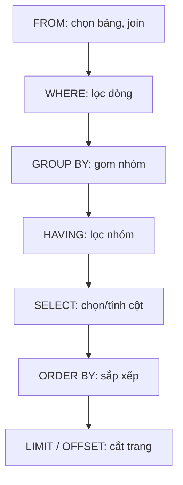

# SQL nền tảng (PostgreSQL)

!!! info "Bạn đang ở đây"
    cần trước: nền tảng p1 (đã chạy được chương trình c# đầu tiên và hiểu kiểu dữ liệu cơ bản).
    mở khoá sau bài này: ef core, thiết kế schema, transaction và index.
    ⏱️ fast path ~30 phút · deep dive thêm ~40 phút (tuỳ chọn).

> **Mục tiêu (đo được):** Sau bài này bạn **áp dụng** được `SELECT/WHERE/ORDER BY/LIMIT`, **viết** đúng `INSERT/UPDATE/DELETE`, **chọn** kiểu dữ liệu PostgreSQL phù hợp, và **giải thích** thứ tự thực thi logic của một câu truy vấn cùng cách `NULL` được xử lý.

---

## 0. Kiểm tra trước (30 giây) — bạn đoán kết quả nào?

Cho bảng `users(id, name, age)` với 3 dòng: `(1,'An',30)`, `(2,'Bình',NULL)`, `(3,'Cường',25)`.
Câu này trả về bao nhiêu dòng? **Đoán trước** khi mở đáp án.

```sql title="SQL"
SELECT name FROM users WHERE age <> 30;
```

??? note "Đáp án — bấm để mở SAU khi đã đoán"
    Trả về **1 dòng**: `Cường`.
    Nhiều người đoán 2 dòng (Bình và Cường). Nhưng `NULL <> 30` không cho `TRUE` mà cho `UNKNOWN`, nên dòng của Bình **bị loại**. `WHERE` chỉ giữ dòng mà điều kiện là `TRUE`. Đây là bẫy `NULL` kinh điển — xem mục 1.

---

## 1. Ý niệm cốt lõi

SQL là ngôn ngữ **khai báo**: bạn mô tả *muốn dữ liệu gì*, không mô tả *cách lấy*. Bộ tối ưu (planner) của PostgreSQL tự quyết cách thực thi.

Một câu `SELECT` gồm các mệnh đề. Điều gây bối rối nhất: **thứ tự bạn viết khác thứ tự máy thực thi**. Dưới đây là thứ tự thực thi **logic**:



Hệ quả thực tế: alias đặt trong `SELECT` **chưa tồn tại** ở `WHERE` (vì `WHERE` chạy trước `SELECT`), nhưng dùng được ở `ORDER BY` (chạy sau `SELECT`).

Bảng mệnh đề cốt lõi:

| Mệnh đề | Vai trò | Chạy ở bước |
| --- | --- | --- |
| `FROM` | Nguồn dữ liệu, join | 1 |
| `WHERE` | Lọc từng **dòng** (trước gom nhóm) | 2 |
| `GROUP BY` | Gom nhóm để tính tổng hợp | 3 |
| `HAVING` | Lọc **nhóm** (sau gom nhóm) | 4 |
| `SELECT` | Chọn/biến đổi cột, tạo alias | 5 |
| `ORDER BY` | Sắp xếp kết quả | 6 |
| `LIMIT`/`OFFSET` | Phân trang | 7 |

Kiểu dữ liệu PostgreSQL thường dùng:

| Kiểu | Dùng cho | Ghi chú |
| --- | --- | --- |
| `text` | Chuỗi độ dài bất kỳ | Ưu tiên hơn `varchar(n)` trừ khi cần giới hạn |
| `integer` | Số nguyên 32-bit | Dùng `bigint` khi cần lớn hơn |
| `numeric(p,s)` | Số thập phân chính xác (tiền tệ) | KHÔNG dùng `float` cho tiền |
| `boolean` | true/false | |
| `timestamptz` | Thời điểm có múi giờ | Ưu tiên hơn `timestamp` |
| `uuid` | Khoá đại diện phân tán | |

!!! danger "Đính chính hiểu lầm phổ biến"
    `NULL = NULL` **không** trả `TRUE` mà trả `NULL` (UNKNOWN). Không bao giờ so sánh `NULL` bằng `=` hoặc `<>`. Phải dùng `IS NULL` / `IS NOT NULL`.
    Ngoài ra, đừng dùng `serial` cho khoá chính nữa: **khuyến nghị `GENERATED ALWAYS AS IDENTITY`** vì nó theo chuẩn SQL, chống ghi đè cột id vô ý và quản lý quyền/sequence gọn hơn.

---

## 2. Ví dụ mẫu (chạy được)

Chạy các lệnh sau trong `psql` trên PostgreSQL {{ postgres.current }}.

```sql title="SQL"
-- Tạo bảng: dùng GENERATED IDENTITY thay cho serial
CREATE TABLE products (
    id          integer GENERATED ALWAYS AS IDENTITY PRIMARY KEY,
    name        text NOT NULL,
    price       numeric(10,2) NOT NULL,
    stock       integer,                       -- cho phép NULL để minh hoạ IS NULL
    created_at  timestamptz NOT NULL DEFAULT now()
);

-- INSERT: không truyền id, để IDENTITY tự sinh
INSERT INTO products (name, price, stock) VALUES
    ('Bàn phím', 450000, 12),
    ('Chuột',    150000, 0),
    ('Màn hình', 3200000, NULL);

-- SELECT + WHERE + ORDER BY + LIMIT
SELECT name, price
FROM products
WHERE price >= 200000
ORDER BY price DESC
LIMIT 2;
```

Output kỳ vọng:

```
   name    |  price
-----------+---------
 Màn hình  | 3200000.00
 Bàn phím  | 450000.00
(2 rows)
```

```sql title="SQL"
-- UPDATE: bù hàng cho dòng stock đang NULL
UPDATE products SET stock = 5 WHERE stock IS NULL;

-- DELETE: xoá hàng hết kho
DELETE FROM products WHERE stock = 0;

-- Xem lại
SELECT name, stock FROM products ORDER BY name;
```

Output kỳ vọng:

```
   name    | stock
-----------+-------
 Bàn phím  |    12
 Màn hình  |     5
(2 rows)
```

Lưu ý: dòng `Chuột` (stock = 0) đã bị `DELETE`; dòng `Màn hình` có `stock IS NULL` được `UPDATE` thành 5 — chú ý ta dùng `IS NULL` chứ không phải `= NULL`.

---

## 3. Bài tập có giàn giáo

Cho bảng `products` ở trên. Viết một câu truy vấn: lấy **tên** và **giá** của các sản phẩm có `price > 100000`, **sắp xếp theo giá tăng dần**, bỏ qua sản phẩm đầu tiên và lấy tối đa 5 dòng tiếp theo.

Giàn giáo — điền vào chỗ trống:

```sql title="SQL"
SELECT ____, ____
FROM products
WHERE ____
ORDER BY ____ ____
LIMIT ____ OFFSET ____;
```

??? note "Lời giải — bấm để mở"
    ```sql title="SQL"
    SELECT name, price
    FROM products
    WHERE price > 100000
    ORDER BY price ASC
    LIMIT 5 OFFSET 1;
    ```
    **Vì sao:** `OFFSET 1` bỏ qua dòng đầu tiên *sau khi đã sắp xếp* (nhớ `ORDER BY` chạy trước `LIMIT/OFFSET` theo sơ đồ mục 1). `LIMIT 5` giới hạn số dòng trả về. Luôn kèm `ORDER BY` khi phân trang — không có `ORDER BY` thì thứ tự dòng **không xác định** và phân trang sẽ nhảy loạn.

---

## 4. Cạm bẫy & hiệu năng

- **`WHERE` vs `HAVING`:** lọc từng dòng thì dùng `WHERE` (rẻ, chạy sớm); chỉ dùng `HAVING` khi cần lọc trên kết quả tổng hợp (`COUNT`, `SUM`...). Đặt điều kiện vào `HAVING` khi lẽ ra thuộc `WHERE` sẽ làm quét thừa dữ liệu.
- **`OFFSET` lớn chậm:** `OFFSET 100000` vẫn phải quét và bỏ qua 100000 dòng. Với dữ liệu lớn, cân nhắc phân trang theo keyset (`WHERE id > :last_id`).
- **`SELECT *`:** tránh trong code sản phẩm — kéo cột thừa, dễ vỡ khi schema đổi. Liệt kê cột cụ thể.
- **`numeric` cho tiền, không dùng `float`:** `float` làm tròn nhị phân gây sai lệch tiền tệ.

---

## Tự kiểm tra

1. Trong câu `SELECT price * 2 AS gia_doi FROM products WHERE gia_doi > 100` — câu này lỗi. Vì sao?

    ??? note "Đáp án"
        Alias `gia_doi` tạo ở bước `SELECT`, nhưng `WHERE` chạy **trước** `SELECT` nên alias chưa tồn tại. Phải viết lại điều kiện: `WHERE price * 2 > 100`.

2. `SELECT count(*) FROM users WHERE age <> 30;` với dữ liệu mục 0 trả về mấy? (An=30, Bình=NULL, Cường=25)

    ??? note "Đáp án"
        **1**. Chỉ Cường thoả. Dòng Bình có `age = NULL` nên `NULL <> 30` là UNKNOWN, bị loại.

3. Nên dùng gì thay cho `serial` khi tạo cột khoá chính tự tăng, và tại sao?

    ??? note "Đáp án"
        Dùng `GENERATED ALWAYS AS IDENTITY`. Nó theo chuẩn SQL, ngăn ghi đè id vô ý (phải dùng `OVERRIDING SYSTEM VALUE` mới chèn tay được) và không để lại sequence "mồ côi" khó quản lý.

4. Kiểu nào phù hợp lưu số tiền `450000.00` để tránh sai số?

    ??? note "Đáp án"
        `numeric(p,s)` (ví dụ `numeric(10,2)`). Không dùng `float`/`double precision` vì làm tròn nhị phân.

5. Thứ tự thực thi logic đúng của `FROM, WHERE, GROUP BY, HAVING, SELECT, ORDER BY, LIMIT` là gì?

    ??? note "Đáp án"
        `FROM → WHERE → GROUP BY → HAVING → SELECT → ORDER BY → LIMIT/OFFSET`.

---

??? abstract "DEEP DIVE — nâng cao (không nằm trên fast path)"
    **Ba trạng thái logic.** SQL dùng logic ba-trị: `TRUE`, `FALSE`, `UNKNOWN`. `WHERE`, `HAVING`, `ON` chỉ giữ dòng khi điều kiện là `TRUE`. Đây là lý do `NOT (age <> 30)` không tương đương với `age = 30` khi có `NULL`.

    **`IS DISTINCT FROM`.** Muốn so sánh coi `NULL` như một giá trị bình thường (hai `NULL` là "bằng nhau"), dùng `a IS NOT DISTINCT FROM b` thay cho `a = b`. Rất hữu ích khi so sánh cột nullable.

    ```sql title="SQL"
    -- Đếm dòng mà status khác 'active', kể cả status NULL
    SELECT count(*) FROM orders
    WHERE status IS DISTINCT FROM 'active';
    ```

    **`COALESCE` để thay NULL.** `COALESCE(stock, 0)` trả về `0` khi `stock` là `NULL`. Thường dùng trong `SELECT` và `ORDER BY` để `NULL` không "nhảy" lên đầu/cuối bất ngờ (mặc định PostgreSQL xếp `NULL` cuối cùng khi `ASC`, có thể đổi bằng `ORDER BY col ASC NULLS FIRST`).

    **`IDENTITY` gap là bình thường.** Sequence không cuộn lại khi transaction rollback, nên id có thể có khoảng trống. Đừng coi id là "số thứ tự liên tục" — nó chỉ đảm bảo duy nhất và tăng dần.

Tiếp theo -> ef core cơ bản
