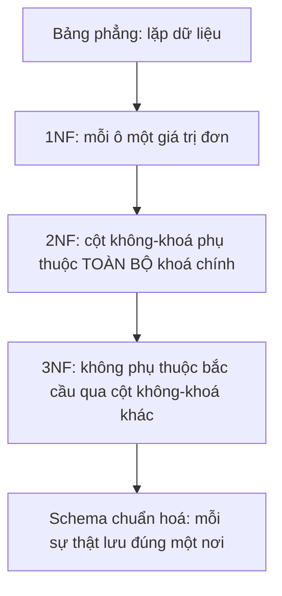
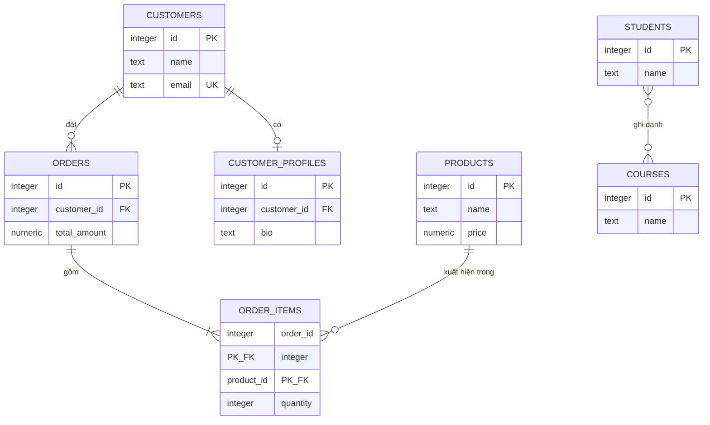

# Thiết kế CSDL & Chuẩn hoá

!!! info "Bạn đang ở đây"
    cần trước: ràng buộc dữ liệu — biết `PRIMARY KEY`, `FOREIGN KEY`, `UNIQUE`, `CHECK`, `NOT NULL`, và các hành vi `ON DELETE`.
    mở khoá sau bài này: migration ef core nhiều bảng có quan hệ, transaction/index (vì thiết kế schema đúng là điều kiện tiên quyết để migration EF Core sinh ra đúng và để index phát huy tác dụng), và các chương thiết kế API/domain model ở P3 dựa trên đúng các bảng đã chuẩn hoá ở đây.
    ⏱️ fast path ~60 phút · deep dive thêm ~30 phút (tuỳ chọn).

> **Mục tiêu (đo được):** Sau bài này bạn **định nghĩa** được 6 loại khoá (primary/foreign/composite/candidate/surrogate/natural) bằng lời của riêng mình; **áp dụng** được ba chuẩn hoá 1NF/2NF/3NF để tách một bảng "phẳng" chứa dữ liệu trùng lặp thành nhiều bảng quan hệ đúng chuẩn; **giải thích** được vì sao và khi nào nên cố ý denormalize (đọc nhiều, có số liệu đo cụ thể); **thiết kế** đúng bảng trung gian cho quan hệ N-N; và **vẽ** được sơ đồ `erDiagram` (Mermaid) mô tả một schema hoàn chỉnh.

---

## 0. Kiểm tra trước (30 giây) — bạn đoán kết quả nào?

Cho bảng "phẳng" sau đây, lưu đơn hàng kèm luôn thông tin khách hàng trong từng dòng:

```sql title="SQL"
CREATE TABLE orders_flat (
    order_id      integer GENERATED ALWAYS AS IDENTITY PRIMARY KEY,
    customer_name text NOT NULL,
    customer_email text NOT NULL,
    product_name  text NOT NULL,
    product_price numeric(10,2) NOT NULL
);

INSERT INTO orders_flat (customer_name, customer_email, product_name, product_price)
VALUES ('An', 'an@example.com', 'Bàn phím', 450000);

-- Khách "An" đặt thêm 1 đơn nữa, nhưng người nhập liệu gõ nhầm email
INSERT INTO orders_flat (customer_name, customer_email, product_name, product_price)
VALUES ('An', 'an@exampl.com', 'Chuột', 250000);
```

Câu hỏi: PostgreSQL có **ngăn được** lỗi gõ nhầm email ở dòng 2 không? Và hệ quả nếu sau này cần đổi email của "An" thì sao?

??? note "Đáp án — bấm để mở SAU khi đã đoán"
    **Không có gì ngăn được cả** — cả hai `INSERT` đều thành công dù `customer_email` của cùng một khách hàng "An" bị lưu **hai giá trị khác nhau** ở hai dòng. Đây chính là **anomaly cập nhật** (update anomaly): thông tin khách hàng bị lặp lại (denormalized) trong mỗi dòng đơn hàng, nên:

    - Không có ràng buộc nào ở tầng CSDL đảm bảo "An" luôn có cùng một email trong mọi dòng.
    - Muốn sửa email đúng của "An", phải `UPDATE` **tất cả** các dòng `orders_flat` có `customer_name = 'An'` — dễ sót, dễ sai.
    - Nếu "An" chưa từng đặt đơn nào, không có cách nào lưu thông tin khách hàng "An" vào hệ thống (insertion anomaly) vì bảng này chỉ tồn tại gắn với đơn hàng.

    Đây chính là vấn đề mà **chuẩn hoá (normalization)** giải quyết — nội dung chính của bài này. Xem mục 2.

---

## 1. Các loại khoá (keys)

### 1.1 PRIMARY KEY — khoá chính (nhắc lại nhanh)

**Định nghĩa:** khoá chính là cột (hoặc nhóm cột) được chọn làm định danh duy nhất chính thức của một bảng — mỗi bảng có **đúng một** khoá chính, giá trị không trùng và không `NULL`. Chi tiết cú pháp và lỗi đã học ở chương constraints; bài này tập trung vào **cách chọn** khoá chính đúng khi thiết kế.

### 1.2 CANDIDATE KEY — khoá ứng viên

**Định nghĩa:** khoá ứng viên là **bất kỳ** cột (hoặc tổ hợp cột) nào **có thể** dùng làm khoá chính — nghĩa là tự nó đã đủ duy nhất và không `NULL` cho mọi dòng — dù cuối cùng ta chỉ chọn một trong số chúng làm `PRIMARY KEY` thật sự.

```sql title="SQL"
CREATE TABLE employees (
    id           integer GENERATED ALWAYS AS IDENTITY PRIMARY KEY,
    national_id  text NOT NULL UNIQUE,   -- CMND/CCCD — cũng là ứng viên khoá chính
    email        text NOT NULL UNIQUE,   -- cũng là ứng viên khoá chính
    full_name    text NOT NULL
);
```

Ở bảng trên có **ba** khoá ứng viên: `id`, `national_id`, `email` — cả ba đều duy nhất và bắt buộc có giá trị. Ta chỉ chọn **một** (`id`) làm `PRIMARY KEY`; hai cái còn lại vẫn là candidate key hợp lệ, được ép bằng `UNIQUE NOT NULL` thay vì `PRIMARY KEY`.

Nếu một "khoá ứng viên" không thực sự duy nhất, PostgreSQL sẽ báo lỗi ngay khi cố ép bằng `UNIQUE`:

```sql title="SQL"
INSERT INTO employees (national_id, email, full_name) VALUES ('001099012345', 'an@example.com', 'An');
INSERT INTO employees (national_id, email, full_name) VALUES ('001099012345', 'binh@example.com', 'Bình');
```

```text title="Kết quả lỗi"
ERROR:  duplicate key value violates unique constraint "employees_national_id_key"
DETAIL:  Key (national_id)=(001099012345) already exists.
```

Lỗi này chứng minh `national_id` thật sự là khoá ứng viên hợp lệ — nếu hai nhân viên khác nhau lại có cùng `national_id` thật (dữ liệu sai), PostgreSQL sẽ chặn đúng như thiết kế.

### 1.3 NATURAL KEY — khoá tự nhiên

**Định nghĩa:** khoá tự nhiên là một khoá ứng viên **có ý nghĩa nghiệp vụ thật** ngoài đời (đã tồn tại độc lập với hệ thống), ví dụ số CMND/CCCD, mã số thuế, biển số xe, ISBN của sách.

```sql title="SQL"
CREATE TABLE books (
    isbn  text PRIMARY KEY,   -- ISBN là khoá tự nhiên: mã có thật, do NXB cấp
    title text NOT NULL
);

INSERT INTO books (isbn, title) VALUES ('978-604-1-23456-7', 'Học PostgreSQL căn bản');
```

### 1.4 SURROGATE KEY — khoá đại diện (nhân tạo)

**Định nghĩa:** khoá đại diện là một cột **do hệ thống tự sinh** (thường là số tự tăng hoặc UUID), **không mang ý nghĩa nghiệp vụ gì**, chỉ tồn tại để làm định danh duy nhất ổn định cho mỗi dòng.

```sql title="SQL"
CREATE TABLE customers (
    id   integer GENERATED ALWAYS AS IDENTITY PRIMARY KEY,  -- surrogate key: chỉ là số thứ tự nội bộ
    name text NOT NULL
);
```

`id` ở đây không đại diện cho bất kỳ thứ gì ngoài đời thực — nó chỉ là con số PostgreSQL tự cấp để phân biệt các dòng.

### 1.5 Điều gì xảy ra khi chọn sai loại khoá chính (natural key có thể đổi)

Đây là lỗi thiết kế kinh điển: dùng khoá tự nhiên **có thể thay đổi** làm `PRIMARY KEY`, rồi khoá đó được bảng khác tham chiếu bằng `FOREIGN KEY`.

```sql title="SQL"
CREATE TABLE customers_bad (
    email text PRIMARY KEY,   -- dùng email làm khoá chính — RỦI RO
    name  text NOT NULL
);

CREATE TABLE orders_bad (
    id              integer GENERATED ALWAYS AS IDENTITY PRIMARY KEY,
    customer_email  text NOT NULL REFERENCES customers_bad(email),
    amount          numeric(10,2) NOT NULL
);

INSERT INTO customers_bad (email, name) VALUES ('an@example.com', 'An');
INSERT INTO orders_bad (customer_email, amount) VALUES ('an@example.com', 500000);

-- Khách An đổi email
UPDATE customers_bad SET email = 'an.new@example.com' WHERE email = 'an@example.com';
```

```text title="Kết quả lỗi"
ERROR:  update or delete on table "customers_bad" violates foreign key constraint "orders_bad_customer_email_fkey" on table "orders_bad"
DETAIL:  Key (email)=(an@example.com) is still referenced from table "orders_bad".
```

PostgreSQL từ chối đổi email vì `orders_bad` vẫn đang tham chiếu giá trị cũ — muốn cho phép, phải khai `ON UPDATE CASCADE` (lan truyền cập nhật, tương tự `ON DELETE CASCADE`) trên mọi bảng con, rất dễ sót. Đây chính là lý do khuyến nghị chuẩn: **dùng surrogate key (`id` tự tăng) làm khoá chính**, còn khoá tự nhiên (nếu cần) chỉ nên ép bằng `UNIQUE` chứ không làm đích cho khoá ngoại của bảng khác.

!!! danger "Đính chính hiểu lầm phổ biến: surrogate key không thay thế được nhu cầu UNIQUE"
    Chọn `id` tự tăng làm khoá chính **không** loại bỏ nhu cầu ràng buộc `UNIQUE` trên khoá tự nhiên (như `email`, `national_id`). Nếu bỏ qua `UNIQUE`, hệ thống vẫn có thể chèn hai khách hàng khác `id` nhưng cùng `email` — vẫn là dữ liệu sai, chỉ là PostgreSQL không còn khoá chính để phát hiện lỗi này giúp bạn nữa.

### 1.6 FOREIGN KEY và COMPOSITE KEY (nhắc lại + mở rộng)

Khoá ngoại (`FOREIGN KEY`) và khoá nhiều cột (`composite key`, ví dụ `PRIMARY KEY (a, b)`) đã được định nghĩa và minh hoạ đầy đủ ở chương constraints (mục 1.4 và mục 2). Trong chương này, hai khái niệm đó là **công cụ** để hiện thực hoá các quan hệ 1-1/1-N/N-N ở mục 4 — đặc biệt composite key sẽ quay lại làm khoá chính của bảng trung gian N-N.

### 1.7 Bảng tổng hợp các loại khoá

Sáu khái niệm khoá đã được dạy riêng lẻ ở trên; giờ mới tổng hợp so sánh:

| Loại khoá | Định nghĩa ngắn | Ví dụ |
| --- | --- | --- |
| Primary key | Khoá chính chính thức của bảng, duy nhất mỗi bảng | `id PRIMARY KEY` |
| Candidate key | Bất kỳ cột nào đủ điều kiện làm khoá chính | `email`, `national_id`, `id` |
| Natural key | Candidate key có ý nghĩa nghiệp vụ thật ngoài đời | `isbn`, `national_id` |
| Surrogate key | Candidate key do hệ thống tự sinh, vô nghĩa nghiệp vụ | `id GENERATED ALWAYS AS IDENTITY` |
| Foreign key | Cột tham chiếu khoá chính/unique của bảng khác | `customer_id REFERENCES customers(id)` |
| Composite key | Khoá (chính hoặc unique) gồm từ hai cột trở lên | `PRIMARY KEY (student_id, course_id)` |

---

## 2. Chuẩn hoá (Normalization): 1NF, 2NF, 3NF

### 2.1 1NF (Dạng chuẩn 1) — Định nghĩa

**1NF (First Normal Form)** yêu cầu mỗi cột trong mỗi dòng chỉ chứa **một giá trị đơn** (atomic) — không được nhét nhiều giá trị vào chung một ô (ví dụ danh sách phân cách bằng dấu phẩy), và không có cột lặp kiểu `phone1`, `phone2`, `phone3`.

**TRƯỚC (vi phạm 1NF)** — nhét nhiều số điện thoại vào một cột dạng text:

```sql title="SQL"
CREATE TABLE customers_v0 (
    id     integer GENERATED ALWAYS AS IDENTITY PRIMARY KEY,
    name   text NOT NULL,
    phones text   -- vi phạm 1NF: "0901111111,0902222222"
);

INSERT INTO customers_v0 (name, phones) VALUES ('An', '0901111111,0902222222');
```

Vấn đề: không thể `WHERE phones = '0902222222'` để tìm đúng khách hàng có số này (phải `LIKE '%0902222222%'`, chậm và dễ khớp nhầm số con); không thể ràng buộc mỗi số điện thoại là duy nhất; không biết trước cần bao nhiêu cột nếu dùng cách `phone1, phone2, phone3`.

**SAU (đạt 1NF)** — tách số điện thoại ra bảng riêng, mỗi dòng một giá trị đơn:

```sql title="SQL"
CREATE TABLE customers_v1 (
    id   integer GENERATED ALWAYS AS IDENTITY PRIMARY KEY,
    name text NOT NULL
);

CREATE TABLE customer_phones (
    id          integer GENERATED ALWAYS AS IDENTITY PRIMARY KEY,
    customer_id integer NOT NULL REFERENCES customers_v1(id) ON DELETE CASCADE,
    phone       text NOT NULL
);

INSERT INTO customers_v1 (name) VALUES ('An');                                  -- id = 1
INSERT INTO customer_phones (customer_id, phone) VALUES (1, '0901111111'), (1, '0902222222');

SELECT c.name, p.phone
FROM customers_v1 c
JOIN customer_phones p ON p.customer_id = c.id;
```

Output kỳ vọng:

```text title="Kết quả"
 name |   phone
------+------------
 An   | 0901111111
 An   | 0902222222
(2 rows)
```

Giờ mỗi ô chỉ chứa một giá trị đơn — có thể `WHERE phone = '0902222222'`, có thể thêm `UNIQUE (customer_id, phone)`, và số lượng điện thoại không bị giới hạn cứng.

### 2.2 2NF (Dạng chuẩn 2) — Định nghĩa

**2NF** yêu cầu: bảng đã đạt 1NF, **và** mọi cột không phải khoá phải phụ thuộc vào **toàn bộ** khoá chính — không được phụ thuộc chỉ vào **một phần** của khoá chính (khi khoá chính có nhiều cột). Vi phạm 2NF chỉ xảy ra khi khoá chính là composite key; nếu khoá chính chỉ có một cột, bảng đã 1NF thì tự động đạt 2NF.

**TRƯỚC (vi phạm 2NF)** — bảng chi tiết đơn hàng với khoá chính composite `(order_id, product_id)`, nhưng `product_name` chỉ phụ thuộc vào `product_id` (một phần khoá), không phụ thuộc vào cả `order_id`:

```sql title="SQL"
CREATE TABLE order_items_v0 (
    order_id     integer NOT NULL,
    product_id   integer NOT NULL,
    product_name text NOT NULL,     -- vi phạm 2NF: chỉ phụ thuộc product_id
    quantity     integer NOT NULL,
    PRIMARY KEY (order_id, product_id)
);

INSERT INTO order_items_v0 VALUES (1, 100, 'Bàn phím', 2);
INSERT INTO order_items_v0 VALUES (2, 100, 'Bàn phím cơ', 1);  -- CÙNG product_id nhưng tên khác!
```

Vấn đề: `product_id = 100` bị lưu hai tên khác nhau (`'Bàn phím'` và `'Bàn phím cơ'`) ở hai dòng, vì `product_name` bị lặp lại và có thể lệch nhau — anomaly cập nhật y hệt mục 0. Đổi tên sản phẩm phải sửa **mọi** dòng `order_items_v0` có `product_id` đó.

**SAU (đạt 2NF)** — tách `product_name` ra bảng `products` riêng, chỉ giữ `product_id` (khoá ngoại) trong bảng chi tiết:

```sql title="SQL"
CREATE TABLE products_v1 (
    id   integer GENERATED ALWAYS AS IDENTITY PRIMARY KEY,
    name text NOT NULL
);

CREATE TABLE order_items_v1 (
    order_id   integer NOT NULL,
    product_id integer NOT NULL REFERENCES products_v1(id),
    quantity   integer NOT NULL,
    PRIMARY KEY (order_id, product_id)
);

INSERT INTO products_v1 (name) VALUES ('Bàn phím');   -- id = 1
INSERT INTO order_items_v1 VALUES (1, 1, 2);
INSERT INTO order_items_v1 VALUES (2, 1, 1);

SELECT oi.order_id, p.name, oi.quantity
FROM order_items_v1 oi
JOIN products_v1 p ON p.id = oi.product_id;
```

Output kỳ vọng:

```text title="Kết quả"
 order_id |   name   | quantity
----------+----------+----------
        1 | Bàn phím |        2
        2 | Bàn phím |        1
(2 rows)
```

Giờ tên sản phẩm chỉ tồn tại **một nơi duy nhất** (`products_v1.name`) — đổi tên chỉ cần `UPDATE` một dòng.

### 2.3 3NF (Dạng chuẩn 3) — Định nghĩa

**3NF** yêu cầu: bảng đã đạt 2NF, **và** không có cột không-khoá nào phụ thuộc vào một cột không-khoá **khác** (gọi là "phụ thuộc bắc cầu" — transitive dependency) — mọi cột không-khoá phải phụ thuộc **trực tiếp** vào khoá chính, không phụ thuộc gián tiếp qua một cột không-khoá trung gian.

**TRƯỚC (vi phạm 3NF)** — bảng nhân viên lưu luôn tên phòng ban, nhưng `department_name` phụ thuộc vào `department_id` (một cột không-khoá khác), chứ không phụ thuộc trực tiếp vào `employee_id`:

```sql title="SQL"
CREATE TABLE employees_v0 (
    id               integer GENERATED ALWAYS AS IDENTITY PRIMARY KEY,
    name             text NOT NULL,
    department_id    integer NOT NULL,
    department_name  text NOT NULL   -- vi phạm 3NF: phụ thuộc bắc cầu qua department_id
);

INSERT INTO employees_v0 (name, department_id, department_name) VALUES ('An', 1, 'Kỹ thuật');
INSERT INTO employees_v0 (name, department_id, department_name) VALUES ('Bình', 1, 'Ky thuat'); -- lệch chính tả!
```

Vấn đề: hai nhân viên cùng `department_id = 1` nhưng `department_name` bị gõ lệch nhau (`'Kỹ thuật'` vs `'Ky thuat'`) — không có gì ở tầng CSDL đảm bảo mọi dòng cùng `department_id` có cùng `department_name`, vì tên phòng ban bị lặp lại theo từng nhân viên thay vì lưu một lần.

**SAU (đạt 3NF)** — tách `department_name` ra bảng `departments`, `employees` chỉ giữ khoá ngoại:

```sql title="SQL"
CREATE TABLE departments_v1 (
    id   integer GENERATED ALWAYS AS IDENTITY PRIMARY KEY,
    name text NOT NULL
);

CREATE TABLE employees_v1 (
    id            integer GENERATED ALWAYS AS IDENTITY PRIMARY KEY,
    name          text NOT NULL,
    department_id integer NOT NULL REFERENCES departments_v1(id)
);

INSERT INTO departments_v1 (name) VALUES ('Kỹ thuật');   -- id = 1
INSERT INTO employees_v1 (name, department_id) VALUES ('An', 1), ('Bình', 1);

SELECT e.name, d.name AS department
FROM employees_v1 e
JOIN departments_v1 d ON d.id = e.department_id;
```

Output kỳ vọng:

```text title="Kết quả"
 name | department
------+------------
 An   | Kỹ thuật
 Bình | Kỹ thuật
(2 rows)
```

Tên phòng ban giờ chỉ tồn tại một nơi (`departments_v1.name`) — không thể lệch chính tả giữa các nhân viên cùng phòng ban nữa, và sửa tên phòng ban chỉ cần một `UPDATE`.

### 2.4 Điều gì xảy ra khi bỏ qua chuẩn hoá — tổng hợp anomaly

Ba ví dụ TRƯỚC ở trên (1NF, 2NF, 3NF) đều là các dạng cụ thể của một vấn đề chung gọi là **anomaly** (bất thường dữ liệu):

- **Update anomaly**: sửa một sự thật (email, tên sản phẩm, tên phòng ban) phải sửa nhiều dòng, dễ sửa sót gây dữ liệu mâu thuẫn (mục 0, 2.2, 2.3).
- **Insertion anomaly**: không thể thêm một sự thật mới (ví dụ một phòng ban chưa có nhân viên nào) nếu sự thật đó bị gắn chặt vào một dòng của bảng khác.
- **Deletion anomaly**: xoá một dòng vô tình xoá mất một sự thật không liên quan (ví dụ xoá đơn hàng cuối cùng của một sản phẩm làm mất luôn thông tin sản phẩm đó, nếu tên sản phẩm chỉ tồn tại trong bảng đơn hàng).



---

## 3. Khi nào NÊN denormalize (phi chuẩn hoá có chủ đích)

### 3.1 Định nghĩa

**Denormalize** là quyết định **cố ý** lưu dữ liệu trùng lặp (vi phạm 2NF/3NF một cách có kiểm soát) nhằm đổi lấy tốc độ đọc nhanh hơn, chấp nhận đánh đổi chi phí đồng bộ khi ghi/cập nhật.

### 3.2 Ví dụ cú pháp tối thiểu — cột tổng hợp (denormalized) có chủ đích

```sql title="SQL"
CREATE TABLE orders_norm (
    id          integer GENERATED ALWAYS AS IDENTITY PRIMARY KEY,
    customer_id integer NOT NULL,
    -- Đáng lẽ tổng tiền đơn hàng phải SUM() từ order_items mỗi lần đọc,
    -- nhưng ta lưu sẵn cột tổng hợp để tránh phải JOIN + SUM mỗi lần hiển thị danh sách đơn hàng
    total_amount numeric(12,2) NOT NULL DEFAULT 0
);
```

`total_amount` là dữ liệu **suy ra được** từ bảng `order_items` (tổng `quantity * price` của các dòng thuộc đơn hàng đó) — về lý thuyết chuẩn hoá thuần tuý, cột này "thừa" vì có thể tính lại bất cứ lúc nào. Nhưng nếu trang danh sách đơn hàng được xem hàng chục nghìn lần/ngày trong khi đơn hàng ít khi bị sửa sau khi tạo, lưu sẵn `total_amount` giúp tránh `JOIN + SUM` lặp lại tốn kém.

### 3.3 Điều gì xảy ra khi denormalize mà KHÔNG kiểm soát đồng bộ

```sql title="SQL"
CREATE TABLE order_items_norm (
    id         integer GENERATED ALWAYS AS IDENTITY PRIMARY KEY,
    order_id   integer NOT NULL REFERENCES orders_norm(id),
    quantity   integer NOT NULL,
    unit_price numeric(10,2) NOT NULL
);

INSERT INTO orders_norm (customer_id, total_amount) VALUES (1, 450000);
INSERT INTO order_items_norm (order_id, quantity, unit_price) VALUES (1, 1, 450000);

-- Sau đó thêm một dòng hàng nữa vào đơn, NHƯNG QUÊN cập nhật total_amount
INSERT INTO order_items_norm (order_id, quantity, unit_price) VALUES (1, 1, 250000);

SELECT o.id, o.total_amount AS luu_san, sum(oi.quantity * oi.unit_price) AS tinh_lai
FROM orders_norm o
JOIN order_items_norm oi ON oi.order_id = o.id
GROUP BY o.id, o.total_amount;
```

```text title="Kết quả (dữ liệu đã lệch!)"
 id | luu_san | tinh_lai
----+---------+----------
  1 |  450000 |   700000
(1 row)
```

`total_amount` lưu sẵn (`450000`) không còn khớp với tổng thực tế tính từ `order_items_norm` (`700000`) — đây chính là cái giá của denormalize: **PostgreSQL không có cơ chế nào tự giữ hai giá trị này đồng bộ**, trách nhiệm đó chuyển hoàn toàn sang tầng ứng dụng (hoặc trigger) — nếu code quên cập nhật, dữ liệu sai lặng lẽ tồn tại mà không có lỗi nào được báo.

!!! warning "Denormalize là đánh đổi có điều kiện, không phải mặc định"
    Chỉ nên denormalize khi có **số liệu đo cụ thể** cho thấy tỷ lệ đọc/ghi đủ lệch để việc này đáng giá, ví dụ:

    - Tỷ lệ đọc:ghi của `orders_norm` là khoảng 500:1 (trang danh sách đơn hàng được load rất nhiều lần cho mỗi lần đơn hàng thay đổi hàng hoá).
    - Đo được `JOIN + SUM()` trên 1 triệu dòng `order_items_norm` mất trung bình 40ms mỗi lần gọi API danh sách đơn hàng, trong khi đọc thẳng cột `total_amount` mất dưới 1ms — chênh lệch đáng kể khi endpoint này được gọi hàng nghìn lần/phút.
    - Có kế hoạch cụ thể giữ đồng bộ: cập nhật `total_amount` trong cùng transaction mỗi khi `order_items_norm` thay đổi (`INSERT`/`UPDATE`/`DELETE`), hoặc dùng trigger `AFTER INSERT OR UPDATE OR DELETE` tính lại tự động.

    Nếu không đo được, hoặc không có kế hoạch giữ đồng bộ, hãy giữ nguyên dạng chuẩn hoá (3NF) và tối ưu bằng **index** (xem chương transaction/index kế tiếp) trước khi nghĩ tới denormalize.

---

## 4. Quan hệ 1-1, 1-N, N-N

### 4.1 Quan hệ 1-N (một-nhiều) — Định nghĩa

**Quan hệ 1-N** là mối liên kết trong đó **một** dòng ở bảng A có thể được tham chiếu bởi **nhiều** dòng ở bảng B, nhưng mỗi dòng ở bảng B chỉ liên kết với **đúng một** dòng ở bảng A — hiện thực hoá bằng cách đặt khoá ngoại ở bảng "nhiều" (B), trỏ về khoá chính của bảng "một" (A).

```sql title="SQL"
CREATE TABLE authors_rel (
    id   integer GENERATED ALWAYS AS IDENTITY PRIMARY KEY,
    name text NOT NULL
);

CREATE TABLE books_rel (
    id        integer GENERATED ALWAYS AS IDENTITY PRIMARY KEY,
    author_id integer NOT NULL REFERENCES authors_rel(id),
    title     text NOT NULL
);

INSERT INTO authors_rel (name) VALUES ('Nguyễn Nhật Ánh');   -- id = 1
INSERT INTO books_rel (author_id, title) VALUES (1, 'Cho tôi xin một vé đi tuổi thơ'), (1, 'Mắt biếc');

SELECT a.name, b.title FROM authors_rel a JOIN books_rel b ON b.author_id = a.id;
```

Output kỳ vọng — một tác giả, nhiều sách:

```text title="Kết quả"
        name         |             title
---------------------+--------------------------------
 Nguyễn Nhật Ánh      | Cho tôi xin một vé đi tuổi thơ
 Nguyễn Nhật Ánh      | Mắt biếc
(2 rows)
```

### 4.2 Quan hệ 1-1 (một-một) — Định nghĩa

**Quan hệ 1-1** là mối liên kết trong đó **mỗi** dòng ở bảng A liên kết với **tối đa một** dòng ở bảng B, và ngược lại — hiện thực hoá bằng cách đặt khoá ngoại ở một trong hai bảng, kèm ràng buộc `UNIQUE` trên chính cột khoá ngoại đó (khác quan hệ 1-N ở chỗ **có thêm** `UNIQUE`).

```sql title="SQL"
CREATE TABLE users_rel (
    id       integer GENERATED ALWAYS AS IDENTITY PRIMARY KEY,
    username text NOT NULL
);

CREATE TABLE user_profiles (
    id      integer GENERATED ALWAYS AS IDENTITY PRIMARY KEY,
    user_id integer NOT NULL UNIQUE REFERENCES users_rel(id),  -- UNIQUE là điểm khác biệt với 1-N
    bio     text
);

INSERT INTO users_rel (username) VALUES ('an123');   -- id = 1
INSERT INTO user_profiles (user_id, bio) VALUES (1, 'Yêu thích PostgreSQL.');
```

### 4.3 Điều gì xảy ra khi thiếu UNIQUE trên khoá ngoại 1-1 (vô tình biến thành 1-N)

```sql title="SQL"
-- Cùng schema user_profiles ở trên, thử chèn thêm một hồ sơ thứ hai cho CÙNG user_id = 1
INSERT INTO user_profiles (user_id, bio) VALUES (1, 'Hồ sơ thứ hai — không nên tồn tại!');
```

```text title="Kết quả lỗi"
ERROR:  duplicate key value violates unique constraint "user_profiles_user_id_key"
DETAIL:  Key (user_id)=(1) already exists.
```

Đây chính là hành vi **đúng** nhờ có `UNIQUE`. Nếu quên `UNIQUE` trên `user_id` (chỉ khai `REFERENCES` thuần), câu `INSERT` thứ hai sẽ **thành công** — biến quan hệ tưởng là 1-1 thành 1-N trong thực tế mà không ai biết, dẫn tới bug kiểu "user có 2 hồ sơ, ứng dụng chỉ đọc ngẫu nhiên một cái".

### 4.4 Quan hệ N-N (nhiều-nhiều) — Định nghĩa

**Quan hệ N-N** là mối liên kết trong đó **một** dòng ở bảng A có thể liên kết với **nhiều** dòng ở bảng B, **và** một dòng ở bảng B cũng có thể liên kết với **nhiều** dòng ở bảng A. Vì một cột khoá ngoại chỉ trỏ được tới **một** dòng, N-N **không thể** hiện thực hoá bằng cách thêm khoá ngoại trực tiếp vào A hoặc B — bắt buộc phải có **bảng trung gian** (junction table / bảng nối) chứa hai khoá ngoại, mỗi cái trỏ về một bên.

### 4.5 Ví dụ cú pháp tối thiểu — bảng trung gian cho N-N

Một sinh viên có thể ghi danh nhiều lớp học; một lớp học có nhiều sinh viên ghi danh:

```sql title="SQL"
CREATE TABLE students (
    id   integer GENERATED ALWAYS AS IDENTITY PRIMARY KEY,
    name text NOT NULL
);

CREATE TABLE courses (
    id   integer GENERATED ALWAYS AS IDENTITY PRIMARY KEY,
    name text NOT NULL
);

-- Bảng trung gian: mỗi dòng là MỘT lượt ghi danh, nối student <-> course
CREATE TABLE enrollments_rel (
    student_id integer NOT NULL REFERENCES students(id),
    course_id  integer NOT NULL REFERENCES courses(id),
    PRIMARY KEY (student_id, course_id)   -- composite key: chặn ghi danh trùng
);

INSERT INTO students (name) VALUES ('An'), ('Bình');            -- id 1, 2
INSERT INTO courses (name) VALUES ('CSDL'), ('Lập trình C#');   -- id 1, 2

-- An học cả hai môn; Bình chỉ học CSDL
INSERT INTO enrollments_rel (student_id, course_id) VALUES (1, 1), (1, 2), (2, 1);

SELECT s.name AS sinh_vien, c.name AS mon_hoc
FROM enrollments_rel e
JOIN students s ON s.id = e.student_id
JOIN courses c ON c.id = e.course_id
ORDER BY s.name, c.name;
```

Output kỳ vọng:

```text title="Kết quả"
 sinh_vien |   mon_hoc
-----------+---------------
 An        | CSDL
 An        | Lập trình C#
 Bình      | CSDL
(3 rows)
```

Một sinh viên (An) xuất hiện ở nhiều dòng (ứng với nhiều môn), và một môn (CSDL) cũng xuất hiện ở nhiều dòng (ứng với nhiều sinh viên) — đúng bản chất N-N, nhờ bảng trung gian `enrollments_rel`.

### 4.6 Điều gì xảy ra khi thiếu composite key trên bảng trung gian

```sql title="SQL"
-- Không có PRIMARY KEY (student_id, course_id), chỉ có hai cột thường
CREATE TABLE enrollments_bad (
    student_id integer NOT NULL REFERENCES students(id),
    course_id  integer NOT NULL REFERENCES courses(id)
);

INSERT INTO enrollments_bad (student_id, course_id) VALUES (1, 1);
INSERT INTO enrollments_bad (student_id, course_id) VALUES (1, 1);  -- ghi danh trùng lặp

SELECT count(*) FROM enrollments_bad WHERE student_id = 1 AND course_id = 1;
```

```text title="Kết quả (lỗi logic, không phải lỗi PostgreSQL)"
 count
-------
     2
(1 row)
```

PostgreSQL **không báo lỗi gì** vì không có ràng buộc nào ngăn — nhưng đây là lỗi logic nghiêm trọng: An bị ghi danh môn CSDL **hai lần**. Composite `PRIMARY KEY (student_id, course_id)` (mục 4.5) chính là ràng buộc bắt buộc phải có trên mọi bảng trung gian N-N thuần tuý, để đảm bảo mỗi cặp (sinh viên, môn học) chỉ tồn tại đúng một lần.

### 4.7 Bảng trung gian có thêm cột riêng

Bảng trung gian không bắt buộc chỉ có hai khoá ngoại — nó có thể mang thêm dữ liệu **thuộc về chính mối quan hệ** (không thuộc riêng bảng A hay B), ví dụ ngày ghi danh hoặc điểm số:

```sql title="SQL"
CREATE TABLE enrollments_full (
    student_id  integer NOT NULL REFERENCES students(id),
    course_id   integer NOT NULL REFERENCES courses(id),
    enrolled_on date NOT NULL DEFAULT current_date,
    grade       numeric(4,2),
    PRIMARY KEY (student_id, course_id)
);
```

`enrolled_on` và `grade` không thuộc về `students` (không phải thuộc tính của sinh viên nói chung) cũng không thuộc về `courses` (không phải thuộc tính của môn học nói chung) — chúng chỉ có ý nghĩa gắn với **một lượt ghi danh cụ thể**, nên đúng chỗ của chúng là bảng trung gian.

---

## 5. Sơ đồ ERD hoàn chỉnh cho một schema chuẩn hoá

Gộp toàn bộ khái niệm ở trên (surrogate key, 1-N, 1-1, N-N với bảng trung gian có cột riêng) vào một schema hoàn chỉnh cho hệ thống bán hàng đơn giản:



Đọc sơ đồ này bằng đúng ngôn ngữ đã học trong bài:

- `CUSTOMERS ||--o{ ORDERS`: 1-N — một khách hàng có không hoặc nhiều đơn hàng (`o{` = zero-or-many), mỗi đơn hàng thuộc đúng một khách hàng (`||` = exactly-one).
- `CUSTOMERS ||--o| CUSTOMER_PROFILES`: 1-1 — một khách hàng có tối đa một hồ sơ mở rộng (`o|` = zero-or-one), hiện thực bằng `customer_id` có cả `REFERENCES` lẫn `UNIQUE` như mục 4.2.
- `ORDERS ||--|{ ORDER_ITEMS`: 1-N — một đơn hàng có một-hoặc-nhiều dòng chi tiết (`|{` = one-or-many, vì một đơn hàng phải có ít nhất một sản phẩm).
- `STUDENTS }o--o{ COURSES`: N-N — hiện thực ngầm bằng bảng trung gian `enrollments` (không vẽ riêng trong ERD mức khái niệm, nhưng khi cài đặt SQL thật thì **bắt buộc** phải có bảng trung gian như mục 4.5, ERD ở mức "khái niệm" chỉ vẽ tắt quan hệ N-N trực tiếp giữa hai thực thể để dễ đọc).
- `PK_FK` trên cột của `ORDER_ITEMS` nghĩa là cột đó vừa là một phần khoá chính composite, vừa là khoá ngoại — đúng như mục 4.5/4.6.

---

## Cạm bẫy & thực chiến

- **Nhầm "đã có `UNIQUE`" với "đã đạt chuẩn hoá"**: `UNIQUE` chỉ đảm bảo không trùng giá trị, không giải quyết được vấn đề dữ liệu bị **lặp lại** giữa nhiều dòng (anomaly cập nhật). Một bảng có thể có đầy đủ `UNIQUE`/`NOT NULL`/`CHECK` nhưng vẫn vi phạm 2NF/3NF nếu thiết kế cột sai (mục 2.2, 2.3).
- **Chọn khoá tự nhiên có thể đổi làm PRIMARY KEY**: email, số điện thoại, tên đăng nhập đều có thể đổi theo thời gian — nếu chọn làm khoá chính rồi để bảng khác tham chiếu, mỗi lần đổi giá trị sẽ vướng lỗi khoá ngoại như mục 1.5. Luôn ưu tiên surrogate key (`id` tự tăng) cho `PRIMARY KEY`, ép khoá tự nhiên bằng `UNIQUE` riêng.
- **Quên composite `PRIMARY KEY` trên bảng trung gian N-N**: dẫn tới ghi danh/liên kết trùng lặp âm thầm mà PostgreSQL không báo lỗi gì, vì không có ràng buộc nào bị vi phạm (mục 4.6) — đây là lỗi logic nguy hiểm nhất vì không lộ ra ngay.
- **Thiếu `UNIQUE` trên khoá ngoại của quan hệ 1-1**: khiến quan hệ tưởng là 1-1 âm thầm trở thành 1-N trong dữ liệu thực tế (mục 4.3), gây bug kiểu "tại sao user này có 2 hồ sơ".
- **Denormalize không có kế hoạch đồng bộ**: lưu cột tổng hợp (như `total_amount`) mà không cập nhật lại mỗi khi dữ liệu gốc thay đổi dẫn tới dữ liệu lệch âm thầm, không có lỗi nào báo (mục 3.3) — chỉ denormalize khi đo được số liệu đọc/ghi cụ thể và có cơ chế đồng bộ rõ ràng (trigger hoặc transaction).
- **Chuẩn hoá quá mức (over-normalization) cho dữ liệu gần như không đổi**: tách bảng riêng cho những giá trị gần như hằng số (ví dụ tách bảng `genders` chỉ có 2-3 dòng cố định) làm truy vấn phải `JOIN` thêm không cần thiết mà không mang lại lợi ích toàn vẹn dữ liệu tương xứng — chuẩn hoá là công cụ phục vụ tính đúng đắn, không phải mục tiêu tự thân.

---

## Bài tập

### Bài 1 — Giàn giáo: chuẩn hoá bảng vi phạm 2NF

Cho bảng sau lưu chi tiết hoá đơn, khoá chính composite `(invoice_id, item_id)`, nhưng `item_unit` (đơn vị tính, ví dụ "cái", "kg") chỉ phụ thuộc vào `item_id`:

```sql title="SQL"
CREATE TABLE invoice_lines_v0 (
    invoice_id integer NOT NULL,
    item_id    integer NOT NULL,
    item_unit  text NOT NULL,   -- vi phạm 2NF
    quantity   integer NOT NULL,
    PRIMARY KEY (invoice_id, item_id)
);
```

Hãy tách lại thành hai bảng đạt 2NF. Điền vào chỗ trống:

```sql title="SQL"
CREATE TABLE items (
    id   integer GENERATED ALWAYS AS IDENTITY PRIMARY KEY,
    unit ____
);

CREATE TABLE invoice_lines_v1 (
    invoice_id integer NOT NULL,
    item_id    integer NOT NULL REFERENCES ____(____),
    quantity   integer NOT NULL,
    PRIMARY KEY (____, ____)
);
```

??? success "Lời giải — bấm để mở"
    ```sql title="SQL"
    CREATE TABLE items (
        id   integer GENERATED ALWAYS AS IDENTITY PRIMARY KEY,
        unit text NOT NULL
    );

    CREATE TABLE invoice_lines_v1 (
        invoice_id integer NOT NULL,
        item_id    integer NOT NULL REFERENCES items(id),
        quantity   integer NOT NULL,
        PRIMARY KEY (invoice_id, item_id)
    );
    ```
    **Vì sao:** `item_unit` phụ thuộc **chỉ vào `item_id`** — một phần của khoá composite `(invoice_id, item_id)` — nên đây đúng là vi phạm 2NF (mục 2.2). Tách `unit` ra bảng `items` khiến mỗi mặt hàng chỉ lưu đơn vị tính đúng một nơi; `invoice_lines_v1` chỉ giữ khoá ngoại `item_id` trỏ tới `items`, cộng thêm dữ liệu thật sự thuộc về từng dòng hoá đơn (`quantity`).

### Bài 2 — Thiết kế: hệ thống blog với tag N-N

Thiết kế schema cho một blog đơn giản với các luật:
1. Mỗi bài viết (`posts`) có `title`, thuộc về đúng một tác giả (`authors`).
2. Mỗi bài viết có thể gắn **nhiều** thẻ (`tags`), và mỗi thẻ có thể gắn cho **nhiều** bài viết.
3. Không được gắn trùng cùng một thẻ cho cùng một bài viết hai lần.
4. Mỗi tác giả có thể có (không bắt buộc) một hồ sơ mở rộng (`author_bios`) — quan hệ tối đa một-một.

??? success "Lời giải — bấm để mở"
    ```sql title="SQL"
    CREATE TABLE authors_blog (
        id   integer GENERATED ALWAYS AS IDENTITY PRIMARY KEY,
        name text NOT NULL
    );

    -- Luật 4: quan hệ 1-1, tối đa một hồ sơ mỗi tác giả
    CREATE TABLE author_bios (
        id        integer GENERATED ALWAYS AS IDENTITY PRIMARY KEY,
        author_id integer NOT NULL UNIQUE REFERENCES authors_blog(id),
        bio       text NOT NULL
    );

    -- Luật 1: quan hệ 1-N, mỗi bài viết thuộc đúng một tác giả
    CREATE TABLE posts_blog (
        id        integer GENERATED ALWAYS AS IDENTITY PRIMARY KEY,
        author_id integer NOT NULL REFERENCES authors_blog(id),
        title     text NOT NULL
    );

    CREATE TABLE tags (
        id   integer GENERATED ALWAYS AS IDENTITY PRIMARY KEY,
        name text NOT NULL UNIQUE
    );

    -- Luật 2 + 3: bảng trung gian N-N, composite PK chặn gắn trùng
    CREATE TABLE post_tags (
        post_id integer NOT NULL REFERENCES posts_blog(id) ON DELETE CASCADE,
        tag_id  integer NOT NULL REFERENCES tags(id),
        PRIMARY KEY (post_id, tag_id)
    );
    ```
    **Vì sao từng phần:**

    - `author_bios.author_id` có cả `REFERENCES` lẫn `UNIQUE` để đúng ngữ nghĩa 1-1 (mục 4.2) — nếu thiếu `UNIQUE`, một tác giả có thể có nhiều hồ sơ, vi phạm luật 4.
    - `posts_blog.author_id` chỉ có `REFERENCES` (không `UNIQUE`) vì đây là 1-N: một tác giả có nhiều bài viết.
    - `post_tags` là bảng trung gian N-N với `PRIMARY KEY (post_id, tag_id)` composite — vừa hiện thực quan hệ nhiều-nhiều (luật 2), vừa tự động chặn gắn trùng (luật 3) vì composite key không cho phép lặp lại cùng cặp giá trị (giống mục 4.6).
    - `ON DELETE CASCADE` trên `post_tags.post_id`: khi xoá một bài viết, các dòng gắn thẻ của nó trong bảng trung gian cũng nên bị xoá theo (chúng vô nghĩa nếu thiếu bài viết) — không đặt `CASCADE` trên `tag_id` vì xoá một thẻ không có nghĩa là phải xoá bài viết dùng thẻ đó.

---

## Tự kiểm tra

1. Phân biệt "candidate key" và "primary key" bằng một câu.

    ??? note "Đáp án"
        Candidate key là **mọi** cột (hoặc tổ hợp cột) đủ điều kiện làm khoá chính (duy nhất, không `NULL`); primary key là **một** candidate key được **chọn** làm khoá chính chính thức của bảng — một bảng có thể có nhiều candidate key nhưng chỉ có một primary key.

2. Vì sao nên ưu tiên surrogate key (`id` tự tăng) hơn natural key (như `email`) làm `PRIMARY KEY` khi khoá đó sẽ bị bảng khác tham chiếu?

    ??? note "Đáp án"
        Vì natural key có thể **thay đổi giá trị** theo thời gian (email đổi, số điện thoại đổi), trong khi giá trị đó có thể đã bị các bảng khác tham chiếu qua `FOREIGN KEY`. Đổi giá trị khoá chính khi đang bị tham chiếu sẽ bị PostgreSQL từ chối (lỗi vi phạm foreign key constraint) trừ khi khai `ON UPDATE CASCADE` ở mọi nơi tham chiếu — rất dễ sót. Surrogate key không mang ý nghĩa nghiệp vụ nên không bao giờ cần đổi.

3. Bảng `A(id PK, x, y)` có khoá chính chỉ một cột (`id`) và đã đạt 1NF. Bảng này có tự động đạt 2NF không? Vì sao?

    ??? note "Đáp án"
        **Có.** Vi phạm 2NF chỉ xảy ra khi khoá chính là composite (nhiều cột) và có cột không-khoá phụ thuộc vào **một phần** của khoá đó. Với khoá chính một cột, mọi cột không-khoá đương nhiên phụ thuộc vào "toàn bộ" khoá chính (vì khoá chỉ có một cột), nên tự động thoả 2NF.

4. Cho bảng `orders(id PK, customer_id FK, customer_city)` trong đó `customer_city` là thành phố của khách hàng (suy ra được từ bảng `customers`). Đây là vi phạm chuẩn hoá dạng nào?

    ??? note "Đáp án"
        Vi phạm **3NF** — phụ thuộc bắc cầu: `customer_city` phụ thuộc vào `customer_id` (một cột không-khoá khác trong cùng bảng `orders`), chứ không phụ thuộc trực tiếp vào khoá chính `id` của `orders`. Nên tách `customer_city` sang bảng `customers`.

5. Tại sao quan hệ N-N không thể hiện thực bằng cách thêm một cột khoá ngoại vào bảng A trỏ sang bảng B?

    ??? note "Đáp án"
        Vì một cột chỉ lưu được **một** giá trị tại một thời điểm cho mỗi dòng, nên một khoá ngoại chỉ trỏ được tới đúng một dòng bên kia — không thể biểu diễn "một dòng A liên kết với nhiều dòng B". Cần bảng trung gian, mỗi dòng của bảng trung gian đại diện cho **một cặp liên kết cụ thể**, cho phép cả A và B đều xuất hiện lặp lại ở nhiều dòng trung gian khác nhau.

6. Bảng trung gian `enrollments(student_id FK, course_id FK)` không có `PRIMARY KEY`. Hậu quả cụ thể là gì, và PostgreSQL có tự báo lỗi không?

    ??? note "Đáp án"
        Hậu quả: có thể chèn trùng lặp cùng một cặp `(student_id, course_id)` nhiều lần (ví dụ ghi danh trùng), vì không có ràng buộc nào kiểm tra tính duy nhất của cặp giá trị. PostgreSQL **không tự báo lỗi** — đây là lỗi logic âm thầm, không phải lỗi cú pháp hay ràng buộc bị vi phạm nào cả. Cách sửa: thêm `PRIMARY KEY (student_id, course_id)`.

7. Nêu một tình huống cụ thể (có số liệu) mà denormalize là quyết định hợp lý, và điều kiện bắt buộc đi kèm là gì?

    ??? note "Đáp án"
        Ví dụ: trang danh sách đơn hàng được gọi hàng nghìn lần/phút trong khi đơn hàng hiếm khi bị sửa đổi dòng hàng sau khi tạo (tỷ lệ đọc:ghi rất lệch, ví dụ 500:1); đo được `JOIN + SUM()` mất 40ms còn đọc cột lưu sẵn mất dưới 1ms. Điều kiện bắt buộc đi kèm: phải có cơ chế đồng bộ rõ ràng (cập nhật `total_amount` trong cùng transaction với thay đổi `order_items`, hoặc dùng trigger) — nếu không, dữ liệu sẽ lệch âm thầm như minh hoạ ở mục 3.3.

---

??? abstract "DEEP DIVE — nâng cao (không nằm trên fast path)"
    **BCNF (Boyce-Codd Normal Form).** 3NF vẫn còn một lỗ hổng hiếm gặp: khi một bảng có **nhiều candidate key chồng lấn nhau theo kiểu phức tạp**, có thể tồn tại phụ thuộc hàm mà cột vế trái không phải là candidate key, dù bảng đã đạt 3NF theo định nghĩa thông thường. BCNF siết chặt hơn: **mọi** phụ thuộc hàm không tầm thường trong bảng phải có vế trái là một candidate key (superkey). Trong thực hành thiết kế ứng dụng nghiệp vụ thông thường, đạt 3NF là đủ tốt; BCNF chủ yếu quan trọng trong lý thuyết CSDL học thuật và các trường hợp candidate key chồng chéo phức tạp.

    **4NF và multi-valued dependency.** Nếu một bảng có hai cột đa trị **độc lập nhau** cùng gắn với một khoá (ví dụ nhân viên có nhiều kỹ năng VÀ nhiều ngôn ngữ, không liên quan gì tới nhau, nhưng bị gộp chung một bảng theo kiểu tích Descartes của hai danh sách), sẽ sinh ra dư thừa dữ liệu dù đã đạt 3NF/BCNF. 4NF yêu cầu tách hai quan hệ đa trị độc lập đó thành hai bảng trung gian riêng biệt.

    **Chuẩn hoá và migration EF Core.** Khi thiết kế bằng Entity Framework Core Code-First, các quan hệ 1-N thể hiện qua thuộc tính điều hướng (`ICollection<T>` ở phía "một", tham chiếu đơn ở phía "nhiều"); quan hệ N-N từ EF Core 5 trở đi có thể khai báo **ngầm** (implicit many-to-many) mà không cần tự định nghĩa class cho bảng trung gian — nhưng EF Core vẫn tự sinh một bảng trung gian y hệt mục 4.5 phía dưới migration, chỉ là ẩn khỏi code C#. Nếu bảng trung gian cần thêm cột riêng (như `enrolled_on`, `grade` ở mục 4.7), bắt buộc phải khai **tường minh** (explicit join entity) vì many-to-many ngầm của EF Core chỉ hỗ trợ đúng hai khoá ngoại, không có chỗ cho cột phụ.

    **Đo lường trước khi denormalize: EXPLAIN ANALYZE.** Trước khi quyết định thêm cột denormalize, công cụ đúng để lấy "số liệu đo" như mục 3.3 yêu cầu là `EXPLAIN ANALYZE` trên câu truy vấn `JOIN + SUM()` thật, so sánh thời gian thực thi (không chỉ ước lượng cảm tính) — nội dung này sẽ được đào sâu ở chương transaction/index kế tiếp.

**Tiếp theo →** [P2 · Index, Transaction & ACID](index-transaction.md)
