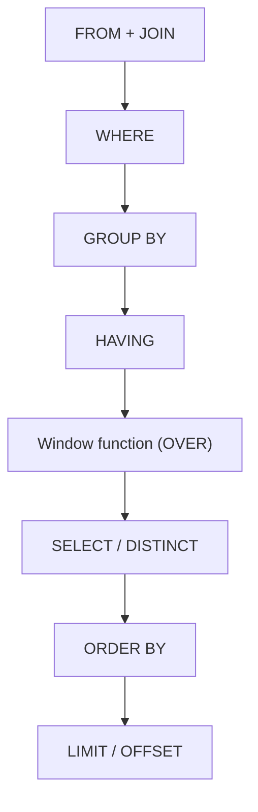

# Window Functions

!!! info "Bạn đang ở đây"
    cần trước: join, group by, having, subquery, correlated subquery và cte (chương trước).
    mở khoá: viết báo cáo "vừa chi tiết từng dòng vừa có số tổng hợp" (xếp hạng, so kỳ trước/sau, tổng luỹ kế) — nền tảng bắt buộc trước khi dùng linq nâng cao hoặc tối ưu truy vấn ef core ở các chương sau.

> Mục tiêu (đo được): sau chương này bạn có thể **áp dụng** `OVER()` với `PARTITION BY`/`ORDER BY` để viết đúng `ROW_NUMBER()`, `RANK()`, `DENSE_RANK()`, `LAG()`/`LEAD()` và tổng luỹ kế (`SUM() OVER`) cho một báo cáo thực tế, đồng thời giải thích chính xác vì sao kết quả KHÔNG bị gộp dòng như `GROUP BY`.

## 0. Câu hỏi/đoán nhanh

Cho bảng `sales(id, rep, region, amount)` có 6 dòng, 2 vùng (`region`), mỗi vùng 3 nhân viên bán hàng (`rep`).

1. `SELECT region, SUM(amount) FROM sales GROUP BY region;` trả về bao nhiêu dòng?
2. `SELECT rep, region, amount, SUM(amount) OVER (PARTITION BY region) AS tong_vung FROM sales;` trả về bao nhiêu dòng?
3. Hai nhân viên trong cùng vùng có `amount` bằng nhau (đồng hạng). `RANK()` và `DENSE_RANK()` xếp hạng người thứ ba (ngay sau cặp đồng hạng) có giống nhau không?

???+ note "Đáp án"
    1. 2 dòng — mỗi vùng gộp thành một dòng, mất chi tiết từng nhân viên.
    2. 6 dòng — window function KHÔNG gộp dòng, mỗi dòng gốc vẫn còn, chỉ thêm cột tổng hợp theo nhóm (`PARTITION BY region`).
    3. Không giống. `RANK()` sẽ "nhảy số" (bỏ qua hạng kế tiếp bằng số người đồng hạng), còn `DENSE_RANK()` không nhảy số, hạng luôn liên tục. Ví dụ cụ thể ở mục 4.

## 1. OVER() là gì — khác GROUP BY chỗ nào

**Định nghĩa bằng lời**: `OVER()` biến một hàm (như `SUM`, `COUNT`, `RANK`...) thành **window function** — nó tính toán trên một "cửa sổ" (window) gồm nhiều dòng liên quan, nhưng **giữ nguyên mỗi dòng gốc trong kết quả** thay vì gộp chúng lại thành một dòng như `GROUP BY` làm.

Nói cách khác:

- `GROUP BY` → N dòng đầu vào thành ít hơn N dòng đầu ra (mỗi nhóm một dòng), mất chi tiết dòng gốc.
- `... OVER (...)` → N dòng đầu vào vẫn ra N dòng, mỗi dòng có thêm một cột chứa giá trị tính từ "cửa sổ" dòng đó thuộc về.

Ví dụ cú pháp tối thiểu — chỉ minh hoạ đúng khái niệm `OVER()` không có `PARTITION BY` (cửa sổ là TOÀN BỘ bảng):

```sql title="SQL"
CREATE TABLE sales (id INT PRIMARY KEY, rep TEXT, region TEXT, amount NUMERIC);

INSERT INTO sales VALUES
  (1,'An','Bac',100),
  (2,'Binh','Bac',300),
  (3,'Chi','Nam',200);

SELECT rep, amount,
       SUM(amount) OVER () AS tong_toan_cong_ty
FROM sales;
```

Kết quả — 3 dòng vào, 3 dòng ra, mỗi dòng thêm cột tổng toàn bảng (600):

```text title="Kết quả"
 rep  | amount | tong_toan_cong_ty
------+--------+-------------------
 An   |  100   |        600
 Binh |  300   |        600
 Chi  |  200   |        600
```

So sánh với `GROUP BY` trên cùng dữ liệu để thấy khác biệt rõ ràng:

```sql title="SQL"
SELECT SUM(amount) AS tong_toan_cong_ty FROM sales;
-- Chỉ 1 dòng ra: tong_toan_cong_ty = 600. Mất hết rep/region.
```

Nếu dùng SAI — quên `OVER()` và trộn cột thường với hàm tổng hợp mà không có `GROUP BY`, PostgreSQL {{ postgres.current }} báo lỗi cụ thể:

```sql title="SQL (SAI)"
SELECT rep, SUM(amount) FROM sales;
```

```text title="Lỗi PostgreSQL"
ERROR:  column "sales.rep" must appear in the GROUP BY clause or be used in an aggregate function
LINE 1: SELECT rep, SUM(amount) FROM sales;
               ^
```

`OVER()` giải quyết đúng vấn đề này: bạn muốn vừa có `rep` (cột chi tiết) vừa có `SUM` (giá trị tổng hợp) trên cùng một dòng — không cần `GROUP BY`, không bị lỗi trên.

!!! danger "Cú pháp KHÔNG tồn tại: `GROUP BY` cùng window function trong cùng `SELECT` mà không hiểu thứ tự"
    Window function được tính **SAU** `WHERE`, `GROUP BY`, `HAVING` nhưng **TRƯỚC** `ORDER BY` và `SELECT DISTINCT` trong thứ tự thực thi logic của PostgreSQL. Vì vậy bạn **KHÔNG thể** dùng kết quả của window function trực tiếp trong `WHERE` cùng câu lệnh (VD `WHERE ROW_NUMBER() OVER (...) = 1` là lỗi cú pháp `ERROR: window functions are not allowed in WHERE`). Muốn lọc theo kết quả window function, phải bọc trong subquery hoặc CTE rồi lọc ở lớp ngoài — xem mục 6.

### Thứ tự thực thi — window function nằm ở đâu

Đây là điểm quan trọng nhất để không bị bất ngờ khi window function "không thấy" được cột nào đó, hoặc không thể lọc trực tiếp bằng `WHERE`. PostgreSQL không thực thi câu lệnh theo thứ tự bạn GÕ (`SELECT ... FROM ... WHERE ... GROUP BY ... HAVING ... ORDER BY`), mà theo thứ tự LOGIC sau:



Vì window function nằm SAU `HAVING` và TRƯỚC `SELECT`, nó "thấy" được kết quả đã lọc và đã gom nhóm (nếu có `GROUP BY`), nhưng bản thân `WHERE`/`HAVING` lại chạy TRƯỚC nó nên không thể tham chiếu tới nó. Ngược lại, `ORDER BY` ở cuối câu lệnh chạy SAU window function nên hoàn toàn có thể sắp xếp theo cột window function (VD `ORDER BY hang_trong_vung`).

## 2. PARTITION BY — chia cửa sổ thành nhiều nhóm nhỏ

**Định nghĩa bằng lời**: `PARTITION BY <cột>` chia các dòng thành nhiều nhóm con (partition) theo giá trị cột đó; window function sẽ tính riêng cho từng nhóm, giống ý tưởng `GROUP BY` nhưng KHÔNG gộp dòng.

Ví dụ cú pháp tối thiểu — chỉ minh hoạ `PARTITION BY`, chưa thêm `ORDER BY`:

```sql title="SQL"
SELECT rep, region, amount,
       SUM(amount) OVER (PARTITION BY region) AS tong_vung
FROM sales;
```

Kết quả — mỗi dòng vẫn giữ nguyên, nhưng `tong_vung` là tổng CHỈ TÍNH TRONG vùng (`region`) của dòng đó:

```text title="Kết quả"
 rep  | region | amount | tong_vung
------+--------+--------+-----------
 An   | Bac    |  100   |    400
 Binh | Bac    |  300   |    400
 Chi  | Nam    |  200   |    200
```

Nếu dùng SAI — viết `PARTITION` thiếu `BY` hoặc đặt sai vị trí (ngoài `OVER(...)`), PostgreSQL báo lỗi cú pháp cụ thể:

```sql title="SQL (SAI)"
SELECT rep, SUM(amount) OVER (PARTITION region) AS tong_vung FROM sales;
```

```text title="Lỗi PostgreSQL"
ERROR:  syntax error at or near "region"
LINE 1: SELECT rep, SUM(amount) OVER (PARTITION region) AS tong_vu...
                                                  ^
```

`PARTITION BY` có thể liệt kê nhiều cột (`PARTITION BY region, rep`) — mỗi tổ hợp giá trị tạo một cửa sổ riêng, tương tự `GROUP BY region, rep` nhưng vẫn giữ từng dòng.

## 3. ORDER BY trong OVER() — thứ tự bên trong cửa sổ

**Định nghĩa bằng lời**: `ORDER BY` đặt bên trong `OVER(...)` quy định **thứ tự các dòng trong mỗi cửa sổ** — thứ tự này quyết định ý nghĩa của các hàm phụ thuộc thứ tự như `ROW_NUMBER()`, `RANK()`, `LAG()`, `LEAD()`, và tổng luỹ kế. Nó khác hoàn toàn với `ORDER BY` ở cuối câu lệnh (dùng để sắp xếp KẾT QUẢ hiển thị).

Ví dụ cú pháp tối thiểu — chỉ minh hoạ `ORDER BY` bên trong `OVER()`, dùng `ROW_NUMBER()` (định nghĩa đầy đủ ở mục 4) chỉ để thấy tác dụng của thứ tự:

```sql title="SQL"
SELECT rep, region, amount,
       ROW_NUMBER() OVER (ORDER BY amount DESC) AS thu_tu
FROM sales;
```

Kết quả — đánh số thứ tự 1, 2, 3... theo `amount` giảm dần, KHÔNG liên quan tới thứ tự hiển thị dòng nếu bạn không thêm `ORDER BY` ở cuối câu lệnh:

```text title="Kết quả (thứ tự hiển thị có thể khác nhau tuỳ optimizer)"
 rep  | region | amount | thu_tu
------+--------+--------+--------
 Binh | Bac    |  300   |   1
 Chi  | Nam    |  200   |   2
 An   | Bac    |  100   |   3
```

Nếu dùng SAI — nhầm lẫn `ORDER BY` trong `OVER()` với `ORDER BY` cuối câu, rồi thắc mắc tại sao dòng hiển thị không theo đúng thứ tự mong muốn: đây KHÔNG phải lỗi cú pháp (câu lệnh vẫn chạy), mà là lỗi logic — muốn dòng hiển thị đúng thứ tự, bắt buộc phải thêm `ORDER BY` riêng ở NGOÀI, cuối câu lệnh:

```sql title="SQL (đúng cả hai)"
SELECT rep, region, amount,
       ROW_NUMBER() OVER (ORDER BY amount DESC) AS thu_tu
FROM sales
ORDER BY thu_tu;   -- ORDER BY ngoài: sắp xếp KẾT QUẢ hiển thị
```

`PARTITION BY` và `ORDER BY` thường đi cùng nhau trong một `OVER(...)`:

```sql title="SQL"
SELECT rep, region, amount,
       ROW_NUMBER() OVER (PARTITION BY region ORDER BY amount DESC) AS hang_trong_vung
FROM sales;
```

Ở đây, mỗi vùng (`region`) có đánh số riêng bắt đầu lại từ 1 — vì `PARTITION BY` chia cửa sổ, `ORDER BY` quy định thứ tự bên trong từng cửa sổ đó.

## 4. ROW_NUMBER() — đánh số thứ tự duy nhất

**Định nghĩa bằng lời**: `ROW_NUMBER()` gán một số thứ tự **tăng dần, duy nhất, không trùng** (1, 2, 3, ...) cho mỗi dòng trong cửa sổ, theo thứ tự của `ORDER BY` — kể cả khi có nhiều dòng giá trị bằng nhau, chúng vẫn nhận số khác nhau (tuỳ ý theo thứ tự vật lý nếu `ORDER BY` không phân biệt được).

Ví dụ cú pháp tối thiểu:

```sql title="SQL"
CREATE TABLE scores (id INT PRIMARY KEY, player TEXT, points INT);
INSERT INTO scores VALUES (1,'A',90),(2,'B',90),(3,'C',80);

SELECT player, points,
       ROW_NUMBER() OVER (ORDER BY points DESC) AS stt
FROM scores;
```

Kết quả — dù A và B đồng điểm (90), `ROW_NUMBER()` vẫn gán hai số KHÁC NHAU (1 và 2) vì nó không quan tâm đồng hạng, chỉ đếm dòng:

```text title="Kết quả"
 player | points | stt
--------+--------+-----
 A      |   90   |  1
 B      |   90   |  2
 C      |   80   |  3
```

Nếu dùng SAI — gọi `ROW_NUMBER()` mà thiếu cặp ngoặc `()`, PostgreSQL báo lỗi cú pháp cụ thể (đây là điểm dễ gõ nhầm nhất vì nhìn giống một "biến"):

```sql title="SQL (SAI)"
SELECT player, ROW_NUMBER OVER (ORDER BY points DESC) FROM scores;
```

```text title="Lỗi PostgreSQL"
ERROR:  syntax error at or near "OVER"
LINE 1: SELECT player, ROW_NUMBER OVER (ORDER BY points DESC) FROM...
                                   ^
```

`ROW_NUMBER()` dùng phổ biến nhất để: đánh số trang (phân trang thủ công), hoặc lấy "1 dòng đại diện mỗi nhóm" (top-N mỗi nhóm — xem bài tập thiết kế cuối chương).

## 5. RANK() vs DENSE_RANK() — khác nhau khi có đồng hạng

**Định nghĩa bằng lời**: `RANK()` và `DENSE_RANK()` đều xếp hạng các dòng theo `ORDER BY`, gán **CÙNG một hạng** cho các dòng có giá trị bằng nhau (đồng hạng) — khác `ROW_NUMBER()`. Điểm khác nhau giữa hai hàm này là cách xử lý hạng **NGAY SAU** một nhóm đồng hạng: `RANK()` **nhảy số** (bỏ qua đúng bằng số dòng đồng hạng phía trước), còn `DENSE_RANK()` **không nhảy**, hạng luôn liên tục.

Ví dụ cú pháp tối thiểu — dùng lại bảng `scores` ở trên, cố tình có 2 dòng đồng điểm 90 để thấy rõ khác biệt:

```sql title="SQL"
SELECT player, points,
       RANK()       OVER (ORDER BY points DESC) AS hang_rank,
       DENSE_RANK() OVER (ORDER BY points DESC) AS hang_dense
FROM scores;
```

Kết quả — đây là ví dụ cụ thể yêu cầu trong đề bài:

```text title="Kết quả"
 player | points | hang_rank | hang_dense
--------+--------+-----------+------------
 A      |   90   |     1     |     1
 B      |   90   |     1     |     1
 C      |   80   |     3     |     2       -- RANK nhảy từ 1 -> 3 (bỏ qua hạng 2);
                                            -- DENSE_RANK đi liên tục 1 -> 2
```

Giải thích: A và B đồng hạng 1 ở cả hai hàm. Nhưng C — người đứng ngay sau cặp đồng hạng — nhận hạng **3** với `RANK()` (vì có 2 dòng đã chiếm hạng 1 và 2, nên C nhảy tới 3), còn nhận hạng **2** với `DENSE_RANK()` (không tính số dòng, chỉ tính số mức giá trị khác nhau đã xuất hiện).

Nếu dùng SAI — gọi `RANK` không có `()` (giống lỗi ở `ROW_NUMBER`), PostgreSQL báo lỗi cú pháp tương tự mục 4. Còn nếu quên `ORDER BY` bên trong `OVER()`, PostgreSQL {{ postgres.current }} **KHÔNG** báo lỗi cú pháp — câu lệnh vẫn chạy được, nhưng kết quả vô nghĩa cho mục đích xếp hạng:

```sql title="SQL (chạy được nhưng vô nghĩa)"
SELECT player, RANK() OVER () FROM scores;
```

```text title="Kết quả (vô nghĩa — không có lỗi)"
 player | rank
--------+------
 A      |  1
 B      |  1
 C      |  1
```

*(Giải thích: không có `ORDER BY` bên trong `OVER()` thì PostgreSQL coi TẤT CẢ các dòng trong cửa sổ là "đồng hạng" với nhau, nên mọi dòng đều nhận hạng 1. Đây KHÔNG phải là lỗi cú pháp, mà là lỗi LOGIC: `RANK()`/`DENSE_RANK()` vô nghĩa nếu thiếu thứ tự. Luôn luôn viết `ORDER BY` bên trong `OVER()` khi dùng `RANK()`/`DENSE_RANK()`.)*

!!! danger "Cạm bẫy khi báo cáo 'Top 3'"
    Nếu dùng `RANK()` để lọc "Top 3" bằng `WHERE hang_rank <= 3` (sau khi bọc CTE), và có 2 người đồng hạng 2, kết quả trả về **4 dòng** chứ không phải 3 — vì cả hai người đồng hạng 2 đều thoả `<= 3`, và hạng tiếp theo là 4 (bị nhảy qua). Nếu nghiệp vụ yêu cầu ĐÚNG 3 dòng bất kể đồng hạng, dùng `ROW_NUMBER()` thay vì `RANK()`.

## 6. Lọc theo kết quả window function — bọc trong CTE

**Định nghĩa bằng lời**: vì window function không được phép dùng trực tiếp trong `WHERE` (đã nêu ở mục 1), muốn lọc theo `ROW_NUMBER()`/`RANK()` phải đặt window function trong một CTE (`WITH ... AS (...)`) hoặc subquery ở mệnh đề `FROM`, rồi lọc ở câu lệnh bên ngoài bằng `WHERE` bình thường.

Ví dụ cú pháp tối thiểu — lấy đúng người điểm cao nhất bằng `ROW_NUMBER()` bọc CTE:

```sql title="SQL"
WITH xep_hang AS (
    SELECT player, points,
           ROW_NUMBER() OVER (ORDER BY points DESC) AS stt
    FROM scores
)
SELECT player, points
FROM xep_hang
WHERE stt = 1;
```

Kết quả:

```text title="Kết quả"
 player | points
--------+--------
 A      |   90
```

Nếu dùng SAI — cố lọc trực tiếp window function trong `WHERE` mà không bọc CTE:

```sql title="SQL (SAI)"
SELECT player, points, ROW_NUMBER() OVER (ORDER BY points DESC) AS stt
FROM scores
WHERE stt = 1;
```

```text title="Lỗi PostgreSQL"
ERROR:  column "stt" does not exist
LINE 3: WHERE stt = 1;
              ^
```

*(Lưu ý: lỗi cụ thể ở đây là "column does not exist" chứ không phải "window function not allowed in WHERE", vì alias `stt` chưa tồn tại tại thời điểm `WHERE` được thực thi — đúng theo thứ tự thực thi logic `FROM → WHERE → ... → SELECT`, alias trong `SELECT` chưa "sinh ra" khi `WHERE` chạy. Nếu bạn viết lại biểu thức đầy đủ thay vì alias, VD `WHERE ROW_NUMBER() OVER (ORDER BY points DESC) = 1`, PostgreSQL sẽ báo đúng lỗi `ERROR: window functions are not allowed in WHERE`.)*

## 7. LAG() và LEAD() — so với kỳ trước/kỳ sau

**Định nghĩa bằng lời**: `LAG(cot, n)` lấy giá trị của `cot` từ dòng **PHÍA TRƯỚC** dòng hiện tại `n` bước (mặc định `n = 1`) trong cửa sổ đã sắp theo `ORDER BY`; `LEAD(cot, n)` lấy giá trị từ dòng **PHÍA SAU** `n` bước. Nếu không có dòng trước/sau (VD dòng đầu tiên với `LAG`), kết quả là `NULL` (trừ khi chỉ định giá trị mặc định ở tham số thứ ba).

Ví dụ cú pháp tối thiểu — chỉ minh hoạ `LAG()`, dữ liệu doanh thu theo tháng:

```sql title="SQL"
CREATE TABLE monthly_revenue (thang INT PRIMARY KEY, doanh_thu NUMERIC);
INSERT INTO monthly_revenue VALUES (1,1000),(2,1200),(3,900),(4,1500);

SELECT thang, doanh_thu,
       LAG(doanh_thu, 1) OVER (ORDER BY thang) AS doanh_thu_thang_truoc
FROM monthly_revenue;
```

Kết quả — dòng tháng 1 không có tháng trước nên `NULL`:

```text title="Kết quả"
 thang | doanh_thu | doanh_thu_thang_truoc
-------+-----------+------------------------
   1   |   1000    |          NULL
   2   |   1200    |          1000
   3   |    900    |          1200
   4   |   1500    |           900
```

Ví dụ độc lập cho `LEAD()`:

```sql title="SQL"
SELECT thang, doanh_thu,
       LEAD(doanh_thu, 1) OVER (ORDER BY thang) AS doanh_thu_thang_sau
FROM monthly_revenue;
```

```text title="Kết quả"
 thang | doanh_thu | doanh_thu_thang_sau
-------+-----------+----------------------
   1   |   1000    |         1200
   2   |   1200    |          900
   3   |    900    |         1500
   4   |   1500    |          NULL         -- tháng cuối không có tháng sau
```

Nếu dùng SAI — truyền `n` âm hoặc kiểu không phải số nguyên, PostgreSQL báo lỗi kiểu dữ liệu cụ thể:

```sql title="SQL (SAI)"
SELECT thang, LAG(doanh_thu, 'mot') OVER (ORDER BY thang) FROM monthly_revenue;
```

```text title="Lỗi PostgreSQL"
ERROR:  function lag(numeric, unknown) does not exist
LINE 1: SELECT thang, LAG(doanh_thu, 'mot') OVER (ORDER BY thang) ...
                       ^
HINT:  No function matches the given name and argument types. You might need to add explicit type casts.
```

Kết hợp `LAG()` để tính **% tăng trưởng so với tháng trước** (dùng lại kiến thức đã học — phép chia, `NULLIF`):

```sql title="SQL"
SELECT thang, doanh_thu,
       LAG(doanh_thu) OVER (ORDER BY thang) AS thang_truoc,
       ROUND(
         (doanh_thu - LAG(doanh_thu) OVER (ORDER BY thang))
         / NULLIF(LAG(doanh_thu) OVER (ORDER BY thang), 0) * 100, 1
       ) AS phan_tram_tang_truong
FROM monthly_revenue;
```

```text title="Kết quả"
 thang | doanh_thu | thang_truoc | phan_tram_tang_truong
-------+-----------+--------------+------------------------
   1   |   1000    |     NULL     |         NULL
   2   |   1200    |    1000      |         20.0
   3   |    900    |    1200      |        -25.0
   4   |   1500    |     900      |         66.7
```

## 8. SUM() OVER — tổng luỹ kế (running total)

**Định nghĩa bằng lời**: khi `SUM(...)` được dùng với `OVER (ORDER BY cot)` (KHÔNG có `PARTITION BY`, hoặc có nhưng vẫn giữ `ORDER BY`), mặc định PostgreSQL tính **tổng luỹ kế** — tổng dồn từ dòng đầu tiên của cửa sổ đến dòng hiện tại (frame mặc định là `RANGE BETWEEN UNBOUNDED PRECEDING AND CURRENT ROW`) — chứ KHÔNG phải tổng toàn bộ như khi `OVER()` không có `ORDER BY`.

Ví dụ cú pháp tối thiểu:

```sql title="SQL"
SELECT thang, doanh_thu,
       SUM(doanh_thu) OVER (ORDER BY thang) AS luy_ke
FROM monthly_revenue;
```

Kết quả — mỗi dòng cộng dồn tất cả các tháng từ đầu đến tháng đó:

```text title="Kết quả"
 thang | doanh_thu | luy_ke
-------+-----------+--------
   1   |   1000    |  1000
   2   |   1200    |  2200
   3   |    900    |  3100
   4   |   1500    |  4600
```

So sánh trực tiếp để thấy vì sao có `ORDER BY` hay không tạo ra kết quả khác hẳn nhau — đây chính là điểm dễ gây lỗi logic nhất của `SUM() OVER`:

```sql title="SQL"
SELECT thang, doanh_thu,
       SUM(doanh_thu) OVER ()               AS tong_tat_ca,   -- không ORDER BY: tổng toàn bộ, lặp lại mọi dòng
       SUM(doanh_thu) OVER (ORDER BY thang) AS luy_ke         -- có ORDER BY: tổng luỹ kế
FROM monthly_revenue;
```

```text title="Kết quả"
 thang | doanh_thu | tong_tat_ca | luy_ke
-------+-----------+-------------+--------
   1   |   1000    |    4600     |  1000
   2   |   1200    |    4600     |  2200
   3   |    900    |    4600     |  3100
   4   |   1500    |    4600     |  4600
```

Nếu dùng SAI — nghĩ rằng `SUM() OVER (ORDER BY ...)` luôn cho tổng toàn bộ giống `SUM() OVER ()`, rồi dùng nhầm cột `luy_ke` ở dòng cuối làm "tổng cả năm" trong báo cáo: đây KHÔNG gây lỗi cú pháp (câu lệnh chạy bình thường) mà là **lỗi logic nghiệp vụ** — dòng cuối của `luy_ke` tình cờ BẰNG tổng toàn bộ (vì đã cộng dồn hết), nhưng nếu dữ liệu lọc bớt vài dòng cuối (VD `WHERE thang <= 3`), `luy_ke` dòng cuối cùng SẼ KHÁC tổng thật — trong khi `SUM() OVER ()` luôn tự tính lại đúng theo tập dữ liệu hiện có.

Có thể giới hạn cửa sổ luỹ kế rõ ràng bằng `ROWS BETWEEN`, ví dụ tổng trượt 2 tháng gần nhất (bao gồm tháng hiện tại):

```sql title="SQL"
SELECT thang, doanh_thu,
       SUM(doanh_thu) OVER (
         ORDER BY thang
         ROWS BETWEEN 1 PRECEDING AND CURRENT ROW
       ) AS tong_2_thang_gan_nhat
FROM monthly_revenue;
```

```text title="Kết quả"
 thang | doanh_thu | tong_2_thang_gan_nhat
-------+-----------+-------------------------
   1   |   1000    |         1000            -- chưa có tháng trước, chỉ cộng chính nó
   2   |   1200    |         2200            -- 1000 + 1200
   3   |    900    |         2100            -- 1200 + 900
   4   |   1500    |         2400            -- 900 + 1500
```

## 9. COUNT()/AVG() OVER — mọi hàm tổng hợp đều dùng được với OVER

**Định nghĩa bằng lời**: KHÔNG chỉ `SUM`, mọi hàm tổng hợp bạn đã học ở chương JOIN/GROUP BY (`COUNT`, `AVG`, `MIN`, `MAX`) đều có thể đặt trước `OVER(...)` để trở thành window function — quy tắc về `PARTITION BY`/`ORDER BY`/tổng luỹ kế áp dụng giống hệt như với `SUM`.

Ví dụ cú pháp tối thiểu — dùng `AVG() OVER (PARTITION BY ...)` để so sánh từng dòng với TRUNG BÌNH nhóm của nó (một nhu cầu báo cáo rất phổ biến: "doanh số nhân viên này cao hơn hay thấp hơn trung bình vùng?"). Từ đây, các ví dụ dùng chung một bảng `sales2` (nhiều nhân viên mỗi vùng, có đồng doanh số để minh hoạ rõ các cạm bẫy đồng hạng):

```sql title="SQL"
CREATE TABLE sales2 (id INT PRIMARY KEY, rep TEXT, region TEXT, amount NUMERIC);
INSERT INTO sales2 VALUES
  (1,'An','Bac',500), (2,'Binh','Bac',500), (3,'Chi','Bac',300),
  (4,'Dung','Nam',700), (5,'Em','Nam',400);

SELECT rep, region, amount,
       ROUND(AVG(amount) OVER (PARTITION BY region), 1) AS tb_vung
FROM sales2;
```

```text title="Kết quả"
 rep  | region | amount | tb_vung
------+--------+--------+---------
 An   | Bac    |  500   |  433.3
 Binh | Bac    |  500   |  433.3
 Chi  | Bac    |  300   |  433.3
 Dung | Nam    |  700   |  550.0
 Em   | Nam    |  400   |  550.0
```

Kết hợp để tính **độ lệch so với trung bình nhóm** ngay trên cùng dòng — điều mà `GROUP BY` thuần không bao giờ làm được vì nó đã xoá mất `amount` của từng dòng:

```sql title="SQL"
SELECT rep, region, amount,
       ROUND(amount - AVG(amount) OVER (PARTITION BY region), 1) AS lech_so_tb_vung
FROM sales2;
```

```text title="Kết quả"
 rep  | region | amount | lech_so_tb_vung
------+--------+--------+------------------
 An   | Bac    |  500   |      66.7
 Binh | Bac    |  500   |      66.7
 Chi  | Bac    |  300   |    -133.3
 Dung | Nam    |  700   |     150.0
 Em   | Nam    |  400   |    -150.0
```

Nếu dùng SAI — quên `ROUND` khi `AVG` trả kiểu `NUMERIC` với nhiều chữ số thập phân không mong muốn: đây KHÔNG phải lỗi (câu lệnh chạy đúng), chỉ là hiển thị dài dòng — không phải lỗi hệ thống nhưng dễ gây nhầm khi so sánh bằng mắt trong báo cáo. Lỗi THẬT SỰ xảy ra khi trộn `AVG()` (trả `NUMERIC`) với phép trừ trên cột kiểu khác không tương thích ngầm định, ví dụ trừ trực tiếp với một cột kiểu `TEXT`:

```sql title="SQL (SAI)"
SELECT rep, amount - AVG('khong-phai-so') OVER () FROM sales2;
```

```text title="Lỗi PostgreSQL"
ERROR:  function avg(text) does not exist
LINE 1: SELECT rep, amount - AVG('khong-phai-so') OVER () FROM sal...
                             ^
HINT:  No function matches the given name and argument types. You might need to add explicit type casts.
```

`COUNT(*) OVER (PARTITION BY ...)` cũng rất hữu dụng để biết "nhóm này có bao nhiêu dòng" ngay trên từng dòng, ví dụ đếm số nhân viên mỗi vùng mà vẫn giữ chi tiết từng người:

```sql title="SQL"
SELECT rep, region,
       COUNT(*) OVER (PARTITION BY region) AS so_nguoi_trong_vung
FROM sales2;
```

```text title="Kết quả"
 rep  | region | so_nguoi_trong_vung
------+--------+-----------------------
 An   | Bac    |          3
 Binh | Bac    |          3
 Chi  | Bac    |          3
 Dung | Nam    |          2
 Em   | Nam    |          2
```

## 10. FIRST_VALUE(), LAST_VALUE() và NTILE() — giá trị biên và chia phân vị

**Định nghĩa bằng lời**: `FIRST_VALUE(cot)` lấy giá trị của `cot` ở DÒNG ĐẦU TIÊN của cửa sổ (theo `ORDER BY`); `LAST_VALUE(cot)` lấy giá trị ở DÒNG CUỐI CÙNG; `NTILE(n)` chia các dòng trong cửa sổ thành `n` nhóm có kích thước gần bằng nhau và trả về số thứ tự nhóm (1 đến `n`) cho mỗi dòng — dùng để tính phân vị (VD tứ phân vị khi `n = 4`).

Ví dụ cú pháp tối thiểu cho `FIRST_VALUE()` — lấy tên người có doanh số cao nhất mỗi vùng, hiển thị kèm mọi dòng:

```sql title="SQL"
SELECT rep, region, amount,
       FIRST_VALUE(rep) OVER (PARTITION BY region ORDER BY amount DESC) AS nguoi_dan_dau_vung
FROM sales2;
```

```text title="Kết quả"
 rep  | region | amount | nguoi_dan_dau_vung
------+--------+--------+---------------------
 An   | Bac    |  500   |        An
 Binh | Bac    |  500   |        An
 Chi  | Bac    |  300   |        An
 Dung | Nam    |  700   |       Dung
 Em   | Nam    |  400   |       Dung
```

*(Lưu ý: An và Binh đồng `amount = 500` ở vùng Bắc — vì `ORDER BY amount DESC` không có tie-breaker phân biệt hai dòng này, PostgreSQL không cam kết `FIRST_VALUE(rep)` luôn trả đúng "An"; kết quả có thể là "An" hoặc "Binh" tuỳ thứ tự vật lý. Muốn kết quả LẶP LẠI ỔN ĐỊNH, thêm tie-breaker: `ORDER BY amount DESC, rep`.)*

Nếu dùng SAI — dùng `LAST_VALUE()` mong đợi lấy dòng CUỐI CÙNG thật sự của partition, nhưng quên rằng frame mặc định (`RANGE BETWEEN UNBOUNDED PRECEDING AND CURRENT ROW`) khiến `LAST_VALUE()` chỉ thấy đến DÒNG HIỆN TẠI — đây KHÔNG phải lỗi cú pháp, mà là lỗi logic rất phổ biến:

```sql title="SQL (SAI — kết quả không như mong đợi)"
SELECT rep, region, amount,
       LAST_VALUE(rep) OVER (PARTITION BY region ORDER BY amount DESC) AS nguoi_cuoi_vung_SAI
FROM sales2;
```

```text title="Kết quả (SAI vì mỗi dòng chỉ 'thấy' chính nó trở về trước)"
 rep  | region | amount | nguoi_cuoi_vung_SAI
------+--------+--------+-----------------------
 An   | Bac    |  500   |         An            -- SAI: mong đợi "Chi" (thấp nhất vùng)
 Binh | Bac    |  500   |        Binh           -- SAI
 Chi  | Bac    |  300   |         Chi           -- đúng, vì Chi là dòng cuối
```

Cách sửa đúng — mở rộng frame để `LAST_VALUE()` thấy toàn bộ partition:

```sql title="SQL (ĐÚNG)"
SELECT rep, region, amount,
       LAST_VALUE(rep) OVER (
         PARTITION BY region ORDER BY amount DESC
         ROWS BETWEEN UNBOUNDED PRECEDING AND UNBOUNDED FOLLOWING
       ) AS nguoi_cuoi_vung
FROM sales2;
```

```text title="Kết quả"
 rep  | region | amount | nguoi_cuoi_vung
------+--------+--------+-------------------
 An   | Bac    |  500   |       Chi
 Binh | Bac    |  500   |       Chi
 Chi  | Bac    |  300   |       Chi
```

Ví dụ độc lập cho `NTILE()` — chia 5 nhân viên (không phân vùng) thành 2 nhóm doanh số (nhóm cao/nhóm thấp):

```sql title="SQL"
SELECT rep, amount,
       NTILE(2) OVER (ORDER BY amount DESC) AS nhom_phan_vi
FROM sales2;
```

```text title="Kết quả"
 rep  | amount | nhom_phan_vi
------+--------+---------------
 Dung |  700   |      1
 An   |  500   |      1
 Binh |  500   |      1
 Em   |  400   |      2
 Chi  |  300   |      2
```

Nếu dùng SAI — truyền `n = 0` hoặc số âm cho `NTILE`, PostgreSQL báo lỗi runtime cụ thể:

```sql title="SQL (SAI)"
SELECT rep, NTILE(0) OVER (ORDER BY amount DESC) FROM sales2;
```

```text title="Lỗi PostgreSQL"
ERROR:  argument of ntile must be greater than zero
```

## 11. Kết hợp trong báo cáo thực tế

Bây giờ mới đến ví dụ nâng cao trộn nhiều khái niệm — đúng như quy định, chỉ đưa SAU KHI mọi khái niệm đã học riêng lẻ ở trên. Bài toán: báo cáo doanh số theo `rep` và `region`, cần đồng thời: xếp hạng nhân viên trong từng vùng theo doanh số (`DENSE_RANK`), so với nhân viên đứng ngay trước trong bảng xếp hạng của vùng (`LAG`), và tổng luỹ kế toàn công ty theo thứ tự doanh số giảm dần (`SUM() OVER`).

```sql title="SQL"
SELECT
    rep, region, amount,
    DENSE_RANK() OVER (PARTITION BY region ORDER BY amount DESC, rep) AS hang_trong_vung,
    LAG(amount)  OVER (PARTITION BY region ORDER BY amount DESC, rep) AS amount_nguoi_truoc_trong_vung,
    SUM(amount)  OVER (ORDER BY amount DESC) AS luy_ke_toan_cong_ty
FROM sales2
ORDER BY amount DESC, rep;
```

```text title="Kết quả"
 rep  | region | amount | hang_trong_vung | amount_nguoi_truoc_trong_vung | luy_ke_toan_cong_ty
------+--------+--------+-----------------+--------------------------------+----------------------
 Dung | Nam    |  700   |        1        |             NULL               |        700
 An   | Bac    |  500   |        1        |             NULL               |       1700   -- 700+500+500 (2 dòng đồng amount cùng luỹ kế)
 Binh | Bac    |  500   |        1        |             500                |       1700
 Em   | Nam    |  400   |        2        |             700                |       2100
 Chi  | Bac    |  300   |        2        |             500                |       2400
```

Giải thích từng cột: `hang_trong_vung` xếp hạng RIÊNG trong mỗi `region` (An và Binh cùng hạng 1 ở Bắc vì đồng `amount`); `amount_nguoi_truoc_trong_vung` là `LAG` trong cùng partition — An là người đầu tiên của vùng Bắc theo thứ tự nên `NULL`; `luy_ke_toan_cong_ty` cộng dồn theo `amount` giảm dần trên TOÀN BỘ bảng (không `PARTITION BY`) — hai dòng đồng `amount` (An, Binh = 500) nhận CÙNG giá trị luỹ kế 1700 vì `RANGE` mặc định gộp các dòng "ngang hàng" (peer rows) theo `ORDER BY` vào cùng một mốc luỹ kế.

!!! danger "Vì sao thêm `, rep` vào `ORDER BY` — tránh kết quả không xác định"
    An và Binh đồng `amount = 500` trong cùng vùng Bắc. Nếu chỉ viết `ORDER BY amount DESC` (không có tie-breaker), PostgreSQL **KHÔNG cam kết** thứ tự vật lý giữa hai dòng đồng giá trị — lần chạy này An có thể đứng trước Binh, lần khác lại ngược lại (tuỳ kế hoạch thực thi), khiến `LAG()`/`ROW_NUMBER()` trả về NULL cho An hôm nay nhưng cho Binh vào lần chạy khác. Đây KHÔNG phải lỗi cú pháp mà là cạm bẫy dữ liệu-không-xác-định (nondeterministic) rất dễ bị bỏ sót. Luôn thêm một cột tie-breaker duy nhất (VD `rep`, hoặc khoá chính `id`) vào cuối `ORDER BY` bên trong `OVER(...)` khi cột chính có thể trùng giá trị, để kết quả LẶP LẠI ỔN ĐỊNH mỗi lần chạy.

## Cạm bẫy & thực chiến

- **Nhầm `OVER()` rỗng với có `ORDER BY`**: `SUM(x) OVER ()` = tổng toàn bộ, lặp lại ở mọi dòng; `SUM(x) OVER (ORDER BY y)` = tổng luỹ kế. Đây là lỗi logic phổ biến nhất khi mới học, KHÔNG gây lỗi cú pháp nên rất khó phát hiện — luôn kiểm tra vài dòng đầu bằng mắt.
- **Window function trong `WHERE`**: không hợp lệ trực tiếp; phải bọc CTE/subquery rồi lọc ở lớp ngoài (xem mục 6). Cũng áp dụng tương tự cho `GROUP BY` — không thể `GROUP BY` theo kết quả của window function trong cùng `SELECT`.
- **`RANK()` làm "Top N" bị sai số dòng**: nếu có đồng hạng, `WHERE hang <= N` có thể trả nhiều hơn N dòng. Dùng `ROW_NUMBER()` nếu nghiệp vụ cần đúng N dòng bất kể đồng hạng; dùng `RANK()`/`DENSE_RANK()` nếu nghiệp vụ MUỐN giữ tất cả người đồng hạng.
- **Thứ tự thực thi**: window function chạy SAU `WHERE`/`GROUP BY`/`HAVING` nhưng TRƯỚC `ORDER BY`/`SELECT DISTINCT` ở lớp ngoài cùng. Vì vậy `WHERE` không "thấy" được alias của window function, còn `ORDER BY` cuối câu THÌ CÓ.
- **Hiệu năng trên bảng lớn**: window function phải sắp xếp (sort) dữ liệu theo `PARTITION BY`/`ORDER BY` trước khi tính — nếu không có index hỗ trợ thứ tự đó, PostgreSQL phải sort toàn bộ tập kết quả trong bộ nhớ/đĩa tạm. Với báo cáo lớn, cân nhắc tạo index theo đúng cột dùng trong `PARTITION BY, ORDER BY` (index composite theo đúng thứ tự) để giảm chi phí sort — kiểm tra bằng `EXPLAIN ANALYZE`.
- **`LAG`/`LEAD` không có `PARTITION BY` khi dữ liệu có nhiều nhóm**: nếu quên `PARTITION BY region` khi tính "so với tháng trước trong CÙNG vùng", `LAG` sẽ lấy dòng trước đó theo `ORDER BY` bất kể có cùng vùng hay không — dòng đầu tiên của vùng B có thể bị so sánh nhầm với dòng cuối cùng của vùng A.
- **`LAST_VALUE()` với frame mặc định**: như đã thấy ở mục 10, `LAST_VALUE()` KHÔNG tự động lấy dòng cuối của cả partition — nó chỉ thấy tới dòng hiện tại trừ khi bạn tự mở rộng frame bằng `ROWS BETWEEN UNBOUNDED PRECEDING AND UNBOUNDED FOLLOWING`. Đây là lỗi âm thầm vì câu lệnh chạy được, kết quả có vẻ hợp lý (không có NULL/lỗi) nhưng SAI về nghiệp vụ.
- **`ORDER BY` trên cột có NULL ảnh hưởng tới `LAG`/`LEAD`/`RANK`**: PostgreSQL mặc định xếp `NULL` ở CUỐI khi `ORDER BY ... ASC` (và ở ĐẦU khi `DESC`) — nếu cột dùng để `ORDER BY` trong `OVER()` có `NULL`, thứ tự cửa sổ có thể không như mong đợi. Dùng `ORDER BY cot NULLS LAST`/`NULLS FIRST` tường minh khi dữ liệu có khả năng chứa NULL.

## Bài tập

**Bài 1 (giàn giáo)**: Cho bảng `monthly_revenue` ở mục 8. Viết truy vấn liệt kê `thang`, `doanh_thu`, và cột `chenh_lech` = `doanh_thu` trừ `doanh_thu` tháng trước (dùng `LAG`). Điền vào chỗ trống:

```sql title="SQL"
SELECT thang, doanh_thu,
       doanh_thu - _____________ OVER (ORDER BY thang) AS chenh_lech
FROM monthly_revenue;
```

???+ success "Lời giải"
    ```sql title="SQL"
    SELECT thang, doanh_thu,
           doanh_thu - LAG(doanh_thu) OVER (ORDER BY thang) AS chenh_lech
    FROM monthly_revenue;
    ```
    Kết quả: tháng 1 có `chenh_lech = NULL` (không có tháng trước để trừ — `doanh_thu - NULL = NULL` trong SQL); tháng 2 = 1200-1000=200; tháng 3 = 900-1200=-300; tháng 4 = 1500-900=600. `LAG(doanh_thu)` mặc định lấy đúng 1 dòng trước theo `ORDER BY thang`.

**Bài 2 (thiết kế)**: Bảng `sales2` (mục 9) có nhiều nhân viên mỗi vùng. Thiết kế truy vấn lấy **đúng 1 nhân viên có doanh số cao nhất mỗi vùng** — nếu có đồng hạng ở vị trí cao nhất, chỉ lấy 1 người bất kỳ trong số đó (không được trả nhiều hơn 1 dòng/vùng). Giải thích vì sao chọn hàm window function nào.

???+ success "Lời giải"
    ```sql title="SQL"
    WITH xep_hang AS (
        SELECT rep, region, amount,
               ROW_NUMBER() OVER (PARTITION BY region ORDER BY amount DESC) AS stt
        FROM sales2
    )
    SELECT rep, region, amount
    FROM xep_hang
    WHERE stt = 1;
    ```
    Vì sao dùng `ROW_NUMBER()` chứ không phải `RANK()`/`DENSE_RANK()`: đề bài yêu cầu ĐÚNG 1 dòng mỗi vùng dù có đồng hạng. `RANK()`/`DENSE_RANK()` sẽ giữ TẤT CẢ các dòng đồng hạng 1 (VD An và Binh đều 500 ở vùng Bắc → `RANK() = 1` cho cả hai → 2 dòng), vi phạm yêu cầu "đúng 1 dòng/vùng". `ROW_NUMBER()` luôn gán số duy nhất nên `WHERE stt = 1` chắc chắn trả về đúng 1 dòng mỗi `PARTITION BY region`, bất kể đồng hạng.

## Tự kiểm tra

1. `OVER()` khác `GROUP BY` ở điểm cốt lõi nào về số dòng trả về?
2. `PARTITION BY` trong `OVER(...)` có tác dụng gì, và nó KHÁC `GROUP BY` ở đâu dù ý tưởng "chia nhóm" giống nhau?
3. Cho 2 dòng đồng hạng nhất, dòng thứ ba (theo `ORDER BY`) sẽ nhận hạng bao nhiêu với `RANK()`, và bao nhiêu với `DENSE_RANK()`?
4. Vì sao không thể viết `WHERE ROW_NUMBER() OVER (...) = 1` trực tiếp trong cùng `SELECT`? Cách khắc phục là gì?
5. `SUM(x) OVER (ORDER BY y)` khác `SUM(x) OVER ()` (không `ORDER BY`) như thế nào về kết quả?
6. `LAG(doanh_thu)` ở dòng đầu tiên của một cửa sổ trả về giá trị gì? Vì sao?
7. Muốn "so với tháng trước, trong cùng một vùng" mà không bị lẫn dữ liệu vùng khác, cần thêm điều gì vào `OVER(...)` của `LAG()`?

??? note "Đáp án"
    1. `GROUP BY` gộp N dòng thành ít dòng hơn (mỗi nhóm một dòng); `OVER()` giữ nguyên toàn bộ N dòng gốc, chỉ thêm cột tính từ cửa sổ.
    2. `PARTITION BY` chia dữ liệu thành nhóm để tính giá trị tổng hợp riêng cho từng nhóm, giống ý tưởng của `GROUP BY`, nhưng KHÔNG gộp dòng — mỗi dòng gốc vẫn xuất hiện trong kết quả kèm giá trị tổng hợp của nhóm nó thuộc về.
    3. `RANK()` cho hạng 3 (nhảy qua hạng 2 vì đã có 2 dòng chiếm hạng 1). `DENSE_RANK()` cho hạng 2 (không nhảy, liên tục theo số mức giá trị khác nhau).
    4. Vì window function được tính SAU giai đoạn `WHERE` trong thứ tự thực thi logic — tại thời điểm `WHERE` chạy, giá trị (và cả alias) của window function chưa tồn tại. Khắc phục: bọc câu lệnh có window function vào một CTE hoặc subquery ở `FROM`, rồi lọc bằng `WHERE` ở câu lệnh bên ngoài.
    5. `SUM(x) OVER (ORDER BY y)` tính tổng LUỸ KẾ (cộng dồn từ dòng đầu cửa sổ đến dòng hiện tại theo thứ tự `y`); `SUM(x) OVER ()` không có `ORDER BY` tính tổng TOÀN BỘ cửa sổ và lặp lại giá trị đó ở mọi dòng.
    6. Trả về `NULL`, vì không có dòng nào đứng trước dòng đầu tiên trong cửa sổ để lấy giá trị.
    7. Thêm `PARTITION BY <cột vùng>` vào trong `OVER(...)` của `LAG()`, để nó chỉ tìm dòng trước đó TRONG CÙNG PARTITION (cùng vùng) thay vì trên toàn bộ tập dữ liệu.

??? abstract "DEEP DIVE: frame clause ROWS/RANGE/GROUPS, nhiều window function cùng lúc, và window function qua LINQ/EF Core"
    - **Frame clause đầy đủ**: cú pháp tổng quát là `OVER (PARTITION BY ... ORDER BY ... <frame_mode> BETWEEN <start> AND <end>)`, với `<frame_mode>` là `ROWS`, `RANGE`, hoặc `GROUPS`. `ROWS` đếm theo số dòng VẬT LÝ (VD `ROWS BETWEEN 1 PRECEDING AND CURRENT ROW` — luôn đúng 2 dòng, bất kể giá trị trùng nhau hay không). `RANGE` đếm theo giá trị LOGIC của `ORDER BY` — các dòng "ngang hàng" (peer rows, cùng giá trị `ORDER BY`) được gộp vào cùng một mốc, như ví dụ luỹ kế có đồng `amount` ở mục 11 (An và Binh cùng 500 nhận chung một mốc luỹ kế 1700). `GROUPS` đếm theo số NHÓM giá trị phân biệt đã đi qua, chứ không phải số dòng vật lý hay giá trị cụ thể — hữu ích khi muốn "2 mức giá trị gần nhất" bất kể mỗi mức có bao nhiêu dòng trùng. Mặc định khi chỉ có `ORDER BY` mà không ghi frame, PostgreSQL dùng `RANGE BETWEEN UNBOUNDED PRECEDING AND CURRENT ROW` — đây chính là lý do `SUM() OVER (ORDER BY ...)` cho tổng luỹ kế thay vì tổng toàn bộ.
    - **Named window (`WINDOW` clause)**: khi một câu lệnh dùng CÙNG một `PARTITION BY ... ORDER BY ...` cho nhiều hàm khác nhau (như ví dụ báo cáo ở mục 11 dùng `PARTITION BY region ORDER BY amount DESC` hai lần), có thể đặt tên cửa sổ một lần bằng `WINDOW w AS (PARTITION BY region ORDER BY amount DESC)` rồi tham chiếu `OVER w` ở mọi chỗ cần — vừa gọn vừa tránh gõ sai lệch giữa các lần lặp lại.
    - **EF Core & LINQ**: EF Core (bản chuẩn, không kèm phần mở rộng của bên thứ ba) KHÔNG dịch trực tiếp `ROW_NUMBER()`/`RANK()` từ cú pháp LINQ thông thường sang window function một cách tường minh cho mọi trường hợp — một số phiên bản hỗ trợ dịch `GroupBy` + `Select` với `Count`/`Sum` sang `OVER`, nhưng logic phức tạp (xếp hạng, `LAG`/`LEAD`) thường phải dùng `FromSql`/`FromSqlRaw` viết SQL thô rồi map về DTO. Khi thấy một câu LINQ phức tạp chạy chậm bất thường, luôn bật log SQL sinh ra (chương EF Core) để kiểm tra xem EF có vô tình sinh N+1 query thay vì một window function duy nhất hay không.
    - **So sánh hiệu năng với subquery tương đương**: mọi window function đều có thể viết lại bằng correlated subquery (VD `SUM() OVER (PARTITION BY region)` ≈ `(SELECT SUM(amount) FROM sales2 s2 WHERE s2.region = s1.region)`), nhưng window function thường NHANH HƠN đáng kể vì PostgreSQL chỉ cần MỘT lượt sort/scan dữ liệu, trong khi correlated subquery chạy lại truy vấn con cho từng dòng ngoài.

**Tiếp theo →** [P2 · EF Core](ef-core.md)
