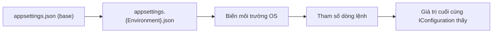
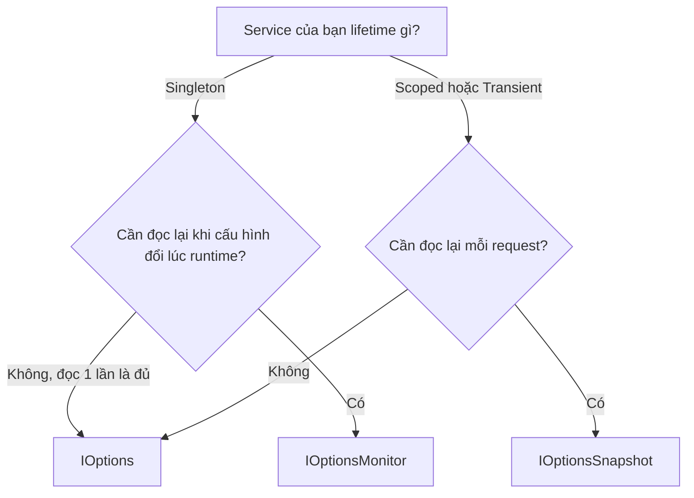

# Configuration & Options Pattern

!!! info "Bạn đang ở đây"
    **cần trước:** dependency injection (biết `builder.Services`, ba lifetime, tiêm qua constructor).
    **mở khoá:** ef core (connection string đọc từ config), jwt (secret key đọc từ config), và mọi service cần giá trị thay đổi theo môi trường (dev/staging/production) mà không sửa code.

> **Mục tiêu:** **Áp dụng** đúng cách đọc cấu hình qua `IConfiguration`, định nghĩa Options class, đăng ký bằng `Configure<T>`, và **phân biệt** ba cách tiêm cấu hình `IOptions<T>` / `IOptionsSnapshot<T>` / `IOptionsMonitor<T>` theo đúng lifetime và tình huống dùng.

---

## 0. Đoán nhanh trước khi học

Bạn có một service **Singleton** cần đọc một giá trị cấu hình (ví dụ số lần retry tối đa). Giá trị này nằm trong `appsettings.json`, và có thể được admin sửa lúc ứng dụng đang chạy (không restart). Bạn nên tiêm `IOptions<T>`, `IOptionsSnapshot<T>`, hay `IOptionsMonitor<T>`?

??? question "Đoán trước, đáp án ở dưới"
    Gợi ý: nghĩ về lifetime của service đang tiêm (Singleton) và yêu cầu "đọc lại khi thay đổi lúc runtime".

??? note "Đáp án"
    `IOptionsMonitor<T>`. Vì service là **Singleton**, bạn **không thể** tiêm `IOptionsSnapshot<T>` (nó là Scoped — Singleton tiêm Scoped là *captive dependency*, container sẽ ném lỗi khi khởi động). `IOptions<T>` thì đọc giá trị **một lần duy nhất** lúc khởi động và không bao giờ cập nhật lại. Chỉ `IOptionsMonitor<T>` (bản thân nó là Singleton, an toàn tiêm vào Singleton khác) mới theo dõi được thay đổi file cấu hình lúc đang chạy qua `OnChange`.

---

## 1. `appsettings.json`: định nghĩa và đọc giá trị

**Định nghĩa:** `appsettings.json` là một file JSON nằm ở thư mục gốc dự án, chứa các cặp khoá-giá trị cấu hình (chuỗi kết nối, URL, giới hạn, bật/tắt tính năng...) mà ứng dụng nạp lúc khởi động, để bạn không phải viết cứng (hard-code) các giá trị này trong code C#.

Ví dụ tối thiểu — một file cấu hình và cách đọc một giá trị đơn lẻ:

```json title="appsettings.json"
{
  "GreetingPrefix": "Xin chao"
}
```

```csharp title="Program.cs"
// test:compile đọc một giá trị cấu hình đơn lẻ qua IConfiguration
var builder = WebApplication.CreateBuilder(args);
var app = builder.Build();

// builder.Configuration là IConfiguration - đọc giá trị bằng chỉ số chuỗi (string indexer).
app.MapGet("/hello", (IConfiguration config) =>
{
    var prefix = config["GreetingPrefix"] ?? "Hello";
    return $"{prefix}, the gioi!";
});

app.Run();
```

Gọi `GET /hello` trả về `"Xin chao, the gioi!"` vì `appsettings.json` được nạp tự động vào `builder.Configuration` — bạn không cần đăng ký gì thêm, `WebApplication.CreateBuilder` đã làm sẵn.

**Điều gì xảy ra khi dùng sai:** nếu bạn gõ sai tên khoá (ví dụ `config["GretingPrefix"]` thiếu chữ `e`), `IConfiguration` **không ném lỗi** — nó âm thầm trả về `null`. Đây là lỗi runtime khó phát hiện: không có exception, không có mã lỗi CS nào, endpoint vẫn chạy nhưng luôn rơi vào giá trị mặc định (`"Hello"` ở ví dụ trên). Đây chính là lý do Options pattern (mục 3) tồn tại — nó cho bạn một class C# thật với tên thuộc tính được kiểm tra lúc biên dịch, thay vì chuỗi ma thuật (magic string) không được kiểm tra.

### Cấu trúc lồng nhau: đọc bằng dấu hai chấm `:`

Khi `appsettings.json` có object lồng nhau, đọc bằng dấu `:` để phân cấp:

```json title="appsettings.json"
{
  "Email": {
    "SmtpHost": "smtp.example.com",
    "Port": 587
  }
}
```

```csharp title="Program.cs"
// test:compile đọc giá trị lồng nhau bằng dấu ':' và section
var builder = WebApplication.CreateBuilder(args);
var app = builder.Build();

app.MapGet("/smtp-host", (IConfiguration config) =>
{
    var host = config["Email:SmtpHost"];
    var port = config.GetValue<int>("Email:Port"); // GetValue<T> tự ép kiểu, "587" -> 587
    return $"{host}:{port}";
});

app.Run();
```

`GetValue<int>` sẽ ném `InvalidOperationException` nếu giá trị trong JSON không thể ép sang `int` (ví dụ bạn gõ `"Port": "abc"`) — đây là lỗi runtime cụ thể, xảy ra ngay khi request đầu tiên gọi tới dòng đó, không phải lúc khởi động.

---

## 2. `appsettings.{Environment}.json`: nạp theo môi trường và thứ tự override

**Định nghĩa:** `appsettings.{Environment}.json` (ví dụ `appsettings.Development.json`, `appsettings.Production.json`) là file cấu hình **bổ sung**, chỉ áp dụng khi ứng dụng chạy trong môi trường tương ứng, và giá trị của nó **đè lên** (override) giá trị cùng khoá trong `appsettings.json` gốc.

Biến môi trường **`ASPNETCORE_ENVIRONMENT`** quyết định file nào được nạp thêm. Nếu biến này có giá trị `Development`, ASP.NET Core nạp `appsettings.Development.json` sau `appsettings.json`; nếu là `Production`, nạp `appsettings.Production.json`. Không đặt biến này thì mặc định là `Production`.

Ví dụ tối thiểu — hai file cùng một khoá:

```json title="appsettings.json"
{
  "GreetingPrefix": "Xin chao"
}
```

```json title="appsettings.Development.json"
{
  "GreetingPrefix": "[DEV] Xin chao"
}
```

```csharp title="Program.cs"
// test:compile minh hoạ thứ tự override theo môi trường
var builder = WebApplication.CreateBuilder(args);
var app = builder.Build();

app.MapGet("/hello", (IConfiguration config) => config["GreetingPrefix"]);

app.Run();
```

Thứ tự nạp cấu hình mặc định của `WebApplication.CreateBuilder` (file sau ghi đè file trước, đứng sau **thắng**):

1. `appsettings.json`
2. `appsettings.{ASPNETCORE_ENVIRONMENT}.json`
3. Biến môi trường hệ điều hành (environment variables)
4. Tham số dòng lệnh (command-line arguments)

Vậy nếu chạy với `ASPNETCORE_ENVIRONMENT=Development`, `GET /hello` trả về `"[DEV] Xin chao"`. Nếu không đặt biến môi trường (mặc định `Production`), file `appsettings.Development.json` không được nạp, và kết quả là `"Xin chao"` từ file gốc.

**Điều gì xảy ra khi dùng sai:** commit nhầm `appsettings.Development.json` chứa connection string trỏ vào database production, hoặc quên rằng biến môi trường (bước 3) đè lên **cả hai** file JSON — một biến môi trường `GreetingPrefix=Server` đặt trên máy CI sẽ thắng cả `appsettings.Production.json`, khiến bạn debug sai chỗ vì tưởng lỗi nằm ở file JSON trong khi thực ra nó nằm ở biến môi trường của máy chạy.



---

## 3. Options pattern: đóng gói cấu hình thành class C#

**Định nghĩa:** Options pattern là kỹ thuật dùng một **class C# thuần** (chỉ có các thuộc tính, không hành vi) để đại diện cho một nhóm cấu hình liên quan, thay vì đọc từng khoá rời rạc bằng chuỗi qua `IConfiguration["..."]` — nhờ vậy tên thuộc tính được kiểm tra lúc biên dịch và có thể tiêm (inject) như một service DI bình thường.

Ba bước để dùng Options pattern:

1. Viết một class chứa các thuộc tính khớp tên với section trong JSON.
2. Đăng ký bằng `builder.Services.Configure<T>(section)` — trỏ class tới đúng section cấu hình.
3. Tiêm `IOptions<T>` vào nơi cần dùng, đọc giá trị qua thuộc tính `.Value`.

Ví dụ tối thiểu:

```json title="appsettings.json"
{
  "Email": {
    "SmtpHost": "smtp.example.com",
    "Port": 587
  }
}
```

```csharp title="Program.cs"
// test:compile Options pattern toi thieu: class + Configure<T> + IOptions<T>
var builder = WebApplication.CreateBuilder(args);

// Buoc 2: dang ky - troi class EmailOptions vao section "Email" cua JSON.
builder.Services.Configure<EmailOptions>(
    builder.Configuration.GetSection("Email"));

var app = builder.Build();

// Buoc 3: tiem IOptions<EmailOptions>, doc qua .Value.
app.MapGet("/smtp-info", (IOptions<EmailOptions> options) =>
{
    var email = options.Value;
    return $"{email.SmtpHost}:{email.Port}";
});

app.Run();

// Buoc 1: class thuan, ten thuoc tinh phai KHOP ten khoa JSON (khong phan biet hoa/thuong).
sealed class EmailOptions
{
    public string SmtpHost { get; set; } = "";
    public int Port { get; set; }
}
```

Gọi `GET /smtp-info` trả về `"smtp.example.com:587"`. Tên section (`"Email"`) truyền vào `GetSection` phải khớp đúng chính tả với khoá trong JSON — đây vẫn là một chuỗi, nhưng chỉ **một** chuỗi duy nhất cho cả nhóm cấu hình, thay vì lặp lại chuỗi ở mọi nơi dùng.

**Điều gì xảy ra khi dùng sai:**

- Nếu bạn quên gọi `Configure<EmailOptions>` (bước 2) nhưng vẫn tiêm `IOptions<EmailOptions>`, container **không ném lỗi** — nó tự tạo một `EmailOptions` với giá trị mặc định của C# (`SmtpHost = ""`, `Port = 0`). Đây là lỗi runtime âm thầm: endpoint chạy, không exception, nhưng trả về dữ liệu rỗng/sai.
- Nếu class `EmailOptions` không có setter public (ví dụ khai báo `public string SmtpHost { get; }` không có `set`), binder cấu hình của .NET **không thể gán giá trị**, thuộc tính giữ nguyên giá trị mặc định — cũng là lỗi âm thầm, không phải exception lúc biên dịch hay chạy.
- Nếu bạn tiêm thẳng `EmailOptions` (không bọc `IOptions<>`) mà chưa đăng ký gì cho `EmailOptions` trực tiếp, sẽ nhận `InvalidOperationException: Unable to resolve service for type 'EmailOptions'` — vì `Configure<T>` chỉ đăng ký `IOptions<T>`, không đăng ký `T` trần.

---

## 4. `IOptions<T>`: đọc một lần, dùng cho Singleton

**Định nghĩa:** `IOptions<T>` là interface đại diện cho một giá trị cấu hình được **đọc và chốt (snapshot) đúng một lần** khi ứng dụng khởi động — bản thân nó được đăng ký với lifetime **Singleton**, nên có thể tiêm an toàn vào bất kỳ service nào (Singleton, Scoped, hay Transient).

Ví dụ tối thiểu — tiêm `IOptions<T>` vào một Singleton:

```csharp title="Program.cs"
// test:compile IOptions<T> tiem vao Singleton - doc dung 1 lan luc khoi dong
var builder = WebApplication.CreateBuilder(args);

builder.Services.Configure<EmailOptions>(
    builder.Configuration.GetSection("Email"));
builder.Services.AddSingleton<GreetingCounter>();

var app = builder.Build();

app.MapGet("/count", (GreetingCounter counter) => counter.Describe());

app.Run();

sealed class EmailOptions
{
    public string SmtpHost { get; set; } = "";
    public int Port { get; set; }
}

// IOptions<T> la Singleton -> tiem an toan vao mot Singleton khac, khong bi captive dependency.
sealed class GreetingCounter(IOptions<EmailOptions> options)
{
    public string Describe() => $"SMTP dang cau hinh: {options.Value.SmtpHost}";
}
```

**Điều gì xảy ra khi dùng sai:** nếu bạn sửa `appsettings.json` (ví dụ đổi `SmtpHost`) trong khi ứng dụng đang chạy (không restart), `IOptions<T>.Value` **vẫn trả về giá trị cũ** — nó đã chốt lúc khởi động và không bao giờ đọc lại. Đây không phải exception, mà là hành vi runtime dễ gây nhầm lẫn: admin sửa file cấu hình, tưởng có hiệu lực ngay, nhưng ứng dụng vẫn dùng giá trị cũ cho tới khi restart. Nếu bạn cần đọc lại theo request hoặc theo dõi thay đổi runtime, dùng mục 5 hoặc mục 6.

---

## 5. `IOptionsSnapshot<T>`: đọc lại mỗi request, dùng cho Scoped

**Định nghĩa:** `IOptionsSnapshot<T>` là interface đọc lại giá trị cấu hình **mỗi lần được resolve trong một scope mới** (thực tế là mỗi request HTTP) — bản thân nó được đăng ký với lifetime **Scoped**, nên chỉ tiêm được vào service Scoped hoặc Transient, không tiêm được vào Singleton.

Ví dụ tối thiểu:

```csharp title="Program.cs"
// test:compile IOptionsSnapshot<T> - doc lai moi request, chi dung cho Scoped/Transient
var builder = WebApplication.CreateBuilder(args);

builder.Services.Configure<EmailOptions>(
    builder.Configuration.GetSection("Email"));
builder.Services.AddScoped<EmailReporter>();

var app = builder.Build();

app.MapGet("/report", (EmailReporter reporter) => reporter.Describe());

app.Run();

sealed class EmailOptions
{
    public string SmtpHost { get; set; } = "";
    public int Port { get; set; }
}

// IOptionsSnapshot<T> la Scoped -> doc lai gia tri cau hinh moi khi mot scope (request) moi tao service nay.
sealed class EmailReporter(IOptionsSnapshot<EmailOptions> snapshot)
{
    public string Describe() => $"SMTP hien tai: {snapshot.Value.SmtpHost}";
}
```

Nếu admin sửa `appsettings.json` và file cấu hình có `reloadOnChange: true` (mặc định `true` với `AddJsonFile` trong `WebApplication.CreateBuilder`), request **kế tiếp** sẽ thấy giá trị mới — không cần restart ứng dụng, chỉ cần một request mới (một scope mới).

**Điều gì xảy ra khi dùng sai:** nếu bạn tiêm `IOptionsSnapshot<EmailOptions>` vào một service đăng ký **Singleton**, container ném lỗi ngay khi khởi động (với `ValidateScopes = true` mặc định ở môi trường Development):

```text title="Ngoại lệ lúc khởi động"
System.InvalidOperationException: Cannot consume scoped service
'Microsoft.Extensions.Options.IOptionsSnapshot`1[EmailOptions]'
from singleton 'GreetingCounter'.
```

Đây chính là captive dependency đã học ở chương DI — `IOptionsSnapshot<T>` không phải ngoại lệ của quy tắc lifetime, nó tuân theo quy tắc Scoped bình thường.

---

## 6. `IOptionsMonitor<T>`: theo dõi thay đổi runtime, dùng cho Singleton

**Định nghĩa:** `IOptionsMonitor<T>` là interface vừa đọc được giá trị hiện tại (`.CurrentValue`), vừa cho phép **đăng ký một callback** (`OnChange`) được gọi mỗi khi file cấu hình thay đổi — bản thân nó được đăng ký với lifetime **Singleton**, nên tiêm an toàn vào Singleton, và là lựa chọn duy nhất trong ba loại phù hợp cho Singleton cần dữ liệu cấu hình luôn mới.

Ví dụ tối thiểu:

```csharp title="Program.cs"
// test:compile IOptionsMonitor<T> - Singleton, doc CurrentValue va theo doi OnChange
var builder = WebApplication.CreateBuilder(args);

builder.Services.Configure<EmailOptions>(
    builder.Configuration.GetSection("Email"));
builder.Services.AddSingleton<EmailWatcher>();

var app = builder.Build();

app.MapGet("/current-smtp", (EmailWatcher watcher) => watcher.Describe());

app.Run();

sealed class EmailOptions
{
    public string SmtpHost { get; set; } = "";
    public int Port { get; set; }
}

// IOptionsMonitor<T> la Singleton -> tiem duoc vao Singleton khac, doc CurrentValue moi lan goi.
sealed class EmailWatcher
{
    private readonly IOptionsMonitor<EmailOptions> _monitor;

    public EmailWatcher(IOptionsMonitor<EmailOptions> monitor)
    {
        _monitor = monitor;
        // OnChange dang ky callback - duoc goi moi khi appsettings.json thay doi luc dang chay.
        _monitor.OnChange(updated =>
            Console.WriteLine($"[Config] SmtpHost doi thanh: {updated.SmtpHost}"));
    }

    public string Describe() => $"SMTP ngay-bay-gio: {_monitor.CurrentValue.SmtpHost}";
}
```

**Điều gì xảy ra khi dùng sai:** đăng ký callback trong `OnChange` nhưng thực hiện thao tác nặng hoặc không idempotent bên trong (ví dụ mở lại kết nối database mỗi lần gọi) sẽ gây vấn đề hiệu năng, vì trên một số hệ điều hành, việc ghi file có thể kích hoạt `OnChange` **nhiều lần** cho cùng một lần lưu (do cách filesystem watcher báo sự kiện) — đây là hành vi runtime cụ thể cần code phòng thủ (ví dụ debounce), không phải lỗi biên dịch.

---

## 7. So sánh ba loại và khi nào dùng loại nào

Bây giờ khi cả ba khái niệm đã được giới thiệu riêng lẻ, đây là bảng tổng hợp:

| | `IOptions<T>` | `IOptionsSnapshot<T>` | `IOptionsMonitor<T>` |
|---|---|---|---|
| Lifetime của bản thân nó | Singleton | Scoped | Singleton |
| Tiêm được vào Singleton? | Có | **Không** (captive dependency) | Có |
| Tiêm được vào Scoped/Transient? | Có | Có | Có |
| Đọc giá trị mới khi cấu hình đổi lúc runtime? | Không — chốt lúc khởi động | Có — đọc lại mỗi request/scope mới | Có — `.CurrentValue` luôn mới nhất |
| Hỗ trợ callback khi đổi? | Không | Không | Có, qua `OnChange` |
| Cách đọc giá trị | `.Value` | `.Value` | `.CurrentValue` |
| Dùng khi nào | Cấu hình tĩnh, không đổi lúc chạy, service bất kỳ lifetime | Cấu hình có thể đổi, cần giá trị mới mỗi request, service Scoped/Transient | Cấu hình có thể đổi, service Singleton cần giá trị mới hoặc cần phản ứng khi đổi |

Sơ đồ quyết định:



---

## Cạm bẫy & thực chiến

- **`IOptionsSnapshot<T>` tiêm vào Singleton:** ném `InvalidOperationException` lúc khởi động ("Cannot consume scoped service ... from singleton ..."). Sửa bằng cách đổi sang `IOptionsMonitor<T>` nếu service phải là Singleton.
- **Sai chính tả khoá JSON khi dùng `IConfiguration["..."]` trực tiếp:** không có lỗi biên dịch, không có exception — âm thầm trả về `null` hoặc giá trị mặc định của Options class. Luôn ưu tiên Options pattern (class C# có thuộc tính) thay vì chuỗi rời rạc để giảm rủi ro này.
- **Quên gọi `Configure<T>`:** `IOptions<T>.Value` không ném lỗi, chỉ trả về instance với giá trị mặc định (`0`, `""`, `null`) của class C#. Kiểm tra bằng cách log giá trị lúc khởi động (`app.Logger.LogInformation(...)`) trong môi trường Development để phát hiện sớm.
- **Commit nhầm secret vào `appsettings.json`:** connection string hoặc API key không nên nằm trong file JSON commit vào git. Dùng biến môi trường hoặc User Secrets (`dotnet user-secrets`) cho giá trị nhạy cảm — nhớ rằng biến môi trường **đè lên** cả `appsettings.json` và `appsettings.{Environment}.json` theo thứ tự đã học ở mục 2.
- **Quên đặt `ASPNETCORE_ENVIRONMENT`:** mặc định là `Production`, nên `appsettings.Development.json` sẽ **không** được nạp nếu bạn quên đặt biến này khi chạy local — dễ nhầm lẫn tưởng file Development có bug trong khi thực ra nó chưa từng được đọc.
- **Đăng ký `Configure<T>` nhiều lần cho cùng một `T`:** lần đăng ký cuối không "thắng" hoàn toàn như service thường — Options pattern hỗ trợ named options, nhưng nếu không dùng tên, đăng ký sau có thể ghi đè cấu hình của đăng ký trước một cách không rõ ràng. Chỉ gọi `Configure<T>` một lần cho mỗi section trừ khi bạn cố ý dùng named options (`Configure<T>(name, section)`).

---

## Bài tập

**Bài 1 (có giàn giáo).** Đoạn dưới định nghĩa `RateLimitOptions` nhưng có một lỗi khiến giá trị luôn là `0` dù `appsettings.json` có `"MaxRequests": 100`. Tìm và sửa lỗi.

```csharp title="Program.cs"
// test:skip khung bài tập (thiếu appsettings.json đi kèm, chỉ minh hoạ class lỗi)
sealed class RateLimitOptions
{
    public int MaxRequest { get; set; } // chú ý tên
}
```

```json title="appsettings.json (giả định)"
{
  "RateLimit": {
    "MaxRequests": 100
  }
}
```

Gợi ý giàn giáo: binder cấu hình của .NET khớp tên thuộc tính C# với tên khoá JSON — so sánh kỹ từng ký tự.

??? success "Lời giải + vì sao"
    Tên thuộc tính C# là `MaxRequest` (thiếu chữ `s`) trong khi khoá JSON là `MaxRequests`. Binder không tìm thấy khớp tên nên giữ nguyên giá trị mặc định `0` — không có exception nào được ném ra.

    ```csharp title="Program.cs"
    // test:run sửa lỗi: tên thuộc tính khớp đúng khoá JSON (mô phỏng không cần ASP.NET Core)
    using System.Text.Json;

    var json = """{ "RateLimit": { "MaxRequests": 100 } }""";
    using var doc = JsonDocument.Parse(json);
    var maxRequests = doc.RootElement
        .GetProperty("RateLimit")
        .GetProperty("MaxRequests")
        .GetInt32();

    var options = new RateLimitOptions { MaxRequests = maxRequests };
    Console.WriteLine($"MaxRequests = {options.MaxRequests}");

    sealed class RateLimitOptions
    {
        public int MaxRequests { get; set; } // sửa: thêm chữ 's' khớp JSON
    }
    ```

    **Vì sao:** Options pattern dùng reflection để khớp tên thuộc tính (không phân biệt hoa/thường) với tên khoá trong `IConfiguration`. Sai một ký tự là binder bỏ qua thuộc tính đó hoàn toàn, không cảnh báo, không lỗi — đây là lý do luôn nên viết test hoặc log giá trị Options lúc khởi động để bắt lỗi loại này sớm.

**Bài 2 (thiết kế).** Bạn có một `FeatureFlagService` (đăng ký **Singleton** vì được gọi rất nhiều lần mỗi request và cần nhanh) cần đọc cờ tính năng `EnableNewCheckout` từ cấu hình. Yêu cầu nghiệp vụ: khi ops đổi cờ này trong `appsettings.json` lúc ứng dụng đang chạy (không restart), `FeatureFlagService` phải thấy giá trị mới trong vòng vài giây. Thiết kế class Options, đăng ký, và chọn đúng interface để tiêm.

??? success "Lời giải + vì sao"
    ```csharp title="Program.cs"
    // test:compile bai 2: Singleton + can gia tri moi lien tuc -> IOptionsMonitor<T>
    var builder = WebApplication.CreateBuilder(args);

    builder.Services.Configure<FeatureFlagOptions>(
        builder.Configuration.GetSection("FeatureFlags"));
    builder.Services.AddSingleton<FeatureFlagService>();

    var app = builder.Build();

    app.MapGet("/checkout-flag", (FeatureFlagService svc) => svc.IsNewCheckoutEnabled());

    app.Run();

    sealed class FeatureFlagOptions
    {
        public bool EnableNewCheckout { get; set; }
    }

    sealed class FeatureFlagService(IOptionsMonitor<FeatureFlagOptions> monitor)
    {
        public bool IsNewCheckoutEnabled() => monitor.CurrentValue.EnableNewCheckout;
    }
    ```

    **Vì sao:** service là Singleton nên `IOptionsSnapshot<T>` (Scoped) sẽ gây captive dependency, loại ngay. `IOptions<T>` chốt giá trị lúc khởi động nên không thấy thay đổi lúc runtime — không đáp ứng yêu cầu "thấy giá trị mới trong vài giây mà không restart". Chỉ `IOptionsMonitor<T>` vừa là Singleton (tiêm an toàn) vừa đọc `.CurrentValue` luôn mới nhất mỗi lần gọi, đúng cả hai ràng buộc.

---

## Tự kiểm tra

1. Biến môi trường nào quyết định file `appsettings.{Environment}.json` nào được nạp?

    ??? note "Đáp án"
        `ASPNETCORE_ENVIRONMENT`. Không đặt thì mặc định `Production`.

2. Giữa `appsettings.json` và `appsettings.Development.json`, file nào được nạp sau và do đó thắng khi trùng khoá?

    ??? note "Đáp án"
        `appsettings.Development.json` (file theo môi trường) được nạp sau `appsettings.json` (file gốc), nên giá trị của nó đè lên. Biến môi trường OS và tham số dòng lệnh còn đè lên cả hai file này.

3. Vì sao nên dùng Options pattern (class C#) thay vì đọc trực tiếp `IConfiguration["Key"]` ở khắp nơi trong code?

    ??? note "Đáp án"
        Vì `IConfiguration["Key"]` dùng chuỗi rời rạc — sai chính tả không bị phát hiện lúc biên dịch, âm thầm trả về `null`. Options pattern gom cấu hình vào một class C# có thuộc tính thật, tên được IDE và compiler hỗ trợ, và có thể tiêm qua DI như service bình thường.

4. `IOptionsSnapshot<T>` có lifetime gì, và điều gì xảy ra nếu tiêm nó vào một service Singleton?

    ??? note "Đáp án"
        Scoped. Tiêm vào Singleton sẽ gây captive dependency, ném `InvalidOperationException` lúc khởi động ("Cannot consume scoped service ... from singleton ...").

5. Trong ba loại `IOptions<T>` / `IOptionsSnapshot<T>` / `IOptionsMonitor<T>`, loại nào là lựa chọn đúng cho một Singleton cần thấy cấu hình thay đổi lúc đang chạy (không restart)?

    ??? note "Đáp án"
        `IOptionsMonitor<T>` — bản thân nó là Singleton (tiêm an toàn vào Singleton khác) và đọc `.CurrentValue` luôn cập nhật, khác với `IOptions<T>` chỉ đọc một lần lúc khởi động.

6. Nếu bạn quên gọi `builder.Services.Configure<EmailOptions>(...)` nhưng vẫn tiêm `IOptions<EmailOptions>` vào một endpoint, chuyện gì xảy ra khi request tới?

    ??? note "Đáp án"
        Không có exception. `IOptions<EmailOptions>.Value` trả về một `EmailOptions` mới với giá trị mặc định của C# cho từng thuộc tính (chuỗi rỗng, số 0, v.v.) — lỗi âm thầm, không phải lỗi biên dịch hay runtime crash.

7. `GetValue<int>("Email:Port")` sẽ có hành vi gì nếu giá trị JSON tại khoá đó là một chuỗi không phải số, ví dụ `"abc"`?

    ??? note "Đáp án"
        Ném `InvalidOperationException` lúc gọi (runtime), vì không thể ép kiểu chuỗi `"abc"` sang `int`.

---

??? abstract "DEEP DIVE: named options, `IValidateOptions<T>`, và User Secrets"
    **Named options** cho phép đăng ký nhiều cấu hình cùng loại `T`, phân biệt bằng tên, khi bạn có nhiều "biến thể" của cùng một nhóm cấu hình (ví dụ nhiều SMTP server):

    ```csharp title="Program.cs"
    // test:compile named options - nhieu bien the cua cung mot Options class
    var builder = WebApplication.CreateBuilder(args);

    builder.Services.Configure<EmailOptions>("Primary", builder.Configuration.GetSection("Email:Primary"));
    builder.Services.Configure<EmailOptions>("Backup", builder.Configuration.GetSection("Email:Backup"));

    var app = builder.Build();

    app.MapGet("/primary-smtp", (IOptionsSnapshot<EmailOptions> snap) => snap.Get("Primary").SmtpHost);

    app.Run();

    sealed class EmailOptions
    {
        public string SmtpHost { get; set; } = "";
    }
    ```

    **Validate options lúc khởi động:** thay vì phát hiện cấu hình sai lúc runtime (âm thầm hoặc crash giữa chừng), bạn có thể validate ngay khi ứng dụng khởi động bằng `ValidateOnStart()`:

    ```csharp title="Program.cs"
    // test:compile validate Options luc khoi dong, that bai som thay vi am tham
    var builder = WebApplication.CreateBuilder(args);

    builder.Services.AddOptions<EmailOptions>()
        .Bind(builder.Configuration.GetSection("Email"))
        .Validate(o => !string.IsNullOrWhiteSpace(o.SmtpHost), "SmtpHost khong duoc rong")
        .ValidateOnStart(); // that bai ngay luc khoi dong thay vi lan dau resolve

    var app = builder.Build();
    app.Run();

    sealed class EmailOptions
    {
        public string SmtpHost { get; set; } = "";
    }
    ```

    Nếu `SmtpHost` rỗng, ứng dụng ném `OptionsValidationException` ngay khi khởi động thay vì để lỗi âm thầm trôi tới lúc có request thật — đánh đổi giữa "fail fast lúc deploy" và "chạy được nhưng sai dữ liệu lúc runtime" luôn nên chọn vế đầu cho cấu hình bắt buộc.

    **User Secrets** (`dotnet user-secrets init`, `dotnet user-secrets set "Email:SmtpHost" "..."`) lưu giá trị nhạy cảm ngoài source control, trên máy dev — chỉ hoạt động khi `ASPNETCORE_ENVIRONMENT=Development`, không dùng được cho production (production nên dùng biến môi trường hoặc dịch vụ quản lý secret như Azure Key Vault).

Tiếp theo -> ef core va dbcontext
