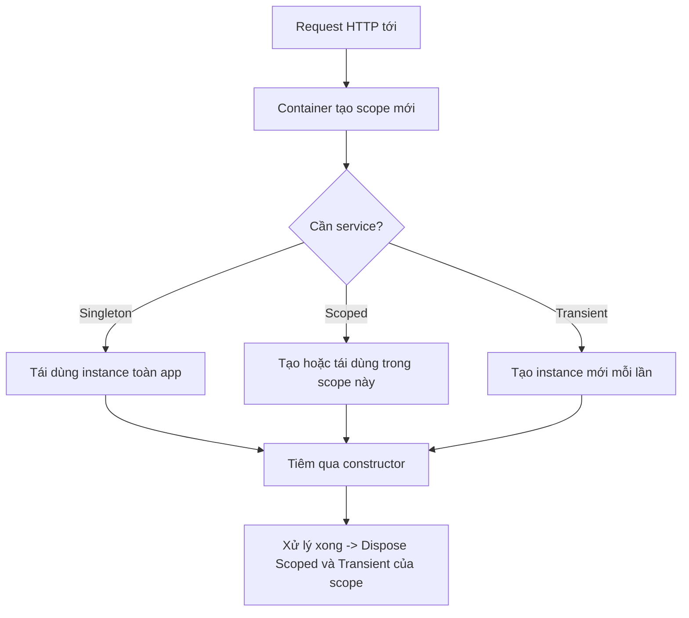

# Dependency Injection & Lifetimes

!!! info "Bạn đang ở đây"
    **cần trước:** minimal api (biết `builder`, `app.MapGet`, chạy được một endpoint).
    **mở khoá:** ef core, jwt, và mọi service có trạng thái — vì tất cả đều được đăng ký và tiêm qua DI container.

> **Mục tiêu:** **Áp dụng** đúng ba lifetime (Singleton/Scoped/Transient) khi đăng ký service trên .NET {{ dotnet.current }}, tiêm qua constructor, và tránh bẫy *captive dependency*.

---

## 0. Đoán nhanh trước khi học

Một `DbContext` của EF Core giữ kết nối và theo dõi thay đổi trong phạm vi **một request HTTP**. Bạn nên đăng ký nó với lifetime nào? Và điều gì xảy ra nếu bạn tiêm `DbContext` (Scoped) vào một service `Singleton`?

??? note "Đáp án"
    `DbContext` phải là **Scoped** — mỗi request một instance riêng, không chia sẻ giữa các request đồng thời.
    Nếu một Singleton tiêm một Scoped, container **không thể** cấp instance mới mỗi request cho Singleton (Singleton chỉ tạo một lần). Nó sẽ "giam" instance Scoped đầu tiên và tái dùng mãi mãi → gọi là **captive dependency**. Trên .NET {{ dotnet.current }}, hành vi mặc định là **ném lỗi ngay khi khởi động** để bạn phát hiện sớm.

---

## 1. Ý niệm cốt lõi

**Dependency Injection (DI)** là kỹ thuật: một class **không tự tạo** thứ nó cần, mà **nhận vào** từ bên ngoài (thường qua constructor). Đây là hiện thực cụ thể của nguyên tắc **Nghịch đảo phụ thuộc** (Dependency Inversion): code cấp cao phụ thuộc vào **abstraction** (interface), không phụ thuộc vào implementation cụ thể.

Vì sao đáng làm:

- **Dễ test:** trong unit test, tiêm một fake/mock thay cho implementation thật (ví dụ `IEmailSender` giả không gửi mail thật).
- **Nới lỏng ràng buộc:** đổi implementation (SQL → in-memory) mà không sửa code dùng nó.
- **Quản lý vòng đời tập trung:** container tự tạo, tái dùng, và giải phóng object.

Trong ASP.NET Core, container được cấu hình qua `builder.Services` (kiểu `IServiceCollection`). Ba lifetime:

| Lifetime | Đăng ký | Số instance | Dùng khi | Ví dụ điển hình |
|----------|---------|-------------|----------|-----------------|
| Singleton | `AddSingleton` | 1 cho cả ứng dụng | Không trạng thái/an toàn đa luồng, đắt để tạo | cache, `HttpClient` factory config, logger |
| Scoped | `AddScoped` | 1 cho mỗi request HTTP | Trạng thái theo request | `DbContext`, repository, unit-of-work |
| Transient | `AddTransient` | 1 mỗi lần được yêu cầu | Nhẹ, không trạng thái | validator, mapper, service tiện ích |

Luồng phân giải một request:



!!! danger "Hiểu lầm phổ biến cần đính chính"
    "Transient luôn an toàn nhất nên cứ dùng cho tất cả." **Sai.** Nếu một Singleton tiêm một Transient *có trạng thái/dispose*, Transient đó vẫn bị giam theo Singleton — vẫn là captive dependency. Lifetime của một service **bị giới hạn bởi lifetime dài nhất của thứ giữ nó**, không phải bởi cách bạn đăng ký chính nó.

---

## 2. Ví dụ mẫu

Ví dụ thuần C# (không cần ASP.NET Core) minh hoạ constructor injection qua interface — tự dựng một container tối giản để thấy rõ cơ chế:

```csharp title="C#"
// test:run
IGreeter greeter = new VietnameseGreeter();
var service = new WelcomeService(greeter);
Console.WriteLine(service.WelcomeFor("Nghia"));
Console.WriteLine(service.WelcomeFor("An"));

interface IGreeter
{
    string Greet(string name);
}

sealed class VietnameseGreeter : IGreeter
{
    public string Greet(string name) => $"Xin chao, {name}!";
}

sealed class WelcomeService(IGreeter greeter)
{
    // Không tự tạo IGreeter -> nhận vào qua constructor (constructor injection).
    public string WelcomeFor(string name) => greeter.Greet(name) + " Chuc mot ngay tot lanh.";
}
```

Output kỳ vọng:

```text title="Kết quả"
Xin chao, Nghia! Chuc mot ngay tot lanh.
Xin chao, An! Chuc mot ngay tot lanh.
```

Điểm cốt lõi: `WelcomeService` chỉ biết `IGreeter`, không hề biết `VietnameseGreeter`. Đổi sang `EnglishGreeter` chỉ cần đổi một dòng nơi tạo object — trong ASP.NET Core đó chính là dòng đăng ký.

Tương đương trong ASP.NET Core (đăng ký + tiêm vào endpoint):

```csharp title="C#"
// test:skip cần ASP.NET Core (WebApplication)
var builder = WebApplication.CreateBuilder(args);

builder.Services.AddSingleton<IGreeter, VietnameseGreeter>(); // 1 instance toàn app
builder.Services.AddScoped<IOrderRepository, OrderRepository>(); // 1 mỗi request
builder.Services.AddTransient<OrderValidator>();                 // mới mỗi lần dùng

var app = builder.Build();

// Container tự tiêm IGreeter đã đăng ký vào tham số handler.
app.MapGet("/hello/{name}", (string name, IGreeter greeter) => greeter.Greet(name));

app.Run();
```

---

## 3. Bài tập có giàn giáo

Bạn có một `NotificationService` (Singleton, vì rẻ và không trạng thái) cần dùng `IOrderRepository` (Scoped, vì bọc `DbContext`). Đoạn dưới đăng ký như vậy và **sẽ lỗi khi khởi động**. Hãy sửa để đúng nguyên tắc lifetime.

```csharp title="C#"
// test:skip khung bài tập ASP.NET Core
builder.Services.AddScoped<IOrderRepository, OrderRepository>();
builder.Services.AddSingleton<NotificationService>(); // NotificationService(IOrderRepository repo)
// => captive dependency: Singleton giữ Scoped
```

Gợi ý giàn giáo: một Singleton không được **giữ** một Scoped làm field. Nó có thể **tự tạo scope** khi cần, hoặc nhận `IServiceScopeFactory`.

??? success "Lời giải + vì sao"
    Cách đúng: đổi `NotificationService` sang **Scoped**, hoặc nếu bắt buộc Singleton thì **không tiêm** `IOrderRepository` trực tiếp mà tiêm `IServiceScopeFactory` rồi mở scope mỗi lần dùng:

    ```csharp title="C#"
    // test:skip lời giải ASP.NET Core
    builder.Services.AddScoped<IOrderRepository, OrderRepository>();
    builder.Services.AddSingleton<NotificationService>();

    public sealed class NotificationService(IServiceScopeFactory scopeFactory)
    {
        public async Task NotifyPendingAsync()
        {
            // Mở một scope riêng -> lấy Scoped hợp lệ, dùng xong Dispose.
            using var scope = scopeFactory.CreateScope();
            var repo = scope.ServiceProvider.GetRequiredService<IOrderRepository>();
            var pending = await repo.GetPendingAsync();
            // ... gửi thông báo
        }
    }
    ```

    **Vì sao:** Singleton sống suốt đời ứng dụng và được nhiều request đồng thời dùng chung. Một `DbContext` (qua repo Scoped) **không an toàn đa luồng** và phải bị giải phóng cuối mỗi request. Giữ nó trong Singleton sẽ chia sẻ một instance duy nhất cho mọi request → sai dữ liệu, lỗi concurrency, rò rỉ. Mở scope riêng cho từng lần dùng khôi phục đúng vòng đời.

---

## 4. Cạm bẫy hay gặp

- **Captive dependency:** service sống-lâu giữ service sống-ngắn. `builder.Build()` mặc định bật `ValidateScopes` ở môi trường Development và ném lỗi sớm — đừng tắt nó.
- **Quên đăng ký:** yêu cầu một type chưa đăng ký → `InvalidOperationException: No service for type ...`. Dùng `GetRequiredService` để lỗi rõ ràng thay vì `null`.
- **Nhiều đăng ký cùng interface:** lần đăng ký **cuối** thắng khi phân giải một instance; muốn lấy tất cả thì tiêm `IEnumerable<T>`.
- **`IDisposable`:** container tự gọi `Dispose` cho Scoped/Transient nó tạo. Đừng tự `Dispose` object do container quản lý.
- **Đừng lạm dụng service locator:** tiêm `IServiceProvider` khắp nơi rồi tự `GetService` làm mất tính minh bạch của constructor injection.

---

## Tự kiểm tra

1. `AddScoped` tạo bao nhiêu instance trong một request HTTP có 3 chỗ cùng yêu cầu service đó?

    ??? note "Đáp án"
        Đúng **1** — cùng một instance được tái dùng trong suốt scope của request đó.

2. Vì sao `DbContext` nên là Scoped chứ không phải Singleton?

    ??? note "Đáp án"
        Vì `DbContext` không an toàn đa luồng và mang trạng thái theo dõi thay đổi theo từng request; Singleton sẽ chia sẻ một instance cho mọi request đồng thời gây lỗi dữ liệu và concurrency.

3. Captive dependency là gì?

    ??? note "Đáp án"
        Khi một service sống-lâu (vd Singleton) giữ tham chiếu tới một service sống-ngắn hơn (vd Scoped), khiến service ngắn bị "giam" và tồn tại sai vòng đời.

4. Cách đúng để một Singleton dùng một service Scoped là gì?

    ??? note "Đáp án"
        Tiêm `IServiceScopeFactory`, mở `CreateScope()` mỗi lần cần, lấy Scoped bằng `GetRequiredService` và `Dispose` scope sau khi dùng.

5. Nguyên tắc thiết kế nào cho phép đổi implementation mà không sửa code dùng nó, và DI hiện thực nó thế nào?

    ??? note "Đáp án"
        Nghịch đảo phụ thuộc (Dependency Inversion) — phụ thuộc vào abstraction (interface). DI hiện thực bằng cách tiêm implementation qua constructor, nên chỉ cần đổi dòng đăng ký.

---

??? abstract "DEEP DIVE: keyed services, factory và scope thủ công"
    **Keyed services** (từ .NET {{ dotnet.current }}) cho phép đăng ký nhiều implementation của cùng interface phân biệt bằng "khoá":

    ```csharp title="C#"
    // test:skip minh hoạ keyed DI ASP.NET Core
    builder.Services.AddKeyedScoped<IPaymentGateway, StripeGateway>("stripe");
    builder.Services.AddKeyedScoped<IPaymentGateway, PaypalGateway>("paypal");

    app.MapPost("/pay/{provider}", (
        string provider,
        [FromKeyedServices("stripe")] IPaymentGateway stripe) => { /* ... */ });
    ```

    **Factory pattern trong DI:** khi việc tạo object cần logic (đọc config, chọn nhánh), đăng ký bằng lambda factory:

    ```csharp title="C#"
    // test:skip factory registration
    builder.Services.AddSingleton<IClock>(sp =>
        sp.GetRequiredService<IConfiguration>()["Env"] == "test"
            ? new FixedClock(DateTime.UnixEpoch)
            : new SystemClock());
    ```

    **Scope thủ công ngoài request:** background service (`IHostedService`) chạy như Singleton, nên khi cần Scoped phải tự mở scope y hệt lời giải bài tập trên. Đây là lý do thường gặp nhất khiến developer .NET vấp captive dependency ngoài đời thực.

    **Kiểm chứng cấu hình DI trong test:** có thể build một `ServiceProvider` với `ValidateScopes = true` và `ValidateOnBuild = true` trong test tích hợp để bắt lỗi lifetime trước khi deploy.

Tiếp theo -> ef core và dbcontext
