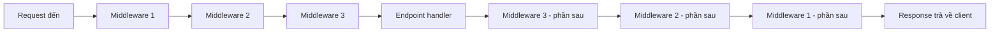

# Middleware Pipeline

!!! info "Bạn đang ở đây"
    cần trước: bạn đã cấu hình app qua `builder.Configuration`/`IOptions` (chương config) và biết chạy một endpoint tối thiểu.
    mở khoá: sau chương này bạn hiểu vì sao thứ tự dòng lệnh trong `Program.cs` quyết định hành vi thật của request — nền tảng để đọc đúng mọi pipeline ASP.NET Core, kể cả pipeline có auth/logging/exception handling phức tạp sau này.

> Mục tiêu (đo được): sau chương này bạn **viết** được middleware tuỳ chỉnh bằng `app.Use`, **giải thích** được vì sao thứ tự đăng ký middleware quyết định thứ tự thực thi, và **áp dụng** đúng vị trí của `UseRouting`, `UseAuthorization`, `UseStaticFiles` trong pipeline.

---

## 0. Đoán nhanh trước khi học

Bạn có đoạn code sau trong `Program.cs`:

```csharp title="Program.cs (rút gọn, chỉ để suy luận)"
// test:skip đoạn trích rút gọn chỉ để suy luận, không phải chương trình đầy đủ
app.Use(async (context, next) =>
{
    Console.WriteLine("A - trước");
    await next();
    Console.WriteLine("A - sau");
});

app.Use(async (context, next) =>
{
    Console.WriteLine("B - trước");
    await next();
    Console.WriteLine("B - sau");
});

app.MapGet("/", () => "Xin chao");
```

Khi gọi `GET /`, console sẽ in ra theo thứ tự nào: `A-trước, B-trước, B-sau, A-sau` hay `A-trước, A-sau, B-trước, B-sau`?

??? note "Đáp án"
    Thứ tự đúng là **`A-trước, B-trước, B-sau, A-sau`** — giống cấu trúc lồng nhau (nested), không phải tuần tự. Middleware đăng ký trước bọc middleware đăng ký sau. Chương này giải thích chính xác vì sao.

---

## 1. Middleware là gì

**Định nghĩa (một câu):** Middleware là một đoạn code nhỏ được xếp thành một **dây chuyền** (pipeline) — mỗi request HTTP đi qua từng khâu theo thứ tự, mỗi khâu có quyền xử lý, sửa, ghi log, hoặc chặn request/response trước khi giao cho khâu kế tiếp.

Hình dung request đi qua pipeline như một đường ống có nhiều trạm kiểm soát:



Mỗi middleware nhận vào hai thứ: `HttpContext` (chứa request/response hiện tại) và `next` — một hàm đại diện cho **khâu kế tiếp trong dây chuyền**. Middleware quyết định:

- Làm gì đó **trước** khi gọi `next()` (ví dụ: ghi log thời điểm bắt đầu).
- Gọi `await next()` để giao cho khâu kế tiếp xử lý.
- Làm gì đó **sau** khi `next()` đã chạy xong và trả kết quả về (ví dụ: đo thời gian xử lý, ghi log status code).

Ví dụ tối thiểu, độc lập, chỉ minh hoạ đúng khái niệm "middleware là một khâu trong dây chuyền" bằng cách mô phỏng thuần C# (không cần ASP.NET Core), để thấy rõ cơ chế lồng nhau trước khi nhìn API thật:

```csharp title="Program.cs"
// test:run
// Mô phỏng một "pipeline" tối giản bằng delegate, giống ý tưởng middleware ASP.NET Core.
using System;
using System.Threading.Tasks;

Func<Task> handler = () =>
{
    Console.WriteLine("Xu ly endpoint");
    return Task.CompletedTask;
};

// Mỗi middleware "bọc" middleware/handler kế tiếp.
Func<Task> withLoggingB = async () =>
{
    Console.WriteLine("B - truoc");
    await handler();
    Console.WriteLine("B - sau");
};

Func<Task> withLoggingA = async () =>
{
    Console.WriteLine("A - truoc");
    await withLoggingB();
    Console.WriteLine("A - sau");
};

await withLoggingA();
```

Output kỳ vọng:

```text title="Kết quả"
A - truoc
B - truoc
Xu ly endpoint
B - sau
A - sau
```

Đây chính xác là cơ chế middleware thật trong ASP.NET Core: mỗi middleware bọc middleware kế tiếp, tạo thành các lớp lồng nhau như búp bê Nga (matryoshka), không phải một hàng đợi tuần tự.

**Nếu dùng sai:** quên gọi `next()` bên trong một middleware nghĩa là pipeline **dừng lại tại đó** — mọi middleware và endpoint phía sau **không bao giờ chạy**, client có thể nhận response rỗng (status 200 với body trống) hoặc treo nếu không middleware nào ghi response. Đây không phải lỗi biên dịch (CS) — là lỗi hành vi runtime, rất khó phát hiện vì ứng dụng vẫn "chạy được", chỉ là im lặng bỏ qua phần còn lại. Mục 4 sẽ dùng chính hành vi này một cách có chủ đích (short-circuit).

---

## 2. `app.Use`: viết middleware tuỳ chỉnh

**Định nghĩa (một câu):** `app.Use(...)` đăng ký một middleware inline — một lambda nhận `(HttpContext context, Func<Task> next)` — được chèn vào pipeline tại đúng vị trí dòng code đó xuất hiện trong `Program.cs`.

Ví dụ tối thiểu, độc lập, minh hoạ đúng một khái niệm: middleware đo thời gian xử lý một request thật.

```csharp title="Program.cs"
// test:compile middleware đo thời gian request bằng app.Use
using System.Diagnostics;

var builder = WebApplication.CreateBuilder(args);
var app = builder.Build();

app.Use(async (context, next) =>
{
    var stopwatch = Stopwatch.StartNew();

    await next(); // giao cho middleware/endpoint kế tiếp xử lý

    stopwatch.Stop();
    context.Response.Headers["X-Response-Time-Ms"] =
        stopwatch.ElapsedMilliseconds.ToString();
});

app.MapGet("/", () => "Xin chao");

app.Run();
```

Giải thích từng dòng:

- `Stopwatch.StartNew()` chạy **trước** `next()` — đây là phần "trước" của middleware.
- `await next()` giao quyền xử lý cho middleware kế tiếp (ở đây không có middleware nào khác nên đi thẳng tới endpoint `MapGet`).
- Sau khi `next()` trả về (nghĩa là toàn bộ phần còn lại của pipeline đã xử lý xong response), dòng `context.Response.Headers[...]` chạy — đây là phần "sau".

**Nếu dùng sai — lỗi runtime cụ thể:** nếu bạn đặt dòng `context.Response.Headers[...]` (sửa header) **sau khi response đã bắt đầu gửi** (ví dụ: sau khi một middleware/endpoint phía sau đã gọi `context.Response.WriteAsync(...)` và stream đã flush), ASP.NET Core sẽ ném `InvalidOperationException: Headers are read-only, response has already started.` — vì HTTP header phải được gửi trước phần body, không thể sửa ngược sau khi đã gửi.

---

## 3. Thứ tự đăng ký quyết định thứ tự thực thi

**Định nghĩa (một câu):** Middleware thực thi theo đúng thứ tự bạn gọi `app.Use...` trong code — middleware đăng ký trước luôn chạy phần "trước" của nó trước tiên, và chạy phần "sau" của nó **sau cùng** (last-in-first-out cho nửa sau).

Ví dụ cụ thể: đảo thứ tự hai middleware và quan sát kết quả khác nhau.

**Thứ tự 1 — Logging trước, Timing sau:**

```csharp title="Program.cs"
// test:compile minh hoa thu tu 1: Logging dang ky truoc Timing
var builder = WebApplication.CreateBuilder(args);
var app = builder.Build();

app.Use(async (context, next) =>
{
    Console.WriteLine($"[Logging] Nhan request: {context.Request.Path}");
    await next();
    Console.WriteLine($"[Logging] Da tra response: {context.Response.StatusCode}");
});

app.Use(async (context, next) =>
{
    var start = DateTime.UtcNow;
    await next();
    var elapsed = (DateTime.UtcNow - start).TotalMilliseconds;
    Console.WriteLine($"[Timing] Xu ly mat {elapsed}ms");
});

app.MapGet("/", () => "Xin chao");

app.Run();
```

Khi gọi `GET /`, console in ra:

```text title="Console output"
[Logging] Nhan request: /
[Timing] Xu ly mat 0.4ms
[Logging] Da tra response: 200
```

Lưu ý: dòng `[Logging] Da tra response` biết được `StatusCode` **sau khi** mọi thứ phía sau nó (kể cả Timing và endpoint) đã chạy xong — vì nó nằm ở lớp ngoài cùng.

**Thứ tự 2 — Timing trước, Logging sau (đảo ngược):**

```csharp title="Program.cs"
// test:compile minh hoa thu tu 2: Timing dang ky truoc Logging (dao nguoc)
var builder = WebApplication.CreateBuilder(args);
var app = builder.Build();

app.Use(async (context, next) =>
{
    var start = DateTime.UtcNow;
    await next();
    var elapsed = (DateTime.UtcNow - start).TotalMilliseconds;
    Console.WriteLine($"[Timing] Xu ly mat {elapsed}ms");
});

app.Use(async (context, next) =>
{
    Console.WriteLine($"[Logging] Nhan request: {context.Request.Path}");
    await next();
    Console.WriteLine($"[Logging] Da tra response: {context.Response.StatusCode}");
});

app.MapGet("/", () => "Xin chao");

app.Run();
```

Console lần này in ra thứ tự khác hẳn:

```text title="Console output"
[Timing] (chưa in gì — đang chờ next() chạy xong)
[Logging] Nhan request: /
[Logging] Da tra response: 200
[Timing] Xu ly mat 0.6ms
```

**Điểm mấu chốt:** cùng hai middleware, chỉ đổi thứ tự dòng code, kết quả log khác hẳn — và ý nghĩa cũng khác: ở Thứ tự 2, `Timing` đo luôn cả thời gian `Logging` chạy, còn ở Thứ tự 1 thì không. Trong thực tế, sai thứ tự này là lý do phổ biến khiến `UseExceptionHandler` "không bắt được lỗi" (nếu đặt sau middleware ném exception) hoặc `UseAuthorization` "không chặn được request" (nếu đặt trước `UseRouting`, vì lúc đó chưa biết endpoint nào được match để kiểm tra quyền).

---

## 4. Middleware có sẵn quan trọng

Ba middleware dựng sẵn bạn sẽ dùng trong hầu hết mọi API:

- **`app.UseRouting()`** — quét các endpoint đã `Map...` để **chọn ra** endpoint nào khớp với request hiện tại (dựa trên path, method), rồi lưu kết quả vào `HttpContext`. Cần middleware này **trước** bất kỳ middleware nào cần biết endpoint sắp chạy là gì (ví dụ `UseAuthorization`).
- **`app.UseAuthorization()`** — kiểm tra request có đủ quyền truy cập endpoint đã được `UseRouting` chọn hay không; nếu thiếu quyền, trả `401`/`403` và **short-circuit** (không cho đi tiếp tới endpoint). Phải đặt **sau** `UseRouting` (vì cần biết endpoint là gì để biết endpoint đó yêu cầu quyền gì) và **trước** khi endpoint thực sự thực thi.
- **`app.UseStaticFiles()`** — nếu path khớp với một file tĩnh có sẵn trong thư mục `wwwroot` (ảnh, CSS, JS), middleware này tự trả file đó và **short-circuit** pipeline, không cần chạm tới `UseRouting`/endpoint. Dùng khi ứng dụng cần phục vụ file tĩnh (SPA, ảnh, tài liệu) cạnh các API endpoint.

Ví dụ ghép ba middleware này theo đúng thứ tự thực thi thật:

```csharp title="Program.cs"
// test:compile thu tu chuan: static files -> routing -> authorization -> endpoint
var builder = WebApplication.CreateBuilder(args);
builder.Services.AddAuthorization();
var app = builder.Build();

app.UseStaticFiles();   // phục vụ file tĩnh sớm nhất, tránh tốn chi phí routing/auth cho file ảnh/css
app.UseRouting();       // xác định endpoint nào khớp request
app.UseAuthorization(); // kiểm tra quyền dựa trên endpoint vừa xác định ở trên

app.MapGet("/ho-so", () => "Thong tin ho so")
   .RequireAuthorization();

app.Run();
```

**Nếu đặt sai thứ tự — hành vi runtime cụ thể:** nếu bạn gọi `app.UseAuthorization()` **trước** `app.UseRouting()`, `UseAuthorization` sẽ không biết endpoint nào chuẩn bị chạy (vì `UseRouting` chưa kịp xác định), nên nó **không áp dụng được** `RequireAuthorization()` — request đi qua thẳng, hoặc ASP.NET Core ném lỗi rõ ràng dạng: `InvalidOperationException: Endpoint ... contains authorization metadata, but a middleware... UseAuthorization... did not run`, tuỳ phiên bản. Đây là lỗi bảo mật nghiêm trọng nếu bị bỏ qua âm thầm: endpoint tưởng đã được bảo vệ nhưng thực chất không được kiểm tra quyền.

---

## 5. Short-circuit: dừng pipeline sớm, không gọi `next()`

**Định nghĩa (một câu):** Short-circuit là khi một middleware **chủ động không gọi `next()`**, tự viết response và kết thúc xử lý ngay tại đó — mọi middleware và endpoint phía sau **sẽ không bao giờ chạy** cho request này.

Ví dụ tối thiểu: middleware chặn request nếu thiếu header `X-Api-Key`, trả `401` ngay mà không đi tiếp:

```csharp title="Program.cs"
// test:compile short-circuit: tu chan request khi thieu header, khong goi next()
var builder = WebApplication.CreateBuilder(args);
var app = builder.Build();

app.Use(async (context, next) =>
{
    if (!context.Request.Headers.ContainsKey("X-Api-Key"))
    {
        context.Response.StatusCode = StatusCodes.Status401Unauthorized;
        await context.Response.WriteAsync("Thieu header X-Api-Key");
        return; // KHÔNG gọi next() -> pipeline dừng tại đây, endpoint phía sau không chạy
    }

    await next();
});

app.MapGet("/du-lieu-mat", () => "Day la du lieu bi mat");

app.Run();
```

Khi gọi `GET /du-lieu-mat` **không kèm** header `X-Api-Key`:

```text title="Response"
HTTP/1.1 401 Unauthorized
Xin chao

Thieu header X-Api-Key
```

Endpoint `/du-lieu-mat` **không hề chạy** — dòng `"Day la du lieu bi mat"` không bao giờ được thực thi, vì middleware đã `return` sớm thay vì `await next()`.

**Khi nào dùng short-circuit có chủ đích:** kiểm tra API key/xác thực đơn giản, chặn IP bị cấm, trả cache sẵn có mà không cần chạy lại toàn bộ pipeline, hoặc middleware phục vụ file tĩnh (`UseStaticFiles` tự short-circuit khi khớp file). **Khi nào đó là lỗi:** nếu bạn quên `await next()` trong một middleware mà lẽ ra middleware đó chỉ nên "quan sát" (ví dụ middleware logging không nên short-circuit) — mọi request sẽ bị chặn lại, endpoint không bao giờ được gọi, và bạn nhận response rỗng/status mặc định (200 với body trống) mà không có thông báo lỗi rõ ràng nào, rất khó debug nếu không biết nhìn vào thứ tự pipeline.

---

## Cạm bẫy & thực chiến

- **Quên gọi `next()`:** pipeline dừng im lặng, endpoint phía sau không chạy, response có thể trả về rỗng (200, body trống) mà không có exception nào — rất khó phát hiện nếu không biết middleware là dây chuyền lồng nhau.
- **Đặt `UseAuthorization()` trước `UseRouting()`:** endpoint có `RequireAuthorization()` không được bảo vệ đúng, có thể bị bỏ qua kiểm tra quyền một cách âm thầm hoặc ném `InvalidOperationException` khi khởi động/khi xử lý request tuỳ phiên bản .NET.
- **Sửa header sau khi response đã bắt đầu gửi (`HasStarted == true`):** ném `InvalidOperationException: Headers are read-only, response has already started.` — vì HTTP bắt buộc gửi header trước body, không thể "quay lại" sửa sau khi đã flush.
- **Đặt middleware xử lý lỗi (`UseExceptionHandler`) không phải là middleware đầu tiên:** nó chỉ bắt được exception ném ra từ các middleware **đăng ký sau nó** (vì nó bọc chúng); nếu một middleware đăng ký trước `UseExceptionHandler` ném lỗi, middleware đó không được bọc, exception sẽ không bị bắt.
- **Middleware nặng (đọc DB, gọi API ngoài) đặt sai vị trí:** nếu đặt `UseStaticFiles()` sau `UseRouting()`/`UseAuthorization()`, mọi request tới file tĩnh (ảnh, CSS) cũng phải đi qua routing và authorization một cách không cần thiết, tốn hiệu năng.
- **Nhầm `app.Use` (middleware, có `next`) với `app.Run` (terminal middleware, không có `next`, luôn kết thúc pipeline):** gọi `app.Run(...)` ở giữa pipeline rồi vẫn kỳ vọng middleware phía sau chạy là hiểu sai — `app.Run` không nhận `next`, nó **luôn** là điểm kết thúc.

---

## Bài tập

**Bài 1 (giàn giáo):** Bạn có pipeline sau, nhưng endpoint `/admin` vẫn chạy được dù request không có header `X-Api-Key`. Tìm lỗi thứ tự và sửa.

```csharp title="Program.cs (có lỗi)"
// test:compile bai tap 1 - co loi thu tu, can sua
var builder = WebApplication.CreateBuilder(args);
var app = builder.Build();

app.MapGet("/admin", () => "Khu vuc quan tri");

app.Use(async (context, next) =>
{
    if (!context.Request.Headers.ContainsKey("X-Api-Key"))
    {
        context.Response.StatusCode = StatusCodes.Status401Unauthorized;
        await context.Response.WriteAsync("Thieu API key");
        return;
    }
    await next();
});

app.Run();
```

Gợi ý giàn giáo: middleware kiểm tra API key được đăng ký **sau** `MapGet`. Trong pipeline thật, `MapGet` không phải middleware chạy tuần tự theo dòng code như vậy — nhưng thứ tự đăng ký `app.Use` so với thời điểm gọi `app.Run()` (kết thúc cấu hình) vẫn quan trọng: middleware phải được đăng ký **trước khi endpoint xử lý xong request**, nghĩa là phải đứng trước trong pipeline logic. Hãy di chuyển khối `app.Use` lên trước `app.MapGet`.

??? success "Lời giải + vì sao"
    ```csharp title="Program.cs (đã sửa)"
    // test:compile bai tap 1 - da sua dung thu tu
    var builder = WebApplication.CreateBuilder(args);
    var app = builder.Build();

    app.Use(async (context, next) =>
    {
        if (!context.Request.Headers.ContainsKey("X-Api-Key"))
        {
            context.Response.StatusCode = StatusCodes.Status401Unauthorized;
            await context.Response.WriteAsync("Thieu API key");
            return;
        }
        await next();
    });

    app.MapGet("/admin", () => "Khu vuc quan tri");

    app.Run();
    ```

    **Vì sao:** middleware kiểm tra API key phải được đăng ký **trước** endpoint trong pipeline để nó có cơ hội chặn request trước khi endpoint chạy. Middleware là các lớp lồng nhau theo thứ tự đăng ký — đăng ký sau `MapGet` nghĩa là nó nằm "trong" lớp xử lý endpoint, không còn cơ hội chặn trước khi endpoint thực thi.

**Bài 2 (thiết kế):** Thiết kế một pipeline cho ứng dụng có: phục vụ file tĩnh trong `wwwroot`, ghi log mọi request (path + status code), và một endpoint `GET /so-du` yêu cầu đăng nhập (`RequireAuthorization()`). Viết `Program.cs` với đúng thứ tự middleware và giải thích vì sao chọn thứ tự đó.

??? success "Lời giải + vì sao"
    ```csharp title="Program.cs"
    // test:compile bai tap 2 - thiet ke pipeline day du
    var builder = WebApplication.CreateBuilder(args);
    builder.Services.AddAuthorization();
    var app = builder.Build();

    // 1. Static files trước cùng — request tới ảnh/css không cần tốn chi phí log/routing/auth.
    app.UseStaticFiles();

    // 2. Logging bọc toàn bộ phần còn lại để ghi được status code cuối cùng (sau khi mọi thứ xử lý xong).
    app.Use(async (context, next) =>
    {
        await next();
        Console.WriteLine($"{context.Request.Path} -> {context.Response.StatusCode}");
    });

    // 3. Routing phải trước Authorization để Authorization biết endpoint nào sắp chạy.
    app.UseRouting();
    app.UseAuthorization();

    app.MapGet("/so-du", () => "So du: 1.000.000 VND")
       .RequireAuthorization();

    app.Run();
    ```

    **Vì sao thứ tự này:**

    - `UseStaticFiles` đứng đầu để short-circuit sớm cho file tĩnh, tránh lãng phí các bước sau.
    - Middleware logging đứng trước `UseRouting`/`UseAuthorization` để nó **bọc** toàn bộ phần còn lại — nhờ vậy dòng log chạy **sau cùng** (sau khi status code đã được endpoint hoặc `UseAuthorization` gán xong), ghi được kết quả thật sự.
    - `UseRouting` phải đứng trước `UseAuthorization` vì Authorization cần biết endpoint đã match là gì để kiểm tra `RequireAuthorization()` có được khai báo hay không.

---

## Tự kiểm tra

1. Middleware trong ASP.NET Core thực thi theo cấu trúc nào: tuần tự (hàng đợi) hay lồng nhau (nested)?

    ??? note "Đáp án"
        Lồng nhau — middleware đăng ký trước bọc middleware đăng ký sau, giống các lớp búp bê Nga. Phần "trước `next()`" chạy theo thứ tự đăng ký; phần "sau `next()`" chạy theo thứ tự ngược lại.

2. Điều gì xảy ra nếu một middleware không gọi `await next()`?

    ??? note "Đáp án"
        Pipeline dừng lại tại đó — mọi middleware và endpoint phía sau không chạy. Đây gọi là short-circuit; có thể là chủ đích (chặn request thiếu quyền) hoặc lỗi (quên gọi next()).

3. Vì sao `UseAuthorization()` phải đặt sau `UseRouting()`?

    ??? note "Đáp án"
        Vì `UseAuthorization` cần biết endpoint nào đã được match (do `UseRouting` xác định) để kiểm tra endpoint đó có yêu cầu `RequireAuthorization()` hay không. Đặt trước `UseRouting`, nó không có thông tin endpoint để kiểm tra.

4. Nếu bạn cố sửa `context.Response.Headers` sau khi response đã bắt đầu gửi, chuyện gì xảy ra?

    ??? note "Đáp án"
        Ném `InvalidOperationException: Headers are read-only, response has already started.` — vì HTTP yêu cầu gửi header trước body, không thể sửa ngược sau khi đã flush.

5. `UseStaticFiles()` thường được đặt ở đâu trong pipeline, và vì sao?

    ??? note "Đáp án"
        Thường đặt sớm nhất (trước `UseRouting`). Nếu request khớp một file tĩnh có sẵn, nó trả file ngay và short-circuit, tránh tốn chi phí routing/authorization cho các request chỉ xin file tĩnh.

6. Cho hai middleware A (đăng ký trước) và B (đăng ký sau), cả hai đều log trước và sau `next()`. Thứ tự in ra console là gì?

    ??? note "Đáp án"
        `A-trước, B-trước, [endpoint chạy], B-sau, A-sau`. A bọc B nên phần "sau" của A luôn in cuối cùng.

7. `app.Run(...)` khác `app.Use(...)` ở điểm nào?

    ??? note "Đáp án"
        `app.Run` là terminal middleware — không nhận tham số `next`, luôn kết thúc pipeline tại đó. `app.Use` nhận `next` và có thể chọn gọi hoặc không gọi middleware kế tiếp.

---

??? abstract "DEEP DIVE: `IMiddleware`, `UseMiddleware<T>()`, và exception handling middleware"
    Ngoài `app.Use` với lambda inline, ASP.NET Core cho phép viết middleware dưới dạng **class** khi logic phức tạp hoặc cần dependency injection qua constructor:

    ```csharp title="Program.cs"
    // test:compile middleware dang class voi UseMiddleware<T>
    var builder = WebApplication.CreateBuilder(args);
    var app = builder.Build();

    app.UseMiddleware<RequestTimingMiddleware>();

    app.MapGet("/", () => "Xin chao");

    app.Run();

    sealed class RequestTimingMiddleware(RequestDelegate next)
    {
        public async Task InvokeAsync(HttpContext context)
        {
            var start = DateTime.UtcNow;
            await next(context);
            var elapsed = (DateTime.UtcNow - start).TotalMilliseconds;
            context.Response.Headers["X-Elapsed-Ms"] = elapsed.ToString();
        }
    }
    ```

    Class middleware nhận `RequestDelegate next` qua constructor (được container DI tiêm — xem chương Dependency Injection), và bắt buộc có phương thức `InvokeAsync(HttpContext)` hoặc `Invoke(HttpContext)`. Đây là dạng "chuẩn" khi middleware cần các service khác (ví dụ `ILogger`, `IConfiguration`) thay vì chỉ closure biến cục bộ như lambda.

    **Middleware xử lý lỗi tập trung** (`app.UseExceptionHandler(...)`) là một use-case đặc biệt của nguyên tắc "thứ tự = phạm vi bảo vệ": nó phải là middleware **đầu tiên** trong pipeline (trừ khi có middleware hạ tầng khác cần chạy trước cả exception handler, ví dụ middleware ghi log request thô). Vì middleware bọc theo thứ tự đăng ký, chỉ những middleware đăng ký **sau** `UseExceptionHandler` mới nằm "bên trong" lớp bảo vệ của nó — exception ném ra từ middleware đăng ký trước nó sẽ không được bắt.

    **Pipeline có nhánh theo điều kiện:** `app.MapWhen(...)` và `app.UseWhen(...)` cho phép rẽ nhánh pipeline dựa trên điều kiện của request (ví dụ: chỉ áp dụng một nhóm middleware cho path bắt đầu bằng `/api`), hữu ích khi API và trang tĩnh cần các pipeline xử lý khác nhau trong cùng một ứng dụng.

Tiếp theo -> ef core và dbcontext
