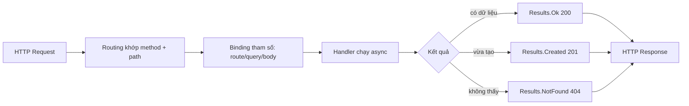

# Minimal API & REST: dựng HTTP endpoint gọn mà đúng chuẩn

!!! info "Bạn đang ở đây · P3 → node `p3-minimal-api`"
    **cần trước:** async/await & task (handler chờ i/o), biết chạy `dotnet run`, hiểu http request/response cơ bản.
    **mở khoá sau bài này:** ef core trong web api, dependency injection cho service, xác thực jwt, validation với fluentvalidation.
    ⏱️ Fast path ~35 phút · Deep dive cuối bài (tuỳ chọn, không bắt buộc).

> **Mục tiêu (đo được):** Sau bài này bạn **áp dụng** được `WebApplication.CreateBuilder` để dựng một Minimal API với đủ `MapGet`/`MapPost`/`MapPut`/`MapDelete`, **chọn** đúng status code REST cho từng tình huống, và **giải thích** vì sao trả `IResult` (qua `Results.Ok`/`NotFound`/`Created`) tốt hơn trả object trần.

---

## 0. Kiểm tra trước (30 giây) — bạn đoán status code nào?

Một client gọi `POST /products` để tạo sản phẩm mới và thành công. Server nên trả status code nào? Còn khi client gọi `GET /products/999` mà id 999 không tồn tại thì sao?

??? question "Đáp án (bấm để mở sau khi đã đoán)"
    - Tạo thành công: **201 Created**, kèm header `Location` trỏ tới tài nguyên vừa tạo. Nhiều người nhầm dùng 200 OK — vẫn "chạy" nhưng không đúng ngữ nghĩa REST.
    - Không tìm thấy: **404 Not Found**. Không phải 200 với body rỗng, cũng không phải 500 (500 chỉ dành cho lỗi phía server).
    - Điểm mấu chốt: status code là **hợp đồng ngữ nghĩa** giữa client và server. Chọn sai làm client xử lý sai.

---

## 1. Ý niệm cốt lõi

**Minimal API** là cách dựng HTTP endpoint trong ASP.NET Core mà không cần class Controller. Bạn viết trực tiếp `app.MapGet("/path", handler)` ngay trong `Program.cs` dạng top-level statement. Ít lễ nghi, khởi động nhanh, hợp cho microservice và API gọn.

**REST** là phong cách thiết kế API dựa trên **tài nguyên (resource)**. Mỗi tài nguyên có một URL (danh từ, **số nhiều**), và HTTP method mô tả hành động lên tài nguyên đó. Kết quả được truyền tải qua **status code** chuẩn.

| HTTP method | Ý nghĩa REST | Ví dụ URL | Status code thành công |
|---|---|---|---|
| `GET` | Đọc/lấy tài nguyên | `/products`, `/products/5` | 200 OK |
| `POST` | Tạo tài nguyên mới | `/products` | 201 Created |
| `PUT` | Thay thế toàn bộ tài nguyên | `/products/5` | 200 OK hoặc 204 No Content |
| `DELETE` | Xoá tài nguyên | `/products/5` | 204 No Content |

Luồng xử lý một request đi qua pipeline như sau:



`Results` là factory tạo ra `IResult` — một đối tượng biết cách tự ghi status code, header và body vào response. Nhờ vậy handler diễn đạt **ý định** (Ok, NotFound, Created) thay vì tự set số status thủ công.

!!! danger "Hiểu lầm phổ biến: URL nên là động từ"
    Sai: `GET /getProducts`, `POST /createProduct`. Đúng: `GET /products`, `POST /products`. HTTP **method** đã là động từ rồi; URL chỉ nên là **danh từ số nhiều** chỉ tài nguyên. Đừng nhồi hành động vào path.

---

## 2. Ví dụ mẫu

Một API CRUD tối giản cho `Product`, lưu tạm trong dictionary in-memory. Vì cần ASP.NET Core (không thuộc BCL) nên khối này `test:skip`.

```csharp title="C#"
// test:skip cần ASP.NET Core (Microsoft.AspNetCore.App)
var builder = WebApplication.CreateBuilder(args);
var app = builder.Build();

var products = new Dictionary<int, Product>
{
    [1] = new(1, "Bàn phím", 450_000)
};
var nextId = 2;

// GET tất cả -> 200 OK
app.MapGet("/products", () => Results.Ok(products.Values));

// GET theo id -> 200 hoặc 404 (route param {id} bind vào int id)
app.MapGet("/products/{id:int}", (int id) =>
    products.TryGetValue(id, out var p)
        ? Results.Ok(p)
        : Results.NotFound());

// POST tạo mới -> 201 Created kèm Location
app.MapPost("/products", (Product input) =>
{
    var created = input with { Id = nextId++ };
    products[created.Id] = created;
    return Results.Created($"/products/{created.Id}", created);
});

// PUT thay thế -> 204 No Content, hoặc 404 nếu chưa có
app.MapPut("/products/{id:int}", (int id, Product input) =>
{
    if (!products.ContainsKey(id)) return Results.NotFound();
    products[id] = input with { Id = id };
    return Results.NoContent();
});

// DELETE -> 204 No Content
app.MapDelete("/products/{id:int}", (int id) =>
    products.Remove(id) ? Results.NoContent() : Results.NotFound());

app.Run();

public record Product(int Id, string Name, decimal Price);
```

Gọi thử bằng `curl` sau khi `dotnet run`:

```text title="Kết quả"
$ curl -s http://localhost:5000/products/1
{"id":1,"name":"Bàn phím","price":450000}

$ curl -s -X POST http://localhost:5000/products \
    -H "Content-Type: application/json" \
    -d '{"name":"Chuột","price":250000}' -i
HTTP/1.1 201 Created
Location: /products/2
{"id":2,"name":"Chuột","price":250000}

$ curl -s http://localhost:5000/products/999 -o /dev/null -w "%{http_code}\n"
404
```

Điểm cần chú ý về **binding tham số**:

- `{id:int}` trong route → tự bind vào tham số `int id` (route constraint `:int` loại bỏ path không phải số).
- Tham số kiểu phức tạp như `Product input` → mặc định bind từ **JSON body**.
- Tham số kiểu đơn giản không khớp route → mặc định bind từ **query string** (ví dụ `?page=2`).

---

## 3. Bài tập có giàn giáo

Thêm endpoint tìm kiếm: `GET /products?minPrice=300000` trả về các product có giá `>= minPrice`. Nếu client không truyền `minPrice` thì trả tất cả. Điền vào chỗ `// TODO`.

```csharp title="C#"
// test:skip cần ASP.NET Core
app.MapGet("/products", (decimal? minPrice) =>
{
    // TODO 1: nếu minPrice có giá trị thì lọc, ngược lại lấy tất cả
    // TODO 2: luôn trả 200 OK với danh sách kết quả
});
```

??? success "Lời giải + giải thích"
    ```csharp title="C#"
    // test:skip cần ASP.NET Core
    app.MapGet("/products", (decimal? minPrice) =>
    {
        var result = minPrice is decimal min
            ? products.Values.Where(p => p.Price >= min)
            : products.Values;
        return Results.Ok(result);
    });
    ```

    - `decimal? minPrice`: kiểu **nullable** + không khớp route param nên ASP.NET bind từ **query string**. Không truyền → `null` → trả tất cả.
    - Dùng `is decimal min` để vừa kiểm tra có giá trị vừa lấy giá trị ra biến `min` trong một bước.
    - Trả `Results.Ok` (200) kể cả khi danh sách rỗng: "không tìm thấy kết quả nào khớp filter" **vẫn là truy vấn thành công** — khác với `GET /products/{id}` không thấy tài nguyên (404).

---

## 4. Cạm bẫy thường gặp

!!! warning "Những lỗi hay mắc"
    - **Trả object trần thay vì `IResult`:** `app.MapGet("/x", () => product)` luôn ra 200, bạn mất khả năng trả 404/201. Hãy trả `Results.*`.
    - **Dùng 200 cho mọi thứ:** POST tạo mới phải là 201, DELETE thành công nên 204. Client (và cache/proxy) dựa vào status code.
    - **PUT vs POST:** `PUT /products/5` là **thay thế** tài nguyên đã biết id → idempotent (gọi nhiều lần cùng kết quả). `POST /products` là **tạo mới** → không idempotent.
    - **Quên `Content-Type: application/json`** khi POST body → binding thất bại, thường ra 415 Unsupported Media Type.
    - **Handler chặn thread:** trong handler nên `await` mọi call I/O (DB, HTTP) thay vì `.Result` — xem lại bài async/await.

---

## Tự kiểm tra

1. `POST /orders` tạo đơn hàng thành công thì trả status code nào và kèm header gì?
2. Trong `app.MapGet("/users/{id:int}", (int id) => ...)`, tham số `id` được bind từ đâu?
3. Vì sao nên trả `Results.NotFound()` thay vì trả object rỗng với status 200?
4. URL `POST /createUser` vi phạm nguyên tắc REST nào?
5. Sự khác biệt về ngữ nghĩa giữa `PUT /products/5` và `POST /products`?

??? note "Đáp án"
    1. **201 Created**, kèm header **`Location`** trỏ tới URL của tài nguyên vừa tạo (dùng `Results.Created(uri, value)`).
    2. Từ **route** — đoạn `{id:int}` trong path, với constraint `:int` chỉ khớp giá trị số.
    3. Vì status code là hợp đồng ngữ nghĩa: 404 nói rõ "không có tài nguyên", còn 200 + body rỗng khiến client tưởng thành công và xử lý sai; trả `IResult` giữ đúng ngữ nghĩa.
    4. URL phải là **danh từ (số nhiều)** chỉ tài nguyên, không nhét động từ; hành động đã do HTTP method (`POST`) diễn đạt. Đúng phải là `POST /users`.
    5. `PUT /products/5` **thay thế** tài nguyên đã biết id, **idempotent** (gọi lại cho cùng kết quả); `POST /products` **tạo mới** tài nguyên, **không idempotent** (mỗi lần gọi tạo thêm một bản ghi).

---

??? abstract "DEEP DIVE — Route groups, TypedResults và OpenAPI"
    **Route groups** giúp gom prefix chung, tránh lặp lại `/products` ở mỗi endpoint:

    ```csharp title="C#"
    // test:skip cần ASP.NET Core
    var group = app.MapGroup("/products");
    group.MapGet("/", () => Results.Ok(products.Values));
    group.MapGet("/{id:int}", (int id) => /* ... */ Results.NotFound());
    ```

    **`TypedResults` vs `Results`:** `TypedResults.Ok(x)` trả kiểu cụ thể `Ok<T>` thay vì `IResult` mờ. Lợi ích: dễ unit test (kiểm tra kiểu trả về trực tiếp) và cung cấp metadata cho OpenAPI sinh tài liệu chính xác hơn.

    ```csharp title="C#"
    // test:skip cần ASP.NET Core
    app.MapGet("/products/{id:int}", Results<Ok<Product>, NotFound> (int id) =>
        products.TryGetValue(id, out var p)
            ? TypedResults.Ok(p)
            : TypedResults.NotFound());
    ```

    **OpenAPI/Swagger:** gọi `builder.Services.AddOpenApi()` và `app.MapOpenApi()` để tự sinh mô tả API máy-đọc-được — nền tảng cho tài liệu tương tác và sinh client SDK.

    **Idempotency và caching:** GET/PUT/DELETE idempotent nên proxy và client có thể retry an toàn khi mạng lỗi; POST thì không, nên retry mù có thể tạo trùng đơn — đây là lý do các cổng thanh toán yêu cầu `Idempotency-Key` cho POST.

    **PATCH:** với cập nhật **một phần** (chỉ đổi vài field) chuẩn REST dùng `PATCH` thay vì `PUT`; ASP.NET Core hỗ trợ qua `MapPatch`.

Tiếp theo -> ef core trong web api
