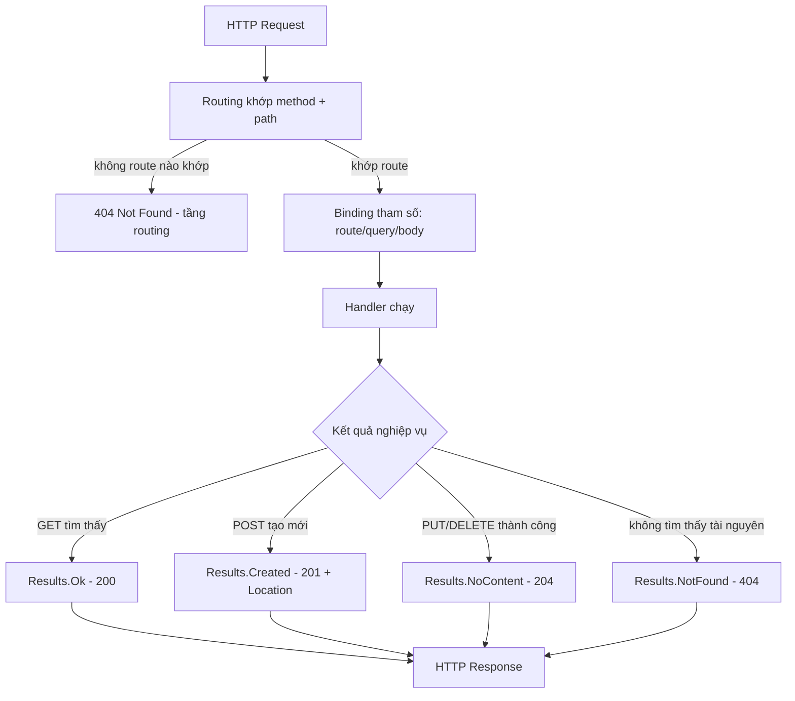

# Minimal API & REST: dựng HTTP endpoint gọn mà đúng chuẩn

!!! info "bạn đang ở đây"
    cần trước: ef core (dbcontext, dbset, truy vấn linq, savechanges) — biết đọc/ghi dữ liệu bằng c#, biết chạy `dotnet run`.
    mở khoá: dựng một web api thật bằng minimal api trong asp.net core — nhận request http, đọc/ghi dữ liệu, trả đúng status code — trước khi sang dependency injection, validation và jwt.

> **Mục tiêu (đo được):** Sau chương này bạn có thể **giải thích** REST là gì (tài nguyên, URL danh từ số nhiều, HTTP method là hành động), **áp dụng** `WebApplication.CreateBuilder`/`Build`/`Run` để khởi động một ứng dụng ASP.NET Core, **viết** đủ bốn verb `MapGet`/`MapPost`/`MapPut`/`MapDelete` cho một tài nguyên, **chọn** đúng status code REST cho từng tình huống (200/201 kèm `Location`/204/404), và **so sánh** được vì sao trả `IResult` qua `Results.Ok`/`NotFound`/`Created`/`NoContent` tốt hơn trả object trần.

---

## 0. Đoán nhanh (30 giây)

Một client gọi `POST /products` để tạo sản phẩm mới và thành công. Server nên trả status code nào, và có cần thêm header gì không? Còn khi client gọi `DELETE /products/5` và xoá thành công thì response có nên chứa body không?

??? question "Đáp án (bấm để mở sau khi đã đoán)"
    - Tạo thành công: **201 Created**, kèm header `Location` trỏ tới URL của tài nguyên vừa tạo (ví dụ `Location: /products/42`). Nhiều người mới học nhầm dùng 200 OK — request vẫn "chạy đúng" nhưng sai ngữ nghĩa REST, và client mất thông tin URL tài nguyên mới.
    - Xoá thành công: **204 No Content** — không có body, vì không còn gì để trả về (tài nguyên đã biến mất). Trả 200 kèm body rỗng vẫn "chạy" nhưng thừa và sai quy ước.
    - Điểm mấu chốt của cả chương này: status code không phải chi tiết vụn vặt — nó là **hợp đồng ngữ nghĩa** giữa server và client. Client (và các tool tự động: cache, proxy, thư viện HTTP) dựa vào đúng con số đó để quyết định hành vi tiếp theo.

---

## 1. REST là gì

**Định nghĩa:** REST (REpresentational State Transfer) là một **phong cách thiết kế API** trong đó mọi thứ ứng dụng quản lý được coi là một **tài nguyên (resource)** — mỗi tài nguyên có một **URL** riêng (viết bằng **danh từ**, thường ở **số nhiều**), và **HTTP method** (GET/POST/PUT/DELETE...) diễn tả **hành động** muốn thực hiện lên tài nguyên đó.

Ba thành phần cốt lõi của một lời gọi REST:

| Thành phần | Vai trò | Ví dụ |
|---|---|---|
| Tài nguyên (resource) | "Danh từ" — thứ được quản lý | sản phẩm, đơn hàng, khách hàng |
| URL | Địa chỉ của tài nguyên (hoặc tập tài nguyên) | `/products`, `/products/5` |
| HTTP method | "Động từ" — hành động lên tài nguyên | `GET`, `POST`, `PUT`, `DELETE` |

Ví dụ tối thiểu — không có code nào ở đây cả, chỉ là bảng ánh xạ ý niệm, vì REST trước hết là một **quy ước đặt tên và chọn method**, không phải một API cụ thể của .NET:

| Việc cần làm | URL (danh từ số nhiều) | HTTP method |
|---|---|---|
| Lấy danh sách sản phẩm | `/products` | `GET` |
| Lấy một sản phẩm theo id | `/products/5` | `GET` |
| Tạo sản phẩm mới | `/products` | `POST` |
| Thay thế toàn bộ sản phẩm id=5 | `/products/5` | `PUT` |
| Xoá sản phẩm id=5 | `/products/5` | `DELETE` |

**Dùng sai — nhồi động từ vào URL:** đây không phải lỗi biên dịch hay lỗi runtime (server vẫn chạy bình thường nếu bạn tự định nghĩa route như vậy), mà là lỗi **thiết kế** vi phạm quy ước REST mà đồng đội và các công cụ (Swagger, API gateway, client SDK sinh tự động) đều mong đợi:

```text title="Vi phạm quy ước REST"
Sai:  GET  /getProducts
      POST /createProduct
      POST /deleteProduct?id=5

Đúng: GET    /products
      POST   /products
      DELETE /products/5
```

HTTP method **đã là động từ rồi** (`GET` = lấy, `POST` = tạo, `DELETE` = xoá); nhồi thêm động từ vào URL (`getProducts`, `createProduct`) là lặp lại thông tin và phá vỡ tính đoán-được của API — người khác nhìn `GET /getProducts` không biết ngay đây có phải REST hay một RPC tuỳ ý.

!!! danger "Hiểu lầm phổ biến: REST = trả JSON"
    Trả dữ liệu dạng JSON **không** làm một API thành REST. REST là về cách bạn **đặt tên tài nguyên** và **chọn HTTP method/status code** đúng ngữ nghĩa. Một API trả JSON nhưng dùng toàn `POST` cho mọi hành động (kể cả đọc, xoá) và luôn trả `200 OK` bất kể thành công hay lỗi thì **không phải REST** — nó chỉ là "API dùng JSON qua HTTP", một kiểu thiết kế khác gọi là RPC-over-HTTP.

---

## 2. `WebApplication.CreateBuilder`: điểm khởi đầu của một ứng dụng ASP.NET Core

**Định nghĩa:** `WebApplication.CreateBuilder(args)` là một phương thức tĩnh trả về một `WebApplicationBuilder` — một đối tượng dùng để **cấu hình** ứng dụng trước khi nó thật sự chạy: đăng ký service vào dependency injection container, đọc cấu hình (`appsettings.json`, biến môi trường, tham số dòng lệnh), và thiết lập logging.

Ví dụ tối thiểu — chỉ tạo builder, chưa đăng ký service nào, chưa có endpoint nào:

```csharp title="Program.cs"
// test:compile ví dụ tối thiểu chỉ tạo builder, minh hoạ CreateBuilder độc lập
var builder = WebApplication.CreateBuilder(args);

Console.WriteLine($"Environment: {builder.Environment.EnvironmentName}");
```

`args` ở đây chính là mảng tham số dòng lệnh của `Main` (ASP.NET Core dùng top-level statements nên `args` có sẵn ngầm định trong `Program.cs`). `builder.Environment.EnvironmentName` cho biết ứng dụng đang chạy ở môi trường nào (`Development`, `Production`...) — thông tin này `CreateBuilder` tự đọc từ biến môi trường `ASPNETCORE_ENVIRONMENT`.

**Dùng sai:** gọi các phương thức chỉ tồn tại trên ứng dụng đã build xong (ví dụ `MapGet`) trực tiếp trên `builder` — đây là lỗi biên dịch vì `WebApplicationBuilder` không có các phương thức định tuyến đó, chỉ `WebApplication` (kết quả của `Build()`, xem mục 3) mới có.

```text title="Lỗi biên dịch minh hoạ"
var builder = WebApplication.CreateBuilder(args);
builder.MapGet("/ping", () => "pong");
// CS1061: 'WebApplicationBuilder' does not contain a definition for 'MapGet'
// and no accessible extension method 'MapGet' accepting a first argument
// of type 'WebApplicationBuilder' could be found
```

`WebApplicationBuilder` và `WebApplication` là **hai kiểu khác nhau** với hai vai trò khác nhau: builder dùng để **cấu hình trước khi chạy** (đăng ký service), còn `WebApplication` (sau khi gọi `Build()`) dùng để **định tuyến và chạy**. Trộn lẫn hai giai đoạn này là lỗi CS1061 vì trình biên dịch không tìm thấy `MapGet` trên kiểu `WebApplicationBuilder`.

---

## 3. `Build()` và `Run()`: dựng và khởi động ứng dụng

**Định nghĩa:** `builder.Build()` là phương thức "chốt" toàn bộ cấu hình đã thiết lập trên builder và trả về một đối tượng `WebApplication` — đây là ứng dụng thật sự, dùng để định nghĩa route (`MapGet`...) và middleware. `app.Run()` là phương thức khởi động vòng lặp lắng nghe HTTP request; nó **chặn (blocking)** — chương trình đứng ở dòng này mãi cho tới khi ứng dụng bị tắt (Ctrl+C, hoặc host yêu cầu dừng).

Ví dụ tối thiểu — vòng đời đầy đủ nhỏ nhất của một ứng dụng ASP.NET Core, chỉ với một endpoint:

```csharp title="Program.cs"
// test:compile chuỗi CreateBuilder -> Build -> Run tối thiểu với một endpoint
var builder = WebApplication.CreateBuilder(args);
var app = builder.Build();

app.MapGet("/ping", () => "pong");

app.Run();
```

Ba dòng lệnh này tương ứng ba giai đoạn tách biệt: `CreateBuilder` (chuẩn bị cấu hình) → `Build` (chốt cấu hình, sinh ra ứng dụng có thể định tuyến) → `Run` (bắt đầu lắng nghe, chặn thread chính). `MapGet` phải nằm **giữa** `Build()` và `Run()` — sau khi có `app` nhưng trước khi bắt đầu chạy.

**Dùng sai:** gọi `app.Run()` rồi mới `MapGet` phía sau — về mặt biên dịch vẫn hợp lệ (không có lỗi CS nào), nhưng dòng `MapGet` đó **không bao giờ được thực thi**, vì `Run()` chặn (blocking) mãi mãi cho tới khi ứng dụng tắt.

```csharp title="Program.cs"
// test:compile minh hoạ lỗi logic: code sau Run() không bao giờ chạy tới
var builder = WebApplication.CreateBuilder(args);
var app = builder.Build();

app.Run();                                   // chặn vĩnh viễn tại đây
app.MapGet("/ping", () => "pong");           // KHÔNG BAO GIỜ được thực thi
```

Không có exception, không có cảnh báo biên dịch — chương trình chạy, ứng dụng lắng nghe HTTP bình thường, nhưng route `/ping` sẽ luôn trả `404 Not Found` vì dòng đăng ký nó nằm sau lệnh chặn vĩnh viễn. Đây là lỗi im lặng dễ gặp khi copy-paste code không để ý thứ tự.

---

## 4. `MapGet`: đọc tài nguyên

**Định nghĩa:** `MapGet(pattern, handler)` là một phương thức trên `WebApplication` đăng ký một **route** khớp với HTTP method `GET` và đường dẫn `pattern`; khi có request khớp, `handler` (một delegate, thường là lambda) được gọi để xử lý và trả về kết quả.

Ví dụ tối thiểu — lấy toàn bộ danh sách sản phẩm từ một `List<Product>` giữ tạm trong bộ nhớ:

```csharp title="Program.cs"
// test:compile MapGet lấy toàn bộ danh sách, không route param
var builder = WebApplication.CreateBuilder(args);
var app = builder.Build();

var products = new List<Product>
{
    new(1, "Bàn phím", 450_000),
    new(2, "Chuột", 250_000)
};

app.MapGet("/products", () => products);

app.Run();

public record Product(int Id, string Name, decimal Price);
```

Gọi `curl http://localhost:5000/products` sau khi `dotnet run` sẽ trả về JSON của toàn bộ danh sách — ASP.NET Core tự động serialize giá trị trả về của handler sang JSON nếu đó không phải kiểu chuỗi hay `IResult`.

**Dùng sai:** viết route pattern có khoảng trắng thừa hoặc sai dấu `/` khiến route không bao giờ khớp — đây không phải lỗi biên dịch (chuỗi vẫn hợp lệ) mà là lỗi **runtime**: request luôn trả `404 Not Found` dù handler hoàn toàn đúng.

```text title="Kết quả"
$ curl -i http://localhost:5000/products
HTTP/1.1 404 Not Found
```

Nếu route được đăng ký là `"/ Products"` (có khoảng trắng, sai hoa/thường không phải vấn đề vì routing mặc định không phân biệt hoa thường, nhưng khoảng trắng thì có) trong khi client gọi `/products`, ASP.NET Core coi đây là hai path khác nhau hoàn toàn — không có cảnh báo nào lúc build hay chạy, endpoint chỉ đơn giản "không tồn tại" theo góc nhìn của client.

### 4.1 `MapGet` với route parameter — lấy một tài nguyên theo id

**Định nghĩa:** route parameter là một đoạn trong URL pattern được bọc trong dấu ngoặc nhọn (ví dụ `{id}`), đại diện cho một giá trị **thay đổi theo từng request**; ASP.NET Core tự động **bind** (gán) giá trị đó vào tham số cùng tên trong handler.

Ví dụ tối thiểu — lấy một sản phẩm theo `id`, có thể tìm thấy hoặc không:

```csharp title="Program.cs"
// test:compile MapGet với route parameter {id:int} và constraint
var builder = WebApplication.CreateBuilder(args);
var app = builder.Build();

var products = new List<Product> { new(1, "Bàn phím", 450_000) };

app.MapGet("/products/{id:int}", (int id) =>
{
    var found = products.FirstOrDefault(p => p.Id == id);
    return found is not null ? Results.Ok(found) : Results.NotFound();
});

app.Run();

public record Product(int Id, string Name, decimal Price);
```

`{id:int}` có hai phần: `id` là tên tham số (phải khớp tên tham số `int id` trong lambda), `:int` là **route constraint** — chỉ khớp khi đoạn đó thật sự là một số nguyên; nếu client gọi `/products/abc`, route này không khớp và ASP.NET Core trả `404` ngay ở tầng routing (chưa vào tới handler).

**Dùng sai:** đặt tên tham số route và tham số handler không khớp nhau — lỗi này ASP.NET Core phát hiện lúc **runtime** khi khởi động (không phải lỗi biên dịch C#, vì cú pháp hoàn toàn hợp lệ):

```text title="Lỗi runtime khi khởi động"
app.MapGet("/products/{productId:int}", (int id) => ...);
// System.InvalidOperationException: 'id' cần một giá trị khớp với route parameter,
// nhưng route pattern chỉ có 'productId'. Không tìm thấy nguồn để bind tham số 'id'.
```

Vì route pattern khai báo tham số tên `productId` nhưng handler lại khai báo tham số tên `id` — ASP.NET Core không tự đoán được hai tên khác nhau là "cùng một thứ", nên khi cố bind, nó không tìm thấy nguồn dữ liệu hợp lệ cho `id` và ném `InvalidOperationException` ngay khi ứng dụng khởi động (validate route xảy ra sớm, trước khi nhận request đầu tiên).

---

## 5. `MapPost`: tạo tài nguyên mới

**Định nghĩa:** `MapPost(pattern, handler)` đăng ký một route khớp HTTP method `POST` — theo quy ước REST, `POST` dùng để **tạo mới** một tài nguyên; dữ liệu của tài nguyên mới thường được gửi trong **request body** (thường là JSON).

Ví dụ tối thiểu — tạo sản phẩm mới, nhận dữ liệu qua tham số kiểu `Product` (ASP.NET Core tự bind từ JSON body):

```csharp title="Program.cs"
// test:compile MapPost tạo mới, bind tham số phức tạp từ JSON body
var builder = WebApplication.CreateBuilder(args);
var app = builder.Build();

var products = new List<Product>();
var nextId = 1;

app.MapPost("/products", (Product input) =>
{
    var created = input with { Id = nextId++ };
    products.Add(created);
    return Results.Created($"/products/{created.Id}", created);
});

app.Run();

public record Product(int Id, string Name, decimal Price);
```

Gọi thử bằng `curl`:

```text title="Kết quả"
$ curl -s -X POST http://localhost:5000/products \
    -H "Content-Type: application/json" \
    -d '{"id":0,"name":"Chuột","price":250000}' -i
HTTP/1.1 201 Created
Location: /products/1
Content-Type: application/json

{"id":1,"name":"Chuột","price":250000}
```

Điểm mấu chốt về binding: tham số `Product input` là một **kiểu phức tạp** (record với nhiều thuộc tính) — khi tham số không khớp route và không phải kiểu đơn giản (số, chuỗi...), ASP.NET Core **mặc định bind từ JSON body**. Đây khác với route param (mục 4.1) hay query string (sẽ gặp ở chương sau) — không cần khai báo gì thêm, quy ước tự áp dụng dựa trên kiểu tham số.

**Dùng sai:** quên header `Content-Type: application/json` khi gửi body — đây là lỗi **runtime** (415), không phải lỗi biên dịch C#:

```text title="Kết quả"
$ curl -s -X POST http://localhost:5000/products \
    -d '{"id":0,"name":"Chuột","price":250000}' -i
HTTP/1.1 415 Unsupported Media Type
```

ASP.NET Core cần biết định dạng của body để chọn đúng bộ deserializer; không có `Content-Type: application/json`, framework không dám giả định đó là JSON (có thể là form data, text thuần...) nên từ chối ngay với `415` trước khi handler kịp chạy — đây là hành vi an toàn mặc định, không phải lỗi cấu hình.

---

## 6. `MapPut`: thay thế toàn bộ tài nguyên

**Định nghĩa:** `MapPut(pattern, handler)` đăng ký route khớp HTTP method `PUT` — theo quy ước REST, `PUT` dùng để **thay thế toàn bộ** một tài nguyên đã biết trước `id`; khác với `POST` (tạo mới, server tự sinh id), `PUT` yêu cầu client chỉ định chính xác tài nguyên nào bị thay thế qua route.

Ví dụ tối thiểu — thay thế toàn bộ sản phẩm theo id, trả `404` nếu chưa tồn tại:

```csharp title="Program.cs"
// test:compile MapPut thay thế toàn bộ tài nguyên theo id, kèm nhánh không tìm thấy
var builder = WebApplication.CreateBuilder(args);
var app = builder.Build();

var products = new List<Product> { new(1, "Bàn phím", 450_000) };

app.MapPut("/products/{id:int}", (int id, Product input) =>
{
    var index = products.FindIndex(p => p.Id == id);
    if (index == -1)
    {
        return Results.NotFound();
    }

    products[index] = input with { Id = id };
    return Results.NoContent();
});

app.Run();

public record Product(int Id, string Name, decimal Price);
```

Handler nhận **hai** tham số cùng lúc: `int id` bind từ route (`{id:int}`), `Product input` bind từ JSON body — ASP.NET Core tự phân loại nguồn bind cho từng tham số dựa trên kiểu và tên, không cần bạn khai báo tường minh trong trường hợp đơn giản này.

**Dùng sai:** dùng `PUT` để cập nhật **một phần** tài nguyên (ví dụ chỉ đổi `price`, các trường khác giữ nguyên) nhưng client chỉ gửi trường đó trong body — đây là lỗi **thiết kế/logic**, không phải lỗi biên dịch:

```text title="Kết quả sai ý định"
$ curl -X PUT http://localhost:5000/products/1 \
    -H "Content-Type: application/json" \
    -d '{"price":500000}' -i
HTTP/1.1 204 No Content

$ curl http://localhost:5000/products/1
{"id":1,"name":"","price":500000}
```

Vì `PUT` theo đúng ngữ nghĩa REST là **thay thế toàn bộ**, handler ở trên gán `products[index] = input with { Id = id }` — nếu body JSON không có trường `name`, record `Product` sẽ dùng giá trị mặc định của kiểu đó (chuỗi rỗng cho `string`), **xoá mất** dữ liệu cũ của `name` dù client không hề có ý định đó. Đây chính là lý do REST có method riêng cho cập nhật một phần: `PATCH` (nhắc ở phần DEEP DIVE cuối chương) — dùng sai `PUT` cho ý định "sửa một phần" là cạm bẫy thực chiến rất phổ biến.

---

## 7. `MapDelete`: xoá tài nguyên

**Định nghĩa:** `MapDelete(pattern, handler)` đăng ký route khớp HTTP method `DELETE` — dùng để **xoá** tài nguyên đã biết `id`; theo quy ước REST, xoá thành công không cần trả về dữ liệu gì (không còn tài nguyên để trả).

Ví dụ tối thiểu — xoá sản phẩm theo id:

```csharp title="Program.cs"
// test:compile MapDelete xoá theo id, kèm nhánh không tìm thấy
var builder = WebApplication.CreateBuilder(args);
var app = builder.Build();

var products = new List<Product> { new(1, "Bàn phím", 450_000) };

app.MapDelete("/products/{id:int}", (int id) =>
{
    var removed = products.RemoveAll(p => p.Id == id);
    return removed > 0 ? Results.NoContent() : Results.NotFound();
});

app.Run();

public record Product(int Id, string Name, decimal Price);
```

`RemoveAll` trả về **số phần tử đã xoá** (kiểu `int`); nếu `id` không tồn tại, không có phần tử nào bị xoá nên trả về `0`, và ta dùng con số đó để quyết định `204` (đã xoá) hay `404` (không có gì để xoá) — không cần tìm rồi xoá riêng hai bước.

**Dùng sai:** gọi `DELETE` hai lần liên tiếp cho cùng một `id` và mong cả hai lần đều trả `204` — lần thứ hai, tài nguyên đã không còn nên phải trả `404`, đây **không phải lỗi** mà là hành vi đúng, nhưng người mới thường nhầm tưởng `DELETE` phải luôn "thành công":

```text title="Kết quả"
$ curl -i -X DELETE http://localhost:5000/products/1
HTTP/1.1 204 No Content

$ curl -i -X DELETE http://localhost:5000/products/1
HTTP/1.1 404 Not Found
```

Về mặt kỹ thuật REST, `DELETE` được coi là **idempotent** theo nghĩa: gọi lặp lại nhiều lần thì **trạng thái cuối cùng của tài nguyên** giống nhau (nó luôn ở trạng thái "không tồn tại" sau lần xoá đầu tiên) — nhưng điều đó **không có nghĩa** là status code trả về phải giống nhau ở mọi lần gọi. Lần đầu server thật sự xoá (204), lần sau không còn gì để xoá (404 hợp lý và phổ biến trong thực hành, dù một số API chọn trả 204 cả hai lần tuỳ chính sách thiết kế).

---

## 8. Status code chuẩn: 200/201/204/404

Bốn verb (`MapGet`/`MapPost`/`MapPut`/`MapDelete`) và cách bind tham số đã được giới thiệu riêng lẻ ở mục 4-7. Trước khi tổng hợp thành bảng, cần làm rõ **từng** status code đã xuất hiện — vì mỗi mã số mang một ý nghĩa REST cụ thể, không phải con số tuỳ ý.

### 8.1 `200 OK`

**Định nghĩa:** `200 OK` nghĩa là request đã được xử lý **thành công** và response chứa dữ liệu kết quả trong body — đây là status code mặc định, ngầm định cho các thao tác đọc thành công (`GET`).

```csharp title="Program.cs"
// test:compile 200 OK ngầm định khi trả object trực tiếp từ GET
var builder = WebApplication.CreateBuilder(args);
var app = builder.Build();

app.MapGet("/health", () => new { status = "ok" });

app.Run();
```

Không cần gọi `Results.Ok(...)` tường minh — nếu handler `MapGet` trả về một object thường (không phải `IResult`), ASP.NET Core tự đặt status `200` và serialize object đó thành JSON body.

**Dùng sai:** trả `200 OK` cho cả trường hợp **không tìm thấy** tài nguyên (ví dụ trả `null` hoặc object rỗng thay vì `404`) — không có exception, request vẫn "chạy", nhưng client nhận nhầm tín hiệu "có dữ liệu" trong khi thực ra không có gì:

```text title="Kết quả sai ngữ nghĩa"
$ curl -i http://localhost:5000/products/999
HTTP/1.1 200 OK
Content-Type: application/json

null
```

Client gọi API thường kiểm tra status code **trước** khi đọc body; nhận `200` khiến logic client (đặc biệt là code tự động, không phải người đọc mắt thường) nghĩ rằng thao tác thành công và tiếp tục xử lý `null` như dữ liệu hợp lệ, có thể gây lỗi `NullReferenceException` phía client — lẽ ra phải là `404` để client biết rẽ nhánh xử lý "không tìm thấy" ngay từ status code.

### 8.2 `201 Created`

**Định nghĩa:** `201 Created` nghĩa là request đã tạo **thành công một tài nguyên mới**; theo chuẩn HTTP, response nên kèm header `Location` chứa URL của tài nguyên vừa tạo, để client biết truy cập nó ở đâu tiếp theo.

Đã thấy ví dụ đầy đủ ở mục 5 (`Results.Created($"/products/{created.Id}", created)`); ở đây nhấn mạnh phần header:

```text title="Kết quả"
$ curl -s -X POST http://localhost:5000/products \
    -H "Content-Type: application/json" -d '{"id":0,"name":"Chuột","price":250000}' -i
HTTP/1.1 201 Created
Location: /products/1
```

**Dùng sai:** trả `201 Created` nhưng dùng `Results.Ok` thay vì `Results.Created`, khiến thiếu mất header `Location` — không có lỗi nào cả (200 vẫn là một status code "thành công" hợp lệ), nhưng client mất đi thông tin chuẩn để biết URL tài nguyên mới mà không phải tự suy đoán từ body:

```csharp title="Program.cs"
// test:compile minh hoạ thiếu Location header khi dùng sai Results.Ok cho tạo mới
var builder = WebApplication.CreateBuilder(args);
var app = builder.Build();

var products = new List<Product>();
var nextId = 1;

app.MapPost("/products", (Product input) =>
{
    var created = input with { Id = nextId++ };
    products.Add(created);
    return Results.Ok(created);   // thiếu ngữ nghĩa "vừa tạo" + thiếu Location
});

app.Run();

public record Product(int Id, string Name, decimal Price);
```

Đây là lỗi **thiết kế REST**, không phải lỗi kỹ thuật — code chạy, trả JSON đúng dữ liệu, nhưng vi phạm quy ước mà client/tool (Swagger UI, thư viện HTTP client tự động theo `Location` để gọi tiếp) mong đợi từ một thao tác tạo mới.

### 8.3 `204 No Content`

**Định nghĩa:** `204 No Content` nghĩa là request đã xử lý **thành công** nhưng **không có dữ liệu nào để trả về** trong body — dùng cho các thao tác như xoá thành công hoặc cập nhật thành công mà không cần trả lại tài nguyên đã sửa.

Đã thấy ở mục 6 và 7 (`Results.NoContent()` cho `PUT`/`DELETE` thành công). Điểm kỹ thuật cần biết: response `204` **theo chuẩn HTTP không được phép có body** — nếu handler cố trả cả `NoContent()` lẫn dữ liệu, đó là mâu thuẫn không có nghĩa (API `Results.NoContent()` của ASP.NET Core không nhận tham số nào, nên về mặt cú pháp không thể xảy ra nhầm lẫn này).

**Dùng sai:** dùng `204 No Content` cho một thao tác **đọc** không tìm thấy dữ liệu (ví dụ `GET /products?category=xyz` không có kết quả nào khớp) — đây là nhầm lẫn phổ biến giữa "không có nội dung" và "danh sách rỗng":

```csharp title="Program.cs"
// test:compile minh hoạ dùng sai NoContent cho danh sách rỗng
var builder = WebApplication.CreateBuilder(args);
var app = builder.Build();

var products = new List<Product>();

app.MapGet("/products", () =>
{
    var result = products.Where(p => p.Price > 1_000_000).ToList();
    return result.Count == 0 ? Results.NoContent() : Results.Ok(result);   // sai
});

app.Run();

public record Product(int Id, string Name, decimal Price);
```

Một truy vấn lọc trả về **danh sách rỗng** vẫn là một **thành công hợp lệ** với dữ liệu (một mảng JSON rỗng `[]`), nên đúng ra vẫn nên là `200 OK` với body `[]`, không phải `204`. `204` nên dành cho các thao tác vốn dĩ **không có gì để trả** (như `DELETE`/`PUT` thành công), không phải "truy vấn thành công nhưng không khớp gì".

### 8.4 `404 Not Found`

**Định nghĩa:** `404 Not Found` nghĩa là tài nguyên được yêu cầu (qua URL) **không tồn tại** — dùng khi client tham chiếu tới một id/path cụ thể mà server không tìm thấy, khác hẳn với lỗi phía server.

Đã thấy ở mục 4.1, 6, 7. Điểm cần phân biệt: `404` là do **client** tham chiếu sai (id không tồn tại), trong khi `500 Internal Server Error` là do **server** gặp lỗi không lường trước (exception chưa được xử lý, lỗi kết nối database...).

**Dùng sai:** trả `500` khi thực ra chỉ là "không tìm thấy" — ví dụ để một truy vấn `First()` (không phải `FirstOrDefault()`) ném exception rồi exception đó lọt lên tận response mặc định của ASP.NET Core:

```csharp title="Program.cs"
// test:compile minh hoạ dùng sai First() khiến 404 hợp lệ biến thành 500
var builder = WebApplication.CreateBuilder(args);
var app = builder.Build();

var products = new List<Product> { new(1, "Bàn phím", 450_000) };

app.MapGet("/products/{id:int}", (int id) =>
    products.First(p => p.Id == id));   // ném exception nếu không tìm thấy

app.Run();

public record Product(int Id, string Name, decimal Price);
```

```text title="Kết quả"
$ curl -i http://localhost:5000/products/999
HTTP/1.1 500 Internal Server Error
```

`First` (LINQ, không phải riêng của EF Core) ném `InvalidOperationException` ("Sequence contains no elements") khi không có phần tử khớp; nếu không được bắt (catch) hoặc chuyển thành `Results.NotFound()`, ASP.NET Core coi đây là lỗi chưa xử lý và trả `500` — trong khi "sản phẩm không tồn tại" là tình huống **hoàn toàn bình thường**, đáng lẽ phải là `404`. Nên dùng `FirstOrDefault` + kiểm tra `null` như các ví dụ trước, để phân biệt rõ "trường hợp hợp lệ không tìm thấy" (404) với "lỗi thật sự ngoài dự kiến" (500).

### 8.5 Tổng hợp bốn status code

Bốn status code (`200`, `201`, `204`, `404`) đã được giới thiệu riêng lẻ, đủ định nghĩa — ví dụ — dùng sai ở trên. Bảng dưới đây chỉ **tổng hợp lại**, không giới thiệu khái niệm mới:

| Status code | Ý nghĩa | Dùng khi | Có `Location`? | Có body? |
|---|---|---|---|---|
| `200 OK` | Thành công, có dữ liệu | `GET` thành công, `PUT`/`PATCH` trả lại dữ liệu đã sửa | Không | Có |
| `201 Created` | Đã tạo tài nguyên mới | `POST` tạo mới thành công | Có | Có (tài nguyên vừa tạo) |
| `204 No Content` | Thành công, không có gì để trả | `DELETE` thành công, `PUT` thành công không cần trả lại | Không | Không |
| `404 Not Found` | Tài nguyên không tồn tại | `GET`/`PUT`/`DELETE` với id không có thật | Không | Tuỳ chọn (thường rỗng) |



---

## 9. `IResult` qua `Results.*`: vì sao tốt hơn trả object trần

**Định nghĩa:** `IResult` là một interface đại diện cho "một hành động ghi response HTTP" (status code, header, body); `Results` là một lớp static cung cấp các factory method (`Ok`, `NotFound`, `Created`, `NoContent`...) để tạo ra các `IResult` cụ thể — thay vì bạn tự set `HttpContext.Response.StatusCode` thủ công, bạn **diễn đạt ý định** và để ASP.NET Core lo phần ghi response.

### 9.1 Cách 1 — trả object trần (chỉ được 200)

```csharp title="Program.cs"
// test:compile trả object trần, chỉ có thể ra 200 dù tìm thấy hay không
var builder = WebApplication.CreateBuilder(args);
var app = builder.Build();

var products = new List<Product> { new(1, "Bàn phím", 450_000) };

app.MapGet("/products/{id:int}", (int id) =>
    products.FirstOrDefault(p => p.Id == id));   // Product? — luôn ra 200

app.Run();

public record Product(int Id, string Name, decimal Price);
```

```text title="Kết quả — cả hai đều 200"
$ curl -i http://localhost:5000/products/1
HTTP/1.1 200 OK
{"id":1,"name":"Bàn phím","price":450000}

$ curl -i http://localhost:5000/products/999
HTTP/1.1 200 OK
null
```

Vì kiểu trả về của handler là `Product?` (một object thường), ASP.NET Core chỉ biết một cách xử lý: serialize nó thành JSON và trả `200`. Không có cách nào để handler "đổi ý" thành `404` chỉ bằng cách trả `null` — `null` vẫn được serialize thành JSON `null` với status `200`, đúng như minh hoạ lỗi ở mục 8.1.

### 9.2 Cách 2 — trả `IResult` qua `Results.*` (linh hoạt status code)

```csharp title="Program.cs"
// test:compile trả IResult, có thể chọn 200 hoặc 404 tuỳ tình huống
var builder = WebApplication.CreateBuilder(args);
var app = builder.Build();

var products = new List<Product> { new(1, "Bàn phím", 450_000) };

app.MapGet("/products/{id:int}", (int id) =>
{
    var found = products.FirstOrDefault(p => p.Id == id);
    return found is not null ? Results.Ok(found) : Results.NotFound();
});

app.Run();

public record Product(int Id, string Name, decimal Price);
```

```text title="Kết quả — đúng ngữ nghĩa cho từng trường hợp"
$ curl -i http://localhost:5000/products/1
HTTP/1.1 200 OK
{"id":1,"name":"Bàn phím","price":450000}

$ curl -i http://localhost:5000/products/999
HTTP/1.1 404 Not Found
```

So sánh trực tiếp hai cách cho **cùng một tình huống** (không tìm thấy sản phẩm id=999):

| Tiêu chí | Trả object trần | Trả `IResult` qua `Results.*` |
|---|---|---|
| Status code khi không tìm thấy | Luôn `200` (sai ngữ nghĩa) | `404` (đúng ngữ nghĩa) |
| Khả năng diễn đạt "vừa tạo" (201 + Location) | Không thể | `Results.Created(uri, value)` |
| Khả năng diễn đạt "không có gì để trả" (204) | Không thể (phải trả ít nhất `null`/object rỗng) | `Results.NoContent()` |
| Client phân biệt lỗi vs thành công | Phải tự kiểm tra `null` trong body | Kiểm tra status code trước khi đọc body |
| Đọc code, biết ý định ngay | Khó (phải đọc kỹ kiểu trả về và luận ra) | Dễ (`Results.NotFound()` tự nói lên ý định) |

**Dùng sai (bổ sung):** trộn lẫn hai kiểu trả về khác nhau trong cùng handler (ví dụ nhánh này trả `Product`, nhánh khác trả `Results.NotFound()`) — đây thực ra vẫn **biên dịch được** nhờ ASP.NET Core suy luận kiểu trả về chung là `IResult` (thông qua target-typing của biểu thức điều kiện `?:` khi cả hai nhánh có thể quy về `IResult`), nhưng nếu trộn kiểu **không tương thích** sẽ gây lỗi biên dịch rõ ràng:

```text title="Lỗi biên dịch minh hoạ"
app.MapGet("/products/{id:int}", (int id) =>
{
    var found = products.FirstOrDefault(p => p.Id == id);
    if (found is null) return Results.NotFound();
    return found;   // trả Product, không phải IResult
});
// CS8934: Cannot convert lambda expression to intended delegate type because
// not all code paths return a value that is convertible to 'IResult'
```

Trình biên dịch báo **CS8934** vì hai nhánh trả về hai kiểu không tương thích ngầm định (`IResult` từ `Results.NotFound()` và `Product` từ `found`) — ASP.NET Core không tự "nâng cấp" `Product` thành `IResult` được. Sửa bằng cách bọc nhánh còn lại bằng `Results.Ok(found)` như ví dụ 9.2 ở trên, để cả hai nhánh cùng trả về `IResult`.

---

## Cạm bẫy & thực chiến

!!! warning "Những lỗi hay mắc"
    - **Trả object trần thay vì `IResult`:** `app.MapGet("/x", () => product)` luôn ra `200` dù tìm thấy hay không — mất khả năng trả `404`/`201`/`204`. Luôn cân nhắc trả `Results.*` khi handler có nhiều hơn một khả năng kết quả (xem mục 9).
    - **Dùng `200` cho mọi thứ:** `POST` tạo mới phải là `201` kèm `Location`, `DELETE` thành công nên `204`. Client, cache, và proxy dựa vào đúng con số này để quyết định hành vi tiếp theo, không chỉ để "hiển thị cho vui".
    - **Nhầm `PUT` (thay thế toàn bộ) với cập nhật một phần:** gửi `PUT` chỉ với vài trường sẽ **xoá mất** các trường không gửi (bị gán giá trị mặc định) — xem mục 6. Muốn sửa một phần, dùng `PATCH` (nhắc ở DEEP DIVE).
    - **Quên `Content-Type: application/json` khi `POST`/`PUT` body:** binding thất bại, ASP.NET Core trả `415 Unsupported Media Type` trước khi handler kịp chạy.
    - **Dùng `First`/`Single` thay vì `FirstOrDefault` trong handler tìm theo id:** biến một tình huống hợp lệ ("không tìm thấy" → nên là `404`) thành exception chưa xử lý → `500 Internal Server Error` — xem mục 8.4.
    - **Gọi `MapGet`/`MapPost`... sau `app.Run()`:** không lỗi biên dịch, nhưng dòng đăng ký route đó không bao giờ chạy tới vì `Run()` chặn vĩnh viễn — xem mục 3.
    - **Đặt tên route parameter khác tên tham số handler:** ví dụ route `{productId}` nhưng handler `(int id)` — ném `InvalidOperationException` lúc khởi động ứng dụng, không phải lỗi biên dịch C# (xem mục 4.1).
    - **URL chứa động từ:** `POST /createProduct` thay vì `POST /products` — không lỗi kỹ thuật, nhưng vi phạm quy ước REST khiến API khó đoán và không tương thích với tool sinh client tự động dựa trên chuẩn REST.

---

## Bài tập

**Bài 1 (giàn giáo).** Thêm endpoint tìm kiếm sản phẩm theo giá tối thiểu: `GET /products?minPrice=300000` trả về các sản phẩm có `Price >= minPrice`. Nếu client không truyền `minPrice`, trả về toàn bộ danh sách. Điền vào chỗ `// TODO`.

```csharp title="Program.cs"
// test:skip đoạn code có chỗ trống (// TODO) chưa hoàn thiện, không tự-compile được
var builder = WebApplication.CreateBuilder(args);
var app = builder.Build();

var products = new List<Product>
{
    new(1, "Bàn phím", 450_000),
    new(2, "Chuột", 250_000)
};

app.MapGet("/products", (decimal? minPrice) =>
{
    // TODO 1: nếu minPrice có giá trị thì lọc Price >= minPrice, ngược lại lấy tất cả
    // TODO 2: luôn trả 200 OK với danh sách kết quả (kể cả khi rỗng)
});

app.Run();

public record Product(int Id, string Name, decimal Price);
```

??? success "Lời giải + giải thích"
    ```csharp title="Program.cs"
    // test:compile lời giải bài 1
    var builder = WebApplication.CreateBuilder(args);
    var app = builder.Build();

    var products = new List<Product>
    {
        new(1, "Bàn phím", 450_000),
        new(2, "Chuột", 250_000)
    };

    app.MapGet("/products", (decimal? minPrice) =>
    {
        var result = minPrice is decimal min
            ? products.Where(p => p.Price >= min)
            : products.AsEnumerable();
        return Results.Ok(result);
    });

    app.Run();

    public record Product(int Id, string Name, decimal Price);
    ```

    - `decimal? minPrice`: kiểu **nullable**, không khớp route param nào, không phải kiểu phức tạp → ASP.NET Core mặc định bind từ **query string**. Không truyền `?minPrice=...` → giá trị là `null`.
    - `minPrice is decimal min` vừa kiểm tra có giá trị vừa gán ra biến `min` trong một bước (pattern matching).
    - Trả `Results.Ok(result)` (200) **kể cả khi danh sách rỗng** — đây là một truy vấn lọc, không phải tra cứu theo id; "không có sản phẩm nào khớp" vẫn là một kết quả hợp lệ, khác với `GET /products/{id}` không tìm thấy (404) — xem lại phân biệt này ở mục 8.3.

**Bài 2 (thiết kế).** Viết một endpoint `PATCH /products/{id:int}` (dùng `MapPatch`) chỉ cập nhật `Price` của sản phẩm (không đụng tới `Name`), nhận body `{"price": 500000}`. Trả `404` nếu không tìm thấy, `204` nếu thành công. Gợi ý: dùng một kiểu request riêng chỉ có trường `Price`, tránh dùng nguyên `Product` (vì `PUT` mới cần đủ trường, `PATCH` chỉ cần trường muốn đổi).

??? success "Lời giải + giải thích"
    ```csharp title="Program.cs"
    // test:compile lời giải bài 2, minh hoạ PATCH cập nhật một phần
    var builder = WebApplication.CreateBuilder(args);
    var app = builder.Build();

    var products = new List<Product> { new(1, "Bàn phím", 450_000) };

    app.MapPatch("/products/{id:int}", (int id, UpdatePriceRequest input) =>
    {
        var index = products.FindIndex(p => p.Id == id);
        if (index == -1)
        {
            return Results.NotFound();
        }

        products[index] = products[index] with { Price = input.Price };
        return Results.NoContent();
    });

    app.Run();

    public record Product(int Id, string Name, decimal Price);
    public record UpdatePriceRequest(decimal Price);
    ```

    Vì sao dùng `UpdatePriceRequest` riêng thay vì `Product`: nếu dùng nguyên `Product` cho `PATCH`, client buộc phải gửi đủ mọi trường (kể cả `Name` không đổi) — quay lại đúng vấn đề của `PUT` đã nói ở mục 6. Một kiểu request nhỏ chỉ chứa trường muốn sửa (`Price`) làm rõ ý định "chỉ cập nhật một phần" ngay từ chữ ký (signature) của endpoint, đúng tinh thần ngữ nghĩa của `PATCH`.

---

## Tự kiểm tra

1. REST dựa trên khái niệm cốt lõi nào để quyết định cách đặt tên URL và chọn HTTP method?
2. `WebApplicationBuilder` và `WebApplication` (kết quả của `Build()`) khác nhau ở vai trò gì?
3. Điều gì xảy ra nếu bạn gọi `MapGet(...)` ngay sau dòng `app.Run()`?
4. `POST /orders` tạo đơn hàng thành công thì nên trả status code nào, kèm header gì?
5. Trong `app.MapGet("/users/{id:int}", (int id) => ...)`, tham số `id` được bind từ đâu, và điều gì xảy ra nếu client gọi `/users/abc`?
6. Vì sao nên trả `Results.NotFound()` thay vì trả object rỗng/`null` với status `200`?
7. Dùng `PUT /products/5` để chỉ sửa một trường (ví dụ giá) có nguy cơ gì? Nên dùng method nào thay thế?
8. Vì sao dùng `First()`/`Single()` thay vì `FirstOrDefault()`/`SingleOrDefault()` trong handler tìm-theo-id có thể biến một tình huống `404` hợp lệ thành `500`?

??? note "Đáp án"
    1. **Tài nguyên (resource)**: mỗi tài nguyên có một URL riêng viết bằng danh từ số nhiều (ví dụ `/products`), còn HTTP method (`GET`/`POST`/`PUT`/`DELETE`) diễn tả hành động lên tài nguyên đó — không nhồi động từ vào URL.
    2. `WebApplicationBuilder` dùng để **cấu hình trước khi chạy** (đăng ký service, đọc config); `WebApplication` (sau `Build()`) dùng để **định tuyến** (`MapGet`...) và thật sự **chạy** (`Run()`). Gọi nhầm phương thức định tuyến trên builder gây lỗi biên dịch CS1061.
    3. Không có lỗi biên dịch, nhưng dòng `MapGet` đó **không bao giờ được thực thi** vì `app.Run()` chặn (blocking) thread chính vĩnh viễn cho tới khi ứng dụng tắt — route đó sẽ luôn trả `404` khi client gọi tới.
    4. **201 Created**, kèm header **`Location`** trỏ tới URL của tài nguyên vừa tạo (dùng `Results.Created(uri, value)`).
    5. Từ **route** — đoạn `{id:int}` trong path pattern, với constraint `:int` chỉ khớp giá trị là số nguyên. Nếu client gọi `/users/abc`, route này **không khớp** ngay ở tầng routing, trả `404` trước khi vào tới handler.
    6. Vì status code là hợp đồng ngữ nghĩa: `404` nói rõ "không có tài nguyên", còn `200` + body `null`/rỗng khiến client (đặc biệt code tự động) tưởng thành công và xử lý sai, có thể gây lỗi tiếp theo phía client khi thao tác trên dữ liệu `null`.
    7. Nguy cơ: `PUT` là **thay thế toàn bộ**, nếu body chỉ gửi trường giá, các trường khác (ví dụ `Name`) sẽ bị gán về giá trị mặc định của kiểu đó — mất dữ liệu ngoài ý muốn. Nên dùng `PATCH` (qua `MapPatch`) với một kiểu request riêng chỉ chứa (các) trường cần sửa.
    8. `First()`/`Single()` **ném exception** (`InvalidOperationException`: "Sequence contains no elements") khi không có phần tử khớp; nếu không được bắt và chuyển thành `Results.NotFound()`, ASP.NET Core coi đây là lỗi chưa xử lý và trả `500 Internal Server Error` — trong khi "không tìm thấy theo id" là tình huống hợp lệ, đáng lẽ là `404`. `FirstOrDefault()`/`SingleOrDefault()` trả `null` thay vì ném exception, cho phép handler tự kiểm tra và chọn đúng `404`.

---

??? abstract "DEEP DIVE — Route groups, `TypedResults`, `PATCH`, và OpenAPI"
    **Route groups** giúp gom prefix chung, tránh lặp lại `/products` ở mỗi endpoint:

    ```csharp title="Program.cs"
    // test:compile minh hoạ MapGroup gom prefix chung cho route groups
    var builder = WebApplication.CreateBuilder(args);
    var app = builder.Build();

    var products = new List<Product> { new(1, "Bàn phím", 450_000) };
    var group = app.MapGroup("/products");

    group.MapGet("/", () => Results.Ok(products));
    group.MapGet("/{id:int}", (int id) =>
    {
        var found = products.FirstOrDefault(p => p.Id == id);
        return found is not null ? Results.Ok(found) : Results.NotFound();
    });

    app.Run();

    public record Product(int Id, string Name, decimal Price);
    ```

    **`TypedResults` vs `Results`:** `TypedResults.Ok(x)` trả kiểu cụ thể `Ok<T>` thay vì `IResult` mờ (interface chung). Lợi ích: dễ unit test (kiểm tra kiểu trả về trực tiếp thay vì cast) và cung cấp metadata chính xác hơn cho OpenAPI khi sinh tài liệu API tự động.

    ```csharp title="Program.cs"
    // test:compile minh hoạ TypedResults với kiểu trả về khai báo tường minh
    using Microsoft.AspNetCore.Http.HttpResults;

    var builder = WebApplication.CreateBuilder(args);
    var app = builder.Build();

    var products = new List<Product> { new(1, "Bàn phím", 450_000) };

    app.MapGet("/products/{id:int}", Results<Ok<Product>, NotFound> (int id) =>
    {
        var found = products.FirstOrDefault(p => p.Id == id);
        return found is not null ? TypedResults.Ok(found) : TypedResults.NotFound();
    });

    app.Run();

    public record Product(int Id, string Name, decimal Price);
    ```

    **`PATCH` cho cập nhật một phần:** như đã thấy ở Bài tập 2, `MapPatch` là verb dành riêng cho cập nhật **một phần** tài nguyên, khác `PUT` (thay thế toàn bộ). Nhiều API thực tế dùng body dạng JSON Patch (RFC 6902) cho `PATCH` phức tạp, nhưng dùng một DTO nhỏ chỉ chứa trường cần sửa (như bài tập) là cách đơn giản, đủ dùng cho phần lớn trường hợp.

    **Idempotency và retry an toàn:** `GET`/`PUT`/`DELETE` là idempotent (gọi lại nhiều lần cho **cùng trạng thái cuối**), nên proxy/client có thể tự động retry an toàn khi mạng lỗi giữa chừng; `POST` thì **không** idempotent — retry mù một `POST` có thể tạo trùng tài nguyên (ví dụ đặt hàng hai lần). Đây là lý do các cổng thanh toán thường yêu cầu client gửi kèm `Idempotency-Key` cho `POST` để server tự nhận diện và bỏ qua các lần gửi trùng.

    **OpenAPI:** gọi `builder.Services.AddOpenApi()` và `app.MapOpenApi()` (có sẵn từ .NET 9 trở lên trong Web SDK, không cần package ngoài) để tự sinh mô tả API máy-đọc-được — nền tảng cho tài liệu tương tác (Swagger UI, thường cần thêm package `Swashbuckle.AspNetCore` để có giao diện) và sinh client SDK tự động.

    **Content negotiation:** ASP.NET Core mặc định trả JSON, nhưng có thể trả định dạng khác (XML, plain text) dựa trên header `Accept` của client — nằm ngoài phạm vi tối thiểu của chương này, chỉ cần biết JSON là mặc định hợp lý cho hầu hết API hiện đại.

Tiếp theo -> dependency injection & vòng đời service
