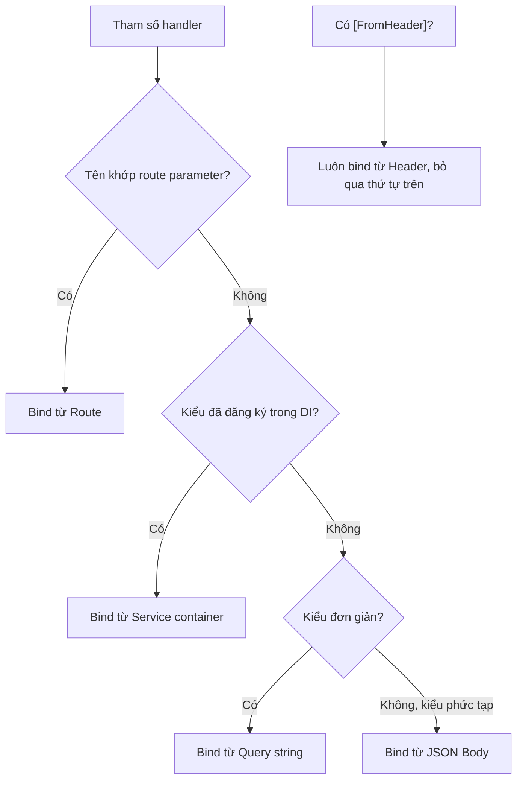

# Routing & Model Binding

!!! info "Bạn đang ở đây"
    cần trước: dependency injection (biết `builder.Services`, tiêm service qua constructor, phân biệt Singleton/Scoped/Transient).
    mở khoá: sau chương này bạn biết chính xác dữ liệu của một request (route, query, body, header) đi vào tham số handler bằng cách nào — nền tảng bắt buộc để viết validation, controller, và endpoint filter.

> **Mục tiêu (đo được):** sau chương này bạn **áp dụng** được route template với route parameter và route constraint, **phân biệt** đúng bốn nguồn binding (`[FromRoute]`, `[FromQuery]`, `[FromBody]`, `[FromHeader]`) kể cả khi không viết attribute tường minh, **giải thích** được thứ tự ưu tiên binding của Minimal API, và **gom nhóm** endpoint liên quan bằng `MapGroup`.

---

## 0. Đoán nhanh trước khi học

Bạn có endpoint sau:

```text title="Route đăng ký"
app.MapGet("/products/{id}", (int id, string? sort) => ...);
```

Client gọi `GET /products/abc?sort=price`. Điều gì xảy ra? Và nếu client gọi đúng `GET /products/5?sort=price`, tham số `id` lấy giá trị từ đâu, `sort` lấy giá trị từ đâu?

??? question "Đáp án (bấm để mở sau khi đã đoán)"
    - `GET /products/abc`: route khớp path (`{id}` chấp nhận bất kỳ chuỗi nào vì không có constraint kiểu), nhưng ASP.NET Core **không ép được** `"abc"` thành `int`. Kết quả: request thất bại với **400 Bad Request** (binding thất bại), handler **không hề chạy**.
    - `GET /products/5?sort=price`: `id` lấy từ **route** (khớp `{id}` trong template), `sort` lấy từ **query string** (`?sort=price`) vì nó là kiểu đơn giản không khớp tên nào trong route.
    - Điểm mấu chốt: Minimal API **tự suy ra nguồn binding** dựa trên vị trí tên tham số xuất hiện (route trước, rồi query), bạn không bắt buộc phải viết `[FromRoute]`/`[FromQuery]` — nhưng cần hiểu rõ quy tắc suy ra đó để không bị bất ngờ.

---

## 1. Route template và route parameter

**Định nghĩa:** route template là một chuỗi mô tả hình dạng của URL mà một endpoint sẽ khớp, trong đó phần đặt trong dấu ngoặc nhọn `{tên}` là **route parameter** — một chỗ trống sẽ được thay bằng giá trị thật lấy từ URL của request.

Ví dụ: route template `/products/{id}` khớp với `/products/5`, `/products/42`, `/products/abc` — bất kỳ giá trị nào ở đúng vị trí đó. `id` chính là tên route parameter, và ASP.NET Core sẽ cố gắng gán giá trị đó vào tham số handler cùng tên.

```csharp title="Program.cs"
// test:compile route parameter co ban
var builder = WebApplication.CreateBuilder(args);
var app = builder.Build();

// {id} la route parameter -> khop bat ky doan path nao o vi tri do
app.MapGet("/products/{id}", (string id) => $"Ban dang xem san pham co id = {id}");

app.Run();
```

Gọi thử:

```text title="Kết quả"
$ curl http://localhost:5000/products/5
Ban dang xem san pham co id = 5

$ curl http://localhost:5000/products/abc
Ban dang xem san pham co id = abc
```

Chú ý: khi tham số handler là `string`, **bất kỳ chuỗi nào** cũng khớp — kể cả `"abc"` — vì không có ràng buộc kiểu. Đây chính là lý do mục tiếp theo cần đến route constraint.

!!! danger "Hiểu lầm phổ biến: route parameter là biến số nguyên"
    Sai: nghĩ `{id}` mặc định là số. Route parameter **luôn là chuỗi** khi khớp URL — việc ép nó thành `int`, `Guid`, `DateOnly`... xảy ra ở bước **binding** (mục 2 và 4), không phải ở bước routing. Routing chỉ lo khớp *hình dạng* path.

Một route template có thể chứa **nhiều hơn một** route parameter, xen kẽ với đoạn literal (chữ cố định). Ví dụ một API lồng tài nguyên "bài viết thuộc một danh mục":

```csharp title="Program.cs"
// test:compile nhieu route parameter trong mot template
var builder = WebApplication.CreateBuilder(args);
var app = builder.Build();

// "categorySlug" va "articleId" la hai route parameter rieng biet
app.MapGet("/categories/{categorySlug}/articles/{articleId}", (
    string categorySlug, string articleId) =>
    $"Bai viet {articleId} thuoc danh muc '{categorySlug}'");

app.Run();
```

```text title="Kết quả"
$ curl http://localhost:5000/categories/dotnet/articles/42
Bai viet 42 thuoc danh muc 'dotnet'
```

Điểm cần nhớ: tên route parameter phải **khớp chính xác** (không phân biệt hoa/thường) với tên tham số trong handler thì binding mới tự động hoạt động — `categorySlug` trong route phải trùng tên với tham số `categorySlug` (hoặc `CategorySlug`) trong lambda, không phải trùng theo vị trí.

---

## 2. Route constraint: ràng buộc kiểu ngay trong route

**Định nghĩa:** route constraint là một hậu tố viết sau dấu `:` bên trong `{tên:constraint}`, dùng để giới hạn route parameter chỉ khớp khi giá trị trên URL thoả một kiểu hoặc điều kiện nhất định (ví dụ chỉ số nguyên, chỉ GUID, chỉ trong một khoảng).

Ví dụ tối thiểu: `{id:int}` chỉ khớp khi đoạn path đó là số nguyên hợp lệ.

```csharp title="Program.cs"
// test:compile route constraint :int
var builder = WebApplication.CreateBuilder(args);
var app = builder.Build();

// :int -> chi khop khi doan path la so nguyen; "abc" se KHONG khop route nay
app.MapGet("/products/{id:int}", (int id) => $"San pham so {id}");

app.Run();
```

Gọi `GET /products/5` khớp route và trả về `int id = 5` (đã được ép kiểu sẵn, dùng ngay được các phép toán số). Gọi `GET /products/abc` thì **route này không khớp** — ASP.NET Core coi như "không tìm thấy route nào phù hợp" và trả:

```text title="Kết quả"
$ curl -i http://localhost:5000/products/5
HTTP/1.1 200 OK
San pham so 5

$ curl -i http://localhost:5000/products/abc
HTTP/1.1 404 Not Found
```

**Khác biệt cốt lõi cần phân biệt rõ:**

- **Không có constraint** (`{id}` + tham số `int id`): route vẫn khớp `"abc"` (vì route chỉ nhìn hình dạng path), nhưng bước binding sau đó thất bại khi ép `"abc"` sang `int` → kết quả là **400 Bad Request**, và log sẽ ghi lỗi binding.
- **Có constraint** (`{id:int}`): route **tự loại** `"abc"` ngay từ bước matching, không tính là khớp route này. Nếu không có route nào khác khớp, kết quả là **404 Not Found**.

Hai lỗi này khác nhau về ý nghĩa (400 = "tôi hiểu path này dành cho bạn nhưng giá trị sai định dạng"; 404 = "không route nào nhận path này") nên **nên dùng constraint** khi bạn có nhiều route trùng vị trí cần phân biệt (ví dụ `/products/{id:int}` và `/products/featured` không đụng nhau).

Một số constraint thường dùng khác: `{id:guid}` (chỉ khớp GUID), `{slug:alpha}` (chỉ chữ cái), `{page:int:min(1)}` (số nguyên và tối thiểu 1, có thể nối nhiều constraint bằng `:`).

---

## 3. Query string qua `[FromQuery]`

**Định nghĩa:** query string là phần sau dấu `?` trong URL, ở dạng `key=value` nối nhau bằng `&` (ví dụ `?sort=price&page=2`), thường dùng để lọc/sắp xếp/phân trang — không phải để định danh một tài nguyên cụ thể.

Trong Minimal API, một tham số kiểu **đơn giản** (`string`, `int`, `bool`, `decimal?`, enum...) mà **tên không trùng** với route parameter nào sẽ **tự động** được ASP.NET Core bind từ query string — bạn **không bắt buộc** viết `[FromQuery]`.

```csharp title="Program.cs"
// test:compile query string tu suy ra, khong can [FromQuery]
var builder = WebApplication.CreateBuilder(args);
var app = builder.Build();

// "sort" khong xuat hien trong route -> tu dong bind tu query string
app.MapGet("/products", (string? sort) =>
    sort is null ? "Danh sach mac dinh" : $"Danh sach sap xep theo {sort}");

app.Run();
```

```text title="Kết quả"
$ curl "http://localhost:5000/products?sort=price"
Danh sach sap xep theo price

$ curl "http://localhost:5000/products"
Danh sach mac dinh
```

**Khi nào cần viết `[FromQuery]` tường minh?** Có hai trường hợp:

1. Tên tham số handler **khác tên** key trên query string mà bạn không muốn đổi tên biến C# — `[FromQuery(Name = "q")]` cho phép map `?q=...` vào một biến tên khác, ví dụ `keyword`.
2. Bạn muốn **áp đặt rõ ràng** nguồn binding để tránh nhầm lẫn khi đọc code (tài liệu hoá ý định), đặc biệt trong các API lớn có nhiều tham số.

```csharp title="Program.cs"
// test:compile [FromQuery] tuong minh voi ten khac
using Microsoft.AspNetCore.Mvc;

var builder = WebApplication.CreateBuilder(args);
var app = builder.Build();

app.MapGet("/products/search", (
    [FromQuery(Name = "q")] string keyword) => $"Tim kiem: {keyword}");

app.Run();
```

```text title="Kết quả"
$ curl "http://localhost:5000/products/search?q=ban+phim"
Tim kiem: ban phim
```

!!! danger "Hiểu lầm phổ biến: [FromQuery] là bắt buộc"
    Sai: nghĩ mọi tham số query đều phải gắn `[FromQuery]` thì mới hoạt động. Với kiểu đơn giản không trùng route, Minimal API **tự suy ra** — viết attribute chỉ cần khi đổi tên hoặc muốn tường minh, không viết vẫn chạy đúng.

---

## 4. Request body qua `[FromBody]`

**Định nghĩa:** request body là phần dữ liệu (thường JSON) nằm trong phần thân của HTTP request, dùng để gửi một payload có cấu trúc (object) mà URL không tải nổi — điển hình cho `POST`/`PUT`/`PATCH`.

Trong Minimal API, một tham số kiểu **phức tạp** (class, record, không phải kiểu nguyên thuỷ) sẽ **mặc định** được bind từ JSON body — bạn cũng **không bắt buộc** viết `[FromBody]`.

```csharp title="Program.cs"
// test:compile [FromBody] tu suy ra cho complex type
var builder = WebApplication.CreateBuilder(args);
var app = builder.Build();

// "input" la kieu phuc tap (record) -> tu dong bind tu JSON body
app.MapPost("/products", (ProductInput input) =>
    Results.Created($"/products/1", input));

app.Run();

public record ProductInput(string Name, decimal Price);
```

```text title="Kết quả"
$ curl -i -X POST http://localhost:5000/products \
    -H "Content-Type: application/json" \
    -d '{"name":"Ban phim","price":450000}'
HTTP/1.1 201 Created
Location: /products/1
{"name":"Ban phim","price":450000}
```

**Điều gì xảy ra khi dùng sai:** nếu bạn gửi body không phải JSON hợp lệ, hoặc quên header `Content-Type: application/json`, ASP.NET Core **không thể** parse body thành `ProductInput` và trả về **400 Bad Request** kèm `ProblemDetails` mô tả lỗi parse — handler không chạy.

```text title="Kết quả (thiếu Content-Type)"
$ curl -i -X POST http://localhost:5000/products -d '{"name":"Ban phim","price":450000}'
HTTP/1.1 415 Unsupported Media Type
```

Viết `[FromBody]` tường minh chỉ cần khi bạn muốn **ép** một kiểu vốn đơn giản (ví dụ `string`) phải đọc từ body thay vì query — trường hợp này hiếm gặp trong thực tế vì thường bạn sẽ bọc nó trong một DTO thay vì làm vậy.

```csharp title="Program.cs"
// test:compile [FromBody] tuong minh cho kieu don gian (hiem dung)
using Microsoft.AspNetCore.Mvc;

var builder = WebApplication.CreateBuilder(args);
var app = builder.Build();

app.MapPost("/echo", ([FromBody] string raw) => $"Nhan duoc: {raw}");

app.Run();
```

!!! danger "Hiểu lầm phổ biến: chỉ POST/PUT mới có body binding"
    Đúng một nửa: `GET`/`DELETE` **có thể** kỹ thuật vẫn mang body, nhưng ASP.NET Core Minimal API và các chuẩn HTTP client/proxy **không đảm bảo** hỗ trợ đọc body cho các method này. Quy ước REST là chỉ `POST`/`PUT`/`PATCH` mới gửi body — đừng thiết kế `GET` cần body.

---

## 5. Header qua `[FromHeader]`

**Định nghĩa:** HTTP header là các cặp `key: value` nằm trong phần đầu của request (khác body), mang metadata về request — ví dụ `Authorization`, `Accept-Language`, hoặc header tuỳ biến do API tự định nghĩa như `X-Client-Version`.

Khác với route/query/body, **không có suy luận tự động** cho header — bạn **luôn phải** viết `[FromHeader]` tường minh, nếu không ASP.NET Core sẽ không biết tham số đó lấy từ đâu (và sẽ cố suy ra từ query, gần như chắc chắn sai).

Lưu ý kỹ thuật: `[FromQuery]`, `[FromBody]`, `[FromHeader]`, `[FromRoute]` nằm trong namespace `Microsoft.AspNetCore.Mvc` (dùng chung giữa Minimal API và MVC Controller) — namespace này **không** nằm trong danh sách implicit using mặc định của một dự án `dotnet new web` trần, nên khi viết tường minh bạn cần thêm `using Microsoft.AspNetCore.Mvc;` ở đầu file. Nếu quên, trình biên dịch báo lỗi cụ thể **CS0246** ("The type or namespace name ... could not be found").

```csharp title="Program.cs"
// test:compile [FromHeader] bat buoc tuong minh
using Microsoft.AspNetCore.Mvc;

var builder = WebApplication.CreateBuilder(args);
var app = builder.Build();

app.MapGet("/whoami", (
    [FromHeader(Name = "X-Client-Version")] string? clientVersion) =>
    clientVersion is null
        ? "Khong ro phien ban client"
        : $"Client dang dung phien ban {clientVersion}");

app.Run();
```

```text title="Kết quả"
$ curl http://localhost:5000/whoami -H "X-Client-Version: 2.3.0"
Client dang dung phien ban 2.3.0

$ curl http://localhost:5000/whoami
Khong ro phien ban client
```

**Điều gì xảy ra khi dùng sai:** nếu bạn khai báo `string clientVersion` (không nullable, không có giá trị mặc định) nhưng client không gửi header đó, ASP.NET Core trả **400 Bad Request** vì tham số bắt buộc mà không có giá trị để bind. Muốn header là tuỳ chọn, luôn khai báo kiểu **nullable** (`string?`) hoặc gán giá trị mặc định.

---

## 6. Thứ tự ưu tiên binding

Khi bạn **không** viết attribute tường minh, Minimal API áp dụng quy tắc suy luận theo thứ tự sau để quyết định một tham số lấy giá trị từ đâu:

1. **Route** — nếu tên tham số khớp một route parameter trong template (`{tên}`), lấy từ route.
2. **Service (DI container)** — nếu kiểu tham số đã được đăng ký trong `builder.Services` (ví dụ một interface có `AddScoped`), lấy từ container qua dependency injection — không cần `[FromServices]` (từ .NET 7 trở đi Minimal API tự nhận diện service đã đăng ký).
3. **Query string** — nếu là kiểu đơn giản (string, số, bool, enum, Guid, DateTime...) và không khớp route/service, lấy từ query string.
4. **Body (JSON)** — nếu là kiểu phức tạp (class/record) và không khớp các nguồn trên, lấy từ JSON body. Chỉ **một** tham số được phép bind từ body trong một handler.

Header **không nằm trong chuỗi suy luận này** — nó chỉ được bind khi có `[FromHeader]` tường minh.



```csharp title="Program.cs"
// test:compile minh hoa day du thu tu uu tien binding
var builder = WebApplication.CreateBuilder(args);
builder.Services.AddSingleton<IClock>(new SystemClock());
var app = builder.Build();

// id: Route (khop {id})
// clock: Service (IClock da dang ky trong DI)
// sort: Query string (kieu don gian, khong khop route)
// input: Body (kieu phuc tap ProductInput)
app.MapPut("/products/{id:int}", (
    int id,
    IClock clock,
    string? sort,
    ProductInput input) =>
    $"Cap nhat san pham {id} luc {clock.UtcNow:O}, sort={sort}, ten moi={input.Name}");

app.Run();

public record ProductInput(string Name, decimal Price);

public interface IClock { DateTime UtcNow { get; } }
public sealed class SystemClock : IClock { public DateTime UtcNow => DateTime.UtcNow; }
```

```text title="Kết quả"
$ curl -X PUT "http://localhost:5000/products/5?sort=price" \
    -H "Content-Type: application/json" \
    -d '{"name":"Ban phim moi","price":500000}'
Cap nhat san pham 5 luc 2026-07-03T10:00:00.0000000Z, sort=price, ten moi=Ban phim moi
```

!!! danger "Hiểu lầm phổ biến: hai tham số phức tạp đều tự bind từ body"
    Sai. Minimal API chỉ cho phép **một** tham số đọc từ JSON body theo suy luận tự động. Nếu bạn khai hai tham số kiểu phức tạp (ví dụ `ProductInput input, AddressInput address`) mà không có attribute rõ ràng, ASP.NET Core **không thể** suy luận nguồn cho tham số thứ hai (nó không khớp route, không phải service đã đăng ký, và slot "body" đã bị tham số đầu chiếm) — kết quả là `InvalidOperationException: Failure to infer one or more parameters`, hiện ra dưới dạng **500 Internal Server Error** ngay ở **request đầu tiên khớp route đó** (lỗi xây dựng endpoint bị hoãn tới lần dùng đầu tiên, không phải throw ngay dòng `app.Run()`). Muốn nhiều dữ liệu, hãy gộp vào **một** DTO duy nhất.

---

## 7. Endpoint groups với `MapGroup`

**Định nghĩa:** `MapGroup` là một API cho phép gom nhiều endpoint có chung tiền tố route (và thường chung cấu hình như filter, authorization) vào một "nhóm", để không phải lặp lại prefix ở từng `MapGet`/`MapPost`.

Ví dụ tối thiểu: thay vì viết `/products` lặp lại ở bốn chỗ, gom vào một group:

```csharp title="Program.cs"
// test:compile MapGroup co ban
var builder = WebApplication.CreateBuilder(args);
var app = builder.Build();

var products = app.MapGroup("/products");

products.MapGet("/", () => Results.Ok(new[] { "Ban phim", "Chuot" }));
products.MapGet("/{id:int}", (int id) => Results.Ok($"San pham {id}"));
products.MapPost("/", (ProductInput input) => Results.Created($"/products/1", input));

app.Run();

public record ProductInput(string Name, decimal Price);
```

```text title="Kết quả"
$ curl http://localhost:5000/products/
["Ban phim","Chuot"]

$ curl http://localhost:5000/products/5
San pham 5
```

Lợi ích thực sự không chỉ là tiết kiệm gõ chữ — `MapGroup` trả về một `RouteGroupBuilder`, cho phép áp **một lần** các cấu hình chung cho toàn bộ endpoint trong nhóm, ví dụ yêu cầu xác thực hoặc endpoint filter:

```csharp title="Program.cs"
// test:compile MapGroup voi cau hinh chung (RequireAuthorization)
var builder = WebApplication.CreateBuilder(args);
var app = builder.Build();

var admin = app.MapGroup("/admin/products")
    .RequireAuthorization(); // ap dung cho MOI endpoint trong nhom nay

admin.MapGet("/", () => Results.Ok("Danh sach cho admin"));
admin.MapDelete("/{id:int}", (int id) => Results.NoContent());

app.Run();
```

Không dùng `RequireAuthorization` từng dòng một cho mỗi endpoint — dễ quên một chỗ và để lộ endpoint không bảo vệ. Gom nhóm giúp áp dụng chính sách **nhất quán** cho cả cụm route liên quan.

---

## Cạm bẫy & thực chiến

- **Nhầm route constraint với validation nghiệp vụ:** `{id:int}` chỉ đảm bảo *đúng kiểu*, không đảm bảo *tồn tại*. `GET /products/999999` với id hợp lệ về kiểu nhưng không có trong DB vẫn phải tự kiểm tra và trả `404 Not Found` trong handler — route constraint không thay được logic đó.
- **Hai route trùng hình dạng gây ẩn nghĩa:** `/products/{id:int}` và `/products/featured` không đụng nhau (một chỉ khớp số, một khớp chữ cố định) — nhưng `/products/{id}` (không constraint) và `/products/featured` **sẽ đụng nhau về thứ tự khớp**; luôn ưu tiên route cụ thể hơn hoặc thêm constraint để tránh mơ hồ.
- **Nhiều tham số body:** như đã nói ở mục 6, khai hai kiểu phức tạp không attribute trong cùng handler khiến request đầu tiên khớp route đó trả `500 Internal Server Error` (`Failure to infer one or more parameters`) — lỗi chỉ lộ ra khi có request thật, không phải lúc build hay chạy `dotnet run`, nên rất dễ lọt qua "chạy thử nhanh rồi thấy im lặng tưởng ổn". Luôn gộp nhiều trường vào **một** DTO.
- **Quên `Content-Type: application/json` khi test bằng `curl`:** binding body âm thầm thất bại, trả `415 Unsupported Media Type`, dễ nhầm tưởng route sai trong khi route đúng, chỉ là body không được nhận diện.
- **Header không phải tuỳ chọn nhưng client không gửi:** khai `[FromHeader] string x` (không nullable) mà thiếu header trên request thật, kết quả là `400 Bad Request` — luôn cân nhắc `string?` cho header không bắt buộc.
- **Đặt tên tham số trùng route parameter nhưng sai kiểu:** ví dụ route `{id:int}` nhưng handler khai `(string id)` — vẫn bind được (ASP.NET Core convert ngược sang string), nhưng bạn mất lợi ích ép kiểu sớm; luôn đồng bộ kiểu route constraint với kiểu tham số handler.
- **Quên `using Microsoft.AspNetCore.Mvc;` khi dùng `[FromQuery]`/`[FromBody]`/`[FromHeader]` tường minh:** các attribute này không nằm trong implicit using mặc định của dự án `dotnet new web` trần — thiếu using sẽ báo lỗi biên dịch cụ thể **CS0246** ("could not be found"), dễ khiến người mới tưởng mình gõ sai tên attribute trong khi thực ra chỉ thiếu một dòng `using`.
- **Query string kiểu sai định dạng:** `GET /products?minPrice=abc` khi handler khai `decimal? minPrice` sẽ khiến binding thất bại và trả `400 Bad Request` — khác với việc **không truyền** `minPrice` (hợp lệ, ra `null`). "Không có" và "có nhưng sai định dạng" là hai tình huống khác nhau, đừng nhầm lẫn khi viết test.

---

## Bài tập

**Bài 1 (giàn giáo).** Endpoint dưới cần: `id` từ route (chỉ nhận số nguyên), `includeArchived` là tuỳ chọn từ query string, và `patch` (dữ liệu cập nhật) từ body. Điền vào chỗ `// TODO`.

```csharp title="Program.cs"
// test:skip khung bai tap, thieu class ProductPatch de doc gian
app.MapPut("/products/TODO_route", (
    /* TODO 1: kieu + ten tham so id, dam bao chi khop so nguyen */,
    /* TODO 2: tham so tuy chon includeArchived, kieu bool? */,
    /* TODO 3: tham so patch kieu ProductPatch (record phuc tap) */) =>
{
    return Results.Ok($"Cap nhat {id}, includeArchived={includeArchived}, ten moi={patch.Name}");
});
```

??? success "Lời giải + vì sao"
    ```csharp title="Program.cs"
    // test:compile loi giai bai 1
    var builder = WebApplication.CreateBuilder(args);
    var app = builder.Build();

    app.MapPut("/products/{id:int}", (
        int id,
        bool? includeArchived,
        ProductPatch patch) =>
        Results.Ok($"Cap nhat {id}, includeArchived={includeArchived}, ten moi={patch.Name}"));

    app.Run();

    public record ProductPatch(string Name);
    ```

    - `{id:int}` + tham số `int id`: route constraint loại ngay các path không phải số, tránh phải tự kiểm tra `int.TryParse` trong handler.
    - `bool? includeArchived`: kiểu đơn giản, tên không khớp route → tự suy ra từ query string; nullable vì đây là tham số **tuỳ chọn**, không truyền thì `null`.
    - `ProductPatch patch`: kiểu phức tạp (record) → tự suy ra từ JSON body, không cần `[FromBody]`.

**Bài 2 (thiết kế).** Bạn cần thiết kế lại một API quản lý bài viết (`Article`) đang có các route rời rạc và lộn xộn:

```text title="Route hiện tại (cần dọn lại)"
GET  /getArticleById/{articleId}
GET  /articleSearch?keyword=...
POST /createNewArticle
GET  /getArticlesForAdmin        (chi admin duoc goi, can header X-Admin-Token)
```

Hãy thiết kế lại theo đúng chuẩn REST (danh từ số nhiều, method đúng ngữ nghĩa) và dùng `MapGroup` để gom phần quản trị. Viết route template + khai báo tham số (không cần thân xử lý đầy đủ).

??? success "Lời giải + vì sao"
    ```csharp title="Program.cs"
    // test:compile loi giai bai 2
    using Microsoft.AspNetCore.Mvc;

    var builder = WebApplication.CreateBuilder(args);
    var app = builder.Build();

    // Nhom cong khai: danh tu so nhieu "articles", khong dong tu trong URL
    var articles = app.MapGroup("/articles");
    articles.MapGet("/{id:int}", (int id) => Results.Ok($"Bai viet {id}"));
    articles.MapGet("/", (string? keyword) =>
        Results.Ok(keyword is null ? "Tat ca bai viet" : $"Tim theo: {keyword}"));
    articles.MapPost("/", (ArticleInput input) =>
        Results.Created("/articles/1", input));

    // Nhom rieng cho admin: chung prefix + chung yeu cau header token
    var adminArticles = app.MapGroup("/admin/articles");
    adminArticles.MapGet("/", (
        [FromHeader(Name = "X-Admin-Token")] string adminToken) =>
        Results.Ok("Danh sach day du cho admin"));

    app.Run();

    public record ArticleInput(string Title, string Body);
    ```

    - `GET /getArticleById/{articleId}` → `GET /articles/{id:int}`: bỏ động từ khỏi URL (đã có method `GET`), dùng danh từ số nhiều, thêm constraint `:int` vì id luôn là số.
    - `GET /articleSearch?keyword=...` → `GET /articles?keyword=...`: tìm kiếm vẫn là "đọc tài nguyên `articles`" với bộ lọc qua query string, không cần path riêng.
    - `POST /createNewArticle` → `POST /articles`: method `POST` đã diễn đạt "tạo mới", không cần nhắc lại trong URL.
    - `GET /getArticlesForAdmin` → gom vào `MapGroup("/admin/articles")`: tách biệt rõ khu vực quản trị theo prefix, và header `X-Admin-Token` (không tự suy ra được) phải khai `[FromHeader]` tường minh.

---

## Tự kiểm tra

1. Route template `{id:int}` khác gì so với `{id}` khi client gửi một giá trị không phải số?

    ??? note "Đáp án"
        `{id}` (không constraint) vẫn khớp route nhưng bước binding sau đó thất bại khi ép sang `int` → **400 Bad Request**. `{id:int}` loại giá trị không phải số ngay từ bước khớp route → nếu không route nào khác khớp thì **404 Not Found**.

2. Vì sao tham số `string? sort` trong `MapGet("/products", (string? sort) => ...)` không cần viết `[FromQuery]`?

    ??? note "Đáp án"
        Vì `sort` là kiểu đơn giản (string) và tên của nó không khớp bất kỳ route parameter nào trong template `/products` — Minimal API tự suy luận nguồn là query string.

3. Một handler khai `(ProductInput a, AddressInput b)` với cả hai đều là record (kiểu phức tạp), không có attribute. Điều gì xảy ra?

    ??? note "Đáp án"
        Ở **request đầu tiên khớp route đó**, ASP.NET Core ném `InvalidOperationException: Failure to infer one or more parameters` → trả về **500 Internal Server Error**. Lý do: Minimal API chỉ cho phép một tham số tự suy luận bind từ JSON body — có hai tham số phức tạp cùng lúc là mơ hồ, tham số thứ hai không còn nguồn nào để suy luận.

4. Header có nằm trong chuỗi suy luận tự động (route → service → query → body) không? Muốn bind từ header phải làm gì?

    ??? note "Đáp án"
        Không. Header luôn phải khai `[FromHeader]` tường minh (có thể kèm `Name = "..."` nếu tên header khác tên biến C#); không có suy luận tự động cho header.

5. Cho route `/products/{id:int}` và request `PUT /products/5` thiếu header `Content-Type: application/json` dù có body JSON hợp lệ. Server trả gì?

    ??? note "Đáp án"
        `415 Unsupported Media Type` — vì thiếu `Content-Type` đúng, ASP.NET Core không xác định được cách parse body nên từ chối trước khi thử bind.

6. `MapGroup` mang lại lợi ích gì ngoài việc gộp tiền tố URL?

    ??? note "Đáp án"
        Cho phép áp dụng **một lần** các cấu hình chung (như `RequireAuthorization`, endpoint filter) cho toàn bộ endpoint trong nhóm, đảm bảo tính nhất quán và tránh quên áp dụng ở một endpoint lẻ.

7. Vì sao route `/products/{id}` (không constraint) và `/products/featured` dễ gây nhầm lẫn hơn `/products/{id:int}` và `/products/featured`?

    ??? note "Đáp án"
        Không có constraint, `{id}` khớp mọi chuỗi kể cả `"featured"`, khiến việc route nào được ưu tiên khớp trở nên mơ hồ và phụ thuộc thứ tự đăng ký. Thêm `:int` loại `"featured"` khỏi route id ngay từ bước khớp, làm rõ ràng hai route không chồng lấn.

---

??? abstract "DEEP DIVE: constraint nâng cao, `AsParameters`, và binding tuỳ biến"
    **Nhiều constraint cùng lúc:** có thể nối chuỗi bằng dấu `:`, ví dụ `{page:int:min(1)}` (số nguyên, tối thiểu 1) hoặc `{slug:alpha:minlength(3)}` (chỉ chữ cái, tối thiểu 3 ký tự). Điều này đẩy một phần validation đơn giản lên tầng routing, trước cả khi handler chạy.

    **`[AsParameters]` gom nhiều tham số liên quan thành một kiểu:** khi một endpoint có quá nhiều tham số rời rạc (route + query trộn lẫn), có thể gộp vào một record và đánh dấu `[AsParameters]` để code gọn hơn mà binding vẫn hoạt động theo đúng quy tắc route/query như từng tham số riêng lẻ:

    ```csharp title="Program.cs"
    // test:compile AsParameters gom nhieu tham so
    var builder = WebApplication.CreateBuilder(args);
    var app = builder.Build();

    app.MapGet("/products/{id:int}", ([AsParameters] ProductQuery query) =>
        Results.Ok($"id={query.Id}, sort={query.Sort}"));

    app.Run();

    public record ProductQuery(int Id, string? Sort);
    ```

    Lưu ý: `[AsParameters]` chỉ là cách **gói gọn**, nguồn binding của từng property bên trong vẫn tuân theo đúng quy tắc suy luận đã học (property `Id` khớp route → route; `Sort` không khớp → query).

    **Route order và fallback:** khi hai route có thể cùng khớp một path, ASP.NET Core dùng thuật toán chấm điểm ưu tiên route **cụ thể hơn** (nhiều literal segment, có constraint) trước route **tổng quát hơn** (nhiều wildcard). Tuy vậy không nên phụ thuộc vào thuật toán ngầm này — thiết kế route rõ ràng, không chồng lấn ngay từ đầu vẫn là cách an toàn nhất.

    **Binding tuỳ biến (`BindAsync`):** với kiểu phức tạp cần logic parse đặc biệt (ví dụ đọc từ nhiều header ghép lại thành một object), bạn có thể tự viết `static bool TryParse` hoặc `static ValueTask<T?> BindAsync(HttpContext context, ParameterInfo parameter)` trên chính kiểu đó để ASP.NET Core gọi khi binding — đây là cơ chế mở rộng cho các trường hợp bốn nguồn chuẩn (route/query/body/header) không đủ diễn đạt.

**Tiếp theo →** [P3 · Configuration & Options](configuration-options.md)
