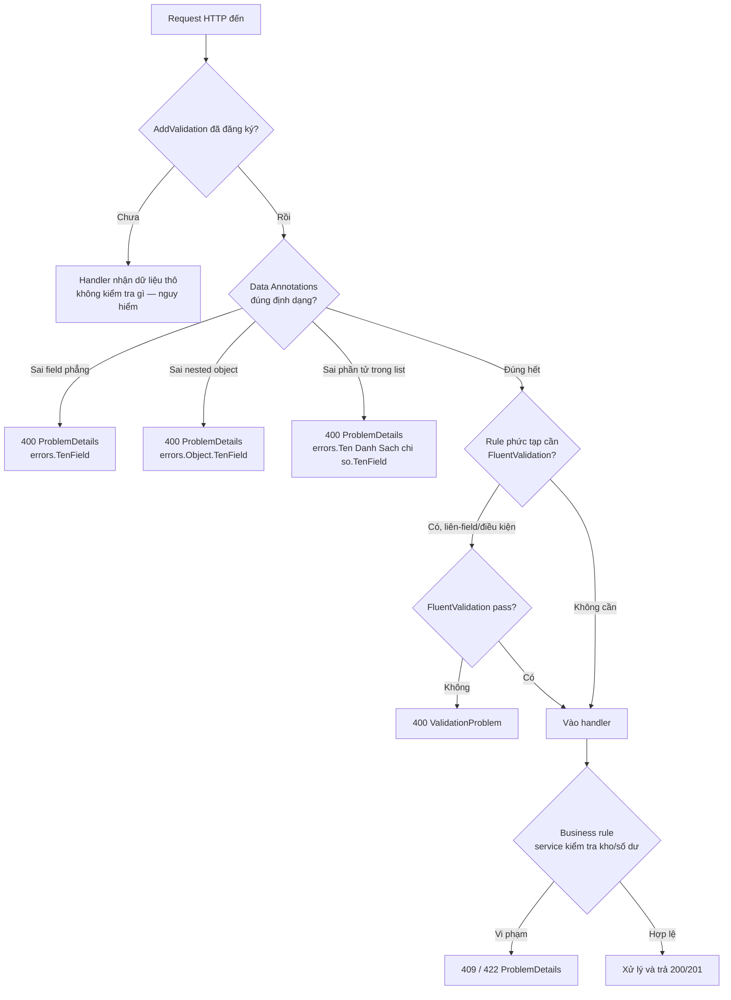

# Validation: chặn dữ liệu rác trước khi nó phá hệ thống

!!! info "Bạn đang ở đây · P3 → node `p3-validation`"
    **cần trước:** dựng được endpoint minimal api, biết binding tham số từ route/query/body.
    **mở khoá sau bài này:** xử lý lỗi tập trung với exception handler middleware, entity framework core (validate trước khi chạm db), authentication/authorization.
    ⏱️ Fast path ~40 phút · Deep dive cuối bài (tuỳ chọn, không bắt buộc).

> **Mục tiêu (đo được):** Sau bài này bạn **áp dụng** được Data Annotations (`[Required]`, `[StringLength]`, `[Range]`, `[EmailAddress]`) để chặn request sai định dạng, **kích hoạt** được validation tự động trong Minimal API để trả 400 kèm thông báo lỗi rõ ràng thay vì 500, **giải thích** được khi nào cần FluentValidation thay vì Data Annotations, và **thiết kế** được validation cho object lồng nhau và danh sách.

---

## 0. Đoán nhanh (30 giây)

Một API `POST /orders` nhận body `{ "quantity": -999999 }` và **không có validation nào**. Bạn nghĩ chuyện gì sẽ xảy ra bên trong server?

??? question "Đáp án (bấm để mở sau khi đã đoán)"
    Tuỳ code xử lý phía sau, nhưng các kịch bản thực tế đã từng xảy ra:

    - Nếu code làm `Stock -= quantity` mà không kiểm tra, kho hàng trong DB tự dưng **tăng vọt** thành số dương khổng lồ (trừ đi một số âm = cộng).
    - Nếu `quantity` được dùng để cấp phát mảng hay vòng lặp (`for i in 0..quantity`), server có thể bị treo hoặc crash vì cấp phát bộ nhớ khổng lồ — một dạng **denial of service** không cần hacker giỏi, chỉ cần một request sai định dạng.
    - Nếu không kiểm tra kiểu, một chuỗi `"abc"` gửi vào field số có thể khiến code parse thất bại giữa chừng, ném exception không bắt được → **500 Internal Server Error** lộ ra ngoài, đôi khi kèm stack trace tiết lộ cấu trúc code nội bộ cho kẻ tấn công.

    Điểm mấu chốt: **client không phải là bạn của server**. Client có thể là app di động lỗi, script test quên set giá trị, hoặc kẻ tấn công cố tình dò lỗi. Validation là hàng rào bắt buộc, không phải tuỳ chọn.

---

## 1. Vì sao phải validate: tin client là lỗi bảo mật và dữ liệu bẩn

**Validation** là hành động kiểm tra dữ liệu đầu vào có đúng định dạng, đúng ràng buộc mong muốn hay không, **trước khi** để nó chạm vào logic nghiệp vụ hoặc cơ sở dữ liệu.

Lý do phải làm việc này nằm ở một nguyên tắc bảo mật cơ bản: **không bao giờ tin dữ liệu đến từ bên ngoài ranh giới tin cậy (trust boundary)** của bạn. Request HTTP luôn đến từ bên ngoài ranh giới đó, bất kể ai gửi.

Ba hậu quả cụ thể khi bỏ qua validation:

1. **Dữ liệu bẩn trong DB.** Ví dụ: field `Email` không kiểm tra định dạng → DB chứa hàng nghìn bản ghi với email rác như `"asdf"`, `""`, hay chuỗi rỗng có khoảng trắng. Về sau, tính năng gửi email marketing thất bại hàng loạt, và không ai biết vì sao cho tới khi debug sâu.
2. **Crash hoặc hành vi sai ở tầng dưới.** Ví dụ cụ thể: một API nhận `pageSize` từ query string không giới hạn, người dùng gửi `?pageSize=50000000`. Nếu code dùng giá trị này để `Skip().Take()` trên EF Core, câu SQL sinh ra có thể làm treo connection pool hoặc timeout toàn bộ ứng dụng cho các request khác — **một request lỗi format kéo sập cả hệ thống** cho mọi người dùng khác.
3. **Lỗ hổng bảo mật nghiêm trọng hơn.** Không kiểm tra độ dài chuỗi trước khi ghi log hoặc render ra HTML có thể mở đường cho tấn công log injection hoặc XSS. Không kiểm tra kiểu dữ liệu trước khi dùng trong câu truy vấn động có thể dẫn tới SQL injection.

!!! danger "Hiểu lầm phổ biến: 'Frontend đã validate rồi'"
    Sai. Validation ở frontend (JavaScript trong trình duyệt) chỉ để **trải nghiệm người dùng mượt** — báo lỗi ngay khi gõ, không cần chờ server. Nhưng kẻ tấn công (hoặc một script test, hoặc Postman) gọi **thẳng** vào API, bỏ qua hoàn toàn giao diện web. Nếu backend không validate lại, toàn bộ hàng rào biến mất chỉ bằng một request `curl`. **Backend luôn là hàng rào bắt buộc cuối cùng**, frontend chỉ là tiện ích.

Với nhận thức đó, việc còn lại là: validate ở đâu, và validate như thế nào cho gọn mà vẫn chắc. Các mục dưới đây đi từng khái niệm một, đúng thứ tự.

---

## 2. Data Annotations: gắn ràng buộc ngay trên thuộc tính

**Data Annotations** là một tập attribute có sẵn trong .NET (namespace `System.ComponentModel.DataAnnotations`), cho phép bạn khai báo ràng buộc dữ liệu trực tiếp trên thuộc tính của một class hoặc record — ví dụ "trường này bắt buộc", "chuỗi này tối đa 50 ký tự" — mà không cần viết `if` thủ công.

Dưới đây là ví dụ tối thiểu, chỉ dùng BCL (`System.ComponentModel.DataAnnotations` có sẵn trong .NET runtime, không cần ASP.NET Core), minh hoạ đúng cơ chế gọi validator — chưa gắn vào web:

```csharp title="Program.cs"
// test:run
using System.ComponentModel.DataAnnotations;

public class RegisterInput
{
    [Required]
    public string? Name { get; set; }
}

var input = new RegisterInput { Name = null };
var context = new ValidationContext(input);
var results = new List<ValidationResult>();

bool isValid = Validator.TryValidateObject(input, context, results, validateAllProperties: true);

Console.WriteLine($"Hợp lệ: {isValid}");
foreach (var r in results)
    Console.WriteLine($"- {r.ErrorMessage}");
```

```text title="Kết quả"
Hợp lệ: False
- The Name field is required.
```

Cơ chế cốt lõi: attribute như `[Required]` chỉ là **metadata** (dữ liệu mô tả) gắn trên property. Bản thân nó không tự động chạy — cần một bộ máy như `Validator.TryValidateObject` (ở ví dụ trên) hoặc framework ASP.NET Core (ở mục 3) đọc metadata này và thực thi kiểm tra.

### Từng attribute một, ví dụ riêng

Đây là các attribute thường dùng nhất. Mỗi attribute minh hoạ **riêng lẻ** để thấy rõ nó kiểm tra gì.

**`[Required]`** — bắt buộc field phải có giá trị (không phải `null`, và với `string` không được rỗng nếu đặt `AllowEmptyStrings = false`, mặc định `false`).

```csharp title="Program.cs"
// test:run
using System.ComponentModel.DataAnnotations;

public class Model1 { [Required] public string? Title { get; set; } }

var missing = new Model1 { Title = null };
var results = new List<ValidationResult>();
bool ok1 = Validator.TryValidateObject(missing, new ValidationContext(missing), results, true);
Console.WriteLine(ok1); // False vì Title null

results.Clear();
var m = new Model1 { Title = "" };
bool ok2 = Validator.TryValidateObject(m, new ValidationContext(m), results, true);
Console.WriteLine(ok2 + " " + string.Join(";", results.Select(r => r.ErrorMessage)));
```

```text title="Kết quả"
False
False The Title field is required.
```

**`[StringLength]`** — giới hạn độ dài tối đa (và tối thiểu nếu muốn) của chuỗi.

```csharp title="Program.cs"
// test:run
using System.ComponentModel.DataAnnotations;

public class Model2 { [StringLength(5, MinimumLength = 2)] public string? Code { get; set; } }

var m = new Model2 { Code = "abcdefgh" }; // dài 8, vượt max 5
var results = new List<ValidationResult>();
bool ok = Validator.TryValidateObject(m, new ValidationContext(m), results, true);
Console.WriteLine(ok + " " + string.Join(";", results.Select(r => r.ErrorMessage)));
```

```text title="Kết quả"
False The field Code must be a string with a minimum length of 2 and a maximum length of 5.
```

**`[Range]`** — giới hạn giá trị số (hoặc kiểu so sánh được) trong khoảng cho phép.

```csharp title="Program.cs"
// test:run
using System.ComponentModel.DataAnnotations;

public class Model3 { [Range(1, 1000)] public int Quantity { get; set; } }

var m = new Model3 { Quantity = -5 };
var results = new List<ValidationResult>();
bool ok = Validator.TryValidateObject(m, new ValidationContext(m), results, true);
Console.WriteLine(ok + " " + string.Join(";", results.Select(r => r.ErrorMessage)));
```

```text title="Kết quả"
False The field Quantity must be between 1 and 1000.
```

**`[EmailAddress]`** — kiểm tra chuỗi có đúng cú pháp email cơ bản không (không xác minh email có thật tồn tại — đó là việc khác, gửi mail xác nhận).

```csharp title="Program.cs"
// test:run
using System.ComponentModel.DataAnnotations;

public class Model4 { [EmailAddress] public string? Email { get; set; } }

var m = new Model4 { Email = "khong-phai-email" };
var results = new List<ValidationResult>();
bool ok = Validator.TryValidateObject(m, new ValidationContext(m), results, true);
Console.WriteLine(ok + " " + string.Join(";", results.Select(r => r.ErrorMessage)));
```

```text title="Kết quả"
False The Email field is not a valid e-mail address.
```

### Nếu dùng sai

Ba lỗi cụ thể hay gặp khi dùng Data Annotations:

- Quên `validateAllProperties: true` khi gọi `Validator.TryValidateObject` thủ công → chỉ attribute `[Required]` được kiểm tra, các attribute khác **bị bỏ qua âm thầm**, không có exception, không có cảnh báo — bug rất khó phát hiện vì code "chạy được", chỉ là validate sai.
- Đặt `[Range(1, 1000)]` trên một property kiểu `string` → ném `InvalidOperationException` lúc validate, vì `Range` cần kiểu so sánh được (số, `DateTime`...), không áp dụng cho chuỗi tuỳ ý.
- Nhầm `[Required]` nghĩ rằng nó tự kiểm tra chuỗi rỗng — mặc định `AllowEmptyStrings` là `false` nên `""` **thực ra bị chặn**, nhưng nhiều người tưởng ngược lại rồi ngạc nhiên khi thấy field bắt buộc "quá khắt khe" với chuỗi rỗng hợp lệ về nghiệp vụ (ví dụ ghi chú có thể để trống) — trường hợp này nên **bỏ** `[Required]` chứ không phải sửa cấu hình.

---

## 3. Kích hoạt validation tự động trong Minimal API

Biết attribute không đủ — cần framework **tự động chạy** validator trước khi handler thực thi, rồi tự trả 400 nếu sai. Đây là điểm khác biệt giữa "biết Data Annotations" và "dùng được nó trong web API thật".

Từ ASP.NET Core trong .NET 10, Minimal API có hỗ trợ validation tự động qua `builder.Services.AddValidation()` — không cần gói NuGet ngoài, không cần sửa file `.csproj`. Framework tự dò các kiểu tham số của handler (qua reflection) và kiểm tra Data Annotations trước khi chạy handler.

```csharp title="Program.cs"
// test:compile validation tự động của Minimal API (.NET 10), không cần package ngoài
using System.ComponentModel.DataAnnotations;

var builder = WebApplication.CreateBuilder(args);

// Bước bắt buộc: đăng ký dịch vụ validation vào DI container.
builder.Services.AddValidation();

var app = builder.Build();

app.MapPost("/orders", (CreateOrderRequest request) =>
{
    // Nếu request sai định dạng, framework đã trả 400 TRƯỚC KHI vào tới đây.
    return Results.Created($"/orders/1", request);
});

app.Run();

public record CreateOrderRequest(
    [property: Required] string ProductCode,
    [property: Range(1, 1000)] int Quantity,
    [property: EmailAddress] string CustomerEmail);
```

Gọi thử với `curl` sau `dotnet run`:

```text title="Kết quả"
$ curl -s -X POST http://localhost:5000/orders \
    -H "Content-Type: application/json" \
    -d '{"productCode":"","quantity":0,"customerEmail":"khong-hop-le"}' -i

HTTP/1.1 400 Bad Request
Content-Type: application/problem+json

{
  "title": "One or more validation errors occurred.",
  "status": 400,
  "errors": {
    "ProductCode": ["The ProductCode field is required."],
    "Quantity": ["The field Quantity must be between 1 and 1000."],
    "CustomerEmail": ["The CustomerEmail field is not a valid e-mail address."]
  }
}
```

Ba điều quan trọng cần thấy rõ ở đây:

- Handler `(CreateOrderRequest request) => ...` **không hề có dòng code kiểm tra nào**. Toàn bộ việc kiểm tra xảy ra trong một endpoint filter mà `AddValidation()` tự gắn vào phía trước handler.
- Response lỗi là **400 Bad Request**, không phải 500. Đây là điểm cốt lõi của cả chương: dữ liệu sai định dạng là lỗi của **client** (400 = "yêu cầu của bạn có vấn đề"), không phải lỗi của server (500 = "server hỏng"). Trả sai loại status code khiến client (và người debug) hiểu nhầm ai gây ra lỗi.
- Body lỗi tuân theo chuẩn `ProblemDetails` (RFC 9457) — object có `title`, `status`, `errors` — một định dạng máy-đọc-được, giúp mọi client (web, mobile, script) xử lý lỗi theo cùng một cấu trúc, không phải đoán.

### Nếu quên `AddValidation()`

Nếu bạn viết `[Required]`, `[Range]`... trên DTO nhưng **quên gọi** `builder.Services.AddValidation()`, không có exception, không có cảnh báo lúc build — nhưng lúc chạy, handler vẫn nhận `request` với `Quantity = 0` hay `ProductCode = ""` **y nguyên như client gửi**, không có gì bị chặn. Đây là một lỗi câm (silent failure) rất nguy hiểm: code "trông có vẻ" đã validate (vì có attribute) nhưng thực ra không validate gì cả. Luôn kiểm tra bằng `curl` với dữ liệu sai để chắc chắn 400 thực sự xuất hiện, đừng chỉ tin vào việc "đã gắn attribute".

### Cách thay thế: kiểm tra thủ công (khi cần kiểm soát chi tiết)

Nếu muốn tự kiểm soát thông điệp lỗi hoặc logic phức tạp hơn attribute cho phép, có thể validate thủ công ngay trong handler bằng `Validator.TryValidateObject` (đã dùng ở mục 2) rồi tự trả `Results.ValidationProblem`:

```csharp title="Program.cs"
// test:compile validate thủ công trong handler, không cần AddValidation()
using System.ComponentModel.DataAnnotations;

var builder = WebApplication.CreateBuilder(args);
var app = builder.Build();

app.MapPost("/orders", (CreateOrderRequest2 request) =>
{
    var context = new ValidationContext(request);
    var results = new List<ValidationResult>();
    bool isValid = Validator.TryValidateObject(request, context, results, validateAllProperties: true);

    if (!isValid)
    {
        var errors = results
            .GroupBy(r => r.MemberNames.FirstOrDefault() ?? "")
            .ToDictionary(g => g.Key, g => g.Select(r => r.ErrorMessage ?? "").ToArray());
        return Results.ValidationProblem(errors);
    }

    return Results.Created($"/orders/1", request);
});

app.Run();

public record CreateOrderRequest2(
    [property: Required] string ProductCode,
    [property: Range(1, 1000)] int Quantity);
```

Cách này verbose hơn nhưng cho bạn toàn quyền kiểm soát — hữu ích khi cần logic gộp lỗi đặc biệt mà endpoint filter mặc định chưa hỗ trợ.

---

## 4. FluentValidation: khi rule vượt quá khả năng của attribute

Data Annotations rất gọn cho ràng buộc **đơn giản, một field**. Nhưng có những rule mà attribute không diễn đạt tự nhiên được:

- So sánh **giữa hai field** với nhau (ví dụ: "ngày kết thúc phải sau ngày bắt đầu").
- Rule **có điều kiện** (ví dụ: "nếu `ShippingMethod == "Express"` thì `PhoneNumber` bắt buộc").
- Rule cần **logic tuỳ biến phức tạp** khó gói gọn trong constructor của attribute.

**FluentValidation** là một thư viện mã nguồn mở (không nằm trong BCL hay ASP.NET Core mặc định — cần cài gói NuGet `FluentValidation`), cho phép định nghĩa rule bằng cú pháp fluent (nối chuỗi phương thức) trong một class validator riêng, tách khỏi DTO.

```csharp title="RegisterUserValidator.cs"
// test:skip cần cài package ngoài FluentValidation (không có trong dotnet new web trần)
using FluentValidation;

public record RegisterUserDto(string Email, string Password, string Confirm, DateOnly BirthDate);

public class RegisterUserValidator : AbstractValidator<RegisterUserDto>
{
    public RegisterUserValidator()
    {
        RuleFor(x => x.Email).NotEmpty().EmailAddress();
        RuleFor(x => x.Password).MinimumLength(8);

        // Rule liên-field: Confirm phải khớp Password — Data Annotations không làm được việc này gọn gàng.
        RuleFor(x => x.Confirm)
            .Equal(x => x.Password)
            .WithMessage("Xác nhận mật khẩu không khớp.");

        // Rule tính toán: tuổi >= 18 dựa trên ngày sinh, so với ngày hiện tại.
        RuleFor(x => x.BirthDate)
            .Must(bd => DateOnly.FromDateTime(DateTime.Today).Year - bd.Year >= 18)
            .WithMessage("Phải từ 18 tuổi trở lên.");
    }
}
```

Vì đoạn này cần gói NuGet ngoài không có sẵn trong `dotnet new web` trần, khối trên đánh dấu `test:skip`. Điều cần nhớ không phải cú pháp chính xác từng dòng, mà là **ranh giới quyết định khi nào chọn công cụ nào**:

| Tiêu chí | Data Annotations | FluentValidation |
|---|---|---|
| Cần gói ngoài? | Không (có sẵn trong BCL/ASP.NET Core) | Có (`FluentValidation`, `FluentValidation.AspNetCore`) |
| Rule một field đơn giản | Rất gọn (`[Required]`, `[Range]`) | Verbose hơn cho việc đơn giản |
| Rule liên-field (so sánh 2 property) | Khó, cần tự viết `IValidatableObject` | Tự nhiên, `RuleFor(x => x.A).Equal(x => x.B)` |
| Rule có điều kiện (`When`, `Unless`) | Không hỗ trợ trực tiếp | Có sẵn (`.When(...)`) |
| Test đơn vị validator riêng biệt | Khó tách khỏi model | Dễ — validator là một class độc lập, test không cần dựng HTTP |
| Vị trí đặt rule | Ngay trên property của DTO | Class riêng, tách khỏi DTO |

Đây là bảng so sánh **đầu tiên** xuất hiện trong chương này — và nó chỉ xuất hiện sau khi cả hai khái niệm (Data Annotations ở mục 2–3, FluentValidation ở đầu mục 4) đã được giới thiệu riêng lẻ, đúng chuẩn.

---

## 5. Validate object lồng nhau (nested) và danh sách (list)

Hai tình huống thực tế hay gặp mà người mới hay bỏ sót: DTO chứa một object con, hoặc DTO chứa một danh sách các item cần validate từng phần tử.

### Nested object

Khi validation tự động của Minimal API (`AddValidation()`, mục 3) gặp một property là object phức tạp (không phải kiểu nguyên thuỷ), nó **tự đi sâu vào bên trong** object đó và validate luôn các attribute trên property con — không cần cấu hình gì thêm.

```csharp title="Program.cs"
// test:compile validation tự động đi sâu vào nested object, không cần package ngoài
using System.ComponentModel.DataAnnotations;

var builder = WebApplication.CreateBuilder(args);
builder.Services.AddValidation();
var app = builder.Build();

app.MapPost("/orders", (CreateOrderWithAddress request) => Results.Created("/orders/1", request));

app.Run();

public record ShippingAddress(
    [property: Required] string Street,
    [property: StringLength(10, MinimumLength = 4)] string ZipCode);

public record CreateOrderWithAddress(
    [property: Required] string ProductCode,
    ShippingAddress ShippingAddress);
```

Nếu client gửi `ShippingAddress.ZipCode` quá ngắn, lỗi trả về dùng **ký hiệu chấm (dot notation)** để chỉ rõ đường dẫn tới field lỗi:

```json title="Kết quả 400"
{
  "title": "One or more validation errors occurred.",
  "status": 400,
  "errors": {
    "ShippingAddress.ZipCode": [
      "The field ZipCode must be a string with a minimum length of 4 and a maximum length of 10."
    ]
  }
}
```

Đây là điểm khác biệt cụ thể so với validate object phẳng ở mục 3: tên field lỗi có tiền tố `ShippingAddress.` để client biết chính xác lỗi nằm ở object con nào, không chỉ tên property trần.

### List (danh sách)

Khi property là một danh sách (`List<T>`, mảng...), validation tự động cũng duyệt qua **từng phần tử**, và báo lỗi kèm **chỉ số (index)** của phần tử sai trong ký hiệu lỗi.

```csharp title="Program.cs"
// test:compile validation tự động duyệt từng phần tử trong list
using System.ComponentModel.DataAnnotations;

var builder = WebApplication.CreateBuilder(args);
builder.Services.AddValidation();
var app = builder.Build();

app.MapPost("/orders/bulk", (CreateBulkOrderRequest request) => Results.Created("/orders", request));

app.Run();

public record OrderLine(
    [property: Required] string ProductCode,
    [property: Range(1, 1000)] int Quantity);

public record CreateBulkOrderRequest(List<OrderLine> Lines);
```

Nếu phần tử thứ hai (index 1) trong `Lines` có `Quantity = 0`, lỗi trả về:

```json title="Kết quả 400"
{
  "title": "One or more validation errors occurred.",
  "status": 400,
  "errors": {
    "Lines[1].Quantity": [
      "The field Quantity must be between 1 and 1000."
    ]
  }
}
```

### Nếu dùng sai

- Quên rằng validate nested/list cũng cần `AddValidation()` đã đăng ký — nếu quên (như mục 3 đã nói), cả object lồng nhau lẫn từng phần tử trong list đều **không được kiểm tra gì**, request sai vẫn lọt qua y như DTO phẳng.
- Với danh sách rất dài (hàng chục nghìn phần tử) gửi lên cùng lúc, validate từng phần tử tốn CPU đáng kể trên mỗi request — nên kết hợp với giới hạn kích thước danh sách đầu vào (ví dụ `[MaxLength(100)]` trên chính property `List<OrderLine> Lines`) để tránh một request "hợp lệ nhưng khổng lồ" gây nghẽn.

### Toàn cảnh: request đi qua các tầng kiểm tra nào

Sau khi đã biết từng mảnh (Data Annotations, `AddValidation()`, FluentValidation, nested/list), đây là bức tranh tổng hợp một request thực tế đi qua:



Điểm mấu chốt của toàn sơ đồ: **có ba trạm kiểm soát khác nhau** (Data Annotations tự động, FluentValidation cho rule phức tạp, business rule ở tầng service) và mỗi trạm trả về đúng loại status code cho đúng loại lỗi — 400 cho "sai hình dạng", 409/422 cho "đúng hình dạng nhưng không hợp lệ về nghiệp vụ".

---

## Cạm bẫy & thực chiến

!!! warning "Những lỗi hay mắc"
    - **Tin rằng frontend đã validate là đủ.** Kẻ tấn công (hoặc Postman, hoặc script test) gọi thẳng API bỏ qua UI. Backend luôn phải validate lại, không có ngoại lệ.
    - **Trả 500 thay vì 400 khi dữ liệu sai định dạng.** Nếu code không validate mà để exception parse JSON hoặc `NullReferenceException` từ dữ liệu thiếu văng ra tận response, client thấy 500 và tưởng server hỏng — trong khi thực ra chính client gửi sai. Luôn đảm bảo dữ liệu sai định dạng dừng lại ở 400 trước khi chạm logic nghiệp vụ.
    - **Quên gọi `builder.Services.AddValidation()`.** Đây là lỗi câm nguy hiểm nhất trong chương này: attribute vẫn nằm đó, code biên dịch bình thường, nhưng không ai kiểm tra gì khi chạy. Luôn thử `curl` với dữ liệu cố tình sai để xác nhận 400 thật sự xuất hiện.
    - **Nhét business rule vào validator.** Validator (Data Annotations hay FluentValidation) chỉ nên trả lời "dữ liệu có đúng hình dạng không" — ví dụ "email đúng cú pháp". Câu hỏi "email này đã tồn tại trong hệ thống chưa" cần truy vấn DB, đó là **business rule**, thuộc về tầng service, và nên trả **409 Conflict** hoặc **422 Unprocessable Entity**, không phải 400. Gộp chung hai loại khiến validator trở nên chậm (gọi DB trong mỗi lần validate) và khó test.
    - **Over-posting / mass assignment.** Đừng dùng entity DB (ví dụ `User` với property `IsAdmin`) làm kiểu tham số của handler. Luôn định nghĩa DTO input riêng (ví dụ `RegisterUserDto` chỉ có `Email`, `Password`) để client không thể vô tình (hay cố ý) gửi kèm field nhạy cảm mà bạn không lường trước.
    - **Thông điệp lỗi lộ chi tiết nội bộ.** Đừng để message lỗi chứa tên cột SQL, tên bảng, hay đường dẫn file nội bộ. `ProblemDetails` với message rõ ràng nhưng chung chung (ví dụ "The Quantity field is required") là đủ để client sửa mà không lộ cấu trúc hệ thống.

---

## Bài tập

### Bài 1 — Có giàn giáo: thêm ràng buộc cho DTO đăng ký

Hoàn thiện DTO `SignUpRequest` sao cho: `Username` bắt buộc và tối đa 20 ký tự, `Age` phải từ 13 đến 120, `ContactEmail` đúng định dạng email. Điền vào chỗ `// TODO`.

```csharp title="Program.cs"
// test:compile bài tập validation cơ bản
using System.ComponentModel.DataAnnotations;

var builder = WebApplication.CreateBuilder(args);
builder.Services.AddValidation();
var app = builder.Build();

app.MapPost("/signup", (SignUpRequest request) => Results.Created("/users/1", request));

app.Run();

public record SignUpRequest(
    // TODO 1: Username bắt buộc, tối đa 20 ký tự
    string Username,
    // TODO 2: Age từ 13 đến 120
    int Age,
    // TODO 3: ContactEmail đúng định dạng email
    string ContactEmail);
```

??? success "Lời giải + giải thích"
    ```csharp title="Program.cs"
    // test:compile bài tập validation cơ bản
    using System.ComponentModel.DataAnnotations;

    var builder = WebApplication.CreateBuilder(args);
    builder.Services.AddValidation();
    var app = builder.Build();

    app.MapPost("/signup", (SignUpRequest request) => Results.Created("/users/1", request));

    app.Run();

    public record SignUpRequest(
        [property: Required, StringLength(20)] string Username,
        [property: Range(13, 120)] int Age,
        [property: EmailAddress] string ContactEmail);
    ```

    - `[Required, StringLength(20)]` gộp hai attribute trên cùng property: bắt buộc phải có giá trị, **và** nếu có thì tối đa 20 ký tự. Hai attribute độc lập, đều phải qua mới hợp lệ.
    - `[Range(13, 120)]` chặn cả tuổi âm/bằng 0 (dữ liệu vô lý) lẫn tuổi phi thực tế (ví dụ 200).
    - `[EmailAddress]` chỉ kiểm tra cú pháp, không xác minh email có tồn tại thật — việc đó cần gửi email xác nhận, nằm ngoài phạm vi validation định dạng.

### Bài 2 — Thiết kế: validate đơn hàng có danh sách sản phẩm và địa chỉ giao hàng

Thiết kế (không cần chạy được hoàn chỉnh, tập trung vào cấu trúc) một endpoint `POST /checkout` nhận:

- `CustomerEmail` (bắt buộc, đúng định dạng email).
- `ShippingAddress` — object con gồm `Street` (bắt buộc) và `City` (bắt buộc).
- `Items` — danh sách `OrderItem`, mỗi item có `Sku` (bắt buộc) và `Quantity` (1 đến 500). Danh sách tối đa 50 item.

Yêu cầu: viết đủ record và endpoint, đảm bảo mọi tầng (field phẳng, nested object, list) đều được validate tự động, không cần code `if` thủ công.

??? success "Lời giải + giải thích"
    ```csharp title="Program.cs"
    // test:compile bài tập thiết kế validation nested + list
    using System.ComponentModel.DataAnnotations;

    var builder = WebApplication.CreateBuilder(args);
    builder.Services.AddValidation();
    var app = builder.Build();

    app.MapPost("/checkout", (CheckoutRequest request) => Results.Created("/orders/1", request));

    app.Run();

    public record ShippingAddress(
        [property: Required] string Street,
        [property: Required] string City);

    public record OrderItem(
        [property: Required] string Sku,
        [property: Range(1, 500)] int Quantity);

    public record CheckoutRequest(
        [property: Required, EmailAddress] string CustomerEmail,
        ShippingAddress ShippingAddress,
        [property: MaxLength(50)] List<OrderItem> Items);
    ```

    - `ShippingAddress` không cần attribute nào trên chính property đó — vì đây là object phức tạp, framework tự đi sâu vào bên trong (mục 5) và validate `Street`/`City` theo attribute của chúng.
    - `[MaxLength(50)]` trên property `Items` giới hạn **số lượng phần tử** trong danh sách (không phải độ dài chuỗi) — đây là biện pháp phòng vệ đã nói ở mục 5, tránh client gửi danh sách khổng lồ.
    - Nếu item thứ 3 (index 2) có `Quantity = 0`, lỗi trả về sẽ có key `Items[2].Quantity`, đúng cơ chế dot-notation + index đã học ở mục 5.
    - Không có dòng `if` nào trong handler — toàn bộ kiểm tra nằm trong khai báo attribute, handler chỉ lo nghiệp vụ thật sự (tạo đơn hàng).

---

## Tự kiểm tra

1. Vì sao không được tin dữ liệu từ client dù frontend đã validate rồi?
2. Gọi API với `Quantity = -5` mà không có validation gì, hậu quả cụ thể có thể là gì (nêu ít nhất một kịch bản)?
3. Cần gọi phương thức nào trên `builder.Services` để bật validation tự động cho Minimal API, và nếu quên gọi thì chuyện gì xảy ra?
4. Response lỗi validation nên có status code nào, và tại sao không phải 500?
5. Cho ví dụ một rule mà Data Annotations khó diễn đạt nhưng FluentValidation làm tự nhiên.
6. `"Số dư tài khoản không đủ để rút tiền"` là validation dữ liệu hay business rule? Nên trả mã HTTP nào?
7. Khi validate một `List<OrderItem>` và phần tử thứ 2 (index 1) sai, key lỗi trong response trông như thế nào?

??? note "Đáp án"
    1. Vì kẻ tấn công (hoặc Postman, script test) có thể gọi thẳng vào API, bỏ qua hoàn toàn giao diện web — validation ở frontend chỉ để trải nghiệm mượt, không phải hàng rào bảo mật.
    2. Ví dụ: nếu code làm `Stock -= Quantity` mà không kiểm tra, số âm khiến kho **tăng** thay vì giảm; hoặc nếu `Quantity` dùng để cấp phát vòng lặp/mảng, có thể gây crash hay treo server (denial of service).
    3. `builder.Services.AddValidation()`. Nếu quên gọi, attribute Data Annotations vẫn nằm trên property nhưng **không ai kiểm tra khi chạy** — dữ liệu sai lọt qua thẳng vào handler, không có lỗi biên dịch hay cảnh báo runtime nào báo hiệu.
    4. **400 Bad Request**, vì lỗi nằm ở phía **client** gửi dữ liệu sai định dạng — 500 chỉ dành cho lỗi phía server (bug, exception không lường trước, hệ thống hỏng).
    5. Ví dụ: rule liên-field như "Confirm phải khớp Password", hoặc rule có điều kiện như "nếu ShippingMethod là Express thì PhoneNumber bắt buộc" — FluentValidation có `.Equal()`, `.When()` diễn đạt tự nhiên, Data Annotations không hỗ trợ trực tiếp.
    6. Business rule (cần truy vấn trạng thái hệ thống — số dư hiện tại trong DB), không phải validation định dạng. Nên trả **409 Conflict** hoặc **422 Unprocessable Entity**, không phải 400.
    7. Dạng `Lines[1].Quantity` (hoặc `Items[1].Quantity` tuỳ tên property) — dùng chỉ số index trong ngoặc vuông để chỉ đúng phần tử sai trong danh sách.

---

??? abstract "DEEP DIVE — Endpoint filter tuỳ biến, IValidatableObject, và giới hạn của validation tự động"
    **Tắt validation cho một endpoint cụ thể:** nếu một endpoint cố tình muốn nhận dữ liệu "thô" chưa qua kiểm tra (hiếm gặp, ví dụ endpoint debug nội bộ), có thể gọi `.DisableValidation()` ngay sau khi `Map...` để loại trừ nó khỏi validation tự động toàn cục.

    **`IValidatableObject` cho rule liên-field mà không cần FluentValidation:** nếu chỉ có một rule liên-field đơn giản, không nhất thiết phải kéo cả thư viện FluentValidation vào — BCL có sẵn interface `IValidatableObject` cho phép tự viết logic `Validate` ngay trong chính class model:

    ```csharp title="Program.cs"
    // test:run IValidatableObject cho rule liên-field, không cần FluentValidation
    using System.ComponentModel.DataAnnotations;

    public class DateRangeRequest : IValidatableObject
    {
        public DateOnly Start { get; set; }
        public DateOnly End { get; set; }

        public IEnumerable<ValidationResult> Validate(ValidationContext context)
        {
            if (End < Start)
                yield return new ValidationResult(
                    "Ngày kết thúc phải sau ngày bắt đầu.",
                    new[] { nameof(End) });
        }
    }

    var request = new DateRangeRequest
    {
        Start = new DateOnly(2026, 7, 10),
        End = new DateOnly(2026, 7, 1)
    };
    var results = new List<ValidationResult>();
    bool ok = Validator.TryValidateObject(request, new ValidationContext(request), results, true);
    Console.WriteLine(ok + " " + string.Join(";", results.Select(r => r.ErrorMessage)));
    ```

    ```text title="Kết quả"
    False Ngày kết thúc phải sau ngày bắt đầu.
    ```

    Đây là lựa chọn trung gian giữa Data Annotations thuần (không đủ mạnh) và FluentValidation (cần package ngoài) — phù hợp khi chỉ có một, hai rule liên-field và muốn tránh phụ thuộc thêm.

    **Endpoint filter tuỳ biến (`IEndpointFilter`):** với logic validate cần chạy **trước** handler nhưng không phải Data Annotations (ví dụ kiểm tra header tuỳ biến, rate-limit theo tham số), bạn có thể viết một `IEndpointFilter` riêng và gắn bằng `.AddEndpointFilter<T>()`. Đây cũng là cách nhiều dự án tích hợp FluentValidation vào pipeline Minimal API: filter gọi `IValidator<T>.ValidateAsync`, nếu lỗi thì gọi `Results.ValidationProblem(...)` và short-circuit, không cho request đi tiếp tới handler.

    **Giới hạn của validation tự động:** cơ chế `AddValidation()` dùng **reflection** để dò kiểu tham số của handler lúc khởi động — với ứng dụng có rất nhiều endpoint và kiểu DTO phức tạp, chi phí khởi động tăng nhẹ (đánh đổi lấy việc không cần viết code thủ công). Với ứng dụng cần tối ưu thời gian khởi động tối đa (ví dụ chạy trên môi trường serverless nhạy cảm với cold start), có thể cân nhắc bật interceptor sinh mã lúc biên dịch (`InterceptorsNamespaces` trong `.csproj`) để chuyển việc dò kiểu từ runtime sang compile-time — nội dung này thuộc phạm vi tối ưu hiệu năng nâng cao, không bắt buộc cho phần lớn ứng dụng.

    **So sánh nhanh với `[ApiController]` (MVC truyền thống):** nếu bạn từng biết ASP.NET Core MVC, `[ApiController]` trên controller cũng tự động validate `ModelState` và trả 400 tương tự — đó là cơ chế **tương đương** ở tầng MVC, ra đời trước cơ chế `AddValidation()` cho Minimal API. Cả hai cùng mục tiêu, khác tầng framework.

Tiếp theo -> xử lý lỗi tập trung với middleware
