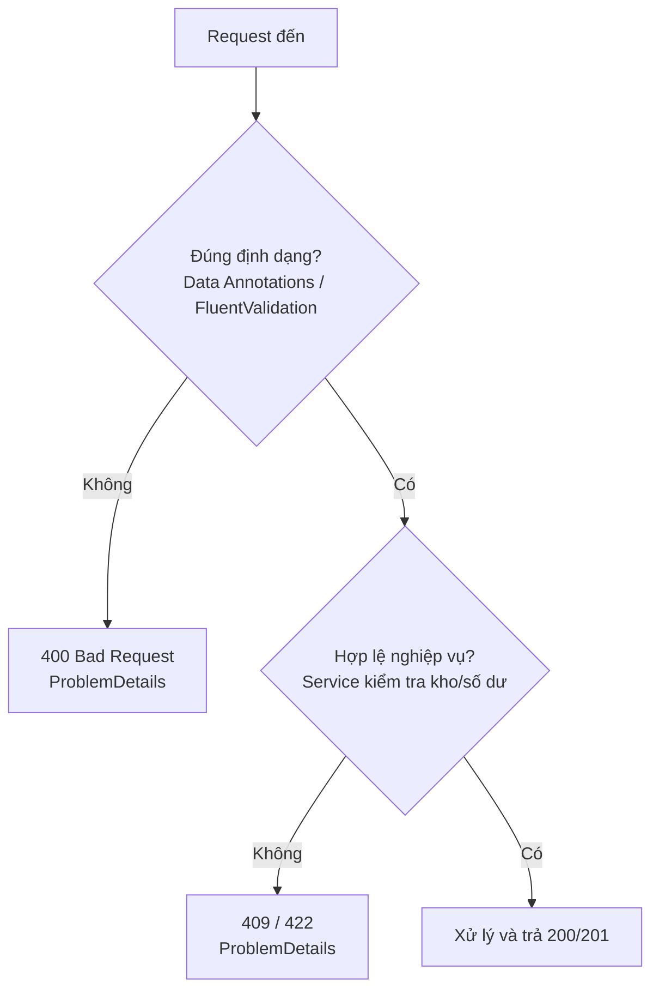

# Kiểm tra dữ liệu đầu vào (Validation)

!!! info "Bạn đang ở đây"
    cần trước: bạn đã dựng được endpoint với minimal api và biết binding tham số từ body/query.
    mở khoá: sau chương này bạn biết cách chặn dữ liệu rác ngay ở cửa ngõ, trả lỗi chuẩn hoá cho client, và tách bạch kiểm tra định dạng với luật nghiệp vụ.

> Mục tiêu (đo được): sau chương này bạn **áp dụng** được Data Annotations và FluentValidation để từ chối request sai định dạng với mã 400, đồng thời **phân biệt** đúng đâu là validation dữ liệu, đâu là business rule, và trả lỗi theo chuẩn ProblemDetails.

## 0. Đoán nhanh

Trước khi đọc tiếp, hãy tự trả lời: một API nhận `POST /orders` với body `{ "quantity": -5 }`. Đâu là "validation dữ liệu" và đâu là "business rule"? Và mã HTTP nào phù hợp cho mỗi loại?

??? note "Đáp án"
    `quantity` phải là số nguyên dương -> đây là **validation dữ liệu** (định dạng/ràng buộc), sai thì trả **400 Bad Request**.
    Còn "kho chỉ còn 3 sản phẩm nhưng khách đặt 10" là **business rule**, thường trả **409 Conflict** hoặc **422 Unprocessable Entity** kèm thông điệp nghiệp vụ. Đừng gộp chung hai loại này.

## 1. Ý niệm cốt lõi

Nguyên tắc số một khi làm web api: **không bao giờ tin dữ liệu đến từ client**. Client có thể là trình duyệt, app di động, script tấn công, hoặc chỉ là một dev gọi nhầm. Mọi request đều là "input không đáng tin" cho tới khi được kiểm tra.

Có hai tầng kiểm tra rất khác nhau về bản chất:

| Tiêu chí | Validation dữ liệu | Business rule |
|---|---|---|
| Câu hỏi | "Dữ liệu có đúng **hình dạng** không?" | "Thao tác có **hợp lệ về nghiệp vụ** không?" |
| Ví dụ | bắt buộc, độ dài, email đúng cú pháp, số dương | còn hàng trong kho, số dư đủ, chưa quá hạn |
| Cần gì để kiểm | chỉ cần bản thân request | cần truy vấn DB/dịch vụ khác |
| Mã HTTP điển hình | 400 Bad Request | 409 / 422 |
| Nơi đặt code | attribute / validator ở lớp API | tầng dịch vụ (service/domain) |

Trong ASP.NET Core, khi controller có `[ApiController]`, framework **tự động** kiểm tra Data Annotations và trả 400 kèm `ValidationProblemDetails` nếu `ModelState` không hợp lệ, trước khi action chạy. Với minimal api thì cơ chế lọc (endpoint filter) hoặc thư viện như FluentValidation lo phần này.



!!! danger "Hiểu lầm phổ biến"
    "Đã validate ở frontend rồi thì backend khỏi cần." SAI. Kiểm tra ở frontend chỉ để trải nghiệm mượt; kẻ tấn công gọi thẳng API bỏ qua UI. Backend **luôn** phải là hàng rào cuối cùng và bắt buộc.

## 2. Ví dụ mẫu

Dùng Data Annotations trên DTO. Với `[ApiController]`, không cần tự viết `if` kiểm tra, framework trả 400 giúp.

```csharp title="C#"
// test:skip cần ASP.NET Core (Microsoft.AspNetCore.Mvc)
using System.ComponentModel.DataAnnotations;
using Microsoft.AspNetCore.Mvc;

public record CreateOrderDto(
    [Required] string ProductCode,
    [Range(1, 1000)] int Quantity,
    [EmailAddress] string CustomerEmail);

[ApiController]
[Route("orders")]
public class OrdersController : ControllerBase
{
    [HttpPost]
    public IResult Create(CreateOrderDto dto)
    {
        // Nếu ModelState sai, [ApiController] đã trả 400 trước khi tới đây.
        return Results.Created($"/orders/1", dto);
    }
}
```

Khi client gửi `Quantity = 0`, response tự động là:

```json title="Kết quả 400"
{
  "type": "https://tools.ietf.org/html/rfc9110#section-15.5.1",
  "title": "One or more validation errors occurred.",
  "status": 400,
  "errors": {
    "Quantity": [ "The field Quantity must be between 1 and 1000." ]
  }
}
```

Nếu muốn kiểm tra thuần bằng BCL (không cần framework), có thể viết một hàm validate nhỏ:

```csharp title="C#"
// test:run
using System.Text.RegularExpressions;

static (bool ok, string? error) ValidateEmail(string? email)
{
    if (string.IsNullOrWhiteSpace(email))
        return (false, "Email bắt buộc.");
    if (!Regex.IsMatch(email, @"^[^@\s]+@[^@\s]+\.[^@\s]+$"))
        return (false, "Email sai định dạng.");
    return (true, null);
}

Console.WriteLine(ValidateEmail(""));
Console.WriteLine(ValidateEmail("a@b"));
Console.WriteLine(ValidateEmail("an@vidu.com"));
```

```text title="Kết quả"
(False, Email bắt buộc.)
(False, Email sai định dạng.)
(True, )
```

## 3. Bài tập có giàn giáo

Bạn cần một validator cho `RegisterUserDto` với luật phức tạp hơn Data Annotations (mật khẩu phải khớp xác nhận, tuổi >= 18). Dùng FluentValidation. Điền vào chỗ trống:

```csharp title="C#"
// test:skip cần FluentValidation
using FluentValidation;

public record RegisterUserDto(string Email, string Password, string Confirm, int Age);

public class RegisterUserValidator : AbstractValidator<RegisterUserDto>
{
    public RegisterUserValidator()
    {
        RuleFor(x => x.Email).NotEmpty().EmailAddress();
        RuleFor(x => x.Password).MinimumLength(8);
        // TODO 1: Confirm phải bằng Password
        // TODO 2: Age tối thiểu 18
    }
}
```

??? success "Lời giải"
    ```csharp title="C#"
    // test:skip cần FluentValidation
    using FluentValidation;

    public record RegisterUserDto(string Email, string Password, string Confirm, int Age);

    public class RegisterUserValidator : AbstractValidator<RegisterUserDto>
    {
        public RegisterUserValidator()
        {
            RuleFor(x => x.Email).NotEmpty().EmailAddress();
            RuleFor(x => x.Password).MinimumLength(8);
            RuleFor(x => x.Confirm)
                .Equal(x => x.Password)
                .WithMessage("Xác nhận mật khẩu không khớp.");
            RuleFor(x => x.Age)
                .GreaterThanOrEqualTo(18)
                .WithMessage("Phải từ 18 tuổi trở lên.");
        }
    }
    ```
    Vì sao dùng FluentValidation thay vì Data Annotations ở đây? Vì luật "Confirm bằng Password" là **quan hệ giữa nhiều field**, attribute rất khó diễn đạt gọn. FluentValidation cho phép biểu diễn luật liên-field và điều kiện phức tạp bằng cú pháp fluent dễ đọc, dễ test đơn vị.

## 4. Cạm bẫy & bảo mật

- **Đừng nhét business rule vào validator**. Validator không nên gọi DB để hỏi "email này đã tồn tại chưa" trong luồng đồng bộ nặng nề; hãy để tầng service quyết định và trả 409. Ranh giới rõ ràng giúp code dễ bảo trì và test.
- **Over-posting / mass assignment**: đừng dùng entity DB làm input model. Luôn dùng DTO riêng để client không set được field nhạy cảm như `IsAdmin`.
- **Thông điệp lỗi**: đủ để client sửa nhưng đừng lộ chi tiết nội bộ (tên cột DB, stack trace). ProblemDetails giúp chuẩn hoá điều này.

Cấu hình ProblemDetails theo chuẩn RFC 9457 cho toàn ứng dụng:

```csharp title="C#"
// test:skip cần ASP.NET Core
builder.Services.AddProblemDetails();

var app = builder.Build();
app.UseExceptionHandler();
app.UseStatusCodePages();
```

## Tự kiểm tra

1. Vì sao không được tin dữ liệu từ client dù frontend đã validate?

    ??? note "Đáp án"
        Vì kẻ tấn công có thể gọi thẳng API, bỏ qua UI; backend là hàng rào bắt buộc cuối cùng.

2. `[ApiController]` làm gì tự động với ModelState sai?

    ??? note "Đáp án"
        Tự trả về 400 Bad Request kèm `ValidationProblemDetails`, trước khi action chạy.

3. "Số dư tài khoản không đủ để rút tiền" là validation dữ liệu hay business rule?

    ??? note "Đáp án"
        Business rule (cần truy vấn trạng thái hệ thống); thường trả 409 hoặc 422, không phải 400.

4. Khi nào nên chọn FluentValidation thay vì Data Annotations?

    ??? note "Đáp án"
        Khi luật phức tạp, liên quan nhiều field hoặc có điều kiện, và khi muốn test đơn vị dễ dàng.

5. Chuẩn nào định nghĩa định dạng thân thiện máy cho lỗi HTTP mà ProblemDetails triển khai?

    ??? note "Đáp án"
        RFC 9457 (Problem Details for HTTP APIs), kế thừa RFC 7807.

??? abstract "DEEP DIVE: validation nâng cao"
    - **Endpoint filter cho minimal api**: từ .NET {{ dotnet.current }} bạn có thể viết `IEndpointFilter` để chạy FluentValidation trước handler, gom lỗi thành `Results.ValidationProblem(...)`. Điều này giữ handler sạch và tái sử dụng logic kiểm tra.
    - **Async validation có kiểm soát**: FluentValidation hỗ trợ `MustAsync`, nhưng cân nhắc kỹ — nếu luật cần DB thì đó thường là business rule, nên để service xử lý và trả mã trạng thái nghiệp vụ.
    - **Localization**: `WithMessage` có thể lấy chuỗi từ resource để trả lỗi đa ngôn ngữ theo `Accept-Language`.
    - **Kết hợp nguồn**: có thể vừa dùng Data Annotations cho ràng buộc đơn giản, vừa FluentValidation cho luật phức tạp; nhưng tránh trùng lặp gây khó lần vết. Với C# {{ csharp.version }}, `required` members và init-only properties giúp mô hình DTO chặt chẽ hơn ngay từ tầng ngôn ngữ.

Tiếp theo -> xử lý lỗi và middleware
