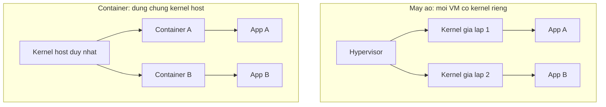

# Docker & Deploy: đóng gói và chạy ứng dụng .NET

!!! info "Bạn đang ở đây"
    cần trước: logging và xử lý ngoại lệ, đọc cấu hình từ biến môi trường.
    mở khoá: ci/cd, triển khai kubernetes, vận hành production nhiều container.

> Mục tiêu (đo được): sau chương này bạn **áp dụng** được Dockerfile multi-stage để đóng gói API .NET 10 thành image nhỏ, chạy `docker run` với biến môi trường và health check đúng, và viết được `docker-compose.yml` cho API + database chạy cùng nhau.

## 0. Đoán nhanh trước khi học

Trước khi đọc tiếp, thử trả lời (sai không sao, đoán rồi đọc sẽ nhớ lâu hơn):

1. Bạn `docker run` cùng một image ba lần. Có bao nhiêu "ứng dụng đang chạy" độc lập với nhau?
2. File `.csproj` và toàn bộ mã nguồn C# của bạn có cần nằm trong image chạy ở production không?
3. Nếu image production chứa cả bộ công cụ biên dịch (SDK), điều đó ảnh hưởng gì đến kích thước và độ an toàn?

??? note "Đáp án"
    1. Ba. Mỗi lần `docker run` tạo ra một **container** mới, độc lập, có tiến trình và filesystem ghi-được riêng — dù cả ba đều xuất phát từ cùng một **image**.
    2. Không. Ở production bạn chỉ cần *kết quả đã biên dịch* (các file `.dll` đã publish), không cần mã nguồn `.cs` hay `.csproj` gốc.
    3. Image sẽ nặng hơn rất nhiều (SDK image ~800 MB so với runtime image ~220 MB) và có **nhiều công cụ hơn = nhiều bề mặt tấn công hơn** nếu container bị chiếm quyền. Đây là lý do kỹ thuật multi-stage build ra đời — bạn sẽ học ở mục 3.

## 1. Container là gì, khác gì máy ảo (virtual machine)

**Định nghĩa bằng lời:** một **container** là một tiến trình chạy trên máy host nhưng bị "đóng gói" cùng toàn bộ file, thư viện, biến môi trường nó cần — nó *nghĩ* mình có một hệ điều hành riêng, nhưng thực chất vẫn dùng chung nhân (kernel) của hệ điều hành host.

Khác với **máy ảo (VM)** — nơi một phần mềm gọi là hypervisor giả lập *toàn bộ* một máy tính, bao gồm cả một kernel hệ điều hành riêng, khởi động mất vài chục giây tới vài phút và tốn hàng GB RAM cố định — container không giả lập kernel. Nó dùng cơ chế cách ly của kernel Linux (namespace, cgroup) để mỗi container *thấy* filesystem, tiến trình, network riêng, nhưng tất cả container trên một máy host vẫn dùng chung một kernel. Kết quả: container khởi động trong vài trăm milli-giây, và chi phí tài nguyên (RAM, CPU) gần bằng chạy tiến trình thường, không có "thuế" chạy cả một hệ điều hành khác bên trong.

| Tiêu chí | Máy ảo (VM) | Container |
|---|---|---|
| Cách ly | Toàn phần — mỗi VM có kernel riêng | Ở tầng tiến trình — dùng chung kernel host |
| Tốc độ khởi động | Vài chục giây → vài phút | Vài trăm milli-giây → vài giây |
| Chi phí RAM/CPU | Nặng — kernel riêng, driver ảo hoá riêng | Nhẹ — gần bằng chạy tiến trình thường |
| Kích thước điển hình | Hàng GB (cả hệ điều hành) | Vài chục → vài trăm MB |
| Chạy hệ điều hành khác host? | Được (VM Windows trên host Linux) | Không (container Linux cần host chạy kernel Linux) |



Điều gì xảy ra nếu bạn hiểu nhầm container "an toàn tương đương VM"? Nếu tiến trình trong container chạy bằng quyền root và có lỗ hổng thoát container (container escape), kẻ tấn công có thể chạm tới kernel host — điều không xảy ra tương tự với VM vì VM có kernel riêng biệt hoàn toàn. Đây là lý do mục 6 yêu cầu không chạy container bằng root.

!!! danger "Hiểu lầm phổ biến — chớ mắc"
    "Container là VM nhẹ." Không chính xác. Container **không** ảo hoá phần cứng hay kernel — nó là tiến trình host bị cách ly bằng cơ chế của kernel. Vì vậy container Linux **không thể** chạy trực tiếp trên kernel Windows (và ngược lại) mà không qua một lớp VM ẩn (ví dụ Docker Desktop trên macOS/Windows thực chất chạy một VM Linux nhỏ ẩn phía dưới để làm host cho container Linux).

## 2. Image và container: bản thiết kế và bản đang chạy

**Định nghĩa bằng lời:** một **image** là một bản thiết kế bất biến (immutable) — một tập hợp các lớp filesystem đã đóng băng, mô tả đầy đủ "cần những file gì, chạy lệnh gì để khởi động". Một **container** là một *thực thể đang chạy* được tạo ra từ một image, có thêm một lớp filesystem ghi-được riêng cho chính nó.

Ví dụ tối thiểu minh hoạ đúng khái niệm này (không cần Docker cài sẵn để đọc hiểu — đây là mô tả lệnh, bạn sẽ chạy thật ở mục 3):

```bash title="Terminal — một image, nhiều container"
# Kéo (hoặc build) MỘT image, đặt tên tag "myapi:1.0"
docker build -t myapi:1.0 .

# Từ image DUY NHẤT đó, tạo ra BA container độc lập
docker run -d --name c1 myapi:1.0
docker run -d --name c2 myapi:1.0
docker run -d --name c3 myapi:1.0

# Ba container đang chạy, cùng "bản thiết kế" nhưng là ba tiến trình khác nhau
docker ps
```

```text title="Kết quả (rút gọn)"
CONTAINER ID   IMAGE         NAMES   STATUS
a1b2c3d4e5f6   myapi:1.0     c1      Up 5 seconds
b2c3d4e5f6a1   myapi:1.0     c2      Up 5 seconds
c3d4e5f6a1b2   myapi:1.0     c3      Up 5 seconds
```

Điều gì xảy ra nếu bạn sửa file bên trong container `c1` (ví dụ ghi log vào `/app/data.txt`) rồi dừng nó? Thay đổi đó nằm ở lớp ghi-được riêng của `c1` — nó **không** ảnh hưởng tới image `myapi:1.0` (image vẫn bất biến) và **không** xuất hiện ở `c2` hay `c3`. Nếu bạn `docker rm c1`, toàn bộ thay đổi đó biến mất vĩnh viễn — đây chính là lý do dữ liệu cần lưu (database) phải dùng **volume** riêng, bạn sẽ thấy ở mục 8.

!!! danger "Hiểu lầm phổ biến — chớ mắc"
    "Sửa file trong container thì image cũng đổi theo." Sai. Image chỉ đổi khi bạn chạy `docker build` lại hoặc `docker commit` (rất hiếm dùng, không phải cách làm chuẩn). Thay đổi runtime bên trong một container **không bao giờ** tự động lan sang image gốc hay sang các container khác.

## 3. Dockerfile cơ bản: FROM, WORKDIR, COPY, RUN, ENTRYPOINT

**Định nghĩa bằng lời:** một `Dockerfile` là một file văn bản chứa danh sách lệnh tuần tự, mỗi lệnh mô tả một bước để Docker build ra một image. Từng lệnh cốt lõi, định nghĩa trước khi ghép:

- `FROM <image>` — chọn image nền để bắt đầu xây (ví dụ image đã có sẵn .NET runtime), mọi lệnh sau đó build tiếp lên trên nó.
- `WORKDIR <path>` — đặt thư mục làm việc hiện tại bên trong image cho các lệnh phía sau; nếu thư mục chưa tồn tại, Docker tự tạo.
- `COPY <nguồn-host> <đích-image>` — sao chép file/thư mục từ máy đang build (host) vào bên trong image đang xây.
- `RUN <lệnh>` — chạy một lệnh shell **ngay lúc build** (ví dụ biên dịch code) và lưu kết quả thành một lớp mới trong image.
- `ENTRYPOINT ["lệnh", "tham-số"]` — khai báo lệnh sẽ **tự động chạy** mỗi khi một container được tạo từ image này (đây là lúc image chuyển thành container đang chạy).

Ví dụ tối thiểu, độc lập, chỉ minh hoạ đúng 5 lệnh này (một image "hello" rất đơn giản, chưa phải multi-stage — mục 4 sẽ nâng cấp):

```dockerfile title="Dockerfile (bản đơn giản nhất, chỉ để hiểu 5 lệnh)"
# Bắt đầu từ image đã có sẵn .NET SDK 10.0 — có compiler, có runtime
FROM mcr.microsoft.com/dotnet/sdk:10.0

# Mọi lệnh sau đây chạy trong thư mục /src bên trong image
WORKDIR /src

# Copy toàn bộ mã nguồn từ host (dấu . đầu) vào /src trong image (dấu . sau)
COPY . .

# Biên dịch và publish NGAY LÚC BUILD image — kết quả nằm ở /app/publish
RUN dotnet publish -c Release -o /app/publish

# Khi container khởi động, chạy lệnh này
ENTRYPOINT ["dotnet", "/app/publish/Api.dll"]
```

```bash title="Terminal"
docker build -t myapi:demo .
docker run --rm myapi:demo
```

```text title="Kết quả"
info: Microsoft.Hosting.Lifetime[14]
      Now listening on: http://[::]:8080
info: Microsoft.Hosting.Lifetime[0]
      Application started. Press Ctrl+C to shut down.
```

Điều gì xảy ra nếu bạn quên `ENTRYPOINT`? Docker vẫn build image thành công (`ENTRYPOINT` không bắt buộc để *build*), nhưng khi bạn `docker run` mà không truyền lệnh nào, Docker không biết chạy gì và container sẽ khởi động rồi dừng ngay (exit code khác 0, thường kèm thông báo tương tự `"no command specified"`). Điều gì xảy ra nếu bạn quên `WORKDIR` và dùng đường dẫn tuyệt đối lộn xộn ở mọi lệnh? Dockerfile vẫn build được nhưng khó đọc và dễ copy sai thư mục — không phải lỗi cứng, nhưng là cạm bẫy thực chiến.

!!! danger "Hiểu lầm phổ biến — chớ mắc"
    "Dockerfile này (chỉ dùng image `sdk`) là đủ tốt cho production." Chưa đủ. Ví dụ trên minh hoạ đúng 5 lệnh cơ bản, nhưng image cuối cùng vẫn mang theo toàn bộ mã nguồn C# và cả bộ SDK/compiler nặng hàng trăm MB — không an toàn và không tối ưu. Mục 4 sửa đúng vấn đề này bằng multi-stage build.

## 4. Multi-stage build: tách giai đoạn build và giai đoạn chạy

**Định nghĩa bằng lời:** **multi-stage build** là kỹ thuật viết Dockerfile với nhiều khối `FROM ... AS <tên-stage>` — stage đầu dùng image đầy đủ công cụ (SDK) để biên dịch/publish, stage cuối dùng image runtime nhỏ hơn và chỉ `COPY --from=<stage-trước>` đúng phần kết quả publish sang, bỏ lại tất cả những gì không cần (SDK, mã nguồn, cache NuGet).

Vì sao **không** COPY toàn bộ source code và SDK vào image cuối: (1) image sẽ nặng hơn gấp nhiều lần một cách không cần thiết, tốn thời gian pull/push và dung lượng lưu trữ; (2) SDK mang nhiều công cụ (compiler, MSBuild) làm tăng bề mặt tấn công nếu container bị chiếm quyền; (3) mang theo mã nguồn `.cs`/`.csproj` nghĩa là bất kỳ ai `docker save`/`docker export` được image cũng đọc được toàn bộ logic nội bộ của bạn, có thể lộ chi tiết business hoặc comment nhạy cảm.

Ví dụ cụ thể 2 stage, nâng cấp từ Dockerfile đơn giản ở mục 3:

```dockerfile title="Dockerfile (multi-stage — bản dùng cho production)"
# ---- Stage 1: "build" — dùng SDK, có compiler, MSBuild, NuGet ----
FROM mcr.microsoft.com/dotnet/sdk:10.0 AS build
WORKDIR /src

# Copy .csproj TRƯỚC rồi restore riêng — tận dụng cache layer của Docker:
# nếu chỉ sửa code mà không đổi dependency, bước restore không cần chạy lại
COPY ["Api.csproj", "./"]
RUN dotnet restore "Api.csproj"

# Copy phần còn lại của mã nguồn rồi publish ở chế độ Release
COPY . .
RUN dotnet publish "Api.csproj" -c Release -o /app/publish --no-restore

# ---- Stage 2: "final" — dùng ASP.NET runtime, KHÔNG có SDK, KHÔNG có source ----
FROM mcr.microsoft.com/dotnet/aspnet:10.0 AS final
WORKDIR /app

# Chỉ copy KẾT QUẢ publish từ stage "build" — không mang SDK, không mang .cs/.csproj
COPY --from=build /app/publish .

ENTRYPOINT ["dotnet", "Api.dll"]
```

```text title="So sánh kích thước (xấp xỉ)"
Chỉ dùng image sdk (mục 3)          : ~800 MB (SDK + source + publish output)
Multi-stage, chỉ copy publish (mục 4): ~230 MB (runtime aspnet + publish output)
```


Bài tập giàn giáo ngay dưới để bạn tự kiểm tra hiểu multi-stage trước khi qua các phần còn lại.

### Tự kiểm tra nhanh — điền chỗ trống multi-stage

Điền vào 2 chỗ trống để hoàn thành Dockerfile multi-stage đúng: stage đầu tên `build` dùng SDK 10.0, stage cuối dùng ASP.NET runtime 10.0 và chỉ copy đúng thư mục publish.

```dockerfile title="Dockerfile (giàn giáo)"
FROM mcr.microsoft.com/dotnet/sdk:10.0 AS build
WORKDIR /src
COPY . .
RUN dotnet publish -c Release -o /app/publish

# TODO 1: khai báo stage cuối, dùng image aspnet:10.0, đặt tên "final"
WORKDIR /app

# TODO 2: copy đúng thư mục publish từ stage "build" sang thư mục hiện tại
ENTRYPOINT ["dotnet", "Api.dll"]
```

??? success "Lời giải & giải thích"
    ```dockerfile title="Dockerfile"
    FROM mcr.microsoft.com/dotnet/sdk:10.0 AS build
    WORKDIR /src
    COPY . .
    RUN dotnet publish -c Release -o /app/publish

    FROM mcr.microsoft.com/dotnet/aspnet:10.0 AS final
    WORKDIR /app

    COPY --from=build /app/publish .
    ENTRYPOINT ["dotnet", "Api.dll"]
    ```
    TODO 1 cần `FROM mcr.microsoft.com/dotnet/aspnet:10.0 AS final` — image `aspnet` không có compiler/MSBuild, chỉ có runtime để chạy `.dll` đã publish, nên nhẹ hơn `sdk` rất nhiều. TODO 2 cần `COPY --from=build /app/publish .` — cú pháp `--from=<tên-stage>` cho phép lấy file từ một stage build trước đó dù stage đó không còn tồn tại trong image cuối; dấu `.` ở cuối nghĩa là copy vào đúng `WORKDIR` hiện tại (`/app`).

## 5. .dockerignore: loại file trước khi gửi cho Docker

**Định nghĩa bằng lời:** `.dockerignore` là một file danh sách các đường dẫn mà Docker sẽ **bỏ qua hoàn toàn** khi gửi "build context" (toàn bộ nội dung thư mục hiện hành) tới Docker daemon để build — hoạt động giống `.gitignore` nhưng áp dụng cho lệnh `docker build`.

Nếu không có `.dockerignore`, mọi lệnh `COPY . .` sẽ copy luôn cả `bin/`, `obj/` (kết quả build cũ trên máy bạn, có thể sai kiến trúc CPU) và các file cấu hình môi trường dev — vừa làm image nặng hơn không cần thiết, vừa có rủi ro lộ dữ liệu nhạy cảm nếu ai đó `docker save` hoặc pull được image.

```text title=".dockerignore"
bin/
obj/
.git/
.vs/
**/appsettings.Development.json
**/*.user
Dockerfile
docker-compose.yml
```

Điều gì xảy ra nếu bạn **thiếu** dòng `bin/` và `obj/`? `COPY . .` sẽ copy luôn các file `.dll` đã build sẵn trên máy dev (có thể build cho macOS/ARM) đè lên hoặc lẫn với kết quả `dotnet publish` chạy trong container (build cho Linux/x64) — gây lỗi runtime khó hiểu như `"Exec format error"` hoặc app không khởi động được dù build "thành công". Điều gì xảy ra nếu bạn **thiếu** dòng loại `appsettings.Development.json`? Chuỗi kết nối database local hoặc secret dev có thể vô tình bị bake cứng vào image, và bất kỳ ai có image đó (kể cả sau khi bạn xoá file trên host) đều đọc được.

!!! danger "Hiểu lầm phổ biến — chớ mắc"
    "`.dockerignore` chỉ để cho gọn, không ảnh hưởng bảo mật." Sai — nó trực tiếp quyết định thứ gì có mặt bên trong image cuối cùng khi bạn dùng `COPY . .`. Bỏ sót một dòng ở đây nghĩa là bỏ sót một đường lộ dữ liệu.

## 6. Biến môi trường trong container: ASPNETCORE_ENVIRONMENT và ASPNETCORE_URLS

**Định nghĩa bằng lời:** **biến môi trường (environment variable)** là một cặp tên–giá trị được truyền vào tiến trình lúc khởi động (không nằm trong code, không nằm trong image), cho phép cùng một image chạy khác hành vi ở các môi trường khác nhau mà không cần build lại. Với ASP.NET Core, hai biến quan trọng nhất là:

- `ASPNETCORE_ENVIRONMENT` — quyết định app đang chạy ở môi trường nào (`Development`, `Staging`, `Production`), ảnh hưởng file cấu hình nào được nạp (`appsettings.{Environment}.json`) và có hiện trang lỗi chi tiết hay không.
- `ASPNETCORE_URLS` (hoặc `ASPNETCORE_HTTP_PORTS` ở các bản mới) — quyết định địa chỉ/cổng mà Kestrel (web server tích hợp của ASP.NET Core) lắng nghe bên trong container.

```bash title="Terminal — truyền biến môi trường lúc chạy"
docker run --rm -p 5000:8080 \
  -e ASPNETCORE_ENVIRONMENT=Production \
  -e ASPNETCORE_URLS=http://+:8080 \
  myapi:1.0
```

```text title="Kết quả"
info: Microsoft.Hosting.Lifetime[14]
      Now listening on: http://[::]:8080
info: Microsoft.Hosting.Lifetime[0]
      Hosting environment: Production
```

Điều gì xảy ra nếu bạn **quên** đặt `ASPNETCORE_ENVIRONMENT` khi chạy production? Giá trị mặc định khi không đặt là `Production`\* trong hầu hết image chính thức, nhưng nếu image của bạn (hoặc `launchSettings.json` bake sẵn) từng đặt `Development`, app có thể vô tình hiện trang lỗi chi tiết (`DeveloperExceptionPage`) — lộ stack trace, đường dẫn nội bộ ra ngoài Internet, đúng dạng lỗi mà chương logging đã cảnh báo tuyệt đối không để lộ. Điều gì xảy ra nếu bạn quên khai `ASPNETCORE_URLS`/cổng lắng nghe khớp với cổng bạn map ở `docker run -p`? Container vẫn chạy "khoẻ" nhưng bạn gọi vào cổng host lại nhận `Connection refused` — vì Kestrel đang lắng nghe cổng khác cổng bạn map, đây là lỗi cấu hình cực phổ biến, không phải lỗi Docker.

!!! danger "Hiểu lầm phổ biến — chớ mắc"
    "`EXPOSE 8080` trong Dockerfile tự động mở cổng ra ngoài host." Sai. `EXPOSE` chỉ là **tài liệu hoá** — nói với người đọc Dockerfile (và một số công cụ) rằng "container này dự kiến lắng nghe cổng này". Việc **ánh xạ thật** từ cổng host sang cổng container chỉ xảy ra khi bạn dùng `-p <host>:<container>` ở `docker run`, hoặc `ports:` trong `docker-compose.yml`.

## 7. Health check: cho hệ thống biết container còn "sống" hay không

**Định nghĩa bằng lời:** **health check (kiểm tra sức khoẻ)** là một lệnh hoặc endpoint mà Docker (hoặc một orchestrator như Kubernetes) gọi định kỳ để hỏi "container/app này còn hoạt động đúng không?" — dựa trên câu trả lời, hệ thống quyết định có khởi động lại container, ngừng gửi traffic tới nó, hay coi nó "chưa sẵn sàng" để chờ thêm.

Có hai cách làm phổ biến, cả hai bổ trợ nhau: (1) khai `HEALTHCHECK` ngay trong Dockerfile để Docker tự gọi định kỳ; (2) app tự lộ một endpoint HTTP `/health` trả `200 OK` khi khoẻ, để bất kỳ công cụ bên ngoài (load balancer, Kubernetes probe) gọi vào kiểm tra.

```dockerfile title="Dockerfile — thêm HEALTHCHECK"
FROM mcr.microsoft.com/dotnet/aspnet:10.0 AS final
WORKDIR /app
COPY --from=build /app/publish .

# Docker tự gọi lệnh này mỗi 30 giây; container bị đánh dấu "unhealthy"
# nếu lệnh trả về mã khác 0 quá 3 lần liên tiếp (retries=3)
HEALTHCHECK --interval=30s --timeout=3s --retries=3 \
    CMD curl -f http://localhost:8080/health || exit 1

ENTRYPOINT ["dotnet", "Api.dll"]
```

```csharp title="C# — endpoint /health tối thiểu"
// test:compile
var builder = WebApplication.CreateBuilder(args);
var app = builder.Build();

// Trả 200 OK đơn giản: "tiến trình còn phản hồi request"
app.MapGet("/health", () => Results.Ok(new { status = "healthy" }));

app.Run();
```

```bash title="Terminal — xem trạng thái health"
docker ps
```

```text title="Kết quả"
CONTAINER ID   IMAGE       STATUS
a1b2c3d4e5f6   myapi:1.0   Up 2 minutes (healthy)
```

Điều gì xảy ra nếu bạn **không** khai `HEALTHCHECK` và app bị treo (tiến trình vẫn sống nhưng không phản hồi request, ví dụ deadlock)? Docker vẫn báo container đang "Up" — vì tiến trình chưa crash — nên nó **không tự khởi động lại** dù app thực chất đã "chết não". Đây là lý do health check quan trọng: nó kiểm tra *app có hoạt động đúng*, không chỉ *tiến trình có tồn tại*.

!!! danger "Hiểu lầm phổ biến — chớ mắc"
    "Container đang ở trạng thái `Up` nghĩa là app hoạt động bình thường." Sai. `Up` chỉ nghĩa là tiến trình chính (PID 1 trong container) chưa thoát. Một app bị deadlock, kẹt vòng lặp vô hạn, hay hết kết nối tới database vẫn có thể hiển thị `Up` mãi mãi nếu không có health check để phát hiện và báo `unhealthy`.

## 8. docker-compose: nhiều container làm việc cùng nhau

**Định nghĩa bằng lời:** **Docker Compose** là công cụ mô tả và điều khiển **nhiều container liên quan tới nhau** (ví dụ: một API + một database) bằng một file YAML duy nhất, thay vì phải gõ nhiều lệnh `docker run` dài dòng và tự quản lý network giữa các container bằng tay.

Mỗi container trong file được gọi là một **service**; các service trong cùng file compose tự động nằm trên một network riêng và có thể gọi nhau bằng **tên service** làm hostname (không cần biết IP). Ví dụ tối thiểu 2 service — API và PostgreSQL 17:

```yaml title="docker-compose.yml (tối thiểu 2 service)"
services:
  api:
    build: .                      # build từ Dockerfile ở thư mục hiện tại
    ports:
      - "5000:8080"                # host:container
    environment:
      - ASPNETCORE_ENVIRONMENT=Production
      # "db" ở đây là TÊN SERVICE bên dưới, Docker tự phân giải thành IP nội bộ
      - ConnectionStrings__Db=Host=db;Database=app;Username=app;Password=${DB_PASSWORD}
    depends_on:
      - db

  db:
    image: postgres:17
    environment:
      - POSTGRES_USER=app
      - POSTGRES_DB=app
      - POSTGRES_PASSWORD=${DB_PASSWORD}
    volumes:
      - pgdata:/var/lib/postgresql/data   # dữ liệu sống ngoài vòng đời container

volumes:
  pgdata:
```

```bash title="Terminal"
# ${DB_PASSWORD} đọc từ file .env cùng thư mục (đã .gitignore) — KHÔNG hardcode trong yml
echo "DB_PASSWORD=s3cr3t-strong" > .env
docker compose up --build
```

```text title="Kết quả (rút gọn)"
[+] Running 2/2
 ✔ Container learning-tool-db-1   Started
 ✔ Container learning-tool-api-1  Started
api-1  | info: Microsoft.Hosting.Lifetime[14]
api-1  |       Now listening on: http://[::]:8080
```

Điều gì xảy ra nếu API cố kết nối `Host=db` **trước khi** Postgres sẵn sàng nhận kết nối (dù tiến trình Postgres đã "Up")? `depends_on` mặc định chỉ đợi container khởi động, **không** đợi database thực sự nhận kết nối được — API có thể ném lỗi kết nối (`Npgsql.NpgsqlException: Connection refused`) ngay ở lần thử đầu. Cách khắc phục đúng: kết hợp `depends_on` với `condition: service_healthy`, dựa trên `healthcheck` của service `db` (dùng `pg_isready`) — đây chính là ứng dụng thực chiến của khái niệm health check ở mục 7, áp dụng chéo sang một service khác.

!!! danger "Hiểu lầm phổ biến — chớ mắc"
    "Đặt `POSTGRES_PASSWORD=matkhau123` thẳng trong `docker-compose.yml` rồi commit lên git cũng được, dev thôi." Sai, đây là lộ secret vào lịch sử git vĩnh viễn (xoá dòng sau vẫn còn trong `git log`). Luôn dùng biến `${TÊN_BIẾN}` đọc từ file `.env` không commit (hoặc từ secret manager ở production).

## Cạm bẫy & thực chiến

- **Layer Dockerfile là bất biến và ai cũng đọc được bằng `docker history`.** Đặt `ENV DB_PASSWORD=matkhau123` trong Dockerfile khiến secret đó tồn tại vĩnh viễn trong image, dù bạn "ghi đè" bằng `ENV` khác ở dòng sau — layer cũ vẫn còn nguyên trong image, `docker history --no-trunc <image>` lộ ra ngay. Secret luôn truyền lúc **runtime** (`-e`, file `.env`, `docker secret`, hoặc secret manager của orchestrator).
- **Thứ tự COPY quyết định hiệu quả cache.** Copy `.csproj` và `restore` trước khi `COPY . .` toàn bộ mã nguồn giúp Docker cache lại lớp restore — nếu bạn chỉ sửa logic C# mà không đổi package, `dotnet restore` không phải chạy lại. Đảo ngược thứ tự (copy hết rồi mới restore) khiến **mọi lần sửa code** đều làm mất cache và restore lại từ đầu, build chậm hơn nhiều lần.
- **Không dùng tag `latest` để chốt phiên bản base image trên production.** `FROM mcr.microsoft.com/dotnet/aspnet:latest` khiến build hôm nay và build tháng sau có thể ra image khác nhau (base image âm thầm đổi phiên bản), gây lỗi khó tái hiện. Ghim tag cụ thể như `aspnet:10.0`, và có kế hoạch rebuild định kỳ để vẫn nhận bản vá bảo mật.
- **Chạy container bằng root là mặc định ở nhiều base image, phải chủ động đổi.** Nếu không khai `USER <tên-user-không-đặc-quyền>` trong Dockerfile, tiến trình bên trong container chạy với UID 0 (root). Nếu container bị khai thác lỗ hổng, kẻ tấn công có quyền root *bên trong* container — kết hợp với lỗ hổng thoát container (mục 1 đã nói), đây là đường leo thang quyền nguy hiểm ra host. Image `aspnet` chính thức có sẵn user không đặc quyền tên `app` (UID 1654) — chỉ cần thêm dòng `USER app`.
- **`docker build` gửi toàn bộ thư mục hiện hành làm "build context" mỗi lần chạy**, dù `.dockerignore` đã lọc file copy vào image. Nếu thư mục project có file/thư mục cực lớn không liên quan (ví dụ ảnh mẫu, log cũ) mà bạn quên thêm vào `.dockerignore`, mỗi lần build vẫn phải nén và gửi toàn bộ chỗ đó cho Docker daemon dù cuối cùng không dùng — làm build chậm không cần thiết.

## Bài tập

**Bài 1 (giàn giáo).** Sửa Dockerfile dưới để chạy bằng user không đặc quyền và khai health check gọi `/health` mỗi 15 giây.

```dockerfile title="Dockerfile (giàn giáo)"
FROM mcr.microsoft.com/dotnet/sdk:10.0 AS build
WORKDIR /src
COPY . .
RUN dotnet publish -c Release -o /app/publish

FROM mcr.microsoft.com/dotnet/aspnet:10.0 AS final
WORKDIR /app
COPY --from=build /app/publish .

# TODO 1: thêm HEALTHCHECK gọi http://localhost:8080/health, mỗi 15 giây
# TODO 2: chuyển sang user không đặc quyền có sẵn tên "app"

ENTRYPOINT ["dotnet", "Api.dll"]
```

??? success "Lời giải & giải thích"
    ```dockerfile title="Dockerfile"
    FROM mcr.microsoft.com/dotnet/sdk:10.0 AS build
    WORKDIR /src
    COPY . .
    RUN dotnet publish -c Release -o /app/publish

    FROM mcr.microsoft.com/dotnet/aspnet:10.0 AS final
    WORKDIR /app
    COPY --from=build /app/publish .

    HEALTHCHECK --interval=15s --timeout=3s --retries=3 \
        CMD curl -f http://localhost:8080/health || exit 1

    USER app

    ENTRYPOINT ["dotnet", "Api.dll"]
    ```
    `HEALTHCHECK --interval=15s` đặt tần suất kiểm tra theo yêu cầu bài. `USER app` chuyển tiến trình chạy dưới user có sẵn trong image `aspnet`, không cần tạo user mới — giảm rủi ro nếu container bị chiếm quyền, đúng như mục "Cạm bẫy" đã nêu.

**Bài 2 (thiết kế).** Thiết kế (không cần chạy thật) một `docker-compose.yml` cho hệ thống gồm 3 service: `api` (build từ Dockerfile hiện tại), `db` (PostgreSQL 17, có healthcheck bằng `pg_isready`), và `api` chỉ khởi động **sau khi** `db` báo khoẻ. Mật khẩu DB không được hardcode.

??? success "Lời giải & giải thích"
    ```yaml title="docker-compose.yml"
    services:
      api:
        build: .
        ports:
          - "5000:8080"
        environment:
          - ConnectionStrings__Db=Host=db;Database=app;Username=app;Password=${DB_PASSWORD}
        depends_on:
          db:
            condition: service_healthy   # đợi healthcheck của db PASS, không chỉ đợi "Up"

      db:
        image: postgres:17
        environment:
          - POSTGRES_USER=app
          - POSTGRES_DB=app
          - POSTGRES_PASSWORD=${DB_PASSWORD}
        healthcheck:
          test: ["CMD-SHELL", "pg_isready -U app -d app"]
          interval: 5s
          timeout: 3s
          retries: 5
        volumes:
          - pgdata:/var/lib/postgresql/data

    volumes:
      pgdata:
    ```
    Điểm mấu chốt: `condition: service_healthy` (không phải `condition: service_started`) buộc Compose đợi `healthcheck` của `db` trả PASS trước khi khởi động `api` — giải quyết đúng vấn đề "database chưa sẵn sàng nhận kết nối dù container đã Up" đã nêu ở mục 8. `${DB_PASSWORD}` đọc từ `.env` ngoài git, không nằm literal trong file yml hay Dockerfile.

## Tự kiểm tra

1. Container khác VM ở điểm cách ly nào — cụ thể là kernel?
2. Từ một image, `docker run` ba lần thì có ba image hay ba container?
3. Vì sao multi-stage build không COPY toàn bộ mã nguồn và SDK vào image cuối?
4. `.dockerignore` giải quyết vấn đề gì mà `.gitignore` không giải quyết được cho Docker?
5. `EXPOSE 8080` trong Dockerfile có tự mở cổng ra host không? Cái gì mới thực sự mở cổng?
6. Container ở trạng thái `Up` có chắc là app đang hoạt động đúng không? Vì sao cần `HEALTHCHECK`?
7. Trong `docker-compose.yml`, `condition: service_healthy` khác gì so với việc chỉ khai `depends_on` không kèm condition?

??? note "Đáp án"
    1. Container dùng chung kernel của host (cách ly ở tầng tiến trình qua namespace/cgroup); VM có kernel riêng hoàn toàn được hypervisor giả lập.
    2. Ba container. Image không đổi số lượng — nó vẫn là một bản thiết kế bất biến; mỗi lần `docker run` tạo một container (thực thể đang chạy) mới từ đó.
    3. Vì production chỉ cần kết quả đã publish để *chạy*; mang SDK làm image nặng hơn và tăng bề mặt tấn công, mang mã nguồn làm lộ logic nội bộ nếu ai đó lấy được image.
    4. `.dockerignore` lọc file **trước khi gửi build context cho Docker daemon và trước khi COPY vào image** — kể cả file đã bị `.gitignore` bỏ qua khỏi git nhưng vẫn tồn tại trên đĩa (ví dụ `bin/`, `obj/`) vẫn cần lọc riêng ở đây vì Docker không đọc `.gitignore`.
    5. Không. `EXPOSE` chỉ là tài liệu hoá cổng dự kiến. Cổng thực sự mở bằng `-p <host>:<container>` ở `docker run` hoặc `ports:` trong compose.
    6. Không chắc. `Up` chỉ nghĩa tiến trình chính chưa thoát; app có thể deadlock hoặc kẹt mà vẫn "Up". `HEALTHCHECK` (hoặc endpoint `/health`) kiểm tra app có *phản hồi đúng*, không chỉ *còn tồn tại*.
    7. `depends_on` không kèm condition chỉ đợi container khởi động (tiến trình bắt đầu chạy); `condition: service_healthy` đợi đến khi `healthcheck` của service đó thực sự báo PASS, tức service sẵn sàng nhận request/kết nối thật.

??? abstract "DEEP DIVE — nâng cao (ngoài fast path)"
    - **Chiselled / distroless image:** biến thể như `aspnet:10.0-noble-chiseled` loại bỏ shell và package manager khỏi image, chỉ giữ thư viện tối thiểu để chạy .NET — nhỏ hơn và ít lỗ hổng hơn nữa so với multi-stage thường, đánh đổi là khó `docker exec` vào debug (không có `bash`/`sh`).
    - **Native AOT & trimming:** publish với Native AOT hoặc `PublishTrimmed=true` loại bỏ code không dùng tới và biên dịch thẳng ra native, cho image nhỏ hơn và khởi động nhanh hơn nữa — đánh đổi là một số API dùng reflection nặng có thể không chạy được, cần kiểm thử kỹ.
    - **BuildKit cache mount:** `RUN --mount=type=cache,target=/root/.nuget/packages dotnet restore` giữ cache NuGet **giữa các lần build khác nhau** trên máy CI, không chỉ giữa các layer trong một lần build — giảm thời gian restore đáng kể trên CI lặp lại nhiều lần.
    - **Secret ở cấp orchestrator:** trong Kubernetes hay Docker Swarm, secret được mount vào container dưới dạng file tạm trong tmpfs (bộ nhớ, không chạm đĩa), không đi qua biến môi trường hay image history — an toàn hơn cách dùng `-e`/`.env` đã học ở mục 6 và 8 cho môi trường production thật.
    - **Multi-arch build:** `docker buildx build --platform linux/amd64,linux/arm64 -t myapi:1.0 --push .` build một image chạy được cả trên máy Apple Silicon (ARM) và server x64 (Intel/AMD) từ cùng một Dockerfile, hữu ích khi team dev dùng Mac M-series nhưng production chạy trên server x64.
    - **Rootless Docker daemon:** ngoài việc container chạy non-root (mục "Cạm bẫy"), cả **Docker daemon** chính nó cũng có thể chạy ở chế độ rootless trên host — giảm thêm một tầng rủi ro nếu daemon bị khai thác.

**Tiếp theo →** [P5 · Dùng Claude Code](../p5-ai/claude-code.md)
