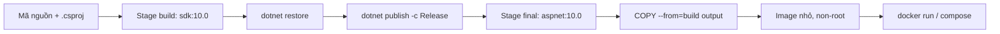

# Docker & Triển khai

!!! info "Bạn đang ở đây"
    **cần trước:** logging & xử lý ngoại lệ.
    **mở khoá:** ci/cd, kubernetes, triển khai production.

> **Mục tiêu:** **Áp dụng** được Dockerfile multi-stage để đóng gói API .NET {{ dotnet.current }} thành image nhỏ, chạy non-root, kèm docker compose gồm API + PostgreSQL {{ postgres.current }} với secret nằm ngoài image.

---

## 0. Đoán nhanh

Trước khi đọc tiếp, thử trả lời: **vì sao ta không dùng luôn image `sdk` để chạy app production, mà phải tách ra image `aspnet`?**

??? question "Đáp án"
    Image `sdk` chứa toàn bộ trình biên dịch, MSBuild, NuGet cache... nặng hàng trăm MB và **tăng bề mặt tấn công** (nhiều công cụ = nhiều lỗ hổng tiềm ẩn). Runtime image `aspnet` chỉ chứa thứ cần để *chạy* app đã build. Multi-stage build tận dụng `sdk` để biên dịch rồi **chỉ copy output** sang `aspnet` → image cuối nhỏ và an toàn hơn nhiều.

---

## 1. Ý niệm cốt lõi

Một **image** là ảnh chụp bất biến của filesystem + metadata; một **container** là một tiến trình chạy từ image đó. Ta muốn image production: (1) **nhỏ**, (2) **không chạy bằng root**, (3) **không chứa secret**.

Kỹ thuật **multi-stage build** chia Dockerfile thành nhiều giai đoạn. Giai đoạn `build` dùng `sdk` để `restore` + `publish`; giai đoạn cuối dùng `aspnet` và chỉ `COPY --from=build` phần output. Các layer trung gian bị bỏ đi khỏi image cuối.

| Thành phần | Image | Kích thước (xấp xỉ) | Vai trò |
|---|---|---|---|
| Build stage | `mcr.microsoft.com/dotnet/sdk:10.0` | ~800 MB | restore, build, publish |
| Runtime stage | `mcr.microsoft.com/dotnet/aspnet:10.0` | ~220 MB | chạy app đã publish |
| Image cuối cùng | (chỉ runtime + output) | ~230 MB | giao cho production |

Luồng multi-stage:



!!! danger "Hiểu lầm phổ biến"
    "Cứ để mặc định thì container chạy root cũng không sao." **Sai.** Mặc định nhiều base image chạy dưới UID 0. Nếu container bị chiếm quyền, kẻ tấn công có quyền root *bên trong* container và dễ leo thang ra host. Luôn khai báo một user không đặc quyền bằng `USER`.

---

## 2. Ví dụ mẫu

### Dockerfile multi-stage

```dockerfile title="Dockerfile"
# ---- Stage 1: build ----
FROM mcr.microsoft.com/dotnet/sdk:10.0 AS build
WORKDIR /src

# Copy .csproj trước để tận dụng cache layer khi restore
COPY ["Api.csproj", "./"]
RUN dotnet restore "Api.csproj"

# Copy phần còn lại rồi publish ở chế độ Release
COPY . .
RUN dotnet publish "Api.csproj" -c Release -o /app/publish --no-restore

# ---- Stage 2: runtime ----
FROM mcr.microsoft.com/dotnet/aspnet:10.0 AS final
WORKDIR /app

# Chạy non-root: image aspnet có sẵn user "app" (UID 1654)
USER app

# Cổng ứng dụng lắng nghe bên trong container
ENV ASPNETCORE_HTTP_PORTS=8080
EXPOSE 8080

# Chỉ copy output đã publish, không mang theo SDK
COPY --from=build /app/publish .

ENTRYPOINT ["dotnet", "Api.dll"]
```

**Giải thích:** Copy `.csproj` và `restore` trước khi copy toàn bộ mã giúp Docker cache lớp restore — sửa code mà không đổi dependency thì không phải restore lại. `USER app` chuyển tiến trình sang tài khoản không đặc quyền. `EXPOSE 8080` chỉ là tài liệu hoá cổng; ánh xạ thật nằm ở `docker run -p` hoặc compose.

### .dockerignore

```text title=".dockerignore"
bin/
obj/
.git/
.vs/
**/appsettings.Development.json
**/*.user
Dockerfile
docker-compose.yml
```

**Giải thích:** File này giảm **build context** gửi tới daemon, tránh copy nhầm `bin/obj` cũ và **loại file nhạy cảm** (ví dụ `appsettings.Development.json` có thể chứa chuỗi kết nối local).

### Build & run

```bash title="Terminal"
# Build image, gắn tag
docker build -t myorg/api:1.0 .

# Chạy, ánh xạ cổng host 5000 -> container 8080, truyền secret qua env
docker run --rm -p 5000:8080 \
  -e ConnectionStrings__Db="Host=localhost;Database=app;Username=app;Password=changeme" \
  myorg/api:1.0
```

```text title="Kết quả"
info: Microsoft.Hosting.Lifetime[14]
      Now listening on: http://[::]:8080
info: Microsoft.Hosting.Lifetime[0]
      Application started. Press Ctrl+C to shut down.
```

Lưu ý cú pháp `ConnectionStrings__Db`: dấu `__` (hai gạch dưới) được .NET config ánh xạ thành section lồng nhau `ConnectionStrings:Db`.

---

## 3. Bài tập có giàn giáo

Viết `docker-compose.yml` chạy **api + Postgres**, với health check và secret **không hardcode trong image**. Giàn giáo:

```yaml title="docker-compose.yml (giàn giáo)"
services:
  api:
    build: .
    ports:
      - "5000:8080"
    environment:
      - ConnectionStrings__Db=Host=db;Database=app;Username=app;Password=${DB_PASSWORD}
    depends_on:
      db:
        condition: service_healthy   # đợi Postgres khoẻ mới khởi động api
  db:
    image: postgres:__ĐIỀN__
    environment:
      - POSTGRES_USER=app
      - POSTGRES_DB=app
      # TODO: truyền mật khẩu từ biến môi trường, KHÔNG viết literal
    healthcheck:
      # TODO: dùng pg_isready
      interval: 5s
      timeout: 3s
      retries: 5
    volumes:
      - pgdata:/var/lib/postgresql/data
volumes:
  pgdata:
```

??? success "Lời giải + vì sao"
    ```yaml title="docker-compose.yml"
    services:
      api:
        build: .
        ports:
          - "5000:8080"
        environment:
          - ConnectionStrings__Db=Host=db;Database=app;Username=app;Password=${DB_PASSWORD}
        depends_on:
          db:
            condition: service_healthy
      db:
        image: postgres:17
        environment:
          - POSTGRES_USER=app
          - POSTGRES_DB=app
          - POSTGRES_PASSWORD=${DB_PASSWORD}
        healthcheck:
          test: ["CMD-SHELL", "pg_isready -U app -d app"]
          interval: 5s
          timeout: 3s
          retries: 5
        volumes:
          - pgdata:/var/lib/postgresql/data
    volumes:
      pgdata:
    ```
    ```bash title="Terminal"
    # Secret nằm ở file .env (đã git-ignore), KHÔNG nằm trong image
    echo "DB_PASSWORD=s3cr3t-strong" > .env
    docker compose up --build
    ```
    **Vì sao:** `${DB_PASSWORD}` đọc từ file `.env` lúc chạy nên mật khẩu **không bị bake vào image** (image có thể bị người khác `docker pull` và `docker history` để dò). `condition: service_healthy` khiến `api` chỉ khởi động khi `pg_isready` báo Postgres sẵn sàng, tránh lỗi kết nối lúc khởi động. `volumes: pgdata` giữ dữ liệu qua các lần tái tạo container.

---

## 4. Cạm bẫy & bảo mật

!!! warning "Đừng để lộ secret trong layer"
    Mỗi lệnh `RUN`, `COPY`, `ENV` trong Dockerfile tạo một layer **bất biến, ai cũng đọc được** bằng `docker history`. Đặt `ENV DB_PASSWORD=...` trong Dockerfile là để lộ secret vĩnh viễn dù bạn có "ghi đè" ở layer sau. Secret luôn truyền lúc **runtime** (env, `docker secret`, orchestrator).

- **Không** copy `appsettings.*.json` chứa dữ liệu nhạy cảm — dùng `.dockerignore`.
- Ghim tag base image (ví dụ `aspnet:10.0`) thay vì để trôi ngầm; định kỳ rebuild để nhận vá bảo mật.
- Chạy non-root (`USER app`) — nhiều scanner CI sẽ chặn image chạy root.
- Đặt `HEALTHCHECK` (compose hoặc Dockerfile) để orchestrator biết container còn sống.

---

## Tự kiểm tra

1. Vì sao stage build và stage runtime dùng hai image khác nhau?
2. Lệnh nào trong Dockerfile giúp container không chạy bằng root?
3. `EXPOSE 8080` có tự động mở cổng ra host không?
4. Vì sao không nên đặt mật khẩu DB bằng `ENV` trong Dockerfile?
5. Trong compose, `condition: service_healthy` giải quyết vấn đề gì?

??? note "Đáp án"
    1. `sdk` để biên dịch (nặng, nhiều công cụ), `aspnet` để chạy (nhỏ, ít bề mặt tấn công); multi-stage chỉ copy output sang runtime nên image cuối nhỏ và an toàn.
    2. `USER app` (chuyển sang user không đặc quyền có sẵn trong image aspnet).
    3. Không. `EXPOSE` chỉ là tài liệu hoá; ánh xạ thật cần `-p` khi `docker run` hoặc `ports:` trong compose.
    4. Vì mỗi layer bất biến và đọc được qua `docker history`; secret bị bake vào image vĩnh viễn. Phải truyền lúc runtime.
    5. Đảm bảo `api` chỉ khởi động sau khi Postgres đã sẵn sàng (pg_isready), tránh lỗi kết nối khi khởi động.

---

??? abstract "DEEP DIVE — image còn nhỏ và cứng hơn nữa"
    - **Chiselled / distroless:** ảnh `aspnet:10.0-noble-chiseled` loại bỏ shell và package manager, chỉ còn thư viện tối thiểu — nhỏ hơn và ít lỗ hổng hơn, nhưng khó debug (không có `bash`).
    - **AOT & trimming:** với Native AOT hoặc `PublishTrimmed`, output nhỏ hơn nữa và khởi động nhanh; đánh đổi là một số tính năng reflection không dùng được.
    - **BuildKit cache mount:** `RUN --mount=type=cache,target=/root/.nuget/packages dotnet restore` giữ NuGet cache giữa các build mà không phình layer.
    - **`docker secret` & orchestrator:** trong Swarm/Kubernetes, secret được mount vào container dưới dạng file trong tmpfs, không lộ qua env hay image history — an toàn hơn env cho production thật.
    - **Multi-arch:** `docker buildx build --platform linux/amd64,linux/arm64` tạo image chạy cả trên máy ARM (Apple Silicon, Graviton) lẫn x64.

Tiếp theo -> ci/cd với github actions
