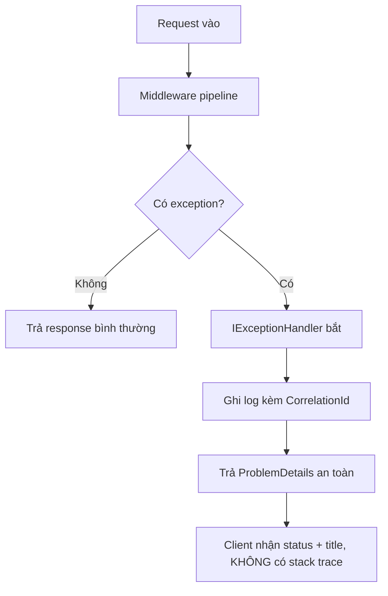

# Logging & Xử lý ngoại lệ toàn cục

!!! info "Bạn đang ở đây"
    cần trước: viết được test và hiểu vòng đời request trong asp.net core.
    mở khoá: ghi log có cấu trúc, bắt lỗi tập trung một chỗ, và trả lỗi an toàn cho client mà không lộ nội bộ.

> Mục tiêu (đo được): sau chương này bạn **áp dụng** được `ILogger<T>` với structured logging, cấu hình một global exception handler trả `ProblemDetails`, gắn correlation id, và chỉ ra 3 loại dữ liệu tuyệt đối không được log.

## 0. Đoán nhanh trước khi học

Trước khi đọc tiếp, hãy tự trả lời: giữa hai dòng log dưới đây, dòng nào giúp bạn *tìm kiếm và lọc* dễ hơn khi có 1 triệu dòng log?

```text title="Hai kiểu log"
A) logger.LogInformation("User " + userId + " đặt đơn " + orderId);
B) logger.LogInformation("User {UserId} đặt đơn {OrderId}", userId, orderId);
```

??? note "Đáp án"
    Dòng **B**. Nó tạo ra một *message template* cố định cộng với các trường có tên (`UserId`, `OrderId`). Hệ thống log tập trung (Seq, Elasticsearch, Loki) lưu các trường này thành dữ liệu có thể truy vấn, ví dụ `OrderId = 42`. Dòng A chỉ tạo một chuỗi phẳng, mỗi request là một chuỗi khác nhau, không lọc được.

## 1. Ý niệm cốt lõi

Logging là việc ghi lại *có chủ đích* những gì hệ thống đang làm để bạn quan sát được nó khi chạy thật. Trong .NET {{ dotnet.current }}, hạt nhân là interface `ILogger<T>`: bạn inject nó vào class, `T` cho biết log đến từ đâu (category). **Structured logging** nghĩa là bạn không nối chuỗi, mà truyền một *message template* kèm các tham số có tên — provider log sẽ giữ nguyên cả template lẫn giá trị từng trường.

Xử lý ngoại lệ *toàn cục* nghĩa là thay vì bọc `try/catch` khắp nơi, bạn đặt MỘT chỗ trung tâm bắt mọi exception chưa xử lý, ghi log, rồi trả về một response lỗi chuẩn hoá (`ProblemDetails`, theo RFC 7807). Ở production, response đó **không** được chứa stack trace hay chi tiết nội bộ.

| Khái niệm | Vai trò | Ghi chú |
|---|---|---|
| `ILogger<T>` | API ghi log chuẩn của .NET | `T` = category, thường là tên class |
| Message template | Chuỗi có `{Placeholder}` | KHÔNG nối chuỗi, KHÔNG nội suy `$""` |
| Log level | Mức độ quan trọng | Trace < Debug < Information < Warning < Error < Critical |
| Serilog | Thư viện logging phổ biến | Ghi ra nhiều *sink* (đích) khác nhau |
| Sink | Nơi log chảy tới | Console, File, Seq, PostgreSQL... |
| `IExceptionHandler` | Điểm bắt lỗi tập trung | Đăng ký qua `AddExceptionHandler` |
| `ProblemDetails` | Định dạng lỗi chuẩn RFC 7807 | `type`, `title`, `status`, `detail` |
| Correlation id | Mã lần request để nối log | Thường lấy từ header `X-Correlation-ID` |

Log level giúp bạn lọc theo mức độ: ở dev bạn bật tới `Debug`, ở production thường chỉ giữ `Information` trở lên để giảm nhiễu và chi phí lưu trữ.



!!! danger "Hiểu lầm phổ biến"
    "Log càng nhiều càng an toàn." Sai. Log **mật khẩu, token, khoá API, số thẻ, hay PII** (email, số điện thoại, CMND) là một lỗ hổng bảo mật nghiêm trọng — log thường được đọc bởi nhiều người và chuyển đi nhiều nơi. Ngoài ra, **đừng nuốt lỗi**: `catch (Exception) { }` rỗng biến bug thành hành vi âm thầm sai, cực khó debug. Bắt lỗi thì phải hoặc log, hoặc ném lại (`throw;`), hoặc xử lý có ý nghĩa.

## 2. Ví dụ mẫu

### 2a. Structured logging thuần (mô phỏng bằng BCL)

Ví dụ dưới dùng `ILoggerFactory` của BCL với console provider để thấy rõ message template hoạt động thế nào.

```csharp title="C#"
// test:run
using Microsoft.Extensions.Logging;

using var factory = LoggerFactory.Create(b => b.AddConsole());
ILogger logger = factory.CreateLogger("Orders");

int userId = 7, orderId = 42;
// Truyền tham số có TÊN — không nối chuỗi:
logger.LogInformation("User {UserId} dat don {OrderId}", userId, orderId);
logger.LogWarning("Ton kho thap cho san pham {ProductId}", 99);
```

```text title="Kết quả (rút gọn)"
info: Orders[0]
      User 7 dat don 42
warn: Orders[0]
      Ton kho thap cho san pham 99
```

Giá trị `7` và `42` được điền vào template, đồng thời được giữ như trường `UserId=7`, `OrderId=42` nếu sink hỗ trợ (Serilog + Seq).

### 2b. Global exception handler với `IExceptionHandler`

```csharp title="C#"
// test:skip cần ASP.NET Core (Microsoft.AspNetCore.App)
using Microsoft.AspNetCore.Diagnostics;
using Microsoft.AspNetCore.Http;
using Microsoft.AspNetCore.Mvc;

public sealed class GlobalExceptionHandler(ILogger<GlobalExceptionHandler> logger)
    : IExceptionHandler
{
    public async ValueTask<bool> TryHandleAsync(
        HttpContext ctx, Exception ex, CancellationToken ct)
    {
        var correlationId = ctx.TraceIdentifier;
        // Log ĐẦY ĐỦ chi tiết ở phía server (không lộ ra ngoài):
        logger.LogError(ex,
            "Loi chua xu ly. CorrelationId={CorrelationId} Path={Path}",
            correlationId, ctx.Request.Path);

        var problem = new ProblemDetails
        {
            Status = StatusCodes.Status500InternalServerError,
            Title = "Da xay ra loi khong mong doi.",
            // KHÔNG đặt ex.ToString() vào Detail ở production!
            Extensions = { ["correlationId"] = correlationId }
        };
        ctx.Response.StatusCode = problem.Status.Value;
        await ctx.Response.WriteAsJsonAsync(problem, ct);
        return true; // đã xử lý xong
    }
}
```

Đăng ký trong `Program.cs`:

```csharp title="C#"
// test:skip cần ASP.NET Core
builder.Services.AddExceptionHandler<GlobalExceptionHandler>();
builder.Services.AddProblemDetails();
// ...
app.UseExceptionHandler();
```

Client production chỉ nhận về JSON gọn gàng, không có stack trace:

```json title="Response phía client"
{
  "title": "Da xay ra loi khong mong doi.",
  "status": 500,
  "correlationId": "0HN7A2C3:00000003"
}
```

## 3. Bài tập có giàn giáo

Viết một exception handler xử lý riêng `KeyNotFoundException` thành `404` với `ProblemDetails`, còn các lỗi khác giữ `500`. Điền vào chỗ trống.

```csharp title="C#"
// test:skip cần ASP.NET Core
public async ValueTask<bool> TryHandleAsync(
    HttpContext ctx, Exception ex, CancellationToken ct)
{
    var (status, title) = ex switch
    {
        // TODO 1: map KeyNotFoundException -> 404
        // TODO 2: mặc định -> 500
        _ => (StatusCodes.Status500InternalServerError, "Loi he thong.")
    };
    // TODO 3: log ở mức phù hợp (Warning cho 4xx, Error cho 5xx)
    ctx.Response.StatusCode = status;
    await ctx.Response.WriteAsJsonAsync(
        new ProblemDetails { Status = status, Title = title }, ct);
    return true;
}
```

??? success "Lời giải + giải thích"
    ```csharp title="C#"
    // test:skip cần ASP.NET Core
    var (status, title) = ex switch
    {
        KeyNotFoundException => (StatusCodes.Status404NotFound, "Khong tim thay tai nguyen."),
        _ => (StatusCodes.Status500InternalServerError, "Loi he thong.")
    };
    if (status >= 500)
        logger.LogError(ex, "Loi server. CorrelationId={Cid}", ctx.TraceIdentifier);
    else
        logger.LogWarning("Loi client {Status}. CorrelationId={Cid}", status, ctx.TraceIdentifier);
    ```
    Vì sao: lỗi 4xx thường là do input của client (không phải bug), nên dùng `Warning` để không làm ồn kênh `Error`. Lỗi 5xx là bất thường phía server nên phải `Error` kèm `ex` đầy đủ để có stack trace *trong log server* — nhưng vẫn không gửi stack trace đó ra client.

## 4. Cạm bẫy & bảo mật

- **Correlation id**: sinh hoặc đọc từ header `X-Correlation-ID` ở đầu pipeline, đưa vào `ILogger` scope để MỌI dòng log của request đó đều mang cùng mã. Khi client báo lỗi, họ đưa mã này, bạn tra được đúng chuỗi log.

```csharp title="C#"
// test:skip cần ASP.NET Core
app.Use(async (ctx, next) =>
{
    var cid = ctx.Request.Headers["X-Correlation-ID"].FirstOrDefault()
              ?? Guid.NewGuid().ToString();
    using (logger.BeginScope(new Dictionary<string, object> { ["CorrelationId"] = cid }))
    {
        ctx.Response.Headers["X-Correlation-ID"] = cid;
        await next();
    }
});
```

- **Serilog + sink**: Serilog là thư viện structured logging cho phép cấu hình nhiều *sink* song song (Console để dev xem, File để lưu, Seq/Elasticsearch để truy vấn). Ý niệm: một sự kiện log chảy tới tất cả sink đã đăng ký.

```json title="appsettings.json (Serilog)"
{
  "Serilog": {
    "MinimumLevel": "Information",
    "WriteTo": [
      { "Name": "Console" },
      { "Name": "Seq", "Args": { "serverUrl": "http://localhost:5341" } }
    ]
  }
}
```

- **Hiệu năng**: dùng `logger.IsEnabled(LogLevel.Debug)` bọc quanh log đắt tiền để tránh dựng chuỗi/đối tượng khi level đó tắt.
- **Bảo mật**: không bao giờ log `password`, `Authorization` header, token, hay PII. Rà soát bằng review và, nếu cần, dùng destructuring policy của Serilog để mask.

## Tự kiểm tra

1. Vì sao structured logging tốt hơn nối chuỗi?
2. Kể đúng thứ tự 6 log level từ thấp đến cao.
3. `IExceptionHandler.TryHandleAsync` trả `true` nghĩa là gì?
4. Ở production, được phép đưa gì và không được đưa gì vào response lỗi?
5. Correlation id dùng để làm gì?

??? question "Đáp án"
    1. Nó giữ template và các trường có tên riêng biệt, cho phép truy vấn/lọc (ví dụ `OrderId=42`) thay vì chỉ có chuỗi phẳng.
    2. Trace, Debug, Information, Warning, Error, Critical.
    3. Đã xử lý xong exception; pipeline không cần chuyển tiếp cho handler khác.
    4. Được: `title`, `status`, và `correlationId`. Không được: stack trace, câu lệnh SQL, tên biến/đường dẫn nội bộ, thông điệp exception thô.
    5. Nối tất cả dòng log của cùng một request/luồng lại với nhau để truy vết lỗi từ mã do client cung cấp.

??? abstract "DEEP DIVE"
    - **Log scopes & OpenTelemetry**: `BeginScope` gắn ngữ cảnh vào mọi log trong phạm vi. Kết hợp với OpenTelemetry, correlation id có thể là `TraceId` chuẩn W3C, liên kết log với distributed tracing xuyên nhiều service.
    - **High-performance logging**: source generator `[LoggerMessage]` tạo delegate log không cấp phát, nhanh hơn gọi `LogInformation` với `params object?[]`. Dùng cho hot path.
    - **Sampling & cost**: ở quy mô lớn, log 100% mức `Information` rất tốn. Cân nhắc sampling hoặc nâng min level theo môi trường, và tách log kiểm toán (audit) khỏi log vận hành.
    - **`ProblemDetails` mở rộng**: bạn có thể thêm `type` (URI mô tả loại lỗi) và mảng `errors` cho lỗi validation (RFC 9457 kế thừa 7807), nhưng vẫn giữ nguyên tắc không rò rỉ nội bộ.

Tiếp theo -> xác thực và phân quyền
