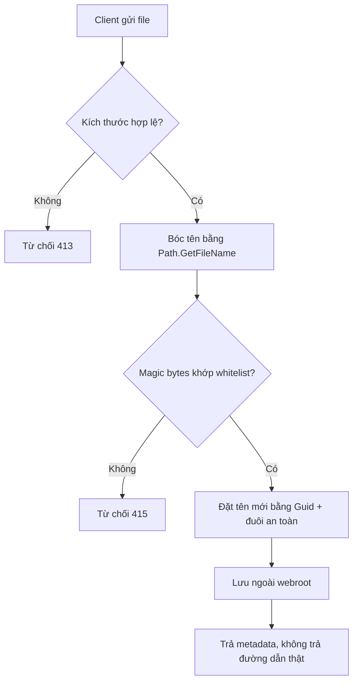

# Tải file an toàn

!!! info "Bạn đang ở đây"
    cần trước: dependency injection, cấu hình service trong asp.net core, hiểu vòng đời request.
    mở khoá: xử lý upload không dính path traversal, kiểm nội dung file thật, lưu trữ an toàn, chuẩn bị cho chương lưu trữ blob và quét mã độc.

> Mục tiêu (đo được): sau chương này bạn **đánh giá** được một endpoint upload có an toàn hay không bằng cách chỉ ra ít nhất 4 lỗ hổng (đặt tên client, tin đuôi file, không giới hạn kích thước, lưu trong webroot) và viết lại code khắc phục cả 4.

## 0. Câu hỏi/đoán nhanh

Trước khi đọc, thử trả lời (đừng lo sai — sai rồi nhớ lâu hơn):

1. Nếu client gửi tên file là `../../etc/passwd`, chuyện gì xảy ra khi bạn ghép nó vào đường dẫn thư mục lưu?
2. Vì sao kiểm đuôi `.jpg` là **không đủ** để tin đây là ảnh?
3. Một file `avatar.jpg` nhưng nội dung thật là mã HTML kèm script — rủi ro nằm ở đâu?

??? note "Đáp án"
    1. Dấu `..` cho phép thoát khỏi thư mục đích và ghi/đọc file hệ thống — đó là **path traversal**. Ghép tên client thô là lỗi nghiêm trọng.
    2. Đuôi file chỉ là chuỗi ký tự client tự đặt, không phản ánh nội dung. Phải đọc **magic bytes** (chữ ký đầu file) và kiểm MIME thật.
    3. Nếu file nằm trong webroot và server phục vụ tĩnh, trình duyệt nạn nhân có thể chạy script đó dưới domain của bạn — dẫn tới stored XSS. Phải lưu ngoài webroot hoặc chặn thực thi.

## 1. Ý niệm cốt lõi

Upload là điểm client đẩy dữ liệu tùy ý vào server. Nguyên tắc vàng: **không tin bất kỳ thứ gì client gửi** — kể cả tên file, đuôi, và header `Content-Type`. Ba trục phòng thủ:

| Trục | Rủi ro nếu bỏ qua | Biện pháp |
|------|-------------------|-----------|
| Tên & đường dẫn | Path traversal, ghi đè file hệ thống | `Path.GetFileName` để bóc phần đường dẫn; tự đặt tên bằng `Guid` |
| Nội dung | Đuôi giả, file thực thi trá hình | Kiểm magic bytes + MIME thật, whitelist định dạng |
| Kích thước & lưu trữ | DoS do file khổng lồ; XSS/RCE khi phục vụ lại | Giới hạn byte; lưu ngoài webroot hoặc chặn thực thi |



!!! danger "Hiểu lầm phổ biến — chớ mắc"
    "Chỉ cần kiểm đuôi file là đủ." Sai. Đuôi và `Content-Type` đều do client kiểm soát, có thể bịa hoàn toàn. Kẻ tấn công đặt `shell.jpg` nhưng nội dung là script. Luôn kiểm **nội dung thật** (magic bytes) và **không bao giờ** dùng tên client làm tên lưu.

## 2. Ví dụ mẫu

Demo cốt lõi bằng BCL thuần: bóc tên an toàn và kiểm magic bytes của PNG/JPEG. Đây chính là logic bạn sẽ nhúng vào endpoint ASP.NET Core.

```csharp title="C#"
// test:run
string[] clientNames =
{
    "../../etc/passwd",
    @"..\..\windows\system32\cmd.exe",
    "photo.png",
};

foreach (var raw in clientNames)
{
    var safe = Path.GetFileName(raw); // bóc mọi phần đường dẫn
    var stored = $"{Guid.NewGuid():N}{Path.GetExtension(safe)}";
    Console.WriteLine($"client='{raw}' -> safe='{safe}' -> stored='{stored}'");
}

// Kiểm magic bytes: PNG = 89 50 4E 47, JPEG = FF D8 FF
byte[] pngHeader = { 0x89, 0x50, 0x4E, 0x47, 0x0D, 0x0A, 0x1A, 0x0A };
byte[] fakeJpg   = { 0x3C, 0x73, 0x63, 0x72, 0x69, 0x70, 0x74 }; // "<scrip"

Console.WriteLine($"pngHeader hợp lệ PNG? {IsPng(pngHeader)}");
Console.WriteLine($"fakeJpg  hợp lệ PNG? {IsPng(fakeJpg)}");

static bool IsPng(byte[] head) =>
    head.Length >= 4 &&
    head[0] == 0x89 && head[1] == 0x50 && head[2] == 0x4E && head[3] == 0x47;
```

Output kỳ vọng:

```text title="Kết quả"
client='../../etc/passwd' -> safe='passwd' -> stored='<guid>'
client='..\..\windows\system32\cmd.exe' -> safe='cmd.exe' -> stored='<guid>.exe'
client='photo.png' -> safe='photo.png' -> stored='<guid>.png'
pngHeader hợp lệ PNG? True
fakeJpg  hợp lệ PNG? False
```

Chú ý: `Path.GetFileName` đã chặn `..`, nhưng đuôi `.exe` vẫn lọt qua bước này — vì thế **bắt buộc** thêm whitelist đuôi + magic bytes ở tầng sau.

## 3. Bài tập có giàn giáo

Viết hàm `TryValidateUpload` nhận `byte[] header`, `long size`, `string clientFileName` và trả về `(bool ok, string? storedName)`. Yêu cầu: từ chối nếu size > 2 MB; chỉ chấp nhận PNG (magic bytes); đặt tên lưu bằng GUID + `.png`.

```csharp title="C#"
// test:run
var (ok1, name1) = TryValidateUpload(new byte[] { 0x89, 0x50, 0x4E, 0x47 }, 1024, "a.png");
var (ok2, name2) = TryValidateUpload(new byte[] { 0x00, 0x01 }, 1024, "a.png");
var (ok3, _)     = TryValidateUpload(new byte[] { 0x89, 0x50, 0x4E, 0x47 }, 5_000_000, "big.png");

Console.WriteLine($"ok1={ok1} nameEndsPng={name1?.EndsWith(".png")}");
Console.WriteLine($"ok2={ok2}");
Console.WriteLine($"ok3={ok3}");

static (bool ok, string? storedName) TryValidateUpload(byte[] header, long size, string clientFileName)
{
    const long maxBytes = 2 * 1024 * 1024;
    if (size > maxBytes) return (false, null);

    bool isPng = header.Length >= 4 &&
                 header[0] == 0x89 && header[1] == 0x50 &&
                 header[2] == 0x4E && header[3] == 0x47;
    if (!isPng) return (false, null);

    _ = Path.GetFileName(clientFileName); // bóc tên client, không tin làm tên lưu
    var stored = $"{Guid.NewGuid():N}.png";
    return (true, stored);
}
```

??? success "Lời giải & giải thích"
    Output kỳ vọng:
    ```text title="Kết quả"
    ok1=True nameEndsPng=True
    ok2=False
    ok3=False
    ```
    - `ok1`: header PNG hợp lệ + size nhỏ -> chấp nhận, tên lưu là GUID nên client không kiểm soát đường dẫn.
    - `ok2`: magic bytes không phải PNG dù client đặt `.png` -> từ chối. Đây là điểm mấu chốt: **không tin đuôi**.
    - `ok3`: size vượt 2 MB -> từ chối trước, tránh cả DoS lẫn tốn công đọc nội dung.
    Thứ tự kiểm quan trọng: kiểm size **trước** để không nạp file khổng lồ vào bộ nhớ.

## 4. Cạm bẫy & bảo mật

Endpoint ASP.NET Core minh hoạ cách ghép các bước (cần package ngoài nên đánh dấu skip):

```csharp title="C#"
// test:skip cần ASP.NET Core (IFormFile, minimal API)
app.MapPost("/upload", async (IFormFile file, IWebHostEnvironment env) =>
{
    const long maxBytes = 2 * 1024 * 1024;
    if (file.Length == 0 || file.Length > maxBytes)
        return Results.StatusCode(StatusCodes.Status413PayloadTooLarge);

    // Đọc magic bytes, KHÔNG tin file.ContentType
    var header = new byte[8];
    int read;
    await using (var s = file.OpenReadStream())
        read = await s.ReadAsync(header.AsMemory(0, header.Length));

    // Phải đọc đủ ÍT NHẤT 4 byte thật (read), không phải header.Length (luôn = 8)
    bool isPng = read >= 4 &&
                 header[0] == 0x89 && header[1] == 0x50 &&
                 header[2] == 0x4E && header[3] == 0x47;
    if (!isPng)
        return Results.StatusCode(StatusCodes.Status415UnsupportedMediaType);

    // Tên lưu tự sinh, đuôi cố định; lưu NGOÀI wwwroot
    var storedName = $"{Guid.NewGuid():N}.png";
    var uploadDir = Path.Combine(env.ContentRootPath, "uploads");   // KHÔNG dùng WebRootPath
    Directory.CreateDirectory(uploadDir);
    var fullPath = Path.Combine(uploadDir, storedName);

    await using var target = File.Create(fullPath);
    await file.CopyToAsync(target);

    return Results.Ok(new { id = storedName }); // không trả đường dẫn hệ thống
});
```

!!! danger "Code SAI vs code ĐÚNG"
    **SAI** — ghép tên client thô vào đường dẫn, mở toang path traversal:
    ```csharp title="C#"
    // test:skip minh hoạ lỗi, đừng dùng
    var path = Path.Combine(env.WebRootPath, file.FileName); // file.FileName = "../../appsettings.json"
    await using var fs = File.Create(path);                  // ghi đè file cấu hình!
    await file.CopyToAsync(fs);
    ```
    Lưu ý: `Path.Combine(a, "../../x")` **không** làm sạch `..` — nó vẫn tạo đường dẫn thoát thư mục. Và lưu trong `WebRootPath` (wwwroot) khiến file phục vụ tĩnh -> stored XSS/thực thi.

    **ĐÚNG** — bóc tên, tự đặt GUID, lưu ngoài webroot (như endpoint phía trên): tên client chỉ dùng để hiển thị, không bao giờ dùng làm đường dẫn.

Bảo mật bổ sung: đặt `RequestSizeLimit`/`MultipartBodyLengthLimit`, chạy antivirus/quét nội dung với file không tin cậy, và trả về id trừu tượng thay vì path thật để tránh lộ cấu trúc thư mục.

## Tự kiểm tra

1. Hàm BCL nào bóc bỏ mọi thành phần đường dẫn khỏi tên file client?
2. Vì sao không được tin `Content-Type` hay đuôi file khi phân loại?
3. Nên kiểm kích thước file trước hay sau khi đọc toàn bộ nội dung? Vì sao?
4. Lưu file upload trong `wwwroot` gây rủi ro cụ thể gì?
5. Vì sao đặt tên lưu bằng `Guid` an toàn hơn dùng tên client?

??? question "Đáp án"
    1. `Path.GetFileName` — nó chỉ giữ phần tên cuối, loại bỏ `..` và mọi phần thư mục.
    2. Cả hai đều do client kiểm soát và có thể bịa; chỉ magic bytes (nội dung thật) mới đáng tin để phân loại.
    3. Kiểm **trước**. Từ chối sớm tránh nạp file khổng lồ vào bộ nhớ/đĩa (chống DoS) và tiết kiệm công xử lý.
    4. File trong webroot bị phục vụ tĩnh; nội dung độc (HTML/JS, hoặc script thực thi được) có thể chạy dưới domain của bạn -> stored XSS hoặc thực thi mã. Lưu ngoài webroot hoặc chặn thực thi.
    5. GUID do server sinh, client không kiểm soát -> loại bỏ hoàn toàn path traversal và va chạm/ghi đè tên; tên client chỉ giữ để hiển thị.

??? abstract "DEEP DIVE — nâng cao (ngoài fast path)"
    - **Streaming lớn**: với file lớn dùng multipart streaming thay vì buffer toàn bộ vào `IFormFile`; đọc theo section để giới hạn RAM. Đặt `MultipartBodyLengthLimit` sát nhu cầu thật.
    - **Magic bytes không tuyệt đối**: polyglot file (vừa hợp lệ GIF vừa chứa payload) tồn tại. Kết hợp giải mã/tái mã hoá ảnh (re-encode qua thư viện xử lý ảnh) để "vô hiệu hoá" nội dung ẩn.
    - **Đường dẫn chuẩn hoá**: sau khi ghép path, dùng `Path.GetFullPath` rồi kiểm prefix bằng `StartsWith` với thư mục gốc đã canonical để chắc chắn không thoát ra ngoài — phòng phòng thủ theo chiều sâu.
    - **Cô lập lưu trữ**: lý tưởng nhất là đẩy sang object storage (blob) trên domain/bucket riêng, phục vụ qua URL ký tạm, thêm `Content-Disposition: attachment` để buộc tải xuống thay vì render.
    - **Với Claude Code**: có thể thêm hook `PreToolUse` để chặn ghi file ngoài thư mục cho phép; đăng ký MCP bằng `claude mcp add` khi cần công cụ quét nội dung. Đóng gói quy trình review upload thành `SKILL.md` để tái dùng.

Tiếp theo -> lưu trữ blob và quét mã độc
