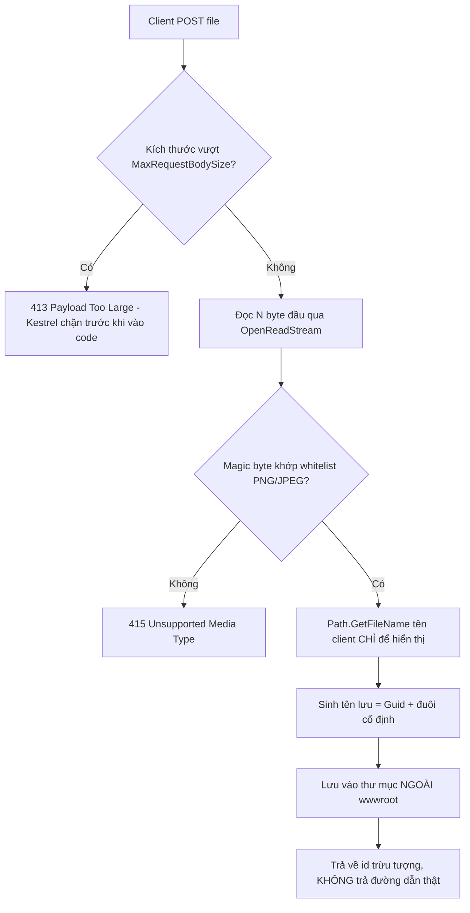

# Nhận file an toàn: chống path traversal & kiểm MIME/magic-byte

!!! info "Bạn đang ở đây"
    cần trước: jwt (xác thực ai đang gọi endpoint).
    mở khoá: xử lý upload không dính path traversal, không tin content-type client khai, kiểm nội dung file thật bằng magic-byte, giới hạn kích thước, đặt tên lưu an toàn.

> Mục tiêu (đo được): sau chương này bạn **đánh giá** được một endpoint nhận file có an toàn hay không, bằng cách chỉ ra tối thiểu 4 lỗ hổng cụ thể trong code (tin `file.FileName` làm đường dẫn, tin `Content-Type`, không giới hạn kích thước, lưu tên gốc client) — và viết lại từng điểm để vá.

## 0. Câu hỏi/đoán nhanh

Trước khi đọc, thử trả lời (đừng lo sai — sai rồi nhớ lâu hơn):

1. Client gửi tên file là `../../../etc/passwd`. Nếu server ghép thẳng chuỗi này vào đường dẫn thư mục lưu, chuyện gì xảy ra?
2. Client gửi một file `.exe` nhưng khai header `Content-Type: image/png`. Vì sao server tin được điều này là sai lầm?
3. Hai file `a.png` (ảnh PNG thật) và `b.png` (thật ra là script) — làm sao phân biệt bằng dữ liệu, không phải bằng tên?

??? note "Đáp án"
    1. Đây là **path traversal**: dấu `..` cho phép thoát khỏi thư mục đích, đọc/ghi đè file nằm ngoài phạm vi dự định (vd chính `/etc/passwd` hoặc `appsettings.json` của app). Ghép tên client thô vào path là lỗi nghiêm trọng.
    2. `Content-Type` là một **header do client tự đặt trong request** — không phải thuộc tính vật lý của file. Client có thể gõ bất kỳ giá trị nào, kể cả sai hoàn toàn, mà server vẫn nhận được nguyên văn. Tin nó để quyết định "đây là ảnh" là tin lời tự khai của người lạ.
    3. Đọc vài byte đầu tiên của nội dung file (magic byte / file signature) và so với chữ ký chuẩn của từng định dạng — đây là dữ liệu do định dạng file quy định, client không sửa được mà vẫn giữ file dùng được.

## 1. `IFormFile` — file client gửi lên trong ASP.NET Core

**Định nghĩa bằng lời:** `IFormFile` là kiểu dữ liệu ASP.NET Core dùng để đại diện cho một file mà client gửi kèm trong request `multipart/form-data`; nó cho bạn đọc tên file client khai (`FileName`), kiểu nội dung client khai (`ContentType`), kích thước byte thật (`Length`), và một luồng byte (`OpenReadStream()`) để đọc nội dung file.

**Ví dụ tối thiểu, độc lập:** một endpoint Minimal API chỉ nhận file và in ra ba thông tin cơ bản — chưa xử lý an toàn gì cả, chỉ để thấy `IFormFile` cung cấp gì.

```csharp title="C#"
// test:skip minh họa IFormFile cần ASP.NET Core Minimal API, không tự chạy bằng dotnet run
app.MapPost("/whoami-file", (IFormFile file) =>
{
    // Ba thứ IFormFile cho bạn — CHƯA cái nào đáng tin để quyết định logic bảo mật:
    var clientName = file.FileName;      // client tự khai, có thể là "../../etc/passwd"
    var clientType = file.ContentType;   // client tự khai, có thể sai hoàn toàn
    var sizeBytes  = file.Length;        // byte thật đã nhận, đáng tin về SỐ nhưng chưa giới hạn

    return Results.Ok(new { clientName, clientType, sizeBytes });
});
```

**Điều gì xảy ra khi dùng sai:** nếu bạn gọi `file.OpenReadStream()` hai lần liên tiếp mà không tự `Seek` lại từ đầu, lần đọc thứ hai có thể trả về stream đã ở cuối (0 byte đọc được) vì `IFormFile` không tự động reset vị trí đọc — đây không phải exception, mà là **lỗi âm thầm**: code chạy "được" nhưng đọc thiếu dữ liệu. Luôn đọc stream **một lần**, hoặc gọi `stream.Position = 0` trước khi đọc lại nếu bắt buộc đọc nhiều lần (ví dụ vừa đọc magic byte vừa copy toàn bộ ra file).

## 2. Path traversal — chuỗi `..` thoát khỏi thư mục dự định

**Định nghĩa bằng lời:** path traversal (còn gọi directory traversal) là lỗ hổng xảy ra khi server ghép một chuỗi đường dẫn do người dùng kiểm soát (ví dụ tên file client gửi) vào một đường dẫn hệ thống mà **không loại bỏ** các đoạn `..` (nghĩa là "lùi lên một cấp thư mục"), khiến đường dẫn kết quả trỏ ra ngoài thư mục lưu trữ dự định — có thể đọc hoặc ghi đè file bất kỳ mà tiến trình có quyền truy cập.

**Ví dụ tối thiểu, độc lập:** minh họa bằng BCL thuần — ghép chuỗi client vào một đường dẫn gốc, xem kết quả thoát khỏi thư mục gốc như thế nào.

```csharp title="C#"
// test:run
string uploadRoot = Path.Combine(Path.GetTempPath(), "uploads-demo");

string[] clientNames =
{
    "photo.png",
    "../../../etc/passwd",
    @"..\..\windows\system32\drivers\etc\hosts",
};

foreach (var raw in clientNames)
{
    // Path.Combine KHÔNG dọn ".." — nó chỉ nối chuỗi, tin tưởng đầu vào.
    var combined = Path.Combine(uploadRoot, raw);
    var full = Path.GetFullPath(combined); // chuẩn hoá để THẤY nó thoát ra đâu
    var escaped = !full.StartsWith(Path.GetFullPath(uploadRoot), StringComparison.OrdinalIgnoreCase);
    Console.WriteLine($"raw='{raw}' -> full='{full}' -> thoát khỏi uploadRoot? {escaped}");
}
```

```text title="Kết quả (chạy trên Linux/macOS — CI dùng net10.0 trên Linux)"
raw='photo.png' -> full='<temp>/uploads-demo/photo.png' -> thoát khỏi uploadRoot? False
raw='../../../etc/passwd' -> full='/etc/passwd' -> thoát khỏi uploadRoot? True
raw='..\..\windows\system32\drivers\etc\hosts' -> full='<temp>/uploads-demo/..\..\windows\system32\drivers\etc\hosts' -> thoát khỏi uploadRoot? False
```

Ghi chú quan trọng — kết quả **khác nhau theo hệ điều hành**: trên Linux/macOS, dấu `\` không được hệ điều hành coi là dấu phân tách thư mục, nên `Path.GetFullPath` không "lùi cấp" theo `\` — toàn bộ chuỗi Windows-style bị giữ nguyên như một **tên file duy nhất chứa dấu `\`**, vẫn nằm **trong** `uploadRoot` (`escaped = False`). Đây chính là lý do path traversal là lỗ hổng **phụ thuộc hệ điều hành nơi server chạy**: một payload có thể vô hại trên Linux nhưng nguy hiểm thật trên Windows (nơi `\` được hiểu là dấu phân tách và `..` bị coi là lùi cấp), và ngược lại — dòng thứ hai (`/etc/passwd`) nguy hiểm trên **cả hai** hệ điều hành vì dùng dấu `/`. Không được giả định "server tôi không chạy Windows nên an toàn" — luôn chặn cả hai kiểu ký tự.

**Điều gì xảy ra khi dùng sai:** nếu code sau đó gọi `File.WriteAllBytes(full, data)` với `full` đã thoát ra `/etc/passwd` hoặc file cấu hình `appsettings.json` của chính ứng dụng, kết quả là **ghi đè file hệ thống hoặc file cấu hình** mà không có exception nào báo — .NET không tự chặn việc này, `File.WriteAllBytes` chỉ kiểm quyền hệ điều hành (nếu tiến trình có quyền viết, nó viết). Nếu tiến trình app chạy với quyền hạn chế và không có quyền viết `/etc/passwd`, bạn sẽ nhận `UnauthorizedAccessException` — nhưng đây là **may rủi của hệ điều hành**, không phải phòng thủ có chủ đích của bạn. Không được dựa vào quyền hệ điều hành để bù cho lỗ hổng logic.

## 3. Chống path traversal bằng `Path.GetFileName`

**Định nghĩa bằng lời:** `Path.GetFileName(string path)` là hàm BCL trả về **chỉ phần tên file cuối cùng** của một đường dẫn, loại bỏ mọi thư mục cha và mọi đoạn `..` phía trước nó — biến một chuỗi đường dẫn nguy hiểm thành một tên file "trần", không còn khả năng trỏ ra ngoài.

**Ví dụ tối thiểu, độc lập:**

```csharp title="C#"
// test:run
string[] clientNames =
{
    "photo.png",
    "../../../etc/passwd",
    @"..\..\windows\system32\cmd.exe",
    "/var/www/../../secret.txt",
};

foreach (var raw in clientNames)
{
    var safe = Path.GetFileName(raw);
    Console.WriteLine($"client='{raw}' -> Path.GetFileName='{safe}'");
}
```

```text title="Kết quả"
client='photo.png' -> Path.GetFileName='photo.png'
client='../../../etc/passwd' -> Path.GetFileName='passwd'
client='..\..\windows\system32\cmd.exe' -> Path.GetFileName='..\..\windows\system32\cmd.exe'
client='/var/www/../../secret.txt' -> Path.GetFileName='secret.txt'
```

**Điều gì xảy ra khi dùng sai (hoặc dùng chưa đủ):** chú ý dòng thứ ba — trên hệ điều hành **không phải Windows**, `Path.GetFileName` chỉ nhận biết dấu `/` là dấu phân tách thư mục, còn `\` bị coi là **ký tự hợp lệ trong tên file** (không phải dấu phân tách). Kết quả là chuỗi Windows-style `..\..\windows\system32\cmd.exe` bị trả về **nguyên vẹn**, không bị bóc gì cả — đây không phải lỗi của hàm, mà là hành vi phụ thuộc hệ điều hành bạn phải biết. Nếu ứng dụng chạy trên Linux (rất phổ biến khi deploy container) mà chỉ gọi `Path.GetFileName` rồi tin tưởng tuyệt đối, chuỗi `..\..\...` vẫn lọt qua dưới dạng một "tên file" kỳ lạ chứa dấu `\` — nó không gây traversal thật (vì `\` không được OS hiểu là phân tách) nhưng để chắc chắn, luôn kiểm thêm: từ chối tên chứa `..` hoặc `/` hoặc `\` còn sót lại sau khi gọi `Path.GetFileName`, và tốt nhất **không dùng tên client cho việc lưu trữ** — chỉ dùng để hiển thị (xem mục 6).

```csharp title="C#"
// test:run
static bool ConNguyHiem(string safeName) =>
    safeName.Contains("..") || safeName.Contains('/') || safeName.Contains('\\');

foreach (var raw in new[] { "photo.png", @"..\..\windows\system32\cmd.exe" })
{
    var safe = Path.GetFileName(raw);
    Console.WriteLine($"'{safe}' còn ký tự nguy hiểm? {ConNguyHiem(safe)}");
}
```

```text title="Kết quả"
'photo.png' còn ký tự nguy hiểm? False
'..\..\windows\system32\cmd.exe' còn ký tự nguy hiểm? True
```

## 4. Vì sao không thể tin `Content-Type` client gửi

**Định nghĩa bằng lời:** `Content-Type` (và `ContentType` của `IFormFile`) là một **giá trị text nằm trong phần header của request**, do phía client (trình duyệt, hoặc bất kỳ ai gọi API bằng công cụ như `curl`/Postman) tự điền vào — nó không được server kiểm tra chéo với nội dung thật, nên hoàn toàn có thể sai hoặc bị cố tình khai sai.

**Ví dụ tối thiểu, độc lập:** mô phỏng hai request — cùng thao tác đọc `ContentType`, nhưng một client "trung thực" và một client "khai gian".

```csharp title="C#"
// test:run
// Mô phỏng thứ IFormFile.ContentType trả về — chỉ là string client tự đặt.
var requestTrungThuc = new { NoiDung = "PNG-BYTES...", ContentType = "image/png" };
var requestKhaiGian  = new { NoiDung = "MZ (đây là file .exe)", ContentType = "image/png" };

Console.WriteLine($"Trung thực: ContentType='{requestTrungThuc.ContentType}', nội dung thật='{requestTrungThuc.NoiDung}'");
Console.WriteLine($"Khai gian : ContentType='{requestKhaiGian.ContentType}', nội dung thật='{requestKhaiGian.NoiDung}'");
Console.WriteLine("Server chỉ đọc ContentType KHÔNG kiểm nội dung -> cả hai đều 'trông giống PNG'.");
```

```text title="Kết quả"
Trung thực: ContentType='image/png', nội dung thật='PNG-BYTES...'
Khai gian : ContentType='image/png', nội dung thật='MZ (đây là file .exe)'
Server chỉ đọc ContentType KHÔNG kiểm nội dung -> cả hai đều 'trông giống PNG'.
```

**Điều gì xảy ra khi dùng sai:** nếu endpoint chỉ kiểm `if (file.ContentType == "image/png") { luuFile(); }` rồi phục vụ lại file đó qua đường dẫn tĩnh, kẻ tấn công tải lên một file `.html` chứa script nhưng khai `Content-Type: image/png` — server chấp nhận, lưu file, và nếu file nằm trong thư mục được phục vụ tĩnh (`wwwroot`), trình duyệt của nạn nhân mở link đó có thể **thực thi script dưới domain của bạn** (stored XSS), vì trình duyệt tự đoán loại nội dung dựa trên đuôi file hoặc nội dung thật, không dựa trên việc server "tin" gì trước đó. Không có exception nào ở tầng .NET báo lỗi này — hậu quả xảy ra ở tầng trình duyệt của người dùng khác, lặng lẽ.

## 5. Kiểm magic byte (file signature) — bằng chứng không thể khai gian

**Định nghĩa bằng lời:** magic byte (còn gọi file signature) là một dãy byte cố định nằm ở **đầu nội dung thật** của file, do chính định dạng file quy định (không phải do ai khai báo) — ví dụ mọi file PNG hợp lệ đều bắt đầu bằng đúng 8 byte `89 50 4E 47 0D 0A 1A 0A`, mọi file JPEG hợp lệ đều bắt đầu bằng 3 byte `FF D8 FF`. Đọc và so khớp các byte này là cách duy nhất trong nhóm kỹ thuật ở chương này để biết **nội dung thật** là gì, độc lập với tên file hay `Content-Type`.

**Ví dụ tối thiểu, độc lập:**

```csharp title="C#"
// test:run
// Chữ ký chuẩn: PNG = 89 50 4E 47 ...; JPEG = FF D8 FF ...
static bool IsPng(byte[] head) =>
    head.Length >= 4 && head[0] == 0x89 && head[1] == 0x50 && head[2] == 0x4E && head[3] == 0x47;

static bool IsJpeg(byte[] head) =>
    head.Length >= 3 && head[0] == 0xFF && head[1] == 0xD8 && head[2] == 0xFF;

byte[] pngThat   = { 0x89, 0x50, 0x4E, 0x47, 0x0D, 0x0A, 0x1A, 0x0A };
byte[] jpegThat  = { 0xFF, 0xD8, 0xFF, 0xE0, 0x00, 0x10 };
byte[] gioiPng   = { 0x3C, 0x68, 0x74, 0x6D, 0x6C }; // "<html" khai .png nhưng nội dung là HTML

Console.WriteLine($"pngThat  -> IsPng={IsPng(pngThat)}, IsJpeg={IsJpeg(pngThat)}");
Console.WriteLine($"jpegThat -> IsPng={IsPng(jpegThat)}, IsJpeg={IsJpeg(jpegThat)}");
Console.WriteLine($"gioiPng  -> IsPng={IsPng(gioiPng)}, IsJpeg={IsJpeg(gioiPng)}  (khai .png nhưng thật là HTML)");
```

```text title="Kết quả"
pngThat  -> IsPng=True, IsJpeg=False
jpegThat -> IsPng=False, IsJpeg=True
gioiPng  -> IsPng=False, IsJpeg=False  (khai .png nhưng thật là HTML)
```

**Điều gì xảy ra khi dùng sai:** một lỗi rất phổ biến là đọc `header.Length` (kích thước **mảng buffer** bạn cấp phát, ví dụ luôn là 8) thay vì số byte **thật sự đọc được** từ stream (giá trị trả về của `Stream.Read`/`ReadAsync`). Nếu file client gửi chỉ có 2 byte (file rác/hỏng), `stream.ReadAsync(buffer)` có thể chỉ đọc được 2 byte nhưng 6 byte còn lại trong buffer vẫn giữ giá trị `0x00` mặc định — nếu bạn kiểm tra `header.Length >= 4` (luôn đúng vì buffer cấp phát sẵn 8 byte) thay vì kiểm `bytesDaDoc >= 4`, bạn sẽ so khớp nhầm trên dữ liệu **rác chưa từng được ghi**, dẫn tới kết quả `IsPng`/`IsJpeg` sai lệch (có thể chấp nhận nhầm file rỗng, hoặc từ chối nhầm file hợp lệ do đọc thiếu). Luôn dùng số byte **thật sự đọc được**, không dùng độ dài buffer đã cấp phát.

## 6. Giới hạn kích thước file

**Định nghĩa bằng lời:** giới hạn kích thước là một ngưỡng byte tối đa server chấp nhận cho một request/file upload, được cấu hình ở tầng ASP.NET Core (`RequestSizeLimit` cho một endpoint cụ thể, hoặc `Kestrel.MaxRequestBodySize` cho toàn server) — nếu client gửi vượt ngưỡng, server **từ chối trước khi xử lý xong**, tránh việc một file khổng lồ chiếm hết bộ nhớ/đĩa/băng thông (một dạng tấn công từ chối dịch vụ — DoS).

**Ví dụ tối thiểu, độc lập (mô phỏng logic kiểm tra, không cần server thật):**

```csharp title="C#"
// test:run
const long gioiHanByte = 2 * 1024 * 1024; // 2 MB

static bool VuotGioiHan(long kichThuoc, long gioiHan) => kichThuoc > gioiHan;

long[] cacKichThuoc = { 1024, 2_000_000, 5_000_000 };
foreach (var size in cacKichThuoc)
{
    Console.WriteLine($"size={size} byte -> vượt giới hạn 2MB? {VuotGioiHan(size, gioiHanByte)}");
}
```

```text title="Kết quả"
size=1024 byte -> vượt giới hạn 2MB? False
size=2000000 byte -> vượt giới hạn 2MB? False
size=5000000 byte -> vượt giới hạn 2MB? True
```

Trong ASP.NET Core thật, bạn không tự tính tay như trên cho toàn bộ request — bạn khai báo giới hạn bằng attribute hoặc cấu hình Kestrel:

```csharp title="C#"
// test:skip cần ASP.NET Core (RequestSizeLimit, Kestrel), minh họa cấu hình
// Cách 1 — giới hạn riêng cho một endpoint Minimal API:
app.MapPost("/upload", HandleUpload)
   .WithMetadata(new RequestSizeLimitAttribute(2 * 1024 * 1024)); // 2 MB

// Cách 2 — giới hạn toàn server ngay khi tạo builder (áp cho MỌI request):
var builder = WebApplication.CreateBuilder(args);
builder.WebHost.ConfigureKestrel(options =>
{
    options.Limits.MaxRequestBodySize = 2 * 1024 * 1024; // 2 MB, null = không giới hạn (nguy hiểm)
});
```

**Điều gì xảy ra khi dùng sai (hoặc không giới hạn):** nếu vượt ngưỡng đã cấu hình, Kestrel/ASP.NET Core trả về **HTTP 413 Payload Too Large** cho client, và **không** nạp toàn bộ nội dung request vào bộ nhớ để xử lý tiếp — request bị chặn ở tầng transport trước khi vào tới code của bạn. Ngược lại, nếu bạn **không cấu hình gì cả**, giá trị mặc định của `Kestrel.Limits.MaxRequestBodySize` là khoảng 30 MB (không phải "không giới hạn" — nhưng đủ lớn để một vài request đồng thời cũng có thể gây áp lực bộ nhớ đáng kể trên server nhỏ); nếu bạn **chủ động đặt `MaxRequestBodySize = null`**, giới hạn bị tắt hoàn toàn và một client ác ý có thể gửi request nhiều GB, khiến server hết bộ nhớ hoặc hết đĩa trước khi endpoint của bạn kịp từ chối bằng logic riêng — đây chính là DoS qua upload.

## 7. Đặt tên file lưu bằng `Guid` thay vì giữ tên gốc client

**Định nghĩa bằng lời:** thay vì lưu file dưới tên client gửi lên (đã bóc bằng `Path.GetFileName` ở mục 3), ta tự sinh một tên mới hoàn toàn ngẫu nhiên bằng `Guid.NewGuid()` (một số 128-bit gần như không thể trùng) làm tên file thật trên đĩa, và chỉ lưu tên gốc của client (nếu cần) như một trường dữ liệu hiển thị — không dùng nó làm đường dẫn.

**Ví dụ tối thiểu, độc lập:**

```csharp title="C#"
// test:run
string[] tenKhachGui = { "avatar.png", "avatar.png", "../../etc/passwd" };

foreach (var raw in tenKhachGui)
{
    var safe = Path.GetFileName(raw);           // bóc traversal (mục 3)
    var duoi = Path.GetExtension(safe);          // giữ đuôi để tiện quản lý, KHÔNG dùng để quyết định loại file
    var tenLuu = $"{Guid.NewGuid():N}{duoi}";     // tên thật trên đĩa — server toàn quyền sinh ra
    Console.WriteLine($"client='{raw}' -> hiển thị='{safe}' -> lưu trên đĩa='{tenLuu}'");
}
```

```text title="Kết quả (GUID mỗi lần chạy khác nhau)"
client='avatar.png' -> hiển thị='avatar.png' -> lưu trên đĩa='<guid-1>.png'
client='avatar.png' -> hiển thị='avatar.png' -> lưu trên đĩa='<guid-2>.png'
client='../../etc/passwd' -> hiển thị='passwd' -> lưu trên đĩa='<guid-3>'
```

Chú ý dòng đầu và dòng hai: **hai client khác nhau gửi cùng tên `avatar.png`** — nếu bạn lưu theo tên gốc, file thứ hai sẽ **ghi đè** file thứ nhất (mất dữ liệu của người dùng khác, hoặc lộ dữ liệu nếu quyền truy cập tính theo tên file). Dùng GUID loại bỏ hoàn toàn khả năng va chạm tên.

**Điều gì xảy ra khi dùng sai:** nếu bạn lưu theo tên gốc `safe` (đã bóc traversal nhưng chưa đổi tên), hai người dùng tải lên cùng lúc hai file cùng tên `avatar.png` sẽ **đua nhau ghi đè** — không có exception, `File.Create`/`FileStream` với chế độ mặc định sẽ **âm thầm thay thế nội dung cũ**, gây mất dữ liệu không thể phục hồi mà không có cảnh báo nào ở tầng ứng dụng.

## 8. Tổng hợp: endpoint upload đầy đủ và bảng so sánh SAI/ĐÚNG

Sau khi đã học riêng từng khối ở trên, đây là lúc ghép lại thành một endpoint thật, cùng bảng đối chiếu các lỗi phổ biến.



```csharp title="C#"
// test:skip cần ASP.NET Core (IFormFile, Minimal API, Kestrel) — build trong dotnet new web
var builder = WebApplication.CreateBuilder(args);
builder.WebHost.ConfigureKestrel(o => o.Limits.MaxRequestBodySize = 2 * 1024 * 1024); // mục 6
var app = builder.Build();

app.MapPost("/upload", async (IFormFile file, IWebHostEnvironment env) =>
{
    if (file.Length == 0)
        return Results.BadRequest("File rỗng.");

    // Mục 5: đọc magic byte thật, KHÔNG tin file.ContentType (mục 4)
    var header = new byte[8];
    int bytesDaDoc;
    await using (var s = file.OpenReadStream())
        bytesDaDoc = await s.ReadAsync(header.AsMemory(0, header.Length));

    bool isPng = bytesDaDoc >= 4 && // dùng bytesDaDoc THẬT, không dùng header.Length
                 header[0] == 0x89 && header[1] == 0x50 && header[2] == 0x4E && header[3] == 0x47;
    if (!isPng)
        return Results.StatusCode(StatusCodes.Status415UnsupportedMediaType);

    // Mục 3 + 7: bóc tên client (chỉ để hiển thị), tự sinh tên lưu bằng Guid
    var tenHienThi = Path.GetFileName(file.FileName);
    var tenLuu = $"{Guid.NewGuid():N}.png";

    // Lưu NGOÀI wwwroot -> không bị phục vụ tĩnh, không thể trở thành stored XSS
    var uploadDir = Path.Combine(env.ContentRootPath, "uploads");
    Directory.CreateDirectory(uploadDir);
    var fullPath = Path.Combine(uploadDir, tenLuu);

    await using var target = File.Create(fullPath);
    await file.CopyToAsync(target);

    return Results.Ok(new { id = tenLuu, ten = tenHienThi }); // không trả đường dẫn hệ thống
})
.WithMetadata(new RequestSizeLimitAttribute(2 * 1024 * 1024));

app.Run();
```

| Điểm kiểm | Code SAI (bản trước khi học chương này) | Code ĐÚNG (endpoint phía trên) |
|---|---|---|
| Tên/đường dẫn lưu | `Path.Combine(root, file.FileName)` — tin thẳng tên client, dính path traversal (mục 2, 3) | `Path.GetFileName` bóc traversal, **không** dùng làm tên lưu — tên lưu là `Guid` mới (mục 7) |
| Kiểm loại file | `if (file.ContentType == "image/png")` — tin header client tự khai (mục 4) | Đọc byte đầu thật, so khớp chữ ký PNG/JPEG chuẩn (mục 5) |
| Kích thước | Không giới hạn gì, hoặc chỉ giới hạn mặc định ~30 MB không tường minh | `RequestSizeLimit`/`MaxRequestBodySize` khai rõ ngưỡng, từ chối bằng 413 trước khi xử lý (mục 6) |
| Nơi lưu | `env.WebRootPath` (`wwwroot`) — bị phục vụ tĩnh, nội dung độc có thể chạy dưới domain của bạn | `env.ContentRootPath/uploads` — nằm ngoài phạm vi phục vụ tĩnh |
| Phản hồi cho client | Trả `fullPath` thật — lộ cấu trúc thư mục server | Trả `id` trừu tượng (tên GUID), không lộ đường dẫn hệ thống |

!!! danger "Code SAI cụ thể — đừng copy dòng này"
    ```csharp title="C#"
    // test:skip minh họa lỗi path traversal, KHÔNG dùng trong code thật
    var path = Path.Combine(env.WebRootPath, file.FileName); // file.FileName = "../../appsettings.json"
    await using var fs = File.Create(path);                  // ghi đè file cấu hình của chính app!
    await file.CopyToAsync(fs);
    ```
    `Path.Combine` **không** dọn `..` — nó chỉ nối chuỗi. Nếu `file.FileName` chứa `../../appsettings.json`, kết quả `Path.Combine` trỏ thẳng ra file cấu hình thật của ứng dụng, và `File.Create` ghi đè nó không báo lỗi gì, miễn tiến trình có quyền viết.

## Cạm bẫy & bảo mật

- **`Path.Combine` không chống traversal.** Nó chỉ ghép chuỗi đường dẫn; phải tự gọi `Path.GetFileName` (mục 3) trước khi ghép, hoặc `Path.GetFullPath` rồi kiểm `StartsWith` với thư mục gốc đã canonical để chắc chắn 100%.
- **Đọc `header.Length` (kích thước buffer) thay vì số byte đọc được thật (`bytesDaDoc`)** khi kiểm magic byte — dẫn tới so khớp nhầm trên byte `0x00` rác chưa từng được ghi (mục 5).
- **Lưu file trong `wwwroot` (`env.WebRootPath`)** — bất kỳ file nào trong đó bị middleware static file phục vụ trực tiếp qua URL; nội dung độc (HTML/JS) trở thành stored XSS chạy dưới domain của bạn.
- **Kiểm kích thước sau khi đã đọc toàn bộ file vào bộ nhớ** — mất hết ý nghĩa chống DoS, vì bộ nhớ đã bị chiếm dụng trước khi bạn kịp từ chối. Luôn cấu hình giới hạn ở tầng server (`RequestSizeLimit`/`MaxRequestBodySize`) để bị chặn **trước khi** vào code của bạn.
- **Magic byte không phải bất khả chiến bại** — một số file "polyglot" hợp lệ với nhiều định dạng cùng lúc (vừa là GIF hợp lệ vừa nhúng được payload). Với dữ liệu độ tin cậy thấp, kết hợp thêm giải mã/tái mã hoá ảnh qua thư viện xử lý ảnh để loại bỏ nội dung ẩn không thuộc định dạng ảnh thật.
- **Trả về đường dẫn thật (`fullPath`) trong response** cho client — lộ cấu trúc thư mục server, giúp kẻ tấn công dò tiếp các đường dẫn khác. Chỉ trả `id` trừu tượng (tên GUID hoặc khoá trong DB).

## Bài tập

**Bài 1 (có giàn giáo).** Hoàn thiện hàm `TryValidateUpload` nhận `byte[] header`, `int bytesDaDoc`, `long size`, `string clientFileName`, trả về `(bool ok, string? storedName)`. Yêu cầu: từ chối nếu `size` vượt 2 MB; chỉ chấp nhận PNG (dùng `bytesDaDoc`, không dùng `header.Length`); tên lưu là `Guid` + `.png`.

```csharp title="C#"
// test:run
var (ok1, name1) = TryValidateUpload(new byte[] { 0x89, 0x50, 0x4E, 0x47, 0, 0, 0, 0 }, 4, 1024, "a.png");
var (ok2, _)     = TryValidateUpload(new byte[] { 0x00, 0x01, 0, 0, 0, 0, 0, 0 }, 2, 1024, "a.png");
var (ok3, _)     = TryValidateUpload(new byte[] { 0x89, 0x50, 0x4E, 0x47, 0, 0, 0, 0 }, 4, 5_000_000, "big.png");

Console.WriteLine($"ok1={ok1} nameEndsPng={name1?.EndsWith(".png")}");
Console.WriteLine($"ok2={ok2}");
Console.WriteLine($"ok3={ok3}");

static (bool ok, string? storedName) TryValidateUpload(
    byte[] header, int bytesDaDoc, long size, string clientFileName)
{
    const long maxBytes = 2 * 1024 * 1024;
    if (size > maxBytes) return (false, null);

    bool isPng = bytesDaDoc >= 4 &&
                 header[0] == 0x89 && header[1] == 0x50 &&
                 header[2] == 0x4E && header[3] == 0x47;
    if (!isPng) return (false, null);

    _ = Path.GetFileName(clientFileName); // bóc tên client, chỉ để hiển thị, không dùng làm path
    var stored = $"{Guid.NewGuid():N}.png";
    return (true, stored);
}
```

??? success "Lời giải & giải thích"
    ```text title="Kết quả"
    ok1=True nameEndsPng=True
    ok2=False
    ok3=False
    ```
    - `ok1`: `bytesDaDoc=4` và 4 byte đầu khớp chữ ký PNG, size nhỏ -> chấp nhận, tên lưu là GUID nên client không kiểm soát đường dẫn lưu.
    - `ok2`: chỉ đọc được 2 byte (`bytesDaDoc=2`) và không khớp PNG -> từ chối. Đây đúng là tình huống mục 5 cảnh báo: phải dùng số byte đọc được thật, không dùng độ dài mảng.
    - `ok3`: `size=5_000_000` vượt 2 MB -> từ chối **trước khi** kiểm magic byte, đúng thứ tự khuyến nghị ở mục 6 (kiểm size trước, tránh xử lý tốn công vô ích).

**Bài 2 (thiết kế, đã gỡ giàn giáo).** Thiết kế (chỉ cần đặc tả + tiêu chí chấp nhận, không cần chạy) một endpoint `/upload-avatar` nhận `IFormFile`, cho phép cả PNG và JPEG, giới hạn 1 MB, và trả lỗi rõ ràng theo đúng mã HTTP cho từng loại vi phạm. Tiêu chí chấp nhận: (a) vượt kích thước trả 413 và không đọc nội dung file vào bộ nhớ; (b) sai định dạng (magic byte không khớp cả PNG và JPEG) trả 415; (c) tên lưu trên đĩa không bao giờ chứa dữ liệu từ `file.FileName`; (d) response không chứa đường dẫn hệ thống thật.

??? success "Hướng giải"
    Ghép đúng thứ tự đã học: cấu hình `RequestSizeLimit`/`MaxRequestBodySize` ở tầng framework (không tự đếm byte tay) để (a) được framework đảm nhiệm trước khi vào handler; trong handler đọc header, kiểm `IsPng(...) || IsJpeg(...)` (mục 5) cho (b); sinh `Guid.NewGuid()` làm tên lưu, hoàn toàn không tham chiếu `file.FileName` khi ghép path (mục 3, 7) cho (c); response chỉ trả `{ id }` dạng GUID, không trả `fullPath`/`env.ContentRootPath` cho (d).

## Tự kiểm tra

1. Hàm BCL nào bóc bỏ mọi thành phần đường dẫn khỏi tên file client, và nó có nhược điểm gì trên hệ điều hành không phải Windows?
2. Vì sao không được tin `Content-Type` hay đuôi file khi phân loại nội dung?
3. Nên kiểm kích thước file trước hay sau khi đọc toàn bộ nội dung vào bộ nhớ? Vì sao?
4. Lưu file upload trong `wwwroot` gây rủi ro cụ thể gì?
5. Vì sao đặt tên lưu bằng `Guid` an toàn hơn dùng tên client, ngay cả khi tên đó đã qua `Path.GetFileName`?
6. Byte đầu tiên của một file PNG hợp lệ là giá trị hex nào?
7. Khi kiểm magic byte, vì sao phải dùng số byte thực sự đọc được (`bytesDaDoc`) chứ không dùng độ dài của mảng buffer đã cấp phát?

??? note "Đáp án"
    1. `Path.GetFileName` — chỉ giữ phần tên cuối, loại bỏ `..` và thư mục cha. Nhược điểm: trên hệ điều hành không phải Windows, nó không coi `\` là dấu phân tách, nên một chuỗi kiểu `..\..\cmd.exe` lọt qua gần như nguyên vẹn (dù không gây traversal thật vì `\` không được OS hiểu là phân tách, vẫn nên kiểm thêm ký tự lạ).
    2. Cả hai đều là giá trị do client tự khai (`Content-Type` là header, đuôi file là một phần của tên file) — không có cơ chế nào bắt buộc chúng khớp với nội dung thật; chỉ magic byte (đọc trực tiếp nội dung) mới đáng tin.
    3. Trước. Từ chối sớm bằng giới hạn ở tầng server (`RequestSizeLimit`/`MaxRequestBodySize`) tránh nạp file khổng lồ vào bộ nhớ/đĩa trước — đây là điều kiện để chống DoS thật sự, vì nếu đọc hết rồi mới kiểm thì bộ nhớ đã bị chiếm dụng.
    4. File trong `wwwroot` bị middleware static file phục vụ trực tiếp qua URL; nếu nội dung là HTML/JS độc, nó có thể chạy dưới domain của ứng dụng khi nạn nhân mở link -> stored XSS. Phải lưu ngoài webroot (ví dụ `ContentRootPath/uploads`).
    5. `Path.GetFileName` chỉ loại bỏ phần đường dẫn, nhưng vẫn giữ nguyên tên — hai client khác nhau gửi cùng tên (`avatar.png`) sẽ ghi đè lẫn nhau. `Guid.NewGuid()` do server sinh, đảm bảo không trùng, loại bỏ hoàn toàn cả traversal (đã xử lý ở bước trước) và va chạm/ghi đè tên.
    6. `0x89` (byte đầu trong chữ ký 8-byte chuẩn `89 50 4E 47 0D 0A 1A 0A`).
    7. Vì buffer được cấp phát sẵn với kích thước cố định (ví dụ 8 byte) và giữ giá trị `0x00` mặc định ở các vị trí chưa được ghi; nếu stream chỉ đọc được ít byte hơn kích thước buffer, phần còn lại là rác mặc định — dùng `header.Length` sẽ vô tình so khớp trên dữ liệu chưa từng tồn tại trong file thật, gây kết quả sai (chấp nhận nhầm hoặc từ chối nhầm).

??? abstract "DEEP DIVE — nâng cao (ngoài fast path)"
    - **Polyglot file**: một file có thể hợp lệ đồng thời với nhiều định dạng (ví dụ vừa là GIF hợp lệ vừa nhúng được mã đọc được bởi trình duyệt trong một số ngữ cảnh cũ). Magic byte không loại trừ hoàn toàn rủi ro này — muốn chắc hơn, giải mã ảnh bằng thư viện xử lý ảnh (decode rồi re-encode) để loại bỏ mọi byte không thuộc về định dạng ảnh thật.
    - **Chuẩn hoá đường dẫn triệt để**: sau khi ghép `Path.Combine(uploadDir, tenLuu)`, gọi thêm `Path.GetFullPath` rồi kiểm `StartsWith` với `Path.GetFullPath(uploadDir)` đã canonical — đây là lớp phòng thủ theo chiều sâu, hữu ích cả khi logic sinh tên ở trên có sai sót không ngờ tới.
    - **Streaming cho file lớn**: với file cho phép lớn hơn vài MB, tránh buffer toàn bộ vào `IFormFile` (mặc định ASP.NET Core có thể buffer form value vào bộ nhớ/đĩa tạm); dùng `Request.Form` streaming API (`MultipartReader`) để đọc theo từng đoạn, giới hạn RAM dùng tại một thời điểm.
    - **Cô lập lưu trữ ở tầng hạ tầng**: lý tưởng nhất là đẩy file sang object storage (blob) trên domain/bucket riêng biệt hoàn toàn với domain chạy ứng dụng, phục vụ qua URL ký tạm thời có hạn, kèm header `Content-Disposition: attachment` để buộc trình duyệt tải xuống thay vì cố render — loại bỏ khả năng stored XSS ngay cả khi có sai sót ở các bước kiểm trước.
    - **Quét mã độc**: với hệ thống chấp nhận file từ người dùng ẩn danh/không tin cậy cao, tích hợp thêm bước quét virus/mã độc (ClamAV hoặc dịch vụ quét cloud) trước khi file được coi là "an toàn để phục vụ lại" — magic byte chỉ xác nhận *định dạng*, không xác nhận *nội dung định dạng đó có sạch không* (ví dụ một PNG hợp lệ vẫn có thể chứa exploit nhắm vào lỗi decoder ảnh).

Tiếp theo -> viết test cho api
