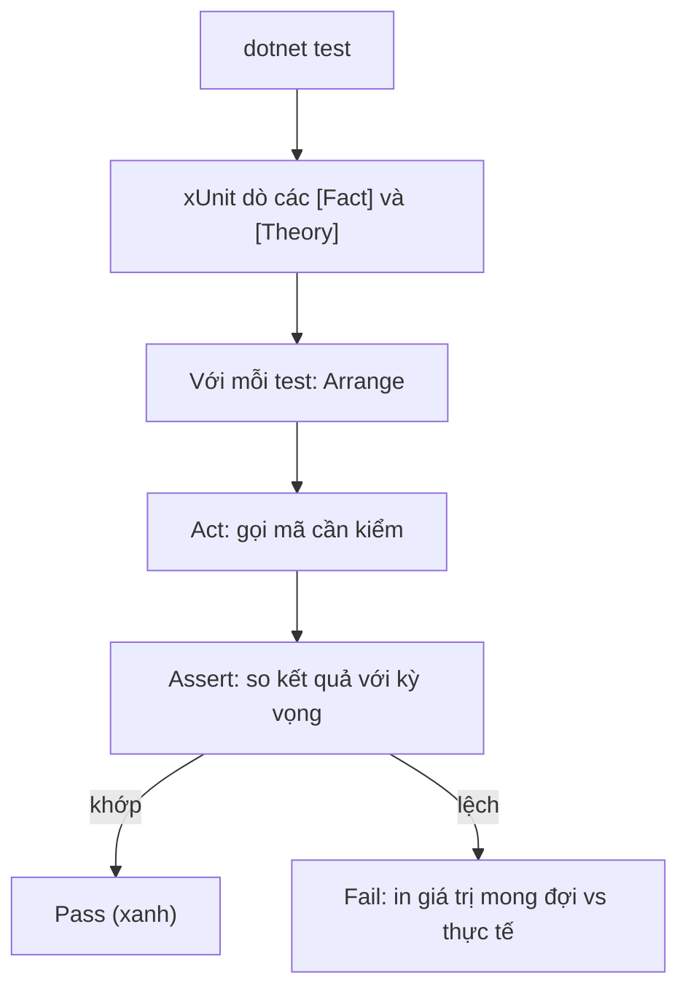

# Testing với xUnit

!!! info "Bạn đang ở đây"
    **cần trước:** minimal api (bạn phải biết một endpoint trả về gì).
    **mở khoá sau chương này:** viết test tự động cho logic thuần và cho api, dùng test như tài liệu sống mô tả hành vi hệ thống.

> **Mục tiêu:** **Áp dụng** xUnit để viết test tự động — dùng `[Fact]` cho ca đơn, `[Theory]`+`[InlineData]` cho nhiều ca, tổ chức theo Arrange-Act-Assert, và tách được test logic thuần với test api.

---

## 0. Đoán nhanh trước khi học

Bạn có một hàm `Add(int a, int b)`. Bạn muốn kiểm nó với 5 cặp số khác nhau.

1. Bạn sẽ viết 5 phương thức `[Fact]` riêng, hay có cách gọn hơn?
2. Nếu một test hỏng, bạn muốn thông báo cho biết **giá trị nào** làm hỏng — điều đó phụ thuộc vào cách viết test ra sao?

??? note "Đáp án"
    1. Gọn hơn: dùng **một** `[Theory]` với 5 dòng `[InlineData(...)]`. xUnit chạy phương thức đó 5 lần, mỗi lần một bộ tham số → 5 test độc lập.
    2. Vì mỗi `InlineData` là một test riêng, khi hỏng xUnit in ra **đúng bộ tham số** gây lỗi (ví dụ `Add(2, 2)`), không phải gộp chung thành một khối mờ mịt.

---

## 1. Ý niệm cốt lõi

Test tự động là **mã kiểm tra mã**: bạn mô tả đầu vào và kết quả kỳ vọng, máy chạy và báo pass/fail. xUnit là framework test phổ biến nhất cho .NET {{ dotnet.current }}, dùng C# {{ csharp.version }}.

Ba khái niệm nền:

| Khái niệm | Ý nghĩa | Dùng khi |
|---|---|---|
| `[Fact]` | Một test không tham số — một sự thật cần đúng | Ca cụ thể, cố định |
| `[Theory]` + `[InlineData]` | Test tham số hoá — chạy nhiều bộ dữ liệu | Nhiều ca cùng một logic |
| Arrange-Act-Assert (AAA) | Bố cục 3 khối: dựng dữ liệu → thực thi → khẳng định | Mọi test, để dễ đọc |

Vòng đời một lần chạy test:



Đặt tên test là một dạng **tài liệu sống**: tên nên mô tả *hành vi*, không mô tả *cài đặt*. Mẫu hay dùng: `Method_Điềukiện_Kỳvọng`, ví dụ `Withdraw_KhiSốDưKhôngĐủ_NémException`. Đọc danh sách tên test là đọc được đặc tả hệ thống.

!!! danger "Hiểu lầm phổ biến"
    "Test chỉ để bắt bug." Sai một nửa. Giá trị lớn nhất của test là **chống hồi quy** (đổi code sau này không âm thầm phá hành vi cũ) và **làm tài liệu** cho ý định của bạn. Một test tên rõ ràng còn giá trị hơn một dòng comment.

---

## 2. Ví dụ mẫu

Ta minh hoạ Arrange-Act-Assert bằng chương trình thuần BCL — tự "assert" bằng `Console` để bạn thấy ý tưởng pass/fail mà không cần cài xUnit.

```csharp title="C#"
// test:run
int Add(int a, int b) => a + b;

void AssertEqual(int expected, int actual, string name)
{
    var ok = expected == actual;
    Console.WriteLine($"{(ok ? "PASS" : "FAIL")} {name} (mong {expected}, được {actual})");
}

// Mô phỏng một [Theory] với nhiều [InlineData]
(int a, int b, int expected)[] cases =
[
    (1, 2, 3),
    (0, 0, 0),
    (-1, 1, 0),
];

foreach (var (a, b, expected) in cases)
    AssertEqual(expected, Add(a, b), $"Add({a},{b})");
```

Output kỳ vọng:

```text title="Kết quả"
PASS Add(1,2) (mong 3, được 3)
PASS Add(0,0) (mong 0, được 0)
PASS Add(-1,1) (mong 0, được 0)
```

Cùng logic đó viết bằng xUnit thật (cần package `xunit`, nên đánh dấu skip):

```csharp title="C#"
// test:skip cần package xunit
using Xunit;

public class CalculatorTests
{
    [Fact]
    public void Add_HaiSốDương_TrảTổng()
    {
        // Arrange
        var calc = new Calculator();
        // Act
        var result = calc.Add(2, 3);
        // Assert
        Assert.Equal(5, result);
    }

    [Theory]
    [InlineData(1, 2, 3)]
    [InlineData(0, 0, 0)]
    [InlineData(-1, 1, 0)]
    public void Add_NhiềuCa_TrảTổngĐúng(int a, int b, int expected)
    {
        var result = new Calculator().Add(a, b);
        Assert.Equal(expected, result);
    }
}
```

Chạy bằng `dotnet test`. Mỗi `InlineData` hiện thành một dòng kết quả riêng.

---

## 3. Bài tập có giàn giáo

Cho interface và service dưới đây. Hãy viết test kiểm rằng khi kho hết hàng thì `Order` ném `InvalidOperationException`. Dùng **mock qua interface** (fake thủ công, không cần thư viện mock).

```csharp title="C#"
// test:skip đoạn trích, cần xunit để chạy assert
public interface IInventory
{
    bool IsInStock(string sku);
}

public sealed class OrderService(IInventory inventory)
{
    public string Place(string sku)
    {
        if (!inventory.IsInStock(sku))
            throw new InvalidOperationException($"Hết hàng: {sku}");
        return $"OK:{sku}";
    }

    // TODO: viết test cho cả hai nhánh (còn hàng / hết hàng)
}
```

??? note "Lời giải + giải thích"
    ```csharp title="C#"
    // test:skip cần package xunit
    using Xunit;

    // Fake thủ công: implement interface, trả giá trị ta điều khiển được.
    public sealed class FakeInventory(bool inStock) : IInventory
    {
        public bool IsInStock(string sku) => inStock;
    }

    public class OrderServiceTests
    {
        [Fact]
        public void Place_KhiCònHàng_TrảOK()
        {
            var svc = new OrderService(new FakeInventory(inStock: true));
            var result = svc.Place("ABC");
            Assert.Equal("OK:ABC", result);
        }

        [Fact]
        public void Place_KhiHếtHàng_NémException()
        {
            var svc = new OrderService(new FakeInventory(inStock: false));
            var ex = Assert.Throws<InvalidOperationException>(() => svc.Place("ABC"));
            Assert.Contains("Hết hàng", ex.Message);
        }
    }
    ```
    **Vì sao mock qua interface:** `OrderService` phụ thuộc `IInventory`, không phụ thuộc lớp cụ thể. Ở test ta thay bằng `FakeInventory` để **điều khiển** kết quả `IsInStock` mà không cần DB thật → test nhanh, tất định, chỉ kiểm logic của `OrderService`. `Assert.Throws<T>` bắt đúng loại exception và trả về nó để kiểm tiếp nội dung.

---

## 4. Test logic thuần vs test API

| Loại | Kiểm gì | Công cụ | Tốc độ |
|---|---|---|---|
| Logic thuần (unit) | Một lớp/hàm cô lập | xUnit + fake interface | Rất nhanh |
| API (integration) | Endpoint http thật, qua middleware | `WebApplicationFactory<T>` | Chậm hơn |

`WebApplicationFactory<TEntryPoint>` (gói `Microsoft.AspNetCore.Mvc.Testing`) khởi động app **trong bộ nhớ**, cho bạn một `HttpClient` gọi endpoint thật mà không cần mở cổng mạng:

```csharp title="C#"
// test:skip cần Microsoft.AspNetCore.Mvc.Testing + xunit
using Microsoft.AspNetCore.Mvc.Testing;
using Xunit;

public class HealthApiTests(WebApplicationFactory<Program> factory)
    : IClassFixture<WebApplicationFactory<Program>>
{
    [Fact]
    public async Task Get_Health_TrảOK()
    {
        var client = factory.CreateClient();
        var res = await client.GetAsync("/health");
        Assert.True(res.IsSuccessStatusCode);
    }
}
```

!!! tip "Kim tự tháp test"
    Viết **nhiều** test logic thuần (nhanh, rẻ), **ít** test api (chậm, nhưng kiểm cả đường đi thật gồm routing, DI, middleware). Đừng đảo ngược tỉ lệ này.

---

## Tự kiểm tra

1. Khi nào dùng `[Theory]` thay vì viết nhiều `[Fact]`?
2. Ba khối của Arrange-Act-Assert làm gì?
3. Vì sao đặt tên test theo hành vi (ví dụ `Withdraw_KhiSốDưKhôngĐủ_NémException`) là "tài liệu sống"?
4. `WebApplicationFactory<Program>` khác test logic thuần ở điểm cốt lõi nào?
5. Vì sao mock qua interface giúp test tất định hơn?

??? note "Đáp án"
    1. Khi cùng một logic cần kiểm với **nhiều bộ dữ liệu** — `[Theory]`+`[InlineData]` cho mỗi bộ thành một test riêng, tên gọn, báo lỗi rõ giá trị nào sai.
    2. **Arrange**: dựng đối tượng/dữ liệu đầu vào. **Act**: gọi đúng một hành động cần kiểm. **Assert**: so kết quả thực tế với kỳ vọng.
    3. Danh sách tên test đọc như một đặc tả: mỗi tên nói rõ *điều kiện* và *hành vi mong đợi*, nên đọc test là hiểu hệ thống làm gì mà không cần đọc cài đặt.
    4. Nó khởi động **toàn bộ app trong bộ nhớ** và gọi endpoint http thật (qua routing, DI, middleware); test logic thuần chỉ gọi một lớp cô lập, không qua pipeline.
    5. Fake/mock cho phép **điều khiển** đầu ra của phụ thuộc (DB, mạng...) → kết quả không phụ thuộc yếu tố ngoài, chạy nhanh và luôn cho cùng kết quả.

---

??? abstract "DEEP DIVE — fixture, mock library, và test song song"
    - **Chia sẻ tốn kém:** `IClassFixture<T>` chia sẻ một instance trong **một** lớp test; `ICollectionFixture<T>` + `[Collection("name")]` chia sẻ across nhiều lớp (ví dụ một container database dựng một lần cho cả nhóm).
    - **Mock bằng thư viện:** với phụ thuộc phức tạp, thay fake thủ công bằng `NSubstitute`/`Moq`: `inv.IsInStock("ABC").Returns(false);`. Tiện khi cần verify số lần gọi.
    - **Song song hoá:** xUnit chạy các **collection** khác nhau song song. Test đụng tài nguyên chung phải đặt cùng một collection để tránh flaky.

**Tiếp theo →** kiểm thử bảo mật với semgrep
