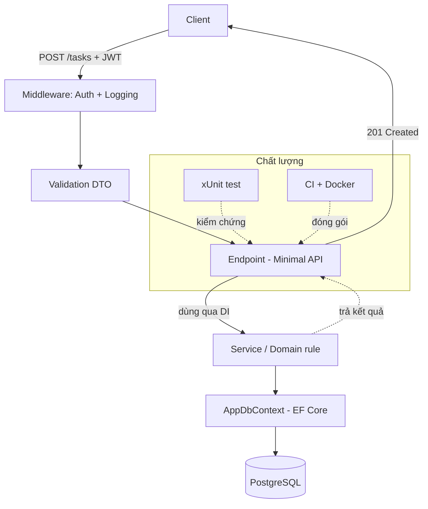

# Capstone: TaskFlow đầu-cuối

!!! info "bạn đang ở đây · p5 → node `p5-capstone` · bài tổng hợp cuối lộ trình"
    **cần trước:** dùng mcp mở rộng ngữ cảnh cho agent — vì bạn sẽ nhờ agent thao tác trên toàn dự án thật.
    **mở khoá:** năng lực ghép mọi kỹ năng thành một ứng dụng chạy được, có thể đưa vào hồ sơ hoặc dùng làm nền cho dự án tiếp theo.

> **Mục tiêu:** **Kiến tạo** (Create) được ứng dụng TaskFlow hoàn chỉnh — domain, dữ liệu, API, bảo mật, kiểm thử, đóng gói — bằng cách tích hợp năm pha đã học, rồi tự chấm bằng một Definition of Done đo được.

---

## 0. Đoán nhanh trước khi đọc

Trước khi xem đáp án, hãy tự trả lời (desirable difficulty — đoán sai vẫn giúp nhớ lâu hơn):

1. TaskFlow có nên đặt logic nghiệp vụ (ví dụ: task quá hạn) ngay trong endpoint không, hay ở đâu?
2. Migration EF Core nên chạy tự động khi khởi động container, hay tách riêng?
3. Nếu một endpoint sửa dữ liệu mà thiếu `[Authorize]`, đó là lỗi tầng nào — domain, dữ liệu, hay API/bảo mật?

??? note "Đáp án"
    1. Đặt trong **domain (P1)** — entity/tầng nghiệp vụ tự bảo toàn quy tắc; endpoint chỉ điều phối. Nhét vào endpoint làm logic khó test và trùng lặp.
    2. **Tách riêng** cho môi trường thật (chạy migration như một bước triển khai). Auto-migrate lúc khởi động tiện cho học tập/dev, nhưng rủi ro khi nhiều instance cùng chạy.
    3. **API/bảo mật (P4)** — đây là lỗ hổng thiếu phân quyền; test tích hợp phải bắt được nó (trả 401/403 thay vì 200).

---

## 1. Ý niệm cốt lõi

TaskFlow là một **API quản lý công việc**: người dùng đăng nhập, tạo/sửa/hoàn thành task của riêng mình. Điểm mấu chốt của capstone không phải viết thêm mã mới, mà **ghép các lát cắt kiến thức thành một khối chạy được**, với ranh giới trách nhiệm rõ ràng theo pha.

Mỗi pha đóng góp đúng một tầng, xếp chồng từ trong ra ngoài:

| Pha | Đóng góp cho TaskFlow | Sản phẩm cụ thể |
|-----|----------------------|-----------------|
| P1 — C# | Domain thuần | `TaskItem`, `TaskStatus`, quy tắc nghiệp vụ |
| P2 — Dữ liệu | Lưu trữ | `AppDbContext`, migration, PostgreSQL |
| P3 — Web API | Vỏ HTTP | Minimal API endpoints, DI, DTO |
| P4 — Bảo mật/chất lượng | Cứng hoá | JWT, validation, logging, test, Docker |
| P5 — AI | Tăng tốc | Claude Code + MCP để sinh/refactor/review |

Kiến trúc các lớp và luồng một request điển hình:



!!! danger "Hiểu lầm phổ biến"
    "Capstone = viết lại từ đầu cho hoành tráng." Sai. Capstone là bài **tích hợp**: phần lớn mã đã có ở các chương trước, bạn chỉ nối chúng và **bịt các khe hở giữa các tầng** (ví dụ: quên map DTO, quên `[Authorize]`, quên đăng ký service trong DI). Giá trị nằm ở sự liền mạch, không ở dòng mã mới.

---

## 2. Ví dụ mẫu

Domain thuần là phần duy nhất tự chứa bằng BCL — nó là "hạt nhân" mà mọi tầng khác bọc quanh:

```csharp title="C# — domain thuần (P1)"
// test:run
var t = new TaskItem("Viết capstone");
Console.WriteLine(t.Status);      // Todo
t.Complete();
Console.WriteLine(t.Status);      // Done

public enum TaskStatus { Todo, Done }

public class TaskItem
{
    public string Title { get; }
    public TaskStatus Status { get; private set; } = TaskStatus.Todo;

    public TaskItem(string title)
    {
        if (string.IsNullOrWhiteSpace(title))
            throw new ArgumentException("Title bắt buộc", nameof(title));
        Title = title;
    }

    public void Complete() => Status = TaskStatus.Done;   // quy tắc nằm trong domain
}
```

```text title="Kết quả"
Todo
Done
```

Khi bọc domain này vào API + EF Core + JWT, endpoint chỉ điều phối — nó không tự chứa bằng BCL nên tham chiếu chương trước và đánh dấu skip:

```csharp title="C# — endpoint bọc domain (P3+P4)"
// test:skip cần ASP.NET Core + EF Core, xem chương minimal-api và jwt
app.MapPost("/tasks", async (CreateTaskDto dto, AppDbContext db, ClaimsPrincipal user) =>
{
    var item = new TaskItem(dto.Title);            // domain P1
    db.Tasks.Add(item);                            // EF Core P2
    await db.SaveChangesAsync();
    return Results.Created($"/tasks/{item.Id}", item);
})
.RequireAuthorization()                            // JWT P4
.WithName("CreateTask");
```

---

## 3. Bài tập có giàn giáo

Ghép TaskFlow theo pha. Với mỗi pha, hoàn thành mục tiêu rồi tick vào checklist ở mục kế.

- **Bước 1 (P1):** Thêm quy tắc "không hoàn thành task đã bị xoá" vào domain. Gợi ý: thêm cờ `IsDeleted` và ném lỗi trong `Complete()`.
- **Bước 2 (P2):** Tạo migration cho `TaskItem` và trỏ tới PostgreSQL {{ postgres.current }}.
- **Bước 3 (P3):** Bổ sung endpoint `GET /tasks` chỉ trả task của người dùng hiện tại.
- **Bước 4 (P4):** Viết một test tích hợp khẳng định `POST /tasks` thiếu token trả 401.
- **Bước 5 (P5):** Nhờ Claude Code refactor service ra khỏi endpoint, rồi tự review diff.

??? note "Lời giải bước 1 (và vì sao)"
    ```csharp title="C# — bảo toàn quy tắc trong domain"
    // test:run
    var t = new TaskItem("x");
    t.Delete();
    try { t.Complete(); }
    catch (InvalidOperationException e) { Console.WriteLine(e.Message); }

    public enum TaskStatus { Todo, Done }
    public class TaskItem
    {
        public TaskStatus Status { get; private set; }
        public bool IsDeleted { get; private set; }
        public TaskItem(string title) { }
        public void Delete() => IsDeleted = true;
        public void Complete()
        {
            if (IsDeleted)
                throw new InvalidOperationException("Task đã xoá, không thể hoàn thành");
            Status = TaskStatus.Done;
        }
    }
    ```
    ```text title="Kết quả"
    Task đã xoá, không thể hoàn thành
    ```
    **Vì sao:** đặt bất biến (invariant) trong domain đảm bảo mọi tầng gọi tới — API, test, seed dữ liệu — đều không thể vi phạm. Nếu kiểm tra ở endpoint, một endpoint khác quên kiểm tra là dữ liệu hỏng.

---

## 4. Definition of Done (tự chấm)

Chấm TaskFlow của bạn — chỉ tick khi **kiểm chứng được**, không tick theo cảm giác:

- [ ] **P1** Domain có ít nhất một quy tắc nghiệp vụ được bảo toàn bằng exception, có unit test.
- [ ] **P2** `dotnet ef database update` chạy sạch; dữ liệu lưu và đọc lại đúng từ PostgreSQL.
- [ ] **P3** CRUD task đầy đủ qua Minimal API; service đăng ký qua DI, không `new` thủ công trong endpoint.
- [ ] **P4** Mọi endpoint ghi dữ liệu có `RequireAuthorization()`; DTO có validation; log request có correlation.
- [ ] **P4** `dotnet test` xanh, gồm ít nhất một test tích hợp cho luồng 401/403.
- [ ] **P4** `docker build` thành công và container chạy healthy.
- [ ] **P5** Có `SKILL.md` hoặc `CLAUDE.md` mô tả dự án; đã dùng `claude mcp add` cho ít nhất một MCP hữu ích.
- [ ] **Tổng** README nêu cách chạy trong 3 lệnh; không secret hardcode trong mã.

```bash title="Terminal — kiểm chứng nhanh"
dotnet test
docker build -t taskflow .
docker run --rm -p 8080:8080 taskflow
```

---

## 5. Cạm bẫy tích hợp

- **Quên đăng ký DI:** endpoint biên dịch được nhưng chết lúc chạy với lỗi resolve service. Luôn chạy thử một request thật, đừng chỉ build.
- **Migration lệch model:** sửa entity mà quên tạo migration → runtime lỗi cột. Xem lại chương ef-core.
- **JWT hết hạn trong test:** test tích hợp phải tự phát token, đừng dùng token cứng.
- **Docker không thấy PostgreSQL:** trong container, host DB không phải `localhost`; dùng tên service hoặc biến môi trường.

---

## Tự kiểm tra

1. Tầng nào trong TaskFlow chịu trách nhiệm bảo toàn quy tắc "task đã xoá không thể hoàn thành"?
2. Trong DoD, vì sao bắt buộc có một test tích hợp cho luồng 401/403?
3. Vì sao capstone khuyến khích dùng service qua DI thay vì `new` trong endpoint?
4. Nêu một cạm bẫy khi chạy TaskFlow trong Docker liên quan tới kết nối cơ sở dữ liệu.
5. Trong luồng request, thành phần nào chạy *trước* endpoint và làm gì?

??? note "Đáp án"
    1. **Domain (P1)** — bất biến đặt trong entity, không ở endpoint.
    2. Vì thiếu phân quyền là lỗ hổng nghiêm trọng và dễ lọt; test tự động là trọng tài khách quan bắt được nó trước khi lên production.
    3. DI cho phép thay thế/mock service khi test và tránh phụ thuộc cứng; `new` thủ công phá vòng đời và làm khó kiểm thử.
    4. Trong container, cơ sở dữ liệu không nằm ở `localhost`; phải trỏ tới tên service/biến môi trường, nếu không kết nối thất bại.
    5. **Middleware** (xác thực JWT + logging) chạy trước: kiểm token, gắn `ClaimsPrincipal`, ghi log request; nếu token sai thì chặn trước khi tới endpoint.

---

??? abstract "DEEP DIVE — nâng TaskFlow lên mức production"
    Khi khối cơ bản đã xanh, đây là các bước đưa TaskFlow tới mức thật:

    - **Kiến trúc:** tách solution thành `Domain`, `Infrastructure`, `Api` — buộc chiều phụ thuộc chỉ hướng vào trong (Api → Infrastructure → Domain), ngăn domain lỡ tham chiếu EF Core.
    - **Quan sát được (observability):** thêm structured logging + health check `/healthz`; nếu triển khai cụm, gắn OpenTelemetry để trace một request xuyên các tầng.
    - **Migration an toàn:** chạy migration như một job triển khai riêng (không auto-migrate lúc khởi động) để tránh race khi nhiều instance khởi động cùng lúc.
    - **CI cứng:** pipeline chạy `dotnet test` + `docker build` + quét secret; chặn merge nếu coverage tụt hoặc test đỏ.
    - **Vòng lặp AI có kỷ luật:** dùng Claude Code với `SKILL.md` mô tả quy ước dự án, để agent tự chạy test sau mỗi thay đổi; bạn vẫn là người review diff và chịu trách nhiệm commit.

Tiếp theo -> chúc mừng, bạn đã hoàn thành lộ trình zero → senior; hãy quay lại các chương nâng cao ai hoặc mở rộng taskflow theo phần deep dive
