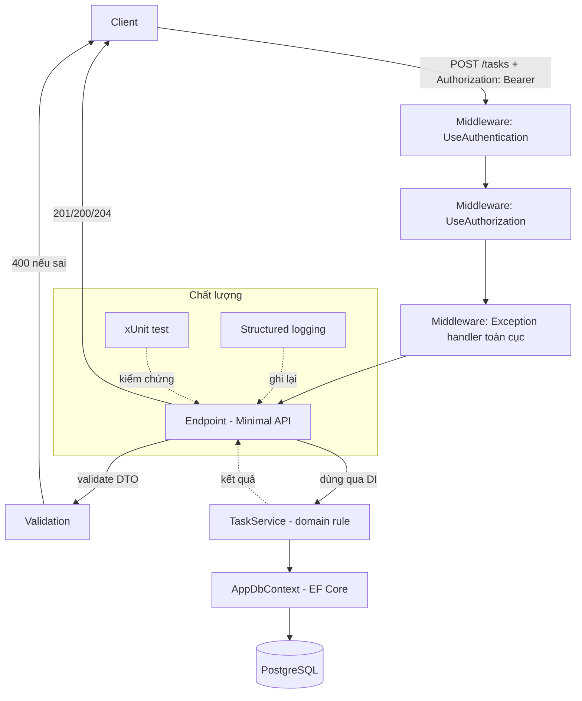

# Capstone: TaskFlow — ghép Ngôn ngữ + Dữ liệu + Web API + Bảo mật

!!! info "bạn đang ở đây · p5 → node `p5-capstone` · rủi ro t3 (bảo mật/ai)"
    **cần trước:** mcp (mở rộng ngữ cảnh cho agent), jwt (cấp/kiểm token), ef core quan hệ (entity + navigation property) — vì capstone này ghép cả ba lại thành một app chạy được, không dạy khái niệm mới.
    **mở khoá:** năng lực tự ghép nhiều lát cắt kiến thức rời rạc thành một hệ thống liền mạch, có Definition of Done đo được — kỹ năng bạn dùng lại ở MỌI dự án thật sau này, không riêng TaskFlow.

> **Mục tiêu (đo được):** sau chương này bạn **Kiến tạo** (Create) được một API quản lý task tên TaskFlow — có entity quan hệ 1-N lưu trong PostgreSQL qua EF Core, endpoint CRUD bảo vệ bằng JWT, validation trả đúng `400`, exception handler bắt lỗi toàn cục, ít nhất một test xUnit, và logging có cấu trúc — bằng cách tái sử dụng đúng kỹ thuật đã học ở P1–P4, rồi tự chấm kết quả bằng một Definition of Done gồm 8 tiêu chí cụ thể.

!!! warning "Đây KHÔNG phải capstone cuối lộ trình"
    TaskFlow ở chương này là **capstone trung gian** — điểm kiểm tra sau khi xong bốn pha nền (Ngôn ngữ, Dữ liệu, Web API, Bảo mật). Lộ trình còn Architecture, Frontend, Production, DevOps, CS Foundations phía sau; capstone **cuối cùng** của toàn bộ chương trình nằm ở cuối P10, sau khi bạn đã học kiến trúc phần mềm và vận hành production. Đừng cố nhồi Docker Compose multi-service hay CI/CD phức tạp vào đây — những thứ đó thuộc capstone cuối.

Nói cách khác: nếu bạn đọc chương này và thấy quen — quen vì **đúng là quen thật**. Mọi kỹ thuật dùng ở đây (entity, navigation property, Minimal API, JWT, validation, exception handler, xUnit) đã có mặt ở các chương P1–P4 riêng lẻ. Việc mới duy nhất là **ghép** chúng lại và tự phát hiện những khe hở chỉ lộ ra khi các phần chạm vào nhau — đó cũng chính là kỹ năng một lập trình viên thật cần, nhiều hơn cả việc học thêm một API mới.

---

## 0. Đoán nhanh trước khi đọc

Trước khi xem đáp án, hãy tự trả lời (desirable difficulty — đoán sai vẫn giúp nhớ lâu hơn):

1. TaskFlow cần quan hệ 1-N giữa `User` và `TaskItem`. Navigation property nên đặt ở entity nào — chỉ ở `User`, chỉ ở `TaskItem`, hay cả hai?
2. Một endpoint `PUT /tasks/{id}` sửa task của người khác (không phải chủ sở hữu) — lỗi này nên chặn ở tầng nào: middleware JWT, hay logic bên trong endpoint/service?
3. Nếu quên gọi `app.UseAuthentication()` trước `app.UseAuthorization()`, endpoint có `[Authorize]`/`RequireAuthorization()` sẽ trả về mã lỗi gì, kể cả khi client gửi token hợp lệ?

??? note "Đáp án"
    1. **Cả hai**, nhưng không bắt buộc — `TaskItem.UserId` (khoá ngoại, cột thật) là bắt buộc; `TaskItem.User` (navigation về chủ sở hữu) rất nên có để truy vấn tiện; `User.Tasks` (tập hợp ngược) là tuỳ chọn, chỉ cần nếu bạn thật sự truy vấn "lấy mọi task của user này" từ phía `User`. Xem lại mục 1 chương EF Core quan hệ nếu câu này còn mơ hồ.
    2. **JWT/middleware chỉ xác nhận "ai đang gọi"** (authentication) — nó không biết "người này có được sửa *task cụ thể này* không" (authorization theo dữ liệu). Việc so `task.UserId == currentUserId` phải nằm trong logic endpoint/service, sau khi middleware đã xác thực token.
    3. **401 Unauthorized**, dù token hoàn toàn hợp lệ — vì `HttpContext.User` chưa được điền claim tại thời điểm `UseAuthorization()` chạy kiểm tra. Đây đúng là cạm bẫy đã học ở chương jwt, không phải khái niệm mới.

---

## 1. Vì sao cần capstone — tích hợp khác học từng phần

**Định nghĩa (một câu):** *Tích hợp* (integration) nghĩa là ghép nhiều thành phần đã kiểm chứng riêng lẻ (domain, EF Core, Minimal API, JWT) vào **một** hệ thống chạy được, và xử lý đúng các **điểm nối** giữa chúng — khác hoàn toàn với việc học từng phần riêng, vì lỗi tích hợp chỉ xuất hiện khi các phần *chạm* vào nhau.

Từng chương P1–P4 kiểm chứng một lát cắt bằng test/ví dụ **cô lập** với phần còn lại — điều này đúng và cần thiết để học từng khái niệm, nhưng nó không đảm bảo các lát cắt *ghép lại* đúng, vì chưa có bài tập nào từng chạy chúng cùng lúc trong một tiến trình duy nhất.

Bốn pha bạn đã học, mỗi pha đóng góp đúng một tầng, xếp chồng từ trong ra ngoài:

| Pha | Đóng góp cho TaskFlow | Sản phẩm cụ thể |
|-----|----------------------|-----------------|
| P1 — Ngôn ngữ | Domain thuần bằng C# (OOP, generic, LINQ) | `TaskItem`, `TaskStatus`, quy tắc nghiệp vụ |
| P2 — Dữ liệu | Lưu trữ bền (EF Core + PostgreSQL) | `AppDbContext`, migration, quan hệ 1-N |
| P3 — Web API | Vỏ HTTP (Minimal API, DI, validation, middleware) | endpoint, DTO, error handler toàn cục |
| P4 — Bảo mật | Cứng hoá (JWT, upload, test, logging) | đăng nhập cấp token, `RequireAuthorization()`, xUnit, log có cấu trúc |

**Ví dụ độc lập minh hoạ đúng khái niệm "điểm nối":** giả sử domain (P1) định nghĩa `TaskItem.Complete()` ném `InvalidOperationException` khi task đã bị xoá. Tầng API (P3) gọi `Complete()` trong endpoint nhưng **không** bọc try/catch — nếu không có exception handler toàn cục (P3), lỗi này rơi thẳng ra client dưới dạng trang lỗi 500 mặc định của ASP.NET Core, lộ cả stack trace. Đây chính là một "điểm nối" bị bỏ sót: domain đúng, API đúng riêng lẻ, nhưng ghép lại thiếu một mắt xích.

**Nếu bỏ qua tích hợp — hậu quả cụ thể:** một dự án có domain test xanh 100%, EF Core migration chạy sạch, JWT cấp/kiểm token đúng riêng lẻ — nhưng khi ghép lại, endpoint quên gọi `RequireAuthorization()` trên route sửa dữ liệu. Từng phần "đúng" khi xét riêng, nhưng hệ thống ghép lại có lỗ hổng nghiêm trọng: ai cũng sửa được task của người khác mà không cần đăng nhập. Capstone tồn tại chính là để bắt loại lỗi này *trước khi* nó tới production.

Kiến trúc các lớp và luồng một request điển hình của TaskFlow:



Đọc sơ đồ theo đúng thứ tự request đi qua: **middleware xác thực** (giải mã và kiểm chữ ký JWT, điền `ClaimsPrincipal`) chạy trước **middleware phân quyền** (kiểm route có yêu cầu `[Authorize]`/`RequireAuthorization()` không); sau đó **exception handler toàn cục** bọc quanh phần còn lại để bắt mọi lỗi chưa xử lý; chỉ khi qua hết ba lớp đó, request mới chạm vào **endpoint**, nơi validation DTO chạy trước khi endpoint gọi service.

!!! danger "Hiểu lầm phổ biến — đính chính"
    "Capstone = viết lại từ đầu cho hoành tráng, thêm càng nhiều công nghệ mới càng tốt." **Sai.** Phần lớn mã đã tồn tại ở các chương trước — bạn chỉ nối chúng lại và **bịt các khe hở giữa các tầng** (quên map DTO, quên `RequireAuthorization()`, quên đăng ký service trong DI, quên `Include()` nên navigation property luôn null). Giá trị capstone nằm ở sự liền mạch và khả năng tự phát hiện khe hở, không ở số lượng công nghệ mới nhồi vào.

---

## 2. Kiến trúc tổng thể — bốn lớp, một chiều phụ thuộc

**Định nghĩa (một câu):** Kiến trúc tổng thể của TaskFlow là một chuỗi bốn lớp gọi nhau **một chiều** — Endpoint gọi Service, Service gọi Repository/DbContext, DbContext gọi PostgreSQL — trong đó lớp ngoài (Endpoint) biết về lớp trong (Service) nhưng **không** ngược lại, giúp thay đổi một lớp không kéo theo phải sửa lớp khác.

| Lớp | Vai trò (một câu) | Không nên làm gì |
|-----|--------------------|-------------------|
| **Endpoint** (Minimal API) | Nhận HTTP request, validate DTO đầu vào, gọi Service, trả `Results.*` đúng mã trạng thái | Không viết logic nghiệp vụ hay truy vấn SQL trực tiếp ở đây |
| **Service** | Chứa logic điều phối + gọi domain rule (P1) | Không biết gì về `HttpContext`/`Results` — Service không phụ thuộc ASP.NET Core |
| **Repository / `AppDbContext`** | Đọc/ghi PostgreSQL qua EF Core | Không chứa logic nghiệp vụ — chỉ là lớp truy cập dữ liệu |
| **Middleware** (JWT + exception handler) | Chạy **trước** Endpoint, chặn request thiếu quyền hoặc bắt lỗi toàn cục | Không tự ý sửa dữ liệu — middleware chỉ kiểm và log |

Nếu bạn chưa quen khái niệm "một chiều phụ thuộc": nghĩa là dòng code trong `Service` **không được** viết `using Microsoft.AspNetCore.Http;` hay tham chiếu `HttpContext` — nếu nó cần, đó là dấu hiệu logic HTTP đang lẫn vào tầng nghiệp vụ, sai vị trí.

**Nếu vi phạm — hậu quả cụ thể:** nếu `TaskService.CompleteTask(...)` nhận trực tiếp `HttpContext` làm tham số (thay vì nhận `userId` là `string`/`Guid`), bạn **không thể** viết unit test cho `TaskService` mà không dựng cả một `HttpContext` giả — buộc mọi test phải trở thành test tích hợp nặng nề, chậm, khó cách ly lỗi. Tách đúng lớp giúp `Service` test được bằng xUnit thuần, không cần khởi động server.

Ví dụ tối thiểu — `TaskService` chỉ nhận kiểu dữ liệu thuần (`Guid`, `string`), không biết gì về HTTP:

```csharp title="TaskService.cs — tầng Service đúng ranh giới"
// test:skip cần EF Core (AppDbContext) — minh hoạ ranh giới lớp, không tự-compile bằng BCL
public sealed class TaskService(AppDbContext db)
{
    // Nhận Guid thuần, KHÔNG nhận HttpContext/ClaimsPrincipal — đây là điểm mấu chốt
    // giúp test được bằng xUnit mà không cần dựng server giả.
    public async Task<TaskItem> CreateAsync(Guid userId, string title)
    {
        var task = new TaskItem { Title = title, UserId = userId };   // domain rule (P1) áp dụng ở đây
        db.Tasks.Add(task);
        await db.SaveChangesAsync();
        return task;
    }

    public async Task<bool> TryCompleteAsync(Guid userId, Guid taskId)
    {
        var task = await db.Tasks.FindAsync(taskId);
        if (task is null || task.UserId != userId) return false;   // authorization theo dữ liệu

        if (task.IsDeleted)
            throw new InvalidOperationException("Task đã xoá, không thể hoàn thành");   // domain rule P1

        task.Status = TaskState.Done;
        await db.SaveChangesAsync();
        return true;
    }
}
```

Endpoint gọi `TaskService` này chỉ cần lấy `userId` từ `ClaimsPrincipal` rồi truyền vào — bản thân `TaskService` không đụng tới `HttpContext` một lần nào, đúng ranh giới đã định nghĩa ở bảng trên.

---

## 3. Entity tối thiểu — `User` và `TaskItem`

**Định nghĩa (một câu):** *Entity tối thiểu* của TaskFlow là hai lớp POCO — `User` (người dùng) và `TaskItem` (công việc) — nối với nhau bằng quan hệ 1-N (một `User` có nhiều `TaskItem`, mỗi `TaskItem` thuộc đúng một `User`), đúng kỹ thuật navigation property đã học ở chương EF Core quan hệ.

```csharp title="Entities.cs"
// test:skip cần EF Core, không tự-compile bằng BCL — minh hoạ entity tối thiểu
using System.ComponentModel.DataAnnotations;

public class User
{
    public Guid Id { get; set; } = Guid.NewGuid();

    [Required, MaxLength(200)]
    public string Email { get; set; } = "";

    [Required]
    public string PasswordHash { get; set; } = "";   // KHÔNG lưu password thô — xem chương jwt

    public List<TaskItem> Tasks { get; set; } = new();   // navigation 1-N (phía "nhiều")
}

public enum TaskState { Todo, InProgress, Done }

public class TaskItem
{
    public Guid Id { get; set; } = Guid.NewGuid();

    [Required, MaxLength(200)]
    public string Title { get; set; } = "";

    public TaskState Status { get; set; } = TaskState.Todo;
    public bool IsDeleted { get; set; } = false;
    public DateTime CreatedAtUtc { get; set; } = DateTime.UtcNow;

    public Guid UserId { get; set; }          // khoá ngoại — cột THẬT tồn tại trong bảng TaskItems
    public User User { get; set; } = null!;   // navigation property — không ánh xạ cột nào
}
```

Chú ý đúng điểm dễ nhầm đã học ở chương EF Core quan hệ: `UserId` (kiểu `Guid`) là **cột thật** trong bảng `TaskItems`; `User` (kiểu `User`) là **navigation property**, không ánh xạ cột nào — nó chỉ tồn tại để bạn viết `task.User.Email` trong C# thay vì tự viết `JOIN`.

**Nếu dùng sai — hậu quả cụ thể:** nếu bạn quên khai báo `UserId` (khoá ngoại) và chỉ khai báo navigation `User`, EF Core vẫn tự suy ra được một khoá ngoại ẩn (convention-based) trong nhiều trường hợp — nhưng tên cột sinh ra sẽ không rõ ràng (ví dụ `UserId1` nếu có xung đột), gây khó debug khi đọc SQL log. Luôn khai báo khoá ngoại tường minh như trên.

Đăng ký hai entity này vào `AppDbContext`:

```csharp title="AppDbContext.cs"
// test:skip cần EF Core, không tự-compile bằng BCL
using Microsoft.EntityFrameworkCore;

public class AppDbContext : DbContext
{
    public AppDbContext(DbContextOptions<AppDbContext> options) : base(options) { }

    public DbSet<User> Users => Set<User>();
    public DbSet<TaskItem> Tasks => Set<TaskItem>();

    protected override void OnModelCreating(ModelBuilder modelBuilder)
    {
        modelBuilder.Entity<User>()
            .HasIndex(u => u.Email)
            .IsUnique();   // chặn hai user cùng email ở tầng database, không chỉ ở validation

        modelBuilder.Entity<TaskItem>()
            .HasOne(t => t.User)
            .WithMany(u => u.Tasks)
            .HasForeignKey(t => t.UserId)
            .OnDelete(DeleteBehavior.Cascade);   // xoá User -> xoá luôn Task của user đó
    }
}
```

---

## 4. Endpoint REST tối thiểu

**Định nghĩa (một câu):** Danh sách endpoint tối thiểu của TaskFlow là **một** endpoint đăng nhập (cấp JWT) cộng **bốn** endpoint CRUD cho `TaskItem`, mỗi endpoint chỉ thao tác trên task thuộc về đúng user đang đăng nhập (lấy từ claim `sub` trong token, không lấy từ tham số client gửi lên).

| Method + route | Yêu cầu JWT? | Việc chính |
|----------------|:---:|------------|
| `POST /auth/login` | Không | Kiểm email/password, cấp access token (xem chương jwt) |
| `GET /tasks` | Có | Trả danh sách task của user hiện tại (lọc theo `UserId` từ claim, **không** từ query string) |
| `POST /tasks` | Có | Tạo task mới, gán `UserId` từ claim của người gọi |
| `PUT /tasks/{id}` | Có | Sửa task — phải kiểm `task.UserId == currentUserId` trước khi cho sửa |
| `DELETE /tasks/{id}` | Có | Xoá (hoặc đánh dấu `IsDeleted`) — cùng kiểm chủ sở hữu như `PUT` |

!!! danger "Cạm bẫy nghiêm trọng nhất của mục này"
    Nếu `GET /tasks?userId=xxx` lấy `userId` để lọc **từ query string** (client tự gửi) thay vì từ claim trong JWT đã xác thực, bất kỳ ai đăng nhập cũng đọc được task của **bất kỳ user khác** chỉ bằng cách đổi giá trị `userId` trên URL — đây là lỗ hổng gọi là *Broken Object Level Authorization* (BOLA), một trong các lỗ hổng phổ biến nhất của API thật. `UserId` dùng để lọc dữ liệu **luôn** phải lấy từ `ClaimsPrincipal` (giá trị đã được ký, không thể client tự sửa), không bao giờ từ tham số request.

Mỗi endpoint nên trả đúng một trong các mã trạng thái sau — bảng này là hợp đồng, không phải gợi ý:

| Tình huống | Mã trạng thái | Vì sao không dùng mã khác |
|------------|:---:|-----------------------------|
| Tạo task thành công | `201 Created` | Không phải `200` — RESTful convention: tạo mới trả `201` kèm header `Location` chỉ tới resource vừa tạo |
| Đọc/sửa task thành công | `200 OK` | Chuẩn cho request thành công có trả body |
| Xoá task thành công (mềm hoặc thật) | `204 No Content` | Không cần trả body vì không còn gì để trả về |
| DTO thiếu field bắt buộc | `400 Bad Request` | Lỗi do **client** gửi sai định dạng — không phải `422` (dù `422` cũng hợp lệ về mặt kỹ thuật, `400` là lựa chọn phổ biến hơn cho Minimal API) |
| Thiếu/token sai | `401 Unauthorized` | Chưa xác thực được **ai** đang gọi |
| Token hợp lệ nhưng không có quyền trên resource | `403 Forbidden` | Đã biết **ai** gọi, nhưng người đó không có quyền trên task cụ thể này |
| `id` không tồn tại (hoặc thuộc user khác, nếu bạn chọn che giấu sự tồn tại) | `404 Not Found` | Tuỳ thiết kế: một số API dùng `404` thay `403` khi sửa task người khác, để không tiết lộ "task này có tồn tại nhưng không phải của bạn" |

**Nếu dùng sai — hậu quả cụ thể:** nếu `POST /tasks` trả `200 OK` thay vì `201 Created`, một client REST chuẩn (hoặc test tự động kiểm theo chuẩn REST) sẽ không tự động biết được resource mới tạo ở đâu (thiếu header `Location`) — đây không phải lỗi "chết chương trình", nhưng là lỗi hợp đồng API khiến việc tích hợp với client khác khó khăn hơn cần thiết.

---

## 5. Checklist tích hợp — kiểm từng lát cắt trước khi ghép

Đây không phải Definition of Done (mục 6) — đây là checklist **quá trình**, kiểm từng phần còn sống sau khi ghép, làm theo đúng thứ tự dưới đây vì phần sau phụ thuộc phần trước:

- [ ] **Domain (P1):** `TaskItem.Complete()`/tương đương ném exception đúng khi vi phạm bất biến (ví dụ: hoàn thành task đã xoá) — chạy được bằng `dotnet run` trên một project console nhỏ, tách biệt EF Core.
- [ ] **EF Core migration (P2):** `dotnet ef migrations add InitialCreate` sinh file migration không lỗi; `dotnet ef database update` áp vào PostgreSQL thành công; đọc lại dữ liệu vừa ghi đúng giá trị đã lưu.
- [ ] **Validation (P3):** gửi `POST /tasks` với `Title` rỗng → nhận đúng `400 Bad Request` kèm thông tin lỗi field, không phải `500` hay `200` với dữ liệu rác.
- [ ] **Exception handler toàn cục (P3):** ép một lỗi chưa xử lý (ví dụ chia cho 0 tạm thời trong endpoint để test) → response trả về là JSON lỗi có cấu trúc do handler bạn viết, **không** phải trang lỗi HTML mặc định của ASP.NET Core lộ stack trace.
- [ ] **Auth hoạt động (P4):** `POST /tasks` không kèm header `Authorization` → `401`; kèm token của user A nhưng cố sửa task của user B → `403` hoặc `404` (tuỳ thiết kế, nhưng **không** được `200`).
- [ ] **Test xUnit (P4):** có ít nhất một test khẳng định đúng hành vi 401/403 ở trên — không tự kiểm bằng tay rồi quên, mà để CI chạy lại được.
- [ ] **Logging có cấu trúc (P4):** mỗi request ghi log kèm `CorrelationId`/`TraceId`, không phải log chuỗi text nối tay bằng `+`.

```bash title="Terminal — chạy checklist theo thứ tự"
dotnet build
dotnet ef database update
dotnet test
dotnet run
```

---

## 6. Validation và exception handler — hai lớp chặn lỗi khác nhau

**Định nghĩa (một câu):** *Validation* chặn dữ liệu **sai định dạng** trước khi nó chạm vào logic nghiệp vụ (trả `400`, lỗi của client), còn *exception handler toàn cục* bắt lỗi **không lường trước được** đã xảy ra bên trong logic (trả `500` có cấu trúc, thường là lỗi hệ thống) — hai lớp này không thay thế nhau, thiếu một trong hai đều để lộ hành vi không mong muốn.

Nếu chưa quen phân biệt hai khái niệm này: validation trả lời câu hỏi "request này có *hợp lệ về hình thức* không?" (ví dụ `Title` có rỗng không); exception handler trả lời câu hỏi "nếu có gì bất thường xảy ra *trong lúc xử lý* mà không ai lường trước (mất kết nối database, chia cho 0, null reference), hệ thống phản hồi thế nào?".

```csharp title="ValidationExample.cs — validation tự động qua DataAnnotations"
// test:skip cần ASP.NET Core Minimal API — minh hoạ validation tự động
using System.ComponentModel.DataAnnotations;

public record CreateTaskDto(
    [Required(ErrorMessage = "Title bắt buộc")]
    [MaxLength(200, ErrorMessage = "Title tối đa 200 ký tự")]
    string Title
);

// Minimal API tự validate DTO khi có [Required]/[MaxLength] NẾU bạn dùng
// package hỗ trợ validation filter (ví dụ MinimalApis.Extensions, hoặc tự viết
// filter gọi Validator.TryValidateObject). Không có filter, [Required] trên DTO
// KHÔNG tự chặn — model binding của Minimal API mặc định không validate như MVC.
app.MapPost("/tasks", (CreateTaskDto dto) => Results.Created("/tasks/1", dto))
   .AddEndpointFilter(async (context, next) =>
   {
       var dto = context.GetArgument<CreateTaskDto>(0);
       var results = new List<ValidationResult>();
       var isValid = Validator.TryValidateObject(
           dto, new ValidationContext(dto), results, validateAllProperties: true);

       if (!isValid)
           return Results.ValidationProblem(
               results.ToDictionary(
                   r => r.MemberNames.FirstOrDefault() ?? "",
                   r => new[] { r.ErrorMessage ?? "" }));

       return await next(context);
   });
```

!!! danger "Cạm bẫy dễ nhầm nhất của validation trong Minimal API"
    Khác với ASP.NET Core MVC (Controller), **Minimal API không tự động chạy `[Required]`/`[MaxLength]` khi bind DTO** — bạn phải tự thêm `AddEndpointFilter` (như trên) hoặc dùng thư viện hỗ trợ. Nếu bạn chỉ gắn attribute vào DTO rồi tưởng "chắc nó tự chặn", `POST /tasks` với `Title` rỗng sẽ đi thẳng vào logic nghiệp vụ và trả `201 Created` với dữ liệu rác — đây chính là lý do checklist mục 5 yêu cầu **kiểm bằng request thật** (`curl`), không chỉ đọc code có attribute là đủ.

Song song với validation, exception handler toàn cục bắt phần còn lại — lỗi xảy ra *sau* khi dữ liệu đã hợp lệ về hình thức:

```csharp title="ExceptionHandlerExample.cs — bắt lỗi toàn cục có cấu trúc"
// test:skip cần ASP.NET Core — minh hoạ exception handler chi tiết hơn Program.cs mục 7
app.UseExceptionHandler(errorApp =>
{
    errorApp.Run(async context =>
    {
        var feature = context.Features.Get<Microsoft.AspNetCore.Diagnostics.IExceptionHandlerFeature>();
        var ex = feature?.Error;

        // Ánh xạ loại exception sang mã trạng thái — KHÔNG trả 500 cho mọi lỗi.
        var (status, message) = ex switch
        {
            InvalidOperationException => (StatusCodes.Status409Conflict, ex.Message),
            ArgumentException => (StatusCodes.Status400BadRequest, ex.Message),
            _ => (StatusCodes.Status500InternalServerError, "Đã có lỗi hệ thống, vui lòng thử lại"),
        };

        context.Response.StatusCode = status;
        context.Response.ContentType = "application/json";
        await context.Response.WriteAsJsonAsync(new { error = message });

        // Log lỗi thật (kèm stack trace) ở server — KHÔNG trả stack trace về client.
        var logger = context.RequestServices.GetRequiredService<ILogger<Program>>();
        logger.LogError(ex, "Lỗi chưa xử lý khi xử lý {Path}", context.Request.Path);
    });
});
```

**Nếu dùng sai — hậu quả cụ thể:** nếu bạn không đăng ký `UseExceptionHandler` (hoặc đăng ký nhưng đặt sai vị trí — phải là middleware **đầu tiên** trong pipeline để bọc được mọi middleware/endpoint phía sau), một exception ném ra từ domain rule (ví dụ `TaskItem.Complete()` ném `InvalidOperationException` khi task đã xoá — mục 1) sẽ không được ai bắt, ASP.NET Core trả về trang lỗi phát triển (development exception page) lộ toàn bộ stack trace ra client — kể cả tên class, tên file, đôi khi cả connection string nếu nó xuất hiện trong message lỗi.

---

## 7. Ví dụ mẫu — `Program.cs` wiring toàn bộ service

**Định nghĩa (một câu):** *Wiring* nghĩa là đăng ký mọi service (DbContext, TokenService, TaskService), middleware (JWT, exception handler), và endpoint vào **đúng thứ tự** trong `Program.cs`, để khi chạy `dotnet run`, request đi qua đủ các lớp đã vẽ ở sơ đồ mục 2 mà không thiếu mắt xích nào.

```csharp title="Program.cs — khởi động TaskFlow"
// test:compile cần ASP.NET Core + EF Core + JwtBearer, minh hoạ wiring đầu-cuối
using System.Security.Claims;
using System.Text;
using Microsoft.AspNetCore.Authentication.JwtBearer;
using Microsoft.EntityFrameworkCore;
using Microsoft.IdentityModel.Tokens;

var builder = WebApplication.CreateBuilder(args);

// 1) Dữ liệu (P2) — đăng ký DbContext trỏ PostgreSQL
builder.Services.AddDbContext<AppDbContext>(opt =>
    opt.UseNpgsql(builder.Configuration.GetConnectionString("Default")));

// 2) Bảo mật (P4) — JWT: cấp ở TokenService, kiểm ở AddJwtBearer
var jwt = builder.Configuration.GetSection("Jwt");
builder.Services
    .AddAuthentication(JwtBearerDefaults.AuthenticationScheme)
    .AddJwtBearer(options =>
    {
        options.TokenValidationParameters = new TokenValidationParameters
        {
            ValidateIssuer = true,
            ValidateAudience = true,
            ValidateLifetime = true,
            ValidateIssuerSigningKey = true,
            ValidIssuer = jwt["Issuer"],
            ValidAudience = jwt["Audience"],
            IssuerSigningKey = new SymmetricSecurityKey(
                Encoding.UTF8.GetBytes(jwt["Secret"]!)),
        };
    });
builder.Services.AddAuthorization();
builder.Services.AddScoped<TokenService>();

// 3) Web API (P3) — service nghiệp vụ đăng ký qua DI, không "new" tay trong endpoint
builder.Services.AddScoped<TaskService>();
builder.Services.AddProblemDetails();   // hỗ trợ exception handler trả JSON chuẩn

var app = builder.Build();

// Thứ tự middleware BẮT BUỘC: exception handler ngoài cùng, rồi auth, đúng như sơ đồ mục 2.
app.UseExceptionHandler(errApp => errApp.Run(async context =>
{
    context.Response.ContentType = "application/json";
    context.Response.StatusCode = StatusCodes.Status500InternalServerError;
    await context.Response.WriteAsJsonAsync(new { error = "Đã có lỗi xảy ra, vui lòng thử lại" });
}));
app.UseAuthentication();   // PHẢI trước UseAuthorization — xem lại chương jwt nếu quên vì sao
app.UseAuthorization();

// 4) Endpoint — vỏ HTTP mỏng, chỉ điều phối, không chứa logic nghiệp vụ
app.MapPost("/auth/login", async (LoginDto dto, TokenService tokens, AppDbContext db) =>
{
    var user = await db.Users.FirstOrDefaultAsync(u => u.Email == dto.Email);
    if (user is null || !tokens.VerifyPassword(dto.Password, user.PasswordHash))
        return Results.Unauthorized();

    var token = tokens.CapToken(user.Id.ToString(), user.Email);
    return Results.Ok(new { accessToken = token });
});

app.MapGet("/tasks", async (ClaimsPrincipal me, AppDbContext db) =>
{
    var userId = Guid.Parse(me.FindFirstValue(ClaimTypes.NameIdentifier)!);
    var tasks = await db.Tasks
        .Where(t => t.UserId == userId && !t.IsDeleted)   // lọc từ claim, KHÔNG từ query string
        .ToListAsync();
    return Results.Ok(tasks);
}).RequireAuthorization();

app.MapPost("/tasks", async (CreateTaskDto dto, ClaimsPrincipal me, TaskService svc) =>
{
    var userId = Guid.Parse(me.FindFirstValue(ClaimTypes.NameIdentifier)!);
    var created = await svc.CreateAsync(userId, dto.Title);   // domain rule P1 nằm trong svc
    return Results.Created($"/tasks/{created.Id}", created);
}).RequireAuthorization();

app.Run();

// DTO tối thiểu để ví dụ compile được — validation attribute trả 400 tự động qua model binding.
public record LoginDto(string Email, string Password);
public record CreateTaskDto([System.ComponentModel.DataAnnotations.Required, System.ComponentModel.DataAnnotations.MaxLength(200)] string Title);

// User/TaskItem/AppDbContext/TaskService: định nghĩa đầy đủ ở mục 3 (User/TaskItem) và mục 4
// (AppDbContext, TaskService) của chương này — rút gọn lại đây chỉ để khối wiring này tự biên dịch độc lập.
public class User
{
    public Guid Id { get; set; } = Guid.NewGuid();
    public string Email { get; set; } = "";
    public string PasswordHash { get; set; } = "";
}

public class TaskItem
{
    public Guid Id { get; set; } = Guid.NewGuid();
    public string Title { get; set; } = "";
    public bool IsDeleted { get; set; } = false;
    public Guid UserId { get; set; }
}

public class AppDbContext(DbContextOptions<AppDbContext> options) : DbContext(options)
{
    public DbSet<User> Users => Set<User>();
    public DbSet<TaskItem> Tasks => Set<TaskItem>();
}

// TokenService: cấp/kiểm JWT — chi tiết thật đã học ở chương jwt (P4), rút gọn lại đây chỉ để compile.
public sealed class TokenService
{
    public bool VerifyPassword(string password, string hash) => true; // thật: BCrypt.Verify(...)
    public string CapToken(string userId, string email) => "jwt-token-gia-lap"; // thật: JwtSecurityTokenHandler
}

public sealed class TaskService(AppDbContext db)
{
    public async Task<TaskItem> CreateAsync(Guid userId, string title)
    {
        var task = new TaskItem { Title = title, UserId = userId };
        db.Tasks.Add(task);
        await db.SaveChangesAsync();
        return task;
    }
}
```

Đọc đúng thứ tự các bước đánh số trong comment: **(1)** đăng ký `AppDbContext` trước tiên vì mọi service khác có thể cần nó; **(2)** đăng ký xác thực/phân quyền JWT; **(3)** đăng ký service nghiệp vụ qua `AddScoped` (không `new TaskService()` thủ công trong endpoint — nếu làm vậy, service không nhận được `AppDbContext` qua constructor injection, và không thể mock khi test); **(4)** khai báo middleware theo đúng thứ tự (exception handler bọc ngoài cùng, `UseAuthentication` trước `UseAuthorization`), rồi mới tới endpoint.

**Nếu dùng sai — hậu quả cụ thể:** nếu bạn đảo `app.UseAuthorization()` lên trước `app.UseAuthentication()`, mọi endpoint có `.RequireAuthorization()` trả `401` ngay cả khi client gửi token hoàn toàn hợp lệ, vì `ClaimsPrincipal` chưa được điền lúc `UseAuthorization` chạy kiểm tra quyền — đây đúng là cạm bẫy đã học ở chương jwt, capstone chỉ là nơi bạn tự bắt lại nó lần nữa trong ngữ cảnh lớn hơn.

---

## 8. Bài tập

**Bài 1 (giàn giáo):** Endpoint `PUT /tasks/{id}` dưới đây có lỗ hổng BOLA đã cảnh báo ở mục 4 — nó cho phép sửa task của người khác. Tìm và sửa.

```csharp title="Program.cs (trích, có lỗi)"
// test:skip cần ASP.NET Core + EF Core — minh hoạ lỗi, không tự-compile độc lập
app.MapPut("/tasks/{id}", async (Guid id, UpdateTaskDto dto, AppDbContext db) =>
{
    var task = await db.Tasks.FindAsync(id);
    if (task is null) return Results.NotFound();

    task.Title = dto.Title;             // THIẾU: không kiểm task này có thuộc user gọi không
    await db.SaveChangesAsync();
    return Results.Ok(task);
}).RequireAuthorization();

public record UpdateTaskDto(string Title);
```

??? success "Lời giải + vì sao"
    ```csharp title="Program.cs (trích, đã sửa)"
    // test:skip cần ASP.NET Core + EF Core — minh hoạ lỗi đã sửa
    app.MapPut("/tasks/{id}", async (Guid id, UpdateTaskDto dto, ClaimsPrincipal me, AppDbContext db) =>
    {
        var userId = Guid.Parse(me.FindFirstValue(ClaimTypes.NameIdentifier)!);
        var task = await db.Tasks.FindAsync(id);

        if (task is null) return Results.NotFound();
        if (task.UserId != userId) return Results.Forbid();   // KIỂM chủ sở hữu, không tin id trên URL

        task.Title = dto.Title;
        await db.SaveChangesAsync();
        return Results.Ok(task);
    }).RequireAuthorization();

    public record UpdateTaskDto(string Title);
    ```
    **Vì sao lỗi gốc nghiêm trọng:** `.RequireAuthorization()` chỉ đảm bảo *có* một token hợp lệ nào đó — nó không kiểm token đó có quyền sửa *task cụ thể này* không. Endpoint gốc tin `id` trên URL một cách vô điều kiện: user A đăng nhập, đoán/liệt kê `id` của task thuộc user B, gọi `PUT /tasks/{id-của-B}`, và sửa được task không phải của mình. Bản sửa lấy `userId` từ claim (đã được server ký, client không sửa được) và so với `task.UserId` trước khi cho phép ghi — đây chính là ranh giới authorization theo dữ liệu, khác với authentication (chỉ xác nhận "ai đang gọi").

**Bài 2 (thiết kế):** Bạn cần thêm endpoint `DELETE /tasks/{id}` nhưng đội ngũ tranh luận: xoá thật (`DELETE FROM`) hay xoá mềm (`IsDeleted = true`)? Hãy chọn một phương án và giải thích bằng đúng kỹ thuật đã học (không cần viết code, chỉ cần lập luận).

??? success "Lời giải + vì sao"
    **Chọn xoá mềm (`IsDeleted = true`)** cho TaskFlow ở giai đoạn capstone này, vì hai lý do bám đúng kiến thức đã học:

    1. **EF Core (P2):** entity `TaskItem` đã có sẵn cột `IsDeleted` (mục 3) — chỉ cần `UPDATE`, không cần xử lý ràng buộc khoá ngoại (`DeleteBehavior`) phức tạp hơn khi có nhiều bảng tham chiếu tới `TaskItem` trong tương lai (ví dụ bảng `Comment` gắn vào task).
    2. **Endpoint `GET /tasks` (P3) đã lọc `!t.IsDeleted`** — nghĩa là hạ tầng lọc "task còn sống" đã tồn tại sẵn từ mục 7, xoá mềm tận dụng lại đúng điều kiện đó, không cần thêm logic mới.

    Xoá thật (`Remove()` + `SaveChangesAsync()`) vẫn là lựa chọn hợp lệ nếu yêu cầu nghiệp vụ là "xoá vĩnh viễn, không khôi phục" — nhưng với một app quản lý task cá nhân, khả năng khôi phục (undo) thường có giá trị hơn, và xoá mềm giữ được lựa chọn đó mà không phải trả giá kỹ thuật lớn ở quy mô capstone này.

**Bài 3 (viết test):** Viết một test xUnit tối thiểu khẳng định `POST /tasks` không kèm header `Authorization` trả về `401`. Giả sử bạn đã có `WebApplicationFactory<Program>` dựng sẵn tên `_factory` (kỹ thuật test tích hợp đã học ở chương testing).

??? success "Lời giải + vì sao"
    ```csharp title="TaskFlowApiTests.cs"
    // test:skip cần WebApplicationFactory + xUnit, xem lại chương testing
    using System.Net;
    using System.Net.Http.Json;
    using Xunit;

    public class TaskFlowApiTests : IClassFixture<WebApplicationFactory<Program>>
    {
        private readonly HttpClient _client;

        public TaskFlowApiTests(WebApplicationFactory<Program> factory)
        {
            _client = factory.CreateClient();   // KHÔNG gắn header Authorization — đúng ý bài test
        }

        [Fact]
        public async Task PostTasks_KhongCoToken_TraVe401()
        {
            var dto = new { Title = "Việc cần làm" };
            var response = await _client.PostAsJsonAsync("/tasks", dto);

            Assert.Equal(HttpStatusCode.Unauthorized, response.StatusCode);
        }
    }
    ```
    **Vì sao đúng:** `factory.CreateClient()` tạo một `HttpClient` trỏ tới server test **không** tự gắn bất kỳ header nào — đúng điều kiện cần kiểm ("không kèm token"). Test khẳng định chính xác mã `401 Unauthorized`, không phải `403` hay `500` — nếu endpoint thật trả sai mã (ví dụ do quên `.RequireAuthorization()` nên trả `200`), test này đỏ ngay, đúng vai trò "trọng tài khách quan" đã nêu ở Tự kiểm tra câu 5. Đây là đúng loại test Definition of Done tiêu chí 7 yêu cầu — test tích hợp thật, chạy lại được nhiều lần qua `dotnet test`, không phải test tay một lần rồi quên.

---

## Definition of Done (tự chấm)

Chấm TaskFlow của bạn — chỉ tick khi **kiểm chứng được bằng lệnh chạy thật**, không tick theo cảm giác "chắc là được":

- [ ] **1. Domain có bất biến được bảo toàn bằng exception:** ít nhất một quy tắc (ví dụ "không hoàn thành task đã xoá") ném exception cụ thể khi vi phạm, có test xUnit khẳng định đúng exception đó.
- [ ] **2. Migration EF Core chạy sạch:** `dotnet ef database update` không lỗi trên PostgreSQL 16 (hoặc bản bạn đang cài); tạo một `TaskItem` qua API rồi query trực tiếp bằng `psql`/client SQL thấy đúng dữ liệu.
- [ ] **3. CRUD đầy đủ qua DI, không `new` tay:** cả 4 endpoint CRUD hoạt động; `TaskService`/`AppDbContext` chỉ được inject qua constructor, không có dòng `new TaskService(...)` nào trong file endpoint.
- [ ] **4. Validation trả đúng `400`:** `POST /tasks` với `Title` rỗng hoặc dài quá `MaxLength` trả `400` kèm chi tiết lỗi field — kiểm bằng `curl` hoặc REST client thật, không chỉ đọc code.
- [ ] **5. Exception handler bắt lỗi toàn cục:** một lỗi chưa xử lý (throw tuỳ ý trong một endpoint test tạm) trả JSON lỗi có cấu trúc do bạn định nghĩa, không phải trang lỗi mặc định của ASP.NET Core.
- [ ] **6. Authorization theo dữ liệu hoạt động:** user A gọi `PUT`/`DELETE` lên task của user B nhận `403`/`404` (không `200`); thiếu token nhận `401` — cả hai case có test xUnit.
- [ ] **7. `dotnet test` xanh:** ít nhất 2 test — một cho domain (mục Definition of Done số 1), một cho luồng 401/403 (số 6) — chạy lại được nhiều lần, không phải kiểm tay một lần rồi bỏ.
- [ ] **8. Logging có cấu trúc:** mỗi request log kèm ít nhất `CorrelationId` (hoặc `TraceId`) và `UserId` (nếu đã xác thực) dưới dạng structured logging (ví dụ `ILogger` với message template có tham số), không phải `Console.WriteLine("lỗi: " + ex)`.

```bash title="Terminal — kiểm chứng Definition of Done"
dotnet build
dotnet ef database update
dotnet test
dotnet run
```

---

## Cạm bẫy & bảo mật

- **Lọc dữ liệu theo tham số client gửi (BOLA):** `GET /tasks?userId=xxx` hoặc tin `id` trên URL không kiểm chủ sở hữu — luôn lọc/so khớp bằng `userId` lấy từ `ClaimsPrincipal` (claim đã được ký), không bao giờ từ query string hay route parameter (xem mục 4, 5, bài 1).
- **Quên đăng ký DI:** endpoint biên dịch được nhưng chết lúc chạy với lỗi `InvalidOperationException: Unable to resolve service`. Luôn chạy thử một request thật (`dotnet run` + `curl`), đừng chỉ `dotnet build`.
- **Migration lệch model:** sửa entity (thêm property) mà quên `dotnet ef migrations add`, chạy app vẫn build được nhưng query lỗi cột không tồn tại lúc runtime — luôn `migrations add` ngay sau khi sửa entity, không để dồn.
- **`UseAuthentication()` đặt sau `UseAuthorization()`:** mọi request có token hợp lệ vẫn nhận `401`, vì `ClaimsPrincipal` chưa được điền khi `UseAuthorization` kiểm tra quyền.
- **Token cứng trong test tích hợp:** test dùng một chuỗi JWT chép sẵn sẽ hết hạn và đỏ ở lần chạy sau; test phải tự phát token mới qua `TokenService` thật trong `Arrange`.
- **Docker không thấy PostgreSQL:** khi container hoá TaskFlow, connection string dùng `localhost` sẽ thất bại — trong container, host database không phải `localhost` mà là tên service (ví dụ `db`) hoặc biến môi trường được inject lúc chạy.
- **Password lưu thô hoặc log ra password/token:** không bao giờ lưu `Password` chưa hash vào `PasswordHash`, và không bao giờ log nguyên văn access token — cả hai đều là bí mật rò rỉ nghiêm trọng nếu log bị lộ.

---

## Tự kiểm tra

1. Tại sao `.RequireAuthorization()` không đủ để chặn lỗ hổng BOLA ở endpoint `PUT /tasks/{id}`?

    ??? note "Đáp án"
        Vì `.RequireAuthorization()` chỉ kiểm **authentication** (có token hợp lệ, biết "ai đang gọi") — nó không kiểm **authorization theo dữ liệu** (người gọi có quyền sửa *bản ghi cụ thể này* không). Phải tự so `task.UserId == currentUserId` trong logic endpoint/service.

2. Navigation property `User.Tasks` và cột khoá ngoại `TaskItem.UserId` khác nhau ở điểm nào?

    ??? note "Đáp án"
        `TaskItem.UserId` là **cột thật** tồn tại trong bảng database. `User.Tasks` (và `TaskItem.User`) là **navigation property** — chỉ là thuộc tính C# giúp điều hướng trong code, không ánh xạ tới cột nào.

3. Nếu `dotnet build` chạy sạch nhưng gọi endpoint bị lỗi "Unable to resolve service", nguyên nhân thường gặp nhất là gì?

    ??? note "Đáp án"
        Quên đăng ký service đó vào DI container (thiếu `builder.Services.AddScoped<TaskService>()` hoặc tương đương) — lỗi này chỉ xuất hiện lúc runtime, không phải lúc build, vì DI container chỉ kiểm tra khi thực sự resolve service.

4. Vì sao lọc `GET /tasks` phải dùng `userId` từ `ClaimsPrincipal` chứ không phải từ query string, dù cả hai đều "có vẻ" cho ra đúng kết quả khi test bằng tay với dữ liệu của chính mình?

    ??? note "Đáp án"
        Vì claim trong JWT đã được **ký** — client không thể tự sửa giá trị `sub`/`NameIdentifier` mà không làm hỏng chữ ký (xem lại chương jwt). Query string thì client tự do gõ bất kỳ giá trị nào; nếu dùng để lọc, ai cũng đọc được dữ liệu của người khác bằng cách đổi tham số trên URL — lỗi này không lộ ra khi bạn tự test với chính tài khoản mình.

5. Definition of Done yêu cầu ít nhất 2 test xUnit. Vì sao một trong hai bắt buộc phải kiểm luồng 401/403, không chỉ kiểm "happy path" (mọi thứ đúng)?

    ??? note "Đáp án"
        Vì thiếu phân quyền là lỗ hổng nghiêm trọng và dễ lọt qua review bằng mắt — chỉ test happy path không phát hiện được trường hợp endpoint quên `RequireAuthorization()` hoặc quên kiểm chủ sở hữu. Test tự động cho luồng 401/403 là trọng tài khách quan bắt lỗi đó trước khi lên production.

6. Middleware nào chạy *trước* Endpoint trong sơ đồ kiến trúc ở mục 2, và mỗi middleware làm gì?

    ??? note "Đáp án"
        Theo đúng thứ tự: **UseAuthentication** (giải mã/kiểm chữ ký JWT, điền `ClaimsPrincipal`) → **UseAuthorization** (kiểm route có yêu cầu quyền và người gọi có đủ quyền chung không) → **exception handler toàn cục** (bọc quanh, bắt lỗi chưa xử lý). Chỉ sau khi qua cả ba, request mới tới Endpoint.

7. Nếu bạn chọn xoá mềm (`IsDeleted`) cho `DELETE /tasks/{id}`, endpoint `GET /tasks` cần thay đổi gì để không hiển thị nhầm task đã xoá?

    ??? note "Đáp án"
        Endpoint `GET /tasks` phải lọc thêm điều kiện `!t.IsDeleted` trong `Where(...)` (đã có sẵn trong ví dụ mục 7) — nếu quên, task "đã xoá" vẫn hiện ra trong danh sách vì xoá mềm chỉ đổi cờ, không thật sự xoá dòng dữ liệu.

---

??? abstract "DEEP DIVE — nâng TaskFlow lên mức production (ngoài fast path)"
    Đây **không** thuộc Definition of Done ở trên — TaskFlow ở capstone trung gian chỉ cần qua 8 tiêu chí đó là đủ. Các bước dưới đây thuộc phạm vi capstone **cuối lộ trình** (sau P6–P10), liệt kê ở đây để bạn biết hướng đi tiếp, không phải yêu cầu ngay:

    - **Tách solution theo Clean Architecture:** chia thành các project `Domain`, `Infrastructure`, `Api` riêng — buộc chiều phụ thuộc chỉ hướng vào trong (`Api` → `Infrastructure` → `Domain`), ngăn domain lỡ tham chiếu EF Core. Đây thuộc pha Architecture (sau P5). Ở capstone trung gian, việc tách theo *thư mục* trong một project duy nhất (`Domain/`, `Data/`, `Endpoints/`) đã đủ — chưa cần tách nhiều project `.csproj` riêng.
    - **Quan sát được (observability):** thêm health check `/healthz` (dùng `builder.Services.AddHealthChecks()` có sẵn trong ASP.NET Core, không cần thư viện ngoài), và nếu triển khai nhiều instance, gắn tracing để theo một request xuyên các tầng — thuộc pha Production.
    - **Migration an toàn cho nhiều instance:** chạy migration như một bước triển khai riêng (không auto-migrate lúc `app.Run()`), tránh race condition khi nhiều container khởi động cùng lúc và cùng cố áp migration một lượt — thuộc pha DevOps. Ở capstone trung gian, auto-migrate lúc khởi động (`db.Database.Migrate()` ngay trong `Program.cs`) vẫn tạm ổn vì bạn chỉ chạy một instance.
    - **CI/CD:** pipeline tự chạy `dotnet test` + build image + quét secret, chặn merge nếu test đỏ hoặc phát hiện secret hardcode — thuộc pha DevOps.
    - **Refresh token + revocation:** access token hiện tại (từ chương jwt) không thu hồi được trước hạn; production cần thêm refresh token lưu server-side (kèm khả năng vô hiệu hoá theo `jti`) để logout thật sự chấm dứt phiên, không chỉ xoá token phía client.
    - **Rate limiting:** endpoint `/auth/login` không giới hạn số lần thử sẽ mở đường cho brute-force password — production cần `AddRateLimiter` (có sẵn trong ASP.NET Core từ .NET 7) giới hạn số request/IP/thời gian.
    - **Vòng lặp AI có kỷ luật (P5):** dùng Claude Code với một file `CLAUDE.md` mô tả quy ước dự án TaskFlow (cấu trúc thư mục, quy tắc naming, cách chạy test), để agent tự chạy `dotnet test` sau mỗi thay đổi và tự biết ngữ cảnh dự án mà không cần giải thích lại mỗi lần — nhưng bạn vẫn là người review diff và chịu trách nhiệm merge, đúng nguyên tắc đã học ở chương claude-code và mcp. Nếu cần agent thao tác trực tiếp trên PostgreSQL (ví dụ tự kiểm dữ liệu sau khi seed), gắn một MCP server với tài khoản **readonly**, không dùng tài khoản có quyền ghi.

**Tiếp theo →** [P6 · Kiến trúc phân lớp](../p6-kien-truc/kien-truc-phan-lop.md)
