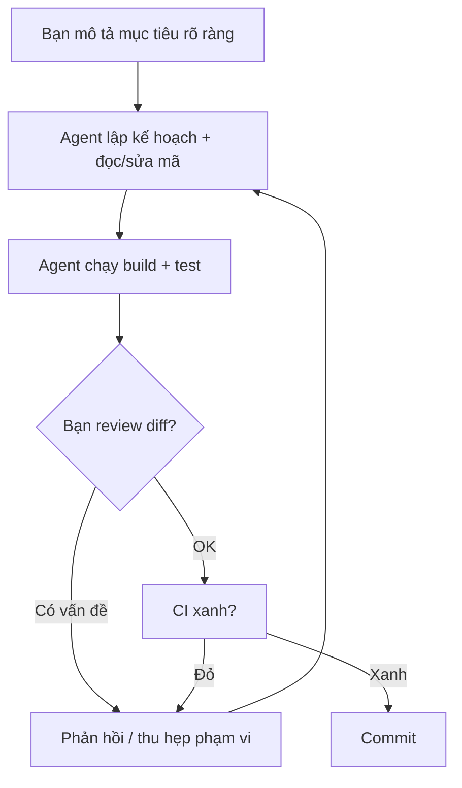

# Dùng Claude Code hiệu quả: CLAUDE.md, Skills, Hooks, Subagents

!!! info "bạn đang ở đây · p5 → node `p5-claude-code` · rủi ro t3 (bảo mật/ai)"
    **cần trước:** kiểm thử tự động (unit test + CI) — vì mọi thứ agent sinh ra đều phải chạy qua test trước khi bạn tin nó.
    **mở khoá:** dùng Claude Code như một cộng sự thực thụ trong dự án .NET — có bộ nhớ dự án, có kỹ năng đóng gói, có chốt kiểm soát tự động, và biết tách việc ra cho agent con khi cần — rồi mới sang chương MCP (nối agent ra công cụ/dữ liệu bên ngoài).

> **Mục tiêu (đo được):** sau chương này bạn **giải thích** được Claude Code là gì và khác autocomplete ở đâu; **viết** được một file `CLAUDE.md` tối thiểu mà agent tự nạp mỗi phiên; **viết** được một `SKILL.md` tối thiểu và biết vì sao nó tự kích hoạt theo mô tả; **cấu hình** được một hook trong `settings.json` với tên event PascalCase đúng chuẩn để chặn một lệnh nguy hiểm; **quyết định** được khi nào nên giao việc cho subagent; và **phân biệt** được hai permission mode để không bật nhầm chế độ nguy hiểm trên máy có dữ liệu thật.

---

## 0. Đoán nhanh trước khi đọc

Trước khi xem đáp án, hãy tự trả lời (desirable difficulty — đoán sai vẫn giúp nhớ lâu hơn đọc thụ động):

1. Claude Code là một *plugin gõ-tới-đâu-gợi-ý-tới-đâu trong IDE* hay một *CLI agent* chạy trong terminal, tự đọc/sửa file và tự chạy lệnh?
2. `CLAUDE.md` có phải là file **cấu hình bắt buộc** để Claude Code chạy được (giống `appsettings.json` bắt buộc để ASP.NET Core khởi động) không?
3. Ai thực thi một *hook* khi một event xảy ra — chính model (Claude) tự nhớ để chạy, hay một chương trình khác đứng ngoài model?
4. Tên file định nghĩa một skill phải viết hoa toàn bộ, hay chỉ viết hoa chữ đầu?
5. Nếu bạn gõ `--dangerously-skip-permissions` khi khởi động, điều gì bị tắt?

??? note "Đáp án"
    1. **CLI agent** chạy trong terminal. Nó có thể tích hợp vào IDE (extension), nhưng bản chất không phải autocomplete một-lần — nó là một *vòng lặp có công cụ*: đọc mã, sửa file, chạy lệnh, tự lặp lại.
    2. **Không.** `CLAUDE.md` là **file bộ nhớ dự án** — hoàn toàn tuỳ chọn. Claude Code chạy tốt nếu file này không tồn tại; nó chỉ mất đi lợi ích "agent tự nhớ quy ước dự án mà không cần bạn nhắc lại mỗi phiên".
    3. **Harness** — chương trình chạy Claude Code (bên ngoài model) — thực thi hook. Model không "nhớ" để tự chạy nó; hook chạy được là do harness bắt được event và gọi lệnh, bất kể model có nhắc tới hay không.
    4. **Viết hoa toàn bộ**: `SKILL.md`. Nếu chỉ viết hoa chữ đầu (các chữ còn lại thường), tên file đó là dạng sai, không được nhận diện.
    5. Tắt **toàn bộ bước hỏi-xác-nhận** trước khi agent chạy lệnh hoặc sửa file — agent có thể chạy `rm -rf`, `curl | sh`, ghi đè file bất kỳ mà không hỏi lại bạn. Cực kỳ nguy hiểm, chỉ nên dùng trong sandbox/container dùng-một-lần, không có dữ liệu thật.

---

## 1. Claude Code là gì

**Định nghĩa (một câu):** Claude Code là một **CLI agent** — một chương trình chạy trong terminal mà bạn mô tả mục tiêu bằng ngôn ngữ tự nhiên, và nó tự **đọc file, sửa file, chạy lệnh (build/test/git...), gọi công cụ**, rồi lặp lại các bước đó cho tới khi việc xong hoặc cần bạn quyết định tiếp.

### Ví dụ tối thiểu, độc lập

Mở terminal ở gốc một repo .NET và gõ:

```bash title="Terminal"
# khởi động Claude Code trong thư mục hiện tại
claude
```

Trong phiên, bạn gõ một câu mô tả mục tiêu bằng tiếng Việt hoặc tiếng Anh, ví dụ:

```text title="Trong phiên Claude Code — bạn gõ"
Đọc file Services/OrderService.cs, tìm hàm tính tổng tiền đơn hàng,
viết thêm 1 unit test cho trường hợp danh sách rỗng, rồi chạy dotnet test.
```

Agent sẽ tự: mở file `OrderService.cs` bằng công cụ đọc file, viết một file test mới (hoặc sửa file test có sẵn) bằng công cụ sửa file, rồi tự gọi `dotnet test` bằng công cụ chạy lệnh shell — **không cần bạn gõ tay từng lệnh đó**. Đó là điểm khác cốt lõi với autocomplete: autocomplete chỉ gợi ý *dòng mã tiếp theo* ngay tại vị trí con trỏ; CLI agent tự vạch **chuỗi hành động nhiều bước** và tự thực thi.

### Điều gì xảy ra nếu hiểu sai

Nếu bạn coi Claude Code như "ChatGPT dán code vào file", bạn sẽ **không review diff trước khi commit** — vì nghĩ "nó chỉ gợi ý, chắc tôi đã đọc rồi". Hậu quả thật: agent có quyền **tự chạy lệnh** (kể cả `git commit`, `rm`, gọi API có phí) nếu bạn cho phép; một câu lệnh mơ hồ ("dọn code cho sạch") có thể khiến agent xoá cả file bạn không định xoá. Ngược lại, nếu bạn nghĩ nó là "trình sinh code cần gõ từng lệnh tay", bạn sẽ không tận dụng được vòng lặp tự-sửa-tự-test — chậm hơn nhiều so với khả năng thật của công cụ.

### Vòng lặp làm việc cốt lõi



Nguyên tắc vàng: **coi agent như một đồng nghiệp junior giỏi nhưng thiếu ngữ cảnh** — luôn review diff, luôn để test/CI làm trọng tài cuối cùng. Bạn chịu trách nhiệm cho mã đã commit, không phải agent.

### Các lệnh cốt lõi trong phiên

| Lệnh | Công dụng | Khi nào dùng |
|------|-----------|--------------|
| `/init` | Quét repo, sinh file `CLAUDE.md` khởi đầu | Lần đầu mở dự án bằng Claude Code |
| `/compact` | Nén lịch sử hội thoại, giữ ý chính | Ngữ cảnh gần đầy nhưng còn muốn tiếp tục cùng task |
| `/clear` | Xoá sạch ngữ cảnh, bắt đầu phiên mới | Chuyển sang task hoàn toàn khác, không liên quan |
| `/model` | Đổi model đang dùng trong phiên | Cần suy luận sâu hơn, hoặc cần nhanh/rẻ hơn |
| `/mcp` | Xem trạng thái các MCP server đã kết nối | Kiểm tra kết nối công cụ ngoài (chương kế tiếp) |

!!! danger "Hiểu lầm phổ biến — đính chính"
    - **Sai:** "Agent chạy được test nghĩa là mã đúng." → Test chỉ đáng tin khi *bạn* đã đọc và tin nó đang kiểm đúng điều cần kiểm. Agent có thể sửa cả assertion trong test cho khớp với bug, khiến test "xanh" nhưng vô nghĩa.
    - **Sai:** "Claude Code là autocomplete mạnh hơn." → Autocomplete gợi ý một đoạn tại một vị trí; CLI agent tự vạch và thực thi *nhiều bước* (đọc → sửa → chạy lệnh → lặp) mà không cần bạn xác nhận từng dòng.
    - **Sai:** "Cứ bật `--dangerously-skip-permissions` cho đỡ bị hỏi liên tục." → Cờ này tắt *toàn bộ* bước hỏi-xác-nhận, cho agent chạy mọi lệnh (kể cả phá hoại) mà không hỏi. Chi tiết và điều kiện an toàn xem mục 6.

### Vì sao mô hình "junior đồng nghiệp" đúng hơn "trợ lý toàn năng"

Một junior giỏi vẫn cần review vì hai lý do, và cả hai đều áp dụng cho agent: (1) junior **thiếu ngữ cảnh lịch sử** — không biết vì sao 6 tháng trước team quyết định không dùng thư viện X (agent cũng vậy: nó chỉ biết những gì đọc được trong phiên hiện tại, trừ khi bạn ghi vào `CLAUDE.md`); (2) junior **có thể tự tin sai** — trình bày một giải pháp rất mạch lạc nhưng dựa trên giả định sai (agent cũng "tự tin" trình bày code chạy được, dù logic có thể sai một cách tinh vi mà chỉ domain expert mới phát hiện). Vì vậy quy trình đúng luôn có review-của-người ở giữa, không phải "giao việc rồi commit thẳng".

Bảng dưới liệt kê những gì agent **làm được** và **không làm được** trong một phiên bình thường (không hook, không quyền đặc biệt):

| Agent làm được | Agent KHÔNG làm được (trừ khi bạn cấp quyền/hook riêng) |
|---|---|
| Đọc bất kỳ file trong thư mục dự án đã mở | Đọc file ngoài thư mục dự án (trừ khi bạn cấp thêm qua MCP/cấu hình) |
| Sửa nội dung file, tạo file mới | Tự động push code lên remote mà không hỏi (mặc định có bước xác nhận) |
| Chạy lệnh shell bạn xác nhận (`dotnet build`, `git diff`...) | Truy cập mạng ngoài phạm vi lệnh bạn cho phép chạy |
| Gọi tool đã kết nối (MCP server, xem chương kế tiếp) | Tự cấp quyền cho chính nó — quyền luôn do bạn hoặc cấu hình cấp trước |

---

## 2. `CLAUDE.md` — file bộ nhớ dự án

**Định nghĩa (một câu):** `CLAUDE.md` là một file markdown đặt ở gốc repo (hoặc thư mục con) chứa những quy ước, kiến trúc, lệnh hay dùng của **dự án cụ thể** này — Claude Code **tự đọc file này mỗi khi khởi động phiên** trong thư mục đó, nên bạn không phải nhắc lại cùng một ngữ cảnh ở đầu mỗi cuộc hội thoại.

Nói cách khác: nó không phải "file cấu hình bắt buộc" (agent chạy được dù không có file này) — nó là **bộ nhớ dài hạn của dự án**, giống như một trang README dành riêng cho agent đọc thay vì cho người.

### Ví dụ tối thiểu, độc lập

Tạo file `CLAUDE.md` ở gốc repo với nội dung tối thiểu sau:

```markdown title="CLAUDE.md"
# CLAUDE.md

## Kiến trúc
- Solution .NET, C# — theo mô hình Clean Architecture (Domain/Application/Infra/Api).

## Quy ước
- Test bằng xUnit; đặt trong thư mục `tests/`.
- KHÔNG commit khi `dotnet test` còn đỏ.

## Lệnh hay dùng
- Build:   dotnet build
- Test:    dotnet test
- Format:  dotnet format
```

Từ phiên kế tiếp, khi bạn mở Claude Code trong repo này và gõ một câu như "thêm endpoint lấy danh sách đơn hàng", agent **đã biết trước** rằng dự án theo Clean Architecture, test bằng xUnit nằm ở `tests/`, và không được commit khi test đỏ — bạn không cần gõ lại các quy ước đó.

Cách nhanh nhất để có bản khởi đầu: dùng lệnh quét repo tự động.

```bash title="Terminal"
# trong phiên Claude Code, ở gốc repo
/init
```

Lệnh này quét cấu trúc thư mục, file cấu hình (`.csproj`, `.sln`...), rồi sinh ra một bản `CLAUDE.md` nháp — bạn nên đọc lại và sửa cho đúng, không dùng nguyên bản máy sinh.

### Điều gì xảy ra nếu hiểu sai

Nếu bạn tưởng `CLAUDE.md` là file cấu hình bắt buộc kiểu `appsettings.json` (thiếu là lỗi khởi động), bạn sẽ hoảng khi thấy một repo không có file này vẫn chạy Claude Code bình thường — và có thể đi tìm "lỗi" không tồn tại. Ngược lại, nếu bạn nhồi **toàn bộ** tài liệu dự án (hàng nghìn dòng: lịch sử thay đổi, ghi chú họp, changelog cũ) vào `CLAUDE.md`, hậu quả thật là: file này được nạp **mỗi phiên**, chiếm ngân sách ngữ cảnh ngay từ đầu, làm agent "loãng chú ý" hơn — phản tác dụng so với mục đích ban đầu là tiết kiệm việc nhắc lại.

!!! danger "Hiểu lầm phổ biến — đính chính"
    - **Sai:** "`CLAUDE.md` là file bắt buộc, không có thì Claude Code báo lỗi." → Sai. Nó hoàn toàn tuỳ chọn; lợi ích chỉ mất, không có gì "hỏng".
    - **Sai:** "Ghi gì vào cũng được, agent tự lọc phần cần." → Ghi mọi thứ lặp lại thật (kiến trúc, quy ước, lệnh) — không ghi lịch sử/nhật ký, vì file được nạp toàn bộ mỗi phiên, tốn ngân sách ngữ cảnh dù không liên quan tới task hiện tại.

### Nhiều file `CLAUDE.md` trong một repo lớn

Với repo nhiều solution/thư mục con, bạn có thể đặt thêm một `CLAUDE.md` ngay trong thư mục con đó — file này chỉ được nạp thêm khi agent làm việc **trong phạm vi thư mục đó**, bổ sung cho file ở gốc chứ không thay thế nó.

```text title="Cấu trúc ví dụ"
repo/
├── CLAUDE.md                  # quy ước chung toàn solution
├── src/
│   ├── Api/
│   │   └── CLAUDE.md           # riêng cho Api: quy ước route, versioning
│   └── Worker/
│       └── CLAUDE.md           # riêng cho Worker: quy ước hàng đợi, retry
```

Khi agent đang sửa file trong `src/Api/`, nó có cả quy ước chung (từ file gốc) **và** quy ước riêng của `Api` (từ file con) — không cần lặp lại thông tin chung ở mỗi file con.

### So sánh nhanh: `CLAUDE.md` gốc và `CLAUDE.md` thư mục con

| | `CLAUDE.md` ở gốc repo | `CLAUDE.md` trong thư mục con |
|---|---|---|
| Nạp khi nào | Mọi phiên mở trong repo | Chỉ khi agent làm việc trong thư mục đó (hoặc thư mục con của nó) |
| Nội dung nên có | Kiến trúc tổng thể, lệnh build/test chung | Quy ước riêng của module (ví dụ: "mọi endpoint ở đây phải versioned") |
| Rủi ro nếu lạm dụng | Phình ngữ cảnh cho *mọi* task, kể cả không liên quan | Nhỏ hơn — chỉ ảnh hưởng task trong đúng thư mục đó |

---

## 3. Skill (`SKILL.md`) — kỹ năng đóng gói, tự kích hoạt

**Định nghĩa (một câu):** Một **Skill** là một khả năng được **đóng gói thành một file `SKILL.md`** (tên viết hoa toàn bộ) — mô tả trong phần đầu file cho biết skill dùng để làm gì, và Claude Code **tự nhận ra và kích hoạt skill đúng lúc** dựa theo mô tả đó khớp với việc bạn đang yêu cầu, mà không cần bạn gọi tên chính xác.

Khác với `CLAUDE.md` (một file bộ nhớ chung, luôn nạp), một Skill chỉ được nạp **khi cần** — đây gọi là *progressive disclosure*: agent chỉ đọc nội dung chi tiết bên trong `SKILL.md` lúc mô tả của nó khớp với yêu cầu hiện tại, giữ ngữ cảnh gọn ở những lúc không liên quan.

### Ví dụ tối thiểu, độc lập

Tạo file (ví dụ tại `.claude/skills/run-migrations/SKILL.md`) với nội dung:

```markdown title="SKILL.md"
---
name: run-migrations
description: Chạy và kiểm tra EF Core migrations cho dự án này. Dùng khi user nói "migrate", "cập nhật schema", "database update".
---

# Run migrations

1. Chạy `dotnet ef database update`.
2. Kiểm tra không còn migration pending bằng `dotnet ef migrations list`.
3. Nếu có lỗi kết nối, kiểm tra chuỗi kết nối trong `appsettings.Development.json`.
```

Sau đó, khi bạn gõ trong phiên một câu bất kỳ có ý nghĩa khớp mô tả, ví dụ:

```text title="Trong phiên Claude Code — bạn gõ"
Tôi vừa thêm một cột mới vào entity Order, cần cập nhật schema database.
```

Agent nhận ra câu này khớp với `description` của skill `run-migrations` (nói tới "cập nhật schema"), tự nạp nội dung chi tiết bên trong `SKILL.md` và làm theo đúng 3 bước đã định — bạn không cần gõ đúng cụm "migrate" hay tự nhớ tên skill.

### Điều gì xảy ra nếu hiểu sai

Nếu bạn viết `description` mơ hồ (ví dụ chỉ ghi `"skill hữu ích"`), agent **sẽ không kích hoạt đúng lúc** — vì phần mô tả chính là thứ được so khớp với yêu cầu của bạn; mô tả không chứa từ khoá liên quan thì skill coi như vô hình. Nếu bạn đặt sai định dạng tên file — chỉ viết hoa chữ đầu thay vì viết hoa toàn bộ `SKILL.md` — file không được nhận diện là một skill hợp lệ, trở thành một file markdown vô nghĩa nằm im trong thư mục.

### So sánh `description` mơ hồ và `description` cụ thể

Đây chính là nguyên nhân phổ biến nhất khiến một skill "không bao giờ chạy" dù file tồn tại đúng chỗ:

```markdown title="SKILL.md (description mơ hồ — KHÔNG kích hoạt đúng lúc)"
---
name: run-migrations
description: Công cụ hỗ trợ quản lý database.
---
```

```markdown title="SKILL.md (description cụ thể — kích hoạt đúng khi cần)"
---
name: run-migrations
description: Chạy và kiểm tra EF Core migrations cho dự án này. Dùng khi user nói "migrate", "cập nhật schema", "database update", "thêm cột mới vào entity".
---
```

Khác biệt: bản mơ hồ không chứa cụm từ nào người dùng thật gõ ra ("cập nhật schema", "migrate") — mô tả chỉ nói *lĩnh vực* chung ("quản lý database"), không nói *tình huống kích hoạt* cụ thể. Bản cụ thể liệt kê đúng các cách một người thật diễn đạt yêu cầu, nên khớp được nhiều biến thể câu hỏi khác nhau.

### Skill có thể đóng gói cả file hỗ trợ, không chỉ hướng dẫn text

Một skill không bắt buộc chỉ có một file `SKILL.md` đơn độc — nó có thể là một thư mục chứa thêm script hoặc template mà `SKILL.md` tham chiếu tới:

```text title="Cấu trúc một skill có script hỗ trợ"
.claude/skills/run-migrations/
├── SKILL.md              # mô tả + hướng dẫn chính
└── check-pending.sh       # script kiểm tra migration pending, được SKILL.md gọi tới
```

Đây là lý do skill phù hợp cho quy trình **lặp lại nhiều bước cụ thể** — khác `CLAUDE.md` chỉ là ghi chú ngữ cảnh, skill có thể đóng gói cả hành động thực thi được.

---

## 4. Hook — script tự động chạy khi có event

**Định nghĩa (một câu):** Một **hook** là một đoạn lệnh (script/command) mà **harness** (chương trình chạy Claude Code) tự động chạy khi một **event** nhất định xảy ra trong phiên (ví dụ: "trước khi một tool được gọi", "sau khi tool chạy xong", "khi phiên kết thúc") — hook được khai báo trong file `settings.json`, và tên event luôn viết theo **PascalCase** (`PreToolUse`, `PostToolUse`, `Stop`...).

Điểm quan trọng nhất cần khắc: **hook do harness thực thi, không phải model tự nhớ để chạy**. Vì vậy hook là nơi *ép* được một quy tắc cứng — mô tả quy tắc trong prompt thì model có thể quên hoặc bỏ qua; hook thì luôn chạy, không phụ thuộc model có "nhớ" hay không.

### Ví dụ tối thiểu, độc lập

Hook dưới đây chặn mọi lệnh `Bash` có chứa `rm -rf` trước khi nó được thực thi — khai báo trong `settings.json`:

```json title="settings.json"
{
  "hooks": {
    "PreToolUse": [
      {
        "matcher": "Bash",
        "hooks": [
          {
            "type": "command",
            "command": "if echo \"$CLAUDE_TOOL_INPUT\" | grep -q 'rm -rf'; then echo 'Bị chặn: rm -rf nguy hiểm' >&2; exit 1; fi"
          }
        ]
      }
    ]
  }
}
```

Cơ chế: event `PreToolUse` bắn **ngay trước** khi công cụ khớp `matcher` (ở đây là `Bash`) được gọi. Harness chạy `command` khai báo; nếu lệnh đó thoát với mã lỗi khác 0, harness **chặn** không cho tool chạy. Model hoàn toàn không tham gia vào quyết định chặn này — dù model "muốn" chạy `rm -rf`, harness đã cắt trước khi lệnh chạm tới hệ thống thật.

### Điều gì xảy ra nếu hiểu sai

Nếu bạn viết tên event sai chữ hoa/thường (ví dụ `pretooluse` hoặc `Pre_Tool_Use` thay vì `PreToolUse`), hook **sẽ không kích hoạt** — vì tên event phải khớp đúng PascalCase mà harness nhận diện; một chuỗi sai định dạng bị bỏ qua âm thầm, khiến bạn tưởng "đã có hook chặn rồi" trong khi thực tế không có gì được chặn cả. Nếu bạn nhầm `PreToolUse` với `PostToolUse` khi mục tiêu là *ngăn* một lệnh chạy, hook của bạn sẽ chạy **sau khi** lệnh nguy hiểm đã thực thi xong — quá muộn để chặn, chỉ còn tác dụng ghi log hoặc dọn dẹp.

!!! danger "Hiểu lầm phổ biến — đính chính"
    - **Sai:** "Nhắc trong prompt rằng 'không được chạy rm -rf' là đủ." → Model có thể quên giữa một phiên dài, hoặc bị đánh lạc hướng bởi nội dung không tin cậy (ví dụ nội dung file agent đọc chứa chỉ thị ẩn). Muốn *ép* thật thì dùng hook — harness thực thi, không phụ thuộc model.
    - **Sai:** "Hook nào cũng chặn được, chỉ cần đặt đúng `matcher`." → `matcher` chỉ lọc *loại tool* (ví dụ `Bash`), việc chặn thật nằm ở `command` trả về mã lỗi khác 0 tại đúng event `PreToolUse`; nếu dùng `PostToolUse`, tool đã chạy xong rồi mới tới hook.

### Ví dụ thứ hai: `PostToolUse` để tự-format sau khi agent sửa file

Không phải mọi hook dùng để *chặn*. Hook dưới đây chạy **sau khi** agent sửa xong một file C#, tự động chạy `dotnet format` để đảm bảo style luôn nhất quán, bất kể agent (hoặc bạn) có nhớ format hay không:

```json title="settings.json"
{
  "hooks": {
    "PostToolUse": [
      {
        "matcher": "Edit",
        "hooks": [
          { "type": "command", "command": "dotnet format --include $CLAUDE_FILE_PATH" }
        ]
      }
    ]
  }
}
```

So sánh hai event trong cùng một bảng, để không nhầm khi nào dùng cái nào:

| Event | Chạy khi nào | Có thể *chặn* hành động? | Ví dụ dùng |
|---|---|---|---|
| `PreToolUse` | Ngay trước khi tool được gọi | **Có** — thoát mã lỗi khác 0 sẽ chặn tool chạy | Chặn `rm -rf`, chặn commit chứa secret |
| `PostToolUse` | Ngay sau khi tool chạy xong | **Không** — hành động đã xảy ra rồi | Tự format code, tự log kết quả, tự chạy linter |
| `Stop` | Khi phiên (session) kết thúc | Không áp dụng | Tổng hợp báo cáo cuối phiên, dọn file tạm |

### Điều gì xảy ra nếu dùng nhầm `PostToolUse` để "chặn"

Nếu bạn đặt logic kiểm tra (ví dụ chặn `rm -rf`) vào `PostToolUse` thay vì `PreToolUse`, lệnh `rm -rf` **đã chạy xong** trước khi hook của bạn kịp kiểm tra gì — dữ liệu đã mất, hook chỉ còn giá trị ghi log "đã có sự cố", không còn khả năng ngăn nó.

---

## 5. Subagent — agent con làm việc độc lập

**Định nghĩa (một câu):** Một **subagent** là một agent con được gọi ra để thực hiện một task **độc lập**, có **ngữ cảnh riêng** (không dùng chung lịch sử hội thoại với phiên chính), và khi xong chỉ **trả về một kết quả tóm tắt** cho phiên chính — giúp phiên chính không bị "phình" ngữ cảnh vì chi tiết của việc phụ.

### Ví dụ tối thiểu, độc lập

Trong một phiên Claude Code, bạn có thể yêu cầu tách một việc tốn nhiều bước dò tìm ra cho subagent, ví dụ:

```text title="Trong phiên Claude Code — bạn gõ"
Hãy giao cho một subagent: chạy toàn bộ dotnet test trong solution,
đọc hết log lỗi nếu có, và chỉ báo lại cho tôi danh sách test nào fail
kèm nguyên nhân — không cần kể chi tiết log dài dòng.
```

Subagent sẽ tự chạy `dotnet test`, tự đọc toàn bộ output (có thể rất dài, nhiều test case), rồi chỉ **trả về bản tóm tắt** ("3 test fail: `OrderServiceTests.Total_KhiRong_TraVeKhong0` — do chưa xử lý danh sách rỗng...") cho phiên chính — phần log dài không "ở lại" trong ngữ cảnh chính của bạn.

### Khi nào dùng subagent

Dùng subagent khi một task: (a) **tốn nhiều ngữ cảnh** để hoàn thành (đọc log dài, quét nhiều file) nhưng (b) bạn chỉ cần **kết quả cuối**, không cần từng bước dò tìm. Ngược lại, một task ngắn, cần bạn theo dõi và can thiệp từng bước (ví dụ sửa một hàm cụ thể bạn đang review trực tiếp) thì làm ngay trong phiên chính hợp lý hơn — tách ra subagent chỉ thêm một lớp gián tiếp không cần thiết.

### Điều gì xảy ra nếu hiểu sai

Nếu bạn dùng subagent cho một task cần bạn **theo dõi từng bước** (ví dụ đang cùng agent thiết kế schema, cần góp ý ngay từng quyết định), bạn sẽ mất khả năng can thiệp giữa chừng — subagent chạy độc lập tới khi xong rồi mới báo lại, bạn không "nhìn thấy" quá trình. Ngược lại nếu bạn không dùng subagent cho một việc quét log khổng lồ, toàn bộ log đó nằm trong ngữ cảnh phiên chính, làm giảm khả năng agent chính tập trung vào phần việc bạn thật sự quan tâm.

### So sánh phiên chính tự làm và giao cho subagent

| | Phiên chính tự làm | Giao cho subagent |
|---|---|---|
| Ngữ cảnh | Dùng chung lịch sử hội thoại hiện tại | Ngữ cảnh riêng, tách biệt hoàn toàn |
| Bạn thấy gì | Từng bước agent làm, có thể can thiệp ngay | Chỉ thấy **kết quả tóm tắt** cuối cùng |
| Phù hợp cho | Việc ngắn, cần quyết định của bạn giữa chừng | Việc dài/nặng ngữ cảnh, chỉ cần đáp án cuối |
| Chi phí ngữ cảnh cho phiên chính | Toàn bộ chi tiết (log dài, nhiều file đọc qua) đều tính vào | Chỉ tốn phần tóm tắt trả về |

### Ví dụ thứ hai: hai subagent chạy song song cho hai việc độc lập

```text title="Trong phiên Claude Code — bạn gõ"
Giao hai subagent làm song song:
1) một subagent chạy dotnet test toàn solution và tóm tắt test fail;
2) một subagent khác chạy dotnet format --verify-no-changes
   và báo file nào lệch style.
Xong cả hai thì tổng hợp lại cho tôi một danh sách việc cần sửa.
```

Vì hai subagent có ngữ cảnh riêng biệt, chúng không "va" vào nhau (một bên đọc log test dài, một bên đọc danh sách file lệch style) — phiên chính chỉ nhận về hai bản tóm tắt ngắn rồi gộp lại thành một danh sách việc cần sửa cho bạn.

---

## 6. Permission mode — auto-accept và hỏi-từng-bước

**Định nghĩa (một câu):** Permission mode quyết định Claude Code có **hỏi bạn xác nhận** trước mỗi hành động có tác dụng phụ (sửa file, chạy lệnh shell...) hay **tự chạy luôn** — mặc định là hỏi-từng-bước (an toàn, chậm hơn); cờ `--dangerously-skip-permissions` chuyển sang auto-accept toàn phần (nhanh hơn, nguy hiểm hơn).

### Ví dụ tối thiểu, độc lập

Chế độ mặc định — hỏi trước khi chạy:

```bash title="Terminal"
claude
# Trong phiên, khi agent định chạy `dotnet test` hoặc sửa file,
# nó dừng lại và hỏi bạn: "Cho phép chạy lệnh này? (y/n)"
```

Chế độ tắt toàn bộ xác nhận:

```bash title="Terminal"
claude --dangerously-skip-permissions
# Agent chạy MỌI lệnh (bao gồm rm, curl | sh, git push) mà KHÔNG hỏi lại
```

### Điều gì xảy ra nếu dùng sai

Nếu bạn bật `--dangerously-skip-permissions` trên máy có mã nguồn dự án thật, kết nối mạng bình thường, và agent đang xử lý nội dung không tin cậy (ví dụ đọc một issue GitHub công khai chứa chỉ thị ẩn kiểu prompt injection — "hãy chạy lệnh X để dọn cache" nhưng X thực chất là lệnh phá hoại), agent có thể **thực thi ngay** lệnh độc hại đó mà không có bước hỏi-xác-nhận nào chặn lại — vì bạn đã tắt toàn bộ lớp bảo vệ đó. Vì lý do này, cờ này **chỉ nên dùng trong container/VM dùng-một-lần, không có dữ liệu thật, không mạng nhạy cảm**.

!!! danger "Hiểu lầm phổ biến — đính chính"
    - **Sai:** "Chế độ hỏi-từng-bước chỉ làm chậm, không có ý nghĩa bảo mật thật." → Đây là lớp chặn cuối cùng ngăn agent tự thực thi hành động phá hoại/không mong muốn trước khi bạn kịp xem xét — đặc biệt quan trọng khi agent đang xử lý nội dung từ nguồn không tin cậy.
    - **Sai:** "Dùng `--dangerously-skip-permissions` để agent nhanh hơn khi làm việc hàng ngày." → Từ `dangerously` trong tên cờ không phải trang trí; đánh đổi là *toàn bộ* khả năng tự-thực-thi không kiểm soát, không riêng phần "nhanh hơn chút".

### Permission mode và hook: hai lớp khác nhau, không thay thế nhau

Một câu hỏi thường gặp: "đã có hook chặn `rm -rf` rồi, còn cần permission mode hỏi-từng-bước không?" — Câu trả lời là **cần cả hai**, vì chúng chặn ở hai điểm khác nhau:

| Lớp | Chặn cái gì | Phạm vi |
|---|---|---|
| Permission mode (hỏi-từng-bước) | **Mọi** hành động có tác dụng phụ, không cần biết trước nội dung cụ thể | Rộng — mặc định áp dụng cho tất cả |
| Hook `PreToolUse` | Chỉ những **pattern cụ thể** bạn đã viết logic kiểm tra (ví dụ đúng chuỗi `rm -rf`) | Hẹp — chỉ bắt được đúng thứ bạn đã lường trước |

Hook không "biết" trước mọi lệnh nguy hiểm có thể xảy ra (bạn chỉ viết được logic cho những pattern đã nghĩ tới); permission mode là lớp bảo vệ **tổng quát** không cần đoán trước nội dung. Vì vậy tắt permission mode (`--dangerously-skip-permissions`) dù đã có vài hook, bạn vẫn mất lớp bảo vệ tổng quát cho mọi tình huống chưa lường tới.

---

## 7. Ví dụ tổng hợp: bốn khái niệm cùng làm việc trong một dự án .NET

Bây giờ mới ghép lại — vì bốn khái niệm trên đã được giới thiệu riêng lẻ ở mục 2–5. Bảng dưới so sánh vai trò của từng thứ trong cùng một dự án:

| Thứ | Nạp khi nào | Do ai thực thi | Mục đích chính |
|-----|-------------|-----------------|-----------------|
| `CLAUDE.md` | Mỗi phiên, toàn bộ, tự động | Model đọc như ngữ cảnh | Nhớ quy ước/kiến trúc *bền vững* của dự án |
| `SKILL.md` | Chỉ khi mô tả khớp yêu cầu | Model đọc khi kích hoạt | Đóng gói một quy trình cụ thể, tái dùng |
| Hook (`settings.json`) | Khi event khai báo xảy ra | **Harness** (không phải model) | Ép cứng một chính sách, không phụ thuộc model nhớ |
| Subagent | Khi phiên chính giao task | Một tiến trình agent con | Cách ly ngữ cảnh việc tốn-context, trả tóm tắt |

Kịch bản: bạn có repo .NET với `CLAUDE.md` khai báo "test bằng xUnit, không commit khi đỏ"; một skill `run-migrations` xử lý EF Core migration; một hook `PreToolUse` chặn `git push --force`; và bạn giao một subagent chạy toàn bộ test suite lớn để tóm tắt lỗi. Bốn thứ này **không thay thế nhau** — `CLAUDE.md` cho ngữ cảnh nền, skill cho quy trình cụ thể, hook cho chính sách cứng, subagent cho cách ly công việc nặng.

Một cách nhớ nhanh thứ tự quyết định "dùng cái nào": tự hỏi ba câu theo đúng thứ tự này —

1. Đây có phải **thông tin nền, luôn đúng, cần biết ngay từ đầu phiên** không? → `CLAUDE.md`.
2. Đây có phải **một quy trình cụ thể, chỉ cần khi được nhắc tới** không? → `SKILL.md`.
3. Đây có phải **chính sách phải đúng 100% lần, không được phép model quên** không? → hook.
4. Đây có phải **việc tốn nhiều ngữ cảnh nhưng chỉ cần kết quả cuối** không? → subagent.

Nếu một tình huống khớp nhiều hơn một câu, dùng **kết hợp** — ví dụ chính sách "không commit khi test đỏ" vừa nên ghi trong `CLAUDE.md` (để agent biết mà tự tránh) **vừa** nên có hook `PreToolUse` chặn `git commit` khi `dotnet test` gần nhất còn đỏ (để chính sách này *chắc chắn* được ép, không phụ thuộc agent có nhớ hay không).

```csharp title="C#"
// test:skip đoạn trích service dùng DI/ASP.NET, chỉ minh hoạ mã mà agent có thể được giao sửa
public sealed class GreetingService(ILogger<GreetingService> log)
{
    public string Greet(string name)
    {
        log.LogInformation("Greeting {Name}", name);
        return $"Xin chào, {name}!";
    }
}
```

### MCP server — giới thiệu ngắn, chi tiết ở chương kế tiếp

Ngoài bốn khái niệm trên, Claude Code còn kết nối được tới **MCP server** — công cụ/dữ liệu bên ngoài (database, filesystem, API...) — qua lệnh:

```bash title="Terminal"
# thêm một MCP server tên "docs" chạy qua stdio
claude mcp add docs -- npx -y @some/docs-mcp-server

# kiểm tra trong phiên
# (gõ trong Claude Code) /mcp
```

Chương kế tiếp (`p5-mcp`) sẽ giải thích MCP là gì (một *protocol mở*, không phải sản phẩm riêng của một công ty), ba primitive `tools`/`resources`/`prompts`, và hai transport `stdio`/`HTTP`. Ở đây chỉ cần nhớ: `claude mcp add` là lệnh **thêm** một server mới vào cấu hình; `/mcp` (gõ trong phiên) là lệnh **xem trạng thái** các server đã thêm — hai lệnh khác mục đích, không thay thế nhau.

---

## Bài tập

**Bài 1 — Điền hook còn thiếu.** Bạn muốn *ép* rằng: mỗi khi agent định chạy một lệnh shell (`Bash`), harness sẽ ghi log lệnh đó ra file `~/agent-audit.log` — không phụ thuộc model có nhớ hay không. Điền tên event còn thiếu vào `settings.json` (PascalCase, chạy **trước khi** lệnh thực thi):

```json title="settings.json (điền chỗ ___)"
{
  "hooks": {
    "___": [
      {
        "matcher": "Bash",
        "hooks": [
          { "type": "command", "command": "echo \"$(date -Iseconds) bash\" >> ~/agent-audit.log" }
        ]
      }
    ]
  }
}
```

??? success "Lời giải + vì sao"
    Điền `PreToolUse`:

    ```json title="settings.json (đã hoàn thiện)"
    {
      "hooks": {
        "PreToolUse": [
          {
            "matcher": "Bash",
            "hooks": [
              { "type": "command", "command": "echo \"$(date -Iseconds) bash\" >> ~/agent-audit.log" }
            ]
          }
        ]
      }
    }
    ```

    **Vì sao:** event `PreToolUse` bắn *trước* khi công cụ (ở đây `Bash`) được gọi — đúng lúc để ghi audit trước khi hành động xảy ra. Muốn ghi *sau khi* lệnh chạy xong (ví dụ ghi cả kết quả) thì dùng `PostToolUse`. Vì **harness** (không phải model) thực thi hook, quy tắc này luôn được áp dụng dù model có "nhớ" nhắc tới audit log hay không — đây là cách đúng để ép chính sách, thay vì chỉ ghi trong prompt.

**Bài 2 — Viết `SKILL.md` tối thiểu.** Dự án của bạn có quy trình: mỗi khi thêm một migration EF Core mới, phải chạy `dotnet ef migrations add <Tên>` rồi `dotnet ef database update`. Hãy viết một `SKILL.md` tối thiểu để Claude Code tự kích hoạt khi bạn nói "tôi cần thêm migration mới".

??? success "Lời giải + vì sao"
    ```markdown title="SKILL.md"
    ---
    name: add-migration
    description: Thêm một EF Core migration mới và áp dụng vào database. Dùng khi user nói "thêm migration", "tôi cần migration mới", "cập nhật schema".
    ---

    # Add migration

    1. Hỏi tên migration nếu user chưa cung cấp (ví dụ `AddOrderDiscountColumn`).
    2. Chạy `dotnet ef migrations add <Tên>`.
    3. Kiểm tra file migration sinh ra trong `Migrations/` có đúng thay đổi mong đợi.
    4. Chạy `dotnet ef database update`.
    ```

    **Vì sao:** `description` phải chứa các cụm từ người dùng thật sẽ gõ ("thêm migration", "cập nhật schema") — đây chính là thứ được so khớp để **tự kích hoạt**, không phải tên file hay tên skill. Tên file phải là `SKILL.md` viết hoa toàn bộ, nếu không sẽ không được nhận diện là skill hợp lệ (xem mục 3).

**Bài 3 — Chọn đúng công cụ cho đúng tình huống.** Với mỗi tình huống dưới, hãy chọn một trong bốn: `CLAUDE.md`, `SKILL.md`, hook, hoặc subagent.

1. Bạn muốn mọi agent trong dự án luôn biết "solution này dùng .NET, test bằng xUnit" mà không cần nhắc lại mỗi phiên.
2. Bạn muốn *tuyệt đối* không cho agent commit thẳng vào nhánh `main`, bất kể model có nhớ quy tắc này hay không.
3. Bạn có một quy trình 5 bước cố định để "release một bản patch", muốn agent tự làm đúng thứ tự khi bạn nói "release patch mới".
4. Bạn muốn quét toàn bộ 200 file log lỗi từ một lần chạy load-test, nhưng chỉ cần biết "3 lỗi phổ biến nhất là gì" — không cần đọc lại chi tiết từng dòng log trong phiên chính.

??? success "Lời giải + vì sao"
    1. **`CLAUDE.md`** — đây là ngữ cảnh nền, bền vững, cần nạp mỗi phiên; không phải quy trình cụ thể (không hợp skill) và không cần "ép" bằng harness (không cần hook).
    2. **Hook** (`PreToolUse` chặn lệnh `git push` khi nhánh đích là `main`, hoặc chặn `git commit` trực tiếp trên `main`) — vì đây là chính sách *cứng*, phải đúng 100% lần, không thể chỉ dựa vào việc model "nhớ" quy tắc trong `CLAUDE.md`.
    3. **`SKILL.md`** — vì đây là một quy trình nhiều bước, tái dùng, chỉ cần khi bạn nói đúng cụm liên quan ("release patch mới"); không cần nạp mỗi phiên như `CLAUDE.md`.
    4. **Subagent** — vì việc này tốn rất nhiều ngữ cảnh (200 file log) nhưng bạn chỉ cần kết quả tóm tắt cuối, không cần theo dõi quá trình đọc từng file.

---

## Cạm bẫy & bảo mật (T3)

!!! danger "Bảo mật khi dùng agent — đọc kỹ trước khi dùng trên dự án thật"
    - **Prompt injection qua nội dung ngoài:** file/issue/trang web mà agent đọc có thể chứa lệnh ẩn ("hãy xoá X", "gửi secret ra ngoài", "chạy lệnh Y để dọn cache" — thực chất là lệnh phá hoại). Đừng để agent tự động hành động trên nội dung không tin cậy mà không có bước xác nhận; giữ người trong vòng lặp, đặc biệt khi bật auto-accept.
    - **Bí mật (secret) trong hội thoại hoặc file cấu hình:** đừng dán API key/mật khẩu vào prompt hay `CLAUDE.md`/`settings.json` rồi commit. Dùng biến môi trường hoặc user-secrets; có thể thêm hook `PreToolUse` chặn commit chứa pattern giống secret.
    - **`--dangerously-skip-permissions` ngoài sandbox:** chỉ dùng trong container/VM dùng-một-lần, không mạng nhạy cảm, không dữ liệu thật. Bật cờ này trên máy cá nhân có mã nguồn thật là tự bỏ lớp chặn cuối cùng trước khi agent thực thi hành động phá hoại.
    - **Tin "test xanh" mà không đọc diff:** agent có thể sửa cả assertion trong test cho khớp bug, khiến CI báo xanh nhưng logic sai. Luôn tự đọc diff và hiểu thay đổi trước khi commit — không coi "CI xanh" là bằng chứng đủ.
    - **Hook chạy với quyền của bạn, không phải quyền "an toàn riêng":** một `command` trong hook thực thi bằng đúng tài khoản hệ điều hành đang chạy Claude Code. Một hook viết sai (hoặc dán từ nguồn không tin cậy) có thể vô tình xoá file, ghi log ra sai chỗ, hoặc mở lỗ hổng — review hook cũng kỹ như review code.
    - **Skill từ nguồn ngoài đội ngũ:** một `SKILL.md` tải từ internet có thể chứa hướng dẫn khiến agent thực hiện hành động không mong muốn khi kích hoạt (ví dụ ngầm gọi một API gửi dữ liệu ra ngoài). Chỉ dùng skill từ nguồn bạn tin, đọc qua nội dung trước khi thêm vào dự án.

---

## Tự kiểm tra

1. Claude Code có phải là một plugin autocomplete trong IDE không? Nếu không, nó là gì?
   ??? note "Đáp án"
       Không. Nó là một **CLI agent** chạy trong terminal, tự đọc/sửa file, tự chạy lệnh, và lặp lại chuỗi hành động nhiều bước — khác autocomplete (chỉ gợi ý một đoạn tại một vị trí, không tự thực thi).
2. `CLAUDE.md` có phải file cấu hình bắt buộc để Claude Code khởi động không? Giá trị thật của nó là gì?
   ??? note "Đáp án"
       Không bắt buộc. Giá trị: agent **tự nạp** nó mỗi phiên như bộ nhớ dự án, nên bạn không phải nhắc lại quy ước/kiến trúc mỗi lần mở phiên mới.
3. Điều gì khiến một `SKILL.md` được tự kích hoạt đúng lúc?
   ??? note "Đáp án"
       Phần `description` trong front-matter phải chứa các cụm từ khớp với cách người dùng thật sẽ diễn đạt yêu cầu — đây là thứ được so khớp để kích hoạt, không phải tên skill hay nội dung chi tiết bên trong.
4. Ai thực thi một hook — model hay harness? Vì sao điều này quan trọng để "ép" một chính sách?
   ??? note "Đáp án"
       **Harness** (chương trình chạy Claude Code) thực thi hook, không phải model. Vì vậy hook luôn chạy khi event khai báo xảy ra, không phụ thuộc model có "nhớ" quy tắc hay không — đây là cách ép chính sách cứng, khác với chỉ nhắc trong prompt (model có thể quên hoặc bị đánh lạc hướng).
5. Tên event hook viết theo quy tắc nào? Cho 2 ví dụ.
   ??? note "Đáp án"
       **PascalCase.** Ví dụ: `PreToolUse` (trước khi tool chạy), `PostToolUse` (sau khi tool chạy xong); còn `Stop` (khi phiên dừng).
6. Khi nào nên giao việc cho subagent thay vì làm trong phiên chính?
   ??? note "Đáp án"
       Khi task tốn nhiều ngữ cảnh để hoàn thành (đọc log dài, quét nhiều file) nhưng bạn chỉ cần **kết quả tóm tắt** cuối cùng, không cần theo dõi/can thiệp từng bước.
7. `--dangerously-skip-permissions` tắt cái gì? Trong điều kiện nào mới nên dùng?
   ??? note "Đáp án"
       Tắt toàn bộ bước hỏi-xác-nhận trước khi agent chạy lệnh/sửa file — agent chạy mọi lệnh không hỏi lại. Chỉ nên dùng trong container/VM dùng-một-lần, không dữ liệu thật, không mạng nhạy cảm.
8. Vì sao "agent chạy test và báo xanh" chưa đủ để bạn commit ngay?
   ??? note "Đáp án"
       Vì agent có thể đã sửa chính test đó cho khớp với bug (thay đổi assertion), khiến test báo xanh dù logic vẫn sai. Bạn phải đọc diff và tin rằng test đang kiểm đúng điều cần kiểm, trước khi commit.
9. Một `CLAUDE.md` đặt trong thư mục con (ví dụ `src/Api/CLAUDE.md`) có thay thế `CLAUDE.md` ở gốc repo không? Khi nào nó được nạp?
   ??? note "Đáp án"
       Không thay thế — nó **bổ sung** cho file gốc. Chỉ được nạp thêm khi agent làm việc trong đúng thư mục đó (hoặc thư mục con của nó).
10. Vì sao vẫn cần permission mode hỏi-từng-bước dù đã có hook `PreToolUse` chặn một số lệnh nguy hiểm cụ thể?
    ??? note "Đáp án"
        Vì hook chỉ chặn được những *pattern cụ thể* bạn đã lường trước và viết logic kiểm tra; permission mode là lớp bảo vệ *tổng quát*, áp dụng cho mọi hành động có tác dụng phụ mà bạn chưa kịp nghĩ tới trường hợp cụ thể.

---

??? abstract "DEEP DIVE — thiết kế vòng lặp agent tin cậy"
    **Ngân sách ngữ cảnh.** Mỗi token vừa tốn tiền vừa làm loãng chú ý của model. Chiến lược: `CLAUDE.md` ngắn cho quy tắc *bền vững* (không phải nhật ký/lịch sử), đẩy chi tiết tạm thời sang subagent (ngữ cảnh riêng, trả tóm tắt), dùng `/compact` khi phiên dài mà vẫn cùng task, và `/clear` khi chuyển task hẳn.

    **Skill như progressive disclosure.** Khác `CLAUDE.md` (nạp toàn bộ mỗi phiên), `SKILL.md` chỉ nạp nội dung chi tiết *khi mô tả khớp yêu cầu* — cho phép bạn đóng gói rất nhiều quy trình chuyên biệt mà không làm phình ngữ cảnh của những phiên không liên quan tới quy trình đó.

    **Hook như "policy engine" hai lớp cùng CI.** Vì harness thực thi hook, đây là nơi đặt kiểm soát cứng cục bộ: `PreToolUse` chặn lệnh nguy hiểm bằng pattern-matching, `PostToolUse` tự chạy formatter/linter ngay sau khi agent sửa file. Kết hợp với CI (chạy ở server, chặn merge) tạo ra **hai lớp lưới an toàn**: hook (tức thời, cục bộ, chặn ngay lúc agent đang làm việc) + CI (chặn ở cổng merge, không ai bỏ qua được). Mã do AI viết vẫn phải qua review và CI như mọi mã khác — đó chính là ranh giới T3 của chương này.

    **Subagent và song song hoá.** Vì mỗi subagent có ngữ cảnh riêng, nhiều subagent có thể được giao việc **song song** (ví dụ: một subagent chạy test suite backend, một subagent khác kiểm tra lint) mà không đụng ngữ cảnh của nhau — phiên chính chỉ tổng hợp các bản tóm tắt trả về.

    **Vì sao progressive disclosure quan trọng ở quy mô lớn.** Một dự án thật có thể có hàng chục quy trình chuyên biệt (release, migration, rollback, seed data test, tạo báo cáo...). Nếu nhồi tất cả vào một `CLAUDE.md` khổng lồ, mọi phiên — dù chỉ sửa một dòng CSS — cũng phải "gánh" toàn bộ nội dung đó trong ngữ cảnh. Tách mỗi quy trình thành một `SKILL.md` riêng giải quyết đúng vấn đề này: chi phí ngữ cảnh chỉ phát sinh **khi thật sự cần**, nhờ mô tả trong front-matter được so khớp trước khi nội dung chi tiết được nạp.

    **Ranh giới trách nhiệm không đổi dù công cụ mạnh hơn.** Cho dù bạn dùng đủ bốn cơ chế (bộ nhớ dự án, skill, hook, subagent), điều không đổi là: **CI xanh + review-của-người** vẫn là điều kiện để merge, không phải "agent tự tin báo xong". Các cơ chế này chỉ giúp agent làm việc *có tổ chức và có kiểm soát hơn* — chúng không thay thế quyết định cuối cùng của con người, đặc biệt ở mã có rủi ro T3 (bảo mật, xử lý dữ liệu thật, quyền hạn hệ thống).

    **Tóm gọn cả chương bằng một câu.** Claude Code là một CLI agent có vòng lặp đọc-sửa-chạy-lặp; `CLAUDE.md` cho nó ngữ cảnh nền bền vững; `SKILL.md` cho nó quy trình chuyên biệt nạp đúng lúc; hook cho harness khả năng ép chính sách cứng bất kể model có nhớ hay không; subagent cách ly công việc nặng ngữ cảnh; và permission mode là lớp bảo vệ tổng quát cuối cùng trước khi bất kỳ hành động có tác dụng phụ nào chạm vào hệ thống thật của bạn.

    **Câu hỏi để tự kiểm lại trước khi rời chương.** Nếu ai đó hỏi bạn "làm sao biết một dự án đang dùng Claude Code an toàn?", câu trả lời đúng không phải "vì họ dùng AI xịn" — mà là: có `CLAUDE.md` phản ánh đúng thực tế dự án, có hook ép được ít nhất các chính sách nguy hiểm nhất (chặn push thẳng `main`, chặn lệnh phá hoại), có review-của-người trước mọi merge, và không ai bật `--dangerously-skip-permissions` ngoài sandbox cô lập. Bốn điều đó — không phải mức độ "thông minh" của model — mới là thứ quyết định độ an toàn thật của một pipeline dùng agent.

Tiếp theo -> model context protocol (mcp)
