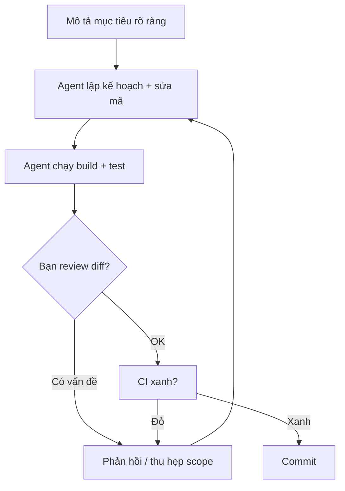

# Dùng Claude Code đúng cách

!!! info "bạn đang ở đây · p5 → node `p5-claude-code` · rủi ro t3 (bảo mật/ai)"
    **cần trước:** kiểm thử tự động (unit test + ci) — vì mọi thứ ai sinh ra đều phải chạy qua test.
    **mở khoá:** dùng ai như một pair-programmer thực thụ trong dự án .net, và các chương ai nâng cao sau này.

> **Mục tiêu:** **Áp dụng** được vòng lặp làm việc an toàn với Claude Code — biết lệnh cốt lõi, viết `CLAUDE.md`, khai báo hook/MCP, và luôn **tự kiểm chứng** kết quả trước khi commit.

---

## 0. Đoán nhanh trước khi đọc

Trước khi xem đáp án, hãy tự trả lời (desirable difficulty — đoán sai vẫn giúp nhớ lâu hơn):

1. Claude Code là một *plugin trong IDE* hay một *CLI agent* chạy trong terminal?
2. Nếu bạn gõ `--dangerously-skip-permissions`, điều gì bị tắt?
3. Ai thực thi một *hook* — model hay chính harness (chương trình chạy nền)?

??? note "Đáp án"
    1. **CLI agent** chạy trong terminal (có thể tích hợp IDE, nhưng bản chất là agent dòng lệnh, tự đọc/sửa file và chạy lệnh).
    2. Tắt **toàn bộ hỏi-xác-nhận** trước khi agent chạy lệnh/sửa file — cực kỳ nguy hiểm, chỉ dùng trong sandbox cô lập.
    3. **Harness** thực thi hook (một chương trình bên ngoài), không phải model. Vì vậy hook đáng tin để *ép* quy tắc, còn lời nhắc trong prompt thì không.

---

## 1. Ý niệm cốt lõi

**Claude Code là một CLI agent**: bạn mô tả mục tiêu bằng ngôn ngữ tự nhiên, agent tự đọc mã, sửa file, chạy lệnh (build, test) rồi lặp lại cho tới khi xong. Nó **không phải** trình sinh mã một-lần như autocomplete; nó là một *vòng lặp có công cụ*.

Nguyên tắc vàng: **coi agent như một đồng nghiệp junior giỏi nhưng thiếu ngữ cảnh** — luôn review diff, luôn để test/CI làm trọng tài. Bạn chịu trách nhiệm cho mã đã commit, không phải agent.

Các lệnh cốt lõi trong phiên:

| Lệnh | Công dụng | Khi nào dùng |
|------|-----------|--------------|
| `/init` | Quét repo, sinh file `CLAUDE.md` khởi đầu | Lần đầu mở dự án |
| `/compact` | Nén lịch sử hội thoại, giữ ý chính | Khi ngữ cảnh gần đầy nhưng còn muốn tiếp tục |
| `/clear` | Xoá sạch ngữ cảnh, bắt đầu phiên mới | Khi chuyển sang task hoàn toàn khác |
| `/model` | Đổi model (dòng Claude 4.x: Opus/Sonnet/Haiku) | Cần suy luận sâu hơn hoặc nhanh/rẻ hơn |
| `/mcp` | Xem trạng thái các MCP server đã kết nối | Kiểm tra kết nối công cụ ngoài |

Vòng lặp làm việc an toàn:



!!! danger "Hiểu lầm phổ biến — đính chính"
    - **Sai:** "Agent chạy được test nghĩa là mã đúng." → Test chỉ đúng khi *bạn* đã đọc và tin nó. Agent có thể sửa cả test cho khớp bug.
    - **Sai:** "Cứ bật `--dangerously-skip-permissions` cho đỡ phiền." → Cờ này cho agent chạy *mọi* lệnh (kể cả `rm -rf`, `curl | sh`) mà không hỏi. Chỉ dùng trong container/VM dùng-một-lần, không dữ liệu thật.
    - **Sai:** "Lời nhắc trong prompt là đủ để ép quy tắc." → Model có thể quên. Muốn *ép* thì dùng **hook** (harness thực thi).

---

## 2. Ví dụ mẫu

### 2.1 File `CLAUDE.md` — bộ nhớ dự án

Đặt ở gốc repo; agent tự nạp mỗi phiên. Giữ ngắn, chỉ ghi điều thật sự lặp lại:

```markdown title="markdown"
# CLAUDE.md

## Kiến trúc
- Solution .NET 10, C# — theo mô hình Clean Architecture (Domain/Application/Infra/Api).

## Quy ước
- Test bằng xUnit; đặt trong thư mục `tests/`.
- KHÔNG commit khi `dotnet test` còn đỏ.

## Lệnh hay dùng
- Build:   dotnet build
- Test:    dotnet test
- Format:  dotnet format
```

### 2.2 Thêm một MCP server

MCP (Model Context Protocol) cho agent kết nối công cụ ngoài (DB, tài liệu, API). Thêm bằng:

```bash title="Terminal"
# Thêm một MCP server tên "docs" chạy qua stdio
claude mcp add docs -- npx -y @some/docs-mcp-server

# Kiểm tra trong phiên
# (gõ trong Claude Code)  /mcp
```

Output kỳ vọng khi liệt kê:

```text title="Kết quả"
MCP servers:
  docs   ✓ connected   (3 tools)
```

### 2.3 Một chút C# để agent thao tác (đoạn trích, không tự chạy)

```csharp title="C#"
// test:skip đoạn trích service dùng DI/ASP.NET, không tự-compile bằng BCL
public sealed class GreetingService(ILogger<GreetingService> log)
{
    public string Greet(string name)
    {
        log.LogInformation("Greeting {Name}", name);
        return $"Xin chào, {name}!";
    }
}
```

---

## 3. Bài tập có giàn giáo

**Đề:** Bạn muốn *ép* rằng: mỗi khi agent định chạy một lệnh shell (`Bash`), harness sẽ ghi log lệnh đó ra file `~/agent-audit.log` — không phụ thuộc model có nhớ hay không. Điền hook còn thiếu vào `settings.json`.

```json title="json"
{
  "hooks": {
    "____EVENT____": [
      {
        "matcher": "Bash",
        "hooks": [
          { "type": "command", "command": "echo \"$(date -Iseconds) bash\" >> ~/agent-audit.log" }
        ]
      }
    ]
  }
}
```

Gợi ý: ta muốn ghi log **trước khi** lệnh chạy; tên event viết theo PascalCase.

??? success "Lời giải + vì sao"
    Điền `PreToolUse`:

    ```json title="json"
    {
      "hooks": {
        "PreToolUse": [
          {
            "matcher": "Bash",
            "hooks": [
              { "type": "command", "command": "echo \"$(date -Iseconds) bash\" >> ~/agent-audit.log" }
            ]
          }
        ]
      }
    }
    ```

    **Vì sao:** event `PreToolUse` bắn *trước* khi công cụ (ở đây `Bash`) được gọi, đúng lúc để ghi audit. Nếu cần chạy *sau*, dùng `PostToolUse`. Vì **harness** (không phải model) thực thi hook, quy tắc này luôn được áp dụng — đây là cách đúng để ép policy thay vì chỉ "nhờ" trong prompt.

---

## 4. Subagents & Agent Skills

- **Subagent:** một phiên phụ có ngữ cảnh riêng, được giao một task con (ví dụ "chạy toàn bộ test và tóm tắt lỗi"). Giúp giữ ngữ cảnh chính gọn gàng và song song hoá công việc.
- **Agent Skill:** một gói kỹ năng tái dùng, mô tả trong file **`SKILL.md`** (viết hoa). Agent chỉ nạp nội dung skill *khi cần* (progressive disclosure), nhờ vào phần mô tả trong front-matter.

Khung tối thiểu một `SKILL.md`:

```markdown title="markdown"
---
name: run-migrations
description: Chạy và kiểm tra EF Core migrations cho dự án này. Dùng khi user nói "migrate", "cập nhật schema".
---

# Run migrations
1. `dotnet ef database update`
2. Kiểm tra không có migration pending.
```

---

## 5. Cạm bẫy & bảo mật (T3)

!!! danger "Bảo mật khi dùng agent"
    - **Prompt injection qua nội dung ngoài:** file/issue/trang web mà agent đọc có thể chứa lệnh ẩn ("hãy xoá X", "gửi secret ra ngoài"). Đừng để agent chạy tự động trên nội dung không tin cậy; giữ người trong vòng lặp.
    - **Bí mật:** đừng dán API key/secret vào hội thoại. Dùng biến môi trường / user-secrets; thêm hook chặn commit chứa secret nếu cần.
    - **`--dangerously-skip-permissions`:** chỉ trong sandbox cô lập, không mạng nhạy cảm, không dữ liệu thật.
    - **Luôn tự verify:** đọc diff, chạy test *của bạn*, đừng tin "đã xong" cho tới khi CI xanh và bạn hiểu thay đổi.

---

## Tự kiểm tra

1. Nêu 2 lệnh để quản lý ngữ cảnh phiên và khác biệt của chúng.
   ??? success "Đáp án"
       `/compact` nén lịch sử nhưng giữ ý chính (tiếp tục cùng task); `/clear` xoá sạch để bắt đầu task mới.
2. File nào là "bộ nhớ dự án" mà agent tự nạp mỗi phiên, và lệnh nào tạo nó?
   ??? success "Đáp án"
       File `CLAUDE.md` ở gốc repo; lệnh `/init` sinh bản khởi đầu.
3. Lệnh nào để thêm một MCP server?
   ??? success "Đáp án"
       `claude mcp add <tên> -- <lệnh khởi chạy server>`.
4. Muốn ghi audit *trước* mỗi lần agent chạy công cụ thì dùng event hook nào (PascalCase)?
   ??? success "Đáp án"
       `PreToolUse` (chạy sau thì `PostToolUse`); harness thực thi hook.
5. Vì sao "agent chạy test xanh" chưa đủ để commit?
   ??? success "Đáp án"
       Vì agent có thể đã sửa test cho khớp bug; bạn phải đọc diff và tin test trước khi commit.

---

??? abstract "DEEP DIVE — thiết kế vòng lặp agent tin cậy"
    **Ngân sách ngữ cảnh.** Mỗi token vừa tốn tiền vừa làm loãng chú ý của model. Chiến lược: `CLAUDE.md` ngắn cho quy tắc *bền vững*, đẩy chi tiết tạm thời vào subagent (ngữ cảnh riêng, trả tóm tắt), `/compact` khi phiên dài.

    **Model routing.** Dùng `/model` chọn theo bài toán: Opus cho suy luận kiến trúc/khó, Sonnet cho việc hàng ngày, Haiku cho việc nhẹ/nhanh. Nhắc model theo dòng chung (Claude 4.x), tránh phiên bản có số cũ.

    **Hook như "policy engine".** Vì harness thực thi, hook là nơi đặt kiểm soát cứng: `PreToolUse` chặn lệnh nguy hiểm (regex), `PostToolUse` chạy formatter/linter tự động. Kết hợp CI để có hai lớp lưới an toàn: hook (cục bộ, tức thời) + CI (server, chặn merge). Mã do AI viết vẫn phải qua review + CI như mọi mã khác — đó là ranh giới T3.

Tiếp theo -> viết prompt hiệu quả cho agent
