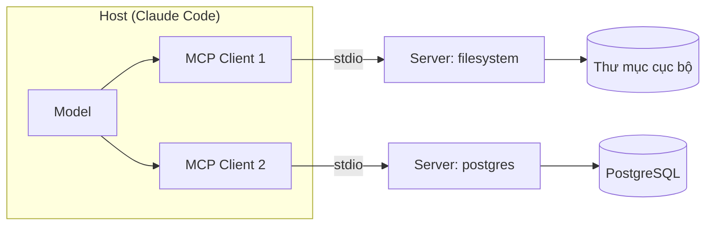

# Model Context Protocol (MCP)

!!! info "bạn đang ở đây · p5 → node `p5-mcp` · rủi ro t3 (bảo mật/ai)"
    **cần trước:** dùng claude code đúng cách — vì mcp chính là cách agent nối ra thế giới bên ngoài.
    **mở khoá:** cắm công cụ và nguồn dữ liệu thật (filesystem, database, github…) vào agent một cách an toàn, có kiểm soát quyền.

> **Mục tiêu:** **Áp dụng** được MCP để gắn một server công cụ vào Claude Code — hiểu ba primitive, chọn đúng transport, thêm server bằng lệnh CLI, và cấu hình theo nguyên tắc **quyền tối thiểu**.

---

## 0. Đoán nhanh trước khi đọc

Trước khi xem đáp án, hãy tự trả lời (desirable difficulty — đoán sai vẫn giúp nhớ lâu hơn):

1. Nếu có **N** model AI và **M** công cụ, không có chuẩn chung thì phải viết bao nhiêu tích hợp? Có chuẩn chung thì còn bao nhiêu?
2. MCP có ba primitive. Cái nào do **model chủ động gọi**, cái nào do **ứng dụng/người dùng chọn**?
3. Một server MCP chạy dưới dạng tiến trình con trên máy bạn sẽ dùng transport nào?

??? note "Đáp án"
    1. Không chuẩn: **N × M** tích hợp (mỗi model nối tay tới mỗi công cụ). Có MCP: **N + M** — mỗi bên chỉ nói một ngôn ngữ chung.
    2. **Tools** do model chủ động gọi (có tác dụng phụ). **Resources** và **Prompts** thường do ứng dụng/người dùng chọn và nạp vào ngữ cảnh.
    3. **stdio** — giao tiếp qua stdin/stdout của tiến trình con. Server ở xa (qua mạng) thì dùng transport **HTTP**.

---

## 1. Ý niệm cốt lõi

**MCP là một chuẩn mở** (giao thức dựa trên JSON-RPC) để một *host* chạy AI — như Claude Code — kết nối tới các *server* cung cấp công cụ và dữ liệu. Thay vì mỗi ứng dụng AI viết tích hợp riêng cho từng công cụ, mọi bên nói chung một giao thức.

Đây là bài toán **N × M → N + M**: chuẩn hoá đầu nối giống như cổng USB-C — một chuẩn cắm được mọi thiết bị.

### Ba primitive

| Primitive | Ai điều khiển | Mục đích | Ví dụ |
|-----------|---------------|----------|-------|
| **Tools** | Model (model-controlled) | Hành động có tác dụng phụ | `query_database`, `create_issue`, `write_file` |
| **Resources** | Ứng dụng (app-controlled) | Dữ liệu chỉ-đọc nạp vào ngữ cảnh | nội dung file, bản ghi DB, tài liệu |
| **Prompts** | Người dùng (user-controlled) | Mẫu lời nhắc dựng sẵn | `/review-pr`, `/summarize` |

### Kiến trúc



Host tạo một *client* riêng cho mỗi server. Client và server bắt tay (handshake), trao đổi danh sách primitive, rồi model mới biết có công cụ gì để gọi.

### Hai transport

- **stdio** — server chạy như tiến trình con ngay trên máy bạn; host viết vào stdin, đọc từ stdout. Nhanh, không lộ ra mạng, hợp cho công cụ cục bộ.
- **HTTP** (streamable HTTP) — server chạy ở xa, host gọi qua mạng. Hợp cho dịch vụ chung nhiều người dùng, nhưng **bắt buộc** phải có xác thực và TLS.

!!! danger "Hiểu lầm phổ biến — đính chính"
    "Đã cài MCP server thì AI làm gì cũng được." **Sai và nguy hiểm.** Server chỉ có đúng quyền bạn cấp: đường dẫn được phép, tài khoản DB, scope token. Một server bên thứ ba độc hại có thể *đọc trộm dữ liệu* hoặc *tiêm chỉ thị* (prompt injection) qua nội dung nó trả về. Luôn cấp **quyền tối thiểu** và chỉ chạy server bạn tin cậy.

---

## 2. Ví dụ mẫu

Thêm một server filesystem cục bộ (transport stdio) vào Claude Code bằng CLI:

```bash title="Terminal"
# cú pháp: claude mcp add <tên> -- <lệnh chạy server>
claude mcp add filesystem -- npx -y @modelcontextprotocol/server-filesystem /Users/me/projects

# xem các server đã khai báo
claude mcp list
```

Lệnh trên ghi cấu hình vào file JSON của dự án. Nội dung tương đương:

```json title=".mcp.json"
{
  "mcpServers": {
    "filesystem": {
      "command": "npx",
      "args": ["-y", "@modelcontextprotocol/server-filesystem", "/Users/me/projects"]
    },
    "postgres": {
      "command": "npx",
      "args": ["-y", "@modelcontextprotocol/server-postgres"],
      "env": {
        "DATABASE_URL": "postgresql://readonly@localhost:5432/appdb"
      }
    },
    "github": {
      "command": "npx",
      "args": ["-y", "@modelcontextprotocol/server-github"],
      "env": {
        "GITHUB_PERSONAL_ACCESS_TOKEN": "${GITHUB_TOKEN}"
      }
    }
  }
}
```

Chú ý ba điểm an toàn trong ví dụ trên:

- `filesystem` chỉ được trao **một thư mục gốc** (`/Users/me/projects`), không phải cả ổ đĩa.
- `postgres` dùng tài khoản **readonly** — server không thể `DROP TABLE`.
- `github` đọc token từ **biến môi trường** (`${GITHUB_TOKEN}`) chứ không nhúng chuỗi bí mật vào file cấu hình bị commit.

```text title="Kết quả (claude mcp list)"
filesystem   stdio   ✓ connected   (3 tools, 1 resource)
postgres     stdio   ✓ connected   (2 tools)
github       stdio   ✓ connected   (14 tools)
```

Sau khi kết nối, model có thể gọi tool `read_file` của server filesystem — nhưng chỉ trong thư mục đã cấp.

---

## 3. Bài tập có giàn giáo

**Yêu cầu:** Bạn cần cho agent đọc issue trên GitHub nhưng **tuyệt đối không** được sửa gì. Hãy điền phần cấu hình còn thiếu để đảm bảo quyền tối thiểu.

```json title=".mcp.json (điền chỗ ___)"
{
  "mcpServers": {
    "github": {
      "command": "npx",
      "args": ["-y", "@modelcontextprotocol/server-github"],
      "env": {
        "GITHUB_PERSONAL_ACCESS_TOKEN": "___"
      }
    }
  }
}
```

Gợi ý: token quyết định server làm được gì; scope của token mới là ranh giới thực sự, không phải tên server.

??? success "Lời giải + vì sao"
    ```json title=".mcp.json (đã hoàn thiện)"
    {
      "mcpServers": {
        "github": {
          "command": "npx",
          "args": ["-y", "@modelcontextprotocol/server-github"],
          "env": {
            "GITHUB_PERSONAL_ACCESS_TOKEN": "${GITHUB_READONLY_TOKEN}"
          }
        }
      }
    }
    ```
    **Vì sao:** ranh giới quyền nằm ở **scope của Personal Access Token**, không ở tên server. Bạn tạo một token *fine-grained* chỉ có quyền `Issues: Read-only` trên đúng repo cần thiết, rồi nạp qua biến môi trường. Dù model có "muốn" gọi tool tạo/sửa issue, GitHub API sẽ từ chối vì token không đủ scope. Nguyên tắc: **thực thi quyền ở lớp thấp nhất** (API/DB/OS), đừng tin vào lời nhắc trong prompt.

---

## 4. Cạm bẫy bảo mật (đọc kỹ — trang T3)

- **Prompt injection qua nội dung:** dữ liệu server trả về (issue, trang web, bản ghi) có thể chứa chỉ thị ẩn nhằm điều khiển model. Coi mọi nội dung bên ngoài là **không tin cậy**; đừng để model tự động chạy hành động phá huỷ dựa trên nội dung đó.
- **Server bên thứ ba:** cài server từ nguồn lạ = cho phép chạy mã tuỳ ý trên máy bạn với quyền của bạn. Chỉ dùng server có mã nguồn xem được và được cộng đồng tin cậy; ghim phiên bản.
- **Bí mật rò rỉ:** không nhúng token/mật khẩu vào `.mcp.json` rồi commit. Dùng biến môi trường và thêm file bí mật vào `.gitignore`.
- **Quá quyền:** trao readonly khi chỉ cần đọc; giới hạn thư mục, scope, tài khoản DB. Rộng bao nhiêu thì thiệt hại khi bị lạm dụng lớn bấy nhiêu.

---

## Tự kiểm tra

1. MCP giải bài toán tích hợp từ độ phức tạp nào xuống độ phức tạp nào?
2. Trong ba primitive, primitive nào do model chủ động gọi và thường có tác dụng phụ?
3. Lệnh CLI nào dùng để thêm một server MCP vào Claude Code?
4. Vì sao không nên nhúng token trực tiếp vào `.mcp.json`?
5. Đâu là ranh giới quyền thực sự của một server truy cập database?

??? question "Đáp án"
    1. Từ **N × M** xuống **N + M** — nhờ một giao thức chung thay cho các tích hợp tay đôi.
    2. **Tools** — do model điều khiển, thực hiện hành động có tác dụng phụ (ghi file, gọi API, sửa DB).
    3. `claude mcp add <tên> -- <lệnh chạy server>`.
    4. Vì file cấu hình dễ bị commit vào git → rò rỉ bí mật. Dùng biến môi trường (`${VAR}`) và `.gitignore` cho file chứa secret.
    5. **Quyền của tài khoản DB / scope kết nối** (ví dụ user readonly) — thực thi ở lớp database, không phụ thuộc lời nhắc gửi model.

---

??? abstract "DEEP DIVE — bên trong giao thức"
    **JSON-RPC 2.0:** MCP dùng JSON-RPC làm lớp thông điệp. Sau khi kết nối, host gửi `initialize`, rồi `tools/list`, `resources/list`, `prompts/list` để khám phá năng lực. Khi model quyết định gọi tool, host gửi `tools/call` với tên tool + tham số; server trả kết quả (hoặc lỗi có cấu trúc).

    **Vòng đời & khám phá động:** server có thể phát thông báo `notifications/tools/list_changed` khi tập tool thay đổi lúc chạy, để host cập nhật lại danh sách mà không cần khởi động lại.

    **Streamable HTTP thay cho SSE cũ:** transport HTTP hiện đại gộp request/response và luồng sự kiện trên một endpoint, hỗ trợ khôi phục phiên. Khi triển khai HTTP, luôn kèm xác thực (OAuth/bearer token), TLS, và giới hạn tỉ lệ (rate limit).

    **Viết server bằng .NET:** có SDK MCP cho C# giúp khai báo tool bằng attribute. Đoạn dưới cần package ngoài nên chỉ để minh hoạ:

    ```csharp title="C#"
    // test:skip cần package MCP C# SDK (ModelContextProtocol) — chỉ minh hoạ
    [McpServerToolType]
    public static class TimeTools
    {
        [McpServerTool, Description("Trả về giờ UTC hiện tại theo ISO-8601.")]
        public static string GetUtcNow() => DateTime.UtcNow.ToString("O");
    }
    ```

    Host chạy trên .NET {{ dotnet.current }} với C# {{ csharp.version }}; server có thể truy vấn PostgreSQL {{ postgres.current }} qua tài khoản readonly như ví dụ ở mục 2.

Tiếp theo -> agent và công cụ nâng cao
